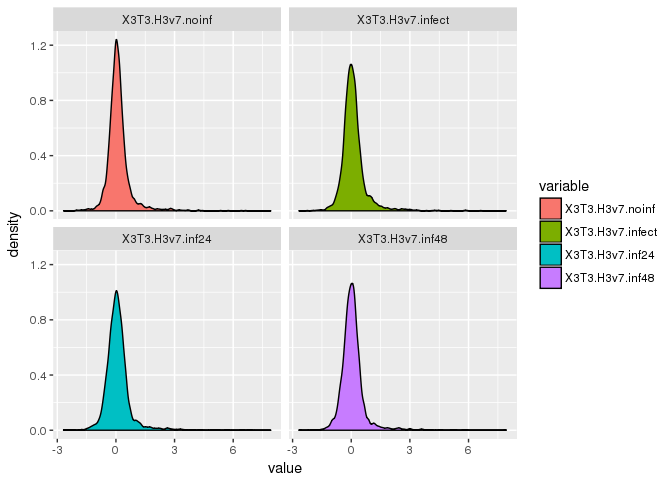

# ChIP/ATAC-seq analysis for H3mm7


```r
source("RScript/geomNorm.R")
source("RScript/glmodel.R")
source("RScript/DESeq2Workflow.R")
```

```
## 
## Attaching package: 'dplyr'
```

```
## The following objects are masked from 'package:data.table':
## 
##     between, first, last
```

```
## The following objects are masked from 'package:stats':
## 
##     filter, lag
```

```
## The following objects are masked from 'package:base':
## 
##     intersect, setdiff, setequal, union
```

```
## Loading required package: S4Vectors
```

```
## Loading required package: stats4
```

```
## Loading required package: BiocGenerics
```

```
## Loading required package: parallel
```

```
## 
## Attaching package: 'BiocGenerics'
```

```
## The following objects are masked from 'package:parallel':
## 
##     clusterApply, clusterApplyLB, clusterCall, clusterEvalQ,
##     clusterExport, clusterMap, parApply, parCapply, parLapply,
##     parLapplyLB, parRapply, parSapply, parSapplyLB
```

```
## The following objects are masked from 'package:dplyr':
## 
##     combine, intersect, setdiff, union
```

```
## The following objects are masked from 'package:stats':
## 
##     IQR, mad, xtabs
```

```
## The following objects are masked from 'package:base':
## 
##     Filter, Find, Map, Position, Reduce, anyDuplicated, append,
##     as.data.frame, cbind, colnames, do.call, duplicated, eval,
##     evalq, get, grep, grepl, intersect, is.unsorted, lapply,
##     lengths, mapply, match, mget, order, paste, pmax, pmax.int,
##     pmin, pmin.int, rank, rbind, rownames, sapply, setdiff, sort,
##     table, tapply, union, unique, unsplit, which, which.max,
##     which.min
```

```
## 
## Attaching package: 'S4Vectors'
```

```
## The following objects are masked from 'package:dplyr':
## 
##     first, rename
```

```
## The following objects are masked from 'package:data.table':
## 
##     first, second
```

```
## The following objects are masked from 'package:base':
## 
##     colMeans, colSums, expand.grid, rowMeans, rowSums
```

```
## Loading required package: IRanges
```

```
## 
## Attaching package: 'IRanges'
```

```
## The following objects are masked from 'package:dplyr':
## 
##     collapse, desc, slice
```

```
## The following object is masked from 'package:data.table':
## 
##     shift
```

```
## Loading required package: GenomicRanges
```

```
## Loading required package: GenomeInfoDb
```

```
## Loading required package: SummarizedExperiment
```

```
## Loading required package: Biobase
```

```
## Welcome to Bioconductor
## 
##     Vignettes contain introductory material; view with
##     'browseVignettes()'. To cite Bioconductor, see
##     'citation("Biobase")', and for packages 'citation("pkgname")'.
```

```r
source("RScript/functionalToys.R")

library(knitr)
library(DT)
library(biomaRt)
library(data.table)
library(dtplyr)
library(dplyr)
```


```r
firstzero <- function(x) which(sort(x)>0)[1]

makelabel <- function(x,sep="-")
  t %.% simplify2array %.% papp(strsplit,sep) %.% as.character %$% x

labelQ <- function(x,n=20) {
  qt <- seq(0,1,length=n+1)
  cut(x,
      include.lowest = TRUE,
      breaks = quantile(x,qt),
      labels = round(qt*100)[-1]
  )
}
```


```r
ensembl <- useMart("ENSEMBL_MART_ENSEMBL",host="asia.ensembl.org")
mart <- useDataset("mmusculus_gene_ensembl",mart=ensembl)
e2g <- getBM(attributes = c("ensembl_gene_id","external_gene_name","gene_biotype"), mart = mart)
e2g <- dplyr::rename(e2g, ens_gene = ensembl_gene_id, ext_gene = external_gene_name, biotype = gene_biotype)
coding <- e2g$ens_gene[e2g$biotype == "protein_coding"]
```


```r
atac<-fread('data/countSubNuc20-150_GENCODEvM9_ATAC-NIH3T3_exonUp2k.edit.txt',skip=1,showProgress = FALSE)
mat <- as.matrix(atac[,-(1:6),with=FALSE])
colnames(mat) <- sub("lot12","lot2",colnames(mat))
rownames(mat) <- sub('\\..*$','',atac$Geneid)
mat <- mat[rowSums(mat)>0,]
tbN <- data.frame(t(simplify2array(strsplit(colnames(mat),'-')))[,-1])
colnames(tbN) <- c('clone','time','lot')
ddsN <- DESeqDataSetFromMatrix(mat,tbN,~time+clone)
modelN <- DESeq(ddsN,fitType = 'local')
```

```
## estimating size factors
```

```
## estimating dispersions
```

```
## gene-wise dispersion estimates
```

```
## mean-dispersion relationship
```

```
## final dispersion estimates
```

```
## fitting model and testing
```

```r
rlN <- rlog(modelN,blind=FALSE)
resN7 <- results(modelN,contrast = c('clone','H37','WT'))
resN3 <- results(modelN,contrast = c('clone','H33','WT'))
resN73 <- results(modelN,contrast = c('clone','H37','H33'))
tblN <- data.table(ens_gene=rownames(resN7),tbl_dt(resN7)) %>%
  filter(padj<0.1) %>% right_join(tbl_dt(e2g),.,by="ens_gene")
summary(resN7)
```

```
## 
## out of 44009 with nonzero total read count
## adjusted p-value < 0.1
## LFC > 0 (up)     : 228, 0.52% 
## LFC < 0 (down)   : 579, 1.3% 
## outliers [1]     : 0, 0% 
## low counts [2]   : 24744, 56% 
## (mean count < 3)
## [1] see 'cooksCutoff' argument of ?results
## [2] see 'independentFiltering' argument of ?results
```


```r
lN <- assay(rlN)
mN <- data.frame(t(simplify2array(strsplit(sub('3T3-','',colnames(lN)),'-'))))
colnames(mN) <- c("Cell","Time","Lot")
mN$Time <- factor(mN$Time,c('noinf','inf','D48'))
gD <- na.omit(with(resN7,rownames(resN7)[padj < 0.1 & log2FoldChange < 0]))
mN$Accessibility <- colMeans(lN[gD,])
ggplot(mN,aes(Time,Accessibility,group=Cell:Lot,colour=Cell,lty=Lot,shape=Cell)) +
  geom_point(size=3) + geom_line() + theme_bw() +
  scale_color_brewer(palette="Set1")
```

<!-- -->

```r
gU <- na.omit(with(resN7,rownames(resN7)[padj < 0.1 & log2FoldChange > 0]))
mN$Accessibility <- colMeans(lN[gU,])
ggplot(mN,aes(Time,Accessibility,group=Cell:Lot,colour=Cell,lty=Lot,shape=Cell)) +
  geom_point(size=3) + geom_line() + theme_bw() +
  scale_color_brewer(palette="Set1")
```

<!-- -->


```r
chipmat <- fread('data/countGENCODEvM9_3T3ChIPseq.edit.txt',skip=1,showProgress=FALSE)
chipseq <- chipmat %>% dplyr::select(-(1:6)) %>% as.matrix
colnames(chipseq) <- sub('GFP-','-',sub('^H3','',sub('^3T3-','',colnames(chipseq))))
rownames(chipseq) <- sub('\\..*$','',chipmat$Geneid)
chipseq <- chipseq[apply(chipseq,1,sum) > 0,]
chipseq <- gscale(as.matrix(chipseq)+1)
chipnames <- colnames(chipseq)[grep("input",colnames(chipseq),invert=TRUE)]
signal <- log2(chipseq[,chipnames]+1) - log2(chipseq[,sub('-[^-]*$','-input',chipnames)]+1)
signal <- data.table(ens_gene=rownames(signal),signal)
```


```r
ddsA <- chipmat %>% dplyr::select(-(1:6)) %>%
  DESeqDataSetFromMatrix(.,data.frame(colnames(.)),~1)
rldA <- rlog(ddsA,blind=FALSE,fitType="local")
chipseqd <- assay(rldA)
colnames(chipseqd) <- sub('GFP-','-',sub('^H3','',sub('^3T3-','',colnames(chipseqd))))
rownames(chipseqd) <- sub('\\..*$','',atac$Geneid)
chipseqd <- chipseqd[rowSums(chipseqd)>0,]
```


```r
signald <- chipseqd[,chipnames] - chipseqd[,sub('-[^-]*$','-input',chipnames)]
signald <- data.table(ens_gene=rownames(signald),signald)
asig <- inner_join(tbl_dt(e2g),signald,by="ens_gene") 
gfp <- signald %>% dplyr::select(ends_with("GFP")) %>% colnames
for(i in gfp[c(1,4)]){
  asig %>% dplyr::select_(GFP=as.symbol(i),"biotype") %>%
    summarize(GFP=labelQ(GFP),biotype) %>% table %>%
    plot(las=2,xlab="GFP percentile",main=i,col=brewer.pal(8,"Dark2"),border=FALSE)
}
```

<!-- --><!-- -->

```r
signald <- signald %>% dplyr::filter(ens_gene %in% coding)
```


NIH3T3 H3vOE
------------


```r
defn <- getdef("data/table_3T3RNAseq.txt")
ddsn <- getdds("data/countGENCODEvM9_3T3RNAseq.edit.txt",defn,~time+cond)
```

```
## estimating size factors
```

```
## estimating dispersions
```

```
## gene-wise dispersion estimates
```

```
## mean-dispersion relationship
```

```
## final dispersion estimates
```

```
## fitting model and testing
```

```r
rldn <- rlog(ddsn,blind=FALSE)
knitr::kable(colData(ddsn))
```

                   cond   time     rep    clone        sizeFactor
-----------------  -----  -------  -----  ----------  -----------
X3T3.WT.noinf      WT     noinf    Rep1   WT_Rep1       1.0082323
X3T3.WT.infect     WT     infect   Rep1   WT_Rep1       1.2420505
X3T3.WT.inf24      WT     inf24    Rep1   WT_Rep1       0.9808936
X3T3.WT.inf48      WT     inf48    Rep1   WT_Rep1       0.9110183
X3T3.H3v3.noinf    H3v3   noinf    Rep1   H3v3_Rep1     1.1716920
X3T3.H3v3.infect   H3v3   infect   Rep1   H3v3_Rep1     1.0533892
X3T3.H3v3.inf24    H3v3   inf24    Rep1   H3v3_Rep1     0.9724215
X3T3.H3v3.inf48    H3v3   inf48    Rep1   H3v3_Rep1     0.8092273
X3T3.H3v7.noinf    H3v7   noinf    Rep1   H3v7_Rep1     1.1884297
X3T3.H3v7.infect   H3v7   infect   Rep1   H3v7_Rep1     1.1936027
X3T3.H3v7.inf24    H3v7   inf24    Rep1   H3v7_Rep1     0.9042245
X3T3.H3v7.inf48    H3v7   inf48    Rep1   H3v7_Rep1     0.8198526


```r
set.seed(333)
resn <- results(ddsn,contrast=c("cond","H3v7","WT"))
tblns <- timecoursePlots(resn[resn$baseMean>100,],rldn,k=6)
```

```
## Warning in lda.default(x, grouping, ...): variables are collinear
```

<!-- --><!-- --><!-- -->

```r
#showDT(tblns)
```


```r
evalFC_NIH3T3 <- function(signal,tbl,density=FALSE){
  dat <- tbl %>% dplyr::select(ens_gene,cluster) %>% inner_join(signal,by='ens_gene')
  if(density) print(
    ggplot(reshape2::melt(dat),aes(value,fill=variable)) + 
    geom_density() + facet_wrap(~variable)
  )
  model <- glmodel(dat[,-(1:2),with=FALSE],model.matrix(~cluster+0,dat))
  m <- reshape2::melt(model$beta)
  lab <- makelabel(m$Var2,"\\.")
  colnames(lab) <- c("Cell","Cond","Time")
  m <- data.frame(lab,m)
  m$Time <- factor(m$Time,c("noinf","infect","inf24","inf48"))
  m$sdev <- as.numeric(sqrt(model$betavar))
  
  # Wald p with Bonferroni correction
  smark <- data.frame(lab,reshape2::melt(model$wald.p)) %>%
    filter(value * length(model$wald.p) < 1e-3) %>% dplyr::select(Time,Var1)
  
  print(
    ggplot(m,aes(Time,value,group=Var1,colour=Var1)) +
    geom_hline(yintercept=0,linetype=2) +
    geom_point(size=2) + geom_line() + ylab("log2FC") +
    theme_bw() + scale_color_brewer(palette="Set2") + ylim(-1.2,1.2) +
    geom_errorbar(aes(ymin=value-1.96*sdev,ymax=value+1.96*sdev),width=.3) +
    geom_text(aes(Time,0),label="*",size=8,colour="black",data=smark) +
    facet_wrap(~Var1,2,3)
  )
  
  invisible(dat)
}
```


```r
sig73 <- data.table(assay(rldn)[,9:12] - assay(rldn)[,5:8],keep.rownames = "ens_gene")
evalFC_NIH3T3(sig73,tblns,TRUE)
```

```
## Warning in melt.data.table(dat): To be consistent with reshape2's melt,
## id.vars and measure.vars are internally guessed when both are 'NULL'. All
## non-numeric/integer/logical type columns are conisdered id.vars, which in
## this case are columns [ens_gene, cluster]. Consider providing at least one
## of 'id' or 'measure' vars in future.
```

<!-- --><!-- -->


```r
sig7w <- data.table(assay(rldn)[,9:12] - assay(rldn)[,1:4],keep.rownames = "ens_gene")
evalFC_NIH3T3(sig7w,tblns) 
```

<!-- -->


```r
sig3w <- data.table(assay(rldn)[,5:8] - assay(rldn)[,1:4],keep.rownames = "ens_gene")
evalFC_NIH3T3(sig3w,tblns) 
```

```
## Warning: Removed 1 rows containing missing values (geom_errorbar).
```

<!-- -->


```r
m <- tblns %>%
  inner_join(signald,by="ens_gene") %>%
  dplyr::select(cluster,ends_with("-GFP")) %>%
  reshape2::melt(.)
```

```
## Warning in melt.data.table(.): To be consistent with reshape2's melt,
## id.vars and measure.vars are internally guessed when both are 'NULL'. All
## non-numeric/integer/logical type columns are conisdered id.vars, which in
## this case are columns [cluster]. Consider providing at least one of 'id' or
## 'measure' vars in future.
```

```r
label <- data.frame(makelabel(m$variable))
colnames(label) <- c("Cell","Time","ChIP")
label$Time <- factor(label$Time,c("G","00h","48h"))
m <- data.frame(m,label)
ggplot(m,aes(Time,value,fill=cluster)) +
  geom_boxplot() + facet_wrap(~Cell) + ylab("GFP") +
  theme_bw() + scale_fill_brewer(palette="Set2")
```

<!-- -->


```r
for(i in c("v3","v7")){
  for(j in c("G","00h","48h")){
    target <- paste(i,j,"GFP",sep="-")
    A <- tbl_dt(e2g) %>%
      dplyr::filter(biotype=="protein_coding") %>%
      inner_join(signald,by="ens_gene") %>%
      dplyr::select(-ends_with("H3v3")) %>%
      arrange_(as.symbol(target)) %>% 
      dplyr::select(contains(paste0("-",j,"-"))) %>%
      apply(2,function(x) lowess(x)$y) %>% as.matrix
    m <- reshape2::melt(A)
    label <- data.frame(makelabel(m$Var2))
    colnames(label) <- c("Cell","Time","ChIP")
    label$Time <- factor(label$Time,c("G","00h","48h"))
    m <- data.table(m,label)
    p <- ggplot(m,aes(Var1/20886*100,value,colour=Cell)) + 
      geom_hline(yintercept=0,col="grey",linetype=2) +
      geom_vline(xintercept=firstzero(A[,target])/nrow(A)*100,col="grey",linetype=2) +
      geom_line() + facet_wrap(~ChIP,scale="free_y",1,4) +
      theme_bw() + theme(legend.position="top") +
      xlab(sprintf("Percentile of %s",target)) +
      ylab("log2(ChIP/Input)") +
      scale_color_brewer(palette="Set2")
    print(p)
  }
}
```

<!-- --><!-- --><!-- --><!-- --><!-- --><!-- -->


```r
tbl <- tblns
levels(tbl$cluster) <- c("SA","UA","DB","DA","UB","SB")
m73 <- resN73 %>% tbl_df %>%
data.table(keep.rownames = "ens_gene") %>%
  right_join(tbl %>% dplyr::select(ens_gene, cluster, log2FC_E = log2FoldChange)) %>%
  dplyr::select(ens_gene, cluster, log2FC_E, log2FC_A = log2FoldChange, padj) %>%
  inner_join(e2g, .) %>% arrange(cluster)
```

```
## Warning in as.data.frame(x, row.names = NULL, optional = optional, ...):
## Arguments in '...' ignored
```

```
## Joining, by = "ens_gene"
## Joining, by = "ens_gene"
```

```r
p <- ggplot(m73, aes(log2FC_E, log2FC_A)) +
  geom_hline(yintercept = 0, linetype = 2) +
  geom_vline(xintercept = 0, linetype = 2) +
  geom_point(alpha = 0.1, size = 0.6) + theme_bw() +
  geom_point(
    aes(colour = cluster, size = -log10(padj)),
    data = m73 %>% dplyr::filter(padj < 0.1, cluster=="UA"),
    alpha = 0.6
  ) +
  xlab("Gene expression log2(H3mm7/Control)") +
  ylab("Chromatin accessibility log2(H3mm7+/H3.3+)") +
  scale_color_manual(values="#FC8D62")

print(p + coord_fixed() + theme(legend.position="top"))
```

```
## Warning: Removed 17 rows containing missing values (geom_point).
```

<!-- -->
