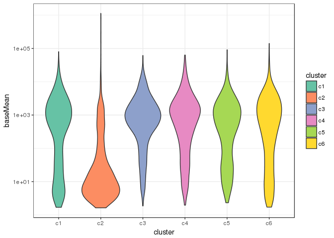
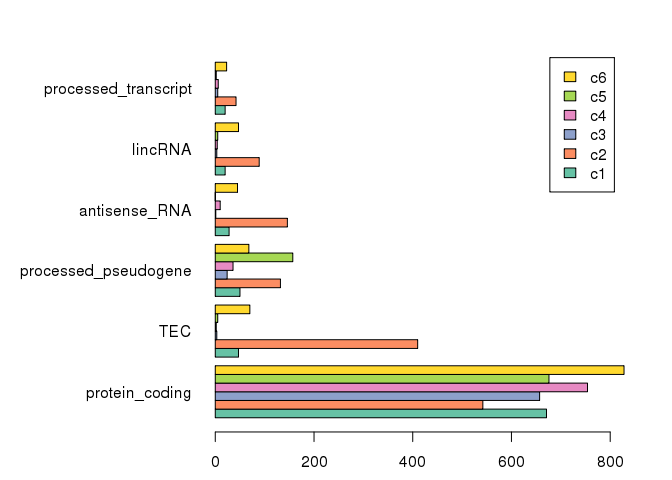
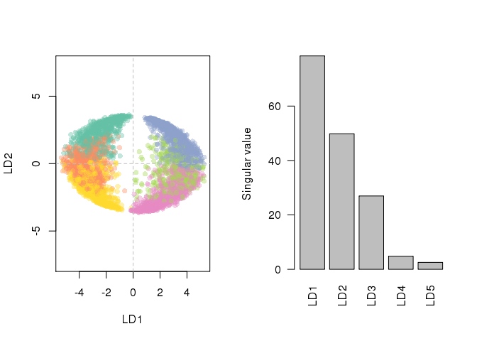
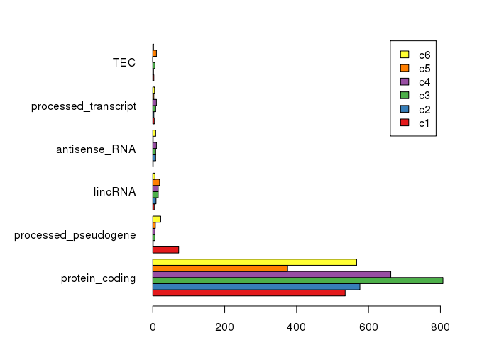
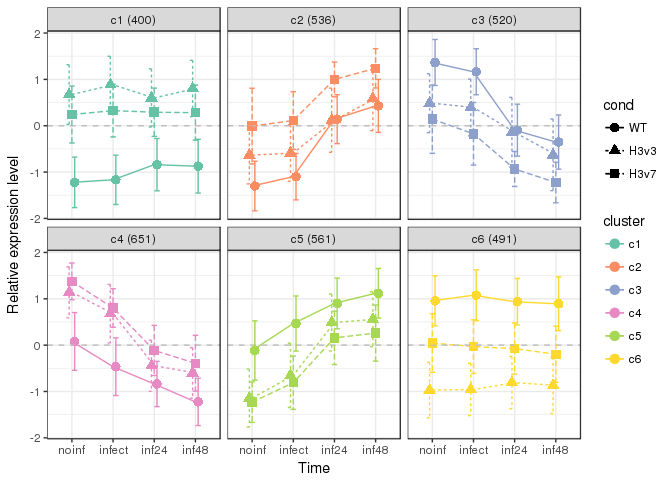
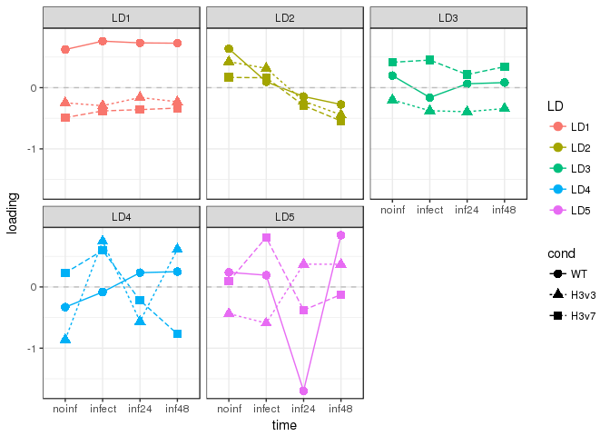
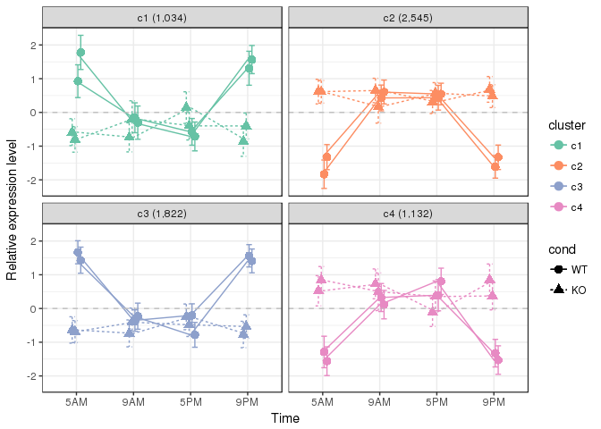

# RNA-seq data analysis for H3mm7

Prerequisites
-------------


```r
library(clusterProfiler)
library(org.Mm.eg.db)
library(DT)
library(knitr)
library(data.table)
library(dtplyr)
library(dplyr)
source("RScript/DESeq2Workflow.R")
```

### Helper functions


```r
modTbl <- function(x,...) x %>%
  mutate(log10padj=log10(padj)) %>%
  dplyr::select(cluster,1:3,log2FC=log2FoldChange,log10padj) %>%
  inner_join(e2g,.,by="ens_gene") %>% arrange(log10padj)

showDT <- function(x,...) x %>% modTbl %>% 
  datatable(filter="top",rownames=FALSE,...) %>%
  formatRound(4:9,3)

tlab <- function(res,alpha=0.1,thresh=0)
  c("LT","NS","GT")[with(res,
    (padj < alpha & baseMean > thresh)*sign(log2FoldChange))+2
  ]

degLabs <- function(dds,contrast,alpha=0.1,thresh=100)
  dds %>% results(contrast=contrast) %>% tlab(alpha,thresh)
```

### Load bioMart annotation


```r
library(biomaRt)
ensembl <- useMart("ENSEMBL_MART_ENSEMBL",host="asia.ensembl.org")
mart <- useDataset("mmusculus_gene_ensembl",mart=ensembl)
e2g <- getBM(attributes = c("ensembl_gene_id","external_gene_name","gene_biotype"), mart = mart)
e2g <- dplyr::rename(e2g, ens_gene = ensembl_gene_id, ext_gene = external_gene_name, biotype = gene_biotype)
```


H3mm7KO in C2C12
----------------


```r
defko <- getdef("data/table_C2C12RNAseq.txt")
ddsko <- getdds("data/countGENCODEvM9_C2C12RNAseq.edit.txt",defko,~time+cond)
```

```
## estimating size factors
```

```
## estimating dispersions
```

```
## gene-wise dispersion estimates
```

```
## mean-dispersion relationship
```

```
## final dispersion estimates
```

```
## fitting model and testing
```

```r
rldko <- rlog(ddsko,blind=FALSE)
knitr::kable(colData(ddsko))
```

                cell    clone   time   cond   rep     sizeFactor
--------------  ------  ------  -----  -----  -----  -----------
C2C12.WT1.G     C2C12   WT1     G      WT     Rep1     3.3203216
C2C12.WT2.G     C2C12   WT2     G      WT     Rep2     0.5707238
C2C12.3A3.G     C2C12   3A3     G      KO     Rep1     0.8365059
C2C12.3E4.G     C2C12   3E4     G      KO     Rep2     0.8409781
C2C12.WT1.D24   C2C12   WT1     D24    WT     Rep1     3.0602057
C2C12.WT2.D24   C2C12   WT2     D24    WT     Rep2     0.3199982
C2C12.3A3.D24   C2C12   3A3     D24    KO     Rep1     0.8484708
C2C12.3E4.D24   C2C12   3E4     D24    KO     Rep2     0.6981897
C2C12.WT1.D48   C2C12   WT1     D48    WT     Rep1     2.8720869
C2C12.WT2.D48   C2C12   WT2     D48    WT     Rep2     0.6347962
C2C12.3A3.D48   C2C12   3A3     D48    KO     Rep1     0.7034159
C2C12.3E4.D48   C2C12   3E4     D48    KO     Rep2     0.8979018
C2C12.WT1.D72   C2C12   WT1     D72    WT     Rep1     2.3229792
C2C12.WT2.D72   C2C12   WT2     D72    WT     Rep2     0.8415663
C2C12.3A3.D72   C2C12   3A3     D72    KO     Rep1     0.8621735
C2C12.3E4.D72   C2C12   3E4     D72    KO     Rep2     0.8022867


```r
set.seed(333)
resko <- results(ddsko,contrast=c("cond","KO","WT"))
tblko <- timecoursePlots(resko,rldko,k=6,showsd=TRUE)
```

```
## Warning in lda.default(x, grouping, ...): variables are collinear
```

<!-- --><!-- --><!-- -->

```r
p <- ggplot(tblko,aes(cluster,baseMean,fill=cluster)) + 
  geom_violin() + scale_y_log10() + theme_bw() +
  scale_fill_brewer(palette="Set2")
print(p)
```

<!-- -->

```r
B <- with(tblko %>% modTbl, table(biotype,cluster))
op <- par(mai=c(.5,2.2,.5,.5))
barplot(t(B[order(-rowSums(B))[1:6],]),beside=TRUE,col=brewer.pal(6,"Set2"),legend.text = colnames(B),las=1,horiz = TRUE)
```

<!-- -->

```r
par(op)
#showDT(tblko)
```


```r
set.seed(333)
tblks <- timecoursePlots(resko[resko$baseMean>100,],rldko,k=6)
```

```
## Warning in lda.default(x, grouping, ...): variables are collinear
```

<!-- --><!-- --><!-- -->

```r
#showDT(tblks)
```


#### GSEA


```r
gsks <- bitr(tblks$ens_gene,fromType = "ENSEMBL",toType = "ENTREZID",org.Mm.eg.db) %>%
  dplyr::rename(ens_gene=ENSEMBL) %>% filter(!duplicated(ens_gene)) %>%
  inner_join(tblks %>% dplyr::select(ens_gene,cluster,log2FoldChange),by="ens_gene") %>%
  arrange(-log2FoldChange)
```

```
## 'select()' returned 1:many mapping between keys and columns
```

```
## Warning in bitr(tblks$ens_gene, fromType = "ENSEMBL", toType =
## "ENTREZID", : 3.14% of input gene IDs are fail to map...
```

```r
v <- gsks$log2FoldChange
names(v) <- gsks$ENTREZID
gse <- gseGO(v,OrgDb = org.Mm.eg.db,pvalueCutoff = 0.05, nPerm=10000)
```

```
## preparing geneSet collections...
```

```
## GSEA analysis...
```

```
## leading edge analysis...
```

```
## done...
```

```r
gse@result[,-11] %>% arrange(NES) %>% kable 
```


ID           Description                                                                               setSize   enrichmentScore         NES      pvalue    p.adjust     qvalues   rank  leading_edge                    
-----------  ---------------------------------------------------------------------------------------  --------  ----------------  ----------  ----------  ----------  ----------  -----  --------------------------------
GO:0042254   ribosome biogenesis                                                                            96        -0.4634017   -2.680988   0.0001509   0.0227664   0.0205538   1257  tags=68%, list=37%, signal=44%  
GO:0042255   ribosome assembly                                                                              24        -0.6629834   -2.659473   0.0001700   0.0227664   0.0205538    561  tags=71%, list=17%, signal=60%  
GO:0006364   rRNA processing                                                                                73        -0.4872374   -2.649862   0.0001562   0.0227664   0.0205538   1257  tags=70%, list=37%, signal=45%  
GO:0006412   translation                                                                                   178        -0.4063480   -2.638340   0.0001412   0.0227664   0.0205538    636  tags=38%, list=19%, signal=32%  
GO:0043043   peptide biosynthetic process                                                                  180        -0.3995491   -2.598825   0.0001409   0.0227664   0.0205538    636  tags=37%, list=19%, signal=32%  
GO:0016072   rRNA metabolic process                                                                         74        -0.4737689   -2.585301   0.0001553   0.0227664   0.0205538   1257  tags=69%, list=37%, signal=44%  
GO:0043604   amide biosynthetic process                                                                    188        -0.3924679   -2.574342   0.0001388   0.0227664   0.0205538    636  tags=37%, list=19%, signal=32%  
GO:0000028   ribosomal small subunit assembly                                                               14        -0.7568006   -2.539865   0.0001779   0.0227664   0.0205538    561  tags=79%, list=17%, signal=66%  
GO:0042274   ribosomal small subunit biogenesis                                                             29        -0.5990087   -2.537913   0.0001687   0.0227664   0.0205538    561  tags=52%, list=17%, signal=44%  
GO:0034470   ncRNA processing                                                                              114        -0.4179494   -2.505995   0.0001471   0.0227664   0.0205538   1257  tags=63%, list=37%, signal=41%  
GO:0042273   ribosomal large subunit biogenesis                                                             32        -0.5689274   -2.494149   0.0001663   0.0227664   0.0205538   1257  tags=94%, list=37%, signal=60%  
GO:1901566   organonitrogen compound biosynthetic process                                                  275        -0.3510510   -2.445954   0.0001322   0.0227664   0.0205538    393  tags=25%, list=12%, signal=24%  
GO:0006518   peptide metabolic process                                                                     200        -0.3649848   -2.420368   0.0001380   0.0227664   0.0205538    636  tags=34%, list=19%, signal=30%  
GO:0035914   skeletal muscle cell differentiation                                                           21        -0.6247482   -2.405639   0.0001710   0.0227664   0.0205538    426  tags=52%, list=13%, signal=46%  
GO:0010830   regulation of myotube differentiation                                                          11        -0.7639972   -2.370700   0.0003595   0.0236213   0.0213256    565  tags=82%, list=17%, signal=68%  
GO:0034660   ncRNA metabolic process                                                                       137        -0.3813658   -2.364902   0.0001445   0.0227664   0.0205538   1257  tags=63%, list=37%, signal=41%  
GO:0043603   cellular amide metabolic process                                                              215        -0.3489399   -2.341816   0.0001363   0.0227664   0.0205538    636  tags=33%, list=19%, signal=29%  
GO:0014902   myotube differentiation                                                                        25        -0.5468010   -2.222237   0.0006766   0.0306144   0.0276391    426  tags=48%, list=13%, signal=42%  
GO:0022613   ribonucleoprotein complex biogenesis                                                          140        -0.3501383   -2.180401   0.0001439   0.0227664   0.0205538    561  tags=29%, list=17%, signal=25%  
GO:0002181   cytoplasmic translation                                                                        20        -0.5763633   -2.179164   0.0010350   0.0381232   0.0344181    294  tags=40%, list=9%, signal=37%   
GO:0000470   maturation of LSU-rRNA                                                                         15        -0.6328402   -2.169581   0.0010619   0.0381842   0.0344732   1257  tags=100%, list=37%, signal=63% 
GO:1901564   organonitrogen compound metabolic process                                                     383        -0.2985497   -2.167152   0.0001263   0.0227664   0.0205538    294  tags=17%, list=9%, signal=17%   
GO:0007519   skeletal muscle tissue development                                                             44        -0.4426557   -2.117838   0.0006561   0.0306144   0.0276391    474  tags=36%, list=14%, signal=32%  
GO:0060538   skeletal muscle organ development                                                              44        -0.4426557   -2.117838   0.0006561   0.0306144   0.0276391    474  tags=36%, list=14%, signal=32%  
GO:0006457   protein folding                                                                                54        -0.3962633   -2.007900   0.0009547   0.0362619   0.0327377   1225  tags=65%, list=36%, signal=42%  
GO:0071826   ribonucleoprotein complex subunit organization                                                 73        -0.3588635   -1.951695   0.0007810   0.0316438   0.0285684    561  tags=34%, list=17%, signal=29%  
GO:0022618   ribonucleoprotein complex assembly                                                             71        -0.3551235   -1.918422   0.0012518   0.0416853   0.0376340    561  tags=34%, list=17%, signal=29%  
GO:0006396   RNA processing                                                                                262        -0.2581398   -1.784551   0.0001331   0.0227664   0.0205538   1268  tags=48%, list=37%, signal=33%  
GO:0048870   cell motility                                                                                 239         0.2075884    1.606753   0.0011696   0.0400461   0.0361541    249  tags=9%, list=7%, signal=9%     
GO:0051674   localization of cell                                                                          239         0.2075884    1.606753   0.0011696   0.0400461   0.0361541    249  tags=9%, list=7%, signal=9%     
GO:0030030   cell projection organization                                                                  286         0.2099512    1.676238   0.0004179   0.0241876   0.0218369    197  tags=6%, list=6%, signal=6%     
GO:0016477   cell migration                                                                                227         0.2181837    1.678227   0.0007628   0.0314290   0.0283745    249  tags=9%, list=7%, signal=9%     
GO:0002682   regulation of immune system process                                                           185         0.2264194    1.680976   0.0014050   0.0455403   0.0411144    247  tags=11%, list=7%, signal=11%   
GO:0006928   movement of cell or subcellular component                                                     308         0.2104081    1.702691   0.0004281   0.0242016   0.0218495    125  tags=5%, list=4%, signal=5%     
GO:0051270   regulation of cellular component movement                                                     161         0.2419354    1.751687   0.0006800   0.0306144   0.0276391    249  tags=9%, list=7%, signal=8%     
GO:0006952   defense response                                                                              163         0.2446053    1.774868   0.0006796   0.0306144   0.0276391    366  tags=18%, list=11%, signal=17%  
GO:0040012   regulation of locomotion                                                                      152         0.2499171    1.785794   0.0003343   0.0236008   0.0213071    249  tags=10%, list=7%, signal=10%   
GO:2000145   regulation of cell motility                                                                   147         0.2523772    1.793686   0.0006645   0.0306144   0.0276391    296  tags=10%, list=9%, signal=10%   
GO:0009653   anatomical structure morphogenesis                                                            494         0.2096843    1.796830   0.0005461   0.0288628   0.0260577     33  tags=1%, list=1%, signal=2%     
GO:0048646   anatomical structure formation involved in morphogenesis                                      234         0.2328384    1.796831   0.0003876   0.0239760   0.0216458    194  tags=7%, list=6%, signal=7%     
GO:0072358   cardiovascular system development                                                             133         0.2596391    1.802219   0.0009794   0.0366308   0.0330707    231  tags=9%, list=7%, signal=9%     
GO:0040011   locomotion                                                                                    263         0.2298889    1.809980   0.0004044   0.0239760   0.0216458    249  tags=9%, list=7%, signal=9%     
GO:0007167   enzyme linked receptor protein signaling pathway                                              163         0.2499473    1.813629   0.0003398   0.0236008   0.0213071    329  tags=10%, list=10%, signal=10%  
GO:0001944   vasculature development                                                                       127         0.2630866    1.813897   0.0009545   0.0362619   0.0327377    231  tags=9%, list=7%, signal=9%     
GO:0030334   regulation of cell migration                                                                  142         0.2595409    1.827920   0.0003288   0.0236008   0.0213071    296  tags=11%, list=9%, signal=10%   
GO:0032989   cellular component morphogenesis                                                              260         0.2369479    1.864277   0.0004018   0.0239760   0.0216458    125  tags=5%, list=4%, signal=5%     
GO:0001568   blood vessel development                                                                      118         0.2807041    1.904827   0.0003112   0.0236008   0.0213071    231  tags=9%, list=7%, signal=9%     
GO:0060560   developmental growth involved in morphogenesis                                                 51         0.3540667    1.920758   0.0010681   0.0381842   0.0344732    508  tags=33%, list=15%, signal=29%  
GO:0000902   cell morphogenesis                                                                            240         0.2484828    1.923769   0.0003920   0.0239760   0.0216458    189  tags=6%, list=6%, signal=6%     
GO:0048514   blood vessel morphogenesis                                                                     96         0.2985092    1.934272   0.0005926   0.0300123   0.0270955    816  tags=45%, list=24%, signal=35%  
GO:0007411   axon guidance                                                                                  32         0.4142017    1.974554   0.0007524   0.0314290   0.0283745    688  tags=56%, list=20%, signal=45%  
GO:0097485   neuron projection guidance                                                                     32         0.4142017    1.974554   0.0007524   0.0314290   0.0283745    688  tags=56%, list=20%, signal=45%  
GO:0002831   regulation of response to biotic stimulus                                                      38         0.3938542    1.981667   0.0015236   0.0474860   0.0428710    218  tags=26%, list=6%, signal=25%   
GO:0001654   eye development                                                                                80         0.3201580    1.985146   0.0005708   0.0295225   0.0266533    968  tags=52%, list=29%, signal=38%  
GO:0030031   cell projection assembly                                                                       95         0.3082206    1.995411   0.0002948   0.0236008   0.0213071    968  tags=49%, list=29%, signal=36%  
GO:0007179   transforming growth factor beta receptor signaling pathway                                     36         0.4056002    2.008732   0.0005075   0.0274155   0.0247510    453  tags=36%, list=13%, signal=32%  
GO:0050808   synapse organization                                                                           45         0.3855047    2.030472   0.0012867   0.0422689   0.0381608    881  tags=53%, list=26%, signal=40%  
GO:0090092   regulation of transmembrane receptor protein serine/threonine kinase signaling pathway         38         0.4065839    2.045717   0.0007618   0.0314290   0.0283745    740  tags=47%, list=22%, signal=37%  
GO:0032990   cell part morphogenesis                                                                       182         0.2770484    2.046520   0.0003516   0.0236213   0.0213256    125  tags=4%, list=4%, signal=4%     
GO:0002252   immune effector process                                                                       106         0.3160199    2.091120   0.0003048   0.0236008   0.0213071    535  tags=31%, list=16%, signal=27%  
GO:0017015   regulation of transforming growth factor beta receptor signaling pathway                       23         0.4905627    2.097185   0.0014507   0.0457999   0.0413488    549  tags=48%, list=16%, signal=40%  
GO:1903844   regulation of cellular response to transforming growth factor beta stimulus                    23         0.4905627    2.097185   0.0014507   0.0457999   0.0413488    549  tags=48%, list=16%, signal=40%  
GO:0019724   B cell mediated immunity                                                                       14         0.5847689    2.103819   0.0011410   0.0400461   0.0361541    175  tags=43%, list=5%, signal=41%   
GO:0098792   xenophagy                                                                                      23         0.5043330    2.156054   0.0012089   0.0408171   0.0368502    149  tags=30%, list=4%, signal=29%   
GO:0048858   cell projection morphogenesis                                                                 173         0.2966836    2.178018   0.0003391   0.0236008   0.0213071    125  tags=5%, list=4%, signal=5%     
GO:0050691   regulation of defense response to virus by host                                                27         0.4873594    2.196338   0.0002456   0.0236008   0.0213071    149  tags=30%, list=4%, signal=29%   
GO:0090288   negative regulation of cellular response to growth factor stimulus                             27         0.4888537    2.203072   0.0002456   0.0236008   0.0213071    910  tags=63%, list=27%, signal=46%  
GO:1901343   negative regulation of vasculature development                                                 18         0.5616572    2.206256   0.0007034   0.0310903   0.0280687    810  tags=67%, list=24%, signal=51%  
GO:0051928   positive regulation of calcium ion transport                                                   19         0.5520963    2.213509   0.0004687   0.0258964   0.0233796    779  tags=68%, list=23%, signal=53%  
GO:0030512   negative regulation of transforming growth factor beta receptor signaling pathway              16         0.5946019    2.242672   0.0009255   0.0362619   0.0327377    421  tags=56%, list=12%, signal=50%  
GO:1903845   negative regulation of cellular response to transforming growth factor beta stimulus           16         0.5946019    2.242672   0.0009255   0.0362619   0.0327377    421  tags=56%, list=12%, signal=50%  
GO:0010927   cellular component assembly involved in morphogenesis                                          73         0.3704136    2.244189   0.0002778   0.0236008   0.0213071    889  tags=56%, list=26%, signal=42%  
GO:0050688   regulation of defense response to virus                                                        29         0.4895229    2.264761   0.0002454   0.0236008   0.0213071    170  tags=31%, list=5%, signal=30%   
GO:0002230   positive regulation of defense response to virus by host                                       24         0.5275932    2.290373   0.0002428   0.0236008   0.0213071    149  tags=33%, list=4%, signal=32%   
GO:0044782   cilium organization                                                                            65         0.3919042    2.290703   0.0002751   0.0236008   0.0213071   1423  tags=77%, list=42%, signal=46%  
GO:0060271   cilium morphogenesis                                                                           65         0.3968352    2.319525   0.0002751   0.0236008   0.0213071   1434  tags=77%, list=42%, signal=45%  
GO:0042384   cilium assembly                                                                                57         0.4335889    2.444957   0.0002692   0.0236008   0.0213071   1371  tags=79%, list=40%, signal=48%  
GO:0048536   spleen development                                                                             11         0.7795684    2.546111   0.0002253   0.0236008   0.0213071    622  tags=91%, list=18%, signal=74%  


NIH3T3 H3vOE
------------


```r
defn <- getdef("data/table_3T3RNAseq.txt")
ddsn <- getdds("data/countGENCODEvM9_3T3RNAseq.edit.txt",defn,~time+cond)
```

```
## estimating size factors
```

```
## estimating dispersions
```

```
## gene-wise dispersion estimates
```

```
## mean-dispersion relationship
```

```
## final dispersion estimates
```

```
## fitting model and testing
```

```r
rldn <- rlog(ddsn,blind=FALSE)
knitr::kable(colData(ddsn))
```

                   cond   time     rep    clone        sizeFactor
-----------------  -----  -------  -----  ----------  -----------
X3T3.WT.noinf      WT     noinf    Rep1   WT_Rep1       1.0082323
X3T3.WT.infect     WT     infect   Rep1   WT_Rep1       1.2420505
X3T3.WT.inf24      WT     inf24    Rep1   WT_Rep1       0.9808936
X3T3.WT.inf48      WT     inf48    Rep1   WT_Rep1       0.9110183
X3T3.H3v3.noinf    H3v3   noinf    Rep1   H3v3_Rep1     1.1716920
X3T3.H3v3.infect   H3v3   infect   Rep1   H3v3_Rep1     1.0533892
X3T3.H3v3.inf24    H3v3   inf24    Rep1   H3v3_Rep1     0.9724215
X3T3.H3v3.inf48    H3v3   inf48    Rep1   H3v3_Rep1     0.8092273
X3T3.H3v7.noinf    H3v7   noinf    Rep1   H3v7_Rep1     1.1884297
X3T3.H3v7.infect   H3v7   infect   Rep1   H3v7_Rep1     1.1936027
X3T3.H3v7.inf24    H3v7   inf24    Rep1   H3v7_Rep1     0.9042245
X3T3.H3v7.inf48    H3v7   inf48    Rep1   H3v7_Rep1     0.8198526


```r
set.seed(333)
resn <- results(ddsn,contrast=c("cond","H3v7","WT"))
tbln <- timecoursePlots(resn,rldn,k=6,showsd=TRUE)
```

```
## Warning in lda.default(x, grouping, ...): variables are collinear
```

<!-- --><!-- --><!-- -->

```r
p <- ggplot(tbln,aes(cluster,baseMean,fill=cluster)) + 
  geom_violin() + scale_y_log10() + theme_bw() +
  scale_fill_brewer(palette="Set2")
print(p)
```

<!-- -->

```r
B <- with(tbln %>% modTbl, table(biotype,cluster))
pal <- brewer.pal(6,"Set1")
op <- par(mai=c(.5,2.2,.5,.5))
barplot(t(B[order(-rowSums(B))[1:6],]),beside=TRUE,col=pal,legend.text = colnames(B),las=1,horiz = TRUE)
```

<!-- -->

```r
par(op)
#showDT(tbln)
```


```r
set.seed(333)
tblns <- timecoursePlots(resn[resn$baseMean>100,],rldn,k=6)
```

```
## Warning in lda.default(x, grouping, ...): variables are collinear
```

<!-- --><!-- --><!-- -->

```r
#showDT(tblns)
```

#### GSEA


```r
gsksn <- bitr(tblns$ens_gene,fromType = "ENSEMBL",toType = "ENTREZID",org.Mm.eg.db) %>%
  dplyr::rename(ens_gene=ENSEMBL) %>% filter(!duplicated(ens_gene)) %>%
  inner_join(tblns %>% dplyr::select(ens_gene,cluster,log2FoldChange),by="ens_gene") %>%
  arrange(-log2FoldChange)
```

```
## 'select()' returned 1:many mapping between keys and columns
```

```
## Warning in bitr(tblns$ens_gene, fromType = "ENSEMBL", toType =
## "ENTREZID", : 2.85% of input gene IDs are fail to map...
```

```r
v <- with(gsksn,setNames(log2FoldChange,ens_gene)) %>% sort(decreasing=TRUE)
gsen <- gseGO(v,ont = "BP",OrgDb = org.Mm.eg.db,pvalueCutoff = 0.25,nPerm=10000,keytype = "ENSEMBL")
```

```
## preparing geneSet collections...
```

```
## GSEA analysis...
```

```
## leading edge analysis...
```

```
## done...
```

```r
kable(gsen@result[,-c(1,11)] %>% arrange(desc(enrichmentScore)))
```


Description                                       setSize   enrichmentScore         NES      pvalue    p.adjust     qvalues   rank  leading_edge                   
-----------------------------------------------  --------  ----------------  ----------  ----------  ----------  ----------  -----  -------------------------------
digestion                                              13         0.7825727    2.414145   0.0001931   0.0534883   0.0501514    141  tags=54%, list=5%, signal=52%  
digestive system process                               12         0.7639728    2.303546   0.0001948   0.0534883   0.0501514    141  tags=50%, list=5%, signal=48%  
negative regulation of calcium ion transport           10         0.7040384    1.996329   0.0025722   0.2397410   0.2247843    313  tags=60%, list=10%, signal=54% 
sensory perception of pain                             15         0.6949529    2.248935   0.0001884   0.0534883   0.0501514    202  tags=53%, list=7%, signal=50%  
response to purine-containing compound                 11         0.6937279    2.036726   0.0027232   0.2397410   0.2247843    350  tags=64%, list=11%, signal=57% 
response to organophosphorus                           11         0.6937279    2.036726   0.0027232   0.2397410   0.2247843    350  tags=64%, list=11%, signal=57% 
membrane depolarization                                19         0.5772389    2.007357   0.0033470   0.2456597   0.2303337    197  tags=37%, list=6%, signal=35%  
regulation of muscle contraction                       30         0.5452362    2.159552   0.0005337   0.1318804   0.1236528    364  tags=57%, list=12%, signal=50% 
striated muscle contraction                            28         0.5397559    2.100692   0.0012414   0.2397410   0.2247843    364  tags=54%, list=12%, signal=48% 
regulation of muscle tissue development                27         0.5370386    2.068711   0.0017864   0.2397410   0.2247843    375  tags=41%, list=12%, signal=36% 
mononuclear cell proliferation                         47         0.5034080    2.252879   0.0001706   0.0534883   0.0501514    364  tags=38%, list=12%, signal=34% 
muscle cell proliferation                              29         0.5030419    1.976027   0.0030174   0.2405155   0.2255105    303  tags=28%, list=10%, signal=25% 
T cell proliferation                                   30         0.5015888    1.986675   0.0033802   0.2456597   0.2303337    466  tags=40%, list=15%, signal=34% 
lymphocyte proliferation                               45         0.4951832    2.189229   0.0001719   0.0534883   0.0501514    364  tags=38%, list=12%, signal=34% 
response to drug                                       49         0.4947984    2.243040   0.0001691   0.0534883   0.0501514    332  tags=33%, list=11%, signal=30% 
leukocyte proliferation                                48         0.4937891    2.226438   0.0001692   0.0534883   0.0501514    364  tags=38%, list=12%, signal=34% 
regulation of mononuclear cell proliferation           35         0.4877971    2.020568   0.0022652   0.2397410   0.2247843    364  tags=37%, list=12%, signal=33% 
regulation of leukocyte proliferation                  36         0.4756325    1.983491   0.0027821   0.2397410   0.2247843    364  tags=36%, list=12%, signal=32% 
regulation of muscle system process                    41         0.4641350    2.002661   0.0020708   0.2397410   0.2247843    364  tags=44%, list=12%, signal=39% 
muscle contraction                                     49         0.4286367    1.943113   0.0028750   0.2397410   0.2247843    364  tags=43%, list=12%, signal=38% 
regulation of membrane potential                       58         0.4189125    1.977505   0.0018257   0.2397410   0.2247843    380  tags=31%, list=12%, signal=28% 
regulation of system process                           79         0.4146072    2.095371   0.0001614   0.0534883   0.0501514    369  tags=35%, list=12%, signal=32% 
regulation of homeostatic process                      95         0.3400514    1.785078   0.0033014   0.2456597   0.2303337    380  tags=24%, list=12%, signal=22% 
system process                                        229         0.3266303    1.993322   0.0001414   0.0534883   0.0501514     15  tags=1%, list=0%, signal=1%    
cell activation                                       144         0.3178392    1.805196   0.0013467   0.2397410   0.2247843    431  tags=19%, list=14%, signal=17% 
neurological system process                           131         0.3157904    1.762131   0.0022800   0.2397410   0.2247843     15  tags=2%, list=0%, signal=2%    
single organismal cell-cell adhesion                  132         0.3123182    1.744688   0.0025844   0.2397410   0.2247843    273  tags=13%, list=9%, signal=12%  
single organism cell adhesion                         143         0.3063934    1.734911   0.0024111   0.2397410   0.2247843    273  tags=13%, list=9%, signal=12%  
cell adhesion                                         284         0.2662296    1.678478   0.0012290   0.2397410   0.2247843    194  tags=8%, list=6%, signal=8%    
biological adhesion                                   286         0.2628691    1.658732   0.0019105   0.2397410   0.2247843     76  tags=8%, list=2%, signal=9%    
regulation of multicellular organismal process        461         0.2286622    1.529620   0.0029107   0.2397410   0.2247843      1  tags=1%, list=0%, signal=1%    
defense response                                      236        -0.2349582   -1.639909   0.0020848   0.2397410   0.2247843    435  tags=27%, list=14%, signal=25% 
response to cytokine                                  107        -0.2906225   -1.765069   0.0016704   0.2397410   0.2247843    423  tags=32%, list=14%, signal=28% 
G-protein coupled receptor signaling pathway           58        -0.3522887   -1.848661   0.0027659   0.2397410   0.2247843    141  tags=26%, list=5%, signal=25%  


si-mH2A.1 in C2C12
--------------------------

* http://www.sciencedirect.com/science/article/pii/S2211124716000036
* https://trace.ncbi.nlm.nih.gov/Traces/study/?acc=SRP067391


```r
defm <- getdef("data/table_mH2A1-2i.txt")
ddsm <- getdds("data/countGENCODEvM9_C2C12-mH2A1-2i_RNAseq.edit.txt",defm,~time*cond,~time+cond)
```

```
## estimating size factors
```

```
## estimating dispersions
```

```
## gene-wise dispersion estimates
```

```
## mean-dispersion relationship
```

```
## final dispersion estimates
```

```
## fitting model and testing
```

```r
rldm <- rlog(ddsm,blind=FALSE)
knitr::kable(colData(ddsm))
```

             cond       time   rep    clone            sizeFactor
-----------  ---------  -----  -----  --------------  -----------
SRR3000005   CTL        MB     Rep1   CTL_Rep1          1.2282098
SRR3000006   CTL        MB     Rep2   CTL_Rep2          1.1787304
SRR3000007   CTL        MB     Rep3   CTL_Rep3          2.2332695
SRR3000008   CTL        MT     Rep1   CTL_Rep1          0.6890653
SRR3000009   CTL        MT     Rep2   CTL_Rep2          0.6294310
SRR3000010   CTL        MT     Rep3   CTL_Rep3          0.5539811
SRR3000011   mH2A1.2i   MB     Rep1   mH2A1.2i_Rep1     0.9592084
SRR3000012   mH2A1.2i   MB     Rep2   mH2A1.2i_Rep2     1.0371868
SRR3000013   mH2A1.2i   MB     Rep3   mH2A1.2i_Rep3     2.5351417
SRR3000014   mH2A1.2i   MT     Rep1   mH2A1.2i_Rep1     0.9748941
SRR3000015   mH2A1.2i   MT     Rep2   mH2A1.2i_Rep2     0.7125510
SRR3000016   mH2A1.2i   MT     Rep3   mH2A1.2i_Rep3     0.8126225


```r
resm <- results(ddsm,name="timeMT.condmH2A1.2i")
tblm <- timecoursePlots(resm,rldm,k=4)
```

```
## Warning in lda.default(x, grouping, ...): variables are collinear
```

<!-- --><!-- --><!-- -->

```r
#showDT(tblm)
```

BMAL1-KO in hip cartilage
-------------------------

* https://www.jci.org/articles/view/82755
* https://trace.ncbi.nlm.nih.gov/Traces/study/?acc=ERP009958


```r
defb <- getdef("data/table_BMAL1KO.txt")
defb$cond <- factor(defb$cond,c("WT","KO"))
defb$time <- factor(defb$time,c("5AM","9AM","5PM","9PM"))
ddsb <- getdds("data/countGENCODEvM9_cartilage_BMAL1-KO_RNAseq.edit.txt",defb,~time*cond,~time+cond)
```

```
## estimating size factors
```

```
## estimating dispersions
```

```
## gene-wise dispersion estimates
```

```
## mean-dispersion relationship
```

```
## final dispersion estimates
```

```
## fitting model and testing
```

```r
rldb <- rlog(ddsb,blind=FALSE)
knitr::kable(colData(ddsb))
```

            cond   time   rep    clone      sizeFactor
----------  -----  -----  -----  --------  -----------
ERR793472   WT     9AM    Rep3   WT_Rep3     1.1692521
ERR793473   KO     5PM    Rep3   KO_Rep3     1.1574875
ERR793474   WT     9AM    Rep2   WT_Rep2     1.7839916
ERR793475   KO     5AM    Rep3   KO_Rep3     1.3333196
ERR793476   KO     5AM    Rep2   KO_Rep2     0.8373409
ERR793477   WT     9PM    Rep2   WT_Rep2     0.8002306
ERR793478   KO     9PM    Rep2   KO_Rep2     0.9357273
ERR793479   WT     5PM    Rep2   WT_Rep2     0.9701294
ERR793480   KO     5PM    Rep2   KO_Rep2     0.6653467
ERR793481   WT     5AM    Rep2   WT_Rep2     1.1412059
ERR793482   WT     5AM    Rep3   WT_Rep3     0.8747762
ERR793483   KO     9AM    Rep3   KO_Rep3     1.1050007
ERR793484   WT     5PM    Rep3   WT_Rep3     1.0138664
ERR793485   KO     9AM    Rep2   KO_Rep2     1.0522057
ERR793486   WT     9PM    Rep3   WT_Rep3     0.7389949
ERR793487   KO     9PM    Rep3   KO_Rep3     1.0855583


```r
resb <- results(ddsb,name="time9PM.condKO")
# same alpha as their paper
tblb <- timecoursePlots(resb,rldb,k=4,alpha=0.05)
```

```
## Warning in lda.default(x, grouping, ...): variables are collinear
```

<!-- --><!-- --><!-- -->

```r
#showDT(tblb %>% filter(abs(log2FoldChange) > 1)) 
```

