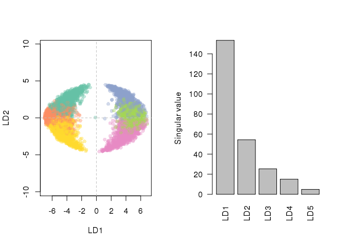
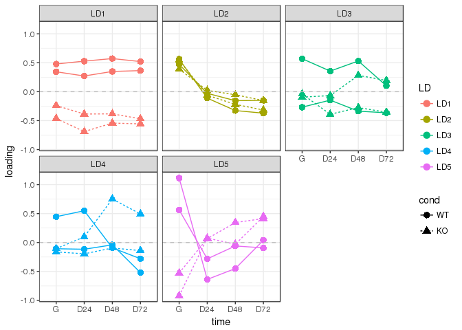
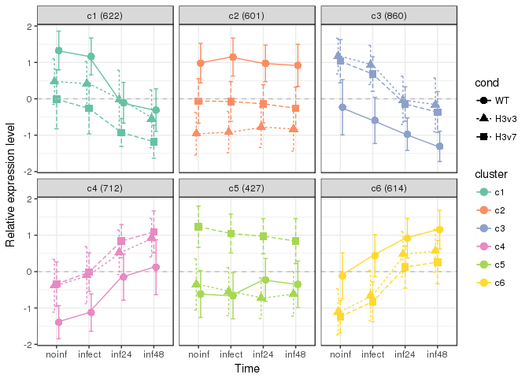
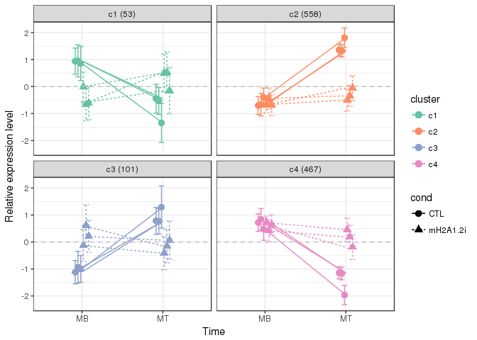

# RNA-seq data analysis for H3mm7

Prerequisites
-------------


```r
library(clusterProfiler)
library(org.Mm.eg.db)
library(DT)
library(knitr)
library(data.table)
library(dtplyr)
library(dplyr)
source("RScript/DESeq2Workflow.R")
```

### Helper functions


```r
modTbl <- function(x,...) x %>%
  mutate(log10padj=log10(padj)) %>%
  dplyr::select(cluster,1:3,log2FC=log2FoldChange,log10padj) %>%
  inner_join(e2g,.,by="ens_gene") %>% arrange(log10padj)

showDT <- function(x,...) x %>% modTbl %>% 
  datatable(filter="top",rownames=FALSE,...) %>%
  formatRound(4:9,3)

tlab <- function(res,alpha=0.1,thresh=0)
  c("LT","NS","GT")[with(res,
    (padj < alpha & baseMean > thresh)*sign(log2FoldChange))+2
  ]

degLabs <- function(dds,contrast,alpha=0.1,thresh=100)
  dds %>% results(contrast=contrast) %>% tlab(alpha,thresh)
```

### Load bioMart annotation


```r
library(biomaRt)
ensembl <- useMart("ENSEMBL_MART_ENSEMBL",host="asia.ensembl.org")
mart <- useDataset("mmusculus_gene_ensembl",mart=ensembl)
e2g <- getBM(attributes = c("ensembl_gene_id","external_gene_name","gene_biotype"), mart = mart)
e2g <- dplyr::rename(e2g, ens_gene = ensembl_gene_id, ext_gene = external_gene_name, biotype = gene_biotype)
```


H3mm7KO in C2C12
----------------


```r
defko <- getdef("data/table_C2C12RNAseq.txt")
ddsko <- getdds("data/countGENCODEvM9_C2C12RNAseq.edit.txt",defko,~time+cond)
```

```
## estimating size factors
```

```
## estimating dispersions
```

```
## gene-wise dispersion estimates
```

```
## mean-dispersion relationship
```

```
## final dispersion estimates
```

```
## fitting model and testing
```

```r
rldko <- rlog(ddsko,blind=FALSE)
knitr::kable(colData(ddsko))
```

                cell    clone   time   cond   rep     sizeFactor
--------------  ------  ------  -----  -----  -----  -----------
C2C12.WT1.G     C2C12   WT1     G      WT     Rep1     3.3203216
C2C12.WT2.G     C2C12   WT2     G      WT     Rep2     0.5707238
C2C12.3A3.G     C2C12   3A3     G      KO     Rep1     0.8365059
C2C12.3E4.G     C2C12   3E4     G      KO     Rep2     0.8409781
C2C12.WT1.D24   C2C12   WT1     D24    WT     Rep1     3.0602057
C2C12.WT2.D24   C2C12   WT2     D24    WT     Rep2     0.3199982
C2C12.3A3.D24   C2C12   3A3     D24    KO     Rep1     0.8484708
C2C12.3E4.D24   C2C12   3E4     D24    KO     Rep2     0.6981897
C2C12.WT1.D48   C2C12   WT1     D48    WT     Rep1     2.8720869
C2C12.WT2.D48   C2C12   WT2     D48    WT     Rep2     0.6347962
C2C12.3A3.D48   C2C12   3A3     D48    KO     Rep1     0.7034159
C2C12.3E4.D48   C2C12   3E4     D48    KO     Rep2     0.8979018
C2C12.WT1.D72   C2C12   WT1     D72    WT     Rep1     2.3229792
C2C12.WT2.D72   C2C12   WT2     D72    WT     Rep2     0.8415663
C2C12.3A3.D72   C2C12   3A3     D72    KO     Rep1     0.8621735
C2C12.3E4.D72   C2C12   3E4     D72    KO     Rep2     0.8022867


```r
set.seed(333)
resko <- results(ddsko,contrast=c("cond","KO","WT"))
tblko <- timecoursePlots(resko,rldko,k=6,showsd=TRUE)
```

```
## Warning in lda.default(x, grouping, ...): variables are collinear
```

<!-- --><!-- --><!-- -->

```r
p <- ggplot(tblko,aes(cluster,baseMean,fill=cluster)) + 
  geom_violin() + scale_y_log10() + theme_bw() +
  scale_fill_brewer(palette="Set2")
print(p)
```

<!-- -->

```r
B <- with(tblko %>% modTbl, table(biotype,cluster))
op <- par(mai=c(.5,2.2,.5,.5))
barplot(t(B[order(-rowSums(B))[1:6],]),beside=TRUE,col=brewer.pal(6,"Set2"),legend.text = colnames(B),las=1,horiz = TRUE)
```

<!-- -->

```r
par(op)
showDT(tblko)
```

<!--html_preserve--><div id="htmlwidget-6a43bb11933fe7241012" style="width:100%;height:auto;" class="datatables html-widget"></div>
<script type="application/json" data-for="htmlwidget-6a43bb11933fe7241012">{"x":{"filter":"top","filterHTML":"<tr>\n  <td data-type=\"character\" style=\"vertical-align: top;\">\n    <div class=\"form-group has-feedback\" style=\"margin-bottom: auto;\">\n      <input type=\"search\" placeholder=\"All\" class=\"form-control\" style=\"width: 100%;\"/>\n      <span class=\"glyphicon glyphicon-remove-circle form-control-feedback\"><\/span>\n    <\/div>\n  <\/td>\n  <td data-type=\"character\" style=\"vertical-align: top;\">\n    <div class=\"form-group has-feedback\" style=\"margin-bottom: auto;\">\n      <input type=\"search\" placeholder=\"All\" class=\"form-control\" style=\"width: 100%;\"/>\n      <span class=\"glyphicon glyphicon-remove-circle form-control-feedback\"><\/span>\n    <\/div>\n  <\/td>\n  <td data-type=\"character\" style=\"vertical-align: top;\">\n    <div class=\"form-group has-feedback\" style=\"margin-bottom: auto;\">\n      <input type=\"search\" placeholder=\"All\" class=\"form-control\" style=\"width: 100%;\"/>\n      <span class=\"glyphicon glyphicon-remove-circle form-control-feedback\"><\/span>\n    <\/div>\n  <\/td>\n  <td data-type=\"factor\" style=\"vertical-align: top;\">\n    <div class=\"form-group has-feedback\" style=\"margin-bottom: auto;\">\n      <input type=\"search\" placeholder=\"All\" class=\"form-control\" style=\"width: 100%;\"/>\n      <span class=\"glyphicon glyphicon-remove-circle form-control-feedback\"><\/span>\n    <\/div>\n    <div style=\"width: 100%; display: none;\">\n      <select multiple=\"multiple\" style=\"width: 100%;\" data-options=\"[&quot;c1&quot;,&quot;c2&quot;,&quot;c3&quot;,&quot;c4&quot;,&quot;c5&quot;,&quot;c6&quot;]\"><\/select>\n    <\/div>\n  <\/td>\n  <td data-type=\"number\" style=\"vertical-align: top;\">\n    <div class=\"form-group has-feedback\" style=\"margin-bottom: auto;\">\n      <input type=\"search\" placeholder=\"All\" class=\"form-control\" style=\"width: 100%;\"/>\n      <span class=\"glyphicon glyphicon-remove-circle form-control-feedback\"><\/span>\n    <\/div>\n    <div style=\"display: none; position: absolute; width: 200px;\">\n      <div data-min=\"1.63543383254976\" data-max=\"1128327.8587098\" data-scale=\"15\"><\/div>\n      <span style=\"float: left;\"><\/span>\n      <span style=\"float: right;\"><\/span>\n    <\/div>\n  <\/td>\n  <td data-type=\"number\" style=\"vertical-align: top;\">\n    <div class=\"form-group has-feedback\" style=\"margin-bottom: auto;\">\n      <input type=\"search\" placeholder=\"All\" class=\"form-control\" style=\"width: 100%;\"/>\n      <span class=\"glyphicon glyphicon-remove-circle form-control-feedback\"><\/span>\n    <\/div>\n    <div style=\"display: none; position: absolute; width: 200px;\">\n      <div data-min=\"-5.48861545790174\" data-max=\"6.77113959737074\" data-scale=\"15\"><\/div>\n      <span style=\"float: left;\"><\/span>\n      <span style=\"float: right;\"><\/span>\n    <\/div>\n  <\/td>\n  <td data-type=\"number\" style=\"vertical-align: top;\">\n    <div class=\"form-group has-feedback\" style=\"margin-bottom: auto;\">\n      <input type=\"search\" placeholder=\"All\" class=\"form-control\" style=\"width: 100%;\"/>\n      <span class=\"glyphicon glyphicon-remove-circle form-control-feedback\"><\/span>\n    <\/div>\n    <div style=\"display: none; position: absolute; width: 200px;\">\n      <div data-min=\"-79.5245236305453\" data-max=\"-1.00007614590606\" data-scale=\"15\"><\/div>\n      <span style=\"float: left;\"><\/span>\n      <span style=\"float: right;\"><\/span>\n    <\/div>\n  <\/td>\n<\/tr>","data":[["ENSMUSG00000086324","ENSMUSG00000027189","ENSMUSG00000081123","ENSMUSG00000062647","ENSMUSG00000031375","ENSMUSG00000035202","ENSMUSG00000102594","ENSMUSG00000104571","ENSMUSG00000028289","ENSMUSG00000104030","ENSMUSG00000108067","ENSMUSG00000045128","ENSMUSG00000103739","ENSMUSG00000008683","ENSMUSG00000104293","ENSMUSG00000103085","ENSMUSG00000106166","ENSMUSG00000104501","ENSMUSG00000109363","ENSMUSG00000104525","ENSMUSG00000108076","ENSMUSG00000000296","ENSMUSG00000105586","ENSMUSG00000023868","ENSMUSG00000061461","ENSMUSG00000108784","ENSMUSG00000028167","ENSMUSG00000104828","ENSMUSG00000107448","ENSMUSG00000105933","ENSMUSG00000023020","ENSMUSG00000103146","ENSMUSG00000057990","ENSMUSG00000084314","ENSMUSG00000070780","ENSMUSG00000106229","ENSMUSG00000070802","ENSMUSG00000027894","ENSMUSG00000060636","ENSMUSG00000046865","ENSMUSG00000102009","ENSMUSG00000062742","ENSMUSG00000104125","ENSMUSG00000102868","ENSMUSG00000054412","ENSMUSG00000030075","ENSMUSG00000105378","ENSMUSG00000050447","ENSMUSG00000046330","ENSMUSG00000102415","ENSMUSG00000085499","ENSMUSG00000071528","ENSMUSG00000071847","ENSMUSG00000024608","ENSMUSG00000098915","ENSMUSG00000056481","ENSMUSG00000104107","ENSMUSG00000091786","ENSMUSG00000102423","ENSMUSG00000029028","ENSMUSG00000014329","ENSMUSG00000102142","ENSMUSG00000104315","ENSMUSG00000104262","ENSMUSG00000091811","ENSMUSG00000051844","ENSMUSG00000011257","ENSMUSG00000102448","ENSMUSG00000087319","ENSMUSG00000104469","ENSMUSG00000087943","ENSMUSG00000103882","ENSMUSG00000032846","ENSMUSG00000102893","ENSMUSG00000104476","ENSMUSG00000106092","ENSMUSG00000083728","ENSMUSG00000021196","ENSMUSG00000107884","ENSMUSG00000006412","ENSMUSG00000108269","ENSMUSG00000046711","ENSMUSG00000108741","ENSMUSG00000049751","ENSMUSG00000106472","ENSMUSG00000009927","ENSMUSG00000072324","ENSMUSG00000105864","ENSMUSG00000102808","ENSMUSG00000103364","ENSMUSG00000106106","ENSMUSG00000105412","ENSMUSG00000007888","ENSMUSG00000071862","ENSMUSG00000093774","ENSMUSG00000063457","ENSMUSG00000103162","ENSMUSG00000007836","ENSMUSG00000097834","ENSMUSG00000102277","ENSMUSG00000019843","ENSMUSG00000087321","ENSMUSG00000044043","ENSMUSG00000099746","ENSMUSG00000106732","ENSMUSG00000042810","ENSMUSG00000097507","ENSMUSG00000098298","ENSMUSG00000105774","ENSMUSG00000106057","ENSMUSG00000099419","ENSMUSG00000104273","ENSMUSG00000030074","ENSMUSG00000103614","ENSMUSG00000106625","ENSMUSG00000101778","ENSMUSG00000025869","ENSMUSG00000102374","ENSMUSG00000028389","ENSMUSG00000030917","ENSMUSG00000074129","ENSMUSG00000106443","ENSMUSG00000026873","ENSMUSG00000028961","ENSMUSG00000049641","ENSMUSG00000106110","ENSMUSG00000028936","ENSMUSG00000097324","ENSMUSG00000028670","ENSMUSG00000031734","ENSMUSG00000081051","ENSMUSG00000097147","ENSMUSG00000102939","ENSMUSG00000032782","ENSMUSG00000103693","ENSMUSG00000038583","ENSMUSG00000030499","ENSMUSG00000026360","ENSMUSG00000097368","ENSMUSG00000035694","ENSMUSG00000105445","ENSMUSG00000022754","ENSMUSG00000097263","ENSMUSG00000103159","ENSMUSG00000046229","ENSMUSG00000103251","ENSMUSG00000103593","ENSMUSG00000061897","ENSMUSG00000102326","ENSMUSG00000097998","ENSMUSG00000020128","ENSMUSG00000033174","ENSMUSG00000103047","ENSMUSG00000108689","ENSMUSG00000030697","ENSMUSG00000103525","ENSMUSG00000034575","ENSMUSG00000105970","ENSMUSG00000089417","ENSMUSG00000107427","ENSMUSG00000015749","ENSMUSG00000033918","ENSMUSG00000108460","ENSMUSG00000033972","ENSMUSG00000103432","ENSMUSG00000078480","ENSMUSG00000099373","ENSMUSG00000107054","ENSMUSG00000106636","ENSMUSG00000035395","ENSMUSG00000104235","ENSMUSG00000025608","ENSMUSG00000029223","ENSMUSG00000103094","ENSMUSG00000102573","ENSMUSG00000089824","ENSMUSG00000109154","ENSMUSG00000105990","ENSMUSG00000105526","ENSMUSG00000062319","ENSMUSG00000104052","ENSMUSG00000102844","ENSMUSG00000032744","ENSMUSG00000071317","ENSMUSG00000015478","ENSMUSG00000048164","ENSMUSG00000073805","ENSMUSG00000096984","ENSMUSG00000103049","ENSMUSG00000107720","ENSMUSG00000109438","ENSMUSG00000067377","ENSMUSG00000037280","ENSMUSG00000049612","ENSMUSG00000030795","ENSMUSG00000090078","ENSMUSG00000104325","ENSMUSG00000083774","ENSMUSG00000020275","ENSMUSG00000073867","ENSMUSG00000097011","ENSMUSG00000105975","ENSMUSG00000102621","ENSMUSG00000107529","ENSMUSG00000102179","ENSMUSG00000080840","ENSMUSG00000102391","ENSMUSG00000033900","ENSMUSG00000104886","ENSMUSG00000098041","ENSMUSG00000100394","ENSMUSG00000094185","ENSMUSG00000091523","ENSMUSG00000106993","ENSMUSG00000097274","ENSMUSG00000027944","ENSMUSG00000087242","ENSMUSG00000109498","ENSMUSG00000022221","ENSMUSG00000104026","ENSMUSG00000087312","ENSMUSG00000068130","ENSMUSG00000020600","ENSMUSG00000051355","ENSMUSG00000104910","ENSMUSG00000107225","ENSMUSG00000105728","ENSMUSG00000059901","ENSMUSG00000101316","ENSMUSG00000092188","ENSMUSG00000107461","ENSMUSG00000088689","ENSMUSG00000101609","ENSMUSG00000043059","ENSMUSG00000065037","ENSMUSG00000091079","ENSMUSG00000033249","ENSMUSG00000103976","ENSMUSG00000028334","ENSMUSG00000036613","ENSMUSG00000026249","ENSMUSG00000093858","ENSMUSG00000015488","ENSMUSG00000028964","ENSMUSG00000031253","ENSMUSG00000106202","ENSMUSG00000066538","ENSMUSG00000107610","ENSMUSG00000073838","ENSMUSG00000073468","ENSMUSG00000079053","ENSMUSG00000097970","ENSMUSG00000085471","ENSMUSG00000059070","ENSMUSG00000016262","ENSMUSG00000042501","ENSMUSG00000028527","ENSMUSG00000021483","ENSMUSG00000103546","ENSMUSG00000002428","ENSMUSG00000085623","ENSMUSG00000028015","ENSMUSG00000034681","ENSMUSG00000029468","ENSMUSG00000104126","ENSMUSG00000108214","ENSMUSG00000083076","ENSMUSG00000028631","ENSMUSG00000060301","ENSMUSG00000047910","ENSMUSG00000102874","ENSMUSG00000027955","ENSMUSG00000046523","ENSMUSG00000105793","ENSMUSG00000107534","ENSMUSG00000097569","ENSMUSG00000085847","ENSMUSG00000103189","ENSMUSG00000104118","ENSMUSG00000103038","ENSMUSG00000104078","ENSMUSG00000094441","ENSMUSG00000030068","ENSMUSG00000013921","ENSMUSG00000081733","ENSMUSG00000078648","ENSMUSG00000103227","ENSMUSG00000097335","ENSMUSG00000067288","ENSMUSG00000103674","ENSMUSG00000027555","ENSMUSG00000040562","ENSMUSG00000098173","ENSMUSG00000059430","ENSMUSG00000017478","ENSMUSG00000024778","ENSMUSG00000021243","ENSMUSG00000048351","ENSMUSG00000104721","ENSMUSG00000106310","ENSMUSG00000105062","ENSMUSG00000058603","ENSMUSG00000052748","ENSMUSG00000104244","ENSMUSG00000098973","ENSMUSG00000107970","ENSMUSG00000104239","ENSMUSG00000022321","ENSMUSG00000021486","ENSMUSG00000027933","ENSMUSG00000105084","ENSMUSG00000028729","ENSMUSG00000097352","ENSMUSG00000040653","ENSMUSG00000038274","ENSMUSG00000021876","ENSMUSG00000102451","ENSMUSG00000040722","ENSMUSG00000087129","ENSMUSG00000035674","ENSMUSG00000028622","ENSMUSG00000027896","ENSMUSG00000089951","ENSMUSG00000043441","ENSMUSG00000060429","ENSMUSG00000017390","ENSMUSG00000035357","ENSMUSG00000014763","ENSMUSG00000084159","ENSMUSG00000000359","ENSMUSG00000037204","ENSMUSG00000106149","ENSMUSG00000077394","ENSMUSG00000015133","ENSMUSG00000102951","ENSMUSG00000051008","ENSMUSG00000069227","ENSMUSG00000020483","ENSMUSG00000037902","ENSMUSG00000005312","ENSMUSG00000083833","ENSMUSG00000027460","ENSMUSG00000021555","ENSMUSG00000068329","ENSMUSG00000079343","ENSMUSG00000069804","ENSMUSG00000079143","ENSMUSG00000061898","ENSMUSG00000043391","ENSMUSG00000047986","ENSMUSG00000097621","ENSMUSG00000051627","ENSMUSG00000036376","ENSMUSG00000025243","ENSMUSG00000032184","ENSMUSG00000106858","ENSMUSG00000103984","ENSMUSG00000024121","ENSMUSG00000070354","ENSMUSG00000102854","ENSMUSG00000083210","ENSMUSG00000108542","ENSMUSG00000084106","ENSMUSG00000068206","ENSMUSG00000005360","ENSMUSG00000021660","ENSMUSG00000032330","ENSMUSG00000109314","ENSMUSG00000086484","ENSMUSG00000021484","ENSMUSG00000021715","ENSMUSG00000104436","ENSMUSG00000028821","ENSMUSG00000108984","ENSMUSG00000028683","ENSMUSG00000052180","ENSMUSG00000022992","ENSMUSG00000074024","ENSMUSG00000105356","ENSMUSG00000021326","ENSMUSG00000006641","ENSMUSG00000059179","ENSMUSG00000103851","ENSMUSG00000082266","ENSMUSG00000107083","ENSMUSG00000090031","ENSMUSG00000106063","ENSMUSG00000022206","ENSMUSG00000108633","ENSMUSG00000049939","ENSMUSG00000104056","ENSMUSG00000109125","ENSMUSG00000106607","ENSMUSG00000043631","ENSMUSG00000103467","ENSMUSG00000102523","ENSMUSG00000063253","ENSMUSG00000105801","ENSMUSG00000061013","ENSMUSG00000034544","ENSMUSG00000031586","ENSMUSG00000021495","ENSMUSG00000029659","ENSMUSG00000103506","ENSMUSG00000097887","ENSMUSG00000076433","ENSMUSG00000103869","ENSMUSG00000039405","ENSMUSG00000045996","ENSMUSG00000020180","ENSMUSG00000000197","ENSMUSG00000073705","ENSMUSG00000104061","ENSMUSG00000000531","ENSMUSG00000097750","ENSMUSG00000058192","ENSMUSG00000104852","ENSMUSG00000106186","ENSMUSG00000028862","ENSMUSG00000090001","ENSMUSG00000021681","ENSMUSG00000109274","ENSMUSG00000062997","ENSMUSG00000058420","ENSMUSG00000089746","ENSMUSG00000106341","ENSMUSG00000085664","ENSMUSG00000106427","ENSMUSG00000102556","ENSMUSG00000107955","ENSMUSG00000021178","ENSMUSG00000083422","ENSMUSG00000041375","ENSMUSG00000031060","ENSMUSG00000026399","ENSMUSG00000031984","ENSMUSG00000096010","ENSMUSG00000103199","ENSMUSG00000050608","ENSMUSG00000002580","ENSMUSG00000062743","ENSMUSG00000038602","ENSMUSG00000032332","ENSMUSG00000091997","ENSMUSG00000033379","ENSMUSG00000021144","ENSMUSG00000053886","ENSMUSG00000103233","ENSMUSG00000057835","ENSMUSG00000103854","ENSMUSG00000109536","ENSMUSG00000079108","ENSMUSG00000083382","ENSMUSG00000058546","ENSMUSG00000103000","ENSMUSG00000027091","ENSMUSG00000035045","ENSMUSG00000047143","ENSMUSG00000021134","ENSMUSG00000011254","ENSMUSG00000020923","ENSMUSG00000052353","ENSMUSG00000028962","ENSMUSG00000038900","ENSMUSG00000094091","ENSMUSG00000051977","ENSMUSG00000019806","ENSMUSG00000018983","ENSMUSG00000028452","ENSMUSG00000087590","ENSMUSG00000051212","ENSMUSG00000083473","ENSMUSG00000106720","ENSMUSG00000019577","ENSMUSG00000103646","ENSMUSG00000034892","ENSMUSG00000070002","ENSMUSG00000098068","ENSMUSG00000081244","ENSMUSG00000033739","ENSMUSG00000082969","ENSMUSG00000079450","ENSMUSG00000030470","ENSMUSG00000029617","ENSMUSG00000024087","ENSMUSG00000032243","ENSMUSG00000081895","ENSMUSG00000003038","ENSMUSG00000037860","ENSMUSG00000020359","ENSMUSG00000032624","ENSMUSG00000028773","ENSMUSG00000106912","ENSMUSG00000108812","ENSMUSG00000102097","ENSMUSG00000075232","ENSMUSG00000073406","ENSMUSG00000107283","ENSMUSG00000068396","ENSMUSG00000105461","ENSMUSG00000106596","ENSMUSG00000103485","ENSMUSG00000098243","ENSMUSG00000087294","ENSMUSG00000021256","ENSMUSG00000024529","ENSMUSG00000021187","ENSMUSG00000039428","ENSMUSG00000092035","ENSMUSG00000074785","ENSMUSG00000022437","ENSMUSG00000028218","ENSMUSG00000105848","ENSMUSG00000105750","ENSMUSG00000097857","ENSMUSG00000081783","ENSMUSG00000102297","ENSMUSG00000097329","ENSMUSG00000103497","ENSMUSG00000107491","ENSMUSG00000040467","ENSMUSG00000078872","ENSMUSG00000102960","ENSMUSG00000062353","ENSMUSG00000104389","ENSMUSG00000054215","ENSMUSG00000022674","ENSMUSG00000019710","ENSMUSG00000071267","ENSMUSG00000029725","ENSMUSG00000022722","ENSMUSG00000034889","ENSMUSG00000060397","ENSMUSG00000028020","ENSMUSG00000025903","ENSMUSG00000030020","ENSMUSG00000026471","ENSMUSG00000036371","ENSMUSG00000015222","ENSMUSG00000102732","ENSMUSG00000027500","ENSMUSG00000068101","ENSMUSG00000103427","ENSMUSG00000078570","ENSMUSG00000019837","ENSMUSG00000029145","ENSMUSG00000106822","ENSMUSG00000105148","ENSMUSG00000088185","ENSMUSG00000025735","ENSMUSG00000047675","ENSMUSG00000106184","ENSMUSG00000048191","ENSMUSG00000075025","ENSMUSG00000073119","ENSMUSG00000028651","ENSMUSG00000091363","ENSMUSG00000104615","ENSMUSG00000092185","ENSMUSG00000097925","ENSMUSG00000017999","ENSMUSG00000040537","ENSMUSG00000054939","ENSMUSG00000086444","ENSMUSG00000059975","ENSMUSG00000030399","ENSMUSG00000038335","ENSMUSG00000102539","ENSMUSG00000061130","ENSMUSG00000074158","ENSMUSG00000049502","ENSMUSG00000109555","ENSMUSG00000028042","ENSMUSG00000102649","ENSMUSG00000108560","ENSMUSG00000096696","ENSMUSG00000106254","ENSMUSG00000103101","ENSMUSG00000020430","ENSMUSG00000050786","ENSMUSG00000091577","ENSMUSG00000024053","ENSMUSG00000021281","ENSMUSG00000097660","ENSMUSG00000045932","ENSMUSG00000035861","ENSMUSG00000097649","ENSMUSG00000089708","ENSMUSG00000051557","ENSMUSG00000106818","ENSMUSG00000108526","ENSMUSG00000050312","ENSMUSG00000038683","ENSMUSG00000001056","ENSMUSG00000068267","ENSMUSG00000091183","ENSMUSG00000081350","ENSMUSG00000053347","ENSMUSG00000089640","ENSMUSG00000102760","ENSMUSG00000031320","ENSMUSG00000109005","ENSMUSG00000021496","ENSMUSG00000103747","ENSMUSG00000041319","ENSMUSG00000040163","ENSMUSG00000079436","ENSMUSG00000107608","ENSMUSG00000080780","ENSMUSG00000102540","ENSMUSG00000080268","ENSMUSG00000050730","ENSMUSG00000097731","ENSMUSG00000086916","ENSMUSG00000029463","ENSMUSG00000069196","ENSMUSG00000105457","ENSMUSG00000102151","ENSMUSG00000101995","ENSMUSG00000059040","ENSMUSG00000095847","ENSMUSG00000032889","ENSMUSG00000109317","ENSMUSG00000095098","ENSMUSG00000059920","ENSMUSG00000040586","ENSMUSG00000102617","ENSMUSG00000017778","ENSMUSG00000033099","ENSMUSG00000074971","ENSMUSG00000097136","ENSMUSG00000100009","ENSMUSG00000108780","ENSMUSG00000011096","ENSMUSG00000086316","ENSMUSG00000104053","ENSMUSG00000097712","ENSMUSG00000108753","ENSMUSG00000041203","ENSMUSG00000024177","ENSMUSG00000006127","ENSMUSG00000057421","ENSMUSG00000038527","ENSMUSG00000106801","ENSMUSG00000101135","ENSMUSG00000038623","ENSMUSG00000104415","ENSMUSG00000030562","ENSMUSG00000042842","ENSMUSG00000084834","ENSMUSG00000029263","ENSMUSG00000018765","ENSMUSG00000102571","ENSMUSG00000022661","ENSMUSG00000041303","ENSMUSG00000049538","ENSMUSG00000039568","ENSMUSG00000040811","ENSMUSG00000097491","ENSMUSG00000100514","ENSMUSG00000099647","ENSMUSG00000000776","ENSMUSG00000051341","ENSMUSG00000100033","ENSMUSG00000097788","ENSMUSG00000108574","ENSMUSG00000103885","ENSMUSG00000048373","ENSMUSG00000040473","ENSMUSG00000025508","ENSMUSG00000019102","ENSMUSG00000059970","ENSMUSG00000001506","ENSMUSG00000012117","ENSMUSG00000001988","ENSMUSG00000103132","ENSMUSG00000044807","ENSMUSG00000072940","ENSMUSG00000103810","ENSMUSG00000045136","ENSMUSG00000028792","ENSMUSG00000046111","ENSMUSG00000071076","ENSMUSG00000031024","ENSMUSG00000031925","ENSMUSG00000038347","ENSMUSG00000008035","ENSMUSG00000103937","ENSMUSG00000074519","ENSMUSG00000062590","ENSMUSG00000095891","ENSMUSG00000021577","ENSMUSG00000087480","ENSMUSG00000030744","ENSMUSG00000060149","ENSMUSG00000021258","ENSMUSG00000025875","ENSMUSG00000053553","ENSMUSG00000015656","ENSMUSG00000020211","ENSMUSG00000033760","ENSMUSG00000041506","ENSMUSG00000032295","ENSMUSG00000023010","ENSMUSG00000081077","ENSMUSG00000020460","ENSMUSG00000006398","ENSMUSG00000103252","ENSMUSG00000005267","ENSMUSG00000053746","ENSMUSG00000048696","ENSMUSG00000056367","ENSMUSG00000036372","ENSMUSG00000103272","ENSMUSG00000092837","ENSMUSG00000022836","ENSMUSG00000038695","ENSMUSG00000021260","ENSMUSG00000029625","ENSMUSG00000059588","ENSMUSG00000102670","ENSMUSG00000047965","ENSMUSG00000047759","ENSMUSG00000029464","ENSMUSG00000043913","ENSMUSG00000103624","ENSMUSG00000081629","ENSMUSG00000097219","ENSMUSG00000103422","ENSMUSG00000031196","ENSMUSG00000106205","ENSMUSG00000006219","ENSMUSG00000021288","ENSMUSG00000021629","ENSMUSG00000039660","ENSMUSG00000083899","ENSMUSG00000026676","ENSMUSG00000103881","ENSMUSG00000032216","ENSMUSG00000050675","ENSMUSG00000035242","ENSMUSG00000058922","ENSMUSG00000104874","ENSMUSG00000042063","ENSMUSG00000083750","ENSMUSG00000025742","ENSMUSG00000047735","ENSMUSG00000030613","ENSMUSG00000038521","ENSMUSG00000090188","ENSMUSG00000039145","ENSMUSG00000105112","ENSMUSG00000034928","ENSMUSG00000030730","ENSMUSG00000068264","ENSMUSG00000044471","ENSMUSG00000104114","ENSMUSG00000027455","ENSMUSG00000034617","ENSMUSG00000001707","ENSMUSG00000055489","ENSMUSG00000097672","ENSMUSG00000040940","ENSMUSG00000105071","ENSMUSG00000037674","ENSMUSG00000028010","ENSMUSG00000036298","ENSMUSG00000098559","ENSMUSG00000025931","ENSMUSG00000090387","ENSMUSG00000089525","ENSMUSG00000067038","ENSMUSG00000108957","ENSMUSG00000034064","ENSMUSG00000041161","ENSMUSG00000108319","ENSMUSG00000049799","ENSMUSG00000060739","ENSMUSG00000089706","ENSMUSG00000073676","ENSMUSG00000031490","ENSMUSG00000029060","ENSMUSG00000090000","ENSMUSG00000029765","ENSMUSG00000040236","ENSMUSG00000020773","ENSMUSG00000028333","ENSMUSG00000057409","ENSMUSG00000038267","ENSMUSG00000058625","ENSMUSG00000038530","ENSMUSG00000026149","ENSMUSG00000036106","ENSMUSG00000040152","ENSMUSG00000067285","ENSMUSG00000043903","ENSMUSG00000035711","ENSMUSG00000027523","ENSMUSG00000020780","ENSMUSG00000103996","ENSMUSG00000020546","ENSMUSG00000052229","ENSMUSG00000028654","ENSMUSG00000037206","ENSMUSG00000056055","ENSMUSG00000019428","ENSMUSG00000030271","ENSMUSG00000092399","ENSMUSG00000049517","ENSMUSG00000026197","ENSMUSG00000036305","ENSMUSG00000034858","ENSMUSG00000107019","ENSMUSG00000029600","ENSMUSG00000109358","ENSMUSG00000066245","ENSMUSG00000044719","ENSMUSG00000030598","ENSMUSG00000104576","ENSMUSG00000041540","ENSMUSG00000052157","ENSMUSG00000040824","ENSMUSG00000036966","ENSMUSG00000086199","ENSMUSG00000095687","ENSMUSG00000057719","ENSMUSG00000047215","ENSMUSG00000005501","ENSMUSG00000046688","ENSMUSG00000021785","ENSMUSG00000043313","ENSMUSG00000028797","ENSMUSG00000103864","ENSMUSG00000040913","ENSMUSG00000060675","ENSMUSG00000105202","ENSMUSG00000063200","ENSMUSG00000042570","ENSMUSG00000057841","ENSMUSG00000013878","ENSMUSG00000102452","ENSMUSG00000031781","ENSMUSG00000028426","ENSMUSG00000021468","ENSMUSG00000029648","ENSMUSG00000021645","ENSMUSG00000066880","ENSMUSG00000074457","ENSMUSG00000098204","ENSMUSG00000055172","ENSMUSG00000054737","ENSMUSG00000028093","ENSMUSG00000078902","ENSMUSG00000103741","ENSMUSG00000063447","ENSMUSG00000018566","ENSMUSG00000085385","ENSMUSG00000036309","ENSMUSG00000106475","ENSMUSG00000096768","ENSMUSG00000024054","ENSMUSG00000033781","ENSMUSG00000096433","ENSMUSG00000079111","ENSMUSG00000053038","ENSMUSG00000054263","ENSMUSG00000086499","ENSMUSG00000002083","ENSMUSG00000097230","ENSMUSG00000059895","ENSMUSG00000083890","ENSMUSG00000038963","ENSMUSG00000046387","ENSMUSG00000051306","ENSMUSG00000047591","ENSMUSG00000108365","ENSMUSG00000022766","ENSMUSG00000020358","ENSMUSG00000060467","ENSMUSG00000007603","ENSMUSG00000049775","ENSMUSG00000060068","ENSMUSG00000025083","ENSMUSG00000040621","ENSMUSG00000096544","ENSMUSG00000087881","ENSMUSG00000105545","ENSMUSG00000038836","ENSMUSG00000108199","ENSMUSG00000084328","ENSMUSG00000074782","ENSMUSG00000029056","ENSMUSG00000062609","ENSMUSG00000026939","ENSMUSG00000097715","ENSMUSG00000074867","ENSMUSG00000069806","ENSMUSG00000030691","ENSMUSG00000051853","ENSMUSG00000052253","ENSMUSG00000097859","ENSMUSG00000063281","ENSMUSG00000030871","ENSMUSG00000061544","ENSMUSG00000078249","ENSMUSG00000043943","ENSMUSG00000028494","ENSMUSG00000100572","ENSMUSG00000031805","ENSMUSG00000107091","ENSMUSG00000031639","ENSMUSG00000029580","ENSMUSG00000068758","ENSMUSG00000030894","ENSMUSG00000090293","ENSMUSG00000107364","ENSMUSG00000025870","ENSMUSG00000013858","ENSMUSG00000102565","ENSMUSG00000102383","ENSMUSG00000068290","ENSMUSG00000035834","ENSMUSG00000035171","ENSMUSG00000049321","ENSMUSG00000059291","ENSMUSG00000045799","ENSMUSG00000052456","ENSMUSG00000020087","ENSMUSG00000046785","ENSMUSG00000063358","ENSMUSG00000030554","ENSMUSG00000029454","ENSMUSG00000054675","ENSMUSG00000107050","ENSMUSG00000103828","ENSMUSG00000039887","ENSMUSG00000073985","ENSMUSG00000062116","ENSMUSG00000047098","ENSMUSG00000108171","ENSMUSG00000021373","ENSMUSG00000028039","ENSMUSG00000052833","ENSMUSG00000102950","ENSMUSG00000038250","ENSMUSG00000074829","ENSMUSG00000034795","ENSMUSG00000039725","ENSMUSG00000056629","ENSMUSG00000054843","ENSMUSG00000034487","ENSMUSG00000107603","ENSMUSG00000044067","ENSMUSG00000047261","ENSMUSG00000070709","ENSMUSG00000036411","ENSMUSG00000002129","ENSMUSG00000027330","ENSMUSG00000041703","ENSMUSG00000090565","ENSMUSG00000090553","ENSMUSG00000046580","ENSMUSG00000039205","ENSMUSG00000049755","ENSMUSG00000084884","ENSMUSG00000003435","ENSMUSG00000057000","ENSMUSG00000063455","ENSMUSG00000097456","ENSMUSG00000106629","ENSMUSG00000020114","ENSMUSG00000040124","ENSMUSG00000027763","ENSMUSG00000085932","ENSMUSG00000105717","ENSMUSG00000085416","ENSMUSG00000102805","ENSMUSG00000101963","ENSMUSG00000084013","ENSMUSG00000086039","ENSMUSG00000107205","ENSMUSG00000028896","ENSMUSG00000054083","ENSMUSG00000090559","ENSMUSG00000024769","ENSMUSG00000082765","ENSMUSG00000105302","ENSMUSG00000106243","ENSMUSG00000022837","ENSMUSG00000106421","ENSMUSG00000074217","ENSMUSG00000024231","ENSMUSG00000043284","ENSMUSG00000033063","ENSMUSG00000020420","ENSMUSG00000108155","ENSMUSG00000106451","ENSMUSG00000020774","ENSMUSG00000039958","ENSMUSG00000063019","ENSMUSG00000103139","ENSMUSG00000103734","ENSMUSG00000108152","ENSMUSG00000030145","ENSMUSG00000103804","ENSMUSG00000085784","ENSMUSG00000078713","ENSMUSG00000102672","ENSMUSG00000048347","ENSMUSG00000029919","ENSMUSG00000028910","ENSMUSG00000031284","ENSMUSG00000050912","ENSMUSG00000103493","ENSMUSG00000005973","ENSMUSG00000038539","ENSMUSG00000107233","ENSMUSG00000082879","ENSMUSG00000028436","ENSMUSG00000102267","ENSMUSG00000099008","ENSMUSG00000045482","ENSMUSG00000052957","ENSMUSG00000105519","ENSMUSG00000033434","ENSMUSG00000011179","ENSMUSG00000078193","ENSMUSG00000034235","ENSMUSG00000094196","ENSMUSG00000103343","ENSMUSG00000056612","ENSMUSG00000030134","ENSMUSG00000019256","ENSMUSG00000067928","ENSMUSG00000090112","ENSMUSG00000022894","ENSMUSG00000078238","ENSMUSG00000024500","ENSMUSG00000096929","ENSMUSG00000030643","ENSMUSG00000039768","ENSMUSG00000042460","ENSMUSG00000073067","ENSMUSG00000057367","ENSMUSG00000069255","ENSMUSG00000102930","ENSMUSG00000024247","ENSMUSG00000059834","ENSMUSG00000102147","ENSMUSG00000046079","ENSMUSG00000106354","ENSMUSG00000020993","ENSMUSG00000092981","ENSMUSG00000026017","ENSMUSG00000106361","ENSMUSG00000050014","ENSMUSG00000000791","ENSMUSG00000042104","ENSMUSG00000044544","ENSMUSG00000030469","ENSMUSG00000026097","ENSMUSG00000067148","ENSMUSG00000038777","ENSMUSG00000107586","ENSMUSG00000082229","ENSMUSG00000079225","ENSMUSG00000022554","ENSMUSG00000047033","ENSMUSG00000061477","ENSMUSG00000027940","ENSMUSG00000042178","ENSMUSG00000049109","ENSMUSG00000047963","ENSMUSG00000102324","ENSMUSG00000031865","ENSMUSG00000058571","ENSMUSG00000072934","ENSMUSG00000093661","ENSMUSG00000085843","ENSMUSG00000085572","ENSMUSG00000040706","ENSMUSG00000101365","ENSMUSG00000052534","ENSMUSG00000028337","ENSMUSG00000028540","ENSMUSG00000041164","ENSMUSG00000027582","ENSMUSG00000025270","ENSMUSG00000032085","ENSMUSG00000049960","ENSMUSG00000002477","ENSMUSG00000063902","ENSMUSG00000103901","ENSMUSG00000026492","ENSMUSG00000105776","ENSMUSG00000101823","ENSMUSG00000032026","ENSMUSG00000105031","ENSMUSG00000107158","ENSMUSG00000016253","ENSMUSG00000046909","ENSMUSG00000042426","ENSMUSG00000027201","ENSMUSG00000035337","ENSMUSG00000104524","ENSMUSG00000052852","ENSMUSG00000022912","ENSMUSG00000026096","ENSMUSG00000056579","ENSMUSG00000090386","ENSMUSG00000057229","ENSMUSG00000039067","ENSMUSG00000027329","ENSMUSG00000060961","ENSMUSG00000002257","ENSMUSG00000002948","ENSMUSG00000102642","ENSMUSG00000030055","ENSMUSG00000106108","ENSMUSG00000104693","ENSMUSG00000041268","ENSMUSG00000017404","ENSMUSG00000061983","ENSMUSG00000029254","ENSMUSG00000020548","ENSMUSG00000085049","ENSMUSG00000107383","ENSMUSG00000051390","ENSMUSG00000107106","ENSMUSG00000001065","ENSMUSG00000105358","ENSMUSG00000042254","ENSMUSG00000028822","ENSMUSG00000108389","ENSMUSG00000057181","ENSMUSG00000044285","ENSMUSG00000021990","ENSMUSG00000039789","ENSMUSG00000059482","ENSMUSG00000106099","ENSMUSG00000034863","ENSMUSG00000010067","ENSMUSG00000041632","ENSMUSG00000108238","ENSMUSG00000021096","ENSMUSG00000045275","ENSMUSG00000053164","ENSMUSG00000104449","ENSMUSG00000070867","ENSMUSG00000061330","ENSMUSG00000028517","ENSMUSG00000022452","ENSMUSG00000027737","ENSMUSG00000020308","ENSMUSG00000032289","ENSMUSG00000093673","ENSMUSG00000020904","ENSMUSG00000031442","ENSMUSG00000082345","ENSMUSG00000101674","ENSMUSG00000022560","ENSMUSG00000103867","ENSMUSG00000098761","ENSMUSG00000107109","ENSMUSG00000075040","ENSMUSG00000105572","ENSMUSG00000022855","ENSMUSG00000030827","ENSMUSG00000103569","ENSMUSG00000057863","ENSMUSG00000031618","ENSMUSG00000064326","ENSMUSG00000009471","ENSMUSG00000042734","ENSMUSG00000024319","ENSMUSG00000080776","ENSMUSG00000045327","ENSMUSG00000027823","ENSMUSG00000021537","ENSMUSG00000047284","ENSMUSG00000044006","ENSMUSG00000102070","ENSMUSG00000028019","ENSMUSG00000057836","ENSMUSG00000086608","ENSMUSG00000025132","ENSMUSG00000022428","ENSMUSG00000103701","ENSMUSG00000032449","ENSMUSG00000021494","ENSMUSG00000074513","ENSMUSG00000104378","ENSMUSG00000101599","ENSMUSG00000071793","ENSMUSG00000033088","ENSMUSG00000028466","ENSMUSG00000074781","ENSMUSG00000106115","ENSMUSG00000105395","ENSMUSG00000072905","ENSMUSG00000031465","ENSMUSG00000001333","ENSMUSG00000103672","ENSMUSG00000098439","ENSMUSG00000025997","ENSMUSG00000090015","ENSMUSG00000001435","ENSMUSG00000069727","ENSMUSG00000023191","ENSMUSG00000049421","ENSMUSG00000022684","ENSMUSG00000098374","ENSMUSG00000028851","ENSMUSG00000052837","ENSMUSG00000045991","ENSMUSG00000024357","ENSMUSG00000060019","ENSMUSG00000042851","ENSMUSG00000103756","ENSMUSG00000035873","ENSMUSG00000028680","ENSMUSG00000061833","ENSMUSG00000028751","ENSMUSG00000004113","ENSMUSG00000026585","ENSMUSG00000022634","ENSMUSG00000004085","ENSMUSG00000101875","ENSMUSG00000018774","ENSMUSG00000086502","ENSMUSG00000025354","ENSMUSG00000083538","ENSMUSG00000000627","ENSMUSG00000074890","ENSMUSG00000105449","ENSMUSG00000086834","ENSMUSG00000049230","ENSMUSG00000027750","ENSMUSG00000027428","ENSMUSG00000017485","ENSMUSG00000028847","ENSMUSG00000051444","ENSMUSG00000031848","ENSMUSG00000022561","ENSMUSG00000001082","ENSMUSG00000039239","ENSMUSG00000096870","ENSMUSG00000058709","ENSMUSG00000062070","ENSMUSG00000073427","ENSMUSG00000109362","ENSMUSG00000038279","ENSMUSG00000041959","ENSMUSG00000046879","ENSMUSG00000064061","ENSMUSG00000020422","ENSMUSG00000033020","ENSMUSG00000074358","ENSMUSG00000026004","ENSMUSG00000096977","ENSMUSG00000065822","ENSMUSG00000081451","ENSMUSG00000051518","ENSMUSG00000030509","ENSMUSG00000018921","ENSMUSG00000058569","ENSMUSG00000068327","ENSMUSG00000049038","ENSMUSG00000022537","ENSMUSG00000046186","ENSMUSG00000095913","ENSMUSG00000106623","ENSMUSG00000048482","ENSMUSG00000078308","ENSMUSG00000029614","ENSMUSG00000038304","ENSMUSG00000021816","ENSMUSG00000032977","ENSMUSG00000073737","ENSMUSG00000052565","ENSMUSG00000090841","ENSMUSG00000027412","ENSMUSG00000104391","ENSMUSG00000017861","ENSMUSG00000032518","ENSMUSG00000071054","ENSMUSG00000051486","ENSMUSG00000104159","ENSMUSG00000025701","ENSMUSG00000028081","ENSMUSG00000028898","ENSMUSG00000016409","ENSMUSG00000039201","ENSMUSG00000051510","ENSMUSG00000061887","ENSMUSG00000071715","ENSMUSG00000041548","ENSMUSG00000028850","ENSMUSG00000108465","ENSMUSG00000029761","ENSMUSG00000001518","ENSMUSG00000054556","ENSMUSG00000038406","ENSMUSG00000079523","ENSMUSG00000087098","ENSMUSG00000102577","ENSMUSG00000038122","ENSMUSG00000004798","ENSMUSG00000002393","ENSMUSG00000003068","ENSMUSG00000020846","ENSMUSG00000060938","ENSMUSG00000022394","ENSMUSG00000032547","ENSMUSG00000003380","ENSMUSG00000063889","ENSMUSG00000038763","ENSMUSG00000084157","ENSMUSG00000063383","ENSMUSG00000036555","ENSMUSG00000077506","ENSMUSG00000078784","ENSMUSG00000032410","ENSMUSG00000007850","ENSMUSG00000026659","ENSMUSG00000040446","ENSMUSG00000075592","ENSMUSG00000086629","ENSMUSG00000005514","ENSMUSG00000079138","ENSMUSG00000021835","ENSMUSG00000096449","ENSMUSG00000105856","ENSMUSG00000028396","ENSMUSG00000001270","ENSMUSG00000009555","ENSMUSG00000044533","ENSMUSG00000023861","ENSMUSG00000039831","ENSMUSG00000028854","ENSMUSG00000033308","ENSMUSG00000046792","ENSMUSG00000021872","ENSMUSG00000072972","ENSMUSG00000044150","ENSMUSG00000097418","ENSMUSG00000072789","ENSMUSG00000027163","ENSMUSG00000030663","ENSMUSG00000106237","ENSMUSG00000107962","ENSMUSG00000104394","ENSMUSG00000085054","ENSMUSG00000025371","ENSMUSG00000072762","ENSMUSG00000024955","ENSMUSG00000005540","ENSMUSG00000017679","ENSMUSG00000090965","ENSMUSG00000034910","ENSMUSG00000104392","ENSMUSG00000015377","ENSMUSG00000035847","ENSMUSG00000105453","ENSMUSG00000093668","ENSMUSG00000089235","ENSMUSG00000085440","ENSMUSG00000033159","ENSMUSG00000074652","ENSMUSG00000038074","ENSMUSG00000022332","ENSMUSG00000027770","ENSMUSG00000040462","ENSMUSG00000036114","ENSMUSG00000104621","ENSMUSG00000029016","ENSMUSG00000105553","ENSMUSG00000053774","ENSMUSG00000023106","ENSMUSG00000048706","ENSMUSG00000063018","ENSMUSG00000024750","ENSMUSG00000095315","ENSMUSG00000029467","ENSMUSG00000024074","ENSMUSG00000024253","ENSMUSG00000081104","ENSMUSG00000023892","ENSMUSG00000027131","ENSMUSG00000048406","ENSMUSG00000039601","ENSMUSG00000108338","ENSMUSG00000067942","ENSMUSG00000020307","ENSMUSG00000022521","ENSMUSG00000030083","ENSMUSG00000086040","ENSMUSG00000056770","ENSMUSG00000029491","ENSMUSG00000042323","ENSMUSG00000029629","ENSMUSG00000037364","ENSMUSG00000096255","ENSMUSG00000018927","ENSMUSG00000057130","ENSMUSG00000105042","ENSMUSG00000025077","ENSMUSG00000032489","ENSMUSG00000063524","ENSMUSG00000027185","ENSMUSG00000020706","ENSMUSG00000022426","ENSMUSG00000027222","ENSMUSG00000046442","ENSMUSG00000078126","ENSMUSG00000039765","ENSMUSG00000024856","ENSMUSG00000089849","ENSMUSG00000039041","ENSMUSG00000020435","ENSMUSG00000102509","ENSMUSG00000105402","ENSMUSG00000024242","ENSMUSG00000105176","ENSMUSG00000098923","ENSMUSG00000023027","ENSMUSG00000059195","ENSMUSG00000106798","ENSMUSG00000028458","ENSMUSG00000097903","ENSMUSG00000037455","ENSMUSG00000057777","ENSMUSG00000037197","ENSMUSG00000002885","ENSMUSG00000102899","ENSMUSG00000105561","ENSMUSG00000022054","ENSMUSG00000070713","ENSMUSG00000102252","ENSMUSG00000107688","ENSMUSG00000032743","ENSMUSG00000040433","ENSMUSG00000067212","ENSMUSG00000079067","ENSMUSG00000083856","ENSMUSG00000107116","ENSMUSG00000022610","ENSMUSG00000023952","ENSMUSG00000020083","ENSMUSG00000033184","ENSMUSG00000054342","ENSMUSG00000099104","ENSMUSG00000022940","ENSMUSG00000083606","ENSMUSG00000107756","ENSMUSG00000003429","ENSMUSG00000058550","ENSMUSG00000105472","ENSMUSG00000028189","ENSMUSG00000063364","ENSMUSG00000031657","ENSMUSG00000046032","ENSMUSG00000103505","ENSMUSG00000040111","ENSMUSG00000021057","ENSMUSG00000105198","ENSMUSG00000081974","ENSMUSG00000014786","ENSMUSG00000084984","ENSMUSG00000040687","ENSMUSG00000051236","ENSMUSG00000025930","ENSMUSG00000028173","ENSMUSG00000033849","ENSMUSG00000023885","ENSMUSG00000040289","ENSMUSG00000101939","ENSMUSG00000100130","ENSMUSG00000022546","ENSMUSG00000087552","ENSMUSG00000030689","ENSMUSG00000084319","ENSMUSG00000108210","ENSMUSG00000032637","ENSMUSG00000009079","ENSMUSG00000029607","ENSMUSG00000081344","ENSMUSG00000011877","ENSMUSG00000025609","ENSMUSG00000002020","ENSMUSG00000021027","ENSMUSG00000039753","ENSMUSG00000104420","ENSMUSG00000101587","ENSMUSG00000020462","ENSMUSG00000025971","ENSMUSG00000108520","ENSMUSG00000103486","ENSMUSG00000067870","ENSMUSG00000035212","ENSMUSG00000048732","ENSMUSG00000106870","ENSMUSG00000036160","ENSMUSG00000021361","ENSMUSG00000097616","ENSMUSG00000041444","ENSMUSG00000028849","ENSMUSG00000059689","ENSMUSG00000029868","ENSMUSG00000085311","ENSMUSG00000005533","ENSMUSG00000081048","ENSMUSG00000024726","ENSMUSG00000063047","ENSMUSG00000102543","ENSMUSG00000102651","ENSMUSG00000023938","ENSMUSG00000006335","ENSMUSG00000031774","ENSMUSG00000023051","ENSMUSG00000027993","ENSMUSG00000036026","ENSMUSG00000036281","ENSMUSG00000003808","ENSMUSG00000029729","ENSMUSG00000015335","ENSMUSG00000021240","ENSMUSG00000002741","ENSMUSG00000037296","ENSMUSG00000041130","ENSMUSG00000022867","ENSMUSG00000087691","ENSMUSG00000035890","ENSMUSG00000025409","ENSMUSG00000031153","ENSMUSG00000043801","ENSMUSG00000098154","ENSMUSG00000066057","ENSMUSG00000105179","ENSMUSG00000103780","ENSMUSG00000086387","ENSMUSG00000020806","ENSMUSG00000017664","ENSMUSG00000032217","ENSMUSG00000019505","ENSMUSG00000091086","ENSMUSG00000037640","ENSMUSG00000026103","ENSMUSG00000047854","ENSMUSG00000003200","ENSMUSG00000022372","ENSMUSG00000014856","ENSMUSG00000026466","ENSMUSG00000038543","ENSMUSG00000059159","ENSMUSG00000039356","ENSMUSG00000023947","ENSMUSG00000050088","ENSMUSG00000032688","ENSMUSG00000095562","ENSMUSG00000021911","ENSMUSG00000097471","ENSMUSG00000103195","ENSMUSG00000103122","ENSMUSG00000015837","ENSMUSG00000034685","ENSMUSG00000020794","ENSMUSG00000047213","ENSMUSG00000018040","ENSMUSG00000040658","ENSMUSG00000090136","ENSMUSG00000029376","ENSMUSG00000106458","ENSMUSG00000083716","ENSMUSG00000000708","ENSMUSG00000085201","ENSMUSG00000028693","ENSMUSG00000042215","ENSMUSG00000081732","ENSMUSG00000089839","ENSMUSG00000037110","ENSMUSG00000102414","ENSMUSG00000025872","ENSMUSG00000091957","ENSMUSG00000029528","ENSMUSG00000026319","ENSMUSG00000032966","ENSMUSG00000026188","ENSMUSG00000031217","ENSMUSG00000030269","ENSMUSG00000006299","ENSMUSG00000103061","ENSMUSG00000007989","ENSMUSG00000021149","ENSMUSG00000033762","ENSMUSG00000031148","ENSMUSG00000078201","ENSMUSG00000107176","ENSMUSG00000047434","ENSMUSG00000027665","ENSMUSG00000027170","ENSMUSG00000020364","ENSMUSG00000026885","ENSMUSG00000021416","ENSMUSG00000041120","ENSMUSG00000037007","ENSMUSG00000032403","ENSMUSG00000104877","ENSMUSG00000038393","ENSMUSG00000032278","ENSMUSG00000025235","ENSMUSG00000020059","ENSMUSG00000086430","ENSMUSG00000091117","ENSMUSG00000026199","ENSMUSG00000039697","ENSMUSG00000022668","ENSMUSG00000071984","ENSMUSG00000039474","ENSMUSG00000101188","ENSMUSG00000023030","ENSMUSG00000015575","ENSMUSG00000035632","ENSMUSG00000020034","ENSMUSG00000067851","ENSMUSG00000029832","ENSMUSG00000036291","ENSMUSG00000052934","ENSMUSG00000049013","ENSMUSG00000105041","ENSMUSG00000104676","ENSMUSG00000003873","ENSMUSG00000018415","ENSMUSG00000106054","ENSMUSG00000025351","ENSMUSG00000032294","ENSMUSG00000097958","ENSMUSG00000074825","ENSMUSG00000021156","ENSMUSG00000003269","ENSMUSG00000099893","ENSMUSG00000003848","ENSMUSG00000004934","ENSMUSG00000043445","ENSMUSG00000048126","ENSMUSG00000105824","ENSMUSG00000078503","ENSMUSG00000036093","ENSMUSG00000060510","ENSMUSG00000026042","ENSMUSG00000052516","ENSMUSG00000043259","ENSMUSG00000097267","ENSMUSG00000091803","ENSMUSG00000027610","ENSMUSG00000015605","ENSMUSG00000070315","ENSMUSG00000003360","ENSMUSG00000019055","ENSMUSG00000001025","ENSMUSG00000101969","ENSMUSG00000027550","ENSMUSG00000054716","ENSMUSG00000052572","ENSMUSG00000019715","ENSMUSG00000068220","ENSMUSG00000028927","ENSMUSG00000085575","ENSMUSG00000021125","ENSMUSG00000060032","ENSMUSG00000102516","ENSMUSG00000087054","ENSMUSG00000040613","ENSMUSG00000035478","ENSMUSG00000097997","ENSMUSG00000081152","ENSMUSG00000032328","ENSMUSG00000037070","ENSMUSG00000085192","ENSMUSG00000027342","ENSMUSG00000033096","ENSMUSG00000048994","ENSMUSG00000038039","ENSMUSG00000022096","ENSMUSG00000046101","ENSMUSG00000051747","ENSMUSG00000038010","ENSMUSG00000033033","ENSMUSG00000060336","ENSMUSG00000027983","ENSMUSG00000097059","ENSMUSG00000108137","ENSMUSG00000025473","ENSMUSG00000069565","ENSMUSG00000022769","ENSMUSG00000095403","ENSMUSG00000023806","ENSMUSG00000106706","ENSMUSG00000022965","ENSMUSG00000097008","ENSMUSG00000023036","ENSMUSG00000074876","ENSMUSG00000053470","ENSMUSG00000042079","ENSMUSG00000107468","ENSMUSG00000085382","ENSMUSG00000097873","ENSMUSG00000022770","ENSMUSG00000005225","ENSMUSG00000030887","ENSMUSG00000022551","ENSMUSG00000034686","ENSMUSG00000062168","ENSMUSG00000103232","ENSMUSG00000037058","ENSMUSG00000037362","ENSMUSG00000069125","ENSMUSG00000040151","ENSMUSG00000025277","ENSMUSG00000001289","ENSMUSG00000030246","ENSMUSG00000103291","ENSMUSG00000063108","ENSMUSG00000067367","ENSMUSG00000040785","ENSMUSG00000022641","ENSMUSG00000026843","ENSMUSG00000024789","ENSMUSG00000028639","ENSMUSG00000038702","ENSMUSG00000057657","ENSMUSG00000085884","ENSMUSG00000024949","ENSMUSG00000053046","ENSMUSG00000010461","ENSMUSG00000103024","ENSMUSG00000024325","ENSMUSG00000029361","ENSMUSG00000096617","ENSMUSG00000085765","ENSMUSG00000104583","ENSMUSG00000032740","ENSMUSG00000074873","ENSMUSG00000017221","ENSMUSG00000103596","ENSMUSG00000020175","ENSMUSG00000038145","ENSMUSG00000009097","ENSMUSG00000034614","ENSMUSG00000105979","ENSMUSG00000097936","ENSMUSG00000063021","ENSMUSG00000015363","ENSMUSG00000071302","ENSMUSG00000037525","ENSMUSG00000098274","ENSMUSG00000101335","ENSMUSG00000030678","ENSMUSG00000030386","ENSMUSG00000062006","ENSMUSG00000038160","ENSMUSG00000021796","ENSMUSG00000090778","ENSMUSG00000021576","ENSMUSG00000069899","ENSMUSG00000088849","ENSMUSG00000083282","ENSMUSG00000019761","ENSMUSG00000001020","ENSMUSG00000080242","ENSMUSG00000103808","ENSMUSG00000022269","ENSMUSG00000026281","ENSMUSG00000021501","ENSMUSG00000057522","ENSMUSG00000100826","ENSMUSG00000087168","ENSMUSG00000084416","ENSMUSG00000031179","ENSMUSG00000028134","ENSMUSG00000004788","ENSMUSG00000056749","ENSMUSG00000083094","ENSMUSG00000105528","ENSMUSG00000058927","ENSMUSG00000091764","ENSMUSG00000041757","ENSMUSG00000058301","ENSMUSG00000104037","ENSMUSG00000084883","ENSMUSG00000107103","ENSMUSG00000105359","ENSMUSG00000037894","ENSMUSG00000096960","ENSMUSG00000059824","ENSMUSG00000031636","ENSMUSG00000029920","ENSMUSG00000044217","ENSMUSG00000012640","ENSMUSG00000004843","ENSMUSG00000065405","ENSMUSG00000047423","ENSMUSG00000089842","ENSMUSG00000026289","ENSMUSG00000105762","ENSMUSG00000015536","ENSMUSG00000037628","ENSMUSG00000109511","ENSMUSG00000085802","ENSMUSG00000096992","ENSMUSG00000022064","ENSMUSG00000102562","ENSMUSG00000021094","ENSMUSG00000033770","ENSMUSG00000085110","ENSMUSG00000109006","ENSMUSG00000102733","ENSMUSG00000005510","ENSMUSG00000096926","ENSMUSG00000025355","ENSMUSG00000029993","ENSMUSG00000031290","ENSMUSG00000028949","ENSMUSG00000044927","ENSMUSG00000097013","ENSMUSG00000052605","ENSMUSG00000001441","ENSMUSG00000099185","ENSMUSG00000024589","ENSMUSG00000062991","ENSMUSG00000034022","ENSMUSG00000024926","ENSMUSG00000105044","ENSMUSG00000042197","ENSMUSG00000065251","ENSMUSG00000025630","ENSMUSG00000025171","ENSMUSG00000105093","ENSMUSG00000104735","ENSMUSG00000091408","ENSMUSG00000027966","ENSMUSG00000097275","ENSMUSG00000028221","ENSMUSG00000021556","ENSMUSG00000083391","ENSMUSG00000101603","ENSMUSG00000089759","ENSMUSG00000056468","ENSMUSG00000105217","ENSMUSG00000024847","ENSMUSG00000093483","ENSMUSG00000039462","ENSMUSG00000037313","ENSMUSG00000071669","ENSMUSG00000106135","ENSMUSG00000056999","ENSMUSG00000074412","ENSMUSG00000021136","ENSMUSG00000045639","ENSMUSG00000044022","ENSMUSG00000030034","ENSMUSG00000022800","ENSMUSG00000104145","ENSMUSG00000006442","ENSMUSG00000088789","ENSMUSG00000101682","ENSMUSG00000097119","ENSMUSG00000047787","ENSMUSG00000108521","ENSMUSG00000063728","ENSMUSG00000047013","ENSMUSG00000085028","ENSMUSG00000024642","ENSMUSG00000104383","ENSMUSG00000035172","ENSMUSG00000035378","ENSMUSG00000026571","ENSMUSG00000103899","ENSMUSG00000051147","ENSMUSG00000038615","ENSMUSG00000083773","ENSMUSG00000020463","ENSMUSG00000057230","ENSMUSG00000104214","ENSMUSG00000089810","ENSMUSG00000073155","ENSMUSG00000043670","ENSMUSG00000027405","ENSMUSG00000001666","ENSMUSG00000038022","ENSMUSG00000087557","ENSMUSG00000048520","ENSMUSG00000060678","ENSMUSG00000020664","ENSMUSG00000030284","ENSMUSG00000072066","ENSMUSG00000090137","ENSMUSG00000023456","ENSMUSG00000082429","ENSMUSG00000104154","ENSMUSG00000036972","ENSMUSG00000068250","ENSMUSG00000104454","ENSMUSG00000076469","ENSMUSG00000029439","ENSMUSG00000022146","ENSMUSG00000105733","ENSMUSG00000031146","ENSMUSG00000039899","ENSMUSG00000022095","ENSMUSG00000025040","ENSMUSG00000034854","ENSMUSG00000026094","ENSMUSG00000020232","ENSMUSG00000071419","ENSMUSG00000041649","ENSMUSG00000048521","ENSMUSG00000103591","ENSMUSG00000030748","ENSMUSG00000035203","ENSMUSG00000106457","ENSMUSG00000035342","ENSMUSG00000031342","ENSMUSG00000089129","ENSMUSG00000102692","ENSMUSG00000031879","ENSMUSG00000097131","ENSMUSG00000047807","ENSMUSG00000039285","ENSMUSG00000032228","ENSMUSG00000038732","ENSMUSG00000108033","ENSMUSG00000100894","ENSMUSG00000038374","ENSMUSG00000043300","ENSMUSG00000042828","ENSMUSG00000059461","ENSMUSG00000003452","ENSMUSG00000020836","ENSMUSG00000077789","ENSMUSG00000108231","ENSMUSG00000029036","ENSMUSG00000082035","ENSMUSG00000031201","ENSMUSG00000104724","ENSMUSG00000053411","ENSMUSG00000102875","ENSMUSG00000056501","ENSMUSG00000096056","ENSMUSG00000037773","ENSMUSG00000020630","ENSMUSG00000082367","ENSMUSG00000021646","ENSMUSG00000104973","ENSMUSG00000021116","ENSMUSG00000023963","ENSMUSG00000069682","ENSMUSG00000093798","ENSMUSG00000104121","ENSMUSG00000043430","ENSMUSG00000069678","ENSMUSG00000108500","ENSMUSG00000004771","ENSMUSG00000026956","ENSMUSG00000031617","ENSMUSG00000058638","ENSMUSG00000040560","ENSMUSG00000091831","ENSMUSG00000036850","ENSMUSG00000039480","ENSMUSG00000002617","ENSMUSG00000031737","ENSMUSG00000091818","ENSMUSG00000095547","ENSMUSG00000036545","ENSMUSG00000026576","ENSMUSG00000108678","ENSMUSG00000035401","ENSMUSG00000063362","ENSMUSG00000100215","ENSMUSG00000028926","ENSMUSG00000040331","ENSMUSG00000031666","ENSMUSG00000019779","ENSMUSG00000029798","ENSMUSG00000105287","ENSMUSG00000086914","ENSMUSG00000028399","ENSMUSG00000062075","ENSMUSG00000036529","ENSMUSG00000057036","ENSMUSG00000104872","ENSMUSG00000036006","ENSMUSG00000052125","ENSMUSG00000023235","ENSMUSG00000107118","ENSMUSG00000036948","ENSMUSG00000041571","ENSMUSG00000086928","ENSMUSG00000105846","ENSMUSG00000015217","ENSMUSG00000092335","ENSMUSG00000020219","ENSMUSG00000024790","ENSMUSG00000102554","ENSMUSG00000106940","ENSMUSG00000075486","ENSMUSG00000001847","ENSMUSG00000036432","ENSMUSG00000020380","ENSMUSG00000053560","ENSMUSG00000081642","ENSMUSG00000092341","ENSMUSG00000103807","ENSMUSG00000106885","ENSMUSG00000030785","ENSMUSG00000106751","ENSMUSG00000049606","ENSMUSG00000025366","ENSMUSG00000037907","ENSMUSG00000035215","ENSMUSG00000031843","ENSMUSG00000028049","ENSMUSG00000010406","ENSMUSG00000058388","ENSMUSG00000032754","ENSMUSG00000009630","ENSMUSG00000025980","ENSMUSG00000087679","ENSMUSG00000025934","ENSMUSG00000034842","ENSMUSG00000021684","ENSMUSG00000049076","ENSMUSG00000034158","ENSMUSG00000024425","ENSMUSG00000031125","ENSMUSG00000031631","ENSMUSG00000057177","ENSMUSG00000018830","ENSMUSG00000098749","ENSMUSG00000041168","ENSMUSG00000024169","ENSMUSG00000104969","ENSMUSG00000101168","ENSMUSG00000021945","ENSMUSG00000103509","ENSMUSG00000057322","ENSMUSG00000022237","ENSMUSG00000074817","ENSMUSG00000066607","ENSMUSG00000042502","ENSMUSG00000047417","ENSMUSG00000018820","ENSMUSG00000032802","ENSMUSG00000093803","ENSMUSG00000033016","ENSMUSG00000044813","ENSMUSG00000039463","ENSMUSG00000033209","ENSMUSG00000082072","ENSMUSG00000060206","ENSMUSG00000062328","ENSMUSG00000072772","ENSMUSG00000039943","ENSMUSG00000079139","ENSMUSG00000084792","ENSMUSG00000040146","ENSMUSG00000038670","ENSMUSG00000008892","ENSMUSG00000049482","ENSMUSG00000020432","ENSMUSG00000017132","ENSMUSG00000030826","ENSMUSG00000075538","ENSMUSG00000026187","ENSMUSG00000044496","ENSMUSG00000050957","ENSMUSG00000018377","ENSMUSG00000018286","ENSMUSG00000021279","ENSMUSG00000104687","ENSMUSG00000035278","ENSMUSG00000009640","ENSMUSG00000028837","ENSMUSG00000020571","ENSMUSG00000038467","ENSMUSG00000032375","ENSMUSG00000069020","ENSMUSG00000090258","ENSMUSG00000023452","ENSMUSG00000043257","ENSMUSG00000028165","ENSMUSG00000103382","ENSMUSG00000071451","ENSMUSG00000025209","ENSMUSG00000031561","ENSMUSG00000079942","ENSMUSG00000035274","ENSMUSG00000022365","ENSMUSG00000024587","ENSMUSG00000032925","ENSMUSG00000045954","ENSMUSG00000093598","ENSMUSG00000084892","ENSMUSG00000068284","ENSMUSG00000025190","ENSMUSG00000004655","ENSMUSG00000084213","ENSMUSG00000044167","ENSMUSG00000090220","ENSMUSG00000052299","ENSMUSG00000030019","ENSMUSG00000002804","ENSMUSG00000022369","ENSMUSG00000108181","ENSMUSG00000026500","ENSMUSG00000104585","ENSMUSG00000021428","ENSMUSG00000023186","ENSMUSG00000034641","ENSMUSG00000024309","ENSMUSG00000080810","ENSMUSG00000060950","ENSMUSG00000082057","ENSMUSG00000078879","ENSMUSG00000062376","ENSMUSG00000058704","ENSMUSG00000036964","ENSMUSG00000044229","ENSMUSG00000103821","ENSMUSG00000020009","ENSMUSG00000031960","ENSMUSG00000037419","ENSMUSG00000040105","ENSMUSG00000039456","ENSMUSG00000068196","ENSMUSG00000031574","ENSMUSG00000052031","ENSMUSG00000061371","ENSMUSG00000082829","ENSMUSG00000031818","ENSMUSG00000042207","ENSMUSG00000009418","ENSMUSG00000016128","ENSMUSG00000027820","ENSMUSG00000018334","ENSMUSG00000042298","ENSMUSG00000031910","ENSMUSG00000053716","ENSMUSG00000107048","ENSMUSG00000106214","ENSMUSG00000059734","ENSMUSG00000104324","ENSMUSG00000042625","ENSMUSG00000022816","ENSMUSG00000040749","ENSMUSG00000046138","ENSMUSG00000082144","ENSMUSG00000025185","ENSMUSG00000060992","ENSMUSG00000068739","ENSMUSG00000097835","ENSMUSG00000038845","ENSMUSG00000025907","ENSMUSG00000072692","ENSMUSG00000086784","ENSMUSG00000019808","ENSMUSG00000079465","ENSMUSG00000075704","ENSMUSG00000020653","ENSMUSG00000083512","ENSMUSG00000102243","ENSMUSG00000083555","ENSMUSG00000057788","ENSMUSG00000022008","ENSMUSG00000062580","ENSMUSG00000028030","ENSMUSG00000034647","ENSMUSG00000034175","ENSMUSG00000104891","ENSMUSG00000024620","ENSMUSG00000022911","ENSMUSG00000038812","ENSMUSG00000064380","ENSMUSG00000025949","ENSMUSG00000092680","ENSMUSG00000055148","ENSMUSG00000020544","ENSMUSG00000023971","ENSMUSG00000001281","ENSMUSG00000024109","ENSMUSG00000033862","ENSMUSG00000103373","ENSMUSG00000034210","ENSMUSG00000038398","ENSMUSG00000032558","ENSMUSG00000030823","ENSMUSG00000043889","ENSMUSG00000026628","ENSMUSG00000084908","ENSMUSG00000087484","ENSMUSG00000082179","ENSMUSG00000031993","ENSMUSG00000106574","ENSMUSG00000026064","ENSMUSG00000031242","ENSMUSG00000031428","ENSMUSG00000024579","ENSMUSG00000006445","ENSMUSG00000026459","ENSMUSG00000030298","ENSMUSG00000103722","ENSMUSG00000037190","ENSMUSG00000025764","ENSMUSG00000031323","ENSMUSG00000102719","ENSMUSG00000022708","ENSMUSG00000038965","ENSMUSG00000067855","ENSMUSG00000103284","ENSMUSG00000034875","ENSMUSG00000037638","ENSMUSG00000050299","ENSMUSG00000004748","ENSMUSG00000027833","ENSMUSG00000021266","ENSMUSG00000041720","ENSMUSG00000089782","ENSMUSG00000049036","ENSMUSG00000102466","ENSMUSG00000061665","ENSMUSG00000006638","ENSMUSG00000094344","ENSMUSG00000020647","ENSMUSG00000035311","ENSMUSG00000024560","ENSMUSG00000029088","ENSMUSG00000086859","ENSMUSG00000090793","ENSMUSG00000035545","ENSMUSG00000038206","ENSMUSG00000033128","ENSMUSG00000025034","ENSMUSG00000084166","ENSMUSG00000104197","ENSMUSG00000086743","ENSMUSG00000103522","ENSMUSG00000054203","ENSMUSG00000027014","ENSMUSG00000091639","ENSMUSG00000030978","ENSMUSG00000024193","ENSMUSG00000020775","ENSMUSG00000093465","ENSMUSG00000099316","ENSMUSG00000089756","ENSMUSG00000039497","ENSMUSG00000056019","ENSMUSG00000030424","ENSMUSG00000072612","ENSMUSG00000080875","ENSMUSG00000039163","ENSMUSG00000043542","ENSMUSG00000070420","ENSMUSG00000067929","ENSMUSG00000096210","ENSMUSG00000071659","ENSMUSG00000050860","ENSMUSG00000073434","ENSMUSG00000038417","ENSMUSG00000067369","ENSMUSG00000097759","ENSMUSG00000067787","ENSMUSG00000037646","ENSMUSG00000027878","ENSMUSG00000104020","ENSMUSG00000009073","ENSMUSG00000085229","ENSMUSG00000062933","ENSMUSG00000039607","ENSMUSG00000081651","ENSMUSG00000004568","ENSMUSG00000078314","ENSMUSG00000000811","ENSMUSG00000087338","ENSMUSG00000053137","ENSMUSG00000048106","ENSMUSG00000008958","ENSMUSG00000058402","ENSMUSG00000045441","ENSMUSG00000037762","ENSMUSG00000030432","ENSMUSG00000030654","ENSMUSG00000059149","ENSMUSG00000005609","ENSMUSG00000041483","ENSMUSG00000102157","ENSMUSG00000102171","ENSMUSG00000102714","ENSMUSG00000019853","ENSMUSG00000028989","ENSMUSG00000042605","ENSMUSG00000040859","ENSMUSG00000061479","ENSMUSG00000104200","ENSMUSG00000028410","ENSMUSG00000056383","ENSMUSG00000073158","ENSMUSG00000021400","ENSMUSG00000006403","ENSMUSG00000033044","ENSMUSG00000063838","ENSMUSG00000024614","ENSMUSG00000004789","ENSMUSG00000024099","ENSMUSG00000027488","ENSMUSG00000030016","ENSMUSG00000107470","ENSMUSG00000014846","ENSMUSG00000030967","ENSMUSG00000026436","ENSMUSG00000053398","ENSMUSG00000022724","ENSMUSG00000078677","ENSMUSG00000107370","ENSMUSG00000037242","ENSMUSG00000039483","ENSMUSG00000064193","ENSMUSG00000058325","ENSMUSG00000019773","ENSMUSG00000079355","ENSMUSG00000106464","ENSMUSG00000087396","ENSMUSG00000027249","ENSMUSG00000026504","ENSMUSG00000026857","ENSMUSG00000082774","ENSMUSG00000103697","ENSMUSG00000081648","ENSMUSG00000024037","ENSMUSG00000081797","ENSMUSG00000040963","ENSMUSG00000086477","ENSMUSG00000019158","ENSMUSG00000016024","ENSMUSG00000056215","ENSMUSG00000016758","ENSMUSG00000107286","ENSMUSG00000028807","ENSMUSG00000030652","ENSMUSG00000034789","ENSMUSG00000029998","ENSMUSG00000022999","ENSMUSG00000031703","ENSMUSG00000104167","ENSMUSG00000109073","ENSMUSG00000058291","ENSMUSG00000034957","ENSMUSG00000082148","ENSMUSG00000064145","ENSMUSG00000008489","ENSMUSG00000028127","ENSMUSG00000024914","ENSMUSG00000006390","ENSMUSG00000107227","ENSMUSG00000023048","ENSMUSG00000002396","ENSMUSG00000109045","ENSMUSG00000022391","ENSMUSG00000020181","ENSMUSG00000053286","ENSMUSG00000024299","ENSMUSG00000017405","ENSMUSG00000026917","ENSMUSG00000023353","ENSMUSG00000029622","ENSMUSG00000074284","ENSMUSG00000106590","ENSMUSG00000029534","ENSMUSG00000098101","ENSMUSG00000104369","ENSMUSG00000020680","ENSMUSG00000103238","ENSMUSG00000036561","ENSMUSG00000040938","ENSMUSG00000043424","ENSMUSG00000036646","ENSMUSG00000031429","ENSMUSG00000031591","ENSMUSG00000026095","ENSMUSG00000104900","ENSMUSG00000077714","ENSMUSG00000051855","ENSMUSG00000078377","ENSMUSG00000061451","ENSMUSG00000053714","ENSMUSG00000073274","ENSMUSG00000021948","ENSMUSG00000040220","ENSMUSG00000041453","ENSMUSG00000022614","ENSMUSG00000057531","ENSMUSG00000047603","ENSMUSG00000027805","ENSMUSG00000027599","ENSMUSG00000020475","ENSMUSG00000027469","ENSMUSG00000085133","ENSMUSG00000033544","ENSMUSG00000096370","ENSMUSG00000004668","ENSMUSG00000068674","ENSMUSG00000086409","ENSMUSG00000030409","ENSMUSG00000077167","ENSMUSG00000039148","ENSMUSG00000038671","ENSMUSG00000024317","ENSMUSG00000021893","ENSMUSG00000109157","ENSMUSG00000020440","ENSMUSG00000032602","ENSMUSG00000070214","ENSMUSG00000087395","ENSMUSG00000057137","ENSMUSG00000031832","ENSMUSG00000044122","ENSMUSG00000007783","ENSMUSG00000033446","ENSMUSG00000024283","ENSMUSG00000085352","ENSMUSG00000028137","ENSMUSG00000026383","ENSMUSG00000038880","ENSMUSG00000078635","ENSMUSG00000081094","ENSMUSG00000104479","ENSMUSG00000038489","ENSMUSG00000041112","ENSMUSG00000056832","ENSMUSG00000041878","ENSMUSG00000052917","ENSMUSG00000031010","ENSMUSG00000050761","ENSMUSG00000022557","ENSMUSG00000041408","ENSMUSG00000015094","ENSMUSG00000057880","ENSMUSG00000079499","ENSMUSG00000084941","ENSMUSG00000027509","ENSMUSG00000087291","ENSMUSG00000093695","ENSMUSG00000068039","ENSMUSG00000044252","ENSMUSG00000090290","ENSMUSG00000103388","ENSMUSG00000081692","ENSMUSG00000024098","ENSMUSG00000018428","ENSMUSG00000042213","ENSMUSG00000039452","ENSMUSG00000067356","ENSMUSG00000040818","ENSMUSG00000084808","ENSMUSG00000005881","ENSMUSG00000074166","ENSMUSG00000019854","ENSMUSG00000022749","ENSMUSG00000027411","ENSMUSG00000030604","ENSMUSG00000001918","ENSMUSG00000020018","ENSMUSG00000017929","ENSMUSG00000059796","ENSMUSG00000071001","ENSMUSG00000102856","ENSMUSG00000041837","ENSMUSG00000048007","ENSMUSG00000105939","ENSMUSG00000030156","ENSMUSG00000060438","ENSMUSG00000028252","ENSMUSG00000102559","ENSMUSG00000106758","ENSMUSG00000054293","ENSMUSG00000082769","ENSMUSG00000085614","ENSMUSG00000102691","ENSMUSG00000052133","ENSMUSG00000106022","ENSMUSG00000033545","ENSMUSG00000021877","ENSMUSG00000074406","ENSMUSG00000079671","ENSMUSG00000071866","ENSMUSG00000003033","ENSMUSG00000005034","ENSMUSG00000020814","ENSMUSG00000028468","ENSMUSG00000025245","ENSMUSG00000041836","ENSMUSG00000059851","ENSMUSG00000022961","ENSMUSG00000033287","ENSMUSG00000037400","ENSMUSG00000074207","ENSMUSG00000033282","ENSMUSG00000042380","ENSMUSG00000063884","ENSMUSG00000028864","ENSMUSG00000078435","ENSMUSG00000067430","ENSMUSG00000036052","ENSMUSG00000104339","ENSMUSG00000033585","ENSMUSG00000005150","ENSMUSG00000067931","ENSMUSG00000035051","ENSMUSG00000003929","ENSMUSG00000028975","ENSMUSG00000103755","ENSMUSG00000000581","ENSMUSG00000071532","ENSMUSG00000102475","ENSMUSG00000013646","ENSMUSG00000057706","ENSMUSG00000073176","ENSMUSG00000021493","ENSMUSG00000034601","ENSMUSG00000033790","ENSMUSG00000000743","ENSMUSG00000035441","ENSMUSG00000038872","ENSMUSG00000007812","ENSMUSG00000015755","ENSMUSG00000048782","ENSMUSG00000028243","ENSMUSG00000004626","ENSMUSG00000080791","ENSMUSG00000057244","ENSMUSG00000030120","ENSMUSG00000109570","ENSMUSG00000046814","ENSMUSG00000020674","ENSMUSG00000102145","ENSMUSG00000027335","ENSMUSG00000028641","ENSMUSG00000105430","ENSMUSG00000101437","ENSMUSG00000101295","ENSMUSG00000000916","ENSMUSG00000021319","ENSMUSG00000084140","ENSMUSG00000037960","ENSMUSG00000038323","ENSMUSG00000102428","ENSMUSG00000038462","ENSMUSG00000042473","ENSMUSG00000054520","ENSMUSG00000073753","ENSMUSG00000029759","ENSMUSG00000029681","ENSMUSG00000107813","ENSMUSG00000028076","ENSMUSG00000051285","ENSMUSG00000108621","ENSMUSG00000029004","ENSMUSG00000107115","ENSMUSG00000057262","ENSMUSG00000070003","ENSMUSG00000106553","ENSMUSG00000035969","ENSMUSG00000028556","ENSMUSG00000021666","ENSMUSG00000035239","ENSMUSG00000050908","ENSMUSG00000106678","ENSMUSG00000042918","ENSMUSG00000036552","ENSMUSG00000028677","ENSMUSG00000078552","ENSMUSG00000021481","ENSMUSG00000067274","ENSMUSG00000031557","ENSMUSG00000032425","ENSMUSG00000026715","ENSMUSG00000047824","ENSMUSG00000047879","ENSMUSG00000023348","ENSMUSG00000029735","ENSMUSG00000073529","ENSMUSG00000038344","ENSMUSG00000078942","ENSMUSG00000056596","ENSMUSG00000024052","ENSMUSG00000033306","ENSMUSG00000051550","ENSMUSG00000036390","ENSMUSG00000102786","ENSMUSG00000024472","ENSMUSG00000061751","ENSMUSG00000101698","ENSMUSG00000057551","ENSMUSG00000025899","ENSMUSG00000044857","ENSMUSG00000022414","ENSMUSG00000106696","ENSMUSG00000092607","ENSMUSG00000067719","ENSMUSG00000103495","ENSMUSG00000034931","ENSMUSG00000037993","ENSMUSG00000060090","ENSMUSG00000085704","ENSMUSG00000015189","ENSMUSG00000041961","ENSMUSG00000051671","ENSMUSG00000029310","ENSMUSG00000044548","ENSMUSG00000041736","ENSMUSG00000105879","ENSMUSG00000093739","ENSMUSG00000052135","ENSMUSG00000024844","ENSMUSG00000044827","ENSMUSG00000019866","ENSMUSG00000004637","ENSMUSG00000035062","ENSMUSG00000063767","ENSMUSG00000056919","ENSMUSG00000035139","ENSMUSG00000060096","ENSMUSG00000072704","ENSMUSG00000041763","ENSMUSG00000042595","ENSMUSG00000104867","ENSMUSG00000028907","ENSMUSG00000054934","ENSMUSG00000006575","ENSMUSG00000023932","ENSMUSG00000074865","ENSMUSG00000025289","ENSMUSG00000086429","ENSMUSG00000089475","ENSMUSG00000060143","ENSMUSG00000096006","ENSMUSG00000042419","ENSMUSG00000002210","ENSMUSG00000063810","ENSMUSG00000020911","ENSMUSG00000040022","ENSMUSG00000043866","ENSMUSG00000085417","ENSMUSG00000083166","ENSMUSG00000048758","ENSMUSG00000074576","ENSMUSG00000078974","ENSMUSG00000006676","ENSMUSG00000040521","ENSMUSG00000072941","ENSMUSG00000037805","ENSMUSG00000097300","ENSMUSG00000013663","ENSMUSG00000041716","ENSMUSG00000000339","ENSMUSG00000052676","ENSMUSG00000007659","ENSMUSG00000038886","ENSMUSG00000027257","ENSMUSG00000039841","ENSMUSG00000042015","ENSMUSG00000001383","ENSMUSG00000078190","ENSMUSG00000050628","ENSMUSG00000032860","ENSMUSG00000104706","ENSMUSG00000006850","ENSMUSG00000060419","ENSMUSG00000034168","ENSMUSG00000084128","ENSMUSG00000083152","ENSMUSG00000039615","ENSMUSG00000029020","ENSMUSG00000029587","ENSMUSG00000027374","ENSMUSG00000047547","ENSMUSG00000020464","ENSMUSG00000092625","ENSMUSG00000063052","ENSMUSG00000027395","ENSMUSG00000030770","ENSMUSG00000090043","ENSMUSG00000084632","ENSMUSG00000041697","ENSMUSG00000024525","ENSMUSG00000039178","ENSMUSG00000037958","ENSMUSG00000015966","ENSMUSG00000028234","ENSMUSG00000039781","ENSMUSG00000031731","ENSMUSG00000072592","ENSMUSG00000062980","ENSMUSG00000031365","ENSMUSG00000104166","ENSMUSG00000026469","ENSMUSG00000081953","ENSMUSG00000031367","ENSMUSG00000020827","ENSMUSG00000070699","ENSMUSG00000036466","ENSMUSG00000087478","ENSMUSG00000028708","ENSMUSG00000081516","ENSMUSG00000038510","ENSMUSG00000036334","ENSMUSG00000056268","ENSMUSG00000097537","ENSMUSG00000037499","ENSMUSG00000024899","ENSMUSG00000027597","ENSMUSG00000019975","ENSMUSG00000102440","ENSMUSG00000025199","ENSMUSG00000019139","ENSMUSG00000020457","ENSMUSG00000098912","ENSMUSG00000104649","ENSMUSG00000060794","ENSMUSG00000059439","ENSMUSG00000001173","ENSMUSG00000085908","ENSMUSG00000040010","ENSMUSG00000026960","ENSMUSG00000029918","ENSMUSG00000032333","ENSMUSG00000085568","ENSMUSG00000058064","ENSMUSG00000029674","ENSMUSG00000022701","ENSMUSG00000036109","ENSMUSG00000029001","ENSMUSG00000032238","ENSMUSG00000061028","ENSMUSG00000064437","ENSMUSG00000071547","ENSMUSG00000042505","ENSMUSG00000058997","ENSMUSG00000104960","ENSMUSG00000081640","ENSMUSG00000090211","ENSMUSG00000037447","ENSMUSG00000041688","ENSMUSG00000044791","ENSMUSG00000059150","ENSMUSG00000046959","ENSMUSG00000021606","ENSMUSG00000032253","ENSMUSG00000025766","ENSMUSG00000025326","ENSMUSG00000058773","ENSMUSG00000020876","ENSMUSG00000032352","ENSMUSG00000105742","ENSMUSG00000074886","ENSMUSG00000038535","ENSMUSG00000065725","ENSMUSG00000082099","ENSMUSG00000033985","ENSMUSG00000082809","ENSMUSG00000034793","ENSMUSG00000021432","ENSMUSG00000031902","ENSMUSG00000037966","ENSMUSG00000066714","ENSMUSG00000080701","ENSMUSG00000028645","ENSMUSG00000055771","ENSMUSG00000108216","ENSMUSG00000032262","ENSMUSG00000054079","ENSMUSG00000092495","ENSMUSG00000041773","ENSMUSG00000002249","ENSMUSG00000061313","ENSMUSG00000097589","ENSMUSG00000107388","ENSMUSG00000068742","ENSMUSG00000029131","ENSMUSG00000050565","ENSMUSG00000097571","ENSMUSG00000020721","ENSMUSG00000090631","ENSMUSG00000025982","ENSMUSG00000019979","ENSMUSG00000103653","ENSMUSG00000025862","ENSMUSG00000107094","ENSMUSG00000039218","ENSMUSG00000024527","ENSMUSG00000103075","ENSMUSG00000026718","ENSMUSG00000106127","ENSMUSG00000029623","ENSMUSG00000080957","ENSMUSG00000085622","ENSMUSG00000043154","ENSMUSG00000107742","ENSMUSG00000027778","ENSMUSG00000047749","ENSMUSG00000019961","ENSMUSG00000040860","ENSMUSG00000078889","ENSMUSG00000081816","ENSMUSG00000035919","ENSMUSG00000083909","ENSMUSG00000006315","ENSMUSG00000088170","ENSMUSG00000084597","ENSMUSG00000046434","ENSMUSG00000002524","ENSMUSG00000026005","ENSMUSG00000037316","ENSMUSG00000020319","ENSMUSG00000063179","ENSMUSG00000042156","ENSMUSG00000033955","ENSMUSG00000037652","ENSMUSG00000032549","ENSMUSG00000001348","ENSMUSG00000038127","ENSMUSG00000004054","ENSMUSG00000021518","ENSMUSG00000028106","ENSMUSG00000001143","ENSMUSG00000036155","ENSMUSG00000103657","ENSMUSG00000051851","ENSMUSG00000040842","ENSMUSG00000092187","ENSMUSG00000074733","ENSMUSG00000089774","ENSMUSG00000091931","ENSMUSG00000034009","ENSMUSG00000033054","ENSMUSG00000086064","ENSMUSG00000040323","ENSMUSG00000042606","ENSMUSG00000047786","ENSMUSG00000105201","ENSMUSG00000015748","ENSMUSG00000062611","ENSMUSG00000102662","ENSMUSG00000031488","ENSMUSG00000031174","ENSMUSG00000023944","ENSMUSG00000019528","ENSMUSG00000031231","ENSMUSG00000109282","ENSMUSG00000022887","ENSMUSG00000042105","ENSMUSG00000001016","ENSMUSG00000022466","ENSMUSG00000006221","ENSMUSG00000054910","ENSMUSG00000109324","ENSMUSG00000024238","ENSMUSG00000105139","ENSMUSG00000087177","ENSMUSG00000031583","ENSMUSG00000031951","ENSMUSG00000086186","ENSMUSG00000104186","ENSMUSG00000056888","ENSMUSG00000027364","ENSMUSG00000019359","ENSMUSG00000050002","ENSMUSG00000047875","ENSMUSG00000032591","ENSMUSG00000016619","ENSMUSG00000060989","ENSMUSG00000036216","ENSMUSG00000039713","ENSMUSG00000059820","ENSMUSG00000061111","ENSMUSG00000091985","ENSMUSG00000029126","ENSMUSG00000024782","ENSMUSG00000040084","ENSMUSG00000076928","ENSMUSG00000026155","ENSMUSG00000039611","ENSMUSG00000026228","ENSMUSG00000097643","ENSMUSG00000034675","ENSMUSG00000108518","ENSMUSG00000022672","ENSMUSG00000034437","ENSMUSG00000019261","ENSMUSG00000020064","ENSMUSG00000048379","ENSMUSG00000102478","ENSMUSG00000102143","ENSMUSG00000041560","ENSMUSG00000103793","ENSMUSG00000039976","ENSMUSG00000029017","ENSMUSG00000029924","ENSMUSG00000047141","ENSMUSG00000081340","ENSMUSG00000019297","ENSMUSG00000097792","ENSMUSG00000107696","ENSMUSG00000025016","ENSMUSG00000027776","ENSMUSG00000107182","ENSMUSG00000034981","ENSMUSG00000000295","ENSMUSG00000087178","ENSMUSG00000034460","ENSMUSG00000044583","ENSMUSG00000086873","ENSMUSG00000105854","ENSMUSG00000035891","ENSMUSG00000028990","ENSMUSG00000032334","ENSMUSG00000025531","ENSMUSG00000105343","ENSMUSG00000024330","ENSMUSG00000025150","ENSMUSG00000028454","ENSMUSG00000042962","ENSMUSG00000083183","ENSMUSG00000066809","ENSMUSG00000027215","ENSMUSG00000031434","ENSMUSG00000017344","ENSMUSG00000026491","ENSMUSG00000046573","ENSMUSG00000023495","ENSMUSG00000104988","ENSMUSG00000108926","ENSMUSG00000097703","ENSMUSG00000025138","ENSMUSG00000034163","ENSMUSG00000079223","ENSMUSG00000071415","ENSMUSG00000091119","ENSMUSG00000027708","ENSMUSG00000008730","ENSMUSG00000105100","ENSMUSG00000004667","ENSMUSG00000094786","ENSMUSG00000106371","ENSMUSG00000103367","ENSMUSG00000027613","ENSMUSG00000072419","ENSMUSG00000051985","ENSMUSG00000030102","ENSMUSG00000033499","ENSMUSG00000032064","ENSMUSG00000026519","ENSMUSG00000032939","ENSMUSG00000090946","ENSMUSG00000041684","ENSMUSG00000025193","ENSMUSG00000091155","ENSMUSG00000019792","ENSMUSG00000001504","ENSMUSG00000097431","ENSMUSG00000040415","ENSMUSG00000091393","ENSMUSG00000048796","ENSMUSG00000097858","ENSMUSG00000026154","ENSMUSG00000046756","ENSMUSG00000091537","ENSMUSG00000104043","ENSMUSG00000075279","ENSMUSG00000066487","ENSMUSG00000021650","ENSMUSG00000009569","ENSMUSG00000020070","ENSMUSG00000031807","ENSMUSG00000086669","ENSMUSG00000106910","ENSMUSG00000017491","ENSMUSG00000059273","ENSMUSG00000086740","ENSMUSG00000020189","ENSMUSG00000034161","ENSMUSG00000087610","ENSMUSG00000031967","ENSMUSG00000078812","ENSMUSG00000083064","ENSMUSG00000020250","ENSMUSG00000031209","ENSMUSG00000104358","ENSMUSG00000031066","ENSMUSG00000038025","ENSMUSG00000025135","ENSMUSG00000002825","ENSMUSG00000025240","ENSMUSG00000091549","ENSMUSG00000107801","ENSMUSG00000104170","ENSMUSG00000079507","ENSMUSG00000031433","ENSMUSG00000043091","ENSMUSG00000108842","ENSMUSG00000034674","ENSMUSG00000037416","ENSMUSG00000032481","ENSMUSG00000037344","ENSMUSG00000087819","ENSMUSG00000086682","ENSMUSG00000025650","ENSMUSG00000103560","ENSMUSG00000103473","ENSMUSG00000015342","ENSMUSG00000028088","ENSMUSG00000103931","ENSMUSG00000097245","ENSMUSG00000000384","ENSMUSG00000079003","ENSMUSG00000073664","ENSMUSG00000101662","ENSMUSG00000060703","ENSMUSG00000024797","ENSMUSG00000095061","ENSMUSG00000020708","ENSMUSG00000040721","ENSMUSG00000022514","ENSMUSG00000006527","ENSMUSG00000051223","ENSMUSG00000099375","ENSMUSG00000026251","ENSMUSG00000048249","ENSMUSG00000042742","ENSMUSG00000020134","ENSMUSG00000091694","ENSMUSG00000097971","ENSMUSG00000043929","ENSMUSG00000083718","ENSMUSG00000039153","ENSMUSG00000029207","ENSMUSG00000024077","ENSMUSG00000019210","ENSMUSG00000047635","ENSMUSG00000061273","ENSMUSG00000100833","ENSMUSG00000087174","ENSMUSG00000109562","ENSMUSG00000090467","ENSMUSG00000104406","ENSMUSG00000031802","ENSMUSG00000107436","ENSMUSG00000073856","ENSMUSG00000083261","ENSMUSG00000058761","ENSMUSG00000041608","ENSMUSG00000029104","ENSMUSG00000031150","ENSMUSG00000065642","ENSMUSG00000104903","ENSMUSG00000070469","ENSMUSG00000008690","ENSMUSG00000057359","ENSMUSG00000015542","ENSMUSG00000040550","ENSMUSG00000097839","ENSMUSG00000022913","ENSMUSG00000070047","ENSMUSG00000078546","ENSMUSG00000072214","ENSMUSG00000025616","ENSMUSG00000082315","ENSMUSG00000038451","ENSMUSG00000059208","ENSMUSG00000082515","ENSMUSG00000102776","ENSMUSG00000105748","ENSMUSG00000024491","ENSMUSG00000019464","ENSMUSG00000097039","ENSMUSG00000084979","ENSMUSG00000103475","ENSMUSG00000021131","ENSMUSG00000020268","ENSMUSG00000028195","ENSMUSG00000038195","ENSMUSG00000021497","ENSMUSG00000024660","ENSMUSG00000091679","ENSMUSG00000107076","ENSMUSG00000026072","ENSMUSG00000027552","ENSMUSG00000030623","ENSMUSG00000105388","ENSMUSG00000039166","ENSMUSG00000025887","ENSMUSG00000039763","ENSMUSG00000073131","ENSMUSG00000000159","ENSMUSG00000031592","ENSMUSG00000018293","ENSMUSG00000000247","ENSMUSG00000035504","ENSMUSG00000098708","ENSMUSG00000048550","ENSMUSG00000051617","ENSMUSG00000074034","ENSMUSG00000044056","ENSMUSG00000078903","ENSMUSG00000034993","ENSMUSG00000022790","ENSMUSG00000049551","ENSMUSG00000107278","ENSMUSG00000013415","ENSMUSG00000069516","ENSMUSG00000031740","ENSMUSG00000032384","ENSMUSG00000022236","ENSMUSG00000103360","ENSMUSG00000028884","ENSMUSG00000005204","ENSMUSG00000097530","ENSMUSG00000098613","ENSMUSG00000022664","ENSMUSG00000038056","ENSMUSG00000023169","ENSMUSG00000106535","ENSMUSG00000058690","ENSMUSG00000082491","ENSMUSG00000002763","ENSMUSG00000089847","ENSMUSG00000075416","ENSMUSG00000025464","ENSMUSG00000031708","ENSMUSG00000104493","ENSMUSG00000062949","ENSMUSG00000034275","ENSMUSG00000001034","ENSMUSG00000067653","ENSMUSG00000019889","ENSMUSG00000071014","ENSMUSG00000103636","ENSMUSG00000019984","ENSMUSG00000058093","ENSMUSG00000106037","ENSMUSG00000074578","ENSMUSG00000086583","ENSMUSG00000093686","ENSMUSG00000020473","ENSMUSG00000019432","ENSMUSG00000099686","ENSMUSG00000105135","ENSMUSG00000005124","ENSMUSG00000074521","ENSMUSG00000020388","ENSMUSG00000022016","ENSMUSG00000034940","ENSMUSG00000024241","ENSMUSG00000003847","ENSMUSG00000024073","ENSMUSG00000078684","ENSMUSG00000031391","ENSMUSG00000103098","ENSMUSG00000052331","ENSMUSG00000004100","ENSMUSG00000060935","ENSMUSG00000066877","ENSMUSG00000026851","ENSMUSG00000041733","ENSMUSG00000107954","ENSMUSG00000072763","ENSMUSG00000005823","ENSMUSG00000052698","ENSMUSG00000098238","ENSMUSG00000104263","ENSMUSG00000028760","ENSMUSG00000039640","ENSMUSG00000049577","ENSMUSG00000006057","ENSMUSG00000106044","ENSMUSG00000080717","ENSMUSG00000079524","ENSMUSG00000082244","ENSMUSG00000097860","ENSMUSG00000026575","ENSMUSG00000038991","ENSMUSG00000049670","ENSMUSG00000045539","ENSMUSG00000103986","ENSMUSG00000036057","ENSMUSG00000028643","ENSMUSG00000016756","ENSMUSG00000040850","ENSMUSG00000026667","ENSMUSG00000001827","ENSMUSG00000107560","ENSMUSG00000037876","ENSMUSG00000021135","ENSMUSG00000078317","ENSMUSG00000025402","ENSMUSG00000041035","ENSMUSG00000022195","ENSMUSG00000101848","ENSMUSG00000078861","ENSMUSG00000038784","ENSMUSG00000007833","ENSMUSG00000018378","ENSMUSG00000105230","ENSMUSG00000033228","ENSMUSG00000031221","ENSMUSG00000075596","ENSMUSG00000020311","ENSMUSG00000001657","ENSMUSG00000043419","ENSMUSG00000108321","ENSMUSG00000022205","ENSMUSG00000033773","ENSMUSG00000106682","ENSMUSG00000078439","ENSMUSG00000038260","ENSMUSG00000106721","ENSMUSG00000030811","ENSMUSG00000036503","ENSMUSG00000028483","ENSMUSG00000060261","ENSMUSG00000070462","ENSMUSG00000078908","ENSMUSG00000054715","ENSMUSG00000032305","ENSMUSG00000060377","ENSMUSG00000028848","ENSMUSG00000074656","ENSMUSG00000042557","ENSMUSG00000082304","ENSMUSG00000106291","ENSMUSG00000106734","ENSMUSG00000096954","ENSMUSG00000104077","ENSMUSG00000041471","ENSMUSG00000075553","ENSMUSG00000104034","ENSMUSG00000071655","ENSMUSG00000083087","ENSMUSG00000028464","ENSMUSG00000021610","ENSMUSG00000079659","ENSMUSG00000073647","ENSMUSG00000000282","ENSMUSG00000106317","ENSMUSG00000038346","ENSMUSG00000020349","ENSMUSG00000048578","ENSMUSG00000064147","ENSMUSG00000023723","ENSMUSG00000027327","ENSMUSG00000079083","ENSMUSG00000041633","ENSMUSG00000050350","ENSMUSG00000028959","ENSMUSG00000046191","ENSMUSG00000035678","ENSMUSG00000091421","ENSMUSG00000040339","ENSMUSG00000032712","ENSMUSG00000004988","ENSMUSG00000057388","ENSMUSG00000049470","ENSMUSG00000038970","ENSMUSG00000068270","ENSMUSG00000060126","ENSMUSG00000023272","ENSMUSG00000036856","ENSMUSG00000020032","ENSMUSG00000090088","ENSMUSG00000085335","ENSMUSG00000049709","ENSMUSG00000097139","ENSMUSG00000023994","ENSMUSG00000038982","ENSMUSG00000106283","ENSMUSG00000032358","ENSMUSG00000015806","ENSMUSG00000033916","ENSMUSG00000082673","ENSMUSG00000024887","ENSMUSG00000024346","ENSMUSG00000028672","ENSMUSG00000020067","ENSMUSG00000019838","ENSMUSG00000089679","ENSMUSG00000026156","ENSMUSG00000090516","ENSMUSG00000099954","ENSMUSG00000034810","ENSMUSG00000020850","ENSMUSG00000056457","ENSMUSG00000105370","ENSMUSG00000106946","ENSMUSG00000037025","ENSMUSG00000026032","ENSMUSG00000022119","ENSMUSG00000092202","ENSMUSG00000075514","ENSMUSG00000109119","ENSMUSG00000002983","ENSMUSG00000073846","ENSMUSG00000103783","ENSMUSG00000029405","ENSMUSG00000086014","ENSMUSG00000022451","ENSMUSG00000048960","ENSMUSG00000031948","ENSMUSG00000026473","ENSMUSG00000094852","ENSMUSG00000072974","ENSMUSG00000000724","ENSMUSG00000086442","ENSMUSG00000102619","ENSMUSG00000038762","ENSMUSG00000074580","ENSMUSG00000025323","ENSMUSG00000077591","ENSMUSG00000029190","ENSMUSG00000057914","ENSMUSG00000060591","ENSMUSG00000089745","ENSMUSG00000043962","ENSMUSG00000108200","ENSMUSG00000040287","ENSMUSG00000028950","ENSMUSG00000020230","ENSMUSG00000074797","ENSMUSG00000071280","ENSMUSG00000019790","ENSMUSG00000028023","ENSMUSG00000024013","ENSMUSG00000024294","ENSMUSG00000083245","ENSMUSG00000026782","ENSMUSG00000026341","ENSMUSG00000020061","ENSMUSG00000106153","ENSMUSG00000107709","ENSMUSG00000022094","ENSMUSG00000028405","ENSMUSG00000001018","ENSMUSG00000018167","ENSMUSG00000021388","ENSMUSG00000074527","ENSMUSG00000030814","ENSMUSG00000087430","ENSMUSG00000039515","ENSMUSG00000043323","ENSMUSG00000091705","ENSMUSG00000040952","ENSMUSG00000023224","ENSMUSG00000022386","ENSMUSG00000028830","ENSMUSG00000004460","ENSMUSG00000105822","ENSMUSG00000043885","ENSMUSG00000074818","ENSMUSG00000063011","ENSMUSG00000041096","ENSMUSG00000029033","ENSMUSG00000047459","ENSMUSG00000016833","ENSMUSG00000081492","ENSMUSG00000073633","ENSMUSG00000081570","ENSMUSG00000085546","ENSMUSG00000038658","ENSMUSG00000039929","ENSMUSG00000023991","ENSMUSG00000030435","ENSMUSG00000045288","ENSMUSG00000104765","ENSMUSG00000034714","ENSMUSG00000001440","ENSMUSG00000104443","ENSMUSG00000043090","ENSMUSG00000027971","ENSMUSG00000040102","ENSMUSG00000083650","ENSMUSG00000082596","ENSMUSG00000061032","ENSMUSG00000033392","ENSMUSG00000028832","ENSMUSG00000029861","ENSMUSG00000049940","ENSMUSG00000042363","ENSMUSG00000052926","ENSMUSG00000036992","ENSMUSG00000082475","ENSMUSG00000018974","ENSMUSG00000084870","ENSMUSG00000031229","ENSMUSG00000055963","ENSMUSG00000052684","ENSMUSG00000104795","ENSMUSG00000104695","ENSMUSG00000088769","ENSMUSG00000029328","ENSMUSG00000030682","ENSMUSG00000050310","ENSMUSG00000032783","ENSMUSG00000001642","ENSMUSG00000023243","ENSMUSG00000064127","ENSMUSG00000106867","ENSMUSG00000100786","ENSMUSG00000085581","ENSMUSG00000036138","ENSMUSG00000091383","ENSMUSG00000020716","ENSMUSG00000021830","ENSMUSG00000031095","ENSMUSG00000066640","ENSMUSG00000070692","ENSMUSG00000034317","ENSMUSG00000106375","ENSMUSG00000048920","ENSMUSG00000072640","ENSMUSG00000026356","ENSMUSG00000081128","ENSMUSG00000000804","ENSMUSG00000097183","ENSMUSG00000105510","ENSMUSG00000065118","ENSMUSG00000040390","ENSMUSG00000063953","ENSMUSG00000032086","ENSMUSG00000002768","ENSMUSG00000036568","ENSMUSG00000039253","ENSMUSG00000085337","ENSMUSG00000033111","ENSMUSG00000025602","ENSMUSG00000027569","ENSMUSG00000090329","ENSMUSG00000086962","ENSMUSG00000035790","ENSMUSG00000003814","ENSMUSG00000037656","ENSMUSG00000108358","ENSMUSG00000044854","ENSMUSG00000028322","ENSMUSG00000004394","ENSMUSG00000102620","ENSMUSG00000030447","ENSMUSG00000099604","ENSMUSG00000060475","ENSMUSG00000028811","ENSMUSG00000025255","ENSMUSG00000097284","ENSMUSG00000087938","ENSMUSG00000106212","ENSMUSG00000079029","ENSMUSG00000108366","ENSMUSG00000016637","ENSMUSG00000025626","ENSMUSG00000045078","ENSMUSG00000005442","ENSMUSG00000084094","ENSMUSG00000047793","ENSMUSG00000097069","ENSMUSG00000022555","ENSMUSG00000045302","ENSMUSG00000075376","ENSMUSG00000093677","ENSMUSG00000000355","ENSMUSG00000000078","ENSMUSG00000090230","ENSMUSG00000024048","ENSMUSG00000097640","ENSMUSG00000081730","ENSMUSG00000024067","ENSMUSG00000006269","ENSMUSG00000010154","ENSMUSG00000019796","ENSMUSG00000027505","ENSMUSG00000040663","ENSMUSG00000087172","ENSMUSG00000018068","ENSMUSG00000109539","ENSMUSG00000040254","ENSMUSG00000086849","ENSMUSG00000097603","ENSMUSG00000060568","ENSMUSG00000036855","ENSMUSG00000085709","ENSMUSG00000099005","ENSMUSG00000055561","ENSMUSG00000030357","ENSMUSG00000046805","ENSMUSG00000049690","ENSMUSG00000025453","ENSMUSG00000063328","ENSMUSG00000105719","ENSMUSG00000102764","ENSMUSG00000036898","ENSMUSG00000026027","ENSMUSG00000071202","ENSMUSG00000030157","ENSMUSG00000060860","ENSMUSG00000097111","ENSMUSG00000057666","ENSMUSG00000104639","ENSMUSG00000042308","ENSMUSG00000105950","ENSMUSG00000057069","ENSMUSG00000094103","ENSMUSG00000038174","ENSMUSG00000095567","ENSMUSG00000073640","ENSMUSG00000030621","ENSMUSG00000061589","ENSMUSG00000021217","ENSMUSG00000024542","ENSMUSG00000021822","ENSMUSG00000008140","ENSMUSG00000023809","ENSMUSG00000020072","ENSMUSG00000021390","ENSMUSG00000031479","ENSMUSG00000047721","ENSMUSG00000108658","ENSMUSG00000032812","ENSMUSG00000103970","ENSMUSG00000002808","ENSMUSG00000108709","ENSMUSG00000030275","ENSMUSG00000104546","ENSMUSG00000041740","ENSMUSG00000086522","ENSMUSG00000044501","ENSMUSG00000026484","ENSMUSG00000048794","ENSMUSG00000047613","ENSMUSG00000046679","ENSMUSG00000045319","ENSMUSG00000026384","ENSMUSG00000022377","ENSMUSG00000101167","ENSMUSG00000052293","ENSMUSG00000026208","ENSMUSG00000075307","ENSMUSG00000040040","ENSMUSG00000071748","ENSMUSG00000103634","ENSMUSG00000000325","ENSMUSG00000037703","ENSMUSG00000073374","ENSMUSG00000022849","ENSMUSG00000063236","ENSMUSG00000069188","ENSMUSG00000024276","ENSMUSG00000020074","ENSMUSG00000032422","ENSMUSG00000047307","ENSMUSG00000001467","ENSMUSG00000026203","ENSMUSG00000062906","ENSMUSG00000039801","ENSMUSG00000038271","ENSMUSG00000039007","ENSMUSG00000101828","ENSMUSG00000042558","ENSMUSG00000040354","ENSMUSG00000108991","ENSMUSG00000074731","ENSMUSG00000021477","ENSMUSG00000038764","ENSMUSG00000036792","ENSMUSG00000081670","ENSMUSG00000038954","ENSMUSG00000105322","ENSMUSG00000104150","ENSMUSG00000024290","ENSMUSG00000029647","ENSMUSG00000042744","ENSMUSG00000030397","ENSMUSG00000018669","ENSMUSG00000063531","ENSMUSG00000039109","ENSMUSG00000030868","ENSMUSG00000084345","ENSMUSG00000072621","ENSMUSG00000041037","ENSMUSG00000016757","ENSMUSG00000085586","ENSMUSG00000028463","ENSMUSG00000024570","ENSMUSG00000026087","ENSMUSG00000037126","ENSMUSG00000106994","ENSMUSG00000068798","ENSMUSG00000086728","ENSMUSG00000092827","ENSMUSG00000054453","ENSMUSG00000101133","ENSMUSG00000050714","ENSMUSG00000021756","ENSMUSG00000051497","ENSMUSG00000039197","ENSMUSG00000071266","ENSMUSG00000033883","ENSMUSG00000079584","ENSMUSG00000022568","ENSMUSG00000021595","ENSMUSG00000028434","ENSMUSG00000016664","ENSMUSG00000035992","ENSMUSG00000053263","ENSMUSG00000032511","ENSMUSG00000057497","ENSMUSG00000103391","ENSMUSG00000097115","ENSMUSG00000098219","ENSMUSG00000055093","ENSMUSG00000020994","ENSMUSG00000003166","ENSMUSG00000053469","ENSMUSG00000060411","ENSMUSG00000033618","ENSMUSG00000020023","ENSMUSG00000049246","ENSMUSG00000032612","ENSMUSG00000102635","ENSMUSG00000047604","ENSMUSG00000042167","ENSMUSG00000104116","ENSMUSG00000050390","ENSMUSG00000037740","ENSMUSG00000048368","ENSMUSG00000053536","ENSMUSG00000033257","ENSMUSG00000093525","ENSMUSG00000105601","ENSMUSG00000103818","ENSMUSG00000036916","ENSMUSG00000004187","ENSMUSG00000041215","ENSMUSG00000030592","ENSMUSG00000036103","ENSMUSG00000037003","ENSMUSG00000022811","ENSMUSG00000107102","ENSMUSG00000095123","ENSMUSG00000004897","ENSMUSG00000080811","ENSMUSG00000058230","ENSMUSG00000026456","ENSMUSG00000028041","ENSMUSG00000078490","ENSMUSG00000050552","ENSMUSG00000021124","ENSMUSG00000006736","ENSMUSG00000028437","ENSMUSG00000023026","ENSMUSG00000097422","ENSMUSG00000037286","ENSMUSG00000049411","ENSMUSG00000033365","ENSMUSG00000035757","ENSMUSG00000026622","ENSMUSG00000002980","ENSMUSG00000009863","ENSMUSG00000097651","ENSMUSG00000038987","ENSMUSG00000035245","ENSMUSG00000108910","ENSMUSG00000104946","ENSMUSG00000028899","ENSMUSG00000037490","ENSMUSG00000026113","ENSMUSG00000082284","ENSMUSG00000016382","ENSMUSG00000048755","ENSMUSG00000002320","ENSMUSG00000096145","ENSMUSG00000039662","ENSMUSG00000016194","ENSMUSG00000017264","ENSMUSG00000094497","ENSMUSG00000030612","ENSMUSG00000033701","ENSMUSG00000005886","ENSMUSG00000022533","ENSMUSG00000093559","ENSMUSG00000047368","ENSMUSG00000017412","ENSMUSG00000011831","ENSMUSG00000024544","ENSMUSG00000033386","ENSMUSG00000024787","ENSMUSG00000053647","ENSMUSG00000063659","ENSMUSG00000022299","ENSMUSG00000006373","ENSMUSG00000005950","ENSMUSG00000009281","ENSMUSG00000039865","ENSMUSG00000076441","ENSMUSG00000058443","ENSMUSG00000054604","ENSMUSG00000046440","ENSMUSG00000026864","ENSMUSG00000053279","ENSMUSG00000044165","ENSMUSG00000039047","ENSMUSG00000033326","ENSMUSG00000085898","ENSMUSG00000030213","ENSMUSG00000040552","ENSMUSG00000038020","ENSMUSG00000007815","ENSMUSG00000061062","ENSMUSG00000020362","ENSMUSG00000029836","ENSMUSG00000026239","ENSMUSG00000074305","ENSMUSG00000038485","ENSMUSG00000034602","ENSMUSG00000106588","ENSMUSG00000085106","ENSMUSG00000039086","ENSMUSG00000064493","ENSMUSG00000025986","ENSMUSG00000028873","ENSMUSG00000044231","ENSMUSG00000083496","ENSMUSG00000077637","ENSMUSG00000106288","ENSMUSG00000084349","ENSMUSG00000037890","ENSMUSG00000044030","ENSMUSG00000026586","ENSMUSG00000053950","ENSMUSG00000026578","ENSMUSG00000104010","ENSMUSG00000020063","ENSMUSG00000027522","ENSMUSG00000034973","ENSMUSG00000070565","ENSMUSG00000065611","ENSMUSG00000060288","ENSMUSG00000035585","ENSMUSG00000043467","ENSMUSG00000105568","ENSMUSG00000057726","ENSMUSG00000079350","ENSMUSG00000081684","ENSMUSG00000108943","ENSMUSG00000024732","ENSMUSG00000086851","ENSMUSG00000044864","ENSMUSG00000019738","ENSMUSG00000041769","ENSMUSG00000029571","ENSMUSG00000021913","ENSMUSG00000069265","ENSMUSG00000050855","ENSMUSG00000090673","ENSMUSG00000031671","ENSMUSG00000018537","ENSMUSG00000029206","ENSMUSG00000085527","ENSMUSG00000079316","ENSMUSG00000031667","ENSMUSG00000021286","ENSMUSG00000021661","ENSMUSG00000048388","ENSMUSG00000033589","ENSMUSG00000020766","ENSMUSG00000106815","ENSMUSG00000107881","ENSMUSG00000019791","ENSMUSG00000034021","ENSMUSG00000030741","ENSMUSG00000028958","ENSMUSG00000001017","ENSMUSG00000097797","ENSMUSG00000032251","ENSMUSG00000001674","ENSMUSG00000057378","ENSMUSG00000073085","ENSMUSG00000047719","ENSMUSG00000030660","ENSMUSG00000022407","ENSMUSG00000047804","ENSMUSG00000020908","ENSMUSG00000032625","ENSMUSG00000022099","ENSMUSG00000083097","ENSMUSG00000084940","ENSMUSG00000031360","ENSMUSG00000085642","ENSMUSG00000034560","ENSMUSG00000106241","ENSMUSG00000037661","ENSMUSG00000085719","ENSMUSG00000054708","ENSMUSG00000041431","ENSMUSG00000024387","ENSMUSG00000031634","ENSMUSG00000014602","ENSMUSG00000106894","ENSMUSG00000056492","ENSMUSG00000008461","ENSMUSG00000026427","ENSMUSG00000091337","ENSMUSG00000055065","ENSMUSG00000022037","ENSMUSG00000105304","ENSMUSG00000038644","ENSMUSG00000030122","ENSMUSG00000015316","ENSMUSG00000081600","ENSMUSG00000083359","ENSMUSG00000029598","ENSMUSG00000053574","ENSMUSG00000043336","ENSMUSG00000037236","ENSMUSG00000089651","ENSMUSG00000106206","ENSMUSG00000021929","ENSMUSG00000102831","ENSMUSG00000032715","ENSMUSG00000000881","ENSMUSG00000097413","ENSMUSG00000071047","ENSMUSG00000031197","ENSMUSG00000055302","ENSMUSG00000003541","ENSMUSG00000030410","ENSMUSG00000026558","ENSMUSG00000037134","ENSMUSG00000025262","ENSMUSG00000033004","ENSMUSG00000042043","ENSMUSG00000058975","ENSMUSG00000103472","ENSMUSG00000086816","ENSMUSG00000030335","ENSMUSG00000064289","ENSMUSG00000019987","ENSMUSG00000030486","ENSMUSG00000074698","ENSMUSG00000034303","ENSMUSG00000036820","ENSMUSG00000025269","ENSMUSG00000007610","ENSMUSG00000074165","ENSMUSG00000085883","ENSMUSG00000024205","ENSMUSG00000027663","ENSMUSG00000066443","ENSMUSG00000106691","ENSMUSG00000057499","ENSMUSG00000040414","ENSMUSG00000018412","ENSMUSG00000002326","ENSMUSG00000039217","ENSMUSG00000109459","ENSMUSG00000015597","ENSMUSG00000085762","ENSMUSG00000042807","ENSMUSG00000044502","ENSMUSG00000053390","ENSMUSG00000104140","ENSMUSG00000024044","ENSMUSG00000066362","ENSMUSG00000032806","ENSMUSG00000020424","ENSMUSG00000056941","ENSMUSG00000037720","ENSMUSG00000041841","ENSMUSG00000040006","ENSMUSG00000042708","ENSMUSG00000031543","ENSMUSG00000041189","ENSMUSG00000066632","ENSMUSG00000102401","ENSMUSG00000034764","ENSMUSG00000086050","ENSMUSG00000025551","ENSMUSG00000058581","ENSMUSG00000033467","ENSMUSG00000006356","ENSMUSG00000024818","ENSMUSG00000032495","ENSMUSG00000020812","ENSMUSG00000025094","ENSMUSG00000042331","ENSMUSG00000042622","ENSMUSG00000106767","ENSMUSG00000025505","ENSMUSG00000019470","ENSMUSG00000021264","ENSMUSG00000051335","ENSMUSG00000026029","ENSMUSG00000028692","ENSMUSG00000031696","ENSMUSG00000067336","ENSMUSG00000039233","ENSMUSG00000024807","ENSMUSG00000024381","ENSMUSG00000030595","ENSMUSG00000028011","ENSMUSG00000035835","ENSMUSG00000008682","ENSMUSG00000044092","ENSMUSG00000093044","ENSMUSG00000031274","ENSMUSG00000050035","ENSMUSG00000001510","ENSMUSG00000048981","ENSMUSG00000016344","ENSMUSG00000046096","ENSMUSG00000050910","ENSMUSG00000027562","ENSMUSG00000080790","ENSMUSG00000007653","ENSMUSG00000021039","ENSMUSG00000109429","ENSMUSG00000104136","ENSMUSG00000046761","ENSMUSG00000097443","ENSMUSG00000037475","ENSMUSG00000091562","ENSMUSG00000030199","ENSMUSG00000020265","ENSMUSG00000001349","ENSMUSG00000105434","ENSMUSG00000037622","ENSMUSG00000027079","ENSMUSG00000102418","ENSMUSG00000069893","ENSMUSG00000024251","ENSMUSG00000032763","ENSMUSG00000022620","ENSMUSG00000035765","ENSMUSG00000024137","ENSMUSG00000048915","ENSMUSG00000003585","ENSMUSG00000054814","ENSMUSG00000037326","ENSMUSG00000081187","ENSMUSG00000029869","ENSMUSG00000039835","ENSMUSG00000021944","ENSMUSG00000059810","ENSMUSG00000089709","ENSMUSG00000072258","ENSMUSG00000039934","ENSMUSG00000035236","ENSMUSG00000038371","ENSMUSG00000028330","ENSMUSG00000083246","ENSMUSG00000031711","ENSMUSG00000097121","ENSMUSG00000021962","ENSMUSG00000048583","ENSMUSG00000044795","ENSMUSG00000071708","ENSMUSG00000108101","ENSMUSG00000038156","ENSMUSG00000056214","ENSMUSG00000023882","ENSMUSG00000028563","ENSMUSG00000020303","ENSMUSG00000080859","ENSMUSG00000023905","ENSMUSG00000089998","ENSMUSG00000082520","ENSMUSG00000038429","ENSMUSG00000097915","ENSMUSG00000020485","ENSMUSG00000006715","ENSMUSG00000019487","ENSMUSG00000071652","ENSMUSG00000022204","ENSMUSG00000031176","ENSMUSG00000027490","ENSMUSG00000064373","ENSMUSG00000065954","ENSMUSG00000004032","ENSMUSG00000103553","ENSMUSG00000072720","ENSMUSG00000048546","ENSMUSG00000086119","ENSMUSG00000067780","ENSMUSG00000097722","ENSMUSG00000103443","ENSMUSG00000034271","ENSMUSG00000020089","ENSMUSG00000035133","ENSMUSG00000038806","ENSMUSG00000020992","ENSMUSG00000089762","ENSMUSG00000010095","ENSMUSG00000005610","ENSMUSG00000020178","ENSMUSG00000049728","ENSMUSG00000029209","ENSMUSG00000052087","ENSMUSG00000034071","ENSMUSG00000038121","ENSMUSG00000019841","ENSMUSG00000100635","ENSMUSG00000053580","ENSMUSG00000080205","ENSMUSG00000101009","ENSMUSG00000032077","ENSMUSG00000047539","ENSMUSG00000022442","ENSMUSG00000026098","ENSMUSG00000051391","ENSMUSG00000031216","ENSMUSG00000042507","ENSMUSG00000037270","ENSMUSG00000003032","ENSMUSG00000034111","ENSMUSG00000028367","ENSMUSG00000060716","ENSMUSG00000033540","ENSMUSG00000083327","ENSMUSG00000040711","ENSMUSG00000086665","ENSMUSG00000045382","ENSMUSG00000028381","ENSMUSG00000047420","ENSMUSG00000092526","ENSMUSG00000074088","ENSMUSG00000033909","ENSMUSG00000041779","ENSMUSG00000102133","ENSMUSG00000022243","ENSMUSG00000066392","ENSMUSG00000044573","ENSMUSG00000015461","ENSMUSG00000001844","ENSMUSG00000040997","ENSMUSG00000107971","ENSMUSG00000024691","ENSMUSG00000030835","ENSMUSG00000065145","ENSMUSG00000028955","ENSMUSG00000106211","ENSMUSG00000056737","ENSMUSG00000002107","ENSMUSG00000044148","ENSMUSG00000062456","ENSMUSG00000084144","ENSMUSG00000000823","ENSMUSG00000067344","ENSMUSG00000018893","ENSMUSG00000029772","ENSMUSG00000084749","ENSMUSG00000039656","ENSMUSG00000104591","ENSMUSG00000026579","ENSMUSG00000031533","ENSMUSG00000055670","ENSMUSG00000024558","ENSMUSG00000031820","ENSMUSG00000037174","ENSMUSG00000033014","ENSMUSG00000104945","ENSMUSG00000002250","ENSMUSG00000059890","ENSMUSG00000020646","ENSMUSG00000054871","ENSMUSG00000109206","ENSMUSG00000020137","ENSMUSG00000085272","ENSMUSG00000016541","ENSMUSG00000032293","ENSMUSG00000063275","ENSMUSG00000084804","ENSMUSG00000043015","ENSMUSG00000009376","ENSMUSG00000062210","ENSMUSG00000048087","ENSMUSG00000052566","ENSMUSG00000026207","ENSMUSG00000042613","ENSMUSG00000091438","ENSMUSG00000034480","ENSMUSG00000074030","ENSMUSG00000104597","ENSMUSG00000029686","ENSMUSG00000075288","ENSMUSG00000108447","ENSMUSG00000011148","ENSMUSG00000000194","ENSMUSG00000021211","ENSMUSG00000089901","ENSMUSG00000029130","ENSMUSG00000004665","ENSMUSG00000021340","ENSMUSG00000045252","ENSMUSG00000038664","ENSMUSG00000061024","ENSMUSG00000050138","ENSMUSG00000078887","ENSMUSG00000082076","ENSMUSG00000061244","ENSMUSG00000022973","ENSMUSG00000020745","ENSMUSG00000002343","ENSMUSG00000039263","ENSMUSG00000087838","ENSMUSG00000032280","ENSMUSG00000038733","ENSMUSG00000009566","ENSMUSG00000089711","ENSMUSG00000027030","ENSMUSG00000052146","ENSMUSG00000048410","ENSMUSG00000040351","ENSMUSG00000082705","ENSMUSG00000093674","ENSMUSG00000108823","ENSMUSG00000029062","ENSMUSG00000103220","ENSMUSG00000020682","ENSMUSG00000002372","ENSMUSG00000008305","ENSMUSG00000033055","ENSMUSG00000026712","ENSMUSG00000041445","ENSMUSG00000016503","ENSMUSG00000000037","ENSMUSG00000004263","ENSMUSG00000072761","ENSMUSG00000028701","ENSMUSG00000044367","ENSMUSG00000035390","ENSMUSG00000020182","ENSMUSG00000037060","ENSMUSG00000107128","ENSMUSG00000086935","ENSMUSG00000055692","ENSMUSG00000034570","ENSMUSG00000034777","ENSMUSG00000020283","ENSMUSG00000103805","ENSMUSG00000057469","ENSMUSG00000097414","ENSMUSG00000034412","ENSMUSG00000063576","ENSMUSG00000018171","ENSMUSG00000068040","ENSMUSG00000032024","ENSMUSG00000045165","ENSMUSG00000030935","ENSMUSG00000018501","ENSMUSG00000051864","ENSMUSG00000028542","ENSMUSG00000057058","ENSMUSG00000045975","ENSMUSG00000038208","ENSMUSG00000104271","ENSMUSG00000083678","ENSMUSG00000029147","ENSMUSG00000028525","ENSMUSG00000024131","ENSMUSG00000098755","ENSMUSG00000089729","ENSMUSG00000045045","ENSMUSG00000078300","ENSMUSG00000106612","ENSMUSG00000022048","ENSMUSG00000102051","ENSMUSG00000029787","ENSMUSG00000075595","ENSMUSG00000080885","ENSMUSG00000038570","ENSMUSG00000059495","ENSMUSG00000078880","ENSMUSG00000032407","ENSMUSG00000036278","ENSMUSG00000014243","ENSMUSG00000033268","ENSMUSG00000077391","ENSMUSG00000084252","ENSMUSG00000041886","ENSMUSG00000000058","ENSMUSG00000062582","ENSMUSG00000030983","ENSMUSG00000037851","ENSMUSG00000029814","ENSMUSG00000038545","ENSMUSG00000002395","ENSMUSG00000015087","ENSMUSG00000019039","ENSMUSG00000059791","ENSMUSG00000029673","ENSMUSG00000025979","ENSMUSG00000105083","ENSMUSG00000028255","ENSMUSG00000022604","ENSMUSG00000078676","ENSMUSG00000101372","ENSMUSG00000100781","ENSMUSG00000104830","ENSMUSG00000020029","ENSMUSG00000081801","ENSMUSG00000089639","ENSMUSG00000083834","ENSMUSG00000025873","ENSMUSG00000034120","ENSMUSG00000025728","ENSMUSG00000002602","ENSMUSG00000036040","ENSMUSG00000073062","ENSMUSG00000004266","ENSMUSG00000082762","ENSMUSG00000073125","ENSMUSG00000015943","ENSMUSG00000031154","ENSMUSG00000071141","ENSMUSG00000021318","ENSMUSG00000051344","ENSMUSG00000034345","ENSMUSG00000061175","ENSMUSG00000065089","ENSMUSG00000026494","ENSMUSG00000051469","ENSMUSG00000003308","ENSMUSG00000040312","ENSMUSG00000048240","ENSMUSG00000055897","ENSMUSG00000100701","ENSMUSG00000074748","ENSMUSG00000067629","ENSMUSG00000060198","ENSMUSG00000027661","ENSMUSG00000098134","ENSMUSG00000003849","ENSMUSG00000050954","ENSMUSG00000035232","ENSMUSG00000045665","ENSMUSG00000108452","ENSMUSG00000037234","ENSMUSG00000016495","ENSMUSG00000061360","ENSMUSG00000027533","ENSMUSG00000033423","ENSMUSG00000027932","ENSMUSG00000020521","ENSMUSG00000072978","ENSMUSG00000087502","ENSMUSG00000092985","ENSMUSG00000097392","ENSMUSG00000016308","ENSMUSG00000089889","ENSMUSG00000056917","ENSMUSG00000038236","ENSMUSG00000024816","ENSMUSG00000094936","ENSMUSG00000108954","ENSMUSG00000028843","ENSMUSG00000095253","ENSMUSG00000024646","ENSMUSG00000098609","ENSMUSG00000082192","ENSMUSG00000030603","ENSMUSG00000031079","ENSMUSG00000074577","ENSMUSG00000041565","ENSMUSG00000027575","ENSMUSG00000042121","ENSMUSG00000026181","ENSMUSG00000103170","ENSMUSG00000057530","ENSMUSG00000030428","ENSMUSG00000034473","ENSMUSG00000103865","ENSMUSG00000041828","ENSMUSG00000019842","ENSMUSG00000037949","ENSMUSG00000039202","ENSMUSG00000027893","ENSMUSG00000051037","ENSMUSG00000105514","ENSMUSG00000003346","ENSMUSG00000054874","ENSMUSG00000097777","ENSMUSG00000078185","ENSMUSG00000034648","ENSMUSG00000094935","ENSMUSG00000059842","ENSMUSG00000045345","ENSMUSG00000025076","ENSMUSG00000028838","ENSMUSG00000058101","ENSMUSG00000084911","ENSMUSG00000020346","ENSMUSG00000102305","ENSMUSG00000024213","ENSMUSG00000086933","ENSMUSG00000108494","ENSMUSG00000089542","ENSMUSG00000031311","ENSMUSG00000027540","ENSMUSG00000051705","ENSMUSG00000038268","ENSMUSG00000090602","ENSMUSG00000107570","ENSMUSG00000058748","ENSMUSG00000097901","ENSMUSG00000035285","ENSMUSG00000096841","ENSMUSG00000028013","ENSMUSG00000032409","ENSMUSG00000105199","ENSMUSG00000032411","ENSMUSG00000087543","ENSMUSG00000044072","ENSMUSG00000055480","ENSMUSG00000060681","ENSMUSG00000045636","ENSMUSG00000025155","ENSMUSG00000024811","ENSMUSG00000021504","ENSMUSG00000028028","ENSMUSG00000024274","ENSMUSG00000051786","ENSMUSG00000020325","ENSMUSG00000040936","ENSMUSG00000093846","ENSMUSG00000043822","ENSMUSG00000102882","ENSMUSG00000067878","ENSMUSG00000026196","ENSMUSG00000029594","ENSMUSG00000004207","ENSMUSG00000031327","ENSMUSG00000097246","ENSMUSG00000035397","ENSMUSG00000097032","ENSMUSG00000082186","ENSMUSG00000024293","ENSMUSG00000095478","ENSMUSG00000043458","ENSMUSG00000074282","ENSMUSG00000084960","ENSMUSG00000048949","ENSMUSG00000107629","ENSMUSG00000028539","ENSMUSG00000100931","ENSMUSG00000106632","ENSMUSG00000000738","ENSMUSG00000069986","ENSMUSG00000090039","ENSMUSG00000072437","ENSMUSG00000102411","ENSMUSG00000080873","ENSMUSG00000001323","ENSMUSG00000030760","ENSMUSG00000086247","ENSMUSG00000105643","ENSMUSG00000081585","ENSMUSG00000054178","ENSMUSG00000102224","ENSMUSG00000046949","ENSMUSG00000025647","ENSMUSG00000103207","ENSMUSG00000002778","ENSMUSG00000026219","ENSMUSG00000108503","ENSMUSG00000002731","ENSMUSG00000022765","ENSMUSG00000107877","ENSMUSG00000006369","ENSMUSG00000033653","ENSMUSG00000036473","ENSMUSG00000095438","ENSMUSG00000027796","ENSMUSG00000105936","ENSMUSG00000038976","ENSMUSG00000042305","ENSMUSG00000096971","ENSMUSG00000042165","ENSMUSG00000036745","ENSMUSG00000005907","ENSMUSG00000020717","ENSMUSG00000037295","ENSMUSG00000040945","ENSMUSG00000056608","ENSMUSG00000043017","ENSMUSG00000029121","ENSMUSG00000021608","ENSMUSG00000104467","ENSMUSG00000095193","ENSMUSG00000019558","ENSMUSG00000031532","ENSMUSG00000047821","ENSMUSG00000038034","ENSMUSG00000020818","ENSMUSG00000068680","ENSMUSG00000021550","ENSMUSG00000032316","ENSMUSG00000028863","ENSMUSG00000026604","ENSMUSG00000058881","ENSMUSG00000022130","ENSMUSG00000044328","ENSMUSG00000019689","ENSMUSG00000040370","ENSMUSG00000090406","ENSMUSG00000042694","ENSMUSG00000052825","ENSMUSG00000086573","ENSMUSG00000022971","ENSMUSG00000028069","ENSMUSG00000024528","ENSMUSG00000030035","ENSMUSG00000060038","ENSMUSG00000066475","ENSMUSG00000061702","ENSMUSG00000039968","ENSMUSG00000095087","ENSMUSG00000021065","ENSMUSG00000102935","ENSMUSG00000082516","ENSMUSG00000001948","ENSMUSG00000089735","ENSMUSG00000028619","ENSMUSG00000097941","ENSMUSG00000063316","ENSMUSG00000061104","ENSMUSG00000061755","ENSMUSG00000016520","ENSMUSG00000023984","ENSMUSG00000057667","ENSMUSG00000000889","ENSMUSG00000033319","ENSMUSG00000055188","ENSMUSG00000020329","ENSMUSG00000025961","ENSMUSG00000081553","ENSMUSG00000103009","ENSMUSG00000098039","ENSMUSG00000023032","ENSMUSG00000006471","ENSMUSG00000082575","ENSMUSG00000019478","ENSMUSG00000038292","ENSMUSG00000106446","ENSMUSG00000032366","ENSMUSG00000032405","ENSMUSG00000027677","ENSMUSG00000004264","ENSMUSG00000018595","ENSMUSG00000042208","ENSMUSG00000005732","ENSMUSG00000095597","ENSMUSG00000014349","ENSMUSG00000033629","ENSMUSG00000080316","ENSMUSG00000071172","ENSMUSG00000004902","ENSMUSG00000026048","ENSMUSG00000028826","ENSMUSG00000021253","ENSMUSG00000023939","ENSMUSG00000056673","ENSMUSG00000031078","ENSMUSG00000022438","ENSMUSG00000105842","ENSMUSG00000029578","ENSMUSG00000031387","ENSMUSG00000022160","ENSMUSG00000027667","ENSMUSG00000087719","ENSMUSG00000106583","ENSMUSG00000105976","ENSMUSG00000024862","ENSMUSG00000037772","ENSMUSG00000081476","ENSMUSG00000061136","ENSMUSG00000097366","ENSMUSG00000035150","ENSMUSG00000074973","ENSMUSG00000004872","ENSMUSG00000035828","ENSMUSG00000097012","ENSMUSG00000074277","ENSMUSG00000022000","ENSMUSG00000054405","ENSMUSG00000025321","ENSMUSG00000029250","ENSMUSG00000089911","ENSMUSG00000042766","ENSMUSG00000036622","ENSMUSG00000025229","ENSMUSG00000046861","ENSMUSG00000107120","ENSMUSG00000097667","ENSMUSG00000100706","ENSMUSG00000030647","ENSMUSG00000080895","ENSMUSG00000090093","ENSMUSG00000085975","ENSMUSG00000037138","ENSMUSG00000034201","ENSMUSG00000035258","ENSMUSG00000061272","ENSMUSG00000099631","ENSMUSG00000022336","ENSMUSG00000017607","ENSMUSG00000105233","ENSMUSG00000020196","ENSMUSG00000027173","ENSMUSG00000100158","ENSMUSG00000027313","ENSMUSG00000039770","ENSMUSG00000000934","ENSMUSG00000031373","ENSMUSG00000004364","ENSMUSG00000074529","ENSMUSG00000026640","ENSMUSG00000025169","ENSMUSG00000097129","ENSMUSG00000097140","ENSMUSG00000097340","ENSMUSG00000048807","ENSMUSG00000022151","ENSMUSG00000031483","ENSMUSG00000058463","ENSMUSG00000019971","ENSMUSG00000069622","ENSMUSG00000058385","ENSMUSG00000025937","ENSMUSG00000046519","ENSMUSG00000069713","ENSMUSG00000079645","ENSMUSG00000106383","ENSMUSG00000045693","ENSMUSG00000097595","ENSMUSG00000102258","ENSMUSG00000049327","ENSMUSG00000005580","ENSMUSG00000022656","ENSMUSG00000000915","ENSMUSG00000097879","ENSMUSG00000097380","ENSMUSG00000048495","ENSMUSG00000056763","ENSMUSG00000031214","ENSMUSG00000021771","ENSMUSG00000107009","ENSMUSG00000049922","ENSMUSG00000087598","ENSMUSG00000028053","ENSMUSG00000027694","ENSMUSG00000022471","ENSMUSG00000083000","ENSMUSG00000056014","ENSMUSG00000071856","ENSMUSG00000030533","ENSMUSG00000105893","ENSMUSG00000029843","ENSMUSG00000041459","ENSMUSG00000105677","ENSMUSG00000087079","ENSMUSG00000028833","ENSMUSG00000074211","ENSMUSG00000001909","ENSMUSG00000063972","ENSMUSG00000067235","ENSMUSG00000003226","ENSMUSG00000044700","ENSMUSG00000042198","ENSMUSG00000053754","ENSMUSG00000101711","ENSMUSG00000030876","ENSMUSG00000071350","ENSMUSG00000027082","ENSMUSG00000074922","ENSMUSG00000022354","ENSMUSG00000015882","ENSMUSG00000097160","ENSMUSG00000037075","ENSMUSG00000080921","ENSMUSG00000055027","ENSMUSG00000033735","ENSMUSG00000034656","ENSMUSG00000071796","ENSMUSG00000033318","ENSMUSG00000069171","ENSMUSG00000062901","ENSMUSG00000024841","ENSMUSG00000042275","ENSMUSG00000018583","ENSMUSG00000025350","ENSMUSG00000020614","ENSMUSG00000030905","ENSMUSG00000036752","ENSMUSG00000021768","ENSMUSG00000057133","ENSMUSG00000001227","ENSMUSG00000103163","ENSMUSG00000025894","ENSMUSG00000082051","ENSMUSG00000078652","ENSMUSG00000052241","ENSMUSG00000034330","ENSMUSG00000056682","ENSMUSG00000029430","ENSMUSG00000083621","ENSMUSG00000065628","ENSMUSG00000028986","ENSMUSG00000008658","ENSMUSG00000031770","ENSMUSG00000103846","ENSMUSG00000015980","ENSMUSG00000031393","ENSMUSG00000086903","ENSMUSG00000058239","ENSMUSG00000073791","ENSMUSG00000035783","ENSMUSG00000002831","ENSMUSG00000025733","ENSMUSG00000102419","ENSMUSG00000029490","ENSMUSG00000040648","ENSMUSG00000005686","ENSMUSG00000054414","ENSMUSG00000035198","ENSMUSG00000102555","ENSMUSG00000034593","ENSMUSG00000041115","ENSMUSG00000099779","ENSMUSG00000031918","ENSMUSG00000034320","ENSMUSG00000107990","ENSMUSG00000089255","ENSMUSG00000104416","ENSMUSG00000046516","ENSMUSG00000053080","ENSMUSG00000084371","ENSMUSG00000103380","ENSMUSG00000020216","ENSMUSG00000071644","ENSMUSG00000037111","ENSMUSG00000009585","ENSMUSG00000037005","ENSMUSG00000108699","ENSMUSG00000030291","ENSMUSG00000030067","ENSMUSG00000085379","ENSMUSG00000035293","ENSMUSG00000034066","ENSMUSG00000040482","ENSMUSG00000031314","ENSMUSG00000027642","ENSMUSG00000083827","ENSMUSG00000058558","ENSMUSG00000029545","ENSMUSG00000083906","ENSMUSG00000041058","ENSMUSG00000037020","ENSMUSG00000001366","ENSMUSG00000007029","ENSMUSG00000020547","ENSMUSG00000027660","ENSMUSG00000079697","ENSMUSG00000025145","ENSMUSG00000109408","ENSMUSG00000075359","ENSMUSG00000034297","ENSMUSG00000079242","ENSMUSG00000074212","ENSMUSG00000025898","ENSMUSG00000064037","ENSMUSG00000036098","ENSMUSG00000010097","ENSMUSG00000014905","ENSMUSG00000018476","ENSMUSG00000038002","ENSMUSG00000056679","ENSMUSG00000027255","ENSMUSG00000082816","ENSMUSG00000081285","ENSMUSG00000025024","ENSMUSG00000098404","ENSMUSG00000078899","ENSMUSG00000096361","ENSMUSG00000036356","ENSMUSG00000094153","ENSMUSG00000082377","ENSMUSG00000008604","ENSMUSG00000096160","ENSMUSG00000104432","ENSMUSG00000036273","ENSMUSG00000052407","ENSMUSG00000022952","ENSMUSG00000021127","ENSMUSG00000035898","ENSMUSG00000097823","ENSMUSG00000107105","ENSMUSG00000038888","ENSMUSG00000033713","ENSMUSG00000058396","ENSMUSG00000058254","ENSMUSG00000011958","ENSMUSG00000008398","ENSMUSG00000036199","ENSMUSG00000020776","ENSMUSG00000102679","ENSMUSG00000002345","ENSMUSG00000027531","ENSMUSG00000087384","ENSMUSG00000039347","ENSMUSG00000022893","ENSMUSG00000070063","ENSMUSG00000106432","ENSMUSG00000025978","ENSMUSG00000063511","ENSMUSG00000028159","ENSMUSG00000064264","ENSMUSG00000038990","ENSMUSG00000024160","ENSMUSG00000059483","ENSMUSG00000020461","ENSMUSG00000022906","ENSMUSG00000017713","ENSMUSG00000045757","ENSMUSG00000003345","ENSMUSG00000030805","ENSMUSG00000071645","ENSMUSG00000035367","ENSMUSG00000020737","ENSMUSG00000033705","ENSMUSG00000106665","ENSMUSG00000035085","ENSMUSG00000031887","ENSMUSG00000103050","ENSMUSG00000024793","ENSMUSG00000049235","ENSMUSG00000020086","ENSMUSG00000005054","ENSMUSG00000028671","ENSMUSG00000036686","ENSMUSG00000029833","ENSMUSG00000009076","ENSMUSG00000052949","ENSMUSG00000080763","ENSMUSG00000104761","ENSMUSG00000006021","ENSMUSG00000100078","ENSMUSG00000035459","ENSMUSG00000047497","ENSMUSG00000031697","ENSMUSG00000052581","ENSMUSG00000015697","ENSMUSG00000055320","ENSMUSG00000039630","ENSMUSG00000020918","ENSMUSG00000020262","ENSMUSG00000036615","ENSMUSG00000025316","ENSMUSG00000013465","ENSMUSG00000021767","ENSMUSG00000024018","ENSMUSG00000055497","ENSMUSG00000025348","ENSMUSG00000065147","ENSMUSG00000048039","ENSMUSG00000038861","ENSMUSG00000024885","ENSMUSG00000019809","ENSMUSG00000040133","ENSMUSG00000031565","ENSMUSG00000029563","ENSMUSG00000033478","ENSMUSG00000073433","ENSMUSG00000054099","ENSMUSG00000047030","ENSMUSG00000025521","ENSMUSG00000027018","ENSMUSG00000082738","ENSMUSG00000036391","ENSMUSG00000091078","ENSMUSG00000058838","ENSMUSG00000012126","ENSMUSG00000038729","ENSMUSG00000034190","ENSMUSG00000004931","ENSMUSG00000097317","ENSMUSG00000062519","ENSMUSG00000020570","ENSMUSG00000030374","ENSMUSG00000090194","ENSMUSG00000056342","ENSMUSG00000082794","ENSMUSG00000106717","ENSMUSG00000060657","ENSMUSG00000051456","ENSMUSG00000039652","ENSMUSG00000020953","ENSMUSG00000015305","ENSMUSG00000084799","ENSMUSG00000059775","ENSMUSG00000057337","ENSMUSG00000079049","ENSMUSG00000037818","ENSMUSG00000021431","ENSMUSG00000027601","ENSMUSG00000030002","ENSMUSG00000000266","ENSMUSG00000033671","ENSMUSG00000024695","ENSMUSG00000104292","ENSMUSG00000017291","ENSMUSG00000066324","ENSMUSG00000002233","ENSMUSG00000103784","ENSMUSG00000027752","ENSMUSG00000027224","ENSMUSG00000056411","ENSMUSG00000027615","ENSMUSG00000026211","ENSMUSG00000023845","ENSMUSG00000031907","ENSMUSG00000102749","ENSMUSG00000026109","ENSMUSG00000094525","ENSMUSG00000028139","ENSMUSG00000032413","ENSMUSG00000021255","ENSMUSG00000036833","ENSMUSG00000037563","ENSMUSG00000030224","ENSMUSG00000101678","ENSMUSG00000035211","ENSMUSG00000026608","ENSMUSG00000079283","ENSMUSG00000031333","ENSMUSG00000081809","ENSMUSG00000055980","ENSMUSG00000043541","ENSMUSG00000050359","ENSMUSG00000006395","ENSMUSG00000070923","ENSMUSG00000017858","ENSMUSG00000038349","ENSMUSG00000019986","ENSMUSG00000027775","ENSMUSG00000039068","ENSMUSG00000046753","ENSMUSG00000029380","ENSMUSG00000104002","ENSMUSG00000056267","ENSMUSG00000103133","ENSMUSG00000022141","ENSMUSG00000079471","ENSMUSG00000003868","ENSMUSG00000037816","ENSMUSG00000027365","ENSMUSG00000099381","ENSMUSG00000036306","ENSMUSG00000035456","ENSMUSG00000023170","ENSMUSG00000022538","ENSMUSG00000108124","ENSMUSG00000024085","ENSMUSG00000029433","ENSMUSG00000107201","ENSMUSG00000106133","ENSMUSG00000020564","ENSMUSG00000046876","ENSMUSG00000024921","ENSMUSG00000054717","ENSMUSG00000073778","ENSMUSG00000027546","ENSMUSG00000040877","ENSMUSG00000028842","ENSMUSG00000097795","ENSMUSG00000087700","ENSMUSG00000065581","ENSMUSG00000082487","ENSMUSG00000061531","ENSMUSG00000021009","ENSMUSG00000062760","ENSMUSG00000033855","ENSMUSG00000042515","ENSMUSG00000014633","ENSMUSG00000059883","ENSMUSG00000034930","ENSMUSG00000083989","ENSMUSG00000091509","ENSMUSG00000030406","ENSMUSG00000107722","ENSMUSG00000032372","ENSMUSG00000075467","ENSMUSG00000001763","ENSMUSG00000019124","ENSMUSG00000106028","ENSMUSG00000020124","ENSMUSG00000022801","ENSMUSG00000039000","ENSMUSG00000002635","ENSMUSG00000058145","ENSMUSG00000033186","ENSMUSG00000084401","ENSMUSG00000041556","ENSMUSG00000003559","ENSMUSG00000036882","ENSMUSG00000028403","ENSMUSG00000022184","ENSMUSG00000025821","ENSMUSG00000006782","ENSMUSG00000055116","ENSMUSG00000043991","ENSMUSG00000103973","ENSMUSG00000029714","ENSMUSG00000057894","ENSMUSG00000105534","ENSMUSG00000084231","ENSMUSG00000043782","ENSMUSG00000024070","ENSMUSG00000002416","ENSMUSG00000044066","ENSMUSG00000031672","ENSMUSG00000086922","ENSMUSG00000042709","ENSMUSG00000030733","ENSMUSG00000086894","ENSMUSG00000051177","ENSMUSG00000015759","ENSMUSG00000037979","ENSMUSG00000025857","ENSMUSG00000038244","ENSMUSG00000098076","ENSMUSG00000097177","ENSMUSG00000106648","ENSMUSG00000017667","ENSMUSG00000102553","ENSMUSG00000019122","ENSMUSG00000052675","ENSMUSG00000003644","ENSMUSG00000073117","ENSMUSG00000038520","ENSMUSG00000096438","ENSMUSG00000090394","ENSMUSG00000108911","ENSMUSG00000021411","ENSMUSG00000026649","ENSMUSG00000054034","ENSMUSG00000030180","ENSMUSG00000049339","ENSMUSG00000003421","ENSMUSG00000046408","ENSMUSG00000028743","ENSMUSG00000048047","ENSMUSG00000108064","ENSMUSG00000107814","ENSMUSG00000041623","ENSMUSG00000034218","ENSMUSG00000020922","ENSMUSG00000032393","ENSMUSG00000064281","ENSMUSG00000020620","ENSMUSG00000027611","ENSMUSG00000023066","ENSMUSG00000081855","ENSMUSG00000022485","ENSMUSG00000020105","ENSMUSG00000085666","ENSMUSG00000032115","ENSMUSG00000069114","ENSMUSG00000021076","ENSMUSG00000021546","ENSMUSG00000097026","ENSMUSG00000109452","ENSMUSG00000072774","ENSMUSG00000027361","ENSMUSG00000035623","ENSMUSG00000046958","ENSMUSG00000028141","ENSMUSG00000001305","ENSMUSG00000103032","ENSMUSG00000073889","ENSMUSG00000020326","ENSMUSG00000021265","ENSMUSG00000027425","ENSMUSG00000050705","ENSMUSG00000020142","ENSMUSG00000049422","ENSMUSG00000085971","ENSMUSG00000044442","ENSMUSG00000046242","ENSMUSG00000047369","ENSMUSG00000009210","ENSMUSG00000025178","ENSMUSG00000081745","ENSMUSG00000025224","ENSMUSG00000081643","ENSMUSG00000098006","ENSMUSG00000024383","ENSMUSG00000077148","ENSMUSG00000063904","ENSMUSG00000021936","ENSMUSG00000086567","ENSMUSG00000072945","ENSMUSG00000030638","ENSMUSG00000023965","ENSMUSG00000025940","ENSMUSG00000066735","ENSMUSG00000010651","ENSMUSG00000037395","ENSMUSG00000011114","ENSMUSG00000073700","ENSMUSG00000030924","ENSMUSG00000006906","ENSMUSG00000033721","ENSMUSG00000034379","ENSMUSG00000085105","ENSMUSG00000050382","ENSMUSG00000020566","ENSMUSG00000005882","ENSMUSG00000096171","ENSMUSG00000089989","ENSMUSG00000054280","ENSMUSG00000106062","ENSMUSG00000106416","ENSMUSG00000022241","ENSMUSG00000039849","ENSMUSG00000028982","ENSMUSG00000058351","ENSMUSG00000099423","ENSMUSG00000041062","ENSMUSG00000054648","ENSMUSG00000042873","ENSMUSG00000106463","ENSMUSG00000037938","ENSMUSG00000026035","ENSMUSG00000024941","ENSMUSG00000039967","ENSMUSG00000001729","ENSMUSG00000041845","ENSMUSG00000070056","ENSMUSG00000038119","ENSMUSG00000037172","ENSMUSG00000104814","ENSMUSG00000033904","ENSMUSG00000063873","ENSMUSG00000069266","ENSMUSG00000026409","ENSMUSG00000089908","ENSMUSG00000033420","ENSMUSG00000104399","ENSMUSG00000047037","ENSMUSG00000044018","ENSMUSG00000018796","ENSMUSG00000048310","ENSMUSG00000022559","ENSMUSG00000043671","ENSMUSG00000098158","ENSMUSG00000039361","ENSMUSG00000002280","ENSMUSG00000030982","ENSMUSG00000036983","ENSMUSG00000050270","ENSMUSG00000022827","ENSMUSG00000018425","ENSMUSG00000025786","ENSMUSG00000017802","ENSMUSG00000027882","ENSMUSG00000029501","ENSMUSG00000030036","ENSMUSG00000022681","ENSMUSG00000027067","ENSMUSG00000078886","ENSMUSG00000035759","ENSMUSG00000022089","ENSMUSG00000029655","ENSMUSG00000030201","ENSMUSG00000028211","ENSMUSG00000027907","ENSMUSG00000076435","ENSMUSG00000083470","ENSMUSG00000093672","ENSMUSG00000028233","ENSMUSG00000044938","ENSMUSG00000058706","ENSMUSG00000026854","ENSMUSG00000103625","ENSMUSG00000107476","ENSMUSG00000047036","ENSMUSG00000042333","ENSMUSG00000017765","ENSMUSG00000086212","ENSMUSG00000022043","ENSMUSG00000054136","ENSMUSG00000038677","ENSMUSG00000004815","ENSMUSG00000026837","ENSMUSG00000039754","ENSMUSG00000087412","ENSMUSG00000000223","ENSMUSG00000046636","ENSMUSG00000021012","ENSMUSG00000079553","ENSMUSG00000059897","ENSMUSG00000097388","ENSMUSG00000107369","ENSMUSG00000027227","ENSMUSG00000044221","ENSMUSG00000021967","ENSMUSG00000049881","ENSMUSG00000036975","ENSMUSG00000027602","ENSMUSG00000028757","ENSMUSG00000001632","ENSMUSG00000008307","ENSMUSG00000086969","ENSMUSG00000020781","ENSMUSG00000107017","ENSMUSG00000026750","ENSMUSG00000052056","ENSMUSG00000010045","ENSMUSG00000068391","ENSMUSG00000107853","ENSMUSG00000019370","ENSMUSG00000027175","ENSMUSG00000094392","ENSMUSG00000086464","ENSMUSG00000064128","ENSMUSG00000043223","ENSMUSG00000031939","ENSMUSG00000071074","ENSMUSG00000023764","ENSMUSG00000030727","ENSMUSG00000031629","ENSMUSG00000027340","ENSMUSG00000034342","ENSMUSG00000032068","ENSMUSG00000043243","ENSMUSG00000082766","ENSMUSG00000079109","ENSMUSG00000057265","ENSMUSG00000106962","ENSMUSG00000024304","ENSMUSG00000104074","ENSMUSG00000036944","ENSMUSG00000108628","ENSMUSG00000027368","ENSMUSG00000026435","ENSMUSG00000022871","ENSMUSG00000078157","ENSMUSG00000090744","ENSMUSG00000107505","ENSMUSG00000053907","ENSMUSG00000022536","ENSMUSG00000020687","ENSMUSG00000087356","ENSMUSG00000083815","ENSMUSG00000065663","ENSMUSG00000047363","ENSMUSG00000097088","ENSMUSG00000074272","ENSMUSG00000038587","ENSMUSG00000038178","ENSMUSG00000058672","ENSMUSG00000103710","ENSMUSG00000009030","ENSMUSG00000026150","ENSMUSG00000047146","ENSMUSG00000027519","ENSMUSG00000028416","ENSMUSG00000024066","ENSMUSG00000022969","ENSMUSG00000079297","ENSMUSG00000097924","ENSMUSG00000107226","ENSMUSG00000088226","ENSMUSG00000018677","ENSMUSG00000029913","ENSMUSG00000026111","ENSMUSG00000109109","ENSMUSG00000089875","ENSMUSG00000096924","ENSMUSG00000040929","ENSMUSG00000019920","ENSMUSG00000031616","ENSMUSG00000026966","ENSMUSG00000069833","ENSMUSG00000029642","ENSMUSG00000029802","ENSMUSG00000005871","ENSMUSG00000004895","ENSMUSG00000052446","ENSMUSG00000033581","ENSMUSG00000091604","ENSMUSG00000025140","ENSMUSG00000037514","ENSMUSG00000013033","ENSMUSG00000105597","ENSMUSG00000002342","ENSMUSG00000023923","ENSMUSG00000048832","ENSMUSG00000063550","ENSMUSG00000002844","ENSMUSG00000082274","ENSMUSG00000034664","ENSMUSG00000003341","ENSMUSG00000016018","ENSMUSG00000018362","ENSMUSG00000073684","ENSMUSG00000096965","ENSMUSG00000028152","ENSMUSG00000015143","ENSMUSG00000039648","ENSMUSG00000032656","ENSMUSG00000022185","ENSMUSG00000032855","ENSMUSG00000027637","ENSMUSG00000043453","ENSMUSG00000068466","ENSMUSG00000003134","ENSMUSG00000037795","ENSMUSG00000022358","ENSMUSG00000021182","ENSMUSG00000003037","ENSMUSG00000016319","ENSMUSG00000083424","ENSMUSG00000037916","ENSMUSG00000020696","ENSMUSG00000037410","ENSMUSG00000031513","ENSMUSG00000020263","ENSMUSG00000043716","ENSMUSG00000024165","ENSMUSG00000037643","ENSMUSG00000060224","ENSMUSG00000097636","ENSMUSG00000020402","ENSMUSG00000024422","ENSMUSG00000083633","ENSMUSG00000060924","ENSMUSG00000063800","ENSMUSG00000036932","ENSMUSG00000062604","ENSMUSG00000087701","ENSMUSG00000030611","ENSMUSG00000021840","ENSMUSG00000087340","ENSMUSG00000009293","ENSMUSG00000038180","ENSMUSG00000062300","ENSMUSG00000103621","ENSMUSG00000029769","ENSMUSG00000039585","ENSMUSG00000040407","ENSMUSG00000099980","ENSMUSG00000004885","ENSMUSG00000025019","ENSMUSG00000032018","ENSMUSG00000033213","ENSMUSG00000028820","ENSMUSG00000036572","ENSMUSG00000085437","ENSMUSG00000057278","ENSMUSG00000103301","ENSMUSG00000091238","ENSMUSG00000021643","ENSMUSG00000020444","ENSMUSG00000005371","ENSMUSG00000075031","ENSMUSG00000104940","ENSMUSG00000037824","ENSMUSG00000045440","ENSMUSG00000025198","ENSMUSG00000024006","ENSMUSG00000049232","ENSMUSG00000021185","ENSMUSG00000007777","ENSMUSG00000107000","ENSMUSG00000034216","ENSMUSG00000062753","ENSMUSG00000032834","ENSMUSG00000034518","ENSMUSG00000006392","ENSMUSG00000071713","ENSMUSG00000097546","ENSMUSG00000004446","ENSMUSG00000087457","ENSMUSG00000023800","ENSMUSG00000034621","ENSMUSG00000028618","ENSMUSG00000109416","ENSMUSG00000029202","ENSMUSG00000037742","ENSMUSG00000036955","ENSMUSG00000096916","ENSMUSG00000025026","ENSMUSG00000020921","ENSMUSG00000047686","ENSMUSG00000027957","ENSMUSG00000029050","ENSMUSG00000036403","ENSMUSG00000103983","ENSMUSG00000042854","ENSMUSG00000040481","ENSMUSG00000020163","ENSMUSG00000003423","ENSMUSG00000014075","ENSMUSG00000027636","ENSMUSG00000109489","ENSMUSG00000035206","ENSMUSG00000063406","ENSMUSG00000031637","ENSMUSG00000026527","ENSMUSG00000044098","ENSMUSG00000082107","ENSMUSG00000037139","ENSMUSG00000086399","ENSMUSG00000042444","ENSMUSG00000041075","ENSMUSG00000052423","ENSMUSG00000007837","ENSMUSG00000052609","ENSMUSG00000091019","ENSMUSG00000081541","ENSMUSG00000052915","ENSMUSG00000068114","ENSMUSG00000005958","ENSMUSG00000097320","ENSMUSG00000014867","ENSMUSG00000002319","ENSMUSG00000018809","ENSMUSG00000057554","ENSMUSG00000081574","ENSMUSG00000034105","ENSMUSG00000047126","ENSMUSG00000109130","ENSMUSG00000005493","ENSMUSG00000084897","ENSMUSG00000053604","ENSMUSG00000025192","ENSMUSG00000094530","ENSMUSG00000032826","ENSMUSG00000036986","ENSMUSG00000032178","ENSMUSG00000041328","ENSMUSG00000035762","ENSMUSG00000040423","ENSMUSG00000004360","ENSMUSG00000078588","ENSMUSG00000022803","ENSMUSG00000067889","ENSMUSG00000025732","ENSMUSG00000097204","ENSMUSG00000098230","ENSMUSG00000020718","ENSMUSG00000028246","ENSMUSG00000083573","ENSMUSG00000097410","ENSMUSG00000087632","ENSMUSG00000030431","ENSMUSG00000097723","ENSMUSG00000024393","ENSMUSG00000024912","ENSMUSG00000025981","ENSMUSG00000079657","ENSMUSG00000082578","ENSMUSG00000091623","ENSMUSG00000081838","ENSMUSG00000034573","ENSMUSG00000039873","ENSMUSG00000096919","ENSMUSG00000097189","ENSMUSG00000023050","ENSMUSG00000024269","ENSMUSG00000029246","ENSMUSG00000031502","ENSMUSG00000022361","ENSMUSG00000036523","ENSMUSG00000052406","ENSMUSG00000097868","ENSMUSG00000003282","ENSMUSG00000097289","ENSMUSG00000022503","ENSMUSG00000015889","ENSMUSG00000083563","ENSMUSG00000052707","ENSMUSG00000097412","ENSMUSG00000100620","ENSMUSG00000002222","ENSMUSG00000032419","ENSMUSG00000102919","ENSMUSG00000035011","ENSMUSG00000003355","ENSMUSG00000088151","ENSMUSG00000097258","ENSMUSG00000083193","ENSMUSG00000003190","ENSMUSG00000015149","ENSMUSG00000063556","ENSMUSG00000103586","ENSMUSG00000020062","ENSMUSG00000085482","ENSMUSG00000027784","ENSMUSG00000107092","ENSMUSG00000020882","ENSMUSG00000027822","ENSMUSG00000089857","ENSMUSG00000036941","ENSMUSG00000021259","ENSMUSG00000002413","ENSMUSG00000024785","ENSMUSG00000029053","ENSMUSG00000081378","ENSMUSG00000099471","ENSMUSG00000091625","ENSMUSG00000035284","ENSMUSG00000064202","ENSMUSG00000019726","ENSMUSG00000037712","ENSMUSG00000024758","ENSMUSG00000082029","ENSMUSG00000044330","ENSMUSG00000020122","ENSMUSG00000025993","ENSMUSG00000074909","ENSMUSG00000040752","ENSMUSG00000030779","ENSMUSG00000027435","ENSMUSG00000039221","ENSMUSG00000102976","ENSMUSG00000104686","ENSMUSG00000109379","ENSMUSG00000021188","ENSMUSG00000028456","ENSMUSG00000001134","ENSMUSG00000063586","ENSMUSG00000015214","ENSMUSG00000029048","ENSMUSG00000087235","ENSMUSG00000084790","ENSMUSG00000045092","ENSMUSG00000038855","ENSMUSG00000085857","ENSMUSG00000072825","ENSMUSG00000077440","ENSMUSG00000095280","ENSMUSG00000072847","ENSMUSG00000027248","ENSMUSG00000041890","ENSMUSG00000027858","ENSMUSG00000106904","ENSMUSG00000081277","ENSMUSG00000094620","ENSMUSG00000028430","ENSMUSG00000027551","ENSMUSG00000062040","ENSMUSG00000032737","ENSMUSG00000079179","ENSMUSG00000033364","ENSMUSG00000020108","ENSMUSG00000040767","ENSMUSG00000028082","ENSMUSG00000013622","ENSMUSG00000024312","ENSMUSG00000040943","ENSMUSG00000107583","ENSMUSG00000097242","ENSMUSG00000079941","ENSMUSG00000015002","ENSMUSG00000046311","ENSMUSG00000060923","ENSMUSG00000020828","ENSMUSG00000079509","ENSMUSG00000083567","ENSMUSG00000024982","ENSMUSG00000082265","ENSMUSG00000039531","ENSMUSG00000059323","ENSMUSG00000040123","ENSMUSG00000051674","ENSMUSG00000074250","ENSMUSG00000032396","ENSMUSG00000054364","ENSMUSG00000039384","ENSMUSG00000078941","ENSMUSG00000021180","ENSMUSG00000037541","ENSMUSG00000019845","ENSMUSG00000041135","ENSMUSG00000037104","ENSMUSG00000053931","ENSMUSG00000090100","ENSMUSG00000106267","ENSMUSG00000051224","ENSMUSG00000038418","ENSMUSG00000003438","ENSMUSG00000025437","ENSMUSG00000042797","ENSMUSG00000105076","ENSMUSG00000060427","ENSMUSG00000105929","ENSMUSG00000100558","ENSMUSG00000109378","ENSMUSG00000039795","ENSMUSG00000056724","ENSMUSG00000038533","ENSMUSG00000017969","ENSMUSG00000033964","ENSMUSG00000093779","ENSMUSG00000034282","ENSMUSG00000040028","ENSMUSG00000024552","ENSMUSG00000107155","ENSMUSG00000002017","ENSMUSG00000057969","ENSMUSG00000099338","ENSMUSG00000041920","ENSMUSG00000041241","ENSMUSG00000066900","ENSMUSG00000097457","ENSMUSG00000029364","ENSMUSG00000039242","ENSMUSG00000068480","ENSMUSG00000041629","ENSMUSG00000020477","ENSMUSG00000033356","ENSMUSG00000079685","ENSMUSG00000053333","ENSMUSG00000032030","ENSMUSG00000104822","ENSMUSG00000000948","ENSMUSG00000104631","ENSMUSG00000038756","ENSMUSG00000018160","ENSMUSG00000046404","ENSMUSG00000026014","ENSMUSG00000020905","ENSMUSG00000038132","ENSMUSG00000057886","ENSMUSG00000001285","ENSMUSG00000031862","ENSMUSG00000097684","ENSMUSG00000086877","ENSMUSG00000032913","ENSMUSG00000031503","ENSMUSG00000026121","ENSMUSG00000105962","ENSMUSG00000038843","ENSMUSG00000102525","ENSMUSG00000035842","ENSMUSG00000050332","ENSMUSG00000035596","ENSMUSG00000025008","ENSMUSG00000033149","ENSMUSG00000026565","ENSMUSG00000038612","ENSMUSG00000079480","ENSMUSG00000011267","ENSMUSG00000094122","ENSMUSG00000042115","ENSMUSG00000026896","ENSMUSG00000100455","ENSMUSG00000029730","ENSMUSG00000042529","ENSMUSG00000097048","ENSMUSG00000108701","ENSMUSG00000086121","ENSMUSG00000023004","ENSMUSG00000094483","ENSMUSG00000022802","ENSMUSG00000084978","ENSMUSG00000043439","ENSMUSG00000068744","ENSMUSG00000033819","ENSMUSG00000106864","ENSMUSG00000009741","ENSMUSG00000002660","ENSMUSG00000104108","ENSMUSG00000015942","ENSMUSG00000096276","ENSMUSG00000046341","ENSMUSG00000096942","ENSMUSG00000029705","ENSMUSG00000096945","ENSMUSG00000053070","ENSMUSG00000097000","ENSMUSG00000054894","ENSMUSG00000024209","ENSMUSG00000102460","ENSMUSG00000038252","ENSMUSG00000029141","ENSMUSG00000036192","ENSMUSG00000045555","ENSMUSG00000020056","ENSMUSG00000038538","ENSMUSG00000084917","ENSMUSG00000057054","ENSMUSG00000022463","ENSMUSG00000015090","ENSMUSG00000019948","ENSMUSG00000104951","ENSMUSG00000058756","ENSMUSG00000031790","ENSMUSG00000060519","ENSMUSG00000028295","ENSMUSG00000037533","ENSMUSG00000029371","ENSMUSG00000045038","ENSMUSG00000023055","ENSMUSG00000032311","ENSMUSG00000031986","ENSMUSG00000081228","ENSMUSG00000109239","ENSMUSG00000089273","ENSMUSG00000106258","ENSMUSG00000081249","ENSMUSG00000069919","ENSMUSG00000087574","ENSMUSG00000097699","ENSMUSG00000082793","ENSMUSG00000044339","ENSMUSG00000109472","ENSMUSG00000002028","ENSMUSG00000106973","ENSMUSG00000087055","ENSMUSG00000030816","ENSMUSG00000061650","ENSMUSG00000040297","ENSMUSG00000074071","ENSMUSG00000007207","ENSMUSG00000082926","ENSMUSG00000045519","ENSMUSG00000046807","ENSMUSG00000024871","ENSMUSG00000078451","ENSMUSG00000047669","ENSMUSG00000043639","ENSMUSG00000020532","ENSMUSG00000029071","ENSMUSG00000026816","ENSMUSG00000098286","ENSMUSG00000107023","ENSMUSG00000034663","ENSMUSG00000024987","ENSMUSG00000102220","ENSMUSG00000022346","ENSMUSG00000071253","ENSMUSG00000021360","ENSMUSG00000032374","ENSMUSG00000032036","ENSMUSG00000031823","ENSMUSG00000098000","ENSMUSG00000002409","ENSMUSG00000032122","ENSMUSG00000039031","ENSMUSG00000062944","ENSMUSG00000035640","ENSMUSG00000013846","ENSMUSG00000047361","ENSMUSG00000024236","ENSMUSG00000041801","ENSMUSG00000049090","ENSMUSG00000027999","ENSMUSG00000024065","ENSMUSG00000087424","ENSMUSG00000014418","ENSMUSG00000090248","ENSMUSG00000108270","ENSMUSG00000104503","ENSMUSG00000021738","ENSMUSG00000106121","ENSMUSG00000025092","ENSMUSG00000034595","ENSMUSG00000024810","ENSMUSG00000087120","ENSMUSG00000067847","ENSMUSG00000022617","ENSMUSG00000082691","ENSMUSG00000028776","ENSMUSG00000035237","ENSMUSG00000102841","ENSMUSG00000020516","ENSMUSG00000025933","ENSMUSG00000019951","ENSMUSG00000001924","ENSMUSG00000033227","ENSMUSG00000026790","ENSMUSG00000029038","ENSMUSG00000090399","ENSMUSG00000068113","ENSMUSG00000085754","ENSMUSG00000052584","ENSMUSG00000001052","ENSMUSG00000074466","ENSMUSG00000049184","ENSMUSG00000097122","ENSMUSG00000025527","ENSMUSG00000034908","ENSMUSG00000085625","ENSMUSG00000004567","ENSMUSG00000033633","ENSMUSG00000046562","ENSMUSG00000066108","ENSMUSG00000009145","ENSMUSG00000063568","ENSMUSG00000085242","ENSMUSG00000020017","ENSMUSG00000046318","ENSMUSG00000022489","ENSMUSG00000051579","ENSMUSG00000056413","ENSMUSG00000029185","ENSMUSG00000097644","ENSMUSG00000042348","ENSMUSG00000000567","ENSMUSG00000055762","ENSMUSG00000030417","ENSMUSG00000098332","ENSMUSG00000035364","ENSMUSG00000090369","ENSMUSG00000089820","ENSMUSG00000028756","ENSMUSG00000028099","ENSMUSG00000040435","ENSMUSG00000087455","ENSMUSG00000097051","ENSMUSG00000030867","ENSMUSG00000054942","ENSMUSG00000035049","ENSMUSG00000104897","ENSMUSG00000099764","ENSMUSG00000060477","ENSMUSG00000087606","ENSMUSG00000039804","ENSMUSG00000086697","ENSMUSG00000057696","ENSMUSG00000021252","ENSMUSG00000012519","ENSMUSG00000057342","ENSMUSG00000051726","ENSMUSG00000021638","ENSMUSG00000009681","ENSMUSG00000026213","ENSMUSG00000022020","ENSMUSG00000098222","ENSMUSG00000039286","ENSMUSG00000028217","ENSMUSG00000102989","ENSMUSG00000083596","ENSMUSG00000078180","ENSMUSG00000078864","ENSMUSG00000035283","ENSMUSG00000019699","ENSMUSG00000029461","ENSMUSG00000032908","ENSMUSG00000081824","ENSMUSG00000006360","ENSMUSG00000019659","ENSMUSG00000001138","ENSMUSG00000086968","ENSMUSG00000025025","ENSMUSG00000042579","ENSMUSG00000025911","ENSMUSG00000025950","ENSMUSG00000036327","ENSMUSG00000010290","ENSMUSG00000024640","ENSMUSG00000037852","ENSMUSG00000048728","ENSMUSG00000105558","ENSMUSG00000098942","ENSMUSG00000035109","ENSMUSG00000074994","ENSMUSG00000030516","ENSMUSG00000039206","ENSMUSG00000030313","ENSMUSG00000006576","ENSMUSG00000027236","ENSMUSG00000092741","ENSMUSG00000106565","ENSMUSG00000033233","ENSMUSG00000082402","ENSMUSG00000093599","ENSMUSG00000071477","ENSMUSG00000007589","ENSMUSG00000032057","ENSMUSG00000019518","ENSMUSG00000025236","ENSMUSG00000102546","ENSMUSG00000036167","ENSMUSG00000020167","ENSMUSG00000082474","ENSMUSG00000102713","ENSMUSG00000021238","ENSMUSG00000032298","ENSMUSG00000056260","ENSMUSG00000002803","ENSMUSG00000020170","ENSMUSG00000030231","ENSMUSG00000027739","ENSMUSG00000024234","ENSMUSG00000098235","ENSMUSG00000105175","ENSMUSG00000100922","ENSMUSG00000054455","ENSMUSG00000083104","ENSMUSG00000047766","ENSMUSG00000024947","ENSMUSG00000022329","ENSMUSG00000086213","ENSMUSG00000022009","ENSMUSG00000051154","ENSMUSG00000010277","ENSMUSG00000056201","ENSMUSG00000020227","ENSMUSG00000097079","ENSMUSG00000020821","ENSMUSG00000021226","ENSMUSG00000097746","ENSMUSG00000024683","ENSMUSG00000103957","ENSMUSG00000040661","ENSMUSG00000041966","ENSMUSG00000007655","ENSMUSG00000026490","ENSMUSG00000011751","ENSMUSG00000078994","ENSMUSG00000092260","ENSMUSG00000037570","ENSMUSG00000022193","ENSMUSG00000057649","ENSMUSG00000107358","ENSMUSG00000016487","ENSMUSG00000091507","ENSMUSG00000029397","ENSMUSG00000052117","ENSMUSG00000021713","ENSMUSG00000085667","ENSMUSG00000078794","ENSMUSG00000109517","ENSMUSG00000095180","ENSMUSG00000067147","ENSMUSG00000090191","ENSMUSG00000097305","ENSMUSG00000044716","ENSMUSG00000025792","ENSMUSG00000044876","ENSMUSG00000055632","ENSMUSG00000082812","ENSMUSG00000054611","ENSMUSG00000030754","ENSMUSG00000037784","ENSMUSG00000086539","ENSMUSG00000097488","ENSMUSG00000051768","ENSMUSG00000097271","ENSMUSG00000087066","ENSMUSG00000025241","ENSMUSG00000016493","ENSMUSG00000027804","ENSMUSG00000031958","ENSMUSG00000028433","ENSMUSG00000086537","ENSMUSG00000083798","ENSMUSG00000073591","ENSMUSG00000108557"],["Gm15564","Trim44","Gm11469","Rpl7a","Bgn","Lars2","Gm38381","Gm43010","Epha7","5330406M23Rik","Gm43953","Rpl18a","Gm37653","Rps15a","Gm38043","Gm38120","Gm43484","Gm37736","Gm44668","Gm37334","9530086O07Rik","Tpd52l1","Gm43009","Pde10a","Smim20","4930517G19Rik","Bdh2","Gm42898","Gm43947","Gm43260","Cox14","Gm37745","E030024N20Rik","Rps15a-ps3","Rbm47","Gm19409","Pnmal2","Slc6a17","Rpl35a","Fbl","4933400F21Rik","Gm5239","Gm37488","Gm37633","Gm4793","Cntn3","Gm42515","Lypd6","Rpl37a","A430110C17Rik","Gm15713","Usmg5","Apcdd1","Rps14","Rpl15-ps2","Cd248","Gm37879","Gm8425","Gm37465","Lrrc47","Bicc1","Gm26930","Gm37906","Gm37747","Inafm1","B230319C09Rik","Pabpc4","Gm37101","Gm15907","Gm37663","Gm24245","Gm37452","Zswim6","Gm37855","Gm38211","Gm43072","Gm13854","Pfkp","Gm44144","Pfdn2","Gm18422","Hmga1","Gm44553","Rpl36al","Gm43111","Rps25","Gm8420","Gm10484","5430420F09Rik","Gm38157","CT010467.1","Gm43768","Crlf1","Lrrtm2","Vmn1r-ps151","Rps15","Gm38147","Hnrnpa0","Gm26911","A130050O07Rik","Fyn","Gm5353","Pcdhb14","Ppnr","Gm43792","Krba1","Gm26538","Gm27970","Gm43006","Gm43560","1700001D01Rik","A530064N14Rik","Gxylt2","Gm37949","Gm43344","Gm29488","Nop16","Gm38387","Zfp37","Tmem159","Rpl13a","Gm42702","Phf19","Pgd","Vgll2","Gm43571","Rpl22","Carmn","Lypla2","Irx3","Gm15427","Gm26780","Gm38111","Cntrob","Gm37529","Pln","Kctd15","Rgs2","Gm10390","Caps2","Gm42972","Tmem45a","Gm26804","F830112A20Rik","Scand1","Gm37519","Gm37352","Gm14292","Gm37788","Gm27019","Vps54","Mgll","Gm37310","Gm45354","Ppp4c","Gm37262","Papd7","Gm43360","Gm22009","Gm43948","Anp32e","Parl","Gm39041","Zfp944","6720464F23Rik","Mrpl48-ps","Gm19667","C730045M19Rik","Gm43813","Pet2","Gm37589","Podxl","Uchl1","Gm37558","Gm7265","Rbm12","Gm44822","Gm43307","Gm43490","Gm10115","Gm38125","Gm38034","Heyl","Bves","Rnf5","Gm7204","Fam196a","Gm26523","Gm37311","Gm43946","Gm45073","Tspan6","Galnt6","Omg","Fus","Gm16147","Gm37321","Gm7180","Rel","AA474408","Gm4651","Gm42609","Gm37674","Gm44291","Gm37868","Gm11349","Gm37578","Map9","Gm43000","Gm26981","Gm28791","Gm5445","AU040972","Gm43417","Gm26564","Hax1","C78197","Gm45222","Ripk3","Gm37212","Gm13833","Zfp442","Slc7a15","Commd1","Gm43331","Gm43637","Gm42819","Adamts14","Gm12663","Gm20471","Gm44045","Scarna17","Kcnq1ot1","Zfp513","Rn7sk","Gm17105","Hsf4","Gm37677","Nans","Tssc1","Serpine2","Gm19967","Cacfd1","Park7","Srpx2","Gm43727","Gm6254","D530018E20Rik","Tufm","Sft2d1","Gm14010","Gm27028","4933423P22Rik","Rpl18","Sertad4","Cpa6","Ak4","Cdk20","Gm37666","Hltf","Gm16041","Ctso","Rnps1","P2rx7","Gm37486","Gm43982","Gm11408","Kcnq4","2610008E11Rik","Pcdhb16","Gm37137","Fam198b","Kctd4","Gm17956","Gm43920","Gm26640","Gm14540","Gm37092","Gm37298","Gm37124","Gm37023","Zfp955a","Gm20696","Clip3","Gm12852","Gm17546","Gm37733","Gm26563","Rps28","Gm37699","Car13","Gstm2","Gm26923","Actg2","Zc3h18","Fas","Fcf1","Coa7","Gm42696","Gm43523","Gm43113","Rpl28-ps1","Swt1","2900018N21Rik","Mir6236","AC132412.1","Gm37588","Cdh10","Prelid1","Ints3","Gm43365","Ebna1bp2","C920009B18Rik","Ppp1r14c","Fau","Rnase4","Gm37655","Scamp5","Gm16316","Ndufa3","Mrpl37","Slc16a4","Gm14435","Gpr149","Sntb1","Aldoc","Pdzrn3","Fam120b","Gm12696","Rem1","Atg101","Gm43430","Gm24339","Lrrk1","Gm37216","4930412M03Rik","Gprin1","Dynll2","Sirpa","Ubqln1","Gm13841","Angpt4","Naa35","Htra2","C1s2","Gm10277","Atxn7l1os1","Rbak","2510009E07Rik","Palm3","Gm26562","Hist1h1e","Abt1","Slc6a20b","Lysmd2","Gm43844","Gm37447","Atp6v0c","Evi2","C130023A14Rik","Gm14869","Gm44834","Gm6136","Pick1","Slc1a3","Btf3","Cox7a2","Gm44699","Nron","Lman2","Cwc27","Gm37423","Syf2","Gm44916","Eif2b3","Serpinb6c","Kansl2","4632427E13Rik","Gm42603","Trim27","Slc5a6","Gm8991","Gm37606","Gm12303","Gm43313","4732440D04Rik","C030032O16Rik","Npr3","Gm44694","Lrrc4","Gm38129","Gm45159","Gm43178","Ecm2","Gm38245","Gm37783","Scoc","C430019N01Rik","Mkx","Rsrc1","Rbpms","Fam193b","Medag","Gm38376","Gm26542","Cep295nl","Gm37420","Prss23","Polr2k","Snrpd3","Nalcn","Apitd1","Gm37953","Grasp","Gm4673","Zfp846","Gm43201","Gm43627","Map3k6","Gm9719","Aggf1","Gm45133","Rpl35","Syt17","Gm3513","Gm43330","Atxn7l1os2","Gm42820","Gm37569","Gm44027","Psmc1","Gm15604","Ccdc9","Rbm10","Cd55","2810004N23Rik","Hist4h4","Gm37648","Minos1","Mien1","Zfp677","Slc35f1","Col12a1","Gm6611","Atp6v0b","Mta1","Sh2d4a","Gm37159","Zfp119a","Gm37250","9330162G02Rik","Srp54b","Gm6433","Rpl23a","Gm37900","Zc3h15","Zc3h12b","Dmrta2","Srsf5","Thg1l","Ubtf","Cemip","Slc4a2","Rpl12","Gm21885","Prdm9","Aig1","E2f2","Vcp","Epb41l4aos","Gpr183","Gm13207","Gm43795","Pdk4","Gm37706","Rps29","Ell","Gm7909","Gm13529","Fkbpl","Gm12630","Cldn34c1","Csrp3","Ccz1","Cyp1b1","Itga11","Rpl17-ps10","Hmgn2","Aim2","Phykpl","Eml4","Fabp3","Gm43785","C130083A15Rik","A930006L05Rik","Amd1","H2-Bl","Mpv17","Rpl34-ps1","Gm4742","Gm42822","Gm38001","Gm4258","Gm13556","Vash1","Lox","Tc2n","Tmem135","Peg10","Plxnc1","Samm50","Fam92a","Gm42683","Gm43130","Gm26603","Gm15599","5730585A16Rik","4931403G20Rik","Gm37407","Gm17893","4921522P10Rik","Gm14401","Gm37943","Gm15772","Gm37034","Sprr2k","Ube2v2","Mrpl24","Zfp942","Ppp1r35","Arl6","Cactin","Zfp128","Glrb","Lypla1","Prickle2","Mr1","Serbp1","Map2","Gm37342","Stmn2","Cenpm","Gm37534","1110065P20Rik","Gtf3c6","Eif2b4","Gm43533","Gm42700","Scarna2","Rhbdl1","Rps8","Gm43463","Muc6","Gm10804","Speer4a","Ppie","Gm7701","Gm43804","Gm20416","Gm26574","Ddx27","Adam22","Zfp174","Gm15961","Zfp74","Ckm","Tsr1","Gm37229","Ppm1b","Zfp976","Dtx3l","Gm44891","Zbtb7b","Gm38021","Gm44695","Zfp960","Gm42907","Gm37048","Pes1","Ccdc126","Gm6211","Emilin2","Tnfaip2","Gm26762","Ifit2","Tmprss11b","Gm10561","5330439A09Rik","Pusl1","Gm43790","Gm45828","Nsun3","Pak1ip1","Nhp2","Cenpb","Gm5141","Gm5388","Zfp943","Gm6397","Gm37258","Rps4x","Gm45221","Pcbd2","Gm38236","Thoc6","1700034J05Rik","Kcnj13","Gm43863","Gm11252","Gm38134","Brms1","Arhgap42","2700016F22Rik","Gm15903","Fam216a","Gm10161","Gm43200","Gm37472","Gm29480","Eno1b","Gm5451","Gm6685","Gm45041","Ccdc85b","4930453N24Rik","Ofd1","Gm37842","Cox7c","Nol12","Fibin","Gm26772","Gm7967","5430434F05Rik","Akt1s1","2210013O21Rik","Gm38126","Gm10532","Gm45094","Trir","Nme4","Inpp5k","Las1l","C1rl","Gm42852","Gm17981","Tm6sf1","Gm37069","Nox4","Serpinb6b","4930565N06Rik","Pigg","Fxr2","Gm37967","Cd200","Gtf3c3","Adamts16","Ubald1","Eml2","Gm2366","Gm12960","Gm5776","Polr3d","Zfp52","Gm8337","Gm16596","Gm44981","Gm37006","Fgfbp1","Cfap69","Rplp2","Aldh3a1","Hspa2","Col1a1","Dhdds","Npas1","Gm37978","Zfp354c","Gm10443","Gm38005","Tubb2b","Ak2","Cep295","Jund","St5","Maml2","Tcte2","Mid1ip1","Gm37186","Zfp971","Armc9","Gm10717","Sdha","Gm15910","Rps3","BC002059","Ccnk","Tspan17","3110082I17Rik","Hspa8","Sf3a2","Rbm4b","Rrp9","Man2c1","Tmbim6","Gm13899","Rps27a","Cdc20","Gm37521","Zfp287","Ptrh1","Mex3d","Actr3b","Tmem258","Gm37914","Rpph1","Mylk","Josd2","Hhipl1","Cpsf4","Calcrl","Gm37436","Rpl9-ps7","Hs3st3a1","Gpn3","Ccdc60","Gm3081","Eif3s6-ps1","Gm26551","Gm37536","F8","C230096K16Rik","Fblim1","Klc1","Slc30a5","Spout1","Gm12346","Ccdc3","Gm10748","Nedd4","Gp1ba","Oaz1","Gm10052","Gm43387","Zfp386","Gm14108","Prps2","Samd9l","Ccdc90b","C1s1","Gm7418","Camk1d","Gm42778","Rnf44","Atp2a1","Ap5s1","Lncpint","Gm37297","Nsfl1c","Mtrr","Eef1e1","Ano5","Gm26609","Arhgef1","Gm43336","Rfx7","Gar1","Slc2a13","Gm15013","Paqr8","Gm17056","Gm23833","Rps12-ps3","Gm45235","Poglut1","Otud3","Gm44552","Lrrc19","Nsa2","B230216N24Rik","Hspe1","Eif4ebp1","Mib2","Ier3ip1","Plxna4","Trappc5","Trim47","Anp32b","Zfp53","Slc22a23","Gm17383","Rgs4","Tm4sf20","Prr5","Thbs1","Gm16223","Zfp469","Dok3","Gnas","Srp68","4833421G17Rik","Stxbp4","Gpr17","Mycl","Islr","Sag","Fkbp8","Ogg1","4930556N13Rik","Rps23","Zfand2b","Rpl39-ps","Fam214a","Gm43682","Rita1","Gm44716","Gm10156","E230025N22Rik","Fbxo17","F830115B05Rik","Sox5","Gm650","Snrpd2","Spryd3","Bcas3os1","Rnaset2a","Sh3rf2","Rpl9","Usp40","Tifa","Ngly1","Pcdhb19","Tmem234","Gm37415","Fbxw4","Pla2g16","C230031I18Rik","Nol7","Mier2","Rpl32","Rnf170","Gm38344","Ciapin1","Rad23b","Sptlc1","Flt1","Smn1","Zfp617","S100a16","Gm26984","C1ra","Zfp182","Acp6","Gm14443","Gm38241","Ube2d2b","Slc2a4","Snhg17","Skp1a","Gm43011","Erdr1","Smchd1","Asb13","Zfp994","Kdelr2","Gm6180","Lifr","Gm16217","Bbc3","Gm26853","Ptp4a3","Gm15703","Slco4a1","Pcdhb17","Usp42","Mafa","Gm44951","Serpind1","Hnrnpab","Gm10080","Dus3l","Tmsb4x","Gm12222","Afap1l2","Gemin8","Gm4617","Gm22442","4930599N24Rik","Agbl3","Gm44249","Gm14046","4833422C13Rik","Pank4","Kcnj15","Tmem141","Gpr137b-ps","Zfp808","Cacng7","Fchsd2","Arf3","Zfp622","Gm26601","Zfp35","Ears2","Zfp229","Hmga1-rs1","Naalad2","Plin2","2410021H03Rik","Jak3","Gm43343","Tlr3","Actb","Il3ra","Tpp1","Gm17034","Gm43051","Arl10","Tmem259","Gm37036","Gm38142","Ddrgk1","Polr3g","1110059E24Rik","Zfp2","Rpl11","Gm9800","Asna1","Tysnd1","Epm2aip1","Mapk1","Synm","Mapkapk5","Tmem119","C030017G13Rik","2610001A08Rik","Alg14","Gm10602","Zfp954","Rnf31","Gm43915","Cap2","Efna3","Sae1","Gm37018","Usp38","2010315B03Rik","Ccdc122","Trp53rka","Fkbp2","Atrnl1","Kdelc2","Gm43921","Gpr22","Gap43","Zfp974","9530077C05Rik","Sf3a1","Cdc25b","Zic5","4930405O22Rik","Snrpe","Gm7862","Ciz1","Zfp672","Gm12289","Supt5","Nxf3","D630045J12Rik","Gm16958","Gm40155","Cand1","Gorab","Mbnl1","Gm15556","Gm43465","1700019G24Rik","Gm37240","1700001J11Rik","Gm14270","Gm12227","Gm42576","Rcc1","Capn12","Gm17137","Cdc42bpg","Gm14411","Gm19817","Gm5050","Iqcb1","Gm9645","2210011C24Rik","Cul2","Tmem11","Cntnap3","Zfp607a","Gm44443","Gm42934","Aspa","Etfbkmt","Manbal","Gm37982","Gm37651","Gm44152","Zfp248","Gm37062","Gm12158","Tomm5","Gm37105","Pcdhb18","Hpgds","Mecr","Pak3","Tmem123","Gm37411","Rcn1","Atf5","Gm42959","Gm13525","Dcaf12","9530003O04Rik","Gm17976","Trrap","Gas1","E430021H15Rik","Gtpbp6","Odc1","Gm2000","Usp54","Magea3","Gm37052","Ppp1r14b","Rasgef1a","Ahr","Zfp760","Shprh","Adamts5","Gm12854","Ppp2r2b","A330023F24Rik","Rab30","Dnajc11","C1galt1","9130019P16Rik","Birc2","Dusp22","Gm38115","Pkdcc","Sclt1","Gm38055","Lrrc8d","Gm42607","Trappc6b","Mir5125","Carf","Gm35066","Apol10b","Il12rb1","Uggt2","4921513I03Rik","Zfp719","Ormdl1","Polr1c","Sema6c","Gm44283","Nap1l2","Gm9531","Hgh1","Pcdhb15","Rps7","Tpm3","Armc5","Themis","Stbd1","Gm19721","Dctn1","Gpc6","Trpc5os","Eif4e3","Kank4os","Gm16234","Agmat","Gm19325","Pbx1","Coro2a","Dph2","Zmiz2","Zgpat","Alas2","Tagln","Mrps16","Snrpd1","Gm7964","Gm37499","Tfb2m","Gm43292","Gm29438","Rexo2","Gm3511","Gm42728","Nelfcd","Tefm","Dhx29","Myef2","Uchl4","Gm37333","Reep1","Pros1","Osgepl1","Tug1","Mir99ahg","Atp5sl","Psmd7","Spef1","Slc4a4","Def6","Map2k7","A130048G24Rik","Rab43","Gm43221","Gm42941","Dmxl2","Rpl19","Rps12","Stap1","1700086D15Rik","Parvaos","Gm4366","Zbtb22","Gm43760","Zfp276","Gm43099","Cilp","Tmem50a","Gm45206","5730455P16Rik","Gm1821","Spata13","Zfp597","2610301B20Rik","Gm42664","Ano8","Rassf1","Mrps27","Gm43984","Ppm1a","Lca5l","Gpr21","Gm37255","Trabd2b","Gm11361","Plpp3","Smdt1","Slc7a11","Tpgs1","Thsd4","Gm20644","Cfap52","Mcf2l","Gm13622","4930444A19Rik","Slc52a2","9630010A21Rik","Gm18821","Gm42571","Zfp408","Gm43300","Senp2","Fgf21","Gm38067","Rpl36","Nr3c2","Siva1","Myod1","Ttc9","Vps52","Gm12174","6330549D23Rik","Gmps","Cetn3","Neurl4","Cilp2","Gm28661","Pdgfc","Xlr3a","4930562D21Rik","Arhgdia","Cby1","Gm10728","Slc25a36","Ddx41","Arfip1","Gm37510","Gm20342","2610005L07Rik","Triobp","Creb3","Ube2n","Gm43420","Gm42672","Gm2016","Angpt2","Sync","Gm37621","Hm629797","Ikzf2","Gm15446","Col18a1","Zfp975","P3h3","Zfp260","Bfar","Gm28043","Nudc","Junb","Onecut2","Sil1","Gm10073","Zc3h6","Gm37285","Pawr","Plk3","Gm6311","Pla2g2e","Cacna1b","Kifap3","Yaf2","Map3k20","Gm6028","Cd68","B130055M24Rik","Dnajc14","Gm16016","Sema4f","Lcmt2","Gm43379","Gm14547","Gm9833","Postn","Rbbp9","Top2b","Trappc3","Bbs12","Lsm4","Gpaa1","Mfsd10","Tgfb2","Gm21816","Egln2","Pgk1","Gm4924","Gm44562","Nop2","S100a10","Irgm1","Dzip3","Tns3","Polr2f","Ccdc61","Kansl1l","Gm10827","Snord15a","Gm12734","Rps19bp1","Asb7","Pelp1","Tmed9","Tlx2","Mterf2","Tmem44","Cd109","Gm21844","Gm43335","Bdnf","Gm7293","Rpl6","Cd160","Ppp3cb","Fam207a","Gm10566","Hist1h1d","Myl6","Lpin3","Gm37960","Mybl2","Rpsa","Safb","Pcdhb11","Gm38099","Alox5","Rps3a1","Trnau1ap","Nkap","Tbc1d25","Mafg","Ssbp3","Ncf4","Hspb8","Gpatch3","Gm45110","Cald1","Itfg2","Gm4876","Scaf1","Tmsb10","Gm11884","Gm37969","Tbc1d32","Ulk2","Nr2f6","Stk11","Rflnb","Rpl26","L3mbtl2","Ryk","Rabac1","Crem","Alpk3","Gm15576","Zfp947","Iqce","Scarna9","1810022K09Rik","Xrn1","Hnrnph1","Dusp12","Rprd1a","Nynrin","2810403D21Rik","Por","Gm8818","Bmp4","Gm4076","Gm43732","2310002L09Rik","Ckb","Cdk9","Rps2","Mpc1","Arhgap29","Slc9a1","Dpyd","Zfp787","Rnase10","Adam4","A830080D01Rik","Mir155hg","Gm10420","Commd9","1110004F10Rik","Gm8066","Gm43980","Gm37254","Gm15834","Chmp6","4930522L14Rik","Esrra","Fcer2a","Ttpal","Gm17203","Pygo1","Gm37962","Dennd6b","Ids","Gm43702","Pou5f2","Gm23119","Sorbs2os","Cnppd1","Myh7b","Fkbp14","Khdrbs3","Dhx36","Os9","Rpp25l","Gm43185","Clcn6","Gm42514","Ubxn7","Denr","Lurap1l","2010204K13Rik","Zfand5","Gm10130","Atp2a2","Crim1","Dync2li1","Gm15989","Zfp51","Emc4","B330016D10Rik","Rcan2","Gm44794","Zfp160","Cdc34","Crebbp","Abtb1","Wipf3","Setd3","Pde6b","Pbrm1","Phf14","Srrt","Dynlt1b","Ccl6","Txnl4a","Gm42509","Dclre1a","Kif9","Eno1","Nat10","Ftsj3","Josd1","Pex16","Ppm1e","Rpl23a-ps3","Cc2d2a","Cdk2ap2","Runx2os2","Adrm1","Osbp2","Gm37368","Gm3716","Map4k3","Gm43668","Tmem185b","Atf1","Gm12715","Gm43275","Tesk1","Gm26679","Slc18b1","Mab21l2","Rbm17","Adgre5","Gm37850","Gm43462","Nefm","Gm10282","Snrpn","Gm44091","D430042O09Rik","Zbtb38","H2-T23","Hmgn2-ps1","Gm13886","Gm43274","Mapk12","Gtpbp2","2010107G23Rik","Tmed7","Kcnn4","Gm17087","Pigp","Gm15916","Gm44164","Rps11","Dppa4","Gm43024","Ctbs","3300002I08Rik","Heatr3","Snx12","Gm38374","Gramd1b","Akap5","Gm42502","Gm11960","Slc9a5","Far1os","Madd","Msrb3","Msc","Wls","B3galt2","Thbs2","Hey1","Gm28438","Gm28379","Gpt","Gm15819","Ino80e","Tpt1-ps3","Gm35808","Atxn2l","Ewsr1","Ankrd61","Gm14303","Git1","Mkln1","Ltbp2","Ralgapa1","Fbxl5","E230020A03Rik","Gm29036","Cfap36","Maip1","Gm44684","Gm10657","Rpl31-ps8","Leprot","Klhl11","Gm43681","Surf6","Tmem14c","1110019D14Rik","Arhgap32","Map7d1","Zfp637","Trpv6","Gm15445","Igf1r","Gm11760","Carnmt1","Zfp780b","Pcdhgc5","Gm37080","Aars2","Tfpt","Fam192a","Tarbp2","Trim2","Tmem63b","Snapc4","Farsa","Zkscan1","Zdhhc12","Abcd4","Ykt6","Lsm1","Zfp598","Usp25","Gm15674","Rnf126","Mbd6","Gripap1","Oaz1-ps","Gm5787","Gm1976","Gm42866","Gm37524","Gm15563","Rhbdf2","Slc35c2","Rnf111","Ubb","Rpl6l","Zfp60","Gls","Stx19","Sh3gl1","Sla","Tmem208","Tor1aip1","BC028528","Gm8129","Exosc2","Nfkbie","1600012H06Rik","Malt1","Gm21887","Parg","5830432E09Rik","Gm37644","Gm37391","Sqstm1","Fam171a2","Ube2g1","Ythdf3","Rrp7a","Dnph1","Gm10177","Mthfd2l","Gm42633","Gm13436","Kat2b","Nr6a1os","Nasp","Bag2","Gm15495","Rps19-ps11","Ralgapa2","Gm36938","Thoc3","Rps2-ps10","Pxn","2310035C23Rik","Fkbp1a","Tmem169","Efnb1","Mtmr14","Aamp","Gm36970","Fzd3","Gtpbp4","Recql4","Gpkow","Tmem203","Gm9794","Xxylt1","Pik3ca","Eif3m","Zfp354a","Ttll11","Eci3","Nbl1","Zfp113","2300009A05Rik","Gm42651","Txnip","Paqr5","Bbs4","Sycp3","4930551O13Rik","Gm9064","Ankzf1","Ncoa7","Gtpbp8","Fndc1","Wfs1","Eif4a-ps4","Slc11a2","Atp6v0e","Cnot3","Tcp11l2","Arfgef1","Nfe2l3","Ap5m1","Fbxo31","Prss48","Gm42676","Gm42777","Bax","Gid4","Gm43623","Cd63","Pkm","Gm8492","Itpripl1","Zmynd11","Cyth2","Gm29245","Nob1","Pias4","Pgp","Col6a3","Gm43466","Zfp990","Arl5a","Zfp266","Col5a2","Robo2","Fam13c","1700109K24Rik","Cox16","Gss","Srf","4930581F22Rik","Ddx23","Plod1","S100a6","Gm20125","Lrrcc1","Zfp771","Dlg2","Gle1","Lgals1","Padi2","Gm15485","Arg2","H2afj","Gm38340","Gm12405","Apobec1","Mbd3","Gm27017","Gm12430","Tmem30a","Rbmxl1","Gm12195","Pcna","Apmap","H2al3","Gcc2","Hr","Mcmdc2","Ttn","Ccdc138","Calhm2","Zfp937","Cyp2u1","Fam120aos","Gm44053","Adam8","Dazap1","Sdf2l1","Gm21092","Rsph3b","C530043K16Rik","Ifngr2","Gm26860","Pcdhgc4","Spata5l1","Kdm3a","Hnrnpf","5730507A11Rik","Gm13861","Gm26867","Dlg1","Plekha8","Pdzd9","Cyc1","Prr7","Ppef1","Gm37160","Paip2","Nov","Rps24-ps2","Hs2st1","Abhd6","Pfdn5","Ldhb","Gm38235","Zfp26","Lyar","Ttc3","Bbx","Fubp3","Jak2","Ybx1","Dsel","Rps18-ps3","Gm15342","Sf1","Brsk2","Eya4","Gm37685","Ring1","Nos1","Gm5559","Gm12333","Gm42701","Ccdc88a","AI606181","Psmd3","Gm37354","Rab36","Snrk","Tbx1","Pik3ip1","Gm43411","Gm4819","Hist1h2ak","Trabd","2610044O15Rik8","Bcdin3d","Rpl24","Gm28229","Maz","Zfp606","Rpl34","Atg5","Bmpr1a","Gm3235","Pdcd6","Gm12166","Gm26353","Ctsf","Krt10","S100a4","Gm15487","Gm37060","March11","Dtymk","Caml","Spop","Snhg14","Gm15983","Rpl10a-ps1","3830417A13Rik","Ptbp2","Eif2b2","Nfil3","Gm4908","Gm43519","Gm10053","Zfp964","Plekha6","Upf1","Gm37776","Ccdc85c","Gm43164","Rpl21-ps10","H2afz","A230028O05Rik","Dbp","Pdlim3","Smarcad1","Aqp5","Zfp715","Chmp2b","Mir30a","AI837181","Pitpnm2os2","Atg16l1","Gm43605","Mocs2","Cdkn3","Nup62","Gm16059","Gm26788","Pibf1","Gm37694","Dhrs7","Clcnka","Gm13920","B230209E15Rik","Gm38262","Ndufs3","Gm26823","Mmp19","Nfu1","Lrch2","Smarcd3","H1fx","Gm26710","Isoc2b","Npepps","Mir7662","Nedd4l","Nrg1","Cpsf1","Kat5","Gm10416","Zfp451","Gm23971","Hprt","Ubtd1","Gm17815","C130075A20Rik","Gm6728","Col11a1","Gm26648","Tmem55a","Golm1","Gm14148","Gm28730","3632454L22Rik","5730596B20Rik","Gm42873","Aip","AA465934","Col10a1","Tacc3","Snx29","Gm6543","Ide","Gm10689","Smoc1","Zfp629","Pcdhb21","Ino80b","Fyttd1","D130019J16Rik","Srm","Scarna13","Gm29228","B230354K17Rik","Flrt1","Gm44639","Magea6","Fbxo41","Slc2a4rg-ps","Tle4","Gm37553","Plekhh3","Shq1","Dcaf6","Gm37940","Nat2","Nfe2l1","Gm13394","Ppp4r3b","Aak1","Gm36638","Gm16536","1810058I24Rik","Diras1","Nop56","Ddt","Mindy4","Gm15869","Fbxl13","Hist1h4c","Dld","Creld1","6720489N17Rik","Uba52","Tpi1","Gm13171","Gm38104","Zic4","Amn1","Gm37827","Trbv13-2","Sfswap","Osmr","Gm42973","Plp2","Fgl2","Fam160b2","Fundc1","Mfsd12","Stk17b","Hmg20b","Rps15-ps2","Klf8","Cxcr6","Gm38365","Il4ra","Epn1","Gm42585","Lzts2","Gpm6b","Gm26407","Dchs2","Fam96b","D230017M19Rik","9330154K18Rik","Azi2","Tcf12","Mboat1","Gm44284","Gm8304","Rbm8a","B3galnt1","Trim72","Gm7331","Bicd1","Coro6","n-R5s26","Gm4045","Atad3a","Rpl17-ps8","Brcc3","Gm43162","Cbx7","Gm37139","Cebpb","Gm21986","Pced1a","Rnaseh1","Gm12363","Mccc2","A530041M06Rik","Eif2s1","Cyp39a1","Gm10275","Gm8355","Gm37485","Psapl1","Pcgf1","Gm45033","Rab11a","Uap1l1","Tmem184c","Zfp110","Wdr7","Gm4707","Mrpl41","Nt5dc1","Zfp40","Irx5","Rpl19-ps4","Gm10719","Adamts2","Atp1b1","Gm44758","Emsy","Alg11","Gm8292","Cdk14","Nsmce4a","Rbl2","Frk","Herc6","Gm43577","Gm16124","Ptprd","Lmnb2","Sbf1","Gm7536","1700008B11Rik","Ripor2","F730043M19Rik","Ccl25","Gm42986","BC037034","Selenow","Gm14210","Gm43258","Hmgb3","Zfp977","Timm13","Sac3d1","Gm37568","Gm42930","Commd6","Rac1","Siah2","Rad50","Ier2","Gm13532","Malat1","Trbv6","Eif3s6-ps4","Cox6a2","Gm42467","Zfp644","Esyt1","Ankrd13b","Lsm7","Mphosph6","Scamp3","Mrpl52","Phtf1","Slc8b1","Ppp2cb","Hspd1","Tmem250-ps","Gsta3","Art3","Pde8b","Acap2","Lrrc58","Ndfip1","3830403N18Rik","Cfap97","Gsk3a","Myh11","Gm27477","Lonp1","Ift140","Gm43445","Gm28892","Zmym2","Gm38372","Rpl38","Ankrd33b","Papolb","6030419C18Rik","Cd2bp2","Rexo1","Zfyve27","Srxn1","Ppp2r3d","Nfatc1","Shb","Slc9a8","Ttc28","Gm15785","Zfp462","Rpl17","Grcc10","Plcb4","Gm4204","1700056N10Rik","Rgl3","Mybpc2","Vdac3","Ctu2","Tcn2","Cyth1","Bcat2","Gm10855","Xrcc5","2510039O18Rik","Insl6","Vezf1","Psmb6","Cdc42bpb","Gm42899","Plekhj1","Dmap1","Psmb2","Pdia6","Chmp4b","Aph1b","Urm1","Churc1","Pisd","Pigv","Cisd2","Gm37755","Psmg4","Twnk","Tenm3","Rpl28-ps3","Tpbg","Derl1","Nars","Itgbl1","Cavin2","A730085K08Rik","Gm14471","Usf3","Got1","Aqp1","Hspe1-ps5","Foxo1","Pitpnm2os1","Ltn1","Fbxl14","Nudt14","Mtbp","C030015A19Rik","Cox20","4921511C10Rik","Riok1","Vwa5a","Cd300ld","Pfdn6","Gm11737","Trmt61a","Gm15789","Zfp973","Borcs7","Memo1","Trim17","Nxpe4","D430013B06Rik","Ifngr1","Aars","Endod1","Plpp6","Morc3","Col8a1","Star","Tagap1","Zfp873","Gm15780","Cox4i1","Kdm5b","Nav1","Stard13","Mme","Ksr1","Ttc19","Has3","Dusp7","Gm43807","Gm43426","Ndufs8","Gm37320","Safb2","Fstl1","Siah1b","9930021J03Rik","Gm12788","Loxl4","Copz1","Sars","Gm26910","Phb","Rb1cc1","Rpl37rt","Isoc2a","Adat2","Col4a3","Txnrd2","Klf11","Gm12749","Gm37718","Gm12035","Ddx49","Gpalpp1","Timm17a","Tbck","Ankrd12","Rhbdd3","2510017J16Rik","Pdgfrb","Arl13b","Trmt112","Gm26448","Pikfyve","Snord55","Klf2","Cox11","Rrp36","Itgb7","Nrxn1","Cdk10","Gm37238","Efcab14","Upf3a","Nphp3","9130019O22Rik","Gm8399","Atf3","C79798","2900089D17Rik","Gm11407","Snx19","Gm2451","Ptp4a1","2610002M06Rik","Zcchc18","Pcyox1l","Epha2","Myog","Sec13","2700078F05Rik","Cyb561d2","Jade1","Dmrtc1a","Gm37760","Zbtb20","Ube2l3","Speer3","3110080O07Rik","Nudt19","Zbtb42","Gm9843","Mtfp1","Shox2","Wars","Pi4ka","Gm3531","Tmem121","Gm38200","Cd2ap","Abhd1","Gm11942","Ncoa1","Gnptab","Cxxc1","Kcnip4","Snhg20","Gm6650","Leng8","Fbxo8","Gga1","Trim8","Gm6451","Gm37632","Hnrnpa1l2-ps","9430087J23Rik","Ifi205","Cwc22","Gm3756","Rrm1","Phf1","Mrpl38","Gm20682","Gm27796","Zfp966","Dse","Zfp709","Zfp939","Gm10382","Gm7332","Cmc1","Zc2hc1a","Zscan25","Gm10226","H1f0","Hnrnpul2","Phospho1","Wdr90","Fig4","Trmt2b","Gm26753","Blcap","Vps13b","Notch2","Gm37215","Nf2","Gm11672","Gm10123","Rbms3","Gm15530","Arhgef18","Gm14762","Txnrd3","Scpep1os","Mapk11","4632415L05Rik","Vps72","Zfp420","Gprin3","Slc16a9","Rpl28","Arl6ip1","Mfsd4a","Ctr9","Zfp281","Gm37470","Gm37874","Gm37618","Hebp2","Angptl7","Atxn2","Bsdc1","Snrpa","Gm37399","Dnaja1","AI987944","9030624G23Rik","Wrnip1","Adamts4","Dhrs7c","Cdc42ep5","Tmx3","Dlst","Ndufv2","Snta1","Zfp638","Gm3375","Tppp3","Zranb1","Elk4","Phgdh","Riox2","Gm10974","Gm43588","Clic4","Asb6","Gm4735","Dock1","Fbxo5","Ackr4","C130083M11Rik","4933407K13Rik","F2","Sdccag8","Ntmt1","Gm8805","Gm38020","Gm13423","Wdr4","Gm8662","Asgr2","Gm15506","Tmem160","Lbp","Lrguk","Bik","Gm43788","Zbtb8a","Coq7","Rab24","Pcyox1","Lmbr1l","Itfg1","A030012G06Rik","Gm44975","Zfp68","Cebpa","Gm12266","Arih2","Elavl2","Abcd3","Drap1","Elovl1","Gm42559","Prr13","Ocel1","Gm45084","Rangap1","Nav3","Trmt1l","Adamts10","Nek8","Wdr5","Agap3","Arpc1b","Gm10658","Gm42879","St7","Gm27006","Gm38082","Taf15","Gm36527","Ppp6r2","Slc16a11","Eif3j2","Man1b1","Psmd10","Asah1","Asnsd1","4930596I21Rik","Snord17","Mest","Gm4294","Tmem151a","4732471J01Rik","Gm14636","Prkcd","Gas8","Rpl21","Lmf2","Dtnbp1","Zfp235","Pfn2","Armc1","Pgam2","Tpx2","B930095G15Rik","Angptl1","Gm21992","Abca13","Gm10247","Gm13898","Dmpk","Gm24119","Sart1","Arfrp1","Rnf138","Capn7","Gm44829","Arf5","Slc25a20","Gm23058","Gm12705","Tmem140","Taf1c","Proca1","Cpt1c","Lpar6","Wac","Gm4128","Celf3","Epb41l5","Mrps34","1700028N14Rik","Rpl19-ps11","Gm10305","Polr2l","Elmo1","Ttc26","8430432A02Rik","Senp7","Usp9x","Gp1bb","Bop1","Wapl","Npdc1","Abat","6530402F18Rik","Gm11944","Rae1","Gm11946","Gm20717","Tcp1","Osbpl1a","Tarbp1","Gm37581","Gm15971","Twsg1","Akap1","Zfand4","Snx22","B430203G13Rik","Dennd6a","9430091E24Rik","Ergic3","AW146154","Reps1","Tbc1d23","Vps16","Zfp626","Slc1a5","Snrpf","B4galt5","Eif4a1","Hrct1","Gm37084","Pdcd7","Timm8a1","Gm43322","Cd69","Rps10-ps1","Ccnc","Gm37570","Gm42731","A630033H20Rik","Gm15793","1700123M08Rik","Gm37780","Sema5b","Gm42929","Znrf1","Arf4","Zfp628","2610203C22Rik","Ppia","Ap1m1","Prkacb","Mxra7","Rgp1","Lztfl1","Ptpre","Kmt5c","Son","Kctd17","Atp11b","Adh1","Rpgrip1l","Smim12","Ptcd3","Hgf","AU041133","Zfp763","Dnajb5","C130089K02Rik","Ndn","Wdr83","Zfp948","Dhx57","Zfp81","Pex14","Gm37805","C1d","Gm10335","Gm37246","Sh3bp5l","Mex3b","Zfp449","Pdlim7","2700049A03Rik","Tubgcp5","Chmp1a","Myo1d","Zfhx3","Zfp655","Tab2","Insc","Ubxn2b","Stxbp2","Akirin1-ps","Gm6139","Mlf2","Gm44624","Gchfr","Pxdn","Gm38056","Adra1d","P3h1","Gm43301","Gm29454","Gm28180","Nsun5","Sfrp4","Gm14000","Card19","1700066M21Rik","Pcdhga12","Uqcrfs1","Tbc1d8b","Sh3bp2","Gm10571","Pon3","Bcl7b","Gm44434","Cd1d1","Pcmtd1","Gm37494","Kmt2e","Gm43052","Gm10020","Ssbp4","6720482G16Rik","Rusc2","Dock7","Gfm2","Neu3","Tvp23a","Gm43457","Mamstr","Ermard","Rnf220","Dcdc2b","Zfp346","Rplp0","Plekha2","Zfp949","Serpinc1","Pygo2","Usp14","Trip6","Tpk1","F830208F22Rik","Txlng","Naip6","Trnp1","Lpin2","Lpp","Zfp579","Gadd45a","Gm38252","Dcp2","Kalrn","Gm29562","Zfp317","Alkbh8","Lemd2","Tab1","Gm42729","Scnm1","Gm10221","Gm37409","Dhx8","Dhx38","Rp2","4921531C22Rik","Casd1","Znrf3","Coa6","Nudt9","Dact1","Tspo","Gm6204","Gm20692","Foxo6","Banf1","Tlr1","Crybg1","Wwox","Zc4h2","S100a7a","Cep162","Secisbp2","Amd-ps3","Smim10l1","Tpp2","Fam199x","Gm43728","Utp11","Kcnmb4","Rundc3a","Cdc5l","Zfp934","Prdx4","Gt(ROSA)26Sor","Gm25363","Gm10076","Gm21596","Nfkbil1","Smg9","Alms1","Krt19","Rab11fip2","Taf10","Gm13919","Gm8648","Rpl29","Mocs3","Sec61g","Usp19","Tsfm","Sod3","Rpl10a","Gm26835","Pten","Gm20604","Rtca","Zmat1","Bcl2l1","Man2a2","Pacsin3","Zfp800","Wdr41","Zmat2","Dnm3os","Ubald2","P2ry2","Gm43421","Tmco6","Rps16-ps2","Irf2bpl","Esrp2","Apc-ps1","Stub1","Mfn2","Zfp12","Mrps5","Cltb","Pnpt1","Gm20404","Lrrc40","Polr1b","Parva","Gm16167","Gm23887","Cox6a1","Impa2","Tbc1d19","Nsrp1","Il17rb","Rps20","Cep131","Ap1g1","Gm10373","Cped1","Zfp275","Gm38247","Xpr1","Gm12435","Ap1s2","Mink1","Sars2","Megf11","4930506C21Rik","Mknk1","Gm12470","Rpf2","Igsf10","Dennd1b","2610020C07Rik","Nenf","Papss2","Ahcy","Ikbip","Pcdhga9","Chuk","Isyna1","Drg1","1500004A13Rik","Gm43712","Tssk5","Bcas3","Ocrl","Gm14209","Slc7a5","Arl6ip6","Mrps33","Stoml1","Gm14858","Gm10036","Limk1","Ccdc191","Mbnl3","Fbxo44","Rora","Clasrp","Snord49b","Nt5dc2","Sdhaf3","Vwa8","Snhg8","Rplp0-ps1","Gm16050","Arid5a","Amot","Setd2","Rpl26-ps4","Slc26a1","Ndufs6","Phip","D3Ertd751e","Ube3a","Hist1h1b","Snx11","Lrrc1","Gm42748","Grk6","Zfp280d","Gm26165","Gm12013","Tesk2","Gm14150","G6pc3","Slc35b3","Nfatc3","Ninj1","Gm8062","Gm12340","Slc2a1","Gm7936","Gm44153","Elovl4","Utp18","Gm20405","Enc1","Tead3","Ddhd2","Dleu2","Gm42788","Cry2","Dnajb6","Tor1aip2","Jpx","Helz","Olfr456","Sf3b1","Apaf1","Gstp-ps","Stag2","Gm43294","Srrm2","Afg3l2","Gm38109","Stam","4930520M14Rik","Pdap1","Gm15739","3110056K07Rik","Ppp2r3a","9530085L11Rik","Ift80","Zc3hav1l","Tmpo","Crocc","Gm14288","Gm15528","Bbs9","Gm15842","Tmem147","Gm25219","Gm22343","Hnrnpa1","Puf60","Rpe","Bag4","Wdpcp","Pstk","Dzip1","Tnks1bp1","Phc3","Rab6b","Acp5","Ccdc50","Map3k11","Ptdss1","Rprd2","Lman2l","Mgat5","Gm37204","Cxx1c","Szrd1","Gm20457","Zfp950","Slc5a3","Gon7","Rxfp1","Npat","4930439A04Rik","Gm15429","Hirip3","Lix1","Gm43362","Prpf3","Rps3a2","Gm38377","Rab11fip1","Rpgr","Hsp90ab1","Gyg","Cox7b","Gm45188","Masp1","Inpp5f","Ilf2","Rpap3","Hspb7","4931415C17Rik","Prmt1","Zeb1","Gm19391","E130307A14Rik","Wrn","Tmem231","Ccdc34os","Gm37819","Glipr1","Usp50","Gdpd2","Idnk","Gpr157","Mst1","Nup50","Gm11847","Leap2","Plekhg5","AU019823","Mcrip1","Gm17354","Nsg1","Ak3","Bub1b","Trac","Smap1","Tmem246","Htr2b","A130051J06Rik","Dbn1","Gm5587","Prkdc","Gm9761","Map1s","Herc4","Socs4","BC085271","Gm38057","Nop53","Pcdhga6","Tbc1d16","Pmpcb","Slc37a3","Zfp654","Gm12275","Nop9","Gm27042","Gm44171","Tm9sf3","Il12a","Gm43268","Parm1","Hddc2","A230056P14Rik","Six4","Tlr7","Gm15672","Gm8925","Cerk","Lzic","Loxl1","Chm","Gm43512","Col11a2","Cbr2","Pigo","Gm5436","Gm15575","Gm10180","Cd82","Morc4","Vtn","Ahctf1","Lyrm4","Pcbp4","Gm43622","Gm10988","Gm26623","Sirt7","Zfc3h1","Gm8778","Rpl23","Ccdc152","Dcun1d1","Hipk1","Gm44349","Polr2e","Gm14403","9530097N15Rik","Gm38158","Eif6","Dppa2","Igfn1","Itpr1","Larp4b","Dixdc1","Tmem63a","Nup93","Ccdc71l","Bivm","Cutc","Serpine3","Trmt11","Irx2","Gm26782","Dtx3","5330438I03Rik","Cyb561d1","9530052C20Rik","Sdhaf4","Mrps7","Tma7","Gm6525","Mrpl23-ps1","Gm5786","Ptcd2","Mkl2","Rufy2","Pgls","AA645442","Gm16273","Rarb","Zc3h4","Gm17029","Osbpl8","Scx","Gm16253","Afg3l1","Eif5a","Gm7785","Txnrd1","Heph","Gm37127","Usp11","Phf2","Anapc11","Qtrt1","Sacm1l","Gm6548","Gm44086","Gm37702","H2-Q1","Rbm41","Tuba1c","Gm45001","Tdg","Dmxl1","Smarcc1","Slc12a9","Gm25117","Gm16023","Col7a1","Gm38070","Gm37696","Xk","Fmo5","Gm36962","Gm5421","Tbrg4","Samd1","Nbeal1","Gm28499","Cd302","Vps51","E030018B13Rik","Psmc5","Zfhx2","Il1rap","Sfmbt1","Bzw1","Gm28187","Chrnd","Crebrf","Bmt2","Peli1","Apol11b","Gm26917","Klhl15","Ccnb2-ps","Runx2","Apbb2","Strn","Atp6v1e1","2810006K23Rik","Mmgt1","Gm28988","5530601H04Rik","Gm45178","Gm4613","Gm38014","Phxr4","Gm44416","Iqck","Gm7816","Rnf169","Entpd3","Htt","Ccdc120","Snora69","Gm43707","Adamtsl3","Ncaph2","Gm17494","Nat9","Otud6b","Gm26909","Psmg1","Fat1","Zfp995","Sept5","Usp16","Gm16523","Spsb2","Hnrnpm","Gm12902","Gm38162","Gm43088","Rbm27","Ptger1","Pvt1","Gm16267","Gm37697","Erh","Lyrm7","Cyr61","Rilp","Txndc15","Incenp","Vmn2r96","Gm43480","Il1r1","E2f5","Prss23os","Rpl36a-ps2","Akap7","Casp12","Dnajc28","Vma21","Igsf5","Pcm1","Pfn1","Lhx2","Reep6","Gm27252","Thnsl1","Krt9","Gm5921","Efcab9","Gm14391","Vat1","Igsf11","Fzd9","Gm42600","Igf2bp1","Lyz2","Mmp2","Csnk1g1","Ropn1l","Gm38156","Rpa2","Senp3","Kansl2-ps","Mir6931","Slc35a5","Kmt2c","Slc38a1","Gm43031","Ccser2","Gm5909","Pex6","Timm10b","Gm14488","Paox","Tecr","Gm19552","Atp11c","Igsf9b","Mapk7","Ankrd23","Ptprk","Ndufb6","Gm38331","Med23","Zfp729b","Gm4332","Zfas1","Gm15500","Gm4705","Aebp1","Ddx39b","Gm29460","Gm43667","Wisp1","Gm14327","Pdlim4","Akap11","Synrg","Sos1","Nfat5","Birc6","5830417I10Rik","L1cam","Gm37559","Ankrd44","Ppan","Tmem263","Nck2","BC005624","Coq5","Gm43942","5430403G16Rik","Gpr108","Tln2","Gm8756","9430062P05Rik","Eif4g3","Mrpl12","Zfpm1","Atp5g1","Gm42860","B230307C23Rik","Gm15402","Gm8503","Gm26857","Nme7","Txndc5","Morn4","Sprr3","Gm5539","Ptpn23","Svbp","Cmah","Psme4","Uhmk1","Folr1","Gm44199","Jmjd1c","Slc10a1","F8a","Nab2","Gm17018","6030458C11Rik","4933417E11Rik","Zfp931","Cnot4","Aldh16a1","Cuedc1","Gm42433","Scaf11","Igbp1","B130006D01Rik","Erlec1","Hoxc8","Chd3os","Gm44649","Sub1","Rpap2","Gm42648","Smim24","Trpm4","Gm5442","Fbxl19","Rnf13","Snapc3","Gtf2i","Tlnrd1","Mon1b","Zscan22","Fam219b","Rpl36a-ps1","Gpn2","Eif2s2","Sin3a","Gm11198","1110003F10Rik","Gm20559","Gdap10","Gm37027","Fam35a","Gm5464","2900092N22Rik","Ubxn1","Gm11249","Tpm2","Clptm1l","Tmem243","Gm10557","Mnt","Gm43848","Zfp384","Ppp2ca","Mlec","Rab44","Mrps23","1700037H04Rik","Jrkl","Kctd12b","Gpr18","Fastk","Pcdhb20","Tnfsf9","Gm4202","Fam102b","2810474O19Rik","Fxyd4","Mrpl18","Aff4","Lmtk2","Shroom4","Tpt1","Creld2","Wnt4","Nuak1","Gm15934","Gm13684","Nlrp10","Gm26626","Nfya","Bloc1s5","Rpl7a-ps2","Fam83b","Qdpr","Chmp2a","Gm11857","Asah2","Pfdn1","Hmgcl","Mypn","Slc16a10","Gm16299","B3gat2","Rps11-ps1","Gm28112","Scn7a","Prpf8","Prl2c3","Gm42718","Gm42856","Foxa2","Ndufb3","Rbm26","Stk19-ps1","Gm13375","Gm44752","Relb","Gm12526","Gm37522","G3bp2","Gm16095","Twf1","Prex2","Kars","Glul","Gm9034","Gm4787","Cryba1","Gm11722","Gm37849","Abcf1","4931440P22Rik","Sp4","Gm26016","D5Ertd579e","Cacnb2","Ifitm2","1810008B01Rik","Thrap3","Gm43931","Stac3","Tas1r1","Prmt2","Itpa","Gm10322","Stxbp5","Pitx2","Fgd2","Mib1","Gm11185","Abi2","Actr3","Mybpc1","Gm43677","9430018G01Rik","Slc39a14","Aco1","Snapin","Stard3","Aspn","Gm14296","Bcl7c","Gm13405","Ptpa","Fbrsl1","H2-Q2","Rps19","Serping1","Trmu","AU040320","Dnajb11","Gm42969","Slc36a4","Pdzd7","Msln","Tspyl2","Acap3","Dynlrb1","Mrps18c","Gm9311","Fbxo36","Gm12192","Gm14252","Ric1","Urb1","Foxp4","U2af2","Ush1g","Gm43058","Ttyh2","Kpnb1","4932442E05Rik","Zfp866","Ndst4","Klhl42","Gm13357","Gm14227","Rrp1","Clasp2","Stmn1","Fam131b","Pgrmc2","Lgalsl","Rnaseh2a","Nxt1","Gm7206","Sart3","Gm13954","Atrx","Triqk","Jun","Gm42783","Gm30023","Gm22637","Hnrnpdl","Cdipt","Rictor","Troap","Akr1b3","Kcnk5","Med14","Gm43800","Gm28940","Gm12786","Acaa1a","Hist1h2al","Nf1","Txndc16","Cul4b","Fbxl18","Rps12-ps10","Trim59","Gm43361","Fkrp","Lyrm9","Dars","Gm13328","Usp32","Gm17501","Gm43815","Gm23297","Map3k10","Amd2","Bace1","Mea1","Bicral","Fn3krp","Gm15964","3830406C13Rik","Zfp202","Mrgbp","Gm17160","Gm12248","Cep19","Calr","Slc20a2","Gm44509","1700056E22Rik","Exosc3","Tmed4","Gm37675","Cyfip1","Gm6651","Wtap","Yars","Zfhx4","4930480K23Rik","Gm26049","Gm43112","Gm5662","Gm5586","Ift27","Phf6","Rnf216","Cic","Gm13961","Sned1","Gm16998","Dgat1","Preb","Rc3h2","Gm20712","Mcts1","Klf6","Gm16315","Myl12a","Gm20033","Gm13785","Dpy30","Atp6v1b1","Spire2","Lrp11","Fam209","Clcf1","Gm12153","Ints2","Gm44667","Sema3d","Gm13840","A430010J10Rik","Fam78b","Gjd4","Gm14211","Mir6398","Spink5","Fkbp4","Mpeg1","Nckap5","Nnt","Gm9396","Gm42872","Gm37183","Zfp157","Stradb","Ccdc78","Clec2d","Ube2s","Peak1os","Gapdh","Gm42939","Setd1a","Gm43679","Ero1lb","1700047I17Rik2","Fam126b","Noc2l","Rpl27-ps3","Me3","Dot1l","Tshz3","Cep192","Plau","Emc10","Rps6ka2","Pbld2","Ogn","Vps36","Bola2","Gm45138","Arap1","Gm37678","Epdr1","4933431G14Rik","Etnk1","Gm43858","Rnf10","Gm4473","Zfp758","Rnf2","Cfap100","A430005L14Rik","C87436","Proser2","Ptpn4","Asap1","H2afy3","Taf9","Des","Klhl41","Ift88","Gm14698","3110062G12Rik","Arvcf","Lzts3","C030034I22Rik","Hspbap1","1110038F14Rik","Gm13192","Zfp397","Ccar1","Snx14","Pcdhb13","Cyp51","Dnajb2","Hdac10","2410089E03Rik","Iffo1","Cpq","D130051D11Rik","Adprhl2","Mars","Gm45807","Zfp345","Ctsl","Ptpn3","Mbd5","Gm15697","Supt3","Gm43751","Gm44573","Rock1","Pan3","Hectd4","Mark4","Cdk5rap3","Sema3e","F13a1","Dctn5","Rpl17-ps4","Slfn10-ps","Irgq","Ttll12","Gm11613","Car9","Rbfa","Mrpl30","Psd","Gm10829","Rap1a","Man2c1os","Mir3091","Sytl5","Gm29050","Zbtb26","Il6st","Kcnj16","Adk","Zfp946","D3Ertd254e","Gm364","Scrib","Nsun2","Epb41l4b","Pacsin2","Fnip1","Gm12592","Scn5a","Fam136a","Gm38302","1810019N24Rik","Gm7481","Gm8430","Pnn","Dgcr2","Tg","Npn2","Map3k13","Tmcc3","Hspe1-ps2","Usp4","Gm36638","Frat2","Papd4","Gm37296","C77080","Mrps26","Omd","Cstf2t","Ttll4","Gm8974","Gm42725","Gm38009","Zfp280c","Kifc2","Yeats2","Ryr1","Colec12","Tns2","Zfp148","Gm42726","Gm21781","Hdgf","Gm14513","Arhgap35","Cyb5r1","Adam15","Cfap74","Lamtor4","Vti1b","Tspan31","Ubap1","Dip2b","Gm26521","Stag1","Tmem241","Ipo13","Selenoo","Nek2","Bcam","Sdhb","4930461G14Rik","Cfap157","Eogt","Gm44625","Gm19104","Taf12","Slc2a12","Inpp4a","H3f3a-ps1","Pls3","Mcat","Tm9sf1","Vkorc1","Icmt","Hsd11b1","Exosc10","Gm8210","Mrpl46","Acbd6","Ncoa2","Atp13a3","Gm20705","Abhd17b","Cacnb4","Evi5","Ldlrad4","Frrs1","Snx15","Gper1","Zbtb18","Slc25a32","Pgrmc1","P2rx5","Rarres2","Slc44a3","Ass1","Rpl10-ps3","Cggbp1","Gm5564","Hspa5","Aldh1a1","Bcl2l15","Pigk","Kdm4a","Gm6689","Atf7ip","C3ar1","Rapgefl1","Rhoa","Gm10093","Cnot6","Cbx3","Pde6d","Peak1","Socs7","Mon2","Gm17590","Gm16000","Ss18l1","Snora28","Slc39a10","Cdca8","Nhlrc1","Gm11263","Gm22771","Gm43593","Rpl3-ps1","Wdr19","Irf2bp1","Prrx1","Adnp2","Ccdc181","Gm37366","Sirt1","Stx16","Dopey1","Rasal2","Mir23a","Ppih","Tsen34","Zbtb37","Gm42971","Serpinb9g","Magea8","Rps2-ps13","Gm44559","Ccdc86","A430108G06Rik","Ankrd50","Polr2i","Ppp2r2d","Tmem106b","Ogdhl","Hist1h3a","Zfp940","Gm340","Setd6","Pcgf2","Nsun7","Gm15535","Rab9","Aktip","Zfyve21","Ankra2","Fam171b","Reep4","Galk1","Gm43658","Gm44250","Hint3","Pds5b","Spns1","Tmub1","Chtop","Gm26901","Irak1bp1","Ddx18","Ryr3","Cldn34b4","Ubiad1","Pik3c2a","Adsl","Akap10","Myh3","Thsd7a","Dmtn","Gm14494","Gm15935","Ctps2","3110053B16Rik","Washc4","Gm43143","Gpr160","4933424L21Rik","Ankrd24","Ccnb1","Csnk2b","Ufsp2","Kif1a","Gm17130","Adgrf5","Fut1","Eif2d","Eid1","Ddx17","Clu","Gm43696","Pold1","Ptms","Slamf1","Gm12286","Gm12656","Plbd2","4930563E22Rik","Filip1l","Matr3","Gm16353","Gm43094","Kpna3","Gm37382","Trib3","Dlg3","A830052D11Rik","Ces1a","Vbp1","Mrfap1","Ier3","Dmwd","Uck2","Prmt9","Fam120c","Mycbp2","Tbca","Kcnc1","Pcdhga7","Gm16726","Mrpl51","Tank","Arg1","Zfp108","Csnk2a1","Ccdc15","Amdhd2","Apex2","Gtpbp3","Zfp788","Gm3848","Rpl36-ps2","Zmat3","Gm10163","2700029L08Rik","Gm6177","Slc25a28","Kansl1","Gmpr2","Il18","Gm39526","Zfp318","Lrrc75aos2","Hecw2","Bod1","Zfp952","Gm37140","Epb41l3","Rps13-ps1","Slc10a3","Gatsl3","Commd7","Tmem33","Rpl37","Ginm1","Shcbp1l","Ank1","Chrnb1","Pgk1-rs7","Gm37864","1700006J14Rik","Gm16045","Fgf14","Gm5801","Crlf2","Crip2","Slc25a45","Lrrc2","1810032O08Rik","Slc18a2","Specc1","Maff","Gm42727","Tmem80","Xab2","Yy1","Gfod1","Casp8","Akr1a1","Vps35","Bmpr2","Tbce","Syvn1","Bin1","Nfkbib","Tdo2","Plppr3","Rpl10","C130050O18Rik","Snord8","Col4a5","Fhl4","Dlx3","Krt31","Ppdpf","BC030336","Cdr2l","Car2","Gm7638","Gabrb2","Snw1","Gm45223","Gm36955","Fam83h","Gm17529","Thoc2","Crybg3","Etv6","Sumo3","Cnn1","Gm43359","Wdtc1","Clp1","Sh2d1b1","9930111J21Rik1","Thada","Ilvbl","Arsa","Dym","E4f1","Efna5","Sec14l2","Usp46","Capn15","3110067C02Rik","Ephb6","Nhsl1","Gata4","Rgs3","Gm16262","Taf1a","Gsap","Scai","Sbf2","Ncbp1","Gm11839","Zfp330","D130020L05Rik","Dcp1a","Igf2","Cyb5d1","Sms","Gm45738","Spon1","Pard6g","Zfp54","Tm2d1","Stc2","Rpl10-ps1","Tnfrsf12a","Phtf1os","Gm13349","Usp5","A330009N23Rik","Supt4a","Gmnn","Trip10","Ints5","Ngdn","Dynlt3","E2f1","Selenop","Tacc1","Gstm5","Gm38218","Myo18b","Tob2","Gm2415","Pi15","Gm26841","Gm37132","Jdp2","Ppa1","Arhgap5","Sde2","4930512B01Rik","Ier5l","Slc3a2","Eif4g2","Adora2a","Zfp668","Gnpda2","Rgs14","Zfp551","Fam210a","Rev3l","Gm29157","Tanc2","Gm15526","1700108F19Rik","Bud13","Fbxo28","Ttll1","Pms1","Ywhag","Stard8","Elmsan1","4932438A13Rik","Klf4","Tmed8","Txn1","Plekhh1","Idua","Vcp-rs","Sh3pxd2b","Gm13067","Cxcr4","Ugcg","Fam180a","Gm17907","Snrnp40","Usp36","Tram2","Gm37106","Slc45a2","Nrxn3","Acp1","Atf6b","Zdhhc4","Abhd4","Gm44260","Fam111a","Nomo1","Vaultrc5","Vamp3","Gm42842","Capg","Celf2","1810030O07Rik","Rpl9-ps6","Gm12516","Zfp512b","Rps25-ps1","Mb","Ahcyl2","Gm25288","Rxrb","Gm43145","F5","Mrps31","Zzef1","Mapk4","Babam1","Elf2","Trim33","Gm35715","Ppard","Ube4a","Mboat2","Tmem158","Gm45137","Thap2","Sbk3","Atxn10","Ireb2","Hacd1","1700095J12Rik","Nemp2","Met","Tnfaip8","Gm4737","Hook2","Speg","Pbxip1","Gm17088","Diaph2","Exoc8","B230334C09Rik","Cul1","Gm6913","Gm44567","Adssl1","Gpr107","Akr1c12","Gm8113","Rnf32","Cnn2","Gpld1","Zfp574","Herc1","Rrs1","Kcnk12","Gm6710","Gm8659","Exoc5","Synj1","Pafah1b1","Armc6","Npepl1","Gm23954","Tle3","Wdr26","Fpgs","Gm16240","Stk39","Rps10","Zfp407","Ankib1","Gm15616","Rpl41","Gm18959","Cdk11b","Gm37728","Mmp28","Ranbp3","Tle1","Ankrd54","Mrc1","Mmrn2","Gtf3a","Scml2","Atn1","Gm6712","Lurap1","Slc16a13","Brsk1","Ddc","Cavin3","Gm42867","Gm15956","Tmem191c","Inpp5j","Vax2","Pex13","Gm37063","E2f6","B130046B21Rik","Tbc1d10a","Klhdc3","Vmp1","Tm9sf4","Clmp","AI467606","Acsm3","Ncor1","Tbc1d22a","Slc6a9","Skap1","C2cd2","Pgap3","Gm37891","Gm12989","Ppm1g","Pde4b","Slc3a1","Gm27651","Gm16552","Lrfn4","Gm2606","Gm43750","Dpysl2","I830127L07Rik","Avl9","Zfp652","Rpl10-ps6","Saxo2","Arhgef12","Gm14308","U2surp","Macrod1","Zswim7","Duox1","Gm24336","Gm12036","Macc1","Cav2","Rpl30-ps8","Bccip","Iars","Igf2bp3","Cul7","Use1","Rabl6","Dalrd3","Nrm","Auts2","Mob4","Gm42699","Clca1","Cep97","Casc3","Gm19028","Gm29481","5830487J09Rik","Nudt4","Dnmt3l-ps1","Gm2862","Gm12577","Faf2","Srsf2","Pigq","Axl","Adamtsl2","Zxdb","Ptpn6","Gm12366","Xlr3b","Bola1","Otud5","Rpl36a-ps3","Gli3","Plekhm3","Gtf2h5","Fnip2","Gm26493","Kif26b","Zfp24","Keap1","Cchcr1","Gng7","Ppp4r1l-ps","Gm19587","Atxn7l3b","Syngap1","Gm11353","Slc2a10","Rnf113a2","Nqo1","Zfp169","Pdk3","Mfsd5","4930413G21Rik","Hook3","Plgrkt","Phf5a","Fabp5","Eri3","Slc27a3","Rnft1","Gm5830","Gm16091","Mir378b","D930016D06Rik","Ube2a","0610040B10Rik","Sipa1","Hoxa7","Frmd8","Rbm4","Gm44901","Sh3bgrl3","Zfp799","Cyb5a","Anxa11os","Gm14719","Psmc4","Zfp300","Ripor3","L3mbtl4","Arfgap1","Ssh1","Ppm1f","Gm37170","Ece1","Ttyh1","Sec22a","Gm37416","Abca8a","Traf3ip2","Ano10","Abhd2","Ahcyl1","Zfp455","Gm42913","Abhd17a","Pcnx3","Gm16794","Chml","Lrrn1","Gm9726","Zfp341","9530056K15Rik","Casp7","Extl1","1700084J12Rik","Gm16185","Mgat1","Gm38192","Nudt3","4933426K07Rik","Gm45203","Gm25835","Nono","Ptpn1","Senp8","Ovca2","Gm5611","Gm44207","Zfp958","Gm26680","Nat14","Gm25596","Ppa2","Atr","Gm43581","Tfdp2","Gm16576","Eml6","Zfp458","Slc9a6","Mtus1","Dus1l","Tnks2","B4galt7","Alpk1","Zscan30","Tubgcp6","Fstl3","Ulk4","Gm4425","Adamtsl5","Gm2065","Map7d3","Bard1","Rbm19","Psap","Chic1","Gm26890","Klf16","4930539J05Rik","Gm12403","Esco1","Gm9824","Pcdhb12","Zfp94","B430010I23Rik","Gm6206","Gm44011","Artn","Gm28085","Gm33466","Spg7","Gm8054","Gm15894","Nanos1","Gm36936","Rpl30-ps3","Srr","Acer3","Gm15787","Gm42611","Gm12926","Gm9938","4930447F24Rik","Nqo2","Shisa5","Gm9874","Kdelr1","Trip12","Gm20949","Prkra","Snap29","Gm43951","Fbln1","Vps8","Tbc1d24","Mir133a-1hg","Smad9","Gm43544","Ppp1r9b","Tmem183a","4930556M19Rik","Gm9774","Ttll7","Pex1","Pecam1","Ldlrap1","Rcc2","Chd9","Ptgir","Crmp1","Lpcat1","Gm37660","Gm20939","Slc6a8","Saraf","Trim16","Igsf8","Mfsd11","Gm10248","2210016F16Rik","Clk3","Meaf6","Ptpn14","Zfp516","Tgds","Trp53i13","Fmc1","Etfrf1","Gm17058","Stn1","Gm9892","Gm15384","Ifnar2","Gpatch4","Srfbp1","Wbp1","Dhps","Gm10268","Tmem91","Rsbn1l","Gm25328","Fut8","Gm38355","Gm13342","Spa17","Gm8428","Tceanc2","Gm8984","Rpl27","Sap18b","Bod1l","Lnx2","Gm20517","Bloc1s3","Dbh","Fem1c","Rbm3os","Polrmt","4933402D24Rik","Ccdc50-ps","Gm4430","Gm26925","Slc4a8","Ndor1","Gm13050","Rab4a","Ccdc155","Gm42970","Tpm1","Pias1","Ttc14","Phb2","Glra4","0610010F05Rik","Ranbp1","Gm6472","Ube2z","Hacd3","Spaca6","Srsf3","Slc25a18","Ercc5","Tmem57","Tgfb3","Mrpl14","Kdm5d","Cttn","Parvb","Gm43329","Wipi2","Renbp","Mettl3","Zfp639","Gm26464","4930447N08Rik","Gm42782","Klc2","Mrpl23","Itpa-ps1","Prpf40a","Gm8177","Eif2s3x","Gm11382","Pax3","Pim3","Gm16531","Phldb3","Zc3h13","Dnajc8","Itgb8","Polr2b","Mfsd14a","Trim46","Atp13a2","Pitx3","Hectd3","Gm43059","Gm26764","Gm19744","Ndufc2","Gm11645","Gm14399","Gm13572","Aff3","Gas2l1","Abi3bp","Gm14173","Gm8641","Eif3e","Tns4","Gm20568","Cabin1","Depdc7","Gm28119","Chac1","Ypel5","Top1mt","Car5b","Cul3","Zfp972","Plxna2","Ogfod3","4930507D05Rik","Gm26779","Gm26617","Slc35e4","Ttc33","Erlin2","Gm5471","Cep290","Gm10273","Hist1h2bg","Lactb2","Golph3l","4933406P04Rik","Gm17193","E330034L11Rik","Nlrp4e","1500002F19Rik","Gm38257","Kmt5a","Adcy9","Nectin3","Hip1r","Gm26869","Gm26816","Tyw5","Cspp1","Ophn1","Vdac2","6720475M21Rik","Slc35c1","Zfp111","Ash1l","Gm8325","Xrcc6","Gm15678","A430033K04Rik","Mcc","Unc45a","Wdr46-ps","Slc13a4","Tardbp","Gm43328","Gm13389","Ncdn","Sdhaf1","Trmt1","Nr6a1","H2-Q10","Ranbp2","Tmem201","Chchd7","Chd8","Gm28306","Mettl9","Setdb2","Tfpi","Fam122a","Ndufb9","Lcorl","A630072L19Rik","Rnf139","Rpl38-ps2","Smyd1","Spr","Cacna1a","6820431F20Rik","Gstt2","Nr2f1","Klhl24","Eif1ad","Pelo","G3bp1","Rdh5","Fam20a","Crym","Tubb4b","Dusp13","Chd6","Sema6b","Gm38146","Aasdhppt","Gm16072","Psme3","A930035D04Rik","Plcg2","4930465K10Rik","Ran","Gm14586","Snord33","Klhl7","Rbfox1","Herpud1","Gm37809","Lrrc27","Mecp2","Hotair","Usf2","Efcab7","Acta2","Plin4","Rhot2","Gm36940","Mfsd7a","Ppip5k2","Ampd3","Slc30a7","Tubg1","6430511E19Rik","Myo5a","Iqsec2","Gm8228","Mtmr2","Slc26a2","Gm7890","Snora78","Gm37067","Cox17","2700081O15Rik","Gm14113","Gm37756","Jsrp1","Eef1g","Setd7","Apobec3","Xpnpep2","Gm18988","Med21","Foxp1","2310058D17Rik","G2e3","Farp2","Dxo","Taf1","Rpn2","Gm15712","Rpl5","Acads","Gm15186","Wwp1","Wdr62","Fbxo9","Vars","Bzw2","Skil","Gm5751","Lrrc45","A930037H05Rik","Gm20775","Med13","C730034F03Rik","Dnajb14","Cwf19l2","Gpn1","Myrf","Nxf1","Dnajb9","Kdm6b","Cramp1l","Gpr173","Arfgap2","Gm11953","Gm18859","Smndc1","Mrip-ps","Gm4631","Gm5814","Csgalnact1","Gm8807","Gm14415","Ubqln4","Gm3436","A430027C01Rik","Lrrk2","Ccdc171","Runx1","Zfp36l1","Uba6","Gm16701","Gm15820","Ctu1","Foxn3","Gpr182","Tspan7","Bnip2","Elk3","Ndufa13","Fbf1","Gm20557","Borcs8","Impa1","Gm15558","Atp6v0e2","Adamts1","Snora33","Gm43259","Rftn2","Snrnp70","Dapp1","Zfp428","Cables2","Spsb3","Gm5528","Clhc1","Parp9","Tha1","Zfp764","Csnk1g2","Stx4a","Tut1","Rmi1","Jpt1","Stard9","Gm43389","1700020L24Rik","Tradd","Gm38273","Tnfrsf25","Gm7324","H2afy2","Cstb","Gale","Cc2d1a","Trim24","Zmat5","Rnf157","Gm12341","Gm43511","Kptn","Gm6170","Stab2","Adamts12","Orc6","Lrrtm4","Setdb1","Tead1","Hnrnpu","Kat2a","Adarb1","Rfxap","Banp","Nelfb","Kat6b","Ccdc167","Gm9974","Itga7","Snora31","Isg20l2","Pi4kb","Aldh3b1","Pex3","Gpr176","Fgfr1","Foxp2","Fam160b1","Arhgdig","Slc25a40","Spata2","Tmem192","Hat1","Gm15422","Sec24a","Gm17218","Rps27a-ps2","Ubxn11","Akap2","Chmp7","Apba3","Gm17281","Zfp398","Sypl","Strn4","Gm16161","Usp34","Gm6806","Gm42798","Marf1","Hspb3","Cpeb3","Coch","Sash1","Ino80dos","Rps26-ps1","Chst3","Serpinb1c","Abhd18","Snrnp48","Mtfr1","Dusp11","Mid2","Cep350","Zfp91","Gm38042","Taok1","Impad1","Rhoc","Gm37526","Exosc8","Duoxa1","Gm12500","Hps3","Obsl1","Lnpep","Zfp90","Gm37598","Tmeff2","Trbv12-2","Riiad1","Rasa2","Esrrb","Pnpla7","Rps16","Strap","Gm29609","Xrra1","Kctd3","2310009B15Rik","Abcb7","Gm15539","Irs1","Casc1","Sprr1a","Hyi","Klhl9","Ift52","Plcl1","Ahi1","Mfsd1","Zzz3","Ccdc66","Cxcl1","Gm38336","Cep70","Gm37303","Nipbl","Mymx","Ruvbl2","Fbxw17","Trpm7","Gm18303","Lzts1","Prdm8","Gps2","Lsg1","Gm44146","Man2a1","Diablo","5930420M18Rik","Gm3724","Atxn7l1","Atxn1","Smarca2","Hmgb2","Faddos","Atp9a","Wdr25","Ago3","Gm7678","Gm15283","Mir194-1","Gm11628","Tmem236","Ptpn21","1810041L15Rik","Ston1","Mum1l1","Cmc2","Irak4","Rtkn","Gm12607","Gm17066","Gipr","2900060B14Rik","Plscr2","Dnlz","Tspan33","Scrn1","Gm8493","Usp15","Lrch3","Ube3c","Pdcd2l","Adamts17","Mzt1","Gm12586","Fbxo2","As3mt","Arhgap33","Zdhhc21","Fbxo4","Zfp282","Cnp","Arntl","Pura","BC055308","Gigyf1","Zfp329","Gm42435","Gm11975","Bicdl2","Prkd3","Ndufb2","Cep68","Got2","Gm13835","Atpaf2","Sh2b1","Gm15708","Plcb1","Cnih1","Ccdc92","Dnaaf5","Mical2","Gm6981","9330159M07Rik","Gm43176","Zfp334","D930036K23Rik","Ccl9","Zfp112","Rps6ka1","Gm7347","Tbc1d17","Gapdh-ps15","4930523C07Rik","Gm45113","Pxdc1","Cfap126","Tceal5","Kdm5a","Retreg2","Nosip","1700067K01Rik","Akr7a5","Zbtb33","Gm44423","Gm35876","D11Wsu47e","Atm","Lsm12","Dpp8","Rpl19-ps1","Abca8b","Procr","Rttn","Rpl17-ps5","Hoxc5","Lrig3","Gm9855","Hyou1","Zbtb10","Actr10","Hnrnpk","Gm26786","Gm44530","Zfp951","Gabpb1","Rsf1","4930432E11Rik","Oaz3","Rrp15","Gm37121","Il11ra1","Ccng1","Slc25a29","Kat14","2310061I04Rik","Slc1a4","Chchd10","Gm15411","N6amt1","Nme9","Dnah14","Prr29","Pi4k2a","Gm15549","Gbf1","Gm11605","Gm8565","Map3k2","Gm22935","4930533O14Rik","Mapk8","Gm2830","Ripply1","Sh3gl3","Fbxl17","Tmem70","Vkorc1l1","Acaa1b","Rcor3","Tbrg1","Klhl21","Rexo5","Stambp","Vav3","Wdr5b","Gm12758","Kif7","Atp6v1c2","Uqcc1","Gm8055","Gm45713","Prr14l","Gm43820","Gm5857","Tars","Pcif1","Slc25a33","Smim4","Gm17826","Mslnl","Zfp869","Lhfpl4","Mir1291","Chchd5","Ppil3","Scyl1","Zfp292","Akt1","Rhod","Mfhas1","Cdon","E330009J07Rik","Gm42979","Ccp110","Slc24a3","Hist1h4b","Pfkfb2","Gm16558","Antxr1","Gm37963","Nipa1","Mrpl50","Acsl1","Pskh1","Fbxl6","Dpy19l3","Gm4804","Picalm","Narfl","9030624J02Rik","Tfb1m","Tmem220","Rabl3","Dhx40","Zdhhc3","Retreg3","Stxbp3","Ankle2","Mogs","Ntan1","Ssrp1","Gm2026","Bbs10","Bin3","N4bp2l2","Lrp6","Trp53inp1","S100a11","Acsf2","Nsa2-ps2","Gm20655","Tgs1","Klhl31","0610030E20Rik","Usp20","Gm37357","Zfp862-ps","Zfp445","Tnfrsf14","Slc12a4","Mkln1os","Trim35","Adm2","Scube3","Dgkq","Col5a1","Alkbh4","Gm15501","Drp2","Gm7729","Zc3h14","Kifc1","Zfp930","Gm3200","Gstm2-ps1","Sord","Grsf1","Mrpl57","2810025M15Rik","Tmem177","Map1lc3a","Ddost","Brpf1","1700109H08Rik","4930443O20Rik","Tsen54","Gm43196","Psmb7","Zfp217","Tmem115","Chrac1","Gm18584","Calm3","Tcp11l1","Gm3788","Gm15835","Cenpj","Gm4835","Taf1d","Yipf3","Sfi1","Rabep2","Cenpu","Slc23a2","Cbl","Plet1","Fam129c","1700064H15Rik","Pms2","Bbof1","Gm43633","Cdh2","Gm37025","Tmem71","Gm5037","Dusp2","Slc45a3","Fetub","4931440F15Rik","Gm6871","Gm18009","Mat2a","Glyr1","Cdc27","Gm13856","Gm13435","Gm22579","Cstad","Gm26615","Ceacam1","Akap12","Slc43a2","Tubb2a","D030062O11Rik","Pdcl","Mff","Tet1","Rab22a","Bag1","Xdh","Il10rb","Gm2223","A730020E08Rik","Gm43594","Gm22596","Slc25a39","Prdm5","Unc50","Gm44953","Etohd2","Gm26824","Rfx3","Lims1","Ednra","Ssna1","Ahnak","Polr1d","Abcg2","Apc","Prcc","Zfp961","Igf2bp2","Gm17349","Pycr1","Pank2","Adgrl1","4633401B06Rik","Tmem161a","Tbc1d5","Vps37c","Nup98","Adprh","Gm14026","Itga2b","Atp8b3","Skiv2l2","Kpna2","Faap20","3300005D01Rik","Tspan5","Actn1","Kyat1","March3","Acin1","Pkd1","1110008F13Rik","Magea10","Gm5518","Tbc1d8","N4bp2","Fbxo32","Ccdc88c","Rab8a","Slc25a5","Rpl35a-ps4","Ndufv1","Rffl","Tbc1d2b","Leprotl1","Appl2","Rpl7","Hn1l","Prkci","Pyroxd2","Mirt1","Vdac1","Dhx16","Gm13312","Csmd1","Prpf38a","Aifm1","Srpk2","Gm13493","Mrps11","Mapk1ip1l","Gm15228","Ube2g2","Spag4","Nectin2","Gm38366","Ccdc136","Myo9a","Akap9","Gm5619","Crabp2","Lcor","Sc5d","AA467197","Sfpq","Upf3b","1700047A11Rik","Snrpg","Gm37804","Gm17103","Serf1","Guk1","Fbxo11","Hist1h2bb","Gm42908","Tspan14","Insm2","Erlin1","Stk38","Tigd2","9030617O03Rik","0610009B22Rik","Gm43481","Vps18","AI413582","Pwp2","Hmgxb4","Med8","Csf2rb","Gm26749","Bid","Gm7799","Tiam2","Gpatch8","Tmem59","Gm44863","Pds5a","Eef1a1","Kif1bp","Zfp850","Add3","Tmem101","Zcchc5","Slc35a3","Ski","Cep135","Gm20045","Trp53rkb","Bptf","Uqcr11","Pih1d1","Tctex1d2","Sla2","Gm7451","Sppl2b","Tmed5","Lrp2bp","Rgs7","Rsbn1","Gm16216","Myom3","Gm16144","Mindy2","Fzd7","B4galt3","Prrg2","Plekhg3","Gm7502","Gm13940","Msl1","Ccdc134","Ephb3","Tmem147os","Surf4","Ipo4","Smyd4","Lgals8","Gm14429","Tldc1","Cltc","Gm45187","Msh4","Gm14226","Rpia","Entpd7","Gm21399","Ank2","Pml","Ilf3","Pcf11","Tmem161b","Rc3h1","9330159F19Rik","Ccdc24","Popdc2","Sptbn2","Mcrip2","Gm17690","1700095B10Rik","Polg2","Faxc","Gm7312","Gm26668","Gm6058","Tmem238","Gm26848","Prrc2a","Fosl1","Coq10b","Rab26","Gm13527","Gm17092","Gm13038","Ptpn13","Neurl2","Gm26775","Gm26594","Map3k12","Tpgs2","Ppat","Col4a1","Zhx1","Greb1","Rexo4","A330069E16Rik","Plag1","2010300F17Rik","Nubp1","Lta4h","Gm13340","Tnrc6a","1810014B01Rik","Gm28277","Rmnd5a","Tbx18","Gm37726","Zbtb7a","Fkbp11","Gm26347","Gm26767","4930595D18Rik","Bcl2l12","Sirt2","Gm10132","5830405F06Rik","Slc5a8","A230083N12Rik","Ppm1l","Gm7993","Cacnb1","Slc33a1","Zfp882","Elac1","Cyp46a1","Braf","Rcl1","Prkcz","Rps13-ps4","Gm8451","Lsm5","Vps13c","4430402I18Rik","Lyst","Fermt2","Rtn3","H3f3c","Gm9790","Egfr","Slc40a1","Ranbp6","Myh6","Rbbp6","Cd93","Rpl22l1","Zc3h11a","Gm42815","Gm44550","Trip11","Unc13b","Uxt","Gm5513","Mtmr1","Rer1","Gm4750","Gm15879","S1pr1","Itpkb","Gm15392","Cep170b","Gm23130","Gm21738","A530017D24Rik","Pdia3","Git2","Tspan2","Gm43029","Gm15285","Cldn34c3","Nol6","Zfp64","Zfp27","Inppl1","Rab10os","Usp37","Ddit4","Snrnp25","Sh3d19","Atraid","Wdr46","Tet2","Gm44104","Gm16907","Gm11273","Efr3a","Zfp62","Acyp2","Pld2","Zfx","Gm11451","Zdhhc6","Gm15547","Zufsp","Tonsl","Zmym5","Dcun1d4","Gm10653","Dis3l","Rhob","Dusp10","Ak6","Rps6ka5","Shank2","Tube1","Ripk2","Socs5","Cnn3","Ttbk2","Gm40319","Tceanc","Egr1","Timm50","Usp33","Aqp11","A930003O13Rik","Zfp868","Gm43693","1700025F24Rik","U2af1l4","Zfand1","Nbeal2","Cbfa2t2","Ptgis","Zbtb41","Gm20648","Evpl","Elavl1","Slc14a2","Gm43793","Fam98a","Sema3b","2810030D12Rik","Slc16a6","Mul1","Suds3","2310031A07Rik","Wsb2","B3galnt2","Gm7551","Fam104a","Mrps24","Pus7l","Ulbp1","Dis3l2","Cul5","Gm42967","Gm38393","Gm43774","Ttll6","Med1","Yod1","Raph1","Usp43","Rbm24","Cbx3-ps6","Myg1","Atp13a1","Gm26645","A230072C01Rik","Lrig2","Col4a2","Sema4c","Gm42432","Gcnt1","Gm37784","Ddx11","Amer1","Mboat7","Tctn3","Phldb2","Pou2f1","Mcl1","Pin4","Zfp296","Rpl31-ps9","Klhdc8a","Ifih1","Gm29170","Mcm7","Kcnj12","1600020E01Rik","Gm44616","Gm16068","Tuba1b","Purb","Lmln","Gm11655","Epop","Psrc1","Ppp1r16a","Gtf3c2","Ubp1","Clpp","Gm37876","Gtf2ird2","Gm2042","Gm11223","Rps19-ps6","Cux1","Gm26546","9230110C19Rik","Gm17435","Atp5s","1700061G19Rik","Gm38197","Ncapd2","Slc4a1ap","Rorb","Mettl24","Washc3","Ubn2","Gm17477","Inca1","Srebf2","Ptgds","Actr6","Gm43413","Thra","Mmp15","Tor3a","Smim8","Rapgef6","Cxcl5","Prkce","Calcoco1","Nrg4","Sprtn","Gm16089","Gm45176","Gm24550","Rpl7a-ps7","Gm11517","Hba-a1","C030037D09Rik","5430400D12Rik","Gm9308","Alkbh2","Gm18943","Kmt2a","Gm43415","Gm11948","Rnf40","Med9","Suco","Fam169b","Stx1a","Gm8172","Zfp560","Lrrc75b","Doc2g","Ppil6","Msl3l2","Rbm20","Acaca","Dvl1","Gtf3c5","Mir8091","Gm42715","Bmp2k","Cyp26a1","Rpl23a-ps5","Myc","Slc25a16","Gcnt2","Plod2","Kirrel3","Zdhhc7","Gm27026","Dyrk1b","Slc37a2","Arhgap18","9130023H24Rik","Cbarp","St3gal1","Gm973","Svil","Phlda3","Zadh2","Pla2g12a","Ehd3","5730405O15Rik","Hps5","Gm14027","Gm4602","Gm37738","Atxn7","Gm42679","Hspa12a","Ppp1r18","Il33","Gm12279","Romo1","Chkb","Dynlt1-ps1","Tinagl1","Lcat","Gm38036","Rps6kb1","Tmem14a","Uhrf1bp1l","Uba1","Wnt6","Odf2","Ssu72","Gm38399","Gm4907","Gm15886","Serp2","Sec24b","Gm15417","Purg","Gm26624","Satl1","Sidt2","Gm8813","Mcoln1","Clec18a","Unc119b","Muc5b","Dqx1","Jazf1","Gm11537","Hal","Ccbe1","Pde1b","Tceal8","Adap1","Fam114a1","Gm26862","Arl15","Sox9","Eef1d","Pdcd5","2310009A05Rik","4930524J08Rik","4933411K16Rik","Gm15775","Pink1","Polr3c","Ppp1r15a","5330411J11Rik","Gm26836","Plk1","Miga1","Rrp12","Gm43203","Rps10-ps2","Irak2","Gm16121","Ncoa5","4933427G23Rik","Rpl30-ps1","Erg28","Mlkl","Sphk2","Kcnf1","Ocln","Bcr","Stk11ip","Naa16","Gm8318","Fndc3b","Cdh17","Gm38318","Rpl21-ps15","Gm20900","Gm14322","Adrb1","Akt3","Fam168a","Sgpp2","BC002163","Crip1","Ccdc12","Cnnm3","4933431E20Rik","Mxi1","4632404H12Rik","Adhfe1","Idh1","Qsox2","AI597479","Psat1","Cpe","Zfp454","Gm5855","Mir8100","Shc4","Qser1","Tjp1","Daglb","Dennd5b","Slc4a3","Eif3j1","Mir3074-1","Gm43582","Trim45","Gm15621","Mir5620","Zfp777","Tinf2","4833427G06Rik","Ap4m1","Adpgk","Gm9722","Pphln1","Tcf3","Gm8213","Gm29994","Aldh6a1","Neil1","Lrif1","Btbd6","Frs2","Plekha5","Rab33b","Mtpap","Gm7497","Gm43097","Gm8520","Vapb","Gm12917","Lrrc49","Men1","Stk3","A330040F15Rik","Nufip1","Commd3","2610507B11Rik","Cfl1","Irak3","Gm26604","Kif1c","Acot2","Gm6225","Mrpl16","Gm10766","Rad54l2","Dcaf17","Cav1","Cdc42bpa","Sptbn4","Zfp429","Zfp963","Mcrs1","Psmb5","Brd9","Gm43168","Ppfibp1","Gm17194","Rchy1","D630039A03Rik","Ppwd1","Gm12992","Dact3","Gm44763","Rhox5","Rpl7a-ps11","9230105E05Rik","Gm17276","Dok7","Slc25a10","Zfp444","Hmcn2","Gm14860","Kdm2a","Copb1","Dzip1l","Gm16759","4732487G21Rik","Xrcc1","Gm9903","Gm15518","Fyco1","Cd46","Ppid","Ldhd","Ubap2","Nespas","Gm14584","Pcdhb22","Gm44835"],["antisense_RNA","protein_coding","processed_pseudogene","protein_coding","protein_coding","protein_coding","TEC","TEC","protein_coding","TEC","TEC","protein_coding","TEC","protein_coding","TEC","TEC","TEC","TEC","TEC","TEC","TEC","protein_coding","TEC","protein_coding","protein_coding","TEC","protein_coding","TEC","TEC","sense_intronic","protein_coding","TEC","processed_pseudogene","processed_pseudogene","protein_coding","sense_intronic","protein_coding","protein_coding","protein_coding","protein_coding","processed_transcript","protein_coding","TEC","TEC","antisense_RNA","protein_coding","TEC","protein_coding","protein_coding","TEC","lincRNA","protein_coding","protein_coding","protein_coding","processed_pseudogene","protein_coding","TEC","processed_pseudogene","TEC","protein_coding","protein_coding","sense_intronic","TEC","TEC","protein_coding","processed_transcript","protein_coding","TEC","lincRNA","TEC","miRNA","TEC","processed_transcript","lincRNA","TEC","TEC","processed_pseudogene","protein_coding","TEC","protein_coding","transcribed_processed_pseudogene","protein_coding","TEC","protein_coding","sense_intronic","protein_coding","processed_pseudogene","sense_intronic","TEC","TEC","rRNA","sense_intronic","protein_coding","protein_coding","unprocessed_pseudogene","protein_coding","TEC","protein_coding","antisense_RNA","TEC","protein_coding","processed_pseudogene","protein_coding","sense_intronic","TEC","protein_coding","lincRNA","misc_RNA","TEC","sense_intronic","antisense_RNA","TEC","protein_coding","TEC","TEC","sense_intronic","protein_coding","TEC","protein_coding","protein_coding","protein_coding","sense_intronic","protein_coding","protein_coding","protein_coding","TEC","protein_coding","lincRNA","protein_coding","protein_coding","processed_pseudogene","lincRNA","TEC","protein_coding","sense_intronic","protein_coding","protein_coding","protein_coding","antisense_RNA","protein_coding","TEC","protein_coding","lincRNA","TEC","protein_coding","TEC","TEC","processed_pseudogene","TEC","lincRNA","protein_coding","protein_coding","TEC","TEC","protein_coding","TEC","protein_coding","TEC","scaRNA","antisense_RNA","protein_coding","protein_coding","TEC","protein_coding","TEC","processed_pseudogene","antisense_RNA","TEC","processed_transcript","protein_coding","TEC","protein_coding","protein_coding","TEC","TEC","protein_coding","TEC","TEC","TEC","sense_intronic","TEC","TEC","protein_coding","protein_coding","protein_coding","processed_pseudogene","protein_coding","lincRNA","TEC","TEC","TEC","protein_coding","protein_coding","protein_coding","protein_coding","processed_pseudogene","TEC","processed_pseudogene","protein_coding","TEC","processed_transcript","antisense_RNA","TEC","TEC","TEC","processed_pseudogene","TEC","protein_coding","antisense_RNA","lincRNA","sense_intronic","processed_pseudogene","antisense_RNA","TEC","antisense_RNA","protein_coding","antisense_RNA","TEC","protein_coding","TEC","lincRNA","protein_coding","protein_coding","protein_coding","sense_intronic","TEC","TEC","protein_coding","processed_pseudogene","antisense_RNA","TEC","scaRNA","antisense_RNA","protein_coding","misc_RNA","sense_intronic","protein_coding","TEC","protein_coding","protein_coding","protein_coding","sense_intronic","protein_coding","protein_coding","protein_coding","sense_intronic","processed_pseudogene","TEC","protein_coding","protein_coding","lincRNA","lincRNA","antisense_RNA","protein_coding","protein_coding","protein_coding","protein_coding","protein_coding","TEC","protein_coding","antisense_RNA","protein_coding","protein_coding","protein_coding","processed_pseudogene","TEC","processed_pseudogene","protein_coding","protein_coding","protein_coding","TEC","protein_coding","protein_coding","processed_pseudogene","sense_intronic","lincRNA","antisense_RNA","TEC","TEC","TEC","TEC","protein_coding","protein_coding","protein_coding","processed_pseudogene","protein_coding","TEC","lincRNA","protein_coding","TEC","protein_coding","protein_coding","processed_pseudogene","protein_coding","protein_coding","protein_coding","protein_coding","protein_coding","sense_intronic","TEC","sense_intronic","processed_pseudogene","protein_coding","TEC","miRNA","TEC","TEC","protein_coding","protein_coding","protein_coding","TEC","protein_coding","transcribed_unprocessed_pseudogene","protein_coding","protein_coding","protein_coding","TEC","protein_coding","antisense_RNA","protein_coding","protein_coding","protein_coding","protein_coding","protein_coding","protein_coding","protein_coding","protein_coding","protein_coding","processed_pseudogene","protein_coding","protein_coding","TEC","snoRNA","protein_coding","TEC","lincRNA","protein_coding","protein_coding","protein_coding","protein_coding","processed_pseudogene","protein_coding","protein_coding","protein_coding","protein_coding","protein_coding","antisense_RNA","protein_coding","protein_coding","protein_coding","lincRNA","protein_coding","protein_coding","protein_coding","protein_coding","TEC","TEC","protein_coding","protein_coding","TEC","processed_pseudogene","TEC","processed_pseudogene","protein_coding","protein_coding","protein_coding","protein_coding","sense_intronic","antisense_RNA","protein_coding","protein_coding","processed_transcript","protein_coding","TEC","protein_coding","protein_coding","protein_coding","bidirectional_promoter_lncRNA","TEC","protein_coding","protein_coding","processed_pseudogene","TEC","processed_pseudogene","TEC","antisense_RNA","sense_intronic","protein_coding","TEC","protein_coding","TEC","lincRNA","TEC","protein_coding","TEC","TEC","protein_coding","TEC","protein_coding","protein_coding","protein_coding","protein_coding","protein_coding","TEC","antisense_RNA","protein_coding","TEC","protein_coding","protein_coding","protein_coding","protein_coding","protein_coding","TEC","protein_coding","antisense_RNA","protein_coding","TEC","TEC","protein_coding","processed_pseudogene","protein_coding","TEC","protein_coding","protein_coding","sense_intronic","sense_intronic","antisense_RNA","TEC","TEC","TEC","protein_coding","processed_pseudogene","protein_coding","protein_coding","protein_coding","protein_coding","protein_coding","TEC","protein_coding","protein_coding","protein_coding","protein_coding","protein_coding","processed_pseudogene","protein_coding","protein_coding","protein_coding","TEC","protein_coding","TEC","TEC","protein_coding","processed_pseudogene","protein_coding","TEC","protein_coding","protein_coding","protein_coding","protein_coding","protein_coding","protein_coding","protein_coding","protein_coding","protein_coding","protein_coding","protein_coding","protein_coding","protein_coding","protein_coding","lincRNA","protein_coding","processed_pseudogene","TEC","protein_coding","TEC","protein_coding","protein_coding","processed_pseudogene","processed_pseudogene","protein_coding","processed_pseudogene","protein_coding","protein_coding","protein_coding","protein_coding","protein_coding","processed_pseudogene","protein_coding","protein_coding","protein_coding","protein_coding","protein_coding","TEC","TEC","antisense_RNA","protein_coding","polymorphic_pseudogene","protein_coding","processed_pseudogene","processed_pseudogene","TEC","TEC","processed_transcript","antisense_RNA","protein_coding","protein_coding","protein_coding","protein_coding","protein_coding","protein_coding","protein_coding","protein_coding","TEC","TEC","lincRNA","processed_pseudogene","TEC","lincRNA","TEC","processed_pseudogene","lincRNA","protein_coding","TEC","processed_pseudogene","TEC","protein_coding","protein_coding","protein_coding","protein_coding","protein_coding","protein_coding","protein_coding","protein_coding","protein_coding","protein_coding","protein_coding","protein_coding","protein_coding","protein_coding","TEC","protein_coding","protein_coding","TEC","protein_coding","protein_coding","protein_coding","TEC","sense_intronic","scaRNA","protein_coding","protein_coding","sense_intronic","protein_coding","lincRNA","protein_coding","protein_coding","processed_pseudogene","TEC","processed_transcript","antisense_RNA","protein_coding","protein_coding","protein_coding","antisense_RNA","protein_coding","protein_coding","protein_coding","antisense_RNA","protein_coding","protein_coding","protein_coding","TEC","protein_coding","TEC","TEC","protein_coding","TEC","TEC","protein_coding","protein_coding","transcribed_processed_pseudogene","protein_coding","protein_coding","lincRNA","protein_coding","protein_coding","antisense_RNA","antisense_RNA","protein_coding","TEC","TEC","protein_coding","protein_coding","protein_coding","protein_coding","protein_coding","processed_pseudogene","protein_coding","processed_pseudogene","TEC","protein_coding","TEC","protein_coding","TEC","protein_coding","protein_coding","protein_coding","TEC","processed_pseudogene","antisense_RNA","protein_coding","protein_coding","lincRNA","sense_intronic","protein_coding","processed_pseudogene","TEC","TEC","antisense_RNA","protein_coding","processed_pseudogene","protein_coding","TEC","protein_coding","protein_coding","protein_coding","TEC","protein_coding","protein_coding","protein_coding","lincRNA","lincRNA","TEC","protein_coding","protein_coding","TEC","lincRNA","TEC","protein_coding","protein_coding","protein_coding","protein_coding","protein_coding","TEC","processed_pseudogene","protein_coding","TEC","protein_coding","protein_coding","antisense_RNA","protein_coding","protein_coding","TEC","protein_coding","protein_coding","protein_coding","protein_coding","protein_coding","antisense_RNA","processed_pseudogene","processed_pseudogene","protein_coding","protein_coding","processed_pseudogene","antisense_RNA","TEC","TEC","protein_coding","protein_coding","protein_coding","protein_coding","protein_coding","protein_coding","protein_coding","protein_coding","TEC","protein_coding","processed_pseudogene","TEC","protein_coding","protein_coding","protein_coding","protein_coding","protein_coding","protein_coding","protein_coding","protein_coding","TEC","protein_coding","protein_coding","protein_coding","protein_coding","antisense_RNA","protein_coding","lincRNA","protein_coding","protein_coding","protein_coding","protein_coding","protein_coding","protein_coding","protein_coding","protein_coding","protein_coding","processed_pseudogene","protein_coding","protein_coding","TEC","protein_coding","protein_coding","protein_coding","protein_coding","protein_coding","TEC","ribozyme","protein_coding","protein_coding","protein_coding","protein_coding","protein_coding","TEC","processed_pseudogene","protein_coding","protein_coding","protein_coding","TEC","processed_pseudogene","lincRNA","TEC","protein_coding","TEC","protein_coding","protein_coding","protein_coding","protein_coding","transcribed_processed_pseudogene","protein_coding","TEC","protein_coding","protein_coding","protein_coding","processed_pseudogene","sense_intronic","protein_coding","processed_pseudogene","protein_coding","protein_coding","protein_coding","protein_coding","processed_pseudogene","protein_coding","TEC","protein_coding","protein_coding","protein_coding","lincRNA","TEC","protein_coding","protein_coding","protein_coding","protein_coding","lincRNA","protein_coding","TEC","protein_coding","protein_coding","protein_coding","protein_coding","protein_coding","antisense_RNA","misc_RNA","protein_coding","processed_transcript","protein_coding","protein_coding","TEC","protein_coding","protein_coding","processed_transcript","protein_coding","protein_coding","protein_coding","protein_coding","protein_coding","protein_coding","protein_coding","protein_coding","protein_coding","protein_coding","pseudogene","protein_coding","protein_coding","protein_coding","protein_coding","protein_coding","lincRNA","protein_coding","protein_coding","protein_coding","TEC","protein_coding","protein_coding","protein_coding","protein_coding","protein_coding","protein_coding","protein_coding","antisense_RNA","protein_coding","protein_coding","transcribed_processed_pseudogene","protein_coding","TEC","protein_coding","TEC","processed_pseudogene","protein_coding","protein_coding","TEC","protein_coding","processed_pseudogene","protein_coding","protein_coding","antisense_RNA","protein_coding","protein_coding","protein_coding","protein_coding","protein_coding","protein_coding","protein_coding","protein_coding","TEC","protein_coding","protein_coding","TEC","protein_coding","protein_coding","protein_coding","protein_coding","TEC","protein_coding","protein_coding","protein_coding","protein_coding","protein_coding","protein_coding","protein_coding","sense_intronic","protein_coding","protein_coding","protein_coding","protein_coding","processed_pseudogene","protein_coding","protein_coding","processed_transcript","protein_coding","TEC","protein_coding","protein_coding","protein_coding","protein_coding","protein_coding","processed_pseudogene","protein_coding","antisense_RNA","protein_coding","lincRNA","protein_coding","processed_pseudogene","protein_coding","protein_coding","protein_coding","protein_coding","TEC","protein_coding","protein_coding","processed_pseudogene","protein_coding","protein_coding","processed_pseudogene","protein_coding","protein_coding","processed_pseudogene","scaRNA","TEC","protein_coding","TEC","processed_pseudogene","antisense_RNA","protein_coding","protein_coding","protein_coding","transcribed_unprocessed_pseudogene","protein_coding","protein_coding","protein_coding","protein_coding","protein_coding","lincRNA","protein_coding","protein_coding","protein_coding","protein_coding","protein_coding","protein_coding","antisense_RNA","protein_coding","TEC","protein_coding","protein_coding","protein_coding","protein_coding","antisense_RNA","TEC","protein_coding","protein_coding","TEC","TEC","protein_coding","protein_coding","protein_coding","protein_coding","protein_coding","processed_pseudogene","protein_coding","protein_coding","protein_coding","protein_coding","protein_coding","protein_coding","protein_coding","TEC","TEC","protein_coding","antisense_RNA","protein_coding","protein_coding","antisense_RNA","protein_coding","protein_coding","protein_coding","TEC","protein_coding","protein_coding","protein_coding","protein_coding","protein_coding","protein_coding","protein_coding","TEC","protein_coding","protein_coding","protein_coding","protein_coding","protein_coding","protein_coding","protein_coding","sense_intronic","protein_coding","processed_pseudogene","protein_coding","protein_coding","antisense_RNA","protein_coding","protein_coding","protein_coding","antisense_RNA","antisense_RNA","protein_coding","protein_coding","protein_coding","lincRNA","sense_intronic","antisense_RNA","protein_coding","transcribed_processed_pseudogene","processed_pseudogene","antisense_RNA","TEC","protein_coding","protein_coding","transcribed_processed_pseudogene","protein_coding","unprocessed_pseudogene","TEC","processed_pseudogene","protein_coding","processed_pseudogene","protein_coding","protein_coding","protein_coding","protein_coding","protein_coding","TEC","TEC","protein_coding","protein_coding","protein_coding","antisense_RNA","TEC","TEC","protein_coding","sense_intronic","antisense_RNA","protein_coding","TEC","protein_coding","protein_coding","protein_coding","protein_coding","protein_coding","TEC","protein_coding","protein_coding","TEC","processed_pseudogene","protein_coding","TEC","processed_pseudogene","protein_coding","protein_coding","TEC","protein_coding","protein_coding","protein_coding","protein_coding","protein_coding","TEC","protein_coding","protein_coding","protein_coding","protein_coding","protein_coding","protein_coding","processed_pseudogene","protein_coding","processed_transcript","protein_coding","protein_coding","protein_coding","processed_transcript","protein_coding","protein_coding","sense_intronic","protein_coding","protein_coding","TEC","protein_coding","TEC","protein_coding","miRNA","protein_coding","macro_lncRNA","protein_coding","protein_coding","protein_coding","lincRNA","protein_coding","protein_coding","protein_coding","protein_coding","TEC","protein_coding","transcribed_processed_pseudogene","protein_coding","protein_coding","protein_coding","protein_coding","protein_coding","protein_coding","protein_coding","TEC","protein_coding","protein_coding","protein_coding","protein_coding","antisense_RNA","antisense_RNA","protein_coding","lincRNA","protein_coding","protein_coding","protein_coding","protein_coding","protein_coding","protein_coding","protein_coding","protein_coding","protein_coding","processed_pseudogene","TEC","protein_coding","TEC","TEC","protein_coding","processed_pseudogene","TEC","protein_coding","protein_coding","protein_coding","protein_coding","protein_coding","TEC","protein_coding","protein_coding","protein_coding","processed_transcript","processed_transcript","protein_coding","protein_coding","protein_coding","protein_coding","protein_coding","protein_coding","TEC","protein_coding","antisense_RNA","sense_intronic","protein_coding","protein_coding","protein_coding","protein_coding","protein_coding","antisense_RNA","processed_pseudogene","protein_coding","TEC","protein_coding","TEC","protein_coding","protein_coding","TEC","protein_coding","processed_pseudogene","protein_coding","protein_coding","protein_coding","sense_intronic","protein_coding","protein_coding","protein_coding","TEC","protein_coding","protein_coding","protein_coding","TEC","protein_coding","processed_pseudogene","protein_coding","protein_coding","protein_coding","protein_coding","protein_coding","sense_overlapping","protein_coding","protein_coding","processed_pseudogene","antisense_RNA","protein_coding","TEC","processed_pseudogene","TEC","protein_coding","TEC","protein_coding","protein_coding","TEC","protein_coding","protein_coding","protein_coding","protein_coding","protein_coding","protein_coding","processed_pseudogene","transcribed_processed_pseudogene","protein_coding","protein_coding","protein_coding","protein_coding","unprocessed_pseudogene","protein_coding","protein_coding","antisense_RNA","protein_coding","protein_coding","TEC","protein_coding","protein_coding","protein_coding","TEC","lincRNA","transcribed_unprocessed_pseudogene","protein_coding","protein_coding","protein_coding","TEC","processed_pseudogene","protein_coding","protein_coding","protein_coding","TEC","sense_intronic","protein_coding","protein_coding","protein_coding","protein_coding","protein_coding","protein_coding","protein_coding","protein_coding","protein_coding","protein_coding","protein_coding","protein_coding","protein_coding","protein_coding","TEC","protein_coding","protein_coding","processed_pseudogene","protein_coding","protein_coding","protein_coding","protein_coding","protein_coding","processed_pseudogene","protein_coding","processed_transcript","protein_coding","processed_pseudogene","protein_coding","protein_coding","TEC","antisense_RNA","protein_coding","protein_coding","protein_coding","protein_coding","protein_coding","protein_coding","protein_coding","protein_coding","protein_coding","protein_coding","TEC","protein_coding","protein_coding","protein_coding","TEC","protein_coding","protein_coding","protein_coding","protein_coding","protein_coding","protein_coding","protein_coding","protein_coding","lincRNA","snoRNA","processed_pseudogene","protein_coding","protein_coding","protein_coding","protein_coding","protein_coding","protein_coding","protein_coding","protein_coding","antisense_RNA","TEC","protein_coding","lincRNA","protein_coding","protein_coding","protein_coding","protein_coding","processed_pseudogene","protein_coding","protein_coding","protein_coding","TEC","protein_coding","protein_coding","protein_coding","protein_coding","TEC","protein_coding","protein_coding","protein_coding","protein_coding","protein_coding","protein_coding","protein_coding","protein_coding","protein_coding","protein_coding","TEC","protein_coding","protein_coding","antisense_RNA","protein_coding","protein_coding","lincRNA","TEC","protein_coding","protein_coding","protein_coding","protein_coding","protein_coding","protein_coding","protein_coding","protein_coding","protein_coding","protein_coding","protein_coding","processed_pseudogene","protein_coding","protein_coding","snoRNA","protein_coding","protein_coding","protein_coding","protein_coding","protein_coding","protein_coding","processed_transcript","protein_coding","processed_pseudogene","protein_coding","processed_pseudogene","antisense_RNA","protein_coding","protein_coding","protein_coding","protein_coding","protein_coding","protein_coding","protein_coding","protein_coding","protein_coding","protein_coding","protein_coding","protein_coding","lincRNA","processed_pseudogene","protein_coding","protein_coding","lincRNA","TEC","TEC","lincRNA","protein_coding","protein_coding","protein_coding","protein_coding","protein_coding","lincRNA","protein_coding","TEC","protein_coding","protein_coding","TEC","protein_coding","scaRNA","antisense_RNA","protein_coding","protein_coding","protein_coding","protein_coding","protein_coding","protein_coding","protein_coding","TEC","protein_coding","TEC","protein_coding","protein_coding","protein_coding","processed_transcript","protein_coding","protein_coding","protein_coding","protein_coding","protein_coding","processed_pseudogene","protein_coding","protein_coding","pseudogene","protein_coding","TEC","protein_coding","protein_coding","protein_coding","protein_coding","protein_coding","protein_coding","protein_coding","protein_coding","protein_coding","protein_coding","protein_coding","protein_coding","protein_coding","TEC","protein_coding","protein_coding","protein_coding","protein_coding","protein_coding","protein_coding","protein_coding","protein_coding","protein_coding","protein_coding","protein_coding","antisense_RNA","protein_coding","protein_coding","TEC","lincRNA","protein_coding","TEC","protein_coding","protein_coding","processed_pseudogene","TEC","protein_coding","lincRNA","protein_coding","protein_coding","protein_coding","protein_coding","antisense_RNA","sense_intronic","protein_coding","protein_coding","protein_coding","sense_intronic","protein_coding","protein_coding","protein_coding","processed_pseudogene","processed_pseudogene","TEC","protein_coding","protein_coding","protein_coding","protein_coding","protein_coding","protein_coding","protein_coding","processed_pseudogene","TEC","protein_coding","protein_coding","sense_intronic","protein_coding","protein_coding","protein_coding","protein_coding","TEC","protein_coding","protein_coding","TEC","transcribed_processed_pseudogene","protein_coding","antisense_RNA","protein_coding","protein_coding","protein_coding","protein_coding","protein_coding","protein_coding","protein_coding","unprocessed_pseudogene","antisense_RNA","protein_coding","antisense_RNA","protein_coding","processed_pseudogene","TEC","protein_coding","protein_coding","protein_coding","processed_pseudogene","protein_coding","protein_coding","protein_coding","protein_coding","protein_coding","TEC","transcribed_processed_pseudogene","protein_coding","protein_coding","processed_transcript","TEC","processed_pseudogene","protein_coding","protein_coding","TEC","protein_coding","protein_coding","lincRNA","protein_coding","protein_coding","protein_coding","protein_coding","antisense_RNA","protein_coding","processed_pseudogene","protein_coding","protein_coding","protein_coding","TEC","protein_coding","protein_coding","protein_coding","protein_coding","protein_coding","protein_coding","protein_coding","protein_coding","protein_coding","protein_coding","protein_coding","protein_coding","protein_coding","protein_coding","protein_coding","antisense_RNA","protein_coding","protein_coding","protein_coding","pseudogene","processed_pseudogene","lincRNA","TEC","TEC","antisense_RNA","protein_coding","protein_coding","protein_coding","protein_coding","processed_pseudogene","protein_coding","protein_coding","protein_coding","protein_coding","protein_coding","protein_coding","protein_coding","protein_coding","processed_pseudogene","protein_coding","protein_coding","protein_coding","protein_coding","protein_coding","protein_coding","antisense_RNA","TEC","TEC","protein_coding","protein_coding","protein_coding","protein_coding","protein_coding","protein_coding","transcribed_processed_pseudogene","protein_coding","TEC","processed_pseudogene","protein_coding","antisense_RNA","protein_coding","protein_coding","processed_pseudogene","processed_pseudogene","protein_coding","TEC","protein_coding","transcribed_processed_pseudogene","protein_coding","protein_coding","protein_coding","protein_coding","protein_coding","protein_coding","protein_coding","TEC","protein_coding","protein_coding","protein_coding","protein_coding","protein_coding","processed_pseudogene","protein_coding","protein_coding","protein_coding","protein_coding","protein_coding","protein_coding","protein_coding","protein_coding","protein_coding","TEC","protein_coding","protein_coding","protein_coding","protein_coding","antisense_RNA","processed_pseudogene","protein_coding","protein_coding","protein_coding","protein_coding","protein_coding","processed_pseudogene","protein_coding","protein_coding","protein_coding","protein_coding","protein_coding","protein_coding","protein_coding","protein_coding","protein_coding","TEC","TEC","protein_coding","protein_coding","processed_transcript","protein_coding","protein_coding","processed_pseudogene","protein_coding","protein_coding","protein_coding","TEC","protein_coding","protein_coding","protein_coding","protein_coding","sense_intronic","protein_coding","protein_coding","protein_coding","protein_coding","protein_coding","protein_coding","lincRNA","protein_coding","protein_coding","protein_coding","processed_transcript","protein_coding","protein_coding","protein_coding","processed_transcript","protein_coding","protein_coding","protein_coding","protein_coding","protein_coding","protein_coding","antisense_RNA","protein_coding","protein_coding","TEC","antisense_RNA","protein_coding","protein_coding","lincRNA","processed_pseudogene","protein_coding","protein_coding","antisense_RNA","protein_coding","protein_coding","protein_coding","protein_coding","protein_coding","protein_coding","protein_coding","protein_coding","protein_coding","protein_coding","protein_coding","lincRNA","lincRNA","protein_coding","protein_coding","protein_coding","unprocessed_pseudogene","protein_coding","TEC","protein_coding","lincRNA","protein_coding","processed_transcript","protein_coding","protein_coding","TEC","lincRNA","lincRNA","protein_coding","protein_coding","protein_coding","protein_coding","protein_coding","protein_coding","TEC","protein_coding","protein_coding","processed_pseudogene","protein_coding","protein_coding","protein_coding","protein_coding","TEC","protein_coding","protein_coding","protein_coding","protein_coding","protein_coding","protein_coding","protein_coding","protein_coding","processed_pseudogene","processed_transcript","protein_coding","protein_coding","protein_coding","TEC","protein_coding","protein_coding","processed_pseudogene","antisense_RNA","sense_intronic","protein_coding","protein_coding","protein_coding","TEC","protein_coding","protein_coding","protein_coding","protein_coding","TEC","processed_pseudogene","protein_coding","protein_coding","protein_coding","protein_coding","protein_coding","sense_intronic","protein_coding","protein_coding","protein_coding","protein_coding","protein_coding","antisense_RNA","protein_coding","protein_coding","misc_RNA","protein_coding","protein_coding","protein_coding","processed_pseudogene","TEC","protein_coding","protein_coding","protein_coding","protein_coding","processed_transcript","processed_transcript","processed_pseudogene","protein_coding","protein_coding","protein_coding","protein_coding","processed_pseudogene","TEC","protein_coding","protein_coding","protein_coding","protein_coding","TEC","protein_coding","TEC","processed_pseudogene","protein_coding","lincRNA","protein_coding","protein_coding","protein_coding","protein_coding","protein_coding","protein_coding","miRNA","protein_coding","antisense_RNA","protein_coding","TEC","protein_coding","protein_coding","protein_coding","antisense_RNA","processed_transcript","protein_coding","TEC","protein_coding","protein_coding","antisense_RNA","lincRNA","TEC","protein_coding","lincRNA","protein_coding","protein_coding","protein_coding","protein_coding","protein_coding","lincRNA","protein_coding","protein_coding","miRNA","protein_coding","protein_coding","protein_coding","protein_coding","TEC","protein_coding","snRNA","protein_coding","protein_coding","processed_pseudogene","TEC","processed_pseudogene","protein_coding","antisense_RNA","protein_coding","protein_coding","processed_pseudogene","lincRNA","processed_transcript","protein_coding","TEC","protein_coding","processed_transcript","protein_coding","protein_coding","protein_coding","processed_pseudogene","protein_coding","processed_pseudogene","protein_coding","protein_coding","protein_coding","protein_coding","protein_coding","TEC","protein_coding","scaRNA","processed_pseudogene","lincRNA","protein_coding","TEC","protein_coding","protein_coding","transcribed_unitary_pseudogene","protein_coding","TEC","protein_coding","protein_coding","protein_coding","TEC","protein_coding","protein_coding","processed_pseudogene","protein_coding","protein_coding","TEC","antisense_RNA","lincRNA","protein_coding","protein_coding","protein_coding","protein_coding","sense_intronic","protein_coding","protein_coding","protein_coding","protein_coding","protein_coding","protein_coding","protein_coding","processed_pseudogene","TEC","protein_coding","protein_coding","TEC","TR_V_gene","protein_coding","protein_coding","TEC","protein_coding","protein_coding","protein_coding","protein_coding","protein_coding","protein_coding","protein_coding","processed_pseudogene","protein_coding","protein_coding","TEC","protein_coding","protein_coding","TEC","protein_coding","protein_coding","misc_RNA","protein_coding","protein_coding","lincRNA","antisense_RNA","protein_coding","protein_coding","protein_coding","antisense_RNA","processed_pseudogene","protein_coding","protein_coding","protein_coding","processed_pseudogene","protein_coding","protein_coding","rRNA","processed_pseudogene","protein_coding","processed_pseudogene","protein_coding","TEC","protein_coding","TEC","protein_coding","processed_transcript","protein_coding","protein_coding","processed_pseudogene","protein_coding","sense_intronic","protein_coding","protein_coding","transcribed_processed_pseudogene","processed_pseudogene","TEC","protein_coding","protein_coding","TEC","protein_coding","protein_coding","protein_coding","protein_coding","protein_coding","protein_coding","protein_coding","protein_coding","protein_coding","protein_coding","processed_pseudogene","protein_coding","protein_coding","protein_coding","TEC","protein_coding","protein_coding","processed_pseudogene","protein_coding","protein_coding","protein_coding","protein_coding","protein_coding","sense_intronic","antisense_RNA","protein_coding","protein_coding","protein_coding","processed_pseudogene","antisense_RNA","protein_coding","bidirectional_promoter_lncRNA","protein_coding","TEC","protein_coding","protein_coding","lincRNA","sense_intronic","protein_coding","protein_coding","protein_coding","protein_coding","processed_pseudogene","TEC","protein_coding","protein_coding","protein_coding","protein_coding","protein_coding","processed_pseudogene","lincRNA","TR_V_pseudogene","processed_pseudogene","protein_coding","TEC","protein_coding","protein_coding","protein_coding","protein_coding","protein_coding","protein_coding","protein_coding","protein_coding","protein_coding","protein_coding","protein_coding","lincRNA","protein_coding","protein_coding","protein_coding","protein_coding","protein_coding","protein_coding","protein_coding","protein_coding","protein_coding","protein_coding","misc_RNA","protein_coding","protein_coding","sense_intronic","antisense_RNA","protein_coding","TEC","protein_coding","protein_coding","protein_coding","protein_coding","protein_coding","protein_coding","protein_coding","protein_coding","protein_coding","protein_coding","protein_coding","protein_coding","protein_coding","processed_pseudogene","protein_coding","protein_coding","protein_coding","protein_coding","processed_pseudogene","lincRNA","protein_coding","protein_coding","protein_coding","protein_coding","protein_coding","protein_coding","protein_coding","sense_intronic","protein_coding","protein_coding","protein_coding","protein_coding","protein_coding","protein_coding","TEC","protein_coding","protein_coding","protein_coding","protein_coding","protein_coding","protein_coding","protein_coding","protein_coding","protein_coding","protein_coding","protein_coding","TEC","protein_coding","protein_coding","protein_coding","processed_pseudogene","protein_coding","protein_coding","protein_coding","protein_coding","protein_coding","antisense_RNA","processed_transcript","protein_coding","protein_coding","protein_coding","processed_pseudogene","protein_coding","antisense_RNA","protein_coding","protein_coding","protein_coding","protein_coding","TEC","protein_coding","antisense_RNA","protein_coding","protein_coding","protein_coding","protein_coding","processed_pseudogene","protein_coding","processed_pseudogene","protein_coding","protein_coding","protein_coding","protein_coding","protein_coding","TEC","protein_coding","protein_coding","protein_coding","protein_coding","protein_coding","protein_coding","protein_coding","protein_coding","protein_coding","processed_pseudogene","protein_coding","protein_coding","protein_coding","protein_coding","protein_coding","protein_coding","protein_coding","protein_coding","protein_coding","sense_intronic","TEC","protein_coding","TEC","protein_coding","protein_coding","protein_coding","protein_coding","processed_pseudogene","protein_coding","protein_coding","protein_coding","lincRNA","protein_coding","protein_coding","transcribed_processed_pseudogene","protein_coding","protein_coding","protein_coding","protein_coding","protein_coding","processed_pseudogene","TEC","processed_pseudogene","protein_coding","protein_coding","protein_coding","protein_coding","protein_coding","protein_coding","antisense_RNA","protein_coding","protein_coding","protein_coding","snoRNA","protein_coding","snoRNA","protein_coding","protein_coding","protein_coding","protein_coding","protein_coding","protein_coding","TEC","protein_coding","protein_coding","protein_coding","protein_coding","processed_pseudogene","protein_coding","antisense_RNA","antisense_RNA","processed_pseudogene","protein_coding","processed_pseudogene","protein_coding","protein_coding","protein_coding","protein_coding","protein_coding","protein_coding","protein_coding","TEC","protein_coding","protein_coding","protein_coding","TEC","protein_coding","protein_coding","protein_coding","TEC","protein_coding","protein_coding","protein_coding","protein_coding","protein_coding","protein_coding","protein_coding","processed_pseudogene","protein_coding","TEC","protein_coding","processed_transcript","processed_pseudogene","protein_coding","protein_coding","protein_coding","protein_coding","lincRNA","unprocessed_pseudogene","protein_coding","protein_coding","protein_coding","protein_coding","processed_pseudogene","TEC","processed_pseudogene","TEC","protein_coding","protein_coding","processed_pseudogene","protein_coding","protein_coding","protein_coding","sense_intronic","misc_RNA","protein_coding","protein_coding","protein_coding","transcribed_unprocessed_pseudogene","protein_coding","processed_pseudogene","protein_coding","protein_coding","protein_coding","protein_coding","protein_coding","protein_coding","protein_coding","protein_coding","protein_coding","protein_coding","lincRNA","protein_coding","protein_coding","protein_coding","TEC","protein_coding","antisense_RNA","processed_pseudogene","protein_coding","processed_pseudogene","protein_coding","lincRNA","protein_coding","antisense_RNA","protein_coding","lincRNA","protein_coding","protein_coding","protein_coding","protein_coding","protein_coding","protein_coding","protein_coding","protein_coding","protein_coding","TEC","TEC","TEC","protein_coding","protein_coding","protein_coding","protein_coding","protein_coding","TEC","protein_coding","protein_coding","protein_coding","protein_coding","protein_coding","protein_coding","protein_coding","protein_coding","protein_coding","protein_coding","protein_coding","protein_coding","processed_pseudogene","protein_coding","protein_coding","protein_coding","protein_coding","protein_coding","protein_coding","TEC","protein_coding","protein_coding","processed_pseudogene","protein_coding","protein_coding","protein_coding","lincRNA","processed_transcript","protein_coding","protein_coding","protein_coding","processed_pseudogene","TEC","processed_pseudogene","protein_coding","processed_pseudogene","protein_coding","processed_transcript","protein_coding","protein_coding","protein_coding","protein_coding","TEC","protein_coding","protein_coding","protein_coding","protein_coding","protein_coding","protein_coding","TEC","TEC","protein_coding","protein_coding","processed_pseudogene","protein_coding","protein_coding","protein_coding","protein_coding","protein_coding","TEC","protein_coding","protein_coding","TEC","protein_coding","protein_coding","protein_coding","protein_coding","protein_coding","protein_coding","protein_coding","protein_coding","antisense_RNA","TEC","protein_coding","processed_pseudogene","TEC","protein_coding","TEC","protein_coding","protein_coding","protein_coding","protein_coding","protein_coding","protein_coding","protein_coding","sense_intronic","snoRNA","protein_coding","processed_pseudogene","protein_coding","antisense_RNA","processed_transcript","protein_coding","protein_coding","protein_coding","protein_coding","protein_coding","protein_coding","protein_coding","protein_coding","protein_coding","protein_coding","sense_intronic","protein_coding","protein_coding","protein_coding","processed_pseudogene","processed_pseudogene","protein_coding","snoRNA","protein_coding","protein_coding","protein_coding","protein_coding","TEC","protein_coding","protein_coding","snRNA","antisense_RNA","protein_coding","protein_coding","protein_coding","protein_coding","protein_coding","protein_coding","antisense_RNA","protein_coding","protein_coding","protein_coding","processed_transcript","processed_pseudogene","TEC","protein_coding","protein_coding","protein_coding","antisense_RNA","protein_coding","protein_coding","protein_coding","protein_coding","protein_coding","protein_coding","protein_coding","processed_transcript","processed_transcript","protein_coding","processed_transcript","processed_transcript","protein_coding","protein_coding","protein_coding","TEC","processed_pseudogene","protein_coding","protein_coding","protein_coding","protein_coding","TEC","protein_coding","processed_transcript","protein_coding","protein_coding","protein_coding","protein_coding","protein_coding","protein_coding","protein_coding","protein_coding","protein_coding","protein_coding","protein_coding","TEC","protein_coding","protein_coding","TEC","protein_coding","processed_pseudogene","protein_coding","TEC","TEC","protein_coding","processed_pseudogene","processed_transcript","TEC","protein_coding","TEC","protein_coding","protein_coding","protein_coding","processed_transcript","protein_coding","protein_coding","protein_coding","protein_coding","protein_coding","protein_coding","protein_coding","protein_coding","protein_coding","protein_coding","protein_coding","protein_coding","protein_coding","protein_coding","protein_coding","protein_coding","protein_coding","protein_coding","protein_coding","TEC","protein_coding","protein_coding","protein_coding","protein_coding","protein_coding","protein_coding","TEC","protein_coding","processed_pseudogene","processed_pseudogene","protein_coding","protein_coding","protein_coding","protein_coding","protein_coding","protein_coding","protein_coding","protein_coding","protein_coding","protein_coding","protein_coding","protein_coding","protein_coding","protein_coding","processed_pseudogene","processed_pseudogene","protein_coding","TEC","protein_coding","protein_coding","TEC","protein_coding","protein_coding","antisense_RNA","processed_pseudogene","antisense_RNA","protein_coding","protein_coding","processed_pseudogene","protein_coding","protein_coding","protein_coding","protein_coding","protein_coding","protein_coding","pseudogene","protein_coding","protein_coding","TEC","protein_coding","protein_coding","lincRNA","protein_coding","TEC","protein_coding","protein_coding","TEC","protein_coding","protein_coding","protein_coding","protein_coding","protein_coding","TEC","protein_coding","protein_coding","protein_coding","protein_coding","protein_coding","protein_coding","protein_coding","protein_coding","protein_coding","protein_coding","protein_coding","protein_coding","protein_coding","processed_transcript","protein_coding","protein_coding","protein_coding","protein_coding","protein_coding","protein_coding","protein_coding","TEC","protein_coding","protein_coding","lincRNA","protein_coding","protein_coding","protein_coding","protein_coding","TEC","protein_coding","processed_pseudogene","TEC","protein_coding","protein_coding","protein_coding","processed_transcript","protein_coding","protein_coding","protein_coding","protein_coding","protein_coding","protein_coding","processed_pseudogene","antisense_RNA","protein_coding","protein_coding","protein_coding","protein_coding","protein_coding","protein_coding","protein_coding","protein_coding","protein_coding","processed_pseudogene","protein_coding","protein_coding","protein_coding","sense_intronic","protein_coding","protein_coding","protein_coding","protein_coding","protein_coding","protein_coding","antisense_RNA","misc_RNA","protein_coding","processed_pseudogene","protein_coding","protein_coding","protein_coding","protein_coding","protein_coding","protein_coding","antisense_RNA","processed_pseudogene","protein_coding","protein_coding","protein_coding","protein_coding","protein_coding","protein_coding","protein_coding","lincRNA","protein_coding","protein_coding","protein_coding","protein_coding","protein_coding","protein_coding","protein_coding","protein_coding","protein_coding","protein_coding","antisense_RNA","protein_coding","protein_coding","TEC","protein_coding","processed_pseudogene","protein_coding","protein_coding","transcribed_processed_pseudogene","protein_coding","protein_coding","protein_coding","protein_coding","protein_coding","protein_coding","antisense_RNA","protein_coding","protein_coding","protein_coding","processed_pseudogene","snRNA","protein_coding","protein_coding","protein_coding","protein_coding","protein_coding","protein_coding","protein_coding","protein_coding","lincRNA","protein_coding","protein_coding","processed_pseudogene","protein_coding","processed_pseudogene","protein_coding","protein_coding","protein_coding","protein_coding","processed_transcript","protein_coding","processed_pseudogene","protein_coding","protein_coding","protein_coding","lincRNA","protein_coding","protein_coding","protein_coding","protein_coding","protein_coding","protein_coding","protein_coding","protein_coding","processed_transcript","unprocessed_pseudogene","protein_coding","protein_coding","protein_coding","sense_intronic","protein_coding","protein_coding","protein_coding","protein_coding","processed_transcript","protein_coding","protein_coding","protein_coding","protein_coding","protein_coding","protein_coding","protein_coding","snoRNA","protein_coding","protein_coding","protein_coding","processed_transcript","processed_pseudogene","lincRNA","protein_coding","protein_coding","protein_coding","processed_pseudogene","protein_coding","protein_coding","protein_coding","protein_coding","protein_coding","protein_coding","protein_coding","protein_coding","TEC","protein_coding","protein_coding","snoRNA","processed_pseudogene","protein_coding","processed_pseudogene","protein_coding","protein_coding","protein_coding","protein_coding","processed_pseudogene","unprocessed_pseudogene","protein_coding","processed_pseudogene","TEC","protein_coding","protein_coding","processed_transcript","protein_coding","protein_coding","protein_coding","processed_transcript","lincRNA","protein_coding","protein_coding","protein_coding","lincRNA","protein_coding","protein_coding","protein_coding","protein_coding","processed_pseudogene","protein_coding","TEC","protein_coding","protein_coding","TEC","protein_coding","antisense_RNA","protein_coding","processed_pseudogene","processed_transcript","protein_coding","TEC","protein_coding","protein_coding","protein_coding","protein_coding","protein_coding","processed_pseudogene","protein_coding","processed_pseudogene","protein_coding","misc_RNA","misc_RNA","protein_coding","protein_coding","protein_coding","protein_coding","protein_coding","protein_coding","protein_coding","protein_coding","protein_coding","protein_coding","protein_coding","protein_coding","protein_coding","protein_coding","protein_coding","protein_coding","protein_coding","TEC","protein_coding","protein_coding","antisense_RNA","protein_coding","protein_coding","protein_coding","protein_coding","protein_coding","antisense_RNA","processed_pseudogene","protein_coding","protein_coding","TEC","protein_coding","processed_pseudogene","TEC","protein_coding","protein_coding","protein_coding","protein_coding","protein_coding","antisense_RNA","protein_coding","protein_coding","protein_coding","protein_coding","protein_coding","processed_transcript","protein_coding","protein_coding","processed_transcript","antisense_RNA","protein_coding","protein_coding","antisense_RNA","TEC","protein_coding","protein_coding","protein_coding","protein_coding","protein_coding","protein_coding","protein_coding","processed_pseudogene","protein_coding","protein_coding","protein_coding","protein_coding","lincRNA","protein_coding","protein_coding","protein_coding","TR_C_gene","protein_coding","protein_coding","protein_coding","protein_coding","protein_coding","processed_pseudogene","protein_coding","processed_pseudogene","protein_coding","protein_coding","protein_coding","transcribed_processed_pseudogene","TEC","protein_coding","protein_coding","protein_coding","protein_coding","protein_coding","protein_coding","processed_pseudogene","protein_coding","lincRNA","TEC","protein_coding","protein_coding","TEC","protein_coding","protein_coding","processed_transcript","protein_coding","protein_coding","processed_transcript","processed_pseudogene","protein_coding","protein_coding","protein_coding","protein_coding","processed_pseudogene","protein_coding","protein_coding","protein_coding","processed_pseudogene","processed_pseudogene","processed_pseudogene","protein_coding","protein_coding","protein_coding","protein_coding","protein_coding","protein_coding","TEC","processed_pseudogene","lincRNA","protein_coding","protein_coding","processed_pseudogene","protein_coding","protein_coding","protein_coding","protein_coding","miRNA","protein_coding","protein_coding","sense_intronic","processed_pseudogene","protein_coding","protein_coding","protein_coding","protein_coding","protein_coding","protein_coding","protein_coding","protein_coding","protein_coding","protein_coding","protein_coding","protein_coding","protein_coding","protein_coding","lincRNA","protein_coding","antisense_RNA","protein_coding","lincRNA","protein_coding","protein_coding","protein_coding","protein_coding","processed_pseudogene","processed_pseudogene","protein_coding","protein_coding","protein_coding","protein_coding","antisense_RNA","processed_pseudogene","protein_coding","protein_coding","antisense_RNA","protein_coding","protein_coding","protein_coding","protein_coding","protein_coding","processed_pseudogene","protein_coding","protein_coding","TEC","protein_coding","protein_coding","protein_coding","protein_coding","protein_coding","processed_pseudogene","TEC","TEC","protein_coding","protein_coding","protein_coding","TEC","protein_coding","protein_coding","protein_coding","protein_coding","snoRNA","processed_transcript","protein_coding","TEC","antisense_RNA","protein_coding","protein_coding","TEC","processed_pseudogene","protein_coding","protein_coding","protein_coding","sense_intronic","protein_coding","protein_coding","protein_coding","protein_coding","protein_coding","protein_coding","protein_coding","protein_coding","lincRNA","protein_coding","protein_coding","protein_coding","protein_coding","protein_coding","lincRNA","protein_coding","transcribed_processed_pseudogene","protein_coding","protein_coding","protein_coding","protein_coding","protein_coding","protein_coding","antisense_RNA","processed_transcript","TEC","processed_pseudogene","TEC","TEC","TEC","protein_coding","processed_pseudogene","protein_coding","protein_coding","protein_coding","protein_coding","snoRNA","sense_intronic","protein_coding","protein_coding","processed_transcript","protein_coding","protein_coding","lincRNA","protein_coding","protein_coding","protein_coding","protein_coding","protein_coding","transcribed_processed_pseudogene","protein_coding","protein_coding","processed_pseudogene","TEC","TEC","protein_coding","protein_coding","lincRNA","lincRNA","TEC","protein_coding","protein_coding","protein_coding","protein_coding","protein_coding","protein_coding","protein_coding","sense_intronic","protein_coding","protein_coding","antisense_RNA","processed_pseudogene","protein_coding","protein_coding","protein_coding","protein_coding","protein_coding","protein_coding","protein_coding","protein_coding","protein_coding","processed_transcript","protein_coding","protein_coding","processed_pseudogene","protein_coding","protein_coding","protein_coding","protein_coding","protein_coding","TEC","protein_coding","protein_coding","protein_coding","protein_coding","protein_coding","TEC","protein_coding","protein_coding","processed_pseudogene","miRNA","protein_coding","protein_coding","protein_coding","sense_intronic","protein_coding","processed_pseudogene","protein_coding","protein_coding","processed_transcript","protein_coding","protein_coding","TEC","protein_coding","protein_coding","protein_coding","protein_coding","protein_coding","protein_coding","TEC","protein_coding","protein_coding","processed_pseudogene","processed_transcript","transcribed_processed_pseudogene","processed_pseudogene","protein_coding","protein_coding","processed_pseudogene","TEC","protein_coding","protein_coding","protein_coding","protein_coding","protein_coding","protein_coding","protein_coding","protein_coding","unprocessed_pseudogene","protein_coding","processed_pseudogene","protein_coding","protein_coding","protein_coding","protein_coding","protein_coding","protein_coding","TEC","protein_coding","protein_coding","protein_coding","processed_pseudogene","TEC","protein_coding","protein_coding","protein_coding","protein_coding","TEC","protein_coding","antisense_RNA","processed_pseudogene","lincRNA","protein_coding","protein_coding","protein_coding","protein_coding","processed_pseudogene","protein_coding","protein_coding","protein_coding","protein_coding","protein_coding","protein_coding","antisense_RNA","protein_coding","protein_coding","protein_coding","protein_coding","protein_coding","protein_coding","lincRNA","protein_coding","protein_coding","protein_coding","protein_coding","TEC","protein_coding","protein_coding","protein_coding","protein_coding","protein_coding","protein_coding","antisense_RNA","protein_coding","protein_coding","TEC","protein_coding","protein_coding","processed_pseudogene","protein_coding","protein_coding","protein_coding","protein_coding","protein_coding","protein_coding","protein_coding","protein_coding","processed_pseudogene","protein_coding","protein_coding","protein_coding","processed_pseudogene","TEC","processed_transcript","lincRNA","lincRNA","protein_coding","protein_coding","TEC","protein_coding","processed_pseudogene","protein_coding","protein_coding","protein_coding","pseudogene","protein_coding","lincRNA","protein_coding","protein_coding","protein_coding","protein_coding","protein_coding","protein_coding","protein_coding","protein_coding","protein_coding","protein_coding","protein_coding","protein_coding","processed_pseudogene","protein_coding","protein_coding","protein_coding","protein_coding","protein_coding","protein_coding","protein_coding","protein_coding","protein_coding","protein_coding","protein_coding","antisense_RNA","processed_transcript","protein_coding","antisense_RNA","protein_coding","protein_coding","processed_pseudogene","protein_coding","protein_coding","protein_coding","processed_pseudogene","protein_coding","protein_coding","protein_coding","protein_coding","protein_coding","antisense_RNA","protein_coding","processed_pseudogene","sense_intronic","protein_coding","protein_coding","protein_coding","processed_pseudogene","TEC","protein_coding","protein_coding","protein_coding","unprocessed_pseudogene","antisense_RNA","antisense_RNA","protein_coding","processed_transcript","TEC","protein_coding","antisense_RNA","protein_coding","protein_coding","protein_coding","protein_coding","processed_pseudogene","protein_coding","protein_coding","sense_intronic","TEC","protein_coding","transcribed_processed_pseudogene","protein_coding","snoRNA","protein_coding","protein_coding","protein_coding","antisense_RNA","protein_coding","TEC","protein_coding","protein_coding","protein_coding","protein_coding","protein_coding","protein_coding","protein_coding","protein_coding","protein_coding","processed_pseudogene","protein_coding","protein_coding","protein_coding","TEC","antisense_RNA","protein_coding","protein_coding","protein_coding","protein_coding","protein_coding","protein_coding","protein_coding","antisense_RNA","protein_coding","protein_coding","protein_coding","protein_coding","protein_coding","protein_coding","protein_coding","protein_coding","TEC","protein_coding","protein_coding","protein_coding","protein_coding","protein_coding","protein_coding","protein_coding","processed_pseudogene","protein_coding","processed_pseudogene","antisense_RNA","protein_coding","protein_coding","protein_coding","protein_coding","protein_coding","processed_pseudogene","protein_coding","protein_coding","TEC","protein_coding","protein_coding","protein_coding","processed_pseudogene","processed_pseudogene","protein_coding","protein_coding","protein_coding","protein_coding","protein_coding","protein_coding","protein_coding","protein_coding","processed_pseudogene","protein_coding","antisense_RNA","protein_coding","protein_coding","protein_coding","TEC","processed_pseudogene","misc_RNA","protein_coding","protein_coding","protein_coding","protein_coding","protein_coding","protein_coding","protein_coding","TEC","antisense_RNA","antisense_RNA","protein_coding","processed_pseudogene","protein_coding","protein_coding","protein_coding","protein_coding","processed_pseudogene","protein_coding","TEC","protein_coding","protein_coding","protein_coding","processed_pseudogene","protein_coding","lincRNA","TEC","snoRNA","protein_coding","protein_coding","protein_coding","protein_coding","protein_coding","protein_coding","processed_transcript","protein_coding","protein_coding","protein_coding","antisense_RNA","protein_coding","protein_coding","protein_coding","protein_coding","TEC","protein_coding","protein_coding","protein_coding","TEC","protein_coding","processed_pseudogene","protein_coding","protein_coding","protein_coding","lincRNA","snRNA","sense_intronic","protein_coding","processed_pseudogene","protein_coding","protein_coding","protein_coding","protein_coding","processed_pseudogene","protein_coding","bidirectional_promoter_lncRNA","protein_coding","protein_coding","protein_coding","sense_overlapping","protein_coding","protein_coding","antisense_RNA","protein_coding","processed_transcript","processed_pseudogene","protein_coding","protein_coding","protein_coding","protein_coding","protein_coding","protein_coding","lincRNA","protein_coding","TEC","protein_coding","sense_intronic","processed_transcript","protein_coding","protein_coding","lincRNA","miRNA","protein_coding","protein_coding","protein_coding","protein_coding","protein_coding","processed_pseudogene","TEC","TEC","protein_coding","protein_coding","protein_coding","protein_coding","protein_coding","antisense_RNA","protein_coding","sense_intronic","protein_coding","TEC","protein_coding","protein_coding","protein_coding","protein_coding","protein_coding","protein_coding","protein_coding","protein_coding","protein_coding","protein_coding","protein_coding","protein_coding","protein_coding","protein_coding","protein_coding","protein_coding","TEC","protein_coding","TEC","protein_coding","antisense_RNA","protein_coding","TEC","protein_coding","bidirectional_promoter_lncRNA","protein_coding","protein_coding","protein_coding","protein_coding","protein_coding","protein_coding","protein_coding","protein_coding","processed_pseudogene","protein_coding","protein_coding","protein_coding","protein_coding","protein_coding","TEC","protein_coding","protein_coding","lincRNA","protein_coding","protein_coding","processed_pseudogene","protein_coding","protein_coding","protein_coding","protein_coding","protein_coding","protein_coding","protein_coding","protein_coding","protein_coding","protein_coding","lincRNA","protein_coding","protein_coding","TEC","protein_coding","protein_coding","protein_coding","protein_coding","unprocessed_pseudogene","protein_coding","TEC","TEC","protein_coding","protein_coding","protein_coding","protein_coding","protein_coding","protein_coding","protein_coding","protein_coding","processed_pseudogene","transcribed_unprocessed_pseudogene","protein_coding","protein_coding","processed_transcript","protein_coding","protein_coding","protein_coding","protein_coding","TEC","protein_coding","antisense_RNA","miRNA","protein_coding","antisense_RNA","protein_coding","protein_coding","protein_coding","protein_coding","protein_coding","protein_coding","protein_coding","protein_coding","protein_coding","protein_coding","protein_coding","protein_coding","processed_transcript","protein_coding","protein_coding","TEC","lincRNA","processed_pseudogene","processed_pseudogene","protein_coding","protein_coding","protein_coding","antisense_RNA","protein_coding","protein_coding","processed_pseudogene","protein_coding","TEC","protein_coding","protein_coding","TEC","protein_coding","protein_coding","protein_coding","protein_coding","protein_coding","processed_pseudogene","TEC","TEC","protein_coding","protein_coding","protein_coding","protein_coding","protein_coding","protein_coding","protein_coding","antisense_RNA","lincRNA","protein_coding","processed_pseudogene","protein_coding","protein_coding","protein_coding","protein_coding","protein_coding","protein_coding","protein_coding","protein_coding","protein_coding","lincRNA","protein_coding","protein_coding","protein_coding","protein_coding","protein_coding","protein_coding","protein_coding","lincRNA","protein_coding","protein_coding","TEC","processed_pseudogene","protein_coding","protein_coding","protein_coding","processed_pseudogene","protein_coding","protein_coding","protein_coding","protein_coding","protein_coding","protein_coding","protein_coding","processed_pseudogene","protein_coding","protein_coding","protein_coding","protein_coding","sense_intronic","protein_coding","protein_coding","protein_coding","protein_coding","protein_coding","protein_coding","protein_coding","protein_coding","protein_coding","protein_coding","protein_coding","protein_coding","protein_coding","protein_coding","protein_coding","protein_coding","processed_pseudogene","protein_coding","protein_coding","protein_coding","protein_coding","protein_coding","processed_pseudogene","protein_coding","protein_coding","protein_coding","protein_coding","protein_coding","protein_coding","protein_coding","protein_coding","protein_coding","protein_coding","protein_coding","antisense_RNA","antisense_RNA","protein_coding","snoRNA","protein_coding","protein_coding","protein_coding","processed_pseudogene","snoRNA","TEC","processed_pseudogene","protein_coding","protein_coding","protein_coding","protein_coding","protein_coding","TEC","protein_coding","protein_coding","protein_coding","protein_coding","miRNA","protein_coding","protein_coding","protein_coding","TEC","protein_coding","protein_coding","processed_pseudogene","TEC","protein_coding","processed_transcript","protein_coding","protein_coding","protein_coding","protein_coding","protein_coding","protein_coding","protein_coding","protein_coding","protein_coding","protein_coding","protein_coding","sense_intronic","protein_coding","protein_coding","protein_coding","protein_coding","protein_coding","protein_coding","protein_coding","TEC","TEC","protein_coding","protein_coding","protein_coding","protein_coding","protein_coding","lincRNA","protein_coding","protein_coding","protein_coding","protein_coding","protein_coding","protein_coding","protein_coding","protein_coding","protein_coding","protein_coding","protein_coding","processed_pseudogene","antisense_RNA","protein_coding","transcribed_unprocessed_pseudogene","protein_coding","TEC","protein_coding","antisense_RNA","protein_coding","protein_coding","protein_coding","protein_coding","protein_coding","antisense_RNA","protein_coding","protein_coding","protein_coding","protein_coding","protein_coding","protein_coding","sense_intronic","protein_coding","protein_coding","protein_coding","processed_pseudogene","processed_pseudogene","protein_coding","processed_transcript","protein_coding","protein_coding","processed_pseudogene","TEC","protein_coding","TEC","protein_coding","protein_coding","lincRNA","protein_coding","protein_coding","protein_coding","protein_coding","protein_coding","protein_coding","protein_coding","protein_coding","protein_coding","protein_coding","protein_coding","protein_coding","processed_transcript","protein_coding","protein_coding","protein_coding","protein_coding","protein_coding","protein_coding","protein_coding","protein_coding","protein_coding","protein_coding","antisense_RNA","processed_pseudogene","protein_coding","processed_pseudogene","TEC","processed_pseudogene","protein_coding","protein_coding","protein_coding","protein_coding","lincRNA","protein_coding","antisense_RNA","protein_coding","protein_coding","protein_coding","TEC","protein_coding","processed_pseudogene","protein_coding","protein_coding","protein_coding","protein_coding","protein_coding","protein_coding","protein_coding","protein_coding","protein_coding","processed_pseudogene","sense_intronic","antisense_RNA","antisense_RNA","protein_coding","processed_pseudogene","protein_coding","protein_coding","protein_coding","protein_coding","protein_coding","protein_coding","protein_coding","protein_coding","TEC","protein_coding","protein_coding","protein_coding","protein_coding","protein_coding","protein_coding","protein_coding","protein_coding","protein_coding","protein_coding","protein_coding","protein_coding","protein_coding","protein_coding","protein_coding","protein_coding","snoRNA","protein_coding","protein_coding","protein_coding","protein_coding","protein_coding","protein_coding","protein_coding","protein_coding","processed_pseudogene","protein_coding","protein_coding","TEC","TEC","protein_coding","antisense_RNA","protein_coding","processed_transcript","protein_coding","protein_coding","protein_coding","TEC","protein_coding","protein_coding","protein_coding","protein_coding","protein_coding","protein_coding","protein_coding","protein_coding","protein_coding","protein_coding","protein_coding","protein_coding","protein_coding","processed_pseudogene","protein_coding","protein_coding","protein_coding","protein_coding","antisense_RNA","protein_coding","protein_coding","protein_coding","protein_coding","protein_coding","processed_pseudogene","protein_coding","antisense_RNA","protein_coding","protein_coding","protein_coding","protein_coding","sense_intronic","protein_coding","protein_coding","protein_coding","protein_coding","protein_coding","transcribed_processed_pseudogene","protein_coding","antisense_RNA","processed_pseudogene","protein_coding","lincRNA","protein_coding","protein_coding","protein_coding","protein_coding","protein_coding","protein_coding","protein_coding","protein_coding","protein_coding","protein_coding","TEC","protein_coding","protein_coding","antisense_RNA","protein_coding","lincRNA","TEC","protein_coding","protein_coding","protein_coding","protein_coding","processed_transcript","protein_coding","protein_coding","protein_coding","protein_coding","protein_coding","protein_coding","protein_coding","protein_coding","protein_coding","protein_coding","lincRNA","protein_coding","processed_pseudogene","processed_transcript","protein_coding","protein_coding","protein_coding","protein_coding","protein_coding","protein_coding","protein_coding","protein_coding","protein_coding","protein_coding","protein_coding","protein_coding","protein_coding","processed_pseudogene","protein_coding","lincRNA","protein_coding","protein_coding","protein_coding","processed_pseudogene","protein_coding","protein_coding","protein_coding","TEC","protein_coding","protein_coding","protein_coding","protein_coding","protein_coding","protein_coding","TEC","protein_coding","protein_coding","misc_RNA","protein_coding","TEC","protein_coding","protein_coding","protein_coding","protein_coding","processed_pseudogene","protein_coding","processed_pseudogene","protein_coding","protein_coding","misc_RNA","protein_coding","TEC","protein_coding","protein_coding","protein_coding","protein_coding","protein_coding","protein_coding","protein_coding","antisense_RNA","protein_coding","protein_coding","protein_coding","protein_coding","TEC","protein_coding","protein_coding","protein_coding","protein_coding","protein_coding","antisense_RNA","protein_coding","protein_coding","protein_coding","protein_coding","protein_coding","protein_coding","protein_coding","antisense_RNA","protein_coding","protein_coding","antisense_RNA","protein_coding","processed_pseudogene","TEC","protein_coding","protein_coding","protein_coding","protein_coding","protein_coding","protein_coding","protein_coding","protein_coding","protein_coding","protein_coding","protein_coding","protein_coding","processed_pseudogene","protein_coding","protein_coding","protein_coding","protein_coding","protein_coding","misc_RNA","protein_coding","protein_coding","protein_coding","antisense_RNA","protein_coding","protein_coding","protein_coding","protein_coding","processed_pseudogene","protein_coding","processed_pseudogene","protein_coding","TEC","protein_coding","protein_coding","protein_coding","protein_coding","protein_coding","protein_coding","protein_coding","protein_coding","protein_coding","lincRNA","protein_coding","protein_coding","protein_coding","protein_coding","protein_coding","TEC","antisense_RNA","protein_coding","protein_coding","protein_coding","protein_coding","TEC","protein_coding","lincRNA","protein_coding","protein_coding","protein_coding","protein_coding","protein_coding","protein_coding","protein_coding","protein_coding","protein_coding","protein_coding","protein_coding","protein_coding","protein_coding","TEC","processed_pseudogene","protein_coding","protein_coding","protein_coding","misc_RNA","antisense_RNA","protein_coding","processed_pseudogene","TEC","protein_coding","transcribed_unprocessed_pseudogene","protein_coding","protein_coding","processed_pseudogene","protein_coding","protein_coding","protein_coding","protein_coding","protein_coding","protein_coding","protein_coding","snoRNA","processed_pseudogene","protein_coding","protein_coding","processed_pseudogene","protein_coding","protein_coding","protein_coding","protein_coding","protein_coding","protein_coding","protein_coding","protein_coding","protein_coding","protein_coding","sense_intronic","protein_coding","protein_coding","protein_coding","processed_pseudogene","antisense_RNA","processed_transcript","protein_coding","processed_pseudogene","processed_pseudogene","processed_pseudogene","protein_coding","protein_coding","protein_coding","protein_coding","protein_coding","protein_coding","protein_coding","processed_pseudogene","protein_coding","protein_coding","protein_coding","processed_pseudogene","protein_coding","protein_coding","protein_coding","protein_coding","snoRNA","protein_coding","protein_coding","protein_coding","protein_coding","protein_coding","transcribed_unprocessed_pseudogene","processed_pseudogene","protein_coding","protein_coding","processed_pseudogene","protein_coding","protein_coding","protein_coding","protein_coding","protein_coding","protein_coding","TEC","protein_coding","protein_coding","protein_coding","protein_coding","protein_coding","protein_coding","protein_coding","processed_pseudogene","processed_transcript","miRNA","lincRNA","protein_coding","antisense_RNA","protein_coding","protein_coding","protein_coding","protein_coding","TEC","protein_coding","protein_coding","protein_coding","antisense_RNA","processed_pseudogene","protein_coding","protein_coding","protein_coding","protein_coding","protein_coding","protein_coding","protein_coding","lincRNA","protein_coding","protein_coding","protein_coding","TEC","protein_coding","protein_coding","protein_coding","protein_coding","protein_coding","protein_coding","TEC","protein_coding","protein_coding","antisense_RNA","protein_coding","protein_coding","processed_pseudogene","protein_coding","TEC","protein_coding","protein_coding","transcribed_processed_pseudogene","antisense_RNA","protein_coding","TEC","protein_coding","antisense_RNA","TEC","snoRNA","protein_coding","protein_coding","protein_coding","protein_coding","processed_pseudogene","TEC","protein_coding","processed_transcript","protein_coding","snRNA","protein_coding","protein_coding","sense_intronic","protein_coding","lincRNA","protein_coding","protein_coding","protein_coding","protein_coding","protein_coding","protein_coding","protein_coding","protein_coding","transcribed_processed_pseudogene","protein_coding","protein_coding","protein_coding","lincRNA","protein_coding","TEC","protein_coding","protein_coding","protein_coding","protein_coding","protein_coding","lincRNA","protein_coding","antisense_RNA","processed_pseudogene","protein_coding","processed_pseudogene","protein_coding","protein_coding","antisense_RNA","processed_pseudogene","processed_pseudogene","protein_coding","antisense_RNA","lincRNA","protein_coding","processed_pseudogene","antisense_RNA","protein_coding","TEC","processed_pseudogene","protein_coding","protein_coding","processed_transcript","TEC","processed_pseudogene","protein_coding","processed_transcript","protein_coding","protein_coding","TEC","protein_coding","protein_coding","processed_pseudogene","protein_coding","protein_coding","protein_coding","protein_coding","protein_coding","protein_coding","antisense_RNA","protein_coding","TEC","protein_coding","protein_coding","lincRNA","protein_coding","protein_coding","protein_coding","protein_coding","protein_coding","protein_coding","protein_coding","protein_coding","protein_coding","protein_coding","TEC","protein_coding","protein_coding","protein_coding","protein_coding","protein_coding","protein_coding","antisense_RNA","protein_coding","protein_coding","protein_coding","protein_coding","protein_coding","protein_coding","protein_coding","protein_coding","protein_coding","antisense_RNA","protein_coding","processed_pseudogene","antisense_RNA","protein_coding","protein_coding","protein_coding","protein_coding","protein_coding","processed_pseudogene","protein_coding","protein_coding","snRNA","protein_coding","TEC","processed_pseudogene","protein_coding","processed_pseudogene","protein_coding","processed_pseudogene","protein_coding","protein_coding","protein_coding","protein_coding","protein_coding","protein_coding","protein_coding","protein_coding","antisense_RNA","protein_coding","protein_coding","processed_pseudogene","TEC","processed_pseudogene","protein_coding","protein_coding","processed_pseudogene","protein_coding","protein_coding","TEC","protein_coding","protein_coding","protein_coding","protein_coding","protein_coding","protein_coding","protein_coding","transcribed_processed_pseudogene","protein_coding","protein_coding","protein_coding","protein_coding","protein_coding","protein_coding","protein_coding","protein_coding","protein_coding","protein_coding","protein_coding","protein_coding","sense_intronic","protein_coding","protein_coding","protein_coding","protein_coding","ribozyme","processed_transcript","TEC","protein_coding","protein_coding","processed_pseudogene","protein_coding","processed_pseudogene","protein_coding","unprocessed_pseudogene","protein_coding","protein_coding","unprocessed_pseudogene","protein_coding","protein_coding","protein_coding","protein_coding","protein_coding","protein_coding","protein_coding","protein_coding","protein_coding","protein_coding","TEC","lincRNA","processed_transcript","protein_coding","processed_pseudogene","protein_coding","lincRNA","protein_coding","protein_coding","protein_coding","processed_pseudogene","processed_pseudogene","protein_coding","protein_coding","processed_pseudogene","protein_coding","protein_coding","sense_intronic","protein_coding","protein_coding","protein_coding","protein_coding","protein_coding","protein_coding","protein_coding","protein_coding","protein_coding","lincRNA","lincRNA","protein_coding","protein_coding","protein_coding","processed_pseudogene","protein_coding","protein_coding","protein_coding","protein_coding","protein_coding","lincRNA","sense_intronic","TEC","protein_coding","processed_transcript","TEC","protein_coding","protein_coding","protein_coding","protein_coding","lincRNA","lincRNA","protein_coding","protein_coding","protein_coding","protein_coding","TEC","protein_coding","protein_coding","protein_coding","transcribed_processed_pseudogene","protein_coding","processed_pseudogene","protein_coding","protein_coding","protein_coding","processed_pseudogene","protein_coding","protein_coding","sense_intronic","antisense_RNA","protein_coding","protein_coding","protein_coding","protein_coding","protein_coding","protein_coding","protein_coding","protein_coding","protein_coding","antisense_RNA","protein_coding","protein_coding","protein_coding","protein_coding","protein_coding","protein_coding","antisense_RNA","protein_coding","processed_pseudogene","protein_coding","protein_coding","protein_coding","transcribed_unprocessed_pseudogene","protein_coding","protein_coding","protein_coding","protein_coding","protein_coding","protein_coding","protein_coding","protein_coding","protein_coding","protein_coding","protein_coding","protein_coding","protein_coding","TEC","protein_coding","processed_pseudogene","protein_coding","pseudogene","protein_coding","pseudogene","protein_coding","processed_pseudogene","snoRNA","protein_coding","protein_coding","protein_coding","TEC","protein_coding","protein_coding","lincRNA","protein_coding","protein_coding","protein_coding","protein_coding","protein_coding","TEC","protein_coding","protein_coding","protein_coding","protein_coding","protein_coding","TEC","protein_coding","protein_coding","processed_pseudogene","protein_coding","protein_coding","processed_pseudogene","snoRNA","TEC","protein_coding","protein_coding","processed_pseudogene","antisense_RNA","protein_coding","protein_coding","protein_coding","protein_coding","protein_coding","processed_pseudogene","protein_coding","protein_coding","processed_transcript","protein_coding","protein_coding","protein_coding","protein_coding","protein_coding","processed_pseudogene","protein_coding","protein_coding","processed_pseudogene","protein_coding","protein_coding","protein_coding","protein_coding","protein_coding","protein_coding","protein_coding","protein_coding","processed_transcript","unprocessed_pseudogene","protein_coding","protein_coding","protein_coding","protein_coding","protein_coding","protein_coding","protein_coding","protein_coding","protein_coding","protein_coding","protein_coding","protein_coding","processed_pseudogene","processed_pseudogene","protein_coding","unprocessed_pseudogene","protein_coding","protein_coding","protein_coding","processed_pseudogene","unprocessed_pseudogene","protein_coding","processed_pseudogene","TEC","protein_coding","protein_coding","protein_coding","protein_coding","protein_coding","lincRNA","processed_pseudogene","protein_coding","protein_coding","protein_coding","protein_coding","protein_coding","protein_coding","protein_coding","protein_coding","lincRNA","protein_coding","protein_coding","antisense_RNA","protein_coding","protein_coding","snoRNA","sense_intronic","protein_coding","protein_coding","protein_coding","protein_coding","protein_coding","protein_coding","processed_pseudogene","protein_coding","protein_coding","protein_coding","protein_coding","protein_coding","protein_coding","protein_coding","protein_coding","protein_coding","protein_coding","TEC","protein_coding","protein_coding","TEC","protein_coding","processed_pseudogene","protein_coding","protein_coding","protein_coding","protein_coding","protein_coding","protein_coding","protein_coding","processed_pseudogene","TEC","protein_coding","processed_pseudogene","protein_coding","protein_coding","protein_coding","protein_coding","protein_coding","protein_coding","protein_coding","protein_coding","protein_coding","protein_coding","protein_coding","protein_coding","protein_coding","protein_coding","processed_pseudogene","protein_coding","snoRNA","protein_coding","protein_coding","protein_coding","protein_coding","protein_coding","protein_coding","protein_coding","protein_coding","protein_coding","protein_coding","protein_coding","protein_coding","protein_coding","processed_pseudogene","protein_coding","antisense_RNA","processed_pseudogene","protein_coding","protein_coding","protein_coding","protein_coding","lincRNA","protein_coding","protein_coding","protein_coding","antisense_RNA","protein_coding","processed_pseudogene","TEC","protein_coding","protein_coding","protein_coding","protein_coding","protein_coding","lincRNA","transcribed_processed_pseudogene","protein_coding","protein_coding","protein_coding","protein_coding","protein_coding","protein_coding","protein_coding","protein_coding","protein_coding","TEC","protein_coding","protein_coding","protein_coding","TEC","protein_coding","protein_coding","antisense_RNA","protein_coding","protein_coding","protein_coding","protein_coding","TEC","protein_coding","TR_V_gene","protein_coding","protein_coding","protein_coding","protein_coding","protein_coding","protein_coding","protein_coding","protein_coding","protein_coding","protein_coding","protein_coding","processed_pseudogene","protein_coding","protein_coding","protein_coding","polymorphic_pseudogene","protein_coding","protein_coding","protein_coding","protein_coding","protein_coding","protein_coding","protein_coding","protein_coding","antisense_RNA","protein_coding","TEC","protein_coding","protein_coding","protein_coding","protein_coding","protein_coding","processed_pseudogene","protein_coding","protein_coding","protein_coding","protein_coding","TEC","protein_coding","protein_coding","TEC","processed_pseudogene","protein_coding","protein_coding","protein_coding","protein_coding","antisense_RNA","protein_coding","protein_coding","protein_coding","processed_pseudogene","antisense_RNA","miRNA","processed_pseudogene","protein_coding","protein_coding","protein_coding","protein_coding","protein_coding","protein_coding","protein_coding","protein_coding","processed_pseudogene","processed_transcript","protein_coding","antisense_RNA","protein_coding","protein_coding","protein_coding","protein_coding","unprocessed_pseudogene","protein_coding","protein_coding","protein_coding","protein_coding","protein_coding","protein_coding","unprocessed_pseudogene","protein_coding","protein_coding","protein_coding","protein_coding","protein_coding","protein_coding","protein_coding","protein_coding","protein_coding","TEC","protein_coding","protein_coding","antisense_RNA","processed_pseudogene","protein_coding","protein_coding","protein_coding","protein_coding","protein_coding","processed_pseudogene","protein_coding","protein_coding","sense_intronic","protein_coding","protein_coding","protein_coding","protein_coding","protein_coding","processed_pseudogene","processed_transcript","TEC","protein_coding","TEC","protein_coding","protein_coding","protein_coding","protein_coding","protein_coding","processed_pseudogene","protein_coding","processed_pseudogene","protein_coding","protein_coding","protein_coding","protein_coding","protein_coding","protein_coding","protein_coding","protein_coding","protein_coding","TEC","processed_pseudogene","protein_coding","protein_coding","protein_coding","protein_coding","processed_pseudogene","protein_coding","protein_coding","protein_coding","processed_pseudogene","protein_coding","protein_coding","processed_pseudogene","protein_coding","protein_coding","protein_coding","protein_coding","lincRNA","TEC","protein_coding","protein_coding","protein_coding","transcribed_unitary_pseudogene","protein_coding","protein_coding","TEC","protein_coding","protein_coding","protein_coding","protein_coding","protein_coding","protein_coding","protein_coding","processed_transcript","protein_coding","protein_coding","protein_coding","protein_coding","protein_coding","processed_pseudogene","protein_coding","processed_pseudogene","processed_pseudogene","protein_coding","snRNA","protein_coding","protein_coding","processed_pseudogene","protein_coding","protein_coding","protein_coding","protein_coding","protein_coding","protein_coding","protein_coding","protein_coding","protein_coding","protein_coding","protein_coding","protein_coding","protein_coding","antisense_RNA","protein_coding","protein_coding","protein_coding","processed_pseudogene","protein_coding","protein_coding","TEC","processed_pseudogene","protein_coding","protein_coding","protein_coding","protein_coding","processed_pseudogene","protein_coding","protein_coding","protein_coding","miRNA","protein_coding","protein_coding","protein_coding","protein_coding","protein_coding","protein_coding","protein_coding","protein_coding","protein_coding","TEC","protein_coding","protein_coding","protein_coding","protein_coding","processed_pseudogene","protein_coding","sense_intronic","protein_coding","protein_coding","protein_coding","protein_coding","protein_coding","protein_coding","transcribed_processed_pseudogene","protein_coding","protein_coding","protein_coding","protein_coding","protein_coding","protein_coding","protein_coding","protein_coding","protein_coding","protein_coding","protein_coding","protein_coding","protein_coding","protein_coding","protein_coding","protein_coding","protein_coding","protein_coding","protein_coding","protein_coding","protein_coding","protein_coding","processed_pseudogene","antisense_RNA","protein_coding","protein_coding","protein_coding","protein_coding","TEC","transcribed_unitary_pseudogene","protein_coding","protein_coding","protein_coding","lincRNA","protein_coding","protein_coding","protein_coding","protein_coding","protein_coding","protein_coding","transcribed_processed_pseudogene","protein_coding","unprocessed_pseudogene","protein_coding","protein_coding","protein_coding","processed_pseudogene","processed_pseudogene","protein_coding","protein_coding","protein_coding","transcribed_processed_pseudogene","protein_coding","protein_coding","protein_coding","protein_coding","protein_coding","processed_transcript","protein_coding","TEC","protein_coding","protein_coding","protein_coding","protein_coding","processed_pseudogene","protein_coding","protein_coding","processed_pseudogene","sense_intronic","protein_coding","processed_pseudogene","protein_coding","protein_coding","protein_coding","protein_coding","protein_coding","protein_coding","protein_coding","protein_coding","protein_coding","protein_coding","protein_coding","protein_coding","TEC","protein_coding","processed_pseudogene","protein_coding","processed_pseudogene","protein_coding","protein_coding","protein_coding","protein_coding","protein_coding","processed_pseudogene","protein_coding","protein_coding","protein_coding","antisense_RNA","processed_pseudogene","snoRNA","protein_coding","lincRNA","protein_coding","protein_coding","protein_coding","protein_coding","TEC","protein_coding","protein_coding","protein_coding","protein_coding","protein_coding","protein_coding","protein_coding","processed_pseudogene","bidirectional_promoter_lncRNA","TEC","misc_RNA","protein_coding","protein_coding","protein_coding","TEC","antisense_RNA","lincRNA","protein_coding","protein_coding","protein_coding","protein_coding","protein_coding","protein_coding","protein_coding","protein_coding","protein_coding","protein_coding","protein_coding","protein_coding","protein_coding","protein_coding","protein_coding","TEC","protein_coding","protein_coding","protein_coding","protein_coding","protein_coding","processed_pseudogene","protein_coding","protein_coding","protein_coding","protein_coding","protein_coding","lincRNA","protein_coding","protein_coding","protein_coding","protein_coding","protein_coding","protein_coding","protein_coding","protein_coding","processed_pseudogene","protein_coding","protein_coding","protein_coding","protein_coding","protein_coding","protein_coding","processed_pseudogene","protein_coding","protein_coding","protein_coding","protein_coding","protein_coding","protein_coding","protein_coding","protein_coding","protein_coding","lincRNA","protein_coding","protein_coding","processed_pseudogene","protein_coding","protein_coding","protein_coding","protein_coding","processed_pseudogene","protein_coding","protein_coding","lincRNA","protein_coding","protein_coding","protein_coding","TEC","protein_coding","protein_coding","protein_coding","processed_pseudogene","protein_coding","protein_coding","protein_coding","protein_coding","protein_coding","protein_coding","antisense_RNA","protein_coding","TEC","antisense_RNA","protein_coding","protein_coding","protein_coding","protein_coding","TEC","protein_coding","protein_coding","protein_coding","protein_coding","protein_coding","protein_coding","protein_coding","TEC","protein_coding","protein_coding","protein_coding","protein_coding","protein_coding","protein_coding","lincRNA","protein_coding","processed_pseudogene","protein_coding","protein_coding","protein_coding","TEC","protein_coding","protein_coding","protein_coding","protein_coding","protein_coding","protein_coding","protein_coding","protein_coding","protein_coding","protein_coding","lincRNA","protein_coding","protein_coding","protein_coding","protein_coding","protein_coding","protein_coding","processed_pseudogene","protein_coding","protein_coding","protein_coding","protein_coding","protein_coding","processed_pseudogene","protein_coding","antisense_RNA","protein_coding","protein_coding","protein_coding","protein_coding","protein_coding","processed_pseudogene","processed_pseudogene","protein_coding","protein_coding","protein_coding","antisense_RNA","protein_coding","protein_coding","protein_coding","protein_coding","unprocessed_pseudogene","protein_coding","protein_coding","antisense_RNA","protein_coding","protein_coding","protein_coding","protein_coding","processed_pseudogene","protein_coding","protein_coding","protein_coding","protein_coding","protein_coding","protein_coding","protein_coding","protein_coding","protein_coding","protein_coding","protein_coding","antisense_RNA","antisense_RNA","protein_coding","protein_coding","processed_pseudogene","lincRNA","processed_pseudogene","protein_coding","lincRNA","protein_coding","protein_coding","protein_coding","protein_coding","processed_pseudogene","antisense_RNA","processed_pseudogene","protein_coding","protein_coding","lincRNA","lincRNA","protein_coding","protein_coding","protein_coding","protein_coding","protein_coding","protein_coding","protein_coding","lincRNA","protein_coding","lincRNA","protein_coding","protein_coding","unprocessed_pseudogene","protein_coding","transcribed_unprocessed_pseudogene","sense_intronic","protein_coding","protein_coding","TEC","protein_coding","protein_coding","scaRNA","lincRNA","protein_coding","protein_coding","protein_coding","processed_pseudogene","lincRNA","protein_coding","antisense_RNA","protein_coding","processed_pseudogene","protein_coding","protein_coding","protein_coding","protein_coding","protein_coding","protein_coding","protein_coding","protein_coding","processed_pseudogene","processed_pseudogene","protein_coding","protein_coding","protein_coding","protein_coding","protein_coding","protein_coding","processed_pseudogene","processed_pseudogene","protein_coding","protein_coding","protein_coding","protein_coding","protein_coding","protein_coding","protein_coding","protein_coding","TEC","TEC","protein_coding","protein_coding","protein_coding","processed_pseudogene","protein_coding","protein_coding","transcribed_processed_pseudogene","antisense_RNA","protein_coding","protein_coding","antisense_RNA","protein_coding","snoRNA","protein_coding","lincRNA","protein_coding","protein_coding","protein_coding","TEC","processed_pseudogene","protein_coding","protein_coding","protein_coding","protein_coding","protein_coding","antisense_RNA","protein_coding","protein_coding","protein_coding","protein_coding","protein_coding","protein_coding","protein_coding","TEC","lincRNA","protein_coding","protein_coding","protein_coding","protein_coding","protein_coding","protein_coding","processed_pseudogene","protein_coding","processed_pseudogene","protein_coding","protein_coding","protein_coding","protein_coding","transcribed_processed_pseudogene","protein_coding","protein_coding","protein_coding","protein_coding","protein_coding","protein_coding","protein_coding","protein_coding","protein_coding","protein_coding","protein_coding","processed_pseudogene","protein_coding","protein_coding","protein_coding","protein_coding","protein_coding","lincRNA","protein_coding","TEC","lincRNA","protein_coding","protein_coding","protein_coding","protein_coding","protein_coding","protein_coding","processed_pseudogene","protein_coding","protein_coding","protein_coding","TEC","protein_coding","protein_coding","bidirectional_promoter_lncRNA","protein_coding","protein_coding","protein_coding","lincRNA","protein_coding","protein_coding","processed_pseudogene","protein_coding","protein_coding","protein_coding","protein_coding","protein_coding","protein_coding","TEC","protein_coding","sense_intronic","protein_coding","protein_coding","protein_coding","protein_coding","protein_coding","protein_coding","processed_pseudogene","protein_coding","protein_coding","lincRNA","processed_transcript","protein_coding","protein_coding","protein_coding","TEC","protein_coding","processed_pseudogene","protein_coding","protein_coding","protein_coding","protein_coding","protein_coding","protein_coding","protein_coding","protein_coding","protein_coding","processed_pseudogene","protein_coding","protein_coding","sense_intronic","protein_coding","protein_coding","antisense_RNA","TEC","antisense_RNA","protein_coding","protein_coding","protein_coding","antisense_RNA","protein_coding","protein_coding","protein_coding","protein_coding","protein_coding","protein_coding","antisense_RNA","protein_coding","protein_coding","processed_pseudogene","processed_pseudogene","protein_coding","lincRNA","protein_coding","antisense_RNA","protein_coding","protein_coding","TEC","protein_coding","protein_coding","protein_coding","protein_coding","protein_coding","protein_coding","antisense_RNA","protein_coding","protein_coding","protein_coding","protein_coding","TEC","protein_coding","protein_coding","protein_coding","protein_coding","protein_coding","protein_coding","protein_coding","protein_coding","protein_coding","protein_coding","processed_pseudogene","TEC","misc_RNA","processed_pseudogene","processed_pseudogene","protein_coding","lincRNA","bidirectional_promoter_lncRNA","processed_pseudogene","protein_coding","processed_pseudogene","protein_coding","TEC","sense_intronic","protein_coding","protein_coding","protein_coding","protein_coding","protein_coding","processed_pseudogene","protein_coding","protein_coding","protein_coding","protein_coding","protein_coding","protein_coding","protein_coding","protein_coding","protein_coding","miRNA","protein_coding","protein_coding","protein_coding","processed_pseudogene","protein_coding","protein_coding","protein_coding","protein_coding","protein_coding","protein_coding","processed_pseudogene","protein_coding","protein_coding","protein_coding","protein_coding","protein_coding","protein_coding","protein_coding","protein_coding","protein_coding","protein_coding","protein_coding","protein_coding","processed_transcript","protein_coding","processed_transcript","processed_pseudogene","TEC","protein_coding","sense_intronic","protein_coding","protein_coding","protein_coding","antisense_RNA","protein_coding","protein_coding","processed_pseudogene","protein_coding","protein_coding","TEC","protein_coding","protein_coding","protein_coding","protein_coding","protein_coding","protein_coding","protein_coding","lincRNA","protein_coding","antisense_RNA","protein_coding","protein_coding","antisense_RNA","protein_coding","lincRNA","protein_coding","protein_coding","processed_pseudogene","protein_coding","protein_coding","protein_coding","protein_coding","protein_coding","protein_coding","antisense_RNA","protein_coding","protein_coding","protein_coding","protein_coding","protein_coding","protein_coding","sense_overlapping","protein_coding","protein_coding","protein_coding","protein_coding","processed_transcript","protein_coding","protein_coding","antisense_RNA","protein_coding","protein_coding","protein_coding","processed_transcript","lincRNA","protein_coding","protein_coding","protein_coding","TEC","processed_pseudogene","protein_coding","antisense_RNA","protein_coding","transcribed_processed_pseudogene","processed_pseudogene","protein_coding","protein_coding","protein_coding","protein_coding","protein_coding","protein_coding","protein_coding","protein_coding","processed_pseudogene","protein_coding","protein_coding","TEC","processed_pseudogene","processed_pseudogene","protein_coding","protein_coding","protein_coding","protein_coding","protein_coding","processed_pseudogene","protein_coding","protein_coding","protein_coding","antisense_RNA","protein_coding","lincRNA","protein_coding","protein_coding","protein_coding","protein_coding","protein_coding","protein_coding","protein_coding","processed_pseudogene","miRNA","protein_coding","protein_coding","protein_coding","protein_coding","protein_coding","protein_coding","protein_coding","miRNA","processed_pseudogene","protein_coding","processed_pseudogene","miRNA","protein_coding","protein_coding","protein_coding","protein_coding","protein_coding","processed_pseudogene","protein_coding","protein_coding","processed_pseudogene","antisense_RNA","protein_coding","protein_coding","protein_coding","protein_coding","protein_coding","protein_coding","protein_coding","protein_coding","processed_pseudogene","processed_pseudogene","processed_pseudogene","protein_coding","processed_pseudogene","protein_coding","protein_coding","protein_coding","processed_transcript","protein_coding","protein_coding","protein_coding","protein_coding","protein_coding","antisense_RNA","protein_coding","protein_coding","lincRNA","protein_coding","TEC","protein_coding","protein_coding","protein_coding","protein_coding","protein_coding","protein_coding","protein_coding","protein_coding","protein_coding","protein_coding","TEC","protein_coding","processed_pseudogene","protein_coding","protein_coding","protein_coding","processed_transcript","protein_coding","antisense_RNA","protein_coding","processed_pseudogene","antisense_RNA","lincRNA","protein_coding","protein_coding","protein_coding","protein_coding","processed_pseudogene","protein_coding","protein_coding","protein_coding","processed_transcript","lincRNA","protein_coding","protein_coding","antisense_RNA","protein_coding","protein_coding","protein_coding","protein_coding","protein_coding","antisense_RNA","processed_pseudogene","protein_coding","TEC"],["c2","c4","c2","c3","c4","c2","c2","c2","c2","c2","c2","c4","c2","c4","c2","c2","c2","c2","c2","c2","c2","c4","c2","c4","c4","c2","c6","c2","c2","c2","c4","c2","c2","c2","c3","c2","c4","c2","c5","c3","c2","c2","c2","c2","c2","c4","c2","c5","c4","c2","c2","c4","c3","c4","c5","c5","c2","c2","c2","c4","c3","c2","c2","c2","c4","c2","c3","c2","c2","c2","c2","c2","c4","c2","c2","c2","c2","c3","c2","c5","c2","c3","c2","c5","c2","c4","c2","c2","c2","c2","c2","c2","c1","c2","c2","c4","c2","c3","c2","c2","c4","c2","c6","c2","c2","c5","c2","c6","c2","c2","c2","c2","c2","c2","c2","c2","c3","c2","c4","c4","c4","c2","c3","c3","c3","c2","c4","c2","c5","c4","c4","c2","c2","c3","c2","c2","c4","c4","c6","c2","c2","c3","c2","c2","c5","c2","c2","c4","c2","c2","c1","c3","c2","c2","c3","c2","c3","c2","c2","c2","c3","c3","c2","c2","c2","c4","c2","c2","c2","c3","c2","c3","c3","c2","c2","c1","c2","c2","c2","c2","c2","c2","c4","c6","c4","c1","c2","c2","c2","c2","c2","c6","c4","c2","c3","c2","c2","c1","c1","c6","c2","c2","c2","c6","c2","c2","c2","c2","c2","c2","c2","c2","c2","c2","c2","c4","c2","c2","c3","c2","c2","c1","c6","c2","c2","c2","c2","c4","c3","c6","c2","c2","c2","c4","c2","c2","c4","c2","c3","c3","c4","c2","c4","c5","c6","c2","c5","c2","c5","c5","c2","c2","c2","c5","c6","c6","c4","c4","c2","c2","c2","c6","c5","c3","c2","c2","c6","c4","c6","c6","c2","c1","c2","c2","c2","c2","c2","c5","c2","c2","c2","c2","c2","c2","c2","c1","c2","c2","c4","c2","c1","c1","c6","c1","c3","c6","c5","c3","c2","c2","c6","c5","c2","c2","c6","c1","c6","c1","c3","c3","c2","c3","c2","c4","c5","c6","c2","c4","c2","c6","c5","c2","c6","c3","c4","c4","c6","c6","c5","c3","c4","c2","c2","c1","c2","c2","c3","c3","c4","c3","c2","c6","c3","c5","c2","c2","c2","c2","c6","c4","c6","c2","c3","c2","c3","c2","c2","c2","c2","c2","c2","c6","c4","c4","c2","c5","c6","c2","c2","c4","c3","c2","c4","c2","c3","c3","c5","c2","c1","c3","c3","c3","c2","c2","c2","c6","c2","c1","c2","c2","c2","c6","c2","c6","c2","c2","c1","c2","c2","c2","c4","c5","c4","c2","c1","c1","c2","c2","c4","c3","c6","c3","c2","c5","c4","c1","c2","c2","c3","c6","c4","c3","c5","c2","c1","c2","c2","c2","c2","c2","c5","c6","c4","c3","c6","c4","c1","c2","c5","c6","c6","c2","c2","c2","c4","c3","c4","c2","c2","c2","c6","c4","c3","c5","c2","c3","c2","c5","c4","c3","c5","c6","c5","c3","c2","c4","c3","c4","c5","c5","c2","c2","c2","c1","c2","c4","c5","c6","c6","c6","c6","c6","c4","c1","c1","c2","c4","c5","c2","c1","c1","c4","c2","c2","c1","c3","c6","c2","c5","c5","c2","c2","c6","c2","c3","c1","c2","c6","c1","c2","c5","c1","c2","c2","c2","c1","c2","c2","c2","c2","c2","c2","c2","c5","c2","c2","c6","c4","c6","c5","c2","c3","c2","c6","c6","c6","c6","c3","c4","c2","c3","c3","c6","c5","c5","c5","c2","c2","c2","c5","c5","c2","c2","c6","c2","c3","c6","c1","c1","c2","c3","c2","c6","c2","c6","c4","c3","c2","c4","c2","c2","c2","c4","c2","c2","c2","c2","c2","c3","c2","c2","c3","c5","c2","c6","c4","c6","c2","c3","c2","c2","c2","c5","c3","c3","c1","c1","c6","c4","c2","c5","c2","c3","c2","c3","c2","c2","c1","c2","c2","c5","c6","c2","c2","c1","c6","c2","c2","c2","c5","c4","c5","c2","c5","c2","c1","c2","c5","c3","c6","c2","c6","c2","c5","c2","c2","c2","c2","c5","c3","c6","c3","c2","c2","c2","c4","c1","c6","c1","c2","c2","c4","c2","c4","c6","c6","c4","c4","c2","c5","c3","c5","c2","c6","c2","c2","c2","c2","c2","c4","c3","c4","c3","c4","c6","c2","c6","c5","c2","c4","c3","c1","c5","c6","c6","c2","c4","c2","c6","c2","c2","c5","c2","c4","c6","c3","c5","c3","c5","c3","c2","c3","c4","c4","c2","c5","c3","c6","c2","c5","c5","c2","c5","c2","c2","c2","c4","c3","c3","c4","c2","c5","c1","c3","c2","c1","c6","c2","c2","c6","c2","c3","c4","c3","c3","c5","c4","c2","c6","c2","c5","c5","c2","c6","c1","c1","c6","c6","c6","c2","c3","c6","c4","c4","c4","c2","c2","c5","c4","c3","c4","c6","c5","c2","c1","c3","c3","c2","c1","c1","c6","c5","c1","c2","c5","c2","c2","c4","c1","c3","c4","c4","c2","c1","c5","c5","c3","c2","c4","c5","c1","c6","c5","c2","c2","c1","c5","c4","c4","c2","c2","c1","c4","c2","c6","c4","c3","c2","c5","c4","c5","c6","c6","c4","c1","c3","c2","c4","c1","c2","c2","c3","c5","c2","c5","c2","c5","c2","c2","c6","c6","c4","c2","c5","c6","c2","c5","c5","c4","c6","c2","c3","c3","c3","c3","c3","c6","c4","c2","c6","c6","c4","c6","c2","c2","c4","c3","c6","c1","c5","c1","c3","c6","c1","c1","c6","c2","c4","c2","c5","c1","c3","c6","c1","c4","c2","c2","c3","c5","c5","c6","c6","c4","c1","c5","c6","c2","c2","c6","c6","c6","c3","c2","c4","c5","c1","c2","c6","c3","c5","c2","c1","c4","c6","c3","c2","c3","c2","c3","c2","c1","c1","c5","c6","c2","c2","c5","c5","c2","c2","c4","c3","c1","c2","c5","c3","c5","c5","c6","c1","c2","c5","c1","c2","c2","c1","c4","c6","c5","c2","c4","c1","c3","c6","c6","c6","c6","c5","c4","c6","c2","c1","c2","c3","c6","c2","c3","c3","c3","c2","c3","c5","c5","c6","c2","c4","c4","c2","c2","c2","c1","c1","c1","c6","c2","c2","c2","c2","c4","c2","c2","c3","c2","c2","c4","c6","c6","c2","c2","c1","c3","c2","c5","c6","c2","c2","c2","c4","c6","c3","c2","c2","c2","c1","c1","c1","c4","c2","c6","c6","c3","c2","c6","c2","c5","c4","c2","c2","c4","c2","c2","c1","c5","c2","c5","c5","c5","c2","c2","c2","c5","c3","c2","c6","c6","c6","c5","c5","c2","c6","c3","c1","c2","c6","c4","c2","c5","c1","c2","c4","c6","c4","c5","c2","c1","c1","c3","c2","c2","c2","c2","c5","c4","c2","c3","c5","c3","c6","c5","c5","c5","c6","c4","c1","c4","c6","c1","c1","c2","c2","c4","c1","c1","c3","c3","c5","c5","c2","c1","c3","c3","c5","c6","c4","c2","c6","c5","c2","c2","c3","c2","c3","c3","c1","c2","c4","c2","c6","c6","c2","c5","c3","c5","c4","c3","c4","c2","c5","c2","c2","c2","c5","c5","c2","c2","c2","c5","c5","c2","c5","c2","c2","c4","c2","c6","c5","c2","c1","c6","c2","c5","c3","c3","c2","c4","c2","c2","c2","c1","c5","c4","c5","c3","c5","c4","c2","c4","c3","c1","c2","c5","c2","c2","c2","c4","c2","c2","c4","c2","c5","c2","c3","c4","c4","c4","c5","c2","c1","c3","c4","c4","c5","c2","c5","c2","c3","c3","c2","c6","c3","c6","c2","c6","c4","c3","c4","c1","c2","c6","c2","c1","c4","c6","c6","c2","c2","c3","c6","c2","c6","c6","c1","c3","c5","c2","c4","c5","c6","c6","c3","c3","c5","c4","c3","c6","c1","c1","c2","c3","c1","c4","c2","c3","c5","c6","c1","c5","c6","c6","c1","c3","c2","c5","c5","c3","c1","c2","c5","c5","c2","c2","c3","c1","c1","c1","c1","c5","c5","c6","c2","c6","c2","c5","c6","c3","c5","c5","c6","c6","c1","c2","c2","c3","c5","c5","c2","c6","c3","c5","c1","c5","c4","c2","c3","c5","c5","c6","c2","c5","c2","c5","c1","c3","c4","c4","c2","c4","c3","c1","c1","c5","c2","c5","c4","c2","c6","c6","c6","c5","c4","c2","c5","c3","c6","c4","c2","c4","c2","c1","c1","c2","c2","c6","c3","c2","c6","c2","c2","c3","c1","c2","c6","c6","c4","c4","c3","c5","c6","c6","c3","c5","c5","c1","c2","c2","c1","c5","c5","c3","c5","c2","c6","c2","c3","c1","c4","c1","c1","c2","c2","c2","c5","c1","c2","c2","c2","c6","c4","c4","c6","c3","c2","c4","c5","c2","c5","c1","c6","c3","c3","c3","c6","c3","c4","c1","c6","c2","c6","c4","c4","c6","c2","c6","c4","c6","c4","c2","c5","c2","c1","c2","c3","c5","c6","c1","c2","c1","c6","c5","c3","c3","c3","c4","c6","c5","c1","c4","c2","c5","c3","c1","c6","c6","c6","c5","c3","c5","c2","c4","c2","c3","c2","c5","c3","c6","c2","c3","c5","c6","c2","c6","c1","c5","c5","c5","c2","c4","c4","c4","c6","c3","c1","c6","c2","c1","c4","c1","c2","c6","c2","c1","c3","c2","c4","c2","c2","c2","c3","c2","c3","c1","c3","c2","c2","c1","c4","c5","c2","c5","c2","c3","c5","c2","c4","c3","c1","c5","c4","c6","c3","c6","c2","c6","c2","c6","c2","c1","c5","c5","c5","c1","c2","c3","c5","c6","c1","c4","c6","c2","c2","c6","c2","c1","c6","c2","c1","c5","c5","c4","c5","c1","c5","c3","c5","c6","c3","c5","c5","c2","c5","c1","c6","c5","c5","c3","c5","c4","c2","c2","c2","c2","c4","c4","c6","c5","c5","c6","c1","c1","c5","c2","c4","c6","c1","c5","c3","c6","c6","c1","c5","c6","c2","c6","c2","c4","c4","c6","c6","c5","c3","c5","c2","c1","c5","c6","c2","c3","c1","c1","c6","c1","c2","c3","c5","c4","c6","c3","c6","c4","c4","c4","c1","c5","c3","c3","c1","c4","c5","c1","c6","c4","c6","c4","c5","c4","c2","c6","c2","c1","c2","c6","c2","c1","c2","c4","c1","c6","c4","c4","c5","c4","c4","c5","c6","c6","c2","c6","c4","c1","c2","c1","c5","c4","c2","c5","c3","c1","c3","c4","c5","c2","c3","c5","c5","c1","c2","c2","c6","c2","c1","c4","c4","c6","c2","c4","c3","c2","c3","c5","c1","c1","c1","c5","c6","c3","c3","c4","c2","c2","c5","c2","c6","c4","c3","c2","c4","c6","c3","c2","c3","c4","c1","c1","c3","c2","c6","c1","c2","c1","c6","c4","c2","c3","c3","c4","c3","c5","c2","c6","c2","c2","c5","c6","c3","c2","c2","c2","c6","c1","c2","c5","c3","c2","c6","c6","c3","c2","c6","c4","c4","c5","c2","c2","c3","c6","c6","c3","c1","c5","c1","c5","c2","c3","c6","c6","c2","c4","c2","c5","c2","c1","c1","c2","c5","c1","c2","c2","c5","c6","c2","c6","c1","c5","c6","c5","c6","c1","c5","c6","c5","c1","c6","c2","c3","c5","c2","c4","c4","c1","c4","c2","c5","c3","c3","c4","c6","c6","c5","c5","c6","c4","c4","c2","c2","c5","c6","c4","c5","c2","c5","c2","c4","c3","c1","c5","c4","c6","c1","c6","c2","c1","c3","c2","c4","c2","c4","c3","c3","c2","c6","c6","c6","c4","c4","c6","c2","c2","c5","c2","c6","c4","c1","c4","c3","c2","c3","c6","c5","c3","c1","c5","c3","c2","c1","c2","c1","c4","c2","c2","c4","c2","c6","c6","c3","c4","c2","c2","c2","c1","c4","c3","c6","c3","c6","c2","c1","c4","c1","c6","c6","c4","c6","c2","c3","c1","c1","c6","c6","c2","c2","c1","c5","c4","c2","c5","c3","c6","c2","c2","c4","c5","c1","c1","c2","c6","c6","c4","c3","c2","c2","c2","c5","c1","c4","c4","c1","c3","c3","c1","c6","c2","c6","c2","c6","c4","c2","c2","c3","c3","c5","c6","c4","c6","c5","c1","c3","c1","c2","c3","c5","c2","c5","c4","c1","c6","c4","c6","c6","c2","c6","c3","c6","c6","c5","c1","c4","c5","c6","c4","c2","c5","c5","c5","c1","c1","c5","c1","c4","c2","c5","c3","c2","c5","c2","c3","c6","c5","c5","c2","c2","c5","c1","c2","c5","c6","c6","c6","c1","c5","c1","c6","c5","c2","c2","c4","c2","c2","c1","c2","c6","c2","c1","c6","c1","c2","c2","c6","c6","c5","c4","c5","c2","c5","c1","c2","c2","c5","c4","c2","c2","c3","c2","c3","c3","c1","c2","c4","c1","c4","c1","c5","c5","c6","c6","c6","c4","c2","c2","c3","c5","c5","c3","c5","c4","c1","c4","c1","c3","c5","c3","c5","c6","c1","c2","c5","c2","c1","c5","c6","c1","c4","c1","c2","c2","c6","c1","c5","c4","c1","c5","c4","c5","c4","c3","c4","c1","c4","c4","c6","c1","c1","c5","c5","c6","c5","c2","c4","c4","c5","c3","c6","c4","c5","c1","c2","c5","c1","c6","c5","c3","c2","c5","c3","c1","c4","c5","c6","c4","c1","c4","c4","c1","c6","c5","c4","c2","c5","c1","c4","c4","c2","c6","c6","c2","c6","c4","c3","c2","c2","c2","c1","c3","c5","c3","c6","c5","c6","c3","c6","c6","c5","c2","c3","c2","c6","c6","c6","c2","c6","c2","c1","c4","c1","c2","c6","c1","c6","c5","c1","c2","c4","c6","c1","c6","c6","c5","c6","c2","c1","c2","c2","c6","c6","c5","c1","c3","c6","c2","c1","c5","c4","c6","c5","c1","c4","c3","c3","c6","c5","c4","c6","c2","c1","c4","c6","c5","c6","c6","c4","c2","c1","c1","c5","c1","c6","c3","c5","c5","c4","c3","c2","c5","c2","c2","c3","c2","c4","c3","c4","c1","c6","c6","c2","c5","c1","c2","c2","c3","c3","c4","c1","c2","c4","c1","c2","c1","c6","c2","c2","c2","c1","c4","c5","c5","c2","c4","c1","c5","c5","c2","c1","c2","c5","c6","c1","c3","c2","c5","c2","c4","c6","c5","c4","c5","c6","c5","c2","c2","c5","c5","c1","c5","c5","c2","c2","c6","c1","c4","c6","c5","c5","c6","c1","c4","c2","c5","c3","c5","c3","c6","c6","c2","c5","c6","c6","c2","c4","c2","c5","c6","c2","c1","c2","c5","c2","c3","c6","c4","c6","c2","c2","c5","c3","c6","c1","c6","c2","c1","c1","c2","c2","c6","c4","c3","c2","c5","c6","c1","c3","c6","c4","c6","c6","c3","c6","c4","c2","c4","c5","c6","c6","c5","c3","c1","c2","c4","c3","c5","c1","c3","c2","c6","c1","c4","c6","c5","c2","c2","c2","c3","c1","c3","c6","c4","c4","c2","c4","c2","c4","c3","c5","c6","c4","c6","c6","c2","c6","c5","c6","c4","c4","c2","c5","c5","c2","c5","c5","c1","c3","c1","c6","c5","c4","c3","c5","c3","c2","c2","c2","c2","c2","c3","c2","c6","c3","c5","c3","c4","c6","c6","c2","c1","c4","c5","c4","c2","c1","c5","c3","c5","c3","c3","c6","c1","c6","c4","c3","c6","c2","c2","c1","c5","c2","c4","c1","c5","c4","c1","c6","c6","c5","c4","c2","c2","c6","c5","c2","c2","c1","c6","c2","c2","c6","c4","c6","c5","c2","c5","c4","c1","c2","c6","c6","c5","c5","c6","c4","c2","c5","c2","c5","c2","c1","c1","c1","c1","c2","c2","c1","c3","c2","c4","c2","c6","c6","c4","c6","c1","c6","c5","c2","c3","c1","c3","c3","c3","c2","c5","c5","c2","c2","c5","c1","c6","c2","c1","c5","c6","c6","c2","c2","c5","c1","c4","c1","c5","c3","c6","c5","c4","c6","c2","c5","c6","c3","c6","c6","c1","c5","c1","c4","c6","c2","c4","c2","c3","c5","c1","c6","c1","c4","c3","c1","c5","c2","c5","c5","c6","c5","c1","c1","c4","c2","c1","c2","c6","c1","c2","c3","c1","c5","c5","c2","c3","c1","c2","c3","c4","c2","c6","c2","c3","c3","c6","c3","c1","c2","c4","c1","c4","c2","c6","c5","c2","c3","c6","c6","c6","c2","c5","c5","c2","c4","c1","c4","c1","c1","c6","c5","c6","c5","c2","c4","c3","c1","c6","c2","c5","c1","c5","c6","c6","c2","c2","c5","c1","c1","c4","c4","c2","c1","c2","c2","c6","c1","c4","c4","c2","c4","c4","c2","c2","c5","c1","c4","c6","c6","c1","c5","c3","c3","c5","c1","c4","c3","c1","c1","c6","c6","c2","c1","c4","c5","c6","c1","c1","c2","c5","c2","c5","c1","c1","c1","c2","c2","c5","c5","c5","c5","c1","c3","c6","c5","c2","c6","c5","c5","c5","c4","c3","c5","c5","c6","c1","c1","c5","c2","c4","c4","c4","c1","c4","c4","c2","c3","c4","c2","c4","c5","c5","c2","c2","c5","c3","c6","c5","c5","c1","c6","c1","c3","c1","c6","c2","c5","c3","c6","c6","c2","c5","c4","c1","c6","c2","c6","c2","c6","c5","c1","c5","c3","c2","c2","c4","c2","c3","c2","c2","c1","c5","c2","c3","c1","c6","c1","c5","c3","c2","c6","c2","c6","c1","c6","c4","c3","c5","c4","c6","c5","c3","c2","c1","c4","c6","c5","c5","c2","c6","c6","c4","c2","c2","c4","c6","c6","c2","c2","c4","c1","c6","c6","c1","c4","c2","c1","c3","c6","c1","c2","c3","c5","c4","c3","c6","c5","c2","c1","c3","c6","c2","c1","c5","c2","c3","c4","c2","c1","c2","c4","c4","c6","c6","c6","c6","c1","c1","c3","c6","c2","c2","c5","c2","c6","c2","c3","c2","c6","c6","c6","c1","c1","c1","c5","c6","c1","c6","c2","c4","c6","c2","c3","c5","c1","c1","c6","c1","c6","c5","c6","c6","c4","c6","c5","c5","c6","c4","c1","c2","c6","c4","c6","c6","c1","c2","c2","c1","c6","c5","c3","c6","c2","c3","c5","c2","c4","c6","c5","c6","c6","c2","c1","c1","c3","c3","c4","c2","c3","c6","c2","c6","c1","c6","c2","c2","c1","c2","c2","c4","c4","c2","c3","c1","c6","c4","c6","c4","c2","c3","c6","c3","c1","c2","c5","c6","c2","c5","c2","c6","c5","c4","c6","c6","c1","c6","c5","c6","c2","c2","c5","c6","c6","c3","c6","c6","c6","c6","c6","c1","c1","c1","c2","c1","c6","c6","c4","c4","c5","c6","c6","c4","c4","c5","c6","c2","c5","c4","c4","c6","c1","c3","c5","c2","c2","c1","c5","c6","c2","c5","c2","c2","c6","c5","c5","c1","c2","c5","c5","c3","c4","c1","c4","c1","c5","c3","c5","c1","c5","c2","c1","c3","c2","c4","c1","c4","c6","c6","c3","c3","c2","c4","c5","c3","c1","c1","c5","c2","c6","c6","c3","c1","c6","c5","c4","c3","c3","c5","c3","c2","c2","c4","c4","c5","c3","c6","c2","c2","c6","c2","c6","c3","c1","c5","c6","c1","c4","c1","c2","c3","c6","c6","c2","c6","c6","c2","c3","c3","c6","c2","c4","c4","c2","c5","c6","c3","c1","c1","c2","c4","c6","c6","c2","c1","c2","c6","c2","c1","c1","c1","c6","c1","c1","c2","c2","c6","c5","c1","c2","c2","c2","c5","c6","c4","c1","c3","c1","c2","c2","c3","c3","c4","c3","c2","c3","c1","c1","c5","c6","c2","c4","c3","c6","c2","c6","c1","c4","c2","c2","c2","c5","c6","c1","c3","c5","c3","c2","c2","c6","c1","c2","c5","c2","c6","c6","c6","c3","c6","c5","c5","c4","c2","c6","c3","c5","c6","c6","c3","c1","c4","c1","c1","c6","c6","c1","c6","c2","c3","c5","c5","c4","c6","c6","c1","c6","c6","c4","c5","c2","c1","c5","c4","c2","c1","c2","c5","c4","c4","c5","c6","c6","c6","c5","c4","c5","c5","c2","c3","c6","c2","c2","c5","c4","c2","c6","c6","c1","c1","c5","c3","c2","c6","c3","c1","c5","c5","c4","c6","c1","c4","c6","c6","c6","c4","c3","c5","c5","c6","c1","c6","c2","c2","c1","c3","c4","c6","c3","c5","c4","c4","c6","c1","c4","c1","c6","c2","c4","c5","c3","c4","c2","c6","c6","c3","c4","c2","c1","c6","c2","c6","c2","c2","c2","c4","c6","c2","c2","c4","c2","c5","c6","c6","c6","c5","c4","c2","c3","c5","c5","c5","c1","c2","c2","c6","c2","c2","c1","c1","c2","c4","c5","c4","c4","c2","c5","c4","c2","c5","c6","c4","c4","c4","c5","c6","c2","c2","c5","c6","c2","c5","c1","c6","c2","c1","c6","c6","c1","c6","c4","c1","c6","c6","c1","c2","c2","c1","c5","c1","c4","c4","c4","c6","c6","c1","c4","c4","c4","c2","c2","c2","c2","c4","c1","c3","c2","c2","c3","c5","c6","c5","c4","c2","c4","c2","c2","c1","c1","c1","c2","c3","c4","c3","c2","c2","c2","c2","c3","c5","c6","c6","c6","c1","c6","c2","c3","c6","c4","c4","c5","c5","c1","c2","c2","c2","c6","c4","c6","c5","c4","c2","c2","c1","c3","c6","c4","c6","c6","c5","c2","c3","c4","c1","c5","c4","c4","c4","c4","c2","c1","c4","c6","c4","c3","c4","c3","c1","c6","c2","c2","c6","c1","c5","c3","c6","c2","c6","c3","c6","c6","c4","c1","c6","c2","c5","c1","c3","c1","c4","c2","c3","c3","c5","c3","c2","c6","c6","c3","c2","c6","c2","c3","c4","c6","c3","c4","c3","c1","c6","c2","c2","c4","c5","c6","c6","c1","c6","c1","c1","c2","c5","c2","c6","c5","c6","c1","c2","c6","c4","c3","c1","c4","c2","c1","c2","c6","c2","c5","c2","c1","c6","c4","c3","c2","c5","c3","c4","c2","c1","c5","c1","c4","c2","c6","c2","c2","c2","c3","c6","c1","c6","c5","c6","c1","c2","c5","c4","c6","c1","c6","c3","c6","c5","c4","c2","c1","c2","c5","c2","c2","c3","c6","c1","c6","c6","c2","c6","c3","c5","c1","c2","c4","c3","c6","c2","c3","c5","c2","c1","c2","c6","c2","c6","c3","c2","c5","c1","c3","c2","c4","c5","c6","c3","c5","c6","c5","c6","c1","c1","c5","c4","c2","c6","c3","c5","c4","c5","c2","c3","c6","c1","c2","c4","c1","c6","c2","c2","c5","c6","c5","c6","c1","c1","c2","c4","c4","c2","c6","c2","c5","c4","c6","c6","c5","c4","c6","c1","c1","c6","c6","c4","c5","c1","c4","c6","c6","c5","c5","c2","c2","c4","c3","c6","c2","c1","c2","c2","c1","c2","c6","c5","c4","c6","c6","c3","c4","c1","c4","c3","c6","c6","c5","c6","c4","c1","c4","c2","c5","c1","c2","c6","c4","c2","c1","c1","c1","c2","c5","c3","c5","c4","c6","c2","c2","c5","c2","c6","c2","c5","c3","c2","c6","c2","c6","c4","c2","c4","c2","c4","c3","c6","c5","c5","c2","c6","c1","c2","c6","c2","c1","c4","c1","c4","c4","c4","c1","c2","c6","c3","c6","c1","c4","c5","c1","c6","c5","c5","c4","c1","c2","c1","c6","c4","c4","c3","c4","c5","c3","c4","c1","c2","c2","c3","c6","c6","c5","c1","c5","c5","c6","c5","c6","c3","c5","c5","c5","c6","c6","c2","c6","c2","c6","c1","c1","c3","c1","c4","c1","c1","c6","c6","c2","c3","c5","c1","c5","c4","c6","c2","c6","c4","c2","c2","c1","c4","c3","c3","c1","c1","c5","c1","c4","c2","c1","c2","c4","c2","c1","c3","c4","c5","c6","c2","c5","c6","c5","c1","c2","c6","c2","c1","c4","c1","c1","c1","c3","c5","c6","c6","c4","c2","c5","c2","c6","c2","c1","c5","c1","c6","c2","c1","c2","c1","c3","c5","c2","c1","c6","c6","c4","c4","c1","c3","c5","c2","c6","c6","c1","c5","c4","c5","c2","c1","c3","c4","c2","c4","c1","c3","c1","c4","c6","c3","c5","c4","c1","c2","c6","c1","c2","c2","c5","c3","c1","c6","c1","c2","c3","c4","c2","c6","c4","c6","c2","c3","c5","c2","c5","c2","c4","c2","c1","c6","c2","c2","c1","c2","c4","c1","c2","c4","c1","c5","c1","c4","c3","c1","c6","c6","c5","c4","c2","c2","c5","c6","c2","c6","c4","c1","c4","c1","c5","c6","c2","c4","c2","c5","c2","c6","c3","c2","c3","c6","c2","c6","c6","c6","c5","c2","c1","c1","c5","c2","c3","c5","c1","c5","c6","c1","c4","c4","c5","c2","c1","c2","c2","c5","c5","c4","c6","c4","c3","c2","c1","c3","c2","c4","c5","c4","c3","c1","c5","c1","c6","c4","c4","c4","c5","c2","c4","c5","c2","c2","c2","c1","c3","c4","c4","c6","c3","c1","c1","c2","c2","c2","c1","c3","c1","c6","c1","c6","c5","c1","c2","c4","c3","c2","c1","c1","c4","c4","c2","c4","c1","c5","c1","c3","c2","c6","c6","c5","c5","c6","c3","c1","c6","c6","c3","c2","c5","c6","c1","c4","c5","c4","c6","c1","c1","c1","c4","c4","c5","c3","c2","c2","c3","c4","c5","c3","c5","c3","c3","c6","c3","c6","c6","c6","c2","c6","c3","c4","c4","c2","c2","c5","c3","c6","c5","c1","c5","c4","c1","c1","c1","c6","c5","c1","c6","c6","c2","c6","c1","c2","c5","c6","c5","c1","c3","c1","c4","c6","c4","c1","c3","c4","c2","c5","c1","c2","c6","c2","c6","c2","c3","c3","c6","c2","c6","c4","c1","c4","c2","c6","c1","c1","c4","c2","c3","c2","c3","c6","c2","c5","c2","c5","c3","c4","c6","c2","c4","c2","c2","c6","c1","c3","c5","c2","c2","c2","c3","c6","c6","c4","c2","c1","c4","c2","c6","c4","c2","c1","c1","c1","c5","c5","c5","c4","c2","c6","c1","c2","c6","c1","c2","c4","c4","c2","c2","c2","c1","c4","c5","c6","c3","c3","c5","c6","c1","c1","c1","c3","c5","c2","c4","c6","c3","c2","c3","c5","c1","c1","c6","c5","c3","c3","c2","c3","c5","c5","c5","c2","c2","c3","c3","c3","c1","c6","c3","c2","c4","c5","c2","c2","c4","c4","c5","c6","c2","c5","c1","c5","c4","c2","c4","c1","c4","c1","c6","c4","c4","c2","c1","c4","c2","c5","c3","c1","c6","c2","c6","c5","c5","c2","c1","c6","c2","c6","c5","c2","c6","c2","c1","c4","c4","c3","c2","c2","c6","c1","c5","c3","c4","c2","c4","c4","c5","c5","c3","c2","c6","c1","c2","c6","c3","c1","c2","c6","c1","c2","c2","c1","c3","c3","c5","c1","c6","c2","c1","c5","c5","c4","c5","c5","c1","c6","c4","c2","c2","c2","c6","c3","c3","c2","c4","c1","c6","c6","c5","c2","c4","c3","c6","c1","c5","c5","c6","c6","c3","c3","c4","c5","c1","c5","c1","c6","c6","c6","c6","c3","c4","c3","c6","c2","c3","c6","c1","c2","c5","c3","c1","c4","c2","c5","c2","c6","c1","c4","c6","c2","c3","c4","c1","c2","c1","c1","c6","c2","c5","c5","c2","c1","c4","c4","c3","c2","c1","c4","c2","c6","c5","c2","c4","c1","c2","c2","c3","c5","c6","c6","c5","c2","c6","c2","c4","c6","c2","c1","c2","c6","c6","c6","c6","c6","c2","c5","c2","c4","c2","c1","c3","c1","c1","c2","c4","c1","c2","c1","c3","c4","c1","c2","c3","c2","c6","c6","c5","c6","c2","c2","c5","c2","c4","c6","c6","c5","c3","c1","c1","c2","c6","c6","c1","c6","c2","c2","c6","c2","c3","c3","c2","c2","c6","c1","c1","c1","c1","c3","c6","c6","c6","c1","c2","c5","c5","c3","c5","c6","c2","c2","c5","c3","c1","c3","c4","c3","c6","c2","c5","c4","c3","c5","c4","c2","c1","c5","c5","c1","c2","c3","c5","c4","c6","c2","c3","c5","c1","c5","c3","c3","c5","c3","c2","c2","c6","c2","c1","c2","c3","c1","c6","c4","c6","c3","c5","c6","c1","c1","c4","c4","c1","c2","c5","c2","c2","c5","c2","c3","c4","c4","c6","c4","c6","c6","c6","c2","c5","c2","c1","c3","c5","c5","c1","c1","c5","c2","c6","c4","c4","c5","c6","c3","c3","c6","c6","c4","c5","c2","c2","c2","c2","c4","c5","c3","c1","c5","c1","c2","c1","c3","c1","c4","c6","c3","c6","c1","c1","c4","c5","c5","c4","c2","c2","c2","c3","c1","c2","c2","c1","c5","c2","c6","c2","c2","c2","c6","c1","c1","c1","c4","c4","c3","c6","c6","c6","c6","c4","c2","c2","c6","c5","c4","c4","c2","c1","c5","c1","c6","c6","c2","c2","c2","c3","c6","c1","c3","c6","c1","c3","c6","c2","c1","c1","c4","c5","c2","c3","c1","c6","c5","c3","c6","c1","c1","c5","c2","c2","c3","c6","c2","c3","c2","c5","c6","c2","c6","c5","c5","c1","c4","c2","c1","c6","c5","c4","c2","c2","c6","c5","c4","c5","c3","c3","c4","c3","c6","c3","c5","c3","c6","c2","c4","c3","c4","c6","c3","c6","c6","c1","c3","c5","c3","c2","c3","c5","c2","c6","c4","c4","c2","c6","c6","c6","c5","c1","c6","c1","c5","c2","c4","c2","c6","c2","c3","c2","c1","c4","c6","c1","c1","c1","c1","c1","c6","c4","c6","c2","c4","c5","c6","c1","c6","c1","c6","c1","c6","c1","c6","c5","c1","c3","c2","c5","c6","c1","c6","c3","c5","c3","c3","c1","c6","c5","c2","c4","c6","c2","c6","c6","c2","c4","c5","c4","c4","c1","c6","c5","c3","c4","c1","c5","c6","c5","c3","c2","c2","c5","c5","c1","c1","c6","c6","c6","c1","c4","c2","c5","c6","c6","c4","c4","c1","c4","c5","c2","c6","c1","c2","c2","c6","c2","c2","c6","c5","c2","c5","c5","c5","c2","c2","c2","c5","c3","c5","c4","c5","c3","c5","c6","c2","c5","c5","c2","c4","c5","c2","c1","c5","c5","c6","c6","c2","c6","c2","c5","c4","c6","c2","c1","c4","c1","c6","c1","c3","c2","c5","c6","c5","c6","c2","c6","c4","c3","c1","c6","c4","c6","c3","c5","c1","c1","c5","c2","c4","c5","c3","c2","c1","c2","c5","c2","c1","c5","c4","c3","c6","c4","c5","c6","c1","c6","c2","c6","c4","c6","c2","c2","c6","c5","c1","c1","c6","c3","c6","c6","c6","c6","c6","c2","c6","c1","c3","c2","c3","c3","c3","c2","c4","c6","c3","c2","c6","c2","c6","c2","c3","c4","c5","c3","c6","c2","c4","c5","c1","c2","c1","c2","c1","c5","c2","c4","c2","c2","c3","c2","c6","c4","c1","c1","c2","c6","c4","c3","c3","c1","c2","c6","c4","c5","c3","c2","c1","c4","c2","c5","c2","c6","c6","c3","c1","c4","c4","c1","c2","c2","c2","c1","c6","c4","c4","c1","c1","c3","c2","c5","c1","c2","c5","c1","c2","c5","c4","c6","c5","c1","c6","c2","c5","c2","c2","c1","c5","c3","c5","c1","c5","c4","c5","c6","c6","c2","c4","c6","c2","c2","c1","c1","c6","c6","c5","c5","c3","c4","c6","c1","c6","c1","c1","c1","c4","c1","c1","c1","c6","c6","c6","c5","c6","c4","c4","c6","c2","c3","c2","c4","c6","c5","c5","c4","c5","c6","c6","c2","c4","c1","c1","c6","c5","c4","c3","c1","c5","c2","c1","c5","c4","c6","c2","c3","c2","c2","c2","c3","c6","c1","c2","c3","c2","c5","c6","c4","c3","c5","c3","c4","c2","c2","c6","c1","c4","c4","c2","c6","c5","c4","c6","c4","c5","c6","c4","c4","c1","c6","c1","c2","c5","c2","c1","c4","c1","c6","c1","c6","c6","c5","c4","c4","c4","c3","c1","c2","c6","c4","c3","c4","c6","c1","c6","c2","c5","c2","c3","c1","c5","c6","c5","c2","c4","c6","c1","c2","c1","c4","c1","c1","c2","c2","c1","c1","c4","c4","c4","c4","c1","c2","c2","c6","c2","c6","c6","c1","c2","c1","c5","c6","c2","c5","c1","c3","c5","c6","c6","c2","c6","c6","c5","c5","c2","c2","c2","c6","c6","c5","c2","c1","c6","c6","c4","c6","c4","c4","c6","c3","c5","c4","c5","c4","c5","c1","c3","c6","c5","c5","c1","c1","c5","c3","c6","c6","c5","c3","c2","c1","c5","c2","c5","c3","c4","c4","c5","c3","c6","c5","c2","c1","c2","c3","c4","c6","c4","c3","c3","c1","c4","c5","c6","c1","c2","c6","c6","c6","c1","c4","c5","c2","c3","c6","c3","c6","c4","c3","c1","c2","c1","c2","c2","c6","c1","c1","c6","c4","c5","c4","c6","c2","c4","c4","c1","c1","c5","c1","c6","c2","c5","c6","c5","c2","c2","c2","c6","c1","c2","c3","c6","c2","c1","c6","c5","c1","c6","c5","c4","c3","c1","c2","c4","c6","c4","c1","c4","c5","c5","c4","c3","c3","c5","c1","c3","c1","c4","c4","c4","c6","c5","c2","c5","c4","c2","c6","c4","c3","c5","c5","c4","c2","c1","c4","c6","c5","c3","c1","c2","c1","c3","c5","c2","c4","c3","c5","c6","c3","c1","c1","c1","c4","c3","c5","c2","c6","c6","c6","c4","c5","c1","c6","c4","c3","c1","c2","c5","c6","c2","c4","c5","c6","c1","c2","c4","c2","c3","c6","c2","c2","c4","c2","c4","c5","c3","c1","c3","c2","c2","c1","c4","c1","c6","c6","c2","c1","c5","c6","c1","c4","c5","c6","c1","c5","c1","c6","c5","c1","c4","c5","c1","c2","c5","c5","c1","c2","c5","c2","c3","c4","c1","c6","c5","c4","c4","c3","c1","c6","c5","c4","c4","c2","c4","c5","c1","c4","c2","c4","c1","c2","c2","c6","c5","c1","c1","c6","c1","c3","c1","c4","c6","c6","c4","c4","c2","c5","c6","c6","c1","c1","c6","c2","c1","c3","c1","c3","c3","c6","c2","c1","c1","c2","c6","c4","c1","c2","c1","c1","c3","c1","c6","c2","c5","c4","c6","c1","c5","c1","c6","c1","c2","c2","c6","c6","c1","c5","c3","c2","c6","c2","c3","c6","c5","c2","c2","c2","c6","c5","c4","c6","c6","c6","c5","c2","c3","c1","c5","c5","c3","c6","c6","c6","c1","c1","c5","c3","c4","c6","c6","c4","c1","c6","c2","c6","c2","c2","c2","c6","c5","c1","c6","c3","c1","c2","c5","c5","c2","c3","c3","c2","c6","c4","c1","c2","c1","c2","c6","c4","c3","c6","c4","c4","c1","c4","c3","c6","c6","c3","c6","c1","c6","c5","c6","c6","c6","c3","c1","c5","c1","c2","c6","c5","c6","c6","c1","c6","c4","c4","c3","c6","c1","c3","c1","c1","c2","c6","c6","c6","c5","c3","c1","c1","c2","c6","c4","c2","c5","c2","c3","c6","c4","c1","c2","c4","c1","c2","c2","c3","c4","c4","c3","c4","c3","c1","c5","c4","c3","c5","c5","c3","c1","c6","c6","c2","c6","c2","c2","c1","c1","c1","c4","c4","c3","c3","c5","c6","c6","c6","c1","c4","c6","c2","c5","c3","c6","c3","c6","c2","c1","c5","c5","c4","c5","c3","c4","c6","c3","c5","c4","c6","c2","c5","c6","c1","c1","c3","c1","c5","c2","c4","c3","c1","c6","c2","c3","c5","c1","c2","c2","c6","c6","c2","c2","c3","c3","c2","c3","c6","c6","c2","c2","c5","c4","c1","c6","c4","c4","c4","c6","c1","c4","c2","c4","c2","c4","c5","c6","c2","c1","c2","c2","c6","c2","c2","c5","c6","c1","c2","c2","c5","c5","c6","c6","c5","c5","c6","c3","c5","c4","c3","c6","c6","c4","c3","c2","c1","c1","c4","c6","c3","c6","c3","c6","c1","c5","c1","c4","c4","c6","c6","c5","c3","c2","c4","c5","c3","c4","c6","c6","c1","c2","c2","c6","c1","c1","c1","c3","c3","c4","c4","c5","c5","c3","c5","c2","c6","c2","c1","c3","c2","c3","c4","c1","c1","c2","c3","c1","c4","c6","c2","c2","c6","c2","c4","c4","c3","c2","c5","c2","c2","c2","c2","c1","c6","c2","c1","c1","c4","c4","c5","c1","c6","c3","c6","c1","c4","c4","c4","c4","c1","c3","c6","c4","c6","c5","c1","c1","c3","c2","c5","c3","c3","c4","c3","c1","c6","c4","c1","c4","c6","c2","c2","c5","c2","c2","c4","c6","c6","c2","c5","c1","c5","c4","c6","c6","c6","c6","c6","c3","c6","c4","c2","c2","c2","c2","c2","c1","c6","c6","c1","c4","c5","c4","c2","c3","c6","c5","c4","c3","c2","c4","c3","c1","c1","c3","c6","c2","c6","c4","c2","c3","c1","c1","c6","c6","c6","c3","c5","c5","c2","c1","c3","c1","c3","c1","c2","c1","c3","c4","c6","c4","c4","c2","c3","c2","c1","c1","c1","c6","c4","c6","c6","c5","c5","c3","c2","c6","c2","c2","c6","c3","c1","c5","c6","c2","c5","c2","c6","c4","c3","c5","c3","c6","c6","c6","c1","c2","c2","c5","c6","c6","c6","c6","c5","c2","c4","c1","c5","c6","c2"],[20000.6916479009,202.517534517455,86.9851865709875,3577.71261870027,1230.6483465672,214096.076943323,26.8860536373441,21.028966359503,944.57688937501,23.3078187743033,49.3175468755822,8084.94236751572,22.8764663402169,6481.08964931866,28.7386526556221,18.8721388532684,24.6113256910302,18.060849378959,21.1225881756416,16.141493508883,32.393080407568,26.3826552169184,15.0403372652244,51.7974636093636,24.7801945884366,22.9880799652203,185.860693335736,31.1016034631088,17.3627479014993,20.9529576893803,1731.1337410641,15.8612674207884,158.617241650774,102.487874042372,57.4639277567035,16.8091509162842,156.234949432871,400.330632868319,7680.77025325315,898.380641343575,15.786916326496,65.280253154114,28.5195589883719,14.8095110954734,15.7492848211234,79.4860714713151,14.0987804980825,63.8850967132592,2689.12609487054,19.3068666756436,12.8947860265808,1853.70929409167,94.0433910339189,11137.5443314739,867.531649919038,110.775566105137,14.6610051718304,23.7248333891762,16.4554932321414,1576.02039997483,70.1091328342067,14.2806996862364,18.0327744054558,10.5585880341804,371.507567196306,21.4539122208818,2476.33664974892,10.095892181626,17.1496345717652,9.22792866780569,11.2455872231111,13.6039998003592,53.1327137115431,63.7836848803207,85.2781988382925,9.33728271203744,9.07631024020829,1889.67439788883,18.7044253203974,2660.21904106494,9.96022872350659,473.016060880981,9.8848194397847,2258.6652030976,9.81525105112514,3659.5674520995,1065.68686273133,18.3254103156593,19.4438174351675,16.8026494506293,1128327.8587098,8.53185098555007,499.662745932398,89.2048375961929,28.7473478480772,14989.2959633711,9.86824284053318,7636.24193236551,12.5569401267318,11.6186408871483,4622.12853711018,19.1376259305822,479.595013915555,17.0012406525817,9.5080090311464,14.3686177338037,16.9451247013602,8.53562487733331,7.82895824150531,8.51029206132013,7.76677138918956,34.9679219452907,3296.72465551539,8.47020350273569,7.93440711446199,13.5274748811239,1159.93230676048,17.9358029635273,23.4714728267169,274.675322107171,15009.6007244061,23.0570441696111,96.9469625983458,6817.04043329347,209.19674713591,25.8049781156406,10206.2787781232,111.326004993187,1231.15859617257,447.691946864963,119.677382010704,10.4499167670899,12.4033408966531,718.319550318439,8.63670732618476,44.5981351466362,42.7685247956554,26.6597212645038,7.62553807560867,35.0602963375459,14.6110720614637,50.5044523435506,46.2489952445498,9.10506228326386,733.091566447017,8.14836874348289,86.9666678311236,19.8063440937225,7.533583990406,6.52180505283754,1290.58245575991,40.6059254430348,38.6952841008609,12.860135730584,1714.35500679692,7.94403012522121,1015.57100213589,12.4742215839351,279.16675498941,6.24889869932997,7820.2359810059,1613.41129496351,10.9218695395333,348.812526106611,11.4652588891819,79.6442747300377,11.1623175358665,6.58986626455919,9.88494469900033,444.155153129523,138.292854770756,71.2109903504509,32.9453869633759,29.967757309031,56.730828094925,525.561923341113,9.29376815368421,31.0417652401274,18.259018564043,6.70023434317633,8.50788254564024,16.3906383441034,232.236739409238,5840.13594415558,609.617711110302,15.623931264634,11.4357419794719,13.0601894546695,8.98142034748845,14.6247601667202,15.5538244698343,1555.06236187178,118.941408980503,12.8525473687606,8629.14927294389,10.0829928162765,15.2654937304917,21.5670465739557,443.768124498576,270.763057508948,6.63592602183522,10.4680342699356,10.6595389636182,7.72107085328504,5.44970113880087,51.8933089142179,7.86144432899011,207.051370185281,7.97389858977644,30.0601661423661,6.79709384405231,15.7385444884694,6.69670881377609,7.55331588117269,6.35731794735196,1669.97477914477,6.22441465814109,50.4258580061749,42.4703050447443,5.82747152028225,9.37707656140229,110.21804636433,19.5293024937,674.717053786231,6.54786158292243,7.04954741666508,49.1581899590236,754.162513679193,76.5260447021218,7.38052118577424,7.82446991088443,78.0598547554022,591.285487847707,643.100928031997,3180.76187066331,5.47226709509763,99.5728918918005,43.7810906499217,1808.48842284543,582.721120357203,225.580647674202,24.5782881218266,1384.74640392353,4289.40132367581,2238.1421808664,9.84991901086891,32.4371557642548,21.0207706205423,301.601811509227,341.485676298108,7.29327018544048,13.9133879697923,7.67205127698874,3753.81254916561,4143.17989944335,88.2033975018829,101.115349327874,236.011637127151,6.16303301499184,1025.81896785152,8.84459417066016,366.674844349007,663.162146906366,37.6459570051359,46.2684731809937,14.0853041349853,11.8473014205677,242.34147994771,3462.26585518166,1162.58280447545,6.65915796217052,980.180870562374,8.23527502375564,6.64762282513977,7.95469253678358,17.8847315665649,5.34984956681956,15.1873237108383,17.9538334415035,5.90499092470441,5.7830028939974,278.200767381215,9.28834685140333,467.947376650652,21.1182441491906,9.03598798338882,12.7190001250266,20.0707919442374,2896.98076619904,56.6381971577591,5279.63506206734,720.40250262662,86.8146854789376,2101.99663803678,2796.13093852182,370.349230565745,636.07276342481,415.951509360647,6.13356294678518,11.3143381869792,5.51995055023113,20.0319522905175,438.053759462623,6.16272886428291,24636.4547646917,9.13647555775466,6.81535111701716,127.129345467743,3903.36999643058,2037.03418302411,9.40959963895273,2410.00723993694,685.300623419357,113.629537678427,265.613486379767,1453.65246744894,6.48232726658152,450.740617714922,7.30125159059635,935.345227851516,1218.59937379744,68.7631771551157,24.4606074768263,11.7369728418076,835.573469466874,44.2933861788157,2039.78631101654,1268.25951700287,286.912697155383,197.327280949505,835.604869454313,28.6382655906305,8.62638609479704,3104.56535094412,5.41093298455014,17.2089736636677,8.24324451346498,7339.27478962168,53.1163163049828,4202.11602375221,737.829343035136,159.325922192857,1450.9879874504,1393.56888088727,116.236007879813,9.99972155154792,8.23275501450355,355.966272181735,622.835694604421,75.4267476112695,5.3637934826613,70.5665270384894,443.462658455141,7.23748455992371,15.9873602476264,16.8459307657403,23.3076413264728,456.126863921842,6.91112605797885,26.5613417397664,5.14756679014623,10.1453018184287,41.3027381447693,616.495368593602,767.081485008945,5172.25040966665,3314.09179088695,32.0371534235355,5.56722033636395,4756.68127314919,566.580156821916,8.2666809450575,1830.27268542125,8.59835856935754,1207.38077645178,41.2801264152306,2190.07665738238,125.234197844859,32.5790425279282,1415.67849455954,462.916465434347,187.868248232307,10.5816450657768,4.73629189023551,13.0725555790992,137.946076746625,5.88635707405346,558.051368557422,5.36187350366223,26.318158523937,4.65529526519966,63.0276274825683,6.06782970324985,150.126222524318,9.80655332241339,20.5390075190098,1264.00932309612,5.33063525615959,96.01426138362,1897.45353891545,31.621511829957,679.372533621587,26.5689610195584,5.67788655069493,6.45651022427145,56.1374890078003,16.8944422447751,6045.42879469303,928.082541699903,3810.49067221376,25.5229383530952,173.485744794108,9.90591175240317,380.930818232311,121.913767178569,154.775540618283,12.8119409968138,4.80292197387114,149.213658276131,6.30328312836546,1570.56938817815,561.527614464567,1053.24409791474,321.846568384907,6.72693890369345,6.80771518307766,6.67195431687104,26.7102085531324,5.40931033994126,8.15764025361125,4904.9953199386,4.93583190916115,1039.8012500542,693.817442229267,900.186411561216,1530.86000972865,12.3489081731867,12.8369041709895,3374.91453092248,431.755044654651,60.3854127923115,61.4308772980858,24082.6148722694,7.20498133037739,4685.50259100903,2568.67885817466,42.5579201146363,20.8340157014853,118.018096000899,7.4046627009916,141.341856648643,2536.07341199896,37.8292278360743,99.7177361748526,7.95129879629088,3232.60601110966,210.14215652373,338.520946425675,7645.5413239561,778.568108001456,4802.59447560773,1201.66850653402,2280.60225541348,678.045596567513,4.77588245524803,22.3410627413643,138.375464423628,1617.32533236008,5289.05619742864,197.391657242528,7.80224287456724,6.60053229102379,14.7546900708059,1792.87107931852,10.9391353291794,4515.37831001289,556.182025771351,5.94718418104836,7.75316575731733,295.215178074478,12.8432381251224,62.487710072368,180.59515387693,1842.8111865865,4061.09570393637,127.854954422354,184.970064311395,153.367759425616,312.652684622309,320.676159028285,1435.41367670488,54.9669242753855,5.36599178662811,12.8442774661664,30.8341642593817,615.952909253899,14.2997289146116,829.327604657054,18.2847813261038,170.65172514617,8.11874963446073,4.76382933548671,12.8327068159097,6.86829906899347,71.6948936441438,16993.0397399767,4.86553356071023,781.368108976814,2041.29416535759,6.33141602162348,5064.73149935641,1239.77538535085,7.28260461207722,8.76903291506755,11.6192087396347,7.63734003899508,3.62935999763943,4.29621941453547,5.20864285159434,5.82492936384582,4.95302368962396,21.0503770548354,4.75056607569559,275.461358154893,11.723160665701,42.9605618622092,1584.31134543869,1204.52055892399,647.918131871794,358.009023452617,596.557320292577,1414.85740712951,89.7431204100663,743.467415313907,1597.61507278203,49.7545078668762,335.723006182528,17214.5443817853,379.328345250701,15.9320727127317,2464.31404183339,122.922754225034,30.4952940658252,301.852722257566,1211.80000669854,643.405782074571,10.6211460951688,6.41850238329211,66.2855249999765,17.8454011174491,2333.55950907855,4.66741443953599,65.629121352634,10.4100392016882,11.9354814898874,798.687027503933,8.24664112276004,5.77374097592013,5.03466136649722,7.78413826120758,2172.36162309468,53.4520549712152,106.895369126118,4.76673099904806,346.828127010923,2270.24772649911,2462.52845345156,4.99848192496486,2320.37531450112,144.862353211174,161.182154199691,8.29909653453048,1216.52959217078,4.86041878336368,13.3642782482906,96.743990521111,3.94403760740569,17.5928190369033,3371.10685952154,321.262909975165,6.47059485303131,231.910048263982,5676.9077653398,33.058696445315,578.212304934766,81.3562344390554,186.967965021895,9.75090435588551,248.797545343766,11.9035491628074,25.4195873895708,359.505809787849,1725.1587742469,1617.73868790112,8975.26115560411,33.9843327904099,5.03210132994425,666.103030446809,14.6901831038055,4.5012986324837,12132.2172552491,44.2387499840463,233.440767792553,9.72883108366519,394.745501116973,20.7012210122444,5.33244755040339,22.9004996228168,5.86756064800419,5.49011319443214,879.733087256688,1657.37749323102,4.7102881928001,12.8462637997479,209.527210861308,12.1465868285658,7.56804276358526,35.6364088817943,30.2682030597162,1619.55790028313,20.4755396381834,58.8815441687083,6.34709494213698,555.844823163624,954.971680415121,602.489466117914,4.04554713139403,988.783731869377,1163.86246261786,371.996094426582,29.34711519595,450.558481562724,24.6341164191891,1800.73482032833,539.964905651545,4.42101520792537,4.74121915609079,8.81562760148045,3206.68161371604,81.1554230603149,1022.3455761367,1799.37188652074,278.487518404905,5.12438543359149,4.25083562163621,190.464888264519,36.8271241153614,996.361928437289,637.574907757441,69.1932664710382,469.011836249629,4155.90597130986,4.54306432956828,283.052867140833,1461.90319912939,36.9502033852344,965.295554156418,635.608016127603,7.1501805912145,544.160048650639,17.1098329926042,1139.5550084274,470.669090069579,40.813286800011,13.9818372605742,32.2686363668801,6.86729322921532,138.455493574995,243.185235151101,6332.14958307717,1387.38131114663,426.318600317474,433.976006613348,1287.03875216476,7.53374157690896,19.0158391513825,297.193574207627,18.8935893706585,3.9384209099213,9056.66402605342,2437.84715287969,569.659664994139,4265.24879250023,2720.84485660187,524.584142638122,90.0862231693598,1897.91190620253,21.7834206705767,196.029186607264,381.104919945875,6.77743648218494,8001.08733666845,53.7316026597603,23369.6072413724,143.529128353171,1235.34297305418,1600.49250356462,647.328822962971,3065.98076296787,1966.83117673054,468.831971451522,847.491303198709,901.150002752159,16547.7941073106,4.66121446531103,1502.90507114071,1242.16707437963,7.49160542075731,132.169119056722,1067.08883439611,2010.93073479339,57.977176017798,2048.74424806368,14.4292264474405,226.846346732949,628.171314062982,840.334008850298,371.224050339782,578.282351467454,309.5491877697,5.64769890108673,31.0489794593394,88.8197764737955,433.378779222705,39.8492473041939,5.53002200364594,3.5593800084836,11.6706242854706,7.89120345628366,219.80086832093,41.8905891595777,1308.8530988255,6448.7315454927,1728.71647694447,352.128594559689,24.7050232531441,27.6361181109952,7.64729309875073,40100.2984952791,13.6243905862897,5333.8426426039,97.3803948615417,3.76992074740553,1102.07967590616,7.415518667228,964.250041450367,1120.6525016069,581.610844917074,1250.2083002825,4.49412119951319,171.917678865051,37.6769772926395,2100.52960095062,5538.01974899456,265.800286895637,24.0564789538372,11.7646411463523,2188.49476998495,783.65083031937,1104.93995285325,21.9172630682005,4.10047950091555,1429.73030779615,19.4810188223205,1296.46395129017,1153.3444063486,13.9976338364853,21.5312665837571,501.671183216144,7.1508323592371,5.04176828681544,470.689550829049,54.3294801249102,1206.67059695254,359.552748813026,5.15277264065352,12.8933909144142,3322.84530184264,35.8104467384215,6358.12780566515,3254.36055457611,983.569911626206,1230.582358308,567.93839156799,889.891454730281,1280.95782752676,7876.21345531943,437.291874107318,448.27440294487,115.889398178544,47.2756429166251,3.12762738921831,113.102807285939,44052.4910717333,5.58496860988235,274.039804291977,18.4210801295451,905.064020934442,3903.98812869034,3.88090723364758,848.443835685124,13.7002284696607,556.934210686081,2256.45962445886,16.402399881335,4136.55105759279,272.726605787187,4.32764819231952,687.786644134404,474.62489327805,42.4263258561582,330.563835478758,286.823773462669,225.543168218009,5.76205526577003,24.5654662695774,9.8565644604713,443.209295818879,3.88306424915337,61.5189667240192,7.5812066795485,1944.59358116373,1816.39931234917,8.54310800799395,583.174125891297,129.45469350045,1255.43475896835,1602.97341393112,186.700526265249,999.424882870278,208.879378593168,2395.0707354292,6.00452868001122,523.19643688222,2500.92095650574,4.47362194522587,2167.22400390693,833.593888028149,13149.5256382773,905.277201669047,8.10678550627312,2092.50692756152,13197.8227754563,1208.78655298586,119.087714754515,754.150134501831,578.114217266955,1212.69408943743,6.45330024442705,245.02238821481,348.833498506667,92.9353885236228,71.0023776640779,3.15213652434969,3.0526953323312,16.3535952603516,804.295495277439,7969.74782157421,34.8370610533588,507.135659949928,3000.75167719919,46.0374266652961,766.957104419372,3681.71522856037,31.345697007601,3572.86546884151,5.23884557384459,437.714282210958,178.485324304592,1669.20883600751,23.0991812384601,39.3283019405908,821.490337642876,519.354607389564,148.208658500132,4.97848751190435,7.48645407295671,10938.4877067938,52.0748050394832,645.146442047803,32868.3868989367,6.67542609119542,515.531633242345,224.914997387292,54.7834326547181,13.2451368566359,3.42275797541341,193.155180588745,13.6509510937281,28.4093008579724,28.2790320460046,443.325277623876,1698.31701239676,66.0695427865029,397.283512870969,68.1768580207999,30.6683796359318,862.127909701823,9823.296118318,4453.25126803094,31.6653482650806,804.723782755032,298.84854463799,327.740497458505,771.884852351501,894.868107744497,4636.76997172118,13.8586197532964,39.8573618640146,11.4812189825332,110.719395576564,79742.3678373783,150.881084972375,3782.28546029424,6.50134554156423,7.32923497165867,303.033073708556,4398.65790060399,3.22907435680319,4.85029592266651,2035.1700921344,435.291003858085,672.592671276998,47.4202911577191,644.506689942782,181.421982555582,2406.93223724106,294.994061519765,1849.37165589346,6230.85133000149,105.094233681191,69.8765672679642,1891.9535503497,12.1495578050608,3.01392024492907,650.968569686877,215.454967781682,165.85727788927,460.853834990339,15.0373676570122,88.257810694777,26.0173999240451,4771.31345689853,7.79553278688812,1023.84453603721,203.741985407971,242.171339010119,421.639163074694,1380.29329463414,1628.60876614079,1118.10357147928,31.5993147184588,6.98474786363527,28.1962820214777,294.979538974058,38.0011616237395,3141.38726985523,1341.5365697356,5.0834738302026,6.11400888065267,1725.74459587538,22.3193408866549,1041.96823912386,504.027694025633,3.46025540939835,3681.73138716193,501.185733334392,375.737817529195,4.66637997893448,2.75955687473098,6596.51288836799,751.529818949278,16989.0461942823,2.89909517626398,5.51704483487769,3.49729763160449,3.33012698146381,5.01246274285069,6.78434789338704,4.51165445129649,14.9961644023991,1093.40959715446,6.00301748631116,11.6574119438855,186.0049967358,5.88175145382772,11.8579247569165,4.22493100814795,389.75903397256,7.93211597495006,11.6973974706176,2127.00099711806,940.392901556344,324.657881796115,125.422544639368,6.96185120041926,3.96560920294288,77.24625793351,329.702886497482,797.671947888628,3.41631439814624,4.35279821209471,9.68931683974167,209.45527059891,9.00577691704138,4.14244475456317,1051.01406158131,6.86362693938299,142.805430213513,13.9724747084586,550.535848633328,276.181432951061,8058.77945943161,5.93621601329945,8372.83297807514,6267.12741528278,2.80464884713381,13.7726703529753,2094.57261819385,5.54409164438562,4.93658920694559,3218.71408590342,3908.30474409349,6.60760019109711,232.99436805524,2441.09041694663,47.6331911213871,673.739390222218,96.7903352646874,13.266559773216,4139.35892575048,53.1935035933993,908.647893588221,203.829023984288,1734.74554184283,4884.96031250548,16.4870807560173,87.5384755157053,52.8540575204477,284.338873652821,2292.00553925036,2059.38790898301,15.0406177688097,708.211753093904,83.476573883584,5.19348063033715,103.114812251619,387.621165033634,3.53783043823161,1141.68271559435,9.18092995644606,1714.10952151595,41.7021648525836,363.718944151791,22.0062723186688,278.07786411855,155.533003998031,1137.21758208515,5.65146038527573,443.51847967321,513.043254326199,1582.88192720219,524.122770795641,4.3442987078867,11.8256785145056,14.5388204239962,447.357001150607,142.468679305582,1915.14202914449,4907.89389256592,419.668721670614,56.7625274211364,4705.66361008439,14.7027479349766,4810.02846160569,1635.92245464544,31.578795199322,327.783868154406,97.5631264461075,5.06739737700174,10.692143016915,5.04140761616319,3581.26431163666,24.1372231957065,341.293891433759,1472.55470283336,542.445992500139,14.6692952849284,3159.44959092968,608.986076264931,1690.90613929938,111.443654652842,139.137767518796,277.070851631596,3.88535776197045,46.7221181779997,2487.19758138063,9.45693682934275,5.38748719206565,934.477726636037,359.932542523893,1766.26321085259,1810.24417295713,6.28377461539408,20.5618512845394,89.2119529782033,631.819820134665,301.335447450808,3882.83052102334,85.6193579630523,76.083250625689,5407.83818529924,277.767545065395,41.3794000603355,77.5982173140068,1021.28264328192,14.6599488615859,74.7227622251194,6.69634670223301,7.52748102620495,660.70996538157,1247.90770358574,220.896825414873,3.99213365140522,4.03176140672748,3.79120794709631,81.0340218357068,810.32325676451,4.54689852925692,447.862141996978,5.58402377749725,11.4692900580204,2863.13148542635,6.01755019508217,1679.51665542338,41.7822792651419,39.386574238218,359.836819545316,798.788868746816,114.620267931241,1805.26022320238,493.567768045303,491.298853769395,12.0088378389404,3060.79193116531,33.5910902869646,15.1821737004414,4.94499105199652,108.254917086016,557.061570104394,694.565972707549,2982.86390464207,767.918837962048,533.639812395935,19.5726368278481,3.73253963233001,90.0345287220012,241.769325055591,5.88092876778985,4.12818127034261,416.248147086281,15.18040605164,4.25856647663552,4.01100909921319,744.573534327541,71.6764738722181,2067.58678621442,252.096500614965,15.2106934709108,381.796365271947,231.042251986044,382.347884174174,1345.05383649343,1244.78186564341,1200.64886621377,22.5188124667423,19.1467447250283,3317.06742376594,2071.4835326843,1336.6470382733,27.6542340864396,128.129110779585,2737.34577466267,20.9794596326005,10.182734469027,16862.8422162092,854.530754966617,4.52531409957269,1627.75731172005,803.876193006649,426.267407678903,3.81938339246681,172.806057870699,775.149131296024,1195.98067435532,1982.72477581329,4004.86089756295,5.98156184847582,8.70560514326467,9.24588897738228,59.8050025928603,2459.30681197315,52.5543826453938,4.18245666548262,340.018640197347,89.1822571205838,1091.16783616151,112.126650488711,184.763563057183,2068.99304102607,1205.97248417718,91.6838776636239,3722.21586067807,1742.74733886881,111.458755367308,1124.77771806607,35.0603441459272,322.537198628252,17.6496682367918,34.6475897346936,332.018533325489,26.0436024860118,124.159270096468,14.0863029683369,3706.79930648971,912.998782874539,3597.81405935366,11.1432446990039,37.4052223447001,127.843137076433,3356.43093901064,4.16117903091659,139.252913475961,81.3204847182643,76.6039990685818,3.79632804793547,10.6371579057542,6676.8702960459,509.010599993268,7979.16980031578,1995.27816017466,224.211021008745,1396.9621372513,810.628086904324,295.299210890196,1485.15657869592,4.68506261114349,1438.33291152008,1141.36009008681,124.34080863836,3.46108854464285,2572.58113271483,11110.9615086254,1109.3612109785,1142.53652291337,4437.0341539238,1635.73948055593,215.194125149468,1435.60949598419,8.10728774323784,3.17473099324074,5.09952239978377,1039.97878475023,592.395392223643,1293.81356313422,5066.97608729983,97.019051950973,330.854752060009,158.58905520322,2087.01263851769,5.30298525387551,10.1071533499937,706.095956972436,29.0075311020337,3152.77115219957,7.85669334819405,3968.86142546757,779.461198331139,3.26645685774123,34.5694432910183,16438.6917148806,717.55191699369,10.0982280957235,473.07575378525,3988.38456075021,3532.19178584844,60.0434033168477,3.32921238354331,2450.17841492287,1591.32865070385,616.299106683991,755.050776798197,329.8749932794,3476.71967565328,3159.742407283,86.5044465650449,2545.26089321697,198.47064758672,47.2544188104912,31253.2519703772,605.357812293091,12.9054277605972,2297.81046339697,13391.5820410419,104.780836146406,16.2307818357752,768.620071429033,2038.37864725931,881.163622542468,4212.50373018857,2373.94447835259,196.477487280804,802.033138654266,3586.48308503489,1388.07137364915,186.395014089661,332.822800858024,2.93491954863298,86.920551328605,486.359190586035,57.7518955154288,298.209515512192,1927.55474360886,9573.42741768185,269.874787510469,1318.0734731926,53.6084337090574,76.9112184670447,1402.79240071677,4.61251743507852,154.918749629317,25.470318512096,3.48814492142187,10.5217442350988,734.879779780016,1528.80485715381,261.744047103071,421.884801482571,6963.09885012079,1160.27830764351,5.8179173430304,488.255141849741,3.33790109145871,23.1228429064509,549.76033720947,42.1014194764242,34.0792396611712,616.441095364348,1759.95845133359,35.0579473069286,154.829158328783,68.5195973109207,12.0965579405705,1145.96193537868,172.559227265939,1014.4992563687,2.93038046338612,980.578543587412,3.24790243803369,38.2042859673304,13.7148864106311,161.233579147251,2698.70752982485,7.1192357496491,4.47042170592318,155.880902647755,26.7551510509844,2255.23118134033,136.015236263271,1168.00375419342,186.547962680547,3457.09292019277,5181.18635442873,408.446618311624,87.8139900145374,1917.21316664269,4.44982906631456,2786.27771778528,2333.86304908919,1191.86447419085,57.7793718625868,3046.83065582796,26.8237769629778,21071.86078496,1929.48731554523,583.507757081929,7.65216840356566,385.951190791126,1889.96764470285,48.4507107373612,767.110624404707,4.16076676619755,991.07106476888,2063.37059929345,2928.71503801638,313.864446813408,7.26428066872449,2059.10942903297,8.82431026801442,6937.22612723041,1921.75505071435,3147.05438337031,29.4485842104566,7.85310623725597,849.914253055571,5.67801885530826,513.294578683332,61.6414367405674,4979.89477797849,1382.91740711342,3678.77830875278,2001.75382341122,432.298276881923,1030.39791648623,58.2104377871442,402.175082401783,1572.96839624443,8.25833636293762,429.905978233252,13.4898592604357,5.29805024329305,104.310837396084,767.970401997927,201.330085262515,249.73217606213,2000.14075461643,75.7183698824364,3.69423312879604,746.879045510366,9.70957357337692,536.538190492799,2.81940478003407,3218.58827052066,2309.22994220791,9.33220982455304,17.4322329391786,115.754424919755,34.5511658282272,197.496852649074,4.19583916389297,637.268991514785,3371.84731290621,264.947573841742,16.9726588182698,48.9732105252752,16.1985028705217,834.813246562467,1676.30010419275,50.971002728837,6718.55167698176,598.013315098651,3.89857180156108,814.959500154433,7.82528786799376,37.4756385409993,8607.85105800526,11.9835698246787,12.2868971970943,324.831659711188,27.5008390853364,2079.83279471389,3167.56935475411,19.9648186135353,224.576847365162,21.6820817717938,16.8932940332934,30.9607126188431,525.987084151863,8.8436501334731,816.444820784554,5545.85052629024,23.7626170983617,15825.5441504181,44.4865368518082,3056.72888376909,158.864550656457,330.436179478431,5.06113185994984,104.629648990073,5.22555803754512,612.700151054282,253.673608005317,6.40006681769846,4540.22797558961,7855.57886183798,18.0747053636714,13.8899345568107,2447.80472019401,3301.55195068655,679.509433783634,2007.76003893859,1290.89721049582,28.9374488979776,4.71122641766602,1851.76606262338,410.469319293385,4.1546643428515,24.321570069884,37.5526634568272,2774.90284640212,513.980555558388,72.8179960298879,868.523784181428,2229.88317443264,103.992381306979,476.387208981794,9739.25974569936,667.445310160599,26.3483032216542,5.7959130536008,3835.25075463833,3.85917561834946,431.929468290169,293.32558890513,63.2004423330139,3.44932541468681,406.672934823796,323.907586968684,1340.27008559609,1021.81623897552,1532.75837498848,1827.96524453453,430.250170365045,1977.48338566514,1860.99354095439,268.009914804638,622.949765125279,4682.29259315155,526.57029319407,1700.94469724417,1480.21934183935,17.0412257968052,1608.71478900764,1815.85208614891,1349.53995636966,27.7073930719261,8.62992600944926,142.66211833275,25.2922782579911,23.4303795443454,3.90775879979495,152.021882691147,891.862362766651,1406.34848245951,4823.58687813172,14.4277216903695,571.571416992844,5811.25093434417,9.74318642214315,2311.44633927974,54.6920471270505,1043.32081533302,2551.93103198068,73.1137415738067,11.2040894183275,975.932992082898,111.253843532375,1070.46535377483,452.002430553108,46.8145032960449,2084.85472885847,5.59054581471971,19.117705566453,5.24816811097781,23458.380606558,1969.68981906444,2123.42511911674,4171.91292022075,1433.74771819162,393.355556377078,13.4690497613583,342.716539775446,4.16648052496856,35.5884968572336,1686.26990971718,8.72368727873491,2135.17121900739,730.872384382453,3.33578116210751,2.69936219520886,484.82705281732,5.69311961668162,865.707381256517,14067.0582000787,2012.11475026755,1791.03789313943,7890.45544403164,42.7068834296977,357.167388817974,705.814345625727,3966.24278649986,4.52177430503342,10.162216498876,3362.60636529999,186.29467426095,1426.21891734165,81.1339416638157,26.9537335269675,640.099310256131,2910.17963990567,2403.13923604189,138.129701848109,216.062667883042,34.3416875918493,3100.29266310949,569.19088955355,70.5816033001914,6.06463647456179,275.020465774694,4.8481910791555,256.952740671075,2.37171156192094,3.81212354567621,2.44142925724418,472.852562163252,715.649900649777,761.184051916047,489.732671704386,2172.25458686067,52.1853042941259,2381.12592055376,3075.29555313372,921.525676943556,505.630839400541,4457.57668491324,24.1331108590052,574.175673637449,529.950222334188,2.55690222781417,4.92625064722436,3.05157312460738,3074.90886763534,1520.59195657526,3.50368260446536,27606.2655272071,45072.6891381691,8.23292478866067,63.0524293351465,3774.9810568929,1795.1177823214,9.40004525395076,1152.91207186963,1157.01191838952,628.447990445045,10609.1247731355,9.23770484043969,5.46014279581265,4062.58896299237,2519.39841590301,26901.4939833314,58.3482893743817,245.741423861491,125.493435422909,105.632731600519,847.312796031329,2349.32129244712,59.9019663971654,5773.74826757363,1987.35449850755,19727.6742566554,15.5539835936557,1078.23761975715,301.105120683562,74.2669285462113,1195.67386229085,61240.7118487492,36.6344517888954,3.40281195905639,4.42766514947002,548.077966832047,32.8788764305499,4.54380003309605,54.243987002357,2944.20943289134,3.4876265131403,145.695750728867,6167.50806654162,753.973589951331,3.33191215998041,1658.32647148235,1145.4547493806,2.27899442810358,1987.94092593816,504.503790044184,6.08935421152105,33949.0979264036,89.1323609577442,3.88673372748405,58.5966568822718,140.772729986706,60.7570219261629,11.877602277162,192.667616814662,2744.02812581172,1603.80652365522,909.041745277304,27.9758146807339,21.0638597935905,1218.83043071434,18.8582176501642,52.4600520342474,157.937097588241,2850.47980913531,6650.34226587224,34.6560096244292,4.20074531710171,3.47527176332742,6258.86974217364,724.98333564893,4.88968708049031,5520.59546560095,30.4341462347289,955.481969391264,3.48330856626932,3642.64839578306,10.8798347453224,4.65456449873235,6323.70129787501,372.052904886342,3827.9555687948,117.742797222294,18.1598625073266,808.613983439112,839.12325942866,8251.9832776404,4251.72320679933,2521.22181013534,1351.15838597265,12970.8486182434,959.2453973546,11.2470124233693,14.0043921477668,4852.7120183334,4.68322203389434,4007.20516295045,5.8735390230479,696.417646634205,37.8043295302287,28.2615096014897,4.02897780698484,9.19484774327833,2808.01482351477,236.521498303898,4199.7113067784,13.4259204825282,146.014348922482,941.127496360793,133.32848871964,437.041289214326,3.64649793009685,4.50564528930608,11.6794726095047,1468.7390658942,641.278135845762,143.370346339484,354.103654241566,67.1611484975714,3490.17727535633,431.622940166594,3150.10058592243,1265.48605044005,5254.86943166145,2.61059906142833,1529.95562554557,25.7158891782627,3.04849623322674,37.8233822988768,160.690347628026,3252.00240430802,954.320397113835,12.3270071236625,507.749377980616,922.986483654676,660.621514391703,4628.12853375593,104.107517198785,13.4794006107277,35.8385569600173,13.389614160188,1412.89214032795,2299.81270310068,505.410652796582,4.66599415909795,11.2793766176812,16.4410535020847,115.552449945712,6.82340180735633,2208.23585427274,7.43100214209644,121.623605699537,8.33805560454184,7.94219226131056,3001.78993790807,9.76424788678393,159.843045419288,1645.52635614,2068.61652816473,2724.25090897356,555.727050705551,1596.3047895325,2.3890696459826,928.399928440885,10.0860924142962,1044.22241516858,4.59598584616624,1239.83156773813,86.3668284123972,1469.39740166137,14.0708834628724,47.2501184485165,625.960792192673,17.5873728629855,910.308596403995,10.0356331518838,3.68588582352986,15.4534634114042,3.80844910104965,1948.01853895475,25.0797484180664,232.406607217818,1609.22490572752,635.618479148745,1034.65080104001,212.718857595328,9.94297450437566,3.65495567777696,6444.59501304016,17.145610763154,1215.46467800247,409.58695568622,2044.7280346809,668.949414437134,4.62073519614106,2889.23996354581,2.67503656765591,3044.06358005368,1607.02073362733,2.35467631136277,35.6332194637641,10.3350270182351,348.793498821557,27.5385453136122,2909.53623458614,370.838217109209,61.6695824854129,11.7320548905315,4.20290551379352,31.8812173050014,4.42892481573082,2398.53875621861,335.885758681802,24.2616406288748,1299.72069158732,134.509457623227,30.227810752679,3127.2456554898,18.1642331633385,20.0756597140145,495.692453255555,333.486161854515,384.648333869862,4153.08096953756,16.7716787718104,1197.28548846713,3.70557280924225,4.04011209776323,950.526816717066,136.402840465308,5.04401142523362,15.1641048922996,3.3548931500841,78.5812903363254,36.917995861703,15.7986040829202,538.240815851493,315.432222214041,2966.42925721287,24.4544524747294,234.447152460036,23793.1657552674,20.7227820275986,2762.39745112566,2937.68942171913,15.8186744054739,188.081967332565,1865.45381775041,6.52024926822308,2677.83507831088,161.737990196102,213.741459165081,9.18054226800667,10.5611167154597,3.69579609491546,7057.37752955433,105.946261785257,37.5006917663271,103.689488403862,18471.3422532874,3.39848955851398,23.3503973768349,16.425046142414,931.000317485202,14.0639099028908,17.6491769508883,1679.87227756441,605.828757365981,18.2145630757113,847.392987727915,15.2568695818432,693.001924796926,1454.26941037141,629.777948143138,6712.0603583766,1592.16751196024,15.9224681310934,6.56893767423241,60.0851416857601,17.4338846074636,434.37324997563,2033.68354916509,17.4757169426426,2088.86902665642,214.1928189315,37.6728292690048,169.852428920457,1320.0336331897,102.249022986372,6.8434496326165,1304.71463282101,5320.14438207416,450.972022978186,33.3165561540777,3.0999131077798,2187.35957915826,242.62034005808,2329.6925351343,34.6190950597327,506.107063780264,2198.45432913129,4.47561804297522,4.77683883239035,1440.84314394068,16.9137658420237,1011.77057695219,10.7197245244661,365.037267341003,23.7857293925833,587.62512185591,11.8503948950773,485.894373019057,354.823799107166,2.98465568710204,284.54429809303,12.2670458921841,4422.49566088953,233.334638580336,57.9408425319482,14.3541857915398,5.25043503892673,5.96044855916943,134.929672028048,10.0974350823845,1774.50994413116,4346.76417261673,1630.19201584941,754.729625504511,2065.1932277405,16.2324813204734,666.77925863837,623.423599421565,366.261796917268,278.928500440639,4.19792637529809,2.29122295482073,565.548830397099,1706.87303756907,6.65729597614799,1367.16915219296,849.69902322049,308.445845679275,2376.69687207879,625.207829989562,1422.93984981296,902.418872643547,55.9267504012827,5.26796504880078,19.387408995114,3089.06139665748,2335.465359486,4650.43916679062,15.9285469162269,4.355006278113,30.9902390830724,343.867584082653,189.369453583795,36.4576751665745,284.248503865597,1878.65811330605,3.06859534004848,20.2973610077694,1279.96901675277,7.91670113351133,1886.02013348698,376.588276158059,3.60836980084756,13.6585262061768,957.252114565274,6790.84582360473,835.138380666733,1511.77786092393,635.928428298616,33.7999378816048,140949.036557116,37.9217336764056,8.94686624442018,594.729345008909,11.0342167836263,1798.61904011013,6642.1886948786,2593.43842206352,25.0204040292372,614.577645421092,1277.65736605673,1066.07684424583,1110.34429376914,1762.8820730969,1416.37528854944,9563.46810601096,1025.75170469637,123.807816187462,23.9357850108366,46.369966268851,3013.38466053073,8777.91547389061,4163.62770417493,1805.4356283227,1203.65047608155,1368.26808126928,9.35181576433609,4.88190412259898,5412.70905976412,514.021934186227,12.4885647970816,2.14371717264231,2978.1217624541,95.8355851326429,984.444407210995,879.529546183115,20.5939002022563,455.164038051701,1614.87798456201,1205.60439781138,995.432198722113,2190.28898460018,557.313631525869,560.934769080231,920.175659107996,921.384018182099,1523.33401109254,6.77786909119138,1384.39676262315,580.841586708735,165.846672369371,1707.08712488484,11.1885088471989,9.85090482720319,372.855750783719,13.9502327841101,1987.51344686198,449.90743547738,522.052705659702,778.165863963642,190.652626048344,26.1429926936895,2798.75012204274,1564.33615693197,7.07366749168454,2840.6030974856,3804.96618025893,3279.2520583211,22.4677328685623,876.250908265268,441.471725008866,2095.55912092674,15376.452869799,4673.99158668799,498.39326818947,1177.26655460398,97.3831283087595,1054.69757668386,252.324478066123,1642.74090599504,48.4378892938754,280.247154823724,964.523828552196,2050.58044715721,21.0513314274377,669.551142430914,7878.85630979828,16753.3887725001,1282.70681034045,7388.1607123793,2.80464801848176,3.07143946096786,1770.56712933702,3843.78429629631,3053.02793952287,2.48407898310757,1056.73528378416,3.06770048978063,2864.51046850187,1017.35395810413,194.283630612613,847.115804023292,129.194212075969,10.3969526989561,8.10336509290087,753.164682398403,2433.07951170657,4.14569698558417,1424.48246384702,2.6107998738583,496.374693711881,17.8339845224817,32.2350637788248,415.173121614125,4078.74072652269,34.4547412499461,20.2613605447265,22.5072136434212,894.960161066595,11300.964366788,726.797537860531,169.447733648346,2662.64202414059,1692.9872578824,58.9635256279029,160.873039082023,120.778602608768,3.61794724356329,10784.046645007,1575.16582454794,3975.54636336005,1764.1698079704,11.7138266772475,361.385647254764,1348.49645716936,53.935365214807,350.400970011722,2.99398786923011,3.72094593967265,1785.09324661359,29.4640219711752,1708.93562933362,17362.614431209,187.343782525135,1282.39650808259,8.51150570256791,513.758039579676,3821.73868011553,10397.5475863243,18.1089047764592,1277.12445427587,4010.26636429094,36.0756556338981,117.160382539495,223.171073671042,2.60188731170352,273.487502617652,489.814973880892,8.53847476375062,7.37936554712601,2.78267057462723,634.360904628083,1700.86450500282,2908.11042801239,985.601168082478,2534.08819387468,330.722831751562,11.5046055593999,2181.68723583165,744.321573689632,371.002175628958,5.62492484399122,2283.2941567109,11.2834748587926,823.463305051138,225.980467487362,840.044431109562,197.825699926292,21.2249745601969,375.072701204222,27.2557643425308,1733.11546554022,1199.93217993026,197.588469299408,10.6943924490529,83.9292309828797,623.337515383865,3.41595454436726,62.9814333703841,18.5059041098692,1333.91952943923,6.8913922263889,5671.87903890054,879.408317006674,5.42894581825629,335.119045978866,2412.02025671491,16869.7706872747,3094.79192236414,5.30884418353489,231.74359732652,3248.29181258986,6.16074461877374,12.5282089357465,7909.99097230519,2064.83622013516,6.33548604638746,8.35096486400102,438.220208966519,234.2687463584,56.2916433955341,59.8746342025544,1077.74722326159,3145.64394586738,2513.82334830816,10.0274888553067,92.7926949474516,4.26106297419707,2233.75067095873,16.3274079927777,89.7450599542058,1282.37187808262,1801.22302820067,1296.77349891137,18.6851752255218,224.4524618969,39.1347009172732,1509.4838432533,732.844220330241,2345.09793706316,2777.04103887721,9.30095392010865,3.06669946613946,11.3897121895621,2.3930065739405,9.74746950914723,925.649182325625,6.47308194853629,4391.56877630984,683.295604918528,1106.8448697254,4.18397491582957,3.23606695202367,80.9913943982977,1978.89840450982,7.06988920773431,58.7881632338886,50.1747209569928,41.864912647524,481.535077506588,1558.67599057797,327.634886566709,17.0954748635483,7955.22120601484,4026.14957438063,188.36914286782,325.541833337441,1991.91027081456,589.901010787474,6.24524815937407,902.11284791455,2295.18057339037,5329.79547646484,3.05427070101084,4117.86774247929,3.21043537496633,44.8932518514442,1382.54295461617,4.06530770026826,1246.36581015782,2.02692240503659,449.422592101403,5.16531783235497,479.697458707025,531.328509624603,1317.99336643921,181.399302781546,223.590411808159,12.6769306838527,1509.98994820182,2429.37663445769,945.282324965055,2004.06062454074,1367.69006711086,7.4488078476392,33.0218951462325,7.72800087319155,172.972971180244,3.14102010452138,2934.76316498011,1216.28607995664,890.2459205352,3.34497494804819,3804.72396208054,514.906699202992,11.9534906388146,1056.9851439383,2135.00677829119,88.6919803188623,292.072379703227,5051.82065888479,5942.09894251911,3646.13169522473,1329.78008549163,3327.43856055158,275.387418898056,886.907356493278,1605.02653641798,2317.71502696605,2292.54174907909,691.822624455799,2.59207958807962,10.5140970200429,19536.6553954054,746.897897028424,1360.96912955326,1860.36626776169,553.155953680922,21.9707615262329,150.155401760059,181.061034019139,51.8802003711033,577.540992519498,774.127583993541,2.88660800256179,59.8367593084666,5.23423552912568,909.280162697775,2.61001533357864,6.62536873865016,47.7939717093587,460.060059858537,29.1528340468131,17.0038773289365,11.2626422991327,16.0811855949738,155.777684517746,485.471914704893,1202.30165684883,3707.38152848956,423.36531691914,3886.01335081985,10.2294067783857,3.0168193695173,1272.37822335714,54.8377400995841,10.6796529036756,1796.36748180325,10.5577573343532,1718.22943837451,3835.7793807965,2161.35953944879,24.7317286372647,3048.40198130217,415.561100866058,13.3929360831446,3323.2851895878,751.347085826486,948.433106209739,150.972533129826,377.457442275519,1657.9100912695,1754.41905940354,4428.49106907954,5.99702850300207,5.03854867282742,411.925141106698,3.64321713763931,38.1453860271347,5427.19044872646,23.2794606323403,793.612372428212,419.251381864226,390.726677678846,2871.25083550438,1206.45517109602,7572.24991929944,275.772082094178,3.31932990627332,17.6549518672203,51.8060586363506,116.747467530983,798.474773279403,9.78288145135874,48.6581488480613,772.015536249116,1037.22577561227,243.650832531008,1648.0539470923,1199.67399998973,113.421718371797,157.607754097275,1925.29010740466,317.213699082516,2416.30287852631,206.170148231323,2.18307134558172,26.2357146150651,15.1119494475684,32.7535599468206,2.29228130316288,7864.75083256064,19.8279345913671,2891.03385150265,1095.85299916341,650.660164609807,2547.78942245807,14.6530482719967,2216.38908552785,535.637688271985,3.18124009633008,2.74307636369099,318.626309387722,238.596051895346,10.9773309150267,47.767620796844,239.822148851886,3725.77969895297,4.47353570066839,26.7978898280839,477.791708468928,195.21441389757,4.73649356048473,30.7156583650567,2.74062749442455,149.684783070145,25.3538820226471,483.316303292087,5.7094556812356,974.944202876732,12959.9860130884,70.662160222313,2662.02829783502,4571.49233194862,2309.20516054059,7.11745059760587,27.7992084250463,20.1720138464761,1388.29419924089,6.74509969915402,8.21699168282747,10506.7985031983,1534.38074946658,312.323382249372,17.6817366524647,4.03777075078538,2420.25833494417,1753.92892423482,75.470203093053,30.6642643341967,19.9389810283853,1120.54334043558,58.6037034221877,2916.39159461144,153.532428889403,1014.72952455141,1817.14354166507,1014.18716615262,413.744760579153,585.016602520604,193.689172834017,2781.03301416356,6634.4672250157,52.688528578047,41.9504188325935,361.93214027309,132.397988354172,2.63855492923852,12.2190984318078,17.9200907402639,1212.80634155747,40.5670688865338,3.26843116734403,461.074399197054,14.8108322393509,32.6162902963335,22.9905457451882,2.54163174332509,69.4044687131333,1177.51680179261,6770.20969376474,277.994315717441,12.6837233235187,7208.91740206132,1701.38356447605,3097.65131141012,4123.66433963463,1537.89736131119,521.335934523173,128.001698975984,328.279693710493,9963.79835909308,1596.28424785105,2061.64748375812,60.4989782078471,1006.35142572119,488.976876280324,1949.74871178732,175.282510628614,166.233509158492,287.748578401629,841.739171066422,59.6046354001977,40.6810253748947,455.270048030356,373.157021218434,1125.48452383616,632.842508638805,519.377803419615,15.2720555195689,1537.84685297848,16.9572775486643,3.56317754704976,1112.69268490369,704.268559403019,455.718684799123,2854.33881377295,434.52345318157,608.938143876253,2567.87932951613,732.216906499319,3419.78404745765,1489.93507154518,4354.80411797305,73.0984727128684,664.709575193353,187.669932784732,3.3750571380711,49.328882316582,5620.96591972287,2.40233963112606,561.042418825216,2153.49891443464,13.8770945463371,4.44829145145516,1378.24873821271,2.27399250797447,2.60579676448961,3.4957542717691,333.912857420113,9.21619741489453,4.70126785375369,698.672874354087,596.891976186271,4.49502729972647,3055.64248347671,1612.05201746109,442.229734105985,12.8901409937869,502.071417005512,722.438765434636,14.5527993312686,33.9058369110054,3409.82327744767,912.691554582049,3470.60307990539,7.27441467706696,452.578610848307,732.418188598031,3.47686762973347,1847.55527389699,4835.40579723656,902.458110285154,69.6904830960708,40.5493227882365,25.9118343147839,30.5363916022333,201.728574037002,1235.09621051484,7.88188310722541,1904.07632944421,19198.3532230451,2268.85709183444,269.296658598555,6.62482740903454,1978.08204788008,3224.16064938303,1071.91077395563,183.340653177792,25.6788561225728,495.449850243751,19.3182271913294,130.914835046695,1414.15554654971,10163.1579799591,429.214355771611,7004.23470931358,4.28132556483726,1645.05129904065,860.539414117899,4.25032272796292,1155.00361522384,550.155296377095,1901.01341619604,795.495398483504,3.22098487040743,362.62850180962,4.17628581384486,2.62307202077257,1180.88919606979,2079.78714590809,1337.35283776466,62.8816633138987,948.990940929305,990.774546904676,242.717948006366,1192.25987087433,37.9414710111616,4347.70604100273,31.8551828961496,3.86168190638748,559.249300724804,3032.34274517052,6.39973658351302,2139.50548117904,240.212628862396,467.87357240709,4.99767680006961,753.238302119684,561.252016154369,7.01834376986724,2947.50304625735,4080.17492542782,1021.23782060451,14.690217258822,1614.05703084786,33.6890033435032,125.128961884848,2151.48184601722,36.5225758992303,1664.49355494081,234.616216600193,3.27906757167916,126.711494914817,14.4842827286269,301.848982433523,345.507911290634,639.927603832974,301.628479579548,733.862488064538,767.071250048816,4.70789366910359,2.70762213951929,14.0567526889772,218.223555538938,107.389084284738,3312.28648688807,1040.38236166283,8.75101584475967,1245.74961512001,24.5464662016981,5781.27527702259,85.4558066123184,831.86895797115,149.847974037218,1994.65985186167,1702.55205104127,1941.24671839036,538.007159942497,775.198805610541,3404.5971852856,1388.44234285154,475.239184027512,378.691317634582,21.306712877341,179.007736292416,34.6037457089268,3161.62410534566,6.33634220078005,5.6942254337651,1393.47962797916,3657.06916030404,614.989433063626,850.378572854711,1655.06586443791,1222.34911416079,5.29721588165133,752.622947108501,681.057553276292,6895.97417444773,2.86840077553778,1.84206684792861,3552.10023262221,178.243442380823,1037.76229492316,1173.45691372202,4.53424111077757,8195.79767920472,360.225438171246,2846.20849781433,11.6682836333353,396.459619376817,1772.01878387787,1.80669750306946,3538.0445222478,13.654624841038,1568.56363871254,2064.65406756443,112.246490175668,20.9874646068261,7.08922514713986,831.841333491089,3.07888248457705,1345.578676559,11.5275404099322,698.564217732306,27.123100771977,1223.54454821757,7.85432953755419,45.8082744462289,1969.92933661431,27.2772746530288,1945.62976898199,563.106984471031,3306.03641983473,81.7556748030395,18.617272326945,2.01691682750448,607.877395364257,860.501980026073,3.12294146307899,8637.94329069103,751.532509143656,898.697889517816,544.696403505014,2.65312551692531,81.7922774461855,1307.07064136407,318.490776933926,594.872236139966,15.2908219523672,258.661779600206,589.678135192975,9.39968412276724,2253.44055949225,194.677214482355,1992.16128748286,741.003362220937,7.40985359872237,2.28334983380138,704.073749981726,4274.50467018164,3122.03141248867,3.91557012645795,11.571107857927,1171.62939588251,2704.39568104685,243.488215350747,3477.9612088427,34.2271919144072,656.418606446742,378.094141879549,21.7031917837788,1094.11166220078,816.026546738647,3.72076419642958,21.4398284034445,392.920003431642,68.5403710983019,588.719211271185,268.739949450908,3185.6267280217,409.163686419722,3.69976693516215,2.63484889653631,1638.02691920531,2.12413355409736,10.6828373483984,244.365782158424,2167.74586161402,3.38642171726522,2484.91276302827,440.896842256526,1576.3492500607,261.722364976317,2.17762285106149,338.38782849178,2065.55145303715,5021.1027426929,83.3526036096461,2073.46510909858,11.4640765288134,10673.7861984282,1358.75445439433,1136.09705469936,5136.43127619931,3.87178813764433,11626.1113148912,2456.64810895997,3.17620883855565,4158.85609445968,3.23772994611726,3485.12402176764,3.27997606845804,91.8932470256612,1369.82910556011,22.2848774135109,1324.90493284296,474.104631289004,10351.8888224167,278.342519460168,193.838657661144,3.67144095459221,243.956007415605,3.35784557964121,1059.96771463172,10.9084370325446,2.6483693886266,9972.89730884521,4118.87791191386,1181.1696384232,397.911485654042,281.230357567913,287.21460340638,797.053030271851,4732.97796407302,3156.15458344646,52.9705604911785,4.93496839031656,4480.33012183611,694.02394639377,1919.21867530718,1978.79738892275,954.407428728051,685.043251636972,14.1675058726267,35.3072186542994,3626.35472097903,20.2297030252468,629.599762691259,2285.61139542698,119.30296793885,55.3904100232151,877.073361884451,2.18371111780683,4.5774607493069,668.559689159936,1218.40956238678,33.2066053130844,1021.0483065499,191.384173323599,19.0781268354269,444.611508445953,238.598315784027,90938.8337568238,2277.81951033924,4865.16380008015,7.22891099891133,1334.15011984415,643.958587247686,2266.27868144965,857.802634350196,144.036274089428,3.6269064123833,4124.80184299933,5169.79552310718,34.8457608287669,130.636743609977,735.418267246577,472.53081820114,2.38553381349023,46.2854038428114,179.311237901644,4.22814162834612,3.63484637962607,232.527742129222,14.6613718725277,3.03109952737149,2668.42346489992,18.2159637427063,4.15548874220144,990.251460621109,580.600313393947,1524.46733539118,62.2663658031614,176.976066753918,2651.45988404706,1418.79146509541,47.9227233049099,589.684879505091,23.0719490531224,91.3745138715634,14.3452055743976,4271.61494617579,4.01460648102335,1057.35809356679,9.17417969257257,887.357025592457,2238.55638622676,2522.95640612024,23.7854374306092,57.6357556966866,1967.36303247301,109.230987502637,311.184857892726,2110.0694985053,1401.72113283287,915.245739473559,3.42046283879037,1194.85258009178,55.7786245285091,160.502630229834,13025.6196358091,52.5706867067367,74.6671885499486,407.301629561023,459.132291749767,33.8172210734398,1518.52273053937,11.2241662908149,7.83223846429652,8.75801497470008,1278.43032296846,1540.61356410298,1174.28014091276,1595.775664226,2.51890902599345,161.782110383035,2038.05446898219,178.594674312094,3.36912209525074,2.49687830447446,38.2820176767477,8688.02861788536,342.96009422554,3.48664877971331,3715.25490116223,221.172722918973,2864.91536178905,2.4231240486032,2.72569868590995,19.042220053493,534.166836126778,3504.75091351844,7.32921115806597,8769.33975993985,25.7084503631805,1249.82689634756,3599.05138209348,14.7313111577904,2095.53735551547,95.7094483762088,8.74921438398044,88.6651820253625,3069.31911938493,5.49201762473267,122.253868309538,947.633529629738,4095.31855186733,178.126224722679,1459.00930051118,1590.63241735963,351.405300353548,883.373572096714,160.006280134855,6.47605739900152,381.605923892178,97.890187623001,40.2765355961221,1935.37645614648,4.56297920069786,290.509160782717,7.67366634966661,467.297730986185,1133.67251493989,1595.27515110605,3.80203885236789,55.167073747562,31.9536573830884,675.226206395061,1597.59021657841,893.902279718652,1190.05516295266,1.8238042255886,2.06588867701742,8.35080806653182,1923.57835912352,18.0398313652462,3162.55188172858,2948.79629099937,11.6392177457684,2399.68619520856,16369.3458886203,33.0059461338063,10876.8401180518,3.82569981092301,25.8892672194504,574.426793437208,1931.10992593949,1183.55920833805,273.518789537499,2933.58299027336,445.680351546338,2.50991802435046,3.52263284358345,24.9696256425188,599.906933400903,1554.21481516872,12.2923976763252,579.117899309183,3491.80111661125,4404.61834979366,352.828843405914,10.5350509445984,33.7581555316248,196.074815581433,6.38498717414751,8.12104386936773,5.91780716937127,35.9339403916874,2.95081384519736,39.6844223312532,1125.58976513598,552.72044901668,3564.42482245863,4.03375850932119,44.6416492186683,567.77706317744,7.0302199082961,4092.41671365855,224.690659266659,102.04789181232,1123.19886929435,12482.2867443058,72.53931784142,4910.99590489824,1590.80976912432,1058.03143734491,463.867234260602,8.1852609234553,12330.8733315591,311.974592756004,22.8790155019882,1024.9723665797,2253.65059040494,1904.44317624695,4860.40763369176,295.497713162809,1887.16510622312,6.26516245889813,543.189602917477,7.79815462375129,14.2158399292147,3.55492518058709,10.3115416269165,5.26575546973638,27.3743703088291,8.53250882761988,725.434590003278,4.03272472999272,1792.85689260727,129.449055719651,2.81705075543035,24.3144230334778,218.577760272118,3166.32139698111,33.5228487084117,297.306693445129,2688.13669091849,7.22985457701485,664.680868330657,8239.76088316458,195.165591963617,1739.23943756988,1953.03802368813,9.2577861911173,910.992887963291,11633.0712158458,5.67742917362055,31.0316770360938,11.0645014472177,1939.4855161215,1279.17427382417,273.505834183548,4.90004203844582,6.65687306139881,1661.30749822315,34.5016828428247,5802.73150307547,41.4715429360105,1330.929586277,1591.97203840536,11.6620933813593,3.50103909793603,1400.0249404509,370.867719724648,37.1153347975506,18.5254976222649,496.075440569332,1406.10348567083,165.167815486133,2757.45304923371,7.35742997186272,6272.50967979127,19264.5057529556,5.59910462051629,92.7628144152726,3.85486756795388,352.05418618003,12.9548861669622,15.7379183555494,11.3583715294423,275.514560434368,18956.1888207725,509.67469548052,30.2707168707064,20.2332984101111,92.6957946079259,6.67095640604669,4323.03835670271,1456.12573436118,149.000404429008,8.68792144222342,615.489959487864,1919.58157369416,7.15151089160838,21.2881848084826,610.968493800563,2228.43557582353,3116.45775009363,123.654624516298,4419.88073137288,21.3822142444824,729.572157141338,115.654045265429,41.4782807641952,74.9850966012628,4189.45573356548,11.697015151339,1091.78844694573,8.61772829101022,765.361300168225,22.9355748854241,4483.14015912836,1340.62332659444,8.14578809185272,1469.90455579959,457.527228094713,44.342283429523,2919.22283008017,155.968890887783,6.77843377930203,6136.30319490358,4078.9537482805,13.3614016170617,28.7650840693319,8603.03878787006,9.47325955840795,1306.15973067724,4315.82345402149,1765.46363445524,2607.1613401753,8095.71264358865,7584.88364583036,69.1298153306237,499.247622233062,2.54666360818364,1331.27290829084,489.301857280314,2914.36945168175,1023.83043584197,1719.82723265358,853.800675166846,12.0779353311601,42.9471131058732,1285.67092612754,2206.32914536262,28.5979533107031,15.5816070706106,4342.45120052905,1048.10358220728,542.734379350409,893.014530779877,3.05564588110744,84.1935378330936,2.45465454678378,3.70489576816968,3.72699442504937,418.714012555822,6216.69192748104,797.668169617696,40.7629147998298,4.87741016409101,2332.73040711613,1780.57089275779,295.008403303451,6616.8631583458,4336.08566087839,8.39151090319692,19.3842749695744,4091.22224587001,12.5699243419087,92.1993762068762,1662.6853053206,644.784070050244,1401.81496971949,4.96364029635568,125.905110612702,1115.42897666172,436.212448840134,1708.29517394779,5.81976800228167,6433.77369310572,1615.84728798723,8.04449472144864,1439.80764535663,73.8197937959213,58.6552088526668,5.21543632342016,3681.50862835502,547.782737234187,10.2238470611206,5.24155284061229,622.703437795402,6.18732375359262,666.761374116453,3990.84918288619,702.769051656538,4091.24964088912,1275.68525805501,671.792925867861,148.059862807656,474.42382231693,31.4141897190748,358.879553363495,5186.86175890557,1340.84262738114,1.88679115174286,6.0417242446846,183.969399298329,88.9872148375136,2.78746429810369,308.111834835565,4.1007616314026,5.84730432902973,1791.60398445236,21.817793112609,43716.376417909,3482.09461847511,169.953094250812,203.392555244202,1077.48317871936,28.4166827678476,1209.66901449948,7949.38758978915,13124.0769592946,52.5603069561961,1479.35551715891,837.814023095208,494.614136060157,99.6261585636586,6.34489485714051,1389.25313901522,300.681406170262,157.668258009972,9.70754059716013,1469.63938761001,6359.52372639054,16.8198730112479,845.845208430811,8844.16975194888,1227.90970552333,208.250387320921,33962.5334833997,2879.13900680012,351.380109029329,2472.67139553262,27.2152778563837,4.21904989982287,15.051284990264,14.1345420600336,1253.12678572911,501.635611848441,3.17430409210842,16.993391521689,1000.06600271518,1862.59381068457,2.60127590778058,649.091824935487,1675.52296201946,569.105107666719,84.4977238172563,95.8733365604396,32.0155027222597,29.1234858912116,4.56613341243679,2.84474240802994,15.9572096568782,8887.73325936577,143.834311893669,2.43143528174623,20.2832989236864,22.8476901447767,1941.59775507055,2287.1952804745,7.26222959563347,73.3438389513478,49.6306897925345,325.908019548183,8.98294462847157,11.8711106252733,1802.29269689288,2.80939671418718,2974.0165987469,20.5458323953642,4371.2376681886,2285.80077891181,49.8608355886153,24.3199509464795,3.00567454888642,1.94437877465551,2.05373630058716,4484.50376847631,31.5396644349352,359.692540384361,2.9047969001527,2773.70967420649,141.927915449737,1892.05167541864,3.41271199895205,4226.58718439607,7.7573194947059,975.099692195536,37.3740004212897,1728.62348054671,866.037901962442,3.58106515354863,2040.93193766372,1801.83025079698,14.4613583145826,8161.58537659822,29.6243724770399,1372.96981472339,4977.03662738465,272.158101835692,3.61696388907425,64.7552284768697,2011.47919825054,2180.85210145877,2184.93564373162,539.416004330218,588.734106633772,178.990326644344,992.029046238266,2.81686294029666,4052.41158140077,618.319227405879,61.6818259564593,2838.57029711424,12.114735141152,309.413978796521,2264.68344087578,6569.16801432855,8.7173677165485,899.830788711466,120.356248849097,3755.99010909751,1670.88181722733,935.991903240175,4165.03917533723,496.293754380643,2.24874601807207,135.46557130225,2.29579721895738,2.90177336417838,1695.71660249598,571.651941283418,1077.34189638178,3261.97915367087,31.9952192593827,3.49283700908161,2344.63719984269,16301.8719817074,51.2831243676528,852.027512310513,129.867171254847,931.58509694192,6.17705455204761,2.77438121856447,5765.22952762788,764.434309707449,1876.82908144121,452.546283404033,4861.92687282228,99.2724452017355,545.740809484917,333.215256546379,36.3969104287088,1588.01672203284,1.68578463768076,7154.25437462655,136.045790421276,2297.81247755402,8.17049819548424,8.84726445591402,3.2291380900753,5188.45127759469,1930.81080696845,2248.65935261586,329.637134287458,742.393299679265,84.0797585970655,2285.57560575374,10.5442105938504,8.58262278429437,4.09913727623106,631.979950413731,48.2445122059555,3994.89983105838,1170.10904320481,2765.92115985547,761.169148762116,24.2652296416246,1875.21431830348,33.3173337709222,831.893263146699,148.032992942097,6420.70831063368,46.8369433278712,2565.5999005659,271.984811815112,4.25393392696134,2.32996160040508,739.641358031864,82.2312200784623,1624.28086404764,1292.87774868436,542.2395947916,527.619451812291,3.5349771936385,549.435714444158,170.787881603732,1197.09109894101,2.02628835964502,5.27965225940903,363.242640801409,39883.9459241745,1618.71059258996,32.0634215777908,27.5596521082563,550.503874438684,2306.40948392576,3.51410344595418,4068.12945789391,56.1977729844365,1787.19827750428,3831.21208334317,2761.16271496303,48.7087384628652,5.24193220033423,7.748693287181,13.6201228089683,19.2379229964531,368.786302633821,1506.33375049006,1771.56884832595,2658.2267414674,5.40324959659405,807.398019663846,4.35598773456712,814.171285500526,2449.15257440792,4607.81859392494,82.4140735821127,950.003624451646,5964.64564190684,2.19610666115227,22963.6124403224,29.1047610665984,2.23414455296652,835.582634760456,1.9827942810815,289.394928000775,574.113067626419,2.10254315592148,518.682205999487,3.59390091226953,1138.29342292124,155.310239413481,5657.93539009481,2.90707420262093,10.9704280621978,19.3488650090939,11.1495566651902,2.08237099126456,3.53274948270371,3.58863828427683,5228.53025755796,17.4400317919574,30.7326000404305,2057.00512807471,7.12171050269107,6.42743102240762,5.92282585914205,387.871737563427,464.871966806976,8.34445937191084,1168.03295251821,3916.64255935252,3.3549319788556,3506.04383811308,2.6769601614541,590.23286083868,57.6847931492961,284.536641051625,62.3724736469893,854.676914020114,1766.47053716802,3.68537229697935,232.45666631958,1706.99026808522,1537.44853951665,1174.36256169485,4804.68237533825,1594.47049657338,1796.22995264927,26.6966329756337,25353.6441805244,1665.72607977842,591.088634311884,21.7996929100884,1213.98105415041,2.0529376750015,1889.17261967101,33.679027394727,3703.74894202622,56.8873984390467,6794.25525152279,6.96302135724717,469.069281085808,1589.36222810656,4.35408379349481,404.354877226356,261.691429378019,25.8290666427317,1376.8962483769,8767.69893376248,3.81509815086417,4.54292972587209,26462.1450442339,3189.7949317508,488.302724875691,790.489899123465,5.8099288137984,366.167150660361,1023.15995315976,32.1400845414548,290.483457400265,800.637472530015,16.7280267732804,1859.67314036575,4659.39328712693,721.919890417614,78.5244727196933,11176.5104604872,2157.78890636475,423.979271656427,2442.80834567926,5030.87854001307,905.802161373156,14.9212015888424,617.859984990323,3756.81576637196,2.82073730842879,32.0845464190536,33273.1898906233,374.487338613274,846.709957364178,2.70781091443721,400.491984725317,5.01280391879324,2.97518345516202,4974.95001043868,1489.86280833605,1761.27287511097,805.038598043458,1415.22767314622,4917.54056819344,12.0204418116197,1407.31956578651,6.59405394644158,6.83544977661865,1307.06503669263,2056.53861333917,51.4422253636863,63.6344681151662,611.877663223397,1359.22147364847,271.440452831056,6.49601293425313,2858.58756899953,12.0995029382225,8.02430118279451,643.387347201529,5.52181876639233,599.072123790629,7258.2177950138,847.074757805122,1153.00236726854,344.879833634954,697.642133742401,3.32013807089789,3053.85803662053,3386.28002541645,35.2971588276203,13449.4167560716,3635.94255869256,18.9264753755261,300.244168029739,778.777804071574,7.52501143196896,2.65276966975417,2.48447481223137,21.1773316437604,3662.14275341589,1264.26564754962,595.683172548653,2.78557526363908,32.2261436387389,1049.53831543154,3.13363611867486,3142.05174818959,5.58444465246343,52.7131778886918,561.531956551328,13.3098118776541,2017.15283651211,908.215476280925,72.177979025026,2500.11450473935,1395.49690327022,2.11249396244262,13.8793460004735,10.6663023861132,685.554501971546,56.6480266754301,905.543965510788,6771.68542260542,112.741883309886,4388.7740737382,2633.72088207288,9.2074243405149,357.858445429267,11154.5753649463,334.510821269706,4258.25669007274,4313.21426965175,959.724905957875,40.6312117236502,724.663808332468,2771.29376072734,2328.45010925229,2017.58501566064,1966.86778751342,3.95738991692281,1942.02235357712,161.860292073972,1596.10887802576,333.918101573968,1108.88792784338,347.182329534673,2572.69409399343,5.97528094430027,211.717625749731,721.776818456238,2.9408753294309,2.88114583616274,831.550961409752,9.34200523082267,1247.34100354941,7.9004640961404,12140.7717365635,603.953311507374,2021.22525594416,89.4287336453118,2529.23587116503,162.635994349379,1439.20676133958,93.2710340122413,376.3133928536,1306.41528673793,1983.51116050889,18830.2329517218,4.8016116869505,941.14234594883,3.81436274446148,2353.00817748237,251.942783671004,2440.17802539731,498.954951718716,282.890110731086,5094.99365073854,933.038699989452,2594.88707184622,244.914409707985,9.34914338340023,14.3724556931713,915.628542094491,8.84046090558362,3374.1678999264,8.7729960626419,63075.6322329927,3.77612958681752,3.1994891309913,2207.49408600433,2943.55247422389,3.69955661745814,1228.8661641259,93.5423484793454,132.536052369535,10726.6137932025,337.242938182945,4200.07973820679,3153.34378254636,1241.67922135448,2619.73627598361,2254.30897393277,3834.11381219228,3.29820595243131,2.45163448712844,239.609058594059,17.6524549567,749.988956328582,763.937065810965,5.05594310688617,18.1151317981961,3.52713897456523,18.483479669477,56.9007711747697,612.538934780201,735.701222638739,4565.95983434196,1254.27001990883,396.746031652257,6.5090918666124,1067.10613029775,1897.65182561564,841.47266596227,2152.82238129808,4.38713764925992,130.252927160948,1199.36334459678,1289.75411285336,4.05861674883665,22.7941412147045,30.68914370172,144.303110872408,2.25718300304305,879.825532523212,6.55327001523478,2564.43186424293,307.292129724027,1025.20641038946,6353.32618123689,80.2853738608688,3.60427446731812,104.636028593638,412.159276375247,324.250106114816,763.856854392852,2.22369896982621,3.92724998194639,1221.27488407231,1474.38612706045,600.221827933952,527.078432330145,158.015644535034,593.933002207228,1146.27372315952,18.0804058760621,790.28834895206,401.751384835613,2037.53582104523,799.774259724347,115.534383484391,4676.81996743298,5.85751543809075,298.436007478082,774.264155809107,379.202964898981,3.66640200554976,764.716316052349,3018.38101647748,1778.83523216707,901.396890784378,57670.1613976404,2878.72497620865,26.8212894455583,4.34996211589773,26.0744513076621,773.638269146555,4.5545634864442,6110.67520855762,10.0114391249377,7.89535816488042,1.9145132411656,153.388193332872,963.471099988885,2048.32382220593,1161.19448994476,887.164296685785,2.12565432538148,12.6792727757164,12.0385771943438,766.558222490872,845.28489642893,13013.4681414825,5.3663228614141,25.585254747941,373.922773406813,18860.2604484693,2.54960287189226,13.7027550560055,1.78249392896402,3795.05307478851,23.9355895486998,4982.10141985577,7945.47122557402,5.00080247318724,3.46899689435892,4052.00907917587,2.9714978383284,1524.68056735841,621.308289978734,8.94404021052312,43.5925916426787,2613.32657839941,12022.0357410437,426.340442571606,1364.1368191489,2638.82824389398,591.700225458684,456.090026924857,3701.25957513208,2428.8168635403,2.27653901243189,5.14118508779974,2.54366981089193,1419.78515545974,1610.85477512541,3.79234691608927,52.5300754600354,3374.65757358199,71.0408234869789,512.197353949745,348.952818660556,467.628636195194,373.887030920484,2.05051399157833,4.59476108086268,2766.42017624125,7.35702243650928,8.91627562912887,4.58825753457999,299.322394659644,2013.24744282238,641.932268524908,47.3576493626185,9.29430776226198,1329.232712128,6.1786982372569,1603.8944484715,1752.27555827658,232.715964281116,8.08565018493102,4348.66579499302,14.1721621796795,351.097753895439,35.5533943383564,1185.13636005863,2199.61736014518,3013.91600993398,1109.19205219241,4.59772118018233,1498.13983387854,3570.88094451623,21.5694747471691,20.6943052674653,50.3521001427772,16.6955159492986,64.7580518433589,24.0825351453949,113.048684073661,11154.4319985214,207.750289065664,10.6175669466555,199.79199477752,108.686337963173,7814.42826345676,799.442471420842,21.6631283597028,212.791418500085,1135.06489797248,2050.73383944077,837.690729130421,724.298703207158,12545.934270806,10232.9272877705,4981.61361907105,1085.95194368292,1791.43682590788,21191.3154377392,367.752497780374,5.67356696320887,214.828921802598,497.397991353714,6.13699633381458,2.89223560562867,1009.85035842658,22.7418764687555,198.909898395318,6.91690892329238,387.555856953041,1035.82738377871,1084.87033717665,784.340229878121,67.1965368637516,27.3531067615565,2327.50284346699,53.624782445289,4.48731110824448,413.064837139312,15.112382197143,3502.07179853765,165.592069814602,912.177093598791,2684.58459265372,80.0329562143334,27.6085998610663,1773.0793201282,389.071821519285,4.0234240568713,113.867063820374,1026.97482219776,1310.7189486497,1329.19703267329,1079.04598668243,362.992877880833,602.284168102691,280.127509390946,877.073226590258,227.632161161841,5.35879280995952,1685.22862543825,2591.20028600897,741.065734523711,653.556468956117,3.49414500179399,344.800286710814,373.979593715057,790.847859775859,2860.24135208204,3052.1166595225,6.53732926419073,1030.46875906826,11.3175933755078,957.172502845678,3785.55540046062,578.909341834107,1160.11491334476,6.45628150291752,45.8542728853197,90.19315267339,133.807634133808,1425.50622762526,143.509664872086,7.99312651213274,3559.171184647,12.7900114176723,1.97848141687014,4712.98880817362,23.8091077847877,1555.1263271334,453.954174965082,1612.33857282179,489.283441557449,1035.9101109668,7291.51196191529,813.65573386844,2543.26764649435,3748.91587991139,537.45890826205,9.47263295304847,2976.73717978293,1642.63611818507,14.5733115833733,69.3826819912413,7.92354410960416,7.61257741304572,2276.45836344185,2309.92018925514,5695.6259349113,1337.38133508354,3.5403666620682,677.842017959345,7732.24289118975,38496.0808961735,20.0539518211857,361.622503879164,201.612119204401,5.70708838501622,79.7392530661876,3297.02765317984,2228.95852887581,2.37021659764553,3292.93996387211,2.62555433202367,7.80354383791595,320.152725980168,1548.30774895719,916.654017809176,291.016453928874,12550.2067422122,22.5747010922694,1594.21013362081,4013.24115846299,4382.75875261972,1193.89648538227,8862.81182937915,273.895941834316,205.463868532953,8.29278499573423,4338.90556881274,7.38363259352663,723.506710824066,13357.8768586797,37.195443471484,2.58319700679827,917.893444415132,1033.07894165828,1644.75645999898,2.81782588942424,9.95339647045522,21.3185415557827,881.696986678315,1403.29196531152,553.445520642377,2614.91510001366,47.9376809138232,1945.20995618212,3258.73716381663,2.9622555948753,3573.7040576541,3.34387097885143,3866.59549552423,7319.44635900479,1145.79673404072,14.017955306528,2.86162413436096,734.123455756167,9.9311997594791,1435.14014701724,1858.93091983213,1.89891373081486,1049.06945367958,2.68345786232346,60.2108131927656,600.329490832487,2100.81495469367,47.7295431167733,1473.69437061982,1681.86117035304,2065.11412207366,4.11750430538783,916.837340225223,2130.55130900038,43.5420727869788,777.572402804811,22.5754459655859,784.137241806442,13.2637814941886,5083.16429641381,3449.66761726106,1992.17753572077,3.25351158682339,102.220873839429,2530.43825166664,322.678339576648,430.949928380183,311.82202578536,2596.74009681704,10238.6623779377,3.18911846856454,1019.08279836206,967.883571944964,2.48889364082416,5018.59375061273,3.75354448019068,23.0232581880682,1279.87501217287,2471.12925643223,40.7645100095566,234.966794156774,29.9447843215772,12597.5988600375,304.159852885654,318.969534805513,4386.95265306652,1655.74285753607,7.78892717485485,80.0548211467739,2.86555743352948,4631.16267487235,1085.63052303834,10724.1996820857,630.709636494518,965.708423829819,3.2679481412868,2824.40618245139,8057.80983304813,422.963190998362,1.98125036834908,828.47124927168,2155.02825988464,825.919384235603,2419.18782254688,3.22305110765241,19682.9022839798,6.85610675888697,2945.15534627917,9.96402460170218,182.875026737655,1682.56273557809,784.805838402437,557.073416614941,6.18572710107691,9.10038713725429,202.884476402375,12.1758813179376,346.016086149234,74.3571290483678,233.514436345236,205.370813101201,76.0257633075928,161.742260758979,1913.66739294998,2.85262176309622,4.65835907535797,52.3281479265914,28.1108574477209,43.5700545862961,1189.39171709436,3.23451147313284,987.390226335287,8.31913568578712,428.002294238899,1447.76790018182,5911.46864683062,2089.00869539666,455.542983447012,561.214753411063,7.13164076049242,6504.33762322871,1373.77474961666,1160.19493208123,2.83985513606551,419.591387378515,201.120263576806,2.8561848382397,7.49378205194563,3433.97583585098,657.629687124365,1.89730465057596,3.24106673465398,2.94985938959621,966.130656330834,7.40628441379619,3.1566915408911,3518.26608519539,202.99411426065,1190.61965137553,2365.43363434616,5.47298605060472,7.72130467299103,5336.16058264416,5.06451605323349,2485.5128016393,639.878253997388,354.261851097951,73.8553836335387,2.6031266979215,2.11087928585494,360.812476985608,586.68305591751,3.94915553880598,1483.52961998301,4994.39299450325,27.8081466909394,2117.86496548011,1501.70234062082,2874.09406708084,231.075330271813,189.037401910177,722.027686450324,3169.95786882072,5.92720065544004,21.0529320081367,812.283328062307,1550.83070733663,2.6993099383373,10.3518265626874,12.1294032839745,6543.43175244642,2.6957779872208,2.80156800839451,4.02351782944961,1956.47557837447,3762.10864008515,1615.01196806588,10842.744848393,100.30734866664,175.007940272405,43.2102655091221,36.3787515130956,6.66466174566155,269.743535307188,1657.33615423108,8.30166414621806,1372.01332928356,624.657319003005,2278.87854267204,1937.24771464617,3.14442029139599,542.939753769661,1992.80579313148,719.591627123163,454.19148225757,24.7811143774272,503.818280854955,107.478063243557,4833.57015652916,556.994484211327,11.1849590916702,35.1021016079089,25.3999567495455,2269.75486594779,218.253437684697,570.636446073752,1550.39459665564,20.9072523760693,4529.97800092069,772.536566790383,1532.91926062443,465.288624760602,1512.2280747697,51.9220658329676,1502.31510099639,2.61048628885321,72.8309054344644,3.34996293951292,304.801579946985,1167.46120230391,36.4564749030369,467.983993476558,287.184088310738,1027.66150225516,181.008467520924,20.6842879501599,1049.79858260919,385.431015800375,875.322974838132,5.42342415642134,41.3979234409083,2935.21118565148,51.7313703799926,26.2532992465338,2.27507611924091,1506.66748414012,823.727032087359,1484.92235188026,3.17172878924039,1223.29822891729,13.0270390248087,573.546318988141,77.7541096732711,9.37536806394804,94.7308825378808,1102.01844793289,2591.99176844927,6611.91023811384,23.7762678601816,4.75388971135257,1288.94306904401,1853.91058231619,26.8506118041432,1010.06256540569,32.7857874620146,5.693455582675,87.2610131868317,4.52309927517666,290.792368061311,158.340710893332,1.86156046260664,155.235008891533,1803.77168714949,9.22251879809764,3773.97506590542,7.47494188507275,8.4513824452691,26.883898061961,10905.8183335459,1532.63703739514,305.423967648577,119.058728639137,503.679426349961,12.1425203132979,304.520221611499,2.20944795570751,79.7040444900643,6.56092699752436,666.061060193213,1139.60671122213,8.59346852656093,662.40379737524,100.630665136213,135.236335383181,71.2982171189372,1058.1482330528,624.971012095638,765.935363793795,5810.07622619745,563.643951199841,270.039729091578,29.0311343141254,946.390350517645,172.284405371617,49.5659828113362,9.20390842145046,3039.46642666027,7.39229538255674,14.5453311825642,418.012593294496,766.67303538321,43610.8858320777,250.301225947199,25.8614623726279,870.450356091113,17.0152165005789,6.69349293126236,1133.24758108078,7.03818828470283,24.4684551845307,87.3655246193437,3.63621273396836,145.324580817683,1.84649826435415,29.7306892847698,8.9218712369937,2.20428302829932,2222.79005839596,2.829588310455,3.08133656323039,55.6562720724916,120.514183628579,2.16921110020683,448.270130746868,689.046696995989,24.9553338266022,38.7453933327817,7.31385785052749,355.978233844356,42.0342707355951,804.096744722508,1410.66548938975,15.9442935943025,2554.44253328444,10883.5655892912,6.40393409722541,564.465080713898,1281.47476354415,34.1272589507846,267.656699254949,1703.6406626113,1162.41753049639,7.72731618588305,143.499132060438,2.41495475763978,3266.16302513479,3353.70969118527,49.8201578787658,9.27904643728301,1979.86876394706,324.485693750391,3.74167308302003,772.396050968786,6037.98955742886,1894.94551846751,201.871724835306,2.63710780781994,472.012062242722,34.1318487378258,109.644982509106,3981.62674964411,3852.4510166835,1286.26113028106,808.281813953968,1788.49532447096,2.69488802186235,17.9209122914232,540.03780117651,495.402224301223,3353.39816459059,1667.65657685743,525.345556462046,285.304758418856,106.309028738039,899.969917702256,7.14965066288185,754.336056427063,11.4418202861462,2.78428664921125,560.787367275221,962.021290091943,943.644875229856,890.192519995185,868.62577685502,12.7148423238127,7.6594061640792,720.496190497985,4.16110804125138,1072.75775476074,6.60968799823225,15.6862484984459,7.97059642278378,4.8190808408708,695.702017132194,7.93801510715187,446.931927205626,9.08336632334227,3252.38751296204,414.165042587926,10.7598267827543,367.022235823417,6.24080270692493,1644.43677990677,9.55531598564019,927.964773105415,7.13758494441763,2.0004328057392,167.478155448152,1.84614879009182,524.541207783781,615.351940085396,34.7614195275668,361.484994365517,12.8572261320838,2.93089450566783,46299.624650053,795.295296032868,2197.7975351188,3711.21530772837,3.49490587623984,1585.39864910412,4171.31355065217,19.8717499869101,4934.86574331548,1324.57874162061,1124.14477831507,5191.84838548895,12.9415632123125,883.838955209148,1914.38378028123,3214.4127295934,943.562219675323,1.72064894514972,7000.97826071211,3079.24320647836,15.1286657796291,2396.01236673749,3655.24712320194,569.507829787307,596.467631785096,5.17153029004497,7.08454637130563,3.188747107102,1526.54832870013,31.0496084241589,9.16471323888084,5180.78753788339,27.2799954003634,9454.69849980014,10.2450889686326,6.42969250185259,848.762843601277,3.18102214157958,266.14252310704,2771.57683060289,3406.22164281661,1199.88009084546,2964.79423996382,927.625730952838,316.699351891072,395.159650918552,8.29127814713503,1190.21242143691,15.2141799205875,23.1714363768601,5.74740184725973,1593.78661909156,1.74931693689138,33.2357593779926,2.81838569401695,42.8727652468397,1800.01339989227,3.6147115383786,8.62203853779751,2.79911611750719,9769.5394508507,9.95320563195608,7.4765796981942,2215.9334398938,230.184896657073,70.4567988356918,1133.77638659324,2095.26669339133,257.753143734384,2945.39251977835,5179.88132186089,33.0484769435961,3004.63359816596,141.201259699841,5.69195169761159,1.862860446041,175.805488685631,1810.96905951553,1214.71257410169,2678.9849751234,3.7100210277451,1337.72741699862,3.90010316702836,8.61582164400046,2249.92553913418,706.279781879931,7.17847335801174,8.95563646417217,22.1687178551182,5.60927736125848,2.12805072988231,9.88565003482837,3095.30394003866,603.089161172034,1049.35747451547,711.868990254466,87.1764523576389,22.9179351377501,310.356406500359,944.88191337206,226.223927384074,7664.05789225137,4.41180419411565,435.717360365275,198.883809029863,4650.8873265327,3.88914351307532,1285.80448463983,2.52754022332073,156.656894895583,763.412925346055,757.258477909296,5.12361783083594,4.67214879619587,8411.76596084819,38.7429264009513,2.89895239146394,1529.68293891494,74.2267745039945,1107.97333937355,454.830638084508,3.16508088772628,14502.9018725245,983.956193767728,283.617810542476,3372.83530473182,7.63036420494749,1724.10510237526,303.750071059805,1031.25868870449,253.34241329092,5376.76242877588,784.336437168731,2.05201288620847,2225.72095114801,2.63712184660565,1886.89794453496,813.401551589565,20.4966941804741,451.79641462643,11.2898251013508,203.28536063702,4749.72158113899,1336.5368295769,144.093527395615,5774.90713809586,153.530905022533,1225.29374289645,30.1132646292652,1865.02462522875,177.220727457769,1469.10949074975,45.0926213092946,4.44493899710699,880.675529159877,2.00781620063282,3510.6555128229,11.3252304132318,320.733507669259,4.53707930246364,8058.60364020599,7.35907208096582,3.18075666905277,1286.31478533384,84.1664107603489,4434.14866796587,3.61241728259672,135.570122833113,2526.03944777128,122.147906743473,1129.33245024847,427.694336390598,93763.6263533779,1111.33280606121,519.743258500815,15.1626068774862,579.916017689724,1846.42882461273,1500.05171077727,1240.3459422328,760.163054895951,43.3967046532815,6973.28742211966,478.476448035013,14.6992998633292,1769.16322171428,2058.50913387673,6.44274722837156,9.85446033334299,1.7414394870384,505.566773039107,1423.35813610944,1.95047643764771,4.06173861219017,1878.51979078789,2570.45019396896,6206.20642015957,528.062139091353,25.5456227691333,3.80576434799887,1176.11085710643,2154.23510921358,108.379757971497,1097.76441288622,631.351022358154,254.358028585215,3588.92163623531,5862.1266762367,2.77559662015263,407.200165982655,1055.43662657597,2.73999339286782,1498.82134965656,355.887708692315,593.709886322282,3901.32825487293,1475.38577774716,2937.5847341558,6.31253385201684,456.545290768086,22.5454953500088,2.66556703205736,4694.83756911806,12.2345123295853,1567.89901342127,899.90223550139,655.817370000658,48.8886956328493,1782.63720877663,1960.86744325868,2309.28415016516,944.209201129071,151.092745196209,846.623001577909,18.2593508060572,12.0692148643866,1471.40241422141,47.372090287056,1135.58984792378,6.78095834174893,710.718472538833,1.9077313529031,2.55809860449536,2583.19281358542,2.33043422158744,5.42489407995946,1823.52912866381,142.504550532082,3912.19096063141,698.73986183152,1739.10378256787,2.35941031340145,2.72477495520608,213.779660123982,728.649287660595,16.3072663963415,22.5359296794141,5377.60049809257,2170.88434032328,2598.10229596247,1316.24091700838,13.68879952539,565.814078016422,1268.77577343731,6.61927372852564,208.535206394365,11113.485894581,18.4930711243533,38.8111232143861,1314.55730859129,5650.58075476478,6.41883373247538,168.175937654573,423.31488087738,84.4595097111009,3.60361347211292,5.36198458378447,160.399393317475,29.7844151714155,54.2143160210204,4338.71344981801,2246.46021963101,385.933809301716,302.032622548731,5526.37377998963,1943.55973428545,11.4545648973116,34.7507845407867,662.839073592911,6.93546046976039,62.9339425849101,5.39498222772027,54.4344323135733,3328.85557453921,533.333253543737,1070.00339763611,1611.1389358242,270.464030618488,1276.04366253868,2.12594982420021,15.377341431401,169.753461797925,126.475024307525,24.1901976852347,25.1716280223476,817.980375399755,3.98330920003988,1560.82480982102,8004.86062509206,3330.82207364882,1200.11914515318,207.125219989619,498.154286662867,591.625062484384,1518.87960136343,1360.64768303588,135.350636526278,2.25439244289845,30184.3913781765,41.0339831248958,1101.83120162913,1554.7712272753,823.637627472527,832.154614049473,7.91385585389475,5289.63657191411,5.11272896265479,1171.11223040501,71.1388397202125,560.22705983462,849.784388584232,539.245708298228,1447.76084107597,7.86023141635666,1994.59053953047,1.63543383254976,9.26604571122178,44.9415372405481,10.7257232962325,1755.96307047449,1154.14607454065,6.74463029744943,511.201021886035,5495.02053898147,1325.87839502435,3.13133623485676,6285.45731498279,103.857462338346,17.0399759122737,2696.22289296633,12.511904384496,209.589086218845,7.93388156404951,460.555287060106,58.8744329813719,7.64792392397468,257.434180153645,50.5662796719414,206.36619493145,547.497082539785,1613.78846002907,4677.01014198939,907.019436112613,2952.39064492437,8319.59275063508,61.6586342003214,16589.9870446273,6707.84171906641,4907.74451894017,2.4562581374326,704.20401411946,117.764928459268,25.7083230569421,706.983214474701,2601.13554049217,5895.46275946705,67.8568725608238,2.2459421941698,701.969302919481,2.86139314582213,3.11509899265405,593.395669261808,3.85695029227612,488.355166295068,2193.82762514816,6655.49591278205,11.8258177434265,6.54456561255146,1360.9933615531,137.350483498995,1234.58844727669,4.51469271716343,3461.02171907297,13.1287554204641,592.482329639097,104.473843909385,3129.68716412063,1098.29028459471,375.203182765758,626.402287236232,6584.70133114248,2438.70263275175,992.636816173103,115.305036813778,8.19736756659566,256.29525911261,28.9599707269902,6286.58118989118,1383.11236461956,1027.08867519093,277.279582574733,4584.86630504272,3.14135681908109,502.973478567454,6.54477983307358,644.124398698762,1419.49526661983,3.02411891270773,5344.58333908488,947.478194485811,35.9375592587968,2.6326045605314,867.078061645056,1557.26361720724,100.863662481779,1713.11120181823,3.20342737279265,34.6016398400481,175.162230218289,1874.73007972845,3.91584995058026,13.5430620102827,2.19958044287583,2.80474060755608,7.84702036435292,3036.25900990651,6.80381342530541,1734.16359788059,1066.61760036189,395.332683609631,376.100827006911,285.583863573342,2.57032307781104,133.735562634206,32.917858659871,1.69803632655952,448.294370731592,869.760674103111,149.466320439704,4709.73961871043,3.19627920468887,3926.89365651082,1623.98898295757,4082.87520491781,370.082606760226,9.32405083460553,1997.57422712292,2.46553907544536,3.45114826432956,22.6393557264725,207.656596494293,1924.09716707038,634.476855661264,1008.06272368257,212.959627020084,424.695024869869,3678.54598960871,10.7051385841967,1022.04608925619,681.686321208686,2.19900293380215,2.11223296458318,7.85277019384393,2350.60763086079,547.35355000384,1238.98561644251,2604.46675588596,16.6339011506273,552.967437047015,1936.15843488549,31.9956888131437,110.850679295547,3472.40156132301,186.870075649295,868.640316155121,5473.88831006895,5.64121748403341,53.2569770182824,7.89856485311891,480.374817287392,56.1365637802058,243.720599393397,72.0091679949976,6.52692429269578,2.23123530127889,869.720764452346,1.97316580510283,112.406287017723,2.40406223592751,586.155833129538,11.3503341853495,33.9684497633203,3203.92128356385,1834.2869810063,718.677717902503,18.9003683446912,492.375927279359,1291.17607870638,36.5533167361779,3.8607059084311,458.85433042519,1247.8701107015,1896.10601297324,4280.24139453894,14.1723543715474,210.10979756988,60.8155560896311,378.984438694478,26.5693704201239,117.996270169974,714.927703764427,279.423589822397,8372.0703260596,812.609203128941,2470.7520345368,14062.4948911491,42.6482855681585,6.19859706179221,42.4975124039321,591.29858016446,1752.29125807608,3.07301072913556,2.16061460463761,939.309278953541,43.2516161419136,28.1045083295438,11501.1912505387,393.749204530269,840.026677966949,434.064754894107,1611.54489062742,36.652431637551,7.65284284627653,391.642600355669,2.19339818684046,4.77027825406514,7.10262421621613,1514.36385249486,1.94582226922654,3407.36107768142,3.67330494542566,6.60717786883025,3181.6996677977,5.68988015755199,2489.65715125142,1640.24018568073,278.998247166968,19.8131356957085,34.8605331556155,965.039569799157,1434.74260666965,1472.14064807328,16.4191691424697,804.29076552797,1644.6185514204,1757.54924934621,140.147218989738,658.980560006478,268.882154590074,145.302426096728,17.0009820239981,251.169854563359,38.9198130885042,1793.79948189463,5.54847801380538,68.1022558409947,1022.23847906896,4.47710321009362,26.3387799228834,7126.08117829004,957.835844472987,242.334498313347,317.910728109387,1.92586604643592,4.06780620583991,464.486837451971,3.76899338245649,4.5246535623122,301.993568934421,750.502159139898,1946.8119613109,2724.38040838017,9097.85059267668,663.833579385902,640.267192292185,7665.35866453847,287.86114498693,60.413799413356,583.688202417395,1296.7819094589,3.5372444027513,406.103442734472,1.95450367986298,1172.231125677,21.1034351388126,377.345656856432,1721.09385521983,718.991491373872,839.554908624236,742.710492404508,616.97699104024,1.67453203551835,7120.1552682413,615.593133830539,1918.12085889013,241.680221242665,66.5648023037166,455.257486579617,1377.19386413849,2795.74168405737,1750.34134042006,989.756044215424,1710.22261973219,1040.87875283423,727.661917158875,5814.80970282884,6.01336355070882,144.732468998063,1125.03259428722,2024.78373332776,4670.3946717457,2628.00804527391,4174.37249901329,194.664411484776,1.88006079971445,8.08542020954795,1310.27285571878,546.335750714054,965.451855170036,1399.49861258741,3.27993849856013,713.593169061319,1223.30833716542,2.60256376146011,2034.75350748024,19.4644427272129,7910.44631915427,21.0751016863948,22.1560502921176,235.798104421515,11735.540474858,117.833228690726,7.02881496414639,855.804882709796,6.98872440192287,2427.24441920722,334.270325997745,289.733746052539,12.8953592867915,81.283875468379,1153.55608299372,2512.21864229773,572.326328971361,865.794469506306,328.002952413877,3696.16693032795,3971.65946669002,1063.52244558597,52.668689003003,4.31351607456432,312.426988291048,6.36895011046964,3921.74882533252,531.861729625632,629.548432222312,603.353808038293,4.99950890193031,8458.47431594126,673.1919932212,13.9186647369285,7.02813348373158,510.048634481797,6.4122975582062,674.061977110801,1732.24582655047,681.372251309167,455.749085881396,112.125808893843,2004.82812172826,1680.1329136623,36.2078318211141,94.5085225261167,3.22276790845341,335.422711679891,53.1774511836787,2.84678566761478,10826.6174585377,10.4394697879133,4.2331232714209,5.47590375107424,88.0346763347417,43.2331147105955,23.0852330638938,3.55483899687203,8.21339493063324,15.430391233229,8486.27766139064,3608.96819406786,5289.88440877306,4.25759524935339,2.15721732272511,38.8226314449945,12.0241578990729,2.46418896276009,4.90015972444376,744.37364394798,895.01100383192,4310.36447611785,36.1873834973636,2174.81958100799,3110.08939384534,124.113386747716,2841.95563615282,8947.38757023434,360.637587327053,315.849802795268,10.4827418844603,12.7450103726319,9.50821940221554,4.63365369185081,2558.07404478408,614.650803470395,1023.09013937565,2.27281305011759,26.9080585679544,6.40155146101402,536.695718964735,8160.48860264694,31.7751793703345,938.151323042865,85255.3160103479,1592.51377394107,2443.19958593775,4963.6513243739,1228.01316514168,285.676544168566,1918.6607706762,10.3510296626869,381.057117605057,1257.10977943473,598.677261106219,9.37349100598684,1455.81974029067,1221.24253318701,895.575377181855,2076.96072526621,2575.77044015679,5.47280615852425,29.1664324230072,5.88557936371886,2066.77635076734,501.763432026405,313.370570014546,363.574991492602,1217.35991922789,13404.5382698825,138.809116574145,104.644237762817,5062.29841254438,5340.50267714356,939.344026772981,4.23352200436771,70.9348193385187,589.517200063958,708.463397227476,3828.21809572388,546.269640567954,2137.75078736838,6788.9229123924,4.87271198356754,3558.76685003017,116.043595527083,690.619860619439,2546.9655565519,1947.91855682248,12371.5874798115,1827.82915537897,3461.90575073752,11.7083813012303,18.7988781103683,11243.9891355051,1454.92845897263,2.92694325429754,4.38567232836687,1135.38615660336,2199.30808944617,2341.82054997594,89.452929326548,345.004245675228,4773.77038638739,6.06805593416837,4780.6550950076,28.3442810762729,459.250871706402,13.96946699929,502.7564910479,3100.58848387045,3397.59136994489,19.1327409108705,1000.14222590599,532.189822876601,2143.56214109065,9.76970779714507,7906.77827836551,774.963485490099,2.34735450001847,355.897702703521,2.25374309833151,3.64655635747327,308.602048464414,812.564630896461,2735.09798789117,7.38438302601059,2.39609962559801,4339.64680984228,1.95755392964686,1124.9818189305,2336.57140308207,608.906441643139,1253.14600183595,620.079038632966,58.0026899832834,1072.28134589028,399.098257563361,1385.92965882023,862.301610227499,974.013323348033,149.026659808593,7.59398101820211,2258.4271565007,5.03864384894493,1308.73604085509,2003.85458547465,3690.91493267507,2.10168861281352,3689.32101877444,83720.7853151339,1746.5311497765,128.609032851236,1541.87123638973,598.030895039438,26.0214483255286,1728.41720790688,3673.91472690642,484.984788767856,152.161479114778,117.260807964877,4298.46805178184,2990.49655454942,474.577952966316,536.800794021087,4.71263290881908,8.62735673429245,712.243473117518,2122.90945520337,8.81776347003804,3.39963232468452,557.564580581182,15.018390349344,2600.1430155159,13.0906704760683,2054.18105307696,2464.91171797038,332.284113186718,114.053446249923,533.461144413479,6.77305403850914,4.68107901548612,2809.47008358436,1782.85525165404,1305.19174652169,20.5361124810994,8392.55691579409,2146.50823301335,636.812203585312,2502.51587701032,3.29049504442338,259.975833863772,19646.1493693257,2.13308461184616,4.51473272076785,3.29884350588976,488.781131359691,623.302964610856,111.910642313713,1713.45914095055,843.541918089035,2634.36101245352,1674.63030416612,408.86518489749,3006.21704420929,514.529853186472,10.5289814249521,134.98324491452,40.5427166879607,126.42061694127,29.703017408931,2.11908204434931,118.589395440547,898.425456477554,2.21600354225492,16.1870236806003,2.1668686882303,106.958179585352,40.3625532682132,10477.5404026681,513.700981810817,1253.21273660222,8.83450007163764,4.43455442640948,7.88406515629289,2.21326788918661,647.087055487127,85.2559317537816,2.39848798105483,6.63572803576477,340.595780403079,811.580177111741,1155.88642257193,16206.1710293961,1667.95222996802,2.68659334541963,1116.59442709199,23.0235060149666,109.9121857197,9.27625563062072,640.009673619951,3171.29556802021,586.609012840076,2593.56012848207,34.0742504972089,3.41844867798097,2815.57917172964,743.099511341168,11.7570813240277,2464.13260768789,336.806234923789,2.91640306651046,25.1440469195901,2.1550319878067,83.7686502928672,2103.03551999342,7.08291462347678,7.73664872731598,3.36177182877445,2.23182350049628,1946.13296904316,95.2230724761987,2727.24780546478,1197.51707045267,105.914762730875,397.437880667681,28.200700507886,1454.0408410453,526.96970650879,22.6672789253974,3.6187985124554,15.1881356476815,342.781104428059,2500.11613529827,2.98021557449063,1790.04758672234,5357.34811010438,6050.10389915507,5.16566759514178,1.86766259904758,189.810383449826,3124.78327389243,688.617277709123,84.3944740275183,2399.63985051474,88.1618882256724,1227.55459346353,723.088423228936,3.18096614507629,7.98116609674138,2671.15110693273,60.45476676219,124.227357349508,6.43919684219654,1125.67251074458,2393.10866238215,79.9783350454444,7.47780712598496,253.754078164113,5.10284725457579,2.00819565856268,1698.70998191594,32.2846185453859,41.970996610989,117.319920852627,21223.3292208315,1321.75429774321,16.0780068187149,28.6059710570012,2.65501058502046,4.75436752219937,1414.46704132498,442.530297292052,305.661913707371,7071.74204355534,388.352992325494,1167.62687133778,2189.16856105158,306.369289311869,1790.26747858481,1348.61947562738,1150.76365116997,1030.03800511761,2.48079401643466,344.951343074232,9.30119216743095,5027.05955224983,1765.02129815711,247.241695591713,430.305440768478,1621.28914801899,5.80725900887602,1329.88570183269,2.55252635164057,462.220367951042,1624.10338423019,1094.96485071174,636.464086147716,5.67529989742729,813.550134095394,11070.3069555355,1106.42799427441,793.138036277777,407.646202083667,92.9794637426007,134.929370458697,583.579783875739,1622.2384115457,20719.3845541117,857.004656056048,2.50775261817446,153.267506194546,1705.57790336812,746.276796776619,1074.42279980941,14.4676561249459,6.49326673090535,407.629987572169,11.37728886709,19.6518847303229,18.1122699046214,383.148890950852,295.68881732456,1186.24594631257,1432.22411352321,2507.80245418826,2.26772005495521,8.13590147043943,3344.48004949033,5.43334976591835,12.821112165773,2479.15759169427,2469.53685460468,44.0825279921586,25.2011509407906,834.950409439419,2646.50321733789,3.67421649814403,3607.23360010368,1286.74083640972,2.88074153644218,969.696718148688,902.392894847462,428.713042595996,145.919495837564,882.637886415898,2916.70328525691,10.2582459629285,65.7418832807659,2.16041609551271,20.8017608544411,3911.64259417204,632.161684766646,5013.90259891149,8.53610270879762,1008.84831888358,16.1182674360882,715.692588541873,1409.76802496629,11.0785288081732,63.7909524525706,1020.86166860106,10576.784480996,1555.48033920359,44.7600657243292,6.22903753163834,29.1838962266712,337.639577102096,913.329896931652,736.333424811985,365.787856068064,9778.18066575021,1065.3015436272,6208.40914630971,27.8640519232755,6.05065719934233,2.71698030641771,1306.38610216569,36.2717858412083,55.5005914545733,1937.72101458452,9.56198486480564,197.369090970193,14.1576434105319,2.6617042670495,6195.69176411599,19920.4021527818,277.221527809802,4.85439519672376,114.453978798543,221.95261204404,617.65437770896,637.727369718213,1639.99879949124,761.613949143389,2.90147763151076,180.547082051576,11.5209858277536,5.1795907907426,9.22621210789857,4522.81468611097,20.7431474815205,68.394664808425,86.444242909086,214.989467145349,5.44237650547222,2.15723352026762,1404.36848080484,1019.54774346913,560.161537066682,4.75553667251841,1028.62234605392,2626.38070680702,22.9095857950985,22.4474713400599,10752.6670366442,58.4434111937946,516.354905219007,11.1963183880468,1440.86798761047,925.654685386051,2718.44136015257,297.789892325285,1280.27080463861,75.3807107428363,418.052483574711,5509.44303054255,11.7145125850385,803.967570611709,4.02969604506953,4.29177479653862,3.65350044612554,5.39226462002949,7.79420431878369,5.06297309405558,338.368751085321,4.69879760357267,1.7561745821946,25.5827288324749,3.876421984153,2592.71206834356,2.06210026476825,3.61602472306143,1568.49719443495,695.879069540041,2542.75797010701,45.3854688590701,103.842862847858,4.1317337373171,315.740234648496,188.790708003211,26.7579607066067,27.8410660456684,24.9198036447533,2768.03980999592,4756.22351659758,2477.06429241367,774.527847684258,17.8737736927146,24.753659601572,1167.73975347907,45.3708532138764,6.45821677451329,769.277384496321,896.364603283604,292.876609969491,3833.04832524928,51.4855749638557,989.841668420428,4.91548464128348,300.063273782148,606.269571200774,1190.89568486656,178.40799476707,270.484838719634,2155.05906241651,2.20025928798137,2969.07177244056,4153.01649603755,1969.06381036803,651.177661061681,734.266013413835,27.4405102902706,1097.06502801876,10.1971641577496,3.27100135203028,42.3425698161031,775.159308277542,37.2841226148486,979.638853360372,2050.01141089224,114.562892234589,13.1115303505965,821.644450220855,684.010277640797,207.971850463969,264.527324920277,23.3712990355276,20.3164004167751,3269.11719506848,59.9135425415235,2801.98999533932,11398.4176174415,13.9622966997433,1525.92633684619,1168.33932825262,196.817530215959,3.12830984174803,2.44535182029266,79.5866944876035,1712.70127591031,88.1266615894439,221.871729110387,5.01161549298402,2.72486876510403,2136.32003158723,1.90227558545569,1969.75797278946,5.6403936494084,1413.64574764408,2.65510432987798,44.9634579888779,1.95858594367898,3.4542417111903,10.9048060496558,306.165908356172,18.5016627467857,4114.26664391126,7.5189710524284,2596.68501426184,23.8480641127043,1260.72820099296,1261.61552978072,5254.16799426474,435.608174965298,88.3902246060509,18.6700747904085,8.12419720738808,12.5855452697565,1995.23643210499,1208.01070701736,1682.54663862874,6.58853009988319,32.9437583394772,718.691347424639,31.8693947263565,1730.61758210194,6.05902497976742,5.12121100207862,939.430962176908,2.15723142759447,1296.7628255819,4.42466996429189,8.00712229567574,1362.39901105825,910.505221583596,539.881818140805,547.828053402001,21.9329454772498,2073.52550353826,922.235901299379,420.738661931387,11.1525627014074,6040.47621358076,8.47431718060757,8.57676536891115,72.6559113479611,13.1721963233052,52.8184015964748,3.46656461804188,2469.51530512562,3752.83409482756,7.38855289318806,3.14001687329592,7201.4024734615,704.342987757456,650.98579559637,276.681938153261,587.329357693388,261.515777722023,42.3963776490588,5356.88472969996,1175.26297410214,1545.45192028951,7909.7516716749,7703.95482199014,3.8328869660081,667.36455626959,2.77889398721629,21.1408839267221,3068.93985591265,10688.026828597,407.874939453417,1443.09945163661,1354.54581416552,374.597768004332,6.3653071648384,5.19629726752874,214.261133510009,8.93696527492996,2.465946321481,569.685440170953,336.88696259518,48.2238934913326,440.948799655678,819.518314689153,2.05548688503823,2628.95950717031,2316.95525607714,24.3003093601523,9.9367055814825,731.089309710459,120.805916957085,1161.71691874318,254.607931529503,3017.94018929794,1133.88041181608,720.377416039328,883.921675509108,6.12768834653212,6.24391583727009,18.8607153089684,3961.76128696706,2.82489551548988,396.272611442035,931.08522490226,1876.59854185675,5.95512712738536,648.498845652052,2716.79615366074,6146.79026527171,21987.3769327061,32.8682025142938,1.88512712785845,10483.9717103861,571.69183526568,6.46691030312965,824.947189160131,2.66390425112088,1522.892762773,548.550119620138,2844.14859406982,5131.82022171523,7.18346707910675,25.0619351396538,47.3218869373353,621.904976422714,3141.88282439613,901.787368651781,1.94706394616246,12228.6297229898,3.34749136990463,869.452552313158,4.57943091440864,672.766116090125,6.82139899578814,315.372543641215,10.1066414777355,336.189545107163,3.51277444497001,29.9324773833589,1.99433215005482,600.018561297874,678.805896782505,368.108039611869,87.8024593879195,1.98991674735323,4166.31099763306,5543.63364762214,633.204262339147,3.74217261288072,86.0053423354462,729.784265138087,9.60719136019974,2.22876372146028,1656.95479046785,60.6605628423892,1927.00202727484,6.16697593951603,4551.58524491799,15.1629338452293,104.00274967529,374.153578653488,12.0092356881342],[3.63065563712147,-5.48861545790174,6.77113959737074,-2.03300809265428,-4.39887517027355,3.23249277025703,5.60926512558244,5.18909155603251,1.97632673736977,4.91822558136568,5.02107778552417,-2.21875949961663,4.72827859050314,-1.5162084408615,4.85499006621057,4.53352199775211,4.87124002379291,4.8783658801877,4.68080387104185,4.77096926343206,4.86149399960812,-4.15426599465411,4.79317308633413,-4.44974576906074,-4.6719861105358,4.36186836595672,1.68494931291951,4.4189355914057,4.64446834143262,4.50760198989826,-0.973568049694794,4.5124801012355,3.18229824705459,3.26302263112312,-4.08633013642699,4.45522897831212,-2.97237614110931,2.89785295505707,-1.63879414325413,-2.10141944834618,4.44151178215959,3.91976427689053,4.2395217276624,4.41226574720287,4.2537676366669,-4.03520661622873,4.28134488980733,-4.11767118872592,-1.53872672562202,4.22960968269441,4.25679981785275,-1.57573812528984,-2.23013992181112,-1.49205107754156,-4.09868980887251,-3.33658994498885,4.27472182074945,3.94820627641398,4.25986249097248,-0.843778237867353,-3.57828835057838,4.07755333893615,4.12682588938463,4.06824670860014,-1.36015247367223,3.65141673386718,-1.32290928186865,4.12596352031994,4.19709944081799,4.08586284757649,3.6224173868205,3.90881955469494,-3.37070260498904,2.32254772966879,3.8361122665087,3.94201417792915,3.99463923210019,-1.22994486486814,3.8115972251091,-0.821635538381611,3.9183526612086,-1.82081047829779,3.97080000275023,-1.64805486729467,3.89396735806789,-1.28941601505824,1.96867556216155,3.86530931210261,3.85622885929937,3.67090979212668,3.92083119381586,3.91020564296397,2.16847212316098,2.50399792747126,3.76078835358961,-1.03280645229909,3.83730912589445,-1.22216373595225,3.82823758650375,3.81648870097286,-1.3206185515237,3.64965899190802,1.54161775496301,3.8855654415283,3.83121671891143,-3.81830370705399,3.27936795304108,3.76913842041936,3.79304234741,3.78423933282135,3.6899140604746,2.77071034746114,1.18491601506543,3.59291993382513,3.72659759075489,3.64359027870747,-1.06474911994265,3.09908764541395,-3.52906788162842,-0.921475738379193,-1.4204815260579,3.57645395639088,-2.28980128927069,-0.949362929566288,-2.92041006443384,3.59249985120514,-0.970089063673597,2.66738968288045,-0.945351895790345,-1.59336439599686,-2.26834263759337,3.67106659837039,3.50169944060512,-0.969692475376407,3.57906880312909,3.25604962991618,-3.40815004644017,-3.54071295307301,3.59312984899206,2.95069403022221,3.59073950323478,-3.53727022501611,3.29565209378536,3.53175392638857,-2.4331356218203,3.56897956952339,2.22451296843492,-3.03008460878683,3.48743683498374,3.49418121262569,0.647954024374727,-2.48577616843773,3.57767816151442,3.56802798158773,-0.708168994690277,3.4652827807048,-0.5957047298268,3.34594651310904,2.88975113492751,3.46946720342372,-0.775315272225519,-0.575504649497934,3.38335541917231,1.07944665311118,3.40633895848379,-1.38119763104888,3.46184842464684,3.45411966401819,3.38968859210366,-1.49366587184746,3.43538175404909,-1.94962540273773,-2.94383076478085,3.21613432146183,3.19280915087236,0.650468351644737,3.4108337183375,3.40114039930939,3.31528800960433,3.34444969076589,3.38607310995455,3.46039564159285,-2.80546832418075,0.636011077813557,-0.904866957871112,2.84876666011971,3.25854175555827,3.21899374828339,3.4103451681928,3.24462453873115,3.1575096028517,0.973932977379697,-2.88104494603434,3.33288692064056,-0.752542637961011,3.38587912083996,3.36465606249496,3.16129910981181,1.08998785508344,2.87116219302875,3.3390204267389,3.08260975418757,3.09062976277114,3.33363979157501,3.30622300120807,2.67968098038868,3.3341387431709,1.07127524876879,3.28723271940415,2.74964952958067,3.28060298554106,2.71161953751965,3.29541711043951,3.23846521719313,3.17957489974827,-1.51799649139469,3.27761389311146,2.91617540364953,-3.04244756926117,3.26978213909856,3.09354133206192,1.59908067339795,2.83929330172149,0.965898102707792,3.27486730201024,3.17040094239115,3.02567284949259,-1.91695446866668,-1.84895027761396,3.17799337515246,3.26684854559122,2.94334675010434,2.64763648604194,-0.857508779378799,2.91772507449596,3.22141524429001,-2.10461468276986,2.88396001386944,-0.957241911128809,-0.851924384848528,-2.75515061352167,2.92386272385561,-0.735195469035643,-0.91128559827784,1.3585539808372,3.21227334485239,-2.73563246433447,2.90394323365615,-1.45493846632827,-1.62896753547442,3.0700233958878,2.37023971926682,3.16637054120996,-1.87987150665067,0.721246308551338,2.67880698785556,-1.95164863691432,-0.881205521680601,3.11275241272655,0.891986154799852,3.11064218461083,1.49865971535352,-1.05847901646987,-2.13686642614955,2.33613974778758,3.02556557204883,2.82243895789918,-2.15535048312643,1.1057365532451,1.35816589102749,3.03107595270421,1.16897875422083,2.90999980984909,3.11937324404656,3.12526387423597,2.60092009225502,3.08425500422733,-3.01010932845162,3.02858062004472,3.09263565724549,3.09642495200572,0.878403738904346,3.0779154132735,1.48479725085867,2.6220685892396,2.96241399483391,2.76444991890164,2.62934685316009,-1.06656940671115,2.19598145190653,1.03923079411499,1.33037300651418,2.80757706616823,1.23633949345282,-0.623981516480733,1.75052936831307,-0.887711557656861,-0.871887326534472,3.05311517716875,2.95262097522572,3.03844150912823,-2.77952316487741,0.973630795211758,3.02905542945188,2.92916881716638,2.76428300691235,2.94743019025948,1.70284950629836,-1.05141469756749,-0.468277123690192,2.90560910063644,-0.677862622758633,1.18781738012966,-2.64913996333772,-1.57326296063755,0.807563769144506,3.02079321147887,-1.09395106667761,3.02170446826687,0.968774049982278,-0.720593375156819,2.03069630045049,1.89531309355701,-3.00685395389967,-2.24694661934967,-2.52581095116498,0.71722770889102,0.687335631512717,-1.9197216927841,-1.41757177876744,-0.94531599406267,2.9392325746946,2.63944887186328,0.906224243413189,2.97854927438953,2.7791704098514,-2.96795323355888,-0.587734360402853,-2.78345671426577,-0.357427738934311,1.22103553459534,2.5816620342601,-0.585968387431863,-1.13227484789736,2.42163213991611,2.90004580850911,2.8422598114416,0.692707865319836,0.816726429317291,-2.15908926088075,2.9363546672041,2.19876664420323,-0.796275147395355,2.87923983507565,-2.87173299365273,2.44570796254392,2.14199407425944,1.62103633001321,2.83620469380782,1.94773998115485,2.90335858461188,2.8930369466386,-1.63322948419506,-0.877514519233444,2.26582066641087,-0.794433550455793,0.966507387632713,2.73768250496387,2.89825537628883,-0.701188644050851,-0.650939492815802,2.92996668765336,-0.520556306185461,2.85252380739905,-0.803856364997855,-2.76417877373912,-0.799539573907718,1.95769293440029,2.66607245809209,-1.16650239807167,-0.871495194296663,-1.43100881469139,2.82439640068393,2.85870242294547,2.82840498842325,1.12153604744204,2.89336752305463,1.73298214424343,2.86547487245961,2.86457927087473,2.86465757929682,2.40268437143484,2.87908564687414,1.56605548042161,2.65951340040762,2.67722079711595,0.861647076805837,2.87802781050937,2.04262669706962,0.524968270924894,-2.30346574641864,-0.85601464613828,-2.56365506984753,2.8590064641212,2.80525981452918,1.75194073702328,2.81242456818234,1.20314808811419,-1.10072102154178,-0.645958878104431,2.49189501551511,-1.22105868547892,2.78465772446985,-1.21650826798623,-1.03553364984016,1.06787449267215,2.76617932963584,2.79086283949902,-1.56369783981091,2.77348168219729,-0.509097889056653,-1.80545237428479,-2.83128645916717,1.40179747872002,2.83694901897311,2.83760544866969,2.74052675493543,2.10020837497221,2.77676204971901,2.83271607728762,-0.726289495262104,2.76612322606399,-0.779094031115077,-0.915618150197674,1.94966490088534,-0.69333821148349,2.60206695534525,2.66286106362515,-0.792007109568073,0.836583193812569,1.77078670631586,2.71736658731017,1.92891470312682,2.69589376522897,-0.926070574697258,-0.516831105828419,-1.97467884356617,2.75758926826198,1.28420073396637,2.73606222754475,1.99223697487902,-0.706383000011511,-2.41628647962639,-2.60257600931023,2.74304996676967,-0.805480660520015,1.36465301190861,-1.97041895581556,-0.943380759358939,-0.571738120674727,-0.489593376627082,1.24923402793662,-0.561559570618441,-1.34558516749149,2.72683686219416,-2.2230927823298,-1.3443689388086,-1.22420811528224,-1.02790086174376,-1.50177988436006,2.73999050292297,2.65544198139566,2.70077219449493,1.07483698879843,2.65523333573895,-1.66985128826322,-0.639413800489957,2.67057385823584,2.71819848874851,0.874417548955602,2.52309727930163,1.90932613445949,-1.98428755092813,0.671430725774569,1.10083659465816,2.68960037682059,-1.41898951384415,-1.93631294958981,1.63578464047379,0.833234521383887,0.619389462774674,-2.168178300433,2.70892465834525,2.65526627253972,2.55822914788893,-0.988010913025096,2.63749392531413,0.763149418492054,-2.67488291046756,-2.07659443772193,2.67134619980498,2.69643430729583,2.40019227796872,2.68428422649078,-1.27727892804402,1.03181537393876,2.68914991001713,0.585769424618875,1.27746012642299,2.5687744402045,-0.570158494880921,0.791192890642311,2.62226443411439,2.67218887080132,2.68579885547374,2.40106440812767,2.66744842258099,2.66101870029223,2.67423589367158,2.64564381575331,2.62570046784081,2.25872949910788,2.6636820919877,-2.63782973114768,2.26299622153729,2.16441147000768,0.761778947130702,-0.739135151321246,1.15482652360164,-1.1958006583162,0.5655620324035,-1.01146998810688,1.20270823395381,0.983368645533254,0.668360286102941,1.72984796343583,1.13710619038667,-0.55390789987321,-1.9656089046846,2.61663211501763,-1.14466361553624,-1.30737568152774,2.53190190943591,-1.70610445529654,-0.71289082376713,-0.674482779403911,2.60638174823285,2.59678291478786,2.25961037547984,-1.92683513936657,-2.32227199440931,2.62749007103917,2.20694896585211,2.39378338409342,2.41751562657155,-0.769550277244316,2.54603107530031,2.60877283715271,2.62661702755793,2.52200253244484,-0.678263763362984,2.24080853564046,1.00486850165836,2.60652079149615,0.640921024918566,-1.44034097271074,-0.643360490143573,2.61163048209044,-0.502492080859747,1.32036006922113,1.38558640814333,2.5632563678429,-0.568336117104969,2.60621972841474,2.553577785532,1.18881484782473,2.59996805316088,2.58580050193582,-0.562526496659184,0.529651862176503,2.39034505942543,-1.81513230111315,-0.693711063584615,2.2473314190478,0.74957734439418,-2.05651624776054,1.02799589769837,2.50496314492505,-0.801717720754889,2.54092016561842,2.52364443659237,0.736639866104717,-0.6709614689205,-0.846948017059165,-0.802024782523819,1.91999217348078,2.49972964134531,1.01047393107812,-2.12958481671967,2.56423388323183,-1.68285551657897,1.68294228050456,-0.749974813173077,2.53297767103958,-0.574402400133916,2.54031173732925,2.55754178288629,1.76116491948137,2.5571984645926,2.53147383178135,-0.696825619083367,0.728276059389491,2.52855867902151,2.18376420971951,0.757602562301655,2.54903748152073,2.50725904334046,2.33707261095668,2.36486162578739,-2.35038157661287,-1.96706527184281,-1.8386116766369,2.52189076622561,-1.58092447745514,0.597737542608593,0.567499748778485,2.5392402865308,-2.4719054490065,-0.63105377882969,1.30977494141767,2.26400428616406,1.48244094832401,2.47951229945692,-0.912230617812026,1.10296902595838,2.52741849748223,2.52466449963286,2.1456726789935,-1.54434290660231,-1.44243622351688,0.600711613057495,-0.491215995761762,1.08420875174539,2.52133110617137,2.51852760358486,-1.89726976720551,2.45245804363289,1.32034115849772,1.10933359398425,1.86797752834414,0.637357532593399,-0.485289401405257,2.50225915995205,-2.01518396278671,0.775829624136251,1.92390612497473,-0.738725748604646,-0.899993212052765,2.48416902588015,-1.90730003580355,-2.28760081788648,-0.624505579530139,1.46988488412311,1.70065553728219,1.93370334447623,2.3327218770442,2.5012411857917,1.23603276391832,1.04782415786533,-0.581898745236375,-1.01965072978564,-0.970820695102255,-1.47424453667653,-0.618196970348506,2.06345133826647,2.47486069913269,1.07733895113942,-2.49019125342281,2.4867217275638,-1.05670535559824,-0.772997425838637,0.847855462701469,-1.61653994614553,0.779954908314279,1.41546935897444,1.32526895674241,-0.629885786084157,2.46397242445897,1.02172126248793,0.814599529137722,2.44196217221713,-0.495720722615606,2.19002049523507,-0.65914769219596,1.34642443359252,-0.557379708050751,-1.15902027560731,-0.675747976743035,-2.13863028715063,-0.825732452961277,0.979903984084917,-0.898140648977357,-0.543337473933943,-0.678934129621341,2.45046516547062,-1.65344843359476,-1.303466622699,2.45702981038154,0.890543139814433,-1.08371209160416,-0.845436249769873,1.47688035325998,-0.902003204763241,2.2989441045081,1.73238456215297,2.27709552433677,-0.777020204237698,-1.174958367939,-0.494199687548637,-1.64420300607648,2.45220827596646,-2.43691487564306,1.07924515635019,-0.57155569711379,1.7345084508189,2.44810057192626,2.40786176493304,2.37254103215655,2.44455697755955,1.63085913668406,1.5567507492796,-0.815887025020217,-0.763205003844961,-0.677815197905838,-0.649191954047615,-1.69666946792296,-2.26155107712531,2.36504070314448,0.615852213055191,1.84970375842427,-0.971809400579986,-2.19250050061627,2.43366578055937,0.797346194232974,2.36572826058722,0.850110033729458,1.27878375096105,0.604705293309265,1.61545664052691,2.22528560627728,-1.08816698325661,1.76899697046735,-0.811616901127012,-1.45414396510221,-0.71606565247932,2.35040246892977,2.40915250361665,-1.19991524581175,-0.630736072387673,-0.740624461510126,-2.39781466382333,2.42105252319535,-0.902853700212809,2.38047219627804,0.867682047465018,-0.760935281394463,-2.33401664946402,1.85436900366061,0.734159563658005,2.36836609428619,2.40176482225837,-2.27321470894765,1.47011717377633,0.422227054871353,-0.757665010642846,2.38571743391658,2.20977765542301,-0.464538726583983,1.9429227155332,-0.91149543314014,-1.25724086864919,-0.918865994277738,0.597652134828928,1.82045811012229,-0.511611011497591,-1.03896464304029,-1.05332018331258,1.18942220972549,-1.04417875244661,-2.38964702985409,1.93252019467893,2.39325634875564,-1.5667306140767,1.22308120096743,2.26773842031743,0.92976188082928,-1.98675133064129,-1.21222297760373,-0.483399410919136,2.38447044181085,0.661641863187704,2.07623729030234,-1.67598546148686,1.71901552901302,1.71807138592934,-0.610160263250611,-0.666628650990262,2.37690913102841,-2.32963536166572,-0.705716705681315,-2.158768506004,0.765414747745406,1.01998861836317,-0.711833311475774,2.37392381527848,-1.94087211118416,2.0572113470599,-1.0649201359309,2.36728942001748,2.2888646349037,2.30758661133745,-0.860661421723775,-0.588801588789869,2.35973984884332,-2.23301861347189,2.05151935695624,-2.21523510889141,0.568723319728986,1.63358467439894,0.465733659433381,1.38874724384141,-0.404735737442851,2.29352712505273,-0.841613430052925,0.915704213918763,2.3493292351895,-1.08252350523364,-0.69231908055203,-0.570379695018394,0.578531259948629,2.29063376411906,-0.677200501287339,-0.458485784663354,-0.591116022483727,-1.23534835413613,-0.486182591324381,0.509771562164589,-1.09034128107093,2.31179675344779,0.969126626455234,1.08128878612546,-1.72562418233647,1.35007894352538,2.33405711816817,2.33345987822706,-2.15408429448369,-0.911564301381516,0.643030317557956,2.2580619758718,-2.09830911671954,0.783341643633016,-1.97308255082348,1.24732855660045,0.692647846918675,1.52603476118973,1.42371015818742,2.31147259577738,-1.18349164948588,2.22966534585755,-0.916519656114455,2.24024352967194,-1.88440184988848,0.481248989428476,0.759232283208083,-1.49061222410786,2.31939703899867,2.17395234489373,-0.629744297433981,-2.23257382544817,-0.657610893143847,0.588992392238303,2.27627866973236,-0.809725350691141,0.716688124349972,-2.19110722296222,1.9796992749941,2.31082688967651,0.970181058947761,2.06637452632032,2.04852712248195,1.33808238734427,-0.547341684842945,2.25246167143435,-1.2656498581493,-1.31000388551746,1.2738056412651,1.8919411016131,0.731409760969479,-0.462297777029057,-0.651701919159025,2.27832511913354,0.676295441588414,-0.56912133842961,0.951225942453288,-2.04025633379988,0.811117424608594,-0.878086897167766,1.99662996781392,-1.10303340297599,2.24514058441197,1.65993552062785,0.726191222096214,-1.25680376723283,0.431255278857445,2.28955410366765,2.28763043509074,-1.06087802119943,-1.20264836983062,2.29017214734645,2.28834622965941,-0.748037306729653,-0.762322108459348,0.530888460887705,1.61674342534505,-1.77037558329509,-1.62163924244507,-0.516060599703544,-1.25233692890626,0.977947856557234,0.371502614371856,1.64539993495018,-1.00343000071525,1.21393310380193,2.28156866241591,2.28098720992094,0.631834616186816,-1.25060858249774,0.799878478275924,-0.628632666987022,2.27532328453705,-2.05229685290025,1.44689148794084,-0.424078078490213,2.25022867091936,0.53737672877306,1.1682843978288,0.947215842660651,-0.940318770909701,-0.867823642745899,0.763757012373085,0.726687154316004,1.85882163093716,2.2701301167479,-2.05496930815408,0.927263355943666,1.30544331402029,-0.362391754290659,-1.09809297966568,-2.26472144711473,2.24419122717292,-0.464049160643844,-2.14282369189205,-0.767573375477091,0.523326474866191,2.26050012482006,-0.321630267702904,-0.864047738588032,0.781056676828595,2.25685114541585,2.25676196821326,0.380832298935255,0.56147172497944,1.14883478911302,2.25330148458788,2.23579042541083,2.25148137974409,2.25125842599975,2.2399369330105,-2.08815377072272,2.24582167524512,2.16555693769502,-0.748781630542656,2.08576749491636,2.1840164755696,-1.01513051188154,2.17197226442498,2.21363902197076,2.23701139642885,0.670370434302209,2.09246046694684,-1.98691087893866,0.393692608658988,-0.601680760763951,2.06094316540803,0.869211070071254,2.234300143376,2.23356850663139,-1.62460529047349,0.774291475125142,-0.702508321871349,2.23252591724963,2.23273747961328,2.21141781553791,0.777873197864526,1.91051149850586,2.22512767998059,-0.444767420543116,2.1650318440245,1.07107524604186,1.9787633001018,-0.691130228574695,1.62926094994645,0.700135686336341,2.22086531599175,-0.557499360281134,-0.955801465718383,2.21848551088325,2.15388654387129,-0.375754778709293,2.21406947458734,2.21248858227216,0.832250412712749,-1.26956778270868,2.20188377048521,-0.83568091778513,-1.24353662398189,-1.66314123300307,0.714009628328379,1.28560919225029,2.20265394766894,-0.95841712070678,-1.37036998671523,1.45140356705802,0.879578249565007,0.84443147477485,0.806188365056188,-2.14661221490921,-1.30249339853468,1.69196088720504,1.13552312921534,-0.519122819954176,0.805763374584562,1.9418330395965,0.510647875104086,-1.22798494545023,2.18820160340508,-1.15042814269522,0.770595171242051,2.1904930070523,-0.795372592788555,2.09283739973858,-0.701868850204363,-1.9707820689949,0.950680253325857,1.65138610319036,1.01858695212049,-0.917730787059125,0.894241016464119,2.09355052200677,0.887032248923162,0.586724769881472,-0.713560746251394,-1.41797566540336,2.18013057064286,-2.11735241495826,-2.08951780225961,-0.702627514510137,1.213604768321,-2.18350871192604,-1.06269443376171,-0.761730322556681,2.03497253154238,-1.04926589034681,1.63214333289161,-0.498867021071177,1.02360144492732,2.04046819597258,0.821395728628534,2.17249562714715,2.12166166859229,-2.02993467029339,2.1495073117303,0.708047898454929,-1.78812473588627,-0.755407505079348,-0.506861153933408,-0.821125255382574,2.01127623116075,0.978392042066984,-0.477070329066079,-0.810750041704146,-2.15014347643956,1.07290779169629,-0.673399386087451,2.16299001395522,2.09247797784874,-0.735922850923123,1.81457836596466,2.16072837858005,-0.738454027000465,0.594863194872281,-0.492932162860524,-0.82819508629236,2.16744167892349,2.11573332275057,-1.26754227513606,0.951578457298196,0.758323146658344,0.646854443270256,1.52804371745497,-1.36876055681667,-0.55796314639418,-1.10439392645409,-1.94470194700577,-1.19745027816275,-0.425519009173663,2.14482231876842,-1.13209538656257,2.15589390134143,2.0918781801884,0.91605002212362,-1.44632420150111,-1.18118010013915,2.15036777296077,2.15284411777473,2.14701409084428,-1.89139475091437,-0.632629361405674,2.1207676003745,-0.755399587984863,2.15144586202152,2.14966424091507,-0.646451307418251,2.08085350627353,0.495773604445855,-2.03234998399051,2.11960471547493,0.804599488537822,0.673155487852912,1.60934823644137,-1.05976903090318,-0.76451398704495,-0.632389162376937,2.12738819784075,-0.392523833497594,1.46853276792601,2.02128694624162,2.13972525252229,1.36336932299795,-2.1356591698829,-0.657181209459027,-0.932569664028772,-1.65044336263037,-0.734315217381795,-1.74484761754395,2.13305740384702,-1.75522122168486,-1.24060627368626,1.97861397103091,2.12813465796023,-0.599747768304631,2.13123803202816,2.13349952055587,2.12806332493895,-0.634062634243867,1.26285894476531,0.400869765795718,-1.55083551859618,1.9208186108342,-2.11713454155956,1.97999974851457,-0.722280377707791,-1.56354055544682,-1.0477036860956,-0.571825859271283,-2.12169763965162,1.82637045515132,0.49178964556384,-0.518985450455786,-0.454853716702438,-2.06354521496783,-1.47345692074251,0.825445250877231,-2.02157425005538,2.12126854417324,-0.551049475672656,-0.561577911393746,2.1098180006433,0.639641458527057,-0.632187058915153,0.821592857660802,2.11230871023055,1.54226358844055,-1.85341741114999,-0.83913256427477,-0.452753620857081,0.445801422939452,2.11328823946338,2.06488274416436,2.04771178305648,0.969315189002623,-0.713363390273273,1.48973675729878,2.112387382892,1.51844846030011,1.10196282884799,-1.56976512959168,1.01586474981718,1.07647868557521,0.802890906645267,0.351655256160833,0.851489383977498,-0.804545246270321,-1.04490164754979,1.71767086287225,-0.690365061148061,-1.77130788631525,0.831150836792917,1.84091496831269,-1.96582856738787,-0.817355084329894,-2.11175439787905,-1.19427923640593,-2.05142642686621,0.64941380306447,0.423963510163493,0.89092811920121,1.81245892855737,-1.19021076428653,1.00037183849106,-0.367874502336256,2.09790187357398,-1.54539806057669,-1.85069135645456,1.25501024876503,2.09977323374042,-2.02658882460946,1.24361056604172,0.625468653872836,0.525822234448631,-0.458478891039752,0.704869769387524,-1.22899230924744,-0.677204057890303,-1.0584862575959,0.7176498266425,2.0827538340714,-0.600530675224698,-1.25394108635969,1.29014750570426,2.05538076308228,-0.516718656029377,0.570074759355721,0.822322268077287,0.7691116301648,0.74311635792979,-0.992146860819138,-0.980956940514788,0.843459816735479,1.886338593075,2.07538162896949,2.05385725740017,-0.92749024115416,0.457236997479601,-0.40819122300225,-0.781731110666111,-2.0675858030608,0.666906616941453,1.02564049745072,0.808006843808432,2.07356013824327,2.06624986114676,-0.606968502914901,-1.92906256709852,-1.2204939956392,1.86198530435284,0.407801977196257,-0.520260664597738,-2.07432646930595,1.75124062534205,-0.793077481592937,-0.671370527520879,2.02772998691242,-1.07971926262902,-1.94204666104604,-0.627261554900208,1.05814421917409,2.06338385732885,-1.00756263798326,0.812437126356075,-0.919154018182783,0.426961112751525,-0.584475829499159,-0.571770412574648,-0.444593890497266,1.84984900376267,-0.711288975403887,-0.925977444597757,1.55598081723274,0.794310657282422,-0.484165440444302,1.90828670240983,-0.514175423638811,-1.28684246892793,1.34940202267412,1.82855229627293,0.85395407544061,0.501074576137489,-1.54855140453161,-0.644716747544199,1.19932835562117,-1.93714983307423,-0.486054180501966,0.415449644142259,-0.561959087043412,0.563104387233588,-1.52067549481897,2.04801648460415,1.33054781503814,0.476536781233373,1.93802467214465,0.744010271519218,0.895822616908356,-0.622865715081025,0.697122632427648,0.580399072884972,1.51023828405259,1.18352093780151,-0.485921882142428,2.04732049184787,1.24126171097874,1.37365095008372,2.04557524138538,-1.92708704790512,-0.945888720478818,-0.478482874222955,-1.74325374939303,0.71331235455857,0.700716675690906,-0.39743076218723,-2.02610634922799,-0.77697050148189,2.04118566011479,1.90918507230179,0.744884439205703,1.72290215475141,-1.75845131028773,-0.685261186626356,-0.575010078771481,-1.35570853206315,1.33775432814733,1.09588131791066,1.91724105952594,-0.490597330041562,1.12598801549724,-0.429396760001835,2.02645663182029,0.40732614710556,2.02566571122553,1.43697978770739,1.89430771367491,-1.25462509393454,0.704364765254165,1.97285202247473,2.02672033420337,1.68570927946559,1.7711613772993,-0.60495071431835,-1.64199377975375,0.551006105041604,-0.834073738519281,0.565952202512525,-0.515926396130679,-0.598655439133579,1.37173987425449,-0.57192908642669,2.01960362568077,0.856952476113878,-0.448290973938153,-0.848123915036459,-1.49003469216985,0.350780071669113,-1.45408356900755,-0.803631024688909,0.842461095585966,0.728287799255453,2.00550386291019,0.938441363339092,-0.610202504298162,-0.940127773860905,0.996594685588337,2.01713292692163,0.839177014033867,-0.698536950889634,1.00079276276746,-0.699093997229371,1.93629557200067,-0.684374015543882,1.99696023102598,0.748850047876155,0.399731232561684,-0.650282045587854,-2.00861026982413,1.94148839348202,0.491277733530651,2.00978784805159,0.38596174038378,1.30432494486257,-1.20942454600807,-0.546535861170201,-0.465557877283465,-0.405843751586885,-0.798498170002748,0.818216378440889,-1.78322286670705,0.930706258188387,-0.740658723131421,1.81596430930238,-1.35315917454459,-1.63157335411937,1.99789747445906,0.943692121455569,0.477153014016884,1.07918027797613,-0.635103725540934,-0.466374283882214,-1.89295111957667,1.98355769123771,-0.724610868390543,1.97340263221979,-0.535679014239209,1.98748213351937,-0.720456406801276,-0.837052903181065,1.80519360853536,1.96037243251295,-1.63923123582076,-1.97774341130075,0.933024965465104,1.98165372226491,0.456644891369149,0.857163275138884,-0.914513162931839,-1.99236521799959,-1.79499372345688,1.98284725554668,-0.823366000265144,-0.754637749705025,-1.3382804152237,0.589833141410039,-1.18774014195239,1.97507536407122,0.680741541140763,1.9880397272968,1.78542020532193,-0.512788903639742,1.9372561536105,1.97762591153158,0.833634041542116,1.70990716106354,0.399462986824826,-0.343125018053609,1.98558742876075,-1.49994112062866,1.5094892586635,1.94338221372353,1.41145170257525,-0.928872713973312,1.88016304755375,-0.618911834286796,0.596242421446926,-1.95638287139938,0.694950994370726,1.81098215687927,1.14084399531739,-1.50692443885447,-0.894224059286384,1.98046890654549,-1.11100745000726,1.91144861525791,-0.577904075467614,-1.39823176899784,1.9712620928116,-0.542563124370071,-0.445042927974848,1.26210465402575,-1.96881175814576,-0.469077030455364,0.454247692931758,-1.06538276224945,0.835950182661376,0.430644686417875,1.8528671609923,1.97310559679409,0.592705908283213,0.606180080252872,1.92031528818519,-1.70907542080308,-1.39284941773648,-0.789700757934783,1.01934789239126,1.26654504965674,-0.48423855457525,-0.732715604422104,0.946108425677785,0.812799712536322,-0.884044611975945,0.446685859061786,1.60609963048883,1.92649619406968,0.798739413786623,1.91694085653825,0.724370434174135,0.84369846639586,1.28201845588279,1.95338665386413,-0.541373785922541,-0.687266075845702,-0.382242845196263,-0.740969740343238,0.598734363838174,-0.574484075810541,-0.564461490286481,-0.621484826676951,0.909876089081696,-0.775491520158424,-0.768057974297067,-0.366426868757099,0.461337436505797,-0.668772300195424,0.563406992009752,1.9564715605066,-0.838030883963102,-0.737181443225885,-0.427296173222473,-1.88884753556993,-1.70246935921149,0.858909170054431,1.91982739417341,1.95076144465867,1.930263702925,-0.571459287602833,-0.558412629407543,0.385400220862084,-1.43133661651687,-1.6200456418525,0.665398648500345,0.524087276745109,1.90904392044874,-0.422776211710976,1.28922511534605,-0.48956315334443,0.404809351649283,1.1917667485422,-1.94350953543133,-0.510205141142165,0.703184269988207,0.467963359769768,0.748942395952236,-1.86286699747206,0.377172744944554,1.86274516023427,1.93536921300073,1.93814846937347,-0.720536754571506,-1.17074828840413,0.321472058539896,0.55406622060024,-0.844199762442091,-0.730241058193337,-1.8884106767213,0.686657881066082,1.93322517950193,-1.28076019659159,0.722424554899379,1.91873951658386,-0.518699470489546,0.51319132051444,1.91911608250729,1.93511729090888,0.673201209235807,1.92043356321562,-0.625175710384192,-1.90073824038843,-0.595777987297973,0.469939814237203,-0.574328363095103,1.30032164940277,-0.740906854422257,-0.538717646404957,-0.426194957672763,1.91815347441406,-1.93293169496953,-0.467732744360492,-1.11205703025438,0.38591004995359,-1.04939920775146,-1.48307954013498,0.49431116004569,0.571498248932792,-0.417853377427817,0.817371859170606,-0.686834882298243,-1.41679321910494,-0.411750678485644,0.816564531920836,1.05142151872518,1.9138586019461,1.44402976479619,1.8950626685307,0.743467598896548,1.92513292617661,1.91862027339639,1.91400633663859,-0.573286910417966,0.672509232441004,0.487763208061732,-1.40821788356955,-0.546368756998565,-1.87245363370101,-0.323140081789164,-0.422440577404952,-0.544401630433006,0.906575577068839,0.669409876075416,1.73215774819017,0.703738464324314,-0.680515010117788,1.90545796465968,1.88988362839673,1.90393551849625,-0.715621433506666,-0.474984764487997,1.8941906060788,-1.01626850019007,-0.695830055480831,1.83091282462974,-1.02588933398533,-0.322411576536572,-0.701635097232246,1.91155941732313,-0.470227521059537,-0.701649561739818,-1.10609709162998,1.01105819457367,1.87201427334463,1.70610349952172,0.752276402065331,0.887834611157402,0.667524856602645,-1.80822897765022,-1.57897116092662,1.34288515402524,1.11593110205277,-0.603240764142838,-0.517621573861525,1.17613240414471,-0.416121355978958,-0.576487677692076,0.584345413191333,1.53974495337474,0.742970287096393,-0.795269781082109,1.32047931807402,-0.568366236574205,-0.428791094774993,-1.71217560368695,1.88293890252085,1.90110341619151,-1.26702830338918,1.87859130466116,1.89455148738051,-1.80411368524529,-0.557583915782218,1.86334124335551,-1.26549513122805,0.398409349673921,-0.826152654497176,1.89618129220643,-1.06706038664856,-0.539918882312255,1.8924371969026,0.710547260203928,-1.13575964464971,1.89346931614256,1.26587847911696,0.931996576293737,1.89778224286234,1.1212331634722,0.76667379219485,-0.983165720114368,1.4406894124364,-1.35015035081744,-0.80951176466281,-1.26137199826163,-0.704184603320088,-1.46214458510309,1.89371879565337,0.490986341741942,1.8135177147852,1.42333989375742,-1.39004609516151,0.597020501713174,-0.688414145625282,1.86743775822532,1.86290663040953,1.88114284203762,0.388194293931364,0.556454228727102,1.7854991724145,-0.80454741063055,-1.6869922604047,1.25463958584975,1.88547397507497,0.386950667048265,-1.87829178421335,1.8535886095369,0.521170321324221,-0.62792769236925,-0.365434822467696,-1.34080813975228,1.88067356771256,0.944388310263324,-0.488670826877601,0.522661442732912,0.885858743234001,-0.352276156368809,0.608090879887055,-0.730911063721666,0.464065782341222,-1.82886492964414,1.87118280260458,-0.39142564690958,1.85518490799853,0.856144976513153,1.87034763701633,-0.590041873946068,1.50785739342512,-1.87707519244687,1.85869348876383,1.87983673658645,0.80135688439417,0.847941157668016,-0.826765440551503,1.82342563632991,0.863204100220139,0.786894944706869,-1.17911448115768,1.20392981073631,1.85317262696912,1.86063159214284,1.84039868276638,-0.522788532563819,0.758418559366785,-0.665234464104978,1.51314681206902,1.20614600599089,-0.75250590669367,0.776484592297285,-1.26343546309684,0.430576264792077,0.611827050150404,1.85755394527509,-0.387582566775046,-1.50555277318243,1.85516235444793,-1.33522747608084,-0.92857130667343,0.943116014481862,-0.498119022534354,1.87189616486087,-1.08307078722933,-0.370404444598667,-0.475793209902806,-0.395063127633882,0.991649885777934,1.45504283364992,-1.65541936934589,-1.80465637607037,0.475119243633879,-0.611963364281893,-0.862879050879553,1.82649622639606,1.86599274929099,-1.84468335626898,0.9530249507994,-1.84457274257119,-0.458964310649574,1.79139783438656,-1.12805603584216,1.86429787985311,-1.64080856742506,-1.36507240632789,1.6041764279857,-1.05178897269439,-1.24620589798004,0.502164395551457,0.718276623459235,0.721524945478726,0.407414239096557,1.84307339641936,-0.572339450830745,1.84025166726378,-0.293237483645732,1.85600980360323,-0.465847659741143,-1.21630534161051,-0.613424922842789,1.78174401964009,1.63273400379058,0.609456217043351,1.75880263042142,-0.828503761367264,-1.83693797875382,1.84823917458606,1.8376502249779,1.82367000537339,-0.992573398457185,1.77583244312084,0.740977152400617,-0.555463668700708,1.02308457203135,-0.534786081170707,-0.915332877248546,1.6903799553826,-1.83139055338966,0.420176611718406,-1.67795209303146,-0.457663490756217,0.758377110662613,-0.471352601163116,-0.414720697890262,1.83291008799261,0.855623929948062,1.84859041967852,0.359353243192024,-0.912197847964596,1.83908735457175,1.83300504901269,-1.65758250144543,1.84289681446605,1.4323570445484,0.367817133038168,-0.762791709878616,-1.7619515713481,1.6195329992933,1.84378454410635,1.37717228527559,1.81577279207038,-0.448785262645455,-0.662014566478363,1.64561000676829,-0.79100485088414,0.861735740515015,1.78103834922965,0.539597974544946,-1.70703594897861,1.61272300217335,0.531488187536333,0.817658472407042,-0.527047623062834,0.444816252522834,1.78801591490139,-0.859970718387824,1.80831150636121,1.7639088071098,0.592526900077528,1.47159849738242,1.83580970473893,1.74261062071219,1.83435371282268,-0.999514374457504,-1.80482636004342,1.83151134312022,-0.837452012369618,-0.566545203653758,0.418448522032869,1.83389558141103,0.710632626602791,-0.389472286597363,-1.83441002678329,0.556860536245869,0.658832989954458,1.82819471403407,0.810337929736419,0.50648776917946,-1.77142927999354,-0.630602912057143,0.951734611760572,0.784273049153655,1.61324150162111,-1.45443131985136,1.82869456315769,-0.424831299763937,-1.04594807487972,1.22536486760204,-0.824232668076949,-0.547381059642292,1.80312117182417,1.70051360605144,1.45421308108004,0.757353880125734,1.82311558263832,1.80427106360672,-0.437055771773552,0.973189101573685,1.82128041761382,-0.866135368327821,-1.77009386252821,-0.573197458782052,0.584397322815807,-0.457260978142756,0.742194251219952,-0.879001814157979,1.43614530092747,-1.79036469754415,1.71588475746779,1.82081982135283,-0.730042993532119,-0.674848020614599,1.71844842131687,-0.976794343820177,-1.70758150216058,1.63965063051314,1.25624319241724,-0.708139702799648,0.621187398429215,1.80715597675833,0.492552759569846,0.359405078116386,-0.811041856395634,1.09632260124556,1.79035938085351,-0.902810013485858,0.822961406910678,-1.33532082407494,-1.70226809616309,1.01619535661554,-0.73752883248078,1.81210223354344,-1.81165520596456,-0.813480680908787,-1.81221045654191,0.446499176294738,1.68946718825425,-0.547921209413517,1.77059606692278,-0.931684829541956,1.41939054690557,-0.622626758947701,-0.536708629925578,1.78463179926461,-0.918501042862822,1.77300580228203,-0.398123724837525,1.16880925183759,-1.70741892949982,-1.78693534146832,1.79825753835019,1.80176966892227,-0.922055220604421,1.80587442139189,0.354230406812339,-0.722245863986916,0.438660175049309,0.676057505089404,0.615217479075688,1.70328161777903,-0.640965711634512,0.571474917969831,0.921524422519833,-0.858430007309057,1.66244259748257,1.79144627849749,-1.20976948853754,1.14998757573473,1.77340817193101,0.49431374958363,0.46974845250918,1.28349495340801,0.705765898351582,0.502629458363741,0.463662431089959,0.851837023938797,1.26738649956607,1.79408801268092,1.26321845730126,1.1165949682953,-0.848666984309944,-0.371399021685409,-1.77940022885529,1.7783708729841,-1.58775339997925,0.872961215721528,0.780940491000968,1.77013361554007,-0.986740446868677,-0.722112910365217,1.78684260680971,1.79348266258984,-1.06896635166315,1.71914180167547,-0.554893085896223,-0.913035892705897,1.77599437967701,1.78735558932223,-0.467473920113273,0.537048589234315,-0.629801122213426,0.424006030785864,-1.03635688436418,-1.76032773167079,1.62231065218316,1.51389302804178,1.77945108727845,-1.26804589182826,1.69856978980795,0.637652691246398,-0.684430891448132,-0.797444651932404,-1.5924105465849,-0.766553087481879,-0.643529139814171,-0.548700721640749,0.623434517393552,-0.530498523393374,0.322986538234013,-0.613975368900445,-0.61092436685114,-1.42917670501931,-1.72427339444151,1.49514517389405,0.462862645375105,0.88365166397837,-0.640354386258057,0.535747499434984,0.5372572741052,-0.512599292005723,1.7212343225981,1.7539986368842,-0.662839815368504,0.43760173214364,1.55505379183927,1.77190692158826,0.606100067937359,1.38446407801902,-0.730961393385217,-0.77943693857456,1.53246329974011,-1.01602453195073,-0.404605890926089,-0.70440950704791,-0.457745701308368,-0.830275355766285,-0.977797302681677,0.383787783243297,-0.725553769328197,-0.503167414194958,0.712665721103768,1.40945941919721,0.658146421584749,-1.63135561944325,-1.4842728023619,0.835696182406499,-1.64267305435992,1.74305630061459,-0.506769044835297,-1.68543880601918,-0.833895604470134,-0.666591472018309,0.495129418192917,-0.46341808627259,-1.08696485584019,1.7702920355151,0.462334596313247,-0.716850745094994,1.52790179476487,0.442913512048926,-0.587594507446695,-0.349228786312127,1.76465422904002,-0.54532078894868,-0.459832592038328,0.372965361359509,-0.969269499217271,-0.56434552306924,0.482186692756482,-0.605357522706396,0.809441594176212,-0.451832918931,-0.528113050046456,0.414995260083615,1.56112643786685,-0.65271519418617,-0.468111582523057,1.36359492566418,-1.31212784676469,0.529927402120039,-0.614421854634396,-0.632068730120031,1.74187126022658,0.562346016749371,1.7402424695214,1.76511612478685,0.69789188328987,-0.570046720750747,-0.457361393532023,1.76158744900489,0.908420972335182,1.72936149426271,0.712625609780155,-0.512751512096146,-0.834281195482876,-0.726993159042799,1.02414876793668,-1.71173368901266,1.6822319295763,-0.524666546421171,0.794296633679749,1.75482038508803,-0.782897874225887,1.73260764669403,-0.534258324285507,1.73600364581161,1.13918588298561,0.402662268978638,0.510772118527394,1.34325866495087,1.5779601668047,1.66674648318082,0.356860139800275,-0.642196730765214,0.418293438494518,0.749368319203182,0.478261343978903,1.05793795649964,0.836984355351069,-1.04723479339565,0.784144808352266,1.75443392210429,-0.508866996550376,0.820504500120366,0.606230967658105,0.589958813453955,1.55130015374654,-0.780178066428983,0.570147683549003,1.31165224940603,0.676257917081463,1.71828548655095,1.70913237306808,0.265562933705155,1.5216202739878,-0.612492081239541,0.746090199367798,-0.656374618543757,0.628714121709472,1.59286913076976,0.913380224292401,-0.353358853169988,-0.741974768205384,1.36422637798974,-1.37188933513961,0.670951924539351,-0.946936342204135,-0.707010293670719,-0.710526593068247,1.73696786602828,-0.529648978882097,-0.712901989748606,1.61981558721275,1.7423967921485,1.72061210722072,-0.517209024534713,0.375840513536154,-0.516524187278498,0.657478483279328,0.783382657215416,-0.703508293787006,1.63033429894634,0.710547441230549,0.403734533861222,-1.05512671734652,1.66640908556229,0.786722929939254,-1.66945475475183,-1.29092110334667,-1.00804447257046,-0.490477317701763,-1.1340582428704,1.40257526129528,-0.8594437892386,1.7120359781071,0.483871632021889,-0.61714891044533,0.501305920606519,-1.60014824071918,-1.00695799673585,-1.35024560880901,1.69937906144457,0.902792577299295,1.55941290340871,0.311273635501601,-1.72204376482027,0.435508445407674,0.522835221701827,1.70269494778828,-0.637656797251741,-0.552979397511463,-1.09607754776415,0.402563032609176,1.71083590780304,-0.521092977521854,0.608656905135156,1.71151366168024,1.64948539129037,1.16389635929476,0.408291440624836,1.70829084550814,1.72885083551685,0.492859947733466,-0.678131103909059,-1.65287373994386,-1.05421649458028,0.39764651538787,-0.82625781390138,0.387589646205153,-1.66895100171334,-1.26463042187043,1.72581730903983,0.592116235653936,1.46917756661201,-1.51257183242845,0.714499018069487,0.385020658164285,-0.42558884668836,1.53261831564527,-1.17201729214412,1.6916114103661,-0.581156380824451,0.465776946046497,-0.616962289811484,-0.534998444705222,-1.72306629212254,1.69178219057159,-1.67514525833011,1.69801301885264,1.50879310386974,-0.457681684251144,-1.67441332876782,0.479863474306781,-0.755753162155367,-0.603251240210287,1.71515638362897,1.71464742040963,1.2481859795915,0.500294355762202,-1.69606110499676,0.871305242008533,-1.17330125188957,-1.44602660024729,0.555596910537112,0.430279698535287,-0.398418800757558,1.32162607895389,-0.526182610486314,-0.36919259330325,-1.30898422007126,-0.774208283381124,0.646572065664734,0.517514043911494,1.71141414656373,-0.650996286510106,0.845818532812817,0.753644005611181,1.6880927751344,-0.359973748453601,1.71648672503408,-1.66962036594172,0.836854689435249,1.70359445980931,0.465937528913118,1.71224947872542,-0.644357062987911,1.71405204013855,-0.872155453564742,0.447334106636014,-0.474626719194186,0.652361074940067,1.61043768626238,1.71444764367353,-1.09785543367156,-0.508352174133285,0.762951344658624,0.306672881711225,0.593930468612229,1.70698994301482,1.10371824388567,1.70666515254596,0.985091147086096,1.69157707976673,0.442584721091073,-0.360151519890505,-0.555794912607406,1.67686309761283,-0.646174150885084,0.648313765490985,1.54840842358159,-0.486943477027423,0.724091822161222,-1.68744566308604,0.758580733809817,0.48562525434035,-0.350729363270541,0.494736011567454,-0.592190999862462,0.699559078960118,-0.692468290589784,-0.920013785308595,0.275598503863664,0.799930842442346,-1.12893437321931,-0.354315148636597,1.69922406922662,1.7053923246597,-0.420667326550826,-0.445206875377335,-1.64400599031548,0.53567473761629,-0.852810637374479,1.50026647693003,0.883454822923352,0.887675599669672,-1.40926497603883,0.606650628719706,-0.580307378867139,1.69627847544632,1.38801588424068,1.70394820963048,-0.483115536559509,1.67323065122561,-1.70078055764486,1.00575694405841,-0.795989540441269,-1.51996552380447,1.49535595666789,-1.52962739447875,1.70211501055486,-0.654171558001027,-0.337928815337956,-0.861303240674842,0.292546655381361,-0.708913595897224,0.419340758851647,1.56950797913216,1.65742602775359,0.651906000117047,-1.4799817090012,1.69073542132437,-0.361885404961476,-1.69852200172775,0.276072795292001,-0.869769043576451,-0.357552072034631,1.53443512285883,-0.958989683838009,-0.918866821143747,1.69826433970728,-0.59259801794816,0.973496240864595,0.329049008024652,-0.928322560364742,-0.444440900491094,-0.462449109882693,-0.461041727965981,-0.535395000033659,1.65421912771029,1.52169604732319,0.561257528479337,1.69361366110125,1.67430568855504,-0.755135856039651,1.66993390671043,0.392790517648577,-1.12729522028254,-0.940337650930896,-0.38879083905456,-0.379951602174608,0.487239956626884,0.653752462948365,1.67909346671451,1.35066146844377,-1.22503322075553,-1.69156769999426,-0.774204475697623,1.53366632744374,1.56777223124111,-0.86404951707027,-0.414341175058599,-1.00699431612716,-0.494854994355646,-0.603919315816789,0.744122957428246,0.91775619481602,0.407633195119299,-0.974763401746416,-0.613912496084256,0.819823038971223,1.66001373749294,1.19830414363553,1.6746427119464,-1.61237952179337,1.67923491963285,-0.929561451379728,1.45001382556721,-0.494357624938881,-0.41643510017834,0.550384532865786,0.418113132166873,1.60768637185733,-0.621949318068535,-0.695300302820703,1.63733704757549,1.64229677332359,0.484904202347219,-0.677785760452378,1.62305919643376,1.44973888366705,0.797984951578331,0.285932800760254,1.63531670165714,1.62112026298474,0.917781851547326,-0.892992264036546,1.68228007687287,-1.45643696129073,1.64735685694196,-1.158276542892,-1.5442845702751,0.66627146702655,1.57660773535081,0.661576780184795,0.82460984410821,-1.16661135519982,-0.552215510904164,0.553822442141043,-0.645311382259238,1.51200035512844,-1.44187657773383,1.46035047357224,-0.580037869129041,1.6610630495641,1.65313645494243,0.297962623004131,0.361952917538225,0.385873708742697,1.34762802961859,1.6352111724217,0.440311332923522,-0.424472785948521,0.917873434314772,-1.01713023443569,1.55517791486148,0.381852519470246,0.808191254001774,-0.625865610726315,0.857147290662841,0.384171075831063,0.472543225992435,-0.49549872808692,0.66678874401058,-0.766616775288131,0.922362321011766,-0.517326456531958,-0.6749020862997,-0.900433830264463,1.66430716408994,-0.538788564302089,-1.47911456210129,1.63887448496603,1.6254376354771,-1.39156285703694,0.48380950223323,1.43948946867837,1.66136110269826,0.806831829099135,-1.60657917700205,1.01141777283452,1.20399088466383,1.65621993393743,1.03879649334571,-0.852094007469419,0.398081478722907,-0.492825649492486,1.50053580252992,-1.10897105311914,-0.304283079090261,0.423760106360382,-0.50159705040228,-0.33138451616438,0.567568172043491,0.966346183041319,-0.8853545633272,0.605163584396293,-0.566783491704069,0.395656028755273,1.33119791852036,0.632125614816894,-0.561461289529882,0.388984311201056,-1.10230352244246,0.90309987356744,0.690449776963486,-0.69960491259511,1.65055729483432,-1.59858423195269,-0.526296784171801,0.792386850591763,0.436604827321116,0.708532852427385,-0.50057623175077,-1.57179035707575,0.364248596673836,-1.63416273731753,1.61272903373683,-0.412118399427648,-0.855604181664011,0.590525313293053,-0.601769315859673,0.548921924653067,0.49345325202661,-0.40795209699455,1.45510763047122,1.05963426274787,0.772406464464153,0.409915626597337,1.54643982298118,0.540190935132946,-0.76432255501963,1.65059971272623,-1.63895244667253,-0.840772309433954,1.61657274888655,-0.72442744089813,0.695552668373508,1.58680787245088,-1.63129280571343,-0.61958845587109,1.64499270334437,1.6236909902762,1.6384902554645,-0.408996829044269,-1.59858929525228,1.64291974365209,-0.726079610908502,0.375636795003732,1.65091242310845,-0.587935180774756,0.731039006292951,-0.494376907507952,1.45362615441509,0.707573160334815,-0.564269022978756,1.64686740873607,-1.22090618607821,0.530785001471895,0.752568336465981,0.671017225162161,1.63382750739853,-1.58056654713988,-0.999260418660796,1.62540528801726,-0.543559882321989,0.572489724019956,-0.357799668638639,1.14762109271414,1.09076238083084,1.26345042254009,-1.60431967983122,0.426742301676246,-0.548720897552803,1.52094873906142,-0.393141858664352,-0.571046375533281,0.63862568615007,0.519120269311593,1.625678115632,-0.59639706525283,0.456978855945757,-0.664391661361205,0.531539179816429,1.23394017193868,0.61434412664775,1.57312669365792,-1.19891715130747,0.433177083600485,1.11725108444345,-1.0557219164298,-0.782486673228857,1.62881972379245,0.609624741710261,0.643208138000871,1.64107422251991,0.534656673775766,0.506819382097665,-0.514391421615357,-0.30811387605645,1.59199722648302,-0.364152025044406,-1.61503772771436,1.59197166054487,0.394156907922633,-0.384731685366752,0.524710762779026,-0.772533018337191,0.387616639049714,0.617131810887251,0.468729136700919,-0.583789447433567,-1.32866512112371,-0.557657429659128,-1.22291878810474,1.62653745749048,-1.48222377111694,-0.618082540493181,1.61203857942612,0.783295131930391,0.528326101845455,0.488088758409984,1.55625520646748,0.621016068188755,-0.313730401862361,-1.63395014785306,0.369648832158429,0.553478120160233,0.808481670086318,1.63233976558686,-0.362058466664987,1.54923502128451,-0.819418699098493,0.248972512583835,1.41580435364055,0.458214283433422,0.683217755822024,1.61147853749465,-1.34428686285182,-1.62954024979768,-0.859935422016767,-0.590318302749071,0.903561801844739,-0.887865854836961,0.536043352609416,-0.752011388124881,1.62915890675129,1.6197334264773,-1.61239990394935,-0.842258540510309,-1.06068226462519,-0.348752715217167,-0.452605371424214,-1.60554684012246,-0.804954658541889,1.62702181928864,0.5789816442755,0.642719156173183,-0.624678134161256,0.825009957768402,-0.344035213027315,-0.577807631217961,-1.01132817204517,0.807348125438207,-0.396179071961477,-0.347435344784563,1.0876668865674,-0.697310939972769,-1.00951841546957,1.60989426338461,-0.677246882100666,-1.60345550770337,-0.817586033967255,1.5093456324155,1.62216029396193,-1.03323184800517,-0.37487376011545,0.473761005192722,-0.732612591498099,-0.767967012513627,0.424281911970901,1.61067498426431,0.401658632768511,-0.566939125277453,0.424096381653897,1.60863894491081,1.59019056898877,-0.880922339816557,-1.0268212461176,0.456082603901089,0.288523496080214,1.60068649247781,-0.630214846768982,-0.62514460138058,0.391699359894246,1.43653851261859,0.941495753397926,0.630316007897989,1.5894964665493,0.640326826822287,-1.45189719488493,0.535842763070351,-0.398079164536907,-0.699534736631181,1.42159833585924,1.50837115683973,-0.485583351628111,1.60411843444266,-0.474094553097187,1.58184969447119,0.790041741792501,1.31183619959872,-0.776979982697244,1.45074563672653,-0.886598458770751,0.547377021585092,0.967205921001812,0.453937730185181,-0.83858822581208,-0.229190650818808,0.853988741083899,1.22151355103734,1.59662086038598,0.432942278633893,0.480943777552081,1.59472063971494,-0.81951145698606,-0.497250347310513,-0.72493703154395,-0.504849742087948,1.57607058327369,-1.35404073795366,-0.786674757733555,0.48349689780818,1.03458770140773,-1.38493446108171,1.14524580315721,-0.828832781656495,-1.48230177660468,0.811807556224614,0.555879104688499,0.39191579780897,-0.701570323854943,1.50933757918398,1.59028053038667,-0.643915239957393,0.825278183965392,0.661553148192848,1.61004408366436,1.36971145112769,-0.544762720781953,0.90872677895663,0.705856320826812,0.772227502829298,1.50647375263112,-0.452521904624548,0.706740938337395,1.34947880070562,-0.662629149794687,0.638317627902844,1.60573305205977,1.42672856817029,-0.431638640498454,-1.59606561506022,-0.464710914650477,-0.466339345149157,0.566924179662492,-0.887532855828516,1.55709216208648,1.55828994151354,-0.507433283485419,1.60007364881398,1.60317395388348,0.89147897703303,-0.442741663837476,1.60279011724402,-0.707421704419118,-0.61468953259539,0.38026177868765,0.899101719071253,1.56221337647937,-0.74348271789385,-0.435916612150269,0.337013978978588,1.1241178888613,0.788598853856192,1.26014601736758,0.472828961334201,0.544615864443183,-0.643031952674333,0.612474499443192,1.56756690353936,0.612607036630916,-0.296525531026692,1.55271924102407,0.436386834281391,1.595283915527,-0.483787277465715,1.59224845753338,0.808452836142002,0.632545229605201,1.25303270835081,0.550893856316344,0.620692855848411,0.417808883535823,-0.846549613927461,1.09034396307799,1.58820528895905,0.528112517285678,1.5542352000458,-0.419705284947404,1.49361957586203,1.57185137434366,-0.557215670063702,-0.47256749041605,0.346859218080232,0.463995367357954,0.589055302036221,0.429849823558106,0.395882852610508,-0.495881551443336,0.680323515374689,1.19205025526236,-1.58812137618511,0.528970641727876,-0.726011343698753,-0.532132568582206,0.538418529956459,-0.358730248580524,0.815604365863126,1.58781036913109,1.26357662516676,-0.469155516477672,1.15163160821331,0.931570193601368,0.854400135094176,0.658382369961581,1.57456427832058,0.612170122928907,1.5460753883717,-1.57649408184153,-0.50525936027519,1.2187717385507,1.41109022586958,-0.224786893945786,-1.51353715081079,1.58627228489609,-0.742068922398869,0.616095630897699,-0.376516728263389,0.466366192579819,0.519007346971572,1.50911857130072,0.574193729480665,0.390397349696069,-0.354471359713681,-0.415826450239235,-1.3305527866586,1.58272341645016,-0.285764645229515,0.664201404956668,0.984083683578695,0.806638617324333,0.563665990656189,0.500317284137109,1.53405801273146,1.25190785519861,1.11998584881133,1.58029094470082,1.5804893439629,-0.599034099161326,-1.5050169477829,1.57966628551553,-0.377268398032461,1.24894395103586,1.57305834382523,-0.682493831159716,0.350714028110578,-0.329358156564441,0.84235541801747,-1.26654500224804,0.375305707688667,-0.816164035162246,1.13625272083389,0.39012093824727,-1.55660469875424,1.1674241929875,1.36358791934143,-0.728735074471155,1.56374516031421,0.891485434854993,-1.57630360426959,-0.601599332881298,0.344632088402604,0.579412195658548,0.946500006753966,1.43321531451819,-0.729642617620459,0.856532253062447,0.678177937970929,0.324630733596265,-0.338041415974876,0.728029826172133,1.57516393012898,-0.438556304581369,1.06898402272475,0.826413977989377,0.264201367887064,1.25683484264069,0.997380074844043,1.4989221996553,0.636306881227354,0.871148346009553,0.639167774121052,1.57369137749464,1.48817419883271,1.43255697607341,-0.501852222584883,-0.529851924287738,-1.00862240259081,0.653732394889078,1.5304073392745,-0.960845256106738,-0.685661723534751,-0.811327321764207,1.56826760148755,1.54877356535539,-1.55212809992173,-0.848673342812569,-0.833395736768148,1.56993456214673,0.579110593218271,-0.593256586208905,-0.655123406425074,1.54662038436674,1.53821091958495,1.18462414349848,-0.638672101890889,0.565691323385961,1.56464358521322,-1.00103079681139,1.48425562945414,0.461861401081585,0.575295546641632,-1.5651020882116,-0.462706823994123,0.752632847307925,1.56566348466574,-1.14846406182166,-0.79580119648351,-1.50228270242756,-1.27597045129538,0.810220982833465,-0.357622280877254,0.657047354113801,-0.485916550840457,-0.412683747943273,-0.718044998720082,0.471482844482827,-0.581978251279932,1.52185388227121,0.628109952013102,-1.17493568840042,0.850131465010437,-0.794375104166695,1.55890989506656,-0.438618419514472,1.33549159276878,0.666008323534172,-0.367373520707617,-0.369589506368155,1.54998459867135,-1.07393338463783,-1.3836173401168,-0.368896000325856,0.607815643916678,0.567760232636587,-0.732412390276402,1.52299656556068,1.51937196347058,1.47402452228679,-0.393359290507373,1.20314068951138,0.616515515046392,-0.927471502641778,-1.32169846119439,-0.36132086887179,-0.550456790888625,-1.1996640892833,-0.461685479601659,1.55596266968935,1.37668629607514,-0.853526538857007,-0.377409931023651,-0.475735993355499,-0.599946625531245,0.530711656806924,0.59885762780094,1.50431075389402,1.55350985140413,1.4123819014939,0.828004355822937,-0.933914846343251,1.26776690369938,-0.658139184355858,0.829112610618918,0.335181654886143,-0.5169250831065,1.50309498634443,1.21023087672197,-1.08387441433285,1.52839823605969,1.44927609675867,1.53554698100431,1.20261098065822,1.50273478872081,0.807780362287182,-0.371256056272897,-0.551557290828316,0.925974906588872,1.54395847146192,-0.897884119872371,-0.44478264573069,1.54900048949924,-0.586003272648241,0.682031068114378,-0.685793378798844,0.481957017244172,0.24909780586618,1.36611785918744,-0.982442906857254,0.744339064091383,0.461411007412737,0.342612491902613,1.44572941397082,0.894879063568492,0.679922998735807,1.22409173505054,0.64361804047546,0.719900448026573,0.459047712695514,0.483853051767745,0.511111381415611,0.485890512392092,1.54585878598316,0.635687927340338,1.53856071773965,-1.54283953860844,1.53764800402141,1.53811931875953,1.4685569506033,1.15015178862856,-1.49014263302175,0.539840612575992,-1.5394652530865,0.567474326642235,-0.639003269178697,1.54071728981277,1.54173374612088,1.28261726081266,-0.427139937523414,-1.26585759799021,-0.521413310685906,-0.358129348304821,1.44563399926828,-0.512584774536187,1.04919761859082,0.879790195612118,-0.627958160701885,0.369984334441602,1.53810488296021,-0.59396958743792,-0.510808791815679,1.50083735516796,1.42656615668816,1.38633796324413,0.612961983759905,-0.405280829219013,0.690042286462449,1.53640131584399,1.53332284645346,-1.18131993542166,1.04486678826464,0.581141290525692,-0.81092965861623,-0.517631254438317,-0.586103397628021,1.53473894018683,1.53460338416495,0.451851829439602,0.52280022894793,1.28287670102102,-1.43084844822069,0.506279267006967,0.807304723283383,0.648222915121431,0.47004219641327,-1.51365484746956,0.676255746780967,-0.731562606721101,-1.46383417766472,-0.964677046304757,1.48478922984516,0.580466903668061,-1.45658388907072,-1.31208338519549,1.48761131825276,1.02470414903317,-0.413987632985071,0.671797089815265,-1.37275177608045,0.96614673054169,1.14837003251288,1.52707232091693,0.801755754863484,0.587669265291133,0.519147154615881,1.52087161962625,-0.610605177676548,-0.481016971202605,-1.51880158534124,-1.40408869135699,0.574973167288989,0.875206761737038,0.286491792832663,1.15135724271201,0.461439712273535,-1.2048306950032,-0.635068714427848,0.752695733881252,0.903205562392181,-1.22658964607332,-0.491956287182467,1.52543896182552,0.693013118987346,1.51874160859542,-0.613385796418537,-1.17791594596682,-0.545038972689993,-0.520756355177003,1.48224547428621,0.371441901040349,0.758262362577688,-1.33147132755109,-0.581894268221206,-1.05581080962616,-1.5104470343782,0.516558737917815,-0.409767114796378,1.43489961236861,1.05335377288307,0.852306188414837,-1.50336034221127,-0.926585572482017,0.62704274622821,0.48673856372272,0.571258609156701,0.850975563251684,0.933721200009916,-0.975292189132266,-1.39763724893732,1.46359081995518,0.516542536961205,-0.590552065669661,0.582808981452036,-0.470417290306572,-0.451722124506347,-0.362038337079136,1.50090177984092,0.975044416977975,-0.410023075603394,0.606964923621042,1.05197499242422,1.33626534725252,-0.30546485096232,-0.441785883003971,-0.504809748209874,-1.13239267434794,1.50254766579146,0.902009230138885,1.46325212594268,1.44742765200596,1.51091339640573,0.376562582459564,-0.523076757479996,-0.611024151710287,1.27972586468123,-1.44143733656149,-0.310235027623696,-0.727876814941359,-1.13607525618757,0.622636814098683,0.495644996392765,-1.45792955122825,1.04340560772344,0.611209375172739,1.41770925270692,-0.670422682836548,-0.79661025845459,-0.407975044630799,-0.344016164168706,1.51408085757454,0.731826090745265,0.326764655926531,-0.466314220365234,-0.557415509716509,1.51171523899142,0.366145883753527,0.270833097762091,1.51021416339569,0.470756789609606,0.928301107687567,0.898581548214543,1.50410182080474,-0.35631909679197,0.45562368950105,1.49863151435944,1.49811347116444,-0.632293773000053,1.51102295919933,-0.662697843276673,0.48868710877702,0.497509345931592,0.408371439204847,-0.798539356012716,-0.347512174659855,0.484602331805908,-0.318965335165092,-1.10290686497581,-0.895733121225276,-0.538253521676909,0.37637424351405,1.47412461447309,1.4375204027496,0.798393145742971,0.999399768704473,1.48635467162599,0.409745414597994,1.50134266696226,1.4263736188512,-0.63497210831352,-1.32550833813,-0.651882577340037,-0.385903158825128,0.825698265070708,-1.23851886988261,-0.496831987729347,1.16715530369871,-0.424802815516782,0.309062475673906,-0.435010207784464,-1.25089744995113,-0.310253878199864,-0.710594357771073,0.619270266676304,1.49157898050455,1.46427549775227,-0.612901100399696,0.807687859731146,1.00159375457983,-1.49176755534326,0.629823510657086,0.68702311140796,1.42774368657798,0.484960813688419,0.615135959606745,0.600184538748356,0.708652491725686,0.3905144460134,-1.0295789755366,0.560230491896351,0.493072208411516,0.992102307667504,1.49431510131379,1.41908165584429,1.37481821333512,0.404802434934679,-0.49784685496694,1.50058385585157,-1.50031327653562,-0.529815966055797,-0.369049224716384,1.43786993535624,0.761743406399873,0.374336566208479,-0.408653037905165,-0.958441441424956,-1.2669925637585,1.12876863782171,1.19714886843712,1.47573386608986,1.42864902068449,-1.4972435310128,0.42583828449988,-1.47677552258086,1.4320472815559,1.49297191397454,-1.27242857017873,-0.519014905520668,0.502266399351041,-1.48779824057431,-1.0310890564892,1.46912201718388,-0.628411467880257,1.48954199007932,1.49202063487652,0.523714496447871,1.42699272633912,0.336718107547781,1.36761605437038,-0.373865898525268,-0.653355356703721,-1.49310862789557,1.12227875233942,1.43814941665338,1.4846261442929,1.45582100938771,-0.258646326059961,-0.963125896569862,0.654955126917762,1.49113363588981,0.386397586703717,1.22253515842503,0.569243836696547,1.41203630456076,-0.395488397018177,1.47688238084178,-0.850852447960967,-1.0868915631447,-0.43211861276708,-0.902158648513094,1.48743301071159,0.420943706254944,0.41011455201764,1.23131900888695,0.650319044732537,-1.14118522195817,0.587784433953372,-0.786853483016917,-1.42306837581409,1.41220352576721,0.965188639984098,0.437397688682696,-0.295604147360889,0.352411159031304,-0.590530905552032,0.954821902348048,0.626032548497618,-0.596698459430662,1.45767356054362,-0.417730454275576,-0.572450380174424,1.48253132447562,-1.04653986438104,-1.41578908591232,-0.623809177846091,-0.384680864495697,-0.639400739436974,1.46357532673815,0.469008813221251,-1.12432673449124,0.579718565886503,-0.421723602176726,-0.469671021936905,-0.498562548830349,-0.847604613565162,1.46701680783634,0.651908745228319,1.41880887677125,1.48170002847424,0.512759930854506,0.473273073285852,-0.762950939033712,-0.550631360499637,1.24405800436547,1.46327926377192,0.35391875604792,-0.290827252979844,1.02911188616989,0.541804817116926,-0.809796240815558,0.523308854642062,1.48067798339891,1.45352869478869,-0.488265796960109,0.470839867179314,-1.1478515724047,1.02092909176914,-0.285831694338468,1.46376682318894,-0.656774724062027,-0.602555490824003,-1.44991010280737,-0.449948346024998,1.43354958534614,0.731572102308828,0.653484685462712,-0.547329615935661,1.27836197154915,1.46075522235533,1.4667162258433,-0.251184594723987,-0.562124533561525,0.655610347517033,-0.963379431447933,-0.803963155853738,-0.959732709431925,0.457987637752759,1.40358500938711,1.46743855522448,1.46406958151597,-0.503914330923531,-1.25596529317159,0.933459339436986,0.657316241886381,0.500453224096807,0.547980533140345,1.10596530896401,0.441138314726432,1.46298773666987,-0.426113612021535,0.606837075979866,0.400807485288859,-1.36445410945077,0.54837387471168,0.439037108375747,1.4595026192357,1.46604473183724,-0.674096931636946,-0.918329481642835,0.515737667294819,-0.367513280977411,0.492826688891497,0.460602880964551,1.40295389215299,0.602567451866491,0.590314258501113,-0.682477499112572,1.44559894520774,1.44404999238123,0.506909294055208,-0.842337374920579,-0.532231879270083,0.965863302311228,-1.28697559652048,-0.614561763440631,-0.246594538025747,1.42843459641052,0.37643486846043,-1.40448957604132,0.268237813115432,-0.550964265712388,1.00856792825443,0.970089720045279,1.44275119111625,1.43207769801601,1.31816249683266,-1.18337715817384,0.358116741985162,0.533123763234498,0.561878268696908,-0.447681253625675,1.45218340871425,0.844869885403572,1.4531532831895,-0.637646907180556,-0.414580806547818,0.862296312028694,0.628351957599916,0.648238422897866,-0.406894008055247,1.41919642792547,-0.55556387395475,-1.06324149423545,1.44609012760393,0.404457200818337,1.42039040292062,-0.992485386645436,0.501179922454889,1.44495267225329,-0.589741455811718,1.46025756948785,0.478238986403175,1.30131146224376,1.40499825312642,1.46214166910624,1.32374001991878,-1.43452809721349,-1.45665966344309,1.40440583066743,1.37825198022882,-1.39132203684218,-0.536786201255013,1.39047140509126,1.4488815848716,-0.490853304023698,-1.40921960982394,1.4496725434581,1.45401288865148,0.629400331779152,0.473446197540818,1.21304003025852,1.01663570701871,-0.649932780947484,1.43437064495957,-0.90556198245944,1.43332287344461,-0.465932802796827,1.10409170300273,-0.732426967432983,-1.37074840818862,0.81623376908553,-0.557955790161499,-1.43067562659713,0.802787492958692,-0.462686515879883,0.476695194765233,0.590291919486379,0.555511747065343,-0.602382092965217,-0.449472344002741,1.18335243394547,0.831869836052835,-0.346503839413155,-0.58769437117053,-1.10071843452385,-0.437344957337034,1.45463517348666,-0.430015191434241,1.4141750324404,0.433183747117103,0.953599298195483,-0.337039052139225,1.41660598453579,0.811950144970812,0.509110345756753,1.4519184103969,-0.518847282334597,0.455102951097747,-1.08723775625492,0.7987947546201,0.460268113730024,1.42625162621847,1.41681899375558,-0.668529472899716,-0.894642757682786,0.551276984648997,0.561669739438869,1.43424870920459,-0.703369939817374,-0.858912339675376,0.846248830143425,0.302552831474168,-0.519569602644313,-1.35573636286488,0.687120931309222,0.395105806135022,0.318540851272267,0.991971905050665,0.652265033610613,-0.571725288393927,-0.504914274438025,0.53500164318059,-0.698608767519861,0.563812921085927,1.30138080939273,-0.685243090508759,-0.430379103611523,1.41191351723789,0.876046151407766,-0.467063740662747,-0.702768161403148,0.532307164736823,1.41418446329544,0.345118166217181,1.40862917419384,1.4205136625549,0.556571032100865,0.607901485311257,0.772112753848819,-0.528148985242197,-0.465895122777174,0.712723557871344,1.38934820608485,-0.364253390751394,-1.32150617177573,1.41311519582599,-0.349213731122362,-0.402492933611451,0.939583121794775,0.792239102850617,-0.487899033504822,0.418390018686675,-0.655644660371864,1.35933926558516,-0.456167093215263,1.27976566840166,-1.40528546458263,0.826855149406736,1.43912255846673,0.663730405395158,-0.397813002008567,1.4416431616474,0.554395180395011,0.704630069766173,0.630541938215273,1.37932426720554,-0.655599760203511,-0.327736749419388,-1.15517726507174,-0.634130827926148,0.538771555922538,1.20373847100492,1.01938471177618,-0.352265677877271,1.43715543900623,1.44101227287554,1.42276476931191,-1.43572910182066,-0.427291086141909,0.293922706924878,0.721257416586356,1.40188678947819,1.0690147404106,-0.947044239051279,1.37806564872256,-0.210089690862484,1.37509034292865,-1.0041085953721,-0.37832140009414,1.42755191863353,-0.389600984427114,-0.798779720970139,1.25731191724433,0.338337822351442,0.324036397904818,1.37117156453912,1.32415920246117,1.43406119026749,0.653819614412485,-0.985275657809286,0.38195471969218,-0.873300042802034,-1.18623196219823,-0.529099343822422,0.539229150700569,1.43595774521802,0.735027923742451,-0.424747394012767,1.31089936729476,0.510031880982025,-0.752366705324174,-0.495860188876994,1.25608094520396,0.393272186526501,-0.495931015720144,-0.34970254317963,-0.439936545461913,0.608052660721748,1.42020305758832,0.407760533635825,0.657438590338774,-0.444119270668999,-0.398908220349008,-0.656689992995566,-1.43124766445336,-0.299821778516321,-1.40266316898474,-0.500336298362646,0.326871056815565,1.4193209997996,1.37486297617494,-0.446256756108511,1.38653413552731,0.480734242838703,-1.35276153071186,0.456759068939436,-0.462972209457933,-0.484217071452914,0.83456610358913,-0.457844446974353,1.41838809723893,-0.312113379254694,-1.428755597587,-0.452564814005808,-0.621342913148538,0.534953795868024,0.556286760564536,1.4213541160944,0.318795559425976,1.42171672808742,0.52119504165387,0.762958057235077,0.517019405818002,-0.439045552440844,0.758145723644142,-0.49566687444177,0.347453690380435,0.461599009375831,0.675018450504964,1.40408998824082,1.3553539018102,-0.999886439116819,-1.42155094058899,0.500830819823995,-1.40892712839583,-0.937902570228114,1.42285488294428,1.39421446084046,0.284595811562715,-0.48681947762599,1.42213547918379,0.457390580383754,0.778404290546316,-0.788820404674707,-0.4149227703701,-0.484710752083343,0.515534670696187,0.305436168258445,-0.613684422238218,0.736444046378243,-0.487981086177935,0.405363240333866,1.39398713692627,1.39046444853127,-0.367021616406065,1.2588783024279,0.427974786717673,-0.811948598535559,-1.42176202289532,-1.40503483356306,1.41157144123114,1.1959973466101,-1.41036435580446,0.693139362233469,-0.693563732394222,0.521599143457409,0.309900907129876,0.401277442340448,1.41862215312514,0.474661875359016,-0.390314326086748,0.600053123160673,0.676382030482315,1.41404396473724,-1.01779714462682,-0.700057291974517,0.901632226111304,1.38634972082436,-1.25791127019386,1.3864567542141,-1.41854522593456,1.3913763560809,0.387628717885922,1.28351944615772,0.473697202605102,-0.494792027003501,0.269258360422456,0.479300129043699,1.15847510182601,1.40227810588057,0.598379290363949,0.794431548868726,-0.45791078645452,-0.505468190189284,1.35564569718537,1.41507386125954,0.394791550524492,0.389463659995376,-0.317975187908663,-0.542390775035819,0.576951377082195,-0.800992944710599,-0.681788836364926,1.41240482256925,0.584324659499242,0.4493317407169,0.553420868164277,-0.62554536638109,-0.7262289503499,-0.341470661389236,1.35164717749068,0.491173218430396,-0.649531167911151,-1.34408362279272,1.32114332531784,-0.363835004069049,0.78723493992927,-0.375619289638385,0.432633273884004,-0.975462914202531,0.884672177388313,-1.02671183042357,-1.405017625405,-1.15139393720916,0.451024885901575,1.40852159367713,0.543738142869306,1.27978729043734,1.33144753297283,1.34276673185379,-0.536168833783897,-0.976677601057844,0.259129886064087,0.29292139678099,0.438592676601696,1.34298025328549,-1.4095259054987,-1.36636007782278,0.320439734281564,0.363814495445349,-0.281098035274671,1.40861852498118,1.39043112543513,-0.669001760095105,-0.746221646905415,1.36047747625669,-1.21015957119983,1.35998536256787,-0.398595930071315,1.16929313390354,0.833077257981736,0.475522989677282,1.39374687095206,1.31638905104903,0.399390522209252,1.32441137230665,-1.20489028843485,0.382001126570127,1.33429241524997,-1.19452946235749,0.359131507085668,-0.487779223711374,0.575983735284356,-0.497423987469479,-0.389231930390002,0.340802706976237,0.49310587991002,0.717593161495526,-0.746705910890425,-1.36438480069654,1.40258170051496,1.36932197741326,-0.626411262768747,0.453768929026313,1.38648115304755,0.675920557800212,-0.337575564542836,0.844713065260185,-0.544983987063807,0.419314189128349,-0.495641131595119,0.646985978404426,1.32819520017021,-1.3963793751818,0.696737947206384,-1.36170157241362,1.37738235489705,1.39555411876215,-0.408193787946703,0.385916647286635,-0.425092765704299,0.979708543668648,1.34180880071814,0.488751765029426,1.3985520838651,0.574639787036691,-0.770967940732604,0.534131150883818,1.39768782996956,0.559701691347251,-1.35423719695786,0.436640418974812,-0.793512483684224,-0.472739783802515,0.386410222572834,-0.94299475597187,0.347268869288964,1.38392111697487,-1.0196849295769,-0.484877434680951,-1.38959200459095,1.39817606286393,1.34408472034928,1.30429371598961,1.36878210602925,-1.33548728245865,-1.00309374782011,-0.448984059728217,0.52793273423936,-1.35835652485011,-0.676277184839703,0.968694026644226,0.495756103923998,-0.531138024492299,1.24602289432259,-0.406217669523004,-0.419568735500692,-0.263338639055832,-0.681459855322851,0.51085485658404,-0.347031560044184,0.364932660156154,0.726595884215119,-0.478293878069923,-0.596127066874007,-0.859342076901959,-0.618345615591537,1.38977220389875,-0.645783250840616,-0.795890743496213,1.32619345708764,1.35231720909345,1.0633699071196,0.873936314249949,-1.04117698966854,-1.38992579065512,-0.527178422013962,0.488524661936717,-0.602807981743295,0.812712390569421,1.32319351241185,1.25327766851862,0.427611567378997,1.37650698180929,1.38853402566637,-0.389745890124928,1.37121805672772,0.582991512386568,0.879726371660097,0.40049475607443,-0.382499041968817,1.27071682380781,1.36924642230799,-0.308188412880319,-0.393080984351554,1.3300443828907,0.762574096913544,0.51182593052592,-0.383209479503796,-0.417178205298122,0.330360438256682,-0.420937176244474,0.68972439278882,-0.687158283168199,0.344849984492137,-0.545382354452637,1.38308664832717,0.728835897351024,0.56293982219592,-0.57400191708041,-0.660201767269547,1.3551099908528,-0.434197560914535,0.527957575814168,0.637503925349063,0.518371612817603,-0.344244470282118,1.265055786599,-0.446445520625368,1.27401724272573,0.277878130604582,-1.36069099801342,-0.464936477971364,-0.526558498399215,1.35289823750877,1.16568046366351,0.867618638918838,0.661164035144076,-0.677490151105129,-1.08757392763257,-1.34460855529345,-0.411058838765517,1.28242232548838,1.32729617722954,-0.238538276785344,-1.01669596259182,-0.507409312602032,-0.794203603440675,-0.507378744374819,-0.445362674140187,-0.448035746339002,0.495654412244676,-0.596372373856668,1.1948537419702,0.509864881618254,0.573950805096371,1.38062410685637,0.94013665862062,-0.263992775830045,-1.05537435832981,-1.2817499945924,1.32093746315786,1.37968996708446,-0.49549637522304,-0.572274429703139,0.70341245380922,-0.29595691846615,1.37793679041707,-0.918325506252065,-0.716384874106843,0.328163727704108,1.10187625363977,0.326821593449764,0.57481700741832,-1.37654347501871,0.609741012201771,0.463327343541662,0.707660993325727,1.35981639686312,0.637947295575515,1.36850133217169,1.30751372253466,-0.459106912608265,0.339097029143499,-0.415361587713478,0.583296762660641,-0.39047473238882,1.26037877405212,-0.446324903361393,0.822353499294753,-0.799528855433715,0.464232400468369,-0.501070354987573,-0.705591768751698,0.644780183777636,-1.33782911794729,0.576064056847042,1.37098196958046,0.998560814004199,0.488595391198234,1.17620572406196,1.35664793872394,-0.575784049162739,-0.471417976245724,0.499635508599912,1.35194917988886,1.361570826341,-1.36491024619263,0.410436717377342,-0.345057344659674,0.29517860053895,0.383836401375785,1.27539993248617,0.681522824616502,-0.314943311534064,1.37021299172951,-0.362363351739752,1.27268237210975,-0.495540690599832,0.47630022427417,0.24190651178202,-1.28513131832861,1.36550902127503,-0.360674635566878,-1.31873153149274,-0.806654013091098,0.417627911020354,1.36386241121612,-0.413059333481464,1.28095438356809,1.36259136420883,0.304104504334934,0.545409803519028,-0.951019630487335,-0.440739391552386,0.267942194013156,0.524443747450038,1.32661092602564,-0.333105618579783,0.347416385361049,1.22354665494344,-0.735016212277685,1.21557821184635,0.581424354222097,-1.3181616047951,0.231518225236826,0.395355157010878,-0.993976641834222,1.36109811481992,0.631033173611835,0.620183367729831,0.667607210518651,-1.2464769490354,-0.572115404632668,-0.658383520372545,-0.358564044113732,1.3595066479862,0.605514581277752,0.394281420397764,1.30885081103489,0.270565476527608,1.34009333731731,1.26066930923174,-0.756524364866031,-0.291441073996796,1.12106946457972,0.840848869908435,1.20455631564451,0.451569996260785,-0.488140767118408,-0.465773748995822,0.746802426385294,-0.521215109629921,-1.352709065532,-0.851719166898183,1.35643040134247,0.30038766877731,0.434003026164806,0.342704899067734,-0.343354412952398,-0.667090254401974,1.26367448415436,-0.290559708121122,0.376275169911794,-0.50175741870386,1.33120931805728,-0.415252533692187,-0.848813476994659,0.510936053240696,0.446448181639829,1.35141298008533,-0.584814463033001,-1.30286195736519,-0.230096413811859,1.35513743459684,-0.576225214718465,-0.434428910841665,-0.64127567642914,-0.567986411819057,1.3310347968612,1.28524853260179,-0.559117918728303,-1.28171537914784,-0.460758393451377,0.86271000313819,0.543203800635157,-0.567059871967976,0.642821437030308,-0.85234951319965,-0.627750437711454,1.28921196459344,1.35513639879011,-0.901609991236471,-1.12914610352177,-0.962298498032165,0.286389552559272,1.25714804703826,-0.678124812167062,1.21201880268335,-0.507578867977848,-0.4348501620622,0.461583185694456,-0.35011240235616,0.696982366471523,-0.34376503321163,1.19166313195981,0.43383519701973,-0.334096396429359,-0.797563566022523,1.27744381555151,0.444501154490566,-0.499208211334357,1.2578462772045,-1.26909182919848,-0.344292041450488,0.434926130816035,1.28569748689924,1.35251743027262,1.29959590591265,-0.744736190176097,-1.31513942464652,1.27550163730639,0.905485906730865,1.34249511333614,0.504168478692613,0.539857720336367,-1.33653422076128,1.34380773849155,0.476316989885735,1.27056951716476,0.401967322875585,-0.663521703063713,-0.395137692518041,-0.883425532080898,1.34986764602608,1.27310552160642,0.893407156274882,0.888915485719348,-1.32382129127053,-0.320822471029141,-0.504469362937689,1.02282158347663,-0.288912962637266,-0.435682099167767,-0.514105777514892,-0.488620816263803,-0.788921152877268,0.380860698738251,0.365560656329452,1.33366878103762,1.01514243003481,0.547991167719011,-0.323046780493976,1.2746656807451,1.34644502328923,1.25470185511178,0.489374790192956,1.26118977336154,1.2576283923734,1.34369298325947,-0.311531976076477,-0.396640967651759,-0.332251225272175,0.413576567397067,0.942663275443888,0.58293278916955,1.25157392886689,-1.26775860762413,-1.33431952000322,-0.377568086766345,-0.352026317106854,-1.32639439051391,0.565437647884316,0.509939978428208,-0.308568928270075,0.553005103895433,1.34389840886488,1.21410169051859,0.485697900388015,-0.287110650028257,-0.455615351192341,1.0972036070792,-0.263264977721741,1.23136435407267,0.370477564819912,0.512946683095139,-1.30190026635102,1.05270179710487,-1.30465271845845,-0.545900962520368,0.728697803080069,0.459446154874423,-0.495942607235236,-1.34127902322031,0.615672981016938,0.439845754257998,-0.303358330907206,-0.950510176937739,-0.433499230440775,-1.01665391600547,0.322877726568202,-1.28502132230998,0.683325281121172,1.33481800572557,0.628703625160526,0.547348817951687,0.79681645269944,-0.722859155862118,-0.41782484154077,-0.291070821572682,0.841796449067416,1.29997486818031,-0.54679067473797,0.614615958185386,0.437734527560411,1.33201343502911,-1.22761784672218,-0.373737560547788,0.807440016606839,-1.18932756801398,1.3270769585735,-0.381603288245683,0.46582474749665,0.323601642114863,1.33457702061381,-0.573134439164236,1.07882328225645,0.402080502778803,-1.10272824795904,-1.31590953989772,0.633929361703489,0.361064313568533,0.400624363676609,0.409761237028041,0.917119435183147,1.31233729303639,-0.595710620605796,-0.383116007799447,1.11265702905878,0.607338003389258,-1.19442559990725,-1.3338331690192,-0.506794050787694,1.20239828859421,0.536572274237845,-1.16499498727815,1.32111366924857,1.0284629381529,-0.291932573079952,1.18918017847822,-0.298366273358093,1.3246038357462,1.29114165582096,1.00401400807991,-0.425701321454373,-0.379360429023075,0.487054273629836,0.484301490406376,-0.899723300438897,1.32861530068696,0.653930029939151,1.29469836774721,-0.601896158229319,1.28384624642674,0.495012026845633,0.598686974660494,1.32878710573875,0.432324520473446,0.578650516167535,0.718982996579723,0.8836505929146,0.32626559771173,0.95015448142901,-0.404705187944158,0.28062499758048,-0.372017981726323,1.09353717076296,1.10500981161313,-0.304834087419395,0.586377215804368,1.00535332598975,1.26662481698753,-0.668105916755915,1.28806357393023,1.28287768703334,0.746733501369768,-0.386472987810388,-0.303355993917236,0.763734011946498,0.999927866557999,-0.485344253681801,1.10975647800425,1.19680852294201,0.438747221060222,-1.27785319182462,1.0961437923225,0.542183095371122,1.32269945766864,-0.783436274936426,1.23871710025114,-1.08564915625545,1.25922529586807,1.24531369768053,-0.350536569051607,-1.31848829397942,1.31962084232326,0.787174217831452,1.03064958704204,1.28902157631814,0.621811537902828,0.508281503978122,1.05600791970416,1.28066852383739,1.30728442816736,0.876221333277236,0.990839001596426,-0.403805477102101,-0.494088885022861,1.32161906148961,0.24730979246521,0.513242160511303,1.26117204720212,0.47608648958917,0.359279560193329,0.667309030312418,-0.809430179369279,0.386786309461682,0.493899156727505,1.26619818723092,0.79551284479613,1.28597239641915,-0.519669612423045,-0.381355827673388,-0.767624369147517,-1.30551852226102,0.542026736397016,0.711845662707363,1.31321362314417,-0.487718053686737,-0.568738011582774,0.585887041503856,-0.480616983244643,-1.22389076984729,-0.520961701393592,0.948119727940269,1.14162156098693,-0.378740578348778,-0.338148420683019,-0.485935934021833,-0.690526357621791,-0.348935399383606,1.31107157432266,1.15854162726573,-0.52272198159032,-0.499997163230457,0.435059052693423,0.387783402454074,-0.287469668989824,-0.510575328813773,-0.455348934093846,0.390415471212915,1.31646609941417,-0.276295456217056,-1.20073635893476,1.31525550191204,-0.51063394132754,-0.40508413664502,-0.27923664558611,-0.429373623003556,-0.444233166425361,1.24597830653155,1.23707126357279,0.573828539741287,1.29357229620613,0.477983436833179,1.3129736247964,-1.21261928207751,1.24050726713039,1.30983670778275,-0.270178071018264,1.30749515729324,-0.730538159594235,-1.27153049278444,0.751271737465103,0.462538832086241,1.14838916665909,-0.535012921561063,-1.29921196374879,0.352785317025614,1.07815629533986,-0.381989705869443,1.31055189465816,1.29209585504902,-0.798701668656802,1.23134005528627,-0.452007003565176,-0.366627020658342,-0.668726631232297,0.435069638295662,-1.30867737302707,1.226437584954,0.291251118575798,0.445047517975603,0.406489159268476,-0.489104566672736,1.30828306706619,0.408196518493533,-0.472375779446397,-1.17825698570077,-0.258830389770395,0.36409121261543,0.478520107776252,-0.764637649110577,1.17254721459875,0.29787857021981,-0.31309530504478,-0.571095551320167,-0.430000433779618,1.2268930577059,-0.225370351105788,-0.320260027698237,1.30195870432821,0.29511974368007,-0.396365278785573,-0.343970307849298,0.374430822912048,1.30673320631951,1.2736060915206,1.30312516754407,-0.445358572054962,-1.01422408770353,-1.12058026898156,0.387135044606102,-1.28941069563211,0.182557491396926,1.25245557994746,1.26064783133615,-0.68950922007044,1.25247482859688,-0.58290481355613,0.307545905465226,-0.343955033712624,0.770059192114163,0.354803796734971,0.35975306804237,-0.668433815551028,-0.543145894907895,-1.3012738414348,-0.429122347267038,1.29766060409533,1.26769246209247,1.30247822264996,-0.283320526688556,1.29213606312886,0.7663530136135,1.23398823423352,1.1378019462433,-0.734612373799013,1.26992787359614,1.28927415092619,1.2968784874932,0.28169455487088,1.23089318018857,1.15025084634999,0.23301737861041,0.676828512197769,1.00912625579233,-0.841106593224552,-0.322912911316951,-0.35401886537992,0.748408400853251,0.320192198538679,0.736419907572223,0.624784390061757,-0.62045018551589,1.25415996783708,1.24785144905477,0.591297260602112,-0.510716711345332,-0.260081823661565,-0.322220856020779,1.29778616261351,0.726226227491106,-1.29670071350413,1.24189335176245,0.480974812686843,0.429075747872312,1.23815853894828,1.12318064740964,0.854717458833731,-1.29522809001828,1.24095919440227,1.29287608841768,-0.386561131776648,0.494022621538131,0.333991752194719,-0.506463055241748,1.09652631213193,0.983050394335918,0.427500779164115,0.597208992779506,-1.05012247774569,-0.47089363250914,1.25134046646066,-0.47248863504867,0.696362121399956,0.689929121674942,-1.29534673213651,-0.289532880594996,1.19602876206308,0.4694637277017,0.762294618040844,-0.476379678987725,1.26835125439223,1.28996899962473,-0.213440986907796,1.04939349494587,1.2787508626261,-0.433175983030106,0.899578563393636,-0.378582504996185,0.414480369529647,1.28450888785943,0.662841953149816,-0.519616747146614,-0.553279769552132,0.433065416148336,-1.22726109730763,0.43864946747478,0.377321457581766,0.535897184518207,-0.688404017817914,-0.422555075050585,0.768272066500827,1.2627743566148,0.297762622450219,-1.2521741128847,-0.819736265808455,-0.56533818806299,-0.875015747648557,-0.533858139570939,-1.1906229910885,-0.605598791946181,0.634609600396644,-0.481176336302378,-0.656313877788314,-0.486511324465013,0.57378346414467,0.749455138120709,-1.2633828155974,-0.600876212834968,-0.667843899536266,0.58000989491936,-1.16329960467262,1.26087121283518,0.31194234635723,1.25112425417561,-0.273669240154385,-1.12789735027923,-0.483933205018777,1.2672439749682,-0.455181776478407,-1.20802189650567,1.28887465370252,0.471616261326889,-0.965644537062274,-0.744846658486722,1.22521508781412,0.561758851192558,0.512036652869413,0.461869630445348,-0.520167343145698,0.465453831938629,0.491380271622185,0.425946544165654,-0.443900467301662,1.28647711631881,-0.697173454513348,0.394192484637465,0.503284635887583,0.45075604979303,-0.530455445670674,1.12037608597465,0.596293760142252,-0.397392542585535,0.926674700334389,0.368199871383592,0.490074649929501,1.219120837238,1.20544384849228,1.21485402674443,0.503742609869398,-0.554750044524632,1.28366697887137,1.27770644242364,-0.803778409589932,-1.09612098045097,0.448867367718458,0.355437778856271,0.940869858354616,1.27385039222051,0.418497231090071,0.627516517456485,0.70997198291606,0.582841956811261,0.730934559553025,-0.499053220697899,0.459114327769045,-0.429664200099631,1.19079349499578,-0.866178601319443,0.369750661845,1.24891397442366,0.377039041463616,-0.422371729547661,-0.464286131436726,-0.512918255262116,-0.442912244835581,0.520957287749353,1.27184205565661,-0.591024357296412,1.04758198253614,-1.18076564663016,0.607646289565136,1.04459307245028,0.440040735463484,0.446500509652094,0.269989194442309,-1.03342376538159,-0.251730098459427,-0.729935547966415,-0.381874805212492,0.419669130155364,0.563178833915659,-0.480162967462216,-1.03132516110665,-1.27531110311899,0.218699152873266,-0.875426882775402,0.909913137460215,-1.27218323591921,-0.378906909884606,1.20447770084314,1.27158358892037,-0.491128453124467,-1.17397658691995,1.2715364946235,0.553774668815984,0.658688195815803,0.393517519054853,0.513658584457462,0.595618193975466,-1.18965910072087,1.22001121292148,-0.539682681634451,0.694876210884727,0.926445083537913,-1.11483484257825,-0.206930619080627,0.385429674454061,-0.388939373337153,-0.318031969936216,1.19026492160326,0.326991079591713,0.26899236899279,1.26323703254437,0.85568603915935,0.672165111730937,0.953658151210635,1.24410486308215,0.585787313456453,-0.510182572262628,1.24667994643151,-0.767438621342912,-0.325289225532657,-0.780523415455622,1.26867035291594,1.26359567864228,0.73506524172518,-0.977186696679734,-0.725119366501808,-0.484585465310085,-0.477561134400816,-0.443623031439543,-0.525983647589692,-0.568736891977881,0.576022841795252,1.27047718360759,-0.915611431788643,-0.556328035603284,1.24778796911903,-0.925784734187758,-1.26073256289739,1.00399133906555,0.404414499187063,-0.716076319044022,-0.306997188270945,0.291313589838854,0.347653476093894,0.470509701873315,1.26088913967033,1.1664294888105,-0.499385238246678,-0.5200961232821,1.09535722965071,1.26753318963079,0.37613239513065,-1.18244874899998,0.244456206894839,0.49375247450983,0.466895769396888,-0.478839691406409,0.755141276892713,-0.531657051255372,0.31580989756591,-0.394208104686412,0.523906373222933,0.451932769736883,1.19892285659008,-0.5330904218153,-0.83102629996574,0.356646688193292,0.244704398382169,-0.847707752014774,0.462339592073182,-1.24438443264698,-0.431328420481309,1.23641706428014,0.288122833528886,-0.865070097998923,0.499522108676582,-0.446260521016934,-0.465032181337306,-0.457296023803823,1.17500165478552,0.627485050982366,1.18388391282871,-1.26306933445025,0.779479099203442,1.19182640061629,-0.352250434124738,-0.409442651862235,-1.20035538559892,0.578386820193673,-0.281751939584181,-0.49734081565005,1.23784764248038,0.716190195095949,1.26143090480195,1.21870498405469,0.398676591718539,-1.23436015745349,0.507789103332272,1.26084035733243,0.710851738138254,0.814117615829415,-1.21694746433481,0.703677144413346,0.996837842825383,0.505221679661583,-0.383661402617046,0.343897794920813,0.390675676881911,0.513225612432626,0.655387372620309,0.477783718059069,1.22185987018469,0.741694490739637,0.405203174415497,-0.332468840303385,1.15477850312988,-0.385633309256161,-0.503577758226047,-1.01463968965946,0.334797828806599,-0.820883765992433,0.845814839496569,-0.561253636645628,1.15943504589095,0.564221401330994,1.1464285224501,1.2553262285709,0.448429594491429,-1.25447195867432,-0.298411493024607,-0.946123687965489,-0.292676512811236,1.21790383370482,1.22492309545261,-0.331912609400844,-0.662349715294123,0.457694051958498,1.25308749398638,0.629367536064069,0.981645254611852,1.12416795487346,-0.824914617922549,0.556615405972459,-0.224332218926821,0.540740791840414,0.59785705543024,-0.452478416089623,0.421873183829139,0.414581446294851,-0.877234566659771,1.06869367807873,0.429361215834168,1.23076367299527,0.613756796419436,-0.831773483381904,-0.386546490389733,-0.460736971286406,0.502023931646696,1.16186968753027,0.771743780310916,-1.24151984767334,-0.410098086958541,-0.254580151427282,1.1392937148808,0.603157633560855,-0.229509331695819,0.968342282487828,-1.25363877632897,0.447769670742907,0.649554617893492,0.653440340446558,-0.607783573381991,1.2537754081575,-0.962129086217138,-0.447473993362213,0.72410033540298,1.23239149467946,1.11345523662889,1.23665618496398,1.2381954865761,1.24144590387642,-0.30906688947474,-1.24933231097017,0.482702074908149,0.419257272942853,-0.385893465525097,0.319152762349942,-0.459369267441354,1.19959946636227,0.44760133761477,-1.14961485730465,1.16222045776276,0.839687825230646,-0.489391482581752,-0.742855445209729,0.441420807666969,-1.24791642045524,0.322619348130613,0.459436258714714,0.365525445171843,-0.288764767331163,1.24607264260921,0.24863625179499,1.22706995741647,-1.19841084070584,-1.15590192807481,-0.873608159829465,0.524544762546221,-0.453782020985664,-0.448104079283321,-0.530544092515563,0.384609601538225,0.581647056535432,1.15744414217122,-0.41102919419437,0.696950962079179,1.20676363997926,1.23747308533583,1.20353533355168,0.392981697787078,0.405234712587002,0.3833379452149,-0.432798683145049,-1.24283569072542,-0.332383381695268,-0.319010444403998,0.891021174529489,0.744320874696315,0.296175570207371,0.432934272809185,0.378143737395497,0.476219143399974,-1.22712442784428,0.793182616327332,1.23951525344058,0.44439646224359,0.97396793808548,0.898640336780041,0.707624490114151,-1.24410406638001,1.22936817368425,-0.343551575531531,-1.18350810861913,0.703270588190856,1.21233675042861,-0.49179793202578,1.04714087660091,-1.17000383792596,0.468135188061131,-0.536425935853068,-0.408140351849757,-0.985596848647684,-0.457718302869289,0.435410384143848,1.00618744869268,1.23651231198943,-0.326746818616297,0.756451970833506,0.274877788224712,0.375661986923849,-1.22086164537892,-0.642717645648631,-0.692574352903314,0.46417070586822,-1.20093780319523,0.556126537831839,0.590319173138394,-0.832740624401597,-0.766978075687292,0.384227456206781,0.212892314129269,-0.345574445296154,0.779299918382449,1.19017639403712,0.97504485447577,-0.407907610064231,0.544619176677455,1.22867460180138,1.22611054022123,-0.501700152950806,1.17707669673038,-1.14690489884961,0.558482816362757,-0.710786946865907,-0.347528064838413,-0.649496449665227,-0.689329062832507,-0.97569094741262,1.22778381993555,0.428734114220159,1.14486819184007,1.17454692270994,-1.23465061428514,-0.286881194361999,1.23172570696903,0.330300246950925,-1.23567170064569,-1.2324827499637,0.63480388529851,-1.18787391364196,-0.386429130544278,0.330882099883255,-0.863981012817578,-1.18125123482136,1.07927958364778,0.262328849218196,0.311379049695352,0.325881327202402,-1.21476354652622,0.325855572484831,0.286150843533173,-0.444502804367132,0.55926352736111,0.403145553366485,0.744507446864564,0.536593270778993,1.09668729777924,-0.563465374678738,-1.17607179971882,-0.490831775808452,-1.14564111049672,-0.75440133497743,0.591721426283202,1.16408244734943,0.871520183667766,-0.420240169948861,-0.314284885449728,-0.559546390605435,0.468965727059217,1.2320185951782,1.23191377577553,0.397465333751413,-1.20977931142156,1.19132524119204,-0.394963002911349,0.222926215167931,-0.337559660246024,0.646313306603111,-0.322048705869338,0.319178572113399,-0.579809520016184,0.520866214190003,0.399496946586206,0.685312872638943,0.406928765155639,-0.660667343566393,1.14697047822843,0.424515846455743,1.20238749515156,1.13393944397728,1.08563821398281,0.365381240580099,-0.256108954836142,-0.422460521397666,-0.251558704925564,-0.401784348735235,0.405648369561333,1.210867119857,0.477208841810691,0.28931558708417,0.22523016032614,0.373060759633577,0.54858387096461,0.415610587150562,0.478240495900332,0.259063675999298,-0.46317316482446,0.330681688738577,0.357492774615577,-0.363699232789349,0.347074288218279,-0.264083291183185,-1.21520124536949,0.421442599623349,0.235185334824682,0.420482176699194,0.429506585885975,0.704064407207321,-0.747286572388423,-0.53454742417796,1.21549419508067,1.07934078183772,0.246382944176497,0.593063763427519,0.266311365809375,-0.495504672598957,1.21673998779566,0.641267016960376,0.586646364293086,1.22604866795327,-0.377841390476949,0.814324443859889,-0.361582691991385,-1.2180389919399,0.876559016726083,-0.497039791210854,-0.475982726138856,-0.493366686211459,-1.21324260815595,-0.59585729543319,-1.19130315508651,0.316684223865911,-0.804027405176767,0.692652468413585,-1.09614707727344,-0.99133945836919,0.36314624123088,0.266027246454901,-0.560283913780996,-0.248463983063819,0.344479173063511,0.653282979977635,-0.574759748359293,-0.290919158804059,0.900864532614719,1.17575950551157,-0.500161479966541,1.20209459212375,-0.442987713018653,-0.371265700264777,-0.317403150614054,-0.281730441590125,-1.1987127672128,-0.426842035288513,0.58279079200598,-1.2222837001005,1.21895600599722,0.378947404281412,1.0851189811395,-0.419103973578063,-0.297885598913149,0.473508798656473,-0.411771363426605,-0.837269105739898,-0.40046755413603,0.626003557156957,-1.00560631083325,-0.75064097923852,1.18650367782714,0.456800433198628,0.708824395646034,1.21960982015508,0.375685999589955,1.04873343718113,1.20887062053888,-1.21117416576915,-0.838910835682347,1.15711450621649,-1.02126572792301,1.17672409981655,-1.19776826152501,1.10899280575247,-0.27879627451967,-0.248605644001432,0.494839909855227,1.21640172313081,1.21936195205964,0.973349051508925,1.08423966895193,1.11524202328916,1.21868477104241,0.720905494501327,0.584666328694443,-0.635461775460661,-0.794564107533736,-0.263686992263649,0.2728644998235,0.727339203349688,-0.261686203736868,-0.556335575336191,0.668247236713315,0.452442884166523,-1.19668811067557,0.987226858186085,1.21408249562677,1.21336469982372,-0.511559798356488,0.447607341957217,-0.410175487056498,1.11846923924117,0.765655013856891,1.21161820059877,0.594615668808743,0.423444840772165,1.19596156122493,-0.357933025411636,0.881360610010613,0.395921964805137,0.517714499446013,0.608747802919301,-0.448639839726434,0.403911256579252,0.375392645807683,-1.19559381981974,-0.728622500557228,-0.334191976602765,0.565092196815864,1.17234138081993,-0.4439511900758,0.312954065593728,-0.405571721419062,0.563170010835834,-0.420612212840859,-1.21289664296782,-0.909686124594031,-1.18841496663738,-0.278874446600153,-0.727870490219293,-0.528229124486441,0.52207168484718,-0.239262530127181,0.4351899472814,-0.44913759053445,-0.531610819013389,-0.245439651009895,0.469597756092023,-0.678340432775751,1.14556680258526,-1.1245034511346,-0.599627289607445,0.61813254862961,0.5110055888915,-0.593628861020315,-0.216592607292262,-0.559338333068438,-1.14397639575144,-0.364499181409716,0.456281233899295,0.335019690228416,-0.373657080631009,0.328861789497949,-0.554194067521113,-0.402262474347772,0.220415049545376,1.12791136182156,0.944049043048079,-0.310684450591946,-0.446168794080589,1.12650635876599,-1.20791622244544,-0.280492191514652,-0.386470342237527,0.421173224462165,-0.775109914537928,0.432074319756354,0.264280705284203,1.20747653270426,-0.519397826032198,-0.726539733311664,-0.577831380044499,1.15220305199732,0.344840683075388,0.657669501636511,0.707883329090893,-1.07576362736349,-0.636764261949532,0.653193885072188,0.573986713388427,-1.18267358553376,-0.302848390818566,0.255584082723449,1.09016973977419,-0.689601403410303,1.14835103097199,1.19592242618734,-0.536415507308004,-0.65188765761126,0.401257309828029,1.20191134686867,1.08393683491409,-0.579422502532178,1.19870108456002,-0.434387300896654,0.218938513422736,0.39777423437278,0.608576554819791,-0.329151820599903,0.935835237896454,-0.382990549141553,-0.56496024378578,-0.328924067129419,0.267878119542778,-0.368031571206176,0.961283845768701,1.20057631508577,0.310530275447461,-1.20129722351608,0.566522314331533,0.383749644579635,0.329378928273535,1.09094829688231,0.483493821610065,-0.703904505697505,0.360009611274209,0.748446595056012,-0.694136026160615,-0.521568728546025,1.18719193591564,0.315987605557277,-0.348946834444041,0.527296811095979,0.814216686711777,-0.674412621605878,0.503059664429112,-0.475323801351234,-0.47204560735892,0.346625383958703,1.17437284557281,-1.19806489016051,-0.349437964639047,0.502633792166516,1.10872974889755,-1.10399138124764,0.528370468289775,-1.05167814635788,-0.789043397097544,1.04583574989106,0.510126072740599,-0.41288504809016,-0.423083261111081,-0.391836179231999,-0.286512943149569,1.19106381289265,1.19360077180796,-0.467582409762986,-0.479824572772518,-0.487394052758863,0.941236161207448,-0.336638928333786,-0.23455722926713,0.274766406976911,-0.401086286953042,1.19401572557018,-0.377081650762114,0.551292851266878,1.07728716386422,1.19600316763221,1.18581907371011,-0.296491563193619,0.524740466135503,-1.19330671544941,0.652560841858564,0.373508765401668,-0.27608674466169,0.316848409081462,-0.376176615148908,0.674347140079047,0.659027019490976,-0.928636325128984,-0.825028664689327,0.928065510683461,-0.630948223559099,0.633353872732024,1.07798087392412,0.401766575202908,0.403019333027384,1.1172735208242,0.987468917968026,1.08241296954038,-0.972347186147053,0.69389754910143,-0.28229240461821,-0.83675357707369,0.307455582464848,1.05624041092983,1.18357460117864,1.0544086373116,1.0852854369125,0.477057801194211,-0.556907131536948,1.13574869940786,1.08015539436958,0.471189991699996,0.424038534690134,-0.269440300370832,0.530942221178018,0.525375945581195,1.18679052309214,-0.397337572469868,-0.876427262001613,0.965015825157006,1.18944702616665,-0.591991340463943,0.426651994141645,0.497474116787038,0.40530742604873,0.751410661979056,1.08866049608616,0.325919316912633,0.534163024019935,1.18279602237599,-0.399781387965654,-0.712895680837506,1.18468621673063,1.05546498233822,1.18713583260576,-0.474166679633989,0.265178306040711,-1.12290774064703,1.16486790045576,1.17271379240744,1.18639875617735,0.478611191458046,-1.09057154347595,-0.775720556083774,0.356664906734118,0.625093923546139,0.314126255248527,-1.03477381090154,0.5824305495275,-0.391067662229462,1.02499835961099,-1.18521074376628,-1.18084075056242,-0.606676493137096,0.699097507302795,1.17601236079394,0.731236204637462,0.32930582450873,0.294235103957648,-1.18179268696964,-1.0700613280718,-0.967107844731423,1.06990965891803,0.446377879062654,-1.18451017445715,0.37122165803563,0.903171626088924,0.580356654775431,0.537484690120038,1.17658962907114,1.12853329586409,0.566610226407491,0.637704989150884,-0.739211688991281,1.10453186634073,0.48485430945907,-0.296457568700921,1.12701983340746,1.17066478603507,-0.728142572127442,-1.12559912731561,1.13490662700483,-0.27110463860634,-0.968792871898965,0.961583061812003,0.698961390089548,-0.579188134588323,0.20698519118868,1.18174912139864,1.03706441438428,1.17332366908044,1.14233244228505,-0.364919547990818,-0.4895477638747,0.472061129149259,-0.490450968406462,-0.52657611154726,0.483370479014018,-0.379176503158831,-0.461918619237941,0.375752013016384,0.351924206412164,-0.36289297551878,0.630023299669565,1.11624892622407,0.67149864370176,-1.12804221894211,0.338489983171233,0.590905301349823,0.573126004409745,-0.411692409547571,0.420608670892771,-1.1783157820123,0.194410186626798,1.17627314131285,0.381335152517578,-0.319854577762647,0.30352066692187,0.482876421024973,1.16353379267409,0.299701523664502,-0.571928324474136,-0.647431155710356,-0.566556396974095,0.668940833763937,1.00845144045985,-0.553331340092549,0.403225090035477,0.252214540098054,0.346273466150017,0.53154144474126,1.15522271649363,0.575079380683287,-0.903784559664966,-0.528004847197163,0.374285811565999,0.968883148352365,1.17461015693555,0.380488455517287,-1.1308384305286,1.08626789958639,-1.06719763690245,0.45258124969747,-0.436767323978482,0.364446776929594,-1.10639619746833,0.50812917110715,1.06504966911475,-1.13263776997316,0.447373503017976,1.03929822429984,1.16332217973622,-0.397518749535545,-0.611227046719574,-0.935011751735562,-0.828827942076508,-0.264996004534725,-0.355774827836518,1.17157890826345,-0.388411004360296,-0.342254597437457,-1.16988089665322,-0.648159443701522,-0.576662666056488,-0.280282087372801,0.906700725765979,0.241017848029196,0.476143336974339,1.15880429331399,0.865834876665614,1.06171485122478,1.10303872492391,0.382294071437802,0.537922255009058,0.598988130478157,-1.13236929780155,-1.11748534365754,-1.0417545594817,-0.338599355190747,-0.378932348258475,0.974549786996857,0.653036218442544,0.424643480875623,0.414437182386968,-0.492523363920692,1.10758844447077,1.1639530030695,-1.14331121440052,-0.461583235182611,0.542394032246676,-0.266609772545409,0.352142572774299,0.563153194759407,0.540565031877223,-0.268832936925646,-1.15948604732864,-1.13718375541376,-1.07096902836462,-0.568117416790059,-0.982843971490987,0.611601121810618,-0.513920304578487,-1.14185018243574,-0.421978102554348,1.04911655228856,1.15632730774155,-0.803327474189237,0.52555249636826,0.455253653629105,1.15692874347045,-0.866525737566178,0.626911378779782,-0.464533046922932,0.364557639273866,-0.256629945723671,-0.353144498536127,1.15135835614815,0.512923155819103,1.14309615580345,-1.16449390157905,-1.1516662046145,0.563850792546133,1.12319920972824,0.858871493349017,0.602591395223549,0.399889430560626,1.09819695901902,1.05022932894365,-0.42484559187924,-0.256795800939928,0.812417708032611,-1.16223096166973,0.277654137095289,0.622888378164593,1.07768797742009,0.943516086164573,-0.315257020344211,-0.814981067152452,0.326707468465634,1.05513540197428,-0.436753014783587,-0.855457938280218,-0.411890872295955,0.48216241286066,0.503179017188225,-0.830318669066515,0.423332696779446,-0.316231977441354,1.01007412260191,-0.37377652697121,-1.09977634415235,1.03119798125808,1.13257176444715,1.15716127857352,1.05397973756877,1.15353397496564,0.501442629390328,1.12253999782837,1.10278806324706,-0.944212643138293,1.14420722268628,0.63457823551966,1.04130380593025,1.15337309661867,-0.261567920389324,-0.449227375295342,0.51337697825464,0.90931927575382,-0.548985819760771,-1.13825301472839,0.413341236636742,-0.650246427238061,-1.07172624740719,-0.711644192807423,-0.9174832646637,0.280134368422372,0.438301684037219,-0.416303583844981,-0.260505661850225,0.968761921811467,0.777119470005415,0.465904305007202,-0.94614189838935,1.13960455423691,-0.728534152412398,0.309948739419214,-0.537539108598725,0.302607728023192,0.926535392678592,-0.425661484796488,1.15002424254116,-0.448205445177826,-0.6404358690255,0.441503254832003,0.482073368230154,-0.612862252126819,-0.505267368730857,1.10820366528531,-0.544428661758884,-0.689610933169536,-0.273075159247153,-0.397858995320354,0.567652263260098,0.709679756685993,0.211391576827044,1.14613459447098,1.12111646576531,1.14706229101198,0.298187073542893,1.10442013949251,0.389161623723636,-0.291718456860002,-1.03436492024822,-1.02269914456186,-0.596271979185659,-0.423899142400423,-0.751414587046362,-0.828026218849384,-0.827750664416263,1.14738575983317,0.319519088103595,0.807101354942022,0.471398933538759,-0.208678250449774,1.15159278753377,-0.252437515612775,-0.268892015362926,0.668949449785556,1.14916811195272,1.03867060743554,-0.675606324596668,0.271432502110286,-0.583056220137369,0.421204155762266,1.14471921681102,1.07768917087158,0.214241002584219,1.03523073602903,-0.429935899818914,-1.14022791081246,-0.271524666787399,1.11146906710036,-0.925976739984937,1.03237522394099,1.14356185793612,1.0892511322719,0.769186980449135,1.13584260373757,0.298873543786645,1.09592265841037,0.409981820964449,0.840074935401518,-0.528037322179152,-0.322823057444113,-0.449978163097409,0.470709261450954,0.519392106545283,-1.05644342907905,1.01136539057721,0.986054471078724,-0.365680802236467,-0.215353640124699,-0.554879603793972,-1.14337913602533,1.10871036165938,-0.764002972799417,0.844039807809151,-0.424845203692255,1.13928778988284,-1.14136868217117,0.461683367532227,1.04206513260813,-0.282069316806009,1.14442682132801,-1.08922662022905,-0.331869119816506,-0.417656140811827,-0.342665294400054,-0.496196756152327,0.988156639001809,0.323325701595632,-0.358771205121813,0.390912339091375,-0.862429935290877,0.4583600846397,1.11135853197081,1.11889373484221,-1.0206555842081,1.01596524593559,0.899485495771981,-1.09323221387171,0.547037643915424,0.470844127988177,1.1167938116906,-1.12678441324546,0.443682193767,-0.453283855511008,-0.258347888200939,0.480043053779158,0.38574683988022,0.448598887130268,0.827136120185129,0.39823462455809,-0.27811769885345,0.262851810592065,-0.544415540971449,0.411943450625319,1.03700651604952,0.727458683507829,1.0067349505575,0.974274423255072,0.608754068279296,0.581932322905147,0.420662763868477,0.64958888263531,-0.680214939918663,-0.49589896458036,-1.08679904365079,1.11757273939665,-0.345797030077241,1.13642173134882,-1.08367185806144,-0.308025850441973,-0.450780590057155,1.00071045052941,-0.296990996108905,-0.448333176664269,1.09227020030731,0.391716153982829,-0.427333858400606,1.12172548140006,1.13520803718905,0.55768189392168,-1.02662908352216,0.545881799186151,-0.595949804684172,0.461458291106607,0.285689133437164,0.241720555504748,0.414974965511664,1.13603366270204,-1.08865305172602,-0.746904072302277,-0.372264198710194,1.13596821436466,0.292145077148458,-0.308979985049631,0.311360393262679,-1.12468549183781,0.290090176300251,0.322035353166163,0.236393784971259,-0.332389973113173,-0.857866986842625,1.02067315274162,-0.332223603737332,-0.74828789364323,1.04687454154043,-0.251202225313875,1.13375824993334,0.402751312069966,0.431128200597905,0.736915165028816,0.491708174960413,-1.12313848670298,0.901099484772094,0.699487791766517,-0.553609413599379,-0.488303037955181,-0.313065850654895,1.02761265883482,0.36353421875029,1.1231234197643,0.37304714231544,1.12811782461644,-0.282130395401536,1.04389385250111,-0.689876447470901,1.00082495944673,0.945315201507043,-1.06779651909849,1.08566770377615,1.00461664227455,-0.692319859870205,-0.524887907706691,-0.411399440772806,-0.864760664592975,1.01408649310552,0.294674114340704,0.292136298839966,0.327561456111065,1.09758259909344,0.557240092780015,-0.437156720909131,1.04879235808341,1.11659548394791,0.547598874124292,0.721902598867384,-0.474226820048141,1.12923828137487,-0.270694304730473,0.90881809516101,-0.917231955365427,0.388912089193758,1.11700930023864],[-79.5245236305453,-73.6136885583607,-70.5071330510624,-41.6417549953928,-39.4977354419419,-37.4497203305256,-31.8189476622771,-27.4611643074311,-26.3728620749636,-25.3906173246817,-25.2654357316614,-24.7419595176795,-23.9215116751555,-23.7476273878484,-23.2611864387855,-23.0160271227668,-22.9797375763476,-22.2963974906361,-22.2377916243919,-21.7053218390267,-21.5028502188757,-21.0594931167556,-20.9712190304554,-20.6806921547964,-20.4716941038493,-19.1411516139495,-19.1411516139495,-18.8869212749355,-18.748209178028,-18.6955043055919,-18.6099474909759,-18.35212197978,-17.9885123819935,-17.9355940760127,-17.5250800146057,-17.3254687230756,-17.0614751849943,-16.8945546713488,-16.8945546713488,-16.65574203462,-16.6356811621156,-16.5823463517706,-16.5152353145113,-16.2377160999888,-16.2182546574638,-16.1960966443869,-16.107315127835,-16.0413970440434,-16.0324244051003,-15.7638136857955,-15.7452413550984,-15.6066920403933,-15.4122983861808,-15.2930308287982,-15.1857061246836,-15.0465184726461,-15.0242835134762,-14.6685208948067,-14.6300359346793,-14.6030939335233,-14.5931810489185,-14.5855878882826,-14.3651890050776,-14.3121573158168,-14.2798494652223,-14.2418853948327,-14.1773259106821,-14.0769221622507,-14.0156207254716,-13.764372678067,-13.6910746269347,-13.5807449387731,-13.4942624742463,-13.4429833977049,-13.2451268751194,-13.1225786028319,-13.0037186968026,-12.982566370276,-12.8078648311842,-12.8078648311842,-12.7799681651328,-12.6931360191869,-12.6921688297337,-12.6654676716091,-12.660924851128,-12.6565501715218,-12.5522435920574,-12.4436209833038,-12.4436209833038,-12.3917755344479,-12.3749109792895,-12.299653783577,-12.2937700836172,-12.2564617267152,-12.2376986517038,-12.0697742152669,-12.0221132426472,-11.8393908736776,-11.7275611119709,-11.715587127547,-11.6786654809023,-11.6189383086805,-11.6141795429869,-11.5413160016224,-11.5031465212976,-11.4797026467176,-11.3853782567519,-11.3793126901145,-11.3793126901145,-11.2934459630035,-11.1908898175447,-11.047083742044,-11.0049234299833,-10.8351175238633,-10.8351175238633,-10.7822436175114,-10.77355621565,-10.7500788282338,-10.6896759833175,-10.6896759833175,-10.6016071055393,-10.5809701007587,-10.5600913274474,-10.4981534539168,-10.4957553297347,-10.3948154753472,-10.3864189629779,-10.3513956425643,-10.3336554280982,-10.2514559118882,-10.2362117740604,-10.2362117740604,-10.2288113695573,-10.140358309921,-10.1187018728695,-10.0696815319996,-10.0106589593179,-9.92862444928804,-9.90984637638668,-9.90798038859693,-9.76002179890857,-9.75970376918202,-9.7253786510485,-9.71195327131974,-9.697641485326,-9.68870862890949,-9.65730047559183,-9.6467543099403,-9.62231147532872,-9.55975781469247,-9.54324447442473,-9.46598832486174,-9.43746762782042,-9.41407810002984,-9.31799992791259,-9.27566475904769,-9.25820406504749,-9.24064889359514,-9.22441565247294,-9.20837934592314,-9.19163630774907,-9.18700737796909,-9.14131000944771,-9.1066884028278,-9.1066884028278,-9.05545210657512,-9.03786016585526,-9.02858459359339,-9.00830976302454,-9.00830976302454,-8.99290891398189,-8.93278154794924,-8.92788990175749,-8.90804595070914,-8.87236402554046,-8.84483103558717,-8.83019046536899,-8.824148297941,-8.75941801195261,-8.72700259255691,-8.72007169520501,-8.701114291956,-8.6917442242555,-8.66567412517415,-8.66184487275017,-8.62874883679513,-8.59840940572334,-8.58377473493016,-8.5629684356859,-8.53518773284224,-8.48508055974422,-8.4403089045399,-8.43947756060892,-8.40125427697076,-8.40125427697076,-8.3827535912978,-8.31699732848533,-8.29612756158464,-8.26505750600575,-8.24508789198218,-8.24421065607286,-8.22249116108455,-8.21446597086726,-8.21228030572522,-8.18473950493715,-8.1721013893519,-8.16595681904873,-8.14016839559548,-8.12519043216871,-8.08896458145579,-8.08467777283062,-8.00529578592737,-7.99754181429704,-7.99728668977981,-7.95240933605224,-7.95240933605224,-7.93993558279392,-7.93818137611347,-7.93343424549294,-7.91595136014195,-7.88605490369308,-7.88038014261745,-7.87271162560315,-7.87271162560315,-7.86995793857431,-7.86038252759991,-7.82980966662787,-7.82753627220992,-7.82335040593036,-7.79823162777663,-7.75763228403655,-7.74972290050277,-7.74972290050277,-7.73972219329714,-7.66614966419162,-7.66273907661462,-7.66273907661462,-7.63441488367753,-7.52466723421166,-7.50121708080139,-7.4626390297338,-7.45613452490367,-7.44997303068268,-7.44875312143811,-7.42923682053795,-7.39346608434662,-7.37076759014426,-7.36325514195638,-7.35908283851745,-7.35818874654437,-7.32824000434063,-7.32191555210289,-7.3210318215164,-7.31141701994894,-7.31141701994894,-7.26828473849395,-7.25403619069838,-7.21605929292177,-7.2103574783213,-7.19102962980667,-7.1899544004115,-7.15886973220065,-7.14546552732098,-7.14435832265524,-7.13695062866595,-7.13695062866595,-7.12534036203436,-7.0800623502083,-7.05348857013649,-7.05348857013649,-7.0292981197389,-7.01349491512607,-7.00915220756928,-6.9745288876728,-6.97394404835843,-6.95723600772853,-6.92649485918965,-6.91244679921476,-6.91079162220576,-6.90579758905198,-6.89891993961428,-6.87064637287812,-6.85803329756687,-6.8431315373928,-6.80610195668159,-6.77476673296387,-6.77457498805767,-6.74964527629699,-6.74758341086335,-6.74614486829894,-6.74285211809836,-6.74167963144169,-6.73460971028454,-6.68788750861351,-6.68206029769114,-6.67118732655789,-6.66195794526452,-6.65885919099326,-6.65071339083449,-6.65001917075856,-6.64072335308335,-6.63560229666251,-6.6234675730202,-6.58752324471477,-6.58223477941206,-6.57106933670036,-6.56400470888621,-6.55713367900089,-6.53238607330062,-6.52407492602152,-6.50812129659092,-6.50812129659092,-6.50812129659092,-6.50570589387867,-6.50441374427291,-6.48637002854722,-6.48485704737722,-6.48063363876609,-6.46772682636168,-6.45800046937072,-6.45499510336044,-6.44167907955447,-6.44053817708865,-6.43689354551783,-6.4192669350802,-6.40279657104648,-6.39717470938728,-6.38879172900646,-6.38509637105616,-6.37294135703926,-6.36773360415293,-6.36522812915441,-6.34894622040034,-6.34733977277145,-6.34662226617315,-6.3440919931567,-6.34017192797622,-6.32757670094726,-6.31283759318306,-6.31088172697755,-6.29540058481081,-6.29168374615478,-6.28191364596037,-6.27021591877257,-6.25668650480992,-6.23632347655589,-6.23316879108914,-6.23194478073503,-6.22972535883537,-6.18903999647771,-6.18191979268181,-6.17920991883014,-6.17653857787758,-6.17024995323496,-6.15979131728602,-6.15369531212038,-6.14013311565999,-6.13046253606204,-6.12201278883738,-6.12054240566404,-6.11758238512174,-6.11694636294893,-6.11408618201134,-6.10242749044139,-6.09531165448923,-6.09531165448923,-6.08816960533286,-6.07577480246032,-6.07047152078052,-6.07047152078052,-6.06563703712573,-6.061176735535,-6.04965376430404,-6.04757916764898,-6.0421618072927,-6.0421618072927,-6.04061343337705,-6.01853689505335,-6.01832765872574,-6.0161198923793,-6.0056243979737,-5.98985684568452,-5.98378528871688,-5.97146051198137,-5.96443494674497,-5.94696359095338,-5.91762493768543,-5.91178586904118,-5.9038462683433,-5.9019462851421,-5.89667403940319,-5.89198573674371,-5.87002662717269,-5.87002662717269,-5.86917773162804,-5.86770794546954,-5.85857889476311,-5.85796541357438,-5.85796541357438,-5.85629496458455,-5.85629496458455,-5.79690731619065,-5.78845706194399,-5.7862666374468,-5.77882555090539,-5.77882555090539,-5.7726268316422,-5.76513597347203,-5.75810732648272,-5.75589386581652,-5.75372487612451,-5.74908641950519,-5.73962454423498,-5.73523934726839,-5.73270661974903,-5.7288288688674,-5.72307732099367,-5.70159301537328,-5.6980466773416,-5.69673416919978,-5.68401736205853,-5.68293251570125,-5.67236038591877,-5.66345199269971,-5.65516023764725,-5.65516023764725,-5.65154846311797,-5.64856959847364,-5.64856959847364,-5.63943418233285,-5.62991320379494,-5.61834761841012,-5.61724399311836,-5.61515174504894,-5.60034377849237,-5.59739237935963,-5.58690921717747,-5.55700879940538,-5.54431117797758,-5.54240240969336,-5.52041639089708,-5.52041639089708,-5.5059404988562,-5.48078965707462,-5.47486871636511,-5.46729054246516,-5.46446899766916,-5.4539102180242,-5.44995866961047,-5.44994003002754,-5.44361483973881,-5.43723057665437,-5.41599570886105,-5.41576587319761,-5.41576587319761,-5.41514445847166,-5.41408112058608,-5.41387644847061,-5.40058578176768,-5.37477455046649,-5.32673928348691,-5.31836474080377,-5.31726056991436,-5.31576434262292,-5.31576434262292,-5.31574107146816,-5.30459113823617,-5.29496391476579,-5.28784636509383,-5.28655220127377,-5.27673449132142,-5.27278596867721,-5.27256220330565,-5.27132940911001,-5.2704946967019,-5.26643917560676,-5.25528279584154,-5.25237624601249,-5.2498354583374,-5.2498354583374,-5.21948823584799,-5.2171723543223,-5.20703907356251,-5.20482992458108,-5.20217752015514,-5.19961835605538,-5.19150450680573,-5.17027774022622,-5.16508272994573,-5.15348393754317,-5.15148643694814,-5.1369253458967,-5.10533647732994,-5.10407547227417,-5.09956652590363,-5.09628280667283,-5.09062021939134,-5.09062021939134,-5.09062021939134,-5.07723337734673,-5.07294727683364,-5.06624648130837,-5.06086128025409,-5.0425558143725,-5.03569647060566,-5.03547307443151,-5.03453182920208,-5.02743051265263,-5.02714521429478,-5.02085974846899,-5.01782849467387,-5.01782849467387,-5.01382538579273,-5.00199801119891,-5.00154335900266,-4.99600369556737,-4.98027980859576,-4.97399400310483,-4.97289749005428,-4.95952117889505,-4.95279342120739,-4.95155187933684,-4.93899343199753,-4.91525527535316,-4.91525527535316,-4.91253187888877,-4.9030221742429,-4.89741457726092,-4.89281035234861,-4.88714234688408,-4.8825068553543,-4.88141137346322,-4.87616510521476,-4.87471641097048,-4.87398456081528,-4.87176688888696,-4.8717497017853,-4.85874602926848,-4.85874602926848,-4.85753505933631,-4.85753505933631,-4.84118942780176,-4.84118942780176,-4.84090284722738,-4.84090284722738,-4.83009243720956,-4.82077810031004,-4.81959726986781,-4.81849683847118,-4.80994763243644,-4.80317722176951,-4.79288911446061,-4.79177535474558,-4.7900290289342,-4.78990619943379,-4.78990619943379,-4.78871707767154,-4.78786935252293,-4.78786935252293,-4.78000301327541,-4.77745972141846,-4.77745972141846,-4.77745972141846,-4.7703809214902,-4.76863556068992,-4.76294949692319,-4.75881140883052,-4.73041794091115,-4.72556777158446,-4.72556777158446,-4.72295121585825,-4.71257639851853,-4.70861282045339,-4.70604592139863,-4.69895376469712,-4.6972179861906,-4.69425857451369,-4.68379544129992,-4.66630234390536,-4.66339163328765,-4.6403944212901,-4.63979833926169,-4.63868281745658,-4.63778364954167,-4.63352894764677,-4.63328432088313,-4.61392260070928,-4.60589247469301,-4.58058286168624,-4.5789435372855,-4.57329433523413,-4.57297933572899,-4.57297933572899,-4.57297933572899,-4.5718756562576,-4.55865175377259,-4.55502616196413,-4.55502616196413,-4.55113243693247,-4.55102273064561,-4.5403719061679,-4.53861469314272,-4.53654787033508,-4.53654787033508,-4.53654787033508,-4.52010995089331,-4.5158613263699,-4.51541057326971,-4.51319221653797,-4.5034881307051,-4.50325291044623,-4.50115346383682,-4.49319657157986,-4.49288976586423,-4.4909815287854,-4.48281240758381,-4.47685179031904,-4.47380243116996,-4.4691129156252,-4.46764501251006,-4.46731462946293,-4.46725627059868,-4.4666747711556,-4.46572954041157,-4.46448173868352,-4.46332738717251,-4.4618039365284,-4.45628178511849,-4.44740214340264,-4.4420037201403,-4.43770593106789,-4.4339889280321,-4.43110336478632,-4.42533266986956,-4.42533266986956,-4.41273285795695,-4.40732827865905,-4.40154550512812,-4.39894581382115,-4.39761692957625,-4.39681603224206,-4.39611223614097,-4.3918867054992,-4.3863259975384,-4.3863259975384,-4.37950843000487,-4.37529284862334,-4.37529284862334,-4.37352863700267,-4.37176686848951,-4.36334287968993,-4.36311206309502,-4.36094650517385,-4.36052943196315,-4.35994514127333,-4.35931152189811,-4.35703641880018,-4.35316502991002,-4.35292043708368,-4.35292043708368,-4.35115119902946,-4.33803554106281,-4.33803554106281,-4.33764770814294,-4.33370802793556,-4.31758114374186,-4.31751436458717,-4.31688980555929,-4.31652912418485,-4.30883632967437,-4.30304942694467,-4.30037481235567,-4.30025259830857,-4.29501522539862,-4.29501522539862,-4.29501522539862,-4.29501522539862,-4.28616674927123,-4.28596720304609,-4.28393505313748,-4.28393505313748,-4.27591049707054,-4.27279660946013,-4.25969922884977,-4.25614880244231,-4.25312106562072,-4.25157978964876,-4.24595563373365,-4.23359930430373,-4.23359930430373,-4.22446104517027,-4.22446104517027,-4.22446104517027,-4.21669447250922,-4.21267453012682,-4.21267453012682,-4.20992874892792,-4.20867146765617,-4.20637614684489,-4.19595241254238,-4.19595241254238,-4.19014885522444,-4.19014885522444,-4.19014885522444,-4.19014885522444,-4.19014885522444,-4.18932763914693,-4.18734930545902,-4.18398754407623,-4.1827820556675,-4.18194217149127,-4.18162671205728,-4.17702226274525,-4.17702226274525,-4.17296012793777,-4.17203841787473,-4.1672111327354,-4.16286587290958,-4.15061369826341,-4.15061369826341,-4.14994361580907,-4.14911069951718,-4.14348806830149,-4.14000825111008,-4.13908684603813,-4.1364563267329,-4.13593038810564,-4.13121837236589,-4.12858759839863,-4.12798521944443,-4.12696376047238,-4.12411115305704,-4.12366873089592,-4.12272948710004,-4.12208069365946,-4.12202018518593,-4.10385658941999,-4.10385658941999,-4.09594169432044,-4.0945432913538,-4.08930790107771,-4.08930790107771,-4.08930790107771,-4.08930790107771,-4.08930790107771,-4.08594198867879,-4.08235652165897,-4.07952338345715,-4.07414757115309,-4.07229345471891,-4.07041946806747,-4.06987603266702,-4.06987603266702,-4.0695770326948,-4.06389195901321,-4.06215020240687,-4.06215020240687,-4.06209993883609,-4.05926896996748,-4.05738962339022,-4.05685698245436,-4.0485778712074,-4.0485778712074,-4.04724303916934,-4.04009958778082,-4.03619629766806,-4.03167418486032,-4.03067578439918,-4.01995661862464,-4.01932450967293,-4.00855681347873,-4.00723406450273,-3.99995331900654,-3.99361830183538,-3.99048191510979,-3.99047735753988,-3.99047735753988,-3.98792681146576,-3.98399202560667,-3.97312954768502,-3.97127525562736,-3.96698938647752,-3.96698938647752,-3.96495656316901,-3.96495656316901,-3.96442022087454,-3.9630591435096,-3.95812812966005,-3.95754782624227,-3.95754782624227,-3.95742340068274,-3.95742340068274,-3.95505128859997,-3.9546637471372,-3.95458836766771,-3.94320351344098,-3.93301515644345,-3.93206215816394,-3.92773391957912,-3.92285266917108,-3.92021830542295,-3.91565654029398,-3.91406211249995,-3.91401863024286,-3.9133445623877,-3.91254642182611,-3.90881254098782,-3.90590592867293,-3.90570991071312,-3.90570991071312,-3.90463353519092,-3.90058574167735,-3.90005921570406,-3.89953039526575,-3.89138606386899,-3.88320337892058,-3.88204084830999,-3.87854777489507,-3.86425369431834,-3.86243147158035,-3.86134490001628,-3.8584097456005,-3.85716763709275,-3.85372418685839,-3.84879670031021,-3.84485889903333,-3.84451836417575,-3.83723674366305,-3.83540503264527,-3.8350772513895,-3.8350772513895,-3.8350772513895,-3.83409228727173,-3.8282043766734,-3.81525513229565,-3.8101825521871,-3.80764150260288,-3.80614459129595,-3.79311471920495,-3.79311471920495,-3.78077530008776,-3.77736627205709,-3.77736627205709,-3.77333374152107,-3.77246493255047,-3.77189072214697,-3.77043186205717,-3.76140488020869,-3.76086198398107,-3.75978743610967,-3.75631291293252,-3.75566847719952,-3.75509058588727,-3.75439800527998,-3.75112306676256,-3.74985311237323,-3.74513881098295,-3.74260973368018,-3.74245312489173,-3.74166471729994,-3.7395698904708,-3.73948167260255,-3.73865119174891,-3.73642720817232,-3.73158373802328,-3.73099835390351,-3.73099835390351,-3.73070730774741,-3.7301179641815,-3.72864258885425,-3.72811524068552,-3.72155227131228,-3.71602944223491,-3.71395678137633,-3.71395678137633,-3.71395678137633,-3.71392845541938,-3.70438850919701,-3.70288372184342,-3.70135073865087,-3.69932349399897,-3.69250643179018,-3.69152603517913,-3.69105523200469,-3.68408207743796,-3.67937717904939,-3.67937717904939,-3.67501667099699,-3.67300389032599,-3.66634669105574,-3.66634669105574,-3.66605673961331,-3.66047859087081,-3.65982167775958,-3.65977578209821,-3.65374233274265,-3.64757571274779,-3.63835564039549,-3.63600414379993,-3.63559388736407,-3.63559388736407,-3.63559388736407,-3.63129563125236,-3.629389204232,-3.629389204232,-3.62896539014297,-3.62855286998301,-3.6277655691807,-3.62727600078324,-3.62727600078324,-3.62727600078324,-3.62524963408144,-3.62524963408144,-3.62183732553405,-3.62183732553405,-3.62183732553405,-3.61607741268132,-3.61593432131624,-3.61493459398786,-3.61361875197387,-3.61361875197387,-3.61268349007321,-3.61100577082897,-3.60980334541236,-3.60455221143811,-3.60388257428797,-3.60101555296746,-3.59513162445999,-3.59491527929119,-3.59430429310741,-3.59320107462293,-3.59277949373599,-3.59107495940954,-3.59107495940954,-3.58804168335899,-3.58804168335899,-3.58511658957438,-3.58239418646922,-3.58239418646922,-3.58182052325944,-3.58158801572602,-3.58158801572602,-3.58005004800181,-3.57207736681021,-3.57098257937226,-3.56913152936588,-3.56529163129309,-3.56140477375265,-3.56073838941373,-3.55768629195617,-3.55768629195617,-3.55768629195617,-3.55499926711526,-3.55170894310292,-3.55170894310292,-3.55170894310292,-3.55147438962154,-3.54654980785957,-3.54654980785957,-3.54450283449866,-3.54287970111416,-3.54254260012315,-3.53920622164627,-3.53120543907621,-3.52485382557083,-3.52485382557083,-3.52402122866694,-3.51822790008933,-3.51263889053775,-3.51186260125104,-3.50361710914776,-3.50290063644174,-3.50117050712364,-3.50039559207044,-3.49759640465562,-3.49597563117419,-3.4940991291738,-3.49298751353623,-3.4882710115536,-3.47610234698276,-3.47407016317355,-3.47022899127768,-3.47015412119005,-3.47015412119005,-3.47015412119005,-3.46322810753597,-3.46029593744402,-3.45959187844926,-3.45959187844926,-3.45959187844926,-3.45657923442362,-3.45657923442362,-3.45445985715269,-3.4527128317113,-3.45039899107858,-3.44706716817897,-3.44640635503969,-3.44397016918499,-3.44220388439207,-3.44117851445207,-3.43761612750586,-3.43761612750586,-3.43761612750586,-3.43499483201943,-3.41440511799988,-3.41440511799988,-3.41440511799988,-3.40685312463598,-3.40539063921893,-3.40207363174709,-3.40086741575291,-3.39842297736161,-3.39805948842792,-3.39802059205555,-3.39336121112259,-3.39064254211421,-3.38980437762381,-3.38911858635887,-3.38510147535973,-3.37468244735768,-3.37446842667541,-3.37370051649291,-3.37347244920688,-3.36943404139692,-3.36691222133437,-3.36430389025248,-3.35970963258726,-3.35929761851914,-3.35653649396559,-3.35502693173361,-3.35114254122025,-3.3463464384814,-3.34440764170825,-3.33898908525922,-3.33847117746002,-3.33258071265223,-3.32673878769406,-3.32274416018866,-3.32209653969897,-3.32209653969897,-3.31978789001751,-3.31950811674296,-3.31652397461482,-3.31526500123044,-3.31490755092579,-3.31490755092579,-3.31014690301327,-3.30994489070688,-3.30994489070688,-3.30947789662275,-3.30919850367406,-3.30633068791614,-3.30416621159742,-3.30370791703859,-3.30333797690861,-3.30333797690861,-3.30333797690861,-3.30150520485224,-3.30075671779646,-3.29946763323748,-3.29747823553488,-3.29747823553488,-3.29208141259943,-3.29138949671426,-3.29109776395151,-3.29041576178711,-3.28723501439781,-3.28723501439781,-3.28409414172835,-3.28116959384642,-3.28116959384642,-3.28116959384642,-3.28116959384642,-3.28066617221983,-3.28066617221983,-3.28066617221983,-3.27991303483476,-3.27872638422989,-3.27658017333418,-3.27641618950462,-3.2757590938811,-3.27540278069395,-3.27272911309461,-3.25976787500836,-3.25976787500836,-3.2591691943168,-3.25771324525982,-3.25628577776765,-3.25608727274318,-3.25545819345015,-3.25317337826009,-3.25315886548676,-3.25030580745776,-3.24979279805883,-3.24979279805883,-3.24833294699236,-3.24556766583294,-3.24442165485704,-3.24442165485704,-3.24223331687102,-3.24144831621077,-3.24135565237797,-3.23991397630526,-3.23991397630526,-3.2385057113247,-3.23333359575047,-3.22854099429882,-3.22492586383514,-3.22492586383514,-3.21856234494991,-3.21731040241875,-3.21562264259674,-3.21052965589357,-3.21027428923116,-3.20948848791525,-3.20671119469662,-3.20671119469662,-3.2026488460129,-3.20167393308749,-3.19945358967183,-3.19945358967183,-3.1965460154439,-3.19598573339893,-3.195712605686,-3.19335894445832,-3.19328451934333,-3.19303146760861,-3.19303146760861,-3.19303146760861,-3.19281287215422,-3.1914202943442,-3.18920373010285,-3.18801227552188,-3.18738390060205,-3.18708486002457,-3.18548605507106,-3.18122296861979,-3.18026177322853,-3.17876656828485,-3.17707212089212,-3.17675040447616,-3.17406040845055,-3.16818095883783,-3.16694475619052,-3.1660568793056,-3.16500506058441,-3.16168654689283,-3.15898566278102,-3.15671365746481,-3.15532147564772,-3.14977026340067,-3.14977026340067,-3.14977026340067,-3.14893026691812,-3.14858947163442,-3.14858947163442,-3.14740125139858,-3.14685674441792,-3.14295854401809,-3.14295854401809,-3.14216031183663,-3.14197129945461,-3.1401500020267,-3.13852790170878,-3.13718775240324,-3.13639273721256,-3.13534797135806,-3.13486828485123,-3.13379421300687,-3.1333857046792,-3.11958104601141,-3.11612097323033,-3.11458987084251,-3.11122862845164,-3.10963503403886,-3.10963503403886,-3.10953579662628,-3.10953579662628,-3.10953579662628,-3.10953579662628,-3.1092058474312,-3.10903182946388,-3.10813538828357,-3.10669775261258,-3.106076071418,-3.10376602392505,-3.10312674951627,-3.10139135745533,-3.10072510142283,-3.10072510142283,-3.10072510142283,-3.10065417012212,-3.10065417012212,-3.10065417012212,-3.10019372372409,-3.10019372372409,-3.09998459307616,-3.09998459307616,-3.09998459307616,-3.09998459307616,-3.09998459307616,-3.0990268412725,-3.09812381082052,-3.09812381082052,-3.09770190818835,-3.09770190818835,-3.09770190818835,-3.09770190818835,-3.09770190818835,-3.09733165856462,-3.09703986110514,-3.09594419912392,-3.09594419912392,-3.09328261670331,-3.09172625347895,-3.09050405085714,-3.09050405085714,-3.08609744817094,-3.08445004796112,-3.08194499736157,-3.08154855417465,-3.08154855417465,-3.07764289556316,-3.07739883798883,-3.07333327346347,-3.07260416877859,-3.07211796770891,-3.07211796770891,-3.07113478905035,-3.06576727309747,-3.06252550920724,-3.06058243706736,-3.057404689273,-3.05726330240029,-3.05025514660229,-3.0495033421185,-3.04542191159997,-3.04388811235158,-3.04278009103927,-3.04228931477637,-3.04228931477637,-3.04145333170881,-3.03539834905911,-3.0319458721348,-3.0319458721348,-3.03157709454359,-3.03025317418083,-3.02680554062195,-3.02006937217468,-3.01735091532329,-3.0137672664187,-3.01161565208575,-3.01072383866362,-3.00949826207225,-3.00712183860419,-3.00712183860419,-3.00681247505603,-3.00681247505603,-3.00681247505603,-3.00297999471713,-3.00064048044731,-2.99875556731823,-2.99826049747311,-2.99656737074039,-2.99614249038888,-2.99280100347709,-2.99180187215756,-2.99079201401739,-2.99038978897863,-2.98933741138338,-2.98893066687053,-2.9889034067748,-2.98887936131674,-2.988318024335,-2.98772999914472,-2.98383981780718,-2.97977865371412,-2.97799050544786,-2.97614370688495,-2.97601750776736,-2.97436312349233,-2.97423634888935,-2.97308378206176,-2.96476533187692,-2.96238818336784,-2.96238818336784,-2.96206811054857,-2.95692464938287,-2.95089040552384,-2.94974377243506,-2.94974377243506,-2.94315871656712,-2.94277724580942,-2.94001115986184,-2.94001115986184,-2.94001115986184,-2.94001115986184,-2.94001115986184,-2.93639871391394,-2.93639871391394,-2.93614439659823,-2.932724839693,-2.9320888865754,-2.93200918241531,-2.93200918241531,-2.9317735453691,-2.93036538360699,-2.9249381100386,-2.9249381100386,-2.92270083321595,-2.91957784079762,-2.91919480305704,-2.91919480305704,-2.91904269278298,-2.91644865901602,-2.91343777648309,-2.90737530876915,-2.90737530876915,-2.90724856602534,-2.90714236632238,-2.90357971546143,-2.90357971546143,-2.90237887572796,-2.90237887572796,-2.90237887572796,-2.89903027317705,-2.89903027317705,-2.89764806956028,-2.89566284255982,-2.89538249712399,-2.89266933222632,-2.89195575043801,-2.89153599494204,-2.89153599494204,-2.88955923748559,-2.88797674374441,-2.88783200095524,-2.88659010276207,-2.88326220588034,-2.88272659660993,-2.87937056320456,-2.87820788730925,-2.87648728489621,-2.87511517626657,-2.87348883411487,-2.87223629291367,-2.87103758435363,-2.87035209623466,-2.86354762935869,-2.86337461082791,-2.86326772338659,-2.86267620119263,-2.86267620119263,-2.85761627159668,-2.85600774761124,-2.85558324578964,-2.85304451182728,-2.84998320939686,-2.84998320939686,-2.84764251489365,-2.84486097246698,-2.84441785040308,-2.84233587744731,-2.84002448774196,-2.84002448774196,-2.83959023494387,-2.83959023494387,-2.83959023494387,-2.83931427976959,-2.83931427976959,-2.83922782181884,-2.83719926141288,-2.83449189496306,-2.83449189496306,-2.83420779382256,-2.8334458866267,-2.82656836549532,-2.82493281488152,-2.82378677704317,-2.82272682952478,-2.82134179401778,-2.82119975095236,-2.82082628660311,-2.82077291486614,-2.82077291486614,-2.82077291486614,-2.82077291486614,-2.8192844851933,-2.81725115694147,-2.8153930436903,-2.81448592645185,-2.81448592645185,-2.81391235434007,-2.80801574961584,-2.79775979682417,-2.79775979682417,-2.79762002549979,-2.79638085900233,-2.7946546618187,-2.7946546618187,-2.79307714129957,-2.79151455616615,-2.79142985640442,-2.79069642809685,-2.79004473167843,-2.79004473167843,-2.78817888821893,-2.78695751177038,-2.78471760781553,-2.78386749348,-2.7833776606056,-2.7833776606056,-2.7833776606056,-2.78200503698727,-2.78074928174102,-2.78074928174102,-2.78011105296923,-2.77911358280771,-2.77872103494977,-2.77462421905459,-2.7738183183297,-2.77292353294466,-2.77149888447349,-2.77110767747851,-2.76967722039464,-2.76676581770816,-2.76469398584979,-2.76408516094469,-2.76110375274786,-2.75910100543502,-2.75667570029472,-2.75542412739175,-2.75542412739175,-2.75542412739175,-2.75473329926497,-2.75328580210659,-2.75328580210659,-2.75309795417149,-2.75249442203388,-2.75231576963606,-2.75022697887587,-2.74985732273941,-2.74985732273941,-2.74985732273941,-2.74971491029953,-2.74731396590762,-2.74698029491589,-2.73989402083081,-2.73902073775232,-2.73769032954658,-2.73605939501471,-2.73509898685664,-2.73509898685664,-2.73509898685664,-2.73467434383646,-2.73449486266834,-2.73172764784318,-2.73172764784318,-2.73074980377583,-2.72920261008677,-2.72820585574264,-2.72773248708278,-2.72753935564269,-2.72712619066098,-2.72622699195525,-2.72611113951649,-2.72581012566104,-2.72579319672328,-2.7250056808198,-2.7250056808198,-2.72123430310355,-2.72123430310355,-2.72092293498842,-2.72092293498842,-2.72059825115371,-2.72059825115371,-2.71989661462701,-2.71789678537105,-2.7178908178214,-2.71644454302716,-2.71634129283887,-2.71449711858579,-2.71173799312714,-2.70530338121225,-2.70530338121225,-2.7046128421534,-2.70300843033003,-2.7018484770645,-2.7018484770645,-2.7018484770645,-2.7018484770645,-2.70177999683019,-2.70177999683019,-2.70177999683019,-2.70145264760228,-2.70106417437103,-2.7009236803261,-2.70031325329007,-2.69906027909557,-2.69892961399589,-2.69813311173776,-2.69713595973342,-2.6930358746404,-2.69078833742411,-2.68800716313907,-2.68644982698964,-2.68644982698964,-2.68630593537188,-2.68522028030118,-2.6831929456187,-2.68246787250551,-2.68223671123901,-2.68223671123901,-2.67624892209697,-2.6724338139999,-2.67219982726686,-2.67176545373284,-2.6677635371788,-2.66755980892793,-2.66755980892793,-2.66691958518241,-2.66691958518241,-2.66548560756631,-2.66496221850396,-2.6625436736278,-2.66149473930936,-2.65944514948704,-2.65458549662725,-2.65239409979263,-2.65128008867255,-2.64940961042425,-2.64925044070461,-2.64925044070461,-2.64879976670096,-2.64447312661191,-2.64447312661191,-2.64447312661191,-2.63842109781413,-2.63784144669369,-2.63319246169118,-2.63223989938596,-2.63206035532302,-2.63108938697312,-2.63060749353995,-2.62525875276023,-2.62525875276023,-2.62474430033046,-2.62457250015846,-2.62310508163962,-2.62295082100948,-2.62295082100948,-2.62085708478385,-2.61848838044253,-2.61496704065222,-2.61351428168691,-2.61317535805879,-2.61205715381177,-2.61108868270168,-2.61039455712582,-2.60601793318153,-2.60552279557932,-2.60389846631301,-2.60113223650517,-2.60016457672764,-2.59828815567611,-2.59828815567611,-2.59828815567611,-2.59828815567611,-2.59828815567611,-2.59684800318704,-2.59573832427947,-2.59573832427947,-2.59522055848947,-2.5943576717318,-2.59284105964221,-2.59212410599838,-2.59212410599838,-2.59212410599838,-2.59159284012975,-2.59159284012975,-2.59159284012975,-2.59159284012975,-2.59159284012975,-2.59017676210035,-2.59017676210035,-2.59017676210035,-2.59016216004724,-2.58993231526429,-2.58910877562634,-2.58907975909162,-2.58800526841842,-2.58800526841842,-2.58785505184039,-2.58744563650559,-2.58606151787865,-2.58592167630965,-2.58479406677292,-2.58368312254781,-2.58315238138852,-2.58315238138852,-2.58036570962932,-2.58029079043452,-2.58027249991689,-2.58026048901348,-2.58026048901348,-2.58014588470528,-2.58014588470528,-2.57958510273924,-2.57958510273924,-2.57604549502313,-2.57493563432547,-2.56903162757677,-2.56870762259764,-2.56870762259764,-2.5670981977757,-2.5670981977757,-2.56640897911592,-2.56444299219687,-2.56334378721365,-2.56081386634229,-2.56037192798544,-2.55769911107463,-2.55769911107463,-2.55588921532056,-2.55428224342782,-2.55122675870841,-2.55063080775531,-2.55024388441042,-2.54940648447304,-2.54940648447304,-2.54915486469139,-2.54901619673649,-2.54695243602262,-2.54471855666727,-2.54441169688074,-2.54441169688074,-2.5443246663465,-2.54151730846452,-2.53767424210193,-2.53703654068853,-2.53690837635894,-2.53690837635894,-2.53682181243359,-2.53648364225887,-2.53648364225887,-2.53448718635486,-2.53428397879091,-2.53415595453552,-2.53340223215596,-2.53143333285747,-2.5311583921531,-2.5311583921531,-2.53086322603156,-2.53050591000402,-2.52935877880505,-2.52935877880505,-2.52855719795504,-2.52784077477228,-2.52713208151506,-2.52713208151506,-2.525952814386,-2.52578951249049,-2.52524393712641,-2.52382664572894,-2.52287253060141,-2.52074093002659,-2.51937551798673,-2.51937551798673,-2.51937551798673,-2.51917673560539,-2.51857724025451,-2.51728347930963,-2.51712589448782,-2.51663181836793,-2.51610176027958,-2.51610176027958,-2.5145200382268,-2.5136537809675,-2.51333579606079,-2.51331070715107,-2.5129121306074,-2.51070954310662,-2.51054665494278,-2.51054665494278,-2.51022368665542,-2.5084342459348,-2.5054774713962,-2.49976137981838,-2.49923222435681,-2.49902405337062,-2.49902405337062,-2.49902405337062,-2.49898856883694,-2.49898856883694,-2.49797213192111,-2.49687709822707,-2.49644518788447,-2.48941901803958,-2.48698636630973,-2.48698636630973,-2.48698636630973,-2.48698636630973,-2.48521856194853,-2.48440024111799,-2.48325655504014,-2.48325655504014,-2.48256568114376,-2.4809227580738,-2.47962170101478,-2.47844293305043,-2.47796700263222,-2.47754968308613,-2.47742154292211,-2.47742154292211,-2.47742154292211,-2.4770823014336,-2.47606433609043,-2.47603089192137,-2.47398392424817,-2.473815768133,-2.46942468372187,-2.4693422707307,-2.4678998818692,-2.46740754308226,-2.46732612177649,-2.46708163250056,-2.46696347278141,-2.46607341120803,-2.46563131370348,-2.46391045558811,-2.46329566973463,-2.46247055398276,-2.46003869675694,-2.45965896900398,-2.45963062329341,-2.45939345840498,-2.45939345840498,-2.45933539584511,-2.45724252569453,-2.45657395104135,-2.45575810320465,-2.45325124704573,-2.45179184181097,-2.45179184181097,-2.45179184181097,-2.45125055137352,-2.45085146200572,-2.45084078385991,-2.45081959628134,-2.44962536317898,-2.44935363892098,-2.44739082321812,-2.44680441807936,-2.44647747368274,-2.44596410946486,-2.44492107217418,-2.44431538525627,-2.44365195289702,-2.44362684603427,-2.4404070490869,-2.4404070490869,-2.44033614334828,-2.43910310385038,-2.43819209515389,-2.43819209515389,-2.43781764547646,-2.43781764547646,-2.43781764547646,-2.43781764547646,-2.43781764547646,-2.43746554215244,-2.43624960114728,-2.43564108966091,-2.43217843273714,-2.43211288723278,-2.43146935840343,-2.42801225056205,-2.4278749151005,-2.42783678997305,-2.42775438998691,-2.42775438998691,-2.42726343263874,-2.42430947537741,-2.42243681964546,-2.41961727972768,-2.41961727972768,-2.41913698515893,-2.41878725723866,-2.4180330750312,-2.41759081289144,-2.41759081289144,-2.41568903078956,-2.41408527910733,-2.41371509274126,-2.41004932539183,-2.41004932539183,-2.40692560636495,-2.40638016755546,-2.40538168093196,-2.40500394017378,-2.39822001513254,-2.39822001513254,-2.3978045513844,-2.39765547334462,-2.39504431338309,-2.39504431338309,-2.39450917351374,-2.39450917351374,-2.39384260627536,-2.39384260627536,-2.39248537696988,-2.3909804673861,-2.38981248440698,-2.38937097694975,-2.38877399148135,-2.38877399148135,-2.38877399148135,-2.38859101072363,-2.38846419159075,-2.38758960012581,-2.38758960012581,-2.38739184787641,-2.38711974778664,-2.38696873282606,-2.38691500625541,-2.38691500625541,-2.38650936193428,-2.38451178026673,-2.38344602992566,-2.38335347705837,-2.38335347705837,-2.38335347705837,-2.38235200193191,-2.38204502483153,-2.37766715939355,-2.37662707176455,-2.37662707176455,-2.37414941713978,-2.37348995902517,-2.37348995902517,-2.37348995902517,-2.37343987149642,-2.37338720097217,-2.37276304672859,-2.37251301303952,-2.37251301303952,-2.37251301303952,-2.37196683747921,-2.36861523243545,-2.36759836558333,-2.36757241516012,-2.36669855101592,-2.36669855101592,-2.36628989989124,-2.3662698275337,-2.36331156365233,-2.36330726279448,-2.36324674861776,-2.36279953414104,-2.3562466167038,-2.3562466167038,-2.35600621667465,-2.35470935854647,-2.35470935854647,-2.35457015614538,-2.35401587031904,-2.35377016747098,-2.35373706699968,-2.35325431694282,-2.35145840506344,-2.3497009759069,-2.34903291221078,-2.3487527499305,-2.3487527499305,-2.3487527499305,-2.34859834036905,-2.34598854489009,-2.34454811406442,-2.34454811406442,-2.34446254821433,-2.3440182385614,-2.34118165097722,-2.3408346099711,-2.34012540368781,-2.33923779960733,-2.33833257480105,-2.3371419032436,-2.33087787999103,-2.33019117938197,-2.33015890590943,-2.32994570568928,-2.32969319970779,-2.32966285863651,-2.32879148610361,-2.32785626871679,-2.32387171281905,-2.32300521609472,-2.32300521609472,-2.32157551690172,-2.32157551690172,-2.32080437100153,-2.32044026338586,-2.31574767520152,-2.31568782087838,-2.3148851180563,-2.31404452333959,-2.31404452333959,-2.31404452333959,-2.31404452333959,-2.31333853657358,-2.31333853657358,-2.31266348764382,-2.31229279737466,-2.31204090601394,-2.3116916139704,-2.31129164782215,-2.31110700283028,-2.31018171623834,-2.31018171623834,-2.30986526973731,-2.30967800963358,-2.30934977187341,-2.30934977187341,-2.30600903834054,-2.30600903834054,-2.30460993206981,-2.30460993206981,-2.30346869818672,-2.30318040705264,-2.30318040705264,-2.29914620294721,-2.29803253792583,-2.29803253792583,-2.29669177501445,-2.29500992833188,-2.29470356616538,-2.29317990088791,-2.29307979028585,-2.29236275257108,-2.29215055206509,-2.28932383098933,-2.28924099233683,-2.28884456915002,-2.28791043172985,-2.28763291452661,-2.28643746395211,-2.28604859993254,-2.28563296752854,-2.28512117294986,-2.28466694081529,-2.28466694081529,-2.28453624395799,-2.28229414534576,-2.28229414534576,-2.28149326455872,-2.28037996637981,-2.28037996637981,-2.27959029689286,-2.27591692132428,-2.27472006436094,-2.27472006436094,-2.27405680437817,-2.27370109314227,-2.27370109314227,-2.2730183790674,-2.27226050988493,-2.27219898181567,-2.26883132992102,-2.26640366168644,-2.2662892516783,-2.26563084288985,-2.26430088972972,-2.26341358529989,-2.26272774211131,-2.26272774211131,-2.2590481255194,-2.2590481255194,-2.2586156896406,-2.2586156896406,-2.25816861215706,-2.25607041449168,-2.25605791512877,-2.25598222807247,-2.25564321731633,-2.25556834652894,-2.25553515639453,-2.25508280961529,-2.25476741309412,-2.25470848132442,-2.25301001182731,-2.25301001182731,-2.25178168756997,-2.25088926100269,-2.24889278497093,-2.24727874530809,-2.24706196868188,-2.24706196868188,-2.24706196868188,-2.24672201213668,-2.24672201213668,-2.24240219927452,-2.24240219927452,-2.24089741461668,-2.24085850038332,-2.24079396331575,-2.24013181295493,-2.23892604184211,-2.23599431685514,-2.23599431685514,-2.23599431685514,-2.23233736207894,-2.23228069314788,-2.23039551631573,-2.23020289325486,-2.23015292113866,-2.22947249713632,-2.22731568562889,-2.22662862616562,-2.22646794977619,-2.22627912237438,-2.22586507438198,-2.22586507438198,-2.22548058676561,-2.22548058676561,-2.22404760946967,-2.22395717495597,-2.22292554311038,-2.22292554311038,-2.22120939527637,-2.22119524383375,-2.21975564097728,-2.21909519769852,-2.21832390962864,-2.21689348999867,-2.21689348999867,-2.21689348999867,-2.21689348999867,-2.21621919330314,-2.21462113062184,-2.21413083232214,-2.21406139119968,-2.21377129434063,-2.21371644968295,-2.21343858911847,-2.21165674917202,-2.20771089093434,-2.20771089093434,-2.20767543217771,-2.20759853419687,-2.20398206572412,-2.20383652750179,-2.20308828605252,-2.20262913272782,-2.20113783872986,-2.2010450114197,-2.2010450114197,-2.2010450114197,-2.20100967082794,-2.20099276285481,-2.20095038484472,-2.20052790326997,-2.19814160704068,-2.19754997670389,-2.19754997670389,-2.19754997670389,-2.1956919811438,-2.19453701318611,-2.19424207663027,-2.1939583035821,-2.19185099156065,-2.19173700989362,-2.19169905948505,-2.19164749515085,-2.19119235427431,-2.19091948533461,-2.19044677621246,-2.18999788319374,-2.18999788319374,-2.18900274114609,-2.18900274114609,-2.18824244770019,-2.18782011929309,-2.187654755299,-2.187654755299,-2.18708076866434,-2.18693136927228,-2.18693136927228,-2.18693136927228,-2.1862502078484,-2.1862502078484,-2.18618570739829,-2.18618570739829,-2.18600261792832,-2.1854133701989,-2.18539854101026,-2.18524403303052,-2.18267518569623,-2.18249883023634,-2.18133194590197,-2.18133194590197,-2.18098005479294,-2.17947771738826,-2.17947771738826,-2.17947771738826,-2.17947771738826,-2.17947771738826,-2.17947771738826,-2.17947771738826,-2.17947771738826,-2.17930303508392,-2.17784772674455,-2.17776418592199,-2.17632031623962,-2.1754695509547,-2.17409763371454,-2.17409763371454,-2.17101683785522,-2.17038751583447,-2.16977291483235,-2.16957233973693,-2.16927133042234,-2.16912374932845,-2.16883340208653,-2.16883340208653,-2.16744618528867,-2.16544346003291,-2.16505154769925,-2.16374298894294,-2.16374298894294,-2.16374298894294,-2.16229854381352,-2.16209374392449,-2.16115108382087,-2.15991606582072,-2.15991606582072,-2.15864110205116,-2.15651860615796,-2.15632918525972,-2.15632918525972,-2.15449367861369,-2.15210542252093,-2.15184305540521,-2.15154924099248,-2.15098224102559,-2.15046419866438,-2.14929518491356,-2.14920432973525,-2.14762686431695,-2.1474716739505,-2.14671734705031,-2.14395485273786,-2.14386987312053,-2.14381460840307,-2.14320037197387,-2.14318956813078,-2.14318956813078,-2.14240246592178,-2.14183488455233,-2.14109841190546,-2.1403323745082,-2.1403323745082,-2.13865012879664,-2.13634833299706,-2.13405200970541,-2.13376270295142,-2.13340182537585,-2.1331415526562,-2.13291919535804,-2.13278898459689,-2.13021888306276,-2.12960021059864,-2.12867033240337,-2.12867033240337,-2.12858597705827,-2.12858597705827,-2.12858597705827,-2.12850235186523,-2.12850235186523,-2.12833396468919,-2.12689054886335,-2.12563047375688,-2.12465370075329,-2.12402690872173,-2.12266546377,-2.12023030605942,-2.11918625946993,-2.11869992324478,-2.11777499918402,-2.11777499918402,-2.11777499918402,-2.11641624437446,-2.11641624437446,-2.11641624437446,-2.11580413072583,-2.11446824219052,-2.1139915618696,-2.1139915618696,-2.11346385072629,-2.11193007902946,-2.11084629342994,-2.11000769745369,-2.10982649306833,-2.10979437555788,-2.1085807727238,-2.10679507031883,-2.10621534693032,-2.10525567965307,-2.10525567965307,-2.10227187164798,-2.10082978699855,-2.1004608266473,-2.1004608266473,-2.09980856799776,-2.09980856799776,-2.09708339256134,-2.09564319098734,-2.09564319098734,-2.09490881222701,-2.09450899116259,-2.09442675273348,-2.09384247291049,-2.09384247291049,-2.09321056676339,-2.09268094104167,-2.09248805063547,-2.09153164522932,-2.09131442323342,-2.09059128975249,-2.09045132562019,-2.09031818248559,-2.08938501297409,-2.08824251431618,-2.08808868908787,-2.08808868908787,-2.08783445770093,-2.08766804135397,-2.08766804135397,-2.08650858640376,-2.08460592060059,-2.08394905781684,-2.08313114873359,-2.08299112024482,-2.08299112024482,-2.08299112024482,-2.08299112024482,-2.08299112024482,-2.08299112024482,-2.08186519967141,-2.08172847217095,-2.08172847217095,-2.08172847217095,-2.08067931288882,-2.07936259709536,-2.07918628745419,-2.07918628745419,-2.07918628745419,-2.07918628745419,-2.07918628745419,-2.07896030926726,-2.07580187154302,-2.07580187154302,-2.07558294124677,-2.07558294124677,-2.07530173236782,-2.07530173236782,-2.07530173236782,-2.07490163276472,-2.07477580918449,-2.0742717630036,-2.07404066542899,-2.07404066542899,-2.07367825855902,-2.07367825855902,-2.07254981977442,-2.07254981977442,-2.07095818272201,-2.07029635880431,-2.0700432028199,-2.06980242551769,-2.06960221137712,-2.06960221137712,-2.06899852430896,-2.06812963612934,-2.06782591430844,-2.06743087779725,-2.06743087779725,-2.0665569387141,-2.06581864876814,-2.06578159158182,-2.0655448146367,-2.06513296816148,-2.06480653521964,-2.06266300051053,-2.06266300051053,-2.06134339060228,-2.05941429727101,-2.05678086074391,-2.05678086074391,-2.05678086074391,-2.05678086074391,-2.05548742732764,-2.05548742732764,-2.05532759655756,-2.05509329864513,-2.05474352217386,-2.05474352217386,-2.05473038615297,-2.05403270841445,-2.05403270841445,-2.05403270841445,-2.05389160458659,-2.05389160458659,-2.05366855299301,-2.05366855299301,-2.05366855299301,-2.05366855299301,-2.05366855299301,-2.05366855299301,-2.05291249047259,-2.05238981967217,-2.05232750083227,-2.05182956879962,-2.05180568504202,-2.04785358139848,-2.04785358139848,-2.04644820856142,-2.04620033688205,-2.04574902727699,-2.04568643693711,-2.04568643693711,-2.04402963444507,-2.04402963444507,-2.04402963444507,-2.04402963444507,-2.04402963444507,-2.04402963444507,-2.04402963444507,-2.04402963444507,-2.04372882946875,-2.0434907995497,-2.04261355217903,-2.04219888141572,-2.04168900904744,-2.04168900904744,-2.04168900904744,-2.04168900904744,-2.04142029930706,-2.04094466877793,-2.04054096744387,-2.03948856625629,-2.03948856625629,-2.03948856625629,-2.03933224793613,-2.03922528783801,-2.03794526543056,-2.03794526543056,-2.03794526543056,-2.03754838701887,-2.03754838701887,-2.03754838701887,-2.03754838701887,-2.03754838701887,-2.03754838701887,-2.03650531037457,-2.03642648907977,-2.03611241302335,-2.03611241302335,-2.03564394682592,-2.03564394682592,-2.03564394682592,-2.03564394682592,-2.03564394682592,-2.03564394682592,-2.03508400063654,-2.03232343358558,-2.03163689447998,-2.03076016448739,-2.03033160503709,-2.02896956594865,-2.02896956594865,-2.02767380005264,-2.02743859218733,-2.02576635293057,-2.02445723609696,-2.02272464700546,-2.02249723245197,-2.02216713236712,-2.02178325126307,-2.02097057566048,-2.02086535010764,-2.02020199182475,-2.02017582985884,-2.02017582985884,-2.02017582985884,-2.02017582985884,-2.01952744750079,-2.01872098415575,-2.01870584918777,-2.01844614337261,-2.01771299337381,-2.01736714179216,-2.01440411526339,-2.01440411526339,-2.01440411526339,-2.01440411526339,-2.01440411526339,-2.01440411526339,-2.01440411526339,-2.01440411526339,-2.01357521445749,-2.01299575912314,-2.01199594072909,-2.01199594072909,-2.01101631381949,-2.01070264037374,-2.00963501775614,-2.00804721812568,-2.00804721812568,-2.0076500834102,-2.00624602603857,-2.00525874491436,-2.00412742387311,-2.00364326845286,-2.00293227281474,-2.00268943603051,-2.00268943603051,-2.00175825760744,-2.00173282159222,-2.00155434431349,-2.00155434431349,-2.000525425913,-2.00011570794495,-1.99815860616977,-1.99815860616977,-1.99815860616977,-1.99810736715938,-1.9980811321933,-1.99790744899831,-1.99747907280607,-1.99564496953743,-1.99515387442109,-1.99389637561737,-1.99386925508538,-1.99386925508538,-1.99367184329098,-1.99367184329098,-1.99367184329098,-1.99365424653751,-1.99365424653751,-1.99365424653751,-1.99318850826308,-1.99318850826308,-1.99318850826308,-1.99144310396528,-1.99117002138548,-1.99117002138548,-1.99094012784704,-1.99054524070627,-1.99050180147052,-1.99049408825274,-1.9879088989154,-1.98723385894856,-1.98723385894856,-1.98723385894856,-1.98696372676018,-1.98696372676018,-1.98653126300446,-1.98532354813858,-1.98520201235634,-1.98520201235634,-1.98498541226627,-1.98478398254926,-1.98416840063408,-1.98380570594058,-1.98310786355987,-1.9797217305373,-1.9797217305373,-1.97951906797023,-1.97843859289814,-1.97718402369308,-1.97589317352217,-1.97321098556234,-1.97274002342848,-1.97274002342848,-1.97176763789682,-1.97146627464687,-1.97146627464687,-1.97111668646946,-1.97030011004838,-1.96948017874893,-1.96807010612265,-1.96750054693733,-1.96619670576827,-1.96619670576827,-1.96588515766962,-1.96588515766962,-1.96588515766962,-1.96377120904873,-1.96329312612271,-1.96329312612271,-1.96257897979117,-1.96242973196908,-1.96242973196908,-1.96217995582335,-1.96217995582335,-1.96217995582335,-1.96214500467884,-1.96167553258014,-1.96167553258014,-1.96167553258014,-1.96126163521956,-1.96009027182947,-1.95978582682292,-1.95910004293329,-1.95910004293329,-1.95777274418003,-1.95777274418003,-1.95777274418003,-1.95777274418003,-1.95777274418003,-1.95777274418003,-1.95768046903899,-1.95761940468895,-1.9572925020822,-1.95719856514507,-1.95719856514507,-1.95719856514507,-1.95673384714386,-1.95656921738378,-1.95519012374851,-1.95489552059083,-1.95489552059083,-1.95489552059083,-1.95489552059083,-1.95469077003905,-1.95419854805863,-1.9531445465727,-1.95132692108711,-1.94960854877791,-1.94870730436995,-1.94855801646745,-1.9483343167328,-1.94824383080502,-1.94821594955861,-1.94280986596127,-1.94239832494154,-1.94208633981099,-1.94208633981099,-1.94157879718986,-1.94121729870568,-1.94121729870568,-1.94009771438175,-1.94009771438175,-1.93978491535773,-1.93978491535773,-1.93978491535773,-1.93917096640134,-1.93768001032503,-1.93762896468697,-1.93679418183549,-1.93677687046413,-1.93650130205163,-1.93602364301502,-1.93584560168596,-1.93358207245481,-1.93336797399938,-1.93335062436957,-1.93308332638117,-1.93308332638117,-1.93236953987908,-1.93053641539346,-1.92723616444926,-1.92703169817247,-1.92632076015069,-1.92625924053406,-1.92612676793666,-1.92525062541696,-1.92525062541696,-1.9245762071719,-1.92427077239423,-1.92359922722516,-1.92359922722516,-1.92328389184195,-1.92302424168016,-1.9229461966414,-1.9228985731642,-1.92208337949459,-1.92175842595015,-1.92129545352147,-1.92042693525655,-1.92042693525655,-1.91939065658317,-1.91834191471973,-1.91707095270997,-1.91630725663465,-1.91630009910142,-1.91507467919028,-1.91355838372947,-1.91266592904347,-1.91202163958789,-1.91109084597385,-1.90925715084168,-1.90842565174313,-1.90721822933438,-1.90721822933438,-1.90716190685984,-1.90697124237464,-1.90636542103313,-1.90636542103313,-1.90617539459255,-1.90496787238309,-1.90493093233323,-1.90493093233323,-1.90493093233323,-1.9049028784064,-1.9049028784064,-1.90486025739705,-1.90443285094078,-1.90373783240729,-1.90343886064598,-1.90315424046176,-1.90269189103017,-1.90269189103017,-1.90181400207883,-1.90086217169194,-1.90086217169194,-1.90030784504926,-1.90013022350484,-1.89946076305245,-1.89777620395327,-1.89745821040978,-1.8973813535468,-1.89733446217693,-1.89679087689065,-1.8967812081481,-1.89482440710935,-1.89289985038792,-1.89240090566705,-1.8914893575031,-1.89087868848655,-1.89040695174113,-1.89040695174113,-1.8898687179881,-1.8898687179881,-1.88985110834319,-1.88924754946074,-1.88822135523403,-1.88822135523403,-1.88822135523403,-1.88810575549311,-1.88804874491981,-1.88787574990025,-1.88716147934683,-1.88716147934683,-1.88716147934683,-1.88702642585243,-1.88566889224379,-1.88465421674996,-1.88465421674996,-1.88465421674996,-1.88343974846183,-1.88126077709659,-1.88029518137299,-1.88029518137299,-1.87850075795017,-1.87847372702801,-1.87847372702801,-1.87847372702801,-1.87847372702801,-1.87759003215341,-1.87754334856568,-1.87716762306325,-1.8766051795374,-1.87522259627247,-1.87508700308941,-1.87460470673743,-1.87460470673743,-1.87437995291596,-1.87348734476697,-1.87348734476697,-1.87270202639207,-1.87270202639207,-1.87197818739605,-1.87197818739605,-1.87186887080502,-1.87135725153648,-1.87135725153648,-1.8707846265968,-1.8707763330139,-1.8707763330139,-1.86937994860268,-1.86937994860268,-1.86937994860268,-1.86884488416788,-1.86875358197723,-1.86851621063033,-1.86851621063033,-1.8676101189699,-1.86631944549511,-1.86631944549511,-1.86612033920287,-1.86562595491688,-1.86486329841853,-1.8639190131361,-1.8639190131361,-1.86390537659398,-1.86390537659398,-1.86363032987706,-1.86320419397426,-1.8626654188939,-1.86255877927595,-1.86255877927595,-1.86255877927595,-1.86225839786324,-1.86102586341037,-1.86055016267751,-1.86035000021082,-1.85961385882308,-1.85940758937359,-1.85908617042942,-1.85908617042942,-1.85908617042942,-1.85908617042942,-1.85908617042942,-1.8582942265644,-1.85792738988434,-1.85792738988434,-1.85720885970362,-1.85711731466951,-1.85679903407383,-1.85611411062692,-1.85460076287977,-1.85460076287977,-1.85431466351672,-1.8542416093052,-1.85232605108542,-1.85232605108542,-1.85170514216261,-1.85170514216261,-1.85168724959807,-1.85107844900435,-1.8506962234826,-1.84985725751462,-1.84983150140891,-1.8493271371248,-1.84927411828155,-1.84909135325909,-1.84909135325909,-1.84846851173587,-1.84832646131096,-1.84819671744154,-1.84819671744154,-1.84802142308496,-1.84677840074453,-1.84588383556925,-1.84588383556925,-1.84468084497457,-1.84405548568212,-1.84405548568212,-1.84369849835486,-1.84369849835486,-1.84369849835486,-1.8435670224912,-1.8435670224912,-1.84345329810368,-1.84342564830298,-1.84317189429677,-1.84211007539621,-1.84211007539621,-1.84184623650026,-1.83920454246293,-1.83843781592426,-1.83760037666183,-1.83720043274328,-1.83704828185305,-1.83596502638098,-1.83596502638098,-1.83596502638098,-1.83441679546298,-1.83426693186904,-1.83410811465846,-1.83373556676929,-1.83298005013859,-1.83271126220767,-1.82984968609949,-1.82891174573787,-1.82787183622672,-1.82787183622672,-1.82691675790248,-1.82505828287997,-1.82505828287997,-1.82505828287997,-1.82304406802762,-1.82257917089649,-1.82257917089649,-1.82224221127015,-1.82224221127015,-1.82091135586205,-1.81980365325579,-1.81845152353615,-1.81767336237694,-1.81767336237694,-1.81767336237694,-1.817223739159,-1.81617308889799,-1.81617308889799,-1.81564863333511,-1.81348761868506,-1.81331794566813,-1.81253751510006,-1.81253751510006,-1.81134675117731,-1.81133768174821,-1.81133768174821,-1.81133768174821,-1.81133768174821,-1.8110102027537,-1.81054409752196,-1.81021541789759,-1.81021541789759,-1.80811313478162,-1.80811313478162,-1.80811313478162,-1.80718866060963,-1.80533326341633,-1.80504127632567,-1.80487434454373,-1.8047068205273,-1.80149930422873,-1.80019842167538,-1.80019842167538,-1.79935274109347,-1.79935274109347,-1.79935274109347,-1.799133652521,-1.79898936185706,-1.7982392117201,-1.7982392117201,-1.7982392117201,-1.79733406508816,-1.79719729538208,-1.79719729538208,-1.7962976238644,-1.79601587418,-1.79523516586504,-1.79523516586504,-1.79523516586504,-1.79523516586504,-1.79523516586504,-1.79494789960645,-1.79492430266546,-1.79490396429497,-1.79454246426816,-1.79454246426816,-1.79435569655516,-1.79435569655516,-1.79435569655516,-1.79435569655516,-1.79368452873055,-1.79201192669057,-1.79176111399689,-1.79173216980075,-1.79167927008048,-1.79148837954582,-1.79132331171212,-1.78962150651902,-1.78931482055552,-1.78931482055552,-1.78919631767251,-1.78833882090957,-1.78747842448442,-1.78666621971974,-1.78662944953059,-1.78568649994394,-1.7856156492649,-1.78505344399104,-1.7842513294319,-1.78401157440541,-1.78278768251188,-1.7825775051103,-1.78248824564887,-1.78236754983,-1.78093506682572,-1.78093506682572,-1.78082277630194,-1.78028491225072,-1.78028491225072,-1.78028491225072,-1.7801743654027,-1.78003010964028,-1.77983759928711,-1.7790723553325,-1.77903395347859,-1.778319261273,-1.77738604387729,-1.77706155382143,-1.77694341354915,-1.77692180813162,-1.77610528019133,-1.77610528019133,-1.77610528019133,-1.77610528019133,-1.77610528019133,-1.77610528019133,-1.77610528019133,-1.77606427238262,-1.77594738166468,-1.77562271729189,-1.77431152434245,-1.7736638985039,-1.7736545710734,-1.77362708389657,-1.77362708389657,-1.77362708389657,-1.77317986846179,-1.77317986846179,-1.77317986846179,-1.77317986846179,-1.77317986846179,-1.77287612203305,-1.77044933039545,-1.77040850697574,-1.77027143977611,-1.77027143977611,-1.77027143977611,-1.7696489031368,-1.76950894672521,-1.76950894672521,-1.76950894672521,-1.76944862337234,-1.76805705748963,-1.76731093031575,-1.76721296099231,-1.76710229114928,-1.76705199614664,-1.76588861464885,-1.76417536051074,-1.76324870078563,-1.76174603343684,-1.76022720000923,-1.75926790438751,-1.7587879256874,-1.75773461946236,-1.75688568457682,-1.75610380148904,-1.75608681014317,-1.75596510590468,-1.75596510590468,-1.75590124197524,-1.75590124197524,-1.75590124197524,-1.75572033818671,-1.75418937547954,-1.75418937547954,-1.75418937547954,-1.75319459012881,-1.75319459012881,-1.75122193591074,-1.75122193591074,-1.75108220090678,-1.7509458349484,-1.75046030934777,-1.75046030934777,-1.75046030934777,-1.75046030934777,-1.74902286025607,-1.74899167153021,-1.74791380937274,-1.74656253169372,-1.74633936448451,-1.74630542233846,-1.74630542233846,-1.74630542233846,-1.74630542233846,-1.74408125674723,-1.74408125674723,-1.74298029903563,-1.74222530502357,-1.74222530502357,-1.7413342877988,-1.74128982336216,-1.74121389635238,-1.7408666370471,-1.74080067491456,-1.74048830184082,-1.74036306141311,-1.73925050755376,-1.73925050755376,-1.73917875843646,-1.73912183120052,-1.7361692341116,-1.73504713073009,-1.73485288344174,-1.73485288344174,-1.73481396397431,-1.73383165536264,-1.7337351079805,-1.73342831208784,-1.73316093665651,-1.73296390299527,-1.73191946574161,-1.73119146234112,-1.73119146234112,-1.73115844836545,-1.73062766445578,-1.72993677804201,-1.72993677804201,-1.72898683168151,-1.72814842789263,-1.72798023935602,-1.72798023935602,-1.72690088457598,-1.72681943225901,-1.72626903411089,-1.72626903411089,-1.72626903411089,-1.72626903411089,-1.72626903411089,-1.72626903411089,-1.72626903411089,-1.72626903411089,-1.72560775684111,-1.72473796884364,-1.72473796884364,-1.72259705053493,-1.72258859232556,-1.72218339454568,-1.72218339454568,-1.72180049876938,-1.72099525344745,-1.72003771069883,-1.7197849554125,-1.7191732152635,-1.71897093490221,-1.71823761807088,-1.71823761807088,-1.71817190774846,-1.71817190774846,-1.71796055579509,-1.71785429894625,-1.71770786576049,-1.71770786576049,-1.71745640792903,-1.71742138516114,-1.71742138516114,-1.71742138516114,-1.71656870894758,-1.7140451588003,-1.71363215629355,-1.71363215629355,-1.71363215629355,-1.71363215629355,-1.71363215629355,-1.7135430515584,-1.71284014534112,-1.71117855711584,-1.71068380862351,-1.70900745355469,-1.70748879947612,-1.70712823627595,-1.70608731155731,-1.70533470832502,-1.70510128935991,-1.70482469160822,-1.70432451145322,-1.7043022952925,-1.70422275404164,-1.70368583301535,-1.70362975616039,-1.70356051608447,-1.70226400154502,-1.70205846477952,-1.70203641752596,-1.70201405509274,-1.70201405509274,-1.70182845959542,-1.70155247006114,-1.70144496217498,-1.70144496217498,-1.70073044608714,-1.6973251978023,-1.69673581639173,-1.6965214247081,-1.69479214773875,-1.69470122433828,-1.69410784448106,-1.69380580351561,-1.69380580351561,-1.69368496036803,-1.69344230211256,-1.69344230211256,-1.69094855572412,-1.6909245399889,-1.6909245399889,-1.6908278438621,-1.6907345037924,-1.6907345037924,-1.6907345037924,-1.69016097194977,-1.68961222088532,-1.68855013509828,-1.68855013509828,-1.68685688394524,-1.68685688394524,-1.68680478317104,-1.68590527005373,-1.68570645220683,-1.68530102207191,-1.68514414811625,-1.68441966875602,-1.68414209266792,-1.68335421613848,-1.68335421613848,-1.68335421613848,-1.68327488104058,-1.67904869149802,-1.67901727878866,-1.67770344531521,-1.67712899897882,-1.67693883840711,-1.67667320540522,-1.6764764109226,-1.67629296891882,-1.67628792689408,-1.67628792689408,-1.67628792689408,-1.67555689461886,-1.67544557984621,-1.67458854871836,-1.6742064050758,-1.67398189091848,-1.67368334874842,-1.67368334874842,-1.67368334874842,-1.67317146970408,-1.67291162492393,-1.67268886755251,-1.67189032571029,-1.67189032571029,-1.67189032571029,-1.67189032571029,-1.67189032571029,-1.67088852276683,-1.67087124114815,-1.67087124114815,-1.67071648340043,-1.66954257038415,-1.66947955596591,-1.66947955596591,-1.66947955596591,-1.66929542303356,-1.66929542303356,-1.66898259140828,-1.66851564817921,-1.66835922666399,-1.66813362034798,-1.66813362034798,-1.66705241822766,-1.66705241822766,-1.66691235766851,-1.66691235766851,-1.66691235766851,-1.66691235766851,-1.66670655633739,-1.66613378255568,-1.66570189112638,-1.66554208461511,-1.66538171579341,-1.66443314267573,-1.66370581301166,-1.66326732522834,-1.66307800319923,-1.6622712710226,-1.66174803289798,-1.66121228470912,-1.66096428840006,-1.66073730778066,-1.66033854935625,-1.65808293807249,-1.65808293807249,-1.65801568108897,-1.65748488276724,-1.65748488276724,-1.65748488276724,-1.65742551245402,-1.6567418773341,-1.65673484137271,-1.65673484137271,-1.65673484137271,-1.65673484137271,-1.65580927682617,-1.65481255844784,-1.65422327261891,-1.65351743532463,-1.65255831978518,-1.65251127420719,-1.65230025814889,-1.65230025814889,-1.65228685157505,-1.65228685157505,-1.6514988553398,-1.65144269208094,-1.65138729475811,-1.65117571215967,-1.65050169949043,-1.65050169949043,-1.65034474669522,-1.65034474669522,-1.65034474669522,-1.64970553613207,-1.64919840066431,-1.64866722635387,-1.64819051943068,-1.64802169255273,-1.64787457650184,-1.64737184138908,-1.64719527197831,-1.64719527197831,-1.64719527197831,-1.64627801422563,-1.64627801422563,-1.64627801422563,-1.64579454673209,-1.6455629227076,-1.6455629227076,-1.6449229686364,-1.64488681898216,-1.64485079567268,-1.64483918908979,-1.64466728725629,-1.64406644514242,-1.64349323338222,-1.64349319148622,-1.64349319148622,-1.64293398427049,-1.64228809789332,-1.64191421805013,-1.64171046513416,-1.64092076943672,-1.64021512140733,-1.64001935337677,-1.64001935337677,-1.64000536763819,-1.63953270744264,-1.63939846613964,-1.63901655390867,-1.63901655390867,-1.63806849247678,-1.63806849247678,-1.63746239960214,-1.63657751803727,-1.63615207745241,-1.63514007196698,-1.63514007196698,-1.63514007196698,-1.63416352600553,-1.63354802656644,-1.63251306887813,-1.63215435988462,-1.63171544355236,-1.6314628426394,-1.6314628426394,-1.6314628426394,-1.63119290262483,-1.63118999440124,-1.63046122633939,-1.63022767785184,-1.63022767785184,-1.62978019995619,-1.62978019995619,-1.62978019995619,-1.62978019995619,-1.62967808734309,-1.62850363524272,-1.62850363524272,-1.62819865608845,-1.62769854142703,-1.62740445320749,-1.62740445320749,-1.62740445320749,-1.62740445320749,-1.62710552809804,-1.62702195887724,-1.62700752401498,-1.62688138562611,-1.62675029510337,-1.62470492557576,-1.62413069336403,-1.62405655974182,-1.62373928519413,-1.62287256911545,-1.6225158921742,-1.6225158921742,-1.62140930852435,-1.62094572371359,-1.62094072582838,-1.62011877885364,-1.61997293915447,-1.61997293915447,-1.61997293915447,-1.61924268309149,-1.61924268309149,-1.61847386953181,-1.61835861835067,-1.61758214574729,-1.61702448479887,-1.61612995119352,-1.61568208880368,-1.61564309824978,-1.61564309824978,-1.6143146695638,-1.61396806619964,-1.61396806619964,-1.61396806619964,-1.61310837213284,-1.61294226189247,-1.61294226189247,-1.61124181051598,-1.61091965448634,-1.60986371594645,-1.60965622062954,-1.60833637666911,-1.60833637666911,-1.6082110840939,-1.6082110840939,-1.60791373406936,-1.60743458309752,-1.60696623510414,-1.60597435635307,-1.60597435635307,-1.60553396245942,-1.60527385772831,-1.6047667031789,-1.6047667031789,-1.60418754605943,-1.60404563352558,-1.60373761835408,-1.60351691353715,-1.60342268037032,-1.60342268037032,-1.6034081006082,-1.60312118261503,-1.60302859581292,-1.60259520754818,-1.60225703897342,-1.60202039294293,-1.60202039294293,-1.60113581059055,-1.60113581059055,-1.59907613779435,-1.59780171658484,-1.59668632074765,-1.59644361809498,-1.59640529541744,-1.59562813257505,-1.59529467031665,-1.59498602260514,-1.59478683080493,-1.59478683080493,-1.59448763987385,-1.59432452579449,-1.59420051675123,-1.59412854017584,-1.59383970607368,-1.59383865050027,-1.59381636979597,-1.59381636979597,-1.59378640654137,-1.59378640654137,-1.59373240397213,-1.59365903002587,-1.59365903002587,-1.59348912255732,-1.5930518187093,-1.5930518187093,-1.5930518187093,-1.5930518187093,-1.59301244682806,-1.59301244682806,-1.59301244682806,-1.59301244682806,-1.59256264423476,-1.59189519532406,-1.59138172197553,-1.59123438032636,-1.59088707690882,-1.59081256085233,-1.5891346320359,-1.58847032012563,-1.5878190107087,-1.58751390750691,-1.58736341229777,-1.58706443965095,-1.58693173640635,-1.58562975271215,-1.58483614400156,-1.58483614400156,-1.58396368058038,-1.58250104015089,-1.58250104015089,-1.58199635238592,-1.58141746445871,-1.58141746445871,-1.58129799573505,-1.58112556482264,-1.58070573431252,-1.58026250897381,-1.5796059595301,-1.5796059595301,-1.5794712213933,-1.5792868575562,-1.5792868575562,-1.57898403663273,-1.57843415914079,-1.57785251921625,-1.57756549960038,-1.57709869364533,-1.57708712222087,-1.57659092452505,-1.57629252505871,-1.57583273021274,-1.57554312183246,-1.57549994911423,-1.57492862363004,-1.57459474906081,-1.57453341327558,-1.57400553248846,-1.57368093696458,-1.57368093696458,-1.57368093696458,-1.57368093696458,-1.57350998886765,-1.57349134204668,-1.57325423181979,-1.57316305630064,-1.57266908340382,-1.57252381721808,-1.57238733543583,-1.5718387030662,-1.57175106378564,-1.57175106378564,-1.57141879894868,-1.57139785707166,-1.57077609514853,-1.57065419013607,-1.57062418556764,-1.56948887506304,-1.5689520290953,-1.56860335549201,-1.56841145419514,-1.56759292363113,-1.56618185867917,-1.56618185867917,-1.56618185867917,-1.56574812555154,-1.56523785329398,-1.56523147149002,-1.56483169640233,-1.5648194997501,-1.56475763390673,-1.56442318338587,-1.56308305243539,-1.56308305243539,-1.56167136268444,-1.5614569331486,-1.56077888178174,-1.56049657671638,-1.5599913874985,-1.55924909072046,-1.55855023354877,-1.55855023354877,-1.55735041177129,-1.55598613802492,-1.55597561927661,-1.55570661006433,-1.55570661006433,-1.55570661006433,-1.55494496919599,-1.55494496919599,-1.5546368689093,-1.5546368689093,-1.5546368689093,-1.55429522174166,-1.55373340306293,-1.55368992461115,-1.55366648228961,-1.55359984307368,-1.55359984307368,-1.55359984307368,-1.55300467273585,-1.55300467273585,-1.55273639840932,-1.55270352805998,-1.55177909840528,-1.5515509000387,-1.55139535535421,-1.55139535535421,-1.55118606424302,-1.55076076326058,-1.55074807834737,-1.5504823641761,-1.5504823641761,-1.55026311881371,-1.55016577478259,-1.54996436619767,-1.54996436619767,-1.54982128028796,-1.54946425846835,-1.54882722423383,-1.54874785192604,-1.54868290813292,-1.54809125300076,-1.54809125300076,-1.5480262128046,-1.54799475521394,-1.54784422671837,-1.54752857095935,-1.54675234574464,-1.54623665950733,-1.54622302733795,-1.54614247018516,-1.54612673421376,-1.54609340277322,-1.5451701508665,-1.54485366554054,-1.54469670428404,-1.54449250939377,-1.54449250939377,-1.54449250939377,-1.54356826878037,-1.54356826878037,-1.54195395132464,-1.54195395132464,-1.541724341032,-1.54107952255917,-1.54040945253886,-1.54040945253886,-1.54037249900399,-1.53966128667747,-1.53948955144938,-1.53948955144938,-1.53893041483393,-1.53866201877114,-1.53763883615162,-1.53714684710754,-1.53714684710754,-1.53702809925737,-1.53523595051093,-1.53517505466315,-1.53494947066882,-1.53494947066882,-1.53369466867451,-1.53358541773942,-1.53347520910687,-1.53273159307722,-1.53262656871105,-1.53235124817252,-1.53235124817252,-1.53180590407221,-1.53180590407221,-1.53180590407221,-1.53180590407221,-1.53180590407221,-1.53180590407221,-1.53071707020856,-1.53018166222182,-1.52990871673026,-1.52824820862846,-1.52824820862846,-1.52800023861689,-1.52777269527424,-1.52763116253094,-1.52731551881483,-1.52731551881483,-1.52696228705808,-1.5265366569007,-1.5258936541198,-1.52567596912651,-1.52567596912651,-1.52567596912651,-1.52567596912651,-1.52567596912651,-1.52558899409486,-1.52528437585673,-1.52510797463043,-1.52446449805363,-1.52384194285076,-1.52384194285076,-1.5237417998817,-1.52285794506597,-1.52213196733069,-1.52213196733069,-1.52156104266563,-1.52113892781496,-1.52078612054987,-1.52078612054987,-1.52078612054987,-1.52062895937127,-1.51882716235209,-1.51802316459215,-1.51802316459215,-1.51770870742407,-1.51723745514193,-1.51659897291415,-1.51659897291415,-1.51659897291415,-1.51659897291415,-1.51654127468824,-1.51639850931225,-1.51631198989236,-1.51622626850321,-1.515753839645,-1.5156147170636,-1.51522604990139,-1.51505543610094,-1.51505543610094,-1.51499133963493,-1.51472846450617,-1.51439661234432,-1.51439450236369,-1.51412923130186,-1.51412923130186,-1.51408204277466,-1.51360528525063,-1.51360528525063,-1.5135863592047,-1.51314089420467,-1.51242532386836,-1.51242532386836,-1.51191875232488,-1.51183521668213,-1.5115535475116,-1.51055557179938,-1.51055557179938,-1.51043564682557,-1.50999321413404,-1.50861557242795,-1.5085127478451,-1.50742075477281,-1.50722445678406,-1.50676894502451,-1.50623968903129,-1.50622479133222,-1.50584569726627,-1.50518200783564,-1.50495303660594,-1.50486532623558,-1.50441334432756,-1.50441334432756,-1.50441334432756,-1.50417965684825,-1.50417965684825,-1.50416076331358,-1.50416076331358,-1.5039928123573,-1.50386122692822,-1.5031395545932,-1.5031395545932,-1.50292408005453,-1.50292408005453,-1.50259567791944,-1.50204757016419,-1.50204757016419,-1.50180511692766,-1.50180511692766,-1.50160778519378,-1.50143801195989,-1.50130620529719,-1.50065893728369,-1.50016581353314,-1.49983738355543,-1.49983738355543,-1.49977767657399,-1.49972837882533,-1.49972837882533,-1.49972837882533,-1.49972837882533,-1.49817833520664,-1.49788899828055,-1.49783965211886,-1.49754299475503,-1.49754299475503,-1.49728349093136,-1.49672778208515,-1.49654136936576,-1.496433493855,-1.496433493855,-1.4950259306041,-1.49481547722456,-1.494756148006,-1.49462843992553,-1.49443052869716,-1.49443052869716,-1.49439754463536,-1.49227988508513,-1.49068232709982,-1.49051688006746,-1.49029462851122,-1.49017418575405,-1.49006018417628,-1.48984487355937,-1.48919429769131,-1.48919429769131,-1.48880966787654,-1.48826257222975,-1.48792599810009,-1.48732991915116,-1.48705131256376,-1.48696545113071,-1.48685563825261,-1.48682295544872,-1.48678098810828,-1.48581790725741,-1.48433217569448,-1.48425158090721,-1.48414571145308,-1.48414571145308,-1.48403574959766,-1.48395705806618,-1.48301460396455,-1.48292689925752,-1.48278180322396,-1.48278180322396,-1.4826437651883,-1.4826437651883,-1.48237321409973,-1.48217347824081,-1.47925406020167,-1.47922321661874,-1.47878220110733,-1.47861092836382,-1.47861092836382,-1.47859037369925,-1.47852920063453,-1.47852920063453,-1.47852920063453,-1.47852920063453,-1.47852920063453,-1.47838971704237,-1.47795148548879,-1.47795148548879,-1.47733059486298,-1.47728755556881,-1.47536389423267,-1.47536389423267,-1.47536389423267,-1.47536389423267,-1.47536389423267,-1.47534283033353,-1.47534283033353,-1.47455129063381,-1.4741602984297,-1.4741602984297,-1.47343174839025,-1.47342705346074,-1.47312978566939,-1.47309732834839,-1.47291319020753,-1.47232610177506,-1.47164680243466,-1.47136412826187,-1.47012368884788,-1.46986834663072,-1.46985206982319,-1.46965239039748,-1.46869500268843,-1.46858636042094,-1.46858636042094,-1.46848587615701,-1.46724825588699,-1.46620322250482,-1.4657969476728,-1.46565219016018,-1.46550139286471,-1.46550139286471,-1.465326083899,-1.46523847045162,-1.4648076650907,-1.46457198248895,-1.46441467396654,-1.4641754403745,-1.46414112182594,-1.46394998346647,-1.46394998346647,-1.46360375732616,-1.46272634542833,-1.46272634542833,-1.46272634542833,-1.46272634542833,-1.46272634542833,-1.46222399270993,-1.46189070692528,-1.46178532533452,-1.46152854130952,-1.4609513663734,-1.46049216068324,-1.46018595743709,-1.46018595743709,-1.46018595743709,-1.45884745115763,-1.45884745115763,-1.45884745115763,-1.45875523582751,-1.45866191124874,-1.45835372576982,-1.45835372576982,-1.45749301989195,-1.4570694140971,-1.45700730962437,-1.456705367768,-1.456705367768,-1.456705367768,-1.456705367768,-1.456705367768,-1.456705367768,-1.45632259126806,-1.45632259126806,-1.45609731212994,-1.45561628847894,-1.45561628847894,-1.45555534440301,-1.45540275729902,-1.45530067934885,-1.4552272792943,-1.45508263618759,-1.45488727560073,-1.45473116280324,-1.45390730782014,-1.45390730782014,-1.45381623186551,-1.45369105386525,-1.4525940442592,-1.4522312888646,-1.45218429579728,-1.45115591429119,-1.45110218533236,-1.45106673883757,-1.45084042847905,-1.45042464279402,-1.44980376859805,-1.44980376859805,-1.44950604896689,-1.4486647840954,-1.44817433127817,-1.44817433127817,-1.44809655299932,-1.44672511309716,-1.44672511309716,-1.44583151572401,-1.44554998552923,-1.44547632925472,-1.44540186062689,-1.44528214627851,-1.44528214627851,-1.4439157447016,-1.4439157447016,-1.4439157447016,-1.44383498365512,-1.44377557111251,-1.44321012869773,-1.44317359235724,-1.44310229405104,-1.44310229405104,-1.44228294105959,-1.44138338204884,-1.44088629509097,-1.44083828523834,-1.43999915741787,-1.43978318281895,-1.43967425558401,-1.43951913781143,-1.43951913781143,-1.43951913781143,-1.43936399324606,-1.43936399324606,-1.43936399324606,-1.43916708961136,-1.43847334139846,-1.43847334139846,-1.43847334139846,-1.43847334139846,-1.43840161694934,-1.43840161694934,-1.43824847705222,-1.43801595388039,-1.43749732583163,-1.43733857899226,-1.43687509035533,-1.43673430594743,-1.43640122058692,-1.43537688263002,-1.43496585623059,-1.43451715484377,-1.4344685541516,-1.43414156804629,-1.43388581034307,-1.43333902857863,-1.43333902857863,-1.43297308946265,-1.4326407145283,-1.43193774463582,-1.4296418583457,-1.4296418583457,-1.42933906822513,-1.42932697828093,-1.42932697828093,-1.42903084380363,-1.42891462409912,-1.42759013853972,-1.42730364781664,-1.42722297331842,-1.42703961950793,-1.42599652972006,-1.42554615800253,-1.42554615800253,-1.42554615800253,-1.42554615800253,-1.42554615800253,-1.42538288108432,-1.42534810179374,-1.42534810179374,-1.42498373963747,-1.42439946746937,-1.42403316212186,-1.42403316212186,-1.42403316212186,-1.42403316212186,-1.42403316212186,-1.42336497690268,-1.42332562623376,-1.42150970559633,-1.42145307271918,-1.42129318754127,-1.4209559542868,-1.42091970768249,-1.42042337001804,-1.42039771795139,-1.42031093903838,-1.42020324754669,-1.42016439389163,-1.41984335565713,-1.41984335565713,-1.41984335565713,-1.41984335565713,-1.41815731262252,-1.41810319590942,-1.41786787429546,-1.41786787429546,-1.41744790326145,-1.41641626290054,-1.41641626290054,-1.41641626290054,-1.41623975198513,-1.41493475426341,-1.41429863998316,-1.41429863998316,-1.41429863998316,-1.41402346168945,-1.41402346168945,-1.41285473459415,-1.41285473459415,-1.41285473459415,-1.41243072396689,-1.41227683706855,-1.4117771416033,-1.4117771416033,-1.4117771416033,-1.41092108080459,-1.41067441145789,-1.41063817574439,-1.41059603353069,-1.41059603353069,-1.41031174220013,-1.4103074097755,-1.40974422113807,-1.40964213264084,-1.40956889278894,-1.40939044863943,-1.40929412863354,-1.40924122880217,-1.40888677827709,-1.40841006151932,-1.40770703560363,-1.40734491076019,-1.40732656552699,-1.40698555959402,-1.40673153473647,-1.40658587343578,-1.40622842600226,-1.40622842600226,-1.40612293166165,-1.40582238371888,-1.40534311089949,-1.40501693771063,-1.40476789509297,-1.40451601618002,-1.40451601618002,-1.40451601618002,-1.40451601618002,-1.40441990450355,-1.40421544627144,-1.40400031393439,-1.4030845758937,-1.40288421419421,-1.4026861368327,-1.40250600326291,-1.40232933777523,-1.40211370880918,-1.40190415783939,-1.40146691065348,-1.40131430320394,-1.40129852830234,-1.40031470698355,-1.40024800955058,-1.40015802012376,-1.40012566316878,-1.40001837487615,-1.39951051717506,-1.39926011230799,-1.39886099367115,-1.39548778598093,-1.39540620961896,-1.39539198772036,-1.39539198772036,-1.39511551137922,-1.39511551137922,-1.39468738085403,-1.39468738085403,-1.39329346974812,-1.39327180882099,-1.39302289535979,-1.39193437450378,-1.39181497022663,-1.391443458748,-1.39142980400381,-1.39134328359311,-1.39120826679898,-1.39115547685605,-1.39103364204521,-1.39089113969224,-1.39055437177115,-1.39055437177115,-1.39022565806534,-1.38944223310346,-1.38944223310346,-1.38911428876385,-1.38814271574044,-1.38802145013267,-1.38795577597632,-1.38764237438507,-1.38739606346726,-1.38675970970408,-1.38675970970408,-1.38602452723099,-1.38579077967476,-1.38579077967476,-1.38535000319991,-1.38535000319991,-1.38406355610385,-1.38406355610385,-1.38399636198422,-1.3831532028758,-1.38303948090401,-1.3826813071928,-1.3825966258685,-1.3821158607349,-1.38210252149769,-1.38185275534489,-1.38151866624625,-1.38119408835419,-1.3804713091064,-1.38032725280843,-1.38026129269667,-1.37995071729453,-1.37995071729453,-1.3796751546536,-1.3796751546536,-1.3796751546536,-1.3796751546536,-1.37955811594134,-1.37937631655283,-1.37936023524714,-1.37894514968258,-1.37871702067274,-1.37871702067274,-1.37871702067274,-1.3784478740768,-1.3784478740768,-1.3784478740768,-1.3784478740768,-1.37804891231537,-1.37804891231537,-1.37804891231537,-1.37804891231537,-1.37747256597731,-1.37747256597731,-1.37713676783547,-1.37713676783547,-1.37713676783547,-1.37713676783547,-1.37713676783547,-1.37713676783547,-1.37713676783547,-1.37713676783547,-1.37713676783547,-1.37713676783547,-1.37659672316179,-1.37637808991245,-1.37637808991245,-1.37576771492191,-1.37484693532668,-1.37468804320496,-1.37468804320496,-1.37468804320496,-1.37468804320496,-1.37468804320496,-1.37468804320496,-1.37437352175716,-1.37373559657516,-1.3733691347985,-1.3733691347985,-1.3733691347985,-1.37295290740848,-1.37286131144222,-1.37210795867417,-1.37164620134904,-1.37143270104692,-1.37092418788995,-1.37007111610004,-1.37007111610004,-1.36984623573356,-1.36977736930468,-1.36932914128178,-1.36932914128178,-1.36782572228172,-1.36774549796854,-1.36704710213183,-1.36704710213183,-1.36653013899323,-1.36646046295243,-1.36645837536257,-1.36592961770103,-1.36571135490044,-1.36521451854657,-1.36472392805093,-1.36464562390558,-1.36447895802252,-1.36424278187842,-1.36328749674291,-1.36296134127181,-1.36263186148085,-1.362525592069,-1.362525592069,-1.36224818462985,-1.36204553781133,-1.36204553781133,-1.36154316127021,-1.36153414136134,-1.36148626496643,-1.36148626496643,-1.36148626496643,-1.3614778542273,-1.36130300555728,-1.36109354528435,-1.36015972406013,-1.35879063689571,-1.35816242833713,-1.3581364052843,-1.3581364052843,-1.3581364052843,-1.3581364052843,-1.35799673333447,-1.35776470137403,-1.35759903134016,-1.35710969714642,-1.35679345223947,-1.35658378710593,-1.35569134564339,-1.35528362906618,-1.35511641323457,-1.35452200800597,-1.35438825467419,-1.35430280189068,-1.35430280189068,-1.35419720515604,-1.35419720515604,-1.353599727939,-1.35337959150175,-1.3529860834911,-1.35280991300595,-1.35239097747718,-1.35187295069536,-1.35157688888819,-1.35157688888819,-1.35139310905916,-1.35139310905916,-1.35075926751802,-1.35075926751802,-1.35075926751802,-1.35075926751802,-1.35014959850235,-1.35001892149447,-1.34962972636826,-1.34922031116379,-1.34897497428183,-1.34874174718554,-1.34868401080119,-1.34857476890727,-1.34836392083832,-1.34836392083832,-1.34815474827155,-1.34814219997666,-1.34814219997666,-1.3461326169609,-1.34585855155466,-1.34585855155466,-1.34582708112211,-1.34557829509077,-1.34557829509077,-1.34543037469243,-1.34523982216008,-1.34523982216008,-1.34499442152646,-1.34478771880018,-1.34344716871508,-1.34332400287565,-1.3430667685534,-1.34261190540453,-1.34212986937545,-1.34154944483542,-1.34142299536833,-1.34137917422427,-1.34137917422427,-1.34067457846256,-1.34067457846256,-1.34067283980065,-1.34067283980065,-1.34057297622116,-1.34046037727917,-1.3396803039107,-1.33954280575416,-1.3393380446161,-1.3393380446161,-1.3393380446161,-1.33911419441292,-1.33899901342226,-1.33884978145846,-1.33884978145846,-1.33884978145846,-1.33883866533822,-1.33860157998296,-1.33860157998296,-1.33848867646921,-1.33845847999111,-1.33821241653789,-1.33816359116783,-1.33803493944717,-1.33803055319282,-1.336909715628,-1.33658875233597,-1.33658875233597,-1.33650422915393,-1.33545888782449,-1.33545888782449,-1.33545595595258,-1.33545595595258,-1.33545595595258,-1.33531857555399,-1.33508893574486,-1.33482669073184,-1.33440490272668,-1.33402640145071,-1.33399720784575,-1.33381667617028,-1.3319693873372,-1.3317489653526,-1.33084196487923,-1.33084196487923,-1.33042408972529,-1.32976232255814,-1.32955461504368,-1.32952351473934,-1.32952351473934,-1.32910564890933,-1.32910564890933,-1.32910564890933,-1.32836862356615,-1.32799978458948,-1.32799978458948,-1.32784349089724,-1.32683352448184,-1.32683352448184,-1.32681723488408,-1.32647751965145,-1.32559059682124,-1.32557034752485,-1.32549400320885,-1.32522780775885,-1.32503795320354,-1.32503795320354,-1.32488553200974,-1.32459414954117,-1.32459414954117,-1.32383015733524,-1.32327008001177,-1.32303877256339,-1.32300909629737,-1.32289308982747,-1.32289308982747,-1.32289308982747,-1.32289308982747,-1.32224936663384,-1.32180400002298,-1.32180400002298,-1.32158000012294,-1.32157819484787,-1.32157819484787,-1.32077215626512,-1.31988771207753,-1.31961047157972,-1.31892466535056,-1.31885101928872,-1.31885101928872,-1.31829831255149,-1.31719199027785,-1.316830887009,-1.316830887009,-1.31627085947563,-1.31627085947563,-1.31574303625356,-1.31574303625356,-1.31516797278685,-1.31365366164804,-1.31362207039154,-1.31360381900112,-1.31341095901082,-1.31249127877773,-1.31249127877773,-1.3122657918083,-1.3122657918083,-1.31152494495998,-1.31115835422684,-1.31105343861991,-1.31105343861991,-1.31078848978769,-1.31059572415503,-1.30953966437319,-1.30950646656273,-1.30917729966996,-1.30818455297189,-1.30716125964798,-1.30713610516029,-1.30663030277223,-1.30663030277223,-1.3060660943787,-1.3060660943787,-1.30592939929449,-1.30577778459776,-1.30550125584212,-1.30530096593739,-1.30475925298365,-1.30472119058879,-1.304697976007,-1.3042393830224,-1.3042393830224,-1.30420812399489,-1.30377839730524,-1.30324896599488,-1.30314505088658,-1.30314505088658,-1.30309280977369,-1.30268548988885,-1.30251226644203,-1.30245258522068,-1.30226975765024,-1.30226975765024,-1.30226975765024,-1.30224811706276,-1.30224811706276,-1.30224811706276,-1.30224811706276,-1.30173162901096,-1.30156957377321,-1.30156957377321,-1.30134932622047,-1.30122028659043,-1.30052811347819,-1.30036017622141,-1.30009249896343,-1.30009249896343,-1.29991416725352,-1.29983763558029,-1.2997624785056,-1.29876239926525,-1.29825069581321,-1.29796363367479,-1.29796363367479,-1.29796363367479,-1.29793498595614,-1.29745675364997,-1.29709324309428,-1.29673705269404,-1.29673185181771,-1.29634762626512,-1.29629379731979,-1.29620370019972,-1.29620370019972,-1.29617399095178,-1.29610511006734,-1.29602078512618,-1.29602078512618,-1.29587453928905,-1.29587453928905,-1.29497814877036,-1.29491315203307,-1.29450444880468,-1.29443623303395,-1.29443623303395,-1.29433759814438,-1.29388051430861,-1.29358399955979,-1.29343325233181,-1.29300132685742,-1.29261929865079,-1.29235710152149,-1.29215117021578,-1.29111653861596,-1.29079556425188,-1.29074132829488,-1.29003417622419,-1.29003417622419,-1.28999170920356,-1.28890135960488,-1.28849200414795,-1.28845071117742,-1.28773667591185,-1.28773667591185,-1.28762038688615,-1.28762038688615,-1.28683628726785,-1.28633202241771,-1.28609171918721,-1.2857442637512,-1.2857442637512,-1.28571947603668,-1.28563187136139,-1.28563187136139,-1.28541865767998,-1.28541865767998,-1.28501941052056,-1.28501941052056,-1.28494204846625,-1.28460157295695,-1.28460157295695,-1.28443993434379,-1.2843965598988,-1.2843965598988,-1.28327380039308,-1.28327380039308,-1.28289907937794,-1.28267020791041,-1.28233015165412,-1.28217325650083,-1.28212552537586,-1.2817843365624,-1.28117970946066,-1.28117414954531,-1.28057011522031,-1.28057011522031,-1.28057011522031,-1.28057011522031,-1.28024239226669,-1.28011894847172,-1.27998409531478,-1.27998409531478,-1.27961067291131,-1.27961067291131,-1.27957618381085,-1.27957618381085,-1.27938403230849,-1.27876033010023,-1.27876033010023,-1.27876033010023,-1.27876033010023,-1.27841752079816,-1.27832997929841,-1.27832997929841,-1.27832997929841,-1.27809183124361,-1.27714739691978,-1.27714739691978,-1.27714739691978,-1.2769890337448,-1.27636040156082,-1.27636040156082,-1.27578400574085,-1.27546356222085,-1.27438602041253,-1.27389923832434,-1.27389923832434,-1.27389923832434,-1.27382144770866,-1.27368621161552,-1.27279968104559,-1.27275490741105,-1.27221246151281,-1.27208414263057,-1.27208414263057,-1.27208369396473,-1.27208369396473,-1.27208369396473,-1.27192427737993,-1.27192427737993,-1.27192427737993,-1.27192427737993,-1.27148923123741,-1.27140657278998,-1.27140657278998,-1.27047429927619,-1.27037750324996,-1.27037750324996,-1.27037750324996,-1.27037750324996,-1.2703720845836,-1.27022052680586,-1.26923806144134,-1.26913963826477,-1.26913963826477,-1.26871572552827,-1.26836785788769,-1.26819808393928,-1.26819808393928,-1.26712741783184,-1.26634271514349,-1.26634271514349,-1.2652879647222,-1.2652879647222,-1.2652879647222,-1.2652879647222,-1.2648277984445,-1.26459479143237,-1.26446512727012,-1.26392783138171,-1.26390324123703,-1.26387942296992,-1.26336636400638,-1.262447118472,-1.26231223122826,-1.26189738103606,-1.26165861853326,-1.26128520246869,-1.26062382833329,-1.26048844138401,-1.26037114373948,-1.25997719284616,-1.25978643249433,-1.25959582198128,-1.25959582198128,-1.25955943495576,-1.25945924693884,-1.25915710136784,-1.25873992366553,-1.25873992366553,-1.25873992366553,-1.25873992366553,-1.25873992366553,-1.25873992366553,-1.25850066501584,-1.25826363341043,-1.2578298672527,-1.25762692134166,-1.25760318882512,-1.25704877118686,-1.25677831106172,-1.25675639535776,-1.25675639535776,-1.25675639535776,-1.2566940301787,-1.25623277882278,-1.2557165797637,-1.2557165797637,-1.2557165797637,-1.25540359572852,-1.25540359572852,-1.25540359572852,-1.25531402480728,-1.25521105590548,-1.25521105590548,-1.25521105590548,-1.25438516923447,-1.25437916179807,-1.25437916179807,-1.25422243056323,-1.25412377713129,-1.25408520320188,-1.25408520320188,-1.25385605678357,-1.25308450014009,-1.25274433945456,-1.25210999982043,-1.25210999982043,-1.252011735617,-1.252011735617,-1.252011735617,-1.25179849795229,-1.25147948465314,-1.25138542703527,-1.25138542703527,-1.25123518148157,-1.25098127505955,-1.250968714835,-1.250968714835,-1.25083460314115,-1.25082239115011,-1.25060198116008,-1.25060198116008,-1.250600181479,-1.250600181479,-1.25059952987252,-1.24986883034166,-1.24979591446276,-1.24962280571082,-1.24955689352824,-1.24955689352824,-1.24876390044167,-1.24869478273309,-1.24848380835426,-1.24847841221577,-1.24847841221577,-1.24847841221577,-1.24775756254855,-1.24761921162268,-1.2465623895762,-1.24635332356446,-1.24605816615356,-1.24486924895432,-1.24470853086911,-1.2444525138421,-1.24393145491662,-1.24391772957854,-1.24391772957854,-1.24329348602496,-1.24311763308744,-1.2429842785363,-1.24224121346482,-1.24224121346482,-1.24224121346482,-1.2408827431639,-1.2408827431639,-1.2408827431639,-1.24007796115711,-1.24007796115711,-1.24005254405022,-1.23992786594518,-1.23992786594518,-1.23992786594518,-1.23992786594518,-1.23954013642196,-1.23954013642196,-1.23939625007258,-1.23939625007258,-1.23795071397088,-1.23795071397088,-1.23792305699902,-1.23792305699902,-1.23772128695399,-1.23772128695399,-1.23772128695399,-1.23715430026221,-1.23715430026221,-1.23575019155557,-1.23575019155557,-1.235407748137,-1.23525559421822,-1.23509615550643,-1.23509615550643,-1.23509615550643,-1.23472770688974,-1.23419411725797,-1.23398252568153,-1.23387446883803,-1.23319228003554,-1.23319228003554,-1.2327866910106,-1.23215034879197,-1.23178610029006,-1.23149773755389,-1.23136729017182,-1.2311084643126,-1.23091362284373,-1.23055125399664,-1.23052042530794,-1.23050267961885,-1.23050267961885,-1.22981286659187,-1.22964626752979,-1.22964626752979,-1.22940336369459,-1.22860277056611,-1.22860277056611,-1.22853770883882,-1.2283362127426,-1.22761563589202,-1.22761563589202,-1.22761563589202,-1.22761563589202,-1.2273689675661,-1.22723035354968,-1.22723035354968,-1.22723035354968,-1.22713466249896,-1.22713466249896,-1.22713361173657,-1.22710120775515,-1.22710120775515,-1.22710120775515,-1.22678364124194,-1.22678364124194,-1.2266256772233,-1.22578796305424,-1.22573205204304,-1.22521201468849,-1.22471460230141,-1.22449220533864,-1.22434783869803,-1.22308923794665,-1.22294421111576,-1.22294421111576,-1.22294421111576,-1.22219432143961,-1.22218977911064,-1.22215515754973,-1.22169277294659,-1.22139835356969,-1.22139835356969,-1.22127241477465,-1.22056680465365,-1.22001545177198,-1.21948480894758,-1.21945381317932,-1.21942952513003,-1.21895587837856,-1.21895587837856,-1.21895102184713,-1.21826492927423,-1.21826157274789,-1.21808581101644,-1.21802809115032,-1.21770659981637,-1.21763269942181,-1.21736332032153,-1.21736332032153,-1.21628449017135,-1.21612523265848,-1.21580569794787,-1.21489045675943,-1.21489045675943,-1.21489045675943,-1.21440205179936,-1.21436860607759,-1.21436860607759,-1.21429801826171,-1.21418860489664,-1.21365391305896,-1.21347820760274,-1.21347820760274,-1.21347820760274,-1.21292085264897,-1.21290476838195,-1.2129036937534,-1.21254554329495,-1.21234026453403,-1.21234026453403,-1.21214467167552,-1.21211763142515,-1.21158967245233,-1.21158967245233,-1.21158967245233,-1.21158967245233,-1.21158967245233,-1.21152863738935,-1.21149893755843,-1.21149893755843,-1.2109756683658,-1.21077484201407,-1.21060797282695,-1.21060788606194,-1.21060788606194,-1.21035719977474,-1.21021044209934,-1.21021044209934,-1.21011908035705,-1.20990429506321,-1.20971476273284,-1.20971476273284,-1.20970375898989,-1.20952983585822,-1.20948871053741,-1.20948871053741,-1.20939884857453,-1.20890875165343,-1.20887706251495,-1.20884709809775,-1.20884709809775,-1.20884709809775,-1.20818265625091,-1.20669288063417,-1.20616998596294,-1.20611893054622,-1.20567705412205,-1.20567705412205,-1.20567705412205,-1.20567705412205,-1.20414357631878,-1.20407732334411,-1.20394204772555,-1.20387511652167,-1.20387511652167,-1.20387511652167,-1.20387511652167,-1.20387511652167,-1.20383318941358,-1.2036344849875,-1.20362429420007,-1.20345528220503,-1.20325512963941,-1.20324279853291,-1.20324279853291,-1.2031859389815,-1.20288853534221,-1.20284191559255,-1.20260422250955,-1.20255533536553,-1.20212240642193,-1.20212240642193,-1.20203783762964,-1.20203783762964,-1.20196940701099,-1.20196940701099,-1.20167423064416,-1.20167423064416,-1.20167423064416,-1.20157232986931,-1.20157232986931,-1.20145363662586,-1.2006722885185,-1.20053620617119,-1.2000815544703,-1.20000040410339,-1.20000040410339,-1.19959020831217,-1.19959020831217,-1.19937082082626,-1.19868329892707,-1.19868329892707,-1.19838246049319,-1.19811420934884,-1.19772827441076,-1.1976973422554,-1.19678153517125,-1.1964343702379,-1.19598324201686,-1.19598324201686,-1.19592246943647,-1.19586232508092,-1.19524690838603,-1.19516576759605,-1.19516576759605,-1.19497791936493,-1.19438575755712,-1.19423980611372,-1.19423980611372,-1.19401503355429,-1.19401503355429,-1.19401503355429,-1.19349989548489,-1.19254451922689,-1.19236460625196,-1.19196859892996,-1.19196859892996,-1.19194299825056,-1.19194299825056,-1.19194299825056,-1.19194299825056,-1.19194299825056,-1.19194299825056,-1.19167814755858,-1.19159162380531,-1.19159162380531,-1.19159162380531,-1.19159162380531,-1.1913208615296,-1.19116473988593,-1.19116473988593,-1.19072037062189,-1.18957944091775,-1.18957944091775,-1.18957944091775,-1.18886736388049,-1.18873730988671,-1.18873730988671,-1.18873530367344,-1.18862081681903,-1.1882960790356,-1.18822665041388,-1.18757213481861,-1.18757213481861,-1.18751115526524,-1.18734993218016,-1.18734993218016,-1.18727032605347,-1.18727032605347,-1.18727032605347,-1.18727032605347,-1.18727032605347,-1.18713852271752,-1.18713852271752,-1.18698225609858,-1.18677355089321,-1.18667676973934,-1.18667676973934,-1.18667676973934,-1.18663502805357,-1.18663502805357,-1.1865403613549,-1.18627810899919,-1.18614044224191,-1.18587734039214,-1.18519696671078,-1.18446040105201,-1.1843286737111,-1.18430513575014,-1.18410388418218,-1.18301039006916,-1.18301039006916,-1.18270438676692,-1.18270438676692,-1.18219909242163,-1.18070095927893,-1.18002839776219,-1.18002839776219,-1.17988992620739,-1.17954255206937,-1.17910202299619,-1.17908594980081,-1.17904068121574,-1.17882761706933,-1.17853006677765,-1.17774738478191,-1.17774738478191,-1.17754261021195,-1.17754261021195,-1.17668292821669,-1.17668259794352,-1.17668259794352,-1.17668259794352,-1.17665870011022,-1.17643591201522,-1.17571113356002,-1.17537188843179,-1.17478384518913,-1.17477212301903,-1.17400034970871,-1.17393940297866,-1.17310029788978,-1.17258574170668,-1.17249889632891,-1.1724282070007,-1.17237068783369,-1.17237068783369,-1.17105810717512,-1.1705945562639,-1.1705945562639,-1.17055283432148,-1.1697013879363,-1.1697013879363,-1.1697013879363,-1.1697013879363,-1.16957642663759,-1.16901601666389,-1.16901601666389,-1.16892116837236,-1.16892116837236,-1.16892116837236,-1.1685996305679,-1.16856080206722,-1.16830986678509,-1.16830986678509,-1.16797276487192,-1.16797276487192,-1.16670964722759,-1.16640224978817,-1.16606287047505,-1.16606287047505,-1.16541940893232,-1.16541940893232,-1.16512992512048,-1.16511460443521,-1.16511460443521,-1.16511460443521,-1.16465997232874,-1.16413268932395,-1.16404100982015,-1.16400338184279,-1.16355375984358,-1.16322964894898,-1.16274370894811,-1.16274370894811,-1.1626342311533,-1.16248814555588,-1.16199877300061,-1.16160077826499,-1.1614221161771,-1.16086744453826,-1.16083985628895,-1.16083985628895,-1.16077625571916,-1.16077625571916,-1.16075848687329,-1.16073019126583,-1.16072785876178,-1.16067173269043,-1.16017033437764,-1.16013275594523,-1.16001596366253,-1.16001596366253,-1.15992826494389,-1.15992826494389,-1.1596989047095,-1.1596989047095,-1.1596989047095,-1.1596989047095,-1.15943323906464,-1.15943323906464,-1.15930036892932,-1.1589930785835,-1.1587195445232,-1.15848367979644,-1.15840878700545,-1.15819118485872,-1.15819118485872,-1.15819118485872,-1.15792147813865,-1.15755863096532,-1.15751521417143,-1.15751521417143,-1.15722010425034,-1.15671041951383,-1.15671041951383,-1.15633184829598,-1.15633184829598,-1.15615229967858,-1.15609050170721,-1.15595145182975,-1.15559240209016,-1.15533070850575,-1.15521740069724,-1.15521740069724,-1.15465333360476,-1.15440622813548,-1.15440622813548,-1.15389018687325,-1.1538773836469,-1.15380461856866,-1.15380160221044,-1.15380160221044,-1.15380160221044,-1.1534104688783,-1.15337503979382,-1.15325352701381,-1.15325352701381,-1.15325352701381,-1.15325352701381,-1.1530511413164,-1.15299470637062,-1.15299470637062,-1.15288316535983,-1.15284981687688,-1.15275509809174,-1.15271664079066,-1.15256197322777,-1.15205307327232,-1.15205307327232,-1.15152411404811,-1.15140871630172,-1.15140871630172,-1.15140871630172,-1.151397274438,-1.151397274438,-1.151397274438,-1.151397274438,-1.15079182994168,-1.1504398390166,-1.14993993704315,-1.14993993704315,-1.1498952561635,-1.1498952561635,-1.1498952561635,-1.1498952561635,-1.14949116272595,-1.14910715367166,-1.14880974135746,-1.14880974135746,-1.14876229606636,-1.14876229606636,-1.14840592812612,-1.14780848878828,-1.14761461179826,-1.14730878385308,-1.14729112067066,-1.14705292551057,-1.14705292551057,-1.14705292551057,-1.14701836519598,-1.14701836519598,-1.14701836519598,-1.14701836519598,-1.14701836519598,-1.14701836519598,-1.14701836519598,-1.14692983630517,-1.14668848208337,-1.14626005475859,-1.14612789967705,-1.14612789967705,-1.14612789967705,-1.14610087935777,-1.14593909993773,-1.14544790153498,-1.14544790153498,-1.1453543638022,-1.14512771003614,-1.1450018250034,-1.1450018250034,-1.1450018250034,-1.1450018250034,-1.14498356456707,-1.14477282301663,-1.14458553804822,-1.14458553804822,-1.14456859569028,-1.14456185970378,-1.14456185970378,-1.1440505625282,-1.14391548564912,-1.14281762421807,-1.14236786612286,-1.14219418615654,-1.14210756556353,-1.14187571286038,-1.14112547569303,-1.14112547569303,-1.14106826652143,-1.14106826652143,-1.14106826652143,-1.14079826079586,-1.14079826079586,-1.14079826079586,-1.14079826079586,-1.14079826079586,-1.14038099631828,-1.14026508102378,-1.14026508102378,-1.14026508102378,-1.1400848342512,-1.1400848342512,-1.1400848342512,-1.1400848342512,-1.1400848342512,-1.1400848342512,-1.13986579840042,-1.13921638381548,-1.13921638381548,-1.13921638381548,-1.13915573458998,-1.1388034981273,-1.13862824656062,-1.13862824656062,-1.13862384117378,-1.13743836069726,-1.13738634700482,-1.13703133496081,-1.13703133496081,-1.13688057998709,-1.13686177854038,-1.13686177854038,-1.13666623321711,-1.13610079391168,-1.13598519281661,-1.13598519281661,-1.13595106430266,-1.13592420052505,-1.13591883461769,-1.13591883461769,-1.13560036277173,-1.13560036277173,-1.13534192711124,-1.13470176933445,-1.13470176933445,-1.13429362514805,-1.13365941005028,-1.13365941005028,-1.13306211404307,-1.13302360262349,-1.13302360262349,-1.13296330120705,-1.13218623579889,-1.13199329551141,-1.13127627915959,-1.13117559677719,-1.13083297488243,-1.13058288878306,-1.13058288878306,-1.13036890580675,-1.13036890580675,-1.12998232057462,-1.12921814431476,-1.12921814431476,-1.12921814431476,-1.12879486800057,-1.12803483458641,-1.12782259973445,-1.12765685740619,-1.12756597688613,-1.12736490059801,-1.12728009284195,-1.12664706573975,-1.12655965928729,-1.12638656495522,-1.12633272739063,-1.12626650962561,-1.12626650962561,-1.12590914786979,-1.12590914786979,-1.12544897820899,-1.12544897820899,-1.12540317249168,-1.12530982570536,-1.12530515137253,-1.12500158293093,-1.12492618694083,-1.12484414342844,-1.12477668039219,-1.12463779859713,-1.12458477150984,-1.1245584670923,-1.1245584670923,-1.12447805788511,-1.12447805788511,-1.12447805788511,-1.12447805788511,-1.12447805788511,-1.12440291149531,-1.12430765199816,-1.12430765199816,-1.12399370065061,-1.12341361979628,-1.1230982950028,-1.12265445145671,-1.12196856013689,-1.12131471073926,-1.1211897877672,-1.12107494300257,-1.12100228360167,-1.12100228360167,-1.12095459866065,-1.12068833585506,-1.12061007547883,-1.12036722755061,-1.12006354746512,-1.11972762123654,-1.11971828671007,-1.11887401477425,-1.1182805474781,-1.11782881391828,-1.11740910813191,-1.11687848746411,-1.11687848746411,-1.116080852402,-1.116080852402,-1.11592906377997,-1.11588081960281,-1.11524142008157,-1.11505145723573,-1.11478609019473,-1.11477294950225,-1.11477294950225,-1.11460126358103,-1.11460126358103,-1.11456390176303,-1.11447264880872,-1.11447264880872,-1.11447264880872,-1.11447264880872,-1.11447264880872,-1.11447264880872,-1.1141147022713,-1.1141147022713,-1.1141033605247,-1.11392135693162,-1.11387632606017,-1.11369616248276,-1.11312397070178,-1.11253184573797,-1.11213845379432,-1.11192189137977,-1.11160755277668,-1.11060891303763,-1.11048934040311,-1.11044058653056,-1.11042321014932,-1.11026779599903,-1.11026779599903,-1.11026779599903,-1.10944073919118,-1.10905559158874,-1.10854803841375,-1.10826756918016,-1.10816894813551,-1.10795439674942,-1.1079132298975,-1.10765980698679,-1.10740464154719,-1.10740464154719,-1.10740464154719,-1.10740464154719,-1.10735749924494,-1.10693904611117,-1.10667921521542,-1.1064266843384,-1.1064266843384,-1.10597339492131,-1.10588820480548,-1.10587171911087,-1.10568645050311,-1.10522909737125,-1.10485336439703,-1.1046551111313,-1.10450051580686,-1.10438304274838,-1.10402842884713,-1.10396109691027,-1.10381899076502,-1.10381899076502,-1.10367922070655,-1.10367922070655,-1.10367922070655,-1.10367922070655,-1.10341097357532,-1.10330796196977,-1.10330796196977,-1.10315487814132,-1.10294115642585,-1.10284829859381,-1.10279360586941,-1.10222454050781,-1.10199773442612,-1.10130539894781,-1.10059426610573,-1.10039936751764,-1.10029636336202,-1.10015153317215,-1.09999424185274,-1.09979240959193,-1.09967594547474,-1.09852305934932,-1.09844413389561,-1.09844413389561,-1.0982787853464,-1.0979730099124,-1.09788279139389,-1.09785906324166,-1.09780942191717,-1.0976047864331,-1.0976047864331,-1.09715064901279,-1.09715064901279,-1.09679242184391,-1.09658982828313,-1.09636947607368,-1.0962138246805,-1.09618643405649,-1.09611969929651,-1.09584870774462,-1.09553893253175,-1.09440280858268,-1.09440280858268,-1.0941485458859,-1.09385941135546,-1.09299645721747,-1.09298180560306,-1.09286111607739,-1.09280702714559,-1.09269813381976,-1.09242574451704,-1.09176460260715,-1.09140764569331,-1.09140764569331,-1.09140764569331,-1.09140764569331,-1.09123313974329,-1.09103142916384,-1.09014844892291,-1.08945869190195,-1.08945869190195,-1.08935077226344,-1.08887064245995,-1.08887064245995,-1.08851285677419,-1.08815878816921,-1.08815878816921,-1.08815878816921,-1.08815878816921,-1.08800832265815,-1.08784023527206,-1.08783120532441,-1.08779278867033,-1.08761173634229,-1.08760527398033,-1.08760527398033,-1.08760527398033,-1.08744144605707,-1.08722722466261,-1.08705249928399,-1.08642737784886,-1.08622328688091,-1.08610382963698,-1.08610382963698,-1.08609487269281,-1.08604589385676,-1.08588879923442,-1.08578907009896,-1.08547695161992,-1.0853808984047,-1.0853808984047,-1.0853808984047,-1.0853808984047,-1.0853808984047,-1.0853808984047,-1.0853808984047,-1.0853808984047,-1.08508222599563,-1.08506518173702,-1.0849686304587,-1.08455877298469,-1.08452463896383,-1.08443991608327,-1.08434407190095,-1.08396241107207,-1.08382929570466,-1.08382929570466,-1.08373180721409,-1.08373180721409,-1.0836255978305,-1.08352441434558,-1.08303578525362,-1.08289812389286,-1.08241826009078,-1.08241826009078,-1.08191573054577,-1.08184843980216,-1.08182192991183,-1.08152685208492,-1.08152685208492,-1.08152685208492,-1.08149434349822,-1.08116656846456,-1.08106347730837,-1.08097891636319,-1.08036351145442,-1.08036351145442,-1.08023240230274,-1.07975761456256,-1.07970060125568,-1.07962174509779,-1.07940826524313,-1.07936902247497,-1.07926272608307,-1.07877517099809,-1.07838292148845,-1.07794390665643,-1.07770120864955,-1.07700629586153,-1.07645470686989,-1.07637808079255,-1.07623893679645,-1.07623893679645,-1.07623893679645,-1.07623893679645,-1.07623893679645,-1.07623893679645,-1.07623893679645,-1.07623893679645,-1.07623303585467,-1.07617401210094,-1.07617401210094,-1.07553101145264,-1.07543944002336,-1.07420300216919,-1.07371799685083,-1.07371799685083,-1.0735319453728,-1.07342708456607,-1.07342708456607,-1.07338078156685,-1.07298613514968,-1.07278935751238,-1.07222720562215,-1.07112974389185,-1.07100785172214,-1.07094341043361,-1.07075582233202,-1.07075582233202,-1.07071282692143,-1.07066730209871,-1.07066730209871,-1.07066730209871,-1.07028743454064,-1.07009918566739,-1.06919515307568,-1.06909681957179,-1.06894807182574,-1.06815261320264,-1.06759049552594,-1.06753125162063,-1.06752047131076,-1.06752047131076,-1.06742558018858,-1.06727115235996,-1.06727115235996,-1.06716346490974,-1.06693660416667,-1.06595529317662,-1.06595529317662,-1.06595302782187,-1.06592847696086,-1.06498431333926,-1.06498431333926,-1.06498431333926,-1.06498431333926,-1.06498431333926,-1.06493596842055,-1.06480492132734,-1.06477765925328,-1.06477765925328,-1.06453902432754,-1.06453902432754,-1.06453902432754,-1.06406983925895,-1.06344429900939,-1.06336285128385,-1.06336285128385,-1.06318667682163,-1.06313024143469,-1.06243040500493,-1.0623248949344,-1.0622748014472,-1.06211748897243,-1.06211748897243,-1.06153080903609,-1.06153080903609,-1.06153080903609,-1.06148396153037,-1.06074347315269,-1.06065328178746,-1.06051718832729,-1.05988688635546,-1.05988688635546,-1.05983433165669,-1.05973021814902,-1.05969292951966,-1.05963831484238,-1.05948748762956,-1.05920594704539,-1.05918021293399,-1.0590513006454,-1.05891563923567,-1.05891563923567,-1.05891563923567,-1.05847569626778,-1.05847569626778,-1.058131509391,-1.05780890057775,-1.05750307933629,-1.05737544127091,-1.05706898214963,-1.05706322808482,-1.05696111062805,-1.05696111062805,-1.05660053860229,-1.05629783744092,-1.05608934775153,-1.05608934775153,-1.0553590422442,-1.0553590422442,-1.05523844146326,-1.05523844146326,-1.05512550524662,-1.05467636392669,-1.05415649535155,-1.05398212760739,-1.05392824741897,-1.05367211366114,-1.05360145681922,-1.05222151343644,-1.05222151343644,-1.05222151343644,-1.05150059778437,-1.05111403731219,-1.05089251814358,-1.0506387026041,-1.05044047704962,-1.05023852122139,-1.04947624432241,-1.04937625394158,-1.04937625394158,-1.04903386371867,-1.04901550327597,-1.04864913814572,-1.04864913814572,-1.04841640340332,-1.04810113810468,-1.04771440703561,-1.04745316797193,-1.04745316797193,-1.04745316797193,-1.04695420754179,-1.04685613144368,-1.04682892987954,-1.04682892987954,-1.04632271542292,-1.04618395148632,-1.04613118935676,-1.04559551614582,-1.04541223277177,-1.04506944636885,-1.04503337074743,-1.04483737518515,-1.04472903384979,-1.04472903384979,-1.04472903384979,-1.04472903384979,-1.04434285451424,-1.04412285476235,-1.04376065838449,-1.04335126320691,-1.0429781507951,-1.04278876319211,-1.04258141577832,-1.0421695456165,-1.0421695456165,-1.04197457750681,-1.04197457750681,-1.0419527482844,-1.04177259921008,-1.04177259921008,-1.04177259921008,-1.04128684749706,-1.04128684749706,-1.04095506889265,-1.04085759461283,-1.04076826496298,-1.0405321242094,-1.04040902366343,-1.04040902366343,-1.04040902366343,-1.04040902366343,-1.04040902366343,-1.04016091194052,-1.04007614765988,-1.04007614765988,-1.04007614765988,-1.03981965356533,-1.03957564150326,-1.03950291542289,-1.03946214710116,-1.03940583379839,-1.03904229255009,-1.03903857107101,-1.03899306164599,-1.03899282092439,-1.0388664563619,-1.0388664563619,-1.03879405545175,-1.03879405545175,-1.03879405545175,-1.03879405545175,-1.03873787953683,-1.03855212506011,-1.03854741956086,-1.03846158742612,-1.03762595143224,-1.03746047359927,-1.03705400115589,-1.03634452929922,-1.0356179861994,-1.03520239785105,-1.03466028296332,-1.03466028296332,-1.03429892856596,-1.03407265780188,-1.03367335627705,-1.0335271264237,-1.03344255119798,-1.03323100005896,-1.03286819924117,-1.03242600547,-1.03167522878086,-1.03145437904251,-1.03120708708541,-1.03120708708541,-1.03120708708541,-1.03091833845304,-1.03048775246028,-1.03005483292162,-1.02997407562169,-1.02985499587776,-1.02875103864742,-1.02859499198587,-1.02855084678599,-1.028335958487,-1.02826849333738,-1.0273092880068,-1.02717043997805,-1.02694747603829,-1.02688482268992,-1.02655924632145,-1.02614567897874,-1.02614567897874,-1.02551046072601,-1.02548737230237,-1.02548737230237,-1.02548737230237,-1.02548737230237,-1.02548737230237,-1.02532500440997,-1.02522608205294,-1.02506294955615,-1.02473475389018,-1.02473475389018,-1.02450044441139,-1.02426934360146,-1.02426934360146,-1.0242652991198,-1.02404977638238,-1.02387272319432,-1.02378600744703,-1.02372166635184,-1.02372166635184,-1.02370046103745,-1.0234685617036,-1.02346078050425,-1.02338376950143,-1.02330218288229,-1.0229358186517,-1.02256853813045,-1.02238971299782,-1.02238971299782,-1.02221172789119,-1.02179998000146,-1.02160976728626,-1.0213908161801,-1.02115116953806,-1.02107361259409,-1.02041864870458,-1.02041864870458,-1.02041864870458,-1.02041864870458,-1.02022731365941,-1.0196839778236,-1.01942981364325,-1.01862725437744,-1.01840511207787,-1.01764459649577,-1.01764459649577,-1.01762790141573,-1.01731959878747,-1.01731959878747,-1.01731959878747,-1.01731959878747,-1.01731959878747,-1.0172926549086,-1.01725044849113,-1.01696524590475,-1.01682032605892,-1.01676206244399,-1.01630991305447,-1.01628477550704,-1.01628477550704,-1.01628477550704,-1.01512952508126,-1.01511427189678,-1.01511427189678,-1.01456866354911,-1.01456866354911,-1.01436379168545,-1.01416960519554,-1.01414322327629,-1.01402727219717,-1.01402727219717,-1.01385524187051,-1.01385524187051,-1.01361815709922,-1.01360318316221,-1.0134154259737,-1.01322868787073,-1.01322500723967,-1.01265238250877,-1.01254562780676,-1.01254562780676,-1.01244369084987,-1.01232467498783,-1.01232467498783,-1.01223963473989,-1.01223963473989,-1.01210879863526,-1.01199907838902,-1.01194212815403,-1.01165390171778,-1.01090072331032,-1.01084768968994,-1.01077867270842,-1.01068585240228,-1.00988526909282,-1.00932403698182,-1.00920054489341,-1.00910351657938,-1.00907374009647,-1.00899210686666,-1.00885481258148,-1.00882549961597,-1.00856501275271,-1.00854740826903,-1.00825339237702,-1.00820128362842,-1.00820128362842,-1.00820128362842,-1.00805924449583,-1.00691807595687,-1.00689635678919,-1.00688883263091,-1.00688077407019,-1.0067235522498,-1.00661521061835,-1.00624514793671,-1.00614463622252,-1.00590044061478,-1.00577373886813,-1.00577215144005,-1.0053661918564,-1.00533146485481,-1.00533146485481,-1.00520277059329,-1.00518200454249,-1.00511876717013,-1.00511876717013,-1.00501815675982,-1.0044363755991,-1.00386951162936,-1.00386951162936,-1.0037157426625,-1.00369874809669,-1.00305762730183,-1.00219807695058,-1.0020594372897,-1.0020594372897,-1.0019717025956,-1.0019717025956,-1.0019717025956,-1.00181500953485,-1.00152670124682,-1.0011355281579,-1.00099526433767,-1.00099526433767,-1.000271634953,-1.00021864436773,-1.00021864436773,-1.00019356947398,-1.00007614590606]],"container":"<table class=\"display\">\n  <thead>\n    <tr>\n      <th>ens_gene<\/th>\n      <th>ext_gene<\/th>\n      <th>biotype<\/th>\n      <th>cluster<\/th>\n      <th>baseMean<\/th>\n      <th>log2FC<\/th>\n      <th>log10padj<\/th>\n    <\/tr>\n  <\/thead>\n<\/table>","options":{"columnDefs":[{"className":"dt-right","targets":[4,5,6]}],"order":[],"autoWidth":false,"orderClasses":false,"orderCellsTop":true,"rowCallback":"function(row, data) {\nDTWidget.formatRound(this, row, data, 3, 3);\nDTWidget.formatRound(this, row, data, 4, 3);\nDTWidget.formatRound(this, row, data, 5, 3);\nDTWidget.formatRound(this, row, data, 6, 3);\nDTWidget.formatRound(this, row, data, 7, 3);\nDTWidget.formatRound(this, row, data, 8, 3);\n}"}},"evals":["options.rowCallback"],"jsHooks":[]}</script><!--/html_preserve-->


```r
set.seed(333)
tblks <- timecoursePlots(resko[resko$baseMean>100,],rldko,k=6)
```

```
## Warning in lda.default(x, grouping, ...): variables are collinear
```

<!-- --><!-- --><!-- -->

```r
showDT(tblks)
```

<!--html_preserve--><div id="htmlwidget-9ea8740c27b5c5a014f9" style="width:100%;height:auto;" class="datatables html-widget"></div>
<script type="application/json" data-for="htmlwidget-9ea8740c27b5c5a014f9">{"x":{"filter":"top","filterHTML":"<tr>\n  <td data-type=\"character\" style=\"vertical-align: top;\">\n    <div class=\"form-group has-feedback\" style=\"margin-bottom: auto;\">\n      <input type=\"search\" placeholder=\"All\" class=\"form-control\" style=\"width: 100%;\"/>\n      <span class=\"glyphicon glyphicon-remove-circle form-control-feedback\"><\/span>\n    <\/div>\n  <\/td>\n  <td data-type=\"character\" style=\"vertical-align: top;\">\n    <div class=\"form-group has-feedback\" style=\"margin-bottom: auto;\">\n      <input type=\"search\" placeholder=\"All\" class=\"form-control\" style=\"width: 100%;\"/>\n      <span class=\"glyphicon glyphicon-remove-circle form-control-feedback\"><\/span>\n    <\/div>\n  <\/td>\n  <td data-type=\"character\" style=\"vertical-align: top;\">\n    <div class=\"form-group has-feedback\" style=\"margin-bottom: auto;\">\n      <input type=\"search\" placeholder=\"All\" class=\"form-control\" style=\"width: 100%;\"/>\n      <span class=\"glyphicon glyphicon-remove-circle form-control-feedback\"><\/span>\n    <\/div>\n  <\/td>\n  <td data-type=\"factor\" style=\"vertical-align: top;\">\n    <div class=\"form-group has-feedback\" style=\"margin-bottom: auto;\">\n      <input type=\"search\" placeholder=\"All\" class=\"form-control\" style=\"width: 100%;\"/>\n      <span class=\"glyphicon glyphicon-remove-circle form-control-feedback\"><\/span>\n    <\/div>\n    <div style=\"width: 100%; display: none;\">\n      <select multiple=\"multiple\" style=\"width: 100%;\" data-options=\"[&quot;c1&quot;,&quot;c2&quot;,&quot;c3&quot;,&quot;c4&quot;,&quot;c5&quot;,&quot;c6&quot;]\"><\/select>\n    <\/div>\n  <\/td>\n  <td data-type=\"number\" style=\"vertical-align: top;\">\n    <div class=\"form-group has-feedback\" style=\"margin-bottom: auto;\">\n      <input type=\"search\" placeholder=\"All\" class=\"form-control\" style=\"width: 100%;\"/>\n      <span class=\"glyphicon glyphicon-remove-circle form-control-feedback\"><\/span>\n    <\/div>\n    <div style=\"display: none; position: absolute; width: 200px;\">\n      <div data-min=\"100.30734866664\" data-max=\"1128327.8587098\" data-scale=\"14\"><\/div>\n      <span style=\"float: left;\"><\/span>\n      <span style=\"float: right;\"><\/span>\n    <\/div>\n  <\/td>\n  <td data-type=\"number\" style=\"vertical-align: top;\">\n    <div class=\"form-group has-feedback\" style=\"margin-bottom: auto;\">\n      <input type=\"search\" placeholder=\"All\" class=\"form-control\" style=\"width: 100%;\"/>\n      <span class=\"glyphicon glyphicon-remove-circle form-control-feedback\"><\/span>\n    <\/div>\n    <div style=\"display: none; position: absolute; width: 200px;\">\n      <div data-min=\"-5.48861545790174\" data-max=\"3.92083119381586\" data-scale=\"15\"><\/div>\n      <span style=\"float: left;\"><\/span>\n      <span style=\"float: right;\"><\/span>\n    <\/div>\n  <\/td>\n  <td data-type=\"number\" style=\"vertical-align: top;\">\n    <div class=\"form-group has-feedback\" style=\"margin-bottom: auto;\">\n      <input type=\"search\" placeholder=\"All\" class=\"form-control\" style=\"width: 100%;\"/>\n      <span class=\"glyphicon glyphicon-remove-circle form-control-feedback\"><\/span>\n    <\/div>\n    <div style=\"display: none; position: absolute; width: 200px;\">\n      <div data-min=\"-79.5245236305453\" data-max=\"-1.00019356947398\" data-scale=\"15\"><\/div>\n      <span style=\"float: left;\"><\/span>\n      <span style=\"float: right;\"><\/span>\n    <\/div>\n  <\/td>\n<\/tr>","data":[["ENSMUSG00000086324","ENSMUSG00000027189","ENSMUSG00000062647","ENSMUSG00000031375","ENSMUSG00000035202","ENSMUSG00000028289","ENSMUSG00000045128","ENSMUSG00000008683","ENSMUSG00000028167","ENSMUSG00000023020","ENSMUSG00000057990","ENSMUSG00000084314","ENSMUSG00000070802","ENSMUSG00000027894","ENSMUSG00000060636","ENSMUSG00000046865","ENSMUSG00000046330","ENSMUSG00000071528","ENSMUSG00000024608","ENSMUSG00000098915","ENSMUSG00000056481","ENSMUSG00000029028","ENSMUSG00000091811","ENSMUSG00000011257","ENSMUSG00000021196","ENSMUSG00000006412","ENSMUSG00000046711","ENSMUSG00000049751","ENSMUSG00000009927","ENSMUSG00000072324","ENSMUSG00000106106","ENSMUSG00000007888","ENSMUSG00000063457","ENSMUSG00000007836","ENSMUSG00000019843","ENSMUSG00000044043","ENSMUSG00000030074","ENSMUSG00000025869","ENSMUSG00000030917","ENSMUSG00000074129","ENSMUSG00000028961","ENSMUSG00000049641","ENSMUSG00000028936","ENSMUSG00000097324","ENSMUSG00000028670","ENSMUSG00000031734","ENSMUSG00000081051","ENSMUSG00000032782","ENSMUSG00000046229","ENSMUSG00000020128","ENSMUSG00000030697","ENSMUSG00000034575","ENSMUSG00000089417","ENSMUSG00000015749","ENSMUSG00000033918","ENSMUSG00000033972","ENSMUSG00000035395","ENSMUSG00000104235","ENSMUSG00000089824","ENSMUSG00000032744","ENSMUSG00000071317","ENSMUSG00000015478","ENSMUSG00000067377","ENSMUSG00000037280","ENSMUSG00000030795","ENSMUSG00000020275","ENSMUSG00000073867","ENSMUSG00000033900","ENSMUSG00000027944","ENSMUSG00000068130","ENSMUSG00000051355","ENSMUSG00000059901","ENSMUSG00000101609","ENSMUSG00000043059","ENSMUSG00000065037","ENSMUSG00000028334","ENSMUSG00000036613","ENSMUSG00000026249","ENSMUSG00000015488","ENSMUSG00000028964","ENSMUSG00000031253","ENSMUSG00000073838","ENSMUSG00000073468","ENSMUSG00000059070","ENSMUSG00000016262","ENSMUSG00000028527","ENSMUSG00000021483","ENSMUSG00000002428","ENSMUSG00000028015","ENSMUSG00000034681","ENSMUSG00000028631","ENSMUSG00000060301","ENSMUSG00000047910","ENSMUSG00000027955","ENSMUSG00000094441","ENSMUSG00000013921","ENSMUSG00000067288","ENSMUSG00000027555","ENSMUSG00000040562","ENSMUSG00000059430","ENSMUSG00000017478","ENSMUSG00000024778","ENSMUSG00000021243","ENSMUSG00000048351","ENSMUSG00000052748","ENSMUSG00000098973","ENSMUSG00000022321","ENSMUSG00000021486","ENSMUSG00000027933","ENSMUSG00000028729","ENSMUSG00000097352","ENSMUSG00000040653","ENSMUSG00000038274","ENSMUSG00000021876","ENSMUSG00000040722","ENSMUSG00000035674","ENSMUSG00000028622","ENSMUSG00000060429","ENSMUSG00000035357","ENSMUSG00000014763","ENSMUSG00000084159","ENSMUSG00000000359","ENSMUSG00000037204","ENSMUSG00000015133","ENSMUSG00000020483","ENSMUSG00000005312","ENSMUSG00000083833","ENSMUSG00000027460","ENSMUSG00000021555","ENSMUSG00000068329","ENSMUSG00000079343","ENSMUSG00000061898","ENSMUSG00000043391","ENSMUSG00000036376","ENSMUSG00000024121","ENSMUSG00000068206","ENSMUSG00000005360","ENSMUSG00000021660","ENSMUSG00000032330","ENSMUSG00000021484","ENSMUSG00000021715","ENSMUSG00000028821","ENSMUSG00000028683","ENSMUSG00000022992","ENSMUSG00000074024","ENSMUSG00000021326","ENSMUSG00000006641","ENSMUSG00000059179","ENSMUSG00000090031","ENSMUSG00000022206","ENSMUSG00000043631","ENSMUSG00000063253","ENSMUSG00000034544","ENSMUSG00000021495","ENSMUSG00000039405","ENSMUSG00000045996","ENSMUSG00000020180","ENSMUSG00000073705","ENSMUSG00000000531","ENSMUSG00000097750","ENSMUSG00000058192","ENSMUSG00000028862","ENSMUSG00000021681","ENSMUSG00000109274","ENSMUSG00000062997","ENSMUSG00000058420","ENSMUSG00000021178","ENSMUSG00000041375","ENSMUSG00000031060","ENSMUSG00000026399","ENSMUSG00000031984","ENSMUSG00000050608","ENSMUSG00000002580","ENSMUSG00000032332","ENSMUSG00000033379","ENSMUSG00000021144","ENSMUSG00000057835","ENSMUSG00000109536","ENSMUSG00000079108","ENSMUSG00000027091","ENSMUSG00000035045","ENSMUSG00000047143","ENSMUSG00000021134","ENSMUSG00000011254","ENSMUSG00000020923","ENSMUSG00000052353","ENSMUSG00000028962","ENSMUSG00000038900","ENSMUSG00000019806","ENSMUSG00000018983","ENSMUSG00000028452","ENSMUSG00000087590","ENSMUSG00000019577","ENSMUSG00000034892","ENSMUSG00000070002","ENSMUSG00000033739","ENSMUSG00000030470","ENSMUSG00000029617","ENSMUSG00000024087","ENSMUSG00000032243","ENSMUSG00000081895","ENSMUSG00000003038","ENSMUSG00000037860","ENSMUSG00000020359","ENSMUSG00000032624","ENSMUSG00000075232","ENSMUSG00000107283","ENSMUSG00000105461","ENSMUSG00000024529","ENSMUSG00000039428","ENSMUSG00000092035","ENSMUSG00000022437","ENSMUSG00000028218","ENSMUSG00000062353","ENSMUSG00000022674","ENSMUSG00000019710","ENSMUSG00000071267","ENSMUSG00000029725","ENSMUSG00000022722","ENSMUSG00000034889","ENSMUSG00000028020","ENSMUSG00000025903","ENSMUSG00000026471","ENSMUSG00000036371","ENSMUSG00000015222","ENSMUSG00000027500","ENSMUSG00000068101","ENSMUSG00000078570","ENSMUSG00000019837","ENSMUSG00000029145","ENSMUSG00000047675","ENSMUSG00000028651","ENSMUSG00000017999","ENSMUSG00000054939","ENSMUSG00000059975","ENSMUSG00000030399","ENSMUSG00000038335","ENSMUSG00000061130","ENSMUSG00000074158","ENSMUSG00000049502","ENSMUSG00000028042","ENSMUSG00000020430","ENSMUSG00000050786","ENSMUSG00000024053","ENSMUSG00000021281","ENSMUSG00000045932","ENSMUSG00000097649","ENSMUSG00000051557","ENSMUSG00000050312","ENSMUSG00000038683","ENSMUSG00000001056","ENSMUSG00000068267","ENSMUSG00000053347","ENSMUSG00000031320","ENSMUSG00000021496","ENSMUSG00000041319","ENSMUSG00000080268","ENSMUSG00000050730","ENSMUSG00000029463","ENSMUSG00000059040","ENSMUSG00000095098","ENSMUSG00000059920","ENSMUSG00000040586","ENSMUSG00000017778","ENSMUSG00000033099","ENSMUSG00000074971","ENSMUSG00000100009","ENSMUSG00000011096","ENSMUSG00000086316","ENSMUSG00000041203","ENSMUSG00000006127","ENSMUSG00000057421","ENSMUSG00000038527","ENSMUSG00000038623","ENSMUSG00000030562","ENSMUSG00000042842","ENSMUSG00000029263","ENSMUSG00000018765","ENSMUSG00000022661","ENSMUSG00000041303","ENSMUSG00000039568","ENSMUSG00000040811","ENSMUSG00000100514","ENSMUSG00000000776","ENSMUSG00000051341","ENSMUSG00000048373","ENSMUSG00000040473","ENSMUSG00000025508","ENSMUSG00000019102","ENSMUSG00000059970","ENSMUSG00000001506","ENSMUSG00000012117","ENSMUSG00000044807","ENSMUSG00000045136","ENSMUSG00000028792","ENSMUSG00000046111","ENSMUSG00000071076","ENSMUSG00000031024","ENSMUSG00000031925","ENSMUSG00000008035","ENSMUSG00000074519","ENSMUSG00000062590","ENSMUSG00000021577","ENSMUSG00000030744","ENSMUSG00000060149","ENSMUSG00000021258","ENSMUSG00000025875","ENSMUSG00000053553","ENSMUSG00000015656","ENSMUSG00000020211","ENSMUSG00000033760","ENSMUSG00000041506","ENSMUSG00000032295","ENSMUSG00000023010","ENSMUSG00000020460","ENSMUSG00000006398","ENSMUSG00000005267","ENSMUSG00000053746","ENSMUSG00000048696","ENSMUSG00000036372","ENSMUSG00000092837","ENSMUSG00000022836","ENSMUSG00000038695","ENSMUSG00000021260","ENSMUSG00000029625","ENSMUSG00000059588","ENSMUSG00000029464","ENSMUSG00000031196","ENSMUSG00000006219","ENSMUSG00000021288","ENSMUSG00000021629","ENSMUSG00000039660","ENSMUSG00000032216","ENSMUSG00000035242","ENSMUSG00000042063","ENSMUSG00000025742","ENSMUSG00000047735","ENSMUSG00000030613","ENSMUSG00000038521","ENSMUSG00000039145","ENSMUSG00000034928","ENSMUSG00000030730","ENSMUSG00000068264","ENSMUSG00000027455","ENSMUSG00000034617","ENSMUSG00000001707","ENSMUSG00000040940","ENSMUSG00000037674","ENSMUSG00000028010","ENSMUSG00000025931","ENSMUSG00000067038","ENSMUSG00000034064","ENSMUSG00000041161","ENSMUSG00000060739","ENSMUSG00000073676","ENSMUSG00000031490","ENSMUSG00000029060","ENSMUSG00000090000","ENSMUSG00000029765","ENSMUSG00000040236","ENSMUSG00000020773","ENSMUSG00000028333","ENSMUSG00000057409","ENSMUSG00000038267","ENSMUSG00000058625","ENSMUSG00000036106","ENSMUSG00000040152","ENSMUSG00000043903","ENSMUSG00000027523","ENSMUSG00000020780","ENSMUSG00000020546","ENSMUSG00000028654","ENSMUSG00000037206","ENSMUSG00000019428","ENSMUSG00000030271","ENSMUSG00000049517","ENSMUSG00000026197","ENSMUSG00000034858","ENSMUSG00000107019","ENSMUSG00000029600","ENSMUSG00000030598","ENSMUSG00000040824","ENSMUSG00000036966","ENSMUSG00000095687","ENSMUSG00000057719","ENSMUSG00000047215","ENSMUSG00000005501","ENSMUSG00000046688","ENSMUSG00000021785","ENSMUSG00000043313","ENSMUSG00000028797","ENSMUSG00000040913","ENSMUSG00000060675","ENSMUSG00000063200","ENSMUSG00000042570","ENSMUSG00000057841","ENSMUSG00000013878","ENSMUSG00000031781","ENSMUSG00000028426","ENSMUSG00000021468","ENSMUSG00000029648","ENSMUSG00000021645","ENSMUSG00000066880","ENSMUSG00000074457","ENSMUSG00000055172","ENSMUSG00000054737","ENSMUSG00000085385","ENSMUSG00000036309","ENSMUSG00000096768","ENSMUSG00000024054","ENSMUSG00000096433","ENSMUSG00000079111","ENSMUSG00000054263","ENSMUSG00000002083","ENSMUSG00000097230","ENSMUSG00000059895","ENSMUSG00000046387","ENSMUSG00000051306","ENSMUSG00000047591","ENSMUSG00000020358","ENSMUSG00000007603","ENSMUSG00000049775","ENSMUSG00000025083","ENSMUSG00000040621","ENSMUSG00000038836","ENSMUSG00000029056","ENSMUSG00000062609","ENSMUSG00000097715","ENSMUSG00000030691","ENSMUSG00000051853","ENSMUSG00000052253","ENSMUSG00000063281","ENSMUSG00000030871","ENSMUSG00000061544","ENSMUSG00000078249","ENSMUSG00000043943","ENSMUSG00000028494","ENSMUSG00000031639","ENSMUSG00000029580","ENSMUSG00000068758","ENSMUSG00000030894","ENSMUSG00000025870","ENSMUSG00000013858","ENSMUSG00000068290","ENSMUSG00000035834","ENSMUSG00000035171","ENSMUSG00000059291","ENSMUSG00000045799","ENSMUSG00000052456","ENSMUSG00000020087","ENSMUSG00000046785","ENSMUSG00000063358","ENSMUSG00000030554","ENSMUSG00000054675","ENSMUSG00000039887","ENSMUSG00000073985","ENSMUSG00000062116","ENSMUSG00000047098","ENSMUSG00000052833","ENSMUSG00000038250","ENSMUSG00000074829","ENSMUSG00000034795","ENSMUSG00000039725","ENSMUSG00000056629","ENSMUSG00000054843","ENSMUSG00000034487","ENSMUSG00000070709","ENSMUSG00000002129","ENSMUSG00000027330","ENSMUSG00000090553","ENSMUSG00000039205","ENSMUSG00000049755","ENSMUSG00000003435","ENSMUSG00000057000","ENSMUSG00000063455","ENSMUSG00000020114","ENSMUSG00000040124","ENSMUSG00000027763","ENSMUSG00000028896","ENSMUSG00000024769","ENSMUSG00000022837","ENSMUSG00000024231","ENSMUSG00000043284","ENSMUSG00000033063","ENSMUSG00000020420","ENSMUSG00000039958","ENSMUSG00000063019","ENSMUSG00000030145","ENSMUSG00000078713","ENSMUSG00000048347","ENSMUSG00000028910","ENSMUSG00000031284","ENSMUSG00000050912","ENSMUSG00000005973","ENSMUSG00000038539","ENSMUSG00000028436","ENSMUSG00000045482","ENSMUSG00000052957","ENSMUSG00000033434","ENSMUSG00000011179","ENSMUSG00000034235","ENSMUSG00000056612","ENSMUSG00000019256","ENSMUSG00000067928","ENSMUSG00000090112","ENSMUSG00000022894","ENSMUSG00000030643","ENSMUSG00000039768","ENSMUSG00000042460","ENSMUSG00000057367","ENSMUSG00000024247","ENSMUSG00000059834","ENSMUSG00000046079","ENSMUSG00000020993","ENSMUSG00000026017","ENSMUSG00000050014","ENSMUSG00000000791","ENSMUSG00000042104","ENSMUSG00000030469","ENSMUSG00000026097","ENSMUSG00000067148","ENSMUSG00000038777","ENSMUSG00000022554","ENSMUSG00000047033","ENSMUSG00000061477","ENSMUSG00000027940","ENSMUSG00000042178","ENSMUSG00000047963","ENSMUSG00000031865","ENSMUSG00000058571","ENSMUSG00000093661","ENSMUSG00000052534","ENSMUSG00000028540","ENSMUSG00000041164","ENSMUSG00000027582","ENSMUSG00000032085","ENSMUSG00000049960","ENSMUSG00000002477","ENSMUSG00000063902","ENSMUSG00000103901","ENSMUSG00000026492","ENSMUSG00000032026","ENSMUSG00000016253","ENSMUSG00000046909","ENSMUSG00000042426","ENSMUSG00000027201","ENSMUSG00000022912","ENSMUSG00000026096","ENSMUSG00000056579","ENSMUSG00000039067","ENSMUSG00000027329","ENSMUSG00000002948","ENSMUSG00000041268","ENSMUSG00000017404","ENSMUSG00000061983","ENSMUSG00000051390","ENSMUSG00000001065","ENSMUSG00000028822","ENSMUSG00000057181","ENSMUSG00000039789","ENSMUSG00000059482","ENSMUSG00000106099","ENSMUSG00000034863","ENSMUSG00000010067","ENSMUSG00000041632","ENSMUSG00000021096","ENSMUSG00000070867","ENSMUSG00000061330","ENSMUSG00000028517","ENSMUSG00000022452","ENSMUSG00000027737","ENSMUSG00000020308","ENSMUSG00000031442","ENSMUSG00000022560","ENSMUSG00000075040","ENSMUSG00000022855","ENSMUSG00000030827","ENSMUSG00000057863","ENSMUSG00000031618","ENSMUSG00000064326","ENSMUSG00000009471","ENSMUSG00000042734","ENSMUSG00000024319","ENSMUSG00000027823","ENSMUSG00000021537","ENSMUSG00000047284","ENSMUSG00000102070","ENSMUSG00000028019","ENSMUSG00000025132","ENSMUSG00000022428","ENSMUSG00000032449","ENSMUSG00000021494","ENSMUSG00000074513","ENSMUSG00000101599","ENSMUSG00000071793","ENSMUSG00000033088","ENSMUSG00000028466","ENSMUSG00000074781","ENSMUSG00000001333","ENSMUSG00000025997","ENSMUSG00000001435","ENSMUSG00000069727","ENSMUSG00000023191","ENSMUSG00000049421","ENSMUSG00000022684","ENSMUSG00000028851","ENSMUSG00000052837","ENSMUSG00000045991","ENSMUSG00000024357","ENSMUSG00000042851","ENSMUSG00000028680","ENSMUSG00000028751","ENSMUSG00000026585","ENSMUSG00000022634","ENSMUSG00000004085","ENSMUSG00000086502","ENSMUSG00000025354","ENSMUSG00000000627","ENSMUSG00000027750","ENSMUSG00000027428","ENSMUSG00000017485","ENSMUSG00000028847","ENSMUSG00000051444","ENSMUSG00000031848","ENSMUSG00000022561","ENSMUSG00000001082","ENSMUSG00000039239","ENSMUSG00000058709","ENSMUSG00000062070","ENSMUSG00000073427","ENSMUSG00000038279","ENSMUSG00000041959","ENSMUSG00000046879","ENSMUSG00000064061","ENSMUSG00000020422","ENSMUSG00000033020","ENSMUSG00000074358","ENSMUSG00000026004","ENSMUSG00000051518","ENSMUSG00000030509","ENSMUSG00000018921","ENSMUSG00000058569","ENSMUSG00000049038","ENSMUSG00000022537","ENSMUSG00000046186","ENSMUSG00000048482","ENSMUSG00000029614","ENSMUSG00000021816","ENSMUSG00000032977","ENSMUSG00000090841","ENSMUSG00000027412","ENSMUSG00000017861","ENSMUSG00000032518","ENSMUSG00000071054","ENSMUSG00000025701","ENSMUSG00000028081","ENSMUSG00000028898","ENSMUSG00000016409","ENSMUSG00000039201","ENSMUSG00000051510","ENSMUSG00000061887","ENSMUSG00000041548","ENSMUSG00000028850","ENSMUSG00000029761","ENSMUSG00000001518","ENSMUSG00000038406","ENSMUSG00000079523","ENSMUSG00000087098","ENSMUSG00000038122","ENSMUSG00000004798","ENSMUSG00000002393","ENSMUSG00000003068","ENSMUSG00000020846","ENSMUSG00000060938","ENSMUSG00000022394","ENSMUSG00000032547","ENSMUSG00000003380","ENSMUSG00000063889","ENSMUSG00000038763","ENSMUSG00000036555","ENSMUSG00000078784","ENSMUSG00000032410","ENSMUSG00000007850","ENSMUSG00000026659","ENSMUSG00000040446","ENSMUSG00000005514","ENSMUSG00000021835","ENSMUSG00000001270","ENSMUSG00000009555","ENSMUSG00000044533","ENSMUSG00000023861","ENSMUSG00000039831","ENSMUSG00000028854","ENSMUSG00000046792","ENSMUSG00000044150","ENSMUSG00000027163","ENSMUSG00000030663","ENSMUSG00000107962","ENSMUSG00000025371","ENSMUSG00000072762","ENSMUSG00000024955","ENSMUSG00000017679","ENSMUSG00000015377","ENSMUSG00000035847","ENSMUSG00000089235","ENSMUSG00000033159","ENSMUSG00000074652","ENSMUSG00000038074","ENSMUSG00000022332","ENSMUSG00000027770","ENSMUSG00000040462","ENSMUSG00000036114","ENSMUSG00000029016","ENSMUSG00000053774","ENSMUSG00000023106","ENSMUSG00000048706","ENSMUSG00000024750","ENSMUSG00000029467","ENSMUSG00000024074","ENSMUSG00000024253","ENSMUSG00000023892","ENSMUSG00000027131","ENSMUSG00000039601","ENSMUSG00000067942","ENSMUSG00000020307","ENSMUSG00000022521","ENSMUSG00000030083","ENSMUSG00000056770","ENSMUSG00000042323","ENSMUSG00000029629","ENSMUSG00000037364","ENSMUSG00000057130","ENSMUSG00000025077","ENSMUSG00000063524","ENSMUSG00000027185","ENSMUSG00000020706","ENSMUSG00000022426","ENSMUSG00000027222","ENSMUSG00000046442","ENSMUSG00000039765","ENSMUSG00000024856","ENSMUSG00000039041","ENSMUSG00000105402","ENSMUSG00000024242","ENSMUSG00000105176","ENSMUSG00000098923","ENSMUSG00000023027","ENSMUSG00000028458","ENSMUSG00000037455","ENSMUSG00000037197","ENSMUSG00000002885","ENSMUSG00000022054","ENSMUSG00000102252","ENSMUSG00000032743","ENSMUSG00000040433","ENSMUSG00000067212","ENSMUSG00000022610","ENSMUSG00000023952","ENSMUSG00000033184","ENSMUSG00000054342","ENSMUSG00000022940","ENSMUSG00000003429","ENSMUSG00000028189","ENSMUSG00000031657","ENSMUSG00000046032","ENSMUSG00000040111","ENSMUSG00000014786","ENSMUSG00000040687","ENSMUSG00000051236","ENSMUSG00000028173","ENSMUSG00000023885","ENSMUSG00000040289","ENSMUSG00000101939","ENSMUSG00000022546","ENSMUSG00000030689","ENSMUSG00000084319","ENSMUSG00000032637","ENSMUSG00000009079","ENSMUSG00000011877","ENSMUSG00000025609","ENSMUSG00000002020","ENSMUSG00000021027","ENSMUSG00000039753","ENSMUSG00000020462","ENSMUSG00000025971","ENSMUSG00000035212","ENSMUSG00000048732","ENSMUSG00000036160","ENSMUSG00000021361","ENSMUSG00000097616","ENSMUSG00000041444","ENSMUSG00000028849","ENSMUSG00000059689","ENSMUSG00000005533","ENSMUSG00000024726","ENSMUSG00000063047","ENSMUSG00000023938","ENSMUSG00000006335","ENSMUSG00000031774","ENSMUSG00000023051","ENSMUSG00000027993","ENSMUSG00000036026","ENSMUSG00000036281","ENSMUSG00000003808","ENSMUSG00000029729","ENSMUSG00000015335","ENSMUSG00000021240","ENSMUSG00000002741","ENSMUSG00000037296","ENSMUSG00000041130","ENSMUSG00000022867","ENSMUSG00000035890","ENSMUSG00000025409","ENSMUSG00000031153","ENSMUSG00000066057","ENSMUSG00000020806","ENSMUSG00000017664","ENSMUSG00000032217","ENSMUSG00000019505","ENSMUSG00000037640","ENSMUSG00000026103","ENSMUSG00000003200","ENSMUSG00000014856","ENSMUSG00000026466","ENSMUSG00000039356","ENSMUSG00000023947","ENSMUSG00000050088","ENSMUSG00000032688","ENSMUSG00000021911","ENSMUSG00000015837","ENSMUSG00000034685","ENSMUSG00000020794","ENSMUSG00000047213","ENSMUSG00000018040","ENSMUSG00000040658","ENSMUSG00000029376","ENSMUSG00000000708","ENSMUSG00000028693","ENSMUSG00000042215","ENSMUSG00000037110","ENSMUSG00000025872","ENSMUSG00000091957","ENSMUSG00000029528","ENSMUSG00000026319","ENSMUSG00000032966","ENSMUSG00000031217","ENSMUSG00000030269","ENSMUSG00000006299","ENSMUSG00000021149","ENSMUSG00000033762","ENSMUSG00000031148","ENSMUSG00000047434","ENSMUSG00000027665","ENSMUSG00000027170","ENSMUSG00000020364","ENSMUSG00000026885","ENSMUSG00000041120","ENSMUSG00000037007","ENSMUSG00000038393","ENSMUSG00000025235","ENSMUSG00000026199","ENSMUSG00000039697","ENSMUSG00000022668","ENSMUSG00000071984","ENSMUSG00000039474","ENSMUSG00000023030","ENSMUSG00000015575","ENSMUSG00000035632","ENSMUSG00000020034","ENSMUSG00000067851","ENSMUSG00000036291","ENSMUSG00000052934","ENSMUSG00000003873","ENSMUSG00000018415","ENSMUSG00000025351","ENSMUSG00000032294","ENSMUSG00000021156","ENSMUSG00000003269","ENSMUSG00000003848","ENSMUSG00000004934","ENSMUSG00000043445","ENSMUSG00000048126","ENSMUSG00000036093","ENSMUSG00000060510","ENSMUSG00000026042","ENSMUSG00000043259","ENSMUSG00000097267","ENSMUSG00000091803","ENSMUSG00000027610","ENSMUSG00000015605","ENSMUSG00000003360","ENSMUSG00000019055","ENSMUSG00000001025","ENSMUSG00000027550","ENSMUSG00000054716","ENSMUSG00000019715","ENSMUSG00000068220","ENSMUSG00000060032","ENSMUSG00000035478","ENSMUSG00000081152","ENSMUSG00000032328","ENSMUSG00000037070","ENSMUSG00000027342","ENSMUSG00000033096","ENSMUSG00000038039","ENSMUSG00000022096","ENSMUSG00000051747","ENSMUSG00000027983","ENSMUSG00000025473","ENSMUSG00000069565","ENSMUSG00000022769","ENSMUSG00000095403","ENSMUSG00000022965","ENSMUSG00000074876","ENSMUSG00000053470","ENSMUSG00000042079","ENSMUSG00000022770","ENSMUSG00000005225","ENSMUSG00000022551","ENSMUSG00000062168","ENSMUSG00000037058","ENSMUSG00000040151","ENSMUSG00000025277","ENSMUSG00000001289","ENSMUSG00000030246","ENSMUSG00000063108","ENSMUSG00000067367","ENSMUSG00000040785","ENSMUSG00000022641","ENSMUSG00000026843","ENSMUSG00000024789","ENSMUSG00000028639","ENSMUSG00000038702","ENSMUSG00000024949","ENSMUSG00000010461","ENSMUSG00000024325","ENSMUSG00000032740","ENSMUSG00000074873","ENSMUSG00000017221","ENSMUSG00000020175","ENSMUSG00000038145","ENSMUSG00000009097","ENSMUSG00000034614","ENSMUSG00000015363","ENSMUSG00000071302","ENSMUSG00000037525","ENSMUSG00000098274","ENSMUSG00000030678","ENSMUSG00000030386","ENSMUSG00000062006","ENSMUSG00000038160","ENSMUSG00000021796","ENSMUSG00000021576","ENSMUSG00000019761","ENSMUSG00000001020","ENSMUSG00000080242","ENSMUSG00000022269","ENSMUSG00000026281","ENSMUSG00000021501","ENSMUSG00000057522","ENSMUSG00000100826","ENSMUSG00000028134","ENSMUSG00000004788","ENSMUSG00000056749","ENSMUSG00000091764","ENSMUSG00000058301","ENSMUSG00000084883","ENSMUSG00000037894","ENSMUSG00000059824","ENSMUSG00000031636","ENSMUSG00000029920","ENSMUSG00000044217","ENSMUSG00000012640","ENSMUSG00000004843","ENSMUSG00000047423","ENSMUSG00000026289","ENSMUSG00000015536","ENSMUSG00000109511","ENSMUSG00000022064","ENSMUSG00000021094","ENSMUSG00000005510","ENSMUSG00000025355","ENSMUSG00000029993","ENSMUSG00000031290","ENSMUSG00000028949","ENSMUSG00000044927","ENSMUSG00000001441","ENSMUSG00000024589","ENSMUSG00000062991","ENSMUSG00000034022","ENSMUSG00000024926","ENSMUSG00000042197","ENSMUSG00000025630","ENSMUSG00000025171","ENSMUSG00000027966","ENSMUSG00000028221","ENSMUSG00000021556","ENSMUSG00000024847","ENSMUSG00000093483","ENSMUSG00000037313","ENSMUSG00000071669","ENSMUSG00000056999","ENSMUSG00000045639","ENSMUSG00000044022","ENSMUSG00000030034","ENSMUSG00000022800","ENSMUSG00000006442","ENSMUSG00000097119","ENSMUSG00000047787","ENSMUSG00000035172","ENSMUSG00000035378","ENSMUSG00000026571","ENSMUSG00000051147","ENSMUSG00000038615","ENSMUSG00000020463","ENSMUSG00000057230","ENSMUSG00000089810","ENSMUSG00000073155","ENSMUSG00000027405","ENSMUSG00000001666","ENSMUSG00000038022","ENSMUSG00000020664","ENSMUSG00000030284","ENSMUSG00000090137","ENSMUSG00000023456","ENSMUSG00000068250","ENSMUSG00000029439","ENSMUSG00000022146","ENSMUSG00000031146","ENSMUSG00000022095","ENSMUSG00000025040","ENSMUSG00000034854","ENSMUSG00000026094","ENSMUSG00000020232","ENSMUSG00000030748","ENSMUSG00000035203","ENSMUSG00000035342","ENSMUSG00000031342","ENSMUSG00000102692","ENSMUSG00000031879","ENSMUSG00000097131","ENSMUSG00000039285","ENSMUSG00000032228","ENSMUSG00000038732","ENSMUSG00000038374","ENSMUSG00000043300","ENSMUSG00000042828","ENSMUSG00000003452","ENSMUSG00000020836","ENSMUSG00000029036","ENSMUSG00000031201","ENSMUSG00000053411","ENSMUSG00000056501","ENSMUSG00000037773","ENSMUSG00000020630","ENSMUSG00000021646","ENSMUSG00000021116","ENSMUSG00000023963","ENSMUSG00000069678","ENSMUSG00000004771","ENSMUSG00000026956","ENSMUSG00000031617","ENSMUSG00000058638","ENSMUSG00000040560","ENSMUSG00000036850","ENSMUSG00000039480","ENSMUSG00000002617","ENSMUSG00000031737","ENSMUSG00000036545","ENSMUSG00000026576","ENSMUSG00000035401","ENSMUSG00000063362","ENSMUSG00000100215","ENSMUSG00000028926","ENSMUSG00000040331","ENSMUSG00000031666","ENSMUSG00000019779","ENSMUSG00000028399","ENSMUSG00000062075","ENSMUSG00000036529","ENSMUSG00000052125","ENSMUSG00000023235","ENSMUSG00000036948","ENSMUSG00000041571","ENSMUSG00000015217","ENSMUSG00000020219","ENSMUSG00000024790","ENSMUSG00000075486","ENSMUSG00000001847","ENSMUSG00000036432","ENSMUSG00000020380","ENSMUSG00000053560","ENSMUSG00000092341","ENSMUSG00000030785","ENSMUSG00000049606","ENSMUSG00000025366","ENSMUSG00000037907","ENSMUSG00000031843","ENSMUSG00000028049","ENSMUSG00000010406","ENSMUSG00000058388","ENSMUSG00000032754","ENSMUSG00000009630","ENSMUSG00000025980","ENSMUSG00000087679","ENSMUSG00000025934","ENSMUSG00000049076","ENSMUSG00000034158","ENSMUSG00000024425","ENSMUSG00000031125","ENSMUSG00000031631","ENSMUSG00000057177","ENSMUSG00000041168","ENSMUSG00000024169","ENSMUSG00000021945","ENSMUSG00000057322","ENSMUSG00000022237","ENSMUSG00000066607","ENSMUSG00000042502","ENSMUSG00000047417","ENSMUSG00000018820","ENSMUSG00000032802","ENSMUSG00000093803","ENSMUSG00000033016","ENSMUSG00000044813","ENSMUSG00000039463","ENSMUSG00000033209","ENSMUSG00000060206","ENSMUSG00000062328","ENSMUSG00000072772","ENSMUSG00000039943","ENSMUSG00000040146","ENSMUSG00000008892","ENSMUSG00000049482","ENSMUSG00000020432","ENSMUSG00000017132","ENSMUSG00000030826","ENSMUSG00000026187","ENSMUSG00000044496","ENSMUSG00000018377","ENSMUSG00000018286","ENSMUSG00000021279","ENSMUSG00000035278","ENSMUSG00000009640","ENSMUSG00000028837","ENSMUSG00000020571","ENSMUSG00000038467","ENSMUSG00000032375","ENSMUSG00000069020","ENSMUSG00000023452","ENSMUSG00000043257","ENSMUSG00000028165","ENSMUSG00000071451","ENSMUSG00000025209","ENSMUSG00000031561","ENSMUSG00000035274","ENSMUSG00000022365","ENSMUSG00000024587","ENSMUSG00000032925","ENSMUSG00000045954","ENSMUSG00000068284","ENSMUSG00000025190","ENSMUSG00000004655","ENSMUSG00000044167","ENSMUSG00000052299","ENSMUSG00000030019","ENSMUSG00000002804","ENSMUSG00000022369","ENSMUSG00000108181","ENSMUSG00000021428","ENSMUSG00000023186","ENSMUSG00000024309","ENSMUSG00000060950","ENSMUSG00000062376","ENSMUSG00000058704","ENSMUSG00000020009","ENSMUSG00000031960","ENSMUSG00000037419","ENSMUSG00000040105","ENSMUSG00000039456","ENSMUSG00000068196","ENSMUSG00000052031","ENSMUSG00000061371","ENSMUSG00000031818","ENSMUSG00000042207","ENSMUSG00000009418","ENSMUSG00000016128","ENSMUSG00000018334","ENSMUSG00000042298","ENSMUSG00000053716","ENSMUSG00000059734","ENSMUSG00000042625","ENSMUSG00000022816","ENSMUSG00000040749","ENSMUSG00000046138","ENSMUSG00000025185","ENSMUSG00000060992","ENSMUSG00000068739","ENSMUSG00000038845","ENSMUSG00000025907","ENSMUSG00000086784","ENSMUSG00000019808","ENSMUSG00000075704","ENSMUSG00000020653","ENSMUSG00000057788","ENSMUSG00000022008","ENSMUSG00000062580","ENSMUSG00000028030","ENSMUSG00000034647","ENSMUSG00000034175","ENSMUSG00000024620","ENSMUSG00000022911","ENSMUSG00000038812","ENSMUSG00000025949","ENSMUSG00000055148","ENSMUSG00000020544","ENSMUSG00000023971","ENSMUSG00000001281","ENSMUSG00000033862","ENSMUSG00000034210","ENSMUSG00000038398","ENSMUSG00000032558","ENSMUSG00000026628","ENSMUSG00000031993","ENSMUSG00000026064","ENSMUSG00000031242","ENSMUSG00000024579","ENSMUSG00000006445","ENSMUSG00000026459","ENSMUSG00000030298","ENSMUSG00000037190","ENSMUSG00000025764","ENSMUSG00000022708","ENSMUSG00000038965","ENSMUSG00000034875","ENSMUSG00000037638","ENSMUSG00000027833","ENSMUSG00000021266","ENSMUSG00000041720","ENSMUSG00000061665","ENSMUSG00000020647","ENSMUSG00000035311","ENSMUSG00000024560","ENSMUSG00000086859","ENSMUSG00000035545","ENSMUSG00000038206","ENSMUSG00000033128","ENSMUSG00000025034","ENSMUSG00000027014","ENSMUSG00000030978","ENSMUSG00000024193","ENSMUSG00000020775","ENSMUSG00000039497","ENSMUSG00000039163","ENSMUSG00000043542","ENSMUSG00000070420","ENSMUSG00000096210","ENSMUSG00000071659","ENSMUSG00000050860","ENSMUSG00000073434","ENSMUSG00000038417","ENSMUSG00000067369","ENSMUSG00000067787","ENSMUSG00000037646","ENSMUSG00000027878","ENSMUSG00000009073","ENSMUSG00000039607","ENSMUSG00000004568","ENSMUSG00000000811","ENSMUSG00000053137","ENSMUSG00000048106","ENSMUSG00000008958","ENSMUSG00000058402","ENSMUSG00000045441","ENSMUSG00000030432","ENSMUSG00000030654","ENSMUSG00000059149","ENSMUSG00000005609","ENSMUSG00000041483","ENSMUSG00000019853","ENSMUSG00000042605","ENSMUSG00000040859","ENSMUSG00000061479","ENSMUSG00000028410","ENSMUSG00000056383","ENSMUSG00000021400","ENSMUSG00000006403","ENSMUSG00000063838","ENSMUSG00000024614","ENSMUSG00000004789","ENSMUSG00000024099","ENSMUSG00000027488","ENSMUSG00000030016","ENSMUSG00000107470","ENSMUSG00000014846","ENSMUSG00000030967","ENSMUSG00000026436","ENSMUSG00000053398","ENSMUSG00000022724","ENSMUSG00000037242","ENSMUSG00000039483","ENSMUSG00000064193","ENSMUSG00000058325","ENSMUSG00000019773","ENSMUSG00000106464","ENSMUSG00000087396","ENSMUSG00000026504","ENSMUSG00000026857","ENSMUSG00000024037","ENSMUSG00000019158","ENSMUSG00000028807","ENSMUSG00000030652","ENSMUSG00000034789","ENSMUSG00000029998","ENSMUSG00000022999","ENSMUSG00000031703","ENSMUSG00000058291","ENSMUSG00000064145","ENSMUSG00000028127","ENSMUSG00000024914","ENSMUSG00000006390","ENSMUSG00000023048","ENSMUSG00000002396","ENSMUSG00000022391","ENSMUSG00000020181","ENSMUSG00000053286","ENSMUSG00000024299","ENSMUSG00000017405","ENSMUSG00000026917","ENSMUSG00000023353","ENSMUSG00000029622","ENSMUSG00000029534","ENSMUSG00000020680","ENSMUSG00000036561","ENSMUSG00000040938","ENSMUSG00000043424","ENSMUSG00000036646","ENSMUSG00000031429","ENSMUSG00000031591","ENSMUSG00000026095","ENSMUSG00000078377","ENSMUSG00000061451","ENSMUSG00000021948","ENSMUSG00000040220","ENSMUSG00000041453","ENSMUSG00000022614","ENSMUSG00000057531","ENSMUSG00000047603","ENSMUSG00000027805","ENSMUSG00000027599","ENSMUSG00000020475","ENSMUSG00000027469","ENSMUSG00000085133","ENSMUSG00000030409","ENSMUSG00000039148","ENSMUSG00000038671","ENSMUSG00000024317","ENSMUSG00000021893","ENSMUSG00000020440","ENSMUSG00000032602","ENSMUSG00000057137","ENSMUSG00000031832","ENSMUSG00000033446","ENSMUSG00000024283","ENSMUSG00000026383","ENSMUSG00000038880","ENSMUSG00000038489","ENSMUSG00000056832","ENSMUSG00000052917","ENSMUSG00000031010","ENSMUSG00000022557","ENSMUSG00000041408","ENSMUSG00000015094","ENSMUSG00000027509","ENSMUSG00000068039","ENSMUSG00000044252","ENSMUSG00000090290","ENSMUSG00000024098","ENSMUSG00000018428","ENSMUSG00000040818","ENSMUSG00000005881","ENSMUSG00000074166","ENSMUSG00000019854","ENSMUSG00000022749","ENSMUSG00000027411","ENSMUSG00000030604","ENSMUSG00000001918","ENSMUSG00000020018","ENSMUSG00000017929","ENSMUSG00000059796","ENSMUSG00000041837","ENSMUSG00000048007","ENSMUSG00000028252","ENSMUSG00000054293","ENSMUSG00000033545","ENSMUSG00000021877","ENSMUSG00000074406","ENSMUSG00000071866","ENSMUSG00000003033","ENSMUSG00000005034","ENSMUSG00000020814","ENSMUSG00000028468","ENSMUSG00000025245","ENSMUSG00000041836","ENSMUSG00000059851","ENSMUSG00000022961","ENSMUSG00000033287","ENSMUSG00000037400","ENSMUSG00000033282","ENSMUSG00000042380","ENSMUSG00000063884","ENSMUSG00000028864","ENSMUSG00000078435","ENSMUSG00000067430","ENSMUSG00000036052","ENSMUSG00000005150","ENSMUSG00000067931","ENSMUSG00000035051","ENSMUSG00000003929","ENSMUSG00000028975","ENSMUSG00000000581","ENSMUSG00000013646","ENSMUSG00000057706","ENSMUSG00000073176","ENSMUSG00000021493","ENSMUSG00000034601","ENSMUSG00000033790","ENSMUSG00000000743","ENSMUSG00000035441","ENSMUSG00000038872","ENSMUSG00000007812","ENSMUSG00000015755","ENSMUSG00000028243","ENSMUSG00000004626","ENSMUSG00000030120","ENSMUSG00000046814","ENSMUSG00000020674","ENSMUSG00000028641","ENSMUSG00000000916","ENSMUSG00000037960","ENSMUSG00000038323","ENSMUSG00000038462","ENSMUSG00000042473","ENSMUSG00000054520","ENSMUSG00000029759","ENSMUSG00000029681","ENSMUSG00000051285","ENSMUSG00000108621","ENSMUSG00000029004","ENSMUSG00000057262","ENSMUSG00000070003","ENSMUSG00000035969","ENSMUSG00000028556","ENSMUSG00000021666","ENSMUSG00000036552","ENSMUSG00000028677","ENSMUSG00000021481","ENSMUSG00000067274","ENSMUSG00000031557","ENSMUSG00000032425","ENSMUSG00000047824","ENSMUSG00000047879","ENSMUSG00000023348","ENSMUSG00000029735","ENSMUSG00000038344","ENSMUSG00000056596","ENSMUSG00000024052","ENSMUSG00000033306","ENSMUSG00000051550","ENSMUSG00000036390","ENSMUSG00000024472","ENSMUSG00000061751","ENSMUSG00000057551","ENSMUSG00000025899","ENSMUSG00000044857","ENSMUSG00000022414","ENSMUSG00000092607","ENSMUSG00000034931","ENSMUSG00000037993","ENSMUSG00000060090","ENSMUSG00000015189","ENSMUSG00000041961","ENSMUSG00000051671","ENSMUSG00000029310","ENSMUSG00000041736","ENSMUSG00000052135","ENSMUSG00000024844","ENSMUSG00000019866","ENSMUSG00000004637","ENSMUSG00000035062","ENSMUSG00000056919","ENSMUSG00000035139","ENSMUSG00000072704","ENSMUSG00000041763","ENSMUSG00000042595","ENSMUSG00000028907","ENSMUSG00000006575","ENSMUSG00000023932","ENSMUSG00000025289","ENSMUSG00000086429","ENSMUSG00000060143","ENSMUSG00000042419","ENSMUSG00000002210","ENSMUSG00000063810","ENSMUSG00000020911","ENSMUSG00000040022","ENSMUSG00000043866","ENSMUSG00000074576","ENSMUSG00000078974","ENSMUSG00000006676","ENSMUSG00000040521","ENSMUSG00000037805","ENSMUSG00000013663","ENSMUSG00000000339","ENSMUSG00000052676","ENSMUSG00000007659","ENSMUSG00000038886","ENSMUSG00000027257","ENSMUSG00000039841","ENSMUSG00000042015","ENSMUSG00000001383","ENSMUSG00000078190","ENSMUSG00000050628","ENSMUSG00000032860","ENSMUSG00000006850","ENSMUSG00000034168","ENSMUSG00000039615","ENSMUSG00000029020","ENSMUSG00000029587","ENSMUSG00000027374","ENSMUSG00000047547","ENSMUSG00000020464","ENSMUSG00000063052","ENSMUSG00000027395","ENSMUSG00000030770","ENSMUSG00000041697","ENSMUSG00000024525","ENSMUSG00000039178","ENSMUSG00000037958","ENSMUSG00000028234","ENSMUSG00000039781","ENSMUSG00000031731","ENSMUSG00000062980","ENSMUSG00000031365","ENSMUSG00000026469","ENSMUSG00000031367","ENSMUSG00000020827","ENSMUSG00000070699","ENSMUSG00000028708","ENSMUSG00000038510","ENSMUSG00000056268","ENSMUSG00000037499","ENSMUSG00000019975","ENSMUSG00000025199","ENSMUSG00000019139","ENSMUSG00000020457","ENSMUSG00000059439","ENSMUSG00000001173","ENSMUSG00000040010","ENSMUSG00000026960","ENSMUSG00000029918","ENSMUSG00000032333","ENSMUSG00000029674","ENSMUSG00000022701","ENSMUSG00000036109","ENSMUSG00000032238","ENSMUSG00000061028","ENSMUSG00000071547","ENSMUSG00000042505","ENSMUSG00000058997","ENSMUSG00000104960","ENSMUSG00000037447","ENSMUSG00000041688","ENSMUSG00000044791","ENSMUSG00000021606","ENSMUSG00000032253","ENSMUSG00000025766","ENSMUSG00000025326","ENSMUSG00000020876","ENSMUSG00000032352","ENSMUSG00000074886","ENSMUSG00000038535","ENSMUSG00000033985","ENSMUSG00000034793","ENSMUSG00000021432","ENSMUSG00000031902","ENSMUSG00000037966","ENSMUSG00000028645","ENSMUSG00000032262","ENSMUSG00000054079","ENSMUSG00000041773","ENSMUSG00000002249","ENSMUSG00000061313","ENSMUSG00000097589","ENSMUSG00000068742","ENSMUSG00000029131","ENSMUSG00000050565","ENSMUSG00000020721","ENSMUSG00000025982","ENSMUSG00000019979","ENSMUSG00000103653","ENSMUSG00000025862","ENSMUSG00000039218","ENSMUSG00000024527","ENSMUSG00000026718","ENSMUSG00000029623","ENSMUSG00000043154","ENSMUSG00000027778","ENSMUSG00000047749","ENSMUSG00000019961","ENSMUSG00000040860","ENSMUSG00000078889","ENSMUSG00000035919","ENSMUSG00000006315","ENSMUSG00000046434","ENSMUSG00000002524","ENSMUSG00000026005","ENSMUSG00000037316","ENSMUSG00000020319","ENSMUSG00000063179","ENSMUSG00000042156","ENSMUSG00000033955","ENSMUSG00000037652","ENSMUSG00000038127","ENSMUSG00000004054","ENSMUSG00000021518","ENSMUSG00000028106","ENSMUSG00000001143","ENSMUSG00000036155","ENSMUSG00000040842","ENSMUSG00000074733","ENSMUSG00000089774","ENSMUSG00000091931","ENSMUSG00000033054","ENSMUSG00000042606","ENSMUSG00000047786","ENSMUSG00000015748","ENSMUSG00000062611","ENSMUSG00000031488","ENSMUSG00000031174","ENSMUSG00000023944","ENSMUSG00000019528","ENSMUSG00000031231","ENSMUSG00000022887","ENSMUSG00000042105","ENSMUSG00000001016","ENSMUSG00000022466","ENSMUSG00000006221","ENSMUSG00000109324","ENSMUSG00000024238","ENSMUSG00000087177","ENSMUSG00000031583","ENSMUSG00000031951","ENSMUSG00000056888","ENSMUSG00000050002","ENSMUSG00000016619","ENSMUSG00000039713","ENSMUSG00000059820","ENSMUSG00000061111","ENSMUSG00000029126","ENSMUSG00000024782","ENSMUSG00000040084","ENSMUSG00000026155","ENSMUSG00000034675","ENSMUSG00000022672","ENSMUSG00000019261","ENSMUSG00000020064","ENSMUSG00000048379","ENSMUSG00000041560","ENSMUSG00000103793","ENSMUSG00000039976","ENSMUSG00000029017","ENSMUSG00000029924","ENSMUSG00000047141","ENSMUSG00000019297","ENSMUSG00000107696","ENSMUSG00000025016","ENSMUSG00000034981","ENSMUSG00000000295","ENSMUSG00000034460","ENSMUSG00000035891","ENSMUSG00000028990","ENSMUSG00000032334","ENSMUSG00000025531","ENSMUSG00000024330","ENSMUSG00000025150","ENSMUSG00000028454","ENSMUSG00000027215","ENSMUSG00000031434","ENSMUSG00000026491","ENSMUSG00000046573","ENSMUSG00000023495","ENSMUSG00000025138","ENSMUSG00000034163","ENSMUSG00000071415","ENSMUSG00000027708","ENSMUSG00000008730","ENSMUSG00000004667","ENSMUSG00000027613","ENSMUSG00000051985","ENSMUSG00000030102","ENSMUSG00000033499","ENSMUSG00000032064","ENSMUSG00000026519","ENSMUSG00000032939","ENSMUSG00000090946","ENSMUSG00000041684","ENSMUSG00000025193","ENSMUSG00000019792","ENSMUSG00000040415","ENSMUSG00000048796","ENSMUSG00000026154","ENSMUSG00000046756","ENSMUSG00000091537","ENSMUSG00000021650","ENSMUSG00000009569","ENSMUSG00000020070","ENSMUSG00000031807","ENSMUSG00000059273","ENSMUSG00000020189","ENSMUSG00000034161","ENSMUSG00000031967","ENSMUSG00000078812","ENSMUSG00000020250","ENSMUSG00000031066","ENSMUSG00000038025","ENSMUSG00000025135","ENSMUSG00000002825","ENSMUSG00000025240","ENSMUSG00000091549","ENSMUSG00000031433","ENSMUSG00000043091","ENSMUSG00000034674","ENSMUSG00000037416","ENSMUSG00000032481","ENSMUSG00000037344","ENSMUSG00000025650","ENSMUSG00000000384","ENSMUSG00000079003","ENSMUSG00000073664","ENSMUSG00000024797","ENSMUSG00000020708","ENSMUSG00000040721","ENSMUSG00000022514","ENSMUSG00000006527","ENSMUSG00000051223","ENSMUSG00000026251","ENSMUSG00000048249","ENSMUSG00000042742","ENSMUSG00000020134","ENSMUSG00000097971","ENSMUSG00000043929","ENSMUSG00000039153","ENSMUSG00000029207","ENSMUSG00000024077","ENSMUSG00000019210","ENSMUSG00000047635","ENSMUSG00000061273","ENSMUSG00000087174","ENSMUSG00000058761","ENSMUSG00000029104","ENSMUSG00000031150","ENSMUSG00000070469","ENSMUSG00000008690","ENSMUSG00000015542","ENSMUSG00000040550","ENSMUSG00000022913","ENSMUSG00000070047","ENSMUSG00000078546","ENSMUSG00000072214","ENSMUSG00000025616","ENSMUSG00000038451","ENSMUSG00000059208","ENSMUSG00000024491","ENSMUSG00000019464","ENSMUSG00000097039","ENSMUSG00000021131","ENSMUSG00000028195","ENSMUSG00000021497","ENSMUSG00000024660","ENSMUSG00000026072","ENSMUSG00000027552","ENSMUSG00000039166","ENSMUSG00000025887","ENSMUSG00000039763","ENSMUSG00000073131","ENSMUSG00000031592","ENSMUSG00000018293","ENSMUSG00000048550","ENSMUSG00000078903","ENSMUSG00000034993","ENSMUSG00000022790","ENSMUSG00000031740","ENSMUSG00000032384","ENSMUSG00000022236","ENSMUSG00000028884","ENSMUSG00000005204","ENSMUSG00000022664","ENSMUSG00000038056","ENSMUSG00000023169","ENSMUSG00000106535","ENSMUSG00000058690","ENSMUSG00000002763","ENSMUSG00000089847","ENSMUSG00000031708","ENSMUSG00000062949","ENSMUSG00000001034","ENSMUSG00000019889","ENSMUSG00000071014","ENSMUSG00000019984","ENSMUSG00000058093","ENSMUSG00000074578","ENSMUSG00000086583","ENSMUSG00000020473","ENSMUSG00000019432","ENSMUSG00000005124","ENSMUSG00000020388","ENSMUSG00000022016","ENSMUSG00000034940","ENSMUSG00000024241","ENSMUSG00000003847","ENSMUSG00000024073","ENSMUSG00000031391","ENSMUSG00000052331","ENSMUSG00000004100","ENSMUSG00000060935","ENSMUSG00000066877","ENSMUSG00000026851","ENSMUSG00000041733","ENSMUSG00000005823","ENSMUSG00000052698","ENSMUSG00000028760","ENSMUSG00000039640","ENSMUSG00000049577","ENSMUSG00000006057","ENSMUSG00000026575","ENSMUSG00000038991","ENSMUSG00000049670","ENSMUSG00000036057","ENSMUSG00000028643","ENSMUSG00000016756","ENSMUSG00000040850","ENSMUSG00000026667","ENSMUSG00000037876","ENSMUSG00000025402","ENSMUSG00000041035","ENSMUSG00000022195","ENSMUSG00000078861","ENSMUSG00000038784","ENSMUSG00000007833","ENSMUSG00000018378","ENSMUSG00000033228","ENSMUSG00000031221","ENSMUSG00000020311","ENSMUSG00000022205","ENSMUSG00000033773","ENSMUSG00000038260","ENSMUSG00000030811","ENSMUSG00000036503","ENSMUSG00000028483","ENSMUSG00000060261","ENSMUSG00000070462","ENSMUSG00000078908","ENSMUSG00000054715","ENSMUSG00000032305","ENSMUSG00000028848","ENSMUSG00000074656","ENSMUSG00000042557","ENSMUSG00000106734","ENSMUSG00000041471","ENSMUSG00000071655","ENSMUSG00000028464","ENSMUSG00000021610","ENSMUSG00000079659","ENSMUSG00000073647","ENSMUSG00000000282","ENSMUSG00000038346","ENSMUSG00000020349","ENSMUSG00000048578","ENSMUSG00000023723","ENSMUSG00000027327","ENSMUSG00000079083","ENSMUSG00000028959","ENSMUSG00000046191","ENSMUSG00000035678","ENSMUSG00000040339","ENSMUSG00000032712","ENSMUSG00000057388","ENSMUSG00000049470","ENSMUSG00000038970","ENSMUSG00000068270","ENSMUSG00000060126","ENSMUSG00000023272","ENSMUSG00000036856","ENSMUSG00000020032","ENSMUSG00000023994","ENSMUSG00000038982","ENSMUSG00000015806","ENSMUSG00000033916","ENSMUSG00000024887","ENSMUSG00000024346","ENSMUSG00000028672","ENSMUSG00000020850","ENSMUSG00000056457","ENSMUSG00000026032","ENSMUSG00000022119","ENSMUSG00000002983","ENSMUSG00000029405","ENSMUSG00000022451","ENSMUSG00000031948","ENSMUSG00000026473","ENSMUSG00000038762","ENSMUSG00000025323","ENSMUSG00000029190","ENSMUSG00000057914","ENSMUSG00000060591","ENSMUSG00000043962","ENSMUSG00000040287","ENSMUSG00000020230","ENSMUSG00000074797","ENSMUSG00000019790","ENSMUSG00000028023","ENSMUSG00000024294","ENSMUSG00000026782","ENSMUSG00000026341","ENSMUSG00000020061","ENSMUSG00000022094","ENSMUSG00000028405","ENSMUSG00000001018","ENSMUSG00000018167","ENSMUSG00000021388","ENSMUSG00000074527","ENSMUSG00000030814","ENSMUSG00000039515","ENSMUSG00000043323","ENSMUSG00000040952","ENSMUSG00000022386","ENSMUSG00000028830","ENSMUSG00000004460","ENSMUSG00000043885","ENSMUSG00000074818","ENSMUSG00000063011","ENSMUSG00000041096","ENSMUSG00000029033","ENSMUSG00000047459","ENSMUSG00000016833","ENSMUSG00000073633","ENSMUSG00000038658","ENSMUSG00000039929","ENSMUSG00000023991","ENSMUSG00000030435","ENSMUSG00000034714","ENSMUSG00000001440","ENSMUSG00000043090","ENSMUSG00000027971","ENSMUSG00000040102","ENSMUSG00000061032","ENSMUSG00000033392","ENSMUSG00000028832","ENSMUSG00000029861","ENSMUSG00000049940","ENSMUSG00000052926","ENSMUSG00000036992","ENSMUSG00000018974","ENSMUSG00000031229","ENSMUSG00000055963","ENSMUSG00000052684","ENSMUSG00000029328","ENSMUSG00000030682","ENSMUSG00000050310","ENSMUSG00000032783","ENSMUSG00000001642","ENSMUSG00000064127","ENSMUSG00000036138","ENSMUSG00000020716","ENSMUSG00000021830","ENSMUSG00000031095","ENSMUSG00000066640","ENSMUSG00000034317","ENSMUSG00000048920","ENSMUSG00000072640","ENSMUSG00000026356","ENSMUSG00000000804","ENSMUSG00000097183","ENSMUSG00000040390","ENSMUSG00000032086","ENSMUSG00000002768","ENSMUSG00000036568","ENSMUSG00000039253","ENSMUSG00000033111","ENSMUSG00000025602","ENSMUSG00000027569","ENSMUSG00000035790","ENSMUSG00000003814","ENSMUSG00000037656","ENSMUSG00000028322","ENSMUSG00000004394","ENSMUSG00000030447","ENSMUSG00000060475","ENSMUSG00000028811","ENSMUSG00000025255","ENSMUSG00000016637","ENSMUSG00000025626","ENSMUSG00000045078","ENSMUSG00000005442","ENSMUSG00000047793","ENSMUSG00000022555","ENSMUSG00000045302","ENSMUSG00000075376","ENSMUSG00000000355","ENSMUSG00000000078","ENSMUSG00000024048","ENSMUSG00000024067","ENSMUSG00000010154","ENSMUSG00000019796","ENSMUSG00000040663","ENSMUSG00000018068","ENSMUSG00000109539","ENSMUSG00000040254","ENSMUSG00000030357","ENSMUSG00000025453","ENSMUSG00000036898","ENSMUSG00000026027","ENSMUSG00000030157","ENSMUSG00000060860","ENSMUSG00000057666","ENSMUSG00000042308","ENSMUSG00000057069","ENSMUSG00000038174","ENSMUSG00000095567","ENSMUSG00000030621","ENSMUSG00000061589","ENSMUSG00000021217","ENSMUSG00000024542","ENSMUSG00000021822","ENSMUSG00000008140","ENSMUSG00000023809","ENSMUSG00000021390","ENSMUSG00000031479","ENSMUSG00000047721","ENSMUSG00000032812","ENSMUSG00000002808","ENSMUSG00000030275","ENSMUSG00000041740","ENSMUSG00000044501","ENSMUSG00000026484","ENSMUSG00000047613","ENSMUSG00000046679","ENSMUSG00000026384","ENSMUSG00000022377","ENSMUSG00000026208","ENSMUSG00000075307","ENSMUSG00000040040","ENSMUSG00000071748","ENSMUSG00000000325","ENSMUSG00000037703","ENSMUSG00000022849","ENSMUSG00000063236","ENSMUSG00000024276","ENSMUSG00000020074","ENSMUSG00000032422","ENSMUSG00000001467","ENSMUSG00000026203","ENSMUSG00000062906","ENSMUSG00000039801","ENSMUSG00000038271","ENSMUSG00000039007","ENSMUSG00000042558","ENSMUSG00000040354","ENSMUSG00000021477","ENSMUSG00000038764","ENSMUSG00000036792","ENSMUSG00000038954","ENSMUSG00000024290","ENSMUSG00000029647","ENSMUSG00000042744","ENSMUSG00000030397","ENSMUSG00000018669","ENSMUSG00000063531","ENSMUSG00000030868","ENSMUSG00000041037","ENSMUSG00000016757","ENSMUSG00000024570","ENSMUSG00000026087","ENSMUSG00000037126","ENSMUSG00000068798","ENSMUSG00000054453","ENSMUSG00000050714","ENSMUSG00000021756","ENSMUSG00000051497","ENSMUSG00000039197","ENSMUSG00000071266","ENSMUSG00000033883","ENSMUSG00000022568","ENSMUSG00000021595","ENSMUSG00000016664","ENSMUSG00000035992","ENSMUSG00000032511","ENSMUSG00000057497","ENSMUSG00000020994","ENSMUSG00000003166","ENSMUSG00000053469","ENSMUSG00000020023","ENSMUSG00000032612","ENSMUSG00000042167","ENSMUSG00000050390","ENSMUSG00000037740","ENSMUSG00000053536","ENSMUSG00000033257","ENSMUSG00000036916","ENSMUSG00000041215","ENSMUSG00000030592","ENSMUSG00000036103","ENSMUSG00000037003","ENSMUSG00000022811","ENSMUSG00000095123","ENSMUSG00000004897","ENSMUSG00000080811","ENSMUSG00000058230","ENSMUSG00000026456","ENSMUSG00000028041","ENSMUSG00000050552","ENSMUSG00000021124","ENSMUSG00000006736","ENSMUSG00000028437","ENSMUSG00000023026","ENSMUSG00000037286","ENSMUSG00000049411","ENSMUSG00000033365","ENSMUSG00000035757","ENSMUSG00000026622","ENSMUSG00000002980","ENSMUSG00000009863","ENSMUSG00000038987","ENSMUSG00000035245","ENSMUSG00000028899","ENSMUSG00000026113","ENSMUSG00000016382","ENSMUSG00000048755","ENSMUSG00000002320","ENSMUSG00000039662","ENSMUSG00000016194","ENSMUSG00000017264","ENSMUSG00000030612","ENSMUSG00000033701","ENSMUSG00000005886","ENSMUSG00000022533","ENSMUSG00000047368","ENSMUSG00000011831","ENSMUSG00000024544","ENSMUSG00000033386","ENSMUSG00000024787","ENSMUSG00000053647","ENSMUSG00000063659","ENSMUSG00000022299","ENSMUSG00000006373","ENSMUSG00000005950","ENSMUSG00000076441","ENSMUSG00000054604","ENSMUSG00000026864","ENSMUSG00000039047","ENSMUSG00000033326","ENSMUSG00000030213","ENSMUSG00000038020","ENSMUSG00000007815","ENSMUSG00000061062","ENSMUSG00000020362","ENSMUSG00000029836","ENSMUSG00000026239","ENSMUSG00000074305","ENSMUSG00000038485","ENSMUSG00000034602","ENSMUSG00000039086","ENSMUSG00000025986","ENSMUSG00000028873","ENSMUSG00000037890","ENSMUSG00000044030","ENSMUSG00000026586","ENSMUSG00000053950","ENSMUSG00000026578","ENSMUSG00000020063","ENSMUSG00000027522","ENSMUSG00000034973","ENSMUSG00000070565","ENSMUSG00000060288","ENSMUSG00000035585","ENSMUSG00000043467","ENSMUSG00000081684","ENSMUSG00000024732","ENSMUSG00000044864","ENSMUSG00000019738","ENSMUSG00000041769","ENSMUSG00000029571","ENSMUSG00000050855","ENSMUSG00000090673","ENSMUSG00000031671","ENSMUSG00000018537","ENSMUSG00000079316","ENSMUSG00000031667","ENSMUSG00000021286","ENSMUSG00000021661","ENSMUSG00000048388","ENSMUSG00000033589","ENSMUSG00000020766","ENSMUSG00000107881","ENSMUSG00000019791","ENSMUSG00000034021","ENSMUSG00000030741","ENSMUSG00000028958","ENSMUSG00000001017","ENSMUSG00000032251","ENSMUSG00000001674","ENSMUSG00000057378","ENSMUSG00000047719","ENSMUSG00000030660","ENSMUSG00000022407","ENSMUSG00000047804","ENSMUSG00000020908","ENSMUSG00000032625","ENSMUSG00000031360","ENSMUSG00000034560","ENSMUSG00000054708","ENSMUSG00000041431","ENSMUSG00000024387","ENSMUSG00000031634","ENSMUSG00000014602","ENSMUSG00000026427","ENSMUSG00000091337","ENSMUSG00000055065","ENSMUSG00000038644","ENSMUSG00000030122","ENSMUSG00000029598","ENSMUSG00000043336","ENSMUSG00000037236","ENSMUSG00000021929","ENSMUSG00000032715","ENSMUSG00000000881","ENSMUSG00000031197","ENSMUSG00000055302","ENSMUSG00000003541","ENSMUSG00000030410","ENSMUSG00000026558","ENSMUSG00000037134","ENSMUSG00000025262","ENSMUSG00000033004","ENSMUSG00000042043","ENSMUSG00000030335","ENSMUSG00000064289","ENSMUSG00000074698","ENSMUSG00000036820","ENSMUSG00000025269","ENSMUSG00000007610","ENSMUSG00000074165","ENSMUSG00000027663","ENSMUSG00000040414","ENSMUSG00000018412","ENSMUSG00000002326","ENSMUSG00000015597","ENSMUSG00000042807","ENSMUSG00000044502","ENSMUSG00000053390","ENSMUSG00000024044","ENSMUSG00000032806","ENSMUSG00000056941","ENSMUSG00000037720","ENSMUSG00000041841","ENSMUSG00000040006","ENSMUSG00000031543","ENSMUSG00000041189","ENSMUSG00000033467","ENSMUSG00000006356","ENSMUSG00000024818","ENSMUSG00000020812","ENSMUSG00000025094","ENSMUSG00000042331","ENSMUSG00000042622","ENSMUSG00000025505","ENSMUSG00000019470","ENSMUSG00000021264","ENSMUSG00000051335","ENSMUSG00000026029","ENSMUSG00000028692","ENSMUSG00000031696","ENSMUSG00000067336","ENSMUSG00000039233","ENSMUSG00000024807","ENSMUSG00000024381","ENSMUSG00000030595","ENSMUSG00000035835","ENSMUSG00000008682","ENSMUSG00000031274","ENSMUSG00000001510","ENSMUSG00000016344","ENSMUSG00000046096","ENSMUSG00000050910","ENSMUSG00000027562","ENSMUSG00000021039","ENSMUSG00000046761","ENSMUSG00000037475","ENSMUSG00000091562","ENSMUSG00000030199","ENSMUSG00000020265","ENSMUSG00000037622","ENSMUSG00000027079","ENSMUSG00000069893","ENSMUSG00000024251","ENSMUSG00000032763","ENSMUSG00000022620","ENSMUSG00000035765","ENSMUSG00000024137","ENSMUSG00000048915","ENSMUSG00000003585","ENSMUSG00000054814","ENSMUSG00000037326","ENSMUSG00000029869","ENSMUSG00000039835","ENSMUSG00000021944","ENSMUSG00000059810","ENSMUSG00000072258","ENSMUSG00000039934","ENSMUSG00000035236","ENSMUSG00000038371","ENSMUSG00000028330","ENSMUSG00000031711","ENSMUSG00000021962","ENSMUSG00000048583","ENSMUSG00000044795","ENSMUSG00000071708","ENSMUSG00000023882","ENSMUSG00000028563","ENSMUSG00000020303","ENSMUSG00000023905","ENSMUSG00000038429","ENSMUSG00000020485","ENSMUSG00000006715","ENSMUSG00000019487","ENSMUSG00000071652","ENSMUSG00000022204","ENSMUSG00000031176","ENSMUSG00000027490","ENSMUSG00000064373","ENSMUSG00000065954","ENSMUSG00000004032","ENSMUSG00000072720","ENSMUSG00000048546","ENSMUSG00000034271","ENSMUSG00000020089","ENSMUSG00000035133","ENSMUSG00000038806","ENSMUSG00000089762","ENSMUSG00000010095","ENSMUSG00000005610","ENSMUSG00000049728","ENSMUSG00000029209","ENSMUSG00000038121","ENSMUSG00000019841","ENSMUSG00000053580","ENSMUSG00000032077","ENSMUSG00000047539","ENSMUSG00000022442","ENSMUSG00000026098","ENSMUSG00000051391","ENSMUSG00000042507","ENSMUSG00000037270","ENSMUSG00000003032","ENSMUSG00000034111","ENSMUSG00000028367","ENSMUSG00000060716","ENSMUSG00000033540","ENSMUSG00000040711","ENSMUSG00000045382","ENSMUSG00000028381","ENSMUSG00000074088","ENSMUSG00000033909","ENSMUSG00000041779","ENSMUSG00000044573","ENSMUSG00000015461","ENSMUSG00000001844","ENSMUSG00000040997","ENSMUSG00000024691","ENSMUSG00000030835","ENSMUSG00000028955","ENSMUSG00000056737","ENSMUSG00000002107","ENSMUSG00000044148","ENSMUSG00000000823","ENSMUSG00000018893","ENSMUSG00000029772","ENSMUSG00000039656","ENSMUSG00000031533","ENSMUSG00000055670","ENSMUSG00000031820","ENSMUSG00000037174","ENSMUSG00000033014","ENSMUSG00000002250","ENSMUSG00000059890","ENSMUSG00000054871","ENSMUSG00000020137","ENSMUSG00000016541","ENSMUSG00000032293","ENSMUSG00000063275","ENSMUSG00000043015","ENSMUSG00000009376","ENSMUSG00000062210","ENSMUSG00000048087","ENSMUSG00000052566","ENSMUSG00000026207","ENSMUSG00000042613","ENSMUSG00000034480","ENSMUSG00000074030","ENSMUSG00000029686","ENSMUSG00000011148","ENSMUSG00000000194","ENSMUSG00000089901","ENSMUSG00000004665","ENSMUSG00000021340","ENSMUSG00000045252","ENSMUSG00000038664","ENSMUSG00000061024","ENSMUSG00000061244","ENSMUSG00000022973","ENSMUSG00000020745","ENSMUSG00000002343","ENSMUSG00000039263","ENSMUSG00000032280","ENSMUSG00000038733","ENSMUSG00000009566","ENSMUSG00000027030","ENSMUSG00000052146","ENSMUSG00000048410","ENSMUSG00000040351","ENSMUSG00000093674","ENSMUSG00000029062","ENSMUSG00000020682","ENSMUSG00000002372","ENSMUSG00000008305","ENSMUSG00000033055","ENSMUSG00000016503","ENSMUSG00000004263","ENSMUSG00000028701","ENSMUSG00000044367","ENSMUSG00000020182","ENSMUSG00000037060","ENSMUSG00000020283","ENSMUSG00000057469","ENSMUSG00000034412","ENSMUSG00000063576","ENSMUSG00000018171","ENSMUSG00000068040","ENSMUSG00000032024","ENSMUSG00000045165","ENSMUSG00000018501","ENSMUSG00000051864","ENSMUSG00000028542","ENSMUSG00000045975","ENSMUSG00000038208","ENSMUSG00000029147","ENSMUSG00000028525","ENSMUSG00000045045","ENSMUSG00000022048","ENSMUSG00000102051","ENSMUSG00000029787","ENSMUSG00000075595","ENSMUSG00000059495","ENSMUSG00000032407","ENSMUSG00000036278","ENSMUSG00000014243","ENSMUSG00000041886","ENSMUSG00000000058","ENSMUSG00000030983","ENSMUSG00000037851","ENSMUSG00000038545","ENSMUSG00000002395","ENSMUSG00000015087","ENSMUSG00000019039","ENSMUSG00000059791","ENSMUSG00000029673","ENSMUSG00000025979","ENSMUSG00000022604","ENSMUSG00000078676","ENSMUSG00000020029","ENSMUSG00000025873","ENSMUSG00000034120","ENSMUSG00000025728","ENSMUSG00000002602","ENSMUSG00000036040","ENSMUSG00000073062","ENSMUSG00000015943","ENSMUSG00000031154","ENSMUSG00000021318","ENSMUSG00000051344","ENSMUSG00000034345","ENSMUSG00000061175","ENSMUSG00000026494","ENSMUSG00000051469","ENSMUSG00000003308","ENSMUSG00000040312","ENSMUSG00000055897","ENSMUSG00000100701","ENSMUSG00000074748","ENSMUSG00000067629","ENSMUSG00000003849","ENSMUSG00000050954","ENSMUSG00000035232","ENSMUSG00000045665","ENSMUSG00000037234","ENSMUSG00000016495","ENSMUSG00000061360","ENSMUSG00000027533","ENSMUSG00000033423","ENSMUSG00000020521","ENSMUSG00000097392","ENSMUSG00000016308","ENSMUSG00000056917","ENSMUSG00000038236","ENSMUSG00000024816","ENSMUSG00000094936","ENSMUSG00000028843","ENSMUSG00000095253","ENSMUSG00000024646","ENSMUSG00000030603","ENSMUSG00000027575","ENSMUSG00000042121","ENSMUSG00000026181","ENSMUSG00000057530","ENSMUSG00000034473","ENSMUSG00000037949","ENSMUSG00000039202","ENSMUSG00000027893","ENSMUSG00000003346","ENSMUSG00000054874","ENSMUSG00000078185","ENSMUSG00000025076","ENSMUSG00000028838","ENSMUSG00000084911","ENSMUSG00000020346","ENSMUSG00000024213","ENSMUSG00000031311","ENSMUSG00000027540","ENSMUSG00000051705","ENSMUSG00000038268","ENSMUSG00000090602","ENSMUSG00000058748","ENSMUSG00000028013","ENSMUSG00000032409","ENSMUSG00000032411","ENSMUSG00000087543","ENSMUSG00000044072","ENSMUSG00000060681","ENSMUSG00000045636","ENSMUSG00000025155","ENSMUSG00000024811","ENSMUSG00000021504","ENSMUSG00000028028","ENSMUSG00000051786","ENSMUSG00000020325","ENSMUSG00000043822","ENSMUSG00000026196","ENSMUSG00000029594","ENSMUSG00000004207","ENSMUSG00000031327","ENSMUSG00000035397","ENSMUSG00000024293","ENSMUSG00000048949","ENSMUSG00000000738","ENSMUSG00000102411","ENSMUSG00000001323","ENSMUSG00000030760","ENSMUSG00000054178","ENSMUSG00000046949","ENSMUSG00000025647","ENSMUSG00000002778","ENSMUSG00000026219","ENSMUSG00000002731","ENSMUSG00000022765","ENSMUSG00000006369","ENSMUSG00000033653","ENSMUSG00000036473","ENSMUSG00000027796","ENSMUSG00000038976","ENSMUSG00000042305","ENSMUSG00000036745","ENSMUSG00000005907","ENSMUSG00000037295","ENSMUSG00000040945","ENSMUSG00000056608","ENSMUSG00000043017","ENSMUSG00000021608","ENSMUSG00000095193","ENSMUSG00000019558","ENSMUSG00000031532","ENSMUSG00000047821","ENSMUSG00000038034","ENSMUSG00000020818","ENSMUSG00000032316","ENSMUSG00000028863","ENSMUSG00000026604","ENSMUSG00000058881","ENSMUSG00000022130","ENSMUSG00000044328","ENSMUSG00000019689","ENSMUSG00000040370","ENSMUSG00000042694","ENSMUSG00000022971","ENSMUSG00000028069","ENSMUSG00000024528","ENSMUSG00000030035","ENSMUSG00000060038","ENSMUSG00000039968","ENSMUSG00000021065","ENSMUSG00000028619","ENSMUSG00000063316","ENSMUSG00000061755","ENSMUSG00000016520","ENSMUSG00000057667","ENSMUSG00000033319","ENSMUSG00000020329","ENSMUSG00000103009","ENSMUSG00000023032","ENSMUSG00000006471","ENSMUSG00000019478","ENSMUSG00000032366","ENSMUSG00000032405","ENSMUSG00000027677","ENSMUSG00000004264","ENSMUSG00000042208","ENSMUSG00000005732","ENSMUSG00000014349","ENSMUSG00000033629","ENSMUSG00000080316","ENSMUSG00000071172","ENSMUSG00000026048","ENSMUSG00000028826","ENSMUSG00000021253","ENSMUSG00000023939","ENSMUSG00000031078","ENSMUSG00000022438","ENSMUSG00000029578","ENSMUSG00000031387","ENSMUSG00000022160","ENSMUSG00000027667","ENSMUSG00000024862","ENSMUSG00000061136","ENSMUSG00000035150","ENSMUSG00000035828","ENSMUSG00000074277","ENSMUSG00000022000","ENSMUSG00000054405","ENSMUSG00000025321","ENSMUSG00000029250","ENSMUSG00000089911","ENSMUSG00000042766","ENSMUSG00000036622","ENSMUSG00000046861","ENSMUSG00000030647","ENSMUSG00000034201","ENSMUSG00000022336","ENSMUSG00000020196","ENSMUSG00000027173","ENSMUSG00000027313","ENSMUSG00000039770","ENSMUSG00000000934","ENSMUSG00000031373","ENSMUSG00000004364","ENSMUSG00000026640","ENSMUSG00000025169","ENSMUSG00000097340","ENSMUSG00000048807","ENSMUSG00000022151","ENSMUSG00000031483","ENSMUSG00000019971","ENSMUSG00000025937","ENSMUSG00000046519","ENSMUSG00000049327","ENSMUSG00000005580","ENSMUSG00000022656","ENSMUSG00000000915","ENSMUSG00000048495","ENSMUSG00000056763","ENSMUSG00000031214","ENSMUSG00000021771","ENSMUSG00000049922","ENSMUSG00000087598","ENSMUSG00000028053","ENSMUSG00000022471","ENSMUSG00000056014","ENSMUSG00000071856","ENSMUSG00000030533","ENSMUSG00000041459","ENSMUSG00000028833","ENSMUSG00000001909","ENSMUSG00000063972","ENSMUSG00000003226","ENSMUSG00000044700","ENSMUSG00000042198","ENSMUSG00000053754","ENSMUSG00000030876","ENSMUSG00000071350","ENSMUSG00000027082","ENSMUSG00000074922","ENSMUSG00000022354","ENSMUSG00000015882","ENSMUSG00000037075","ENSMUSG00000055027","ENSMUSG00000033735","ENSMUSG00000071796","ENSMUSG00000069171","ENSMUSG00000062901","ENSMUSG00000024841","ENSMUSG00000042275","ENSMUSG00000018583","ENSMUSG00000025350","ENSMUSG00000020614","ENSMUSG00000036752","ENSMUSG00000021768","ENSMUSG00000057133","ENSMUSG00000025894","ENSMUSG00000078652","ENSMUSG00000034330","ENSMUSG00000029430","ENSMUSG00000028986","ENSMUSG00000031770","ENSMUSG00000015980","ENSMUSG00000031393","ENSMUSG00000086903","ENSMUSG00000058239","ENSMUSG00000073791","ENSMUSG00000035783","ENSMUSG00000002831","ENSMUSG00000025733","ENSMUSG00000029490","ENSMUSG00000040648","ENSMUSG00000005686","ENSMUSG00000054414","ENSMUSG00000035198","ENSMUSG00000034593","ENSMUSG00000041115","ENSMUSG00000031918","ENSMUSG00000034320","ENSMUSG00000046516","ENSMUSG00000053080","ENSMUSG00000020216","ENSMUSG00000071644","ENSMUSG00000037111","ENSMUSG00000009585","ENSMUSG00000030291","ENSMUSG00000030067","ENSMUSG00000085379","ENSMUSG00000035293","ENSMUSG00000034066","ENSMUSG00000040482","ENSMUSG00000031314","ENSMUSG00000027642","ENSMUSG00000058558","ENSMUSG00000029545","ENSMUSG00000041058","ENSMUSG00000037020","ENSMUSG00000001366","ENSMUSG00000007029","ENSMUSG00000020547","ENSMUSG00000027660","ENSMUSG00000025145","ENSMUSG00000034297","ENSMUSG00000074212","ENSMUSG00000025898","ENSMUSG00000064037","ENSMUSG00000010097","ENSMUSG00000014905","ENSMUSG00000018476","ENSMUSG00000038002","ENSMUSG00000056679","ENSMUSG00000027255","ENSMUSG00000025024","ENSMUSG00000078899","ENSMUSG00000036356","ENSMUSG00000008604","ENSMUSG00000036273","ENSMUSG00000052407","ENSMUSG00000022952","ENSMUSG00000021127","ENSMUSG00000035898","ENSMUSG00000038888","ENSMUSG00000033713","ENSMUSG00000011958","ENSMUSG00000008398","ENSMUSG00000036199","ENSMUSG00000020776","ENSMUSG00000002345","ENSMUSG00000027531","ENSMUSG00000039347","ENSMUSG00000022893","ENSMUSG00000025978","ENSMUSG00000063511","ENSMUSG00000064264","ENSMUSG00000038990","ENSMUSG00000022906","ENSMUSG00000003345","ENSMUSG00000030805","ENSMUSG00000071645","ENSMUSG00000035367","ENSMUSG00000020737","ENSMUSG00000033705","ENSMUSG00000031887","ENSMUSG00000005054","ENSMUSG00000028671","ENSMUSG00000036686","ENSMUSG00000029833","ENSMUSG00000009076","ENSMUSG00000052949","ENSMUSG00000006021","ENSMUSG00000100078","ENSMUSG00000031697","ENSMUSG00000015697","ENSMUSG00000055320","ENSMUSG00000039630","ENSMUSG00000020918","ENSMUSG00000020262","ENSMUSG00000036615","ENSMUSG00000025316","ENSMUSG00000013465","ENSMUSG00000021767","ENSMUSG00000024018","ENSMUSG00000025348","ENSMUSG00000048039","ENSMUSG00000038861","ENSMUSG00000024885","ENSMUSG00000019809","ENSMUSG00000031565","ENSMUSG00000033478","ENSMUSG00000054099","ENSMUSG00000047030","ENSMUSG00000025521","ENSMUSG00000027018","ENSMUSG00000036391","ENSMUSG00000034190","ENSMUSG00000004931","ENSMUSG00000062519","ENSMUSG00000020570","ENSMUSG00000030374","ENSMUSG00000056342","ENSMUSG00000082794","ENSMUSG00000060657","ENSMUSG00000039652","ENSMUSG00000015305","ENSMUSG00000057337","ENSMUSG00000037818","ENSMUSG00000021431","ENSMUSG00000027601","ENSMUSG00000030002","ENSMUSG00000000266","ENSMUSG00000033671","ENSMUSG00000024695","ENSMUSG00000017291","ENSMUSG00000066324","ENSMUSG00000002233","ENSMUSG00000027752","ENSMUSG00000027224","ENSMUSG00000027615","ENSMUSG00000026211","ENSMUSG00000023845","ENSMUSG00000026109","ENSMUSG00000032413","ENSMUSG00000036833","ENSMUSG00000037563","ENSMUSG00000030224","ENSMUSG00000026608","ENSMUSG00000079283","ENSMUSG00000031333","ENSMUSG00000055980","ENSMUSG00000050359","ENSMUSG00000006395","ENSMUSG00000070923","ENSMUSG00000017858","ENSMUSG00000038349","ENSMUSG00000019986","ENSMUSG00000027775","ENSMUSG00000039068","ENSMUSG00000046753","ENSMUSG00000029380","ENSMUSG00000056267","ENSMUSG00000022141","ENSMUSG00000079471","ENSMUSG00000003868","ENSMUSG00000037816","ENSMUSG00000027365","ENSMUSG00000036306","ENSMUSG00000023170","ENSMUSG00000022538","ENSMUSG00000024085","ENSMUSG00000029433","ENSMUSG00000020564","ENSMUSG00000046876","ENSMUSG00000024921","ENSMUSG00000054717","ENSMUSG00000040877","ENSMUSG00000028842","ENSMUSG00000021009","ENSMUSG00000033855","ENSMUSG00000042515","ENSMUSG00000014633","ENSMUSG00000059883","ENSMUSG00000034930","ENSMUSG00000091509","ENSMUSG00000032372","ENSMUSG00000075467","ENSMUSG00000001763","ENSMUSG00000019124","ENSMUSG00000020124","ENSMUSG00000022801","ENSMUSG00000039000","ENSMUSG00000002635","ENSMUSG00000033186","ENSMUSG00000036882","ENSMUSG00000028403","ENSMUSG00000022184","ENSMUSG00000025821","ENSMUSG00000006782","ENSMUSG00000055116","ENSMUSG00000043991","ENSMUSG00000029714","ENSMUSG00000057894","ENSMUSG00000024070","ENSMUSG00000002416","ENSMUSG00000044066","ENSMUSG00000031672","ENSMUSG00000042709","ENSMUSG00000030733","ENSMUSG00000051177","ENSMUSG00000015759","ENSMUSG00000037979","ENSMUSG00000025857","ENSMUSG00000038244","ENSMUSG00000017667","ENSMUSG00000019122","ENSMUSG00000038520","ENSMUSG00000090394","ENSMUSG00000021411","ENSMUSG00000030180","ENSMUSG00000049339","ENSMUSG00000003421","ENSMUSG00000028743","ENSMUSG00000048047","ENSMUSG00000041623","ENSMUSG00000034218","ENSMUSG00000020922","ENSMUSG00000032393","ENSMUSG00000020620","ENSMUSG00000023066","ENSMUSG00000022485","ENSMUSG00000020105","ENSMUSG00000085666","ENSMUSG00000032115","ENSMUSG00000069114","ENSMUSG00000021076","ENSMUSG00000021546","ENSMUSG00000027361","ENSMUSG00000035623","ENSMUSG00000001305","ENSMUSG00000020326","ENSMUSG00000021265","ENSMUSG00000027425","ENSMUSG00000050705","ENSMUSG00000020142","ENSMUSG00000044442","ENSMUSG00000025178","ENSMUSG00000025224","ENSMUSG00000024383","ENSMUSG00000063904","ENSMUSG00000021936","ENSMUSG00000086567","ENSMUSG00000023965","ENSMUSG00000025940","ENSMUSG00000066735","ENSMUSG00000037395","ENSMUSG00000011114","ENSMUSG00000073700","ENSMUSG00000030924","ENSMUSG00000006906","ENSMUSG00000033721","ENSMUSG00000034379","ENSMUSG00000050382","ENSMUSG00000005882","ENSMUSG00000054280","ENSMUSG00000022241","ENSMUSG00000039849","ENSMUSG00000028982","ENSMUSG00000058351","ENSMUSG00000054648","ENSMUSG00000037938","ENSMUSG00000026035","ENSMUSG00000024941","ENSMUSG00000039967","ENSMUSG00000001729","ENSMUSG00000041845","ENSMUSG00000070056","ENSMUSG00000038119","ENSMUSG00000037172","ENSMUSG00000033904","ENSMUSG00000063873","ENSMUSG00000026409","ENSMUSG00000033420","ENSMUSG00000047037","ENSMUSG00000044018","ENSMUSG00000018796","ENSMUSG00000048310","ENSMUSG00000022559","ENSMUSG00000043671","ENSMUSG00000039361","ENSMUSG00000002280","ENSMUSG00000030982","ENSMUSG00000036983","ENSMUSG00000022827","ENSMUSG00000018425","ENSMUSG00000025786","ENSMUSG00000017802","ENSMUSG00000027882","ENSMUSG00000029501","ENSMUSG00000030036","ENSMUSG00000022681","ENSMUSG00000027067","ENSMUSG00000035759","ENSMUSG00000022089","ENSMUSG00000029655","ENSMUSG00000030201","ENSMUSG00000028211","ENSMUSG00000027907","ENSMUSG00000076435","ENSMUSG00000028233","ENSMUSG00000044938","ENSMUSG00000058706","ENSMUSG00000026854","ENSMUSG00000107476","ENSMUSG00000047036","ENSMUSG00000017765","ENSMUSG00000022043","ENSMUSG00000004815","ENSMUSG00000026837","ENSMUSG00000039754","ENSMUSG00000000223","ENSMUSG00000021012","ENSMUSG00000079553","ENSMUSG00000059897","ENSMUSG00000027227","ENSMUSG00000044221","ENSMUSG00000021967","ENSMUSG00000049881","ENSMUSG00000036975","ENSMUSG00000027602","ENSMUSG00000028757","ENSMUSG00000001632","ENSMUSG00000020781","ENSMUSG00000026750","ENSMUSG00000052056","ENSMUSG00000010045","ENSMUSG00000068391","ENSMUSG00000019370","ENSMUSG00000027175","ENSMUSG00000064128","ENSMUSG00000031939","ENSMUSG00000071074","ENSMUSG00000023764","ENSMUSG00000030727","ENSMUSG00000031629","ENSMUSG00000027340","ENSMUSG00000034342","ENSMUSG00000079109","ENSMUSG00000024304","ENSMUSG00000053907","ENSMUSG00000022536","ENSMUSG00000020687","ENSMUSG00000038587","ENSMUSG00000038178","ENSMUSG00000058672","ENSMUSG00000009030","ENSMUSG00000026150","ENSMUSG00000047146","ENSMUSG00000027519","ENSMUSG00000028416","ENSMUSG00000024066","ENSMUSG00000022969","ENSMUSG00000018677","ENSMUSG00000029913","ENSMUSG00000026111","ENSMUSG00000040929","ENSMUSG00000019920","ENSMUSG00000026966","ENSMUSG00000069833","ENSMUSG00000029642","ENSMUSG00000029802","ENSMUSG00000005871","ENSMUSG00000004895","ENSMUSG00000052446","ENSMUSG00000033581","ENSMUSG00000025140","ENSMUSG00000037514","ENSMUSG00000013033","ENSMUSG00000002342","ENSMUSG00000023923","ENSMUSG00000048832","ENSMUSG00000063550","ENSMUSG00000002844","ENSMUSG00000016018","ENSMUSG00000018362","ENSMUSG00000073684","ENSMUSG00000096965","ENSMUSG00000028152","ENSMUSG00000015143","ENSMUSG00000039648","ENSMUSG00000032656","ENSMUSG00000022185","ENSMUSG00000032855","ENSMUSG00000027637","ENSMUSG00000003134","ENSMUSG00000037795","ENSMUSG00000022358","ENSMUSG00000021182","ENSMUSG00000003037","ENSMUSG00000016319","ENSMUSG00000037916","ENSMUSG00000020696","ENSMUSG00000037410","ENSMUSG00000031513","ENSMUSG00000020263","ENSMUSG00000043716","ENSMUSG00000024165","ENSMUSG00000037643","ENSMUSG00000020402","ENSMUSG00000024422","ENSMUSG00000063800","ENSMUSG00000036932","ENSMUSG00000062604","ENSMUSG00000030611","ENSMUSG00000021840","ENSMUSG00000009293","ENSMUSG00000062300","ENSMUSG00000029769","ENSMUSG00000039585","ENSMUSG00000040407","ENSMUSG00000004885","ENSMUSG00000025019","ENSMUSG00000032018","ENSMUSG00000028820","ENSMUSG00000036572","ENSMUSG00000057278","ENSMUSG00000021643","ENSMUSG00000020444","ENSMUSG00000005371","ENSMUSG00000037824","ENSMUSG00000025198","ENSMUSG00000024006","ENSMUSG00000049232","ENSMUSG00000021185","ENSMUSG00000007777","ENSMUSG00000034216","ENSMUSG00000062753","ENSMUSG00000032834","ENSMUSG00000034518","ENSMUSG00000006392","ENSMUSG00000071713","ENSMUSG00000004446","ENSMUSG00000023800","ENSMUSG00000034621","ENSMUSG00000028618","ENSMUSG00000029202","ENSMUSG00000037742","ENSMUSG00000036955","ENSMUSG00000096916","ENSMUSG00000025026","ENSMUSG00000020921","ENSMUSG00000027957","ENSMUSG00000029050","ENSMUSG00000036403","ENSMUSG00000103983","ENSMUSG00000042854","ENSMUSG00000040481","ENSMUSG00000020163","ENSMUSG00000003423","ENSMUSG00000014075","ENSMUSG00000035206","ENSMUSG00000063406","ENSMUSG00000044098","ENSMUSG00000037139","ENSMUSG00000042444","ENSMUSG00000041075","ENSMUSG00000052423","ENSMUSG00000007837","ENSMUSG00000052609","ENSMUSG00000052915","ENSMUSG00000068114","ENSMUSG00000005958","ENSMUSG00000014867","ENSMUSG00000002319","ENSMUSG00000018809","ENSMUSG00000057554","ENSMUSG00000034105","ENSMUSG00000047126","ENSMUSG00000053604","ENSMUSG00000025192","ENSMUSG00000094530","ENSMUSG00000032826","ENSMUSG00000036986","ENSMUSG00000032178","ENSMUSG00000041328","ENSMUSG00000035762","ENSMUSG00000040423","ENSMUSG00000004360","ENSMUSG00000022803","ENSMUSG00000025732","ENSMUSG00000020718","ENSMUSG00000028246","ENSMUSG00000030431","ENSMUSG00000024393","ENSMUSG00000024912","ENSMUSG00000025981","ENSMUSG00000034573","ENSMUSG00000023050","ENSMUSG00000024269","ENSMUSG00000029246","ENSMUSG00000031502","ENSMUSG00000022361","ENSMUSG00000052406","ENSMUSG00000003282","ENSMUSG00000022503","ENSMUSG00000015889","ENSMUSG00000083563","ENSMUSG00000052707","ENSMUSG00000002222","ENSMUSG00000032419","ENSMUSG00000035011","ENSMUSG00000003355","ENSMUSG00000015149","ENSMUSG00000027784","ENSMUSG00000020882","ENSMUSG00000027822","ENSMUSG00000089857","ENSMUSG00000036941","ENSMUSG00000002413","ENSMUSG00000024785","ENSMUSG00000091625","ENSMUSG00000035284","ENSMUSG00000019726","ENSMUSG00000037712","ENSMUSG00000024758","ENSMUSG00000020122","ENSMUSG00000025993","ENSMUSG00000074909","ENSMUSG00000030779","ENSMUSG00000039221","ENSMUSG00000102976","ENSMUSG00000021188","ENSMUSG00000001134","ENSMUSG00000015214","ENSMUSG00000029048","ENSMUSG00000045092","ENSMUSG00000072825","ENSMUSG00000072847","ENSMUSG00000027248","ENSMUSG00000041890","ENSMUSG00000028430","ENSMUSG00000027551","ENSMUSG00000062040","ENSMUSG00000032737","ENSMUSG00000079179","ENSMUSG00000033364","ENSMUSG00000020108","ENSMUSG00000040767","ENSMUSG00000028082","ENSMUSG00000013622","ENSMUSG00000024312","ENSMUSG00000040943","ENSMUSG00000097242","ENSMUSG00000015002","ENSMUSG00000046311","ENSMUSG00000060923","ENSMUSG00000020828","ENSMUSG00000079509","ENSMUSG00000024982","ENSMUSG00000039531","ENSMUSG00000059323","ENSMUSG00000040123","ENSMUSG00000051674","ENSMUSG00000032396","ENSMUSG00000054364","ENSMUSG00000039384","ENSMUSG00000078941","ENSMUSG00000021180","ENSMUSG00000019845","ENSMUSG00000041135","ENSMUSG00000037104","ENSMUSG00000053931","ENSMUSG00000090100","ENSMUSG00000051224","ENSMUSG00000038418","ENSMUSG00000003438","ENSMUSG00000025437","ENSMUSG00000060427","ENSMUSG00000039795","ENSMUSG00000056724","ENSMUSG00000038533","ENSMUSG00000017969","ENSMUSG00000033964","ENSMUSG00000040028","ENSMUSG00000002017","ENSMUSG00000057969","ENSMUSG00000041241","ENSMUSG00000066900","ENSMUSG00000029364","ENSMUSG00000039242","ENSMUSG00000041629","ENSMUSG00000020477","ENSMUSG00000033356","ENSMUSG00000079685","ENSMUSG00000053333","ENSMUSG00000032030","ENSMUSG00000018160","ENSMUSG00000046404","ENSMUSG00000026014","ENSMUSG00000038132","ENSMUSG00000001285","ENSMUSG00000031862","ENSMUSG00000032913","ENSMUSG00000031503","ENSMUSG00000026121","ENSMUSG00000035842","ENSMUSG00000050332","ENSMUSG00000035596","ENSMUSG00000025008","ENSMUSG00000033149","ENSMUSG00000026565","ENSMUSG00000038612","ENSMUSG00000042115","ENSMUSG00000029730","ENSMUSG00000097048","ENSMUSG00000023004","ENSMUSG00000094483","ENSMUSG00000022802","ENSMUSG00000043439","ENSMUSG00000068744","ENSMUSG00000033819","ENSMUSG00000106864","ENSMUSG00000009741","ENSMUSG00000002660","ENSMUSG00000015942","ENSMUSG00000029705","ENSMUSG00000054894","ENSMUSG00000038252","ENSMUSG00000029141","ENSMUSG00000036192","ENSMUSG00000020056","ENSMUSG00000038538","ENSMUSG00000022463","ENSMUSG00000019948","ENSMUSG00000058756","ENSMUSG00000031790","ENSMUSG00000060519","ENSMUSG00000028295","ENSMUSG00000037533","ENSMUSG00000045038","ENSMUSG00000023055","ENSMUSG00000031986","ENSMUSG00000087574","ENSMUSG00000002028","ENSMUSG00000030816","ENSMUSG00000061650","ENSMUSG00000040297","ENSMUSG00000007207","ENSMUSG00000045519","ENSMUSG00000046807","ENSMUSG00000043639","ENSMUSG00000020532","ENSMUSG00000029071","ENSMUSG00000026816","ENSMUSG00000034663","ENSMUSG00000022346","ENSMUSG00000071253","ENSMUSG00000021360","ENSMUSG00000032374","ENSMUSG00000031823","ENSMUSG00000002409","ENSMUSG00000032122","ENSMUSG00000039031","ENSMUSG00000062944","ENSMUSG00000035640","ENSMUSG00000013846","ENSMUSG00000024236","ENSMUSG00000041801","ENSMUSG00000049090","ENSMUSG00000027999","ENSMUSG00000024065","ENSMUSG00000014418","ENSMUSG00000021738","ENSMUSG00000025092","ENSMUSG00000034595","ENSMUSG00000024810","ENSMUSG00000067847","ENSMUSG00000022617","ENSMUSG00000082691","ENSMUSG00000028776","ENSMUSG00000020516","ENSMUSG00000019951","ENSMUSG00000001924","ENSMUSG00000026790","ENSMUSG00000029038","ENSMUSG00000090399","ENSMUSG00000001052","ENSMUSG00000049184","ENSMUSG00000034908","ENSMUSG00000004567","ENSMUSG00000046562","ENSMUSG00000046318","ENSMUSG00000051579","ENSMUSG00000029185","ENSMUSG00000042348","ENSMUSG00000000567","ENSMUSG00000055762","ENSMUSG00000030417","ENSMUSG00000028756","ENSMUSG00000028099","ENSMUSG00000040435","ENSMUSG00000030867","ENSMUSG00000035049","ENSMUSG00000060477","ENSMUSG00000039804","ENSMUSG00000021252","ENSMUSG00000012519","ENSMUSG00000057342","ENSMUSG00000051726","ENSMUSG00000009681","ENSMUSG00000026213","ENSMUSG00000022020","ENSMUSG00000039286","ENSMUSG00000019699","ENSMUSG00000029461","ENSMUSG00000006360","ENSMUSG00000019659","ENSMUSG00000001138","ENSMUSG00000086968","ENSMUSG00000025025","ENSMUSG00000042579","ENSMUSG00000025950","ENSMUSG00000036327","ENSMUSG00000010290","ENSMUSG00000024640","ENSMUSG00000037852","ENSMUSG00000105558","ENSMUSG00000074994","ENSMUSG00000030516","ENSMUSG00000039206","ENSMUSG00000030313","ENSMUSG00000006576","ENSMUSG00000027236","ENSMUSG00000033233","ENSMUSG00000071477","ENSMUSG00000007589","ENSMUSG00000019518","ENSMUSG00000025236","ENSMUSG00000036167","ENSMUSG00000020167","ENSMUSG00000021238","ENSMUSG00000032298","ENSMUSG00000056260","ENSMUSG00000002803","ENSMUSG00000020170","ENSMUSG00000030231","ENSMUSG00000027739","ENSMUSG00000024234","ENSMUSG00000054455","ENSMUSG00000047766","ENSMUSG00000024947","ENSMUSG00000022329","ENSMUSG00000022009","ENSMUSG00000051154","ENSMUSG00000010277","ENSMUSG00000056201","ENSMUSG00000020821","ENSMUSG00000021226","ENSMUSG00000024683","ENSMUSG00000040661","ENSMUSG00000041966","ENSMUSG00000007655","ENSMUSG00000026490","ENSMUSG00000037570","ENSMUSG00000022193","ENSMUSG00000057649","ENSMUSG00000016487","ENSMUSG00000029397","ENSMUSG00000021713","ENSMUSG00000078794","ENSMUSG00000095180","ENSMUSG00000044716","ENSMUSG00000025792","ENSMUSG00000044876","ENSMUSG00000054611","ENSMUSG00000030754","ENSMUSG00000037784","ENSMUSG00000051768","ENSMUSG00000025241","ENSMUSG00000027804","ENSMUSG00000028433","ENSMUSG00000083798","ENSMUSG00000073591"],["Gm15564","Trim44","Rpl7a","Bgn","Lars2","Epha7","Rpl18a","Rps15a","Bdh2","Cox14","E030024N20Rik","Rps15a-ps3","Pnmal2","Slc6a17","Rpl35a","Fbl","Rpl37a","Usmg5","Rps14","Rpl15-ps2","Cd248","Lrrc47","Inafm1","Pabpc4","Pfkp","Pfdn2","Hmga1","Rpl36al","Rps25","Gm8420","CT010467.1","Crlf1","Rps15","Hnrnpa0","Fyn","Pcdhb14","Gxylt2","Nop16","Tmem159","Rpl13a","Pgd","Vgll2","Rpl22","Carmn","Lypla2","Irx3","Gm15427","Cntrob","Scand1","Vps54","Ppp4c","Papd7","Gm22009","Anp32e","Parl","Zfp944","Pet2","Gm37589","Rbm12","Heyl","Bves","Rnf5","Tspan6","Galnt6","Fus","Rel","AA474408","Map9","Hax1","Zfp442","Commd1","Adamts14","Kcnq1ot1","Zfp513","Rn7sk","Nans","Tssc1","Serpine2","Cacfd1","Park7","Srpx2","Tufm","Sft2d1","Rpl18","Sertad4","Ak4","Cdk20","Hltf","Ctso","Rnps1","Kcnq4","2610008E11Rik","Pcdhb16","Fam198b","Zfp955a","Clip3","Rps28","Car13","Gstm2","Actg2","Zc3h18","Fas","Fcf1","Coa7","Swt1","Mir6236","Cdh10","Prelid1","Ints3","Ebna1bp2","C920009B18Rik","Ppp1r14c","Fau","Rnase4","Scamp5","Ndufa3","Mrpl37","Sntb1","Pdzrn3","Fam120b","Gm12696","Rem1","Atg101","Lrrk1","Dynll2","Ubqln1","Gm13841","Angpt4","Naa35","Htra2","C1s2","Rbak","2510009E07Rik","Abt1","Atp6v0c","Pick1","Slc1a3","Btf3","Cox7a2","Lman2","Cwc27","Syf2","Eif2b3","Kansl2","4632427E13Rik","Trim27","Slc5a6","Gm8991","4732440D04Rik","Npr3","Ecm2","Scoc","Rsrc1","Fam193b","Prss23","Polr2k","Snrpd3","Apitd1","Grasp","Gm4673","Zfp846","Map3k6","Aggf1","Gm45133","Rpl35","Syt17","Psmc1","Ccdc9","Rbm10","Cd55","2810004N23Rik","Minos1","Mien1","Col12a1","Atp6v0b","Mta1","Zfp119a","9330162G02Rik","Srp54b","Zc3h15","Zc3h12b","Dmrta2","Srsf5","Thg1l","Ubtf","Cemip","Slc4a2","Rpl12","Aig1","E2f2","Vcp","Epb41l4aos","Pdk4","Rps29","Ell","Fkbpl","Csrp3","Ccz1","Cyp1b1","Itga11","Rpl17-ps10","Hmgn2","Aim2","Phykpl","Eml4","Amd1","Mpv17","Gm4742","Lox","Tmem135","Peg10","Samm50","Fam92a","Gm15772","Ube2v2","Mrpl24","Zfp942","Ppp1r35","Arl6","Cactin","Glrb","Lypla1","Mr1","Serbp1","Map2","Stmn2","Cenpm","1110065P20Rik","Gtf3c6","Eif2b4","Rps8","Ppie","Ddx27","Zfp174","Zfp74","Ckm","Tsr1","Ppm1b","Zfp976","Dtx3l","Zbtb7b","Pes1","Ccdc126","Emilin2","Tnfaip2","Ifit2","Gm10561","Pusl1","Nsun3","Pak1ip1","Nhp2","Cenpb","Zfp943","Rps4x","Pcbd2","Thoc6","Brms1","Arhgap42","Fam216a","Eno1b","Ccdc85b","4930453N24Rik","Ofd1","Cox7c","Nol12","Fibin","Gm7967","Akt1s1","2210013O21Rik","Trir","Inpp5k","Las1l","C1rl","Tm6sf1","Nox4","Serpinb6b","Pigg","Fxr2","Cd200","Gtf3c3","Ubald1","Eml2","Gm12960","Polr3d","Zfp52","Fgfbp1","Cfap69","Rplp2","Aldh3a1","Hspa2","Col1a1","Dhdds","Zfp354c","Tubb2b","Ak2","Cep295","Jund","St5","Maml2","Mid1ip1","Zfp971","Armc9","Sdha","Rps3","BC002059","Ccnk","Tspan17","3110082I17Rik","Hspa8","Sf3a2","Rbm4b","Rrp9","Man2c1","Tmbim6","Rps27a","Cdc20","Zfp287","Ptrh1","Mex3d","Tmem258","Rpph1","Mylk","Josd2","Hhipl1","Cpsf4","Calcrl","Gpn3","F8","Fblim1","Klc1","Slc30a5","Spout1","Nedd4","Oaz1","Zfp386","Prps2","Samd9l","Ccdc90b","C1s1","Camk1d","Rnf44","Atp2a1","Ap5s1","Nsfl1c","Mtrr","Eef1e1","Arhgef1","Rfx7","Gar1","Paqr8","Rps12-ps3","Poglut1","Otud3","Nsa2","Hspe1","Eif4ebp1","Mib2","Ier3ip1","Plxna4","Trappc5","Trim47","Anp32b","Zfp53","Slc22a23","Gm17383","Prr5","Thbs1","Zfp469","Gnas","Srp68","Stxbp4","Mycl","Islr","Fkbp8","Ogg1","Rps23","Zfand2b","Fam214a","Gm43682","Rita1","Fbxo17","Snrpd2","Spryd3","Rnaset2a","Sh3rf2","Rpl9","Usp40","Tifa","Ngly1","Pcdhb19","Tmem234","Fbxw4","Pla2g16","Nol7","Mier2","Rpl32","Rnf170","Ciapin1","Rad23b","Sptlc1","Flt1","Smn1","Zfp617","S100a16","C1ra","Zfp182","Snhg17","Skp1a","Erdr1","Smchd1","Zfp994","Kdelr2","Lifr","Bbc3","Gm26853","Ptp4a3","Pcdhb17","Usp42","Mafa","Hnrnpab","Dus3l","Tmsb4x","Afap1l2","Gemin8","Agbl3","Pank4","Kcnj15","Gpr137b-ps","Fchsd2","Arf3","Zfp622","Zfp35","Ears2","Zfp229","Hmga1-rs1","Naalad2","Plin2","Tlr3","Actb","Il3ra","Tpp1","Arl10","Tmem259","Ddrgk1","Polr3g","1110059E24Rik","Rpl11","Gm9800","Asna1","Tysnd1","Epm2aip1","Mapk1","Synm","Tmem119","Alg14","Gm10602","Zfp954","Rnf31","Sae1","Usp38","2010315B03Rik","Ccdc122","Trp53rka","Fkbp2","Atrnl1","Kdelc2","Zfp974","Sf3a1","Cdc25b","Snrpe","Ciz1","Zfp672","Supt5","Nxf3","D630045J12Rik","Cand1","Gorab","Mbnl1","Rcc1","Cdc42bpg","Iqcb1","Cul2","Tmem11","Cntnap3","Zfp607a","Etfbkmt","Manbal","Zfp248","Tomm5","Pcdhb18","Mecr","Pak3","Tmem123","Rcn1","Atf5","Dcaf12","Trrap","Gas1","Gtpbp6","Odc1","Usp54","Ppp1r14b","Ahr","Zfp760","Shprh","Adamts5","Rab30","Dnajc11","C1galt1","Birc2","Pkdcc","Sclt1","Lrrc8d","Trappc6b","Carf","Apol10b","Il12rb1","Uggt2","Zfp719","Ormdl1","Polr1c","Sema6c","Hgh1","Pcdhb15","Rps7","Tpm3","Armc5","Stbd1","Dctn1","Gpc6","Eif4e3","Pbx1","Dph2","Zmiz2","Zgpat","Tagln","Mrps16","Snrpd1","Gm7964","Gm37499","Tfb2m","Rexo2","Nelfcd","Tefm","Dhx29","Myef2","Pros1","Osgepl1","Tug1","Psmd7","Spef1","Map2k7","Dmxl2","Rpl19","Rps12","Zbtb22","Zfp276","Tmem50a","5730455P16Rik","Zfp597","2610301B20Rik","Gm42664","Ano8","Rassf1","Mrps27","Ppm1a","Trabd2b","Gm11361","Plpp3","Smdt1","Slc7a11","Tpgs1","Mcf2l","Slc52a2","Zfp408","Senp2","Fgf21","Rpl36","Nr3c2","Siva1","Myod1","Ttc9","Vps52","Gmps","Cetn3","Neurl4","Gm28661","Pdgfc","Arhgdia","Cby1","Slc25a36","Ddx41","Arfip1","Gm20342","2610005L07Rik","Triobp","Creb3","Ube2n","Sync","Ikzf2","Col18a1","Zfp975","P3h3","Zfp260","Bfar","Nudc","Junb","Onecut2","Sil1","Zc3h6","Plk3","Pla2g2e","Kifap3","Yaf2","Map3k20","B130055M24Rik","Dnajc14","Sema4f","Postn","Rbbp9","Top2b","Trappc3","Bbs12","Lsm4","Gpaa1","Mfsd10","Tgfb2","Egln2","Pgk1","Gm4924","Nop2","S100a10","Irgm1","Dzip3","Tns3","Polr2f","Ccdc61","Kansl1l","Rps19bp1","Asb7","Pelp1","Tmed9","Mterf2","Tmem44","Cd109","Bdnf","Rpl6","Ppp3cb","Fam207a","Myl6","Lpin3","Mybl2","Rpsa","Safb","Alox5","Rps3a1","Trnau1ap","Nkap","Tbc1d25","Mafg","Ssbp3","Hspb8","Gpatch3","Cald1","Itfg2","Scaf1","Tmsb10","Gm11884","Tbc1d32","Ulk2","Nr2f6","Stk11","Rflnb","Rpl26","L3mbtl2","Ryk","Rabac1","Crem","Alpk3","Iqce","1810022K09Rik","Xrn1","Hnrnph1","Dusp12","Rprd1a","Por","Bmp4","Ckb","Cdk9","Rps2","Mpc1","Arhgap29","Slc9a1","Zfp787","A830080D01Rik","Commd9","1110004F10Rik","Gm43980","Chmp6","4930522L14Rik","Esrra","Ttpal","Dennd6b","Ids","Gm23119","Cnppd1","Myh7b","Fkbp14","Khdrbs3","Dhx36","Os9","Rpp25l","Clcn6","Ubxn7","Denr","Lurap1l","Zfand5","Atp2a2","Crim1","Dync2li1","Zfp51","Emc4","Rcan2","Zfp160","Cdc34","Crebbp","Abtb1","Setd3","Pbrm1","Phf14","Srrt","Txnl4a","Dclre1a","Eno1","Nat10","Ftsj3","Josd1","Pex16","Ppm1e","Cc2d2a","Cdk2ap2","Adrm1","Gm3716","Map4k3","Gm43668","Tmem185b","Atf1","Tesk1","Slc18b1","Rbm17","Adgre5","Nefm","Snrpn","D430042O09Rik","Zbtb38","H2-T23","Mapk12","Gtpbp2","Tmed7","Kcnn4","Pigp","Rps11","Ctbs","Heatr3","Snx12","Gramd1b","Slc9a5","Madd","Msrb3","Wls","Thbs2","Hey1","Gm28438","Gpt","Ino80e","Tpt1-ps3","Atxn2l","Ewsr1","Git1","Mkln1","Ltbp2","Ralgapa1","Fbxl5","Cfap36","Maip1","Leprot","Klhl11","Surf6","Tmem14c","1110019D14Rik","Arhgap32","Map7d1","Zfp637","Igf1r","Carnmt1","Zfp780b","Aars2","Tfpt","Fam192a","Tarbp2","Trim2","Tmem63b","Snapc4","Farsa","Zkscan1","Zdhhc12","Abcd4","Ykt6","Lsm1","Zfp598","Usp25","Rnf126","Mbd6","Gripap1","Gm1976","Rhbdf2","Slc35c2","Rnf111","Ubb","Zfp60","Gls","Sh3gl1","Tmem208","Tor1aip1","Exosc2","Nfkbie","1600012H06Rik","Malt1","Parg","Sqstm1","Fam171a2","Ube2g1","Ythdf3","Rrp7a","Dnph1","Mthfd2l","Kat2b","Nasp","Bag2","Ralgapa2","Thoc3","Rps2-ps10","Pxn","2310035C23Rik","Fkbp1a","Efnb1","Mtmr14","Aamp","Gtpbp4","Recql4","Gpkow","Xxylt1","Pik3ca","Eif3m","Zfp354a","Ttll11","Nbl1","Zfp113","Txnip","Bbs4","Ankzf1","Ncoa7","Gtpbp8","Fndc1","Wfs1","Slc11a2","Atp6v0e","Cnot3","Tcp11l2","Arfgef1","Ap5m1","Fbxo31","Bax","Gid4","Cd63","Pkm","Zmynd11","Cyth2","Nob1","Pias4","Pgp","Col6a3","Arl5a","Zfp266","Col5a2","Fam13c","1700109K24Rik","Cox16","Gss","Srf","Ddx23","Plod1","S100a6","Lrrcc1","Zfp771","Gle1","Lgals1","H2afj","Mbd3","Gm12430","Tmem30a","Rbmxl1","Pcna","Apmap","Gcc2","Hr","Ttn","Cyp2u1","Adam8","Dazap1","Sdf2l1","Gm21092","Ifngr2","Spata5l1","Kdm3a","Hnrnpf","Dlg1","Plekha8","Cyc1","Ppef1","Paip2","Hs2st1","Abhd6","Pfdn5","Ldhb","Zfp26","Lyar","Ttc3","Bbx","Fubp3","Jak2","Ybx1","Dsel","Sf1","Eya4","Ring1","Ccdc88a","AI606181","Psmd3","Rab36","Snrk","Tbx1","Pik3ip1","Trabd","2610044O15Rik8","Bcdin3d","Rpl24","Maz","Zfp606","Rpl34","Atg5","Bmpr1a","Pdcd6","Krt10","S100a4","Gm15487","March11","Dtymk","Caml","Spop","Snhg14","Ptbp2","Eif2b2","Nfil3","Zfp964","Upf1","Ccdc85c","H2afz","Dbp","Pdlim3","Smarcad1","Aqp5","Zfp715","Chmp2b","AI837181","Atg16l1","Mocs2","Nup62","Pibf1","Dhrs7","Ndufs3","Mmp19","Nfu1","Lrch2","Smarcd3","H1fx","Npepps","Nedd4l","Nrg1","Cpsf1","Kat5","Zfp451","Hprt","Ubtd1","Col11a1","Tmem55a","Golm1","Aip","AA465934","Tacc3","Snx29","Ide","Zfp629","Pcdhb21","Ino80b","Fyttd1","Srm","B230354K17Rik","Flrt1","Plekhh3","Shq1","Dcaf6","Nat2","Nfe2l1","Ppp4r3b","Aak1","Gm16536","1810058I24Rik","Nop56","Ddt","Mindy4","Dld","Creld1","Uba52","Tpi1","Amn1","Sfswap","Osmr","Plp2","Fam160b2","Fundc1","Mfsd12","Stk17b","Hmg20b","Il4ra","Epn1","Lzts2","Gpm6b","Dchs2","Fam96b","D230017M19Rik","Azi2","Tcf12","Mboat1","Rbm8a","B3galnt1","Trim72","Bicd1","Coro6","Atad3a","Brcc3","Cbx7","Cebpb","Pced1a","Rnaseh1","Mccc2","Eif2s1","Cyp39a1","Pcgf1","Rab11a","Uap1l1","Tmem184c","Zfp110","Wdr7","Mrpl41","Nt5dc1","Zfp40","Irx5","Adamts2","Atp1b1","Emsy","Alg11","Gm8292","Cdk14","Nsmce4a","Rbl2","Frk","Ptprd","Lmnb2","Sbf1","F730043M19Rik","Ccl25","BC037034","Selenow","Hmgb3","Timm13","Sac3d1","Commd6","Rac1","Siah2","Rad50","Ier2","Malat1","Cox6a2","Zfp644","Esyt1","Ankrd13b","Mphosph6","Scamp3","Mrpl52","Phtf1","Slc8b1","Ppp2cb","Hspd1","Tmem250-ps","Gsta3","Acap2","Lrrc58","Ndfip1","3830403N18Rik","Cfap97","Gsk3a","Lonp1","Ift140","Zmym2","Rpl38","Ankrd33b","6030419C18Rik","Cd2bp2","Rexo1","Zfyve27","Srxn1","Ppp2r3d","Nfatc1","Shb","Slc9a8","Ttc28","Zfp462","Rpl17","Grcc10","Plcb4","Rgl3","Vdac3","Ctu2","Tcn2","Cyth1","Bcat2","Xrcc5","2510039O18Rik","Vezf1","Psmb6","Cdc42bpb","Plekhj1","Dmap1","Psmb2","Pdia6","Chmp4b","Aph1b","Urm1","Pisd","Pigv","Cisd2","Psmg4","Twnk","Tenm3","Tpbg","Derl1","Nars","Itgbl1","Cavin2","Usf3","Got1","Aqp1","Foxo1","Ltn1","Fbxl14","Nudt14","Mtbp","C030015A19Rik","Riok1","Vwa5a","Pfdn6","Trmt61a","Borcs7","Memo1","Ifngr1","Aars","Endod1","Plpp6","Morc3","Col8a1","Tagap1","Zfp873","Cox4i1","Kdm5b","Nav1","Stard13","Ksr1","Ttc19","Dusp7","Ndufs8","Safb2","Fstl1","Siah1b","9930021J03Rik","Loxl4","Copz1","Sars","Phb","Rb1cc1","Isoc2a","Adat2","Txnrd2","Klf11","Ddx49","Gpalpp1","Timm17a","Tbck","Ankrd12","Rhbdd3","Pdgfrb","Arl13b","Trmt112","Pikfyve","Klf2","Cox11","Rrp36","Itgb7","Cdk10","Efcab14","Upf3a","Nphp3","Atf3","Snx19","Ptp4a1","2610002M06Rik","Pcyox1l","Epha2","Myog","Sec13","Cyb561d2","Jade1","Zbtb20","Ube2l3","Nudt19","Zbtb42","Shox2","Wars","Pi4ka","Cd2ap","Ncoa1","Gnptab","Cxxc1","Snhg20","Leng8","Fbxo8","Gga1","Trim8","Cwc22","Rrm1","Phf1","Mrpl38","Dse","Cmc1","Zc2hc1a","Zscan25","H1f0","Hnrnpul2","Phospho1","Wdr90","Fig4","Trmt2b","Blcap","Vps13b","Notch2","Nf2","Rbms3","Arhgef18","Txnrd3","Mapk11","4632415L05Rik","Vps72","Zfp420","Gprin3","Rpl28","Arl6ip1","Mfsd4a","Ctr9","Zfp281","Hebp2","Atxn2","Bsdc1","Snrpa","Dnaja1","AI987944","Wrnip1","Adamts4","Cdc42ep5","Tmx3","Dlst","Ndufv2","Snta1","Zfp638","Gm3375","Tppp3","Zranb1","Elk4","Phgdh","Riox2","Clic4","Asb6","Gm4735","Dock1","Fbxo5","C130083M11Rik","4933407K13Rik","Sdccag8","Ntmt1","Wdr4","Tmem160","Zbtb8a","Coq7","Rab24","Pcyox1","Lmbr1l","Itfg1","Zfp68","Arih2","Abcd3","Drap1","Elovl1","Prr13","Ocel1","Rangap1","Nav3","Trmt1l","Adamts10","Nek8","Wdr5","Agap3","Arpc1b","St7","Taf15","Ppp6r2","Slc16a11","Eif3j2","Man1b1","Psmd10","Asah1","Asnsd1","Gm4294","Tmem151a","Prkcd","Gas8","Rpl21","Lmf2","Dtnbp1","Zfp235","Pfn2","Armc1","Pgam2","Tpx2","B930095G15Rik","Dmpk","Sart1","Arfrp1","Rnf138","Capn7","Arf5","Slc25a20","Tmem140","Taf1c","Lpar6","Wac","Epb41l5","Mrps34","Polr2l","Ttc26","Senp7","Usp9x","Bop1","Wapl","Npdc1","Rae1","Tcp1","Osbpl1a","Tarbp1","Twsg1","Akap1","Dennd6a","Ergic3","AW146154","Reps1","Tbc1d23","Vps16","Zfp626","Slc1a5","Snrpf","B4galt5","Eif4a1","Pdcd7","Timm8a1","Ccnc","A630033H20Rik","Znrf1","Arf4","Zfp628","Ppia","Ap1m1","Prkacb","Mxra7","Rgp1","Lztfl1","Ptpre","Kmt5c","Son","Kctd17","Atp11b","Rpgrip1l","Smim12","Ptcd3","Hgf","AU041133","Zfp763","Dnajb5","Wdr83","Zfp948","Dhx57","Zfp81","Pex14","C1d","Sh3bp5l","Mex3b","Zfp449","Pdlim7","2700049A03Rik","Tubgcp5","Chmp1a","Myo1d","Zfhx3","Zfp655","Tab2","Ubxn2b","Stxbp2","Mlf2","Gchfr","Pxdn","P3h1","Nsun5","Card19","1700066M21Rik","Uqcrfs1","Tbc1d8b","Sh3bp2","Pon3","Bcl7b","Pcmtd1","Gm37494","Kmt2e","Gm10020","Ssbp4","Rusc2","Dock7","Gfm2","Ermard","Rnf220","Zfp346","Rplp0","Plekha2","Zfp949","Pygo2","Usp14","Trip6","Tpk1","Txlng","Trnp1","Lpin2","Lpp","Zfp579","Gadd45a","Dcp2","Kalrn","Zfp317","Alkbh8","Lemd2","Tab1","Scnm1","Dhx8","Dhx38","Rp2","Casd1","Znrf3","Coa6","Nudt9","Tspo","Foxo6","Banf1","Crybg1","Wwox","Zc4h2","Cep162","Secisbp2","Smim10l1","Tpp2","Fam199x","Utp11","Rundc3a","Cdc5l","Prdx4","Gt(ROSA)26Sor","Gm10076","Nfkbil1","Smg9","Alms1","Krt19","Rab11fip2","Taf10","Mocs3","Sec61g","Usp19","Tsfm","Rpl10a","Pten","Rtca","Zmat1","Bcl2l1","Man2a2","Pacsin3","Zfp800","Wdr41","Zmat2","Dnm3os","Ubald2","P2ry2","Tmco6","Irf2bpl","Stub1","Mfn2","Zfp12","Mrps5","Cltb","Pnpt1","Lrrc40","Polr1b","Parva","Cox6a1","Impa2","Tbc1d19","Nsrp1","Rps20","Cep131","Ap1g1","Cped1","Zfp275","Xpr1","Ap1s2","Mink1","Sars2","Mknk1","Rpf2","Dennd1b","Nenf","Ikbip","Chuk","Isyna1","Drg1","Bcas3","Ocrl","Slc7a5","Arl6ip6","Mrps33","Stoml1","Limk1","Ccdc191","Mbnl3","Rora","Clasrp","Nt5dc2","Sdhaf3","Vwa8","Snhg8","Arid5a","Amot","Setd2","Ndufs6","Phip","D3Ertd751e","Ube3a","Snx11","Lrrc1","Grk6","Zfp280d","Tesk2","G6pc3","Slc35b3","Nfatc3","Ninj1","Slc2a1","Elovl4","Utp18","Enc1","Tead3","Ddhd2","Dleu2","Cry2","Dnajb6","Tor1aip2","Helz","Sf3b1","Apaf1","Gstp-ps","Stag2","Srrm2","Afg3l2","Stam","Pdap1","Ppp2r3a","Ift80","Zc3hav1l","Tmpo","Crocc","Gm14288","Bbs9","Tmem147","Hnrnpa1","Puf60","Rpe","Bag4","Wdpcp","Pstk","Dzip1","Tnks1bp1","Phc3","Ccdc50","Map3k11","Ptdss1","Rprd2","Lman2l","Mgat5","Szrd1","Zfp950","Slc5a3","Gon7","Npat","Hirip3","Lix1","Prpf3","Rps3a2","Rab11fip1","Rpgr","Hsp90ab1","Gyg","Cox7b","Masp1","Inpp5f","Ilf2","Rpap3","Hspb7","Prmt1","Zeb1","E130307A14Rik","Wrn","Tmem231","Glipr1","Idnk","Nup50","Plekhg5","AU019823","Mcrip1","Nsg1","Ak3","Bub1b","Smap1","Dbn1","Prkdc","Map1s","Herc4","Socs4","Nop53","Pcdhga6","Tbc1d16","Pmpcb","Slc37a3","Zfp654","Nop9","Gm44171","Tm9sf3","Parm1","Hddc2","Six4","Cerk","Lzic","Loxl1","Chm","Col11a2","Cbr2","Pigo","Cd82","Morc4","Ahctf1","Lyrm4","Pcbp4","Sirt7","Zfc3h1","Rpl23","Dcun1d1","Hipk1","Polr2e","Eif6","Igfn1","Itpr1","Larp4b","Dixdc1","Tmem63a","Nup93","Ccdc71l","Bivm","Cutc","Trmt11","Dtx3","Cyb561d1","Sdhaf4","Mrps7","Tma7","Ptcd2","Mkl2","Rufy2","Pgls","Zc3h4","Osbpl8","Scx","Afg3l1","Eif5a","Txnrd1","Usp11","Phf2","Anapc11","Qtrt1","Sacm1l","Gm6548","Rbm41","Tuba1c","Tdg","Dmxl1","Smarcc1","Slc12a9","Col7a1","Tbrg4","Samd1","Nbeal1","Vps51","Psmc5","Zfhx2","Il1rap","Sfmbt1","Bzw1","Chrnd","Crebrf","Bmt2","Peli1","Gm26917","Klhl15","Runx2","Apbb2","Strn","Atp6v1e1","2810006K23Rik","Mmgt1","5530601H04Rik","Rnf169","Htt","Ccdc120","Adamtsl3","Ncaph2","Nat9","Otud6b","Psmg1","Fat1","Zfp995","Sept5","Usp16","Spsb2","Hnrnpm","Rbm27","Ptger1","Pvt1","Erh","Cyr61","Txndc15","Incenp","Il1r1","E2f5","Akap7","Casp12","Dnajc28","Vma21","Pcm1","Pfn1","Thnsl1","Gm14391","Vat1","Igsf11","Mmp2","Csnk1g1","Ropn1l","Rpa2","Senp3","Slc35a5","Kmt2c","Slc38a1","Gm43031","Ccser2","Pex6","Timm10b","Tecr","Atp11c","Mapk7","Ptprk","Ndufb6","Med23","Zfp729b","Zfas1","Gm15500","Aebp1","Ddx39b","Wisp1","Pdlim4","Akap11","Synrg","Sos1","Nfat5","Birc6","L1cam","Ankrd44","Ppan","Tmem263","Nck2","BC005624","Coq5","Gpr108","Tln2","Eif4g3","Mrpl12","Zfpm1","Atp5g1","Nme7","Txndc5","Morn4","Ptpn23","Svbp","Cmah","Psme4","Uhmk1","Jmjd1c","Nab2","Gm17018","6030458C11Rik","Zfp931","Cnot4","Aldh16a1","Cuedc1","Scaf11","Igbp1","Erlec1","Sub1","Rpap2","Trpm4","Fbxl19","Rnf13","Snapc3","Gtf2i","Tlnrd1","Mon1b","Zscan22","Fam219b","Gpn2","Eif2s2","Sin3a","Gm20559","Fam35a","Ubxn1","Tpm2","Clptm1l","Tmem243","Gm10557","Mnt","Zfp384","Ppp2ca","Mlec","Mrps23","1700037H04Rik","Jrkl","Fastk","Pcdhb20","Tnfsf9","Fam102b","2810474O19Rik","Mrpl18","Aff4","Lmtk2","Shroom4","Tpt1","Creld2","Wnt4","Nuak1","Nfya","Bloc1s5","Qdpr","Chmp2a","Asah2","Pfdn1","Hmgcl","Prpf8","Prl2c3","Ndufb3","Rbm26","Relb","G3bp2","Twf1","Kars","Glul","Abcf1","Sp4","D5Ertd579e","Cacnb2","Ifitm2","Thrap3","Stac3","Prmt2","Itpa","Stxbp5","Pitx2","Mib1","Abi2","Actr3","Mybpc1","Slc39a14","Aco1","Snapin","Stard3","Aspn","Gm14296","Bcl7c","Ptpa","Fbrsl1","Rps19","Trmu","AU040320","Dnajb11","Slc36a4","Pdzd7","Msln","Tspyl2","Acap3","Dynlrb1","Mrps18c","Fbxo36","Ric1","Urb1","Foxp4","U2af2","Ttyh2","Kpnb1","Zfp866","Ndst4","Klhl42","Rrp1","Clasp2","Stmn1","Fam131b","Pgrmc2","Rnaseh2a","Nxt1","Sart3","Atrx","Triqk","Jun","Hnrnpdl","Cdipt","Rictor","Troap","Akr1b3","Med14","Acaa1a","Nf1","Txndc16","Cul4b","Fbxl18","Trim59","Fkrp","Lyrm9","Dars","Usp32","Gm17501","Map3k10","Bace1","Mea1","Bicral","Fn3krp","3830406C13Rik","Zfp202","Mrgbp","Cep19","Calr","Slc20a2","Exosc3","Tmed4","Cyfip1","Wtap","Yars","Zfhx4","Ift27","Phf6","Rnf216","Cic","Sned1","Dgat1","Preb","Rc3h2","Mcts1","Klf6","Myl12a","Dpy30","Spire2","Lrp11","Clcf1","Ints2","Gm44667","Sema3d","Fkbp4","Nnt","Zfp157","Stradb","Clec2d","Ube2s","Gapdh","Setd1a","Ero1lb","Fam126b","Noc2l","Me3","Dot1l","Tshz3","Cep192","Plau","Emc10","Rps6ka2","Ogn","Vps36","Bola2","Arap1","Epdr1","Etnk1","Rnf10","Zfp758","Rnf2","A430005L14Rik","C87436","Ptpn4","Asap1","Des","Klhl41","Ift88","Gm14698","Arvcf","Lzts3","Hspbap1","1110038F14Rik","Zfp397","Ccar1","Snx14","Cyp51","Dnajb2","Hdac10","2410089E03Rik","Iffo1","Cpq","Adprhl2","Mars","Ctsl","Ptpn3","Mbd5","Supt3","Rock1","Pan3","Hectd4","Mark4","Cdk5rap3","Sema3e","Dctn5","Irgq","Ttll12","Rbfa","Mrpl30","Psd","Rap1a","Sytl5","Zbtb26","Il6st","Kcnj16","Adk","Zfp946","D3Ertd254e","Scrib","Nsun2","Pacsin2","Fnip1","Scn5a","Fam136a","Pnn","Dgcr2","Tg","Tmcc3","Usp4","Papd4","C77080","Mrps26","Cstf2t","Ttll4","Zfp280c","Yeats2","Ryr1","Colec12","Tns2","Zfp148","Gm21781","Hdgf","Gm14513","Arhgap35","Cyb5r1","Adam15","Lamtor4","Vti1b","Tspan31","Ubap1","Dip2b","Stag1","Tmem241","Ipo13","Selenoo","Nek2","Bcam","Sdhb","Cfap157","Eogt","Taf12","Inpp4a","Pls3","Mcat","Tm9sf1","Icmt","Hsd11b1","Exosc10","Mrpl46","Acbd6","Ncoa2","Atp13a3","Abhd17b","Evi5","Ldlrad4","Frrs1","Snx15","Gper1","Zbtb18","Slc25a32","Pgrmc1","P2rx5","Ass1","Cggbp1","Hspa5","Pigk","Kdm4a","Atf7ip","Rapgefl1","Rhoa","Gm10093","Cnot6","Cbx3","Pde6d","Peak1","Socs7","Mon2","Ss18l1","Slc39a10","Cdca8","Wdr19","Irf2bp1","Prrx1","Adnp2","Ccdc181","Sirt1","Stx16","Dopey1","Rasal2","Ppih","Tsen34","Zbtb37","Rps2-ps13","Ccdc86","Ankrd50","Polr2i","Ppp2r2d","Tmem106b","Zfp940","Gm340","Setd6","Pcgf2","Rab9","Aktip","Zfyve21","Ankra2","Fam171b","Reep4","Galk1","Gm44250","Hint3","Pds5b","Spns1","Tmub1","Chtop","Irak1bp1","Ddx18","Ryr3","Ubiad1","Pik3c2a","Adsl","Akap10","Myh3","Thsd7a","Ctps2","Washc4","Ankrd24","Ccnb1","Csnk2b","Ufsp2","Kif1a","Eif2d","Eid1","Ddx17","Pold1","Ptms","Plbd2","Filip1l","Matr3","Kpna3","Trib3","Dlg3","Vbp1","Mrfap1","Ier3","Dmwd","Uck2","Prmt9","Fam120c","Mycbp2","Tbca","Mrpl51","Tank","Csnk2a1","Amdhd2","Apex2","Gtpbp3","Zfp788","Zmat3","Slc25a28","Kansl1","Gmpr2","Zfp318","Hecw2","Bod1","Zfp952","Epb41l3","Slc10a3","Commd7","Tmem33","Rpl37","Ginm1","Ank1","Chrnb1","Crlf2","Crip2","Slc25a45","1810032O08Rik","Slc18a2","Specc1","Maff","Tmem80","Xab2","Yy1","Gfod1","Casp8","Akr1a1","Vps35","Bmpr2","Tbce","Syvn1","Bin1","Nfkbib","Plppr3","Rpl10","Col4a5","Dlx3","Ppdpf","BC030336","Cdr2l","Car2","Snw1","Fam83h","Thoc2","Crybg3","Etv6","Sumo3","Wdtc1","Clp1","9930111J21Rik1","Thada","Ilvbl","Arsa","Dym","E4f1","Efna5","Sec14l2","Usp46","Capn15","Ephb6","Nhsl1","Gata4","Rgs3","Taf1a","Gsap","Scai","Sbf2","Ncbp1","Zfp330","Dcp1a","Igf2","Cyb5d1","Sms","Zfp54","Tm2d1","Stc2","Tnfrsf12a","Usp5","Supt4a","Gmnn","Trip10","Ints5","Ngdn","Dynlt3","E2f1","Selenop","Tacc1","Gstm5","Myo18b","Tob2","Jdp2","Ppa1","Arhgap5","Sde2","Ier5l","Slc3a2","Eif4g2","Zfp668","Gnpda2","Fam210a","Rev3l","Tanc2","Bud13","Fbxo28","Ttll1","Pms1","Ywhag","Elmsan1","4932438A13Rik","Klf4","Tmed8","Txn1","Plekhh1","Idua","Sh3pxd2b","Cxcr4","Ugcg","Snrnp40","Usp36","Tram2","Acp1","Atf6b","Zdhhc4","Abhd4","Fam111a","Nomo1","Vamp3","Capg","Celf2","1810030O07Rik","Zfp512b","Mb","Ahcyl2","Rxrb","Mrps31","Zzef1","Babam1","Elf2","Trim33","Ppard","Ube4a","Tmem158","Thap2","Atxn10","Ireb2","Hacd1","Nemp2","Met","Tnfaip8","Gm4737","Hook2","Speg","Pbxip1","Diaph2","Exoc8","Cul1","Adssl1","Gpr107","Gm8113","Cnn2","Gpld1","Zfp574","Herc1","Rrs1","Exoc5","Synj1","Pafah1b1","Armc6","Npepl1","Tle3","Wdr26","Fpgs","Stk39","Rps10","Zfp407","Ankib1","Rpl41","Cdk11b","Mmp28","Ranbp3","Tle1","Ankrd54","Gtf3a","Atn1","Lurap1","Slc16a13","Ddc","Cavin3","Pex13","E2f6","Tbc1d10a","Klhdc3","Vmp1","Tm9sf4","Clmp","AI467606","Ncor1","Tbc1d22a","Slc6a9","C2cd2","Pgap3","Ppm1g","Pde4b","Lrfn4","Dpysl2","I830127L07Rik","Avl9","Zfp652","Arhgef12","U2surp","Macrod1","Zswim7","Macc1","Cav2","Bccip","Iars","Cul7","Use1","Rabl6","Dalrd3","Nrm","Auts2","Mob4","Cep97","Casc3","Nudt4","Faf2","Srsf2","Pigq","Axl","Adamtsl2","Zxdb","Bola1","Otud5","Gli3","Plekhm3","Gtf2h5","Fnip2","Kif26b","Zfp24","Keap1","Cchcr1","Ppp4r1l-ps","Gm19587","Atxn7l3b","Syngap1","Nqo1","Zfp169","Pdk3","Mfsd5","Hook3","Plgrkt","Phf5a","Fabp5","Eri3","Rnft1","D930016D06Rik","Ube2a","Sipa1","Hoxa7","Frmd8","Rbm4","Sh3bgrl3","Zfp799","Cyb5a","Psmc4","Arfgap1","Ssh1","Ppm1f","Ece1","Sec22a","Ano10","Abhd2","Ahcyl1","Abhd17a","Pcnx3","Chml","Casp7","Extl1","Gm16185","Mgat1","Nudt3","Nono","Ptpn1","Senp8","Ovca2","Gm5611","Zfp958","Ppa2","Atr","Tfdp2","Gm16576","Eml6","Slc9a6","Mtus1","Dus1l","Tnks2","B4galt7","Alpk1","Tubgcp6","Fstl3","Adamtsl5","Bard1","Rbm19","Psap","Chic1","Klf16","Esco1","Gm6206","Spg7","Gm36936","Srr","Acer3","Gm9938","Nqo2","Shisa5","Kdelr1","Trip12","Prkra","Snap29","Fbln1","Vps8","Tbc1d24","Smad9","Ppp1r9b","Tmem183a","Ttll7","Pex1","Ldlrap1","Rcc2","Chd9","Ptgir","Lpcat1","Gm20939","Slc6a8","Saraf","Trim16","Igsf8","Mfsd11","Clk3","Meaf6","Ptpn14","Zfp516","Tgds","Trp53i13","Fmc1","Etfrf1","Stn1","Ifnar2","Gpatch4","Srfbp1","Wbp1","Dhps","Rsbn1l","Fut8","Tceanc2","Rpl27","Bod1l","Lnx2","Bloc1s3","Fem1c","Polrmt","Gm4430","Slc4a8","Ndor1","Rab4a","Tpm1","Pias1","Ttc14","Phb2","0610010F05Rik","Ranbp1","Ube2z","Hacd3","Spaca6","Srsf3","Ercc5","Tmem57","Tgfb3","Mrpl14","Cttn","Parvb","Wipi2","Renbp","Mettl3","Zfp639","Klc2","Prpf40a","Eif2s3x","Pim3","Phldb3","Zc3h13","Dnajc8","Itgb8","Polr2b","Mfsd14a","Trim46","Atp13a2","Hectd3","Ndufc2","Gas2l1","Eif3e","Cabin1","Depdc7","Chac1","Ypel5","Top1mt","Car5b","Cul3","Plxna2","Ogfod3","Gm26617","Slc35e4","Ttc33","Erlin2","Cep290","Lactb2","Golph3l","Kmt5a","Adcy9","Nectin3","Hip1r","Tyw5","Cspp1","Ophn1","Vdac2","Slc35c1","Zfp111","Ash1l","Xrcc6","A430033K04Rik","Mcc","Unc45a","Tardbp","Ncdn","Trmt1","Nr6a1","Ranbp2","Tmem201","Chchd7","Chd8","Mettl9","Setdb2","Tfpi","Fam122a","Ndufb9","Lcorl","Rnf139","Smyd1","Spr","6820431F20Rik","Nr2f1","Klhl24","Eif1ad","Pelo","G3bp1","Rdh5","Fam20a","Tubb4b","Dusp13","Chd6","Aasdhppt","Psme3","Plcg2","Ran","Klhl7","Herpud1","Lrrc27","Mecp2","Hotair","Usf2","Efcab7","Acta2","Plin4","Rhot2","Mfsd7a","Ppip5k2","Ampd3","Slc30a7","Tubg1","Myo5a","Iqsec2","Mtmr2","Slc26a2","Cox17","2700081O15Rik","Jsrp1","Eef1g","Setd7","Apobec3","Med21","Foxp1","2310058D17Rik","G2e3","Farp2","Dxo","Taf1","Rpn2","Rpl5","Acads","Wwp1","Wdr62","Fbxo9","Vars","Bzw2","Skil","Lrrc45","Med13","Dnajb14","Cwf19l2","Gpn1","Nxf1","Dnajb9","Kdm6b","Cramp1l","Gpr173","Arfgap2","Smndc1","Gm4631","Csgalnact1","Ubqln4","Lrrk2","Ccdc171","Runx1","Zfp36l1","Uba6","Ctu1","Foxn3","Bnip2","Elk3","Ndufa13","Fbf1","Borcs8","Impa1","Atp6v0e2","Adamts1","Rftn2","Snrnp70","Zfp428","Cables2","Parp9","Csnk1g2","Stx4a","Tut1","Rmi1","Jpt1","Stard9","Tradd","Cstb","Gale","Cc2d1a","Trim24","Zmat5","Rnf157","Kptn","Gm6170","Orc6","Setdb1","Tead1","Hnrnpu","Kat2a","Adarb1","Rfxap","Banp","Nelfb","Kat6b","Ccdc167","Itga7","Isg20l2","Pi4kb","Aldh3b1","Pex3","Fgfr1","Fam160b1","Slc25a40","Spata2","Tmem192","Hat1","Sec24a","Chmp7","Apba3","Zfp398","Sypl","Strn4","Usp34","Gm6806","Marf1","Cpeb3","Sash1","Chst3","Abhd18","Snrnp48","Mtfr1","Dusp11","Mid2","Cep350","Zfp91","Taok1","Impad1","Rhoc","Exosc8","Duoxa1","Hps3","Obsl1","Lnpep","Tmeff2","Rasa2","Pnpla7","Rps16","Strap","Kctd3","2310009B15Rik","Abcb7","Irs1","Sprr1a","Hyi","Klhl9","Ift52","Plcl1","Ahi1","Mfsd1","Zzz3","Ccdc66","Cxcl1","Cep70","Nipbl","Mymx","Ruvbl2","Fbxw17","Trpm7","Lzts1","Gps2","Lsg1","Man2a1","Diablo","Atxn7l1","Atxn1","Smarca2","Hmgb2","Wdr25","Ago3","Ptpn21","Ston1","Mum1l1","Cmc2","Irak4","Rtkn","Gm17066","Plscr2","Dnlz","Tspan33","Scrn1","Usp15","Lrch3","Ube3c","Pdcd2l","Mzt1","Arhgap33","Zdhhc21","Fbxo4","Zfp282","Cnp","Arntl","Pura","Gigyf1","Zfp329","Prkd3","Ndufb2","Cep68","Got2","Atpaf2","Sh2b1","Plcb1","Cnih1","Ccdc92","Dnaaf5","Mical2","Zfp334","Ccl9","Tbc1d17","4930523C07Rik","Pxdc1","Kdm5a","Retreg2","Nosip","Akr7a5","Zbtb33","D11Wsu47e","Atm","Lsm12","Dpp8","Abca8b","Rttn","Hoxc5","Lrig3","Gm9855","Hyou1","Zbtb10","Actr10","Hnrnpk","Gabpb1","Rsf1","Rrp15","Ccng1","Slc25a29","Kat14","2310061I04Rik","Slc1a4","N6amt1","Pi4k2a","Gbf1","Map3k2","4930533O14Rik","Mapk8","Gm2830","Fbxl17","Tmem70","Vkorc1l1","Rcor3","Tbrg1","Klhl21","Rexo5","Stambp","Vav3","Wdr5b","Kif7","Uqcc1","Prr14l","Tars","Pcif1","Slc25a33","Smim4","Zfp869","Chchd5","Ppil3","Scyl1","Zfp292","Akt1","Rhod","Mfhas1","Cdon","E330009J07Rik","Ccp110","Slc24a3","Pfkfb2","Antxr1","Nipa1","Mrpl50","Acsl1","Pskh1","Fbxl6","Dpy19l3","Picalm","Narfl","9030624J02Rik","Tfb1m","Rabl3","Dhx40","Zdhhc3","Retreg3","Stxbp3","Ankle2","Mogs","Ntan1","Ssrp1","Bbs10","Bin3","N4bp2l2","Lrp6","Trp53inp1","S100a11","Acsf2","Tgs1","Klhl31","0610030E20Rik","Usp20","Zfp862-ps","Zfp445","Slc12a4","Trim35","Dgkq","Col5a1","Alkbh4","Drp2","Zc3h14","Kifc1","Zfp930","Sord","Grsf1","Mrpl57","2810025M15Rik","Tmem177","Map1lc3a","Ddost","Brpf1","Tsen54","Psmb7","Zfp217","Tmem115","Chrac1","Calm3","Tcp11l1","Cenpj","Taf1d","Yipf3","Sfi1","Rabep2","Cenpu","Slc23a2","Cbl","Pms2","Cdh2","Mat2a","Glyr1","Cdc27","Akap12","Slc43a2","Tubb2a","Pdcl","Mff","Tet1","Rab22a","Bag1","Xdh","Il10rb","Slc25a39","Prdm5","Unc50","Rfx3","Lims1","Ssna1","Ahnak","Polr1d","Abcg2","Apc","Prcc","Zfp961","Igf2bp2","Pycr1","Pank2","Adgrl1","Tmem161a","Tbc1d5","Vps37c","Nup98","Adprh","Skiv2l2","Kpna2","Faap20","3300005D01Rik","Tspan5","Actn1","Kyat1","March3","Acin1","Pkd1","1110008F13Rik","Tbc1d8","N4bp2","Fbxo32","Ccdc88c","Rab8a","Slc25a5","Ndufv1","Rffl","Tbc1d2b","Leprotl1","Appl2","Rpl7","Hn1l","Prkci","Vdac1","Dhx16","Prpf38a","Aifm1","Srpk2","Mrps11","Mapk1ip1l","Ube2g2","Nectin2","Ccdc136","Myo9a","Akap9","Crabp2","Lcor","Sc5d","Sfpq","Upf3b","Snrpg","Serf1","Guk1","Fbxo11","Tspan14","Erlin1","Stk38","Tigd2","9030617O03Rik","0610009B22Rik","Vps18","AI413582","Pwp2","Hmgxb4","Med8","Csf2rb","Bid","Tiam2","Gpatch8","Tmem59","Pds5a","Eef1a1","Kif1bp","Zfp850","Add3","Tmem101","Slc35a3","Ski","Cep135","Gm20045","Trp53rkb","Bptf","Uqcr11","Pih1d1","Tctex1d2","Sppl2b","Tmed5","Rsbn1","Myom3","Mindy2","Fzd7","B4galt3","Prrg2","Plekhg3","Msl1","Ccdc134","Ephb3","Surf4","Ipo4","Smyd4","Lgals8","Tldc1","Cltc","Rpia","Entpd7","Gm21399","Ank2","Pml","Ilf3","Pcf11","Tmem161b","Rc3h1","9330159F19Rik","Popdc2","Mcrip2","Polg2","Faxc","Tmem238","Prrc2a","Fosl1","Coq10b","Ptpn13","Map3k12","Tpgs2","Ppat","Col4a1","Zhx1","Rexo4","Plag1","Nubp1","Lta4h","Gm13340","Tnrc6a","Rmnd5a","Tbx18","Zbtb7a","Fkbp11","Sirt2","Ppm1l","Cacnb1","Slc33a1","Zfp882","Elac1","Braf","Rcl1","Lsm5","Vps13c","Lyst","Fermt2","Rtn3","Egfr","Slc40a1","Ranbp6","Rbbp6","Rpl22l1","Zc3h11a","Trip11","Uxt","Mtmr1","Rer1","S1pr1","Cep170b","A530017D24Rik","Pdia3","Git2","Nol6","Zfp64","Zfp27","Inppl1","Rab10os","Usp37","Ddit4","Snrnp25","Sh3d19","Atraid","Wdr46","Tet2","Gm16907","Efr3a","Zfp62","Acyp2","Pld2","Zfx","Zdhhc6","Zufsp","Tonsl","Zmym5","Dcun1d4","Dis3l","Rhob","Dusp10","Ak6","Rps6ka5","Tube1","Ripk2","Socs5","Cnn3","Ttbk2","Tceanc","Egr1","Timm50","Usp33","Zfp868","Zfand1","Nbeal2","Cbfa2t2","Ptgis","Zbtb41","Elavl1","Fam98a","Sema3b","Mul1","Suds3","Wsb2","B3galnt2","Fam104a","Mrps24","Pus7l","Ulbp1","Dis3l2","Cul5","Med1","Yod1","Raph1","Rbm24","Myg1","Atp13a1","Lrig2","Col4a2","Sema4c","Ddx11","Amer1","Mboat7","Tctn3","Phldb2","Pou2f1","Mcl1","Klhdc8a","Mcm7","1600020E01Rik","Tuba1b","Purb","Lmln","Epop","Psrc1","Ppp1r16a","Gtf3c2","Ubp1","Clpp","Gtf2ird2","Cux1","Atp5s","Ncapd2","Slc4a1ap","Rorb","Washc3","Ubn2","Srebf2","Actr6","Thra","Mmp15","Tor3a","Smim8","Rapgef6","Prkce","Calcoco1","Sprtn","C030037D09Rik","Kmt2a","Rnf40","Med9","Suco","Stx1a","Zfp560","Lrrc75b","Rbm20","Acaca","Dvl1","Gtf3c5","Bmp2k","Myc","Slc25a16","Gcnt2","Plod2","Zdhhc7","Dyrk1b","Slc37a2","Arhgap18","9130023H24Rik","Cbarp","St3gal1","Svil","Phlda3","Zadh2","Pla2g12a","Ehd3","Hps5","Atxn7","Hspa12a","Ppp1r18","Il33","Romo1","Chkb","Dynlt1-ps1","Tinagl1","Rps6kb1","Uhrf1bp1l","Uba1","Odf2","Ssu72","Gm38399","Sec24b","Purg","Sidt2","Mcoln1","Unc119b","Ccbe1","Tceal8","Fam114a1","Arl15","Sox9","Eef1d","Pdcd5","Pink1","Polr3c","Ppp1r15a","Plk1","Rrp12","Irak2","Ncoa5","Erg28","Mlkl","Sphk2","Kcnf1","Bcr","Stk11ip","Naa16","Fndc3b","Akt3","Fam168a","Crip1","Ccdc12","Cnnm3","4933431E20Rik","Mxi1","4632404H12Rik","Idh1","Qsox2","AI597479","Psat1","Cpe","Gm5855","Qser1","Tjp1","Daglb","Dennd5b","Slc4a3","Eif3j1","Trim45","Zfp777","Tinf2","Ap4m1","Adpgk","Pphln1","Tcf3","Aldh6a1","Neil1","Lrif1","Btbd6","Frs2","Plekha5","Rab33b","Mtpap","Vapb","Lrrc49","Men1","Stk3","Nufip1","Commd3","2610507B11Rik","Cfl1","Kif1c","Acot2","Mrpl16","Rad54l2","Dcaf17","Cav1","Cdc42bpa","Mcrs1","Psmb5","Brd9","Ppfibp1","Rchy1","Ppwd1","Dact3","Rhox5","Dok7","Slc25a10","Zfp444","Kdm2a","Copb1","Dzip1l","Xrcc1","Fyco1","Ppid","Ubap2","Gm14584","Pcdhb22"],["antisense_RNA","protein_coding","protein_coding","protein_coding","protein_coding","protein_coding","protein_coding","protein_coding","protein_coding","protein_coding","processed_pseudogene","processed_pseudogene","protein_coding","protein_coding","protein_coding","protein_coding","protein_coding","protein_coding","protein_coding","processed_pseudogene","protein_coding","protein_coding","protein_coding","protein_coding","protein_coding","protein_coding","protein_coding","protein_coding","protein_coding","processed_pseudogene","rRNA","protein_coding","protein_coding","protein_coding","protein_coding","protein_coding","protein_coding","protein_coding","protein_coding","protein_coding","protein_coding","protein_coding","protein_coding","lincRNA","protein_coding","protein_coding","processed_pseudogene","protein_coding","protein_coding","protein_coding","protein_coding","protein_coding","scaRNA","protein_coding","protein_coding","protein_coding","protein_coding","TEC","protein_coding","protein_coding","protein_coding","protein_coding","protein_coding","protein_coding","protein_coding","protein_coding","TEC","protein_coding","protein_coding","protein_coding","protein_coding","protein_coding","antisense_RNA","protein_coding","misc_RNA","protein_coding","protein_coding","protein_coding","protein_coding","protein_coding","protein_coding","protein_coding","protein_coding","protein_coding","protein_coding","protein_coding","protein_coding","protein_coding","protein_coding","protein_coding","protein_coding","protein_coding","protein_coding","protein_coding","protein_coding","protein_coding","protein_coding","protein_coding","protein_coding","protein_coding","protein_coding","protein_coding","protein_coding","protein_coding","protein_coding","miRNA","protein_coding","protein_coding","protein_coding","protein_coding","transcribed_unprocessed_pseudogene","protein_coding","protein_coding","protein_coding","protein_coding","protein_coding","protein_coding","protein_coding","protein_coding","protein_coding","processed_pseudogene","protein_coding","protein_coding","protein_coding","protein_coding","protein_coding","processed_pseudogene","protein_coding","protein_coding","protein_coding","protein_coding","protein_coding","protein_coding","protein_coding","protein_coding","protein_coding","protein_coding","protein_coding","protein_coding","protein_coding","protein_coding","protein_coding","protein_coding","protein_coding","bidirectional_promoter_lncRNA","protein_coding","protein_coding","processed_pseudogene","antisense_RNA","protein_coding","protein_coding","protein_coding","protein_coding","protein_coding","protein_coding","protein_coding","protein_coding","protein_coding","protein_coding","antisense_RNA","protein_coding","protein_coding","protein_coding","TEC","protein_coding","protein_coding","protein_coding","protein_coding","protein_coding","protein_coding","protein_coding","protein_coding","protein_coding","protein_coding","protein_coding","protein_coding","protein_coding","TEC","protein_coding","protein_coding","protein_coding","protein_coding","protein_coding","protein_coding","protein_coding","protein_coding","protein_coding","protein_coding","protein_coding","protein_coding","protein_coding","lincRNA","protein_coding","protein_coding","protein_coding","protein_coding","protein_coding","protein_coding","protein_coding","protein_coding","processed_pseudogene","protein_coding","protein_coding","protein_coding","protein_coding","protein_coding","protein_coding","processed_pseudogene","protein_coding","protein_coding","protein_coding","protein_coding","protein_coding","processed_pseudogene","protein_coding","protein_coding","protein_coding","protein_coding","protein_coding","protein_coding","protein_coding","protein_coding","protein_coding","protein_coding","protein_coding","protein_coding","protein_coding","protein_coding","protein_coding","protein_coding","protein_coding","protein_coding","protein_coding","protein_coding","protein_coding","protein_coding","protein_coding","protein_coding","protein_coding","protein_coding","protein_coding","protein_coding","protein_coding","protein_coding","protein_coding","protein_coding","antisense_RNA","protein_coding","protein_coding","protein_coding","protein_coding","protein_coding","protein_coding","protein_coding","protein_coding","protein_coding","protein_coding","protein_coding","protein_coding","protein_coding","protein_coding","protein_coding","protein_coding","protein_coding","protein_coding","protein_coding","lincRNA","protein_coding","protein_coding","protein_coding","protein_coding","protein_coding","protein_coding","protein_coding","protein_coding","protein_coding","protein_coding","protein_coding","protein_coding","protein_coding","protein_coding","protein_coding","processed_pseudogene","protein_coding","protein_coding","protein_coding","protein_coding","protein_coding","protein_coding","protein_coding","protein_coding","protein_coding","protein_coding","protein_coding","protein_coding","protein_coding","protein_coding","protein_coding","protein_coding","protein_coding","protein_coding","protein_coding","protein_coding","protein_coding","lincRNA","protein_coding","protein_coding","protein_coding","protein_coding","protein_coding","protein_coding","protein_coding","protein_coding","protein_coding","protein_coding","protein_coding","protein_coding","protein_coding","protein_coding","protein_coding","ribozyme","protein_coding","protein_coding","protein_coding","protein_coding","protein_coding","protein_coding","protein_coding","protein_coding","protein_coding","protein_coding","protein_coding","protein_coding","protein_coding","protein_coding","protein_coding","protein_coding","protein_coding","protein_coding","protein_coding","protein_coding","protein_coding","protein_coding","protein_coding","protein_coding","protein_coding","protein_coding","protein_coding","protein_coding","protein_coding","protein_coding","protein_coding","protein_coding","protein_coding","protein_coding","protein_coding","protein_coding","protein_coding","protein_coding","protein_coding","protein_coding","protein_coding","protein_coding","protein_coding","pseudogene","protein_coding","protein_coding","lincRNA","protein_coding","protein_coding","protein_coding","protein_coding","protein_coding","protein_coding","protein_coding","protein_coding","protein_coding","protein_coding","TEC","protein_coding","protein_coding","protein_coding","protein_coding","protein_coding","protein_coding","protein_coding","protein_coding","protein_coding","protein_coding","protein_coding","protein_coding","protein_coding","protein_coding","protein_coding","protein_coding","protein_coding","protein_coding","protein_coding","protein_coding","protein_coding","protein_coding","protein_coding","protein_coding","protein_coding","protein_coding","protein_coding","processed_transcript","protein_coding","protein_coding","protein_coding","protein_coding","protein_coding","protein_coding","protein_coding","lincRNA","protein_coding","protein_coding","protein_coding","protein_coding","protein_coding","protein_coding","protein_coding","protein_coding","protein_coding","protein_coding","protein_coding","protein_coding","transcribed_unprocessed_pseudogene","protein_coding","protein_coding","protein_coding","protein_coding","protein_coding","protein_coding","protein_coding","protein_coding","protein_coding","protein_coding","protein_coding","protein_coding","protein_coding","protein_coding","protein_coding","protein_coding","protein_coding","protein_coding","protein_coding","processed_pseudogene","protein_coding","protein_coding","protein_coding","protein_coding","protein_coding","protein_coding","protein_coding","antisense_RNA","protein_coding","protein_coding","protein_coding","protein_coding","protein_coding","protein_coding","protein_coding","protein_coding","protein_coding","protein_coding","protein_coding","protein_coding","protein_coding","protein_coding","protein_coding","protein_coding","protein_coding","protein_coding","protein_coding","protein_coding","protein_coding","protein_coding","protein_coding","protein_coding","protein_coding","protein_coding","protein_coding","protein_coding","protein_coding","protein_coding","protein_coding","protein_coding","protein_coding","protein_coding","protein_coding","protein_coding","protein_coding","protein_coding","protein_coding","protein_coding","protein_coding","protein_coding","protein_coding","protein_coding","protein_coding","protein_coding","protein_coding","protein_coding","protein_coding","protein_coding","protein_coding","protein_coding","protein_coding","protein_coding","protein_coding","protein_coding","protein_coding","protein_coding","protein_coding","protein_coding","protein_coding","protein_coding","protein_coding","protein_coding","protein_coding","protein_coding","protein_coding","protein_coding","protein_coding","protein_coding","protein_coding","protein_coding","protein_coding","protein_coding","protein_coding","protein_coding","protein_coding","protein_coding","protein_coding","protein_coding","protein_coding","protein_coding","processed_pseudogene","TEC","protein_coding","protein_coding","protein_coding","protein_coding","protein_coding","protein_coding","protein_coding","protein_coding","processed_transcript","protein_coding","protein_coding","protein_coding","protein_coding","protein_coding","protein_coding","protein_coding","protein_coding","protein_coding","protein_coding","protein_coding","protein_coding","sense_intronic","protein_coding","protein_coding","protein_coding","protein_coding","protein_coding","processed_pseudogene","protein_coding","protein_coding","protein_coding","protein_coding","protein_coding","protein_coding","protein_coding","protein_coding","protein_coding","protein_coding","protein_coding","protein_coding","protein_coding","protein_coding","protein_coding","protein_coding","protein_coding","protein_coding","unprocessed_pseudogene","protein_coding","protein_coding","protein_coding","protein_coding","protein_coding","protein_coding","lincRNA","transcribed_unprocessed_pseudogene","protein_coding","protein_coding","protein_coding","protein_coding","protein_coding","protein_coding","protein_coding","protein_coding","protein_coding","protein_coding","protein_coding","protein_coding","protein_coding","protein_coding","protein_coding","protein_coding","protein_coding","protein_coding","protein_coding","protein_coding","processed_transcript","protein_coding","protein_coding","protein_coding","protein_coding","protein_coding","protein_coding","protein_coding","protein_coding","protein_coding","protein_coding","protein_coding","protein_coding","protein_coding","protein_coding","protein_coding","protein_coding","protein_coding","protein_coding","protein_coding","protein_coding","protein_coding","protein_coding","protein_coding","protein_coding","protein_coding","protein_coding","protein_coding","protein_coding","protein_coding","protein_coding","protein_coding","protein_coding","protein_coding","protein_coding","protein_coding","protein_coding","protein_coding","protein_coding","protein_coding","protein_coding","protein_coding","protein_coding","protein_coding","protein_coding","protein_coding","protein_coding","protein_coding","protein_coding","protein_coding","protein_coding","protein_coding","lincRNA","protein_coding","protein_coding","protein_coding","protein_coding","protein_coding","protein_coding","protein_coding","protein_coding","protein_coding","protein_coding","protein_coding","protein_coding","protein_coding","protein_coding","protein_coding","protein_coding","protein_coding","protein_coding","protein_coding","protein_coding","protein_coding","protein_coding","protein_coding","protein_coding","protein_coding","protein_coding","protein_coding","protein_coding","protein_coding","TEC","protein_coding","protein_coding","protein_coding","protein_coding","protein_coding","protein_coding","scaRNA","protein_coding","protein_coding","protein_coding","protein_coding","protein_coding","protein_coding","protein_coding","protein_coding","protein_coding","protein_coding","protein_coding","protein_coding","protein_coding","protein_coding","protein_coding","protein_coding","protein_coding","protein_coding","protein_coding","protein_coding","protein_coding","protein_coding","protein_coding","protein_coding","protein_coding","protein_coding","protein_coding","protein_coding","protein_coding","protein_coding","protein_coding","protein_coding","protein_coding","protein_coding","protein_coding","protein_coding","protein_coding","lincRNA","protein_coding","TEC","protein_coding","protein_coding","protein_coding","protein_coding","protein_coding","protein_coding","protein_coding","protein_coding","protein_coding","protein_coding","protein_coding","protein_coding","protein_coding","protein_coding","protein_coding","protein_coding","protein_coding","protein_coding","protein_coding","protein_coding","protein_coding","protein_coding","protein_coding","protein_coding","protein_coding","protein_coding","protein_coding","unprocessed_pseudogene","protein_coding","protein_coding","processed_pseudogene","protein_coding","protein_coding","protein_coding","protein_coding","protein_coding","protein_coding","protein_coding","protein_coding","protein_coding","protein_coding","protein_coding","protein_coding","protein_coding","lincRNA","protein_coding","protein_coding","protein_coding","protein_coding","protein_coding","protein_coding","protein_coding","protein_coding","protein_coding","protein_coding","protein_coding","protein_coding","protein_coding","protein_coding","protein_coding","protein_coding","protein_coding","protein_coding","protein_coding","protein_coding","protein_coding","protein_coding","protein_coding","protein_coding","lincRNA","protein_coding","protein_coding","protein_coding","protein_coding","protein_coding","protein_coding","protein_coding","protein_coding","protein_coding","protein_coding","protein_coding","protein_coding","protein_coding","protein_coding","protein_coding","protein_coding","protein_coding","protein_coding","protein_coding","protein_coding","protein_coding","protein_coding","protein_coding","protein_coding","protein_coding","protein_coding","transcribed_processed_pseudogene","protein_coding","protein_coding","protein_coding","protein_coding","protein_coding","protein_coding","protein_coding","protein_coding","protein_coding","protein_coding","protein_coding","protein_coding","protein_coding","protein_coding","protein_coding","protein_coding","protein_coding","protein_coding","protein_coding","protein_coding","protein_coding","protein_coding","protein_coding","protein_coding","protein_coding","protein_coding","protein_coding","protein_coding","protein_coding","protein_coding","protein_coding","protein_coding","protein_coding","protein_coding","protein_coding","protein_coding","protein_coding","protein_coding","protein_coding","protein_coding","protein_coding","protein_coding","protein_coding","protein_coding","lincRNA","protein_coding","protein_coding","protein_coding","protein_coding","protein_coding","protein_coding","protein_coding","protein_coding","protein_coding","protein_coding","protein_coding","protein_coding","processed_pseudogene","protein_coding","protein_coding","protein_coding","protein_coding","protein_coding","protein_coding","protein_coding","protein_coding","protein_coding","protein_coding","protein_coding","unprocessed_pseudogene","protein_coding","processed_transcript","protein_coding","protein_coding","protein_coding","protein_coding","protein_coding","protein_coding","protein_coding","protein_coding","protein_coding","protein_coding","protein_coding","protein_coding","protein_coding","protein_coding","protein_coding","protein_coding","protein_coding","protein_coding","protein_coding","protein_coding","protein_coding","protein_coding","protein_coding","protein_coding","protein_coding","protein_coding","protein_coding","protein_coding","protein_coding","protein_coding","protein_coding","protein_coding","protein_coding","protein_coding","protein_coding","protein_coding","protein_coding","protein_coding","protein_coding","protein_coding","protein_coding","processed_pseudogene","protein_coding","protein_coding","protein_coding","protein_coding","processed_transcript","protein_coding","protein_coding","protein_coding","protein_coding","protein_coding","protein_coding","protein_coding","protein_coding","protein_coding","protein_coding","protein_coding","protein_coding","protein_coding","protein_coding","protein_coding","protein_coding","protein_coding","protein_coding","protein_coding","protein_coding","protein_coding","protein_coding","protein_coding","protein_coding","protein_coding","protein_coding","protein_coding","protein_coding","protein_coding","protein_coding","protein_coding","protein_coding","protein_coding","protein_coding","protein_coding","protein_coding","protein_coding","processed_transcript","protein_coding","protein_coding","protein_coding","protein_coding","protein_coding","protein_coding","protein_coding","protein_coding","lincRNA","protein_coding","protein_coding","protein_coding","protein_coding","protein_coding","protein_coding","protein_coding","protein_coding","antisense_RNA","lincRNA","protein_coding","protein_coding","protein_coding","protein_coding","protein_coding","protein_coding","protein_coding","protein_coding","protein_coding","protein_coding","protein_coding","protein_coding","protein_coding","protein_coding","protein_coding","protein_coding","protein_coding","protein_coding","protein_coding","protein_coding","protein_coding","protein_coding","lincRNA","protein_coding","protein_coding","protein_coding","protein_coding","protein_coding","protein_coding","protein_coding","protein_coding","protein_coding","protein_coding","protein_coding","protein_coding","protein_coding","protein_coding","protein_coding","protein_coding","protein_coding","protein_coding","protein_coding","protein_coding","protein_coding","protein_coding","protein_coding","protein_coding","protein_coding","protein_coding","protein_coding","protein_coding","protein_coding","protein_coding","protein_coding","processed_pseudogene","protein_coding","protein_coding","protein_coding","protein_coding","protein_coding","protein_coding","protein_coding","bidirectional_promoter_lncRNA","protein_coding","protein_coding","protein_coding","protein_coding","protein_coding","protein_coding","protein_coding","protein_coding","protein_coding","protein_coding","protein_coding","lincRNA","protein_coding","protein_coding","protein_coding","protein_coding","protein_coding","protein_coding","protein_coding","protein_coding","protein_coding","protein_coding","protein_coding","lincRNA","protein_coding","protein_coding","protein_coding","protein_coding","protein_coding","protein_coding","protein_coding","protein_coding","protein_coding","protein_coding","protein_coding","protein_coding","protein_coding","protein_coding","protein_coding","protein_coding","protein_coding","protein_coding","protein_coding","protein_coding","protein_coding","protein_coding","protein_coding","protein_coding","protein_coding","protein_coding","protein_coding","protein_coding","protein_coding","protein_coding","protein_coding","protein_coding","protein_coding","protein_coding","protein_coding","protein_coding","protein_coding","protein_coding","protein_coding","protein_coding","protein_coding","protein_coding","protein_coding","protein_coding","protein_coding","protein_coding","protein_coding","protein_coding","protein_coding","protein_coding","protein_coding","protein_coding","protein_coding","protein_coding","protein_coding","protein_coding","protein_coding","protein_coding","protein_coding","protein_coding","protein_coding","protein_coding","protein_coding","TEC","protein_coding","protein_coding","protein_coding","protein_coding","protein_coding","protein_coding","protein_coding","protein_coding","protein_coding","protein_coding","protein_coding","protein_coding","protein_coding","protein_coding","protein_coding","protein_coding","protein_coding","protein_coding","protein_coding","protein_coding","protein_coding","protein_coding","protein_coding","protein_coding","protein_coding","protein_coding","protein_coding","protein_coding","protein_coding","protein_coding","protein_coding","protein_coding","protein_coding","protein_coding","protein_coding","protein_coding","protein_coding","protein_coding","protein_coding","protein_coding","protein_coding","protein_coding","protein_coding","protein_coding","protein_coding","protein_coding","protein_coding","protein_coding","protein_coding","protein_coding","protein_coding","protein_coding","protein_coding","protein_coding","protein_coding","protein_coding","protein_coding","protein_coding","protein_coding","protein_coding","protein_coding","protein_coding","protein_coding","protein_coding","protein_coding","protein_coding","protein_coding","protein_coding","protein_coding","protein_coding","protein_coding","protein_coding","protein_coding","protein_coding","lincRNA","protein_coding","protein_coding","protein_coding","protein_coding","protein_coding","protein_coding","protein_coding","protein_coding","protein_coding","protein_coding","protein_coding","protein_coding","protein_coding","protein_coding","protein_coding","protein_coding","protein_coding","protein_coding","protein_coding","protein_coding","protein_coding","protein_coding","protein_coding","protein_coding","protein_coding","protein_coding","lincRNA","protein_coding","protein_coding","protein_coding","protein_coding","protein_coding","protein_coding","protein_coding","protein_coding","protein_coding","protein_coding","protein_coding","protein_coding","protein_coding","protein_coding","protein_coding","protein_coding","protein_coding","protein_coding","protein_coding","protein_coding","protein_coding","protein_coding","processed_pseudogene","protein_coding","protein_coding","protein_coding","protein_coding","protein_coding","protein_coding","protein_coding","processed_pseudogene","protein_coding","protein_coding","lincRNA","processed_transcript","protein_coding","protein_coding","protein_coding","protein_coding","protein_coding","protein_coding","protein_coding","protein_coding","protein_coding","protein_coding","protein_coding","protein_coding","protein_coding","protein_coding","protein_coding","protein_coding","protein_coding","protein_coding","protein_coding","protein_coding","protein_coding","protein_coding","protein_coding","protein_coding","protein_coding","protein_coding","protein_coding","protein_coding","protein_coding","protein_coding","protein_coding","protein_coding","protein_coding","protein_coding","processed_pseudogene","protein_coding","protein_coding","protein_coding","protein_coding","protein_coding","protein_coding","protein_coding","protein_coding","protein_coding","protein_coding","protein_coding","sense_intronic","protein_coding","protein_coding","protein_coding","protein_coding","protein_coding","protein_coding","protein_coding","protein_coding","protein_coding","protein_coding","protein_coding","protein_coding","protein_coding","protein_coding","protein_coding","protein_coding","protein_coding","protein_coding","protein_coding","protein_coding","protein_coding","protein_coding","protein_coding","protein_coding","protein_coding","protein_coding","protein_coding","protein_coding","protein_coding","protein_coding","protein_coding","protein_coding","protein_coding","protein_coding","protein_coding","protein_coding","protein_coding","protein_coding","protein_coding","protein_coding","protein_coding","protein_coding","protein_coding","protein_coding","protein_coding","protein_coding","protein_coding","protein_coding","protein_coding","protein_coding","protein_coding","protein_coding","protein_coding","protein_coding","protein_coding","protein_coding","protein_coding","protein_coding","protein_coding","protein_coding","protein_coding","protein_coding","protein_coding","protein_coding","protein_coding","protein_coding","protein_coding","protein_coding","protein_coding","protein_coding","protein_coding","protein_coding","protein_coding","protein_coding","protein_coding","protein_coding","protein_coding","protein_coding","protein_coding","protein_coding","protein_coding","protein_coding","protein_coding","protein_coding","protein_coding","protein_coding","protein_coding","protein_coding","protein_coding","protein_coding","protein_coding","protein_coding","protein_coding","protein_coding","lincRNA","protein_coding","protein_coding","protein_coding","protein_coding","protein_coding","protein_coding","protein_coding","protein_coding","protein_coding","protein_coding","protein_coding","protein_coding","protein_coding","protein_coding","protein_coding","protein_coding","protein_coding","protein_coding","protein_coding","protein_coding","protein_coding","protein_coding","protein_coding","protein_coding","protein_coding","protein_coding","protein_coding","protein_coding","protein_coding","protein_coding","protein_coding","protein_coding","protein_coding","protein_coding","protein_coding","protein_coding","protein_coding","protein_coding","protein_coding","protein_coding","protein_coding","protein_coding","protein_coding","protein_coding","protein_coding","protein_coding","protein_coding","protein_coding","protein_coding","protein_coding","protein_coding","antisense_RNA","protein_coding","protein_coding","protein_coding","protein_coding","protein_coding","protein_coding","protein_coding","protein_coding","protein_coding","protein_coding","protein_coding","protein_coding","protein_coding","protein_coding","protein_coding","protein_coding","protein_coding","protein_coding","protein_coding","protein_coding","protein_coding","antisense_RNA","protein_coding","protein_coding","protein_coding","protein_coding","protein_coding","protein_coding","protein_coding","protein_coding","protein_coding","protein_coding","protein_coding","protein_coding","protein_coding","protein_coding","protein_coding","protein_coding","protein_coding","protein_coding","protein_coding","protein_coding","protein_coding","protein_coding","protein_coding","protein_coding","protein_coding","protein_coding","protein_coding","protein_coding","protein_coding","protein_coding","protein_coding","protein_coding","protein_coding","protein_coding","protein_coding","protein_coding","protein_coding","protein_coding","protein_coding","protein_coding","protein_coding","protein_coding","protein_coding","protein_coding","protein_coding","protein_coding","protein_coding","protein_coding","processed_transcript","protein_coding","protein_coding","protein_coding","protein_coding","protein_coding","protein_coding","protein_coding","protein_coding","protein_coding","protein_coding","protein_coding","protein_coding","protein_coding","protein_coding","protein_coding","protein_coding","protein_coding","protein_coding","protein_coding","protein_coding","protein_coding","protein_coding","processed_transcript","protein_coding","protein_coding","protein_coding","protein_coding","protein_coding","protein_coding","processed_pseudogene","protein_coding","protein_coding","protein_coding","protein_coding","protein_coding","protein_coding","protein_coding","protein_coding","protein_coding","protein_coding","protein_coding","protein_coding","protein_coding","protein_coding","protein_coding","protein_coding","protein_coding","protein_coding","protein_coding","protein_coding","protein_coding","protein_coding","protein_coding","protein_coding","protein_coding","protein_coding","protein_coding","protein_coding","protein_coding","protein_coding","protein_coding","protein_coding","protein_coding","protein_coding","protein_coding","protein_coding","processed_pseudogene","protein_coding","protein_coding","protein_coding","protein_coding","protein_coding","protein_coding","protein_coding","protein_coding","protein_coding","protein_coding","protein_coding","protein_coding","antisense_RNA","protein_coding","protein_coding","protein_coding","protein_coding","protein_coding","protein_coding","protein_coding","protein_coding","protein_coding","protein_coding","protein_coding","protein_coding","protein_coding","protein_coding","protein_coding","protein_coding","protein_coding","protein_coding","protein_coding","protein_coding","protein_coding","protein_coding","protein_coding","protein_coding","TEC","protein_coding","protein_coding","protein_coding","protein_coding","protein_coding","protein_coding","protein_coding","protein_coding","protein_coding","protein_coding","protein_coding","protein_coding","protein_coding","protein_coding","protein_coding","protein_coding","protein_coding","protein_coding","protein_coding","protein_coding","protein_coding","protein_coding","protein_coding","protein_coding","protein_coding","protein_coding","protein_coding","protein_coding","protein_coding","protein_coding","protein_coding","protein_coding","protein_coding","protein_coding","protein_coding","protein_coding","protein_coding","protein_coding","protein_coding","protein_coding","protein_coding","protein_coding","protein_coding","protein_coding","protein_coding","protein_coding","protein_coding","protein_coding","protein_coding","protein_coding","protein_coding","protein_coding","protein_coding","processed_pseudogene","protein_coding","protein_coding","protein_coding","protein_coding","protein_coding","protein_coding","protein_coding","protein_coding","protein_coding","protein_coding","protein_coding","protein_coding","protein_coding","protein_coding","protein_coding","protein_coding","protein_coding","protein_coding","protein_coding","protein_coding","lincRNA","protein_coding","protein_coding","protein_coding","protein_coding","protein_coding","protein_coding","protein_coding","processed_transcript","protein_coding","protein_coding","protein_coding","protein_coding","protein_coding","protein_coding","protein_coding","protein_coding","protein_coding","protein_coding","protein_coding","protein_coding","protein_coding","protein_coding","protein_coding","protein_coding","lincRNA","protein_coding","protein_coding","protein_coding","protein_coding","protein_coding","protein_coding","protein_coding","protein_coding","protein_coding","protein_coding","protein_coding","protein_coding","protein_coding","protein_coding","protein_coding","protein_coding","protein_coding","protein_coding","protein_coding","protein_coding","protein_coding","protein_coding","protein_coding","protein_coding","sense_intronic","protein_coding","protein_coding","protein_coding","protein_coding","protein_coding","protein_coding","protein_coding","protein_coding","protein_coding","protein_coding","processed_transcript","transcribed_processed_pseudogene","protein_coding","protein_coding","protein_coding","protein_coding","protein_coding","protein_coding","protein_coding","protein_coding","protein_coding","protein_coding","protein_coding","protein_coding","protein_coding","protein_coding","protein_coding","protein_coding","protein_coding","protein_coding","protein_coding","protein_coding","protein_coding","protein_coding","protein_coding","protein_coding","protein_coding","protein_coding","protein_coding","protein_coding","protein_coding","protein_coding","protein_coding","protein_coding","protein_coding","protein_coding","protein_coding","protein_coding","protein_coding","protein_coding","protein_coding","protein_coding","protein_coding","protein_coding","protein_coding","protein_coding","protein_coding","protein_coding","protein_coding","protein_coding","protein_coding","protein_coding","protein_coding","protein_coding","protein_coding","protein_coding","protein_coding","processed_transcript","protein_coding","protein_coding","protein_coding","protein_coding","protein_coding","pseudogene","protein_coding","protein_coding","protein_coding","protein_coding","protein_coding","protein_coding","protein_coding","protein_coding","protein_coding","protein_coding","protein_coding","protein_coding","protein_coding","protein_coding","protein_coding","protein_coding","protein_coding","protein_coding","protein_coding","protein_coding","protein_coding","protein_coding","protein_coding","protein_coding","protein_coding","protein_coding","protein_coding","protein_coding","protein_coding","protein_coding","protein_coding","protein_coding","protein_coding","protein_coding","protein_coding","protein_coding","protein_coding","protein_coding","protein_coding","protein_coding","protein_coding","protein_coding","protein_coding","protein_coding","protein_coding","protein_coding","protein_coding","protein_coding","protein_coding","protein_coding","protein_coding","protein_coding","protein_coding","protein_coding","protein_coding","protein_coding","protein_coding","protein_coding","protein_coding","protein_coding","protein_coding","protein_coding","protein_coding","protein_coding","protein_coding","protein_coding","protein_coding","protein_coding","protein_coding","protein_coding","protein_coding","protein_coding","protein_coding","protein_coding","protein_coding","protein_coding","protein_coding","protein_coding","protein_coding","protein_coding","protein_coding","protein_coding","protein_coding","protein_coding","protein_coding","protein_coding","protein_coding","protein_coding","protein_coding","protein_coding","protein_coding","protein_coding","protein_coding","protein_coding","protein_coding","protein_coding","protein_coding","protein_coding","protein_coding","protein_coding","protein_coding","protein_coding","protein_coding","protein_coding","protein_coding","protein_coding","protein_coding","protein_coding","lincRNA","protein_coding","protein_coding","protein_coding","protein_coding","protein_coding","protein_coding","protein_coding","protein_coding","protein_coding","protein_coding","protein_coding","protein_coding","protein_coding","protein_coding","protein_coding","protein_coding","protein_coding","protein_coding","protein_coding","protein_coding","protein_coding","protein_coding","protein_coding","protein_coding","protein_coding","protein_coding","protein_coding","protein_coding","protein_coding","protein_coding","protein_coding","protein_coding","protein_coding","TEC","protein_coding","protein_coding","protein_coding","protein_coding","protein_coding","protein_coding","protein_coding","protein_coding","protein_coding","protein_coding","protein_coding","protein_coding","protein_coding","protein_coding","protein_coding","protein_coding","protein_coding","protein_coding","protein_coding","protein_coding","protein_coding","protein_coding","protein_coding","protein_coding","protein_coding","protein_coding","protein_coding","protein_coding","protein_coding","protein_coding","protein_coding","protein_coding","protein_coding","protein_coding","protein_coding","protein_coding","protein_coding","protein_coding","protein_coding","protein_coding","protein_coding","protein_coding","protein_coding","protein_coding","protein_coding","protein_coding","protein_coding","protein_coding","protein_coding","protein_coding","protein_coding","protein_coding","protein_coding","protein_coding","protein_coding","protein_coding","protein_coding","protein_coding","protein_coding","protein_coding","protein_coding","protein_coding","protein_coding","protein_coding","protein_coding","protein_coding","protein_coding","protein_coding","protein_coding","protein_coding","protein_coding","protein_coding","protein_coding","protein_coding","protein_coding","protein_coding","protein_coding","protein_coding","protein_coding","protein_coding","protein_coding","protein_coding","protein_coding","protein_coding","protein_coding","protein_coding","protein_coding","protein_coding","protein_coding","protein_coding","protein_coding","protein_coding","protein_coding","protein_coding","protein_coding","protein_coding","protein_coding","lincRNA","protein_coding","processed_pseudogene","protein_coding","protein_coding","protein_coding","protein_coding","protein_coding","protein_coding","protein_coding","protein_coding","protein_coding","protein_coding","protein_coding","protein_coding","protein_coding","protein_coding","protein_coding","protein_coding","protein_coding","protein_coding","protein_coding","protein_coding","protein_coding","protein_coding","protein_coding","protein_coding","protein_coding","protein_coding","protein_coding","protein_coding","protein_coding","protein_coding","protein_coding","protein_coding","protein_coding","protein_coding","protein_coding","protein_coding","protein_coding","protein_coding","protein_coding","protein_coding","protein_coding","protein_coding","protein_coding","protein_coding","protein_coding","protein_coding","protein_coding","protein_coding","protein_coding","protein_coding","protein_coding","protein_coding","protein_coding","protein_coding","protein_coding","protein_coding","protein_coding","protein_coding","protein_coding","protein_coding","protein_coding","protein_coding","protein_coding","protein_coding","protein_coding","protein_coding","protein_coding","protein_coding","protein_coding","processed_pseudogene","protein_coding","protein_coding","protein_coding","protein_coding","protein_coding","protein_coding","protein_coding","protein_coding","protein_coding","protein_coding","protein_coding","protein_coding","protein_coding","protein_coding","protein_coding","protein_coding","TEC","protein_coding","protein_coding","protein_coding","protein_coding","protein_coding","protein_coding","protein_coding","protein_coding","protein_coding","protein_coding","protein_coding","protein_coding","protein_coding","protein_coding","protein_coding","protein_coding","protein_coding","protein_coding","protein_coding","protein_coding","protein_coding","protein_coding","protein_coding","protein_coding","protein_coding","protein_coding","protein_coding","protein_coding","protein_coding","protein_coding","protein_coding","protein_coding","protein_coding","protein_coding","protein_coding","protein_coding","protein_coding","protein_coding","protein_coding","protein_coding","protein_coding","protein_coding","protein_coding","protein_coding","protein_coding","protein_coding","protein_coding","protein_coding","protein_coding","protein_coding","protein_coding","protein_coding","protein_coding","protein_coding","protein_coding","protein_coding","protein_coding","protein_coding","protein_coding","protein_coding","protein_coding","protein_coding","protein_coding","protein_coding","protein_coding","protein_coding","protein_coding","protein_coding","protein_coding","protein_coding","protein_coding","protein_coding","protein_coding","protein_coding","protein_coding","protein_coding","protein_coding","protein_coding","protein_coding","protein_coding","protein_coding","protein_coding","protein_coding","protein_coding","protein_coding","protein_coding","protein_coding","protein_coding","protein_coding","protein_coding","protein_coding","protein_coding","protein_coding","protein_coding","processed_transcript","protein_coding","protein_coding","protein_coding","protein_coding","protein_coding","protein_coding","protein_coding","protein_coding","protein_coding","protein_coding","protein_coding","protein_coding","protein_coding","protein_coding","protein_coding","protein_coding","protein_coding","protein_coding","protein_coding","protein_coding","protein_coding","protein_coding","protein_coding","protein_coding","protein_coding","protein_coding","protein_coding","protein_coding","protein_coding","protein_coding","protein_coding","protein_coding","protein_coding","protein_coding","protein_coding","protein_coding","protein_coding","protein_coding","protein_coding","protein_coding","protein_coding","protein_coding","protein_coding","protein_coding","protein_coding","protein_coding","protein_coding","protein_coding","protein_coding","protein_coding","protein_coding","protein_coding","protein_coding","protein_coding","protein_coding","protein_coding","protein_coding","protein_coding","protein_coding","protein_coding","protein_coding","protein_coding","protein_coding","protein_coding","protein_coding","protein_coding","protein_coding","protein_coding","protein_coding","protein_coding","protein_coding","protein_coding","protein_coding","protein_coding","protein_coding","protein_coding","protein_coding","protein_coding","protein_coding","protein_coding","protein_coding","protein_coding","protein_coding","protein_coding","protein_coding","protein_coding","protein_coding","protein_coding","protein_coding","protein_coding","protein_coding","protein_coding","protein_coding","protein_coding","protein_coding","protein_coding","protein_coding","protein_coding","protein_coding","protein_coding","protein_coding","protein_coding","protein_coding","protein_coding","protein_coding","protein_coding","protein_coding","protein_coding","protein_coding","protein_coding","protein_coding","protein_coding","protein_coding","protein_coding","protein_coding","protein_coding","protein_coding","protein_coding","protein_coding","protein_coding","protein_coding","protein_coding","protein_coding","protein_coding","protein_coding","protein_coding","protein_coding","protein_coding","protein_coding","protein_coding","protein_coding","protein_coding","protein_coding","protein_coding","protein_coding","protein_coding","protein_coding","protein_coding","protein_coding","protein_coding","protein_coding","protein_coding","protein_coding","protein_coding","protein_coding","protein_coding","protein_coding","protein_coding","protein_coding","protein_coding","protein_coding","protein_coding","protein_coding","protein_coding","protein_coding","protein_coding","protein_coding","protein_coding","protein_coding","protein_coding","transcribed_unprocessed_pseudogene","protein_coding","protein_coding","protein_coding","protein_coding","protein_coding","protein_coding","protein_coding","protein_coding","protein_coding","protein_coding","protein_coding","protein_coding","protein_coding","protein_coding","protein_coding","protein_coding","protein_coding","protein_coding","protein_coding","protein_coding","protein_coding","protein_coding","protein_coding","protein_coding","protein_coding","protein_coding","protein_coding","protein_coding","protein_coding","protein_coding","protein_coding","protein_coding","protein_coding","protein_coding","protein_coding","protein_coding","transcribed_unprocessed_pseudogene","processed_pseudogene","protein_coding","protein_coding","protein_coding","protein_coding","protein_coding","protein_coding","protein_coding","protein_coding","protein_coding","protein_coding","protein_coding","protein_coding","lincRNA","protein_coding","protein_coding","protein_coding","protein_coding","protein_coding","protein_coding","protein_coding","protein_coding","protein_coding","protein_coding","protein_coding","protein_coding","protein_coding","protein_coding","protein_coding","protein_coding","protein_coding","protein_coding","protein_coding","protein_coding","protein_coding","protein_coding","antisense_RNA","protein_coding","protein_coding","protein_coding","protein_coding","protein_coding","protein_coding","processed_pseudogene","protein_coding","protein_coding","protein_coding","protein_coding","lincRNA","protein_coding","protein_coding","protein_coding","protein_coding","protein_coding","protein_coding","protein_coding","protein_coding","protein_coding","protein_coding","protein_coding","protein_coding","protein_coding","protein_coding","protein_coding","protein_coding","processed_pseudogene","protein_coding","TEC","protein_coding","protein_coding","protein_coding","protein_coding","protein_coding","protein_coding","protein_coding","protein_coding","protein_coding","protein_coding","protein_coding","protein_coding","protein_coding","protein_coding","protein_coding","protein_coding","protein_coding","protein_coding","protein_coding","protein_coding","protein_coding","protein_coding","protein_coding","protein_coding","protein_coding","protein_coding","protein_coding","protein_coding","protein_coding","protein_coding","protein_coding","protein_coding","protein_coding","protein_coding","protein_coding","protein_coding","protein_coding","protein_coding","protein_coding","protein_coding","protein_coding","protein_coding","protein_coding","protein_coding","protein_coding","protein_coding","protein_coding","protein_coding","protein_coding","protein_coding","protein_coding","TEC","protein_coding","protein_coding","protein_coding","protein_coding","protein_coding","protein_coding","protein_coding","protein_coding","protein_coding","protein_coding","protein_coding","protein_coding","protein_coding","protein_coding","protein_coding","protein_coding","protein_coding","protein_coding","protein_coding","protein_coding","protein_coding","protein_coding","protein_coding","protein_coding","protein_coding","protein_coding","protein_coding","protein_coding","protein_coding","protein_coding","protein_coding","protein_coding","protein_coding","protein_coding","protein_coding","protein_coding","protein_coding","protein_coding","protein_coding","protein_coding","protein_coding","protein_coding","protein_coding","protein_coding","protein_coding","protein_coding","protein_coding","protein_coding","lincRNA","protein_coding","protein_coding","protein_coding","protein_coding","protein_coding","protein_coding","protein_coding","protein_coding","protein_coding","protein_coding","protein_coding","protein_coding","protein_coding","protein_coding","protein_coding","protein_coding","protein_coding","protein_coding","protein_coding","protein_coding","protein_coding","protein_coding","protein_coding","protein_coding","protein_coding","protein_coding","protein_coding","protein_coding","protein_coding","protein_coding","protein_coding","protein_coding","protein_coding","protein_coding","protein_coding","protein_coding","protein_coding","protein_coding","transcribed_unprocessed_pseudogene","protein_coding","protein_coding","protein_coding","protein_coding","protein_coding","protein_coding","protein_coding","protein_coding","protein_coding","protein_coding","protein_coding","protein_coding","protein_coding","protein_coding","protein_coding","protein_coding","protein_coding","protein_coding","lincRNA","protein_coding","protein_coding","protein_coding","protein_coding","protein_coding","protein_coding","protein_coding","protein_coding","protein_coding","protein_coding","protein_coding","protein_coding","protein_coding","protein_coding","protein_coding","protein_coding","protein_coding","protein_coding","protein_coding","protein_coding","protein_coding","protein_coding","processed_transcript","protein_coding","protein_coding","protein_coding","protein_coding","protein_coding","protein_coding","protein_coding","protein_coding","protein_coding","protein_coding","protein_coding","protein_coding","protein_coding","protein_coding","protein_coding","protein_coding","protein_coding","protein_coding","protein_coding","protein_coding","protein_coding","protein_coding","protein_coding","protein_coding","protein_coding","protein_coding","protein_coding","protein_coding","protein_coding","protein_coding","protein_coding","protein_coding","protein_coding","protein_coding","protein_coding","protein_coding","protein_coding","protein_coding","protein_coding","protein_coding","protein_coding","protein_coding","protein_coding","protein_coding","protein_coding","protein_coding","protein_coding","protein_coding","protein_coding","protein_coding","protein_coding","protein_coding","protein_coding","protein_coding","protein_coding","protein_coding","protein_coding","protein_coding","protein_coding","protein_coding","protein_coding","protein_coding","processed_pseudogene","protein_coding","protein_coding","protein_coding","protein_coding","protein_coding","protein_coding","protein_coding","protein_coding","protein_coding","protein_coding","protein_coding","protein_coding","protein_coding","protein_coding","protein_coding","protein_coding","protein_coding","protein_coding","protein_coding","protein_coding","protein_coding","protein_coding","protein_coding","protein_coding","protein_coding","protein_coding","protein_coding","protein_coding","protein_coding","processed_pseudogene","protein_coding","protein_coding","protein_coding","protein_coding","protein_coding","protein_coding","protein_coding","protein_coding","protein_coding","protein_coding","protein_coding","protein_coding","protein_coding","protein_coding","protein_coding","protein_coding","protein_coding","protein_coding","protein_coding","protein_coding","protein_coding","protein_coding","protein_coding","protein_coding","protein_coding","protein_coding","protein_coding","protein_coding","protein_coding","polymorphic_pseudogene","protein_coding","protein_coding","protein_coding","protein_coding","protein_coding","protein_coding","protein_coding","protein_coding","protein_coding","protein_coding","protein_coding","protein_coding","protein_coding","protein_coding","protein_coding","protein_coding","protein_coding","protein_coding","protein_coding","protein_coding","protein_coding","protein_coding","protein_coding","protein_coding","protein_coding","protein_coding","protein_coding","protein_coding","protein_coding","protein_coding","protein_coding","processed_transcript","protein_coding","protein_coding","protein_coding","protein_coding","protein_coding","protein_coding","protein_coding","protein_coding","protein_coding","protein_coding","protein_coding","protein_coding","protein_coding","protein_coding","protein_coding","protein_coding","protein_coding","protein_coding","protein_coding","protein_coding","protein_coding","protein_coding","protein_coding","protein_coding","protein_coding","protein_coding","protein_coding","protein_coding","protein_coding","protein_coding","protein_coding","protein_coding","protein_coding","protein_coding","protein_coding","protein_coding","protein_coding","protein_coding","protein_coding","protein_coding","protein_coding","protein_coding","protein_coding","protein_coding","protein_coding","protein_coding","protein_coding","processed_pseudogene","protein_coding","protein_coding","protein_coding","protein_coding","protein_coding","protein_coding","protein_coding","protein_coding","protein_coding","protein_coding","protein_coding","protein_coding","protein_coding","protein_coding","protein_coding","protein_coding","protein_coding","protein_coding","processed_pseudogene","protein_coding","protein_coding","protein_coding","protein_coding","protein_coding","protein_coding","protein_coding","protein_coding","protein_coding","protein_coding","protein_coding","protein_coding","protein_coding","protein_coding","protein_coding","protein_coding","protein_coding","protein_coding","protein_coding","protein_coding","protein_coding","protein_coding","protein_coding","protein_coding","protein_coding","protein_coding","protein_coding","protein_coding","protein_coding","protein_coding","protein_coding","protein_coding","protein_coding","protein_coding","protein_coding","protein_coding","protein_coding","protein_coding","protein_coding","protein_coding","protein_coding","protein_coding","protein_coding","protein_coding","protein_coding","protein_coding","protein_coding","protein_coding","protein_coding","protein_coding","protein_coding","protein_coding","protein_coding","protein_coding","protein_coding","protein_coding","protein_coding","protein_coding","protein_coding","protein_coding","protein_coding","transcribed_unitary_pseudogene","protein_coding","protein_coding","protein_coding","protein_coding","protein_coding","protein_coding","protein_coding","protein_coding","protein_coding","protein_coding","protein_coding","protein_coding","protein_coding","transcribed_processed_pseudogene","protein_coding","protein_coding","protein_coding","protein_coding","protein_coding","protein_coding","protein_coding","protein_coding","protein_coding","protein_coding","protein_coding","protein_coding","protein_coding","protein_coding","protein_coding","protein_coding","protein_coding","protein_coding","protein_coding","protein_coding","protein_coding","protein_coding","protein_coding","protein_coding","protein_coding","protein_coding","protein_coding","protein_coding","protein_coding","protein_coding","protein_coding","protein_coding","protein_coding","protein_coding","protein_coding","protein_coding","protein_coding","protein_coding","protein_coding","protein_coding","protein_coding","protein_coding","protein_coding","protein_coding","protein_coding","protein_coding","protein_coding","protein_coding","protein_coding","protein_coding","protein_coding","protein_coding","protein_coding","protein_coding","protein_coding","protein_coding","protein_coding","protein_coding","lincRNA","protein_coding","protein_coding","protein_coding","protein_coding","protein_coding","protein_coding","protein_coding","protein_coding","protein_coding","protein_coding","protein_coding","protein_coding","protein_coding","protein_coding","protein_coding","protein_coding","protein_coding","protein_coding","protein_coding","protein_coding","protein_coding","protein_coding","protein_coding","protein_coding","protein_coding","protein_coding","protein_coding","protein_coding","protein_coding","protein_coding","protein_coding","protein_coding","protein_coding","protein_coding","protein_coding","protein_coding","protein_coding","protein_coding","protein_coding","protein_coding","protein_coding","protein_coding","protein_coding","protein_coding","protein_coding","protein_coding","protein_coding","protein_coding","protein_coding","protein_coding","protein_coding","protein_coding","protein_coding","protein_coding","protein_coding","protein_coding","protein_coding","protein_coding","protein_coding","protein_coding","protein_coding","protein_coding","protein_coding","protein_coding","protein_coding","protein_coding","protein_coding","lincRNA","protein_coding","protein_coding","protein_coding","protein_coding","protein_coding","protein_coding","protein_coding","protein_coding","protein_coding","protein_coding","protein_coding","protein_coding","protein_coding","protein_coding","protein_coding","protein_coding","protein_coding","protein_coding","protein_coding","protein_coding","protein_coding","protein_coding","protein_coding","protein_coding","protein_coding","processed_pseudogene","protein_coding","protein_coding","protein_coding","protein_coding","protein_coding","protein_coding","protein_coding","protein_coding","protein_coding","protein_coding","protein_coding","protein_coding","protein_coding","protein_coding","protein_coding","protein_coding","protein_coding","protein_coding","protein_coding","protein_coding","protein_coding","protein_coding","protein_coding","protein_coding","protein_coding","unprocessed_pseudogene","protein_coding","protein_coding","protein_coding","protein_coding","protein_coding","protein_coding","protein_coding","protein_coding","protein_coding","protein_coding","protein_coding","protein_coding","protein_coding","protein_coding","protein_coding","protein_coding","protein_coding","protein_coding","protein_coding","protein_coding","protein_coding","protein_coding","protein_coding","protein_coding","protein_coding","protein_coding","protein_coding","protein_coding","protein_coding","protein_coding","lincRNA","protein_coding","protein_coding","protein_coding","protein_coding","protein_coding","protein_coding","antisense_RNA","protein_coding","protein_coding","protein_coding","protein_coding","protein_coding","protein_coding","protein_coding","lincRNA","protein_coding","protein_coding","protein_coding","protein_coding","protein_coding","protein_coding","protein_coding","protein_coding","protein_coding","protein_coding","protein_coding","protein_coding","protein_coding","protein_coding","protein_coding","protein_coding","protein_coding","protein_coding","protein_coding","protein_coding","protein_coding","protein_coding","protein_coding","protein_coding","protein_coding","protein_coding","protein_coding","protein_coding","protein_coding","protein_coding","protein_coding","protein_coding","protein_coding","protein_coding","protein_coding","protein_coding","protein_coding","protein_coding","protein_coding","protein_coding","protein_coding","protein_coding","protein_coding","protein_coding","protein_coding","protein_coding","protein_coding","protein_coding","protein_coding","protein_coding","protein_coding","protein_coding","protein_coding","protein_coding","protein_coding","protein_coding","protein_coding","protein_coding","protein_coding","protein_coding","protein_coding","antisense_RNA","protein_coding","protein_coding","protein_coding","protein_coding","protein_coding","protein_coding","protein_coding","protein_coding","protein_coding","protein_coding","protein_coding","protein_coding","protein_coding","protein_coding","protein_coding","protein_coding","protein_coding","protein_coding","protein_coding","protein_coding","protein_coding","protein_coding","protein_coding","protein_coding","protein_coding","protein_coding","protein_coding","lincRNA","protein_coding","protein_coding","protein_coding","protein_coding","protein_coding","protein_coding","protein_coding","protein_coding","protein_coding","protein_coding","protein_coding","protein_coding","protein_coding","protein_coding","protein_coding","protein_coding","protein_coding","protein_coding","protein_coding","protein_coding","protein_coding","protein_coding","protein_coding","protein_coding","protein_coding","protein_coding","protein_coding","protein_coding","protein_coding","protein_coding","protein_coding","protein_coding","protein_coding","protein_coding","protein_coding","processed_pseudogene","protein_coding","protein_coding","protein_coding","protein_coding","protein_coding","protein_coding","lincRNA","protein_coding","protein_coding","protein_coding","protein_coding","protein_coding","protein_coding","protein_coding","protein_coding","protein_coding","protein_coding","protein_coding","protein_coding","protein_coding","protein_coding","protein_coding","protein_coding","protein_coding","protein_coding","protein_coding","protein_coding","protein_coding","protein_coding","protein_coding","protein_coding","protein_coding","protein_coding","protein_coding","protein_coding","protein_coding","protein_coding","protein_coding","protein_coding","antisense_RNA","protein_coding","lincRNA","protein_coding","protein_coding","protein_coding","protein_coding","protein_coding","processed_pseudogene","protein_coding","protein_coding","protein_coding","protein_coding","protein_coding","protein_coding","protein_coding","protein_coding","protein_coding","protein_coding","protein_coding","protein_coding","protein_coding","protein_coding","protein_coding","protein_coding","protein_coding","protein_coding","protein_coding","protein_coding","protein_coding","protein_coding","protein_coding","protein_coding","protein_coding","protein_coding","protein_coding","protein_coding","protein_coding","protein_coding","protein_coding","protein_coding","protein_coding","protein_coding","protein_coding","protein_coding","protein_coding","protein_coding","protein_coding","protein_coding","protein_coding","protein_coding","protein_coding","protein_coding","protein_coding","protein_coding","protein_coding","protein_coding","protein_coding","protein_coding","protein_coding","protein_coding","protein_coding","protein_coding","processed_pseudogene","protein_coding"],["c6","c5","c2","c3","c1","c6","c5","c3","c1","c3","c6","c1","c3","c4","c5","c2","c3","c3","c3","c5","c5","c5","c3","c2","c2","c5","c2","c5","c5","c6","c6","c4","c3","c2","c3","c1","c6","c2","c3","c5","c2","c5","c3","c1","c5","c3","c3","c2","c5","c4","c2","c2","c6","c2","c2","c6","c2","c6","c4","c3","c1","c3","c1","c3","c2","c4","c6","c6","c5","c6","c1","c3","c6","c3","c6","c2","c2","c5","c3","c5","c1","c5","c5","c5","c1","c3","c3","c6","c1","c5","c3","c1","c1","c4","c1","c1","c5","c4","c4","c4","c2","c1","c5","c2","c6","c6","c4","c5","c2","c2","c6","c3","c5","c1","c3","c1","c5","c3","c1","c1","c5","c2","c3","c4","c2","c2","c6","c6","c2","c5","c1","c6","c1","c2","c1","c3","c1","c5","c1","c3","c2","c3","c2","c5","c6","c2","c2","c2","c6","c4","c1","c4","c4","c5","c6","c3","c2","c2","c5","c3","c6","c2","c3","c2","c5","c1","c5","c3","c5","c1","c3","c5","c1","c6","c3","c5","c6","c6","c3","c5","c6","c5","c5","c2","c5","c1","c5","c2","c2","c3","c5","c5","c4","c3","c5","c1","c3","c6","c4","c1","c3","c5","c4","c4","c6","c2","c1","c5","c4","c1","c4","c5","c4","c5","c1","c3","c6","c5","c6","c2","c1","c1","c1","c2","c5","c2","c2","c5","c5","c5","c5","c2","c2","c1","c6","c3","c2","c3","c6","c1","c3","c2","c4","c2","c5","c1","c1","c2","c6","c5","c2","c2","c6","c5","c2","c2","c5","c6","c4","c5","c5","c6","c4","c5","c2","c1","c1","c5","c1","c5","c1","c2","c1","c3","c6","c4","c6","c3","c3","c6","c3","c3","c5","c5","c4","c6","c6","c5","c2","c3","c2","c3","c1","c3","c2","c4","c5","c1","c6","c3","c1","c1","c5","c5","c1","c2","c5","c2","c5","c2","c6","c2","c3","c3","c5","c2","c6","c5","c5","c5","c6","c1","c3","c2","c2","c3","c2","c6","c2","c3","c2","c2","c6","c5","c1","c4","c1","c1","c1","c2","c3","c3","c3","c5","c3","c2","c5","c6","c2","c4","c5","c4","c5","c3","c2","c5","c3","c1","c4","c5","c5","c2","c6","c3","c5","c5","c6","c4","c3","c3","c6","c3","c1","c3","c2","c5","c3","c1","c1","c3","c3","c2","c5","c5","c6","c5","c4","c1","c1","c1","c3","c5","c1","c5","c5","c3","c1","c2","c2","c2","c2","c2","c1","c3","c1","c6","c2","c6","c5","c4","c6","c6","c6","c3","c6","c5","c1","c6","c3","c2","c5","c1","c3","c4","c1","c2","c1","c5","c1","c2","c5","c4","c3","c6","c2","c1","c5","c4","c4","c5","c1","c5","c5","c3","c2","c4","c5","c2","c5","c5","c1","c4","c1","c4","c4","c3","c1","c5","c2","c6","c1","c6","c5","c3","c1","c6","c6","c2","c2","c2","c5","c1","c3","c5","c4","c4","c4","c6","c2","c3","c6","c6","c5","c6","c6","c1","c2","c4","c3","c1","c2","c6","c1","c5","c3","c3","c6","c5","c5","c2","c6","c5","c4","c6","c6","c1","c6","c2","c6","c1","c5","c4","c3","c3","c6","c4","c2","c6","c6","c4","c5","c3","c2","c1","c5","c5","c5","c3","c3","c6","c4","c4","c2","c5","c5","c4","c2","c2","c5","c1","c3","c5","c2","c1","c2","c2","c4","c1","c6","c2","c5","c3","c6","c5","c5","c5","c5","c3","c1","c6","c6","c6","c5","c2","c2","c3","c4","c5","c3","c5","c2","c5","c2","c5","c3","c4","c3","c5","c1","c2","c3","c3","c3","c4","c2","c5","c5","c1","c2","c2","c1","c2","c6","c1","c3","c2","c3","c4","c3","c6","c2","c6","c1","c1","c1","c2","c5","c1","c3","c1","c2","c3","c1","c6","c6","c4","c3","c2","c6","c6","c6","c2","c4","c5","c5","c2","c4","c5","c5","c6","c2","c4","c4","c4","c4","c5","c5","c1","c5","c1","c2","c5","c1","c1","c4","c2","c5","c1","c2","c5","c3","c2","c5","c5","c5","c1","c5","c4","c5","c3","c3","c3","c2","c4","c5","c5","c3","c1","c6","c1","c5","c3","c4","c5","c2","c1","c3","c4","c3","c4","c1","c6","c2","c4","c1","c2","c6","c3","c2","c5","c1","c1","c2","c5","c6","c5","c2","c6","c2","c4","c3","c4","c5","c4","c6","c3","c3","c1","c2","c6","c3","c5","c5","c6","c2","c2","c1","c3","c4","c1","c6","c3","c1","c6","c5","c6","c3","c5","c6","c4","c2","c4","c4","c5","c2","c2","c5","c3","c6","c4","c3","c5","c6","c1","c1","c5","c2","c3","c2","c5","c5","c2","c1","c1","c4","c5","c5","c3","c6","c2","c1","c3","c6","c4","c2","c3","c2","c2","c6","c4","c4","c3","c5","c5","c2","c5","c3","c2","c3","c1","c2","c6","c1","c1","c1","c5","c6","c2","c5","c1","c4","c5","c1","c1","c4","c6","c5","c5","c3","c5","c4","c5","c2","c5","c6","c5","c5","c5","c4","c5","c6","c5","c5","c2","c6","c3","c3","c1","c5","c6","c4","c5","c3","c1","c2","c1","c1","c4","c6","c3","c3","c1","c6","c5","c2","c4","c6","c2","c4","c6","c2","c5","c3","c6","c2","c3","c3","c3","c2","c2","c6","c4","c1","c3","c1","c3","c3","c6","c4","c1","c3","c4","c1","c3","c3","c3","c3","c5","c1","c6","c1","c3","c5","c3","c5","c2","c3","c5","c2","c5","c5","c4","c6","c6","c4","c3","c6","c1","c5","c5","c2","c5","c4","c4","c5","c2","c2","c5","c2","c3","c1","c2","c2","c5","c6","c2","c1","c1","c2","c2","c3","c2","c1","c5","c1","c2","c6","c4","c5","c6","c1","c1","c3","c3","c5","c6","c2","c1","c6","c2","c4","c5","c4","c2","c1","c3","c4","c6","c5","c1","c1","c5","c1","c5","c6","c5","c6","c5","c6","c5","c6","c6","c2","c3","c4","c3","c5","c2","c2","c2","c6","c6","c3","c3","c1","c5","c5","c2","c5","c3","c6","c4","c6","c4","c3","c3","c3","c2","c1","c3","c5","c1","c3","c4","c3","c2","c1","c2","c4","c5","c2","c6","c4","c3","c4","c1","c2","c3","c2","c2","c1","c4","c1","c1","c3","c1","c2","c1","c1","c5","c2","c1","c1","c3","c6","c6","c1","c1","c2","c1","c1","c3","c3","c2","c5","c1","c3","c6","c2","c5","c1","c3","c1","c5","c2","c5","c5","c3","c1","c3","c1","c1","c1","c2","c5","c4","c3","c6","c3","c5","c4","c5","c3","c5","c2","c5","c2","c1","c5","c1","c5","c6","c6","c6","c5","c4","c6","c5","c3","c1","c4","c6","c6","c6","c4","c1","c4","c1","c5","c3","c4","c6","c5","c3","c2","c2","c2","c3","c4","c3","c4","c5","c6","c3","c6","c5","c5","c2","c5","c3","c4","c3","c4","c2","c5","c2","c4","c6","c5","c1","c6","c5","c3","c4","c1","c5","c5","c5","c3","c5","c3","c2","c3","c4","c3","c3","c1","c4","c5","c5","c6","c3","c5","c2","c1","c3","c5","c1","c5","c6","c5","c2","c5","c2","c4","c3","c5","c6","c3","c3","c3","c4","c5","c3","c1","c4","c3","c3","c1","c1","c6","c3","c2","c1","c6","c2","c5","c2","c6","c2","c1","c5","c2","c1","c1","c4","c5","c4","c1","c1","c4","c5","c6","c3","c1","c6","c1","c5","c6","c4","c1","c5","c4","c2","c1","c4","c5","c3","c5","c6","c2","c2","c5","c3","c3","c1","c5","c6","c6","c3","c4","c4","c5","c6","c5","c5","c3","c2","c5","c1","c2","c1","c3","c1","c4","c6","c2","c2","c3","c4","c5","c4","c6","c4","c4","c3","c6","c3","c4","c4","c1","c4","c5","c5","c3","c1","c5","c3","c5","c4","c5","c5","c4","c6","c4","c3","c5","c2","c5","c2","c1","c1","c5","c6","c6","c3","c6","c4","c5","c2","c1","c3","c1","c4","c5","c2","c6","c4","c6","c4","c1","c3","c2","c5","c6","c2","c1","c1","c6","c2","c6","c5","c6","c3","c5","c1","c6","c5","c2","c3","c2","c5","c4","c2","c1","c4","c6","c5","c2","c3","c2","c2","c5","c1","c3","c1","c6","c3","c4","c5","c5","c5","c5","c2","c4","c1","c5","c3","c2","c5","c2","c4","c2","c1","c2","c5","c5","c3","c1","c1","c5","c5","c5","c2","c5","c2","c2","c6","c4","c6","c3","c2","c6","c3","c5","c3","c4","c6","c5","c3","c1","c5","c4","c1","c1","c3","c5","c6","c1","c6","c5","c6","c3","c5","c4","c4","c4","c4","c2","c1","c3","c6","c4","c1","c5","c6","c2","c4","c2","c2","c5","c5","c4","c4","c5","c4","c3","c5","c2","c1","c5","c3","c1","c4","c5","c6","c2","c6","c6","c5","c4","c3","c6","c6","c3","c5","c4","c6","c6","c3","c6","c5","c5","c6","c5","c4","c4","c3","c1","c6","c6","c1","c6","c2","c5","c2","c4","c3","c2","c2","c4","c3","c6","c2","c6","c5","c1","c6","c6","c5","c5","c3","c6","c3","c1","c5","c3","c2","c4","c1","c5","c4","c5","c1","c6","c5","c4","c6","c3","c3","c6","c6","c6","c6","c3","c5","c3","c6","c5","c6","c1","c6","c4","c5","c2","c3","c2","c4","c1","c6","c4","c3","c1","c6","c6","c5","c5","c4","c4","c6","c5","c5","c5","c4","c2","c1","c5","c5","c5","c3","c2","c5","c6","c5","c4","c3","c3","c3","c6","c3","c5","c1","c2","c3","c3","c5","c5","c2","c1","c5","c5","c4","c4","c2","c6","c5","c2","c6","c6","c5","c3","c4","c6","c6","c6","c4","c5","c2","c3","c2","c6","c5","c6","c6","c5","c2","c1","c4","c3","c2","c5","c3","c2","c1","c4","c1","c5","c1","c1","c1","c3","c3","c6","c6","c3","c6","c6","c6","c3","c1","c2","c6","c2","c3","c2","c6","c5","c2","c4","c5","c2","c3","c6","c4","c3","c3","c1","c6","c6","c6","c2","c6","c6","c5","c1","c2","c6","c4","c4","c4","c5","c6","c1","c3","c2","c5","c4","c4","c1","c4","c1","c5","c6","c6","c5","c5","c6","c3","c4","c3","c6","c4","c4","c6","c2","c1","c2","c5","c5","c1","c5","c1","c1","c6","c4","c2","c2","c3","c2","c1","c1","c4","c1","c4","c3","c2","c3","c1","c3","c2","c1","c2","c6","c5","c6","c5","c1","c6","c5","c1","c1","c1","c5","c6","c2","c1","c1","c6","c4","c6","c3","c3","c5","c6","c3","c3","c5","c3","c3","c4","c5","c5","c5","c1","c5","c6","c6","c5","c5","c3","c4","c3","c4","c5","c2","c5","c4","c5","c4","c3","c3","c6","c2","c2","c2","c6","c6","c5","c2","c6","c5","c2","c2","c2","c3","c3","c5","c2","c6","c1","c6","c2","c5","c6","c4","c3","c2","c2","c2","c6","c3","c5","c1","c2","c4","c4","c3","c1","c1","c6","c4","c6","c4","c6","c4","c1","c6","c4","c6","c6","c6","c2","c4","c2","c3","c2","c2","c6","c6","c5","c6","c3","c2","c4","c3","c4","c5","c4","c5","c2","c1","c4","c1","c1","c1","c1","c6","c5","c1","c6","c2","c4","c1","c6","c1","c2","c5","c6","c6","c4","c6","c6","c5","c4","c3","c4","c5","c3","c5","c6","c6","c3","c5","c1","c2","c6","c3","c6","c1","c6","c6","c6","c2","c1","c2","c6","c5","c5","c3","c3","c1","c3","c2","c5","c5","c4","c2","c3","c5","c3","c3","c6","c4","c6","c5","c2","c3","c1","c6","c2","c3","c4","c1","c1","c3","c1","c3","c5","c1","c1","c6","c5","c3","c4","c2","c5","c5","c4","c1","c4","c3","c3","c3","c1","c5","c3","c5","c6","c3","c3","c5","c1","c5","c1","c4","c4","c1","c4","c6","c6","c4","c1","c3","c4","c1","c4","c5","c5","c3","c6","c4","c3","c6","c2","c5","c6","c3","c4","c4","c2","c3","c2","c6","c6","c4","c1","c2","c3","c5","c5","c6","c4","c6","c6","c5","c3","c4","c2","c1","c3","c1","c6","c5","c2","c3","c5","c3","c3","c3","c6","c3","c1","c3","c2","c3","c2","c1","c1","c4","c5","c2","c1","c2","c6","c3","c4","c5","c4","c2","c4","c3","c2","c2","c2","c6","c1","c5","c2","c5","c6","c2","c3","c4","c3","c6","c1","c6","c6","c4","c5","c1","c6","c6","c4","c3","c6","c3","c6","c6","c6","c1","c5","c1","c3","c2","c2","c3","c6","c4","c3","c6","c6","c4","c1","c5","c4","c5","c3","c6","c6","c2","c5","c4","c5","c4","c2","c4","c6","c1","c2","c2","c6","c1","c1","c2","c5","c2","c3","c6","c2","c1","c5","c1","c4","c4","c5","c3","c1","c2","c5","c5","c5","c6","c3","c6","c6","c5","c1","c6","c4","c3","c3","c6","c6","c5","c3","c1","c5","c6","c4","c6","c1","c3","c5","c4","c3","c1","c5","c5","c3","c2","c6","c4","c6","c6","c6","c5","c3","c1","c2","c3","c2","c5","c6","c3","c3","c6","c6","c3","c1","c4","c6","c6","c5","c2","c3","c6","c4","c5","c2","c4","c1","c3","c3","c2","c5","c5","c1","c4","c4","c4","c3","c3","c5","c6","c6","c2","c6","c6","c3","c5","c1","c5","c5","c3","c6","c4","c1","c3","c3","c2","c3","c5","c3","c4","c2","c1","c4","c5","c5","c5","c1","c2","c5","c5","c1","c1","c6","c1","c6","c4","c2","c4","c3","c4","c4","c1","c2","c6","c3","c1","c3","c6","c3","c2","c2","c4","c4","c5","c6","c3","c6","c3","c4","c2","c6","c5","c6","c6","c1","c4","c3","c6","c6","c2","c5","c6","c5","c1","c6","c5","c4","c1","c6","c6","c2","c5","c1","c1","c3","c3","c4","c2","c5","c6","c1","c4","c5","c5","c5","c4","c2","c3","c3","c4","c2","c6","c3","c6","c4","c6","c5","c2","c4","c6","c4","c1","c1","c3","c2","c5","c3","c6","c6","c4","c3","c4","c4","c5","c4","c3","c2","c4","c1","c6","c5","c5","c6","c3","c3","c4","c5","c6","c6","c2","c6","c2","c6","c1","c5","c6","c4","c4","c5","c4","c5","c1","c3","c3","c5","c3","c1","c2","c6","c4","c2","c3","c5","c3","c2","c4","c5","c6","c6","c3","c3","c3","c5","c3","c5","c6","c2","c3","c6","c2","c4","c1","c2","c6","c4","c6","c2","c3","c2","c4","c6","c3","c3","c1","c3","c6","c5","c4","c2","c1","c1","c5","c5","c2","c4","c6","c6","c2","c5","c6","c3","c5","c3","c4","c3","c3","c2","c2","c5","c2","c5","c2","c2","c1","c2","c1","c6","c6","c1","c2","c5","c2","c6","c5","c5","c3","c6","c6","c1","c6","c6","c1","c5","c6","c5","c4","c2","c3","c6","c3","c4","c2","c3","c1","c6","c1","c6","c2","c2","c6","c4","c3","c1","c1","c4","c5","c5","c2","c1","c1","c5","c3","c6","c3","c1","c6","c5","c1","c6","c5","c6","c3","c6","c1","c6","c3","c4","c4","c4","c5","c5","c5","c3","c6","c4","c1","c3","c3","c6","c4","c3","c5","c6","c2","c6","c4","c6","c2","c5","c5","c1","c2","c2","c5","c6","c6","c5","c2","c2","c5","c5","c5","c2","c2","c1","c2","c3","c5","c1","c5","c5","c3","c1","c3","c4","c3","c6","c3","c3","c4","c3","c2","c4","c5","c6","c6","c6","c1","c6","c4","c3","c3","c1","c4","c2","c3","c3","c3","c5","c5","c2","c4","c1","c1","c2","c4","c2","c2","c5","c4","c1","c4","c3","c5","c4","c1","c3","c6","c1","c6","c2","c2","c3","c6","c1","c1","c2","c6","c4","c5","c6","c6","c2","c2","c3","c4","c1","c6","c2","c3","c2","c6","c2","c6","c4","c2","c5","c6","c6","c3","c4","c1","c4","c4","c5","c5","c6","c4","c3","c6","c5","c3","c2","c5","c6","c1","c5","c6","c4","c4","c6","c1","c1","c6","c1","c5","c6","c3","c1","c2","c4","c5","c4","c2","c3","c6","c2","c6","c5","c5","c6","c1","c6","c6","c2","c2","c1","c6","c6","c6","c2","c1","c1","c4","c5","c5","c6","c6","c5","c2","c6","c2","c2","c6","c5","c3","c2","c5","c3","c5","c5","c4","c6","c2","c5","c3","c1","c2","c5","c2","c2","c5","c2","c6","c4","c3","c2","c6","c4","c3","c6","c5","c5","c2","c3","c1","c1","c6","c6","c5","c4","c2","c5","c4","c4","c5","c1","c3","c3","c5","c2","c2","c1","c3","c5","c1","c3","c4","c4","c2","c3","c6","c2","c1","c4","c6","c3","c5","c3","c2","c5","c1","c4","c4","c3","c3","c2","c6","c6","c6","c3","c6","c5","c3","c3","c4","c6","c6","c2","c1","c4","c2","c4","c6","c3","c5","c2","c4","c6","c2","c4","c4","c5","c2","c2","c5","c1","c6","c5","c2","c6","c4","c4","c6","c5","c3","c6","c1","c3","c5","c2","c2","c1","c2","c5","c2","c1","c1","c2","c3","c6","c6","c2","c2","c2","c6","c3","c1","c6","c1","c5","c4","c1","c4","c5","c3","c6","c1","c6","c2","c4","c3","c4","c4","c1","c3","c3","c5","c1","c4","c6","c4","c1","c4","c6","c5","c6","c2","c5","c1","c6","c2","c5","c2","c2","c4","c5","c6","c6","c6","c1","c5","c3","c3","c6","c6","c5","c4","c6","c2","c5","c4","c1","c1","c1","c4","c5","c1","c3","c4","c3","c5","c1","c4","c1","c1","c1","c2","c5","c5","c1","c5","c3","c5","c2","c5","c6","c5","c4","c5","c5","c1","c1","c1","c5","c3","c4","c4","c6","c6","c2","c4","c5","c6","c5","c1","c1","c3","c4","c1","c3","c6","c5","c4","c4","c3","c5","c2","c6","c5","c3","c6","c3","c5","c6","c6","c6","c1","c6","c4","c1","c2","c6","c6","c6","c6","c6","c6","c6","c2","c2","c2","c1","c3","c6","c1","c6","c3","c5","c2","c3","c5","c6","c4","c4","c5","c6","c3","c6","c6","c2","c6","c6","c3","c4","c6","c3","c2","c2","c6","c1","c5","c2","c4","c3","c4","c6","c1","c2","c3","c6","c3","c6","c4","c2","c4","c5","c6","c4","c5","c3","c6","c4","c6","c6","c5","c4","c5","c6","c5","c3","c5","c6","c6","c3","c6","c6","c1","c6","c5","c2","c3","c4","c6","c4","c4","c4","c4","c1","c3","c6","c2","c6","c5","c5","c5","c6","c5","c6","c4","c1","c3","c4","c1","c4","c5","c3","c6","c6","c2","c2","c6","c2","c6","c3","c2","c5","c2","c1","c3","c6","c6","c5","c6","c3","c1","c4","c6","c6","c4","c3","c4","c6","c4","c1","c5","c3","c6","c3","c2","c3","c1","c1","c2","c4","c5","c6","c5","c1","c3","c1","c4","c4","c3","c4","c4","c4","c3","c3","c3","c3","c4","c6","c1","c1","c1","c4","c1","c4","c5","c1","c6","c5","c4","c2","c1","c1","c6","c6","c1","c5","c5","c6","c1","c1","c5","c4","c6","c3","c3","c2","c5","c3","c3","c4","c2","c6","c4","c6","c5","c2","c1","c1","c5","c2","c5","c5","c2","c3","c3","c5","c6","c4","c2","c3","c1","c3","c2","c2","c6","c4","c1","c3","c2","c6","c4","c1","c5","c3","c1","c1","c3","c3","c4","c4","c5","c6","c5","c6","c6","c2","c6","c1","c4","c6","c5","c4","c6","c3","c2","c4","c3","c6","c3","c6","c3","c2","c2","c5","c6","c2","c4","c3","c3","c3","c6","c5","c3","c1","c1","c3","c2","c2","c3","c1","c4","c3","c1","c5","c2","c4","c2","c5","c2","c5","c6","c4","c4","c3","c5","c1","c6","c6","c5","c6","c6","c2","c4","c5","c3","c5","c6","c3","c2","c1","c1","c4","c3","c3","c5","c2","c4","c2","c4","c4","c4","c6","c1","c4","c5","c1","c4","c3","c5","c4","c5","c4","c6","c5","c6","c3","c5","c4","c5","c6","c6","c3","c1","c5","c3","c3","c2","c5","c3","c3","c5","c5","c4","c3","c3","c6","c5","c4","c6","c1","c4","c2","c6","c3","c6","c1","c3","c5","c4","c4","c2","c2","c2","c6","c6","c4","c4","c2","c4","c1","c2","c6","c5","c6","c1","c4","c1","c1","c5","c2","c1","c6","c3","c1","c6","c1","c6","c2","c2","c6","c6","c6","c4","c3","c1","c6","c4","c1","c6","c6","c5","c1","c2","c5","c2","c6","c3","c4","c3","c2","c6","c3","c3","c4","c3","c2","c1","c1","c2","c6","c6","c6","c6","c1","c5","c6","c4","c6","c5","c1","c1","c1","c3","c5","c2","c1","c2","c4","c4","c1","c6","c6","c5","c2","c4","c6","c1","c2","c6","c3","c6","c4","c2","c5","c3","c2","c5","c3","c5","c5","c2","c4","c1","c6","c6","c4","c4","c3","c2","c5","c1","c4","c3","c2","c6","c2","c1","c6","c6","c5","c2","c2","c3","c5","c1","c4","c2","c4","c5","c4","c3","c2","c1","c6","c1","c2","c2","c4","c1","c6","c5","c6","c3","c3","c3","c1","c6","c1","c3","c3","c1","c6","c5","c5","c6","c5","c6","c2","c1","c6","c3","c2","c6","c2","c1","c2","c1","c5","c3","c3","c1","c1","c5","c2","c3","c5","c2","c3","c1","c6","c6","c4","c2","c2","c3","c5","c5","c2","c6","c4","c2","c2","c3","c4","c4","c1","c1","c3","c2","c4","c6","c4","c3","c3","c5","c4","c3","c3","c3","c2","c3","c4","c2","c2","c2","c3","c2","c6","c3","c4","c6","c6","c6","c4","c5","c3","c6","c1","c1","c1","c2","c1","c3","c4","c6","c6","c6","c1","c6","c3","c5","c2","c3","c2","c3","c2","c4","c2","c1","c3","c6","c2","c4","c4","c1","c6","c5","c4","c2","c6","c4","c1","c4","c2","c3","c3","c2","c6","c6","c4","c6","c5","c5","c2","c6","c1","c2","c5","c1","c3","c2","c5","c6","c6","c4","c5","c6","c5","c3","c5","c1"],[20000.6916479009,202.517534517455,3577.71261870027,1230.6483465672,214096.076943323,944.57688937501,8084.94236751572,6481.08964931866,185.860693335736,1731.1337410641,158.617241650774,102.487874042372,156.234949432871,400.330632868319,7680.77025325315,898.380641343575,2689.12609487054,1853.70929409167,11137.5443314739,867.531649919038,110.775566105137,1576.02039997483,371.507567196306,2476.33664974892,1889.67439788883,2660.21904106494,473.016060880981,2258.6652030976,3659.5674520995,1065.68686273133,1128327.8587098,499.662745932398,14989.2959633711,7636.24193236551,4622.12853711018,479.595013915555,3296.72465551539,1159.93230676048,274.675322107171,15009.6007244061,6817.04043329347,209.19674713591,10206.2787781232,111.326004993187,1231.15859617257,447.691946864963,119.677382010704,718.319550318439,733.091566447017,1290.58245575991,1714.35500679692,1015.57100213589,279.16675498941,7820.2359810059,1613.41129496351,348.812526106611,444.155153129523,138.292854770756,525.561923341113,232.236739409238,5840.13594415558,609.617711110302,1555.06236187178,118.941408980503,8629.14927294389,443.768124498576,270.763057508948,207.051370185281,1669.97477914477,110.21804636433,674.717053786231,754.162513679193,591.285487847707,643.100928031997,3180.76187066331,1808.48842284543,582.721120357203,225.580647674202,1384.74640392353,4289.40132367581,2238.1421808664,301.601811509227,341.485676298108,3753.81254916561,4143.17989944335,101.115349327874,236.011637127151,1025.81896785152,366.674844349007,663.162146906366,242.34147994771,3462.26585518166,1162.58280447545,980.180870562374,278.200767381215,467.947376650652,2896.98076619904,5279.63506206734,720.40250262662,2101.99663803678,2796.13093852182,370.349230565745,636.07276342481,415.951509360647,438.053759462623,24636.4547646917,127.129345467743,3903.36999643058,2037.03418302411,2410.00723993694,685.300623419357,113.629537678427,265.613486379767,1453.65246744894,450.740617714922,935.345227851516,1218.59937379744,835.573469466874,2039.78631101654,1268.25951700287,286.912697155383,197.327280949505,835.604869454313,3104.56535094412,7339.27478962168,4202.11602375221,737.829343035136,159.325922192857,1450.9879874504,1393.56888088727,116.236007879813,355.966272181735,622.835694604421,443.462658455141,456.126863921842,616.495368593602,767.081485008945,5172.25040966665,3314.09179088695,4756.68127314919,566.580156821916,1830.27268542125,1207.38077645178,2190.07665738238,125.234197844859,1415.67849455954,462.916465434347,187.868248232307,137.946076746625,558.051368557422,150.126222524318,1264.00932309612,1897.45353891545,679.372533621587,6045.42879469303,928.082541699903,3810.49067221376,173.485744794108,380.930818232311,121.913767178569,154.775540618283,149.213658276131,1570.56938817815,561.527614464567,1053.24409791474,321.846568384907,4904.9953199386,1039.8012500542,693.817442229267,900.186411561216,1530.86000972865,3374.91453092248,431.755044654651,24082.6148722694,4685.50259100903,2568.67885817466,118.018096000899,141.341856648643,2536.07341199896,3232.60601110966,210.14215652373,338.520946425675,7645.5413239561,778.568108001456,4802.59447560773,1201.66850653402,2280.60225541348,678.045596567513,138.375464423628,1617.32533236008,5289.05619742864,197.391657242528,1792.87107931852,4515.37831001289,556.182025771351,295.215178074478,180.59515387693,1842.8111865865,4061.09570393637,127.854954422354,184.970064311395,153.367759425616,312.652684622309,320.676159028285,1435.41367670488,615.952909253899,829.327604657054,170.65172514617,16993.0397399767,781.368108976814,2041.29416535759,5064.73149935641,1239.77538535085,275.461358154893,1584.31134543869,1204.52055892399,647.918131871794,358.009023452617,596.557320292577,1414.85740712951,743.467415313907,1597.61507278203,335.723006182528,17214.5443817853,379.328345250701,2464.31404183339,122.922754225034,301.852722257566,1211.80000669854,643.405782074571,2333.55950907855,798.687027503933,2172.36162309468,106.895369126118,346.828127010923,2270.24772649911,2462.52845345156,2320.37531450112,144.862353211174,161.182154199691,1216.52959217078,3371.10685952154,321.262909975165,231.910048263982,5676.9077653398,578.212304934766,186.967965021895,248.797545343766,359.505809787849,1725.1587742469,1617.73868790112,8975.26115560411,666.103030446809,12132.2172552491,233.440767792553,394.745501116973,879.733087256688,1657.37749323102,209.527210861308,1619.55790028313,555.844823163624,954.971680415121,602.489466117914,988.783731869377,1163.86246261786,371.996094426582,450.558481562724,1800.73482032833,539.964905651545,3206.68161371604,1022.3455761367,1799.37188652074,278.487518404905,190.464888264519,996.361928437289,637.574907757441,469.011836249629,4155.90597130986,283.052867140833,1461.90319912939,965.295554156418,635.608016127603,544.160048650639,1139.5550084274,470.669090069579,138.455493574995,243.185235151101,6332.14958307717,1387.38131114663,426.318600317474,433.976006613348,1287.03875216476,297.193574207627,9056.66402605342,2437.84715287969,569.659664994139,4265.24879250023,2720.84485660187,524.584142638122,1897.91190620253,196.029186607264,381.104919945875,8001.08733666845,23369.6072413724,143.529128353171,1235.34297305418,1600.49250356462,647.328822962971,3065.98076296787,1966.83117673054,468.831971451522,847.491303198709,901.150002752159,16547.7941073106,1502.90507114071,1242.16707437963,132.169119056722,1067.08883439611,2010.93073479339,2048.74424806368,226.846346732949,628.171314062982,840.334008850298,371.224050339782,578.282351467454,309.5491877697,433.378779222705,219.80086832093,1308.8530988255,6448.7315454927,1728.71647694447,352.128594559689,40100.2984952791,5333.8426426039,1102.07967590616,964.250041450367,1120.6525016069,581.610844917074,1250.2083002825,171.917678865051,2100.52960095062,5538.01974899456,265.800286895637,2188.49476998495,783.65083031937,1104.93995285325,1429.73030779615,1296.46395129017,1153.3444063486,501.671183216144,470.689550829049,1206.67059695254,359.552748813026,3322.84530184264,6358.12780566515,3254.36055457611,983.569911626206,1230.582358308,567.93839156799,889.891454730281,1280.95782752676,7876.21345531943,437.291874107318,448.27440294487,115.889398178544,113.102807285939,44052.4910717333,274.039804291977,905.064020934442,3903.98812869034,848.443835685124,556.934210686081,2256.45962445886,4136.55105759279,272.726605787187,687.786644134404,474.62489327805,330.563835478758,286.823773462669,225.543168218009,443.209295818879,1944.59358116373,1816.39931234917,583.174125891297,129.45469350045,1255.43475896835,1602.97341393112,186.700526265249,999.424882870278,208.879378593168,2395.0707354292,523.19643688222,2500.92095650574,2167.22400390693,833.593888028149,13149.5256382773,905.277201669047,2092.50692756152,13197.8227754563,1208.78655298586,119.087714754515,754.150134501831,578.114217266955,1212.69408943743,245.02238821481,348.833498506667,804.295495277439,7969.74782157421,507.135659949928,3000.75167719919,766.957104419372,3681.71522856037,3572.86546884151,437.714282210958,178.485324304592,1669.20883600751,821.490337642876,519.354607389564,148.208658500132,10938.4877067938,645.146442047803,32868.3868989367,515.531633242345,224.914997387292,193.155180588745,443.325277623876,1698.31701239676,397.283512870969,862.127909701823,9823.296118318,4453.25126803094,804.723782755032,298.84854463799,327.740497458505,771.884852351501,894.868107744497,4636.76997172118,110.719395576564,79742.3678373783,150.881084972375,3782.28546029424,303.033073708556,4398.65790060399,2035.1700921344,435.291003858085,672.592671276998,644.506689942782,181.421982555582,2406.93223724106,294.994061519765,1849.37165589346,6230.85133000149,105.094233681191,1891.9535503497,650.968569686877,215.454967781682,165.85727788927,460.853834990339,4771.31345689853,1023.84453603721,203.741985407971,242.171339010119,421.639163074694,1380.29329463414,1628.60876614079,1118.10357147928,294.979538974058,3141.38726985523,1341.5365697356,1725.74459587538,1041.96823912386,504.027694025633,3681.73138716193,501.185733334392,375.737817529195,6596.51288836799,751.529818949278,16989.0461942823,1093.40959715446,186.0049967358,389.75903397256,2127.00099711806,940.392901556344,324.657881796115,125.422544639368,329.702886497482,797.671947888628,209.45527059891,1051.01406158131,142.805430213513,550.535848633328,276.181432951061,8058.77945943161,8372.83297807514,6267.12741528278,2094.57261819385,3218.71408590342,3908.30474409349,232.99436805524,2441.09041694663,673.739390222218,4139.35892575048,908.647893588221,203.829023984288,1734.74554184283,4884.96031250548,284.338873652821,2292.00553925036,2059.38790898301,708.211753093904,103.114812251619,387.621165033634,1141.68271559435,1714.10952151595,363.718944151791,278.07786411855,155.533003998031,1137.21758208515,443.51847967321,513.043254326199,1582.88192720219,524.122770795641,447.357001150607,142.468679305582,1915.14202914449,4907.89389256592,419.668721670614,4705.66361008439,4810.02846160569,1635.92245464544,327.783868154406,3581.26431163666,341.293891433759,1472.55470283336,542.445992500139,3159.44959092968,608.986076264931,1690.90613929938,111.443654652842,139.137767518796,277.070851631596,2487.19758138063,934.477726636037,359.932542523893,1766.26321085259,1810.24417295713,631.819820134665,301.335447450808,3882.83052102334,5407.83818529924,277.767545065395,1021.28264328192,660.70996538157,1247.90770358574,220.896825414873,810.32325676451,447.862141996978,2863.13148542635,1679.51665542338,359.836819545316,798.788868746816,114.620267931241,1805.26022320238,493.567768045303,491.298853769395,3060.79193116531,108.254917086016,557.061570104394,694.565972707549,2982.86390464207,767.918837962048,533.639812395935,241.769325055591,416.248147086281,744.573534327541,2067.58678621442,252.096500614965,381.796365271947,231.042251986044,382.347884174174,1345.05383649343,1244.78186564341,1200.64886621377,3317.06742376594,2071.4835326843,1336.6470382733,128.129110779585,2737.34577466267,16862.8422162092,854.530754966617,1627.75731172005,803.876193006649,426.267407678903,172.806057870699,775.149131296024,1195.98067435532,1982.72477581329,4004.86089756295,2459.30681197315,340.018640197347,1091.16783616151,112.126650488711,184.763563057183,2068.99304102607,1205.97248417718,3722.21586067807,1742.74733886881,111.458755367308,1124.77771806607,322.537198628252,332.018533325489,124.159270096468,3706.79930648971,912.998782874539,3597.81405935366,127.843137076433,3356.43093901064,139.252913475961,6676.8702960459,509.010599993268,7979.16980031578,1995.27816017466,224.211021008745,1396.9621372513,810.628086904324,295.299210890196,1485.15657869592,1438.33291152008,1141.36009008681,124.34080863836,2572.58113271483,11110.9615086254,1109.3612109785,1142.53652291337,4437.0341539238,1635.73948055593,215.194125149468,1435.60949598419,1039.97878475023,592.395392223643,1293.81356313422,5066.97608729983,330.854752060009,158.58905520322,2087.01263851769,706.095956972436,3152.77115219957,3968.86142546757,779.461198331139,16438.6917148806,717.55191699369,473.07575378525,3988.38456075021,3532.19178584844,2450.17841492287,1591.32865070385,616.299106683991,755.050776798197,329.8749932794,3476.71967565328,3159.742407283,2545.26089321697,198.47064758672,31253.2519703772,605.357812293091,2297.81046339697,13391.5820410419,104.780836146406,768.620071429033,2038.37864725931,881.163622542468,4212.50373018857,2373.94447835259,196.477487280804,802.033138654266,3586.48308503489,1388.07137364915,186.395014089661,332.822800858024,486.359190586035,298.209515512192,1927.55474360886,9573.42741768185,269.874787510469,1318.0734731926,1402.79240071677,154.918749629317,734.879779780016,1528.80485715381,261.744047103071,421.884801482571,6963.09885012079,1160.27830764351,488.255141849741,549.76033720947,616.441095364348,1759.95845133359,154.829158328783,1145.96193537868,172.559227265939,1014.4992563687,980.578543587412,161.233579147251,2698.70752982485,155.880902647755,2255.23118134033,136.015236263271,1168.00375419342,186.547962680547,3457.09292019277,5181.18635442873,408.446618311624,1917.21316664269,2786.27771778528,2333.86304908919,1191.86447419085,3046.83065582796,21071.86078496,1929.48731554523,583.507757081929,385.951190791126,1889.96764470285,767.110624404707,991.07106476888,2063.37059929345,2928.71503801638,313.864446813408,2059.10942903297,6937.22612723041,1921.75505071435,3147.05438337031,849.914253055571,513.294578683332,4979.89477797849,1382.91740711342,3678.77830875278,2001.75382341122,432.298276881923,1030.39791648623,402.175082401783,1572.96839624443,429.905978233252,104.310837396084,767.970401997927,201.330085262515,249.73217606213,2000.14075461643,746.879045510366,536.538190492799,3218.58827052066,2309.22994220791,115.754424919755,197.496852649074,637.268991514785,3371.84731290621,264.947573841742,834.813246562467,1676.30010419275,6718.55167698176,598.013315098651,814.959500154433,8607.85105800526,324.831659711188,2079.83279471389,3167.56935475411,224.576847365162,525.987084151863,816.444820784554,5545.85052629024,15825.5441504181,3056.72888376909,158.864550656457,330.436179478431,104.629648990073,612.700151054282,253.673608005317,4540.22797558961,7855.57886183798,2447.80472019401,3301.55195068655,679.509433783634,2007.76003893859,1290.89721049582,1851.76606262338,410.469319293385,2774.90284640212,513.980555558388,868.523784181428,2229.88317443264,103.992381306979,476.387208981794,9739.25974569936,667.445310160599,3835.25075463833,431.929468290169,293.32558890513,406.672934823796,323.907586968684,1340.27008559609,1021.81623897552,1532.75837498848,1827.96524453453,430.250170365045,1977.48338566514,1860.99354095439,268.009914804638,622.949765125279,4682.29259315155,526.57029319407,1700.94469724417,1480.21934183935,1608.71478900764,1815.85208614891,1349.53995636966,142.66211833275,152.021882691147,891.862362766651,1406.34848245951,4823.58687813172,571.571416992844,5811.25093434417,2311.44633927974,1043.32081533302,2551.93103198068,975.932992082898,111.253843532375,1070.46535377483,452.002430553108,2084.85472885847,23458.380606558,1969.68981906444,2123.42511911674,4171.91292022075,1433.74771819162,393.355556377078,342.716539775446,1686.26990971718,2135.17121900739,730.872384382453,484.82705281732,865.707381256517,14067.0582000787,2012.11475026755,1791.03789313943,7890.45544403164,357.167388817974,705.814345625727,3966.24278649986,3362.60636529999,186.29467426095,1426.21891734165,640.099310256131,2910.17963990567,2403.13923604189,138.129701848109,216.062667883042,3100.29266310949,569.19088955355,275.020465774694,256.952740671075,472.852562163252,715.649900649777,761.184051916047,489.732671704386,2172.25458686067,2381.12592055376,3075.29555313372,921.525676943556,505.630839400541,4457.57668491324,574.175673637449,529.950222334188,3074.90886763534,1520.59195657526,27606.2655272071,45072.6891381691,3774.9810568929,1795.1177823214,1152.91207186963,1157.01191838952,628.447990445045,10609.1247731355,4062.58896299237,2519.39841590301,26901.4939833314,245.741423861491,125.493435422909,105.632731600519,847.312796031329,2349.32129244712,5773.74826757363,1987.35449850755,19727.6742566554,1078.23761975715,301.105120683562,1195.67386229085,61240.7118487492,548.077966832047,2944.20943289134,145.695750728867,6167.50806654162,753.973589951331,1658.32647148235,1145.4547493806,1987.94092593816,504.503790044184,33949.0979264036,140.772729986706,192.667616814662,2744.02812581172,1603.80652365522,909.041745277304,1218.83043071434,157.937097588241,2850.47980913531,6650.34226587224,6258.86974217364,724.98333564893,5520.59546560095,955.481969391264,3642.64839578306,6323.70129787501,372.052904886342,3827.9555687948,117.742797222294,808.613983439112,839.12325942866,8251.9832776404,4251.72320679933,2521.22181013534,1351.15838597265,12970.8486182434,959.2453973546,4852.7120183334,4007.20516295045,696.417646634205,2808.01482351477,236.521498303898,4199.7113067784,146.014348922482,941.127496360793,133.32848871964,437.041289214326,1468.7390658942,641.278135845762,143.370346339484,354.103654241566,3490.17727535633,431.622940166594,3150.10058592243,1265.48605044005,5254.86943166145,1529.95562554557,160.690347628026,3252.00240430802,954.320397113835,507.749377980616,922.986483654676,660.621514391703,4628.12853375593,104.107517198785,1412.89214032795,2299.81270310068,505.410652796582,115.552449945712,2208.23585427274,121.623605699537,3001.78993790807,159.843045419288,1645.52635614,2068.61652816473,2724.25090897356,555.727050705551,1596.3047895325,928.399928440885,1044.22241516858,1239.83156773813,1469.39740166137,625.960792192673,910.308596403995,1948.01853895475,232.406607217818,1609.22490572752,635.618479148745,1034.65080104001,212.718857595328,6444.59501304016,1215.46467800247,409.58695568622,2044.7280346809,668.949414437134,2889.23996354581,3044.06358005368,1607.02073362733,348.793498821557,2909.53623458614,370.838217109209,2398.53875621861,335.885758681802,1299.72069158732,134.509457623227,3127.2456554898,495.692453255555,333.486161854515,384.648333869862,4153.08096953756,1197.28548846713,950.526816717066,136.402840465308,538.240815851493,315.432222214041,2966.42925721287,234.447152460036,23793.1657552674,2762.39745112566,2937.68942171913,188.081967332565,1865.45381775041,2677.83507831088,161.737990196102,213.741459165081,7057.37752955433,105.946261785257,103.689488403862,18471.3422532874,931.000317485202,1679.87227756441,605.828757365981,847.392987727915,693.001924796926,1454.26941037141,629.777948143138,6712.0603583766,1592.16751196024,434.37324997563,2033.68354916509,2088.86902665642,214.1928189315,169.852428920457,1320.0336331897,102.249022986372,1304.71463282101,5320.14438207416,450.972022978186,2187.35957915826,242.62034005808,2329.6925351343,506.107063780264,2198.45432913129,1440.84314394068,1011.77057695219,365.037267341003,587.62512185591,485.894373019057,354.823799107166,284.54429809303,4422.49566088953,233.334638580336,134.929672028048,1774.50994413116,4346.76417261673,1630.19201584941,754.729625504511,2065.1932277405,666.77925863837,623.423599421565,366.261796917268,278.928500440639,565.548830397099,1706.87303756907,1367.16915219296,849.69902322049,308.445845679275,2376.69687207879,625.207829989562,1422.93984981296,902.418872643547,3089.06139665748,2335.465359486,4650.43916679062,343.867584082653,189.369453583795,284.248503865597,1878.65811330605,1279.96901675277,1886.02013348698,376.588276158059,957.252114565274,6790.84582360473,835.138380666733,1511.77786092393,635.928428298616,140949.036557116,594.729345008909,1798.61904011013,6642.1886948786,2593.43842206352,614.577645421092,1277.65736605673,1066.07684424583,1110.34429376914,1762.8820730969,1416.37528854944,9563.46810601096,1025.75170469637,123.807816187462,3013.38466053073,8777.91547389061,4163.62770417493,1805.4356283227,1203.65047608155,1368.26808126928,5412.70905976412,514.021934186227,2978.1217624541,984.444407210995,879.529546183115,455.164038051701,1614.87798456201,1205.60439781138,995.432198722113,2190.28898460018,557.313631525869,560.934769080231,920.175659107996,921.384018182099,1523.33401109254,1384.39676262315,580.841586708735,165.846672369371,1707.08712488484,372.855750783719,1987.51344686198,449.90743547738,522.052705659702,778.165863963642,190.652626048344,2798.75012204274,1564.33615693197,2840.6030974856,3804.96618025893,3279.2520583211,876.250908265268,441.471725008866,2095.55912092674,15376.452869799,4673.99158668799,498.39326818947,1177.26655460398,1054.69757668386,252.324478066123,1642.74090599504,280.247154823724,964.523828552196,2050.58044715721,669.551142430914,7878.85630979828,16753.3887725001,1282.70681034045,7388.1607123793,1770.56712933702,3843.78429629631,3053.02793952287,1056.73528378416,2864.51046850187,1017.35395810413,194.283630612613,847.115804023292,129.194212075969,753.164682398403,2433.07951170657,1424.48246384702,496.374693711881,415.173121614125,4078.74072652269,894.960161066595,11300.964366788,726.797537860531,169.447733648346,2662.64202414059,1692.9872578824,160.873039082023,120.778602608768,10784.046645007,1575.16582454794,3975.54636336005,1764.1698079704,361.385647254764,1348.49645716936,350.400970011722,1785.09324661359,1708.93562933362,17362.614431209,187.343782525135,1282.39650808259,513.758039579676,3821.73868011553,10397.5475863243,1277.12445427587,4010.26636429094,117.160382539495,223.171073671042,273.487502617652,489.814973880892,634.360904628083,1700.86450500282,2908.11042801239,985.601168082478,2534.08819387468,330.722831751562,2181.68723583165,744.321573689632,371.002175628958,2283.2941567109,823.463305051138,225.980467487362,840.044431109562,197.825699926292,375.072701204222,1733.11546554022,1199.93217993026,197.588469299408,623.337515383865,1333.91952943923,5671.87903890054,879.408317006674,335.119045978866,2412.02025671491,16869.7706872747,3094.79192236414,231.74359732652,3248.29181258986,7909.99097230519,2064.83622013516,438.220208966519,234.2687463584,1077.74722326159,3145.64394586738,2513.82334830816,2233.75067095873,1282.37187808262,1801.22302820067,1296.77349891137,224.4524618969,1509.4838432533,732.844220330241,2345.09793706316,2777.04103887721,925.649182325625,4391.56877630984,683.295604918528,1106.8448697254,1978.89840450982,481.535077506588,1558.67599057797,327.634886566709,7955.22120601484,4026.14957438063,188.36914286782,325.541833337441,1991.91027081456,589.901010787474,902.11284791455,2295.18057339037,5329.79547646484,4117.86774247929,1382.54295461617,1246.36581015782,449.422592101403,479.697458707025,531.328509624603,1317.99336643921,181.399302781546,223.590411808159,1509.98994820182,2429.37663445769,945.282324965055,2004.06062454074,1367.69006711086,172.972971180244,2934.76316498011,1216.28607995664,890.2459205352,3804.72396208054,514.906699202992,1056.9851439383,2135.00677829119,292.072379703227,5051.82065888479,5942.09894251911,3646.13169522473,1329.78008549163,3327.43856055158,275.387418898056,886.907356493278,1605.02653641798,2317.71502696605,2292.54174907909,691.822624455799,19536.6553954054,746.897897028424,1360.96912955326,1860.36626776169,553.155953680922,150.155401760059,181.061034019139,577.540992519498,774.127583993541,909.280162697775,460.060059858537,155.777684517746,485.471914704893,1202.30165684883,3707.38152848956,423.36531691914,3886.01335081985,1272.37822335714,1796.36748180325,1718.22943837451,3835.7793807965,2161.35953944879,3048.40198130217,415.561100866058,3323.2851895878,751.347085826486,948.433106209739,150.972533129826,377.457442275519,1657.9100912695,1754.41905940354,4428.49106907954,411.925141106698,5427.19044872646,793.612372428212,419.251381864226,390.726677678846,2871.25083550438,1206.45517109602,7572.24991929944,275.772082094178,116.747467530983,798.474773279403,772.015536249116,1037.22577561227,243.650832531008,1648.0539470923,1199.67399998973,113.421718371797,157.607754097275,1925.29010740466,317.213699082516,2416.30287852631,206.170148231323,7864.75083256064,2891.03385150265,1095.85299916341,650.660164609807,2547.78942245807,2216.38908552785,535.637688271985,318.626309387722,238.596051895346,239.822148851886,3725.77969895297,477.791708468928,195.21441389757,149.684783070145,483.316303292087,974.944202876732,12959.9860130884,2662.02829783502,4571.49233194862,2309.20516054059,1388.29419924089,10506.7985031983,1534.38074946658,312.323382249372,2420.25833494417,1753.92892423482,1120.54334043558,2916.39159461144,153.532428889403,1014.72952455141,1817.14354166507,1014.18716615262,413.744760579153,585.016602520604,193.689172834017,2781.03301416356,6634.4672250157,361.93214027309,132.397988354172,1212.80634155747,461.074399197054,1177.51680179261,6770.20969376474,277.994315717441,7208.91740206132,1701.38356447605,3097.65131141012,4123.66433963463,1537.89736131119,521.335934523173,128.001698975984,328.279693710493,9963.79835909308,1596.28424785105,2061.64748375812,1006.35142572119,488.976876280324,1949.74871178732,175.282510628614,166.233509158492,287.748578401629,841.739171066422,455.270048030356,373.157021218434,1125.48452383616,632.842508638805,519.377803419615,1537.84685297848,1112.69268490369,704.268559403019,455.718684799123,2854.33881377295,434.52345318157,608.938143876253,2567.87932951613,732.216906499319,3419.78404745765,1489.93507154518,4354.80411797305,664.709575193353,187.669932784732,5620.96591972287,561.042418825216,2153.49891443464,1378.24873821271,333.912857420113,698.672874354087,596.891976186271,3055.64248347671,1612.05201746109,442.229734105985,502.071417005512,722.438765434636,3409.82327744767,912.691554582049,3470.60307990539,452.578610848307,732.418188598031,1847.55527389699,4835.40579723656,902.458110285154,201.728574037002,1235.09621051484,1904.07632944421,19198.3532230451,2268.85709183444,269.296658598555,1978.08204788008,3224.16064938303,1071.91077395563,183.340653177792,495.449850243751,130.914835046695,1414.15554654971,10163.1579799591,429.214355771611,7004.23470931358,1645.05129904065,860.539414117899,1155.00361522384,550.155296377095,1901.01341619604,795.495398483504,362.62850180962,1180.88919606979,2079.78714590809,1337.35283776466,948.990940929305,990.774546904676,242.717948006366,1192.25987087433,4347.70604100273,559.249300724804,3032.34274517052,2139.50548117904,240.212628862396,467.87357240709,753.238302119684,561.252016154369,2947.50304625735,4080.17492542782,1021.23782060451,1614.05703084786,125.128961884848,2151.48184601722,1664.49355494081,234.616216600193,126.711494914817,301.848982433523,345.507911290634,639.927603832974,301.628479579548,733.862488064538,767.071250048816,218.223555538938,107.389084284738,3312.28648688807,1040.38236166283,1245.74961512001,5781.27527702259,831.86895797115,149.847974037218,1994.65985186167,1702.55205104127,1941.24671839036,538.007159942497,775.198805610541,3404.5971852856,1388.44234285154,475.239184027512,378.691317634582,179.007736292416,3161.62410534566,1393.47962797916,3657.06916030404,614.989433063626,850.378572854711,1655.06586443791,1222.34911416079,752.622947108501,681.057553276292,6895.97417444773,3552.10023262221,178.243442380823,1037.76229492316,1173.45691372202,8195.79767920472,360.225438171246,2846.20849781433,396.459619376817,1772.01878387787,3538.0445222478,1568.56363871254,2064.65406756443,112.246490175668,831.841333491089,1345.578676559,698.564217732306,1223.54454821757,1969.92933661431,1945.62976898199,563.106984471031,3306.03641983473,607.877395364257,860.501980026073,8637.94329069103,751.532509143656,898.697889517816,544.696403505014,1307.07064136407,318.490776933926,594.872236139966,258.661779600206,589.678135192975,2253.44055949225,194.677214482355,1992.16128748286,741.003362220937,704.073749981726,4274.50467018164,3122.03141248867,1171.62939588251,2704.39568104685,243.488215350747,3477.9612088427,656.418606446742,378.094141879549,1094.11166220078,816.026546738647,392.920003431642,588.719211271185,268.739949450908,3185.6267280217,409.163686419722,1638.02691920531,244.365782158424,2167.74586161402,2484.91276302827,440.896842256526,1576.3492500607,261.722364976317,338.38782849178,2065.55145303715,5021.1027426929,2073.46510909858,10673.7861984282,1358.75445439433,1136.09705469936,5136.43127619931,11626.1113148912,2456.64810895997,4158.85609445968,3485.12402176764,1369.82910556011,1324.90493284296,474.104631289004,10351.8888224167,278.342519460168,193.838657661144,243.956007415605,1059.96771463172,9972.89730884521,4118.87791191386,1181.1696384232,397.911485654042,281.230357567913,287.21460340638,797.053030271851,4732.97796407302,3156.15458344646,4480.33012183611,694.02394639377,1919.21867530718,1978.79738892275,954.407428728051,685.043251636972,3626.35472097903,629.599762691259,2285.61139542698,119.30296793885,877.073361884451,668.559689159936,1218.40956238678,1021.0483065499,191.384173323599,444.611508445953,238.598315784027,90938.8337568238,2277.81951033924,4865.16380008015,1334.15011984415,643.958587247686,2266.27868144965,857.802634350196,144.036274089428,4124.80184299933,5169.79552310718,130.636743609977,735.418267246577,472.53081820114,179.311237901644,232.527742129222,2668.42346489992,990.251460621109,580.600313393947,1524.46733539118,176.976066753918,2651.45988404706,1418.79146509541,589.684879505091,4271.61494617579,1057.35809356679,887.357025592457,2238.55638622676,2522.95640612024,1967.36303247301,109.230987502637,311.184857892726,2110.0694985053,1401.72113283287,915.245739473559,1194.85258009178,160.502630229834,13025.6196358091,407.301629561023,459.132291749767,1518.52273053937,1278.43032296846,1540.61356410298,1174.28014091276,1595.775664226,161.782110383035,2038.05446898219,178.594674312094,8688.02861788536,342.96009422554,3715.25490116223,221.172722918973,2864.91536178905,534.166836126778,3504.75091351844,8769.33975993985,1249.82689634756,3599.05138209348,2095.53735551547,3069.31911938493,122.253868309538,947.633529629738,4095.31855186733,178.126224722679,1459.00930051118,1590.63241735963,351.405300353548,883.373572096714,160.006280134855,381.605923892178,1935.37645614648,290.509160782717,467.297730986185,1133.67251493989,1595.27515110605,675.226206395061,1597.59021657841,893.902279718652,1190.05516295266,1923.57835912352,3162.55188172858,2948.79629099937,2399.68619520856,16369.3458886203,10876.8401180518,574.426793437208,1931.10992593949,1183.55920833805,273.518789537499,2933.58299027336,445.680351546338,599.906933400903,1554.21481516872,579.117899309183,3491.80111661125,4404.61834979366,352.828843405914,196.074815581433,1125.58976513598,552.72044901668,3564.42482245863,567.77706317744,4092.41671365855,224.690659266659,102.04789181232,1123.19886929435,12482.2867443058,4910.99590489824,1590.80976912432,1058.03143734491,463.867234260602,12330.8733315591,311.974592756004,1024.9723665797,2253.65059040494,1904.44317624695,4860.40763369176,295.497713162809,1887.16510622312,543.189602917477,725.434590003278,1792.85689260727,129.449055719651,218.577760272118,3166.32139698111,297.306693445129,2688.13669091849,664.680868330657,8239.76088316458,195.165591963617,1739.23943756988,1953.03802368813,910.992887963291,11633.0712158458,1939.4855161215,1279.17427382417,273.505834183548,1661.30749822315,5802.73150307547,1330.929586277,1591.97203840536,1400.0249404509,370.867719724648,496.075440569332,1406.10348567083,165.167815486133,2757.45304923371,6272.50967979127,19264.5057529556,352.05418618003,275.514560434368,18956.1888207725,509.67469548052,4323.03835670271,1456.12573436118,149.000404429008,615.489959487864,1919.58157369416,610.968493800563,2228.43557582353,3116.45775009363,123.654624516298,4419.88073137288,729.572157141338,115.654045265429,4189.45573356548,1091.78844694573,765.361300168225,4483.14015912836,1340.62332659444,1469.90455579959,457.527228094713,2919.22283008017,155.968890887783,6136.30319490358,4078.9537482805,8603.03878787006,1306.15973067724,4315.82345402149,1765.46363445524,2607.1613401753,8095.71264358865,7584.88364583036,499.247622233062,1331.27290829084,489.301857280314,2914.36945168175,1023.83043584197,1719.82723265358,853.800675166846,1285.67092612754,2206.32914536262,4342.45120052905,1048.10358220728,542.734379350409,893.014530779877,418.714012555822,6216.69192748104,797.668169617696,2332.73040711613,1780.57089275779,295.008403303451,6616.8631583458,4336.08566087839,4091.22224587001,1662.6853053206,644.784070050244,1401.81496971949,125.905110612702,1115.42897666172,436.212448840134,1708.29517394779,6433.77369310572,1615.84728798723,1439.80764535663,3681.50862835502,547.782737234187,622.703437795402,666.761374116453,3990.84918288619,702.769051656538,4091.24964088912,1275.68525805501,671.792925867861,148.059862807656,474.42382231693,358.879553363495,5186.86175890557,1340.84262738114,183.969399298329,308.111834835565,1791.60398445236,43716.376417909,3482.09461847511,169.953094250812,203.392555244202,1077.48317871936,1209.66901449948,7949.38758978915,13124.0769592946,1479.35551715891,837.814023095208,494.614136060157,1389.25313901522,300.681406170262,157.668258009972,1469.63938761001,6359.52372639054,845.845208430811,8844.16975194888,1227.90970552333,208.250387320921,33962.5334833997,2879.13900680012,351.380109029329,2472.67139553262,1253.12678572911,501.635611848441,1000.06600271518,1862.59381068457,649.091824935487,1675.52296201946,569.105107666719,8887.73325936577,143.834311893669,1941.59775507055,2287.1952804745,325.908019548183,1802.29269689288,2974.0165987469,4371.2376681886,2285.80077891181,4484.50376847631,359.692540384361,2773.70967420649,141.927915449737,1892.05167541864,4226.58718439607,975.099692195536,1728.62348054671,866.037901962442,2040.93193766372,1801.83025079698,8161.58537659822,1372.96981472339,4977.03662738465,272.158101835692,2011.47919825054,2180.85210145877,2184.93564373162,539.416004330218,588.734106633772,178.990326644344,992.029046238266,4052.41158140077,618.319227405879,2838.57029711424,309.413978796521,2264.68344087578,6569.16801432855,899.830788711466,120.356248849097,3755.99010909751,1670.88181722733,935.991903240175,4165.03917533723,496.293754380643,135.46557130225,1695.71660249598,571.651941283418,1077.34189638178,3261.97915367087,2344.63719984269,16301.8719817074,852.027512310513,129.867171254847,931.58509694192,5765.22952762788,764.434309707449,1876.82908144121,452.546283404033,4861.92687282228,545.740809484917,333.215256546379,1588.01672203284,7154.25437462655,136.045790421276,2297.81247755402,5188.45127759469,1930.81080696845,2248.65935261586,329.637134287458,742.393299679265,2285.57560575374,631.979950413731,3994.89983105838,1170.10904320481,2765.92115985547,761.169148762116,1875.21431830348,831.893263146699,148.032992942097,6420.70831063368,2565.5999005659,271.984811815112,739.641358031864,1624.28086404764,1292.87774868436,542.2395947916,527.619451812291,549.435714444158,170.787881603732,1197.09109894101,363.242640801409,39883.9459241745,1618.71059258996,550.503874438684,2306.40948392576,4068.12945789391,1787.19827750428,3831.21208334317,2761.16271496303,368.786302633821,1506.33375049006,1771.56884832595,2658.2267414674,807.398019663846,814.171285500526,2449.15257440792,4607.81859392494,950.003624451646,5964.64564190684,22963.6124403224,835.582634760456,289.394928000775,574.113067626419,518.682205999487,1138.29342292124,155.310239413481,5657.93539009481,5228.53025755796,2057.00512807471,387.871737563427,464.871966806976,1168.03295251821,3916.64255935252,3506.04383811308,590.23286083868,284.536641051625,854.676914020114,1766.47053716802,232.45666631958,1706.99026808522,1537.44853951665,1174.36256169485,4804.68237533825,1594.47049657338,1796.22995264927,25353.6441805244,1665.72607977842,591.088634311884,1213.98105415041,1889.17261967101,3703.74894202622,6794.25525152279,469.069281085808,1589.36222810656,404.354877226356,261.691429378019,1376.8962483769,8767.69893376248,26462.1450442339,3189.7949317508,488.302724875691,790.489899123465,366.167150660361,1023.15995315976,290.483457400265,800.637472530015,1859.67314036575,4659.39328712693,721.919890417614,11176.5104604872,2157.78890636475,423.979271656427,2442.80834567926,5030.87854001307,905.802161373156,617.859984990323,3756.81576637196,33273.1898906233,374.487338613274,846.709957364178,400.491984725317,4974.95001043868,1489.86280833605,1761.27287511097,805.038598043458,1415.22767314622,4917.54056819344,1407.31956578651,1307.06503669263,2056.53861333917,611.877663223397,1359.22147364847,271.440452831056,2858.58756899953,643.387347201529,599.072123790629,7258.2177950138,847.074757805122,1153.00236726854,344.879833634954,697.642133742401,3053.85803662053,3386.28002541645,13449.4167560716,3635.94255869256,300.244168029739,778.777804071574,3662.14275341589,1264.26564754962,595.683172548653,1049.53831543154,3142.05174818959,561.531956551328,2017.15283651211,908.215476280925,2500.11450473935,1395.49690327022,685.554501971546,905.543965510788,6771.68542260542,112.741883309886,4388.7740737382,2633.72088207288,357.858445429267,11154.5753649463,334.510821269706,4258.25669007274,4313.21426965175,959.724905957875,724.663808332468,2771.29376072734,2328.45010925229,2017.58501566064,1966.86778751342,1942.02235357712,161.860292073972,1596.10887802576,333.918101573968,1108.88792784338,347.182329534673,2572.69409399343,211.717625749731,721.776818456238,831.550961409752,1247.34100354941,12140.7717365635,603.953311507374,2021.22525594416,2529.23587116503,162.635994349379,1439.20676133958,376.3133928536,1306.41528673793,1983.51116050889,18830.2329517218,941.14234594883,2353.00817748237,251.942783671004,2440.17802539731,498.954951718716,282.890110731086,5094.99365073854,933.038699989452,2594.88707184622,244.914409707985,915.628542094491,3374.1678999264,63075.6322329927,2207.49408600433,2943.55247422389,1228.8661641259,132.536052369535,10726.6137932025,337.242938182945,4200.07973820679,3153.34378254636,1241.67922135448,2619.73627598361,2254.30897393277,3834.11381219228,239.609058594059,749.988956328582,763.937065810965,612.538934780201,735.701222638739,4565.95983434196,1254.27001990883,396.746031652257,1067.10613029775,1897.65182561564,841.47266596227,2152.82238129808,130.252927160948,1199.36334459678,1289.75411285336,144.303110872408,879.825532523212,2564.43186424293,307.292129724027,1025.20641038946,6353.32618123689,104.636028593638,412.159276375247,324.250106114816,763.856854392852,1221.27488407231,1474.38612706045,600.221827933952,527.078432330145,158.015644535034,593.933002207228,1146.27372315952,790.28834895206,401.751384835613,2037.53582104523,799.774259724347,115.534383484391,4676.81996743298,298.436007478082,774.264155809107,379.202964898981,764.716316052349,3018.38101647748,1778.83523216707,901.396890784378,57670.1613976404,2878.72497620865,773.638269146555,6110.67520855762,153.388193332872,963.471099988885,2048.32382220593,1161.19448994476,887.164296685785,766.558222490872,845.28489642893,13013.4681414825,373.922773406813,18860.2604484693,3795.05307478851,4982.10141985577,7945.47122557402,4052.00907917587,1524.68056735841,621.308289978734,2613.32657839941,12022.0357410437,426.340442571606,1364.1368191489,2638.82824389398,591.700225458684,456.090026924857,3701.25957513208,2428.8168635403,1419.78515545974,1610.85477512541,3374.65757358199,512.197353949745,348.952818660556,467.628636195194,373.887030920484,2766.42017624125,299.322394659644,2013.24744282238,641.932268524908,1329.232712128,1603.8944484715,1752.27555827658,232.715964281116,4348.66579499302,351.097753895439,1185.13636005863,2199.61736014518,3013.91600993398,1109.19205219241,1498.13983387854,3570.88094451623,113.048684073661,11154.4319985214,207.750289065664,199.79199477752,108.686337963173,7814.42826345676,799.442471420842,212.791418500085,1135.06489797248,2050.73383944077,837.690729130421,724.298703207158,12545.934270806,10232.9272877705,4981.61361907105,1085.95194368292,1791.43682590788,21191.3154377392,367.752497780374,214.828921802598,497.397991353714,1009.85035842658,198.909898395318,387.555856953041,1035.82738377871,1084.87033717665,784.340229878121,2327.50284346699,413.064837139312,3502.07179853765,165.592069814602,912.177093598791,2684.58459265372,1773.0793201282,389.071821519285,113.867063820374,1026.97482219776,1310.7189486497,1329.19703267329,1079.04598668243,362.992877880833,602.284168102691,280.127509390946,877.073226590258,227.632161161841,1685.22862543825,2591.20028600897,741.065734523711,653.556468956117,344.800286710814,373.979593715057,790.847859775859,2860.24135208204,3052.1166595225,1030.46875906826,957.172502845678,3785.55540046062,578.909341834107,1160.11491334476,133.807634133808,1425.50622762526,143.509664872086,3559.171184647,4712.98880817362,1555.1263271334,453.954174965082,1612.33857282179,489.283441557449,1035.9101109668,7291.51196191529,813.65573386844,2543.26764649435,3748.91587991139,537.45890826205,2976.73717978293,1642.63611818507,2276.45836344185,2309.92018925514,5695.6259349113,1337.38133508354,677.842017959345,7732.24289118975,38496.0808961735,361.622503879164,201.612119204401,3297.02765317984,2228.95852887581,3292.93996387211,320.152725980168,1548.30774895719,916.654017809176,291.016453928874,12550.2067422122,1594.21013362081,4013.24115846299,4382.75875261972,1193.89648538227,8862.81182937915,273.895941834316,205.463868532953,4338.90556881274,723.506710824066,13357.8768586797,917.893444415132,1033.07894165828,1644.75645999898,881.696986678315,1403.29196531152,553.445520642377,2614.91510001366,1945.20995618212,3258.73716381663,3573.7040576541,3866.59549552423,7319.44635900479,1145.79673404072,734.123455756167,1435.14014701724,1858.93091983213,1049.06945367958,600.329490832487,2100.81495469367,1473.69437061982,1681.86117035304,2065.11412207366,916.837340225223,2130.55130900038,777.572402804811,784.137241806442,5083.16429641381,3449.66761726106,1992.17753572077,102.220873839429,2530.43825166664,322.678339576648,430.949928380183,311.82202578536,2596.74009681704,10238.6623779377,1019.08279836206,967.883571944964,5018.59375061273,1279.87501217287,2471.12925643223,234.966794156774,12597.5988600375,304.159852885654,318.969534805513,4386.95265306652,1655.74285753607,4631.16267487235,1085.63052303834,10724.1996820857,630.709636494518,965.708423829819,2824.40618245139,8057.80983304813,422.963190998362,828.47124927168,2155.02825988464,825.919384235603,2419.18782254688,19682.9022839798,2945.15534627917,182.875026737655,1682.56273557809,784.805838402437,557.073416614941,202.884476402375,346.016086149234,233.514436345236,205.370813101201,161.742260758979,1913.66739294998,1189.39171709436,987.390226335287,428.002294238899,1447.76790018182,5911.46864683062,2089.00869539666,455.542983447012,561.214753411063,6504.33762322871,1373.77474961666,1160.19493208123,419.591387378515,201.120263576806,3433.97583585098,657.629687124365,966.130656330834,3518.26608519539,202.99411426065,1190.61965137553,2365.43363434616,5336.16058264416,2485.5128016393,639.878253997388,354.261851097951,360.812476985608,586.68305591751,1483.52961998301,4994.39299450325,2117.86496548011,1501.70234062082,2874.09406708084,231.075330271813,189.037401910177,722.027686450324,3169.95786882072,812.283328062307,1550.83070733663,6543.43175244642,1956.47557837447,3762.10864008515,1615.01196806588,10842.744848393,100.30734866664,175.007940272405,269.743535307188,1657.33615423108,1372.01332928356,624.657319003005,2278.87854267204,1937.24771464617,542.939753769661,1992.80579313148,719.591627123163,454.19148225757,503.818280854955,107.478063243557,4833.57015652916,556.994484211327,2269.75486594779,218.253437684697,570.636446073752,1550.39459665564,4529.97800092069,772.536566790383,1532.91926062443,465.288624760602,1512.2280747697,1502.31510099639,304.801579946985,1167.46120230391,467.983993476558,287.184088310738,1027.66150225516,181.008467520924,1049.79858260919,385.431015800375,875.322974838132,2935.21118565148,1506.66748414012,823.727032087359,1484.92235188026,1223.29822891729,573.546318988141,1102.01844793289,2591.99176844927,6611.91023811384,1288.94306904401,1853.91058231619,1010.06256540569,290.792368061311,158.340710893332,155.235008891533,1803.77168714949,3773.97506590542,10905.8183335459,1532.63703739514,305.423967648577,119.058728639137,503.679426349961,304.520221611499,666.061060193213,1139.60671122213,662.40379737524,100.630665136213,135.236335383181,1058.1482330528,624.971012095638,765.935363793795,5810.07622619745,563.643951199841,270.039729091578,946.390350517645,172.284405371617,3039.46642666027,418.012593294496,766.67303538321,43610.8858320777,250.301225947199,870.450356091113,1133.24758108078,145.324580817683,2222.79005839596,120.514183628579,448.270130746868,689.046696995989,355.978233844356,804.096744722508,1410.66548938975,2554.44253328444,10883.5655892912,564.465080713898,1281.47476354415,267.656699254949,1703.6406626113,1162.41753049639,143.499132060438,3266.16302513479,3353.70969118527,1979.86876394706,324.485693750391,772.396050968786,6037.98955742886,1894.94551846751,201.871724835306,472.012062242722,109.644982509106,3981.62674964411,3852.4510166835,1286.26113028106,808.281813953968,1788.49532447096,540.03780117651,495.402224301223,3353.39816459059,1667.65657685743,525.345556462046,285.304758418856,106.309028738039,899.969917702256,754.336056427063,560.787367275221,962.021290091943,943.644875229856,890.192519995185,868.62577685502,720.496190497985,1072.75775476074,695.702017132194,446.931927205626,3252.38751296204,414.165042587926,367.022235823417,1644.43677990677,927.964773105415,167.478155448152,524.541207783781,615.351940085396,361.484994365517,46299.624650053,795.295296032868,2197.7975351188,3711.21530772837,1585.39864910412,4171.31355065217,4934.86574331548,1324.57874162061,1124.14477831507,5191.84838548895,883.838955209148,1914.38378028123,3214.4127295934,943.562219675323,7000.97826071211,3079.24320647836,2396.01236673749,3655.24712320194,569.507829787307,596.467631785096,1526.54832870013,5180.78753788339,9454.69849980014,848.762843601277,266.14252310704,2771.57683060289,3406.22164281661,1199.88009084546,2964.79423996382,927.625730952838,316.699351891072,395.159650918552,1190.21242143691,1593.78661909156,1800.01339989227,9769.5394508507,2215.9334398938,230.184896657073,1133.77638659324,2095.26669339133,257.753143734384,2945.39251977835,5179.88132186089,3004.63359816596,141.201259699841,175.805488685631,1810.96905951553,1214.71257410169,2678.9849751234,1337.72741699862,2249.92553913418,706.279781879931,3095.30394003866,603.089161172034,1049.35747451547,711.868990254466,310.356406500359,944.88191337206,226.223927384074,7664.05789225137,435.717360365275,198.883809029863,4650.8873265327,1285.80448463983,156.656894895583,763.412925346055,757.258477909296,8411.76596084819,1529.68293891494,1107.97333937355,454.830638084508,14502.9018725245,983.956193767728,283.617810542476,3372.83530473182,1724.10510237526,303.750071059805,1031.25868870449,253.34241329092,5376.76242877588,784.336437168731,2225.72095114801,1886.89794453496,813.401551589565,451.79641462643,203.28536063702,4749.72158113899,1336.5368295769,144.093527395615,5774.90713809586,153.530905022533,1225.29374289645,1865.02462522875,177.220727457769,1469.10949074975,880.675529159877,3510.6555128229,320.733507669259,8058.60364020599,1286.31478533384,4434.14866796587,135.570122833113,2526.03944777128,122.147906743473,1129.33245024847,427.694336390598,93763.6263533779,1111.33280606121,519.743258500815,579.916017689724,1846.42882461273,1500.05171077727,1240.3459422328,760.163054895951,6973.28742211966,478.476448035013,1769.16322171428,2058.50913387673,505.566773039107,1423.35813610944,1878.51979078789,2570.45019396896,6206.20642015957,528.062139091353,1176.11085710643,2154.23510921358,108.379757971497,1097.76441288622,631.351022358154,254.358028585215,3588.92163623531,5862.1266762367,407.200165982655,1055.43662657597,1498.82134965656,355.887708692315,593.709886322282,3901.32825487293,1475.38577774716,2937.5847341558,456.545290768086,4694.83756911806,1567.89901342127,899.90223550139,655.817370000658,1782.63720877663,1960.86744325868,2309.28415016516,944.209201129071,151.092745196209,846.623001577909,1471.40241422141,1135.58984792378,710.718472538833,2583.19281358542,1823.52912866381,142.504550532082,3912.19096063141,698.73986183152,1739.10378256787,213.779660123982,728.649287660595,5377.60049809257,2170.88434032328,2598.10229596247,1316.24091700838,565.814078016422,1268.77577343731,208.535206394365,11113.485894581,1314.55730859129,5650.58075476478,168.175937654573,423.31488087738,160.399393317475,4338.71344981801,2246.46021963101,385.933809301716,302.032622548731,5526.37377998963,1943.55973428545,662.839073592911,3328.85557453921,533.333253543737,1070.00339763611,1611.1389358242,270.464030618488,1276.04366253868,169.753461797925,126.475024307525,817.980375399755,1560.82480982102,8004.86062509206,3330.82207364882,1200.11914515318,207.125219989619,498.154286662867,591.625062484384,1518.87960136343,1360.64768303588,135.350636526278,30184.3913781765,1101.83120162913,1554.7712272753,823.637627472527,832.154614049473,5289.63657191411,1171.11223040501,560.22705983462,849.784388584232,539.245708298228,1447.76084107597,1994.59053953047,1755.96307047449,1154.14607454065,511.201021886035,5495.02053898147,1325.87839502435,6285.45731498279,103.857462338346,2696.22289296633,209.589086218845,460.555287060106,257.434180153645,206.36619493145,547.497082539785,1613.78846002907,4677.01014198939,907.019436112613,2952.39064492437,8319.59275063508,16589.9870446273,6707.84171906641,4907.74451894017,704.20401411946,117.764928459268,706.983214474701,2601.13554049217,5895.46275946705,701.969302919481,593.395669261808,488.355166295068,2193.82762514816,6655.49591278205,1360.9933615531,137.350483498995,1234.58844727669,3461.02171907297,592.482329639097,104.473843909385,3129.68716412063,1098.29028459471,375.203182765758,626.402287236232,6584.70133114248,2438.70263275175,992.636816173103,115.305036813778,256.29525911261,6286.58118989118,1383.11236461956,1027.08867519093,277.279582574733,4584.86630504272,502.973478567454,644.124398698762,1419.49526661983,5344.58333908488,947.478194485811,867.078061645056,1557.26361720724,100.863662481779,1713.11120181823,175.162230218289,1874.73007972845,3036.25900990651,1734.16359788059,1066.61760036189,395.332683609631,376.100827006911,285.583863573342,133.735562634206,448.294370731592,869.760674103111,149.466320439704,4709.73961871043,3926.89365651082,1623.98898295757,4082.87520491781,370.082606760226,1997.57422712292,207.656596494293,1924.09716707038,634.476855661264,1008.06272368257,212.959627020084,424.695024869869,3678.54598960871,1022.04608925619,681.686321208686,2350.60763086079,547.35355000384,1238.98561644251,2604.46675588596,552.967437047015,1936.15843488549,110.850679295547,3472.40156132301,186.870075649295,868.640316155121,5473.88831006895,480.374817287392,243.720599393397,869.720764452346,112.406287017723,586.155833129538,3203.92128356385,1834.2869810063,718.677717902503,492.375927279359,1291.17607870638,458.85433042519,1247.8701107015,1896.10601297324,4280.24139453894,210.10979756988,378.984438694478,117.996270169974,714.927703764427,279.423589822397,8372.0703260596,812.609203128941,2470.7520345368,14062.4948911491,591.29858016446,1752.29125807608,939.309278953541,11501.1912505387,393.749204530269,840.026677966949,434.064754894107,1611.54489062742,391.642600355669,1514.36385249486,3407.36107768142,3181.6996677977,2489.65715125142,1640.24018568073,278.998247166968,965.039569799157,1434.74260666965,1472.14064807328,804.29076552797,1644.6185514204,1757.54924934621,140.147218989738,658.980560006478,268.882154590074,145.302426096728,251.169854563359,1793.79948189463,1022.23847906896,7126.08117829004,957.835844472987,242.334498313347,317.910728109387,464.486837451971,301.993568934421,750.502159139898,1946.8119613109,2724.38040838017,9097.85059267668,663.833579385902,640.267192292185,7665.35866453847,287.86114498693,583.688202417395,1296.7819094589,406.103442734472,1172.231125677,377.345656856432,1721.09385521983,718.991491373872,839.554908624236,742.710492404508,616.97699104024,7120.1552682413,615.593133830539,1918.12085889013,241.680221242665,455.257486579617,1377.19386413849,2795.74168405737,1750.34134042006,989.756044215424,1710.22261973219,1040.87875283423,727.661917158875,5814.80970282884,144.732468998063,1125.03259428722,2024.78373332776,4670.3946717457,2628.00804527391,4174.37249901329,194.664411484776,1310.27285571878,546.335750714054,965.451855170036,1399.49861258741,713.593169061319,1223.30833716542,2034.75350748024,7910.44631915427,235.798104421515,11735.540474858,117.833228690726,855.804882709796,2427.24441920722,334.270325997745,289.733746052539,1153.55608299372,2512.21864229773,572.326328971361,865.794469506306,328.002952413877,3696.16693032795,3971.65946669002,1063.52244558597,312.426988291048,3921.74882533252,531.861729625632,629.548432222312,603.353808038293,8458.47431594126,673.1919932212,510.048634481797,674.061977110801,1732.24582655047,681.372251309167,455.749085881396,112.125808893843,2004.82812172826,1680.1329136623,335.422711679891,10826.6174585377,8486.27766139064,3608.96819406786,5289.88440877306,744.37364394798,895.01100383192,4310.36447611785,2174.81958100799,3110.08939384534,124.113386747716,2841.95563615282,8947.38757023434,360.637587327053,315.849802795268,2558.07404478408,614.650803470395,1023.09013937565,536.695718964735,8160.48860264694,938.151323042865,85255.3160103479,1592.51377394107,2443.19958593775,4963.6513243739,1228.01316514168,285.676544168566,1918.6607706762,381.057117605057,1257.10977943473,598.677261106219,1455.81974029067,1221.24253318701,895.575377181855,2076.96072526621,2575.77044015679,2066.77635076734,501.763432026405,313.370570014546,363.574991492602,1217.35991922789,13404.5382698825,138.809116574145,104.644237762817,5062.29841254438,5340.50267714356,939.344026772981,589.517200063958,708.463397227476,3828.21809572388,546.269640567954,2137.75078736838,6788.9229123924,3558.76685003017,116.043595527083,690.619860619439,2546.9655565519,1947.91855682248,12371.5874798115,1827.82915537897,3461.90575073752,11243.9891355051,1454.92845897263,1135.38615660336,2199.30808944617,2341.82054997594,345.004245675228,4773.77038638739,4780.6550950076,459.250871706402,502.7564910479,3100.58848387045,3397.59136994489,1000.14222590599,532.189822876601,2143.56214109065,7906.77827836551,774.963485490099,355.897702703521,308.602048464414,812.564630896461,2735.09798789117,4339.64680984228,1124.9818189305,2336.57140308207,608.906441643139,1253.14600183595,620.079038632966,1072.28134589028,399.098257563361,1385.92965882023,862.301610227499,974.013323348033,149.026659808593,2258.4271565007,1308.73604085509,2003.85458547465,3690.91493267507,3689.32101877444,83720.7853151339,1746.5311497765,128.609032851236,1541.87123638973,598.030895039438,1728.41720790688,3673.91472690642,484.984788767856,152.161479114778,117.260807964877,4298.46805178184,2990.49655454942,474.577952966316,536.800794021087,712.243473117518,2122.90945520337,557.564580581182,2600.1430155159,2054.18105307696,2464.91171797038,332.284113186718,114.053446249923,533.461144413479,2809.47008358436,1782.85525165404,1305.19174652169,8392.55691579409,2146.50823301335,636.812203585312,2502.51587701032,259.975833863772,19646.1493693257,488.781131359691,623.302964610856,111.910642313713,1713.45914095055,843.541918089035,2634.36101245352,1674.63030416612,408.86518489749,3006.21704420929,514.529853186472,134.98324491452,126.42061694127,118.589395440547,898.425456477554,106.958179585352,10477.5404026681,513.700981810817,1253.21273660222,647.087055487127,340.595780403079,811.580177111741,1155.88642257193,16206.1710293961,1667.95222996802,1116.59442709199,109.9121857197,640.009673619951,3171.29556802021,586.609012840076,2593.56012848207,2815.57917172964,743.099511341168,2464.13260768789,336.806234923789,2103.03551999342,1946.13296904316,2727.24780546478,1197.51707045267,105.914762730875,397.437880667681,1454.0408410453,526.96970650879,342.781104428059,2500.11613529827,1790.04758672234,5357.34811010438,6050.10389915507,189.810383449826,3124.78327389243,688.617277709123,2399.63985051474,1227.55459346353,723.088423228936,2671.15110693273,124.227357349508,1125.67251074458,2393.10866238215,253.754078164113,1698.70998191594,117.319920852627,21223.3292208315,1321.75429774321,1414.46704132498,442.530297292052,305.661913707371,7071.74204355534,388.352992325494,1167.62687133778,2189.16856105158,306.369289311869,1790.26747858481,1348.61947562738,1150.76365116997,1030.03800511761,344.951343074232,5027.05955224983,1765.02129815711,247.241695591713,430.305440768478,1621.28914801899,1329.88570183269,462.220367951042,1624.10338423019,1094.96485071174,636.464086147716,813.550134095394,11070.3069555355,1106.42799427441,793.138036277777,407.646202083667,134.929370458697,583.579783875739,1622.2384115457,20719.3845541117,857.004656056048,153.267506194546,1705.57790336812,746.276796776619,1074.42279980941,407.629987572169,383.148890950852,295.68881732456,1186.24594631257,1432.22411352321,2507.80245418826,3344.48004949033,2479.15759169427,2469.53685460468,834.950409439419,2646.50321733789,3607.23360010368,1286.74083640972,969.696718148688,902.392894847462,428.713042595996,145.919495837564,882.637886415898,2916.70328525691,3911.64259417204,632.161684766646,5013.90259891149,1008.84831888358,715.692588541873,1409.76802496629,1020.86166860106,10576.784480996,1555.48033920359,337.639577102096,913.329896931652,736.333424811985,365.787856068064,9778.18066575021,1065.3015436272,6208.40914630971,1306.38610216569,1937.72101458452,197.369090970193,6195.69176411599,19920.4021527818,277.221527809802,114.453978798543,221.95261204404,617.65437770896,637.727369718213,1639.99879949124,761.613949143389,180.547082051576,4522.81468611097,214.989467145349,1404.36848080484,1019.54774346913,560.161537066682,1028.62234605392,2626.38070680702,10752.6670366442,516.354905219007,1440.86798761047,925.654685386051,2718.44136015257,297.789892325285,1280.27080463861,418.052483574711,5509.44303054255,803.967570611709,338.368751085321,2592.71206834356,1568.49719443495,695.879069540041,2542.75797010701,103.842862847858,315.740234648496,188.790708003211,2768.03980999592,4756.22351659758,2477.06429241367,774.527847684258,1167.73975347907,769.277384496321,896.364603283604,292.876609969491,3833.04832524928,989.841668420428,300.063273782148,606.269571200774,1190.89568486656,178.40799476707,270.484838719634,2155.05906241651,2969.07177244056,4153.01649603755,1969.06381036803,651.177661061681,734.266013413835,1097.06502801876,775.159308277542,979.638853360372,2050.01141089224,114.562892234589,821.644450220855,684.010277640797,207.971850463969,264.527324920277,3269.11719506848,2801.98999533932,11398.4176174415,1525.92633684619,1168.33932825262,196.817530215959,1712.70127591031,221.871729110387,2136.32003158723,1969.75797278946,1413.64574764408,306.165908356172,4114.26664391126,2596.68501426184,1260.72820099296,1261.61552978072,5254.16799426474,435.608174965298,1995.23643210499,1208.01070701736,1682.54663862874,718.691347424639,1730.61758210194,939.430962176908,1296.7628255819,1362.39901105825,910.505221583596,539.881818140805,547.828053402001,2073.52550353826,922.235901299379,420.738661931387,6040.47621358076,2469.51530512562,3752.83409482756,7201.4024734615,704.342987757456,650.98579559637,276.681938153261,587.329357693388,261.515777722023,5356.88472969996,1175.26297410214,1545.45192028951,7909.7516716749,7703.95482199014,667.36455626959,3068.93985591265,10688.026828597,407.874939453417,1443.09945163661,1354.54581416552,374.597768004332,214.261133510009,569.685440170953,336.88696259518,440.948799655678,819.518314689153,2628.95950717031,2316.95525607714,731.089309710459,120.805916957085,1161.71691874318,254.607931529503,3017.94018929794,1133.88041181608,720.377416039328,883.921675509108,3961.76128696706,396.272611442035,931.08522490226,1876.59854185675,648.498845652052,2716.79615366074,6146.79026527171,21987.3769327061,10483.9717103861,571.69183526568,824.947189160131,1522.892762773,548.550119620138,2844.14859406982,5131.82022171523,621.904976422714,3141.88282439613,901.787368651781,12228.6297229898,869.452552313158,672.766116090125,315.372543641215,336.189545107163,600.018561297874,678.805896782505,368.108039611869,4166.31099763306,5543.63364762214,633.204262339147,729.784265138087,1656.95479046785,1927.00202727484,4551.58524491799,104.00274967529,374.153578653488],[3.63065563712147,-5.48861545790174,-2.03300809265428,-4.39887517027355,3.23249277025703,1.97632673736977,-2.21875949961663,-1.5162084408615,1.68494931291951,-0.973568049694794,3.18229824705459,3.26302263112312,-2.97237614110931,2.89785295505707,-1.63879414325413,-2.10141944834618,-1.53872672562202,-1.57573812528984,-1.49205107754156,-4.09868980887251,-3.33658994498885,-0.843778237867353,-1.36015247367223,-1.32290928186865,-1.22994486486814,-0.821635538381611,-1.82081047829779,-1.64805486729467,-1.28941601505824,1.96867556216155,3.92083119381586,2.16847212316098,-1.03280645229909,-1.22216373595225,-1.3206185515237,1.54161775496301,1.18491601506543,-1.06474911994265,-0.921475738379193,-1.4204815260579,-0.949362929566288,-2.92041006443384,-0.970089063673597,2.66738968288045,-0.945351895790345,-1.59336439599686,-2.26834263759337,-0.969692475376407,-2.4331356218203,0.647954024374727,-0.708168994690277,-0.5957047298268,2.88975113492751,-0.775315272225519,-0.575504649497934,1.07944665311118,-1.49366587184746,3.43538175404909,0.650468351644737,-2.80546832418075,0.636011077813557,-0.904866957871112,0.973932977379697,-2.88104494603434,-0.752542637961011,1.08998785508344,2.87116219302875,1.07127524876879,-1.51799649139469,1.59908067339795,0.965898102707792,-1.91695446866668,2.64763648604194,-0.857508779378799,2.91772507449596,-0.957241911128809,-0.851924384848528,-2.75515061352167,-0.735195469035643,-0.91128559827784,1.3585539808372,-1.45493846632827,-1.62896753547442,-1.87987150665067,0.721246308551338,-1.95164863691432,-0.881205521680601,0.891986154799852,1.49865971535352,-1.05847901646987,-2.15535048312643,1.1057365532451,1.35816589102749,1.16897875422083,0.878403738904346,1.48479725085867,-1.06656940671115,1.03923079411499,1.33037300651418,1.23633949345282,-0.623981516480733,1.75052936831307,-0.887711557656861,-0.871887326534472,0.973630795211758,2.92916881716638,1.70284950629836,-1.05141469756749,-0.468277123690192,-0.677862622758633,1.18781738012966,-2.64913996333772,-1.57326296063755,0.807563769144506,-1.09395106667761,0.968774049982278,-0.720593375156819,-2.24694661934967,0.71722770889102,0.687335631512717,-1.9197216927841,-1.41757177876744,-0.94531599406267,0.906224243413189,-0.587734360402853,-0.357427738934311,1.22103553459534,2.5816620342601,-0.585968387431863,-1.13227484789736,2.42163213991611,0.692707865319836,0.816726429317291,-0.796275147395355,1.62103633001321,-0.877514519233444,2.26582066641087,-0.794433550455793,0.966507387632713,-0.701188644050851,-0.650939492815802,-0.520556306185461,-0.803856364997855,-0.799539573907718,1.95769293440029,-1.16650239807167,-0.871495194296663,-1.43100881469139,1.12153604744204,1.73298214424343,1.56605548042161,0.861647076805837,0.524968270924894,-0.85601464613828,1.20314808811419,-1.10072102154178,-0.645958878104431,-1.22105868547892,-1.21650826798623,-1.03553364984016,1.06787449267215,-1.56369783981091,-0.509097889056653,-1.80545237428479,-2.83128645916717,1.40179747872002,-0.726289495262104,-0.779094031115077,-0.915618150197674,1.94966490088534,-0.69333821148349,-0.792007109568073,0.836583193812569,1.92891470312682,-0.926070574697258,-0.516831105828419,1.28420073396637,1.99223697487902,-0.706383000011511,-0.805480660520015,1.36465301190861,-1.97041895581556,-0.943380759358939,-0.571738120674727,-0.489593376627082,1.24923402793662,-0.561559570618441,-1.34558516749149,-1.3443689388086,-1.22420811528224,-1.02790086174376,-1.50177988436006,1.07483698879843,-1.66985128826322,-0.639413800489957,0.874417548955602,-1.98428755092813,0.671430725774569,1.10083659465816,2.68960037682059,-1.41898951384415,-1.93631294958981,1.63578464047379,0.833234521383887,0.619389462774674,-0.988010913025096,0.763149418492054,-2.07659443772193,1.03181537393876,0.585769424618875,1.27746012642299,-0.570158494880921,0.791192890642311,-2.63782973114768,0.761778947130702,-0.739135151321246,1.15482652360164,-1.1958006583162,0.5655620324035,-1.01146998810688,0.983368645533254,0.668360286102941,1.13710619038667,-0.55390789987321,-1.9656089046846,-1.14466361553624,-1.30737568152774,-1.70610445529654,-0.71289082376713,-0.674482779403911,-2.32227199440931,-0.769550277244316,-0.678263763362984,1.00486850165836,0.640921024918566,-1.44034097271074,-0.643360490143573,-0.502492080859747,1.32036006922113,1.38558640814333,-0.568336117104969,-0.562526496659184,0.529651862176503,-1.81513230111315,-0.693711063584615,0.74957734439418,1.02799589769837,-0.801717720754889,0.736639866104717,-0.6709614689205,-0.846948017059165,-0.802024782523819,1.01047393107812,-1.68285551657897,-0.749974813173077,-0.574402400133916,-0.696825619083367,0.728276059389491,0.757602562301655,-2.35038157661287,-1.58092447745514,0.597737542608593,0.567499748778485,-2.4719054490065,-0.63105377882969,1.30977494141767,1.48244094832401,-0.912230617812026,1.10296902595838,-1.54434290660231,0.600711613057495,-0.491215995761762,1.08420875174539,-1.89726976720551,1.32034115849772,1.10933359398425,0.637357532593399,-0.485289401405257,-2.01518396278671,0.775829624136251,-0.738725748604646,-0.899993212052765,-1.90730003580355,-0.624505579530139,1.46988488412311,1.23603276391832,1.04782415786533,-0.581898745236375,-1.01965072978564,-0.970820695102255,-1.47424453667653,-0.618196970348506,1.07733895113942,-1.05670535559824,-0.772997425838637,0.847855462701469,-1.61653994614553,0.779954908314279,1.41546935897444,-0.629885786084157,1.02172126248793,0.814599529137722,-0.495720722615606,-0.65914769219596,1.34642443359252,-0.557379708050751,-1.15902027560731,-0.675747976743035,-2.13863028715063,-0.825732452961277,0.979903984084917,-0.898140648977357,-0.543337473933943,-0.678934129621341,-1.65344843359476,-1.303466622699,0.890543139814433,-1.08371209160416,-0.845436249769873,-0.902003204763241,1.73238456215297,2.27709552433677,-0.777020204237698,-1.174958367939,-0.494199687548637,-1.64420300607648,-0.57155569711379,1.63085913668406,-0.815887025020217,-0.763205003844961,-0.677815197905838,-0.649191954047615,0.615852213055191,-0.971809400579986,0.797346194232974,0.850110033729458,1.27878375096105,0.604705293309265,1.61545664052691,-1.08816698325661,-0.811616901127012,-1.45414396510221,-0.71606565247932,-1.19991524581175,-0.630736072387673,-0.740624461510126,-0.902853700212809,0.867682047465018,-0.760935281394463,0.734159563658005,-2.27321470894765,0.422227054871353,-0.757665010642846,-0.464538726583983,-0.91149543314014,-1.25724086864919,-0.918865994277738,0.597652134828928,1.82045811012229,-0.511611011497591,-1.03896464304029,-1.05332018331258,1.18942220972549,-1.04417875244661,-2.38964702985409,-1.5667306140767,1.22308120096743,0.92976188082928,-1.21222297760373,-0.483399410919136,0.661641863187704,-1.67598546148686,1.71901552901302,-0.610160263250611,-0.666628650990262,-2.32963536166572,-0.705716705681315,0.765414747745406,1.01998861836317,-0.711833311475774,-1.0649201359309,-0.860661421723775,-0.588801588789869,-2.23301861347189,2.05151935695624,-2.21523510889141,0.568723319728986,1.63358467439894,0.465733659433381,1.38874724384141,-0.404735737442851,-0.841613430052925,0.915704213918763,-1.08252350523364,-0.69231908055203,-0.570379695018394,0.578531259948629,-0.677200501287339,-0.458485784663354,-0.591116022483727,-1.23534835413613,-0.486182591324381,0.509771562164589,-1.09034128107093,0.969126626455234,1.08128878612546,-0.911564301381516,0.643030317557956,-2.09830911671954,0.783341643633016,1.24732855660045,0.692647846918675,1.42371015818742,-1.18349164948588,2.22966534585755,-0.916519656114455,0.481248989428476,0.759232283208083,-1.49061222410786,-0.629744297433981,-0.657610893143847,0.588992392238303,-0.809725350691141,0.716688124349972,0.970181058947761,-0.547341684842945,2.25246167143435,-1.31000388551746,0.731409760969479,-0.462297777029057,-0.651701919159025,0.676295441588414,-0.56912133842961,0.951225942453288,-2.04025633379988,0.811117424608594,-0.878086897167766,1.65993552062785,0.726191222096214,-1.25680376723283,0.431255278857445,-1.06087802119943,-1.20264836983062,-0.748037306729653,-0.762322108459348,0.530888460887705,-1.77037558329509,-1.62163924244507,-0.516060599703544,-1.25233692890626,0.977947856557234,0.371502614371856,1.64539993495018,1.21393310380193,0.631834616186816,-1.25060858249774,0.799878478275924,-0.628632666987022,-0.424078078490213,0.53737672877306,1.1682843978288,0.947215842660651,-0.940318770909701,-0.867823642745899,0.763757012373085,0.726687154316004,0.927263355943666,-0.362391754290659,-1.09809297966568,-0.464049160643844,-0.767573375477091,0.523326474866191,-0.321630267702904,-0.864047738588032,0.781056676828595,0.380832298935255,0.56147172497944,1.14883478911302,-0.748781630542656,-1.01513051188154,0.670370434302209,0.393692608658988,-0.601680760763951,2.06094316540803,0.869211070071254,0.774291475125142,-0.702508321871349,0.777873197864526,-0.444767420543116,1.07107524604186,-0.691130228574695,1.62926094994645,0.700135686336341,-0.557499360281134,-0.955801465718383,-0.375754778709293,0.832250412712749,-1.26956778270868,-0.83568091778513,-1.24353662398189,0.714009628328379,-0.95841712070678,1.45140356705802,0.879578249565007,0.84443147477485,0.806188365056188,1.13552312921534,-0.519122819954176,0.805763374584562,0.510647875104086,-1.15042814269522,0.770595171242051,-0.795372592788555,-0.701868850204363,0.950680253325857,1.01858695212049,-0.917730787059125,0.894241016464119,0.887032248923162,0.586724769881472,-0.713560746251394,-1.41797566540336,-0.702627514510137,1.213604768321,-2.18350871192604,-1.06269443376171,-0.761730322556681,-1.04926589034681,-0.498867021071177,1.02360144492732,0.821395728628534,0.708047898454929,-0.755407505079348,-0.506861153933408,-0.821125255382574,0.978392042066984,-0.477070329066079,-0.810750041704146,-2.15014347643956,1.07290779169629,-0.673399386087451,-0.735922850923123,-0.738454027000465,0.594863194872281,-0.492932162860524,-0.82819508629236,0.951578457298196,0.758323146658344,0.646854443270256,-0.55796314639418,-1.10439392645409,-0.425519009173663,0.91605002212362,-1.44632420150111,-1.18118010013915,-0.632629361405674,-0.755399587984863,-0.646451307418251,0.495773604445855,0.804599488537822,0.673155487852912,1.60934823644137,-1.05976903090318,-0.76451398704495,-0.632389162376937,-0.392523833497594,1.36336932299795,-2.1356591698829,-0.657181209459027,-0.932569664028772,-1.65044336263037,-0.734315217381795,-1.24060627368626,-0.599747768304631,-0.634062634243867,0.400869765795718,-1.55083551859618,-2.11713454155956,1.97999974851457,-0.722280377707791,-1.56354055544682,-1.0477036860956,-0.571825859271283,0.49178964556384,-0.518985450455786,-0.454853716702438,-1.47345692074251,0.825445250877231,-0.551049475672656,-0.561577911393746,0.639641458527057,-0.632187058915153,0.821592857660802,1.54226358844055,-1.85341741114999,-0.83913256427477,-0.452753620857081,0.445801422939452,-0.713363390273273,1.51844846030011,-1.56976512959168,1.01586474981718,1.07647868557521,0.802890906645267,0.351655256160833,-0.804545246270321,-1.04490164754979,1.71767086287225,-0.690365061148061,0.831150836792917,-0.817355084329894,-1.19427923640593,0.64941380306447,0.423963510163493,0.89092811920121,1.00037183849106,-0.367874502336256,-1.54539806057669,1.24361056604172,0.625468653872836,0.525822234448631,-0.458478891039752,0.704869769387524,-1.22899230924744,-0.677204057890303,-1.0584862575959,0.7176498266425,-0.600530675224698,-1.25394108635969,1.29014750570426,-0.516718656029377,0.570074759355721,0.822322268077287,0.7691116301648,0.74311635792979,-0.992146860819138,-0.980956940514788,0.843459816735479,-0.92749024115416,0.457236997479601,-0.40819122300225,-0.781731110666111,0.666906616941453,1.02564049745072,0.808006843808432,-0.606968502914901,-1.2204939956392,0.407801977196257,-0.520260664597738,-0.793077481592937,-0.671370527520879,-1.07971926262902,-1.94204666104604,-0.627261554900208,-1.00756263798326,0.812437126356075,-0.919154018182783,0.426961112751525,-0.584475829499159,-0.571770412574648,-0.444593890497266,-0.711288975403887,-0.925977444597757,0.794310657282422,-0.484165440444302,-0.514175423638811,-1.28684246892793,1.34940202267412,0.85395407544061,0.501074576137489,-1.54855140453161,-0.644716747544199,1.19932835562117,-1.93714983307423,-0.486054180501966,0.415449644142259,-0.561959087043412,0.563104387233588,-1.52067549481897,0.476536781233373,0.744010271519218,0.895822616908356,-0.622865715081025,0.697122632427648,0.580399072884972,-0.485921882142428,1.24126171097874,-0.945888720478818,-0.478482874222955,-1.74325374939303,0.71331235455857,0.700716675690906,-0.39743076218723,-0.77697050148189,0.744884439205703,-0.685261186626356,-0.575010078771481,1.33775432814733,-0.490597330041562,1.12598801549724,-0.429396760001835,0.40732614710556,-1.25462509393454,0.704364765254165,1.68570927946559,-0.60495071431835,-1.64199377975375,0.551006105041604,-0.834073738519281,0.565952202512525,-0.515926396130679,-0.598655439133579,-0.57192908642669,0.856952476113878,-0.448290973938153,-0.848123915036459,0.350780071669113,-0.803631024688909,0.842461095585966,0.728287799255453,0.938441363339092,-0.610202504298162,0.996594685588337,0.839177014033867,-0.698536950889634,1.00079276276746,-0.699093997229371,-0.684374015543882,0.748850047876155,0.399731232561684,-0.650282045587854,0.491277733530651,0.38596174038378,-1.20942454600807,-0.546535861170201,-0.465557877283465,-0.405843751586885,-0.798498170002748,0.818216378440889,0.930706258188387,-0.740658723131421,-1.35315917454459,0.943692121455569,0.477153014016884,1.07918027797613,-0.635103725540934,-0.466374283882214,-0.724610868390543,-0.535679014239209,-0.720456406801276,-0.837052903181065,-1.63923123582076,0.933024965465104,0.456644891369149,0.857163275138884,-0.914513162931839,-0.823366000265144,-0.754637749705025,0.589833141410039,-1.18774014195239,0.680741541140763,-0.512788903639742,0.833634041542116,0.399462986824826,-0.343125018053609,-1.49994112062866,-0.928872713973312,-0.618911834286796,0.596242421446926,0.694950994370726,1.14084399531739,-1.50692443885447,-0.894224059286384,-1.11100745000726,-0.577904075467614,-1.39823176899784,-0.542563124370071,-0.445042927974848,-0.469077030455364,0.454247692931758,-1.06538276224945,0.835950182661376,0.430644686417875,0.592705908283213,0.606180080252872,-0.789700757934783,1.01934789239126,-0.48423855457525,-0.732715604422104,0.946108425677785,0.812799712536322,-0.884044611975945,0.446685859061786,0.798739413786623,0.724370434174135,0.84369846639586,-0.541373785922541,-0.687266075845702,-0.382242845196263,-0.740969740343238,0.598734363838174,-0.574484075810541,-0.564461490286481,-0.621484826676951,0.909876089081696,-0.775491520158424,-0.768057974297067,-0.366426868757099,0.461337436505797,-0.668772300195424,0.563406992009752,-0.838030883963102,-0.737181443225885,-0.427296173222473,0.858909170054431,-0.571459287602833,-0.558412629407543,0.385400220862084,-1.43133661651687,0.665398648500345,0.524087276745109,-0.422776211710976,-0.48956315334443,0.404809351649283,-0.510205141142165,0.703184269988207,0.467963359769768,0.748942395952236,0.377172744944554,-0.720536754571506,-1.17074828840413,0.321472058539896,0.55406622060024,-0.844199762442091,-0.730241058193337,0.686657881066082,0.722424554899379,-0.518699470489546,0.51319132051444,0.673201209235807,-0.625175710384192,-1.90073824038843,-0.595777987297973,0.469939814237203,-0.574328363095103,-0.740906854422257,-0.538717646404957,-0.426194957672763,-0.467732744360492,-1.11205703025438,0.38591004995359,0.49431116004569,0.571498248932792,-0.417853377427817,0.817371859170606,-0.686834882298243,-0.411750678485644,0.816564531920836,1.44402976479619,0.743467598896548,-0.573286910417966,0.672509232441004,0.487763208061732,-1.40821788356955,-0.546368756998565,-0.323140081789164,-0.422440577404952,-0.544401630433006,0.906575577068839,0.669409876075416,0.703738464324314,-0.680515010117788,-0.715621433506666,-0.474984764487997,-1.01626850019007,-0.695830055480831,-0.322411576536572,-0.701635097232246,-0.470227521059537,-0.701649561739818,-1.10609709162998,1.01105819457367,0.752276402065331,0.887834611157402,0.667524856602645,-1.57897116092662,1.34288515402524,1.11593110205277,-0.603240764142838,-0.517621573861525,-0.416121355978958,-0.576487677692076,0.584345413191333,0.742970287096393,-0.795269781082109,-0.568366236574205,-0.428791094774993,-1.26702830338918,-0.557583915782218,-1.26549513122805,0.398409349673921,-0.826152654497176,-1.06706038664856,-0.539918882312255,0.710547260203928,-1.13575964464971,1.26587847911696,0.76667379219485,-1.35015035081744,-0.80951176466281,-1.26137199826163,-0.704184603320088,0.490986341741942,-1.39004609516151,0.597020501713174,-0.688414145625282,0.388194293931364,0.556454228727102,-0.80454741063055,1.25463958584975,0.386950667048265,0.521170321324221,-0.62792769236925,-0.365434822467696,-1.34080813975228,0.944388310263324,-0.488670826877601,0.522661442732912,0.885858743234001,-0.352276156368809,0.608090879887055,-0.730911063721666,0.464065782341222,-0.39142564690958,0.856144976513153,-0.590041873946068,0.80135688439417,0.847941157668016,-0.826765440551503,0.863204100220139,0.786894944706869,-1.17911448115768,1.20392981073631,-0.522788532563819,0.758418559366785,-0.665234464104978,1.51314681206902,-0.75250590669367,0.776484592297285,-1.26343546309684,0.430576264792077,0.611827050150404,-0.387582566775046,-0.92857130667343,0.943116014481862,-0.498119022534354,-1.08307078722933,-0.370404444598667,-0.475793209902806,-0.395063127633882,0.991649885777934,0.475119243633879,-0.611963364281893,-0.862879050879553,0.9530249507994,-0.458964310649574,-1.12805603584216,-1.36507240632789,-1.05178897269439,-1.24620589798004,0.502164395551457,0.718276623459235,0.721524945478726,0.407414239096557,-0.572339450830745,-0.293237483645732,-0.465847659741143,-0.613424922842789,0.609456217043351,-0.828503761367264,-0.992573398457185,0.740977152400617,-0.555463668700708,1.02308457203135,-0.534786081170707,-0.915332877248546,0.420176611718406,-0.457663490756217,0.758377110662613,-0.471352601163116,-0.414720697890262,0.855623929948062,0.359353243192024,-0.912197847964596,1.84289681446605,0.367817133038168,-0.762791709878616,-0.448785262645455,-0.662014566478363,-0.79100485088414,0.861735740515015,0.539597974544946,0.531488187536333,0.817658472407042,-0.527047623062834,0.444816252522834,-0.859970718387824,0.592526900077528,1.47159849738242,-0.837452012369618,-0.566545203653758,0.418448522032869,0.710632626602791,-0.389472286597363,0.556860536245869,0.658832989954458,0.810337929736419,0.50648776917946,-0.630602912057143,0.951734611760572,0.784273049153655,-0.424831299763937,-1.04594807487972,-0.824232668076949,-0.547381059642292,0.757353880125734,-0.437055771773552,0.973189101573685,-0.866135368327821,-0.573197458782052,0.584397322815807,-0.457260978142756,0.742194251219952,-0.879001814157979,-0.730042993532119,-0.674848020614599,-0.976794343820177,-1.70758150216058,1.25624319241724,-0.708139702799648,0.621187398429215,0.492552759569846,0.359405078116386,-0.811041856395634,-0.902810013485858,0.822961406910678,-1.33532082407494,1.01619535661554,-0.73752883248078,-0.813480680908787,0.446499176294738,-0.547921209413517,-0.931684829541956,-0.622626758947701,-0.536708629925578,-0.918501042862822,-0.398123724837525,1.16880925183759,-0.922055220604421,0.354230406812339,-0.722245863986916,0.438660175049309,0.676057505089404,0.615217479075688,-0.640965711634512,0.571474917969831,0.921524422519833,-0.858430007309057,-1.20976948853754,1.14998757573473,0.49431374958363,0.46974845250918,1.28349495340801,0.705765898351582,0.502629458363741,0.463662431089959,0.851837023938797,1.1165949682953,-0.848666984309944,-0.371399021685409,0.872961215721528,0.780940491000968,-0.986740446868677,-0.722112910365217,-1.06896635166315,-0.554893085896223,-0.913035892705897,-0.467473920113273,0.537048589234315,-0.629801122213426,0.424006030785864,-1.03635688436418,1.62231065218316,-1.26804589182826,0.637652691246398,-0.684430891448132,-0.797444651932404,-0.766553087481879,-0.643529139814171,-0.548700721640749,0.623434517393552,-0.530498523393374,0.322986538234013,-0.613975368900445,-0.61092436685114,-1.42917670501931,0.462862645375105,0.88365166397837,-0.640354386258057,0.535747499434984,0.5372572741052,-0.512599292005723,-0.662839815368504,0.43760173214364,0.606100067937359,-0.730961393385217,-0.77943693857456,-1.01602453195073,-0.404605890926089,-0.70440950704791,-0.457745701308368,-0.830275355766285,-0.977797302681677,0.383787783243297,-0.725553769328197,-0.503167414194958,0.712665721103768,0.658146421584749,-1.63135561944325,-1.4842728023619,0.835696182406499,-0.506769044835297,-0.833895604470134,-0.666591472018309,0.495129418192917,-0.46341808627259,-1.08696485584019,0.462334596313247,-0.716850745094994,0.442913512048926,-0.587594507446695,-0.349228786312127,-0.54532078894868,-0.459832592038328,0.372965361359509,-0.969269499217271,-0.56434552306924,0.482186692756482,-0.605357522706396,-0.451832918931,-0.528113050046456,0.414995260083615,-0.65271519418617,-0.468111582523057,1.36359492566418,0.529927402120039,-0.614421854634396,-0.632068730120031,1.74187126022658,0.562346016749371,0.69789188328987,-0.570046720750747,-0.457361393532023,0.908420972335182,0.712625609780155,-0.512751512096146,-0.834281195482876,-0.726993159042799,1.02414876793668,-0.524666546421171,0.794296633679749,-0.782897874225887,-0.534258324285507,0.402662268978638,0.510772118527394,0.356860139800275,-0.642196730765214,0.418293438494518,0.749368319203182,0.478261343978903,1.05793795649964,-1.04723479339565,0.784144808352266,-0.508866996550376,0.820504500120366,0.606230967658105,0.589958813453955,-0.780178066428983,0.570147683549003,0.676257917081463,0.265562933705155,-0.612492081239541,0.746090199367798,-0.656374618543757,0.628714121709472,0.913380224292401,-0.353358853169988,-0.741974768205384,-1.37188933513961,0.670951924539351,-0.707010293670719,-0.710526593068247,-0.529648978882097,-0.712901989748606,-0.517209024534713,0.375840513536154,-0.516524187278498,0.657478483279328,0.783382657215416,-0.703508293787006,0.710547441230549,0.403734533861222,-1.05512671734652,0.786722929939254,-1.29092110334667,-1.00804447257046,-0.490477317701763,-1.1340582428704,-0.8594437892386,0.483871632021889,-0.61714891044533,0.501305920606519,-1.35024560880901,0.311273635501601,0.435508445407674,0.522835221701827,-0.637656797251741,-0.552979397511463,-1.09607754776415,0.402563032609176,-0.521092977521854,0.608656905135156,1.16389635929476,0.408291440624836,0.492859947733466,-0.678131103909059,0.39764651538787,-0.82625781390138,0.387589646205153,0.592116235653936,0.714499018069487,0.385020658164285,-0.42558884668836,-1.17201729214412,-0.581156380824451,0.465776946046497,-0.616962289811484,-0.534998444705222,-0.457681684251144,0.479863474306781,-0.755753162155367,-0.603251240210287,0.500294355762202,0.555596910537112,0.430279698535287,-0.398418800757558,-0.526182610486314,-0.36919259330325,-1.30898422007126,-0.774208283381124,0.646572065664734,0.517514043911494,-0.650996286510106,0.845818532812817,0.753644005611181,-0.359973748453601,0.836854689435249,0.465937528913118,-0.644357062987911,-0.872155453564742,0.447334106636014,-0.474626719194186,0.652361074940067,1.61043768626238,-1.09785543367156,-0.508352174133285,0.762951344658624,0.306672881711225,0.593930468612229,0.985091147086096,0.442584721091073,-0.360151519890505,-0.555794912607406,-0.646174150885084,0.648313765490985,-0.486943477027423,0.724091822161222,0.758580733809817,0.48562525434035,-0.350729363270541,0.494736011567454,-0.592190999862462,0.699559078960118,-0.692468290589784,-0.920013785308595,0.275598503863664,0.799930842442346,-1.12893437321931,-0.354315148636597,-0.420667326550826,-0.445206875377335,-1.64400599031548,0.53567473761629,-0.852810637374479,0.883454822923352,0.887675599669672,0.606650628719706,-0.580307378867139,-0.483115536559509,-0.795989540441269,-0.654171558001027,-0.337928815337956,-0.861303240674842,0.292546655381361,-0.708913595897224,0.419340758851647,0.651906000117047,-0.361885404961476,0.276072795292001,-0.869769043576451,-0.357552072034631,-0.958989683838009,-0.918866821143747,-0.59259801794816,0.973496240864595,0.329049008024652,-0.928322560364742,-0.444440900491094,-0.462449109882693,-0.461041727965981,-0.535395000033659,0.561257528479337,-0.755135856039651,0.392790517648577,-1.12729522028254,-0.940337650930896,-0.38879083905456,-0.379951602174608,0.487239956626884,0.653752462948365,-1.69156769999426,-0.774204475697623,-0.86404951707027,-0.414341175058599,-1.00699431612716,-0.494854994355646,-0.603919315816789,0.744122957428246,0.91775619481602,0.407633195119299,-0.974763401746416,-0.613912496084256,0.819823038971223,-0.929561451379728,-0.494357624938881,-0.41643510017834,0.550384532865786,0.418113132166873,-0.621949318068535,-0.695300302820703,0.484904202347219,-0.677785760452378,0.797984951578331,0.285932800760254,0.917781851547326,-0.892992264036546,-1.158276542892,0.66627146702655,0.661576780184795,0.82460984410821,-0.552215510904164,0.553822442141043,-0.645311382259238,-0.580037869129041,0.297962623004131,0.361952917538225,0.385873708742697,0.440311332923522,-0.424472785948521,0.381852519470246,-0.625865610726315,0.857147290662841,0.384171075831063,0.472543225992435,-0.49549872808692,0.66678874401058,-0.766616775288131,0.922362321011766,-0.517326456531958,-0.6749020862997,-0.538788564302089,-1.47911456210129,0.48380950223323,0.806831829099135,-0.852094007469419,0.398081478722907,-0.492825649492486,-1.10897105311914,-0.304283079090261,0.423760106360382,-0.50159705040228,-0.33138451616438,0.567568172043491,0.966346183041319,-0.8853545633272,0.605163584396293,-0.566783491704069,0.395656028755273,0.632125614816894,-0.561461289529882,0.388984311201056,-1.10230352244246,0.90309987356744,0.690449776963486,-0.69960491259511,-0.526296784171801,0.792386850591763,0.436604827321116,0.708532852427385,-0.50057623175077,0.364248596673836,-0.412118399427648,-0.855604181664011,0.590525313293053,-0.601769315859673,0.548921924653067,0.49345325202661,-0.40795209699455,1.45510763047122,1.05963426274787,0.772406464464153,0.409915626597337,0.540190935132946,-0.76432255501963,-0.840772309433954,-0.72442744089813,0.695552668373508,-0.61958845587109,-0.408996829044269,-0.726079610908502,0.375636795003732,-0.587935180774756,0.731039006292951,-0.494376907507952,0.707573160334815,-0.564269022978756,0.530785001471895,0.752568336465981,0.671017225162161,-1.58056654713988,-0.999260418660796,-0.543559882321989,0.572489724019956,-0.357799668638639,0.426742301676246,-0.548720897552803,-0.393141858664352,-0.571046375533281,0.63862568615007,0.519120269311593,-0.59639706525283,0.456978855945757,-0.664391661361205,0.531539179816429,0.61434412664775,-1.19891715130747,0.433177083600485,1.11725108444345,-1.0557219164298,-0.782486673228857,0.609624741710261,0.643208138000871,0.534656673775766,0.506819382097665,-0.514391421615357,-0.30811387605645,-0.364152025044406,0.394156907922633,-0.384731685366752,0.524710762779026,0.387616639049714,0.617131810887251,0.468729136700919,-0.583789447433567,-0.557657429659128,-1.48222377111694,-0.618082540493181,0.783295131930391,0.528326101845455,0.488088758409984,0.621016068188755,-0.313730401862361,0.369648832158429,0.553478120160233,0.808481670086318,-0.362058466664987,-0.819418699098493,0.248972512583835,0.458214283433422,0.683217755822024,-1.34428686285182,-0.859935422016767,-0.590318302749071,0.903561801844739,-0.887865854836961,0.536043352609416,-0.752011388124881,-0.842258540510309,-1.06068226462519,-0.348752715217167,-0.452605371424214,-0.804954658541889,0.5789816442755,-0.624678134161256,0.825009957768402,-0.344035213027315,-0.577807631217961,-1.01132817204517,0.807348125438207,-0.396179071961477,-0.347435344784563,1.0876668865674,-0.697310939972769,-1.00951841546957,-0.677246882100666,-0.817586033967255,-1.03323184800517,-0.37487376011545,0.473761005192722,-0.732612591498099,-0.767967012513627,0.424281911970901,0.401658632768511,-0.566939125277453,0.424096381653897,-0.880922339816557,-1.0268212461176,0.456082603901089,0.288523496080214,-0.630214846768982,-0.62514460138058,0.391699359894246,0.941495753397926,0.630316007897989,0.640326826822287,0.535842763070351,-0.398079164536907,-0.699534736631181,-0.485583351628111,-0.474094553097187,0.790041741792501,-0.776979982697244,0.547377021585092,0.453937730185181,-0.83858822581208,-0.229190650818808,0.432942278633893,0.480943777552081,-0.81951145698606,-0.497250347310513,-0.72493703154395,-0.504849742087948,-0.786674757733555,0.48349689780818,1.03458770140773,1.14524580315721,-0.828832781656495,0.811807556224614,0.555879104688499,0.39191579780897,-0.701570323854943,-0.643915239957393,0.825278183965392,0.661553148192848,-0.544762720781953,0.90872677895663,0.705856320826812,0.772227502829298,-0.452521904624548,0.706740938337395,-0.662629149794687,0.638317627902844,-0.431638640498454,-0.464710914650477,-0.466339345149157,0.566924179662492,-0.887532855828516,-0.507433283485419,0.89147897703303,-0.442741663837476,-0.707421704419118,-0.61468953259539,0.38026177868765,0.899101719071253,-0.74348271789385,-0.435916612150269,0.337013978978588,0.788598853856192,0.472828961334201,0.544615864443183,-0.643031952674333,0.612474499443192,0.612607036630916,-0.296525531026692,0.436386834281391,-0.483787277465715,0.632545229605201,0.550893856316344,0.620692855848411,0.417808883535823,-0.846549613927461,1.09034396307799,0.528112517285678,-0.419705284947404,-0.557215670063702,-0.47256749041605,0.346859218080232,0.463995367357954,0.589055302036221,0.429849823558106,0.395882852610508,-0.495881551443336,0.680323515374689,0.528970641727876,-0.726011343698753,-0.532132568582206,0.538418529956459,-0.358730248580524,0.815604365863126,-0.469155516477672,0.931570193601368,0.854400135094176,0.658382369961581,0.612170122928907,-0.50525936027519,1.2187717385507,-0.224786893945786,-1.51353715081079,-0.742068922398869,0.616095630897699,-0.376516728263389,0.466366192579819,0.519007346971572,0.574193729480665,0.390397349696069,-0.354471359713681,-0.415826450239235,-1.3305527866586,-0.285764645229515,0.664201404956668,0.806638617324333,0.563665990656189,0.500317284137109,1.11998584881133,-0.599034099161326,-0.377268398032461,-0.682493831159716,0.350714028110578,-0.329358156564441,-1.26654500224804,0.375305707688667,-0.816164035162246,0.39012093824727,-0.728735074471155,0.891485434854993,-0.601599332881298,0.344632088402604,0.579412195658548,-0.729642617620459,0.856532253062447,0.678177937970929,0.324630733596265,-0.338041415974876,0.728029826172133,-0.438556304581369,0.826413977989377,0.264201367887064,1.4989221996553,0.636306881227354,0.639167774121052,-0.501852222584883,-0.529851924287738,-1.00862240259081,0.653732394889078,-0.960845256106738,-0.685661723534751,-0.811327321764207,-0.848673342812569,-0.833395736768148,0.579110593218271,-0.593256586208905,-0.655123406425074,-0.638672101890889,0.565691323385961,-1.00103079681139,0.461861401081585,0.575295546641632,-0.462706823994123,-0.79580119648351,-1.27597045129538,0.810220982833465,-0.357622280877254,0.657047354113801,-0.485916550840457,-0.412683747943273,-0.718044998720082,0.471482844482827,-0.581978251279932,0.628109952013102,-0.794375104166695,-0.438618419514472,0.666008323534172,-0.367373520707617,-0.369589506368155,-0.368896000325856,0.607815643916678,0.567760232636587,-0.732412390276402,-0.393359290507373,0.616515515046392,-0.927471502641778,-0.36132086887179,-0.550456790888625,-0.461685479601659,-0.853526538857007,-0.377409931023651,-0.475735993355499,-0.599946625531245,0.530711656806924,0.59885762780094,0.828004355822937,-0.933914846343251,-0.658139184355858,0.829112610618918,0.335181654886143,-0.5169250831065,-1.08387441433285,-0.371256056272897,-0.551557290828316,0.925974906588872,-0.44478264573069,-0.586003272648241,0.682031068114378,-0.685793378798844,0.481957017244172,0.24909780586618,-0.982442906857254,0.744339064091383,0.461411007412737,0.342612491902613,0.894879063568492,0.679922998735807,0.64361804047546,0.719900448026573,0.459047712695514,0.483853051767745,0.511111381415611,0.485890512392092,0.635687927340338,0.539840612575992,0.567474326642235,-0.639003269178697,1.28261726081266,-0.427139937523414,-0.521413310685906,-0.358129348304821,-0.512584774536187,1.04919761859082,0.879790195612118,-0.627958160701885,0.369984334441602,-0.59396958743792,-0.510808791815679,0.612961983759905,-0.405280829219013,0.690042286462449,-1.18131993542166,0.581141290525692,-0.517631254438317,-0.586103397628021,0.451851829439602,0.52280022894793,0.506279267006967,0.807304723283383,0.648222915121431,0.47004219641327,0.676255746780967,-0.731562606721101,0.580466903668061,1.02470414903317,-0.413987632985071,0.671797089815265,0.801755754863484,0.587669265291133,0.519147154615881,-0.610605177676548,-0.481016971202605,0.574973167288989,0.875206761737038,0.286491792832663,1.15135724271201,0.461439712273535,-0.635068714427848,0.752695733881252,-0.491956287182467,0.693013118987346,-0.613385796418537,-0.545038972689993,-0.520756355177003,0.371441901040349,0.758262362577688,-0.581894268221206,-1.05581080962616,0.516558737917815,-0.409767114796378,0.852306188414837,-0.926585572482017,0.62704274622821,0.48673856372272,0.571258609156701,0.850975563251684,0.933721200009916,-1.39763724893732,0.516542536961205,-0.590552065669661,0.582808981452036,-0.470417290306572,-0.451722124506347,-0.362038337079136,-0.410023075603394,0.606964923621042,-0.30546485096232,-0.441785883003971,-0.504809748209874,-1.13239267434794,0.376562582459564,-0.523076757479996,-0.611024151710287,-0.310235027623696,-0.727876814941359,-1.13607525618757,0.622636814098683,0.495644996392765,0.611209375172739,-0.79661025845459,-0.407975044630799,-0.344016164168706,0.731826090745265,0.326764655926531,-0.466314220365234,-0.557415509716509,0.366145883753527,0.270833097762091,0.470756789609606,-0.35631909679197,0.45562368950105,-0.632293773000053,-0.662697843276673,0.48868710877702,0.497509345931592,0.408371439204847,-0.798539356012716,-0.347512174659855,0.484602331805908,-0.318965335165092,-0.895733121225276,-0.538253521676909,0.37637424351405,0.798393145742971,0.409745414597994,-0.63497210831352,-0.651882577340037,-0.385903158825128,0.825698265070708,-1.23851886988261,-0.496831987729347,-0.424802815516782,0.309062475673906,-0.435010207784464,-0.310253878199864,-0.710594357771073,0.619270266676304,-0.612901100399696,0.807687859731146,1.00159375457983,0.629823510657086,0.68702311140796,0.484960813688419,0.615135959606745,0.600184538748356,0.708652491725686,0.3905144460134,-1.0295789755366,0.560230491896351,0.493072208411516,0.404802434934679,-0.49784685496694,-0.529815966055797,-0.369049224716384,0.761743406399873,0.374336566208479,-0.408653037905165,0.42583828449988,-1.47677552258086,-0.519014905520668,0.502266399351041,-0.628411467880257,0.523714496447871,0.336718107547781,-0.373865898525268,-0.653355356703721,-0.258646326059961,0.654955126917762,0.386397586703717,1.22253515842503,0.569243836696547,-0.395488397018177,-0.850852447960967,-0.43211861276708,-0.902158648513094,0.420943706254944,0.41011455201764,0.650319044732537,0.587784433953372,-0.786853483016917,-1.42306837581409,0.437397688682696,-0.295604147360889,0.352411159031304,-0.590530905552032,0.954821902348048,0.626032548497618,-0.596698459430662,-0.417730454275576,-0.572450380174424,-1.04653986438104,-0.623809177846091,-0.384680864495697,-0.639400739436974,0.469008813221251,-1.12432673449124,0.579718565886503,-0.421723602176726,-0.469671021936905,-0.498562548830349,-0.847604613565162,0.651908745228319,0.512759930854506,0.473273073285852,-0.762950939033712,-0.550631360499637,0.35391875604792,-0.290827252979844,0.541804817116926,-0.809796240815558,0.523308854642062,-0.488265796960109,0.470839867179314,-1.1478515724047,1.02092909176914,-0.285831694338468,-0.656774724062027,-0.602555490824003,-0.449948346024998,0.731572102308828,0.653484685462712,-0.547329615935661,-0.251184594723987,-0.562124533561525,0.655610347517033,-0.963379431447933,-0.803963155853738,0.457987637752759,-0.503914330923531,0.933459339436986,0.657316241886381,0.500453224096807,0.547980533140345,0.441138314726432,-0.426113612021535,0.606837075979866,0.400807485288859,0.54837387471168,0.439037108375747,-0.674096931636946,0.515737667294819,-0.367513280977411,0.492826688891497,0.460602880964551,0.602567451866491,0.590314258501113,-0.682477499112572,0.506909294055208,-0.842337374920579,-0.532231879270083,-0.614561763440631,-0.246594538025747,0.37643486846043,0.268237813115432,-0.550964265712388,1.00856792825443,0.358116741985162,0.533123763234498,0.561878268696908,-0.447681253625675,0.844869885403572,-0.637646907180556,-0.414580806547818,0.862296312028694,0.648238422897866,-0.406894008055247,-0.55556387395475,0.404457200818337,-0.992485386645436,0.501179922454889,-0.589741455811718,0.478238986403175,1.30131146224376,1.40499825312642,-0.536786201255013,-0.490853304023698,0.629400331779152,0.473446197540818,1.01663570701871,-0.649932780947484,-0.90556198245944,-0.465932802796827,-0.732426967432983,0.81623376908553,-0.557955790161499,0.802787492958692,-0.462686515879883,0.476695194765233,0.590291919486379,0.555511747065343,-0.602382092965217,-0.449472344002741,0.831869836052835,-0.346503839413155,-0.58769437117053,-0.437344957337034,-0.430015191434241,0.433183747117103,-0.337039052139225,0.811950144970812,0.509110345756753,-0.518847282334597,0.455102951097747,0.7987947546201,0.460268113730024,-0.668529472899716,-0.894642757682786,0.551276984648997,0.561669739438869,-0.703369939817374,-0.858912339675376,0.302552831474168,-0.519569602644313,0.687120931309222,0.395105806135022,0.318540851272267,0.652265033610613,-0.571725288393927,-0.504914274438025,0.53500164318059,-0.698608767519861,0.563812921085927,-0.685243090508759,-0.430379103611523,-0.467063740662747,-0.702768161403148,0.532307164736823,0.345118166217181,0.556571032100865,0.607901485311257,0.772112753848819,-0.528148985242197,-0.465895122777174,0.712723557871344,-0.364253390751394,-0.349213731122362,-0.402492933611451,-0.487899033504822,0.418390018686675,-0.655644660371864,-0.456167093215263,0.826855149406736,0.663730405395158,-0.397813002008567,1.4416431616474,0.554395180395011,0.704630069766173,0.630541938215273,-0.655599760203511,-0.327736749419388,-0.634130827926148,0.538771555922538,1.01938471177618,-0.352265677877271,-0.427291086141909,0.293922706924878,0.721257416586356,-0.947044239051279,-0.210089690862484,-0.37832140009414,-0.389600984427114,-0.798779720970139,0.338337822351442,0.324036397904818,0.653819614412485,0.38195471969218,-0.873300042802034,-1.18623196219823,-0.529099343822422,0.539229150700569,0.735027923742451,-0.424747394012767,1.31089936729476,0.510031880982025,-0.752366705324174,-0.495860188876994,0.393272186526501,-0.495931015720144,-0.34970254317963,-0.439936545461913,0.608052660721748,0.407760533635825,0.657438590338774,-0.444119270668999,-0.398908220349008,-0.656689992995566,-1.43124766445336,-0.299821778516321,-0.500336298362646,0.326871056815565,-0.446256756108511,0.480734242838703,0.456759068939436,-0.462972209457933,-0.484217071452914,-0.457844446974353,1.41838809723893,-0.312113379254694,-0.452564814005808,-0.621342913148538,0.534953795868024,0.556286760564536,0.318795559425976,0.52119504165387,0.762958057235077,0.517019405818002,-0.439045552440844,0.758145723644142,-0.49566687444177,0.347453690380435,0.461599009375831,0.675018450504964,-0.999886439116819,0.500830819823995,-0.937902570228114,0.284595811562715,-0.48681947762599,0.457390580383754,-0.788820404674707,-0.4149227703701,-0.484710752083343,0.515534670696187,0.305436168258445,-0.613684422238218,0.736444046378243,-0.487981086177935,0.405363240333866,-0.367021616406065,0.427974786717673,-0.811948598535559,0.693139362233469,-0.693563732394222,0.521599143457409,0.309900907129876,0.401277442340448,0.474661875359016,-0.390314326086748,0.600053123160673,0.676382030482315,-1.01779714462682,-0.700057291974517,0.901632226111304,-1.41854522593456,0.387628717885922,0.473697202605102,-0.494792027003501,0.269258360422456,0.479300129043699,0.598379290363949,0.794431548868726,-0.45791078645452,-0.505468190189284,0.394791550524492,0.389463659995376,-0.317975187908663,-0.542390775035819,0.576951377082195,-0.800992944710599,-0.681788836364926,0.584324659499242,0.4493317407169,0.553420868164277,-0.62554536638109,-0.7262289503499,-0.341470661389236,0.491173218430396,-0.649531167911151,-1.34408362279272,-0.363835004069049,0.78723493992927,-0.375619289638385,0.432633273884004,-0.975462914202531,0.884672177388313,0.451024885901575,0.543738142869306,-0.536168833783897,-0.976677601057844,0.259129886064087,0.29292139678099,0.438592676601696,0.320439734281564,0.363814495445349,-0.281098035274671,-0.669001760095105,-0.746221646905415,-0.398595930071315,0.833077257981736,0.475522989677282,0.399390522209252,-1.20489028843485,0.382001126570127,0.359131507085668,-0.487779223711374,0.575983735284356,-0.497423987469479,-0.389231930390002,0.340802706976237,0.49310587991002,0.717593161495526,-0.746705910890425,-0.626411262768747,0.453768929026313,-0.337575564542836,-0.544983987063807,0.419314189128349,-0.495641131595119,0.646985978404426,0.696737947206384,-0.408193787946703,0.385916647286635,-0.425092765704299,0.488751765029426,0.574639787036691,-0.770967940732604,0.534131150883818,0.559701691347251,0.436640418974812,-0.472739783802515,0.386410222572834,-0.94299475597187,0.347268869288964,-1.0196849295769,-0.484877434680951,-1.00309374782011,-0.448984059728217,0.52793273423936,-0.676277184839703,0.968694026644226,0.495756103923998,-0.531138024492299,-0.406217669523004,-0.419568735500692,-0.263338639055832,-0.681459855322851,0.51085485658404,-0.347031560044184,0.364932660156154,0.726595884215119,-0.478293878069923,-0.596127066874007,-0.859342076901959,-0.618345615591537,-0.645783250840616,-0.795890743496213,1.0633699071196,-1.04117698966854,-0.527178422013962,0.488524661936717,-0.602807981743295,0.812712390569421,0.427611567378997,-0.389745890124928,0.582991512386568,0.879726371660097,0.40049475607443,-0.382499041968817,-0.308188412880319,-0.393080984351554,0.762574096913544,0.51182593052592,-0.383209479503796,-0.417178205298122,0.330360438256682,-0.420937176244474,0.68972439278882,-0.687158283168199,0.344849984492137,-0.545382354452637,0.728835897351024,0.56293982219592,-0.57400191708041,-0.660201767269547,-0.434197560914535,0.527957575814168,0.637503925349063,0.518371612817603,-0.344244470282118,-0.446445520625368,0.277878130604582,-1.36069099801342,-0.464936477971364,-0.526558498399215,0.661164035144076,-0.677490151105129,-1.08757392763257,-0.411058838765517,-0.238538276785344,-0.507409312602032,-0.794203603440675,-0.507378744374819,-0.445362674140187,-0.448035746339002,0.495654412244676,-0.596372373856668,1.1948537419702,0.509864881618254,0.573950805096371,0.94013665862062,-0.263992775830045,-0.49549637522304,-0.572274429703139,0.70341245380922,-0.29595691846615,-0.918325506252065,-0.716384874106843,0.328163727704108,0.326821593449764,0.57481700741832,0.463327343541662,0.707660993325727,0.637947295575515,-0.459106912608265,0.339097029143499,-0.415361587713478,0.583296762660641,-0.39047473238882,-0.446324903361393,0.822353499294753,-0.799528855433715,0.464232400468369,-0.501070354987573,-0.705591768751698,0.644780183777636,0.576064056847042,0.998560814004199,0.488595391198234,-0.575784049162739,-0.471417976245724,0.499635508599912,0.410436717377342,-0.345057344659674,0.29517860053895,0.383836401375785,0.681522824616502,-0.314943311534064,-0.362363351739752,-0.495540690599832,0.47630022427417,0.24190651178202,-0.360674635566878,-0.806654013091098,0.417627911020354,-0.413059333481464,0.304104504334934,0.545409803519028,-0.440739391552386,0.267942194013156,0.524443747450038,-0.333105618579783,0.347416385361049,-0.735016212277685,0.581424354222097,0.231518225236826,0.395355157010878,-0.993976641834222,0.631033173611835,0.620183367729831,0.667607210518651,-1.2464769490354,-0.572115404632668,-0.658383520372545,-0.358564044113732,0.605514581277752,0.394281420397764,0.270565476527608,-0.756524364866031,-0.291441073996796,0.840848869908435,0.451569996260785,-0.488140767118408,-0.465773748995822,0.746802426385294,-0.521215109629921,0.30038766877731,0.434003026164806,0.342704899067734,-0.343354412952398,-0.667090254401974,-0.290559708121122,0.376275169911794,-0.50175741870386,-0.415252533692187,-0.848813476994659,0.510936053240696,0.446448181639829,-0.584814463033001,-0.230096413811859,-0.576225214718465,-0.434428910841665,-0.64127567642914,-0.567986411819057,-0.559117918728303,-0.460758393451377,0.543203800635157,-0.567059871967976,-0.85234951319965,-0.627750437711454,0.286389552559272,-0.678124812167062,-0.507578867977848,-0.4348501620622,0.461583185694456,-0.35011240235616,0.696982366471523,-0.34376503321163,0.43383519701973,-0.334096396429359,-0.797563566022523,0.444501154490566,-0.499208211334357,-0.344292041450488,0.434926130816035,-0.744736190176097,0.905485906730865,1.34249511333614,0.504168478692613,0.539857720336367,0.476316989885735,0.401967322875585,-0.663521703063713,-0.395137692518041,0.893407156274882,0.888915485719348,-0.320822471029141,-0.504469362937689,-0.288912962637266,-0.435682099167767,-0.514105777514892,-0.488620816263803,-0.788921152877268,0.380860698738251,0.365560656329452,0.547991167719011,-0.323046780493976,0.489374790192956,-0.311531976076477,-0.396640967651759,-0.332251225272175,0.413576567397067,0.942663275443888,0.58293278916955,-0.377568086766345,-0.352026317106854,0.565437647884316,0.509939978428208,-0.308568928270075,0.553005103895433,1.21410169051859,0.485697900388015,-0.287110650028257,-0.455615351192341,-0.263264977721741,1.23136435407267,0.370477564819912,0.512946683095139,-0.545900962520368,0.728697803080069,0.459446154874423,-0.495942607235236,0.615672981016938,0.439845754257998,-0.303358330907206,-0.950510176937739,-0.433499230440775,0.322877726568202,0.628703625160526,0.547348817951687,-0.722859155862118,-0.41782484154077,-0.291070821572682,0.841796449067416,-0.54679067473797,0.614615958185386,0.437734527560411,-0.373737560547788,-0.381603288245683,0.46582474749665,0.323601642114863,-0.573134439164236,0.402080502778803,0.361064313568533,0.400624363676609,0.409761237028041,-0.595710620605796,-0.383116007799447,0.607338003389258,0.536572274237845,-1.16499498727815,1.0284629381529,-0.291932573079952,-0.298366273358093,-0.425701321454373,-0.379360429023075,0.487054273629836,0.484301490406376,-0.899723300438897,0.653930029939151,0.495012026845633,0.598686974660494,0.432324520473446,0.578650516167535,0.718982996579723,0.32626559771173,0.95015448142901,-0.404705187944158,0.28062499758048,-0.372017981726323,1.09353717076296,-0.304834087419395,0.586377215804368,-0.668105916755915,0.746733501369768,-0.386472987810388,-0.303355993917236,0.763734011946498,-0.485344253681801,0.438747221060222,-0.783436274936426,-0.350536569051607,1.03064958704204,0.621811537902828,0.508281503978122,0.876221333277236,-0.403805477102101,-0.494088885022861,0.24730979246521,0.513242160511303,0.47608648958917,0.359279560193329,-0.809430179369279,0.386786309461682,0.493899156727505,0.79551284479613,-0.519669612423045,-0.381355827673388,0.542026736397016,0.711845662707363,-0.487718053686737,-0.568738011582774,0.585887041503856,-0.480616983244643,-0.520961701393592,1.14162156098693,-0.378740578348778,-0.338148420683019,-0.485935934021833,-0.690526357621791,-0.348935399383606,-0.52272198159032,-0.499997163230457,0.435059052693423,0.387783402454074,-0.287469668989824,-0.510575328813773,-0.455348934093846,0.390415471212915,-0.276295456217056,-0.51063394132754,-0.40508413664502,-0.27923664558611,-0.429373623003556,-0.444233166425361,0.573828539741287,0.477983436833179,-0.270178071018264,-0.730538159594235,0.751271737465103,0.462538832086241,-0.535012921561063,0.352785317025614,-0.381989705869443,-0.798701668656802,-0.452007003565176,-0.366627020658342,0.435069638295662,0.291251118575798,0.445047517975603,0.406489159268476,-0.489104566672736,0.408196518493533,-0.472375779446397,-0.258830389770395,0.36409121261543,0.478520107776252,-0.764637649110577,0.29787857021981,-0.31309530504478,-0.571095551320167,-0.430000433779618,-0.225370351105788,-0.320260027698237,0.29511974368007,-0.396365278785573,-0.343970307849298,0.374430822912048,-0.445358572054962,0.387135044606102,0.182557491396926,-0.68950922007044,-0.58290481355613,0.307545905465226,-0.343955033712624,0.770059192114163,0.354803796734971,0.35975306804237,-0.668433815551028,-0.543145894907895,-0.429122347267038,-0.283320526688556,-0.734612373799013,0.28169455487088,0.23301737861041,0.676828512197769,-0.841106593224552,-0.322912911316951,-0.35401886537992,0.748408400853251,0.320192198538679,0.624784390061757,-0.62045018551589,0.591297260602112,-0.510716711345332,-0.260081823661565,-0.322220856020779,0.726226227491106,0.480974812686843,0.429075747872312,-0.386561131776648,0.494022621538131,0.333991752194719,-0.506463055241748,0.427500779164115,0.597208992779506,-1.05012247774569,-0.47089363250914,-0.47248863504867,0.696362121399956,0.689929121674942,-0.289532880594996,0.4694637277017,0.762294618040844,-0.476379678987725,-0.213440986907796,-0.433175983030106,-0.378582504996185,0.414480369529647,0.662841953149816,-0.519616747146614,-0.553279769552132,0.433065416148336,0.43864946747478,0.377321457581766,0.535897184518207,-0.688404017817914,-0.422555075050585,0.768272066500827,0.297762622450219,-0.819736265808455,-0.56533818806299,-0.533858139570939,-0.605598791946181,0.634609600396644,-0.481176336302378,-0.656313877788314,-0.486511324465013,0.57378346414467,0.749455138120709,-0.600876212834968,-0.667843899536266,0.58000989491936,0.31194234635723,-0.273669240154385,-0.483933205018777,-0.455181776478407,0.471616261326889,-0.744846658486722,0.561758851192558,0.512036652869413,0.461869630445348,-0.520167343145698,0.465453831938629,0.491380271622185,0.425946544165654,-0.443900467301662,-0.697173454513348,0.394192484637465,0.503284635887583,0.45075604979303,-0.530455445670674,0.596293760142252,-0.397392542585535,0.368199871383592,0.490074649929501,0.503742609869398,-0.554750044524632,-0.803778409589932,-1.09612098045097,0.448867367718458,0.355437778856271,0.418497231090071,0.627516517456485,0.70997198291606,0.582841956811261,0.730934559553025,-0.499053220697899,0.459114327769045,-0.429664200099631,-0.866178601319443,0.369750661845,0.377039041463616,-0.422371729547661,-0.464286131436726,-0.512918255262116,-0.442912244835581,0.520957287749353,-0.591024357296412,0.607646289565136,0.440040735463484,0.446500509652094,0.269989194442309,-0.251730098459427,-0.729935547966415,-0.381874805212492,0.419669130155364,0.563178833915659,-0.480162967462216,0.218699152873266,0.909913137460215,-0.378906909884606,-0.491128453124467,0.553774668815984,0.658688195815803,0.393517519054853,0.513658584457462,0.595618193975466,-0.539682681634451,0.694876210884727,-0.206930619080627,0.385429674454061,-0.388939373337153,-0.318031969936216,0.326991079591713,0.26899236899279,0.85568603915935,0.672165111730937,0.585787313456453,-0.510182572262628,-0.767438621342912,-0.325289225532657,0.73506524172518,-0.484585465310085,-0.477561134400816,-0.443623031439543,-0.525983647589692,-0.568736891977881,0.576022841795252,-0.556328035603284,0.404414499187063,-0.716076319044022,-0.306997188270945,0.291313589838854,0.347653476093894,0.470509701873315,-0.499385238246678,-0.5200961232821,0.37613239513065,0.244456206894839,0.49375247450983,0.466895769396888,-0.478839691406409,0.755141276892713,-0.531657051255372,0.31580989756591,-0.394208104686412,0.523906373222933,0.451932769736883,-0.5330904218153,0.356646688193292,0.244704398382169,-0.847707752014774,0.462339592073182,-0.431328420481309,0.288122833528886,0.499522108676582,-0.446260521016934,-0.465032181337306,-0.457296023803823,0.627485050982366,-0.352250434124738,-0.409442651862235,0.578386820193673,-0.281751939584181,-0.49734081565005,0.716190195095949,1.26143090480195,0.398676591718539,0.507789103332272,0.710851738138254,0.703677144413346,0.505221679661583,-0.383661402617046,0.343897794920813,0.390675676881911,0.513225612432626,0.655387372620309,0.477783718059069,0.741694490739637,0.405203174415497,-0.332468840303385,-0.385633309256161,-0.503577758226047,0.334797828806599,-0.820883765992433,0.845814839496569,0.564221401330994,0.448429594491429,-0.298411493024607,-0.946123687965489,-0.292676512811236,-0.331912609400844,-0.662349715294123,0.457694051958498,0.629367536064069,1.12416795487346,-0.824914617922549,0.556615405972459,-0.224332218926821,0.540740791840414,0.59785705543024,-0.452478416089623,0.421873183829139,0.414581446294851,-0.877234566659771,0.429361215834168,0.613756796419436,-0.831773483381904,-0.386546490389733,-0.460736971286406,0.502023931646696,0.771743780310916,-0.410098086958541,-0.254580151427282,0.603157633560855,-0.229509331695819,0.447769670742907,0.649554617893492,0.653440340446558,-0.607783573381991,-0.447473993362213,0.72410033540298,-0.30906688947474,0.482702074908149,0.419257272942853,-0.385893465525097,0.319152762349942,-0.459369267441354,0.44760133761477,0.839687825230646,-0.489391482581752,-0.742855445209729,0.441420807666969,0.322619348130613,0.459436258714714,0.365525445171843,-0.288764767331163,0.24863625179499,-0.873608159829465,0.524544762546221,-0.453782020985664,-0.448104079283321,-0.530544092515563,0.384609601538225,0.581647056535432,-0.41102919419437,0.696950962079179,0.392981697787078,0.405234712587002,0.3833379452149,-0.432798683145049,-0.332383381695268,-0.319010444403998,0.744320874696315,0.296175570207371,0.432934272809185,0.378143737395497,0.476219143399974,0.44439646224359,0.898640336780041,-0.343551575531531,0.703270588190856,-0.49179793202578,0.468135188061131,-0.536425935853068,-0.408140351849757,-0.457718302869289,0.435410384143848,-0.326746818616297,0.756451970833506,0.274877788224712,0.375661986923849,-0.642717645648631,0.46417070586822,0.556126537831839,0.590319173138394,-0.832740624401597,-0.766978075687292,0.384227456206781,0.212892314129269,-0.345574445296154,-0.407907610064231,0.544619176677455,-0.501700152950806,0.558482816362757,-0.710786946865907,-0.347528064838413,-0.649496449665227,-0.689329062832507,0.428734114220159,-0.286881194361999,0.330300246950925,0.63480388529851,-0.386429130544278,0.330882099883255,-0.863981012817578,0.262328849218196,0.311379049695352,0.325881327202402,0.325855572484831,0.286150843533173,-0.444502804367132,0.55926352736111,0.403145553366485,0.744507446864564,0.536593270778993,-0.563465374678738,-0.490831775808452,0.591721426283202,-0.420240169948861,-0.314284885449728,-0.559546390605435,0.468965727059217,0.397465333751413,-0.394963002911349,0.222926215167931,-0.337559660246024,0.646313306603111,-0.322048705869338,0.319178572113399,-0.579809520016184,0.520866214190003,0.399496946586206,0.406928765155639,-0.660667343566393,0.424515846455743,1.13393944397728,0.365381240580099,-0.256108954836142,-0.422460521397666,-0.251558704925564,-0.401784348735235,0.405648369561333,0.477208841810691,0.28931558708417,0.22523016032614,0.373060759633577,0.415610587150562,0.478240495900332,0.259063675999298,-0.46317316482446,0.330681688738577,0.357492774615577,-0.363699232789349,0.347074288218279,-0.264083291183185,0.421442599623349,0.235185334824682,0.420482176699194,0.429506585885975,0.704064407207321,-0.747286572388423,-0.53454742417796,0.246382944176497,0.593063763427519,0.266311365809375,-0.495504672598957,0.641267016960376,0.586646364293086,-0.377841390476949,-0.361582691991385,-0.497039791210854,-0.475982726138856,-0.493366686211459,-0.59585729543319,0.316684223865911,-0.804027405176767,0.692652468413585,0.36314624123088,0.266027246454901,-0.560283913780996,-0.248463983063819,0.344479173063511,0.653282979977635,-0.574759748359293,-0.290919158804059,-0.500161479966541,-0.442987713018653,-0.371265700264777,-0.317403150614054,-0.281730441590125,-0.426842035288513,0.58279079200598,0.378947404281412,-0.419103973578063,-0.297885598913149,0.473508798656473,-0.411771363426605,-0.837269105739898,-0.40046755413603,0.626003557156957,0.456800433198628,0.375685999589955,-0.27879627451967,-0.248605644001432,0.494839909855227,0.720905494501327,0.584666328694443,-0.635461775460661,-0.263686992263649,0.2728644998235,0.727339203349688,-0.261686203736868,-0.556335575336191,0.668247236713315,0.452442884166523,-0.511559798356488,0.447607341957217,-0.410175487056498,0.594615668808743,0.423444840772165,-0.357933025411636,0.881360610010613,0.395921964805137,0.517714499446013,0.608747802919301,-0.448639839726434,0.403911256579252,0.375392645807683,-0.728622500557228,-0.334191976602765,0.565092196815864,-0.4439511900758,0.312954065593728,-0.405571721419062,0.563170010835834,-0.420612212840859,-0.278874446600153,-0.727870490219293,-0.528229124486441,0.52207168484718,-0.239262530127181,0.4351899472814,-0.44913759053445,-0.531610819013389,-0.245439651009895,0.469597756092023,-0.678340432775751,-0.599627289607445,0.61813254862961,0.5110055888915,-0.593628861020315,-0.216592607292262,-0.559338333068438,-0.364499181409716,0.456281233899295,0.335019690228416,-0.373657080631009,0.328861789497949,-0.554194067521113,-0.402262474347772,0.220415049545376,-0.310684450591946,-0.446168794080589,-0.280492191514652,-0.386470342237527,0.421173224462165,0.432074319756354,0.264280705284203,-0.519397826032198,-0.577831380044499,0.344840683075388,0.657669501636511,0.707883329090893,-0.636764261949532,0.653193885072188,0.573986713388427,-0.302848390818566,0.255584082723449,-0.689601403410303,-0.536415507308004,-0.65188765761126,0.401257309828029,-0.579422502532178,-0.434387300896654,0.218938513422736,0.39777423437278,0.608576554819791,-0.329151820599903,-0.382990549141553,-0.56496024378578,-0.328924067129419,0.267878119542778,-0.368031571206176,0.961283845768701,0.310530275447461,0.566522314331533,0.383749644579635,0.329378928273535,0.483493821610065,-0.703904505697505,0.360009611274209,0.748446595056012,-0.694136026160615,-0.521568728546025,0.315987605557277,-0.348946834444041,0.527296811095979,0.814216686711777,-0.674412621605878,0.503059664429112,-0.475323801351234,-0.47204560735892,0.346625383958703,-0.349437964639047,0.502633792166516,0.528370468289775,-0.789043397097544,0.510126072740599,-0.41288504809016,-0.423083261111081,-0.391836179231999,-0.286512943149569,-0.467582409762986,-0.479824572772518,-0.487394052758863,-0.336638928333786,-0.23455722926713,0.274766406976911,-0.401086286953042,-0.377081650762114,0.551292851266878,-0.296491563193619,0.524740466135503,-1.19330671544941,0.652560841858564,0.373508765401668,-0.27608674466169,0.316848409081462,-0.376176615148908,0.674347140079047,0.659027019490976,-0.825028664689327,-0.630948223559099,0.401766575202908,0.403019333027384,-0.972347186147053,-0.28229240461821,-0.83675357707369,0.307455582464848,0.477057801194211,0.471189991699996,0.424038534690134,-0.269440300370832,0.530942221178018,0.525375945581195,-0.397337572469868,0.965015825157006,-0.591991340463943,0.426651994141645,0.497474116787038,0.40530742604873,0.325919316912633,0.534163024019935,-0.399781387965654,-0.712895680837506,0.265178306040711,0.478611191458046,-0.775720556083774,0.356664906734118,0.625093923546139,0.314126255248527,0.5824305495275,-0.391067662229462,-0.606676493137096,0.699097507302795,0.731236204637462,0.32930582450873,0.294235103957648,-0.967107844731423,1.06990965891803,0.446377879062654,0.37122165803563,0.580356654775431,0.537484690120038,0.566610226407491,-0.739211688991281,0.48485430945907,-0.296457568700921,-0.728142572127442,-0.27110463860634,0.698961390089548,-0.579188134588323,0.20698519118868,-0.364919547990818,-0.4895477638747,0.472061129149259,-0.490450968406462,-0.52657611154726,0.483370479014018,-0.379176503158831,-0.461918619237941,0.375752013016384,0.351924206412164,-0.36289297551878,0.630023299669565,0.67149864370176,0.338489983171233,0.590905301349823,0.573126004409745,-0.411692409547571,0.420608670892771,0.194410186626798,0.381335152517578,-0.319854577762647,0.30352066692187,0.482876421024973,0.299701523664502,-0.571928324474136,-0.647431155710356,-0.566556396974095,0.668940833763937,-0.553331340092549,0.403225090035477,0.252214540098054,0.346273466150017,0.53154144474126,0.575079380683287,-0.903784559664966,-0.528004847197163,0.374285811565999,0.380488455517287,0.45258124969747,-0.436767323978482,0.364446776929594,-1.10639619746833,0.50812917110715,0.447373503017976,-0.397518749535545,-0.611227046719574,-0.264996004534725,-0.355774827836518,-0.388411004360296,-0.342254597437457,-0.648159443701522,-0.576662666056488,-0.280282087372801,0.906700725765979,0.241017848029196,0.476143336974339,0.382294071437802,0.537922255009058,0.598988130478157,-1.11748534365754,-0.338599355190747,-0.378932348258475,0.424643480875623,0.414437182386968,-0.492523363920692,-0.461583235182611,0.542394032246676,-0.266609772545409,0.352142572774299,0.563153194759407,0.540565031877223,-0.268832936925646,-0.568117416790059,-0.513920304578487,-0.421978102554348,-0.803327474189237,0.52555249636826,0.455253653629105,-0.866525737566178,0.626911378779782,-0.464533046922932,0.364557639273866,-0.256629945723671,-0.353144498536127,0.512923155819103,0.563850792546133,0.399889430560626,-0.42484559187924,-0.256795800939928,0.812417708032611,0.277654137095289,0.622888378164593,-0.315257020344211,0.326707468465634,-0.436753014783587,-0.855457938280218,-0.411890872295955,0.48216241286066,0.503179017188225,0.423332696779446,-0.316231977441354,-0.37377652697121,0.501442629390328,0.63457823551966,-0.261567920389324,-0.449227375295342,0.51337697825464,-0.548985819760771,0.413341236636742,-0.650246427238061,0.280134368422372,0.438301684037219,-0.416303583844981,-0.260505661850225,0.465904305007202,-0.728534152412398,0.309948739419214,-0.537539108598725,0.302607728023192,-0.425661484796488,-0.448205445177826,-0.6404358690255,0.441503254832003,0.482073368230154,-0.612862252126819,-0.505267368730857,-0.544428661758884,-0.689610933169536,-0.273075159247153,-0.397858995320354,0.567652263260098,0.211391576827044,0.298187073542893,0.389161623723636,-0.291718456860002,-1.03436492024822,-0.596271979185659,-0.423899142400423,-0.751414587046362,-0.828026218849384,0.319519088103595,0.471398933538759,-0.208678250449774,-0.252437515612775,-0.268892015362926,0.668949449785556,0.271432502110286,0.421204155762266,0.214241002584219,-0.429935899818914,-0.271524666787399,0.769186980449135,0.298873543786645,0.409981820964449,-0.528037322179152,-0.322823057444113,-0.449978163097409,0.470709261450954,-0.365680802236467,-0.215353640124699,-0.554879603793972,-0.764002972799417,-0.424845203692255,0.461683367532227,-0.282069316806009,-0.331869119816506,-0.417656140811827,-0.342665294400054,-0.496196756152327,0.323325701595632,-0.358771205121813,0.390912339091375,0.4583600846397,0.547037643915424,0.470844127988177,0.443682193767,-0.453283855511008,-0.258347888200939,0.480043053779158,0.38574683988022,0.448598887130268,0.39823462455809,-0.27811769885345,0.262851810592065,-0.544415540971449,0.411943450625319,0.727458683507829,0.608754068279296,0.581932322905147,0.420662763868477,0.64958888263531,-0.680214939918663,-0.49589896458036,-0.345797030077241,-0.308025850441973,-0.450780590057155,-0.296990996108905,-0.448333176664269,0.391716153982829,-0.427333858400606,0.55768189392168,-1.02662908352216,0.545881799186151,-0.595949804684172,0.461458291106607,0.285689133437164,0.241720555504748,0.414974965511664,-0.372264198710194,0.292145077148458,-0.308979985049631,0.311360393262679,0.290090176300251,0.322035353166163,0.236393784971259,-0.332389973113173,-0.332223603737332,-0.74828789364323,-0.251202225313875,0.402751312069966,0.431128200597905,0.736915165028816,0.491708174960413,-0.553609413599379,-0.488303037955181,-0.313065850654895,0.36353421875029,0.37304714231544,-0.282130395401536,-0.689876447470901,0.945315201507043,-0.692319859870205,-0.524887907706691,-0.411399440772806,0.294674114340704,0.292136298839966,0.327561456111065,-0.437156720909131,0.547598874124292,-0.474226820048141,-0.270694304730473,-0.917231955365427,0.388912089193758],[-79.5245236305453,-73.6136885583607,-41.6417549953928,-39.4977354419419,-37.4497203305256,-26.3728620749636,-24.7419595176795,-23.7476273878484,-19.1411516139495,-18.6099474909759,-17.9885123819935,-17.9355940760127,-17.0614751849943,-16.8945546713488,-16.8945546713488,-16.65574203462,-16.0324244051003,-15.6066920403933,-15.2930308287982,-15.1857061246836,-15.0465184726461,-14.6030939335233,-14.2798494652223,-14.1773259106821,-12.982566370276,-12.8078648311842,-12.6931360191869,-12.6654676716091,-12.6565501715218,-12.5522435920574,-12.3749109792895,-12.2937700836172,-12.0697742152669,-11.8393908736776,-11.6786654809023,-11.6141795429869,-11.0049234299833,-10.77355621565,-10.6896759833175,-10.6016071055393,-10.4981534539168,-10.4957553297347,-10.3864189629779,-10.3513956425643,-10.3336554280982,-10.2514559118882,-10.2362117740604,-10.140358309921,-9.697641485326,-9.54324447442473,-9.31799992791259,-9.25820406504749,-9.22441565247294,-9.19163630774907,-9.18700737796909,-9.1066884028278,-9.00830976302454,-8.99290891398189,-8.84483103558717,-8.6917442242555,-8.66567412517415,-8.66184487275017,-8.4403089045399,-8.43947756060892,-8.40125427697076,-8.26505750600575,-8.24508789198218,-8.14016839559548,-7.95240933605224,-7.88038014261745,-7.87271162560315,-7.82753627220992,-7.74972290050277,-7.73972219329714,-7.66614966419162,-7.52466723421166,-7.50121708080139,-7.4626390297338,-7.44997303068268,-7.44875312143811,-7.42923682053795,-7.35908283851745,-7.35818874654437,-7.31141701994894,-7.31141701994894,-7.25403619069838,-7.21605929292177,-7.19102962980667,-7.15886973220065,-7.14546552732098,-7.0800623502083,-7.05348857013649,-7.05348857013649,-7.01349491512607,-6.87064637287812,-6.8431315373928,-6.74758341086335,-6.74285211809836,-6.74167963144169,-6.68788750861351,-6.68206029769114,-6.67118732655789,-6.66195794526452,-6.65885919099326,-6.6234675730202,-6.58223477941206,-6.55713367900089,-6.53238607330062,-6.52407492602152,-6.50812129659092,-6.50812129659092,-6.50570589387867,-6.50441374427291,-6.48637002854722,-6.48063363876609,-6.45800046937072,-6.45499510336044,-6.4192669350802,-6.39717470938728,-6.38879172900646,-6.38509637105616,-6.37294135703926,-6.36773360415293,-6.34733977277145,-6.32757670094726,-6.31088172697755,-6.29540058481081,-6.29168374615478,-6.28191364596037,-6.27021591877257,-6.25668650480992,-6.23194478073503,-6.22972535883537,-6.17653857787758,-6.13046253606204,-6.10242749044139,-6.09531165448923,-6.09531165448923,-6.08816960533286,-6.07047152078052,-6.06563703712573,-6.04965376430404,-6.0421618072927,-6.04061343337705,-6.01853689505335,-6.0161198923793,-6.0056243979737,-5.98985684568452,-5.94696359095338,-5.91178586904118,-5.87002662717269,-5.85857889476311,-5.85629496458455,-5.79690731619065,-5.76513597347203,-5.75810732648272,-5.75589386581652,-5.74908641950519,-5.73523934726839,-5.73270661974903,-5.7288288688674,-5.6980466773416,-5.68401736205853,-5.68293251570125,-5.67236038591877,-5.66345199269971,-5.62991320379494,-5.61724399311836,-5.61515174504894,-5.60034377849237,-5.59739237935963,-5.54431117797758,-5.54240240969336,-5.5059404988562,-5.47486871636511,-5.46729054246516,-5.44995866961047,-5.44361483973881,-5.43723057665437,-5.41514445847166,-5.41408112058608,-5.41387644847061,-5.40058578176768,-5.37477455046649,-5.32673928348691,-5.31836474080377,-5.31726056991436,-5.31576434262292,-5.30459113823617,-5.29496391476579,-5.28784636509383,-5.28655220127377,-5.27132940911001,-5.26643917560676,-5.25528279584154,-5.2498354583374,-5.20703907356251,-5.20482992458108,-5.20217752015514,-5.19961835605538,-5.19150450680573,-5.17027774022622,-5.16508272994573,-5.15348393754317,-5.15148643694814,-5.09628280667283,-5.09062021939134,-5.07723337734673,-5.03547307443151,-5.02743051265263,-5.02714521429478,-5.01782849467387,-5.01782849467387,-4.91525527535316,-4.9030221742429,-4.89741457726092,-4.89281035234861,-4.88714234688408,-4.8825068553543,-4.88141137346322,-4.87471641097048,-4.87398456081528,-4.8717497017853,-4.85874602926848,-4.85874602926848,-4.85753505933631,-4.84118942780176,-4.84090284722738,-4.84090284722738,-4.83009243720956,-4.80317722176951,-4.78990619943379,-4.77745972141846,-4.77745972141846,-4.76863556068992,-4.76294949692319,-4.75881140883052,-4.72556777158446,-4.72556777158446,-4.72295121585825,-4.70861282045339,-4.66630234390536,-4.66339163328765,-4.63979833926169,-4.63868281745658,-4.63352894764677,-4.61392260070928,-4.58058286168624,-4.57297933572899,-4.57297933572899,-4.57297933572899,-4.5718756562576,-4.55502616196413,-4.5403719061679,-4.53654787033508,-4.53654787033508,-4.50325291044623,-4.50115346383682,-4.4909815287854,-4.46764501251006,-4.46572954041157,-4.46448173868352,-4.46332738717251,-4.45628178511849,-4.44740214340264,-4.4420037201403,-4.4339889280321,-4.42533266986956,-4.42533266986956,-4.39894581382115,-4.39681603224206,-4.39611223614097,-4.3918867054992,-4.37950843000487,-4.37529284862334,-4.37352863700267,-4.36334287968993,-4.36311206309502,-4.36052943196315,-4.35994514127333,-4.35703641880018,-4.35316502991002,-4.35292043708368,-4.33803554106281,-4.33803554106281,-4.31688980555929,-4.31652912418485,-4.30883632967437,-4.30304942694467,-4.30037481235567,-4.30025259830857,-4.29501522539862,-4.29501522539862,-4.28393505313748,-4.28393505313748,-4.27591049707054,-4.27279660946013,-4.25969922884977,-4.25614880244231,-4.25157978964876,-4.23359930430373,-4.23359930430373,-4.22446104517027,-4.21669447250922,-4.21267453012682,-4.21267453012682,-4.20992874892792,-4.20867146765617,-4.20637614684489,-4.19595241254238,-4.19595241254238,-4.19014885522444,-4.19014885522444,-4.19014885522444,-4.19014885522444,-4.18932763914693,-4.18398754407623,-4.1827820556675,-4.18194217149127,-4.17702226274525,-4.17296012793777,-4.17203841787473,-4.1672111327354,-4.16286587290958,-4.15061369826341,-4.15061369826341,-4.14000825111008,-4.12798521944443,-4.12411115305704,-4.12366873089592,-4.12272948710004,-4.12208069365946,-4.09594169432044,-4.08930790107771,-4.08930790107771,-4.08594198867879,-4.08235652165897,-4.07952338345715,-4.07414757115309,-4.07041946806747,-4.06987603266702,-4.0695770326948,-4.06389195901321,-4.06209993883609,-4.05926896996748,-4.05738962339022,-4.0485778712074,-4.04009958778082,-4.03619629766806,-4.01995661862464,-4.00723406450273,-3.99361830183538,-3.99048191510979,-3.98792681146576,-3.97312954768502,-3.97127525562736,-3.96698938647752,-3.96698938647752,-3.96495656316901,-3.96495656316901,-3.96442022087454,-3.9630591435096,-3.95812812966005,-3.95754782624227,-3.95754782624227,-3.95505128859997,-3.9546637471372,-3.94320351344098,-3.93206215816394,-3.92773391957912,-3.92021830542295,-3.91406211249995,-3.91401863024286,-3.91254642182611,-3.90881254098782,-3.90570991071312,-3.90570991071312,-3.90058574167735,-3.90005921570406,-3.89953039526575,-3.87854777489507,-3.8584097456005,-3.85716763709275,-3.84879670031021,-3.84485889903333,-3.84451836417575,-3.83723674366305,-3.83540503264527,-3.8350772513895,-3.8350772513895,-3.8350772513895,-3.8282043766734,-3.81525513229565,-3.80764150260288,-3.80614459129595,-3.79311471920495,-3.79311471920495,-3.77736627205709,-3.77736627205709,-3.77333374152107,-3.77246493255047,-3.77189072214697,-3.77043186205717,-3.76140488020869,-3.75978743610967,-3.75631291293252,-3.74513881098295,-3.74260973368018,-3.74166471729994,-3.7395698904708,-3.73865119174891,-3.73642720817232,-3.73099835390351,-3.73070730774741,-3.7301179641815,-3.72864258885425,-3.71602944223491,-3.71395678137633,-3.71395678137633,-3.70438850919701,-3.70135073865087,-3.69932349399897,-3.69152603517913,-3.69105523200469,-3.67501667099699,-3.66605673961331,-3.66047859087081,-3.65977578209821,-3.63835564039549,-3.63600414379993,-3.63559388736407,-3.63559388736407,-3.63129563125236,-3.629389204232,-3.629389204232,-3.62896539014297,-3.62855286998301,-3.62727600078324,-3.62524963408144,-3.62524963408144,-3.62183732553405,-3.61607741268132,-3.61593432131624,-3.61361875197387,-3.61268349007321,-3.61100577082897,-3.60455221143811,-3.60388257428797,-3.60101555296746,-3.59513162445999,-3.59491527929119,-3.59430429310741,-3.59320107462293,-3.59107495940954,-3.58804168335899,-3.58511658957438,-3.58239418646922,-3.58239418646922,-3.58005004800181,-3.57098257937226,-3.56913152936588,-3.56529163129309,-3.56140477375265,-3.56073838941373,-3.55768629195617,-3.55768629195617,-3.55170894310292,-3.55147438962154,-3.54654980785957,-3.54287970111416,-3.53920622164627,-3.53120543907621,-3.52485382557083,-3.52402122866694,-3.51822790008933,-3.50361710914776,-3.50290063644174,-3.50117050712364,-3.47022899127768,-3.47015412119005,-3.45959187844926,-3.45657923442362,-3.45445985715269,-3.4527128317113,-3.45039899107858,-3.44220388439207,-3.44117851445207,-3.43499483201943,-3.41440511799988,-3.40539063921893,-3.40086741575291,-3.39842297736161,-3.39805948842792,-3.39336121112259,-3.39064254211421,-3.38510147535973,-3.37370051649291,-3.37347244920688,-3.36691222133437,-3.36430389025248,-3.35929761851914,-3.35114254122025,-3.34440764170825,-3.33898908525922,-3.33847117746002,-3.33258071265223,-3.32209653969897,-3.31978789001751,-3.31950811674296,-3.31526500123044,-3.31014690301327,-3.30994489070688,-3.30947789662275,-3.30633068791614,-3.30370791703859,-3.30333797690861,-3.30333797690861,-3.30150520485224,-3.29946763323748,-3.29747823553488,-3.29747823553488,-3.29208141259943,-3.28723501439781,-3.28723501439781,-3.28409414172835,-3.28116959384642,-3.28116959384642,-3.28116959384642,-3.28066617221983,-3.28066617221983,-3.27872638422989,-3.27272911309461,-3.25976787500836,-3.2591691943168,-3.25771324525982,-3.25608727274318,-3.25545819345015,-3.25317337826009,-3.25315886548676,-3.25030580745776,-3.24979279805883,-3.24556766583294,-3.24223331687102,-3.24144831621077,-3.24135565237797,-3.23991397630526,-3.22854099429882,-3.22492586383514,-3.22492586383514,-3.21562264259674,-3.21052965589357,-3.20671119469662,-3.19945358967183,-3.1965460154439,-3.19598573339893,-3.19303146760861,-3.19281287215422,-3.18801227552188,-3.18708486002457,-3.18026177322853,-3.17876656828485,-3.17707212089212,-3.17675040447616,-3.17406040845055,-3.16818095883783,-3.1660568793056,-3.15671365746481,-3.15532147564772,-3.14977026340067,-3.14977026340067,-3.14977026340067,-3.14893026691812,-3.14685674441792,-3.14216031183663,-3.13718775240324,-3.13534797135806,-3.13486828485123,-3.1333857046792,-3.11958104601141,-3.11612097323033,-3.11458987084251,-3.11122862845164,-3.10963503403886,-3.10953579662628,-3.10953579662628,-3.10953579662628,-3.10903182946388,-3.10813538828357,-3.10376602392505,-3.10312674951627,-3.10072510142283,-3.10072510142283,-3.10072510142283,-3.10065417012212,-3.10065417012212,-3.10019372372409,-3.10019372372409,-3.09998459307616,-3.0990268412725,-3.09770190818835,-3.09770190818835,-3.09770190818835,-3.09770190818835,-3.09733165856462,-3.09703986110514,-3.09594419912392,-3.09328261670331,-3.09172625347895,-3.09050405085714,-3.08609744817094,-3.08154855417465,-3.07764289556316,-3.07333327346347,-3.07260416877859,-3.07211796770891,-3.06576727309747,-3.06252550920724,-3.057404689273,-3.04388811235158,-3.04278009103927,-3.04228931477637,-3.04228931477637,-3.04145333170881,-3.03539834905911,-3.0319458721348,-3.0319458721348,-3.03157709454359,-3.02680554062195,-3.02006937217468,-3.01735091532329,-3.01161565208575,-3.01072383866362,-3.00949826207225,-3.00712183860419,-3.00712183860419,-3.00681247505603,-3.00681247505603,-3.00681247505603,-2.99826049747311,-2.99656737074039,-2.99614249038888,-2.99280100347709,-2.99079201401739,-2.99038978897863,-2.98933741138338,-2.98887936131674,-2.98772999914472,-2.97977865371412,-2.97799050544786,-2.97436312349233,-2.97423634888935,-2.96476533187692,-2.96238818336784,-2.96238818336784,-2.95089040552384,-2.94974377243506,-2.94974377243506,-2.94315871656712,-2.94277724580942,-2.94001115986184,-2.94001115986184,-2.94001115986184,-2.94001115986184,-2.93639871391394,-2.93614439659823,-2.9320888865754,-2.93200918241531,-2.93200918241531,-2.93036538360699,-2.9249381100386,-2.9249381100386,-2.92270083321595,-2.91957784079762,-2.91919480305704,-2.91919480305704,-2.91904269278298,-2.91644865901602,-2.91343777648309,-2.90737530876915,-2.90714236632238,-2.90357971546143,-2.90237887572796,-2.90237887572796,-2.90237887572796,-2.89903027317705,-2.89566284255982,-2.89266933222632,-2.88955923748559,-2.88797674374441,-2.88783200095524,-2.88659010276207,-2.88326220588034,-2.88272659660993,-2.87820788730925,-2.87348883411487,-2.87035209623466,-2.86354762935869,-2.86326772338659,-2.85761627159668,-2.85600774761124,-2.85558324578964,-2.84998320939686,-2.84441785040308,-2.84233587744731,-2.83959023494387,-2.83959023494387,-2.83931427976959,-2.83931427976959,-2.83922782181884,-2.83719926141288,-2.83449189496306,-2.83449189496306,-2.8334458866267,-2.82493281488152,-2.82378677704317,-2.82272682952478,-2.82119975095236,-2.82077291486614,-2.82077291486614,-2.82077291486614,-2.8192844851933,-2.81725115694147,-2.81448592645185,-2.81391235434007,-2.80801574961584,-2.79775979682417,-2.79775979682417,-2.79638085900233,-2.7946546618187,-2.79307714129957,-2.79151455616615,-2.79004473167843,-2.78817888821893,-2.78471760781553,-2.78386749348,-2.7833776606056,-2.7833776606056,-2.7833776606056,-2.78200503698727,-2.78074928174102,-2.78011105296923,-2.77872103494977,-2.77292353294466,-2.77149888447349,-2.77110767747851,-2.76967722039464,-2.76676581770816,-2.76110375274786,-2.75667570029472,-2.75542412739175,-2.75542412739175,-2.75328580210659,-2.75249442203388,-2.75022697887587,-2.74985732273941,-2.74985732273941,-2.74698029491589,-2.73989402083081,-2.73769032954658,-2.73605939501471,-2.73509898685664,-2.73449486266834,-2.73074980377583,-2.72820585574264,-2.72773248708278,-2.72712619066098,-2.72579319672328,-2.7250056808198,-2.72123430310355,-2.72092293498842,-2.72059825115371,-2.72059825115371,-2.71989661462701,-2.7178908178214,-2.71634129283887,-2.71449711858579,-2.70530338121225,-2.70530338121225,-2.7018484770645,-2.7018484770645,-2.7018484770645,-2.7018484770645,-2.70177999683019,-2.70145264760228,-2.70106417437103,-2.69892961399589,-2.69813311173776,-2.6930358746404,-2.69078833742411,-2.68800716313907,-2.68644982698964,-2.68644982698964,-2.68630593537188,-2.68246787250551,-2.68223671123901,-2.67624892209697,-2.67176545373284,-2.6677635371788,-2.66755980892793,-2.66755980892793,-2.66691958518241,-2.66691958518241,-2.66548560756631,-2.66496221850396,-2.6625436736278,-2.66149473930936,-2.65944514948704,-2.65458549662725,-2.65239409979263,-2.65128008867255,-2.64940961042425,-2.64925044070461,-2.64879976670096,-2.64447312661191,-2.63842109781413,-2.63206035532302,-2.63108938697312,-2.63060749353995,-2.62525875276023,-2.62474430033046,-2.62457250015846,-2.62295082100948,-2.62085708478385,-2.61848838044253,-2.61317535805879,-2.61205715381177,-2.61108868270168,-2.61039455712582,-2.60552279557932,-2.59828815567611,-2.59828815567611,-2.59828815567611,-2.59828815567611,-2.59828815567611,-2.59684800318704,-2.59573832427947,-2.59284105964221,-2.59212410599838,-2.59212410599838,-2.59159284012975,-2.59159284012975,-2.59017676210035,-2.59017676210035,-2.59017676210035,-2.59016216004724,-2.58910877562634,-2.58907975909162,-2.58800526841842,-2.58744563650559,-2.58606151787865,-2.58592167630965,-2.58315238138852,-2.58315238138852,-2.58036570962932,-2.58029079043452,-2.58027249991689,-2.58026048901348,-2.58014588470528,-2.57958510273924,-2.57493563432547,-2.5670981977757,-2.5670981977757,-2.56640897911592,-2.56444299219687,-2.56334378721365,-2.56037192798544,-2.55769911107463,-2.55769911107463,-2.55588921532056,-2.55428224342782,-2.55063080775531,-2.55024388441042,-2.54901619673649,-2.54695243602262,-2.54441169688074,-2.54441169688074,-2.53767424210193,-2.53703654068853,-2.53690837635894,-2.53682181243359,-2.53648364225887,-2.53648364225887,-2.53415595453552,-2.53340223215596,-2.53143333285747,-2.5311583921531,-2.53086322603156,-2.53050591000402,-2.52935877880505,-2.52935877880505,-2.52784077477228,-2.52713208151506,-2.52713208151506,-2.52578951249049,-2.52524393712641,-2.52287253060141,-2.52074093002659,-2.51917673560539,-2.51663181836793,-2.51610176027958,-2.5145200382268,-2.5136537809675,-2.51331070715107,-2.5129121306074,-2.51054665494278,-2.51054665494278,-2.5084342459348,-2.49902405337062,-2.49898856883694,-2.49898856883694,-2.49797213192111,-2.49687709822707,-2.48698636630973,-2.48698636630973,-2.48521856194853,-2.48440024111799,-2.4809227580738,-2.47962170101478,-2.47796700263222,-2.47742154292211,-2.47742154292211,-2.47603089192137,-2.47398392424817,-2.473815768133,-2.46942468372187,-2.4678998818692,-2.46740754308226,-2.46732612177649,-2.46708163250056,-2.46696347278141,-2.46607341120803,-2.46563131370348,-2.46391045558811,-2.46003869675694,-2.45963062329341,-2.45939345840498,-2.45325124704573,-2.45179184181097,-2.45179184181097,-2.45125055137352,-2.45085146200572,-2.45084078385991,-2.45081959628134,-2.44680441807936,-2.44647747368274,-2.44596410946486,-2.44492107217418,-2.44365195289702,-2.44362684603427,-2.4404070490869,-2.4404070490869,-2.44033614334828,-2.43819209515389,-2.43781764547646,-2.43781764547646,-2.43781764547646,-2.43624960114728,-2.43564108966091,-2.43217843273714,-2.43211288723278,-2.43146935840343,-2.42775438998691,-2.42775438998691,-2.42726343263874,-2.41961727972768,-2.41878725723866,-2.41759081289144,-2.41408527910733,-2.41004932539183,-2.41004932539183,-2.40692560636495,-2.40638016755546,-2.40538168093196,-2.40500394017378,-2.39822001513254,-2.39765547334462,-2.39504431338309,-2.39450917351374,-2.39248537696988,-2.38981248440698,-2.38859101072363,-2.38758960012581,-2.38758960012581,-2.38739184787641,-2.38711974778664,-2.38696873282606,-2.38650936193428,-2.38344602992566,-2.38335347705837,-2.38335347705837,-2.38335347705837,-2.38204502483153,-2.37662707176455,-2.37662707176455,-2.37348995902517,-2.37338720097217,-2.37276304672859,-2.36759836558333,-2.36757241516012,-2.36669855101592,-2.36628989989124,-2.36331156365233,-2.36279953414104,-2.3562466167038,-2.3562466167038,-2.35600621667465,-2.35470935854647,-2.35377016747098,-2.35373706699968,-2.3487527499305,-2.34859834036905,-2.34598854489009,-2.34454811406442,-2.34446254821433,-2.34118165097722,-2.3408346099711,-2.33923779960733,-2.33833257480105,-2.33087787999103,-2.33019117938197,-2.33015890590943,-2.32879148610361,-2.32785626871679,-2.32300521609472,-2.32300521609472,-2.32044026338586,-2.3148851180563,-2.31404452333959,-2.31404452333959,-2.31333853657358,-2.31333853657358,-2.31266348764382,-2.31229279737466,-2.31204090601394,-2.31018171623834,-2.30986526973731,-2.30934977187341,-2.30934977187341,-2.30600903834054,-2.30460993206981,-2.30460993206981,-2.30318040705264,-2.30318040705264,-2.29914620294721,-2.29669177501445,-2.29500992833188,-2.29470356616538,-2.29307979028585,-2.29236275257108,-2.28924099233683,-2.28791043172985,-2.28643746395211,-2.28563296752854,-2.28466694081529,-2.28466694081529,-2.28229414534576,-2.28149326455872,-2.28037996637981,-2.27472006436094,-2.27370109314227,-2.27370109314227,-2.2730183790674,-2.27226050988493,-2.27219898181567,-2.26640366168644,-2.2662892516783,-2.26563084288985,-2.26430088972972,-2.26272774211131,-2.2590481255194,-2.2586156896406,-2.2586156896406,-2.25816861215706,-2.25607041449168,-2.25605791512877,-2.25598222807247,-2.25564321731633,-2.25476741309412,-2.25470848132442,-2.25301001182731,-2.24889278497093,-2.24727874530809,-2.24706196868188,-2.24706196868188,-2.24240219927452,-2.24089741461668,-2.24085850038332,-2.23892604184211,-2.23599431685514,-2.23599431685514,-2.23599431685514,-2.23233736207894,-2.23039551631573,-2.22947249713632,-2.22662862616562,-2.22646794977619,-2.22627912237438,-2.22586507438198,-2.22548058676561,-2.22548058676561,-2.22404760946967,-2.22395717495597,-2.22292554311038,-2.22292554311038,-2.22120939527637,-2.22119524383375,-2.21832390962864,-2.21689348999867,-2.21689348999867,-2.21689348999867,-2.21689348999867,-2.21621919330314,-2.21406139119968,-2.21377129434063,-2.21165674917202,-2.20771089093434,-2.20767543217771,-2.20398206572412,-2.20383652750179,-2.20308828605252,-2.20262913272782,-2.20113783872986,-2.2010450114197,-2.2010450114197,-2.2010450114197,-2.20100967082794,-2.20099276285481,-2.20052790326997,-2.19814160704068,-2.19754997670389,-2.19754997670389,-2.19453701318611,-2.1939583035821,-2.19185099156065,-2.19173700989362,-2.19169905948505,-2.19164749515085,-2.19091948533461,-2.19044677621246,-2.18999788319374,-2.18900274114609,-2.18900274114609,-2.18782011929309,-2.187654755299,-2.187654755299,-2.18708076866434,-2.18693136927228,-2.18693136927228,-2.18693136927228,-2.1862502078484,-2.18618570739829,-2.18618570739829,-2.1854133701989,-2.18539854101026,-2.18524403303052,-2.18249883023634,-2.18133194590197,-2.18133194590197,-2.18098005479294,-2.17947771738826,-2.17947771738826,-2.17947771738826,-2.17947771738826,-2.17947771738826,-2.17784772674455,-2.17776418592199,-2.17632031623962,-2.1754695509547,-2.17409763371454,-2.17038751583447,-2.16977291483235,-2.16927133042234,-2.16883340208653,-2.16544346003291,-2.16505154769925,-2.16229854381352,-2.16209374392449,-2.16115108382087,-2.15991606582072,-2.15991606582072,-2.15864110205116,-2.15632918525972,-2.15632918525972,-2.15210542252093,-2.15184305540521,-2.15154924099248,-2.15098224102559,-2.14929518491356,-2.14920432973525,-2.1474716739505,-2.14386987312053,-2.14320037197387,-2.14318956813078,-2.14318956813078,-2.14240246592178,-2.14109841190546,-2.1403323745082,-2.1403323745082,-2.13634833299706,-2.13405200970541,-2.13340182537585,-2.1331415526562,-2.13278898459689,-2.13021888306276,-2.12858597705827,-2.12858597705827,-2.12858597705827,-2.12850235186523,-2.12850235186523,-2.12833396468919,-2.12563047375688,-2.12465370075329,-2.12402690872173,-2.12023030605942,-2.11869992324478,-2.11777499918402,-2.11777499918402,-2.11777499918402,-2.11641624437446,-2.11580413072583,-2.11446824219052,-2.1139915618696,-2.11193007902946,-2.10979437555788,-2.10679507031883,-2.10621534693032,-2.10525567965307,-2.10227187164798,-2.10082978699855,-2.1004608266473,-2.09980856799776,-2.09980856799776,-2.09564319098734,-2.09490881222701,-2.09384247291049,-2.09384247291049,-2.09248805063547,-2.09153164522932,-2.09131442323342,-2.08938501297409,-2.08808868908787,-2.08783445770093,-2.08766804135397,-2.08650858640376,-2.08394905781684,-2.08313114873359,-2.08299112024482,-2.08299112024482,-2.08172847217095,-2.08172847217095,-2.08067931288882,-2.07936259709536,-2.07918628745419,-2.07558294124677,-2.07558294124677,-2.07530173236782,-2.07530173236782,-2.07490163276472,-2.07477580918449,-2.0742717630036,-2.07404066542899,-2.07404066542899,-2.07367825855902,-2.07254981977442,-2.07254981977442,-2.07029635880431,-2.06960221137712,-2.06899852430896,-2.06782591430844,-2.06743087779725,-2.0665569387141,-2.06581864876814,-2.06578159158182,-2.0655448146367,-2.06480653521964,-2.06266300051053,-2.06266300051053,-2.06134339060228,-2.05941429727101,-2.05678086074391,-2.05548742732764,-2.05532759655756,-2.05509329864513,-2.05474352217386,-2.05473038615297,-2.05403270841445,-2.05403270841445,-2.05389160458659,-2.05366855299301,-2.05366855299301,-2.05366855299301,-2.05366855299301,-2.05366855299301,-2.05366855299301,-2.05291249047259,-2.05238981967217,-2.05232750083227,-2.05182956879962,-2.05180568504202,-2.04644820856142,-2.04620033688205,-2.04574902727699,-2.04568643693711,-2.04568643693711,-2.04402963444507,-2.04402963444507,-2.04402963444507,-2.04402963444507,-2.0434907995497,-2.04168900904744,-2.04054096744387,-2.03948856625629,-2.03948856625629,-2.03948856625629,-2.03933224793613,-2.03922528783801,-2.03794526543056,-2.03754838701887,-2.03754838701887,-2.03754838701887,-2.03650531037457,-2.03611241302335,-2.03611241302335,-2.03564394682592,-2.03564394682592,-2.03564394682592,-2.03564394682592,-2.03564394682592,-2.03508400063654,-2.03232343358558,-2.03163689447998,-2.02896956594865,-2.02743859218733,-2.02445723609696,-2.02272464700546,-2.02249723245197,-2.02216713236712,-2.02178325126307,-2.02097057566048,-2.02086535010764,-2.02017582985884,-2.02017582985884,-2.01870584918777,-2.01844614337261,-2.01771299337381,-2.01736714179216,-2.01440411526339,-2.01440411526339,-2.01440411526339,-2.01440411526339,-2.01440411526339,-2.01440411526339,-2.01440411526339,-2.01101631381949,-2.00963501775614,-2.00804721812568,-2.00804721812568,-2.0076500834102,-2.00525874491436,-2.00412742387311,-2.00268943603051,-2.00268943603051,-2.00155434431349,-2.00155434431349,-1.99815860616977,-1.99815860616977,-1.99790744899831,-1.99564496953743,-1.99389637561737,-1.99386925508538,-1.99367184329098,-1.99367184329098,-1.99367184329098,-1.99318850826308,-1.99144310396528,-1.99117002138548,-1.99117002138548,-1.99050180147052,-1.99049408825274,-1.98723385894856,-1.98696372676018,-1.98653126300446,-1.98532354813858,-1.98520201235634,-1.98520201235634,-1.98498541226627,-1.98478398254926,-1.98416840063408,-1.98380570594058,-1.98310786355987,-1.97951906797023,-1.97843859289814,-1.97274002342848,-1.97146627464687,-1.96750054693733,-1.96619670576827,-1.96619670576827,-1.96588515766962,-1.96588515766962,-1.96377120904873,-1.96329312612271,-1.96329312612271,-1.96257897979117,-1.96242973196908,-1.96242973196908,-1.96217995582335,-1.96217995582335,-1.96217995582335,-1.96167553258014,-1.96167553258014,-1.96167553258014,-1.96126163521956,-1.96009027182947,-1.95978582682292,-1.95910004293329,-1.95777274418003,-1.95777274418003,-1.95777274418003,-1.95777274418003,-1.95777274418003,-1.95761940468895,-1.95719856514507,-1.95719856514507,-1.95673384714386,-1.95656921738378,-1.95519012374851,-1.95489552059083,-1.95489552059083,-1.95489552059083,-1.95489552059083,-1.95469077003905,-1.95419854805863,-1.95132692108711,-1.94960854877791,-1.9483343167328,-1.94821594955861,-1.94280986596127,-1.94208633981099,-1.94009771438175,-1.93978491535773,-1.93978491535773,-1.93768001032503,-1.93762896468697,-1.93679418183549,-1.93650130205163,-1.93602364301502,-1.93336797399938,-1.93335062436957,-1.93308332638117,-1.93236953987908,-1.93053641539346,-1.92703169817247,-1.92632076015069,-1.92625924053406,-1.92427077239423,-1.92359922722516,-1.92328389184195,-1.92302424168016,-1.9229461966414,-1.9228985731642,-1.92175842595015,-1.92129545352147,-1.92042693525655,-1.92042693525655,-1.91834191471973,-1.91630725663465,-1.91630009910142,-1.91507467919028,-1.91355838372947,-1.91266592904347,-1.91109084597385,-1.90925715084168,-1.90721822933438,-1.90721822933438,-1.90716190685984,-1.90697124237464,-1.90636542103313,-1.90493093233323,-1.90493093233323,-1.90493093233323,-1.9049028784064,-1.90486025739705,-1.90443285094078,-1.90373783240729,-1.90315424046176,-1.90181400207883,-1.90086217169194,-1.90030784504926,-1.90013022350484,-1.89946076305245,-1.89745821040978,-1.8973813535468,-1.89679087689065,-1.8967812081481,-1.89482440710935,-1.89240090566705,-1.89087868848655,-1.89040695174113,-1.8898687179881,-1.8898687179881,-1.88924754946074,-1.88822135523403,-1.88822135523403,-1.88810575549311,-1.88804874491981,-1.88787574990025,-1.88716147934683,-1.88566889224379,-1.88465421674996,-1.88465421674996,-1.88465421674996,-1.88126077709659,-1.88029518137299,-1.87847372702801,-1.87847372702801,-1.87847372702801,-1.87847372702801,-1.87759003215341,-1.87754334856568,-1.87716762306325,-1.8766051795374,-1.87522259627247,-1.87508700308941,-1.87460470673743,-1.87437995291596,-1.87348734476697,-1.87197818739605,-1.87197818739605,-1.87186887080502,-1.87135725153648,-1.87135725153648,-1.8707846265968,-1.8707763330139,-1.86937994860268,-1.86937994860268,-1.86875358197723,-1.86851621063033,-1.86851621063033,-1.8676101189699,-1.86631944549511,-1.86612033920287,-1.86562595491688,-1.8639190131361,-1.8639190131361,-1.86390537659398,-1.86320419397426,-1.8626654188939,-1.86255877927595,-1.86225839786324,-1.86055016267751,-1.85961385882308,-1.85908617042942,-1.85908617042942,-1.8582942265644,-1.85792738988434,-1.85792738988434,-1.85611411062692,-1.85460076287977,-1.85431466351672,-1.8542416093052,-1.85232605108542,-1.85232605108542,-1.85168724959807,-1.85107844900435,-1.8506962234826,-1.84983150140891,-1.8493271371248,-1.84909135325909,-1.84909135325909,-1.84846851173587,-1.84832646131096,-1.84802142308496,-1.84677840074453,-1.84588383556925,-1.84405548568212,-1.84405548568212,-1.84369849835486,-1.84369849835486,-1.8435670224912,-1.8435670224912,-1.84342564830298,-1.84317189429677,-1.84184623650026,-1.83843781592426,-1.83760037666183,-1.83720043274328,-1.83704828185305,-1.83596502638098,-1.83410811465846,-1.83373556676929,-1.83271126220767,-1.82984968609949,-1.82891174573787,-1.82787183622672,-1.82691675790248,-1.82505828287997,-1.82505828287997,-1.82304406802762,-1.82257917089649,-1.82224221127015,-1.82224221127015,-1.82091135586205,-1.81845152353615,-1.81767336237694,-1.81767336237694,-1.81617308889799,-1.81348761868506,-1.81253751510006,-1.81253751510006,-1.81134675117731,-1.81133768174821,-1.81133768174821,-1.81133768174821,-1.81054409752196,-1.80811313478162,-1.80811313478162,-1.80811313478162,-1.80718866060963,-1.80533326341633,-1.80504127632567,-1.80487434454373,-1.8047068205273,-1.80149930422873,-1.79935274109347,-1.79935274109347,-1.79935274109347,-1.799133652521,-1.79898936185706,-1.7982392117201,-1.79733406508816,-1.79719729538208,-1.7962976238644,-1.79601587418,-1.79523516586504,-1.79523516586504,-1.79494789960645,-1.79490396429497,-1.79454246426816,-1.79435569655516,-1.79435569655516,-1.79435569655516,-1.79435569655516,-1.79368452873055,-1.79176111399689,-1.79173216980075,-1.79167927008048,-1.79148837954582,-1.79132331171212,-1.78931482055552,-1.78931482055552,-1.78833882090957,-1.78747842448442,-1.78666621971974,-1.7856156492649,-1.78401157440541,-1.78248824564887,-1.78093506682572,-1.78082277630194,-1.78028491225072,-1.78028491225072,-1.7801743654027,-1.78003010964028,-1.7790723553325,-1.77706155382143,-1.77692180813162,-1.77610528019133,-1.77610528019133,-1.77610528019133,-1.77610528019133,-1.77606427238262,-1.77594738166468,-1.77562271729189,-1.77431152434245,-1.7736638985039,-1.77362708389657,-1.77362708389657,-1.77317986846179,-1.77317986846179,-1.77317986846179,-1.77044933039545,-1.77027143977611,-1.7696489031368,-1.76950894672521,-1.76950894672521,-1.76944862337234,-1.76805705748963,-1.76731093031575,-1.76588861464885,-1.76417536051074,-1.76174603343684,-1.76022720000923,-1.75926790438751,-1.75610380148904,-1.75608681014317,-1.75596510590468,-1.75590124197524,-1.75590124197524,-1.75418937547954,-1.75319459012881,-1.75122193591074,-1.75108220090678,-1.7509458349484,-1.75046030934777,-1.75046030934777,-1.75046030934777,-1.75046030934777,-1.74902286025607,-1.74899167153021,-1.74656253169372,-1.74630542233846,-1.74630542233846,-1.74408125674723,-1.74298029903563,-1.74222530502357,-1.74121389635238,-1.7408666370471,-1.74080067491456,-1.74048830184082,-1.73917875843646,-1.7361692341116,-1.73504713073009,-1.73485288344174,-1.73481396397431,-1.7337351079805,-1.73296390299527,-1.73191946574161,-1.73119146234112,-1.73119146234112,-1.73115844836545,-1.73062766445578,-1.72814842789263,-1.72798023935602,-1.72690088457598,-1.72681943225901,-1.72626903411089,-1.72626903411089,-1.72626903411089,-1.72259705053493,-1.72258859232556,-1.72218339454568,-1.72099525344745,-1.7197849554125,-1.7191732152635,-1.71897093490221,-1.71823761807088,-1.71823761807088,-1.71817190774846,-1.71796055579509,-1.71785429894625,-1.71770786576049,-1.71745640792903,-1.71742138516114,-1.71742138516114,-1.71656870894758,-1.7140451588003,-1.71363215629355,-1.71363215629355,-1.71363215629355,-1.71363215629355,-1.70608731155731,-1.70510128935991,-1.70482469160822,-1.70422275404164,-1.70368583301535,-1.70356051608447,-1.70226400154502,-1.70203641752596,-1.70201405509274,-1.70201405509274,-1.70182845959542,-1.70155247006114,-1.70144496217498,-1.70073044608714,-1.69479214773875,-1.69470122433828,-1.69410784448106,-1.69368496036803,-1.69344230211256,-1.6909245399889,-1.6909245399889,-1.6907345037924,-1.6907345037924,-1.68855013509828,-1.68855013509828,-1.68685688394524,-1.68685688394524,-1.68590527005373,-1.68570645220683,-1.68414209266792,-1.68327488104058,-1.67904869149802,-1.67901727878866,-1.6764764109226,-1.67629296891882,-1.67628792689408,-1.67628792689408,-1.67555689461886,-1.6742064050758,-1.67398189091848,-1.67368334874842,-1.67368334874842,-1.67368334874842,-1.67291162492393,-1.67268886755251,-1.67189032571029,-1.67189032571029,-1.67087124114815,-1.67071648340043,-1.66954257038415,-1.66947955596591,-1.66947955596591,-1.66929542303356,-1.66898259140828,-1.66835922666399,-1.66813362034798,-1.66705241822766,-1.66691235766851,-1.66691235766851,-1.66691235766851,-1.66670655633739,-1.66613378255568,-1.66570189112638,-1.66538171579341,-1.66370581301166,-1.66326732522834,-1.66307800319923,-1.6622712710226,-1.66174803289798,-1.66121228470912,-1.66033854935625,-1.65808293807249,-1.65748488276724,-1.65748488276724,-1.65748488276724,-1.65742551245402,-1.65580927682617,-1.65481255844784,-1.65422327261891,-1.65251127420719,-1.65230025814889,-1.65230025814889,-1.65228685157505,-1.65228685157505,-1.65138729475811,-1.65050169949043,-1.65034474669522,-1.65034474669522,-1.64970553613207,-1.64919840066431,-1.64866722635387,-1.64819051943068,-1.64787457650184,-1.64737184138908,-1.64719527197831,-1.64627801422563,-1.64579454673209,-1.6449229686364,-1.64485079567268,-1.64483918908979,-1.64466728725629,-1.64406644514242,-1.64349323338222,-1.64349319148622,-1.64349319148622,-1.64293398427049,-1.64191421805013,-1.64171046513416,-1.64092076943672,-1.64001935337677,-1.63939846613964,-1.63806849247678,-1.63746239960214,-1.63657751803727,-1.63615207745241,-1.63514007196698,-1.63514007196698,-1.63416352600553,-1.63354802656644,-1.63251306887813,-1.63171544355236,-1.6314628426394,-1.6314628426394,-1.63118999440124,-1.63046122633939,-1.63022767785184,-1.62978019995619,-1.62978019995619,-1.62978019995619,-1.62967808734309,-1.62850363524272,-1.62850363524272,-1.62819865608845,-1.62769854142703,-1.62740445320749,-1.62740445320749,-1.62700752401498,-1.62688138562611,-1.62413069336403,-1.62405655974182,-1.62287256911545,-1.6225158921742,-1.6225158921742,-1.61924268309149,-1.61924268309149,-1.61702448479887,-1.61612995119352,-1.6143146695638,-1.61396806619964,-1.61294226189247,-1.61124181051598,-1.61091965448634,-1.6082110840939,-1.60743458309752,-1.60597435635307,-1.60597435635307,-1.60553396245942,-1.6047667031789,-1.60418754605943,-1.60373761835408,-1.60351691353715,-1.60342268037032,-1.6034081006082,-1.60302859581292,-1.60225703897342,-1.60202039294293,-1.60202039294293,-1.59907613779435,-1.59780171658484,-1.59668632074765,-1.59644361809498,-1.59640529541744,-1.59562813257505,-1.59529467031665,-1.59478683080493,-1.59478683080493,-1.59432452579449,-1.59412854017584,-1.59383970607368,-1.59383865050027,-1.59381636979597,-1.59378640654137,-1.59378640654137,-1.59373240397213,-1.59365903002587,-1.59365903002587,-1.59348912255732,-1.5930518187093,-1.59301244682806,-1.59301244682806,-1.59301244682806,-1.59301244682806,-1.59138172197553,-1.59123438032636,-1.59081256085233,-1.5891346320359,-1.58847032012563,-1.58736341229777,-1.58706443965095,-1.58693173640635,-1.58562975271215,-1.58483614400156,-1.58396368058038,-1.58250104015089,-1.58199635238592,-1.58141746445871,-1.58129799573505,-1.58112556482264,-1.5796059595301,-1.5794712213933,-1.5792868575562,-1.5792868575562,-1.57898403663273,-1.57785251921625,-1.57659092452505,-1.57583273021274,-1.57554312183246,-1.57549994911423,-1.57492862363004,-1.57453341327558,-1.57368093696458,-1.57368093696458,-1.57368093696458,-1.57350998886765,-1.57349134204668,-1.57266908340382,-1.57238733543583,-1.5718387030662,-1.57175106378564,-1.57175106378564,-1.57139785707166,-1.57077609514853,-1.57065419013607,-1.5689520290953,-1.56860335549201,-1.56841145419514,-1.56618185867917,-1.56618185867917,-1.56523785329398,-1.56483169640233,-1.5648194997501,-1.56475763390673,-1.56077888178174,-1.56049657671638,-1.5599913874985,-1.55924909072046,-1.55855023354877,-1.55598613802492,-1.55597561927661,-1.55570661006433,-1.55570661006433,-1.55494496919599,-1.5546368689093,-1.55429522174166,-1.55368992461115,-1.55366648228961,-1.55359984307368,-1.55300467273585,-1.55300467273585,-1.55273639840932,-1.55074807834737,-1.55026311881371,-1.54982128028796,-1.54946425846835,-1.54874785192604,-1.54868290813292,-1.54809125300076,-1.54799475521394,-1.54752857095935,-1.54623665950733,-1.54622302733795,-1.54612673421376,-1.54609340277322,-1.5451701508665,-1.54485366554054,-1.54469670428404,-1.54449250939377,-1.54449250939377,-1.54356826878037,-1.54356826878037,-1.54195395132464,-1.541724341032,-1.54040945253886,-1.54037249900399,-1.53948955144938,-1.53893041483393,-1.53866201877114,-1.53714684710754,-1.53714684710754,-1.53523595051093,-1.53517505466315,-1.53369466867451,-1.53358541773942,-1.53347520910687,-1.53273159307722,-1.53235124817252,-1.53235124817252,-1.53180590407221,-1.53180590407221,-1.53180590407221,-1.53180590407221,-1.53071707020856,-1.52990871673026,-1.52824820862846,-1.52824820862846,-1.52800023861689,-1.52777269527424,-1.52763116253094,-1.52731551881483,-1.52696228705808,-1.52567596912651,-1.52567596912651,-1.52567596912651,-1.52567596912651,-1.52510797463043,-1.52446449805363,-1.52384194285076,-1.52384194285076,-1.5237417998817,-1.52285794506597,-1.52213196733069,-1.52078612054987,-1.52078612054987,-1.51882716235209,-1.51802316459215,-1.51802316459215,-1.51723745514193,-1.51659897291415,-1.51654127468824,-1.51639850931225,-1.51631198989236,-1.51622626850321,-1.515753839645,-1.5156147170636,-1.51505543610094,-1.51505543610094,-1.51472846450617,-1.51439661234432,-1.51412923130186,-1.51412923130186,-1.51314089420467,-1.51242532386836,-1.51242532386836,-1.5115535475116,-1.51055557179938,-1.50861557242795,-1.50742075477281,-1.50722445678406,-1.50623968903129,-1.50622479133222,-1.50486532623558,-1.50441334432756,-1.50441334432756,-1.50417965684825,-1.50417965684825,-1.50416076331358,-1.5039928123573,-1.50386122692822,-1.5031395545932,-1.5031395545932,-1.50292408005453,-1.50292408005453,-1.50204757016419,-1.50204757016419,-1.50180511692766,-1.50180511692766,-1.50160778519378,-1.50130620529719,-1.50065893728369,-1.50016581353314,-1.49983738355543,-1.49983738355543,-1.49977767657399,-1.49972837882533,-1.49972837882533,-1.49972837882533,-1.49783965211886,-1.49754299475503,-1.49672778208515,-1.49654136936576,-1.496433493855,-1.4950259306041,-1.49481547722456,-1.494756148006,-1.49443052869716,-1.49443052869716,-1.49439754463536,-1.49227988508513,-1.49051688006746,-1.49017418575405,-1.49006018417628,-1.48984487355937,-1.48919429769131,-1.48919429769131,-1.48880966787654,-1.48826257222975,-1.48792599810009,-1.48732991915116,-1.48685563825261,-1.48678098810828,-1.48433217569448,-1.48414571145308,-1.48403574959766,-1.48301460396455,-1.48278180322396,-1.48278180322396,-1.4826437651883,-1.4826437651883,-1.48237321409973,-1.48217347824081,-1.47925406020167,-1.47922321661874,-1.47878220110733,-1.47859037369925,-1.47852920063453,-1.47852920063453,-1.47733059486298,-1.47728755556881,-1.47536389423267,-1.47536389423267,-1.47536389423267,-1.47536389423267,-1.47534283033353,-1.47534283033353,-1.47455129063381,-1.4741602984297,-1.47343174839025,-1.47342705346074,-1.47232610177506,-1.47136412826187,-1.46986834663072,-1.46985206982319,-1.46965239039748,-1.46869500268843,-1.46848587615701,-1.46724825588699,-1.46620322250482,-1.4657969476728,-1.46550139286471,-1.465326083899,-1.46523847045162,-1.4648076650907,-1.46457198248895,-1.46441467396654,-1.4641754403745,-1.46394998346647,-1.46394998346647,-1.46360375732616,-1.46272634542833,-1.46272634542833,-1.46272634542833,-1.46272634542833,-1.46222399270993,-1.46189070692528,-1.46152854130952,-1.4609513663734,-1.46049216068324,-1.46018595743709,-1.46018595743709,-1.46018595743709,-1.45875523582751,-1.45835372576982,-1.45700730962437,-1.456705367768,-1.456705367768,-1.456705367768,-1.456705367768,-1.45632259126806,-1.45609731212994,-1.45561628847894,-1.45540275729902,-1.45530067934885,-1.45473116280324,-1.45390730782014,-1.45381623186551,-1.4522312888646,-1.45115591429119,-1.45110218533236,-1.45042464279402,-1.44980376859805,-1.44980376859805,-1.44950604896689,-1.4486647840954,-1.44817433127817,-1.44817433127817,-1.44809655299932,-1.44672511309716,-1.44547632925472,-1.44540186062689,-1.4439157447016,-1.4439157447016,-1.44383498365512,-1.44377557111251,-1.44321012869773,-1.44310229405104,-1.44083828523834,-1.43999915741787,-1.43978318281895,-1.43951913781143,-1.43936399324606,-1.43936399324606,-1.43936399324606,-1.43847334139846,-1.43847334139846,-1.43840161694934,-1.43840161694934,-1.43824847705222,-1.43801595388039,-1.43733857899226,-1.43687509035533,-1.43414156804629,-1.43388581034307,-1.43333902857863,-1.43297308946265,-1.4326407145283,-1.43193774463582,-1.4296418583457,-1.42933906822513,-1.42932697828093,-1.42932697828093,-1.42903084380363,-1.42891462409912,-1.42759013853972,-1.42730364781664,-1.42722297331842,-1.42703961950793,-1.42599652972006,-1.42554615800253,-1.42554615800253,-1.42554615800253,-1.42554615800253,-1.42534810179374,-1.42439946746937,-1.42403316212186,-1.42403316212186,-1.42403316212186,-1.42403316212186,-1.42150970559633,-1.4209559542868,-1.42042337001804,-1.42039771795139,-1.42031093903838,-1.42020324754669,-1.41984335565713,-1.41984335565713,-1.41815731262252,-1.41810319590942,-1.41786787429546,-1.41786787429546,-1.41744790326145,-1.41641626290054,-1.41641626290054,-1.41641626290054,-1.41623975198513,-1.41493475426341,-1.41429863998316,-1.41429863998316,-1.41402346168945,-1.41402346168945,-1.41285473459415,-1.41285473459415,-1.41243072396689,-1.41227683706855,-1.4117771416033,-1.4117771416033,-1.41067441145789,-1.41063817574439,-1.41059603353069,-1.41059603353069,-1.40964213264084,-1.40956889278894,-1.40939044863943,-1.40924122880217,-1.40770703560363,-1.40732656552699,-1.40698555959402,-1.40673153473647,-1.40658587343578,-1.40622842600226,-1.40622842600226,-1.40612293166165,-1.40582238371888,-1.40534311089949,-1.40501693771063,-1.40451601618002,-1.40451601618002,-1.40400031393439,-1.4030845758937,-1.40288421419421,-1.4026861368327,-1.40232933777523,-1.40211370880918,-1.40190415783939,-1.40131430320394,-1.40129852830234,-1.40015802012376,-1.40012566316878,-1.39951051717506,-1.39548778598093,-1.39540620961896,-1.39539198772036,-1.39539198772036,-1.39511551137922,-1.39468738085403,-1.39468738085403,-1.39329346974812,-1.39327180882099,-1.39302289535979,-1.39193437450378,-1.39181497022663,-1.39142980400381,-1.39120826679898,-1.39115547685605,-1.39055437177115,-1.39055437177115,-1.39022565806534,-1.38814271574044,-1.38802145013267,-1.38795577597632,-1.38764237438507,-1.38675970970408,-1.38675970970408,-1.38579077967476,-1.38535000319991,-1.38535000319991,-1.38406355610385,-1.3831532028758,-1.3826813071928,-1.3825966258685,-1.38210252149769,-1.38119408835419,-1.3804713091064,-1.38026129269667,-1.37995071729453,-1.37995071729453,-1.3796751546536,-1.3796751546536,-1.37955811594134,-1.37936023524714,-1.37871702067274,-1.37871702067274,-1.37871702067274,-1.3784478740768,-1.3784478740768,-1.3784478740768,-1.37804891231537,-1.37804891231537,-1.37804891231537,-1.37804891231537,-1.37747256597731,-1.37713676783547,-1.37713676783547,-1.37713676783547,-1.37713676783547,-1.37713676783547,-1.37659672316179,-1.37637808991245,-1.37637808991245,-1.37576771492191,-1.37484693532668,-1.37468804320496,-1.37468804320496,-1.37468804320496,-1.37437352175716,-1.37373559657516,-1.3733691347985,-1.3733691347985,-1.37295290740848,-1.37210795867417,-1.37164620134904,-1.37143270104692,-1.37092418788995,-1.37007111610004,-1.36977736930468,-1.36932914128178,-1.36782572228172,-1.36774549796854,-1.36704710213183,-1.36646046295243,-1.36592961770103,-1.36521451854657,-1.36472392805093,-1.36447895802252,-1.36424278187842,-1.36224818462985,-1.36204553781133,-1.36153414136134,-1.36148626496643,-1.36148626496643,-1.36148626496643,-1.3614778542273,-1.36130300555728,-1.36015972406013,-1.35879063689571,-1.35816242833713,-1.3581364052843,-1.3581364052843,-1.35776470137403,-1.35759903134016,-1.35569134564339,-1.35452200800597,-1.35438825467419,-1.35430280189068,-1.35430280189068,-1.353599727939,-1.3529860834911,-1.35280991300595,-1.35239097747718,-1.35139310905916,-1.35139310905916,-1.35075926751802,-1.35075926751802,-1.35014959850235,-1.35001892149447,-1.34962972636826,-1.34922031116379,-1.34897497428183,-1.34874174718554,-1.34868401080119,-1.34836392083832,-1.34815474827155,-1.34585855155466,-1.34557829509077,-1.34543037469243,-1.34523982216008,-1.34523982216008,-1.34499442152646,-1.34478771880018,-1.34261190540453,-1.34212986937545,-1.34142299536833,-1.34137917422427,-1.34137917422427,-1.34067457846256,-1.34067283980065,-1.34067283980065,-1.34057297622116,-1.34046037727917,-1.33954280575416,-1.3393380446161,-1.3393380446161,-1.3393380446161,-1.33884978145846,-1.33884978145846,-1.33883866533822,-1.33860157998296,-1.33848867646921,-1.33845847999111,-1.33821241653789,-1.33816359116783,-1.33803493944717,-1.336909715628,-1.33545888782449,-1.33545888782449,-1.33545595595258,-1.33545595595258,-1.33531857555399,-1.33508893574486,-1.33440490272668,-1.33402640145071,-1.33399720784575,-1.3317489653526,-1.32976232255814,-1.32955461504368,-1.32952351473934,-1.32910564890933,-1.32910564890933,-1.32784349089724,-1.32683352448184,-1.32683352448184,-1.32559059682124,-1.32557034752485,-1.32522780775885,-1.32459414954117,-1.32383015733524,-1.32303877256339,-1.32300909629737,-1.32289308982747,-1.32180400002298,-1.32180400002298,-1.32158000012294,-1.32157819484787,-1.32157819484787,-1.31988771207753,-1.31885101928872,-1.31829831255149,-1.316830887009,-1.316830887009,-1.31627085947563,-1.31574303625356,-1.31574303625356,-1.31516797278685,-1.31365366164804,-1.31362207039154,-1.31360381900112,-1.31249127877773,-1.31249127877773,-1.31152494495998,-1.31105343861991,-1.31078848978769,-1.31059572415503,-1.30953966437319,-1.30917729966996,-1.30713610516029,-1.30592939929449,-1.30472119058879,-1.30420812399489,-1.30324896599488,-1.30314505088658,-1.30251226644203,-1.30226975765024,-1.30226975765024,-1.30224811706276,-1.30224811706276,-1.30224811706276,-1.30173162901096,-1.30156957377321,-1.30134932622047,-1.30122028659043,-1.30036017622141,-1.30009249896343,-1.29991416725352,-1.29876239926525,-1.29825069581321,-1.29796363367479,-1.29796363367479,-1.29793498595614,-1.29745675364997,-1.29673705269404,-1.29634762626512,-1.29629379731979,-1.29620370019972,-1.29620370019972,-1.29617399095178,-1.29610511006734,-1.29587453928905,-1.29587453928905,-1.29497814877036,-1.29491315203307,-1.29450444880468,-1.29443623303395,-1.29443623303395,-1.29433759814438,-1.29358399955979,-1.29261929865079,-1.29235710152149,-1.29215117021578,-1.29111653861596,-1.29079556425188,-1.29003417622419,-1.28890135960488,-1.28762038688615,-1.28683628726785,-1.28609171918721,-1.2857442637512,-1.28571947603668,-1.28563187136139,-1.28541865767998,-1.28494204846625,-1.28460157295695,-1.28443993434379,-1.2843965598988,-1.28289907937794,-1.28267020791041,-1.28233015165412,-1.28217325650083,-1.2817843365624,-1.28117970946066,-1.28057011522031,-1.28057011522031,-1.28057011522031,-1.28057011522031,-1.28011894847172,-1.27998409531478,-1.27998409531478,-1.27961067291131,-1.27957618381085,-1.27957618381085,-1.27876033010023,-1.27876033010023,-1.27876033010023,-1.27876033010023,-1.27832997929841,-1.27714739691978,-1.2769890337448,-1.27578400574085,-1.27438602041253,-1.27389923832434,-1.27389923832434,-1.27389923832434,-1.27382144770866,-1.27368621161552,-1.27279968104559,-1.27275490741105,-1.27208414263057,-1.27208369396473,-1.27148923123741,-1.27037750324996,-1.27037750324996,-1.2703720845836,-1.26923806144134,-1.26913963826477,-1.26913963826477,-1.26871572552827,-1.26836785788769,-1.26819808393928,-1.26712741783184,-1.2652879647222,-1.2652879647222,-1.2652879647222,-1.2652879647222,-1.26459479143237,-1.26390324123703,-1.26387942296992,-1.26062382833329,-1.26048844138401,-1.26037114373948,-1.25997719284616,-1.25959582198128,-1.25955943495576,-1.25945924693884,-1.25915710136784,-1.25873992366553,-1.25873992366553,-1.25873992366553,-1.25873992366553,-1.25826363341043,-1.2578298672527,-1.25762692134166,-1.25677831106172,-1.25675639535776,-1.25623277882278,-1.2557165797637,-1.2557165797637,-1.25540359572852,-1.25540359572852,-1.25540359572852,-1.25521105590548,-1.25521105590548,-1.25521105590548,-1.25438516923447,-1.25437916179807,-1.25437916179807,-1.25412377713129,-1.25408520320188,-1.25385605678357,-1.25274433945456,-1.25210999982043,-1.252011735617,-1.252011735617,-1.252011735617,-1.25179849795229,-1.25147948465314,-1.25138542703527,-1.25123518148157,-1.25098127505955,-1.250968714835,-1.25082239115011,-1.25060198116008,-1.250600181479,-1.24986883034166,-1.24955689352824,-1.24876390044167,-1.24848380835426,-1.24847841221577,-1.24847841221577,-1.24847841221577,-1.24775756254855,-1.24761921162268,-1.2465623895762,-1.24635332356446,-1.24486924895432,-1.24470853086911,-1.2444525138421,-1.24393145491662,-1.24391772957854,-1.24329348602496,-1.24311763308744,-1.24224121346482,-1.24224121346482,-1.2408827431639,-1.24007796115711,-1.23992786594518,-1.23992786594518,-1.23992786594518,-1.23992786594518,-1.23939625007258,-1.23939625007258,-1.23795071397088,-1.23795071397088,-1.23792305699902,-1.23792305699902,-1.23772128695399,-1.23772128695399,-1.23715430026221,-1.23715430026221,-1.23575019155557,-1.235407748137,-1.23525559421822,-1.23509615550643,-1.23509615550643,-1.23509615550643,-1.23419411725797,-1.23319228003554,-1.2327866910106,-1.23215034879197,-1.23178610029006,-1.23136729017182,-1.2311084643126,-1.23091362284373,-1.23055125399664,-1.23052042530794,-1.23050267961885,-1.22964626752979,-1.22940336369459,-1.22860277056611,-1.22761563589202,-1.22761563589202,-1.2273689675661,-1.22723035354968,-1.22723035354968,-1.22723035354968,-1.22713361173657,-1.22710120775515,-1.22678364124194,-1.22678364124194,-1.2266256772233,-1.22578796305424,-1.22521201468849,-1.22471460230141,-1.22434783869803,-1.22308923794665,-1.22294421111576,-1.22219432143961,-1.22215515754973,-1.22169277294659,-1.22056680465365,-1.21945381317932,-1.21942952513003,-1.21895587837856,-1.21895587837856,-1.21895102184713,-1.21826492927423,-1.21802809115032,-1.21628449017135,-1.21612523265848,-1.21580569794787,-1.21489045675943,-1.21489045675943,-1.21489045675943,-1.21436860607759,-1.21429801826171,-1.21347820760274,-1.21347820760274,-1.21292085264897,-1.21290476838195,-1.2129036937534,-1.21254554329495,-1.21234026453403,-1.21234026453403,-1.21214467167552,-1.21211763142515,-1.21158967245233,-1.21158967245233,-1.21158967245233,-1.21152863738935,-1.21149893755843,-1.21149893755843,-1.21077484201407,-1.21060788606194,-1.21035719977474,-1.21021044209934,-1.21021044209934,-1.21011908035705,-1.20971476273284,-1.20948871053741,-1.20939884857453,-1.20887706251495,-1.20884709809775,-1.20884709809775,-1.20818265625091,-1.20669288063417,-1.20611893054622,-1.20567705412205,-1.20567705412205,-1.20394204772555,-1.20387511652167,-1.20387511652167,-1.20387511652167,-1.20387511652167,-1.20383318941358,-1.2036344849875,-1.20362429420007,-1.20325512963941,-1.20324279853291,-1.20324279853291,-1.20288853534221,-1.20284191559255,-1.20255533536553,-1.20212240642193,-1.20212240642193,-1.20196940701099,-1.20167423064416,-1.20157232986931,-1.20157232986931,-1.20145363662586,-1.2000815544703,-1.20000040410339,-1.20000040410339,-1.19959020831217,-1.19868329892707,-1.19868329892707,-1.19838246049319,-1.19811420934884,-1.19772827441076,-1.1976973422554,-1.19678153517125,-1.1964343702379,-1.19598324201686,-1.19598324201686,-1.19586232508092,-1.19516576759605,-1.19516576759605,-1.19497791936493,-1.19438575755712,-1.19423980611372,-1.19401503355429,-1.19401503355429,-1.19349989548489,-1.19236460625196,-1.19196859892996,-1.19194299825056,-1.19194299825056,-1.19194299825056,-1.19194299825056,-1.19159162380531,-1.19159162380531,-1.19072037062189,-1.18957944091775,-1.18957944091775,-1.18886736388049,-1.18873730988671,-1.18873730988671,-1.18862081681903,-1.18757213481861,-1.18757213481861,-1.18751115526524,-1.18734993218016,-1.18727032605347,-1.18727032605347,-1.18727032605347,-1.18727032605347,-1.18713852271752,-1.18667676973934,-1.18667676973934,-1.18667676973934,-1.18663502805357,-1.18663502805357,-1.1865403613549,-1.18627810899919,-1.18587734039214,-1.18519696671078,-1.18410388418218,-1.18301039006916,-1.18301039006916,-1.18270438676692,-1.18219909242163,-1.18070095927893,-1.18002839776219,-1.17988992620739,-1.17954255206937,-1.17910202299619,-1.17908594980081,-1.17774738478191,-1.17754261021195,-1.17668259794352,-1.17665870011022,-1.17571113356002,-1.17477212301903,-1.17400034970871,-1.17393940297866,-1.17258574170668,-1.17249889632891,-1.17237068783369,-1.17105810717512,-1.1705945562639,-1.1705945562639,-1.1697013879363,-1.1697013879363,-1.16957642663759,-1.16901601666389,-1.16901601666389,-1.16892116837236,-1.16892116837236,-1.16892116837236,-1.1685996305679,-1.16797276487192,-1.16797276487192,-1.16606287047505,-1.16541940893232,-1.16512992512048,-1.16511460443521,-1.16511460443521,-1.16511460443521,-1.16404100982015,-1.16274370894811,-1.1626342311533,-1.16160077826499,-1.16086744453826,-1.16083985628895,-1.16083985628895,-1.16075848687329,-1.16073019126583,-1.16072785876178,-1.16017033437764,-1.16013275594523,-1.16001596366253,-1.16001596366253,-1.15992826494389,-1.15992826494389,-1.1596989047095,-1.1596989047095,-1.15943323906464,-1.1589930785835,-1.15840878700545,-1.15819118485872,-1.15819118485872,-1.15819118485872,-1.15751521417143,-1.15671041951383,-1.15671041951383,-1.15633184829598,-1.15633184829598,-1.15615229967858,-1.15609050170721,-1.15595145182975,-1.15559240209016,-1.15533070850575,-1.15521740069724,-1.15465333360476,-1.15440622813548,-1.1538773836469,-1.15380160221044,-1.15380160221044,-1.15380160221044,-1.1534104688783,-1.15337503979382,-1.15325352701381,-1.15325352701381,-1.15325352701381,-1.1530511413164,-1.15299470637062,-1.15288316535983,-1.15284981687688,-1.15275509809174,-1.15271664079066,-1.15256197322777,-1.15205307327232,-1.15205307327232,-1.15152411404811,-1.15140871630172,-1.15140871630172,-1.151397274438,-1.151397274438,-1.151397274438,-1.151397274438,-1.15079182994168,-1.1504398390166,-1.1498952561635,-1.1498952561635,-1.1498952561635,-1.1498952561635,-1.14910715367166,-1.14880974135746,-1.14876229606636,-1.14840592812612,-1.14730878385308,-1.14729112067066,-1.14705292551057,-1.14705292551057,-1.14701836519598,-1.14701836519598,-1.14701836519598,-1.14701836519598,-1.14692983630517,-1.14668848208337,-1.14626005475859,-1.14612789967705,-1.14612789967705,-1.14612789967705,-1.14610087935777,-1.14544790153498,-1.14512771003614,-1.1450018250034,-1.1450018250034,-1.1450018250034,-1.14498356456707,-1.14477282301663,-1.14456859569028,-1.14456185970378,-1.1440505625282,-1.14391548564912,-1.14281762421807,-1.14236786612286,-1.14219418615654,-1.14210756556353,-1.14106826652143,-1.14079826079586,-1.1400848342512,-1.1400848342512,-1.1400848342512,-1.13915573458998,-1.1388034981273,-1.13862824656062,-1.13862384117378,-1.13743836069726,-1.13738634700482,-1.13703133496081,-1.13703133496081,-1.13688057998709,-1.13686177854038,-1.13598519281661,-1.13595106430266,-1.13592420052505,-1.13560036277173,-1.13534192711124,-1.13470176933445,-1.13429362514805,-1.13365941005028,-1.13365941005028,-1.13306211404307,-1.13302360262349,-1.13302360262349,-1.13296330120705,-1.13199329551141,-1.13127627915959,-1.13117559677719,-1.13058288878306,-1.13058288878306,-1.13036890580675,-1.13036890580675,-1.12998232057462,-1.12879486800057,-1.12803483458641,-1.12782259973445,-1.12765685740619,-1.12756597688613,-1.12736490059801,-1.12728009284195,-1.12664706573975,-1.12655965928729,-1.12638656495522,-1.12633272739063,-1.12590914786979,-1.12590914786979,-1.12544897820899,-1.12544897820899,-1.12540317249168,-1.12530982570536,-1.12500158293093,-1.12492618694083,-1.12484414342844,-1.12477668039219,-1.12463779859713,-1.12458477150984,-1.1245584670923,-1.1245584670923,-1.12447805788511,-1.12447805788511,-1.12430765199816,-1.12430765199816,-1.12399370065061,-1.1230982950028,-1.12265445145671,-1.12131471073926,-1.12107494300257,-1.12100228360167,-1.12095459866065,-1.12068833585506,-1.12036722755061,-1.12006354746512,-1.11972762123654,-1.11887401477425,-1.1182805474781,-1.11740910813191,-1.116080852402,-1.116080852402,-1.11592906377997,-1.11505145723573,-1.11477294950225,-1.11477294950225,-1.11460126358103,-1.11460126358103,-1.11456390176303,-1.11447264880872,-1.11447264880872,-1.11447264880872,-1.11447264880872,-1.11447264880872,-1.1141147022713,-1.1141033605247,-1.11387632606017,-1.11369616248276,-1.11312397070178,-1.11213845379432,-1.11192189137977,-1.11160755277668,-1.11060891303763,-1.11048934040311,-1.11044058653056,-1.11026779599903,-1.11026779599903,-1.11026779599903,-1.10944073919118,-1.10905559158874,-1.10854803841375,-1.10826756918016,-1.10816894813551,-1.10795439674942,-1.10740464154719,-1.10740464154719,-1.10735749924494,-1.10667921521542,-1.1064266843384,-1.10597339492131,-1.10588820480548,-1.10587171911087,-1.10568645050311,-1.1046551111313,-1.10450051580686,-1.10438304274838,-1.10396109691027,-1.10381899076502,-1.10381899076502,-1.10367922070655,-1.10367922070655,-1.10367922070655,-1.10315487814132,-1.10294115642585,-1.10284829859381,-1.10279360586941,-1.10222454050781,-1.10199773442612,-1.10130539894781,-1.10059426610573,-1.10039936751764,-1.10029636336202,-1.09999424185274,-1.09967594547474,-1.09844413389561,-1.0982787853464,-1.09780942191717,-1.0976047864331,-1.09715064901279,-1.09715064901279,-1.09618643405649,-1.09440280858268,-1.09440280858268,-1.0941485458859,-1.09385941135546,-1.09299645721747,-1.09286111607739,-1.09269813381976,-1.09176460260715,-1.09140764569331,-1.09140764569331,-1.09140764569331,-1.09103142916384,-1.09014844892291,-1.08945869190195,-1.08935077226344,-1.08815878816921,-1.08783120532441,-1.08761173634229,-1.08760527398033,-1.08760527398033,-1.08760527398033,-1.08722722466261,-1.08705249928399,-1.08610382963698,-1.08609487269281,-1.08588879923442,-1.08578907009896,-1.08547695161992,-1.0853808984047,-1.0853808984047,-1.0853808984047,-1.0853808984047,-1.08508222599563,-1.08506518173702,-1.08452463896383,-1.08434407190095,-1.08382929570466,-1.08382929570466,-1.0836255978305,-1.08289812389286,-1.08191573054577,-1.08184843980216,-1.08182192991183,-1.08116656846456,-1.08106347730837,-1.08097891636319,-1.08036351145442,-1.08036351145442,-1.08023240230274,-1.07975761456256,-1.07970060125568,-1.07962174509779,-1.07940826524313,-1.07936902247497,-1.07926272608307,-1.07838292148845,-1.07770120864955,-1.07700629586153,-1.07645470686989,-1.07637808079255,-1.07623893679645,-1.07623893679645,-1.07623893679645,-1.07623893679645,-1.07623893679645,-1.07623893679645,-1.07617401210094,-1.07617401210094,-1.07553101145264,-1.07543944002336,-1.07420300216919,-1.07371799685083,-1.0735319453728,-1.07342708456607,-1.07342708456607,-1.07338078156685,-1.07278935751238,-1.07222720562215,-1.07112974389185,-1.07100785172214,-1.07075582233202,-1.07066730209871,-1.07028743454064,-1.07009918566739,-1.06919515307568,-1.06909681957179,-1.06759049552594,-1.06752047131076,-1.06742558018858,-1.06716346490974,-1.06693660416667,-1.06595529317662,-1.06595302782187,-1.06498431333926,-1.06498431333926,-1.06498431333926,-1.06498431333926,-1.06498431333926,-1.06493596842055,-1.06453902432754,-1.06453902432754,-1.06406983925895,-1.06336285128385,-1.06318667682163,-1.06313024143469,-1.0622748014472,-1.06211748897243,-1.06211748897243,-1.06148396153037,-1.06074347315269,-1.06065328178746,-1.06051718832729,-1.05988688635546,-1.05988688635546,-1.05983433165669,-1.05948748762956,-1.0590513006454,-1.05891563923567,-1.05847569626778,-1.058131509391,-1.05780890057775,-1.05737544127091,-1.05706898214963,-1.05706322808482,-1.05696111062805,-1.05696111062805,-1.05660053860229,-1.05608934775153,-1.05523844146326,-1.05415649535155,-1.05367211366114,-1.05360145681922,-1.05222151343644,-1.05222151343644,-1.05150059778437,-1.0506387026041,-1.05023852122139,-1.04937625394158,-1.04937625394158,-1.04903386371867,-1.04901550327597,-1.04864913814572,-1.04841640340332,-1.04810113810468,-1.04745316797193,-1.04632271542292,-1.04506944636885,-1.04472903384979,-1.04472903384979,-1.04472903384979,-1.04434285451424,-1.04376065838449,-1.04335126320691,-1.0421695456165,-1.0421695456165,-1.04197457750681,-1.04197457750681,-1.04177259921008,-1.04128684749706,-1.04095506889265,-1.04085759461283,-1.04076826496298,-1.04040902366343,-1.04040902366343,-1.04040902366343,-1.04040902366343,-1.04016091194052,-1.04007614765988,-1.04007614765988,-1.03981965356533,-1.03957564150326,-1.03950291542289,-1.03946214710116,-1.03940583379839,-1.03903857107101,-1.0388664563619,-1.03879405545175,-1.03879405545175,-1.03879405545175,-1.03855212506011,-1.03854741956086,-1.03846158742612,-1.03762595143224,-1.03634452929922,-1.03520239785105,-1.03466028296332,-1.03429892856596,-1.03407265780188,-1.03367335627705,-1.03286819924117,-1.03167522878086,-1.03120708708541,-1.03091833845304,-1.03005483292162,-1.028335958487,-1.0273092880068,-1.02694747603829,-1.02655924632145,-1.02614567897874,-1.02614567897874,-1.02551046072601,-1.02548737230237,-1.02532500440997,-1.02522608205294,-1.02473475389018,-1.02426934360146,-1.02404977638238,-1.02378600744703,-1.02370046103745,-1.0234685617036,-1.02346078050425,-1.02338376950143,-1.0229358186517,-1.02256853813045,-1.02238971299782,-1.02221172789119,-1.02041864870458,-1.02041864870458,-1.0196839778236,-1.01942981364325,-1.01862725437744,-1.01840511207787,-1.01764459649577,-1.01764459649577,-1.01731959878747,-1.01731959878747,-1.01731959878747,-1.01731959878747,-1.01731959878747,-1.01725044849113,-1.01676206244399,-1.01630991305447,-1.01628477550704,-1.01628477550704,-1.01628477550704,-1.01512952508126,-1.01456866354911,-1.01416960519554,-1.01414322327629,-1.01402727219717,-1.01385524187051,-1.01361815709922,-1.01360318316221,-1.01322500723967,-1.01265238250877,-1.01254562780676,-1.01254562780676,-1.01244369084987,-1.01232467498783,-1.01232467498783,-1.01223963473989,-1.01194212815403,-1.01090072331032,-1.01084768968994,-1.01077867270842,-1.00988526909282,-1.00932403698182,-1.00920054489341,-1.00910351657938,-1.00885481258148,-1.00882549961597,-1.00854740826903,-1.00820128362842,-1.00820128362842,-1.00820128362842,-1.00805924449583,-1.00688077407019,-1.0067235522498,-1.00661521061835,-1.00614463622252,-1.00577373886813,-1.0053661918564,-1.00533146485481,-1.00518200454249,-1.0044363755991,-1.00386951162936,-1.00386951162936,-1.00305762730183,-1.00219807695058,-1.0020594372897,-1.0019717025956,-1.00152670124682,-1.00099526433767,-1.000271634953,-1.00021864436773,-1.00019356947398]],"container":"<table class=\"display\">\n  <thead>\n    <tr>\n      <th>ens_gene<\/th>\n      <th>ext_gene<\/th>\n      <th>biotype<\/th>\n      <th>cluster<\/th>\n      <th>baseMean<\/th>\n      <th>log2FC<\/th>\n      <th>log10padj<\/th>\n    <\/tr>\n  <\/thead>\n<\/table>","options":{"columnDefs":[{"className":"dt-right","targets":[4,5,6]}],"order":[],"autoWidth":false,"orderClasses":false,"orderCellsTop":true,"rowCallback":"function(row, data) {\nDTWidget.formatRound(this, row, data, 3, 3);\nDTWidget.formatRound(this, row, data, 4, 3);\nDTWidget.formatRound(this, row, data, 5, 3);\nDTWidget.formatRound(this, row, data, 6, 3);\nDTWidget.formatRound(this, row, data, 7, 3);\nDTWidget.formatRound(this, row, data, 8, 3);\n}"}},"evals":["options.rowCallback"],"jsHooks":[]}</script><!--/html_preserve-->


#### GSEA


```r
gsks <- bitr(tblks$ens_gene,fromType = "ENSEMBL",toType = "ENTREZID",org.Mm.eg.db) %>%
  dplyr::rename(ens_gene=ENSEMBL) %>% filter(!duplicated(ens_gene)) %>%
  inner_join(tblks %>% dplyr::select(ens_gene,cluster,log2FoldChange),by="ens_gene") %>%
  arrange(-log2FoldChange)
```

```
## 'select()' returned 1:many mapping between keys and columns
```

```
## Warning in bitr(tblks$ens_gene, fromType = "ENSEMBL", toType =
## "ENTREZID", : 3.14% of input gene IDs are fail to map...
```

```r
v <- gsks$log2FoldChange
names(v) <- gsks$ENTREZID
gse <- gseGO(v,OrgDb = org.Mm.eg.db,pvalueCutoff = 0.05, nPerm=10000)
```

```
## preparing geneSet collections...
```

```
## GSEA analysis...
```

```
## leading edge analysis...
```

```
## done...
```

```r
gse@result[,-11] %>% arrange(NES) %>% kable 
```


ID           Description                                                                               setSize   enrichmentScore         NES      pvalue    p.adjust     qvalues   rank  leading_edge                    
-----------  ---------------------------------------------------------------------------------------  --------  ----------------  ----------  ----------  ----------  ----------  -----  --------------------------------
GO:0042254   ribosome biogenesis                                                                            96        -0.4634017   -2.680988   0.0001509   0.0227664   0.0205538   1257  tags=68%, list=37%, signal=44%  
GO:0042255   ribosome assembly                                                                              24        -0.6629834   -2.659473   0.0001700   0.0227664   0.0205538    561  tags=71%, list=17%, signal=60%  
GO:0006364   rRNA processing                                                                                73        -0.4872374   -2.649862   0.0001562   0.0227664   0.0205538   1257  tags=70%, list=37%, signal=45%  
GO:0006412   translation                                                                                   178        -0.4063480   -2.638340   0.0001412   0.0227664   0.0205538    636  tags=38%, list=19%, signal=32%  
GO:0043043   peptide biosynthetic process                                                                  180        -0.3995491   -2.598825   0.0001409   0.0227664   0.0205538    636  tags=37%, list=19%, signal=32%  
GO:0016072   rRNA metabolic process                                                                         74        -0.4737689   -2.585301   0.0001553   0.0227664   0.0205538   1257  tags=69%, list=37%, signal=44%  
GO:0043604   amide biosynthetic process                                                                    188        -0.3924679   -2.574342   0.0001388   0.0227664   0.0205538    636  tags=37%, list=19%, signal=32%  
GO:0000028   ribosomal small subunit assembly                                                               14        -0.7568006   -2.539865   0.0001779   0.0227664   0.0205538    561  tags=79%, list=17%, signal=66%  
GO:0042274   ribosomal small subunit biogenesis                                                             29        -0.5990087   -2.537913   0.0001687   0.0227664   0.0205538    561  tags=52%, list=17%, signal=44%  
GO:0034470   ncRNA processing                                                                              114        -0.4179494   -2.505995   0.0001471   0.0227664   0.0205538   1257  tags=63%, list=37%, signal=41%  
GO:0042273   ribosomal large subunit biogenesis                                                             32        -0.5689274   -2.494149   0.0001663   0.0227664   0.0205538   1257  tags=94%, list=37%, signal=60%  
GO:1901566   organonitrogen compound biosynthetic process                                                  275        -0.3510510   -2.445954   0.0001322   0.0227664   0.0205538    393  tags=25%, list=12%, signal=24%  
GO:0006518   peptide metabolic process                                                                     200        -0.3649848   -2.420368   0.0001380   0.0227664   0.0205538    636  tags=34%, list=19%, signal=30%  
GO:0035914   skeletal muscle cell differentiation                                                           21        -0.6247482   -2.405639   0.0001710   0.0227664   0.0205538    426  tags=52%, list=13%, signal=46%  
GO:0010830   regulation of myotube differentiation                                                          11        -0.7639972   -2.370700   0.0003595   0.0236213   0.0213256    565  tags=82%, list=17%, signal=68%  
GO:0034660   ncRNA metabolic process                                                                       137        -0.3813658   -2.364902   0.0001445   0.0227664   0.0205538   1257  tags=63%, list=37%, signal=41%  
GO:0043603   cellular amide metabolic process                                                              215        -0.3489399   -2.341816   0.0001363   0.0227664   0.0205538    636  tags=33%, list=19%, signal=29%  
GO:0014902   myotube differentiation                                                                        25        -0.5468010   -2.222237   0.0006766   0.0306144   0.0276391    426  tags=48%, list=13%, signal=42%  
GO:0022613   ribonucleoprotein complex biogenesis                                                          140        -0.3501383   -2.180401   0.0001439   0.0227664   0.0205538    561  tags=29%, list=17%, signal=25%  
GO:0002181   cytoplasmic translation                                                                        20        -0.5763633   -2.179164   0.0010350   0.0381232   0.0344181    294  tags=40%, list=9%, signal=37%   
GO:0000470   maturation of LSU-rRNA                                                                         15        -0.6328402   -2.169581   0.0010619   0.0381842   0.0344732   1257  tags=100%, list=37%, signal=63% 
GO:1901564   organonitrogen compound metabolic process                                                     383        -0.2985497   -2.167152   0.0001263   0.0227664   0.0205538    294  tags=17%, list=9%, signal=17%   
GO:0007519   skeletal muscle tissue development                                                             44        -0.4426557   -2.117838   0.0006561   0.0306144   0.0276391    474  tags=36%, list=14%, signal=32%  
GO:0060538   skeletal muscle organ development                                                              44        -0.4426557   -2.117838   0.0006561   0.0306144   0.0276391    474  tags=36%, list=14%, signal=32%  
GO:0006457   protein folding                                                                                54        -0.3962633   -2.007900   0.0009547   0.0362619   0.0327377   1225  tags=65%, list=36%, signal=42%  
GO:0071826   ribonucleoprotein complex subunit organization                                                 73        -0.3588635   -1.951695   0.0007810   0.0316438   0.0285684    561  tags=34%, list=17%, signal=29%  
GO:0022618   ribonucleoprotein complex assembly                                                             71        -0.3551235   -1.918422   0.0012518   0.0416853   0.0376340    561  tags=34%, list=17%, signal=29%  
GO:0006396   RNA processing                                                                                262        -0.2581398   -1.784551   0.0001331   0.0227664   0.0205538   1268  tags=48%, list=37%, signal=33%  
GO:0048870   cell motility                                                                                 239         0.2075884    1.606753   0.0011696   0.0400461   0.0361541    249  tags=9%, list=7%, signal=9%     
GO:0051674   localization of cell                                                                          239         0.2075884    1.606753   0.0011696   0.0400461   0.0361541    249  tags=9%, list=7%, signal=9%     
GO:0030030   cell projection organization                                                                  286         0.2099512    1.676238   0.0004179   0.0241876   0.0218369    197  tags=6%, list=6%, signal=6%     
GO:0016477   cell migration                                                                                227         0.2181837    1.678227   0.0007628   0.0314290   0.0283745    249  tags=9%, list=7%, signal=9%     
GO:0002682   regulation of immune system process                                                           185         0.2264194    1.680976   0.0014050   0.0455403   0.0411144    247  tags=11%, list=7%, signal=11%   
GO:0006928   movement of cell or subcellular component                                                     308         0.2104081    1.702691   0.0004281   0.0242016   0.0218495    125  tags=5%, list=4%, signal=5%     
GO:0051270   regulation of cellular component movement                                                     161         0.2419354    1.751687   0.0006800   0.0306144   0.0276391    249  tags=9%, list=7%, signal=8%     
GO:0006952   defense response                                                                              163         0.2446053    1.774868   0.0006796   0.0306144   0.0276391    366  tags=18%, list=11%, signal=17%  
GO:0040012   regulation of locomotion                                                                      152         0.2499171    1.785794   0.0003343   0.0236008   0.0213071    249  tags=10%, list=7%, signal=10%   
GO:2000145   regulation of cell motility                                                                   147         0.2523772    1.793686   0.0006645   0.0306144   0.0276391    296  tags=10%, list=9%, signal=10%   
GO:0009653   anatomical structure morphogenesis                                                            494         0.2096843    1.796830   0.0005461   0.0288628   0.0260577     33  tags=1%, list=1%, signal=2%     
GO:0048646   anatomical structure formation involved in morphogenesis                                      234         0.2328384    1.796831   0.0003876   0.0239760   0.0216458    194  tags=7%, list=6%, signal=7%     
GO:0072358   cardiovascular system development                                                             133         0.2596391    1.802219   0.0009794   0.0366308   0.0330707    231  tags=9%, list=7%, signal=9%     
GO:0040011   locomotion                                                                                    263         0.2298889    1.809980   0.0004044   0.0239760   0.0216458    249  tags=9%, list=7%, signal=9%     
GO:0007167   enzyme linked receptor protein signaling pathway                                              163         0.2499473    1.813629   0.0003398   0.0236008   0.0213071    329  tags=10%, list=10%, signal=10%  
GO:0001944   vasculature development                                                                       127         0.2630866    1.813897   0.0009545   0.0362619   0.0327377    231  tags=9%, list=7%, signal=9%     
GO:0030334   regulation of cell migration                                                                  142         0.2595409    1.827920   0.0003288   0.0236008   0.0213071    296  tags=11%, list=9%, signal=10%   
GO:0032989   cellular component morphogenesis                                                              260         0.2369479    1.864277   0.0004018   0.0239760   0.0216458    125  tags=5%, list=4%, signal=5%     
GO:0001568   blood vessel development                                                                      118         0.2807041    1.904827   0.0003112   0.0236008   0.0213071    231  tags=9%, list=7%, signal=9%     
GO:0060560   developmental growth involved in morphogenesis                                                 51         0.3540667    1.920758   0.0010681   0.0381842   0.0344732    508  tags=33%, list=15%, signal=29%  
GO:0000902   cell morphogenesis                                                                            240         0.2484828    1.923769   0.0003920   0.0239760   0.0216458    189  tags=6%, list=6%, signal=6%     
GO:0048514   blood vessel morphogenesis                                                                     96         0.2985092    1.934272   0.0005926   0.0300123   0.0270955    816  tags=45%, list=24%, signal=35%  
GO:0007411   axon guidance                                                                                  32         0.4142017    1.974554   0.0007524   0.0314290   0.0283745    688  tags=56%, list=20%, signal=45%  
GO:0097485   neuron projection guidance                                                                     32         0.4142017    1.974554   0.0007524   0.0314290   0.0283745    688  tags=56%, list=20%, signal=45%  
GO:0002831   regulation of response to biotic stimulus                                                      38         0.3938542    1.981667   0.0015236   0.0474860   0.0428710    218  tags=26%, list=6%, signal=25%   
GO:0001654   eye development                                                                                80         0.3201580    1.985146   0.0005708   0.0295225   0.0266533    968  tags=52%, list=29%, signal=38%  
GO:0030031   cell projection assembly                                                                       95         0.3082206    1.995411   0.0002948   0.0236008   0.0213071    968  tags=49%, list=29%, signal=36%  
GO:0007179   transforming growth factor beta receptor signaling pathway                                     36         0.4056002    2.008732   0.0005075   0.0274155   0.0247510    453  tags=36%, list=13%, signal=32%  
GO:0050808   synapse organization                                                                           45         0.3855047    2.030472   0.0012867   0.0422689   0.0381608    881  tags=53%, list=26%, signal=40%  
GO:0090092   regulation of transmembrane receptor protein serine/threonine kinase signaling pathway         38         0.4065839    2.045717   0.0007618   0.0314290   0.0283745    740  tags=47%, list=22%, signal=37%  
GO:0032990   cell part morphogenesis                                                                       182         0.2770484    2.046520   0.0003516   0.0236213   0.0213256    125  tags=4%, list=4%, signal=4%     
GO:0002252   immune effector process                                                                       106         0.3160199    2.091120   0.0003048   0.0236008   0.0213071    535  tags=31%, list=16%, signal=27%  
GO:0017015   regulation of transforming growth factor beta receptor signaling pathway                       23         0.4905627    2.097185   0.0014507   0.0457999   0.0413488    549  tags=48%, list=16%, signal=40%  
GO:1903844   regulation of cellular response to transforming growth factor beta stimulus                    23         0.4905627    2.097185   0.0014507   0.0457999   0.0413488    549  tags=48%, list=16%, signal=40%  
GO:0019724   B cell mediated immunity                                                                       14         0.5847689    2.103819   0.0011410   0.0400461   0.0361541    175  tags=43%, list=5%, signal=41%   
GO:0098792   xenophagy                                                                                      23         0.5043330    2.156054   0.0012089   0.0408171   0.0368502    149  tags=30%, list=4%, signal=29%   
GO:0048858   cell projection morphogenesis                                                                 173         0.2966836    2.178018   0.0003391   0.0236008   0.0213071    125  tags=5%, list=4%, signal=5%     
GO:0050691   regulation of defense response to virus by host                                                27         0.4873594    2.196338   0.0002456   0.0236008   0.0213071    149  tags=30%, list=4%, signal=29%   
GO:0090288   negative regulation of cellular response to growth factor stimulus                             27         0.4888537    2.203072   0.0002456   0.0236008   0.0213071    910  tags=63%, list=27%, signal=46%  
GO:1901343   negative regulation of vasculature development                                                 18         0.5616572    2.206256   0.0007034   0.0310903   0.0280687    810  tags=67%, list=24%, signal=51%  
GO:0051928   positive regulation of calcium ion transport                                                   19         0.5520963    2.213509   0.0004687   0.0258964   0.0233796    779  tags=68%, list=23%, signal=53%  
GO:0030512   negative regulation of transforming growth factor beta receptor signaling pathway              16         0.5946019    2.242672   0.0009255   0.0362619   0.0327377    421  tags=56%, list=12%, signal=50%  
GO:1903845   negative regulation of cellular response to transforming growth factor beta stimulus           16         0.5946019    2.242672   0.0009255   0.0362619   0.0327377    421  tags=56%, list=12%, signal=50%  
GO:0010927   cellular component assembly involved in morphogenesis                                          73         0.3704136    2.244189   0.0002778   0.0236008   0.0213071    889  tags=56%, list=26%, signal=42%  
GO:0050688   regulation of defense response to virus                                                        29         0.4895229    2.264761   0.0002454   0.0236008   0.0213071    170  tags=31%, list=5%, signal=30%   
GO:0002230   positive regulation of defense response to virus by host                                       24         0.5275932    2.290373   0.0002428   0.0236008   0.0213071    149  tags=33%, list=4%, signal=32%   
GO:0044782   cilium organization                                                                            65         0.3919042    2.290703   0.0002751   0.0236008   0.0213071   1423  tags=77%, list=42%, signal=46%  
GO:0060271   cilium morphogenesis                                                                           65         0.3968352    2.319525   0.0002751   0.0236008   0.0213071   1434  tags=77%, list=42%, signal=45%  
GO:0042384   cilium assembly                                                                                57         0.4335889    2.444957   0.0002692   0.0236008   0.0213071   1371  tags=79%, list=40%, signal=48%  
GO:0048536   spleen development                                                                             11         0.7795684    2.546111   0.0002253   0.0236008   0.0213071    622  tags=91%, list=18%, signal=74%  


NIH3T3 H3vOE
------------


```r
defn <- getdef("data/table_3T3RNAseq.txt")
ddsn <- getdds("data/countGENCODEvM9_3T3RNAseq.edit.txt",defn,~time+cond)
```

```
## estimating size factors
```

```
## estimating dispersions
```

```
## gene-wise dispersion estimates
```

```
## mean-dispersion relationship
```

```
## final dispersion estimates
```

```
## fitting model and testing
```

```r
rldn <- rlog(ddsn,blind=FALSE)
knitr::kable(colData(ddsn))
```

                   cond   time     rep    clone        sizeFactor
-----------------  -----  -------  -----  ----------  -----------
X3T3.WT.noinf      WT     noinf    Rep1   WT_Rep1       1.0082323
X3T3.WT.infect     WT     infect   Rep1   WT_Rep1       1.2420505
X3T3.WT.inf24      WT     inf24    Rep1   WT_Rep1       0.9808936
X3T3.WT.inf48      WT     inf48    Rep1   WT_Rep1       0.9110183
X3T3.H3v3.noinf    H3v3   noinf    Rep1   H3v3_Rep1     1.1716920
X3T3.H3v3.infect   H3v3   infect   Rep1   H3v3_Rep1     1.0533892
X3T3.H3v3.inf24    H3v3   inf24    Rep1   H3v3_Rep1     0.9724215
X3T3.H3v3.inf48    H3v3   inf48    Rep1   H3v3_Rep1     0.8092273
X3T3.H3v7.noinf    H3v7   noinf    Rep1   H3v7_Rep1     1.1884297
X3T3.H3v7.infect   H3v7   infect   Rep1   H3v7_Rep1     1.1936027
X3T3.H3v7.inf24    H3v7   inf24    Rep1   H3v7_Rep1     0.9042245
X3T3.H3v7.inf48    H3v7   inf48    Rep1   H3v7_Rep1     0.8198526


```r
set.seed(333)
resn <- results(ddsn,contrast=c("cond","H3v7","WT"))
tbln <- timecoursePlots(resn,rldn,k=6,showsd=TRUE)
```

```
## Warning in lda.default(x, grouping, ...): variables are collinear
```

<!-- --><!-- --><!-- -->

```r
p <- ggplot(tbln,aes(cluster,baseMean,fill=cluster)) + 
  geom_violin() + scale_y_log10() + theme_bw() +
  scale_fill_brewer(palette="Set2")
print(p)
```

<!-- -->

```r
B <- with(tbln %>% modTbl, table(biotype,cluster))
pal <- brewer.pal(6,"Set1")
op <- par(mai=c(.5,2.2,.5,.5))
barplot(t(B[order(-rowSums(B))[1:6],]),beside=TRUE,col=pal,legend.text = colnames(B),las=1,horiz = TRUE)
```

<!-- -->

```r
par(op)
showDT(tbln)
```

<!--html_preserve--><div id="htmlwidget-30943db5753ed596e873" style="width:100%;height:auto;" class="datatables html-widget"></div>
<script type="application/json" data-for="htmlwidget-30943db5753ed596e873">{"x":{"filter":"top","filterHTML":"<tr>\n  <td data-type=\"character\" style=\"vertical-align: top;\">\n    <div class=\"form-group has-feedback\" style=\"margin-bottom: auto;\">\n      <input type=\"search\" placeholder=\"All\" class=\"form-control\" style=\"width: 100%;\"/>\n      <span class=\"glyphicon glyphicon-remove-circle form-control-feedback\"><\/span>\n    <\/div>\n  <\/td>\n  <td data-type=\"character\" style=\"vertical-align: top;\">\n    <div class=\"form-group has-feedback\" style=\"margin-bottom: auto;\">\n      <input type=\"search\" placeholder=\"All\" class=\"form-control\" style=\"width: 100%;\"/>\n      <span class=\"glyphicon glyphicon-remove-circle form-control-feedback\"><\/span>\n    <\/div>\n  <\/td>\n  <td data-type=\"character\" style=\"vertical-align: top;\">\n    <div class=\"form-group has-feedback\" style=\"margin-bottom: auto;\">\n      <input type=\"search\" placeholder=\"All\" class=\"form-control\" style=\"width: 100%;\"/>\n      <span class=\"glyphicon glyphicon-remove-circle form-control-feedback\"><\/span>\n    <\/div>\n  <\/td>\n  <td data-type=\"factor\" style=\"vertical-align: top;\">\n    <div class=\"form-group has-feedback\" style=\"margin-bottom: auto;\">\n      <input type=\"search\" placeholder=\"All\" class=\"form-control\" style=\"width: 100%;\"/>\n      <span class=\"glyphicon glyphicon-remove-circle form-control-feedback\"><\/span>\n    <\/div>\n    <div style=\"width: 100%; display: none;\">\n      <select multiple=\"multiple\" style=\"width: 100%;\" data-options=\"[&quot;c1&quot;,&quot;c2&quot;,&quot;c3&quot;,&quot;c4&quot;,&quot;c5&quot;,&quot;c6&quot;]\"><\/select>\n    <\/div>\n  <\/td>\n  <td data-type=\"number\" style=\"vertical-align: top;\">\n    <div class=\"form-group has-feedback\" style=\"margin-bottom: auto;\">\n      <input type=\"search\" placeholder=\"All\" class=\"form-control\" style=\"width: 100%;\"/>\n      <span class=\"glyphicon glyphicon-remove-circle form-control-feedback\"><\/span>\n    <\/div>\n    <div style=\"display: none; position: absolute; width: 200px;\">\n      <div data-min=\"6.5295727647149\" data-max=\"124961.231227975\" data-scale=\"15\"><\/div>\n      <span style=\"float: left;\"><\/span>\n      <span style=\"float: right;\"><\/span>\n    <\/div>\n  <\/td>\n  <td data-type=\"number\" style=\"vertical-align: top;\">\n    <div class=\"form-group has-feedback\" style=\"margin-bottom: auto;\">\n      <input type=\"search\" placeholder=\"All\" class=\"form-control\" style=\"width: 100%;\"/>\n      <span class=\"glyphicon glyphicon-remove-circle form-control-feedback\"><\/span>\n    <\/div>\n    <div style=\"display: none; position: absolute; width: 200px;\">\n      <div data-min=\"-3.85708953197548\" data-max=\"4.95287561925176\" data-scale=\"15\"><\/div>\n      <span style=\"float: left;\"><\/span>\n      <span style=\"float: right;\"><\/span>\n    <\/div>\n  <\/td>\n  <td data-type=\"number\" style=\"vertical-align: top;\">\n    <div class=\"form-group has-feedback\" style=\"margin-bottom: auto;\">\n      <input type=\"search\" placeholder=\"All\" class=\"form-control\" style=\"width: 100%;\"/>\n      <span class=\"glyphicon glyphicon-remove-circle form-control-feedback\"><\/span>\n    <\/div>\n    <div style=\"display: none; position: absolute; width: 200px;\">\n      <div data-min=\"-102.631436222372\" data-max=\"-1.00004314861609\" data-scale=\"15\"><\/div>\n      <span style=\"float: left;\"><\/span>\n      <span style=\"float: right;\"><\/span>\n    <\/div>\n  <\/td>\n<\/tr>","data":[["ENSMUSG00000039542","ENSMUSG00000023886","ENSMUSG00000030772","ENSMUSG00000104665","ENSMUSG00000051022","ENSMUSG00000021998","ENSMUSG00000032002","ENSMUSG00000037820","ENSMUSG00000040569","ENSMUSG00000053110","ENSMUSG00000025888","ENSMUSG00000054446","ENSMUSG00000021550","ENSMUSG00000040729","ENSMUSG00000087107","ENSMUSG00000107699","ENSMUSG00000053070","ENSMUSG00000058252","ENSMUSG00000032000","ENSMUSG00000047879","ENSMUSG00000025504","ENSMUSG00000078496","ENSMUSG00000004885","ENSMUSG00000032291","ENSMUSG00000084919","ENSMUSG00000031387","ENSMUSG00000066000","ENSMUSG00000026109","ENSMUSG00000029167","ENSMUSG00000074505","ENSMUSG00000032332","ENSMUSG00000039470","ENSMUSG00000067773","ENSMUSG00000083161","ENSMUSG00000062609","ENSMUSG00000025092","ENSMUSG00000079071","ENSMUSG00000054932","ENSMUSG00000082082","ENSMUSG00000002831","ENSMUSG00000022221","ENSMUSG00000085931","ENSMUSG00000039070","ENSMUSG00000096641","ENSMUSG00000022021","ENSMUSG00000069806","ENSMUSG00000034656","ENSMUSG00000106968","ENSMUSG00000027820","ENSMUSG00000100816","ENSMUSG00000036446","ENSMUSG00000058135","ENSMUSG00000029403","ENSMUSG00000031871","ENSMUSG00000069867","ENSMUSG00000035473","ENSMUSG00000107709","ENSMUSG00000031762","ENSMUSG00000103082","ENSMUSG00000029108","ENSMUSG00000082450","ENSMUSG00000028517","ENSMUSG00000104986","ENSMUSG00000047216","ENSMUSG00000037860","ENSMUSG00000058186","ENSMUSG00000074292","ENSMUSG00000107134","ENSMUSG00000097971","ENSMUSG00000086266","ENSMUSG00000047139","ENSMUSG00000024593","ENSMUSG00000057367","ENSMUSG00000065999","ENSMUSG00000030116","ENSMUSG00000019539","ENSMUSG00000040420","ENSMUSG00000026395","ENSMUSG00000057182","ENSMUSG00000050912","ENSMUSG00000022475","ENSMUSG00000056888","ENSMUSG00000023913","ENSMUSG00000056737","ENSMUSG00000047193","ENSMUSG00000026475","ENSMUSG00000033082","ENSMUSG00000052217","ENSMUSG00000004655","ENSMUSG00000051669","ENSMUSG00000001020","ENSMUSG00000024512","ENSMUSG00000045103","ENSMUSG00000027082","ENSMUSG00000027832","ENSMUSG00000040026","ENSMUSG00000107714","ENSMUSG00000052684","ENSMUSG00000022421","ENSMUSG00000044217","ENSMUSG00000042607","ENSMUSG00000022885","ENSMUSG00000032591","ENSMUSG00000085757","ENSMUSG00000010122","ENSMUSG00000026315","ENSMUSG00000028378","ENSMUSG00000025978","ENSMUSG00000102252","ENSMUSG00000108696","ENSMUSG00000032085","ENSMUSG00000023055","ENSMUSG00000075590","ENSMUSG00000001506","ENSMUSG00000027412","ENSMUSG00000100141","ENSMUSG00000030162","ENSMUSG00000092225","ENSMUSG00000045559","ENSMUSG00000072934","ENSMUSG00000044026","ENSMUSG00000091387","ENSMUSG00000048096","ENSMUSG00000001930","ENSMUSG00000038141","ENSMUSG00000025993","ENSMUSG00000001119","ENSMUSG00000062184","ENSMUSG00000029762","ENSMUSG00000106334","ENSMUSG00000078498","ENSMUSG00000036292","ENSMUSG00000048915","ENSMUSG00000031323","ENSMUSG00000052397","ENSMUSG00000098973","ENSMUSG00000043004","ENSMUSG00000070313","ENSMUSG00000006457","ENSMUSG00000034614","ENSMUSG00000024511","ENSMUSG00000035566","ENSMUSG00000025630","ENSMUSG00000032340","ENSMUSG00000021665","ENSMUSG00000041886","ENSMUSG00000047889","ENSMUSG00000009614","ENSMUSG00000048399","ENSMUSG00000031125","ENSMUSG00000027533","ENSMUSG00000026904","ENSMUSG00000095392","ENSMUSG00000035916","ENSMUSG00000000308","ENSMUSG00000054293","ENSMUSG00000039168","ENSMUSG00000045092","ENSMUSG00000040722","ENSMUSG00000001334","ENSMUSG00000066007","ENSMUSG00000027966","ENSMUSG00000068036","ENSMUSG00000035279","ENSMUSG00000021091","ENSMUSG00000082159","ENSMUSG00000000244","ENSMUSG00000068587","ENSMUSG00000082229","ENSMUSG00000027204","ENSMUSG00000091594","ENSMUSG00000079011","ENSMUSG00000000031","ENSMUSG00000037060","ENSMUSG00000021646","ENSMUSG00000045699","ENSMUSG00000059810","ENSMUSG00000024164","ENSMUSG00000056427","ENSMUSG00000068744","ENSMUSG00000026764","ENSMUSG00000045545","ENSMUSG00000036687","ENSMUSG00000046808","ENSMUSG00000019467","ENSMUSG00000062168","ENSMUSG00000039601","ENSMUSG00000030921","ENSMUSG00000029468","ENSMUSG00000097040","ENSMUSG00000029860","ENSMUSG00000051331","ENSMUSG00000020297","ENSMUSG00000062170","ENSMUSG00000031461","ENSMUSG00000042814","ENSMUSG00000038119","ENSMUSG00000022754","ENSMUSG00000067818","ENSMUSG00000096965","ENSMUSG00000029104","ENSMUSG00000005881","ENSMUSG00000021876","ENSMUSG00000030342","ENSMUSG00000025889","ENSMUSG00000035310","ENSMUSG00000041193","ENSMUSG00000086748","ENSMUSG00000024944","ENSMUSG00000024063","ENSMUSG00000061273","ENSMUSG00000091556","ENSMUSG00000001281","ENSMUSG00000089728","ENSMUSG00000056708","ENSMUSG00000101939","ENSMUSG00000032257","ENSMUSG00000063887","ENSMUSG00000035873","ENSMUSG00000055067","ENSMUSG00000029126","ENSMUSG00000030281","ENSMUSG00000023953","ENSMUSG00000025422","ENSMUSG00000032479","ENSMUSG00000009596","ENSMUSG00000045962","ENSMUSG00000063838","ENSMUSG00000024856","ENSMUSG00000020524","ENSMUSG00000024816","ENSMUSG00000003352","ENSMUSG00000078503","ENSMUSG00000016319","ENSMUSG00000022575","ENSMUSG00000080959","ENSMUSG00000030317","ENSMUSG00000002020","ENSMUSG00000036186","ENSMUSG00000061740","ENSMUSG00000026874","ENSMUSG00000031070","ENSMUSG00000031808","ENSMUSG00000019853","ENSMUSG00000062518","ENSMUSG00000045954","ENSMUSG00000026259","ENSMUSG00000085604","ENSMUSG00000027953","ENSMUSG00000020086","ENSMUSG00000063687","ENSMUSG00000056481","ENSMUSG00000056457","ENSMUSG00000028347","ENSMUSG00000053279","ENSMUSG00000022636","ENSMUSG00000025037","ENSMUSG00000029804","ENSMUSG00000032418","ENSMUSG00000032999","ENSMUSG00000027435","ENSMUSG00000019929","ENSMUSG00000027889","ENSMUSG00000031209","ENSMUSG00000038910","ENSMUSG00000031765","ENSMUSG00000030188","ENSMUSG00000027848","ENSMUSG00000006678","ENSMUSG00000052085","ENSMUSG00000103694","ENSMUSG00000060227","ENSMUSG00000039089","ENSMUSG00000036553","ENSMUSG00000048126","ENSMUSG00000029309","ENSMUSG00000033880","ENSMUSG00000063406","ENSMUSG00000041313","ENSMUSG00000031119","ENSMUSG00000020676","ENSMUSG00000020614","ENSMUSG00000024646","ENSMUSG00000078185","ENSMUSG00000029070","ENSMUSG00000031402","ENSMUSG00000044337","ENSMUSG00000000168","ENSMUSG00000033287","ENSMUSG00000048583","ENSMUSG00000009394","ENSMUSG00000032487","ENSMUSG00000036256","ENSMUSG00000057816","ENSMUSG00000085101","ENSMUSG00000020695","ENSMUSG00000029173","ENSMUSG00000031380","ENSMUSG00000103477","ENSMUSG00000068220","ENSMUSG00000038545","ENSMUSG00000031644","ENSMUSG00000056999","ENSMUSG00000052369","ENSMUSG00000039115","ENSMUSG00000021710","ENSMUSG00000024925","ENSMUSG00000019970","ENSMUSG00000046387","ENSMUSG00000031538","ENSMUSG00000081251","ENSMUSG00000036545","ENSMUSG00000031585","ENSMUSG00000047945","ENSMUSG00000015829","ENSMUSG00000094196","ENSMUSG00000022488","ENSMUSG00000022324","ENSMUSG00000036564","ENSMUSG00000021311","ENSMUSG00000100671","ENSMUSG00000036381","ENSMUSG00000031273","ENSMUSG00000020099","ENSMUSG00000035834","ENSMUSG00000020642","ENSMUSG00000040254","ENSMUSG00000026411","ENSMUSG00000022818","ENSMUSG00000071637","ENSMUSG00000040483","ENSMUSG00000022992","ENSMUSG00000021306","ENSMUSG00000029467","ENSMUSG00000028104","ENSMUSG00000027285","ENSMUSG00000044674","ENSMUSG00000022146","ENSMUSG00000042719","ENSMUSG00000026589","ENSMUSG00000046329","ENSMUSG00000033623","ENSMUSG00000031093","ENSMUSG00000025001","ENSMUSG00000043969","ENSMUSG00000025934","ENSMUSG00000020241","ENSMUSG00000028163","ENSMUSG00000024998","ENSMUSG00000078612","ENSMUSG00000052906","ENSMUSG00000047495","ENSMUSG00000035783","ENSMUSG00000046916","ENSMUSG00000040713","ENSMUSG00000074283","ENSMUSG00000046709","ENSMUSG00000038388","ENSMUSG00000040046","ENSMUSG00000021732","ENSMUSG00000053581","ENSMUSG00000069045","ENSMUSG00000042613","ENSMUSG00000032735","ENSMUSG00000026535","ENSMUSG00000074968","ENSMUSG00000030172","ENSMUSG00000044071","ENSMUSG00000070047","ENSMUSG00000067873","ENSMUSG00000040562","ENSMUSG00000030598","ENSMUSG00000026532","ENSMUSG00000043391","ENSMUSG00000022994","ENSMUSG00000022947","ENSMUSG00000051339","ENSMUSG00000021025","ENSMUSG00000026574","ENSMUSG00000041268","ENSMUSG00000017607","ENSMUSG00000017969","ENSMUSG00000024960","ENSMUSG00000042604","ENSMUSG00000004892","ENSMUSG00000041028","ENSMUSG00000018672","ENSMUSG00000041815","ENSMUSG00000030827","ENSMUSG00000028945","ENSMUSG00000081218","ENSMUSG00000060591","ENSMUSG00000024678","ENSMUSG00000071178","ENSMUSG00000028597","ENSMUSG00000006575","ENSMUSG00000069049","ENSMUSG00000040690","ENSMUSG00000038028","ENSMUSG00000049969","ENSMUSG00000021725","ENSMUSG00000063142","ENSMUSG00000000948","ENSMUSG00000056300","ENSMUSG00000036932","ENSMUSG00000029334","ENSMUSG00000026494","ENSMUSG00000023009","ENSMUSG00000032511","ENSMUSG00000069855","ENSMUSG00000071713","ENSMUSG00000015217","ENSMUSG00000042644","ENSMUSG00000001986","ENSMUSG00000049515","ENSMUSG00000049775","ENSMUSG00000037798","ENSMUSG00000079184","ENSMUSG00000050345","ENSMUSG00000036099","ENSMUSG00000030498","ENSMUSG00000029313","ENSMUSG00000025145","ENSMUSG00000023827","ENSMUSG00000028931","ENSMUSG00000074489","ENSMUSG00000023046","ENSMUSG00000068039","ENSMUSG00000016481","ENSMUSG00000061313","ENSMUSG00000028036","ENSMUSG00000079641","ENSMUSG00000021557","ENSMUSG00000097815","ENSMUSG00000029861","ENSMUSG00000031595","ENSMUSG00000032271","ENSMUSG00000055172","ENSMUSG00000022614","ENSMUSG00000020156","ENSMUSG00000024873","ENSMUSG00000034480","ENSMUSG00000074280","ENSMUSG00000036087","ENSMUSG00000021806","ENSMUSG00000021728","ENSMUSG00000002265","ENSMUSG00000031373","ENSMUSG00000082352","ENSMUSG00000085208","ENSMUSG00000021477","ENSMUSG00000050931","ENSMUSG00000056666","ENSMUSG00000078902","ENSMUSG00000058550","ENSMUSG00000022144","ENSMUSG00000097789","ENSMUSG00000028756","ENSMUSG00000040548","ENSMUSG00000002844","ENSMUSG00000104342","ENSMUSG00000004891","ENSMUSG00000020962","ENSMUSG00000031618","ENSMUSG00000062444","ENSMUSG00000024810","ENSMUSG00000097649","ENSMUSG00000029869","ENSMUSG00000030220","ENSMUSG00000024942","ENSMUSG00000030452","ENSMUSG00000023010","ENSMUSG00000021548","ENSMUSG00000029134","ENSMUSG00000021366","ENSMUSG00000053897","ENSMUSG00000064330","ENSMUSG00000100826","ENSMUSG00000022309","ENSMUSG00000079265","ENSMUSG00000005102","ENSMUSG00000029752","ENSMUSG00000106458","ENSMUSG00000097183","ENSMUSG00000086995","ENSMUSG00000078497","ENSMUSG00000023004","ENSMUSG00000040339","ENSMUSG00000027220","ENSMUSG00000048347","ENSMUSG00000031024","ENSMUSG00000041481","ENSMUSG00000025139","ENSMUSG00000024747","ENSMUSG00000020474","ENSMUSG00000028082","ENSMUSG00000048027","ENSMUSG00000055725","ENSMUSG00000028789","ENSMUSG00000090066","ENSMUSG00000003355","ENSMUSG00000071715","ENSMUSG00000028047","ENSMUSG00000078771","ENSMUSG00000031701","ENSMUSG00000059552","ENSMUSG00000028108","ENSMUSG00000021549","ENSMUSG00000045377","ENSMUSG00000001123","ENSMUSG00000037896","ENSMUSG00000071723","ENSMUSG00000054626","ENSMUSG00000049100","ENSMUSG00000066366","ENSMUSG00000071847","ENSMUSG00000085399","ENSMUSG00000018500","ENSMUSG00000024818","ENSMUSG00000052446","ENSMUSG00000034818","ENSMUSG00000071714","ENSMUSG00000033577","ENSMUSG00000028073","ENSMUSG00000019647","ENSMUSG00000079523","ENSMUSG00000039208","ENSMUSG00000045903","ENSMUSG00000031740","ENSMUSG00000038295","ENSMUSG00000027460","ENSMUSG00000063785","ENSMUSG00000001663","ENSMUSG00000033207","ENSMUSG00000038080","ENSMUSG00000042473","ENSMUSG00000022012","ENSMUSG00000023050","ENSMUSG00000014932","ENSMUSG00000040351","ENSMUSG00000038543","ENSMUSG00000085843","ENSMUSG00000034607","ENSMUSG00000048387","ENSMUSG00000010277","ENSMUSG00000030351","ENSMUSG00000056665","ENSMUSG00000033060","ENSMUSG00000074802","ENSMUSG00000046718","ENSMUSG00000059277","ENSMUSG00000004668","ENSMUSG00000025134","ENSMUSG00000022553","ENSMUSG00000061436","ENSMUSG00000039835","ENSMUSG00000028270","ENSMUSG00000024912","ENSMUSG00000031700","ENSMUSG00000069601","ENSMUSG00000006586","ENSMUSG00000023914","ENSMUSG00000060969","ENSMUSG00000004032","ENSMUSG00000033392","ENSMUSG00000021094","ENSMUSG00000041926","ENSMUSG00000081755","ENSMUSG00000031561","ENSMUSG00000058355","ENSMUSG00000028049","ENSMUSG00000043398","ENSMUSG00000019951","ENSMUSG00000046330","ENSMUSG00000022844","ENSMUSG00000104346","ENSMUSG00000026827","ENSMUSG00000055926","ENSMUSG00000025277","ENSMUSG00000071180","ENSMUSG00000000568","ENSMUSG00000053398","ENSMUSG00000035356","ENSMUSG00000025240","ENSMUSG00000032497","ENSMUSG00000021466","ENSMUSG00000025792","ENSMUSG00000023030","ENSMUSG00000039450","ENSMUSG00000026915","ENSMUSG00000024665","ENSMUSG00000070733","ENSMUSG00000013076","ENSMUSG00000026154","ENSMUSG00000025492","ENSMUSG00000023272","ENSMUSG00000043453","ENSMUSG00000058013","ENSMUSG00000021947","ENSMUSG00000042985","ENSMUSG00000025432","ENSMUSG00000021256","ENSMUSG00000041841","ENSMUSG00000072941","ENSMUSG00000106044","ENSMUSG00000031337","ENSMUSG00000025130","ENSMUSG00000019577","ENSMUSG00000089715","ENSMUSG00000098173","ENSMUSG00000016409","ENSMUSG00000029661","ENSMUSG00000054196","ENSMUSG00000069196","ENSMUSG00000062480","ENSMUSG00000049550","ENSMUSG00000109482","ENSMUSG00000020432","ENSMUSG00000078952","ENSMUSG00000035299","ENSMUSG00000053175","ENSMUSG00000038764","ENSMUSG00000039428","ENSMUSG00000020282","ENSMUSG00000032589","ENSMUSG00000022090","ENSMUSG00000108634","ENSMUSG00000040694","ENSMUSG00000003581","ENSMUSG00000028780","ENSMUSG00000071656","ENSMUSG00000029265","ENSMUSG00000032555","ENSMUSG00000057933","ENSMUSG00000016541","ENSMUSG00000037419","ENSMUSG00000062991","ENSMUSG00000021213","ENSMUSG00000025207","ENSMUSG00000031097","ENSMUSG00000079428","ENSMUSG00000052957","ENSMUSG00000022244","ENSMUSG00000021373","ENSMUSG00000039671","ENSMUSG00000073557","ENSMUSG00000044641","ENSMUSG00000015882","ENSMUSG00000023809","ENSMUSG00000032220","ENSMUSG00000025580","ENSMUSG00000026576","ENSMUSG00000022197","ENSMUSG00000032279","ENSMUSG00000013846","ENSMUSG00000072849","ENSMUSG00000063663","ENSMUSG00000000838","ENSMUSG00000002100","ENSMUSG00000030748","ENSMUSG00000021390","ENSMUSG00000032504","ENSMUSG00000093533","ENSMUSG00000034758","ENSMUSG00000016477","ENSMUSG00000004319","ENSMUSG00000024909","ENSMUSG00000025969","ENSMUSG00000090935","ENSMUSG00000079491","ENSMUSG00000026414","ENSMUSG00000041945","ENSMUSG00000035863","ENSMUSG00000023443","ENSMUSG00000022106","ENSMUSG00000054871","ENSMUSG00000043300","ENSMUSG00000030272","ENSMUSG00000020290","ENSMUSG00000020941","ENSMUSG00000027833","ENSMUSG00000015289","ENSMUSG00000063458","ENSMUSG00000034771","ENSMUSG00000029161","ENSMUSG00000027998","ENSMUSG00000047617","ENSMUSG00000038280","ENSMUSG00000036622","ENSMUSG00000036678","ENSMUSG00000014075","ENSMUSG00000027907","ENSMUSG00000041445","ENSMUSG00000037754","ENSMUSG00000072720","ENSMUSG00000020601","ENSMUSG00000060063","ENSMUSG00000019986","ENSMUSG00000023044","ENSMUSG00000095082","ENSMUSG00000040128","ENSMUSG00000086567","ENSMUSG00000028063","ENSMUSG00000053093","ENSMUSG00000019726","ENSMUSG00000029772","ENSMUSG00000034342","ENSMUSG00000060992","ENSMUSG00000039242","ENSMUSG00000058498","ENSMUSG00000049907","ENSMUSG00000022425","ENSMUSG00000019710","ENSMUSG00000032386","ENSMUSG00000039156","ENSMUSG00000048388","ENSMUSG00000007989","ENSMUSG00000022514","ENSMUSG00000020150","ENSMUSG00000043372","ENSMUSG00000032366","ENSMUSG00000029405","ENSMUSG00000023393","ENSMUSG00000023031","ENSMUSG00000020325","ENSMUSG00000039377","ENSMUSG00000025666","ENSMUSG00000034998","ENSMUSG00000026519","ENSMUSG00000039982","ENSMUSG00000055421","ENSMUSG00000052353","ENSMUSG00000028469","ENSMUSG00000022665","ENSMUSG00000026821","ENSMUSG00000014313","ENSMUSG00000016637","ENSMUSG00000041324","ENSMUSG00000026726","ENSMUSG00000022571","ENSMUSG00000026811","ENSMUSG00000032036","ENSMUSG00000020439","ENSMUSG00000034218","ENSMUSG00000026667","ENSMUSG00000026037","ENSMUSG00000034664","ENSMUSG00000031502","ENSMUSG00000022436","ENSMUSG00000006395","ENSMUSG00000045193","ENSMUSG00000001666","ENSMUSG00000070044","ENSMUSG00000000706","ENSMUSG00000013646","ENSMUSG00000017548","ENSMUSG00000029221","ENSMUSG00000011154","ENSMUSG00000026749","ENSMUSG00000042675","ENSMUSG00000021036","ENSMUSG00000059588","ENSMUSG00000061244","ENSMUSG00000053929","ENSMUSG00000005667","ENSMUSG00000069662","ENSMUSG00000034544","ENSMUSG00000053510","ENSMUSG00000033793","ENSMUSG00000022617","ENSMUSG00000024855","ENSMUSG00000031586","ENSMUSG00000032334","ENSMUSG00000002871","ENSMUSG00000021427","ENSMUSG00000015943","ENSMUSG00000001768","ENSMUSG00000034593","ENSMUSG00000043259","ENSMUSG00000031530","ENSMUSG00000036372","ENSMUSG00000078180","ENSMUSG00000032803","ENSMUSG00000074916","ENSMUSG00000015094","ENSMUSG00000038776","ENSMUSG00000001025","ENSMUSG00000004665","ENSMUSG00000043542","ENSMUSG00000056035","ENSMUSG00000029407","ENSMUSG00000026028","ENSMUSG00000026189","ENSMUSG00000006932","ENSMUSG00000044768","ENSMUSG00000031578","ENSMUSG00000027286","ENSMUSG00000106799","ENSMUSG00000028989","ENSMUSG00000021392","ENSMUSG00000024222","ENSMUSG00000024253","ENSMUSG00000041135","ENSMUSG00000025212","ENSMUSG00000042312","ENSMUSG00000061778","ENSMUSG00000036598","ENSMUSG00000063594","ENSMUSG00000042029","ENSMUSG00000035357","ENSMUSG00000090124","ENSMUSG00000000594","ENSMUSG00000053886","ENSMUSG00000031103","ENSMUSG00000032763","ENSMUSG00000026767","ENSMUSG00000037997","ENSMUSG00000097989","ENSMUSG00000020546","ENSMUSG00000087591","ENSMUSG00000030499","ENSMUSG00000038037","ENSMUSG00000041120","ENSMUSG00000075703","ENSMUSG00000032531","ENSMUSG00000037315","ENSMUSG00000056608","ENSMUSG00000025153","ENSMUSG00000046719","ENSMUSG00000030996","ENSMUSG00000040565","ENSMUSG00000003420","ENSMUSG00000033055","ENSMUSG00000107355","ENSMUSG00000038502","ENSMUSG00000006931","ENSMUSG00000000605","ENSMUSG00000030557","ENSMUSG00000041124","ENSMUSG00000048878","ENSMUSG00000024620","ENSMUSG00000028883","ENSMUSG00000094910","ENSMUSG00000027827","ENSMUSG00000000881","ENSMUSG00000046491","ENSMUSG00000032328","ENSMUSG00000066191","ENSMUSG00000020021","ENSMUSG00000037347","ENSMUSG00000014980","ENSMUSG00000031447","ENSMUSG00000067916","ENSMUSG00000024483","ENSMUSG00000023092","ENSMUSG00000044149","ENSMUSG00000023249","ENSMUSG00000022620","ENSMUSG00000032437","ENSMUSG00000026360","ENSMUSG00000043733","ENSMUSG00000030451","ENSMUSG00000022510","ENSMUSG00000029553","ENSMUSG00000030098","ENSMUSG00000018819","ENSMUSG00000039512","ENSMUSG00000035305","ENSMUSG00000029371","ENSMUSG00000043943","ENSMUSG00000072923","ENSMUSG00000062949","ENSMUSG00000020189","ENSMUSG00000046994","ENSMUSG00000079215","ENSMUSG00000010601","ENSMUSG00000023191","ENSMUSG00000031467","ENSMUSG00000041782","ENSMUSG00000062054","ENSMUSG00000018042","ENSMUSG00000027163","ENSMUSG00000040856","ENSMUSG00000026418","ENSMUSG00000029788","ENSMUSG00000060743","ENSMUSG00000031568","ENSMUSG00000063694","ENSMUSG00000097651","ENSMUSG00000047013","ENSMUSG00000024043","ENSMUSG00000028167","ENSMUSG00000063047","ENSMUSG00000042444","ENSMUSG00000026385","ENSMUSG00000024083","ENSMUSG00000026825","ENSMUSG00000078350","ENSMUSG00000064294","ENSMUSG00000040007","ENSMUSG00000044934","ENSMUSG00000017146","ENSMUSG00000019718","ENSMUSG00000042501","ENSMUSG00000021196","ENSMUSG00000057280","ENSMUSG00000066306","ENSMUSG00000038005","ENSMUSG00000024077","ENSMUSG00000024726","ENSMUSG00000033102","ENSMUSG00000026782","ENSMUSG00000035898","ENSMUSG00000042737","ENSMUSG00000000628","ENSMUSG00000063767","ENSMUSG00000105376","ENSMUSG00000041747","ENSMUSG00000031558","ENSMUSG00000003344","ENSMUSG00000010110","ENSMUSG00000083553","ENSMUSG00000045288","ENSMUSG00000032434","ENSMUSG00000024066","ENSMUSG00000078190","ENSMUSG00000074793","ENSMUSG00000040363","ENSMUSG00000042410","ENSMUSG00000038507","ENSMUSG00000032059","ENSMUSG00000026471","ENSMUSG00000050896","ENSMUSG00000027971","ENSMUSG00000009487","ENSMUSG00000028044","ENSMUSG00000006221","ENSMUSG00000022359","ENSMUSG00000024446","ENSMUSG00000025266","ENSMUSG00000035762","ENSMUSG00000067608","ENSMUSG00000032064","ENSMUSG00000041439","ENSMUSG00000025626","ENSMUSG00000022752","ENSMUSG00000030528","ENSMUSG00000022550","ENSMUSG00000029446","ENSMUSG00000066621","ENSMUSG00000030089","ENSMUSG00000028300","ENSMUSG00000031601","ENSMUSG00000016344","ENSMUSG00000033542","ENSMUSG00000020952","ENSMUSG00000034724","ENSMUSG00000024661","ENSMUSG00000041225","ENSMUSG00000029174","ENSMUSG00000023017","ENSMUSG00000039234","ENSMUSG00000025575","ENSMUSG00000066232","ENSMUSG00000055805","ENSMUSG00000017493","ENSMUSG00000050212","ENSMUSG00000031527","ENSMUSG00000092500","ENSMUSG00000019528","ENSMUSG00000047989","ENSMUSG00000024011","ENSMUSG00000028980","ENSMUSG00000058665","ENSMUSG00000085379","ENSMUSG00000027661","ENSMUSG00000025762","ENSMUSG00000108957","ENSMUSG00000030470","ENSMUSG00000047454","ENSMUSG00000039067","ENSMUSG00000064138","ENSMUSG00000043252","ENSMUSG00000024360","ENSMUSG00000054099","ENSMUSG00000108106","ENSMUSG00000039568","ENSMUSG00000026176","ENSMUSG00000019230","ENSMUSG00000002297","ENSMUSG00000061046","ENSMUSG00000002748","ENSMUSG00000067919","ENSMUSG00000027368","ENSMUSG00000000440","ENSMUSG00000086454","ENSMUSG00000020135","ENSMUSG00000038056","ENSMUSG00000031098","ENSMUSG00000020431","ENSMUSG00000020435","ENSMUSG00000044827","ENSMUSG00000097911","ENSMUSG00000022995","ENSMUSG00000066487","ENSMUSG00000037206","ENSMUSG00000085562","ENSMUSG00000029833","ENSMUSG00000031503","ENSMUSG00000051391","ENSMUSG00000003131","ENSMUSG00000005871","ENSMUSG00000003199","ENSMUSG00000031095","ENSMUSG00000035413","ENSMUSG00000023284","ENSMUSG00000097391","ENSMUSG00000000555","ENSMUSG00000032786","ENSMUSG00000024601","ENSMUSG00000022312","ENSMUSG00000018449","ENSMUSG00000028007","ENSMUSG00000008958","ENSMUSG00000022817","ENSMUSG00000026840","ENSMUSG00000039987","ENSMUSG00000028214","ENSMUSG00000029486","ENSMUSG00000034118","ENSMUSG00000032788","ENSMUSG00000058600","ENSMUSG00000034714","ENSMUSG00000007815","ENSMUSG00000004667","ENSMUSG00000030789","ENSMUSG00000079387","ENSMUSG00000020718","ENSMUSG00000049872","ENSMUSG00000030516","ENSMUSG00000020152","ENSMUSG00000091955","ENSMUSG00000026728","ENSMUSG00000036986","ENSMUSG00000091639","ENSMUSG00000037851","ENSMUSG00000074887","ENSMUSG00000016494","ENSMUSG00000035614","ENSMUSG00000036499","ENSMUSG00000073177","ENSMUSG00000015597","ENSMUSG00000020609","ENSMUSG00000036990","ENSMUSG00000087207","ENSMUSG00000014599","ENSMUSG00000061950","ENSMUSG00000073069","ENSMUSG00000050079","ENSMUSG00000056749","ENSMUSG00000074311","ENSMUSG00000032377","ENSMUSG00000050541","ENSMUSG00000039221","ENSMUSG00000054280","ENSMUSG00000025935","ENSMUSG00000023883","ENSMUSG00000067071","ENSMUSG00000024049","ENSMUSG00000042557","ENSMUSG00000050468","ENSMUSG00000021890","ENSMUSG00000023075","ENSMUSG00000033382","ENSMUSG00000070605","ENSMUSG00000030313","ENSMUSG00000024143","ENSMUSG00000032374","ENSMUSG00000005716","ENSMUSG00000039883","ENSMUSG00000075585","ENSMUSG00000092341","ENSMUSG00000059602","ENSMUSG00000055204","ENSMUSG00000020375","ENSMUSG00000029211","ENSMUSG00000025069","ENSMUSG00000039985","ENSMUSG00000027195","ENSMUSG00000036249","ENSMUSG00000021464","ENSMUSG00000024491","ENSMUSG00000038023","ENSMUSG00000030541","ENSMUSG00000075467","ENSMUSG00000025220","ENSMUSG00000031902","ENSMUSG00000015869","ENSMUSG00000020781","ENSMUSG00000028070","ENSMUSG00000041449","ENSMUSG00000052253","ENSMUSG00000055762","ENSMUSG00000031333","ENSMUSG00000031659","ENSMUSG00000020361","ENSMUSG00000032624","ENSMUSG00000044313","ENSMUSG00000026639","ENSMUSG00000057666","ENSMUSG00000058586","ENSMUSG00000038102","ENSMUSG00000029082","ENSMUSG00000022125","ENSMUSG00000035941","ENSMUSG00000028560","ENSMUSG00000054612","ENSMUSG00000023852","ENSMUSG00000032047","ENSMUSG00000053113","ENSMUSG00000051518","ENSMUSG00000024659","ENSMUSG00000059401","ENSMUSG00000024845","ENSMUSG00000061272","ENSMUSG00000079741","ENSMUSG00000020044","ENSMUSG00000030468","ENSMUSG00000004865","ENSMUSG00000055782","ENSMUSG00000045672","ENSMUSG00000036712","ENSMUSG00000029366","ENSMUSG00000050199","ENSMUSG00000032349","ENSMUSG00000030790","ENSMUSG00000074874","ENSMUSG00000046056","ENSMUSG00000051527","ENSMUSG00000028218","ENSMUSG00000006728","ENSMUSG00000022652","ENSMUSG00000074578","ENSMUSG00000102220","ENSMUSG00000030058","ENSMUSG00000023039","ENSMUSG00000049288","ENSMUSG00000037902","ENSMUSG00000032409","ENSMUSG00000026238","ENSMUSG00000030402","ENSMUSG00000017707","ENSMUSG00000048755","ENSMUSG00000054312","ENSMUSG00000011256","ENSMUSG00000108366","ENSMUSG00000024070","ENSMUSG00000067847","ENSMUSG00000026024","ENSMUSG00000020303","ENSMUSG00000023011","ENSMUSG00000020326","ENSMUSG00000016256","ENSMUSG00000050244","ENSMUSG00000064194","ENSMUSG00000006731","ENSMUSG00000061130","ENSMUSG00000028066","ENSMUSG00000027660","ENSMUSG00000027937","ENSMUSG00000020451","ENSMUSG00000025261","ENSMUSG00000037855","ENSMUSG00000027935","ENSMUSG00000010476","ENSMUSG00000060803","ENSMUSG00000080775","ENSMUSG00000027002","ENSMUSG00000034159","ENSMUSG00000028927","ENSMUSG00000065767","ENSMUSG00000044308","ENSMUSG00000028599","ENSMUSG00000038485","ENSMUSG00000037475","ENSMUSG00000034075","ENSMUSG00000041959","ENSMUSG00000047409","ENSMUSG00000024290","ENSMUSG00000038970","ENSMUSG00000024767","ENSMUSG00000079559","ENSMUSG00000024666","ENSMUSG00000026384","ENSMUSG00000069516","ENSMUSG00000001173","ENSMUSG00000002043","ENSMUSG00000056917","ENSMUSG00000032244","ENSMUSG00000002524","ENSMUSG00000026434","ENSMUSG00000041440","ENSMUSG00000027122","ENSMUSG00000062382","ENSMUSG00000021149","ENSMUSG00000028583","ENSMUSG00000034063","ENSMUSG00000023961","ENSMUSG00000025810","ENSMUSG00000041187","ENSMUSG00000040661","ENSMUSG00000050605","ENSMUSG00000020255","ENSMUSG00000040663","ENSMUSG00000028919","ENSMUSG00000032468","ENSMUSG00000067870","ENSMUSG00000022440","ENSMUSG00000038708","ENSMUSG00000048706","ENSMUSG00000030020","ENSMUSG00000029283","ENSMUSG00000031099","ENSMUSG00000102657","ENSMUSG00000034574","ENSMUSG00000092607","ENSMUSG00000026971","ENSMUSG00000018965","ENSMUSG00000024787","ENSMUSG00000050188","ENSMUSG00000004562","ENSMUSG00000039842","ENSMUSG00000021831","ENSMUSG00000002847","ENSMUSG00000027879","ENSMUSG00000029014","ENSMUSG00000032314","ENSMUSG00000066735","ENSMUSG00000027864","ENSMUSG00000030265","ENSMUSG00000029068","ENSMUSG00000019080","ENSMUSG00000035845","ENSMUSG00000052407","ENSMUSG00000050668","ENSMUSG00000032352","ENSMUSG00000024805","ENSMUSG00000020057","ENSMUSG00000026979","ENSMUSG00000021243","ENSMUSG00000079555","ENSMUSG00000040242","ENSMUSG00000061723","ENSMUSG00000060671","ENSMUSG00000033249","ENSMUSG00000027993","ENSMUSG00000021474","ENSMUSG00000035776","ENSMUSG00000021687","ENSMUSG00000039917","ENSMUSG00000105987","ENSMUSG00000020758","ENSMUSG00000003849","ENSMUSG00000041220","ENSMUSG00000033191","ENSMUSG00000037376","ENSMUSG00000014850","ENSMUSG00000028613","ENSMUSG00000024420","ENSMUSG00000052151","ENSMUSG00000031545","ENSMUSG00000019461","ENSMUSG00000057594","ENSMUSG00000022816","ENSMUSG00000050708","ENSMUSG00000033065","ENSMUSG00000029581","ENSMUSG00000087249","ENSMUSG00000086324","ENSMUSG00000045140","ENSMUSG00000026615","ENSMUSG00000030264","ENSMUSG00000025154","ENSMUSG00000027703","ENSMUSG00000087095","ENSMUSG00000020728","ENSMUSG00000030536","ENSMUSG00000029238","ENSMUSG00000039585","ENSMUSG00000004768","ENSMUSG00000043683","ENSMUSG00000001018","ENSMUSG00000089665","ENSMUSG00000038664","ENSMUSG00000022463","ENSMUSG00000024792","ENSMUSG00000028179","ENSMUSG00000027111","ENSMUSG00000031360","ENSMUSG00000056851","ENSMUSG00000020935","ENSMUSG00000037316","ENSMUSG00000025158","ENSMUSG00000062300","ENSMUSG00000025968","ENSMUSG00000031731","ENSMUSG00000029203","ENSMUSG00000029147","ENSMUSG00000022682","ENSMUSG00000068876","ENSMUSG00000031918","ENSMUSG00000038872","ENSMUSG00000074170","ENSMUSG00000004151","ENSMUSG00000044350","ENSMUSG00000041426","ENSMUSG00000028140","ENSMUSG00000070003","ENSMUSG00000030401","ENSMUSG00000031167","ENSMUSG00000022450","ENSMUSG00000063856","ENSMUSG00000005625","ENSMUSG00000020640","ENSMUSG00000031448","ENSMUSG00000031722","ENSMUSG00000040325","ENSMUSG00000029634","ENSMUSG00000032423","ENSMUSG00000034424","ENSMUSG00000007097","ENSMUSG00000027854","ENSMUSG00000029672","ENSMUSG00000098199","ENSMUSG00000030942","ENSMUSG00000020473","ENSMUSG00000024127","ENSMUSG00000048332","ENSMUSG00000003617","ENSMUSG00000063077","ENSMUSG00000021770","ENSMUSG00000036257","ENSMUSG00000022554","ENSMUSG00000019699","ENSMUSG00000023064","ENSMUSG00000030157","ENSMUSG00000105814","ENSMUSG00000056342","ENSMUSG00000074649","ENSMUSG00000072945","ENSMUSG00000035202","ENSMUSG00000026223","ENSMUSG00000063015","ENSMUSG00000079017","ENSMUSG00000058446","ENSMUSG00000006403","ENSMUSG00000050029","ENSMUSG00000090051","ENSMUSG00000040681","ENSMUSG00000041617","ENSMUSG00000047085","ENSMUSG00000075551","ENSMUSG00000025898","ENSMUSG00000021112","ENSMUSG00000026779","ENSMUSG00000024210","ENSMUSG00000017210","ENSMUSG00000094483","ENSMUSG00000040093","ENSMUSG00000085925","ENSMUSG00000049658","ENSMUSG00000055675","ENSMUSG00000022561","ENSMUSG00000066720","ENSMUSG00000025223","ENSMUSG00000057554","ENSMUSG00000021775","ENSMUSG00000037938","ENSMUSG00000021282","ENSMUSG00000063659","ENSMUSG00000038521","ENSMUSG00000046768","ENSMUSG00000006262","ENSMUSG00000104063","ENSMUSG00000022559","ENSMUSG00000039782","ENSMUSG00000041112","ENSMUSG00000038633","ENSMUSG00000025156","ENSMUSG00000031903","ENSMUSG00000046523","ENSMUSG00000049580","ENSMUSG00000025348","ENSMUSG00000005718","ENSMUSG00000038264","ENSMUSG00000021374","ENSMUSG00000026389","ENSMUSG00000000420","ENSMUSG00000033732","ENSMUSG00000027569","ENSMUSG00000025002","ENSMUSG00000026239","ENSMUSG00000040596","ENSMUSG00000028541","ENSMUSG00000051674","ENSMUSG00000103653","ENSMUSG00000029009","ENSMUSG00000073155","ENSMUSG00000039270","ENSMUSG00000053158","ENSMUSG00000002105","ENSMUSG00000032584","ENSMUSG00000052485","ENSMUSG00000031813","ENSMUSG00000019842","ENSMUSG00000003948","ENSMUSG00000031661","ENSMUSG00000095098","ENSMUSG00000032058","ENSMUSG00000024165","ENSMUSG00000022505","ENSMUSG00000108944","ENSMUSG00000057101","ENSMUSG00000023951","ENSMUSG00000029569","ENSMUSG00000031129","ENSMUSG00000020363","ENSMUSG00000034525","ENSMUSG00000047730","ENSMUSG00000024799","ENSMUSG00000032381","ENSMUSG00000082691","ENSMUSG00000021388","ENSMUSG00000000184","ENSMUSG00000001774","ENSMUSG00000020340","ENSMUSG00000010830","ENSMUSG00000048794","ENSMUSG00000002983","ENSMUSG00000027714","ENSMUSG00000027087","ENSMUSG00000073411","ENSMUSG00000029655","ENSMUSG00000022292","ENSMUSG00000078868","ENSMUSG00000028976","ENSMUSG00000024477","ENSMUSG00000019831","ENSMUSG00000033054","ENSMUSG00000021211","ENSMUSG00000027878","ENSMUSG00000032849","ENSMUSG00000051242","ENSMUSG00000022253","ENSMUSG00000022234","ENSMUSG00000005103","ENSMUSG00000063524","ENSMUSG00000035529","ENSMUSG00000059495","ENSMUSG00000026577","ENSMUSG00000095280","ENSMUSG00000064302","ENSMUSG00000005360","ENSMUSG00000031511","ENSMUSG00000019088","ENSMUSG00000045827","ENSMUSG00000016520","ENSMUSG00000032249","ENSMUSG00000046364","ENSMUSG00000032715","ENSMUSG00000019437","ENSMUSG00000001642","ENSMUSG00000020884","ENSMUSG00000019738","ENSMUSG00000035621","ENSMUSG00000046962","ENSMUSG00000032435","ENSMUSG00000032267","ENSMUSG00000033047","ENSMUSG00000027673","ENSMUSG00000034868","ENSMUSG00000025225","ENSMUSG00000033009","ENSMUSG00000050103","ENSMUSG00000008859","ENSMUSG00000063628","ENSMUSG00000000804","ENSMUSG00000004952","ENSMUSG00000032501","ENSMUSG00000016252","ENSMUSG00000028684","ENSMUSG00000000739","ENSMUSG00000032263","ENSMUSG00000055041","ENSMUSG00000032333","ENSMUSG00000027175","ENSMUSG00000029263","ENSMUSG00000033863","ENSMUSG00000010461","ENSMUSG00000058748","ENSMUSG00000047787","ENSMUSG00000041058","ENSMUSG00000021611","ENSMUSG00000059890","ENSMUSG00000032422","ENSMUSG00000022155","ENSMUSG00000042460","ENSMUSG00000039952","ENSMUSG00000026571","ENSMUSG00000031314","ENSMUSG00000032298","ENSMUSG00000007415","ENSMUSG00000047459","ENSMUSG00000026288","ENSMUSG00000040212","ENSMUSG00000032523","ENSMUSG00000030329","ENSMUSG00000075307","ENSMUSG00000060802","ENSMUSG00000004642","ENSMUSG00000020964","ENSMUSG00000006611","ENSMUSG00000025151","ENSMUSG00000031980","ENSMUSG00000036599","ENSMUSG00000018761","ENSMUSG00000053483","ENSMUSG00000020844","ENSMUSG00000032067","ENSMUSG00000017417","ENSMUSG00000040520","ENSMUSG00000001082","ENSMUSG00000086915","ENSMUSG00000029093","ENSMUSG00000021147","ENSMUSG00000000693","ENSMUSG00000022564","ENSMUSG00000036155","ENSMUSG00000038146","ENSMUSG00000031352","ENSMUSG00000022311","ENSMUSG00000046814","ENSMUSG00000029250","ENSMUSG00000108987","ENSMUSG00000028017","ENSMUSG00000036737","ENSMUSG00000035578","ENSMUSG00000025417","ENSMUSG00000045896","ENSMUSG00000078864","ENSMUSG00000062327","ENSMUSG00000028577","ENSMUSG00000031179","ENSMUSG00000038292","ENSMUSG00000024590","ENSMUSG00000030759","ENSMUSG00000032527","ENSMUSG00000022018","ENSMUSG00000019810","ENSMUSG00000051076","ENSMUSG00000038267","ENSMUSG00000029838","ENSMUSG00000046229","ENSMUSG00000033720","ENSMUSG00000041429","ENSMUSG00000022556","ENSMUSG00000032051","ENSMUSG00000027333","ENSMUSG00000046731","ENSMUSG00000038095","ENSMUSG00000068245","ENSMUSG00000045062","ENSMUSG00000024667","ENSMUSG00000033624","ENSMUSG00000044477","ENSMUSG00000047473","ENSMUSG00000040396","ENSMUSG00000102869","ENSMUSG00000097703","ENSMUSG00000049097","ENSMUSG00000064061","ENSMUSG00000042535","ENSMUSG00000032572","ENSMUSG00000043483","ENSMUSG00000030653","ENSMUSG00000021518","ENSMUSG00000034371","ENSMUSG00000022479","ENSMUSG00000034007","ENSMUSG00000055401","ENSMUSG00000009741","ENSMUSG00000038740","ENSMUSG00000086925","ENSMUSG00000014592","ENSMUSG00000050471","ENSMUSG00000079343","ENSMUSG00000025821","ENSMUSG00000048047","ENSMUSG00000063415","ENSMUSG00000054426","ENSMUSG00000079334","ENSMUSG00000020892","ENSMUSG00000001227","ENSMUSG00000051427","ENSMUSG00000040648","ENSMUSG00000030522","ENSMUSG00000035757","ENSMUSG00000026586","ENSMUSG00000054693","ENSMUSG00000001285","ENSMUSG00000031015","ENSMUSG00000051851","ENSMUSG00000021794","ENSMUSG00000046402","ENSMUSG00000028664","ENSMUSG00000012422","ENSMUSG00000039742","ENSMUSG00000033423","ENSMUSG00000029851","ENSMUSG00000072969","ENSMUSG00000046179","ENSMUSG00000026202","ENSMUSG00000008461","ENSMUSG00000015522","ENSMUSG00000020333","ENSMUSG00000041235","ENSMUSG00000042404","ENSMUSG00000037455","ENSMUSG00000039759","ENSMUSG00000037287","ENSMUSG00000007617","ENSMUSG00000032601","ENSMUSG00000043313","ENSMUSG00000032293","ENSMUSG00000024911","ENSMUSG00000061665","ENSMUSG00000029169","ENSMUSG00000049532","ENSMUSG00000022452","ENSMUSG00000035227","ENSMUSG00000061755","ENSMUSG00000107369","ENSMUSG00000028455","ENSMUSG00000001131","ENSMUSG00000062590","ENSMUSG00000020312","ENSMUSG00000039087","ENSMUSG00000089824","ENSMUSG00000022462","ENSMUSG00000034412","ENSMUSG00000030035","ENSMUSG00000031605","ENSMUSG00000021302","ENSMUSG00000035104","ENSMUSG00000039968","ENSMUSG00000021203","ENSMUSG00000042216","ENSMUSG00000020961","ENSMUSG00000030760","ENSMUSG00000094870","ENSMUSG00000020817","ENSMUSG00000037416","ENSMUSG00000022519","ENSMUSG00000073889","ENSMUSG00000022400","ENSMUSG00000040219","ENSMUSG00000041957","ENSMUSG00000024735","ENSMUSG00000023051","ENSMUSG00000029364","ENSMUSG00000027133","ENSMUSG00000021244","ENSMUSG00000028779","ENSMUSG00000022390","ENSMUSG00000025135","ENSMUSG00000043029","ENSMUSG00000024235","ENSMUSG00000058571","ENSMUSG00000041126","ENSMUSG00000029191","ENSMUSG00000003360","ENSMUSG00000030471","ENSMUSG00000031696","ENSMUSG00000022466","ENSMUSG00000097467","ENSMUSG00000038014","ENSMUSG00000004936","ENSMUSG00000064147","ENSMUSG00000028716","ENSMUSG00000022971","ENSMUSG00000059645","ENSMUSG00000042632","ENSMUSG00000034403","ENSMUSG00000032840","ENSMUSG00000026069","ENSMUSG00000078485","ENSMUSG00000027132","ENSMUSG00000109274","ENSMUSG00000034152","ENSMUSG00000040536","ENSMUSG00000099375","ENSMUSG00000058756","ENSMUSG00000031727","ENSMUSG00000041147","ENSMUSG00000030616","ENSMUSG00000059430","ENSMUSG00000041241","ENSMUSG00000021635","ENSMUSG00000021668","ENSMUSG00000028370","ENSMUSG00000022404","ENSMUSG00000032412","ENSMUSG00000045767","ENSMUSG00000031523","ENSMUSG00000004895","ENSMUSG00000008682","ENSMUSG00000030034","ENSMUSG00000024962","ENSMUSG00000036334","ENSMUSG00000058587","ENSMUSG00000032180","ENSMUSG00000030768","ENSMUSG00000023919","ENSMUSG00000022228","ENSMUSG00000095276","ENSMUSG00000028274","ENSMUSG00000039646","ENSMUSG00000031924","ENSMUSG00000029163","ENSMUSG00000026837","ENSMUSG00000032561","ENSMUSG00000034663","ENSMUSG00000020132","ENSMUSG00000019464","ENSMUSG00000034903","ENSMUSG00000000552","ENSMUSG00000001300","ENSMUSG00000040760","ENSMUSG00000034731","ENSMUSG00000026171","ENSMUSG00000000901","ENSMUSG00000079502","ENSMUSG00000059363","ENSMUSG00000022434","ENSMUSG00000063317","ENSMUSG00000049866","ENSMUSG00000024807","ENSMUSG00000033411","ENSMUSG00000027108","ENSMUSG00000020657","ENSMUSG00000037370","ENSMUSG00000026421","ENSMUSG00000061603","ENSMUSG00000022272","ENSMUSG00000053347","ENSMUSG00000013155","ENSMUSG00000021583","ENSMUSG00000045763","ENSMUSG00000064179","ENSMUSG00000089762","ENSMUSG00000024797","ENSMUSG00000043099","ENSMUSG00000025137","ENSMUSG00000056938","ENSMUSG00000056612","ENSMUSG00000031149","ENSMUSG00000042590","ENSMUSG00000033430","ENSMUSG00000032902","ENSMUSG00000020604","ENSMUSG00000050777","ENSMUSG00000021936","ENSMUSG00000035954","ENSMUSG00000036975","ENSMUSG00000042428","ENSMUSG00000015880","ENSMUSG00000040918","ENSMUSG00000028550","ENSMUSG00000064254","ENSMUSG00000018411","ENSMUSG00000054277","ENSMUSG00000027078","ENSMUSG00000040152","ENSMUSG00000056313","ENSMUSG00000017167","ENSMUSG00000002059","ENSMUSG00000046351","ENSMUSG00000048772","ENSMUSG00000047090","ENSMUSG00000048482","ENSMUSG00000064326","ENSMUSG00000039787","ENSMUSG00000085921","ENSMUSG00000030556","ENSMUSG00000005089","ENSMUSG00000071866","ENSMUSG00000015202","ENSMUSG00000022641","ENSMUSG00000030641","ENSMUSG00000049672","ENSMUSG00000051147","ENSMUSG00000041846","ENSMUSG00000038058","ENSMUSG00000033420","ENSMUSG00000000934","ENSMUSG00000032745","ENSMUSG00000001039","ENSMUSG00000015355","ENSMUSG00000048939","ENSMUSG00000029190","ENSMUSG00000056531","ENSMUSG00000021686","ENSMUSG00000046897","ENSMUSG00000057982","ENSMUSG00000037343","ENSMUSG00000031391","ENSMUSG00000053730","ENSMUSG00000035293","ENSMUSG00000027674","ENSMUSG00000022621","ENSMUSG00000032462","ENSMUSG00000024219","ENSMUSG00000064145","ENSMUSG00000058799","ENSMUSG00000035900","ENSMUSG00000021577","ENSMUSG00000055240","ENSMUSG00000060224","ENSMUSG00000060450","ENSMUSG00000081376","ENSMUSG00000046324","ENSMUSG00000075702","ENSMUSG00000005481","ENSMUSG00000050017","ENSMUSG00000024054","ENSMUSG00000057969","ENSMUSG00000099686","ENSMUSG00000021714","ENSMUSG00000019989","ENSMUSG00000083563","ENSMUSG00000105703","ENSMUSG00000037720","ENSMUSG00000034723","ENSMUSG00000096967","ENSMUSG00000102428","ENSMUSG00000024587","ENSMUSG00000068794","ENSMUSG00000071655","ENSMUSG00000042208","ENSMUSG00000048307","ENSMUSG00000051048","ENSMUSG00000029635","ENSMUSG00000027712","ENSMUSG00000040370","ENSMUSG00000036356","ENSMUSG00000002550","ENSMUSG00000058638","ENSMUSG00000045435","ENSMUSG00000029321","ENSMUSG00000025234","ENSMUSG00000033099","ENSMUSG00000047146","ENSMUSG00000056019","ENSMUSG00000037722","ENSMUSG00000026209","ENSMUSG00000049957","ENSMUSG00000036202","ENSMUSG00000091474","ENSMUSG00000043415","ENSMUSG00000059811","ENSMUSG00000003531","ENSMUSG00000023074","ENSMUSG00000101431","ENSMUSG00000031691","ENSMUSG00000078570","ENSMUSG00000042743","ENSMUSG00000027752","ENSMUSG00000042426","ENSMUSG00000025894","ENSMUSG00000024991","ENSMUSG00000020263","ENSMUSG00000024122","ENSMUSG00000063802","ENSMUSG00000068270","ENSMUSG00000026890","ENSMUSG00000035615","ENSMUSG00000038342","ENSMUSG00000020015","ENSMUSG00000032264","ENSMUSG00000039934","ENSMUSG00000001289","ENSMUSG00000015357","ENSMUSG00000010358","ENSMUSG00000059323","ENSMUSG00000028860","ENSMUSG00000033083","ENSMUSG00000042079","ENSMUSG00000087203","ENSMUSG00000027671","ENSMUSG00000024740","ENSMUSG00000039347","ENSMUSG00000085183","ENSMUSG00000032024","ENSMUSG00000040268","ENSMUSG00000063236","ENSMUSG00000035370","ENSMUSG00000021253","ENSMUSG00000036768","ENSMUSG00000078815","ENSMUSG00000024130","ENSMUSG00000031357","ENSMUSG00000034974","ENSMUSG00000060938","ENSMUSG00000024897","ENSMUSG00000057541","ENSMUSG00000039384","ENSMUSG00000096054","ENSMUSG00000062077","ENSMUSG00000028107","ENSMUSG00000074384","ENSMUSG00000029505","ENSMUSG00000024780","ENSMUSG00000087364","ENSMUSG00000032560","ENSMUSG00000016833","ENSMUSG00000041837","ENSMUSG00000032353","ENSMUSG00000025731","ENSMUSG00000020908","ENSMUSG00000042770","ENSMUSG00000027404","ENSMUSG00000022386","ENSMUSG00000009739","ENSMUSG00000032238","ENSMUSG00000047694","ENSMUSG00000022886","ENSMUSG00000040054","ENSMUSG00000058589","ENSMUSG00000070526","ENSMUSG00000050578","ENSMUSG00000029201","ENSMUSG00000020775","ENSMUSG00000027447","ENSMUSG00000010051","ENSMUSG00000030956","ENSMUSG00000043424","ENSMUSG00000001555","ENSMUSG00000021684","ENSMUSG00000025860","ENSMUSG00000045691","ENSMUSG00000024583","ENSMUSG00000061462","ENSMUSG00000033706","ENSMUSG00000039745","ENSMUSG00000027162","ENSMUSG00000019791","ENSMUSG00000028389","ENSMUSG00000060913","ENSMUSG00000000957","ENSMUSG00000033020","ENSMUSG00000073542","ENSMUSG00000027466","ENSMUSG00000035152","ENSMUSG00000060730","ENSMUSG00000038451","ENSMUSG00000023151","ENSMUSG00000021706","ENSMUSG00000039873","ENSMUSG00000026753","ENSMUSG00000036295","ENSMUSG00000032231","ENSMUSG00000022676","ENSMUSG00000023020","ENSMUSG00000042167","ENSMUSG00000084762","ENSMUSG00000003680","ENSMUSG00000021713","ENSMUSG00000042804","ENSMUSG00000020308","ENSMUSG00000069755","ENSMUSG00000059586","ENSMUSG00000005873","ENSMUSG00000056216","ENSMUSG00000005779","ENSMUSG00000033294","ENSMUSG00000009563","ENSMUSG00000083772","ENSMUSG00000018548","ENSMUSG00000024789","ENSMUSG00000057440","ENSMUSG00000042742","ENSMUSG00000037266","ENSMUSG00000042751","ENSMUSG00000031996","ENSMUSG00000032393","ENSMUSG00000032679","ENSMUSG00000053600","ENSMUSG00000028899","ENSMUSG00000040943","ENSMUSG00000041444","ENSMUSG00000001761","ENSMUSG00000026107","ENSMUSG00000022098","ENSMUSG00000022420","ENSMUSG00000079283","ENSMUSG00000003970","ENSMUSG00000008136","ENSMUSG00000062064","ENSMUSG00000030204","ENSMUSG00000046753","ENSMUSG00000034022","ENSMUSG00000087370","ENSMUSG00000041712","ENSMUSG00000025980","ENSMUSG00000025867","ENSMUSG00000024135","ENSMUSG00000062980","ENSMUSG00000050373","ENSMUSG00000021460","ENSMUSG00000039007","ENSMUSG00000038481","ENSMUSG00000026427","ENSMUSG00000075706","ENSMUSG00000020289","ENSMUSG00000024556","ENSMUSG00000087547","ENSMUSG00000032925","ENSMUSG00000028367","ENSMUSG00000028124","ENSMUSG00000037709","ENSMUSG00000021952","ENSMUSG00000028394","ENSMUSG00000017376","ENSMUSG00000022407","ENSMUSG00000036106","ENSMUSG00000021681","ENSMUSG00000031482","ENSMUSG00000039990","ENSMUSG00000062031","ENSMUSG00000098091","ENSMUSG00000068969","ENSMUSG00000027800","ENSMUSG00000036748","ENSMUSG00000053192","ENSMUSG00000020877","ENSMUSG00000058886","ENSMUSG00000021981","ENSMUSG00000071072","ENSMUSG00000022789","ENSMUSG00000020121","ENSMUSG00000044072","ENSMUSG00000024472","ENSMUSG00000028692","ENSMUSG00000022370","ENSMUSG00000036061","ENSMUSG00000049401","ENSMUSG00000038774","ENSMUSG00000045330","ENSMUSG00000036617","ENSMUSG00000029186","ENSMUSG00000073771","ENSMUSG00000037868","ENSMUSG00000026773","ENSMUSG00000061979","ENSMUSG00000032413","ENSMUSG00000072931","ENSMUSG00000024847","ENSMUSG00000015749","ENSMUSG00000020440","ENSMUSG00000031715","ENSMUSG00000043929","ENSMUSG00000024597","ENSMUSG00000047562","ENSMUSG00000025981","ENSMUSG00000030447","ENSMUSG00000075054","ENSMUSG00000005803","ENSMUSG00000026849","ENSMUSG00000020364","ENSMUSG00000026335","ENSMUSG00000056025","ENSMUSG00000021175","ENSMUSG00000044042","ENSMUSG00000083004","ENSMUSG00000033192","ENSMUSG00000073489","ENSMUSG00000006764","ENSMUSG00000041078","ENSMUSG00000044086","ENSMUSG00000099881","ENSMUSG00000032547","ENSMUSG00000101496","ENSMUSG00000054939","ENSMUSG00000029705","ENSMUSG00000006423","ENSMUSG00000025862","ENSMUSG00000025155","ENSMUSG00000062762","ENSMUSG00000038384","ENSMUSG00000033565","ENSMUSG00000037740","ENSMUSG00000021591","ENSMUSG00000070461","ENSMUSG00000035392","ENSMUSG00000047126","ENSMUSG00000039763","ENSMUSG00000052934","ENSMUSG00000074604","ENSMUSG00000019775","ENSMUSG00000022742","ENSMUSG00000015889","ENSMUSG00000022526","ENSMUSG00000010663","ENSMUSG00000024456","ENSMUSG00000039456","ENSMUSG00000058914","ENSMUSG00000000631","ENSMUSG00000019933","ENSMUSG00000056537","ENSMUSG00000027637","ENSMUSG00000022469","ENSMUSG00000074743","ENSMUSG00000025912","ENSMUSG00000021822","ENSMUSG00000047986","ENSMUSG00000022216","ENSMUSG00000038650","ENSMUSG00000022236","ENSMUSG00000025738","ENSMUSG00000032570","ENSMUSG00000028932","ENSMUSG00000022905","ENSMUSG00000002233","ENSMUSG00000041355","ENSMUSG00000015766","ENSMUSG00000002058","ENSMUSG00000020496","ENSMUSG00000079109","ENSMUSG00000051065","ENSMUSG00000040258","ENSMUSG00000031838","ENSMUSG00000081604","ENSMUSG00000043510","ENSMUSG00000005802","ENSMUSG00000028287","ENSMUSG00000028843","ENSMUSG00000021339","ENSMUSG00000022414","ENSMUSG00000038775","ENSMUSG00000044807","ENSMUSG00000024914","ENSMUSG00000067928","ENSMUSG00000038605","ENSMUSG00000086655","ENSMUSG00000041654","ENSMUSG00000031936","ENSMUSG00000090523","ENSMUSG00000079311","ENSMUSG00000032872","ENSMUSG00000014294","ENSMUSG00000048379","ENSMUSG00000001288","ENSMUSG00000051335","ENSMUSG00000027882","ENSMUSG00000024978","ENSMUSG00000035530","ENSMUSG00000034667","ENSMUSG00000086147","ENSMUSG00000018143","ENSMUSG00000038214","ENSMUSG00000052727","ENSMUSG00000079426","ENSMUSG00000031513","ENSMUSG00000022035","ENSMUSG00000042331","ENSMUSG00000038816","ENSMUSG00000035476","ENSMUSG00000107585","ENSMUSG00000069808","ENSMUSG00000010751","ENSMUSG00000040037","ENSMUSG00000033253","ENSMUSG00000022751","ENSMUSG00000010914","ENSMUSG00000022973","ENSMUSG00000028138","ENSMUSG00000040435","ENSMUSG00000052911","ENSMUSG00000031171","ENSMUSG00000028480","ENSMUSG00000081695","ENSMUSG00000022555","ENSMUSG00000044033","ENSMUSG00000048429","ENSMUSG00000057551","ENSMUSG00000026491","ENSMUSG00000038523","ENSMUSG00000060380","ENSMUSG00000028081","ENSMUSG00000057778","ENSMUSG00000051323","ENSMUSG00000037003","ENSMUSG00000022354","ENSMUSG00000029640","ENSMUSG00000031583","ENSMUSG00000055334","ENSMUSG00000020175","ENSMUSG00000080938","ENSMUSG00000048106","ENSMUSG00000038563","ENSMUSG00000020453","ENSMUSG00000027459","ENSMUSG00000044949","ENSMUSG00000062758","ENSMUSG00000021597","ENSMUSG00000024803","ENSMUSG00000029993","ENSMUSG00000061028","ENSMUSG00000025190","ENSMUSG00000038250","ENSMUSG00000057236","ENSMUSG00000059040","ENSMUSG00000073481","ENSMUSG00000094183","ENSMUSG00000031617","ENSMUSG00000038722","ENSMUSG00000051098","ENSMUSG00000089808","ENSMUSG00000006014","ENSMUSG00000032380","ENSMUSG00000008429","ENSMUSG00000036278","ENSMUSG00000078619","ENSMUSG00000034445","ENSMUSG00000042766","ENSMUSG00000001016","ENSMUSG00000021546","ENSMUSG00000029455","ENSMUSG00000073910","ENSMUSG00000015672","ENSMUSG00000032556","ENSMUSG00000006005","ENSMUSG00000074052","ENSMUSG00000051316","ENSMUSG00000085642","ENSMUSG00000104126","ENSMUSG00000026520","ENSMUSG00000106674","ENSMUSG00000059070","ENSMUSG00000043432","ENSMUSG00000059901","ENSMUSG00000030062","ENSMUSG00000034617","ENSMUSG00000092118","ENSMUSG00000034189","ENSMUSG00000040524","ENSMUSG00000024120","ENSMUSG00000022261","ENSMUSG00000093565","ENSMUSG00000020424","ENSMUSG00000038299","ENSMUSG00000018604","ENSMUSG00000029231","ENSMUSG00000020653","ENSMUSG00000083573","ENSMUSG00000031256","ENSMUSG00000054263","ENSMUSG00000047423","ENSMUSG00000035215","ENSMUSG00000020153","ENSMUSG00000053846","ENSMUSG00000026317","ENSMUSG00000090877","ENSMUSG00000055963","ENSMUSG00000046785","ENSMUSG00000047866","ENSMUSG00000036864","ENSMUSG00000035062","ENSMUSG00000045636","ENSMUSG00000022032","ENSMUSG00000015092","ENSMUSG00000086236","ENSMUSG00000041733","ENSMUSG00000074909","ENSMUSG00000005986","ENSMUSG00000022323","ENSMUSG00000040613","ENSMUSG00000045312","ENSMUSG00000041415","ENSMUSG00000009585","ENSMUSG00000032018","ENSMUSG00000041650","ENSMUSG00000090673","ENSMUSG00000021116","ENSMUSG00000000340","ENSMUSG00000051483","ENSMUSG00000028795","ENSMUSG00000098134","ENSMUSG00000042734","ENSMUSG00000017132","ENSMUSG00000024177","ENSMUSG00000002319","ENSMUSG00000032040","ENSMUSG00000024958","ENSMUSG00000034108","ENSMUSG00000027997","ENSMUSG00000024231","ENSMUSG00000024095","ENSMUSG00000044716","ENSMUSG00000103629","ENSMUSG00000057572","ENSMUSG00000100546","ENSMUSG00000049717","ENSMUSG00000074212","ENSMUSG00000032348","ENSMUSG00000038811","ENSMUSG00000025786","ENSMUSG00000037926","ENSMUSG00000042826","ENSMUSG00000016018","ENSMUSG00000044285","ENSMUSG00000004473","ENSMUSG00000025142","ENSMUSG00000029778","ENSMUSG00000085395","ENSMUSG00000039840","ENSMUSG00000028703","ENSMUSG00000028964","ENSMUSG00000025745","ENSMUSG00000039480","ENSMUSG00000034453","ENSMUSG00000021047","ENSMUSG00000022150","ENSMUSG00000041341","ENSMUSG00000029110","ENSMUSG00000084328","ENSMUSG00000041153","ENSMUSG00000025508","ENSMUSG00000028013","ENSMUSG00000030433","ENSMUSG00000032641","ENSMUSG00000015095","ENSMUSG00000061981","ENSMUSG00000029722","ENSMUSG00000037458","ENSMUSG00000082969","ENSMUSG00000036435","ENSMUSG00000033715","ENSMUSG00000021666","ENSMUSG00000000753","ENSMUSG00000025650","ENSMUSG00000040747","ENSMUSG00000051220","ENSMUSG00000026003","ENSMUSG00000081703","ENSMUSG00000003316","ENSMUSG00000027221","ENSMUSG00000097154","ENSMUSG00000021326","ENSMUSG00000033819","ENSMUSG00000020124","ENSMUSG00000000823","ENSMUSG00000028851","ENSMUSG00000017697","ENSMUSG00000008690","ENSMUSG00000030934","ENSMUSG00000030683","ENSMUSG00000063268","ENSMUSG00000056692","ENSMUSG00000036052","ENSMUSG00000024087","ENSMUSG00000045751","ENSMUSG00000021578","ENSMUSG00000003545","ENSMUSG00000000938","ENSMUSG00000098470","ENSMUSG00000028126","ENSMUSG00000025950","ENSMUSG00000006299","ENSMUSG00000022972","ENSMUSG00000021453","ENSMUSG00000054226","ENSMUSG00000056429","ENSMUSG00000004896","ENSMUSG00000035673","ENSMUSG00000000339","ENSMUSG00000021375","ENSMUSG00000045665","ENSMUSG00000027985","ENSMUSG00000026628","ENSMUSG00000019432","ENSMUSG00000022598","ENSMUSG00000020868","ENSMUSG00000046230","ENSMUSG00000048970","ENSMUSG00000016552","ENSMUSG00000020828","ENSMUSG00000029413","ENSMUSG00000036676","ENSMUSG00000049800","ENSMUSG00000006715","ENSMUSG00000078695","ENSMUSG00000025104","ENSMUSG00000024654","ENSMUSG00000054452","ENSMUSG00000027018","ENSMUSG00000032013","ENSMUSG00000024099","ENSMUSG00000033653","ENSMUSG00000020634","ENSMUSG00000015709","ENSMUSG00000038296","ENSMUSG00000026064","ENSMUSG00000030704","ENSMUSG00000003119","ENSMUSG00000005370","ENSMUSG00000096188","ENSMUSG00000053965","ENSMUSG00000037447","ENSMUSG00000031309","ENSMUSG00000060636","ENSMUSG00000021671","ENSMUSG00000003226","ENSMUSG00000026112","ENSMUSG00000062078","ENSMUSG00000027995","ENSMUSG00000024220","ENSMUSG00000079014","ENSMUSG00000022721","ENSMUSG00000039137","ENSMUSG00000035666","ENSMUSG00000030693","ENSMUSG00000028854","ENSMUSG00000047497","ENSMUSG00000025494","ENSMUSG00000030782","ENSMUSG00000018707","ENSMUSG00000064215","ENSMUSG00000056770","ENSMUSG00000073755","ENSMUSG00000000275","ENSMUSG00000036073","ENSMUSG00000020024","ENSMUSG00000029208","ENSMUSG00000096726","ENSMUSG00000038072","ENSMUSG00000000792","ENSMUSG00000015312","ENSMUSG00000056698","ENSMUSG00000031486","ENSMUSG00000038332","ENSMUSG00000046191","ENSMUSG00000039850","ENSMUSG00000104031","ENSMUSG00000048612","ENSMUSG00000030016","ENSMUSG00000024238","ENSMUSG00000034329","ENSMUSG00000036327","ENSMUSG00000002968","ENSMUSG00000027679","ENSMUSG00000095362","ENSMUSG00000053286","ENSMUSG00000040270","ENSMUSG00000039910","ENSMUSG00000021811","ENSMUSG00000062203","ENSMUSG00000063727","ENSMUSG00000006641","ENSMUSG00000035105","ENSMUSG00000002227","ENSMUSG00000011958","ENSMUSG00000024697","ENSMUSG00000031519","ENSMUSG00000001416","ENSMUSG00000020193","ENSMUSG00000026781","ENSMUSG00000030086","ENSMUSG00000020778","ENSMUSG00000062908","ENSMUSG00000026276","ENSMUSG00000104360","ENSMUSG00000025578","ENSMUSG00000066979","ENSMUSG00000003273","ENSMUSG00000034653","ENSMUSG00000003072","ENSMUSG00000021843","ENSMUSG00000070570","ENSMUSG00000020280","ENSMUSG00000030750","ENSMUSG00000074738","ENSMUSG00000038047","ENSMUSG00000091337","ENSMUSG00000098559","ENSMUSG00000003662","ENSMUSG00000104939","ENSMUSG00000038344","ENSMUSG00000042364","ENSMUSG00000006335","ENSMUSG00000072964","ENSMUSG00000010376","ENSMUSG00000020895","ENSMUSG00000025150","ENSMUSG00000029202","ENSMUSG00000042747","ENSMUSG00000037533","ENSMUSG00000029397","ENSMUSG00000026279","ENSMUSG00000043441","ENSMUSG00000036904","ENSMUSG00000079223","ENSMUSG00000052214","ENSMUSG00000102482","ENSMUSG00000020899","ENSMUSG00000029270","ENSMUSG00000039414","ENSMUSG00000040537","ENSMUSG00000026502","ENSMUSG00000032827","ENSMUSG00000031537","ENSMUSG00000057329","ENSMUSG00000062794","ENSMUSG00000036820","ENSMUSG00000002668","ENSMUSG00000021690","ENSMUSG00000020788","ENSMUSG00000029291","ENSMUSG00000056758","ENSMUSG00000020107","ENSMUSG00000004044","ENSMUSG00000020056","ENSMUSG00000038508","ENSMUSG00000090000","ENSMUSG00000027641","ENSMUSG00000062683","ENSMUSG00000059540","ENSMUSG00000027223","ENSMUSG00000102813","ENSMUSG00000052751","ENSMUSG00000097178","ENSMUSG00000027883","ENSMUSG00000051735","ENSMUSG00000034259","ENSMUSG00000097661","ENSMUSG00000090634","ENSMUSG00000051207","ENSMUSG00000038324","ENSMUSG00000019761","ENSMUSG00000066800","ENSMUSG00000050439","ENSMUSG00000087098","ENSMUSG00000071047","ENSMUSG00000032113","ENSMUSG00000022656","ENSMUSG00000076258","ENSMUSG00000059883","ENSMUSG00000018899","ENSMUSG00000079173","ENSMUSG00000018893","ENSMUSG00000037411","ENSMUSG00000020097","ENSMUSG00000024073","ENSMUSG00000023806","ENSMUSG00000078622","ENSMUSG00000080198","ENSMUSG00000098194","ENSMUSG00000050627","ENSMUSG00000030800","ENSMUSG00000030032","ENSMUSG00000028651","ENSMUSG00000081552","ENSMUSG00000024610","ENSMUSG00000030774","ENSMUSG00000072893","ENSMUSG00000059291","ENSMUSG00000029304","ENSMUSG00000019772","ENSMUSG00000021395","ENSMUSG00000057719","ENSMUSG00000038648","ENSMUSG00000093726","ENSMUSG00000025511","ENSMUSG00000031328","ENSMUSG00000040549","ENSMUSG00000036067","ENSMUSG00000048938","ENSMUSG00000059554","ENSMUSG00000038274","ENSMUSG00000080877","ENSMUSG00000029178","ENSMUSG00000031007","ENSMUSG00000078495","ENSMUSG00000052131","ENSMUSG00000078945","ENSMUSG00000022108","ENSMUSG00000037280","ENSMUSG00000030074","ENSMUSG00000039219","ENSMUSG00000026273","ENSMUSG00000025323","ENSMUSG00000028029","ENSMUSG00000035024","ENSMUSG00000006373","ENSMUSG00000026930","ENSMUSG00000042447","ENSMUSG00000044018","ENSMUSG00000012429","ENSMUSG00000038150","ENSMUSG00000015126","ENSMUSG00000031734","ENSMUSG00000048930","ENSMUSG00000051736","ENSMUSG00000048701","ENSMUSG00000039233","ENSMUSG00000085586","ENSMUSG00000027342","ENSMUSG00000036968","ENSMUSG00000021027","ENSMUSG00000007034","ENSMUSG00000035642","ENSMUSG00000020572","ENSMUSG00000029390","ENSMUSG00000025138","ENSMUSG00000021270","ENSMUSG00000041559","ENSMUSG00000032643","ENSMUSG00000021996","ENSMUSG00000035842","ENSMUSG00000053012","ENSMUSG00000026208","ENSMUSG00000041408","ENSMUSG00000030138","ENSMUSG00000038128","ENSMUSG00000022552","ENSMUSG00000002718","ENSMUSG00000079350","ENSMUSG00000031904","ENSMUSG00000086021","ENSMUSG00000044906","ENSMUSG00000033931","ENSMUSG00000082109","ENSMUSG00000052593","ENSMUSG00000068205","ENSMUSG00000034659","ENSMUSG00000010517","ENSMUSG00000084319","ENSMUSG00000027593","ENSMUSG00000090659","ENSMUSG00000033499","ENSMUSG00000021629","ENSMUSG00000070867","ENSMUSG00000039670","ENSMUSG00000037379","ENSMUSG00000096035","ENSMUSG00000028551","ENSMUSG00000034533","ENSMUSG00000033658","ENSMUSG00000053198","ENSMUSG00000026663","ENSMUSG00000045730","ENSMUSG00000026786","ENSMUSG00000050335","ENSMUSG00000004996","ENSMUSG00000071748","ENSMUSG00000021670","ENSMUSG00000031749","ENSMUSG00000046546","ENSMUSG00000072692","ENSMUSG00000040591","ENSMUSG00000015579","ENSMUSG00000084159","ENSMUSG00000097415","ENSMUSG00000004500","ENSMUSG00000032536","ENSMUSG00000021226","ENSMUSG00000106714","ENSMUSG00000032187","ENSMUSG00000045624","ENSMUSG00000034377","ENSMUSG00000047676","ENSMUSG00000024941","ENSMUSG00000014554","ENSMUSG00000033767","ENSMUSG00000018417","ENSMUSG00000028212","ENSMUSG00000041347","ENSMUSG00000020257","ENSMUSG00000067567","ENSMUSG00000042680","ENSMUSG00000075014","ENSMUSG00000027575","ENSMUSG00000020437","ENSMUSG00000068246","ENSMUSG00000024927","ENSMUSG00000073600","ENSMUSG00000082809","ENSMUSG00000086382","ENSMUSG00000063445","ENSMUSG00000090115","ENSMUSG00000031697","ENSMUSG00000026643","ENSMUSG00000026005","ENSMUSG00000037152","ENSMUSG00000100009","ENSMUSG00000020081","ENSMUSG00000021051","ENSMUSG00000023473","ENSMUSG00000027479","ENSMUSG00000104960","ENSMUSG00000079083","ENSMUSG00000028128","ENSMUSG00000035828","ENSMUSG00000027381","ENSMUSG00000023007","ENSMUSG00000032344","ENSMUSG00000059013","ENSMUSG00000025665","ENSMUSG00000017418","ENSMUSG00000063455","ENSMUSG00000037349","ENSMUSG00000090067","ENSMUSG00000038235","ENSMUSG00000021495","ENSMUSG00000057406","ENSMUSG00000051984","ENSMUSG00000085897","ENSMUSG00000057054","ENSMUSG00000006127","ENSMUSG00000034320","ENSMUSG00000015363","ENSMUSG00000107476","ENSMUSG00000032042","ENSMUSG00000040297","ENSMUSG00000038259","ENSMUSG00000037570","ENSMUSG00000042298","ENSMUSG00000038172","ENSMUSG00000016534","ENSMUSG00000030786","ENSMUSG00000070369","ENSMUSG00000047466","ENSMUSG00000018537","ENSMUSG00000082826","ENSMUSG00000026965","ENSMUSG00000042616","ENSMUSG00000022781","ENSMUSG00000029442","ENSMUSG00000032212","ENSMUSG00000060703","ENSMUSG00000036873","ENSMUSG00000028354","ENSMUSG00000103088","ENSMUSG00000003123","ENSMUSG00000038812","ENSMUSG00000049807","ENSMUSG00000060475","ENSMUSG00000035735","ENSMUSG00000024614","ENSMUSG00000022601","ENSMUSG00000020469","ENSMUSG00000097640","ENSMUSG00000022982","ENSMUSG00000054863","ENSMUSG00000002799","ENSMUSG00000037434","ENSMUSG00000041734","ENSMUSG00000029209","ENSMUSG00000026799","ENSMUSG00000030823","ENSMUSG00000020794","ENSMUSG00000040181","ENSMUSG00000081400","ENSMUSG00000024304","ENSMUSG00000092203","ENSMUSG00000107383","ENSMUSG00000085146","ENSMUSG00000051159","ENSMUSG00000026942","ENSMUSG00000021809","ENSMUSG00000063894","ENSMUSG00000096024","ENSMUSG00000028864","ENSMUSG00000039016","ENSMUSG00000048087","ENSMUSG00000030122","ENSMUSG00000021357","ENSMUSG00000024622","ENSMUSG00000030352","ENSMUSG00000052040","ENSMUSG00000026240","ENSMUSG00000022765","ENSMUSG00000035692","ENSMUSG00000032818","ENSMUSG00000035342","ENSMUSG00000020225","ENSMUSG00000043760","ENSMUSG00000020692","ENSMUSG00000027994","ENSMUSG00000035585","ENSMUSG00000028057","ENSMUSG00000037017","ENSMUSG00000021916","ENSMUSG00000021703","ENSMUSG00000013921","ENSMUSG00000032171","ENSMUSG00000024644","ENSMUSG00000027901","ENSMUSG00000053641","ENSMUSG00000026775","ENSMUSG00000028759","ENSMUSG00000053799","ENSMUSG00000049577","ENSMUSG00000056501","ENSMUSG00000060843","ENSMUSG00000047414","ENSMUSG00000028603","ENSMUSG00000023805","ENSMUSG00000025035","ENSMUSG00000027399","ENSMUSG00000023892","ENSMUSG00000031788","ENSMUSG00000028039","ENSMUSG00000032375","ENSMUSG00000033596","ENSMUSG00000085569","ENSMUSG00000025132","ENSMUSG00000047347","ENSMUSG00000023921","ENSMUSG00000094651","ENSMUSG00000003444","ENSMUSG00000026988","ENSMUSG00000028793","ENSMUSG00000085442","ENSMUSG00000009076","ENSMUSG00000035199","ENSMUSG00000033350","ENSMUSG00000097715","ENSMUSG00000045969","ENSMUSG00000001763","ENSMUSG00000028403","ENSMUSG00000033520","ENSMUSG00000022587","ENSMUSG00000024294","ENSMUSG00000091786","ENSMUSG00000027955","ENSMUSG00000032666","ENSMUSG00000022537","ENSMUSG00000063558","ENSMUSG00000002326","ENSMUSG00000108207","ENSMUSG00000064068","ENSMUSG00000026727","ENSMUSG00000028907","ENSMUSG00000040350","ENSMUSG00000027634","ENSMUSG00000018293","ENSMUSG00000063362","ENSMUSG00000032261","ENSMUSG00000069539","ENSMUSG00000046985","ENSMUSG00000034875","ENSMUSG00000023089","ENSMUSG00000034110","ENSMUSG00000028743","ENSMUSG00000034278","ENSMUSG00000008489","ENSMUSG00000040174","ENSMUSG00000045799","ENSMUSG00000003032","ENSMUSG00000074749","ENSMUSG00000040249","ENSMUSG00000038622","ENSMUSG00000030109","ENSMUSG00000038187","ENSMUSG00000042156","ENSMUSG00000074746","ENSMUSG00000076431","ENSMUSG00000038312","ENSMUSG00000036160","ENSMUSG00000002661","ENSMUSG00000049354","ENSMUSG00000027860","ENSMUSG00000034297","ENSMUSG00000025232","ENSMUSG00000020219","ENSMUSG00000009470","ENSMUSG00000039048","ENSMUSG00000067150","ENSMUSG00000028411","ENSMUSG00000020283","ENSMUSG00000035151","ENSMUSG00000045867","ENSMUSG00000041961","ENSMUSG00000100410","ENSMUSG00000045664","ENSMUSG00000028565","ENSMUSG00000022867","ENSMUSG00000039046","ENSMUSG00000033307","ENSMUSG00000023904","ENSMUSG00000047388","ENSMUSG00000085143","ENSMUSG00000030660","ENSMUSG00000021871","ENSMUSG00000020075","ENSMUSG00000023206","ENSMUSG00000024299","ENSMUSG00000029657","ENSMUSG00000054662","ENSMUSG00000079478","ENSMUSG00000026177","ENSMUSG00000087691","ENSMUSG00000016510","ENSMUSG00000061878","ENSMUSG00000083646","ENSMUSG00000018509","ENSMUSG00000042406","ENSMUSG00000020477","ENSMUSG00000037824","ENSMUSG00000026792","ENSMUSG00000074800","ENSMUSG00000039686","ENSMUSG00000070436","ENSMUSG00000047036","ENSMUSG00000002835","ENSMUSG00000037773","ENSMUSG00000090733","ENSMUSG00000025487","ENSMUSG00000060988","ENSMUSG00000031325","ENSMUSG00000020399","ENSMUSG00000031596","ENSMUSG00000034059","ENSMUSG00000021693","ENSMUSG00000014355","ENSMUSG00000028826","ENSMUSG00000042508","ENSMUSG00000036103","ENSMUSG00000057335","ENSMUSG00000020368","ENSMUSG00000034243","ENSMUSG00000024790","ENSMUSG00000007411","ENSMUSG00000021003","ENSMUSG00000027954","ENSMUSG00000004267","ENSMUSG00000027371","ENSMUSG00000094411","ENSMUSG00000039828","ENSMUSG00000079942","ENSMUSG00000020986","ENSMUSG00000037572","ENSMUSG00000078942","ENSMUSG00000015133","ENSMUSG00000051439","ENSMUSG00000037072","ENSMUSG00000040296","ENSMUSG00000044221","ENSMUSG00000026478","ENSMUSG00000013091","ENSMUSG00000050014","ENSMUSG00000090100","ENSMUSG00000027255","ENSMUSG00000044548","ENSMUSG00000020538","ENSMUSG00000039781","ENSMUSG00000040274","ENSMUSG00000028962","ENSMUSG00000030835","ENSMUSG00000031364","ENSMUSG00000038239","ENSMUSG00000039477","ENSMUSG00000024002","ENSMUSG00000022551","ENSMUSG00000037263","ENSMUSG00000033216","ENSMUSG00000057706","ENSMUSG00000066629","ENSMUSG00000037499","ENSMUSG00000027655","ENSMUSG00000029047","ENSMUSG00000034748","ENSMUSG00000033735","ENSMUSG00000062127","ENSMUSG00000067365","ENSMUSG00000028015","ENSMUSG00000070896","ENSMUSG00000052688","ENSMUSG00000032128","ENSMUSG00000024293","ENSMUSG00000056947","ENSMUSG00000037410","ENSMUSG00000029840","ENSMUSG00000030029","ENSMUSG00000061136","ENSMUSG00000020561","ENSMUSG00000097296","ENSMUSG00000064202","ENSMUSG00000035093","ENSMUSG00000041168","ENSMUSG00000025199","ENSMUSG00000030884","ENSMUSG00000026723","ENSMUSG00000058655","ENSMUSG00000032020","ENSMUSG00000033808","ENSMUSG00000067995","ENSMUSG00000024074","ENSMUSG00000039050","ENSMUSG00000063885","ENSMUSG00000036529","ENSMUSG00000043015","ENSMUSG00000045045","ENSMUSG00000020211","ENSMUSG00000039640","ENSMUSG00000057886","ENSMUSG00000066595","ENSMUSG00000057530","ENSMUSG00000074024","ENSMUSG00000083411","ENSMUSG00000028234","ENSMUSG00000028863","ENSMUSG00000028086","ENSMUSG00000079476","ENSMUSG00000026499","ENSMUSG00000007812","ENSMUSG00000048756","ENSMUSG00000022570","ENSMUSG00000030030","ENSMUSG00000025196","ENSMUSG00000068566","ENSMUSG00000020680","ENSMUSG00000028573","ENSMUSG00000041605","ENSMUSG00000030672","ENSMUSG00000094530","ENSMUSG00000025105","ENSMUSG00000035847","ENSMUSG00000030399","ENSMUSG00000006740","ENSMUSG00000037656","ENSMUSG00000021250","ENSMUSG00000031774","ENSMUSG00000020590","ENSMUSG00000023022","ENSMUSG00000041360","ENSMUSG00000035239","ENSMUSG00000026525","ENSMUSG00000032712","ENSMUSG00000038368","ENSMUSG00000014418","ENSMUSG00000025764","ENSMUSG00000033703","ENSMUSG00000033186","ENSMUSG00000087174","ENSMUSG00000056209","ENSMUSG00000013663","ENSMUSG00000038517","ENSMUSG00000071253","ENSMUSG00000043614","ENSMUSG00000107336","ENSMUSG00000093594","ENSMUSG00000097328","ENSMUSG00000036550","ENSMUSG00000069520","ENSMUSG00000010311","ENSMUSG00000021178","ENSMUSG00000025239","ENSMUSG00000020114","ENSMUSG00000027007","ENSMUSG00000005883","ENSMUSG00000017286","ENSMUSG00000028399","ENSMUSG00000063895","ENSMUSG00000034566","ENSMUSG00000022177","ENSMUSG00000062604","ENSMUSG00000085589","ENSMUSG00000039789","ENSMUSG00000064264","ENSMUSG00000049791","ENSMUSG00000062202","ENSMUSG00000048997","ENSMUSG00000038628","ENSMUSG00000040133","ENSMUSG00000009376","ENSMUSG00000022438","ENSMUSG00000042705","ENSMUSG00000038844","ENSMUSG00000085255","ENSMUSG00000024302","ENSMUSG00000042520","ENSMUSG00000048644","ENSMUSG00000040118","ENSMUSG00000097388","ENSMUSG00000061607","ENSMUSG00000026222","ENSMUSG00000101892","ENSMUSG00000052632","ENSMUSG00000040272","ENSMUSG00000099707","ENSMUSG00000024212","ENSMUSG00000041548","ENSMUSG00000063550","ENSMUSG00000045031","ENSMUSG00000023411","ENSMUSG00000086784","ENSMUSG00000018286","ENSMUSG00000037139","ENSMUSG00000020400","ENSMUSG00000032068","ENSMUSG00000022906","ENSMUSG00000036875","ENSMUSG00000025173","ENSMUSG00000031976","ENSMUSG00000097177","ENSMUSG00000057110","ENSMUSG00000018841","ENSMUSG00000104369","ENSMUSG00000033949","ENSMUSG00000035726","ENSMUSG00000096956","ENSMUSG00000057726","ENSMUSG00000078515","ENSMUSG00000039680","ENSMUSG00000078862","ENSMUSG00000017760","ENSMUSG00000022377","ENSMUSG00000032410","ENSMUSG00000005374","ENSMUSG00000000730","ENSMUSG00000052848","ENSMUSG00000029797","ENSMUSG00000067336","ENSMUSG00000039508","ENSMUSG00000030770","ENSMUSG00000036114","ENSMUSG00000007039","ENSMUSG00000005078","ENSMUSG00000019194","ENSMUSG00000038670","ENSMUSG00000038046","ENSMUSG00000030271","ENSMUSG00000047921","ENSMUSG00000078706","ENSMUSG00000056367","ENSMUSG00000049090","ENSMUSG00000058006","ENSMUSG00000036333","ENSMUSG00000073408","ENSMUSG00000041741","ENSMUSG00000062115","ENSMUSG00000018809","ENSMUSG00000091562","ENSMUSG00000029787","ENSMUSG00000022507","ENSMUSG00000005161","ENSMUSG00000030144","ENSMUSG00000074264","ENSMUSG00000035545","ENSMUSG00000023150","ENSMUSG00000022337","ENSMUSG00000040385","ENSMUSG00000071657","ENSMUSG00000054716","ENSMUSG00000033799","ENSMUSG00000025102","ENSMUSG00000029162","ENSMUSG00000029502","ENSMUSG00000031789","ENSMUSG00000027208","ENSMUSG00000050973","ENSMUSG00000035284","ENSMUSG00000070271","ENSMUSG00000073430","ENSMUSG00000028906","ENSMUSG00000036513","ENSMUSG00000031217","ENSMUSG00000022120","ENSMUSG00000032612","ENSMUSG00000027956","ENSMUSG00000018287","ENSMUSG00000038763","ENSMUSG00000034158","ENSMUSG00000071650","ENSMUSG00000035781","ENSMUSG00000063273","ENSMUSG00000068551","ENSMUSG00000026307","ENSMUSG00000027613","ENSMUSG00000028444","ENSMUSG00000022442","ENSMUSG00000046675","ENSMUSG00000040043","ENSMUSG00000020806","ENSMUSG00000034762","ENSMUSG00000045498","ENSMUSG00000036136","ENSMUSG00000007777","ENSMUSG00000020116","ENSMUSG00000071644","ENSMUSG00000105944","ENSMUSG00000024376","ENSMUSG00000031960","ENSMUSG00000078853","ENSMUSG00000030630","ENSMUSG00000038456","ENSMUSG00000031557","ENSMUSG00000007080","ENSMUSG00000000530","ENSMUSG00000064030","ENSMUSG00000102644","ENSMUSG00000042367","ENSMUSG00000027774","ENSMUSG00000091277","ENSMUSG00000022956","ENSMUSG00000026568","ENSMUSG00000030611","ENSMUSG00000021614","ENSMUSG00000040699","ENSMUSG00000050730","ENSMUSG00000085438","ENSMUSG00000029601","ENSMUSG00000018481","ENSMUSG00000097048","ENSMUSG00000034111","ENSMUSG00000044813","ENSMUSG00000034610","ENSMUSG00000086438","ENSMUSG00000025538","ENSMUSG00000021595","ENSMUSG00000033417","ENSMUSG00000072704","ENSMUSG00000026078","ENSMUSG00000040940","ENSMUSG00000025059","ENSMUSG00000031780","ENSMUSG00000004187","ENSMUSG00000054555","ENSMUSG00000103308","ENSMUSG00000057522","ENSMUSG00000015702","ENSMUSG00000015671","ENSMUSG00000107810","ENSMUSG00000030315","ENSMUSG00000030298","ENSMUSG00000020993","ENSMUSG00000034947","ENSMUSG00000035385","ENSMUSG00000086646","ENSMUSG00000003402","ENSMUSG00000032714","ENSMUSG00000091586","ENSMUSG00000101360","ENSMUSG00000037022","ENSMUSG00000040018","ENSMUSG00000026921","ENSMUSG00000027706","ENSMUSG00000028456","ENSMUSG00000059708","ENSMUSG00000095440","ENSMUSG00000026768","ENSMUSG00000045410","ENSMUSG00000021569","ENSMUSG00000046079","ENSMUSG00000015023","ENSMUSG00000027115","ENSMUSG00000072825","ENSMUSG00000049382","ENSMUSG00000020671","ENSMUSG00000021555","ENSMUSG00000020078","ENSMUSG00000031812","ENSMUSG00000031974","ENSMUSG00000046338","ENSMUSG00000037243","ENSMUSG00000049119","ENSMUSG00000015305","ENSMUSG00000048118","ENSMUSG00000040767","ENSMUSG00000054568","ENSMUSG00000038733","ENSMUSG00000027884","ENSMUSG00000053580","ENSMUSG00000000942","ENSMUSG00000019822","ENSMUSG00000062006","ENSMUSG00000026655","ENSMUSG00000028382","ENSMUSG00000044147","ENSMUSG00000040848","ENSMUSG00000034390","ENSMUSG00000022855","ENSMUSG00000105233","ENSMUSG00000059064","ENSMUSG00000037742","ENSMUSG00000021038","ENSMUSG00000028233","ENSMUSG00000059689","ENSMUSG00000008855","ENSMUSG00000023944","ENSMUSG00000051379","ENSMUSG00000017715","ENSMUSG00000038520","ENSMUSG00000033707","ENSMUSG00000029314","ENSMUSG00000037674","ENSMUSG00000031758","ENSMUSG00000037013","ENSMUSG00000041921","ENSMUSG00000034154","ENSMUSG00000038462","ENSMUSG00000019891","ENSMUSG00000066543","ENSMUSG00000097657","ENSMUSG00000020641","ENSMUSG00000063851","ENSMUSG00000104695","ENSMUSG00000044860","ENSMUSG00000052105","ENSMUSG00000045934","ENSMUSG00000068264","ENSMUSG00000056648","ENSMUSG00000004040","ENSMUSG00000026490","ENSMUSG00000014496","ENSMUSG00000002279","ENSMUSG00000040599","ENSMUSG00000017405","ENSMUSG00000025268","ENSMUSG00000063358","ENSMUSG00000040550","ENSMUSG00000051223","ENSMUSG00000027868","ENSMUSG00000037204","ENSMUSG00000026309","ENSMUSG00000033728","ENSMUSG00000036769","ENSMUSG00000041720","ENSMUSG00000044938","ENSMUSG00000020792","ENSMUSG00000082178","ENSMUSG00000034312","ENSMUSG00000000127","ENSMUSG00000087701","ENSMUSG00000074922","ENSMUSG00000023018","ENSMUSG00000024008","ENSMUSG00000026000","ENSMUSG00000003873","ENSMUSG00000034959","ENSMUSG00000066150","ENSMUSG00000052962","ENSMUSG00000001313","ENSMUSG00000029613","ENSMUSG00000042305","ENSMUSG00000021782","ENSMUSG00000025903","ENSMUSG00000026536","ENSMUSG00000044055","ENSMUSG00000049904","ENSMUSG00000020664","ENSMUSG00000022671","ENSMUSG00000048285","ENSMUSG00000063450","ENSMUSG00000031227","ENSMUSG00000089812","ENSMUSG00000032582","ENSMUSG00000023960","ENSMUSG00000028986","ENSMUSG00000039738","ENSMUSG00000035208","ENSMUSG00000086825","ENSMUSG00000007613","ENSMUSG00000089988","ENSMUSG00000030123","ENSMUSG00000029414","ENSMUSG00000106987","ENSMUSG00000083044","ENSMUSG00000059089","ENSMUSG00000033439","ENSMUSG00000025007","ENSMUSG00000025362","ENSMUSG00000082755","ENSMUSG00000008206","ENSMUSG00000022330","ENSMUSG00000050846","ENSMUSG00000024359","ENSMUSG00000035960","ENSMUSG00000028312","ENSMUSG00000024241","ENSMUSG00000026860","ENSMUSG00000020592","ENSMUSG00000100405","ENSMUSG00000039405","ENSMUSG00000029802","ENSMUSG00000106106","ENSMUSG00000027551","ENSMUSG00000027287","ENSMUSG00000108823","ENSMUSG00000029015","ENSMUSG00000026594","ENSMUSG00000029599","ENSMUSG00000051695","ENSMUSG00000103046","ENSMUSG00000022074","ENSMUSG00000063200","ENSMUSG00000012017","ENSMUSG00000045659","ENSMUSG00000028861","ENSMUSG00000024298","ENSMUSG00000028076","ENSMUSG00000086316","ENSMUSG00000074652","ENSMUSG00000075592","ENSMUSG00000018040","ENSMUSG00000031851","ENSMUSG00000002797","ENSMUSG00000083391","ENSMUSG00000079057","ENSMUSG00000033768","ENSMUSG00000038903","ENSMUSG00000036036","ENSMUSG00000002660","ENSMUSG00000024963","ENSMUSG00000044847","ENSMUSG00000028631","ENSMUSG00000031278","ENSMUSG00000083087","ENSMUSG00000033526","ENSMUSG00000027676","ENSMUSG00000024558","ENSMUSG00000063698","ENSMUSG00000056592","ENSMUSG00000039382","ENSMUSG00000024830","ENSMUSG00000047026","ENSMUSG00000061119","ENSMUSG00000034252","ENSMUSG00000025962","ENSMUSG00000028961","ENSMUSG00000057842","ENSMUSG00000004508","ENSMUSG00000036707","ENSMUSG00000038013","ENSMUSG00000052584","ENSMUSG00000034826","ENSMUSG00000040269","ENSMUSG00000022218","ENSMUSG00000027475","ENSMUSG00000040433","ENSMUSG00000065954","ENSMUSG00000028552","ENSMUSG00000030796","ENSMUSG00000053329","ENSMUSG00000101211","ENSMUSG00000022443","ENSMUSG00000072772","ENSMUSG00000062691","ENSMUSG00000018585","ENSMUSG00000037706","ENSMUSG00000043131","ENSMUSG00000037331","ENSMUSG00000024286","ENSMUSG00000023078","ENSMUSG00000032526","ENSMUSG00000053898","ENSMUSG00000023079","ENSMUSG00000019826","ENSMUSG00000031600","ENSMUSG00000041570","ENSMUSG00000103746","ENSMUSG00000058076","ENSMUSG00000028062","ENSMUSG00000051864","ENSMUSG00000029521","ENSMUSG00000021760","ENSMUSG00000098099","ENSMUSG00000006362","ENSMUSG00000025016","ENSMUSG00000015341","ENSMUSG00000039634","ENSMUSG00000038286","ENSMUSG00000039179","ENSMUSG00000014426","ENSMUSG00000057230","ENSMUSG00000021537","ENSMUSG00000079262","ENSMUSG00000024851","ENSMUSG00000030545","ENSMUSG00000029598","ENSMUSG00000015575","ENSMUSG00000022800","ENSMUSG00000021810","ENSMUSG00000046245","ENSMUSG00000020840","ENSMUSG00000034685","ENSMUSG00000001175","ENSMUSG00000025006","ENSMUSG00000028643","ENSMUSG00000028284","ENSMUSG00000019579","ENSMUSG00000044068","ENSMUSG00000029551","ENSMUSG00000039630","ENSMUSG00000081067","ENSMUSG00000027272","ENSMUSG00000033557","ENSMUSG00000031289","ENSMUSG00000003872","ENSMUSG00000024712","ENSMUSG00000090500","ENSMUSG00000079418","ENSMUSG00000007682","ENSMUSG00000061669","ENSMUSG00000021065","ENSMUSG00000028040","ENSMUSG00000030432","ENSMUSG00000020776","ENSMUSG00000024869","ENSMUSG00000101609","ENSMUSG00000028784","ENSMUSG00000028514","ENSMUSG00000019054","ENSMUSG00000054708","ENSMUSG00000021792","ENSMUSG00000030621","ENSMUSG00000025427","ENSMUSG00000078201","ENSMUSG00000015112","ENSMUSG00000053214","ENSMUSG00000014504","ENSMUSG00000024187","ENSMUSG00000054405","ENSMUSG00000032577","ENSMUSG00000040990","ENSMUSG00000018196","ENSMUSG00000031939","ENSMUSG00000024168","ENSMUSG00000078572","ENSMUSG00000051007","ENSMUSG00000006998","ENSMUSG00000042286","ENSMUSG00000058216","ENSMUSG00000025231","ENSMUSG00000084164","ENSMUSG00000036570","ENSMUSG00000024539","ENSMUSG00000022437","ENSMUSG00000071415","ENSMUSG00000026196","ENSMUSG00000018830","ENSMUSG00000028972","ENSMUSG00000022433","ENSMUSG00000025812","ENSMUSG00000022797","ENSMUSG00000054717","ENSMUSG00000040824","ENSMUSG00000058093","ENSMUSG00000031984","ENSMUSG00000042992","ENSMUSG00000023932","ENSMUSG00000022451","ENSMUSG00000063253","ENSMUSG00000033256","ENSMUSG00000005917","ENSMUSG00000037300","ENSMUSG00000040029","ENSMUSG00000109495","ENSMUSG00000014782","ENSMUSG00000106135","ENSMUSG00000020267","ENSMUSG00000014956","ENSMUSG00000068923","ENSMUSG00000052605","ENSMUSG00000021468","ENSMUSG00000030577","ENSMUSG00000048264","ENSMUSG00000019261","ENSMUSG00000035086","ENSMUSG00000032802","ENSMUSG00000086095","ENSMUSG00000025235","ENSMUSG00000063972","ENSMUSG00000027602","ENSMUSG00000029246","ENSMUSG00000028199","ENSMUSG00000031516","ENSMUSG00000086067","ENSMUSG00000038623","ENSMUSG00000024493","ENSMUSG00000091264","ENSMUSG00000018733","ENSMUSG00000069920","ENSMUSG00000098188","ENSMUSG00000040820","ENSMUSG00000042354","ENSMUSG00000029578","ENSMUSG00000005299","ENSMUSG00000051989","ENSMUSG00000104222","ENSMUSG00000056870","ENSMUSG00000005225","ENSMUSG00000029729","ENSMUSG00000103609","ENSMUSG00000073684","ENSMUSG00000038366","ENSMUSG00000031750","ENSMUSG00000031016","ENSMUSG00000062825","ENSMUSG00000026229","ENSMUSG00000025264","ENSMUSG00000067173","ENSMUSG00000032057","ENSMUSG00000021476","ENSMUSG00000022217","ENSMUSG00000049036","ENSMUSG00000000787","ENSMUSG00000033405","ENSMUSG00000094191","ENSMUSG00000056131","ENSMUSG00000020346","ENSMUSG00000039395","ENSMUSG00000029152","ENSMUSG00000037242","ENSMUSG00000034255","ENSMUSG00000066149","ENSMUSG00000031897","ENSMUSG00000030393","ENSMUSG00000042608","ENSMUSG00000028902","ENSMUSG00000028771","ENSMUSG00000025260","ENSMUSG00000071266","ENSMUSG00000059447","ENSMUSG00000086158","ENSMUSG00000017817","ENSMUSG00000029554","ENSMUSG00000020687","ENSMUSG00000030753","ENSMUSG00000020798","ENSMUSG00000109105","ENSMUSG00000097217","ENSMUSG00000045576","ENSMUSG00000032405","ENSMUSG00000002221","ENSMUSG00000030605","ENSMUSG00000029095","ENSMUSG00000079509","ENSMUSG00000041762","ENSMUSG00000025531","ENSMUSG00000038335","ENSMUSG00000037236","ENSMUSG00000032252","ENSMUSG00000026611","ENSMUSG00000055371","ENSMUSG00000016427","ENSMUSG00000027177","ENSMUSG00000031010","ENSMUSG00000074829","ENSMUSG00000025218","ENSMUSG00000031584","ENSMUSG00000004934","ENSMUSG00000039063","ENSMUSG00000031972","ENSMUSG00000036606","ENSMUSG00000048368","ENSMUSG00000037007","ENSMUSG00000029683","ENSMUSG00000001524","ENSMUSG00000023008","ENSMUSG00000103160","ENSMUSG00000026755","ENSMUSG00000056116","ENSMUSG00000054894","ENSMUSG00000090862","ENSMUSG00000040560","ENSMUSG00000033632","ENSMUSG00000018012","ENSMUSG00000040936","ENSMUSG00000022000","ENSMUSG00000021010","ENSMUSG00000018428","ENSMUSG00000091216","ENSMUSG00000034518","ENSMUSG00000066457","ENSMUSG00000018583","ENSMUSG00000033940","ENSMUSG00000024581","ENSMUSG00000040407","ENSMUSG00000097451","ENSMUSG00000090841","ENSMUSG00000030286","ENSMUSG00000048578","ENSMUSG00000008398","ENSMUSG00000020827","ENSMUSG00000042558","ENSMUSG00000020743","ENSMUSG00000023262","ENSMUSG00000032657","ENSMUSG00000020405","ENSMUSG00000034674","ENSMUSG00000108161","ENSMUSG00000090544","ENSMUSG00000005583","ENSMUSG00000025060","ENSMUSG00000020780","ENSMUSG00000041406","ENSMUSG00000045165","ENSMUSG00000019947","ENSMUSG00000018379","ENSMUSG00000084183","ENSMUSG00000061315","ENSMUSG00000037808","ENSMUSG00000031340","ENSMUSG00000015806","ENSMUSG00000031959","ENSMUSG00000074129","ENSMUSG00000037428","ENSMUSG00000023972","ENSMUSG00000021171","ENSMUSG00000098181","ENSMUSG00000071350","ENSMUSG00000030269","ENSMUSG00000042670","ENSMUSG00000037466","ENSMUSG00000041203","ENSMUSG00000074203","ENSMUSG00000005312","ENSMUSG00000021279","ENSMUSG00000063457","ENSMUSG00000034201","ENSMUSG00000028098","ENSMUSG00000016179","ENSMUSG00000097207","ENSMUSG00000108354","ENSMUSG00000024966","ENSMUSG00000032456","ENSMUSG00000028693","ENSMUSG00000014444","ENSMUSG00000073987","ENSMUSG00000030990","ENSMUSG00000029777","ENSMUSG00000006154","ENSMUSG00000021111","ENSMUSG00000025743","ENSMUSG00000061288","ENSMUSG00000004897","ENSMUSG00000081824","ENSMUSG00000044197","ENSMUSG00000025194","ENSMUSG00000073478","ENSMUSG00000022013","ENSMUSG00000020652","ENSMUSG00000056629","ENSMUSG00000020520","ENSMUSG00000022358","ENSMUSG00000034327","ENSMUSG00000053094","ENSMUSG00000019795","ENSMUSG00000022247","ENSMUSG00000028578","ENSMUSG00000038886","ENSMUSG00000020471","ENSMUSG00000050493","ENSMUSG00000003346","ENSMUSG00000041801","ENSMUSG00000015961","ENSMUSG00000063873","ENSMUSG00000035041","ENSMUSG00000071359","ENSMUSG00000034951","ENSMUSG00000040146","ENSMUSG00000035296","ENSMUSG00000033721","ENSMUSG00000037031","ENSMUSG00000030225","ENSMUSG00000025420","ENSMUSG00000033751","ENSMUSG00000049420","ENSMUSG00000002409","ENSMUSG00000021967","ENSMUSG00000048661","ENSMUSG00000078517","ENSMUSG00000081748","ENSMUSG00000041130","ENSMUSG00000097756","ENSMUSG00000057897","ENSMUSG00000037857","ENSMUSG00000068742","ENSMUSG00000005371","ENSMUSG00000097384","ENSMUSG00000033004","ENSMUSG00000017550","ENSMUSG00000021904","ENSMUSG00000019302","ENSMUSG00000073985","ENSMUSG00000002617","ENSMUSG00000042155","ENSMUSG00000015619","ENSMUSG00000027317","ENSMUSG00000082792","ENSMUSG00000006589","ENSMUSG00000049882","ENSMUSG00000103900","ENSMUSG00000002031","ENSMUSG00000018209","ENSMUSG00000078193","ENSMUSG00000027424","ENSMUSG00000017776","ENSMUSG00000024068","ENSMUSG00000032228","ENSMUSG00000027210","ENSMUSG00000056941","ENSMUSG00000084289","ENSMUSG00000034487","ENSMUSG00000085385","ENSMUSG00000022427","ENSMUSG00000039911","ENSMUSG00000046058","ENSMUSG00000049751","ENSMUSG00000041025","ENSMUSG00000028745","ENSMUSG00000014837","ENSMUSG00000033953","ENSMUSG00000003354","ENSMUSG00000022372","ENSMUSG00000015697","ENSMUSG00000032178","ENSMUSG00000043263","ENSMUSG00000060068","ENSMUSG00000024190","ENSMUSG00000028121"],["Ncam1","Smoc2","Dkk3","Gm43366","Hs3st1","Lcp1","Dcun1d5","Tgm2","Slc26a7","Yap1","Casp1","Cpa1","2210016F16Rik","Cep126","AI662270","Gm43970","9230110C19Rik","Tcp11x2","Birc3","Usp14","Eps8l2","Zfp982","Crabp2","Crabp1","Ptprtos","Renbp","Zfp979","Tmeff2","Ppargc1a","Fat3","Col12a1","Zdhhc2","Defb41","Gm11427","Kcnj15","Hspa12a","Gm14085","Afp","Gm13230","Plin4","Ripk3","Gm12648","Cpa4","Gm904","Diaph3","Cacng7","Cacna1a","C78283","Mme","Gm28321","Lum","Gstm1","Cdkl2","Cdh5","Pabpn1l","Galm","9430018G01Rik","Mt2","Gm38124","Pcdh7","Mageb7-ps","Plpp3","1600023N17Rik","Cdh19","Aim2","Zfp980","Gm10660","Gm42528","Gm26917","Igf2os","Cd24a","Megf10","Birc2","Zfp985","Mfap5","Rcn3","Cdh18","Ptprc","Scn3a","Tmem123","Hdac7","Glipr1","Pla2g7","Capg","Dync2h1","Rgs16","Clec1a","Hbb-bh1","Aqp1","AU021092","S100a4","Dynap","Dmd","Tfpi","Ptx3","Saa3","Gm34933","Jun","Nptxr","Aqp5","Asb4","St6gal1","Mst1","1700019B21Rik","Slc47a1","Serpinb8","Ptgr1","Rftn2","Snrpn","Gm5738","Tagln","Calcoco1","Nrbp2","Col1a1","Lpin3","Gm6445","Olr1","Gm2381","Olfr827","Trpc5os","Slc35g1","Gcnt4","Lmod1","Vwf","Tmem181a","Slc40a1","Col6a1","Hs6st2","Akr1b8","Gm43549","Zfp988","Gramd1c","Efna5","Dmrtc1a","Ezr","Mir6236","Gng2","A630095E13Rik","Actn3","Pik3ip1","Rab27b","Pcdh17","Hprt","Neo1","Hexb","Macc1","Serpinb6d","Sardh","Tprg","3830403N18Rik","Fabp5","Slc4a10","Gm7350","Ptprq","Ckmt1","A630033H20Rik","Dap","S1pr1","Scamp5","Fndc5","Zfp600","Col11a1","Afdn","Ssc5d","Serpina3n","Gm7910","Tspan32","Mgam","Nap1l2","Fbn1","Gm17067","Gm11033","H19","Cavin3","Mccc2","Gm21411","Rgs3","C3","Slit3","Psrc1","Kif5c","Krt14","Tmem184a","Atp10d","Arhgef25","Ppef1","Rcan2","Trim30a","P2rx7","2610316D01Rik","Zyx","Cacna1c","Nsg2","Fmr1nb","Myom2","Mcts2","Cdon","Tmem45a","Myl9","3300005D01Rik","Htt","Ergic3","Rnase4","Cd9","Snca","Lin54","Pla2g5","Gm13261","Arl2","Lbh","Mmgt1","Gm14569","Itgb7","Clec2f","Ier5","Gm28438","Ankk1","Nlgn1","Pawr","Smyd3","Nsg1","Il17rc","Polh","Agap2","Map4","Taf7l","Wnk1","Cdc42ep5","Cdk2ap2","Gria1","Frmd8","Cacnb3","Zfp990","Slc25a5","Gsdmd","Gm2003","Timp4","Ltbp2","Fam69b","Cyp2d22","Hc","Mrgprf","Slc27a1","Hebp2","Zfp534","Cavin2","Ngef","Dhx58os","Slc50a1","H2afy2","Pcdhb5","Cd248","Prl2c3","Tmeff1","Aldh1a1","Alcam","Maoa","Herc3","Me1","Nlrp4f","Cd93","Dcn","Ampd2","Heph","Plcl2","Mt1","Magohb","Olfml3","Pola1","Dock8","Gm37530","Casc4","L3mbtl3","Sh3tc1","Col6a3","Sparcl1","Lgals3bp","Tmed5","Slc7a1","Gpc4","Ccl11","Fam20a","Cyb5a","Chml","Mxra8","Mpp1","Ackr3","Dlat","Kctd17","Igf2","Syn2","Ptgs2","Igfbp7","1700007G11Rik","Platr16","Mrc2","Sepsecs","Vegfd","5930409G06Rik","Lgals1","Cul7","Nek1","Ide","Tmem106c","Itga9","Nln","Rnaseh2c","Sgk1","Pcdhb17","Plat","Gm12164","Adamts2","Gtf2e2","Marcksl1","Tnr","Magea3","Nckap1l","Matn2","Ndrg4","Mtr","Gm28322","P2ry14","Col4a6","Unc5b","Polr3g","Rnf144a","Sema3d","Tmem9","Cyp2ab1","Cebpd","Xaf1","Kansl2","Gpr137b","Atp2a2","Polr3gl","Haus2","Fzd1","Osmr","Naa25","Sec16b","Slc25a23","Pcgf3","Dock11","Hells","Emx2","Gsta3","Col6a2","Nfkb1","Plce1","Fyb2","Ubxn8","Dlgap2","Acta2","Myct1","Creg1","Zfp109","Mapk10","Mpp6","Tph1","Fgf10","Zfand2a","Ddx3y","Pbxip1","Ablim3","Ifi202b","Ano3","Erc1","Fam19a2","Fat1","Htatsf1","Gstm2","Fbxo17","Spta1","2510009E07Rik","Adcy6","Cbr3","2900026A02Rik","Nfkbia","Dpt","Dmxl2","Tns4","Ptgis","Plcb3","Kcna4","Bcan","Ghitm","Copz2","Poldip3","Fgf21","Rheb","Gm4297","Ifitm2","Ms4a4d","Serpina1b","Gpx7","Rundc3a","Eif2s3y","Col16a1","Tigar","Plekhf2","Parp8","Kcnma1","Gm38393","Zfp981","Aifm1","Prkg2","Kif26b","Nckap5l","Scn5a","Slc47a2","Csf2rb","Hmgb3","Itpr3","Gria3","Espnl","Tmsb4x","Mat1a","Mphosph8","4930486L24Rik","Vezt","Gas2","Aff1","Lrrc45","Agpat4","Kcnab2","Bglap3","Igfbp6","Tcp1","Cr1l","Ddhd2","Ptgfr","Rpl39","Agtpbp1","Gm26809","Fam131b","Pdgfrl","Nnmt","C1ra","Lmf2","Mum1","Cnih2","Diaph2","Gm6166","Slain2","Nid2","Emb","Peg3","Car5b","Gm13228","Brip1os","Ctsl","Sgms2","Retsat","Gm14443","Dppa4","Gdnf","Gm2115","Pink1","Tex2","Adprh","Gm36401","Nes","Gtf2a1","Nr3c2","Ap3b2","Il33","Gm10561","Ephb6","Arhgdib","Capn1","Nipa2","Tmbim6","Ccnh","Plb1","Hivep1","Slc39a8","Pde6h","Snhg14","Angpt1","Gm8257","Eif2ak4","Asns","Gm42633","Gm17501","Gm13544","Zfp978","Tuba1b","Fam102b","Syt13","Pcdhb18","St5","Serpina3g","Tollip","Aldh1a7","Polm","Sh3d19","Rgmb","Paqr3","Azin2","1110002E22Rik","Fkbp11","Ncf4","Thbs3","Evi2a","Dnaja2","Trp53","Ecm1","Rasa1","Tmem88","Lgals9","Rcor1","Gspt2","Xlr","Pcdh10","Serpina1a","Apcdd1","Foxd2os","Adora2b","Slc25a45","Zfp961","Celf5","Csf2rb2","Myo6","Pear1","Sema6a","Tmsb10","Metrnl","Npas4","Mmp2","Atg9b","Angpt4","Utp14a","Gstt1","Mamdc2","Kdm1b","Tbc1d8b","Enox1","Map3k12","Yes1","Ankib1","BC028528","Kank4os","Pof1b","Osr1","2610507B11Rik","Tspan11","Them6","Lmo7","Gas2l3","Bst2","R74862","Abca13","Alyref","Maf1","Hipk2","Nhsl1","Gbp2","Fosl1","Gpt2","Ank3","Runx1t1","Mep1a","Irx1","Gstm5","Clasp2","Dhrs7","Rnpep","Mup-ps23","Tenm3","Abce1","Scamp3","Gpr135","Uhrf1bp1l","Rpl37a","Pdia5","Pcdhga3","Gpd2","Gm14137","Abhd6","Smim15","Hnrnpd","Phgdh","Nfkbiz","Sacm1l","Lrrfip2","Ptch1","Slc25a10","Slc11a2","Dcxr","Strbp","Fads2","Fryl","Amotl1","Sdhaf4","Ifitm3","Creld2","Magea10","Sept11","Cryl1","Upk3b","Avil","Vash1","Rpl37","Sod3","Gm42860","Mtm1","P4hb","Pdk4","Cbx6","Gm26923","Nkap","Col1a2","Cthrc1","Gm10161","Acat3","Clip1","Gm4756","Tcn2","Lncenc1","Mid1","Bcl3","Ptpn3","Tmem135","Rhbdf1","Bsn","Pdlim2","Gm38534","Apobec2","Rnf215","Sema3c","Lrrn4cl","Dr1","Topbp1","Gsta2","Atxn10","Endod1","Nrg1","Akr1c13","Sema4g","Tnni2","Tceal7","Gas1","Amacr","Cap2","Zmynd8","Ppp1r12b","Pard6b","Lcorl","Rps6ka2","Myo1e","Eif4a3","Atp1b1","Pdzd2","Idh3a","St3gal1","Serpina1e","Brwd3","Fmr1","Mybpc3","Il4ra","Ogn","Pdcd6ip","Vmn2r-ps119","Tle6","E2f3","Clcn3","Efemp2","Nrp2","Synj2bp","H2-T10","Tnnt2","Mfsd9","Palm","Esx1","Rcbtb2","Tmem158","B3galnt1","Camk1","Xpo1","Map3k14","Shox2","Lage3","Lrmda","Tle2","Cgref1","Plrg1","Paxx","Ostm1","Atp13a2","Aaas","Tctex1d2","S100a11","Mmrn2","Ppp1r16b","Myo18b","Trib2","Alox5ap","Ahi1","Csad","Gm15091","Pnrc1","Gm2830","Lmna","Myh7","Lyst","Ahcyl2","Cbl","Copz1","B3galnt2","Rnf207","Rasl11b","Enpp2","Mrpl24","Trip4","Stim2","Fam171b","Fzd3","Il1rap","Gamt","Hexim2","Tpm1","G3bp2","Slc17a9","Cela1","Fstl3","Hlx","Tmem47","Foxn2","Tmem63a","Dtx4","Pcdh9","Cemip","Npr2","Ccdc80","Ralgds","Cox6c","Ift27","Inhba","Cubn","Pycrl","St6galnac6","Kirrel3","Smtn","Atm","Uhmk1","Orc2","Itga2b","Col4a1","Sh3bp1","Hyi","Cirbp","Ddt","Fam149a","Btn1a1","Sh3bp5l","Suz12","Slc30a9","Cfap161","Nek6","Ypel3","Sptlc2","Calcrl","Exoc5","Cyhr1","Mthfd2","Marcks","Rsrc1","Nrd1","Atp6v1h","Chkb","Pacs1","Rbpms","Loxl1","Tpra1","Ssr1","Bola1","Rin2","Myo5a","Fam13c","Dusp4","Tmem258","Gm20900","Cdv3","Chst14","Npdc1","Ephx1","S100a6","Cnn2","Zc2hc1a","Cyp3a11","Uso1","Trak2","Pecr","Ctnnb1","D1Ertd622e","Mak16","Lrrc57","Gm20756","Angptl7","Nol8","Fkbp5","Dync2li1","Ripk2","Sfxn3","S100a13","Mospd2","Ccdc113","Gng8","Ncapg2","Pdzrn3","Ugt1a7c","Gm2a","Sh2d4a","Elf4","Ilvbl","Mindy3","Parp11","Gm4335","Stxbp4","Gm14635","Kctd15","Socs1","Nbl1","Selenoi","Amotl2","Jade3","Chd9","Fasn","Nxph3","Art1","Btaf1","Fcgrt","Ankrd54","AI839979","Ptov1","P3h4","Clcn4","Mef2a","Msantd4","Hexim1","Pdgfrb","Sema3a","D430019H16Rik","Kcnab1","Dlg3","C1qtnf2","Tmem30a","Anks6","Fgd6","Chst7","Tsen15","Lamp1","Zfp991","Ankhd1","Fhl1","Nkrf","Parp3","Arsa","Stt3b","Rgs2","Ptpn11","Herc2","Trp63","Tfec","Grip2","Lsp1","Uhrf1bp1","Ror1","Cxcl5","Naalad2","Gm10439","Atp11c","Osbpl8","Mars2","Zfp664","Apol7a","P3h3","Agpat5","Lad1","Iah1","Cyb5r3","Commd9","Dlk1","Tnni1","Cpa5","H3f3a","Rwdd4a","Cycs","4930461G14Rik","Fbxo41","Arhgap28","Bdh2","Zfp780b","Mindy2","Dbi","Pja2","Dnm1","Smim1","Aox3","Bahd1","Zfp367","Brca1","L3hypdh","Cpa6","Pfkp","Musk","Numa1","Hpf1","Strn","Carnmt1","Cdc14b","Abi2","Uba6","Dpm3","Hk2","S100a7a","Gm36535","Utp15","Slit2","Btbd2","Stx5a","Gm11989","Ush1g","Cmtm6","Xdh","Dnm3os","Hspa12b","Bcor","Agps","Parp12","Alg9","Mr1","Rtn4rl2","Ndst4","Otog","Cks1b","Hspb7","Wdyhv1","Rpp21","Gnl3l","Tmem161b","Pcna-ps2","Dixdc1","Mfsd6","Phf6","Tomm70a","Blm","Adck5","Psph","Tecpr1","Slc41a3","3110043O21Rik","Cnot7","Ppdpf","Arhgef5","Scfd1","Cnot6l","Fth1","Arhgap12","Tbc1d1","Asic1","Sec24d","Cant1","Ipo7","Fmnl1","Igfbp4","Eva1b","Eri1","Gm20400","Gyg","Ino80c","Pi16","H6pd","En1","2310058D17Rik","Slc2a10","Larp1b","Gm45235","Csrp3","Gphn","Psmd7","Fam172a","Tmem64","Etf1","Slc25a40","Gm5886","Ubald1","Ctdsp1","Lhx9","Dbf4","Haghl","Baz1b","Rex2","Dusp2","Pparg","Platr14","Apc2","Kmt2c","Syt8","Adcy1","Osbp2","Tlr1","Gm26691","Enah","Gm5786","Islr","2610028E06Rik","Trim24","Col4a2","Ywhag","Pafah1b2","Apc","Mpnd","Cul4b","Tmem98","Zfp605","Mirg","Itga5","Alas1","Isoc1","Eif3h","Rpain","Snx7","Vps72","Itgb5","Lamc3","Phtf2","Gem","Mrpl1","Tpst1","Pdxk","Rpl30","Ttyh2","Rhoa","Polr2e","Itgax","Luzp4","Polg2","Fam26e","Tjp1","Actr2","Gm9844","Vim","Pml","Gm3756","Iars","EU599041","Cd34","Togaram1","Eea1","Gm773","Zfp318","Apob","Otud4","Gm13147","Csf1","Ppp4r1","Mageb2","Rspry1","Nfil3","Vmn1r139","Plscr4","Adra1b","Rpl22l1","Prr14l","Tram1","Phf10","Hes6","Myom1","Sin3a","Astl","Eaf1","Akirin1","Trappc8","Zfp992","Dennd5b","Rhoq","Plod2","Pvalb","Lrrc17","6330403L08Rik","Malat1","Syn3","Ankrd17","Rufy1","Gabra4","Gsto2","Fam60a","Hsd17b12","Rbm43","Ror2","Rbm27","Atp6v0a2","Idh2","Dnlz","Mgea5","Nfatc3","Prpsap1","Tsen54","Naxe","Serpina3h","Zfp622","Eef1d","Abcb7","Adcy7","Hspa4","Eml4","Mab21l3","Lamb3","Gapdh","Serhl","Trappc11","Bst1","Cln5","Ibtk","Usp1","Mgmt","Chd1","Acat1","Socs3","Rps19bp1","Anxa1","Mamld1","Tmem134","Gm14173","Nlrp4g","Timp3","Siglecg","Srpk1","Abcd2","Col27a1","Cyld","Dck","Lgr4","Elovl5","Adm","Ctla2b","Sbsn","Usp29","Fam92a","Cdk4","Morc1","Zfas1","Rpl23a-ps5","Copg1","Krt7","Lix1l","Sirpa","Atr","Ptma","Ppm1n","Serinc3","Mcat","Mrps21","Adam19","Gm5586","Prkd3","Romo1","Als2","Stc2","Faim2","Ccng1","Ctsz","Heatr1","Zfp936","B4galnt1","Ppm1b","Pmf1","Skil","Jtb","Limk2","Huwe1","Zfp365","Rab13","Ebf3","Gstp1","Gm6368","Nckap1","2310007B03Rik","Padi2","Gm23849","Ubr3","Tnfrsf1b","Socs7","Thoc2","Zdhhc5","S100a10","Ctdspl","Rock1","Lmtk2","Otub1","Colca2","Tmem138","Ptpn4","Lyz2","Ocrl","Trappc6a","Sipa1","Fem1b","Puf60","Nucks1","Gk5","Arl14ep","Ftl1-ps1","Gtpbp4","Pdpn","4930590J08Rik","Enpp4","Nrp1","Prkd2","Rad54l2","Zfp61","D10Wsu102e","Clcf1","Arhgef19","Armc8","Rpl31-ps8","C1qtnf6","Golga4","Lurap1l","Prickle2","Cdc7","Smarca1","Gm37899","Daam1","Scnm1","Itgb6","Ywhah","Snx15","Lsm10","Arhgef40","Mcph1","Ero1l","Pla1a","Sec22b","Dnajc2","Etfa","Vkorc1l1","Ptgfrn","Kras","Ccnl2","Mfsd3","Alg12","Ccdc171","Gpatch11","Lrrc1","Pcgf5","Dram1","Psd4","Fcf1","Haus3","Fgfr1op2","Tnnt3","Atp8b2","Hsf4","Trim2","Sfxn1","Cd99l2","Scamp1","Rhbdd2","AI506816","Itgb4","Nqo1","Elovl6","Tie1","Trmt6","Msh3","Lrp8","Zfp521","Plpp2","Gpat4","Plscr3","Arl16","Fstl1","Ftl1","Pfkm","Fscn1","Gm16062","Gm15564","Pigw","Eprs","Thumpd3","Arhgap19","Lrriq4","Emx2os","Cep112","Iqgap1","Clock","Myo9a","Rab23","Fem1a","Snapin","Fcor","Herc1","Srebf2","Zfpl1","Cth","Itga6","Ctps2","Pcbp2","Dcakd","Bag4","Rfng","Nectin2","Ndufs1","Ap1g1","Ube2k","Ppm1g","Rrn3","Cgn","Mtmr2","Zfhx3","Plekhf1","Etv1","Lacc1","Hibch","Mrpl9","Ssbp4","Rtn2","Rbm3","Ndufa6","Gpx1","Psmd4","Itsn2","Adprhl1","Hp","Vprbp","Rnf6","Syncrip","Gcsh","Atp1a2","Sike1","Fam3c","Gm9358","Thumpd1","Aebp1","Prepl","Lhfp","Cp","Kif1b","Samd8","Pnpla8","Hgh1","Akt3","Sncg","Clec2d","Mir703","Usp34","BC029722","Ripply1","Lars2","Itm2c","Ccni","Ifi27l2a","Znrf2","Adamts4","Rap2c","Gm8194","Hmgn1","Ccdc74a","Lrrc4b","Cyp3a41a","Cwf19l2","Mpp5","Mastl","Ip6k3","Med24","Purb","Bmf","Rtl1","Bdp1","Kbtbd11","Gpaa1","Cldn9","Ldb1","Lgals8","Nr1d2","Chchd5","Eif5","Zbtb18","C1s1","Rhoj","Mob1b","Pcdhgb7","Fbxl6","Cpeb2","Elmo1","Degs1","Gps1","Pla2g15","Kctd4","Tsku","Itga7","Tfap4","Sema7a","Nup153","Steap3","Galnt1","Sf3b3","Mrgbp","Cyp2c55","Pde6d","Pogk","B4galt2","Dcun1d4","Gstp-ps","Mthfr","1810058I24Rik","Megf9","Fes","Slc39a13","Mst1r","Tmem171","Mvb12a","Traf3ip2","Mmd","Nkd1","Ccdc85b","Ppp2r1b","Hn1l","Emp2","Gm4558","Zfp180","Vegfa","Tmem168","Slc9a9","Gfpt2","Ice1","Fcgbp","Tm7sf2","Fam96a","Dynlt1-ps1","Aspn","Ccnd2","Chordc1","Cyfip2","Kdelr3","Cfap100","Relb","Exosc9","Itgav","H2-D1","N4bp2l2","Rrm2b","Gm14412","Slc2a5","Pggt1b","Wasf1","Npat","Akr1c12","Notch2","Abcc4","Pcdhb9","Nadk2","Cct5","Wdr1","Eno1","Prdm4","Arhgef12","Blzf1","Gm21738","Clasp1","Slc1a3","Arhgef7","Dnase1l1","Serpinb9","Lnx2","Anp32a","Rpl27a","Trib3","Tlcd1","Akr1b3","Asgr1","Polr2i","Midn","Zbtb21","Dync1li1","Usp28","Eif3l","Ndufb5","Myl12b","Nfkb2","Ogfod1","Agmo","Rala","Gm7665","Usp32","Rasa4","Trib1","Atp5e","Urod","Sult5a1","Bckdhb","Commd5","Stoml1","Tcp11l1","Pigg","Klf9","Eya4","Zfp958","Flrt1","Wwp1","Tert","Ube4a","Snx14","Mroh2b","C1galt1","Dag1","Dcaf6","Taf1","Neil1","Gatad1","Dynlrb1","Inpp5d","Emp3","Hhatl","Pianp","Klhl41","B2m","Slbp","Sel1l","Hfe","Maged1","Agt","Chst12","Mpdu1","Usp21","Nxn","Pts","Plxdc1","Manea","Mfsd10","Gm16365","Sorcs2","Wdr37","Loxl3","Grina","Mgat5","Notch3","Hccs","Csmd3","Gchfr","Polr2b","Gm45056","Egf","Oxsr1","Iqcg","Pip4k2c","Paip2b","Gm14322","T","Plaa","3830417A13Rik","Ccdc155","Lmnb1","Far1","Pccb","Rgcc","Fuca2","Vtcn1","Slc22a23","Ptn","Scand1","Sfxn5","Nthl1","Hsf1","Fdx1","Smox","Kctd11","Sbno1","Phf11d","Pcdhb7","Tmem216","Pdpr","Zfand3","Zfp30","Abhd13","2900097C17Rik","Gm26623","Ankrd34a","Dzip3","Gtpbp1","Col6a4","Gm6863","Gm45837","Ptdss1","Tkfc","Vdr","Scaper","Fbxo6","Ubp1","Mvb12b","Gm6286","Camta1","Fam118b","C1s2","Zfp282","Zbtb33","Cyp26b1","A930005H10Rik","Nat6","Aloxe3","Sema6b","Ccdc157","Ppip5k2","Mtmr10","Selenoo","Prrx1","Adam10","Myg1","Swap70","Cxx1c","Glud1","Rbp1","Ephb2","Tmem167","Fam71f1","Eri3","Tcaf2","Armcx5","E2f8","Tuba4a","Fut1","Arnt","Acsl6","Chd7","Dennd4b","Slc18b1","Thap3","Tbcel","Homer1","Prkar2a","Pcdhb19","Ireb2","Fibp","Cd2ap","Dhx15","Sall2","Smdt1","Spcs2","Bod1l","Gstm2-ps1","Stoml2","Timp1","Armc9","Shc2","Rreb1","Rbm12","Slc38a2","Tbc1d10a","Wbp1","Klhl2","Ggps1","Eva1a","Rsbn1l","Otub2","Sgsm1","Ston2","Acer3","Zfp131","Rabep1","Dmxl1","Srl","Il11ra1","Rbx1","Ttc12","Pkp2","Prpf19","Tarbp2","Wsb2","Nop10","Ylpm1","Pef1","Zc3h7b","Anapc11","Trpv3","Map3k8","Gpc6","H2afv","Rfc1","Ddx23","Zdhhc13","Vps35","Rpap3","Gm26737","Fam120a","Map2k1","Rab44","Pdzk1ip1","Ifnar2","Gm7361","Pla2g6","Pja1","2410131K14Rik","Il1rl1","Plekhn1","Katnbl1","Gm45133","Exoc3","Necab1","Gm28187","Thra","Pmfbp1","Brca2","Sytl2","Actg2","Mul1","Rad17","Polk","Pappa","Slc25a17","Atp1b3","B230219D22Rik","Dlc1","Prcc","Rpl10","Ino80b","Vegfb","Igsf10","Tmod3","Tmed1","Disp1","Cenpq","Zscan26","Gfy","Rngtt","Vasn","Cyb5b","Emilin1","Col5a1","Acpp","Bmp2k","Rab21","Ptger1","Cobll1","Zfp385a","Efnb2","Appl1","Dgkh","Rnf25","Mmp11","Cfap77","Fxn","Fam118a","Usp31","Arl4c","Syvn1","Ctdspl2","Ola1","Dnajc27","Enpp1","Csrp1","Akap6","Myo10","Zfp943","Enkd1","Erap1","Basp1","Tnnt1","Ier5l","Vps51","Hic1","Pcyt2","Acbd4","Ppp1r14b","Praf2","Ipo11","Terf2ip","Slc16a1","Arsg","Tmem37","Mapk8","Dock4","Tmem177","Mgat3","Ncapg","Slc19a2","Atg4c","Ethe1","Mapt","Arfgap3","Ube2l6","Thbs1","1810011O10Rik","Cntnap1","Rab34","Zfp322a","Tmem53","Tmem198b","Bdnf","Siva1","Cercam","Gm13752","Lrrc28","Slc1a2","Ppia","Cnksr3","Bbx","Ddias","Zbtb14","Nat2","Ppp4r3a","Nod1","Antxr1","Top1mt","Gpbp1","B9d1","Cd48","Atp13a5","D5Ertd579e","Ccdc18","Ap3b1","Zfp740","Zfp809","Taf2","L1cam","Tmem39b","G2e3","Pex5l","Rabl2","Pik3cb","Anks1","Arih2","Nap1l1","Gramd4","Sdha","Zfp101","Pyroxd2","Rnf14","Gm11694","Ermp1","Selenom","Ddx39","Pitpnb","Smchd1","Sema3b","Gm29460","Cenpk","Enpp3","Gm13340","Gm43305","Tmem33","Tmx4","Gm26621","Pcdhga12","Nars","Col28a1","Ubxn1","0610010F05Rik","Ankrd46","P4ha3","Cdk8","Anxa5","Etfrf1","Csgalnact1","Uck1","Zfp110","Tmem60","Slc10a6","Arih1","Nol12","Tet1","Zfp709","Gnpnat1","Dnpep","Ccdc137","Rif1","2610021A01Rik","Otud1","Atl2","Dgcr6","Mospd1","Gm7901","Tnpo2","1110065P20Rik","Sgtb","Exosc8","Dhx29","Aasdhppt","Eif3a","Appl2","Pdpk1","Hspbp1","Shroom4","Lhx6","Frmpd1","Mlxip","Cdk17","Zw10","Gsap","Pfdn5","Clpx","Ifi35","Tonsl","Sytl1","Tbc1d4","Hnrnpf","Gm13986","Actl6a","Ddb1","Atp6v0e2","Gm12603","Clmp","Plekha1","1110038F14Rik","Adat3","Tgfb3","Kif15","Cacng6","Abca3","Syap1","Dapk3","Rpl26","Apba1","Pus7","Dusp10","Syne1","Trim54","Tars2","AI429214","Ep400","Cdc37l1","Gm13398","Dnajc13","Mrps18c","Pdcd7","Tmed3","Mettl26","Myh3","Hebp1","Snrpb","Trmu","Pou6f1","Rora","Yipf6","Prl2a1","Baz2a","Anks1b","Peg12","Mmp13","Ugdh","Mrpl38","Cst3","Hyal1","Fam53b","Eif3j2","Fkbp10","Pde8b","Xiap","Thtpa","Txnl1","Obscn","Smyd5","Htatip2","Lin7c","Hint3","Zfp37","Trim55","Mmp14","Polr2f","Cep76","Rbck1","Ap2b1","Gm10086","Spsb2","Lrrc69","Zfyve16","Neurl2","Ppp6c","Lrrn3","Anxa2","Snai2","Cox14","Papd4","Platr3","Taf6l","Ppwd1","Gpr153","Tpgs1","Zfp125","Nsmce2","Reep5","Cebpg","Psmb4","Noc4l","Tor2a","Gm15566","Trim37","Jak2","Mpp7","Bmt2","Rsrp1","Nmnat2","Aplp2","Dpp8","Cd59a","Zfp472","Taf12","Tet2","Arhgap32","Smo","Nabp1","Bmp1","Dnal4","2310009B15Rik","Rpl8","Fhl2","Slc2a7","Ddx47","Ccdc66","Cpsf1","Tmem170b","Ubr7","Hspd1","Cplx2","Srbd1","Cped1","Snx21","Auh","Cpq","Cdk19","Eif2d","Gpx4","Nprl3","Me2","Platr27","Itgbl1","Txn1","Gclm","Fam13a","Xpo4","Pole3","Nlk","Adsl","Prr5","Aggf1","Slc25a15","Edrf1","Pgghg","Gm16470","Rpl32-ps","Tm4sf1","Cuedc2","Mllt11","Scrn2","Deaf1","Cab39l","Ptges3","Dnm1l","Srgap1","Eml6","Dcp2","Akr1a1","Mrpl13","Smug1","Ogfr","Ascc3","4933402E13Rik","Etl4","Pi4k2b","Btbd19","Egr2","Pfkfb3","Rcc1l","Rasa2","Gm15080","Aip","Anp32e","Arf5","Smarca5","Klhl15","Slc12a2","Mmp10","Coq10b","Cyfip1","Yae1d1","Sqor","Tor1a","Zfp354a","Pam","Clca3a1","Cdca7l","Fmn1","Gm13413","Lpcat2","Ifi204","Tph2","Grid1","Lmod3","2810013P06Rik","Ryk","Gm8885","Zfp174","Cux1","C330007P06Rik","Stag2","Dus1l","Ei24","Setd1b","Rbfox2","Mrps26","Glrx","9230112E08Rik","Dennd1a","Cltc","Dnajc28","Fbxo31","Mgst2","Rgs17","Cpox","Lta4h","Zfp251","Fads1","Diaph1","Morc3","C1qtnf3","Myo18a","Mrln","Rlim","1110008F13Rik","Rapgef3","Thbd","Mybl1","Plau","Palm3","Psme1","Rnh1","Ropn1l","Fbxl16","Atp2c1","Psmc2","Kpna1","Rhoc","Ssr2","Eps8","Unc119","Rnf187","Pms2","Mb21d2","Nxph4","Ifi30","Gm11518","Hscb","Slc30a4","1700009N14Rik","Sh3bgrl3","Mrs2","Tab1","Vill","Zfp354c","Drap1","Zfp760","Samd10","C330018A13Rik","Slc39a11","Hephl1","Gypc","Gm3222","Cyb5r4","Ndufa2","Socs4","Rarg","Gfod1","Stxbp3","Gpam","Eif1","Xpot","Zfp989","Mafk","Bend3","Map1b","Arpc4","Leprotl1","Ccdc25","Specc1","Ctnnal1","Tab3","3300002P13Rik","Fam57a","Tnfrsf22","Negr1","Szt2","Nit2","Pdhx","Synj1","Adh5","Ppp1r15a","Lamb2","Ftsj1","Glipr2","Rpsa-ps5","Dgat1","Ccdc141","Timm29","Zfp317","Ahctf1","1700003F12Rik","C030014I23Rik","Rps3a1","Cyb5d2","Pcdh19","Tns2","Ndufb9","Usp12","Wrn","Snupn","Rab36","Gm6062","4632415L05Rik","Efl1","Patz1","Fam110a","Ubtd2","Gm16477","Slf1","Ankrd1","Nfu1","Clasrp","Got1","Usp38","Rbbp4","Eno1b","Marc2","Gm22622","Tmem184c","Bud31","Mblac2","Gm7241","Prg4","Dapk2","Herpud2","Macrod1","Smarcd2","Cyb561a3","Trim46","Ilf2","Hnrnpk","Aldh2","Mob3b","Mrpl32","Bfsp2","Tpr","BC048644","Taf7","3110053B16Rik","Gm37486","Pycr2","Gm20005","Rpl18","Leng9","Adamts14","Rpn1","Mtrr","Fancf","Hsdl1","Zfp609","Lrpprc","Sdc2","Rab26os","Gatsl3","Wdr36","Tbx3","Pdgfra","Klf11","Gm7312","Cstf2","Lifr","AI837181","Lsm7","Ndufs7","Lipg","Cln8","Hspa1b","Triqk","Epm2aip1","Lonp2","Proser3","Zc4h2","Mtus1","Scara5","Edf1","5830418P13Rik","Coq5","Ranbp6","Ankrd13d","Rida","Apobec1","Lhfpl2","Dicer1","Apobec3","Sc5d","Pcca","Gm340","Eif2s1","Dbt","Cbr1","Ccdc28b","Rnf113a2","Ttc9","Cyth1","Nme4","Ipo4","Dcps","Gpr137","Ccs","Casp6","Cul2","Hnrnpll","Dok7","Gm5694","Zbtb8os","Gm29483","Lig4","Dnajb14","Gsta4","Gngt2","Zdhhc3","Ssh2","Fgf11","Skiv2l2","Gm1821","Clec11a","Aspscr1","Adcyap1r1","Gm13056","Epg5","Lrrc41","Park7","Hadha","Nt5dc1","Polr3b","Nova1","Dab2","Atg2b","Rnf4","Gm14046","Osgin2","Rplp2","Ppa2","Sbk2","Gpr19","Fbxw5","Flot2","Agfg2","Azin1","Gm12630","Exoc1","Akr1c14","Gfm2","Serpinf1","Col7a1","Cd53","Ercc6l","Acadl","Gm6285","Glg1","Chst1","Gm26510","Trim27","Ppp1r16a","Usp15","Zfp512b","Nudc","Ada","Ncaph2","Oat","Sez6l2","Parp10","D17Wsu92e","Dnajb5","Cyp1b1","Mms22l","Ccdc127","Fosb","Hoxa10","C1rb","Pip5k1a","Idh1","Aamp","1110004E09Rik","Gadd45g","Tprkb","Tgoln1","Rrnad1","Sbno2","Rtca","Kif13a","Mfsd5","Lef1","Atf3","Ddx39b","Psca","Xylt2","Vps13a","C1galt1c1","Foxred2","Pld2","Naaa","Tmtc3","Sertad2","Gmnn","Cisd3","Hdgfl3","Asrgl1","Aes","Hat1","Trim29","Ndufv2","Vps8","Ubxn2a","Arnt2","Galnt18","Ptp4a1","Rab6a","Cdk12","Msh6","Cmtm4","Pde5a","Arid5a","Rps6ka3","Rpl35a","Poc5","Ranbp2","Coa5","Qk","Tlr2","Zfp523","Serpina3i","Trmt2a","Whrn","Gtf3c4","Klk10","Slc9a1","Adamts12","Sigirr","Tgfb1i1","Dync1h1","Ifi27","Setd3","5730409E04Rik","Trim25","Galt","Cep83","Guf1","Gm5558","Galnt11","Slc5a5","Gadd45b","Elmod3","Adgra2","Sesn1","Pcdhb20","Endov","Gm17771","Myof","Zfp638","Zeb1","Brip1","Qsox2","Med25","Dnajc19","Gm14325","Trmt1l","Bach2","Cited2","Dnajc9","Gspt1","Tnfrsf11b","Slc5a6","Egln3","Mov10","Bnip2","Gna14","Asb5","Cct3","Zpbp","Acbd5","Chchd6","Ten1","Acadm","Sept2","Gm8762","Cbx8","Bub3","Car11","Ythdc2","Atp5d","Ktn1","Slc17a7","Pus10","Nsmce1","Fndc10","Haus6","Eid1","Gm15013","Ciao1","Gm33651","Txlng","Snx18","Tfpt","Bhlhb9","Nedd8","Tmem107","Cbr2","Pds5a","Krtcap2","Rapgef6","Rchy1","Thap4","Gpr149","Fzd8","Gm8778","Opa3","Gm37924","Pfas","Fam69a","Heatr5b","Adam22","Desi2","Ppp1r9a","Ikbkb","Bcl2","Zfp599","Amdhd2","Dennd1c","Jmy","Atp2a3","Rufy3","Hmga2","Anapc16","Cavin1","Washc3","Gdf15","Ier3ip1","Rbl1","Atp5g2","Tcea2","Mapk8ip1","Gm37795","Repin1","2310002F09Rik","Gpsm2","Rinl","Exosc4","Gm26763","Gm8126","Mrgprd","Trpc4ap","Krt10","Rnasel","Enthd1","Gm11884","Ces1a","Chek1","Nectin3","Gm23935","Irak4","Irf1","Zan","Mb","Serpine1","Sgpl1","Birc6","Rsph3b","Ccdc47","Gm13573","Gm7286","Gpd1l","Prss8","Wdr54","Ppie","Gm12328","Cd74","Pak1","4933439C10Rik","Rpl11","Spp1","Vip","Spin1","Sh3rf2","Creb3l2","Gm20667","Tspan4","Flna","Ckap5","Slc2a6","Nr1h5","Ccdc28a","Fau","Rpl22-ps1","Klf3","Atp6ap2","Zfp984","Akr1b7","Naip2","Itm2b","Galnt6","Gxylt2","Arid4b","Mterf4","Sp4","Aimp1","Ncapd3","Pgrmc1","Gpsm1","Mios","Mrpl50","Mplkip","Ormdl3","Tsr3","Irx3","Tada3","Fam229b","Ccdc6","Tbce","Gm11613","Pcna","Cnpy4","Ralgapa1","Slc44a4","Aamdc","Nampt","Tmed2","Sirt7","Hsp90aa1","Fmod","Fhl3","Esd","Ddx11","Krcc1","Des","Wapl","Bms1","Camk4","Sharpin","Cse1l","Magea8","Slc7a6","Gm15767","4930503L19Rik","Rbm34","Rpl19-ps12","Adam17","Macrod2","Tmem109","Faf1","Tpt1-ps3","Raly","Zfp493","Larp4b","Slc30a5","Trabd2b","Oxld1","Spon2","Gm1045","Cdkn2c","Scn10a","Ddx19b","Prx","Atf6","Adrb2","Apbb1ip","Lgals3","Mri1","Gm14698","Hmgcr","St3gal2","Fam43a","Rpl37rt","1110051M20Rik","Nkx2-5","Gm12696","AU020206","Zfp324","Trak1","Acot2","Gm42546","Smarca4","Esf1","Tulp4","Rpsa-ps10","Scyl1","Dguok","Tmem131l","Myo1b","Ccne2","Bdkrb1","Wdr82","Hdac8","Garem1","Gm10800","Arfgap1","Myo1g","Apol9b","Rela","Prob1","Gm14150","Chrna1os","Nmral1","Usp49","Orc6","Nmt2","Rpe","Ndufc1","Gm7967","Tacr2","Ppp2r5e","Celsr3","Mapre1","Snhg8","Jrkl","F3","Pim3","Bcl2l11","Prpf40b","Mb21d1","Sh2d3c","Rps6ka6","Arl5b","D630045J12Rik","Nudt22","Gm2976","F11r","Fam193b","Nsd2","Sec31b","Gm11604","Inca1","Inpp5k","Slc26a2","Trabd","Zfp862-ps","Srpr","Suco","Gdf5","Mcrs1","Ttc19","Ttc39b","Lamp2","Itgam","Itgad","8030462N17Rik","Pcgf2","Mif-ps3","Anapc2","Oscp1","Pak2","Wdr66","Sltm","Cd302","2410004B18Rik","Fmn2","Pcdhgb6","Lipe","Trmt112","Arhgap23","Wtap","Dagla","Tmx3","Zbtb11","Myl7","Gm20033","Sod1","Fam19a5","Jag2","Slc30a1","Kirrel","Gnpda2","Med27","9130019O22Rik","Ube2g1","Fmo1","Gm13680","Cdh2","1110038B12Rik","Gm4366","Eif2c5","Cited1","Traf2","Nudt13","Zkscan8","Gm17174","Hgf","Timm8b","Gm4737","Ptms","Exoc2","Hmgxb3","Tspan9","Klf13","Cops7b","Snap29","Isg15","Loxhd1","Lzts2","Tmbim4","Pkhd1","Nle1","Mcub","Tsen34","Rit1","Zscan21","Glt8d1","Serinc5","Clip3","Pin1","Cndp2","Dennd2d","Dennd4a","Yme1l1","Hp1bp3","Exoc6","Zfpm1","Cebpb","Ctnna3","Flrt2","Scp2","Synj2","Arl3","Il1a","Zfp51","Kifc3","Efna3","Aph1b","Rfwd3","Gm12602","Arhgdia","Tdg-ps","Mut","Gal3st2","Med29","Wdsub1","Rnf19b","Gm3362","Zmat5","Arl6ip5","Chst2","Gpr137b-ps","Ing1","Tspan33","Zdhhc21","Idi2","Ly6e","Mib1","Gm8425","Fam198b","1700025G04Rik","Tmem44","Aox1","Gmpr2","1810059H22Rik","Mtx1","Rsu1","Utp11","Trim7","Ndrg3","Pfn1","Alg11","Sh3bgrl2","Scyl2","Tapt1","Nudt19","Ndufa5","Kctd7","Akr7a5","Dnajc17","Elavl2","Alkbh3","Gm9800","Klf4","Kiz","Lrp1","Med30","Slc6a12","Btbd10","Dzip1","Pdzd8","Sox4","Edem2","Surf6","Alkbh7","Dcaf7","Vangl1","Med13","Hexa","Timm13","Tnpo1","Foxred1","Xpo5","Aptx","Pex13","Elmod2","Cradd","Znrf3","2310020H05Rik","Cdc42ep2","Nfia","Usp25","Usp6nl","Mif","Hcfc1r1","Atmin","Gm11520","Pik3c2a","Pnp","Ddx21","Il15ra","Adamts10","Hsph1","Ano9","Sssca1","Slc11a1","Gm15674","Mtif3","Sphk1","Gm6088","Cenpv","Atf4","Mrps24","Tspan14","Lrsam1","Gm4149","Zer1","Serpinh1","Zfp445","Chaf1a","Pced1a","Rps27","Psmd13","Galnt13","4930519F16Rik","Havcr2","Slc7a2","Ypel4","Kif2a","Anapc1","Tmem57","Dmtf1","Colec12","Cep170","Canx","Golgb1","Sac3d1","Mark3","Galc","Efna1","Eno2","Fahd2a","Snord16a","Wdr70","Rpl28-ps3","Sec23a","Wdhd1","Naip6","Lrrk1","Cd14","Selenof","Ddx58","Grsf1","Lamc1","Tmem190","Apol10b","Ttbk2","Arfgap2","Dact1","Srebf1","Cep131","Cdk6","Slc4a2","Nomo1","Grpr","Hrc","Tnrc18","Brd4","Cyc1","Aldh3b3","Eefsec","Mex3b","Rpl36-ps3","Nenf","Dhx35","Pex10","Sirt6","Spr","Cttnbp2nl","Tmem128","Ctso","Rpl23a-ps1","Rab7b","Robo3","Esco1","Mab21l1","Tbc1d2b","Mtpn","Lrig1","Prpf40a","Twistnb","Gm26532","4430402I18Rik","Secisbp2l","Lonp1","Chuk","Uqcrc2","Trdmt1","Eif4b","Ubash3b","Tmem87a","Gtf2f2","Crim1","Osbpl2","Gm6498","Sbf1","Nemp2","Lrfn4","Sf3a2","Mrpl12","Cbx3-ps6","Mfsd7b","Ece1","4632427E13Rik","Rpl30-ps10","Rps20","Meaf6","Fbxw7","1700011M02Rik","Acbd3","Zfp655","Foxo3","Tsta3","1700003E16Rik","Cpn1","Myadm","Taf15","Fggy","5730559C18Rik","Mylpf","Gm21399","Bnc1","Ids","Ckm","Kif5b","Slc20a2","Fos","Fam192a","Snx13","Lima1","Pum3","Neu3","Opn3","2810474O19Rik","Focad","Hps5","Jade1","Fuk","Mzt1","5530601H04Rik","Npm3","Pten","Tbkbp1","Slc25a16","Vps37d","Gm43461","Gm20707","Tnfsf12","Cnot1","Tmem19","Optc","Psmc1","Limd1","Cand1","Ssfa2","Spo11","Glod4","Ptprd","Nupl1","Atp5h","Haus4","Srpk2","A430078I02Rik","Zfp597","Zfp428","Fzd4","Btbd9","Atxn7l2","Polr3k","Gpr176","Met","Parvb","Commd10","Kif16b","Taco1os","Dtna","Ubap2l","Ctxn1","Cacna2d1","Gm3200","Mdc1","Sp100","9130401M01Rik","Asap2","Accs","Gm8883","Mllt1","Hspb8","Nup98","Cetn4","Nfatc4","Isoc2a","Psmb6","Myom3","Tnip1","Plet1","Parp9","Dna2","Wdr45b","Urb2","9330159M07Rik","Cntrl","Rad51d","Gm38082","Trim36","Supt16","Snhg18","Serpinb9g","Ddi2","Mrps6","Gm14326","Ctsa","Asap1","Xrn1","Tbl2","Dnmt3l","C130026L21Rik","Sspo","Bmpr2","Fam26d","Parva","Rpp25l","Ddah2","Jkamp","Scn1b","Mybpc2","Mrm3","Ogg1","Trappc9","Gm53","Actr3b","Zadh2","Mdn1","Kidins220","Dpcr1","Pde3a","Rai1","Smyd4","Crybg3","Avl9","1810013L24Rik","Prdx2","Clec4d","Amy1","Leng8","Ivns1abp","Emc2","Ppp1ca","Bscl2","Zfp771","Fam208b","3110040N11Rik","Khk","Golga3","Cngb1","Fgf7","Gdpgp1","Vps13c","Gm13268","Gm10505","Epb41","Commd2","Efnb1","Rnf219","Usp4","Tmem144","Spag7","Alpk3","Lrrc58","Ganab","R3hdm4","Naa15","Zfp467","Scly","Eif6","Cntfr","Ttll1","Tmem251","Rbms2","Rhbdf2","Glis1","Pcdhb3","Fam110c","0610009B22Rik","Pno1","Eef1g","Gm5075","Epb41l4a","Aars","Igtp","Fah","Dennd2a","Plekha2","Pole","Acvrl1","Pym1","Thap6","Gjb3","Gfm1","Gm1818","Atp5o","Mpc2","Mrps11","Vcan","Limd2","Arhgap42","1700020I14Rik","Iqcd","Appbp2","1600020E01Rik","Tmed8","Shb","Zcchc11","Asb17os","Sumf2","Nsun2","Cacul1","Smim10l1","Pdcl3","Arhgef1","Gk","Ccl17","Kifc2","Adam12","Gm37800","Spop","Anxa9","Psma2","Gm18609","Vgll4","Sec13","Trappc6b","Tmem106a","Ccl2","Platr20","Prkcsh","Syde1","Cyp4f17","4933417O13Rik","Mmaa","Cox15","Egfl7","Sec62","Unc13b","Akap17b","Fignl2","Itga8","Akr1e1","Trip13","Lrrc8d","Ddx19a","Kif18a","Cep170b","Krt8","Rab10","Naa35","Vps26a","Map1lc3b","Abcb10","Gpat2","Zfp692","Fam110b","Sash1","Arid4a","Snrnp25","Usp17la","Wdr26","Clcc1","Tanc2","Hoxa4","Smpd2","Rpl34","Fam107b","Ptbp3","Arf6","Sft2d2","Cmip","Senp2","Gm20568","Gm10059","Eef1a1","Vipas39","Tgs1","Zfp637","Hdac5","Hsp90ab1","Flrt3","Pgs1","Tbc1d17","Lrrc24","Gpat3","Rfx7","Cdyl2","Ss18","Metap1d","Ino80","Uqcrfs1","Dcbld1","Rpl17-ps9","Gm7389","Rsad2","Rnf183","Gm30023","Gm1123","Mtcl1","Mtmr11","Ap5s1","Hoxb8","Stat3","Cdc42bpa","Ankrd28","Lmf1","Mis12","Nek8","Maged2","Mapk1","Otud6b","Bzw1","Tbx15","Atg101","Ilkap","Lrrc14","Wdr44","Pi4ka","Klhl31","Exoc7","Gm11307","Iqsec1","Fer","Gm13493","Fam122a","Smarcd1","Cpne5","Lancl1","Bax","Rubcnl","Slc31a1","Mrpl35","Rnd2","Eif2ak1","Tmem183a","Dlg5","Lypla1","Ifi211","Otos","Tmem17","Dld","Mzt2","Frmd6","Syne2","Magee1","Gm15867","Rbm6","Enpp5","Klhl7","Slx4","Slfn8","Gm15675","Tgfbr1","Gm16238","Plxnd1","Kntc1","Gm42575","Gm12416","Fcgr4","Trmt13","Aldh18a1","Rps26","Gm8692","Cers4","Osr2","Zfp623","Hspa9","Apex1","Smc2","Sos1","Sh3glb2","Sdc1","Gm28911","Prss23","Abcg2","CT010467.1","Zfp64","Snap23","Gm18959","Slc26a5","Ralgps2","Ddx54","Pcbp1","Gm37309","Tnfrsf10b","Nol7","Scarf2","Plekha7","Mrps15","Zfp871","Cd1d1","2210013O21Rik","Myh7b","Nynrin","Rrp7a","Ntpcr","Ggct","Gm14148","Cyp4v3","Nrxn2","Ccdc68","Zfp57","Clpp","Dnajc4","Lsm11","Kcnq4","Acsl4","Gm11249","Ppip5k1","Ccdc39","Mapk4","Sfxn4","Zfp658","Wdr45","Rps6kb2","Acsm4","Prcp","Senp6","Fastkd2","Pgd","Zfp595","Gab2","Cab39","Wipf2","Serp2","Nup54","Mrps28","Tgm1","Kif3b","Zbtb38","Tacc1","Eps15","Tead2","D10Jhu81e","Gm28818","Myh9","Grcc10","Cebpzos","Atox1","Cd81","Mob1a","Larp1","Ccny","Cxcl13","Ss18l2","Ech1","Gtf2ird1","Zbtb24","Vps37a","Camsap2","1700001G17Rik","Sdhc","Lamtor2","Tbc1d22a","Chek2","Gpx8","Gm7456","Cbfa2t3","Tm9sf3","Golga7","Zfp189","Bphl","Tekt5","Map3k4","Aak1","Cetn3","Slco1a6","Pitpnm1","Pex11a","Plbd2","Atp6v0e","Fyttd1","Ecd","Pilra","Blmh","Fam171a2","Calm1","Sorbs1","Svbp","Map3k7","Mydgf","Zrsr1","Psmg3","Hnrnpu","Gm12912","Ubr1","Fam20b","Il13ra2","Lin7b","Rfk","Gm17057","Atg4a","Dio2","Rpl34-ps2","Fut8","Efna4","Rpl28","Fbf1","Nudt8","Kcnq1ot1","Spocd1","Usp24","Fis1","Ankrd24","Fam213a","Me3","Rnf165","Tmem203","Slc25a13","Gm9899","Srp19","Fam234a","Dnajc8","Mapkapk3","Sh3kbp1","Glrx2","Taf1d","Tmem204","Ndufaf8","Gatd1","Psmd2","Stab1","Gstp3","Sufu","Gm13902","Fxyd1","Ptpn2","Samm50","Rpl23","Bard1","Myh11","Car6","Csnk1e","Pard3","Tfrc","Hmgb2","Snrpd2","Zfp729b","2810004N23Rik","Borcs5","Cdc5l","Twf1","Scoc","Shf","Otx1","Ttc13","Ipo8","AC162893.1","Plekhg4","Gm6543","Hint1","Ppp1cb","Syt11","Isoc2b","Sptlc1","Cd22","Dip2c","Map1s","Becn1","Srxn1","Gm15328","Bbs4","Nr6a1","Map1lc3a","Ppat","Cryz","Dctn6","Gm16183","Tm6sf1","Lars","Smim13","Pex12","B3gnt9","Sowahc","Hlcs","Gnl3","Wipi2","Letm1","Smim11","Gm7292","Gulp1","Plekha8","Zkscan1","Gm37022","Faap20","Lasp1","Il34","Wee1","Actg1","Psmd1","Tsr2","Mrgpra4","4833427G06Rik","Habp4","Emc9","Tmem121","Ddx3x","Nudt15","Rpl31-ps14","Pgm3","Mgat1","Mreg","Ociad1","Clic4","Arhgap27","Cdc26","Psmb10","Zik1","Stk40","Sf3a3","Ptpn12","Hsd17b10","Zfp946","Hadhb","Ccpg1os","Jph2","Mad1l1","Cdc27","Thap12","Spns3","Gm44873","Gm26549","St7l","Pias1","Paxip1","Mfge8","Ablim2","Zfx","Gpr155","Chm","Tsr1","Matr3","Glce","Spata17","Stam2","Ndufa1","Hipk3","Usp9x","2010315B03Rik","Poll","Gsr","Pias4","Echdc3","Acta1","Plxnb2","Omd","Zfp113","Lmod2","Gtf2h4","Fmnl3","C130012C08Rik","Arpc5l","H2-T22","Atp5s","Rps13","Wdr7","AW554918","Rac3","Ulk4","Zc3h13","Npas3","Akap1","Gm17208","Hmgxb4","S100a11-ps","G3bp1","Brk1","Napg","Akap9","Rian","Myl6","Emc3","Mlec","Elk3","Mink1","Adprhl2","Mif4gd","Acy1","Fam189b","Fabp6","Tdg","Gm32914","Gm6576","Mef2c","Slk","Srp68","BC055324","AI467606","Arid5b","Srsf1","Gm12009","Naca","Fam76b","Gabre","Qdpr","Wdr59","Rpl13a","Vgf","Ptk7","Esyt2","Rps12-ps24","Setdb2","Mtmr14","Immp1l","4930427A07Rik","Trir","G430095P16Rik","Ubqln1","Cdc42bpb","Rps15","Gas2l1","Rnf115","Camk1g","6030443J06Rik","4931431B13Rik","Stip1","Nmnat3","Nasp","Piezo1","Ggh","Pgap2","Gars","Eps8l1","Papola","Sdc3","Taok3","Hdgf","BC002163","Gpr146","Abcc2","D730003I15Rik","Dnajc15","Cenpo","Fkbp2","Galnt10","Fbxo32","Kctd9","Tmem248","Pcmt1","Brix1","Caap1","Man2a2","Pold2","Fam167b","Abhd17a","Phlda3","Adss","Slc24a3","Creb3l3","Tbpl1","Cog7","Rgl3","Sgcg","Vav3","Tspan15","Dera","Katnal2","Gadd45gip1","Tmem200a","Dyrk1b","Mrpl57","Lemd3","Emc1","Gm14870","Zfp598","A730056A06Rik","Camk2b","Nufip2","Cry2","Fbxo11","Gm26815","Mycbp2","Atad5","Sema3g","Atp6v0a1","Gm10602","Zfp40","Klhl23","Gata3","Ppp1r14d","Gm12176","Aprt","Vcpkmt","Gm37500","Ift46","Stk4","Gm2000","Mgme1","Crk","Spast","Tcf12","Meis2","Commd7","Gm6977","Kdelc2","Snhg17","Tomm22","Spsb1","Eid2","Rpl36al","Iffo2","Capzb","4931428F04Rik","Ppp3r1","Ccdc65","Sla","Setdb1","Ilf3","Ifi209","Gm12222","Dusp1","Bcar3"],["protein_coding","protein_coding","protein_coding","TEC","protein_coding","protein_coding","protein_coding","protein_coding","protein_coding","protein_coding","protein_coding","protein_coding","protein_coding","protein_coding","processed_transcript","TEC","protein_coding","protein_coding","protein_coding","protein_coding","protein_coding","protein_coding","protein_coding","protein_coding","antisense_RNA","protein_coding","protein_coding","protein_coding","protein_coding","protein_coding","protein_coding","protein_coding","protein_coding","transcribed_unprocessed_pseudogene","protein_coding","protein_coding","protein_coding","protein_coding","transcribed_unprocessed_pseudogene","protein_coding","protein_coding","lincRNA","protein_coding","protein_coding","protein_coding","protein_coding","protein_coding","lincRNA","protein_coding","lincRNA","protein_coding","protein_coding","protein_coding","protein_coding","protein_coding","protein_coding","antisense_RNA","protein_coding","TEC","protein_coding","unprocessed_pseudogene","protein_coding","TEC","protein_coding","protein_coding","protein_coding","lincRNA","TEC","lincRNA","antisense_RNA","protein_coding","protein_coding","protein_coding","protein_coding","protein_coding","protein_coding","protein_coding","protein_coding","protein_coding","protein_coding","protein_coding","protein_coding","protein_coding","protein_coding","protein_coding","protein_coding","protein_coding","protein_coding","protein_coding","protein_coding","protein_coding","protein_coding","protein_coding","protein_coding","protein_coding","protein_coding","lincRNA","protein_coding","protein_coding","protein_coding","protein_coding","protein_coding","protein_coding","lincRNA","protein_coding","protein_coding","protein_coding","protein_coding","protein_coding","processed_pseudogene","protein_coding","protein_coding","protein_coding","protein_coding","protein_coding","unprocessed_pseudogene","protein_coding","protein_coding","protein_coding","protein_coding","protein_coding","protein_coding","protein_coding","protein_coding","protein_coding","protein_coding","protein_coding","protein_coding","protein_coding","lincRNA","protein_coding","protein_coding","protein_coding","protein_coding","protein_coding","miRNA","protein_coding","protein_coding","protein_coding","protein_coding","protein_coding","protein_coding","protein_coding","protein_coding","protein_coding","protein_coding","protein_coding","protein_coding","protein_coding","protein_coding","protein_coding","protein_coding","unprocessed_pseudogene","protein_coding","protein_coding","protein_coding","protein_coding","protein_coding","protein_coding","protein_coding","protein_coding","protein_coding","protein_coding","protein_coding","protein_coding","processed_pseudogene","protein_coding","protein_coding","protein_coding","protein_coding","protein_coding","lincRNA","lincRNA","protein_coding","protein_coding","protein_coding","protein_coding","protein_coding","protein_coding","protein_coding","protein_coding","protein_coding","protein_coding","polymorphic_pseudogene","protein_coding","protein_coding","protein_coding","protein_coding","protein_coding","processed_transcript","protein_coding","protein_coding","protein_coding","protein_coding","protein_coding","protein_coding","protein_coding","protein_coding","protein_coding","lincRNA","protein_coding","protein_coding","protein_coding","protein_coding","protein_coding","protein_coding","protein_coding","processed_transcript","protein_coding","protein_coding","protein_coding","protein_coding","protein_coding","transcribed_unprocessed_pseudogene","protein_coding","unprocessed_pseudogene","protein_coding","protein_coding","protein_coding","protein_coding","protein_coding","protein_coding","protein_coding","protein_coding","protein_coding","protein_coding","protein_coding","protein_coding","protein_coding","protein_coding","protein_coding","protein_coding","protein_coding","protein_coding","protein_coding","unprocessed_pseudogene","protein_coding","protein_coding","protein_coding","protein_coding","protein_coding","protein_coding","protein_coding","protein_coding","protein_coding","protein_coding","protein_coding","antisense_RNA","protein_coding","protein_coding","protein_coding","protein_coding","protein_coding","protein_coding","protein_coding","protein_coding","protein_coding","protein_coding","protein_coding","protein_coding","protein_coding","protein_coding","protein_coding","protein_coding","protein_coding","protein_coding","protein_coding","protein_coding","protein_coding","protein_coding","TEC","protein_coding","protein_coding","protein_coding","protein_coding","protein_coding","protein_coding","protein_coding","protein_coding","protein_coding","protein_coding","protein_coding","protein_coding","protein_coding","protein_coding","protein_coding","protein_coding","protein_coding","protein_coding","protein_coding","protein_coding","protein_coding","protein_coding","protein_coding","processed_transcript","protein_coding","protein_coding","protein_coding","TEC","protein_coding","protein_coding","protein_coding","protein_coding","protein_coding","protein_coding","protein_coding","protein_coding","protein_coding","protein_coding","protein_coding","processed_pseudogene","protein_coding","protein_coding","protein_coding","protein_coding","protein_coding","protein_coding","protein_coding","protein_coding","protein_coding","lincRNA","protein_coding","protein_coding","protein_coding","protein_coding","protein_coding","protein_coding","protein_coding","protein_coding","protein_coding","protein_coding","protein_coding","protein_coding","protein_coding","protein_coding","protein_coding","protein_coding","protein_coding","protein_coding","protein_coding","protein_coding","protein_coding","protein_coding","protein_coding","protein_coding","protein_coding","protein_coding","protein_coding","protein_coding","protein_coding","protein_coding","protein_coding","protein_coding","protein_coding","protein_coding","protein_coding","protein_coding","protein_coding","protein_coding","protein_coding","protein_coding","protein_coding","protein_coding","protein_coding","protein_coding","protein_coding","protein_coding","protein_coding","protein_coding","protein_coding","protein_coding","protein_coding","protein_coding","protein_coding","protein_coding","protein_coding","protein_coding","protein_coding","protein_coding","protein_coding","protein_coding","protein_coding","protein_coding","protein_coding","protein_coding","protein_coding","protein_coding","protein_coding","protein_coding","protein_coding","protein_coding","protein_coding","protein_coding","protein_coding","protein_coding","protein_coding","protein_coding","protein_coding","protein_coding","protein_coding","protein_coding","protein_coding","protein_coding","protein_coding","protein_coding","protein_coding","protein_coding","protein_coding","protein_coding","protein_coding","protein_coding","protein_coding","protein_coding","protein_coding","protein_coding","protein_coding","protein_coding","protein_coding","protein_coding","protein_coding","protein_coding","protein_coding","protein_coding","protein_coding","protein_coding","protein_coding","protein_coding","protein_coding","protein_coding","protein_coding","protein_coding","protein_coding","protein_coding","lincRNA","protein_coding","protein_coding","protein_coding","protein_coding","protein_coding","protein_coding","protein_coding","protein_coding","processed_pseudogene","protein_coding","protein_coding","protein_coding","protein_coding","protein_coding","processed_pseudogene","antisense_RNA","protein_coding","protein_coding","protein_coding","protein_coding","protein_coding","protein_coding","protein_coding","protein_coding","protein_coding","protein_coding","TEC","protein_coding","protein_coding","protein_coding","protein_coding","protein_coding","antisense_RNA","protein_coding","protein_coding","protein_coding","protein_coding","protein_coding","protein_coding","protein_coding","protein_coding","protein_coding","protein_coding","processed_transcript","protein_coding","protein_coding","protein_coding","protein_coding","TEC","lincRNA","antisense_RNA","protein_coding","protein_coding","protein_coding","protein_coding","protein_coding","protein_coding","protein_coding","protein_coding","protein_coding","protein_coding","protein_coding","protein_coding","protein_coding","protein_coding","protein_coding","protein_coding","protein_coding","protein_coding","protein_coding","protein_coding","protein_coding","protein_coding","protein_coding","protein_coding","protein_coding","protein_coding","protein_coding","protein_coding","protein_coding","protein_coding","protein_coding","processed_transcript","protein_coding","protein_coding","protein_coding","protein_coding","protein_coding","protein_coding","protein_coding","protein_coding","protein_coding","protein_coding","protein_coding","protein_coding","protein_coding","protein_coding","protein_coding","protein_coding","protein_coding","protein_coding","protein_coding","protein_coding","protein_coding","protein_coding","protein_coding","protein_coding","antisense_RNA","protein_coding","protein_coding","protein_coding","protein_coding","protein_coding","protein_coding","protein_coding","protein_coding","processed_transcript","protein_coding","protein_coding","protein_coding","protein_coding","protein_coding","protein_coding","protein_coding","protein_coding","protein_coding","protein_coding","protein_coding","protein_coding","protein_coding","protein_coding","protein_coding","protein_coding","processed_pseudogene","protein_coding","protein_coding","protein_coding","protein_coding","protein_coding","protein_coding","protein_coding","protein_coding","protein_coding","protein_coding","protein_coding","protein_coding","protein_coding","protein_coding","protein_coding","protein_coding","protein_coding","protein_coding","protein_coding","protein_coding","protein_coding","protein_coding","protein_coding","protein_coding","protein_coding","protein_coding","protein_coding","protein_coding","protein_coding","protein_coding","protein_coding","protein_coding","protein_coding","protein_coding","protein_coding","protein_coding","TEC","protein_coding","protein_coding","protein_coding","protein_coding","processed_pseudogene","protein_coding","protein_coding","protein_coding","processed_pseudogene","protein_coding","protein_coding","protein_coding","protein_coding","lincRNA","protein_coding","protein_coding","protein_coding","protein_coding","protein_coding","protein_coding","protein_coding","lincRNA","protein_coding","protein_coding","protein_coding","protein_coding","protein_coding","protein_coding","protein_coding","protein_coding","protein_coding","protein_coding","protein_coding","protein_coding","protein_coding","protein_coding","protein_coding","protein_coding","protein_coding","protein_coding","protein_coding","protein_coding","protein_coding","protein_coding","protein_coding","protein_coding","protein_coding","protein_coding","protein_coding","protein_coding","protein_coding","protein_coding","protein_coding","protein_coding","protein_coding","protein_coding","protein_coding","unprocessed_pseudogene","protein_coding","protein_coding","protein_coding","protein_coding","protein_coding","protein_coding","polymorphic_pseudogene","protein_coding","protein_coding","protein_coding","protein_coding","protein_coding","protein_coding","protein_coding","protein_coding","protein_coding","protein_coding","protein_coding","protein_coding","protein_coding","protein_coding","protein_coding","protein_coding","protein_coding","protein_coding","protein_coding","protein_coding","protein_coding","protein_coding","protein_coding","protein_coding","protein_coding","protein_coding","protein_coding","protein_coding","protein_coding","protein_coding","protein_coding","processed_pseudogene","protein_coding","protein_coding","protein_coding","protein_coding","protein_coding","protein_coding","protein_coding","protein_coding","protein_coding","protein_coding","protein_coding","protein_coding","protein_coding","protein_coding","protein_coding","protein_coding","protein_coding","protein_coding","protein_coding","protein_coding","protein_coding","protein_coding","protein_coding","protein_coding","protein_coding","protein_coding","protein_coding","protein_coding","protein_coding","protein_coding","protein_coding","protein_coding","protein_coding","protein_coding","protein_coding","protein_coding","protein_coding","protein_coding","protein_coding","protein_coding","protein_coding","protein_coding","protein_coding","protein_coding","protein_coding","protein_coding","protein_coding","polymorphic_pseudogene","protein_coding","protein_coding","protein_coding","protein_coding","protein_coding","protein_coding","protein_coding","protein_coding","protein_coding","protein_coding","protein_coding","protein_coding","protein_coding","protein_coding","protein_coding","protein_coding","protein_coding","protein_coding","protein_coding","protein_coding","protein_coding","protein_coding","protein_coding","protein_coding","protein_coding","protein_coding","protein_coding","protein_coding","protein_coding","protein_coding","protein_coding","processed_pseudogene","protein_coding","protein_coding","protein_coding","protein_coding","protein_coding","protein_coding","protein_coding","protein_coding","protein_coding","protein_coding","protein_coding","protein_coding","protein_coding","protein_coding","protein_coding","lincRNA","protein_coding","protein_coding","protein_coding","protein_coding","protein_coding","protein_coding","protein_coding","protein_coding","protein_coding","protein_coding","protein_coding","protein_coding","protein_coding","protein_coding","protein_coding","protein_coding","protein_coding","protein_coding","protein_coding","processed_pseudogene","protein_coding","lincRNA","protein_coding","protein_coding","protein_coding","protein_coding","protein_coding","protein_coding","protein_coding","protein_coding","protein_coding","protein_coding","protein_coding","protein_coding","protein_coding","lincRNA","protein_coding","protein_coding","protein_coding","protein_coding","protein_coding","protein_coding","protein_coding","protein_coding","protein_coding","protein_coding","protein_coding","protein_coding","protein_coding","protein_coding","protein_coding","protein_coding","protein_coding","protein_coding","protein_coding","protein_coding","protein_coding","protein_coding","protein_coding","protein_coding","protein_coding","protein_coding","protein_coding","protein_coding","protein_coding","protein_coding","protein_coding","protein_coding","protein_coding","protein_coding","protein_coding","protein_coding","protein_coding","protein_coding","protein_coding","protein_coding","protein_coding","protein_coding","protein_coding","protein_coding","protein_coding","protein_coding","protein_coding","protein_coding","protein_coding","protein_coding","protein_coding","protein_coding","protein_coding","protein_coding","lincRNA","protein_coding","protein_coding","protein_coding","protein_coding","protein_coding","protein_coding","protein_coding","protein_coding","protein_coding","protein_coding","protein_coding","protein_coding","protein_coding","protein_coding","protein_coding","protein_coding","protein_coding","protein_coding","protein_coding","protein_coding","protein_coding","protein_coding","protein_coding","protein_coding","protein_coding","protein_coding","protein_coding","lincRNA","protein_coding","protein_coding","protein_coding","protein_coding","processed_pseudogene","protein_coding","protein_coding","protein_coding","antisense_RNA","protein_coding","protein_coding","protein_coding","protein_coding","protein_coding","protein_coding","protein_coding","protein_coding","protein_coding","protein_coding","protein_coding","protein_coding","protein_coding","protein_coding","protein_coding","protein_coding","protein_coding","protein_coding","protein_coding","protein_coding","protein_coding","protein_coding","protein_coding","protein_coding","protein_coding","protein_coding","protein_coding","protein_coding","protein_coding","protein_coding","protein_coding","protein_coding","protein_coding","protein_coding","protein_coding","protein_coding","protein_coding","protein_coding","protein_coding","protein_coding","protein_coding","protein_coding","antisense_RNA","protein_coding","protein_coding","protein_coding","protein_coding","protein_coding","processed_transcript","protein_coding","protein_coding","processed_transcript","protein_coding","protein_coding","protein_coding","protein_coding","protein_coding","protein_coding","protein_coding","transcribed_unprocessed_pseudogene","protein_coding","protein_coding","protein_coding","protein_coding","protein_coding","protein_coding","protein_coding","protein_coding","protein_coding","processed_transcript","protein_coding","protein_coding","protein_coding","protein_coding","protein_coding","protein_coding","antisense_RNA","protein_coding","processed_pseudogene","protein_coding","lincRNA","protein_coding","protein_coding","protein_coding","protein_coding","protein_coding","protein_coding","protein_coding","protein_coding","protein_coding","lincRNA","protein_coding","protein_coding","protein_coding","protein_coding","protein_coding","protein_coding","protein_coding","protein_coding","protein_coding","protein_coding","protein_coding","protein_coding","protein_coding","protein_coding","protein_coding","protein_coding","protein_coding","protein_coding","protein_coding","protein_coding","protein_coding","protein_coding","protein_coding","protein_coding","protein_coding","protein_coding","protein_coding","processed_pseudogene","protein_coding","lincRNA","protein_coding","protein_coding","protein_coding","protein_coding","protein_coding","protein_coding","protein_coding","transcribed_unprocessed_pseudogene","protein_coding","protein_coding","protein_coding","protein_coding","protein_coding","protein_coding","protein_coding","protein_coding","protein_coding","protein_coding","protein_coding","protein_coding","protein_coding","protein_coding","protein_coding","protein_coding","protein_coding","protein_coding","protein_coding","protein_coding","protein_coding","protein_coding","protein_coding","protein_coding","protein_coding","antisense_RNA","lincRNA","protein_coding","protein_coding","protein_coding","protein_coding","protein_coding","protein_coding","protein_coding","protein_coding","protein_coding","protein_coding","protein_coding","protein_coding","protein_coding","protein_coding","protein_coding","protein_coding","protein_coding","protein_coding","transcribed_unprocessed_pseudogene","protein_coding","protein_coding","protein_coding","protein_coding","protein_coding","protein_coding","protein_coding","protein_coding","protein_coding","protein_coding","protein_coding","protein_coding","protein_coding","protein_coding","protein_coding","protein_coding","protein_coding","protein_coding","protein_coding","protein_coding","protein_coding","protein_coding","processed_transcript","processed_pseudogene","transcribed_unprocessed_pseudogene","protein_coding","protein_coding","protein_coding","protein_coding","protein_coding","protein_coding","protein_coding","protein_coding","protein_coding","protein_coding","protein_coding","protein_coding","protein_coding","protein_coding","protein_coding","protein_coding","processed_transcript","processed_pseudogene","protein_coding","protein_coding","protein_coding","protein_coding","protein_coding","protein_coding","protein_coding","protein_coding","protein_coding","protein_coding","protein_coding","processed_pseudogene","protein_coding","protein_coding","protein_coding","protein_coding","protein_coding","protein_coding","protein_coding","protein_coding","protein_coding","protein_coding","protein_coding","protein_coding","protein_coding","protein_coding","protein_coding","protein_coding","protein_coding","protein_coding","protein_coding","protein_coding","processed_pseudogene","protein_coding","protein_coding","protein_coding","snRNA","protein_coding","protein_coding","protein_coding","protein_coding","protein_coding","protein_coding","protein_coding","protein_coding","protein_coding","protein_coding","protein_coding","protein_coding","protein_coding","protein_coding","protein_coding","protein_coding","protein_coding","protein_coding","protein_coding","protein_coding","protein_coding","protein_coding","protein_coding","protein_coding","protein_coding","protein_coding","protein_coding","protein_coding","protein_coding","protein_coding","protein_coding","protein_coding","protein_coding","protein_coding","protein_coding","processed_pseudogene","protein_coding","protein_coding","protein_coding","protein_coding","protein_coding","protein_coding","TEC","protein_coding","protein_coding","protein_coding","protein_coding","protein_coding","protein_coding","protein_coding","protein_coding","protein_coding","protein_coding","protein_coding","protein_coding","protein_coding","protein_coding","protein_coding","protein_coding","protein_coding","protein_coding","protein_coding","protein_coding","protein_coding","protein_coding","protein_coding","protein_coding","protein_coding","protein_coding","protein_coding","protein_coding","protein_coding","protein_coding","protein_coding","protein_coding","protein_coding","protein_coding","protein_coding","protein_coding","processed_transcript","protein_coding","protein_coding","protein_coding","protein_coding","protein_coding","protein_coding","protein_coding","protein_coding","protein_coding","protein_coding","protein_coding","protein_coding","protein_coding","protein_coding","protein_coding","protein_coding","antisense_RNA","antisense_RNA","protein_coding","protein_coding","protein_coding","protein_coding","protein_coding","antisense_RNA","protein_coding","protein_coding","protein_coding","protein_coding","protein_coding","protein_coding","protein_coding","protein_coding","protein_coding","protein_coding","protein_coding","protein_coding","protein_coding","protein_coding","protein_coding","protein_coding","protein_coding","protein_coding","protein_coding","protein_coding","protein_coding","protein_coding","protein_coding","protein_coding","protein_coding","protein_coding","protein_coding","protein_coding","protein_coding","protein_coding","protein_coding","protein_coding","protein_coding","protein_coding","protein_coding","protein_coding","protein_coding","protein_coding","protein_coding","protein_coding","protein_coding","protein_coding","protein_coding","protein_coding","protein_coding","protein_coding","protein_coding","protein_coding","processed_pseudogene","protein_coding","protein_coding","protein_coding","protein_coding","protein_coding","protein_coding","protein_coding","protein_coding","protein_coding","protein_coding","protein_coding","protein_coding","miRNA","protein_coding","protein_coding","protein_coding","protein_coding","protein_coding","protein_coding","protein_coding","protein_coding","protein_coding","protein_coding","processed_pseudogene","protein_coding","protein_coding","protein_coding","protein_coding","protein_coding","protein_coding","protein_coding","protein_coding","protein_coding","protein_coding","protein_coding","protein_coding","protein_coding","protein_coding","protein_coding","protein_coding","protein_coding","protein_coding","protein_coding","protein_coding","protein_coding","protein_coding","protein_coding","protein_coding","protein_coding","protein_coding","protein_coding","protein_coding","protein_coding","protein_coding","protein_coding","protein_coding","protein_coding","protein_coding","protein_coding","protein_coding","protein_coding","protein_coding","protein_coding","protein_coding","protein_coding","protein_coding","protein_coding","protein_coding","protein_coding","protein_coding","protein_coding","processed_pseudogene","protein_coding","lincRNA","protein_coding","protein_coding","protein_coding","protein_coding","protein_coding","protein_coding","protein_coding","protein_coding","protein_coding","protein_coding","protein_coding","protein_coding","protein_coding","processed_pseudogene","protein_coding","protein_coding","protein_coding","protein_coding","protein_coding","protein_coding","protein_coding","protein_coding","protein_coding","processed_pseudogene","protein_coding","protein_coding","protein_coding","protein_coding","protein_coding","protein_coding","protein_coding","protein_coding","protein_coding","protein_coding","protein_coding","protein_coding","protein_coding","protein_coding","protein_coding","protein_coding","protein_coding","protein_coding","protein_coding","protein_coding","protein_coding","protein_coding","protein_coding","protein_coding","protein_coding","protein_coding","protein_coding","protein_coding","protein_coding","protein_coding","protein_coding","protein_coding","protein_coding","protein_coding","protein_coding","protein_coding","protein_coding","protein_coding","protein_coding","protein_coding","protein_coding","protein_coding","protein_coding","protein_coding","protein_coding","protein_coding","protein_coding","protein_coding","protein_coding","protein_coding","protein_coding","protein_coding","protein_coding","processed_pseudogene","protein_coding","protein_coding","protein_coding","protein_coding","protein_coding","protein_coding","protein_coding","protein_coding","protein_coding","protein_coding","protein_coding","protein_coding","protein_coding","protein_coding","protein_coding","protein_coding","protein_coding","protein_coding","protein_coding","protein_coding","protein_coding","protein_coding","protein_coding","protein_coding","protein_coding","protein_coding","protein_coding","protein_coding","protein_coding","protein_coding","protein_coding","protein_coding","protein_coding","protein_coding","protein_coding","protein_coding","protein_coding","protein_coding","protein_coding","protein_coding","protein_coding","protein_coding","protein_coding","protein_coding","protein_coding","protein_coding","antisense_RNA","protein_coding","protein_coding","protein_coding","protein_coding","protein_coding","protein_coding","protein_coding","protein_coding","protein_coding","protein_coding","lincRNA","protein_coding","protein_coding","protein_coding","protein_coding","protein_coding","protein_coding","protein_coding","protein_coding","protein_coding","protein_coding","protein_coding","protein_coding","protein_coding","protein_coding","protein_coding","protein_coding","protein_coding","protein_coding","protein_coding","protein_coding","protein_coding","protein_coding","protein_coding","protein_coding","protein_coding","protein_coding","protein_coding","protein_coding","protein_coding","protein_coding","protein_coding","protein_coding","protein_coding","lincRNA","lincRNA","protein_coding","protein_coding","protein_coding","protein_coding","processed_pseudogene","protein_coding","protein_coding","protein_coding","protein_coding","protein_coding","protein_coding","protein_coding","protein_coding","processed_pseudogene","protein_coding","protein_coding","protein_coding","protein_coding","protein_coding","protein_coding","processed_transcript","protein_coding","protein_coding","protein_coding","protein_coding","protein_coding","protein_coding","protein_coding","protein_coding","protein_coding","protein_coding","protein_coding","protein_coding","protein_coding","protein_coding","protein_coding","protein_coding","protein_coding","protein_coding","protein_coding","protein_coding","protein_coding","protein_coding","protein_coding","protein_coding","protein_coding","protein_coding","protein_coding","protein_coding","protein_coding","protein_coding","protein_coding","protein_coding","protein_coding","protein_coding","protein_coding","protein_coding","protein_coding","protein_coding","protein_coding","protein_coding","protein_coding","processed_pseudogene","protein_coding","protein_coding","protein_coding","protein_coding","protein_coding","protein_coding","protein_coding","protein_coding","protein_coding","protein_coding","protein_coding","protein_coding","protein_coding","protein_coding","protein_coding","protein_coding","protein_coding","protein_coding","protein_coding","protein_coding","protein_coding","protein_coding","protein_coding","protein_coding","protein_coding","protein_coding","protein_coding","protein_coding","protein_coding","protein_coding","protein_coding","protein_coding","protein_coding","protein_coding","protein_coding","protein_coding","protein_coding","protein_coding","protein_coding","protein_coding","protein_coding","protein_coding","antisense_RNA","protein_coding","protein_coding","protein_coding","protein_coding","protein_coding","protein_coding","protein_coding","protein_coding","protein_coding","protein_coding","protein_coding","protein_coding","TEC","protein_coding","protein_coding","lincRNA","protein_coding","protein_coding","protein_coding","protein_coding","protein_coding","protein_coding","protein_coding","protein_coding","protein_coding","protein_coding","protein_coding","protein_coding","protein_coding","protein_coding","protein_coding","protein_coding","protein_coding","protein_coding","protein_coding","protein_coding","protein_coding","protein_coding","protein_coding","protein_coding","protein_coding","protein_coding","protein_coding","protein_coding","protein_coding","protein_coding","protein_coding","protein_coding","protein_coding","protein_coding","protein_coding","protein_coding","protein_coding","protein_coding","protein_coding","protein_coding","protein_coding","protein_coding","protein_coding","protein_coding","protein_coding","protein_coding","protein_coding","protein_coding","protein_coding","protein_coding","protein_coding","protein_coding","protein_coding","protein_coding","protein_coding","protein_coding","protein_coding","protein_coding","protein_coding","protein_coding","protein_coding","protein_coding","protein_coding","protein_coding","protein_coding","protein_coding","protein_coding","protein_coding","protein_coding","protein_coding","protein_coding","protein_coding","protein_coding","protein_coding","protein_coding","protein_coding","protein_coding","protein_coding","protein_coding","protein_coding","protein_coding","protein_coding","protein_coding","protein_coding","protein_coding","protein_coding","protein_coding","protein_coding","protein_coding","protein_coding","protein_coding","antisense_RNA","protein_coding","protein_coding","protein_coding","protein_coding","protein_coding","protein_coding","protein_coding","protein_coding","protein_coding","protein_coding","protein_coding","protein_coding","protein_coding","protein_coding","protein_coding","protein_coding","protein_coding","protein_coding","protein_coding","protein_coding","protein_coding","protein_coding","protein_coding","protein_coding","protein_coding","protein_coding","protein_coding","protein_coding","protein_coding","protein_coding","protein_coding","protein_coding","protein_coding","protein_coding","protein_coding","protein_coding","processed_pseudogene","protein_coding","protein_coding","protein_coding","protein_coding","protein_coding","protein_coding","processed_pseudogene","protein_coding","protein_coding","unprocessed_pseudogene","processed_transcript","protein_coding","protein_coding","processed_transcript","protein_coding","protein_coding","protein_coding","protein_coding","protein_coding","protein_coding","protein_coding","protein_coding","protein_coding","protein_coding","protein_coding","protein_coding","protein_coding","protein_coding","protein_coding","protein_coding","protein_coding","protein_coding","protein_coding","protein_coding","protein_coding","protein_coding","protein_coding","protein_coding","protein_coding","protein_coding","protein_coding","protein_coding","processed_pseudogene","protein_coding","protein_coding","protein_coding","protein_coding","protein_coding","protein_coding","protein_coding","protein_coding","protein_coding","protein_coding","protein_coding","protein_coding","protein_coding","protein_coding","protein_coding","protein_coding","protein_coding","protein_coding","protein_coding","protein_coding","protein_coding","protein_coding","protein_coding","protein_coding","processed_transcript","protein_coding","protein_coding","protein_coding","lincRNA","protein_coding","protein_coding","protein_coding","protein_coding","protein_coding","protein_coding","protein_coding","protein_coding","protein_coding","protein_coding","protein_coding","protein_coding","protein_coding","protein_coding","protein_coding","protein_coding","protein_coding","protein_coding","protein_coding","protein_coding","antisense_RNA","protein_coding","protein_coding","protein_coding","protein_coding","protein_coding","protein_coding","protein_coding","protein_coding","protein_coding","protein_coding","protein_coding","protein_coding","protein_coding","protein_coding","protein_coding","protein_coding","protein_coding","protein_coding","protein_coding","protein_coding","protein_coding","protein_coding","protein_coding","protein_coding","protein_coding","protein_coding","protein_coding","protein_coding","protein_coding","protein_coding","protein_coding","protein_coding","protein_coding","protein_coding","protein_coding","protein_coding","protein_coding","protein_coding","protein_coding","protein_coding","processed_pseudogene","protein_coding","protein_coding","protein_coding","protein_coding","protein_coding","protein_coding","protein_coding","protein_coding","protein_coding","protein_coding","lincRNA","protein_coding","protein_coding","protein_coding","protein_coding","transcribed_unprocessed_pseudogene","protein_coding","protein_coding","protein_coding","protein_coding","protein_coding","protein_coding","processed_pseudogene","protein_coding","protein_coding","protein_coding","protein_coding","protein_coding","protein_coding","protein_coding","protein_coding","protein_coding","protein_coding","protein_coding","protein_coding","protein_coding","protein_coding","protein_coding","protein_coding","protein_coding","protein_coding","protein_coding","protein_coding","protein_coding","protein_coding","protein_coding","protein_coding","protein_coding","protein_coding","protein_coding","protein_coding","protein_coding","protein_coding","protein_coding","protein_coding","protein_coding","protein_coding","protein_coding","protein_coding","protein_coding","protein_coding","lincRNA","protein_coding","protein_coding","protein_coding","protein_coding","protein_coding","protein_coding","protein_coding","protein_coding","protein_coding","protein_coding","protein_coding","protein_coding","protein_coding","processed_pseudogene","processed_pseudogene","protein_coding","protein_coding","protein_coding","protein_coding","protein_coding","protein_coding","protein_coding","protein_coding","protein_coding","protein_coding","protein_coding","protein_coding","protein_coding","protein_coding","protein_coding","protein_coding","protein_coding","protein_coding","protein_coding","protein_coding","protein_coding","protein_coding","protein_coding","protein_coding","protein_coding","protein_coding","protein_coding","protein_coding","protein_coding","protein_coding","protein_coding","protein_coding","protein_coding","protein_coding","protein_coding","protein_coding","protein_coding","protein_coding","protein_coding","protein_coding","protein_coding","protein_coding","processed_pseudogene","protein_coding","protein_coding","protein_coding","protein_coding","protein_coding","bidirectional_promoter_lncRNA","protein_coding","processed_pseudogene","protein_coding","protein_coding","protein_coding","protein_coding","protein_coding","protein_coding","protein_coding","protein_coding","protein_coding","protein_coding","sense_overlapping","protein_coding","protein_coding","protein_coding","protein_coding","protein_coding","protein_coding","protein_coding","protein_coding","protein_coding","protein_coding","protein_coding","protein_coding","protein_coding","protein_coding","protein_coding","protein_coding","protein_coding","protein_coding","protein_coding","protein_coding","protein_coding","protein_coding","protein_coding","protein_coding","protein_coding","protein_coding","protein_coding","protein_coding","protein_coding","protein_coding","protein_coding","protein_coding","protein_coding","protein_coding","protein_coding","protein_coding","protein_coding","processed_transcript","processed_pseudogene","protein_coding","protein_coding","protein_coding","protein_coding","protein_coding","protein_coding","protein_coding","protein_coding","protein_coding","protein_coding","protein_coding","antisense_RNA","protein_coding","protein_coding","protein_coding","processed_pseudogene","protein_coding","protein_coding","protein_coding","protein_coding","protein_coding","protein_coding","protein_coding","protein_coding","protein_coding","protein_coding","protein_coding","protein_coding","protein_coding","protein_coding","protein_coding","protein_coding","protein_coding","protein_coding","protein_coding","lincRNA","protein_coding","protein_coding","protein_coding","protein_coding","protein_coding","protein_coding","protein_coding","protein_coding","protein_coding","protein_coding","protein_coding","protein_coding","processed_pseudogene","protein_coding","protein_coding","protein_coding","protein_coding","protein_coding","protein_coding","lincRNA","protein_coding","protein_coding","protein_coding","protein_coding","protein_coding","protein_coding","protein_coding","protein_coding","protein_coding","processed_pseudogene","lincRNA","protein_coding","protein_coding","protein_coding","protein_coding","processed_pseudogene","protein_coding","protein_coding","protein_coding","protein_coding","protein_coding","protein_coding","protein_coding","protein_coding","protein_coding","snoRNA","protein_coding","protein_coding","protein_coding","processed_pseudogene","protein_coding","protein_coding","protein_coding","protein_coding","protein_coding","protein_coding","protein_coding","protein_coding","protein_coding","protein_coding","protein_coding","protein_coding","protein_coding","protein_coding","bidirectional_promoter_lncRNA","protein_coding","transcribed_unprocessed_pseudogene","processed_pseudogene","protein_coding","lincRNA","protein_coding","protein_coding","protein_coding","protein_coding","protein_coding","protein_coding","protein_coding","protein_coding","protein_coding","protein_coding","antisense_RNA","protein_coding","protein_coding","protein_coding","protein_coding","protein_coding","processed_pseudogene","protein_coding","protein_coding","protein_coding","protein_coding","protein_coding","protein_coding","protein_coding","protein_coding","protein_coding","protein_coding","protein_coding","protein_coding","protein_coding","protein_coding","protein_coding","protein_coding","antisense_RNA","protein_coding","protein_coding","protein_coding","protein_coding","protein_coding","protein_coding","protein_coding","protein_coding","protein_coding","protein_coding","protein_coding","protein_coding","protein_coding","protein_coding","protein_coding","protein_coding","protein_coding","protein_coding","protein_coding","protein_coding","protein_coding","protein_coding","protein_coding","protein_coding","protein_coding","protein_coding","protein_coding","processed_pseudogene","protein_coding","lincRNA","protein_coding","protein_coding","protein_coding","protein_coding","protein_coding","protein_coding","protein_coding","protein_coding","processed_pseudogene","protein_coding","protein_coding","protein_coding","lincRNA","protein_coding","protein_coding","protein_coding","protein_coding","protein_coding","protein_coding","protein_coding","protein_coding","protein_coding","protein_coding","processed_pseudogene","protein_coding","protein_coding","protein_coding","protein_coding","protein_coding","protein_coding","protein_coding","protein_coding","protein_coding","processed_pseudogene","protein_coding","protein_coding","protein_coding","protein_coding","protein_coding","protein_coding","protein_coding","protein_coding","processed_pseudogene","protein_coding","protein_coding","lincRNA","protein_coding","protein_coding","protein_coding","protein_coding","protein_coding","protein_coding","protein_coding","protein_coding","protein_coding","protein_coding","protein_coding","protein_coding","protein_coding","protein_coding","protein_coding","protein_coding","protein_coding","protein_coding","protein_coding","protein_coding","protein_coding","protein_coding","protein_coding","protein_coding","protein_coding","protein_coding","protein_coding","protein_coding","protein_coding","protein_coding","protein_coding","protein_coding","protein_coding","protein_coding","protein_coding","protein_coding","protein_coding","protein_coding","protein_coding","protein_coding","protein_coding","protein_coding","protein_coding","protein_coding","protein_coding","protein_coding","protein_coding","protein_coding","protein_coding","protein_coding","protein_coding","protein_coding","protein_coding","protein_coding","protein_coding","protein_coding","protein_coding","protein_coding","protein_coding","protein_coding","protein_coding","protein_coding","protein_coding","protein_coding","protein_coding","protein_coding","protein_coding","protein_coding","protein_coding","protein_coding","protein_coding","protein_coding","protein_coding","protein_coding","protein_coding","protein_coding","protein_coding","protein_coding","protein_coding","protein_coding","protein_coding","protein_coding","protein_coding","protein_coding","protein_coding","protein_coding","processed_pseudogene","protein_coding","protein_coding","protein_coding","protein_coding","protein_coding","protein_coding","protein_coding","protein_coding","processed_pseudogene","protein_coding","protein_coding","protein_coding","protein_coding","protein_coding","protein_coding","protein_coding","protein_coding","protein_coding","protein_coding","protein_coding","protein_coding","protein_coding","protein_coding","protein_coding","protein_coding","protein_coding","protein_coding","protein_coding","protein_coding","protein_coding","protein_coding","protein_coding","protein_coding","protein_coding","protein_coding","protein_coding","processed_pseudogene","protein_coding","protein_coding","protein_coding","protein_coding","protein_coding","protein_coding","protein_coding","protein_coding","protein_coding","protein_coding","protein_coding","protein_coding","protein_coding","protein_coding","lincRNA","protein_coding","protein_coding","protein_coding","protein_coding","protein_coding","protein_coding","protein_coding","protein_coding","protein_coding","protein_coding","protein_coding","protein_coding","protein_coding","protein_coding","processed_pseudogene","protein_coding","TEC","protein_coding","protein_coding","protein_coding","protein_coding","protein_coding","protein_coding","protein_coding","protein_coding","protein_coding","protein_coding","protein_coding","protein_coding","protein_coding","protein_coding","protein_coding","protein_coding","protein_coding","protein_coding","protein_coding","protein_coding","protein_coding","protein_coding","protein_coding","protein_coding","TEC","protein_coding","processed_transcript","protein_coding","protein_coding","protein_coding","lincRNA","protein_coding","protein_coding","protein_coding","protein_coding","protein_coding","protein_coding","lincRNA","protein_coding","protein_coding","protein_coding","miRNA","protein_coding","protein_coding","protein_coding","protein_coding","protein_coding","protein_coding","protein_coding","protein_coding","protein_coding","processed_pseudogene","processed_pseudogene","protein_coding","protein_coding","protein_coding","protein_coding","processed_pseudogene","protein_coding","protein_coding","processed_transcript","protein_coding","protein_coding","protein_coding","protein_coding","protein_coding","protein_coding","sense_overlapping","protein_coding","protein_coding","protein_coding","protein_coding","protein_coding","protein_coding","protein_coding","processed_pseudogene","protein_coding","protein_coding","protein_coding","protein_coding","protein_coding","protein_coding","protein_coding","protein_coding","protein_coding","protein_coding","protein_coding","protein_coding","protein_coding","protein_coding","protein_coding","protein_coding","protein_coding","protein_coding","protein_coding","protein_coding","protein_coding","protein_coding","protein_coding","protein_coding","protein_coding","processed_transcript","protein_coding","protein_coding","protein_coding","protein_coding","protein_coding","protein_coding","protein_coding","protein_coding","protein_coding","protein_coding","protein_coding","protein_coding","protein_coding","protein_coding","protein_coding","protein_coding","protein_coding","protein_coding","protein_coding","protein_coding","protein_coding","protein_coding","lincRNA","protein_coding","protein_coding","processed_pseudogene","protein_coding","protein_coding","protein_coding","protein_coding","processed_pseudogene","protein_coding","protein_coding","protein_coding","protein_coding","protein_coding","protein_coding","protein_coding","protein_coding","protein_coding","protein_coding","protein_coding","protein_coding","protein_coding","protein_coding","protein_coding","protein_coding","protein_coding","protein_coding","protein_coding","protein_coding","protein_coding","transcribed_processed_pseudogene","protein_coding","protein_coding","processed_pseudogene","lincRNA","protein_coding","protein_coding","protein_coding","TEC","protein_coding","protein_coding","protein_coding","processed_pseudogene","protein_coding","protein_coding","protein_coding","protein_coding","protein_coding","protein_coding","protein_coding","protein_coding","protein_coding","protein_coding","protein_coding","protein_coding","protein_coding","protein_coding","protein_coding","processed_pseudogene","antisense_RNA","protein_coding","protein_coding","protein_coding","protein_coding","protein_coding","protein_coding","lincRNA","protein_coding","protein_coding","protein_coding","protein_coding","processed_transcript","protein_coding","protein_coding","protein_coding","protein_coding","protein_coding","protein_coding","protein_coding","protein_coding","protein_coding","protein_coding","protein_coding","processed_pseudogene","protein_coding","protein_coding","protein_coding","protein_coding","processed_pseudogene","protein_coding","protein_coding","protein_coding","protein_coding","transcribed_unitary_pseudogene","protein_coding","protein_coding","protein_coding","protein_coding","protein_coding","protein_coding","protein_coding","protein_coding","protein_coding","protein_coding","protein_coding","processed_pseudogene","protein_coding","protein_coding","protein_coding","protein_coding","protein_coding","protein_coding","protein_coding","protein_coding","protein_coding","protein_coding","protein_coding","protein_coding","protein_coding","protein_coding","protein_coding","protein_coding","protein_coding","processed_transcript","protein_coding","protein_coding","protein_coding","protein_coding","protein_coding","protein_coding","protein_coding","protein_coding","protein_coding","protein_coding","processed_pseudogene","protein_coding","processed_transcript","processed_pseudogene","lincRNA","protein_coding","protein_coding","protein_coding","protein_coding","protein_coding","protein_coding","protein_coding","protein_coding","protein_coding","protein_coding","protein_coding","protein_coding","protein_coding","protein_coding","protein_coding","protein_coding","protein_coding","protein_coding","protein_coding","protein_coding","protein_coding","protein_coding","protein_coding","protein_coding","protein_coding","protein_coding","protein_coding","protein_coding","protein_coding","protein_coding","protein_coding","protein_coding","protein_coding","protein_coding","protein_coding","protein_coding","protein_coding","protein_coding","protein_coding","protein_coding","protein_coding","protein_coding","protein_coding","protein_coding","protein_coding","protein_coding","protein_coding","protein_coding","processed_transcript","protein_coding","processed_pseudogene","protein_coding","protein_coding","protein_coding","protein_coding","protein_coding","processed_pseudogene","protein_coding","protein_coding","protein_coding","transcribed_unprocessed_pseudogene","protein_coding","protein_coding","protein_coding","protein_coding","protein_coding","protein_coding","processed_pseudogene","protein_coding","protein_coding","protein_coding","protein_coding","protein_coding","processed_transcript","protein_coding","protein_coding","protein_coding","protein_coding","protein_coding","protein_coding","protein_coding","protein_coding","protein_coding","protein_coding","protein_coding","protein_coding","protein_coding","protein_coding","protein_coding","protein_coding","protein_coding","processed_pseudogene","protein_coding","protein_coding","protein_coding","protein_coding","protein_coding","protein_coding","protein_coding","protein_coding","protein_coding","protein_coding","protein_coding","protein_coding","protein_coding","protein_coding","protein_coding","protein_coding","protein_coding","protein_coding","protein_coding","protein_coding","protein_coding","protein_coding","protein_coding","protein_coding","protein_coding","lincRNA","protein_coding","protein_coding","protein_coding","protein_coding","protein_coding","protein_coding","protein_coding","antisense_RNA","protein_coding","protein_coding","protein_coding","protein_coding","protein_coding","protein_coding","protein_coding","protein_coding","protein_coding","antisense_RNA","protein_coding","protein_coding","processed_pseudogene","protein_coding","protein_coding","protein_coding","protein_coding","protein_coding","processed_pseudogene","protein_coding","protein_coding","protein_coding","protein_coding","protein_coding","protein_coding","protein_coding","protein_coding","transcribed_unitary_pseudogene","protein_coding","protein_coding","protein_coding","protein_coding","protein_coding","protein_coding","protein_coding","protein_coding","protein_coding","protein_coding","protein_coding","protein_coding","protein_coding","protein_coding","protein_coding","protein_coding","protein_coding","snoRNA","protein_coding","processed_pseudogene","protein_coding","protein_coding","protein_coding","protein_coding","protein_coding","protein_coding","protein_coding","protein_coding","protein_coding","protein_coding","protein_coding","protein_coding","protein_coding","protein_coding","protein_coding","protein_coding","protein_coding","protein_coding","protein_coding","protein_coding","protein_coding","protein_coding","protein_coding","protein_coding","protein_coding","protein_coding","protein_coding","processed_pseudogene","protein_coding","protein_coding","protein_coding","protein_coding","protein_coding","protein_coding","protein_coding","protein_coding","processed_pseudogene","protein_coding","protein_coding","protein_coding","protein_coding","protein_coding","protein_coding","protein_coding","protein_coding","protein_coding","lincRNA","protein_coding","protein_coding","protein_coding","protein_coding","protein_coding","protein_coding","protein_coding","protein_coding","protein_coding","protein_coding","protein_coding","protein_coding","transcribed_processed_pseudogene","protein_coding","protein_coding","protein_coding","protein_coding","protein_coding","processed_pseudogene","protein_coding","protein_coding","bidirectional_promoter_lncRNA","processed_pseudogene","protein_coding","protein_coding","protein_coding","protein_coding","protein_coding","protein_coding","protein_coding","protein_coding","protein_coding","protein_coding","protein_coding","protein_coding","protein_coding","protein_coding","protein_coding","processed_pseudogene","protein_coding","protein_coding","protein_coding","protein_coding","protein_coding","protein_coding","protein_coding","protein_coding","protein_coding","protein_coding","protein_coding","protein_coding","protein_coding","protein_coding","protein_coding","protein_coding","protein_coding","protein_coding","processed_transcript","protein_coding","protein_coding","protein_coding","protein_coding","protein_coding","TEC","lincRNA","protein_coding","protein_coding","protein_coding","protein_coding","protein_coding","protein_coding","protein_coding","protein_coding","protein_coding","protein_coding","protein_coding","protein_coding","protein_coding","protein_coding","protein_coding","antisense_RNA","protein_coding","protein_coding","protein_coding","protein_coding","protein_coding","protein_coding","protein_coding","protein_coding","protein_coding","protein_coding","protein_coding","antisense_RNA","protein_coding","protein_coding","protein_coding","protein_coding","processed_pseudogene","protein_coding","protein_coding","protein_coding","protein_coding","protein_coding","lincRNA","protein_coding","protein_coding","protein_coding","protein_coding","protein_coding","protein_coding","protein_coding","protein_coding","protein_coding","protein_coding","protein_coding","protein_coding","protein_coding","protein_coding","processed_transcript","protein_coding","protein_coding","TEC","protein_coding","protein_coding","lincRNA","protein_coding","protein_coding","protein_coding","protein_coding","protein_coding","protein_coding","protein_coding","protein_coding","protein_coding","lincRNA","protein_coding","protein_coding","protein_coding","protein_coding","protein_coding","protein_coding","protein_coding","protein_coding","protein_coding","protein_coding","protein_coding","protein_coding","lincRNA","protein_coding","protein_coding","protein_coding","protein_coding","protein_coding","protein_coding","protein_coding","protein_coding","processed_transcript","protein_coding","protein_coding","protein_coding","protein_coding","protein_coding","protein_coding","protein_coding","protein_coding","protein_coding","protein_coding","protein_coding","protein_coding","protein_coding","protein_coding","protein_coding","protein_coding","protein_coding","protein_coding","protein_coding","processed_pseudogene","lincRNA","protein_coding","protein_coding","protein_coding","protein_coding","protein_coding","protein_coding","protein_coding","protein_coding","protein_coding","protein_coding","protein_coding","protein_coding","protein_coding","protein_coding","protein_coding","protein_coding","protein_coding","protein_coding","protein_coding","protein_coding","protein_coding","protein_coding","protein_coding","protein_coding","protein_coding","protein_coding","processed_pseudogene","protein_coding","protein_coding","protein_coding","protein_coding","protein_coding","protein_coding","protein_coding","protein_coding","protein_coding","transcribed_unitary_pseudogene","protein_coding","protein_coding","unprocessed_pseudogene","protein_coding","protein_coding","protein_coding","protein_coding","protein_coding","protein_coding","lincRNA","protein_coding","protein_coding","antisense_RNA","protein_coding","protein_coding","protein_coding","antisense_RNA","protein_coding","protein_coding","protein_coding","protein_coding","protein_coding","protein_coding","protein_coding","protein_coding","protein_coding","protein_coding","lincRNA","protein_coding","protein_coding","protein_coding","processed_pseudogene","protein_coding","protein_coding","protein_coding","protein_coding","protein_coding","lincRNA","protein_coding","protein_coding","protein_coding","antisense_RNA","protein_coding","protein_coding","protein_coding","protein_coding","protein_coding","protein_coding","protein_coding","protein_coding","protein_coding","protein_coding","protein_coding","protein_coding","protein_coding","protein_coding","protein_coding","protein_coding","protein_coding","protein_coding","protein_coding","protein_coding","protein_coding","protein_coding","protein_coding","protein_coding","protein_coding","protein_coding","protein_coding","protein_coding","protein_coding","protein_coding","protein_coding","protein_coding","protein_coding","protein_coding","protein_coding","protein_coding","protein_coding","protein_coding","protein_coding","processed_pseudogene","processed_pseudogene","protein_coding","protein_coding","protein_coding","protein_coding","protein_coding","protein_coding","protein_coding","protein_coding","protein_coding","protein_coding","protein_coding","protein_coding","protein_coding","protein_coding","protein_coding","protein_coding","protein_coding","protein_coding","processed_pseudogene","processed_pseudogene","protein_coding","protein_coding","processed_pseudogene","protein_coding","protein_coding","protein_coding","protein_coding","protein_coding","protein_coding","protein_coding","protein_coding","protein_coding","protein_coding","protein_coding","protein_coding","protein_coding","protein_coding","protein_coding","protein_coding","protein_coding","protein_coding","protein_coding","protein_coding","protein_coding","protein_coding","protein_coding","processed_pseudogene","protein_coding","protein_coding","processed_pseudogene","protein_coding","protein_coding","protein_coding","protein_coding","protein_coding","protein_coding","protein_coding","protein_coding","protein_coding","protein_coding","protein_coding","protein_coding","protein_coding","protein_coding","protein_coding","protein_coding","protein_coding","protein_coding","protein_coding","protein_coding","protein_coding","antisense_RNA","protein_coding","protein_coding","protein_coding","protein_coding","protein_coding","lincRNA","protein_coding","processed_pseudogene","protein_coding","protein_coding","lincRNA","processed_pseudogene","protein_coding","protein_coding","protein_coding","protein_coding","processed_pseudogene","protein_coding","protein_coding","protein_coding","protein_coding","protein_coding","protein_coding","protein_coding","protein_coding","protein_coding","processed_pseudogene","protein_coding","protein_coding","rRNA","protein_coding","protein_coding","processed_pseudogene","protein_coding","protein_coding","protein_coding","protein_coding","TEC","protein_coding","protein_coding","protein_coding","protein_coding","protein_coding","protein_coding","protein_coding","protein_coding","protein_coding","protein_coding","protein_coding","protein_coding","protein_coding","processed_pseudogene","protein_coding","protein_coding","protein_coding","protein_coding","protein_coding","protein_coding","protein_coding","protein_coding","protein_coding","processed_pseudogene","protein_coding","protein_coding","protein_coding","protein_coding","protein_coding","protein_coding","protein_coding","protein_coding","protein_coding","protein_coding","protein_coding","protein_coding","protein_coding","protein_coding","protein_coding","protein_coding","protein_coding","protein_coding","protein_coding","protein_coding","protein_coding","protein_coding","protein_coding","protein_coding","protein_coding","protein_coding","lincRNA","protein_coding","protein_coding","protein_coding","protein_coding","protein_coding","protein_coding","protein_coding","protein_coding","protein_coding","protein_coding","protein_coding","protein_coding","protein_coding","protein_coding","protein_coding","TEC","protein_coding","protein_coding","protein_coding","protein_coding","protein_coding","processed_pseudogene","protein_coding","protein_coding","protein_coding","protein_coding","protein_coding","protein_coding","protein_coding","protein_coding","protein_coding","protein_coding","protein_coding","protein_coding","protein_coding","protein_coding","protein_coding","protein_coding","protein_coding","protein_coding","protein_coding","protein_coding","protein_coding","protein_coding","protein_coding","protein_coding","protein_coding","protein_coding","protein_coding","processed_pseudogene","protein_coding","protein_coding","protein_coding","protein_coding","protein_coding","antisense_RNA","protein_coding","protein_coding","processed_pseudogene","protein_coding","protein_coding","protein_coding","protein_coding","protein_coding","antisense_RNA","protein_coding","protein_coding","protein_coding","protein_coding","protein_coding","protein_coding","protein_coding","protein_coding","protein_coding","processed_transcript","protein_coding","protein_coding","protein_coding","protein_coding","protein_coding","protein_coding","protein_coding","protein_coding","protein_coding","protein_coding","protein_coding","protein_coding","protein_coding","protein_coding","processed_pseudogene","protein_coding","protein_coding","protein_coding","protein_coding","protein_coding","protein_coding","protein_coding","protein_coding","protein_coding","protein_coding","protein_coding","protein_coding","protein_coding","protein_coding","protein_coding","protein_coding","protein_coding","protein_coding","protein_coding","protein_coding","protein_coding","protein_coding","processed_pseudogene","protein_coding","processed_pseudogene","protein_coding","protein_coding","protein_coding","protein_coding","protein_coding","protein_coding","protein_coding","protein_coding","protein_coding","protein_coding","lincRNA","protein_coding","protein_coding","protein_coding","protein_coding","protein_coding","protein_coding","antisense_RNA","protein_coding","protein_coding","protein_coding","protein_coding","protein_coding","protein_coding","protein_coding","protein_coding","protein_coding","protein_coding","protein_coding","lincRNA","protein_coding","protein_coding","protein_coding","TEC","protein_coding","protein_coding","protein_coding","protein_coding","protein_coding","protein_coding","protein_coding","protein_coding","protein_coding","protein_coding","protein_coding","protein_coding","protein_coding","protein_coding","processed_pseudogene","protein_coding","protein_coding","protein_coding","protein_coding","protein_coding","protein_coding","protein_coding","protein_coding","protein_coding","protein_coding","protein_coding","protein_coding","protein_coding","protein_coding","protein_coding","protein_coding","protein_coding","protein_coding","protein_coding","protein_coding","protein_coding","TEC","lincRNA","protein_coding","protein_coding","protein_coding","protein_coding","protein_coding","protein_coding","protein_coding","protein_coding","protein_coding","protein_coding","protein_coding","protein_coding","protein_coding","protein_coding","protein_coding","protein_coding","protein_coding","protein_coding","protein_coding","protein_coding","protein_coding","protein_coding","protein_coding","protein_coding","protein_coding","protein_coding","protein_coding","protein_coding","TEC","protein_coding","protein_coding","protein_coding","protein_coding","protein_coding","protein_coding","protein_coding","protein_coding","protein_coding","protein_coding","protein_coding","processed_pseudogene","protein_coding","processed_pseudogene","protein_coding","protein_coding","protein_coding","protein_coding","processed_transcript","protein_coding","protein_coding","protein_coding","protein_coding","protein_coding","protein_coding","protein_coding","protein_coding","protein_coding","protein_coding","protein_coding","lincRNA","protein_coding","protein_coding","protein_coding","protein_coding","protein_coding","protein_coding","protein_coding","protein_coding","processed_pseudogene","protein_coding","protein_coding","protein_coding","protein_coding","protein_coding","protein_coding","protein_coding","protein_coding","protein_coding","processed_pseudogene","protein_coding","protein_coding","protein_coding","protein_coding","protein_coding","protein_coding","protein_coding","protein_coding","protein_coding","protein_coding","protein_coding","protein_coding","lincRNA","processed_transcript","protein_coding","protein_coding","protein_coding","protein_coding","protein_coding","protein_coding","protein_coding","protein_coding","protein_coding","protein_coding","protein_coding","protein_coding","processed_pseudogene","protein_coding","protein_coding","lincRNA","protein_coding","protein_coding","protein_coding","protein_coding","protein_coding","protein_coding","protein_coding","protein_coding","protein_coding","protein_coding","protein_coding","protein_coding","protein_coding","protein_coding","protein_coding","protein_coding","protein_coding","protein_coding","protein_coding","protein_coding","protein_coding","protein_coding","protein_coding","protein_coding","protein_coding","protein_coding","protein_coding","protein_coding","protein_coding","protein_coding","protein_coding","protein_coding","processed_pseudogene","protein_coding","antisense_RNA","protein_coding","protein_coding","protein_coding","protein_coding","lincRNA","protein_coding","protein_coding","protein_coding","protein_coding","antisense_RNA","protein_coding","protein_coding","protein_coding","protein_coding","processed_pseudogene","protein_coding","protein_coding","TEC","protein_coding","protein_coding","protein_coding","protein_coding","protein_coding","protein_coding","protein_coding","protein_coding","protein_coding","processed_pseudogene","protein_coding","processed_transcript","protein_coding","protein_coding","protein_coding","protein_coding","protein_coding","protein_coding","protein_coding","protein_coding","protein_coding","protein_coding","protein_coding","protein_coding","protein_coding","processed_pseudogene","protein_coding","protein_coding"],["c4","c3","c2","c5","c5","c3","c2","c4","c5","c2","c5","c4","c4","c2","c3","c5","c2","c4","c2","c3","c4","c3","c4","c2","c3","c4","c3","c5","c4","c4","c5","c3","c5","c4","c2","c4","c5","c5","c3","c3","c3","c5","c6","c3","c5","c2","c1","c3","c5","c5","c5","c2","c3","c3","c4","c3","c4","c1","c5","c5","c5","c2","c5","c5","c5","c3","c5","c5","c3","c4","c2","c5","c2","c3","c6","c6","c5","c5","c4","c2","c1","c2","c3","c1","c2","c2","c5","c1","c3","c3","c1","c3","c5","c5","c1","c2","c3","c6","c2","c3","c5","c3","c4","c5","c5","c3","c1","c2","c4","c4","c2","c6","c6","c2","c6","c3","c5","c3","c5","c3","c3","c3","c6","c4","c4","c5","c2","c4","c6","c5","c3","c3","c3","c5","c3","c4","c2","c4","c6","c6","c3","c5","c3","c3","c3","c4","c4","c2","c3","c5","c1","c5","c5","c5","c4","c5","c2","c1","c5","c4","c5","c5","c3","c6","c2","c5","c4","c5","c4","c5","c3","c5","c4","c1","c3","c5","c2","c2","c1","c2","c6","c1","c4","c5","c2","c5","c2","c2","c3","c5","c1","c3","c6","c4","c4","c2","c4","c2","c6","c2","c3","c6","c1","c3","c5","c3","c5","c5","c6","c6","c3","c5","c1","c3","c1","c5","c1","c5","c3","c4","c2","c6","c3","c6","c4","c4","c4","c6","c2","c2","c1","c2","c5","c3","c3","c5","c5","c4","c2","c6","c3","c6","c5","c4","c3","c6","c1","c2","c1","c2","c2","c2","c3","c3","c2","c3","c3","c3","c3","c5","c3","c5","c1","c5","c5","c1","c3","c2","c3","c3","c5","c4","c3","c3","c2","c2","c2","c3","c3","c2","c5","c2","c1","c3","c6","c1","c1","c4","c2","c4","c3","c3","c2","c5","c3","c2","c4","c2","c5","c6","c2","c4","c3","c2","c2","c3","c1","c1","c6","c2","c1","c2","c4","c1","c6","c5","c5","c6","c6","c3","c5","c3","c6","c3","c3","c2","c5","c2","c5","c1","c6","c1","c3","c4","c2","c3","c5","c2","c3","c2","c2","c4","c4","c3","c2","c2","c2","c1","c3","c2","c3","c4","c6","c3","c5","c3","c5","c3","c2","c3","c3","c2","c4","c6","c2","c2","c3","c5","c3","c4","c6","c6","c5","c2","c1","c1","c2","c1","c4","c4","c3","c6","c1","c3","c4","c4","c6","c1","c4","c4","c5","c6","c5","c5","c2","c2","c2","c2","c3","c4","c5","c3","c4","c3","c3","c3","c5","c6","c4","c5","c3","c3","c3","c5","c2","c6","c3","c4","c5","c4","c3","c4","c2","c6","c1","c4","c1","c3","c3","c3","c2","c4","c4","c3","c1","c2","c6","c6","c1","c1","c1","c3","c1","c5","c6","c5","c3","c2","c3","c3","c4","c3","c1","c3","c5","c1","c1","c6","c4","c6","c5","c4","c3","c4","c2","c6","c2","c2","c2","c2","c3","c6","c3","c3","c5","c2","c2","c4","c5","c3","c1","c3","c3","c2","c5","c3","c2","c1","c4","c6","c6","c1","c4","c2","c1","c2","c4","c4","c2","c4","c1","c4","c1","c2","c4","c1","c1","c5","c1","c1","c4","c3","c4","c5","c5","c3","c2","c6","c2","c3","c2","c4","c3","c1","c6","c6","c2","c1","c2","c6","c6","c3","c4","c4","c4","c5","c2","c1","c4","c3","c6","c3","c5","c1","c3","c1","c2","c4","c3","c2","c4","c5","c1","c2","c3","c4","c2","c1","c4","c2","c2","c5","c1","c6","c3","c2","c2","c5","c5","c3","c2","c1","c5","c6","c1","c5","c3","c6","c4","c3","c3","c1","c1","c4","c4","c3","c2","c2","c1","c3","c6","c3","c4","c6","c2","c2","c1","c3","c1","c5","c4","c4","c6","c2","c5","c4","c2","c3","c1","c4","c3","c2","c2","c1","c2","c4","c4","c6","c3","c6","c1","c3","c4","c2","c3","c6","c4","c4","c6","c2","c6","c5","c3","c2","c2","c3","c3","c5","c2","c4","c4","c6","c6","c4","c1","c2","c3","c5","c4","c3","c1","c5","c2","c4","c2","c5","c4","c3","c4","c1","c6","c3","c4","c1","c3","c4","c1","c3","c4","c2","c4","c2","c2","c5","c2","c6","c2","c1","c3","c6","c2","c1","c4","c6","c1","c1","c6","c4","c6","c1","c2","c1","c3","c4","c4","c1","c4","c5","c6","c5","c6","c6","c1","c4","c3","c4","c3","c2","c5","c6","c6","c2","c2","c4","c4","c3","c4","c2","c6","c6","c6","c3","c3","c6","c2","c2","c3","c3","c2","c6","c5","c2","c2","c2","c6","c6","c2","c3","c5","c1","c2","c2","c2","c3","c5","c3","c6","c4","c1","c2","c6","c6","c2","c2","c1","c3","c4","c1","c1","c6","c3","c3","c3","c2","c4","c5","c2","c5","c5","c2","c1","c1","c6","c1","c3","c6","c2","c3","c6","c3","c6","c1","c4","c2","c6","c1","c1","c6","c2","c4","c4","c5","c6","c4","c3","c3","c4","c5","c6","c3","c3","c6","c3","c6","c4","c4","c1","c2","c3","c2","c2","c6","c3","c3","c2","c3","c4","c1","c2","c4","c3","c1","c6","c3","c1","c3","c4","c6","c2","c4","c3","c6","c2","c4","c6","c6","c4","c4","c4","c1","c2","c3","c4","c3","c6","c2","c4","c2","c3","c2","c1","c4","c3","c3","c4","c3","c6","c6","c3","c1","c4","c3","c5","c5","c4","c4","c3","c1","c1","c2","c3","c3","c4","c3","c5","c2","c2","c4","c4","c6","c6","c2","c4","c4","c4","c6","c4","c4","c5","c2","c6","c2","c3","c4","c6","c4","c1","c2","c2","c4","c3","c3","c1","c2","c4","c4","c2","c3","c3","c3","c3","c5","c3","c6","c4","c2","c5","c3","c3","c6","c6","c1","c3","c4","c1","c6","c2","c3","c3","c3","c3","c2","c3","c5","c4","c1","c4","c1","c2","c4","c4","c3","c3","c3","c3","c3","c3","c2","c3","c4","c6","c4","c4","c6","c3","c6","c4","c1","c4","c4","c2","c2","c2","c3","c4","c4","c1","c3","c3","c2","c4","c4","c2","c2","c4","c2","c5","c3","c4","c4","c3","c4","c4","c3","c5","c5","c6","c2","c2","c3","c6","c3","c3","c4","c5","c4","c2","c4","c4","c2","c6","c4","c4","c4","c1","c6","c2","c4","c4","c4","c3","c4","c6","c3","c1","c3","c4","c1","c6","c3","c6","c2","c1","c2","c6","c4","c5","c2","c3","c1","c1","c1","c2","c3","c1","c4","c3","c2","c2","c4","c5","c6","c1","c1","c6","c3","c3","c2","c3","c5","c2","c4","c5","c3","c3","c1","c3","c5","c5","c1","c5","c5","c2","c4","c5","c2","c4","c6","c4","c3","c4","c3","c4","c3","c3","c3","c4","c4","c5","c6","c3","c6","c4","c3","c6","c5","c1","c3","c3","c2","c2","c3","c5","c1","c2","c5","c4","c1","c6","c6","c1","c6","c6","c5","c4","c3","c3","c2","c3","c6","c6","c4","c5","c5","c3","c3","c6","c3","c4","c1","c2","c1","c3","c6","c1","c5","c5","c1","c3","c2","c2","c3","c3","c5","c4","c6","c5","c1","c3","c2","c1","c2","c6","c6","c2","c4","c2","c2","c3","c1","c2","c4","c2","c6","c6","c1","c3","c6","c5","c6","c3","c5","c2","c3","c3","c2","c4","c1","c3","c6","c3","c3","c3","c2","c6","c1","c1","c3","c5","c4","c3","c4","c2","c4","c4","c3","c1","c3","c5","c3","c6","c1","c1","c5","c6","c3","c6","c1","c3","c2","c3","c4","c3","c1","c3","c2","c4","c3","c3","c2","c3","c1","c3","c1","c2","c4","c1","c2","c4","c1","c2","c3","c5","c3","c4","c6","c4","c3","c1","c6","c1","c3","c4","c4","c2","c3","c4","c5","c2","c3","c6","c2","c2","c5","c4","c3","c3","c2","c2","c1","c3","c4","c4","c1","c2","c2","c3","c4","c4","c5","c3","c1","c1","c2","c2","c3","c3","c3","c2","c1","c3","c1","c6","c1","c1","c6","c2","c2","c4","c4","c3","c4","c3","c5","c2","c2","c3","c5","c5","c1","c4","c6","c1","c4","c6","c6","c3","c4","c1","c1","c6","c3","c2","c1","c4","c3","c5","c3","c5","c1","c3","c3","c1","c5","c2","c2","c2","c1","c6","c3","c6","c6","c6","c5","c4","c2","c3","c3","c3","c3","c4","c6","c2","c1","c3","c2","c4","c1","c2","c4","c4","c4","c2","c4","c3","c6","c4","c3","c6","c4","c4","c2","c4","c6","c5","c6","c3","c1","c2","c2","c6","c4","c3","c4","c3","c4","c1","c4","c6","c4","c3","c4","c1","c3","c2","c3","c3","c1","c4","c4","c6","c1","c5","c5","c6","c3","c6","c3","c1","c2","c1","c1","c6","c1","c3","c3","c2","c4","c3","c1","c4","c2","c3","c6","c4","c1","c6","c6","c5","c6","c6","c6","c1","c6","c1","c1","c4","c1","c3","c3","c5","c3","c3","c4","c5","c6","c2","c3","c4","c6","c3","c6","c6","c3","c3","c3","c6","c2","c2","c1","c3","c3","c5","c4","c3","c2","c5","c3","c3","c5","c2","c3","c6","c2","c1","c4","c6","c3","c4","c4","c4","c5","c2","c4","c6","c3","c4","c3","c6","c3","c6","c6","c1","c1","c6","c3","c4","c4","c1","c6","c4","c1","c3","c5","c4","c1","c5","c6","c1","c6","c6","c2","c3","c2","c6","c5","c5","c3","c5","c3","c4","c3","c3","c4","c3","c3","c5","c4","c4","c5","c6","c5","c6","c5","c1","c4","c2","c4","c6","c3","c4","c2","c6","c2","c2","c1","c2","c6","c4","c4","c5","c1","c6","c6","c4","c2","c6","c5","c5","c3","c3","c6","c3","c5","c6","c3","c3","c4","c3","c5","c3","c3","c5","c6","c3","c3","c4","c6","c4","c4","c3","c5","c2","c1","c6","c2","c6","c1","c2","c5","c2","c6","c1","c4","c4","c6","c4","c4","c1","c2","c3","c2","c2","c1","c4","c5","c1","c2","c4","c6","c4","c2","c1","c6","c3","c6","c2","c4","c6","c6","c6","c1","c1","c2","c3","c3","c1","c1","c5","c1","c1","c6","c3","c2","c4","c5","c2","c6","c1","c3","c4","c4","c4","c6","c2","c4","c2","c2","c2","c4","c4","c3","c6","c3","c6","c3","c3","c2","c6","c1","c5","c2","c1","c1","c2","c2","c4","c3","c2","c1","c6","c3","c5","c1","c4","c4","c6","c1","c3","c3","c4","c5","c4","c6","c2","c2","c2","c1","c1","c5","c1","c3","c2","c2","c1","c4","c1","c5","c1","c3","c1","c3","c3","c1","c2","c3","c4","c4","c6","c2","c2","c6","c6","c4","c1","c1","c3","c1","c4","c5","c5","c6","c1","c3","c6","c4","c4","c5","c3","c5","c2","c4","c4","c3","c2","c1","c6","c6","c2","c3","c1","c2","c3","c4","c6","c3","c1","c4","c2","c2","c2","c5","c5","c4","c3","c2","c3","c5","c4","c2","c2","c3","c1","c2","c5","c1","c6","c3","c4","c4","c2","c2","c4","c4","c4","c1","c3","c1","c4","c1","c6","c2","c6","c6","c6","c1","c3","c4","c3","c4","c2","c4","c5","c2","c2","c3","c3","c4","c1","c2","c6","c1","c4","c3","c2","c1","c4","c2","c6","c3","c1","c6","c3","c4","c5","c1","c6","c5","c3","c3","c3","c3","c1","c6","c2","c5","c2","c5","c5","c5","c3","c4","c1","c4","c3","c4","c1","c3","c2","c2","c3","c4","c4","c3","c1","c4","c3","c2","c4","c1","c3","c6","c3","c5","c3","c4","c6","c3","c6","c6","c3","c5","c4","c5","c5","c3","c5","c6","c3","c6","c2","c3","c1","c4","c4","c2","c4","c4","c2","c4","c1","c2","c2","c3","c6","c1","c3","c3","c6","c4","c2","c4","c1","c3","c6","c5","c1","c5","c3","c3","c6","c4","c1","c3","c1","c5","c3","c4","c3","c2","c6","c4","c1","c1","c2","c3","c3","c4","c1","c1","c2","c1","c2","c5","c6","c1","c6","c3","c4","c2","c4","c6","c6","c6","c3","c6","c6","c4","c1","c5","c3","c4","c4","c3","c5","c3","c6","c6","c4","c2","c1","c6","c2","c4","c4","c5","c5","c1","c1","c1","c1","c1","c6","c2","c4","c3","c1","c3","c3","c3","c3","c4","c1","c3","c3","c4","c5","c6","c2","c1","c3","c1","c3","c6","c6","c4","c4","c6","c4","c6","c1","c1","c6","c3","c3","c1","c3","c6","c1","c3","c1","c4","c3","c1","c6","c2","c1","c3","c3","c3","c4","c6","c6","c3","c4","c6","c3","c3","c2","c3","c1","c5","c6","c2","c2","c1","c2","c3","c1","c4","c1","c4","c5","c3","c4","c3","c6","c6","c2","c6","c3","c1","c6","c6","c3","c3","c4","c1","c1","c2","c3","c1","c4","c1","c2","c5","c3","c5","c6","c6","c1","c1","c2","c4","c1","c1","c3","c3","c5","c4","c4","c5","c6","c1","c2","c2","c5","c5","c4","c4","c1","c1","c2","c3","c3","c3","c6","c5","c2","c3","c5","c4","c2","c4","c3","c3","c1","c1","c2","c4","c3","c3","c3","c1","c2","c1","c5","c5","c6","c4","c1","c1","c2","c4","c3","c3","c1","c4","c4","c6","c1","c1","c6","c6","c3","c2","c6","c2","c2","c3","c6","c2","c6","c3","c4","c4","c4","c6","c3","c3","c1","c1","c3","c1","c5","c6","c6","c6","c6","c4","c4","c4","c2","c2","c1","c6","c6","c3","c3","c1","c4","c6","c6","c3","c5","c2","c4","c1","c4","c2","c6","c3","c2","c3","c3","c6","c1","c6","c4","c6","c3","c1","c4","c6","c2","c6","c3","c3","c4","c3","c4","c2","c4","c4","c3","c2","c5","c4","c3","c4","c2","c1","c2","c5","c5","c1","c4","c6","c1","c6","c1","c6","c6","c4","c3","c3","c6","c6","c6","c2","c3","c6","c6","c5","c3","c4","c2","c1","c2","c4","c1","c1","c6","c1","c5","c4","c6","c1","c4","c3","c6","c1","c2","c5","c4","c5","c4","c1","c5","c4","c4","c6","c2","c1","c1","c1","c3","c1","c2","c3","c4","c3","c4","c5","c4","c1","c1","c2","c1","c6","c6","c1","c5","c3","c4","c3","c3","c1","c3","c2","c3","c2","c6","c4","c6","c3","c2","c1","c1","c6","c3","c4","c1","c2","c4","c4","c1","c2","c3","c4","c6","c4","c4","c3","c2","c2","c1","c5","c3","c1","c4","c4","c3","c3","c4","c1","c6","c5","c3","c6","c1","c2","c1","c6","c6","c2","c3","c3","c4","c5","c6","c4","c4","c4","c1","c3","c3","c3","c4","c3","c6","c2","c2","c5","c6","c5","c2","c6","c5","c3","c3","c3","c2","c5","c5","c1","c4","c6","c2","c4","c1","c6","c2","c4","c5","c1","c3","c1","c3","c1","c5","c3","c3","c5","c1","c5","c3","c3","c3","c2","c3","c2","c1","c2","c1","c6","c6","c6","c4","c6","c3","c3","c5","c6","c2","c6","c2","c2","c6","c1","c6","c2","c5","c6","c2","c2","c5","c1","c2","c4","c6","c4","c2","c4","c4","c1","c3","c1","c3","c3","c3","c6","c3","c1","c6","c3","c4","c4","c5","c4","c3","c6","c5","c4","c3","c3","c3","c3","c6","c5","c6","c5","c5","c5","c3","c1","c6","c1","c1","c2","c3","c3","c1","c2","c1","c6","c3","c6","c4","c6","c2","c1","c3","c3","c5","c4","c4","c6","c2","c3","c6","c6","c6","c3","c1","c3","c6","c3","c5","c1","c1","c4","c2","c2","c1","c1","c5","c1","c3","c2","c1","c4","c2","c4","c1","c4","c5","c6","c6","c2","c5","c1","c2","c1","c6","c5","c6","c5","c6","c3","c1","c2","c3","c4","c1","c6","c4","c3","c3","c1","c4","c6","c1","c6","c3","c1","c3","c5","c2","c3","c2","c5","c4","c5","c3","c4","c4","c5","c4","c5","c4","c3","c3","c2","c4","c4","c3","c5","c3","c6","c6","c6","c5","c4","c3","c6","c1","c6","c2","c1","c3","c1","c6","c2","c5","c4","c6","c6","c6","c2","c2","c5","c4","c3","c3","c4","c2","c6","c1","c4","c1","c5","c3","c6","c4","c6","c1","c4","c4","c2","c1","c1","c3","c6","c6","c6","c5","c3","c3","c6","c2","c3","c1","c1","c3","c6","c1","c6","c6","c1","c4","c4","c3","c4","c4","c6","c3","c2","c4","c2","c4","c6","c3","c3","c2","c5","c4","c4","c6","c6","c2","c6","c2","c3","c4","c4","c1","c2","c4","c4","c6","c4","c5","c2","c3","c2","c1","c1","c3","c4","c4","c5","c3","c2","c6","c3","c3","c3","c2","c3","c3","c1","c5","c4","c6","c3","c6","c1","c3","c4","c4","c3","c6","c2","c1","c2","c4","c3","c1","c4","c2","c1","c1","c1","c5","c4","c1","c1","c6","c6","c1","c1","c3","c1","c4","c4","c3","c3","c3","c3","c1","c6","c6","c2","c5","c3","c1","c3","c1","c3","c4","c2","c4","c6","c1","c4","c1","c6","c1","c3","c3","c3","c5","c6","c6","c3","c5","c4","c3","c1","c4","c1","c1","c4","c6","c3","c1","c3","c3","c3","c6","c6","c5","c6","c3","c2","c6","c6","c6","c4","c6","c1","c4","c5","c2","c1","c4","c3","c4","c4","c4","c4","c1","c6","c2","c2","c3","c1","c3","c2","c2","c3","c5","c6","c1","c6","c3","c2","c5","c5","c3","c4","c6","c5","c4","c4","c1","c4","c6","c2","c4","c6","c1","c4","c6","c1","c5","c2","c1","c2","c5","c3","c4","c4","c1","c1","c4","c3","c6","c3","c2","c5","c2","c2","c1","c4","c4","c1","c1","c1","c6","c4","c6","c5","c6","c1","c3","c4","c3","c4","c2","c4","c3","c1","c5","c3","c6","c4","c6","c1","c3","c6","c2","c4","c3","c2","c1","c5","c4","c4","c1","c6","c2","c1","c2","c6","c2","c3","c3","c6","c3","c4","c1","c5","c1","c3","c5","c6","c2","c1","c1","c1","c6","c2","c2","c6","c1","c4","c3","c5","c5","c3","c6","c6","c6","c6","c4","c6","c1","c3","c6","c1","c6","c3","c3","c2","c3","c6","c6","c3","c6","c5","c2","c5","c4","c1","c4","c3","c3","c6","c4","c4","c1","c4","c4","c1","c3","c3","c3","c6","c6","c4","c2","c3","c1","c3","c2","c1","c5","c3","c1","c5","c2","c5","c6","c5","c1","c6","c6","c4","c6","c6","c6","c2","c3","c3","c2","c1","c4","c2","c5","c3","c1","c6","c3","c3","c4","c5","c6","c4","c5","c4","c1","c3","c5","c1","c6","c6","c3","c1","c1","c4","c3","c4","c1","c1","c2","c2","c5","c2","c3","c1","c3","c6","c1","c1","c2","c3","c2","c3","c5","c4","c1","c3","c6","c6","c1","c6","c1","c6","c1","c1","c2","c1","c2","c3","c6","c6","c1","c3","c4","c1","c1","c3","c2","c3","c3","c1","c2","c5","c4","c3","c4","c3","c1","c2","c4","c3","c3","c4","c1","c1","c3","c1","c1","c1","c1","c3","c2","c3","c1","c6","c1","c5","c5","c4","c5","c4","c1","c2","c1","c3","c3","c2","c2","c4","c1","c3","c3","c4","c4","c3","c2","c3","c4","c6","c3","c1","c4","c4","c3","c4","c3","c1","c5","c1","c1","c3","c2","c5","c6","c3","c3","c2","c3","c5","c2","c3","c4","c3","c3","c2","c6","c5","c3","c6","c1","c5","c6","c5","c1","c2","c4","c1","c3","c1","c3","c2","c4","c5","c6","c6","c2","c6","c4","c1","c3","c2","c1","c5","c6","c5","c1","c4","c3","c2","c1","c6","c1","c4","c6","c4","c6","c3","c2","c3","c3","c3","c2","c1","c5","c3","c6","c5","c5","c1","c5","c2","c1","c3","c4","c2","c4","c4","c5","c2","c6","c1","c6","c4","c2","c4","c1","c1","c6","c2","c3","c3","c3","c4","c1","c2","c6","c2","c3","c3","c5","c6","c5","c6","c1","c3","c4","c1","c1","c6","c3","c2","c6","c5","c2","c1","c3","c5","c1","c2","c2","c2","c2","c3","c4","c5","c6","c4","c5","c2","c6","c3","c2","c6","c1","c2","c6","c3","c6","c1","c2","c6","c1","c6","c3","c6","c1","c6","c3","c6","c1","c2","c5","c3","c5","c1","c5","c1","c3","c5","c6","c6","c1","c3","c2","c3","c4","c6","c3","c6","c5","c6","c3","c1","c3","c3","c5","c4","c6","c1","c3","c4","c6","c2","c1","c4","c1","c3","c4","c2","c6","c4","c2","c2","c5","c1","c1","c6","c4","c4","c4","c3","c2","c2","c3","c2","c5","c5","c3","c3","c3","c3","c2","c4","c4","c5","c5","c6","c4","c6","c1","c2","c2","c5","c1","c6","c4","c1","c6","c3","c6","c1","c1","c3","c3","c4","c4","c5","c1","c1","c4","c5","c3","c2","c1","c3","c3","c1","c6","c1","c4","c3","c4","c3","c2","c3","c4","c1","c1","c3","c6","c1","c1","c4","c4","c1","c2","c1","c6","c3","c1","c6","c3","c6","c6","c5","c5","c3","c2","c2","c6","c1","c4","c5","c4","c6","c1","c6","c4","c1","c6","c1","c4","c6","c1","c2","c5","c1","c6","c4","c5","c3","c4","c2","c6","c2","c4","c2","c6","c3","c2","c4","c3","c2","c4","c5","c4","c2","c5","c1","c2","c3","c4","c6","c6","c2","c3","c1","c1","c6","c6","c2","c3","c1","c3","c3","c2","c1","c1","c4","c2","c4","c1","c4","c1","c3","c2","c3","c1","c6","c4","c3","c2","c4","c1","c3","c2","c6","c4","c2","c1","c6","c3","c1","c2","c2","c5","c6","c1","c6","c1","c4","c4","c1","c4","c2","c5","c6","c1","c1","c6","c5","c3","c3","c5","c1","c3","c4","c5","c5","c1","c3","c6","c4","c4","c3","c2","c3","c6","c6","c5","c1","c6","c6","c1","c6","c3","c3","c4","c4","c4","c6","c3","c6","c4","c5","c3","c4","c6","c6","c3","c2","c1","c4","c5","c4","c2","c2","c4","c3","c5","c5","c3","c1","c6","c4","c4","c4","c1","c6","c3","c6","c3","c4","c6","c5","c1","c2","c2","c3","c4","c4","c5","c5","c4","c4","c6","c4","c4","c6","c3","c6","c1","c1","c6","c4","c2","c3","c6","c2","c2","c4","c2","c6","c3","c4","c2","c6","c1","c3","c1","c6","c3","c6","c1","c6","c5","c4","c3","c2","c1","c2","c3","c6","c6","c3","c4","c3","c6","c4","c4","c3","c1","c5","c4","c2","c3","c1","c3","c6","c2","c3","c3","c1","c1","c6","c1","c5","c2","c2","c3","c5","c4","c6","c4","c1","c4","c4","c4","c6","c3","c6","c6","c2","c4","c3","c4","c4","c6","c3","c4","c3","c3","c3","c2","c5","c2","c5","c4","c3","c6","c1","c2","c3","c6","c3","c3","c2","c1","c4","c6","c2","c3","c4","c1","c4","c1","c5","c4","c3","c4","c2","c1","c3","c4","c1","c4","c6","c3","c5","c6","c6","c4","c3","c3","c2","c2","c3","c6","c4","c3","c1","c4","c3","c4","c5","c3","c5","c4","c3","c4","c4","c5","c5","c4","c1","c3","c2","c1","c4","c2","c2","c4","c4","c1","c1","c6","c4","c2","c4","c3","c5","c3","c1","c1","c3","c4","c3","c3","c3","c1","c3","c6","c4","c4","c2","c6","c6","c5","c1","c4","c1","c1","c3","c2","c1","c5","c4","c1","c5","c3","c6","c3","c4","c6","c3","c6","c6","c3","c3","c4","c3","c6","c3","c2","c5","c4","c3","c1","c4","c3","c1","c3","c3","c3","c6","c6","c5","c4","c3","c4","c6","c3","c3","c3","c2","c2","c3","c3","c5","c2","c5","c1","c4","c4","c4","c3","c6","c3","c1","c4","c6","c4","c5","c4","c1","c5","c6","c1","c2","c1","c2","c3","c4","c6","c3","c6","c4","c4","c4","c4","c4","c2","c1","c5","c6","c6","c4","c5","c3","c3","c6","c4","c4","c4","c3","c3","c3","c3","c4","c4","c4","c4","c2","c6","c3","c1","c1","c1","c1","c6","c5","c1","c2","c5","c4","c4","c4","c6","c1","c3","c1","c1","c6","c6","c4","c5","c6","c2","c5","c2","c5","c1","c3","c5","c1","c1","c1"],[1747.08332807678,795.735439278459,220.652283474716,362.955543945097,102.205194035638,918.614532391831,7275.77032862114,736.045851740786,108.283287017955,13721.0293361875,448.254473580074,687.288775091554,407.932519985482,681.850117500096,831.944355136233,122.608219413862,838.975240880516,182.53645899997,383.170592857644,6609.02012947977,531.097252500661,212.078821809221,2077.83563016535,1821.34975943008,193.298888012321,943.924082090104,595.029165719687,320.001651522506,219.30324625158,110.311408722199,2294.72720328716,157.232796000388,929.400876665009,278.156308250772,486.34739825431,411.034046798674,45.7318582796517,293.243545234586,875.165142524813,904.302593443992,272.93418514126,143.883862938031,5844.85961846702,134.285768232212,5338.24527535718,305.924145698944,783.412979649663,221.730103311966,123.018176781675,891.302123119997,56.7069965033859,1510.5743957374,683.863759182855,530.62558228005,290.953053737646,118.436563148075,319.785270349326,4417.98746941534,324.870503322157,27.0194424541036,95.4494826530597,2728.374998686,88.058115728952,448.888545859312,375.580770957569,190.154854902365,51.3291757666304,41.8021756476477,8231.02769684996,2064.96970600182,987.157343439325,270.550646712872,1950.9603385211,489.567985701124,1323.19964498159,2883.02940483464,22.1864228057324,120.48124736834,412.883342458629,12625.3512151474,3474.41312546838,1569.60106625226,630.344249485409,2933.50384483451,2518.82218802687,248.162746101695,25.8170896174221,21.8341713837816,2220.20485408048,189.255850118818,5262.698032,236.192559290162,18.8423508595364,63.7307426880756,5469.15320764959,198.379877355571,58.5818157723895,3442.56154634491,2016.92301997469,2182.66829127343,77.2228255653317,417.088179779505,140.138956658408,44.3840164283196,1589.02913472671,308.878187568269,8048.31469107834,369.298733135983,206.05927623044,176.925673137684,3675.84154592557,3095.76784083733,261.423065855247,28966.406135159,1124.96517394208,98.5600177575222,43.0770464662793,236.068108356984,19.7374917027094,459.433523867347,115.803805643724,93.6460314193585,479.670873928425,140.724149432286,240.286563495127,256.676679470013,7326.28312169053,838.691210486159,4457.64722581954,162.932605680738,44.7215214356129,72.5461539914087,1155.70515554089,69.7350518365593,1374.40713274111,3168.23675701675,683.04002129791,93.8936404687587,674.521996791511,390.523787027669,223.308710925039,14.0699322247079,2745.67846543123,3550.0715092093,111.103770696162,286.551997937529,38.5961362648157,898.479263293889,125.767545153164,106.859933089604,381.389586967493,25.0153641394183,44.78559656605,74.3659440108552,84.0390830052566,82.9187709653623,9509.27538990017,516.547911737202,1654.15512863687,304.8767389272,85.0294474075591,79.6007038799982,6451.21171625582,987.347472009706,510.770708953694,332.700876473484,393.047822415784,170.883401727881,133.796037687111,729.046176834201,89.7996202362323,26.8500057446745,168.66554774807,1697.64002167675,51.6184582927956,58.290294343695,745.068326555228,1862.61146313074,3983.4478132865,1680.65910046302,28.4457273717231,103.385737219,817.713468890863,567.606378175529,2484.71335175415,364.78069013739,286.338986636026,25.268568220585,192.801883089942,174.239455302118,9229.36119244724,469.747044101689,199.750903982065,20.780221467229,8761.43246248975,79.9316112867685,2795.63045496906,853.906204524362,508.961344760821,310.281894693796,1669.34708077342,2767.34323671414,504.605798574439,3090.35554754083,14.0083333875988,847.36663436969,51.8370542714459,11.9297411699586,1542.83648405518,5627.8512562895,1241.85461018539,28.2911410935809,2063.25449842844,86.5250633210671,2546.88396582116,247.260485812665,53.3967483873476,51.4389245436314,499.611993258387,927.349374172904,2043.62200178442,3160.24978545356,758.671905348583,487.968800877363,11914.9904143173,113.435902036524,13092.7058916369,487.934217223683,1237.96623726586,176.268181329419,1281.73569714153,2834.13095702742,65.4372132813019,3984.55100330309,163.343794911982,44.5094758625375,70.5374317361732,472.841587701622,228.942222444476,417.89482132532,65.8319041688883,623.34703962509,704.518427551686,50.1254606738524,37.7413210491425,16531.0154428005,2119.99131837771,29.1103486057228,578.248935644632,738.935005345633,131.337521835836,2335.95554849401,72.6685088088959,1722.62447307443,586.344580244057,897.514750997803,8893.61042449697,831.207673186467,2897.01861854964,292.175987200484,252.606585287886,475.591962394247,1328.33721592602,52.1856585118436,224.396603130898,7241.53783458572,281.12215278326,1183.62291076008,1573.49846502696,702.445454558209,9.37863928722126,1155.61608648733,1349.85090978019,70.4328350046401,5467.24787311873,286.061649549401,364.128894918503,2707.25232690661,3742.86777344727,1249.82399706244,116.722662615758,81.5637733808458,2153.42996060678,584.991713474312,2191.70521237266,3404.83606155741,3634.69893152573,4691.35265348974,488.431379209689,10228.9146317489,22.4655944505311,6863.09377521415,19.7021236379507,11.3766119692623,68.8416719865137,2432.74359577416,997.500473932523,903.523618487159,138.274194623994,90749.2630299632,1614.09626305154,1160.24842325169,4250.53147070409,1163.73158384031,51.342234876102,1662.66632047165,534.554548378351,6151.24326913573,388.303589913336,1508.29135494748,78.8204610115026,1331.88865665499,1403.44834478804,3441.13700914278,254.489782434662,33.8226069242718,108.825697665784,2980.52456083054,1647.52922940123,693.781006125281,22.9522785501406,36.3593436485672,2058.49819674969,629.61213632454,598.068267403292,429.679707378855,16.2298492982264,1409.71216719311,50.3276642537071,2682.65840121008,165.028236224279,2651.63210212054,1656.016311449,16560.8243767575,288.148577644558,1275.77228723921,1222.4539762597,1555.0401183375,2942.52230053711,335.990735885096,120.826918958406,4263.1933814236,1034.21406935517,2538.77539493963,159.205386720627,232.880814899614,4619.2451484203,2121.27848461001,273.36722210517,302.216100278799,630.979423234392,175.517030242478,34346.8494511395,64.3906455205271,2464.03237142395,56.0478013001273,39.9277039476078,1934.23991406776,63.6107601645233,406.13708568206,2703.20549378675,8.53722894046389,2030.28061095211,606.872773676449,893.050839012507,176.759010025361,1387.76803398408,35.0472323836658,6958.53832005672,1670.89687543982,1652.91412032781,574.750421000123,43.7564883197294,190.88186959057,2121.41349289059,1071.74147257856,170.512363513784,752.7912229507,1162.94127228322,282.273158411878,110.44245154939,4848.19842650348,1485.21990252659,393.415190131356,19.8262895441898,11463.9271734988,1474.4862562507,5211.09899358142,927.854400586974,4680.63992177422,26.557952288513,4167.53189976022,1576.58472364764,16.1714754527091,306.367479667318,378.649529913318,7.9186017572587,4548.2285779427,747.61397956261,501.487679668999,430.373128788695,38.502896652436,62.1421389870591,141.778555771277,2033.73556184237,3043.43424177427,54.0478462340182,444.000377387542,219.242067483081,12.449119991303,482.568965727377,522.544322345887,4430.64198940608,69.4926907232125,124.988784420913,18499.4039610685,34.40713908209,1535.92141728094,48.8516184814182,1645.97752241343,1431.38886994355,2639.72767761465,382.698945779744,976.690759817291,367.578501188857,105.816214916146,11837.101034859,16467.0151608213,1537.31794522671,1347.07609666614,1298.74735903446,3180.4009239329,1199.99355043658,1678.28716874267,795.700515942153,216.861701238158,416.412926841447,660.415496306875,1786.17711039177,2148.43077404877,285.451830423623,701.395620687784,548.429091679227,1745.44252015692,747.136655327296,8.83863246699142,4091.69255961196,282.682356266476,34.9910454059804,1801.88905448292,83393.2067629022,1173.99475805869,732.40480362314,40.2557268029965,65.3563130354862,524.943885657907,2197.86687939799,856.249159683131,1587.06258098119,1633.07341109487,61.7376012487629,1365.56408409538,1877.22273081154,129.519502595496,88.3279525195449,67.4412813555779,154.356127933864,88.1978556965005,12724.7721494398,1794.75568421825,933.681866444913,15235.4583882754,779.717552778298,114.534026771046,656.458530849585,293.255407188041,221.945821367866,102.704111457421,97.7974058299768,168.376511153528,1945.05738390257,6035.51500020142,25.433563622911,322.853484034297,110.265101292233,29.4805637213302,8251.86350684862,2271.35707914078,67.8925389291091,129.549996786259,1185.40822237569,19.1454289007425,2450.88879598511,970.049489846256,593.876327553514,2605.70425203674,3300.10077285142,221.45433822646,733.840312354247,68.8801287310525,695.003823268388,34.9812530242187,327.471883890193,178.342770926645,7816.39176292104,4087.78248317907,1982.03033367512,1719.91214604792,73.0092798039824,1473.61942139696,2328.66437599867,158.329132134978,924.490528226141,518.145532104924,19.4785447161904,1343.04460977102,130.987069204495,794.690988804635,411.640308659282,385.594128150094,322.189145972147,225.184125223383,744.315263124508,1174.04002651882,25.7046266351374,12163.6603103978,1013.25001443214,100.33171550093,7298.47120448695,710.063705116297,570.65015479115,1089.37034634793,63.4091346289711,109.298849709829,717.19352610636,1004.27973393062,225.2542088454,506.667215567179,1967.81060355724,2212.4819870849,116.578644500875,168.680236020097,14.8729130870484,3165.88225482713,7232.60351505964,3480.06007649798,298.247904042451,629.633279912646,1353.80141800034,566.141091152705,155.501658344973,37.5274606150879,3536.82316947663,1916.40897748918,2049.37672188152,82.0390181597349,145.452556140883,1705.65123460053,6748.6460643147,2985.82157289503,139.012685122369,39.7588618613073,314.677242201948,771.110113799889,1050.64788664674,265.446137701302,974.320586620531,8.10406397153728,21.2679819409935,6987.63306022403,1151.6005183101,78.6779286483406,3182.56314695274,3690.84652982466,1070.75989520951,112.833273621223,3028.02723677131,465.371283881703,99.1126976939773,1566.89149194414,5207.93788886096,2329.73541655591,619.909169817273,3090.86093109063,1514.52979533352,420.486588732379,1434.54364161386,2446.40514648353,741.381084578231,1545.32059572129,2677.58332856723,2186.09842181351,4708.94961344085,490.586701959059,3664.9886563471,1492.21407367807,34.2632013970854,8635.16532207581,227.086657310375,13.9119196728165,245.553740708435,17.0633877683058,5943.26891583489,1214.50849515806,20.3861487138771,298.757865210305,21713.3722134523,2188.15905973051,7320.03540470287,64.8912743888592,549.902207558182,66968.4162873647,150.040849889091,94.7653204933826,30.617024275014,3737.93822467248,22.1745430405719,252.123987062139,97.3428104631128,763.961169617993,183.78152012672,455.519693856003,1278.17743579389,1113.05377289026,85.6604531093998,2797.64499795136,572.082373414941,26.5641015127401,414.705537338367,10.7048607985573,437.387229146309,2054.89933211293,3152.30884933108,30.9997934486246,8152.18812367711,1002.36656330087,1582.13146939687,219.801251789604,101.097040862764,6696.22681661669,452.3238933609,6269.88894175355,3253.64806004238,133.893810911613,3198.91565787102,988.215053825736,396.941777240775,998.41103648617,5008.66769163246,3572.65125933981,2685.87902417738,549.219455632904,349.049124458692,2956.52294746896,2812.03899231825,9.96399326045957,706.722048974333,3584.07151183975,28.9852339077901,504.626943160429,8529.19699112628,9032.89597105216,9.42854474412288,288.131798991128,1067.63578380113,1097.9397307705,3222.44775152923,2365.73915259452,1338.94252041336,337.596143046484,44104.2637081065,259.785180820372,2182.66843986921,97.2272316227099,1548.09094543974,1464.20079229426,721.050149766361,1150.40914824229,6080.75009540391,741.152253225913,612.843081818356,489.073858203792,55.8438960351483,222.954710289908,475.44394040371,1637.01686119163,1031.04651717,2056.44402009333,458.224492773814,1952.71081544625,519.717719532263,3411.69470967696,48.7605393262646,22.7911633124577,89.2085260674071,1187.62750374822,409.238864254912,1139.09261618075,1410.73312094943,50.8528361443789,857.494078654109,224.259909319071,17444.911487278,20.7905595126122,1130.15310997379,1943.58196237886,1985.12593595587,4413.83861089426,1381.49955888237,75.160317868668,212.503628631633,307.063236774166,300.740222285229,1037.4495980817,1373.67343023338,712.040149038211,616.467218890529,972.949285843454,1572.75242517044,222.709216552386,37658.2866984159,2570.70526171793,53.3174344912479,223.024099913094,216.640982282049,138.388118440653,798.400275060273,1198.88948233497,1062.03025667258,1491.50337978379,7.18005736818093,6622.14159195578,634.403250155716,883.657275170605,1099.66552913227,9511.55612886919,938.40080377452,210.780349845972,214.968941380145,1361.19674692978,1357.96308366201,36.4399970419315,899.778920367022,1407.08763955786,4588.4329592567,1561.80045793386,247.535364904772,17437.1472250401,808.169820565716,189.821226804677,1357.19586188558,176.871065530616,547.680784971549,9.21437058633219,983.880660351548,3008.42650880387,3568.46601779858,53.3678988417129,1342.18700250318,539.238515444534,3126.22440556327,503.398557280018,2412.05268361649,2880.47357202262,3954.83419565296,3253.00050844552,1978.44620679779,7951.1494987041,5494.59622506366,704.997503632305,849.500701830458,732.011343152115,5407.84300249769,489.18853066505,6369.48617041047,243.149698470757,1719.80709294867,6990.40108646005,1065.75727003184,1387.90489494245,1439.41599191218,109.545203281591,8060.36311305024,679.442522644899,2487.69480103013,4613.44450274212,27710.0002742368,13489.5396247917,993.885735538243,26.355668838374,8118.18537201527,2392.65230529529,435.385173025458,16876.931997798,701.670640745692,2155.13312110736,656.068471052867,120.008411549895,35.1755485336572,968.696727245472,1805.1460782634,660.767608649998,393.168298709061,1696.65951673978,54.3048672351653,1104.18039206995,20.9689996487429,85.4373845796875,1936.07528818816,2417.05885470695,243.975436340766,350.526899932791,60.6845773085933,712.754252824883,2331.27196882858,1375.42136344075,526.493878733951,37.5167569952987,1177.91573632436,106.292850397059,529.354027287831,424.218669924143,2118.2116227613,2062.91912895991,6396.83963328639,841.006915345468,1206.39690928526,8768.20408824116,10.8885990471531,29.6627387392116,2349.95434765371,1276.94235136905,653.262531057801,25.8305461981222,2540.34389812462,3056.15136449221,1463.77075028273,15225.9817315822,2704.42902367146,1991.23772779431,1526.26151363288,4535.67163393545,85.8614718976278,101.974626186738,1494.42402413829,70.0007589313064,5420.57865891198,92.4604197833857,513.736665608866,145.595592349406,435.180639450471,28421.0882480261,31.8281299323157,2216.94025273362,1639.38478031543,402.697978155862,2226.46474980383,2867.25211779387,5877.91890378209,622.609698182789,9406.5149648168,3568.02039044536,40.9032307622861,30.8185896592422,87.5047808778114,1137.55723806906,1387.2559006751,107.424411437834,2371.8540407407,653.169186506675,28.866309580645,598.690563524295,2886.99332584237,755.229959572897,3773.70461776994,157.910293790349,1803.59396279093,1749.30597251181,40.3586968499462,471.35086020205,26647.807412426,692.53446700627,14367.4856083188,4999.25956504082,14.1347759510515,1110.71491277521,1198.44868296838,921.709043030812,44.8604855332469,166.642547560184,2116.7867365406,443.399552975201,324.068165858299,1448.22528427657,5622.71663503324,7316.57368222589,3339.26617143124,120.42139457886,94.6971532946113,1195.66894398542,932.377621587048,876.385757830778,461.925095549854,223.322439948792,598.391455852402,61.6936107953022,3872.06070615907,1038.06898074496,1679.89459365178,465.264543003882,635.500144674854,1307.46922070214,2054.47724117167,350.12546878276,2366.96897388052,120.208343952587,19.5816868623131,1116.37250178504,3532.48327967575,1293.24783499458,1440.75096544065,19.6960993364944,40.494353918504,776.385553885721,11363.8922601148,368.630033658665,407.870669826982,1131.17336981203,3334.15064778015,23.5498799769132,866.813218059398,1227.99755003931,43.6072624079953,60.7013736340824,30.2860530960551,1555.48993974047,903.722355584009,549.250000234192,154.460360547902,5073.38834548465,362.09254310909,432.489907072931,802.120463818163,491.302151816329,1220.27301573218,4553.79750254277,677.609708918586,601.708981082665,1397.11574677664,1047.96048365534,203.148473883347,757.7156354782,1306.89118480861,909.027293473706,628.712453446318,1339.7588724348,3178.97171361492,62650.3114668621,1563.89751627376,2038.97379901306,692.537046716943,4196.68883410195,1166.18138889492,8078.95803903564,19.5069471878671,1650.57227181254,1178.70864834575,1339.75694597141,62.9741986295815,1792.34466985601,931.659269813816,92.5526179722758,2285.11613342095,571.059536405212,228.220459803364,253.606672160326,455.107707798627,62.4590617960921,67.5087306885269,889.222296690162,5913.07775485298,1163.26552656999,2082.73838244235,7747.217119537,690.707093720406,15.8934511774452,1651.8192915199,2572.36552670068,108.855409300747,2080.86547086541,649.937330555791,7208.95770530686,51.0971349074,20.0065673934132,14.9750530096415,128.379836769298,262.893483821084,2177.39911633687,66.7975166493956,669.515303448133,130.753994082898,106.658059900077,19.1684789924586,4664.31648630256,49.0290370521092,84.8410885639718,61.0459188443054,1406.18046587334,9896.80999468683,19103.7327164975,4862.65853494084,3423.76048330738,1276.08834803161,2307.86083148152,757.653856128925,144.504381075546,424.19964843885,3761.58730666467,657.364879158481,1061.17616537887,18407.3237971852,245.537035119147,1096.67166916127,1026.70404793813,2827.33470991286,1331.2325215429,623.345809565036,172.562670886477,926.252229063481,1930.07692644344,3103.52166819219,1393.10960136613,1348.5062569445,8256.02144967922,2495.20427341093,37.7964417458908,17.0178781051883,146.543468767403,133.076790887606,3879.12953625239,10528.8993897827,536.593666531611,75673.2174879263,1449.14511321984,163.486933375152,4980.69232880058,66.5451969189777,8173.35832814703,1771.30730056486,4468.96578840235,1003.87179729177,1141.55156612265,44.866084189295,3996.78077551892,43.5671016154175,8159.40259603892,2604.30477656906,20.6450185591228,896.605739177154,1164.35310606654,44.5666123284568,28.852461557285,143.657101318792,2455.14984157486,1398.30259824603,1060.43491900189,3104.98889131316,1191.35323648077,1259.48987396734,1827.92969519041,58.895232110217,2472.27932807153,4240.16741258541,2061.12971269295,42.7573566264261,363.224700849152,6241.53386800404,1921.14942745923,9.13724141289643,1354.7053739677,247.94122285348,21905.7353713363,56.5608268254447,6976.89021736193,1393.18976333794,11.9213123159865,788.925141766696,925.167570001365,5717.10626674796,311.799279053808,204.604674290792,1662.13378769311,1870.50384225467,7939.08021241679,846.191946715141,2987.62127048992,2337.42519067883,1654.04929676188,519.961691179707,1770.22883388369,114.876191370959,3537.93043017651,7585.69255751193,716.195507551171,254.83487682338,16677.1786511527,1583.2466396772,43.1359491298246,114.585013522168,5411.56053397254,421.979400250701,1482.18656649399,57.6237265552103,795.471920536635,1063.60053211385,2291.65245854371,543.879293249287,4208.56565956119,4718.20280457611,433.446494095729,1464.36678889229,16292.4011610775,49.8610645132623,1572.8585557413,45.9835413514896,8.79655712350642,65.0456144436999,598.930323865116,3820.53129975912,820.956518069595,291.837493663036,2322.09503834233,1058.62373641807,1369.15538453784,2156.71374908049,1338.63787796743,38.2990517747962,852.338395940441,40.207260204627,1056.83325009025,14410.537099454,10.831260973739,3554.47653133392,26.3220058207359,5732.76338231189,506.572017258089,2488.96431434077,1424.16540031503,1129.66383763675,9249.01222542221,15.9210175676571,10915.3603683374,886.42424800179,1758.26215619283,5645.73777645243,75.9366577889366,761.0836638766,2020.41225255018,1210.70497559164,1540.19291248291,41.9854547846307,13570.7992905758,3057.40992994787,2098.93580695793,58.4897516909875,579.145044679739,1705.27449058696,747.514425441289,851.413144441677,982.881109309833,1192.78239667206,12432.5735326658,2324.29068886414,707.262335908171,664.739352908867,1807.13804512689,647.824797259637,7067.25677006889,7.41182073775705,11.2476764489671,10.3635143676636,3848.18248330268,1178.70606980443,1468.29390638159,2454.56710555392,3425.1432042224,8388.58190697147,703.305766132074,2522.33163647436,1642.11777935054,3366.59922294976,154.23065002752,456.413008050517,774.763778796421,147.18970538099,873.577958546993,657.106936540302,649.049096839088,2765.87251195912,5463.7982060618,9028.81409123491,387.04045785045,4911.09131588219,205.146672042195,3360.56797474252,3020.73553913359,51.9547628984755,982.172029431929,3463.88039195051,229.75385626416,1730.63501043562,182.213110844387,2147.0622751037,602.731027735718,294.602211836278,1384.71655990358,85.7179550795918,949.688818058838,6680.3634227785,1569.31109803152,267.89495262976,531.452210619097,93.3037702711024,14.8073235223059,3075.87959397838,333.876390508708,42.6625669873261,3911.88085922974,618.843504418097,812.57361019705,1303.60449375789,701.181718408317,6724.29145812458,167.652279240672,2798.09354429262,2776.38063014635,4482.52888469923,1648.41750787326,1356.28996186075,1745.52386339399,1415.12590847717,151.2589575878,326.142911448262,184.942046908307,1510.85989844891,452.446328615056,1085.65862089547,418.978414679904,107.954350352396,847.238045023726,794.160667659818,1978.75555748972,34622.8970242561,2360.99946774987,57.6328672866302,1432.98411582321,1810.15527453421,2442.47675251722,2031.45121013211,869.812952739199,160.035615897242,211.680750845557,2852.19542896615,2576.39223292813,41.9705183715322,1605.59602570528,379.594474556991,2469.46440417767,969.637565999591,1013.63929745102,2840.40487450301,2143.54259880853,430.159218810401,7040.0218442328,15857.263459456,4611.91683152364,8924.36591875198,66.7719108364599,2298.26852951431,359.621764715431,10578.4828148221,1171.32035267966,647.633180268142,8.18695472346144,61.8465165780854,94.0002546187129,8392.14199015677,2312.31634133287,2180.62763658796,1775.27604399702,1462.88277718579,1726.0951463068,110.935567606492,2685.96944034435,9770.48457028391,599.656149055566,595.113195580164,6220.65270477195,1360.66397585236,10073.1702569767,2573.75260319639,417.49364616579,392.965616654135,1205.01749608804,5008.98884869472,2546.17788878186,3245.47165639872,6252.70741327968,5323.93729168167,30.3703970936289,2206.59222883754,1795.51228359681,321.878335531124,322.95074841991,646.998073875556,852.720692374797,1195.05962830777,826.093730991616,98.9519463882105,10752.9427133894,2885.22403847589,4116.83077532213,4662.9875366374,2028.46674748517,54.254214384728,117.533530317457,1533.76783761459,3014.45299807578,5232.94895103154,2434.88799235588,138.401174736239,1169.31159697416,3174.73075405612,68.7699787550997,1734.4732700269,11329.1888972852,2934.19169114136,2795.95863222898,543.304460888361,5710.87470118083,2597.75645422081,1953.52304365079,969.365562444136,2348.48720878988,73.4646677236559,782.614720939781,267.873824415151,5332.6756499125,1221.78787812118,22.8998024435407,20594.533877722,2805.78129909494,7242.23021238721,425.720923797283,1598.11520158377,1897.78624662602,997.056837338045,308.969407931244,9664.17859948665,129.123116421839,19.1415963527549,57.1926339001552,635.43480866961,1801.04895834641,672.555798397896,102.613304069389,1247.24653597185,17480.2412550977,304.742335173847,133.552559610514,1384.7145411258,26.1865999024886,1276.67817687326,44.525341582644,2180.12131692955,1783.14408792601,826.200268305129,373.073250143351,10745.18095344,2553.32793544206,1178.23980653834,893.813639157175,3279.72707147642,78.1595375584773,1349.00950913192,376.592605522068,71.5374756996075,5806.09553946689,1077.29014815992,636.353361218218,152.601350388782,723.351092807739,2179.17341424183,749.166441314793,305.631916296818,2650.73874693207,3769.63113773179,3984.82776229513,4946.8606549111,710.54067302836,1953.63280948728,1094.55450216971,1121.86627228948,1851.84993307588,1064.18431123653,1381.78662266089,1000.76463059694,2499.8138428745,890.562459362588,169.559430527638,2197.37725557608,20.7100162572157,184.952347472393,943.537554595856,598.82443180166,8091.83183145796,166.245213705506,927.820590859436,1597.79938577631,2796.90908379296,7798.41618583893,22.8438350276087,924.112435198497,2876.41974298323,1965.02040107937,186.466785089623,131.332425816204,2244.45917292635,17.737369920541,1129.83398769697,2234.92126652785,201.689552039148,671.697894988625,11385.2704886437,2446.27574320506,101.714567809906,1317.32825772815,150.215964515981,435.60907061506,1730.29886784067,5390.881252212,8278.50810835991,2111.52787745076,1155.42908915086,222.517743558207,123.393568101179,663.160919784908,674.980393288333,1096.22031987844,85.7019838215055,4223.6113893607,926.397758858586,194.289401954594,2536.16179222184,20497.0703492033,9443.50406395673,3972.50751341052,1707.28034587205,3528.47849791455,903.160839793641,38.3743253612174,2966.31460284438,550.889159199656,1462.412703446,609.14957017162,263.098701181506,744.841333073206,3735.81228896594,5745.06802686887,1366.61264913785,330.327080249163,538.093917074158,209.487869349562,484.798237960668,5065.91345342402,916.708933655552,3258.92864075681,972.698879395605,10220.9576877633,1968.22526564093,967.326634609783,1916.88991333012,1127.4856595247,38.0130882130073,1986.67814739598,26.5474437776501,2375.01977476824,2474.94466053609,1184.77648095218,3161.73121342609,1380.2204612539,26.7145100012143,622.242866064327,627.57229412568,358.380582108162,708.732891067341,561.896264825768,1040.09313731995,1007.42588425107,574.09371813119,57.9016408786534,969.379213390989,20.7507801914168,2043.58927306086,633.53290462939,40.589099952655,1595.77230524073,11597.7650622734,2436.50702202835,2730.02928193019,378.455608115247,3036.15333922482,4064.75477016892,63.1025892094358,2210.28673119712,85.1595028987229,423.352824832766,5011.31000486051,10938.5133999158,2045.67377425219,4350.34825426256,12.8492275264532,21418.2690043989,38.6624951939612,702.461661743983,1006.27547067012,833.111232063629,3778.6858919213,831.216716411954,242.810480424993,976.76961198995,1094.08010732402,61.3920429899971,378.757234756939,834.629179707444,628.699543669868,6226.40261120329,1720.62032938518,45.1583492089839,1160.93098988265,78.9657992440231,1951.13047557151,3925.08152140408,11.271575512579,55.5074417840023,3379.86446832087,64.1946562661667,3301.70572010518,2090.55569679368,203.189076754104,15.2263893307164,6479.74916994213,13.9064432958643,338.216090598836,1927.15626658736,3167.68210496707,1384.32747616786,220.982163357224,1935.38223852466,21.0362169144431,1373.67579692577,3421.2268220233,205.330920628717,541.350822888767,217.189296014873,2090.72077794847,1678.88196027864,913.151604729211,220.658617605294,5045.654235378,35.398566184432,209.685223226792,238.325411264502,724.406733837413,4728.47579654245,211.391413936213,1291.96164594269,426.480625385075,51.5449202385308,80.1835560084918,880.033200980656,1385.70083874737,7.6942121491491,70.822895344542,186.567902847761,1438.10397232108,611.926272028501,1644.40592308577,589.777978770708,943.712891554359,1553.17175467407,850.206051097746,44.876907671143,325.736943720149,824.92953672219,103.769871136679,528.439701868246,869.777610031037,332.804406506479,80.5525510647459,292.571265997033,21.6616500135067,201.616002724341,377.029223338109,1659.40808019998,1171.20491526596,317.645253057712,13390.5600887694,4167.11332284375,1300.54993023932,2515.39858302715,111.734052819085,5990.6415058146,81.127611569036,1391.53948191341,3531.50218244448,41.3363112839581,2944.33377334407,430.780688860512,326.683536323648,961.643147093937,3341.18189663618,17.1072813966528,2788.45523266033,18.2786218304539,99.8362672886687,226.151626780398,481.062601388182,349.36730287869,1637.31162950664,673.291656708712,3069.60955138159,175.673555620616,3237.86475510058,1149.77646118789,3331.34021011806,7473.71180506608,169.193006140405,4206.785409496,2384.24250181218,3697.65471472204,83.4456109950018,1212.03877554868,2053.41364379716,400.993312224818,309.926593460902,834.773147166541,551.575875505507,12693.8010149396,508.687378520839,1220.11009907937,899.4924549969,684.665027693205,72.9726611881637,645.606573144802,717.350760773056,218.821471882116,34.0476216365744,1089.52786421711,1275.68669429104,4383.5912257994,1944.13736118019,10705.5914623952,263.398136675292,3239.38280281979,226.360373399713,395.34591785668,5719.79005170517,1238.31524652145,2765.33066419482,2251.4959956305,2818.50009280853,2034.42865816636,4174.82805762073,1706.38671490662,14.2353478023119,82.4730859043869,11.7641686459804,1300.87069402301,3208.6689670719,4740.83073416585,790.747881324337,7490.69988167262,971.738631613741,234.922806242712,7605.89190721045,4979.4575665537,101.040792403147,66.0027995566916,493.080811398044,11.9220659560751,836.074090795528,1307.13693221569,1053.2498033065,31429.679801516,332.979741640488,895.060106308286,321.427142718017,1567.96663231375,9.77245334272865,137.003701493379,1820.22178896342,20.2221362051973,541.669715368744,800.601970008608,1147.03400909827,490.324998564909,678.473834241801,744.770783202396,616.795172841654,2543.35594380826,4149.90174353669,3967.14416012531,1429.24594217975,1218.80010019756,395.979542779081,551.813510722742,1461.5080369885,1551.14714364301,1913.81233971831,910.019661058025,1286.30391541328,647.516032079387,541.813861165031,26.3709268354975,665.269467778782,3183.4842581967,8804.96707246747,2265.21660551319,6181.80245097514,76.5256300656925,1440.69276686375,4017.13049753484,490.358914864606,2199.39225094835,1231.62287547033,2289.83141429018,1443.12338323708,268.296415775628,676.858643624334,995.414505451308,266.330369419466,414.410444017084,728.275358758551,1708.35680003543,1374.86605600639,1198.8694090867,1382.39135899517,5787.38993318518,323.947397200896,172.053222369358,2586.05374507713,379.27822700849,12919.0327285431,376.594084935552,363.895286753927,352.811882141042,6357.10403940088,3402.38307726851,902.78063752345,710.320704000936,175.332298285198,431.477835748678,444.50683020727,5359.30255433253,1036.08546109836,1629.26589782585,777.385272244015,3202.30828967291,48.1724632504274,344.724980099035,901.043634528732,651.879616274415,187.396284841254,998.330210062374,1774.21068337077,1644.37129021977,532.395655762375,553.577136951249,23.6528887924694,2550.87491172541,417.604193338734,50786.6514710421,111.956663427759,27.6376894672401,2924.43352349227,1139.12509265366,332.88572958541,537.737108764382,1192.0350248582,1385.494951758,126.499237035897,17.0742977459391,1367.74442508171,20.5834285544179,8640.24582126096,1968.03252074111,2736.93045352946,602.030733607945,793.689019282407,218.101946659043,1905.82368244307,139.254542852646,4767.77773580178,685.653595758107,2584.24503588978,367.603437899514,47.9499359886462,21.2298938430981,3090.49532190254,163.448850745292,3011.99563897927,4194.4343609063,370.804316182348,2384.21740325485,32.4378669096093,333.188259044322,1284.82013561968,8.45735908544927,226.558548966541,903.404914493843,694.603321194514,1368.73994061857,10902.5828593743,1523.33593585022,5058.60733796422,379.837799254053,45.538822074198,2459.24485456216,89.6946050432709,1097.49156941658,1960.69594395868,3681.97799590499,3761.892532315,3484.40259676271,992.9923066602,65.378124835242,166.957465232336,226.068384050473,822.755877619617,78.7477872123325,3318.18307967576,2327.34682275575,60.0407263812521,12.7250072240707,10314.3193934796,26.8660206854742,3682.97608314775,772.694435888996,1849.9564229698,221.913438216393,1688.06232364999,9544.62390505567,1030.13654434706,513.186471599992,838.43152081408,795.196163478498,643.221437541464,8.85226411477639,4373.45935305127,1535.68833858138,186.062142533448,51.2444648596456,651.803789084169,2101.72551438077,815.977172601056,2368.4136677304,520.207404034448,436.173728180315,2287.13156714228,1024.30084687955,562.687631346045,9.28549383154612,4062.50789770595,488.305807762567,357.004695137884,833.229027121144,1321.24099568917,1293.86122332349,22876.1917761816,952.871180119374,3717.95817557293,1149.34847628656,533.352873526212,316.479908051394,7.60450162933571,1234.38158235657,1293.27281620178,814.310340752775,390.079821524464,4291.33727523666,1425.47865316072,249.700189027854,2244.49057857689,140.068070412207,349.459393054002,5592.96002411186,38.1860549740759,1350.9912920893,33567.3821099648,201.611324321937,501.010628490251,1792.5100737906,2799.26940253741,992.901980704769,155.317110611837,1404.06302691708,857.609176909667,51.7146225050715,699.749234631317,2358.21442531466,1314.51737638136,5219.54369380073,121.439242465342,1676.98644809158,1776.2309480376,1997.76551724134,209.569467190911,830.096226303061,141.179360009707,4217.25024174224,1223.74336698417,24.3049116663414,4309.26242359838,528.672843473075,489.914792162532,1568.59183773955,499.774796734818,34263.3106338541,880.323399243976,5270.62698477794,374.898907015606,885.407497372732,129.434373150002,1021.90177804912,6.95026878361958,2490.6600043355,423.008874370955,321.005286524582,23.1849181132815,5654.91565653969,1343.88847846995,8972.03684346527,255.839568776988,917.77998740955,319.72647577688,3067.07542441673,761.611671622533,1427.68396976881,146.336026930117,4174.15637993841,1923.10314442183,1969.00507323721,18.2030124834208,2210.83859933734,442.244941457939,664.563534178728,381.839767505462,7995.79883495368,2443.62636645079,523.213328272033,1899.46332996908,6111.94438046129,34.6684195778311,728.042116155647,6.98534374773403,1017.32001806087,73.7245877133276,1501.77665981396,213.962750070239,27654.6201783912,420.896454666458,2154.09020397547,515.149352426244,53.0871256702659,973.466376716049,552.23682115847,915.312014972692,852.464118142218,42.2542418112636,1340.37698367061,4973.91549112106,2056.82313593334,7576.31672959143,2101.38492307952,655.823204847302,37.1134584064467,1214.38068599343,810.420063819147,527.959721185202,1251.5587413074,4384.35641990529,2095.13218859976,6884.25935854187,3333.22381026493,407.341045662471,230.762765407319,613.704033041246,567.478085794795,1233.07976302999,3699.503017878,1401.69629647423,1309.36955202259,1103.7045130626,187.537187358631,56536.365015269,1860.85888353849,19.1856012512397,1919.48357215583,551.356999134959,2777.49313042002,725.272546748767,1437.09534229204,14033.7082901881,799.37738566263,1368.99729492266,506.24368044707,694.967913750991,806.654154628563,2205.98011936351,1382.85719895055,1233.69085526785,12813.0339909609,591.415075040016,1953.06714000326,24.6271552094407,529.067319040928,16099.7457396202,3048.99956431641,88.8112790007059,789.056842813912,2711.89249568256,1133.23884662259,3079.81378874378,545.56104271485,1665.99752284264,537.163051872337,762.710038860689,461.471679016672,71.7769256661465,43.3598907854825,2927.28624949429,2462.75414566532,1745.93116126983,204.717575786376,397.369553266313,962.500578027521,9031.47496651838,5765.10536030662,489.103637824879,226.835121323037,1569.98623872718,18272.2267835296,2748.14079536418,741.647225797228,2619.28950078661,3428.02495738465,53.0313433577241,603.950009306721,1848.27879987155,841.506314749611,117.76052006413,218.182513015265,859.719717173257,1275.57136575281,67.8437691490356,2630.62954708689,5957.87339904007,2846.5902766376,2276.0468844039,280.742223179118,6638.33444887439,9.14827797109912,1059.21247964716,4438.29376809189,729.761006741715,2324.7367564815,932.62582823523,234.451489255269,5595.52543543179,35.6911220064413,854.281179972418,2812.61332789693,33.840430732777,49.0667496352556,680.950062934411,59.9171838967974,31.8222788309234,1414.83481346852,258.873866124971,5890.05368835194,21.2792323707965,131.808061100338,4778.28267165092,1106.9240737322,2880.15473388429,915.896835769333,2976.09365421298,1137.80329142234,13744.9766251894,1161.27887433899,1659.82679189533,257.119356824748,655.078368913681,18962.6742580493,68.4101462972205,524.65904963036,751.621228036614,38.4978480914044,1497.09941384818,4935.7289606198,799.572429604952,6605.6592684811,1718.34983925323,1711.513186961,253.072667241366,4223.85867736007,176.375837681183,4614.91700528963,1447.29241900023,353.208342395176,3265.59828184326,352.927143130912,2434.85568781677,28.1204690896192,1297.90881281703,8207.3506996147,144.386273674297,188.997499935301,2527.34073146705,8357.09334098498,2249.4767139352,3349.28372150739,3457.3085978219,9430.12274962807,811.219719930772,6802.64393354385,376.311721057876,844.642622085868,29.3393197201729,2664.08137512939,106.515048809564,342.823392948031,5061.11589037554,90.3300434449629,1969.7035789986,552.792203409407,732.434626508873,30.9340533821932,340.902008230536,6598.79690006727,396.273631409736,82.2748567080443,40.9933847366186,1531.28281632308,16.5042573085674,716.38952562702,144.870266412376,626.38947015813,2165.85426883629,1355.63333829008,4204.0170074225,1335.72218624605,893.431317983673,851.08124793,9718.1782036703,4977.49570286577,23.6863665850643,1428.5119949149,672.408510076822,8284.30760325687,5058.75491258153,1364.14122931974,1275.86208424729,2817.18782834657,1538.00354932776,709.739865292191,18.7226998895904,510.577271094407,630.980758536113,117.733630618604,1040.43913869999,650.29342498612,1134.86180996359,784.290987109413,3191.81855628263,1894.31445350182,2081.17851941745,634.678503356009,736.996410979896,40.7471613636869,952.108557276754,376.872506352656,1540.95377110161,1163.56266234072,4111.12007027353,162.08280366862,114.776242482543,9001.94525922531,219.015015810623,2625.02728388304,4091.19200105476,7324.10147926166,1566.63455295796,573.391930675997,347.244704357516,135.803575192301,71.8331733787256,493.849065804367,1324.76368596212,637.746203439818,502.520160197339,461.051853603984,90.4485639759451,698.513386703997,12475.0662487661,1221.58006816185,639.162659865451,3904.15252857102,739.96759999305,14273.6327790439,637.402164784994,2165.84947633398,8.52718082218486,1542.80710917739,2120.99401444634,285.6372021671,9.60634839006906,18.152564924438,114.636659601971,984.132724045318,1084.12453354016,615.441023935519,204.095097209516,221.183762140289,2877.24418320862,11895.261659826,7015.72699157583,63.9690789619839,884.124595691439,41.5888683251117,7433.37410681983,13.482703978323,320.750576433779,24.5429692888403,189.272512298591,1288.22831924659,46.9039241293857,4475.12708072575,114.457662252663,261.559272173134,5576.80858272414,752.074001094119,251.729478009531,951.275038479484,1471.89128493492,6443.14675243362,3438.37775519252,319.900238664738,60.2168990682963,2890.00356540148,277.59001661201,3218.38122513342,301.452012595382,18.3811725378962,1698.50288692219,145.633954737175,1237.98658060527,26.017732171932,2203.84740410351,507.25139746241,1834.61603318426,194.586181796012,157.217727158937,2951.42918018769,2226.51704873991,171.356648191677,242.879979219869,1493.03439595661,717.347257250568,3050.21646754127,40.5748806873226,1246.90528837791,731.689842112952,120.435871819957,784.012190233111,146.363076248174,3910.59708366162,2480.12477077745,1155.66947147431,4468.16238883942,667.188038125122,459.494024261696,4933.26823590966,233.913918426997,704.122715213523,95.592986255994,137.884579348656,10.5877533536824,480.115307304651,471.579342188935,2856.43825735644,978.495248435658,567.515116611425,1150.74205829184,605.976804429853,1757.00844941883,2707.51986250428,37.6388748498937,12.5868839461386,565.479002496511,10.848097396143,510.86159213646,1330.72741147651,4380.94627214812,31.1880225458505,3399.55321954974,580.552040461587,213.830126690917,2561.19462800075,526.289546934556,115.751796382456,998.438908179789,10.3152501273575,53.1979811199104,1027.25952882602,2014.49854732164,3883.4865063312,7089.70737487372,494.701946832821,1411.12425280768,406.668093762847,3051.03422183663,2853.61681852923,5935.48671460276,112.29276674981,305.279408094553,17650.7933201401,658.472191199299,66.4249171626289,97.7064258879047,1032.55992839643,1869.3209942715,1235.34017352421,7761.62135721872,60.5030574659989,1488.52308820253,528.23985497524,817.219478281353,13387.0981551686,63.2616487321304,8.96915659222631,761.978664094407,4520.03133495999,15.3824932748722,5010.24634566144,28.2162332256479,9.6866734599133,1374.68455526217,758.431221923702,3945.45108812992,763.574115924548,3453.20674426678,149.701106931628,3944.4582684923,4895.90762764659,244.762263542325,639.200641380135,4415.05552116057,798.403915831201,2173.73873073566,599.19000616443,1566.34088664418,62.7650730542257,167.07093349384,52.6840215761095,2085.1240313859,5240.29173037152,4008.09514547986,649.05435622375,2504.41990240301,1189.74523270186,3402.23192484935,325.145669199294,1164.81988672612,860.576667500723,1204.92519517107,1904.1500654838,36.7925282799178,65.6926625731798,6306.07680946107,104.983472965441,731.568526057179,2923.66218109091,1097.47875989248,284.326529652266,684.882913185115,423.788145064139,2496.56656484359,2630.12952439904,696.016255831598,154.061062000972,2438.5333880109,317.643337116307,12656.6105106533,2670.97986705646,19.8416508847856,3898.13052339214,2230.85947002946,882.848028853414,1103.00166268009,577.261040130668,4080.37611002619,3146.24281910641,1801.74631395309,2683.52514676166,5271.50855963111,261.103862752883,326.222956638739,2117.83966438709,903.086056966854,416.504723922131,11269.3478145917,3921.16882203655,4834.54955829365,52.5963161744769,626.944497113928,58.3083589511286,1540.60813404332,310.474783599716,2241.60230632278,39.6516558321396,953.693390145143,577.688412075432,142.227557773453,639.090649786979,15247.3352517514,1379.96259032045,2176.47834744331,1339.41970326157,1891.58003946871,228.351932527166,1625.18902027447,951.315811548147,32.5427109760163,1076.38140368833,82.2726746778525,2183.66135545699,246.448799973847,3122.62493565889,916.816584861746,226.93142603162,717.552801964018,34.9558278965912,12483.371273923,3213.88993189617,4150.82624072185,429.717892051109,1119.49374434618,1644.82037010293,305.457327099355,396.442375255414,792.39855925268,102.649005283057,6038.04742093693,1722.53294033289,8402.65588762048,70.8265898000497,270.654619247407,441.330787252095,584.030769010658,5523.29438620729,8.37703876640571,141.585174146674,10647.3808857773,30.6126238503673,1623.72138377007,422.201049959179,613.036221064484,1893.78223763661,14727.6060316652,10.4020475324495,408.462420978137,3053.43587950624,66.2595464453262,530.002169839962,9183.53956290048,3954.13698578279,210.279230937283,872.866159225731,865.828956623205,190.184496468566,1855.65075165189,6111.75547042777,167.316791846095,1381.13730221216,7.39463130104097,608.957928894236,2112.7438635703,418.625736264109,1743.26017285996,3710.71603056214,236.858160915719,985.856606373968,4044.65716876278,1949.44464806922,1273.71985806142,1280.5499429962,536.987619421511,78.2088464157128,23.6939065111746,9.10226138462007,2078.88484619874,13.8139634311051,1832.33204492573,1542.27291840262,2117.51231912486,550.927167415053,2954.70429849788,22.9706946593863,1324.88698492159,312.60546365106,145.064217510645,530.951615219977,47.7417509667965,1285.420575579,38.1797207635755,556.74566118441,12208.2690320592,2708.52022240853,32538.8706510284,1210.49139189508,33.4115646476131,971.915268544023,772.109698793918,2971.15803921346,73.7547660860499,1495.45935207723,114.262636788782,426.351818309099,78.3541986630084,2329.02181479178,7.00884685870681,785.857537140263,12.6539900759632,34.6189596826877,27.4198416290837,4784.40500813557,175.408073860494,11.8277090905208,14.132614944369,214.674127615621,96.413270105659,558.009903375687,710.398895305759,1558.01333453488,528.108303457433,729.507853629064,111.302385962942,931.496461425269,3475.55570990578,7538.28214711752,7092.81860081529,75.9938553589135,3999.72465311064,25.5482751206895,27.7054112770968,1024.97732514143,15.3466606868855,217.071500244376,1142.45032216023,12.7816531476445,41.7682602504818,1421.33637198513,87.1546922682315,558.895150120506,24159.5293507968,153.013994206334,2865.20707745784,172.805077336735,1511.64062577019,32.1672153538931,1545.24086118738,30374.0502688687,5901.33465753212,245.853264900651,380.354611288784,165.10050492355,553.207581436279,55.174358230634,4378.24034401167,5435.48684576224,277.838489152111,16.1510229739298,628.397928040373,15767.3454685819,20.4438705618468,3284.61377397779,1299.07089273928,501.210733072275,144.260158510228,2561.04820264259,894.069462288102,5359.57402665291,564.271911771693,668.293067804054,1519.71218198678,325.315725529069,1360.62710455667,1027.56700518604,37.6121557039979,696.456773889451,121.485613810656,2751.14548212069,589.43961806375,77.0614255548951,1666.12951148697,625.934732386342,1330.54716542864,60.3958102555464,1486.98542649142,3628.81703293261,7659.15391071085,506.038514884204,14876.9919644018,7.46547824809532,1690.48845082598,13313.0393029964,496.816287900552,1568.86268806107,3349.57263736759,2951.77055021696,4123.4148574962,19.1528536822144,962.186859473842,4950.71938547792,121.694663079733,1301.66875182767,9.56823150839436,458.533500974195,1317.23692257668,24.6686986343756,2390.3506770225,210.700801138298,6243.703706265,3247.16784958731,180.421742338364,6782.96564898116,23.8361577550482,3212.31606269038,1623.50833826191,450.473751687452,80.845972496962,3761.40535639703,24.5010141435041,1845.18270350528,19.9907256688107,263.569673708922,202.386700290009,7604.41130477722,93.3979747901983,1947.90985927477,19104.4659253555,400.173088448976,524.382904341115,5092.62406031463,3612.93963874936,845.287778435642,88.6128734696174,1532.7177177506,551.303241016011,226.035070290133,736.708492734964,275.098652532447,1203.57540554227,1018.80863656314,48.427572770786,5328.0604640738,2192.69174516925,17721.9895994448,224.411218358843,2350.4947598438,420.884280938032,919.032020557074,1645.37451172117,373.658181519912,124.532094084506,2249.81661785924,341.546879508704,514.195569982699,172.898892658767,1743.32743279073,25.0157329528541,185.467434340111,1381.74470667099,291.703872371466,55.4765874594446,62.035493507288,727.381350485284,316.933783485605,1227.16356271869,3053.08413629306,1269.92934705411,1460.02427586052,398.634106515456,34.2130878223602,2058.88674221224,14.6174674044348,7327.96500654342,1287.24637059192,473.54800655667,1687.60671509341,715.268834859466,502.115524627168,862.130301638528,413.01689563293,29.922190189364,638.185074394426,1022.14560883508,724.2081595044,412.430273292177,11.886516969466,15.0093096435548,535.637680929949,4041.65924827476,56.8716090012896,42.5557155247832,57.1265766940916,872.816869243628,827.019440597956,1685.0409526623,443.721790594825,3233.03376574423,2219.29543162407,55.236313940432,907.339409256849,985.014140245541,2342.35117072246,9847.06551439338,88.4534645467332,37.9693065959954,638.037092128873,1050.07210866691,16.2025118854227,2991.02966859058,338.134501160317,2973.54456431056,69.1429291727013,2282.96337108111,181.525816032791,400.234520656019,9.97973827516856,12.6592786258703,179.304694231383,391.379559047449,1912.45421006617,2252.55680965867,406.502397423456,2359.33161591166,797.294344658618,10.816622289913,61.9652872689254,3617.17164497384,12.6768417812172,90.927304809124,766.267395192181,4486.40488092387,473.36056057596,597.918411745211,27.3932370588179,2078.9271612938,28.3101128482536,157.683926178676,7527.03790017836,5625.84174211267,154.03108091291,13.9933337701856,14.3442045611445,719.231523060648,196.827417768077,763.282619729178,24.4879217556354,732.921996792167,1105.77053169907,286.643393149544,9071.53364422303,1278.1918819775,1066.26591054012,9735.47025313367,833.557648572409,864.30850464978,1894.94461377784,52.0095354236844,71.4949117934246,2037.67296072265,2195.60895989208,21.3904654884092,587.40402441928,222.62213090758,1826.65667774731,934.777744831768,612.806979771238,612.209431450087,614.450701785359,1352.83320008452,1913.0679879094,1618.81652963891,92.1673543466507,1588.94872848963,6381.1046838535,4347.61822189503,334.391880975814,336.954235423643,2238.72504236734,7.07020202779268,2607.68972957184,3195.10974402606,2354.32662268042,1194.80859877003,9.43381068001894,504.957480380619,1311.07112329637,260.216758178492,309.887668016389,1160.95587796026,68.0297432537843,16105.5096354837,115.678440012824,2263.90545856928,9.83791266343091,622.670393715894,786.728645703704,1392.90864984179,41.3727693179271,167.034616353707,11319.3185496046,92.0446019102325,136.578605559213,1160.04190674164,328.050983342891,1418.69675560053,21.5945879736556,5303.01167473382,4095.13250642562,158.321773780584,5198.43365291098,1623.43338148087,241.089846054558,194.517086516249,508.488319543095,179.310817388596,590.801671263583,4162.13104765003,3400.60801975605,119.342492833271,1628.17298019669,27351.7975196002,1080.12926310057,50.618332216245,1753.30177092173,1608.11246507206,409.653134473478,2152.61426463103,272.165430417467,675.150144565754,226.870693315644,62.1232418957198,959.309881709973,155.762093271437,2537.1801254487,413.893633177482,24344.6952085916,1359.02835644747,8.61595278393849,699.426434193587,868.210860794695,2567.19443271656,2103.2161179424,1206.88618223323,1130.43681295306,613.371158604951,4628.13496370115,1156.45134878239,3639.72339501251,6070.25427094564,3123.55092033278,10355.4933210509,622.490054758305,3048.09845022928,593.696062391723,1348.85115018729,862.625442950876,222.93667180565,552.088312066026,6.58119816960764,1418.15648376935,631.100175137846,1034.03650906285,1089.5365739626,5442.30174356094,1972.50142276579,776.823493756481,9.22066556143743,2276.13730775967,547.07853918831,10341.2243142486,7.00342055837502,332.901661845863,8807.922047088,16.523051801877,556.732292361884,24.2244090680589,25.3250813972105,555.270789736886,295.350662978132,12.5091223052241,439.253220386867,16955.1725995877,1222.7578398732,2823.11479319345,406.005507072035,60.8262852372576,667.702612183371,18701.1223253191,1171.45496453166,1544.12003492478,654.031531338983,130.942644934276,3702.74004997019,136.242125469572,71.2926108301361,297.550078365035,135.086020525284,96.8583261753109,1942.47731273594,6187.06912904879,1841.04275327661,1247.56796513888,5606.98226798601,4986.13173788311,30967.4764989826,3615.87738784915,427.465858473164,2612.57393703747,992.530951329095,430.009344887164,1225.55361547086,91.5704577900704,30.9197892871781,1381.51098676528,76.1838244635516,2326.80001449848,802.641566122783,190.26421567074,1183.57490671412,129.989201566803,9259.46098913228,406.438671866424,3137.67618804098,7487.77823409623,15.6472073992278,69.8631626183843,588.267835082693,752.076998552303,174.925601684495,1225.94706521897,354.453087045613,2036.83447435261,3204.46128820023,5346.51040961752,11.7664650931791,1266.65824228724,3466.37139464071,4146.06104811894,5566.26964532244,39.9265093150941,393.896582331618,257.327832075316,63.4099984261446,1470.85439782325,511.556437468959,215.187768515447,561.744562551681,1093.62284772504,778.129486271167,1030.66241263734,107.099681068703,30.1958913046345,732.087301147676,62.3935104479968,726.20044336095,73.2023392652812,1469.02594703512,11040.5428718346,3517.46800006124,5189.60649925099,963.669559804209,153.694674322937,20.487746374438,2579.67797178748,7322.74807002218,3356.12396834128,3910.56288142426,238.526644883551,34481.129783877,79.3482137518197,1558.65110960786,986.578452662095,3303.31863643512,1799.53291382239,62.2536887375597,3739.65432613658,132.235876263051,1011.72052822579,2127.82591248396,1655.15607878396,25.9549136771046,665.609821439654,1845.00956710695,97.9484239427996,6.93388110046278,13031.213488176,593.110985497864,518.439588248045,8.84923793863482,2568.45257285777,1647.27141979487,1432.45409149744,1859.49045859116,62.322682974315,12.7533154308947,8007.74011053546,5795.67028395631,383.759178207563,56.5379335825687,50719.6762272807,138.301215445027,1352.80466485275,1198.56379337601,1653.11352518178,9129.30604677438,1618.85359216276,54.2510466928134,1190.80013853471,2469.38374836306,16334.3854485181,4435.1052792304,105.462358469732,127.736466266923,4776.06883861158,1523.77255310151,1045.78201287539,2593.42584951031,452.060763957736,1414.10081566575,337.96089392588,1845.43484026481,5488.38678111391,58.3279865900917,1042.96213681352,134.514783596803,9.53946205163615,37.0846428652949,283.561279415555,5398.90707533739,1340.56725266117,22.3074938678014,6188.79077104167,2032.42765157395,7063.06594514002,1737.12545966394,7.85153937468069,1687.1302109401,8.80032999173308,1284.69690115345,2387.98429287107,231.032461778458,3835.29306297406,79.265331491721,607.126432635584,328.019963610596,338.746150295093,518.400712264354,190.299330190907,1627.03321798326,112.762932288964,3427.98782149882,3857.33110943293,1064.3207540118,461.36236464588,19.1270081632327,1491.48960857634,5108.67863805971,204.881958106013,2433.62664214028,20.9414782384835,1883.64414447354,60.5766351678194,644.129601358507,419.625082988101,240.844571566169,10.4496208275933,1559.10961889755,9085.58509831299,2142.52964229328,123.635366287961,690.618990486892,426.411001420101,5571.06002765791,1225.25927709803,942.981972314649,7.40312374591989,289.33153078893,242.932446516795,2421.24480500375,1065.61126515676,49.1798250176023,786.96754843632,555.22461171537,20.4488213601788,49.652661575511,4073.6067312322,1085.01217132691,18.3471169105691,2140.42715838586,1934.18079887386,108.641689650101,5696.70230942974,9748.64816288755,1492.41277616611,1780.34285338743,82.7105605730292,13.5798140740014,40.7153830513461,2936.18021527364,21.4338448030329,7628.51328275562,527.201469064859,3652.41579229997,1015.78210708315,172.128167552923,10.4909048910938,357.734978745823,381.155983903367,1568.49687079521,328.113698161401,31.6533173173064,2127.10376712468,2906.18410396211,4725.331010171,127.450251006518,39.6017863914494,1368.98952098442,327.322432614956,158.733906788819,1377.12748350141,3317.93449688238,5365.17103084308,25.1378100555614,9.57137767101118,1154.65071461978,3099.63855046988,4896.49515752432,9686.28291279349,133.450940791887,431.806621994572,2136.81740756659,288.417948314717,88.7853889629864,2781.98222818983,77.7362261801321,6804.3106613382,218.980664539445,2397.35988699656,29.5749005738598,17.6718659530417,210.337564654437,873.986664893992,189.958094232753,518.746339056904,3132.5399042805,107.945138116559,2809.52654132883,35.1166530274884,4263.38495103552,6005.19002874283,2072.0566487496,4448.32724563937,27.6385647961513,97.8035035540504,4786.34859827107,12.5288006101865,880.372853058835,808.624603083184,8721.74959275801,158.213587557294,109.447313316955,18.9056172058139,368.462138430679,561.019441602714,2239.39768170891,9801.05072535015,31.7381687138211,2528.357903801,9494.85688462455,18.8208254193757,692.301718128517,792.364973915138,13.7523744610671,1042.29191396217,22.2338331304662,780.395279138157,225.484130182853,125.980827547041,2892.03116074125,67.9381497289941,3866.75662150199,1463.88533346459,1003.20132242311,12982.4665443419,639.073740577324,539.153017541106,4147.54969002695,16.2190925389762,2618.46804820442,190.210190652806,999.196464968332,1742.7371024875,1903.59278823091,7.52006518328491,1475.95129880041,4719.55016339091,3523.28993074954,3386.64375693272,3071.25575930354,1763.88386940713,732.655941977291,13.5916840235638,58.0875294031666,952.966716714987,26.6328536325888,5192.23159717025,46.4736772706917,6567.45057370729,46.7580062634481,1235.19170211888,4873.91783727375,1453.25260012631,341.841540185702,1487.29953857479,6.76717563184069,3654.27287656667,1639.89030749767,157.017034082424,7.61359182260544,426.943856004411,1351.98956109743,115.096488573323,3875.38717391454,171.873043521896,109.489761554672,138.73349967967,25.0345668478806,340.171871752978,530.832879022951,964.738935093469,1152.7501128116,551.827425743688,626.689745079099,143.591453059364,5605.7907713206,1284.57797302663,5684.82574177487,2764.4074138556,1493.77063463956,16.9273147347764,219.584662292792,164.020697962617,1227.93099041817,689.038863860837,467.217348706076,46.7767432802013,6469.94723005487,604.527275436537,2280.3844480223,83.309235565215,613.128684495776,485.750945833139,1631.00110917303,3847.50605875079,5269.04542209536,1188.7685242227,1652.50925835134,3332.74813365846,70.5365042926558,38.1667124530334,124961.231227975,891.032803051517,1158.21217695893,955.008745624756,2978.29491015311,122200.659465704,107.403178805831,1536.42088442269,764.798285447824,639.496995444584,342.535137571305,1451.78202371971,674.845323442733,1314.04567457934,665.329740825259,2162.25994674913,3258.27353995033,325.199387832345,51.1793419462544,150.021099774349,110.147645552667,22.4411430003997,70.8187205976313,12.3448991149179,1244.34478007471,487.472205610982,284.956834781229,47.9780317456333,4378.83956165538,3277.99072180806,1411.60763704426,1098.92217359859,1458.41038521038,320.412894326902,2723.09471764962,10918.6856450407,1731.03927119349,13187.6128715623,1224.44541232062,785.833755355049,1784.61345441617,1191.48133000294,580.865309392184,4003.20836058684,75.8908450557831,1435.97966790962,8.94774798151491,2600.44123488998,2376.67973339385,153.060448884044,305.174100227808,1062.92431167163,11.3087582456246,1153.89961443237,4237.90480282235,30.9642376394489,2795.87770763195,1073.36891789812,752.052699623894,1996.23431830768,2727.99074998917,2352.73643233669,1294.65647059377,151.102977483476,21.0829114661552,120.280010060238,6280.05186504951,865.25019945317,3375.35347105617,1984.34423241547,710.590008314913,122.342672145498,1450.87417011402,157.452196364724,3931.86065846655,1537.16687004548,11.2651614595236,72.9085981444961,1377.45987694594,137.558622638344,1037.7955253063,1551.04388252436,12.3699895959901,31.2694955506421,175.745271377556,144.983176160637,3696.90258066454,11492.7747808895,32.685982409264,508.291882783578,13.169612036934,538.840329877711,28926.0854056373,839.352677249203,2465.33952146132,2002.41220152912,999.793688047883,3099.75619140724,23.3781949694638,3953.45302420313,1157.8576079363,83122.3604476225,906.492759603004,1427.59133152156,10.3498146493981,17.2077669305987,316.01209754597,2444.19540804576,9157.7031791228,26.5469260909375,2023.6037805918,1428.87328325844,2500.49845886908,16.8050922469804,2185.22759566632,1587.1010005755,56.5304381779437,884.238237861602,149.173403874892,384.570271403352,1843.70201556149,491.025470989,224.522302557637,56.185151406658,14.2741441184722,120.440142427528,13.5553029616693,1122.44883894689,1347.02626429357,314.420859068756,570.833696501337,171.184541985215,7099.69594150368,55.3494899447873,921.646974283172,69.0416988066597,53.1101822071457,98.57406718244,192.063074735175,334.617369751068,568.312654555526,12.3271798201175,1666.10882847562,2110.10165354502,821.377624576951,6105.70740470192,121.770104992234,745.458775008736,3088.49874648193,955.817710056548,67.4008079634366,954.673926798171,617.620097371216,17.373271224746,2013.6972779238,1059.23988579308,862.461204051164,3805.90874468993,723.719101695272,1565.06050000227,11.5383859828267,36467.3820885733,62.7986073195189,264.245980634668,2219.77733973017,7873.26793992801,6638.42633850263,6651.80461162255,3051.54273022115,11.175860969913,513.11776639755,1771.20273851335,1135.12486892721,612.64302848956,1216.90634437055,2302.44671861064,26.3480501515188,5187.71072698669,1250.09269545233,1373.53593531278,421.207222966783,2197.142123273,44.1857600164985,172.32104996237,9385.37105760168,1864.01922620499,148.921108112663,323.080355934869,175.738043910049,1556.33560343224,2573.12782057416,1937.41089078184,7.79916030800072,1565.8024104259,363.392914014361,4417.88334834221,3623.86842698961,2809.70538912275,1226.72256130395,62.9454654588073,2139.50225298885,1695.94660479893,14780.6390258439,2813.81274180469,6627.12214383046,3056.53537441494,2666.90801562524,272.396362105717,466.812349588881,2807.13481091847,41.1519925829069,1730.13421529244,2484.56114938112,10.730011190939,6.61646705104165,1688.32352937661,14.5412416577588,263.612036034133,1000.12753180422,118.994037346479,974.432270757672,256.188550934516,3641.75346493759,1050.87989605713,194.427699840132,508.54960387681,16.2220219608509,4209.51558487036,3345.85831263863,197.742497522023,94.8763501925679,28.7244453120899,40.4096642104755,142.279401835009,1046.4779471919,7.63307107045439,1567.38530940575,1972.43596220622,3174.66071260386,30.1128932552555,2941.14592290066,959.522883007086,881.767457721039,64.9406333567422,342.004959118456,323.989594606016,18932.3056976318,7.18732700396496,13.1485168127688,838.185361610293,6.70180823572546,96.4519636150336,892.922630506675,4754.52384817071,8992.93573012929,404.980602808883,28.8585010049722,752.003721589109,1751.26721459978,2749.37252105428,6393.00927573352,2233.532593483,3160.2315379369,411.582623097253,1345.75599111285,177.483055922862,2570.2115502685,3461.14266585549,1470.55787883179,1029.40268028171,23.789841263562,1293.98865728684,2383.03306430351,23.4214311129215,62.099519267924,107.157514732216,6118.32823035203,9065.03045474498,130.80008808468,11.8053022027081,987.900214535146,8.04450382668651,2469.1832840965,1592.74574429232,2355.8008944245,4657.20243506128,9.67271546411942,184.619047995616,279.853404135507,3960.09701025848,1324.71449087107,1207.72672036698,756.777699042222,38.7244891049551,10.6295851697846,6257.64050517977,994.216326547961,544.012585811669,282.31965142568,624.092420570267,324.75761007722,3277.99257187606,3861.41736329059,2456.10798614802,538.988578396248,2064.55367210877,241.420800587138,711.139391000271,1806.02867264498,18.9684179175708,416.887432324144,5093.99722849047,224.286679902969,425.48283220247,34214.7828670064,7942.07611400572,1046.39042031436,14.1530524983401,330.713088299899,838.100384719493,43.1988860494383,187.083752551187,17258.0713746628,109.594624422377,11.3265103243727,319.492964369999,1867.04551772148,656.617983341802,6481.56499457013,6745.57843206262,29.4618146270148,1744.05839807837,319.70697914715,268.380652964849,779.151928289673,3328.09659938332,2538.02718261137,2817.89541945051,323.98653548615,782.625091574471,90.6578867554226,3122.94812095644,1621.51026656735,4865.06873961502,2386.7661512591,14.7818154503482,101.278151743429,54.5129816997075,523.703517060043,1003.859161275,1419.36590067002,5322.67199576448,6.62537009573193,1359.85860692886,607.305789006364,1091.69412448959,2472.7419385569,6699.476008143,2426.94795138807,23.2231854481522,2423.34501035838,2228.98602166222,4943.62333766691,9347.32920966759,210.744322226704,261.931107723979,2505.03360594096,1066.9226398983,346.661428628595,55765.4957045789,7951.59737455546,26.0551880233563,385.649959594382,351.108668577483,676.324837392542,2387.35092383832,45.7774135600553,3071.89509506254,61.2761411009423,150.843290007545,829.70143170456,1208.58559926641,205.507196669371,38.2799288443932,102.74385070408,2384.5404045204,108.945149448184,2188.48547957989,9.92061593656834,833.378763356136,11.9936427940447,7433.98262322405,4169.08831750265,960.937195968845,3771.55363686088,3958.31381422556,10165.0796565971,4982.89756630929,12451.0518543763,3519.42326520294,1668.3055219555,1105.74191683249,479.160854632549,394.353895811077,27.3986852082736,17.4755650961433,396.632713835571,48.625888423697,57.6157490545755,122.937442864286,4523.24944398603,3338.23567110477,503.827612259828,67.6032507415301,2299.5060621119,9344.0807127741,61.2700232338533,8025.09275959717,616.978068496135,11.1801555263576,1479.30702990923,828.904108501055,27883.6935732007,165.127335851766,2515.49349524035,5130.57261280084,57.5242160314536,240.019729785201,558.611323877756,607.702052700268,440.053475785551,1868.64719662727,39.6344629894729,4147.03352728458,3988.25547202418,23933.8402814492,1513.83510735895,1413.72560548871,22.3575259568412,67.2217111800394,37.0532094995552,10189.2186148049,113.319341007605,3895.38839019156,5234.8639087224,496.575250605895,611.944764488426,9915.995960162,14.4810288577652,6647.88330432384,353.347100916369,1409.06819489604,11939.7438616299,724.384361674384,129.207318705942,15.7107862102511,73.3683292755653,968.950135549682,321.121696574312,1015.85675918047,1977.01394354077,1239.83162394282,1590.60238212798,2214.12015775975,2918.503895568,2821.55600717265,394.412833671534,3404.51451217264,1273.72063286851,12.9503331380803,2168.26578322525,4725.12411234492,3378.03479053621,8.35970392287979,28.1803062024035,1530.8302876123,920.642983287184,153.120751466379,285.856918062823,245.621673949922,33.0961391728185,652.608587953775,97.3211519091871,347.96950157387,36.5871614426601,162.397959725572,754.873139163097,997.364962213477,1020.97037644348,12.1225907225619,1595.73156731048,53.2144964150902,134.298770220282,3816.0580293949,610.382706336903,2493.94125510777,14.2827616719062,2467.72223622621,577.664683222628,71.1412519047793,2265.24895950973,155.735878441505,260.475879613652,516.460635114394,85.461734080266,12.0250699845066,129.69388749376,3840.50192261602,427.67497699827,17.6269135967891,1506.35796584231,1753.59282548168,92.7344905141597,376.76888660691,5983.37053053846,1414.43289790004,5464.31355033206,906.658436434749,1245.64587109294,29.4434768031774,2257.26491248182,723.380741441007,4474.49300117759,676.194682026305,207.71059043346,1930.72349548074,657.690134622795,7113.4498822295,140.189059964249,3833.82690260538,24.5645998346656,6.5295727647149,2671.33869047252,3341.06977259406,6.59068404889649,31.3633689410195,1161.55056433822,534.51203127357],[2.87347309819153,3.61573024247996,-3.85708953197548,3.48216636961687,4.95287561925176,3.11168817457174,-1.34677500405566,2.46947717828863,4.48007660653451,-1.43174333060227,2.59982677184419,3.5503960214601,2.76865033435184,-1.67923491300366,2.08654318600045,3.53535184561262,-1.79186666688464,2.76989319181843,-2.31690321241322,1.12503375757606,2.26475642058709,3.00005169796518,2.06422840630093,-1.34285392242477,2.65284999041807,1.48815838917019,2.28235056435851,2.27684562377126,3.00285674424731,3.18257541518503,1.85122646982358,2.76735592736908,1.82708526828699,1.74918334378565,-2.27159318385566,2.42128096354607,3.53610652372116,2.54374830814132,2.07418767709464,2.25194138873676,2.29039079752537,2.39038652152289,-1.265143548135,2.8003940611145,1.57842791836368,-1.91655329134196,-1.40330864501581,2.36388243018305,2.92586408655359,1.54485913774623,3.46496872735409,-1.09093329555206,1.22915598411437,2.14995414904723,2.50243131311354,2.68961020225989,1.74682796836181,-1.45926141539316,1.43693026843616,3.26297221286931,2.48016162895383,-1.09177585078061,3.06646909449211,3.18058744781934,1.51329739916925,1.70987803896195,3.13463671468044,3.19369046934265,1.61621740746081,2.47212272888546,-1.29961521913808,3.12978008473859,-1.24619868602938,1.26285526872394,-0.980625093186459,-0.767341637485705,3.00095359265894,2.53502672120227,1.30745677134263,-1.25378551767125,-0.88097221965587,-0.924038601768459,1.19039947942842,-0.970239321627041,-1.42348275283635,-1.29259090299074,2.79122423938086,-2.78184735632562,1.49180536956094,2.11761696787239,-1.03277405121096,2.1478026073096,2.72856577193516,2.40417338966257,-0.958929013340798,-2.08826993789597,2.51698389037967,-0.695004035998805,-0.736683908052145,1.30707261481576,2.34806562510453,1.39578477745203,1.72869973555745,2.18686256809363,2.62036415387746,1.1853540256724,-1.03779835390046,-1.13377481404128,1.53738232454239,2.07255985463369,-0.78414086332385,-0.806949232905254,-1.21783828351597,-0.91619787241262,-0.944133330280266,2.02145704093048,2.56016839812248,1.7360755427655,2.55637894932403,1.17246516288926,2.01912437064463,2.00128593749428,-1.22415103774625,1.92550674095399,1.39843740831956,1.1642078444612,-0.516375638563326,1.25969956156702,-0.597876344208743,1.53387163223588,2.2598544618283,2.19315084947154,0.840112387871251,2.30282563271804,1.01859770487653,0.916136672156926,-1.32763552895055,1.87837127529436,-1.08441398056041,-0.913224217610152,1.40157658815107,2.45549361667009,0.679282535289706,0.945035630394531,1.57870328124045,1.63054323981976,2.21576989289758,-0.951248181474928,1.96048346430872,1.94442484762062,-0.96976667985847,2.39757079186773,2.17587840195025,2.13404170932012,2.02760462571292,2.15251982734003,-0.741810510578219,-0.983138694508657,0.594318410633009,1.78457792457315,1.84194183281966,1.70800478572412,0.641174971561955,-0.806291649247402,-1.02356327880649,1.08618452137172,1.17815982707443,1.39225516936278,1.73879686238115,0.948221053113434,1.85763224169974,2.30672859543889,1.83839848848086,-0.854411897463022,1.95394081172132,1.86254580280628,-1.07532074081224,-1.12507214011475,-0.67148322765923,-0.561308192139592,-2.2522748747195,-1.85308959846621,1.04618986321665,0.786093438930365,-0.598008400195246,1.46802469514902,-0.948559207873995,-2.21881738546303,1.31538482160867,1.27490240872114,-0.544261574037663,0.970109305564345,-1.74397769000642,2.20233658927981,1.17282518846012,-1.57750551434297,0.843811351802278,-0.797048947139224,-1.24921130585106,-1.17010142567144,0.591845625486822,-0.460228298651993,-0.965149172117098,0.679060860454129,2.18663322734123,0.632696210939319,1.80769749216732,2.16347375266091,-0.689596126351394,-0.650000815152113,0.70441931209042,2.16859398027462,-0.760252661817142,1.46542658761178,-0.576987803151263,0.997085203400911,-1.96984605566658,1.81557026363603,0.921892040367093,0.775382477513588,-0.869988312834118,-0.660939801804731,0.643518335913659,-1.04530536226967,0.446602877359215,1.5545459334622,0.494191490323878,-0.992367545156554,-0.759767468478544,-1.13652846040927,-0.698145595051946,-0.63768657166591,1.46676440994894,0.58943123019371,1.71651326601887,1.81338840034245,1.97837190572486,1.12216985917869,-0.904598426761862,-0.864955434268279,1.69115678907544,-1.12257122157197,0.798967020752656,1.96222820813205,1.99634557469861,-0.556809999814961,-0.90049004441846,-2.01075199144057,-0.706766057246468,-0.69517831106542,-1.16647406446428,-0.741700390322128,1.75545999597983,0.649535611999374,-1.12208251186648,0.69807462632547,0.716178614695995,0.652104440924358,0.687940274532646,1.30321724520271,1.44446241862288,1.99068036097137,-0.584904370480861,1.85897809593019,1.0084876025662,-0.883920870835966,0.936415712633167,-0.911310913472275,0.648459446172328,1.27891108023395,1.96135834917712,0.770238129702383,0.678045027418105,1.63644064936707,-0.619592117813708,-1.05648307762147,-0.974335078022244,0.648213842502614,0.705973445387331,-1.12237565781555,2.0057043770834,-1.47143495787856,-0.786447108387163,0.965860385369035,-0.797255030837166,-0.501948851658432,-0.865881816527727,0.524527134772209,-0.711861455885996,1.94198393347219,1.89238595103132,0.694307768771984,-1.96114017234133,1.90041936019955,1.59739982243925,-0.55831850533157,0.56319231313874,-0.806059904638697,1.38945259455575,-0.591642727240285,-0.626000210589965,0.734987802858295,0.473503348927064,-0.649161218955085,-1.78418251369865,0.590048175183945,-0.950860654307782,-0.604533757872065,-0.877396904573966,-0.816955815608666,-1.53723298265164,-1.01858231220901,0.55424629217753,-0.51106902800592,-1.41127395147317,1.69569650445329,1.63488305120447,-0.726078899108507,-0.796649891172134,0.71378267962541,1.84551213925862,1.76336783631634,-0.627785955365882,0.767371794086026,0.741118002701284,-1.12188247999479,1.91270050976336,-0.646678382777504,1.79066928594812,-1.08288076252615,-1.1220212092008,-0.542948173878543,0.49539136202089,0.547000261948644,-0.758901317371648,0.528366954458984,0.574217629894814,-0.936200470031351,0.498486588010289,-0.900317926508149,-1.37042856350004,0.435679795561472,0.517774813616194,0.726526599924316,-0.911601779558202,-1.11653404312608,-0.42486916977586,-0.526103394088267,1.84795627725488,-0.803840362983913,0.617167311341213,1.00817999787694,-0.710498860176514,1.85070182491787,0.441429986025172,1.57528631624629,1.79728191770696,0.558881190596774,-1.69758033810573,0.870513107891866,0.517213431451835,-1.71750250760387,0.522710228086644,-0.968562400808228,-0.768574747935857,-1.08901041149874,0.51160345047401,1.77590156714894,0.398693917567864,0.56934405057846,-0.654966368406733,-0.665283435846314,1.79346786437845,-0.986772138019606,-0.498498164415023,-0.71010748553673,-0.878684367436243,-0.831973054933653,1.59381302617379,0.911021704533985,1.25865280733181,-0.616725321739434,-0.588294286889039,0.89045052317515,1.81394843938861,0.521509166192849,-0.663693049023597,-0.389751807633744,1.08314767198226,0.46598703145796,1.68196914786854,-0.662059044653296,0.562026702780015,1.7823681400777,-0.935005733241988,-0.832969265228119,-1.66772731216314,-0.548808838012172,0.610206750516888,0.774446731227351,0.741164197811878,1.70206497305352,1.57110916691306,1.02591727776507,0.457963021319573,0.709240500332769,1.60306584831035,-0.750232562072607,1.20229329211777,1.72840153142009,1.6433559095529,0.81175270805525,0.533688876016167,1.59743867732314,-1.15043057385416,-0.738989861505819,1.67967747111997,0.548781278357649,1.65061924955444,0.505477438765593,0.597086420904739,0.450720632706458,-0.737372609588907,-0.569299531202708,-0.84424691705106,1.1947060598573,-0.777810423123005,0.355977082990105,0.489781205241526,0.463558834696107,-0.91799121807703,0.557419326879835,0.482139158228147,0.558425983299005,-0.639538529054043,-0.878844311661569,-1.07585003542075,-0.676603287355898,-0.470916781642421,-0.410004939602962,-0.75481748933806,0.666507029145884,-0.78820621015764,0.475052503314441,-0.947505288974828,1.66619447515341,1.35988479729287,-0.833112614153805,1.50171120908502,0.534825782198245,0.531039896155442,0.658953814401382,-0.595223336305093,1.57112645150071,1.42879091536819,-0.680153541796543,-0.68142420543411,-0.662661197989998,0.473768660148752,-0.455957450765694,1.48759279105058,0.877591926299546,0.572893686783859,1.02260520966499,-1.26859634347328,-1.59895664852502,-0.861317866954458,-1.15927471396032,-0.525657041705776,-0.593561601067641,0.506993108013457,-0.376918424067792,0.472625923869857,1.17859678980314,0.727867047614847,-0.771251396881151,-0.987392734232182,1.30786264266976,1.5988868498491,1.0729493177265,-0.55806332123631,0.591538531244138,1.67315776138207,-0.745376008877062,1.0011543513617,1.63689260594553,-0.427900479703587,-0.490169339580187,1.39521780946045,-1.16105096862582,-0.5358161259403,-1.67844092227747,0.465476067833271,-0.568893742955811,-0.652700735673996,-0.564997631519827,0.562765244604806,0.918254344475914,-0.796096240748197,1.40496627612468,-0.883797400180058,1.64020996044455,-0.851553563651708,-1.08578527431343,0.33945196186901,-0.447587092123334,-0.841269212502088,0.622982280134777,-1.16970699085171,-0.611819954944779,0.403195618681678,1.00924966544494,0.510112531870065,0.571383431591884,1.6491067392224,0.473534857514351,-0.940196403687932,-0.586063629980545,-0.793735482192424,0.673974688701673,-0.705882102204309,1.64728187945542,0.612139036467294,-0.51952882982583,-1.58896854232954,-0.868970552184498,-0.700820138660615,-1.0781999869678,-0.785044934003042,-0.630993621521282,-0.845858154429435,0.500134321516521,1.4725293534978,1.25501016161674,0.534250628423317,0.6208069490977,-0.993519584246622,-0.576762056551924,0.595374295994065,0.558368004657,-0.939053015961438,0.993752230725864,1.62471517149584,-0.489641837685461,0.376819956599707,-0.568633973947136,-0.881204212856458,0.60587661847414,0.548734903835756,-0.561729620144323,1.09208211293018,1.39029316342763,-0.374744370771541,-0.443503116817392,0.495571784230261,1.20345884011815,-1.20906483823327,-0.690671250967788,0.66857440644475,-0.473645364620776,-1.07739876584448,1.48921747216258,-0.763896647050644,-0.666502623939925,0.515902106434339,-0.890040199214031,-0.608842093807816,1.51295479453235,1.5801634247997,0.41508335189144,-0.50491398003261,-1.06718637401622,0.406706933699804,-0.66128324476641,-0.422715139376096,1.05901388731003,0.479242767501864,-0.785512119296507,1.27271245492525,0.46063171116976,0.401699470812565,-0.54606141788724,-0.777078240816324,0.465608376827094,0.408956963078978,0.592513263819014,-0.643105202955598,-0.427427729565647,-0.870327035830065,0.533171560027775,-0.390636101617361,0.51183402717484,0.426837257322089,-0.564160562902153,-0.863123261813606,-0.496308754084107,-1.41479633974214,0.33032414761382,-0.749396416711165,1.57208050922758,1.08638324912454,1.56547376293843,-0.711280412886201,-0.729533560495639,1.5516053090136,0.794508261792251,-0.43224203340072,0.637230623520353,-0.409113553962419,1.3945745645603,0.548728831265582,-0.466765523819948,-1.03810178108582,-1.42156667579312,-1.43429903724109,0.514922514542742,1.5456995093558,-0.87047840601853,1.21087226269648,-0.536635093996182,-1.02584385891657,0.699658339330009,0.381382990221947,-0.49247436725812,1.21090297411771,-0.872721284124837,0.939518507334769,1.54015397025345,-0.582987247331501,-1.46512543432443,-0.588482205501909,0.508545134029336,0.467874755990894,-1.44422198023701,-0.297441425305727,0.531305565820593,0.457357895676414,0.805277568172366,-0.92260713849171,1.23953519666026,1.53592526391939,-0.540901886368709,-0.446734088226476,1.20036749781003,-0.365141966214294,-0.515322713169689,0.674779508798964,0.650119641452561,0.67751540340679,0.355191172180494,-0.424673663014612,0.955110447039868,-0.807292224276022,0.433894673387018,-0.573973787872151,1.47689361180913,0.528010227936787,0.655761800426498,1.52160368894669,-0.666928728976959,-0.612591316018909,0.326796246267006,1.49461996550809,-0.707102058181131,0.508479423032451,0.700472008738337,-0.560296853529873,0.598475031982393,0.46317054158644,-1.02567269356401,0.676418484971065,-0.783631646210814,-0.44467599836552,1.16062558699024,-0.46139427041728,-0.550911058794205,-0.630401468653848,-0.494126638592895,0.445168194245609,-0.597843424367937,-0.626019518974743,-0.600750155801827,1.15371254144456,-0.744308040250144,-0.623106095209103,-0.404827540436189,-0.556850704013111,0.486979108835547,-0.533290800338324,-0.394667187523124,-0.467463623614958,-0.642774452213553,1.3352388090792,1.44107368793886,1.43493197625664,-0.611333984306547,0.990280955438205,0.430705904709141,-0.581548644289737,1.43330453392914,-0.502770024324758,-0.791146021352754,-0.427366880201027,1.49198716276685,0.544594726811698,0.515946778220948,0.481964314127939,-0.38078957352931,0.589795651827245,-1.03734147430872,-0.842591533389796,-0.704396038545037,-0.706427343092897,0.451137420523291,0.416096967412055,0.656105417180555,0.643357341884793,-0.611801291798916,-0.744027282755038,-0.841487829920889,-0.31724934523556,0.447436493329755,1.21472459098282,-0.811637502478578,-0.886477873152861,-1.01213655795435,0.705797181989495,0.474335706750434,-0.415827451514665,-0.714162528969847,1.29678693211933,-0.604041350862144,-0.535156819544004,-0.764863095924853,-0.550832498719967,-0.739227870923621,-0.616679389166188,0.785608466071977,0.671388257458884,-0.546969858668838,-0.414783963279434,-1.35163468685882,-0.652272468742277,0.690189922477513,0.506692705278189,0.432887086272214,-0.790171291889604,0.386168052605605,-0.511640041450561,-0.715580706603899,-0.560452241019504,-0.807578265464152,-0.628239971147037,-1.46026868162173,-0.468693907868162,0.442471201851799,0.380738598669209,-1.11941026404175,-0.528229540844648,-0.698743372881553,0.415491793032876,0.578030205536967,0.453598124025377,-0.409489650163152,0.563270227281709,0.586566994649849,-0.427237895770446,0.403905339534294,0.419281429842587,-0.476673361468847,-0.49266483870128,-0.53353927882764,-0.52875543117503,-0.479301154750639,0.405966677548704,-0.665429179383037,-0.662893536811793,0.474908992920563,-0.600639185848967,0.684412327341805,-0.450492555780912,-1.30067540401032,0.393710522655937,-0.495331479145226,-0.448480824595362,-0.319344120067163,-0.425097119016036,-0.438915812402208,-0.44579030939476,1.37611144376149,0.371137493075689,0.390710652060351,-0.527936531645115,0.283802406153473,0.551929132652555,0.398093241214829,0.473510598445939,1.27486011479727,-1.38919338850905,0.572297321814236,0.502116190127165,-0.567314857047989,0.568995207534267,-0.397261460959517,1.23073919257179,0.466910290981182,-1.42655187673862,-1.04123549461191,0.50771458481691,-0.56074665506868,-0.710298437854999,-0.535786458332763,1.06855413792068,0.495684892314206,-0.347643036819313,0.410836966717719,0.491524767246116,-1.21929151379074,-0.465260002909369,1.27814452132515,0.517867287411039,-0.695313427784677,-0.805777093908576,0.485793670827806,-0.418248528895841,0.602040380803524,0.431531527648689,-0.476940700682029,-1.40095789273713,1.38403598125806,0.559586181237198,-0.602759514919339,-0.540422003411642,1.37506717347301,-0.480014794124872,-0.39989443070947,0.393757966665637,0.448344114130812,0.417893980615356,-0.418259160975059,-0.590816887951851,0.711671232689143,1.11753788865138,1.02651908038912,-0.547321467778867,-1.04536268143022,0.484073227762819,-0.924021837955007,0.52003423056083,-0.730909189264006,-0.543898790270507,0.312900460171291,1.27482632725186,0.477326884510668,0.520559563686884,0.572183564756103,-0.552333871952089,-0.385054228508272,0.418832553869684,-0.779353092614522,0.291545084036843,0.493222361125067,1.27686690608555,1.33156032401146,1.26913102200043,0.771580511710666,0.448453585664293,-0.88671288029267,-1.21990896460116,-0.623114722060951,1.27244295234629,0.64137863239135,0.464352773639782,0.485185873044854,0.37966000135163,-0.775777293388126,-0.367212267385184,0.421519171949255,1.36591006846807,-0.455934919344868,-0.469929749039248,-0.581094698238724,0.990639101910815,0.763577888186639,1.37261939842653,-0.774193897082503,0.379762513999096,0.415581758709692,1.36676999560721,-0.752474811376423,-0.502668965286321,-0.706083343819021,0.556596451380419,0.547439127034353,-0.651134397527963,0.391516415083398,-0.306755690934465,-0.95719004796816,-1.10392741598426,0.36738661345462,0.466757292914862,0.431068728115454,-0.498382693849433,-0.709091891241682,0.637537907946053,1.16361480902601,-0.401289337328012,0.460710691307783,0.435028888556723,0.517999664933595,0.546504502239013,0.534116138757093,0.531049546075668,-0.679634128572887,0.626996266754564,-1.02525776507721,1.32827834889661,0.468243256566849,0.530697860596075,-0.62520826472548,-0.412370568157139,-1.35767849943362,1.23859048985109,0.418967045539901,-0.506446448649189,-0.786485408492963,-0.647345789677299,0.413965793196573,0.403116286957777,1.35668377454009,0.36951676369776,-0.543116142077436,1.29716411981695,1.04119112277597,1.34085279992536,-0.482149551724426,0.870078914788229,-0.464809997125206,-0.713933700733697,0.30698641219589,0.588922705506179,0.91916454436743,0.537574119866386,0.618401045228592,0.434589519107204,0.354156840611728,0.478635000862952,-0.470043287088426,0.472981405118677,0.429571682191384,-0.647250896964821,0.485396357684535,0.429978051958636,-0.577936808915741,0.522282824513549,-0.40953468352781,0.500622730825653,-0.484739440914111,0.51339724050432,0.424197800332593,-0.523532014118716,-0.451875571333873,-0.399847555803521,0.486506707457431,1.35373435691907,0.526635732286392,-0.638596777831046,0.400903733674545,1.16035059618251,-0.36430711325946,0.409286364346817,0.9384806967293,-0.420306358323582,-0.481080162789236,0.603344046219832,-0.586678353034739,0.515502632570808,1.00695698272264,1.32752806491009,0.476419586474902,0.271530561134745,0.451526473652643,0.321253545381391,0.327574537674903,0.635367901226681,1.28109781704759,-0.418385908294293,-0.337460449792753,-1.03509059719203,0.537333136089794,-0.562837428758069,0.338660270680251,1.09686989420558,1.34330646328182,1.24797446932286,0.957401441180448,-0.685742183657912,0.508559943885541,1.02446575338662,-0.639081313508075,-0.964604335831783,0.887724187632185,1.33881689182783,0.325436294293235,-1.25435091725448,-1.27886534949587,-1.00372219764441,0.520428210652511,0.347404446378311,0.275706450541373,0.30866766369997,0.447050217248212,-0.441832007924659,0.507877133527829,-0.424475115856994,0.800093786101974,0.844577457024425,-0.377033927111358,-0.490748209549365,0.611149783315518,-0.415569596162035,-0.640082084052731,-0.461723777157687,-0.403430184954947,-0.412886117470851,0.557261210846652,0.662663841578085,-0.931881878187889,0.408536724700886,-0.48733697606928,-0.356896107640159,-0.495613421018199,-0.424857381608488,0.261844581495414,-0.432107904215076,1.22821809158795,1.29455187566115,-0.757650809657135,-0.858042806159163,0.407077515156128,0.419970735609343,-0.762947299875116,-0.31363492066728,-0.566072879698461,-0.845797313462862,0.387341544486709,1.16039863757393,-0.427247264569865,0.456202222049105,0.48394311250835,-0.507355873586785,0.397540716132002,1.27447208751621,0.606571544887935,1.10761720908458,-0.468746527218071,0.329381501453246,1.30901487074571,0.431344328437955,-0.610228940457641,1.28954690411462,1.24711233760823,-0.831386457473319,0.571556835158421,0.412312596691114,-0.512823470041073,0.578366953707715,-0.591837916241886,0.667460511092197,0.39234543846565,1.1962071536326,0.345807629192779,0.317058477317247,0.411194121635442,1.16180837434215,0.771882981662268,0.356222914153469,0.449649684831247,1.19391787665275,-0.562687342625117,0.629732990638976,-0.559133241015698,1.12034774952956,0.401680987364038,-0.381671565177017,1.25884445078948,-0.580990082753217,0.486690306495855,0.298576570519777,-0.527742892680389,-0.727082997029802,0.39923755574422,0.365951312731812,-0.35673516252781,-0.405694007359685,0.364055417929226,0.374839999922299,-0.357988434477285,-0.4665532963758,-0.504991674755427,-1.03116642449408,-0.26878918053347,-0.373377880153448,0.495448999422133,0.700286613893329,0.290725855593494,0.458217207990347,-1.05137315557296,0.912846855374158,-0.698155354334071,-0.495453993978389,0.359221019575764,1.25161432970781,0.385560645588502,0.489821535089757,0.395243117502101,-0.42276848583287,0.364275550052691,0.306797877278892,-0.742040498228347,-0.507864071372043,-0.514486561093573,1.23011107869635,-0.534710574104514,-1.22506060418622,1.28275496322179,1.04707203636597,-0.630444625344173,0.303160331335988,-0.597507304986181,-0.655668232961524,0.379518402227127,0.531655697813412,0.494244182456285,0.345685848892251,-0.450014773583284,1.27697493961406,-0.420755512149906,1.06779540865571,-0.379728735659838,-0.3444723365804,-1.19024253095477,-0.358457801610871,-1.14615062531346,-0.339280954425638,0.887285374663115,-0.382159012074157,-0.451302846250683,0.585895572893842,-0.354312884769472,-1.26520272932515,0.308330554644217,-0.511630233887929,-0.433191436808217,-0.375908423205594,-1.00368426675302,0.486579195899403,-0.610341583463788,0.408564224977671,-0.443666459594611,1.04211234682303,0.282652173675885,-0.37652985535126,0.457168518145168,1.08627420477667,-0.639115151940233,0.397971514554868,-0.55436379629426,0.540138354289149,-0.443500328266113,0.489981624821561,0.366086045316873,0.467418001713219,-0.66958424423356,-0.571886521782134,-0.51094128206446,-0.793004797291401,0.28661064644069,1.15054995989357,1.2017686249823,1.24188327054881,0.383342789060036,-0.534229912774111,0.456574319250173,0.446540858323752,0.280926730329421,-0.363364805822619,0.496198278433698,0.49978933000415,0.359964687937301,-0.365919526752357,-0.731034390976876,-0.483572048099187,0.549753122110435,-0.965693447112057,0.42209759120742,-0.464408640948293,-0.480187248217538,0.35132201480523,-0.361457119861365,0.386939044698519,0.510770606359845,0.418836856260045,-0.775377720957282,0.451358238872155,-0.46700267995197,1.02774742666276,0.499506317380494,0.375857680525166,-0.53900980444971,0.432056516703054,-0.590129947332459,0.312873322973312,-0.565659148737008,-0.615258056359532,0.318629852191612,-0.958371968277473,-0.496000689626053,0.475618968967291,-0.459530164382054,-0.614811341157441,0.52757108818819,0.950724913435443,1.2469458130448,0.373457701188078,-0.553560472280693,1.10896709732227,0.340821061635878,-0.505414949402833,-0.400301467532528,-0.380813097801268,0.403174410586458,0.529406279392456,0.780914388054977,-0.333379175335947,0.399064253789961,0.256390785756106,0.389137872554233,-0.531329918292281,0.323939366410116,-0.335078221711445,-0.830311710737307,-0.539412253050997,0.605502195442445,0.342292943857236,0.532380565547661,0.415555955979338,-0.605708780820443,-0.962686768139432,-0.36028946233692,0.445980332971708,0.349326018111469,0.667334365716151,-0.318513053966918,-1.01100611094449,-0.458087721888328,0.340695927306528,0.283007503048107,0.432157927338702,0.387818321097936,0.740637052612129,-0.548224211385786,-0.628751565453818,-0.482413298848641,-1.09113618190823,0.36688508907277,0.489691405058016,0.324799804740784,-0.630266160607525,-0.435065958058389,0.327600284147619,-0.377376448149057,-0.437188008317984,-0.444763848309923,-0.501412132310266,-0.386312413476299,-0.368711461954242,-0.850264723756453,0.976148717750908,0.520903701387101,0.454678592031922,0.342896784058837,0.67086098201725,1.1412868577135,-0.920361951170466,-0.725332419532293,0.307136204544076,0.442290230031067,0.481820521103592,-0.345810578266289,0.394421020938963,-0.314076493392792,-0.927504886961304,0.39315635613387,-0.273200669541583,-0.412953626831851,0.516407203016778,0.590158878065265,-0.356342133565741,-0.296664003235049,-0.403863464173043,0.504822274921854,-0.532167764123988,-0.445633740539978,0.27052195990133,0.370558822720103,0.288475792772813,0.303094072698032,0.313497556430589,-1.14280026269909,0.353017754325718,0.325840303390021,-0.515920640340629,0.640720920852507,-0.40213164439097,-0.374457297233244,-0.326799189014412,-0.518048506301877,-0.815828092627294,0.42705108116276,-0.330543409884413,-0.364843291379061,-0.311437454797427,0.324594996072774,1.15274305129504,-1.21137619336777,0.368213686938123,0.271674081385375,0.4727811764966,0.340518384773688,1.2161127889262,-0.313502982919837,-0.465990963885768,-1.06794839320354,0.32836700655134,-0.550015983771458,0.387675526202825,-0.45472317407933,-0.750741583169559,0.372830359173322,0.505831144663263,0.386421516717505,-0.429944123492492,0.533433982381336,0.908823225867317,-0.555584486915698,0.798545791810421,0.45109944381463,-0.439163410115366,1.21506266045736,0.511395038016931,-0.404556049905024,0.448624398889825,-0.566959799357599,0.48515828851468,-0.576242308864605,0.483840666240022,-0.694133803456897,-0.264653631180999,-0.73870994840585,-1.20461320722534,1.14789924397507,0.561782968078489,0.409511975925552,0.513063468790764,0.840234613038829,-0.31611606733212,0.399902396529165,-0.553304284516905,1.20743004260875,0.447120831408224,1.1823284886292,-0.481069315076596,1.05442114747028,-0.30151576894171,0.369635080400234,0.521991533675668,-0.439785729195154,0.425903299240962,0.622772490045129,-0.583403276060641,-0.352721186485521,0.476508787153482,0.900572720187694,-0.404648832795162,0.543033227442132,-1.08170134025811,0.24562097544963,-0.452295589065816,-0.614475112483771,-0.817486163230074,-0.474817669914295,-0.497603638487231,-0.416068216587129,0.840060989203254,0.371727490232554,-0.368802343253326,0.370928541948395,0.289754031644218,-0.362522789785186,0.478919969077528,-0.425468495325542,0.460235269835068,-0.377331282346413,0.431243093337388,-0.434697857414423,-0.361953726538517,-0.285624149070543,0.512485537779747,-0.833386870043206,-0.437858212276984,-1.188369306586,-0.681062921355527,-0.402509993864283,-0.51813268035902,-0.453563252840638,0.90847021596163,-0.63400219542748,0.301464680383108,0.343408593975003,0.352491371132444,1.19260638935184,0.412965580362942,0.364464428314618,0.357033715455768,-0.826115142911415,-0.670576722891747,0.319832999820729,1.17616737070941,-0.469852673515915,0.309838479086427,-0.836928822954499,-1.11481129845178,0.393705370138518,0.362254109981415,0.847302100360847,-0.382313300849315,-0.812038013612309,-0.72377809929339,-0.370304459560415,0.363909275580123,0.270627900851775,0.362626433141783,0.473241810614602,0.697851626411456,-0.981789978837664,0.400762086761478,0.356350261900825,0.467006267272469,0.818198079968647,-0.369585645456361,0.380827053920475,-0.828362389989503,-0.332878812372116,-0.299044799438028,0.291916418942453,-0.477133532941746,0.308295755435984,0.380537575430483,0.423365689289167,1.18156085494854,0.34827351842382,-0.534557666094098,0.315630749423731,-0.415272959416108,0.765684643248418,0.379369522073051,0.313467494103755,-0.32761523673613,0.611402435905806,-0.496520026201986,-0.551458039157043,-0.90974717978086,-0.465647417231729,-0.302743980858831,0.349114763476606,0.30464929928207,0.403664395752954,-0.251978860537199,-0.31424364766782,0.543761599161559,-0.401920786277883,0.351725563415828,1.06130086433661,0.354554054708609,-1.12796441290976,0.306661026880703,-0.45485739800285,-0.413038599375481,-0.391964002886641,-0.356566578015014,-1.08364812727838,0.431081658416351,-0.450214678870257,-0.442690151779662,0.420906201935805,0.408496632539152,0.367715112971696,0.548231133795337,0.434323152732982,1.07005028862747,0.362716617362973,1.16535316988033,0.348003602529017,0.419442061664942,1.07856264905344,0.385612609339243,0.42143472509374,0.358699370341407,0.344162351784113,-0.583266056017226,0.298789165931369,-0.31510844739187,1.07602211530678,-0.452370367964964,1.05132667682047,-0.454607188724224,0.54582006076181,-0.265091319941324,0.365424411926746,0.420105038042128,-1.16182229066729,-0.33011772438005,-1.09039605479719,-0.62903170863787,-0.397997644628612,-0.423634666378921,-0.513023656140219,0.401062683377653,0.773666079911855,0.385267165526458,-0.434963734095801,-0.902143330810668,-0.832152071594916,0.396468943123433,-0.44986921629074,-0.294130114931768,0.407416741808466,1.12121487390834,0.297885191323738,0.870818693197538,-0.519422989064079,0.3221018872964,1.11544442405226,-0.822922514402772,0.368552306396403,1.00820581243105,0.265118320507932,0.304674876146523,0.737845642579338,1.15675513431688,0.29009619277583,1.15638021658768,-0.770118105200063,0.457090154797722,0.405119905922512,0.322638236140692,-0.755372103865634,0.305998578902682,1.15227690560824,0.304621301695496,0.52416485487026,-0.811528709040742,-0.39006309463522,-0.695588876638161,-0.381862918614206,-0.494196156499167,-0.322846556424237,-0.599603440883507,0.406913750371434,-1.09261896614082,-0.594654274408076,-0.59207604279181,0.516002891549175,0.267035628362512,-0.523681216652757,0.424559944436911,0.566964422020775,-1.09979270493182,-0.838592228760032,0.442594014903662,-0.323336148428685,-1.10233794160583,-0.790620554628499,1.14395334639317,0.34335003834272,-0.410470559802582,-0.625296240064138,0.401676877262979,-0.468475485860593,0.37224052311937,-0.426626191095239,-1.08095642410493,-0.487576487661539,0.335278811345726,-0.693480333853419,-0.37383427841676,0.428310389724456,-0.663297440400237,-0.716354994320889,-0.54281044278997,-1.10216897244579,-0.798116711552,-0.457540695093534,0.45912059215128,0.475324272295763,-0.490824150455275,-0.423025132705669,0.383543123071031,-0.408330207792929,-0.281752483349147,-0.737917917290697,0.244614258404228,-1.01963203733941,0.374405018899206,0.278359606141003,-1.03052549610473,-0.347222556380683,-0.44836232526532,0.446803278523883,0.497760586922129,0.548202796867036,1.13248276724455,-0.300786739338517,-1.11114395047157,0.809530895896548,-0.528956793397249,-0.368832080957691,-0.48077978511067,0.301438465096882,0.537323208774904,0.34539244648394,-0.667108381015443,0.39779615246411,-0.33362047931469,0.396479576967665,0.357553876216756,-0.690776032655417,-0.410313233275103,-0.253012743458508,0.45081386781452,-0.822200940193572,-0.387228146123623,-0.611638256247558,-0.417326309540595,-0.799750931089149,0.352594994435902,0.449647467925791,-0.371845927898168,-0.469752743842484,-0.33465664056805,0.373422550569745,0.40463161993271,-0.809829786363834,0.575782604756586,0.443699622022376,-0.533041209923123,-1.03906708357054,0.31411354502865,0.472572184618933,0.376737244876824,0.463887390011134,0.54175151347387,-0.565009805792834,-0.266034219217925,-0.706714966284394,-0.466706271805039,-0.264541682961045,-0.408630057179853,0.44233739132215,-0.34994484195325,0.315641291327716,-0.374267306976396,-0.317186228156423,-0.346860280165386,1.11913389620511,-0.786215550587698,1.03219403977463,-0.358758022389327,0.30691416820481,-0.285357201624693,0.35895592290877,0.316648305830804,-0.343898021693079,-0.573647559701773,0.316077930251063,0.32090430866326,0.857757669320895,-1.02218616338497,-0.441642992331408,-1.08882996131415,-0.353835390191962,-0.314884444776163,0.317977516748957,-0.562182102644431,-0.61097886282002,0.379347469706228,-0.424777655812523,0.328939237175704,1.10744086872657,0.921700528932206,-0.316704211692049,-1.07962832396899,0.475766793805465,-0.949550434146168,0.499890763609546,0.419939242947292,0.390138932349549,0.388006262058005,0.716767478509329,-0.355705348651903,0.36709927359915,0.342303339228096,0.339902288115297,-0.364671120321728,-0.45155718027396,-0.477921022606414,-0.379915980893878,-0.607682998947035,0.301234012577224,-0.377353071792922,-0.350963221606709,0.440251788721099,0.363675341352205,-1.08404685451156,0.357324465547926,-0.395580369773466,0.267047473241088,-0.423085760476188,-0.302348836149972,-0.902585805712041,0.32218189534202,0.252592091596667,0.382364892195691,0.286152672982281,-0.481427230756458,0.376107567462323,0.38465206619486,0.539242213714118,-0.412020634293665,-0.320570258711209,0.471557287754188,-0.499278367786081,-0.362392997816222,0.378706485922472,-0.337311533581467,-0.411349377308832,0.376624881188207,0.315326119689816,0.491068418926956,-1.08542566406238,-0.334455004020552,0.556386079625191,0.309885039066622,0.511781987194867,-0.49158610411116,0.453902699933612,-0.278826196162534,0.593259359622609,-0.533635393092121,-0.447541353004019,-0.660749018950364,-0.599630283342833,-0.447204630385179,-0.384896092912071,-0.498449953612001,0.404359897841226,0.363460650558614,0.269620557628339,0.988559983637947,-0.638783301505069,0.415772375109349,0.563003346827906,-0.570883150887264,-0.528164067347647,1.0959636205272,0.317275533357212,0.407919329712454,-0.436663029003275,-1.00492943303067,-0.302337709001218,-0.773071587963942,0.419034964707549,0.655873697179703,-1.03671545057733,-0.281534801451806,0.482559647699314,-0.659277227197824,-0.517751349749249,0.322335985475616,-0.449785598146026,-0.766139368765361,1.09048195738659,0.341212608906363,1.03055656217408,-0.453793177439715,-0.386842924352804,0.396708941639766,0.416893138064311,0.299360278383996,0.609799776647086,0.310678917449521,-0.583111890982192,-0.548182792275073,-0.411091614901748,0.387492399720027,-0.479355971870436,1.08434806259021,0.834421001472763,0.23673513448768,0.755534383746996,0.296039378258538,-0.269627013268805,0.394701779443532,0.248010209799344,1.07995074352436,-0.429885654789645,0.400371251373671,-1.04998228431926,-0.519700341877209,0.378767510617422,0.438380889114053,0.333372783108736,0.27309425164579,-0.328342615533141,0.258786446266635,0.516103814258889,-0.863759212140713,0.267197297913399,-1.04454359812385,0.417169162694911,-0.854851537796599,0.270961555910196,0.340599054583287,0.393804737352615,0.481329215907984,-0.993719356867339,0.627549904082462,-0.727515346954628,-0.404941857748544,0.765323387527313,0.313736751703735,0.334824852177001,0.746717960998143,1.07197835344239,0.364631731574074,1.02701683252355,-0.330578692417491,0.418496192494534,-0.305382920859111,-0.507461462040648,0.269459474954033,-0.272293994251908,0.343891796058234,0.431813076487353,-0.358827007781357,0.357357419180531,0.355671996983009,-1.05054543997823,0.30417600618274,-0.320287878118191,-0.684463518083523,-0.85038335294766,0.314786862407652,-0.497914480282763,-0.349422873397832,0.422630527085876,0.422992761993263,-0.613532159125066,0.303422758253884,-0.404407005239792,0.422618615804432,-1.06694702210077,0.262457467211058,-0.518810239935286,0.521000872367151,-0.355507035172561,0.305741677793883,0.366570533800167,0.324189256910801,-0.311945724841757,0.366294395372692,-0.367923356997229,0.448459627702646,-0.57490945788414,0.987475701314127,0.297817067038255,0.321486210502138,0.359347842475686,-0.62288188343797,-0.320490486453781,0.349604817813069,-0.498443235043845,-0.35996772639272,-0.731624745689318,0.421608753015828,0.254019397985124,0.907420246309441,-0.279999878437528,-0.248701901399869,-0.635218162036174,-0.433952360287009,-0.410314995254278,0.433753012569362,-0.407721660529333,-0.618116487150227,-0.321443978055912,0.599245528755942,1.05379804797996,-0.332881868061539,0.276069858393938,-0.401035207241542,-0.404018280278025,-0.633625191812828,0.359469132575021,-0.309197155585739,-0.379763410040709,0.850735592466865,-0.487547599699871,0.609354963692737,0.304246041955432,0.282298763038533,1.04978502702818,0.325533885572482,0.387563619056529,0.382316662916658,-0.285277555196781,-0.458000291539624,0.532942159171394,-0.481070092830329,-0.32266255161076,-0.439525131142187,-0.315429020391517,0.820820662828304,0.340051440760998,0.939429869938688,0.242249519553681,-0.513243535423081,-0.446485442581481,-1.00598786184651,-0.417157476619152,-0.404941658228807,-0.338139474244601,-0.537015449531479,0.374157702434118,0.411006707729853,-0.305966153142477,0.549689504063141,0.424484917886086,0.604756150846997,0.270349195404691,0.798593417559583,-0.334836178009226,1.02523987935876,0.367380470021324,0.604308977663056,0.481708613570858,-0.672386692840375,-0.363024644971613,-0.383868880481818,0.377671728404825,-0.368940794983614,0.229647940008707,-0.96606399042757,-0.518189334158821,1.00739275442489,0.38327699394307,-0.870879375352275,0.30074624425646,-0.796495834752369,-0.322567244585159,-0.489305919878506,-0.39921755799428,0.356743465340475,0.942392570488508,-0.335890613819727,0.406451767764001,-0.472677261632902,-0.543276140861305,0.890770375722016,-0.337651646002736,0.281831786108212,0.36318556739948,-0.342649056361007,-0.374512789235521,-0.373042800393333,-0.954954002353421,0.423748247170434,0.401972030552193,0.474986245341417,0.347634414927851,-0.401739089490941,-0.400005933359485,0.272283556154655,0.350121311434648,-0.418013644783717,0.540349692187649,0.337299973121436,-0.354304469151212,0.376771065805921,-0.285529385513321,0.368292019455796,-0.339695586888906,-0.281901410650295,-0.592262676113992,-0.35469884817285,-0.359349259583701,1.03617557488712,-0.264738710431402,0.335457750650569,-0.299578441940606,0.456009481226971,0.343220215214772,0.308887536720164,0.329169619154769,0.356455184229316,-0.491270980773215,-0.348017150424086,-0.378612990889722,-0.317013507191021,0.397508506882864,-0.306198841043452,-0.291393141746787,-0.428603133142882,0.351793001715203,1.00427483639772,0.69450942393342,-0.286075434994459,-0.356528987550475,-0.638247034269082,0.364246835022203,-0.255453252968425,0.280228279480519,-0.330878448273225,-0.487028222369966,0.268988495933615,0.368478916353393,0.314121439174808,-0.397917722138891,-0.739562814838883,-0.914685830291303,-0.403444328627405,-0.265124174231378,0.296633326435047,-0.611889184209833,-0.417975544437543,0.32019504128248,0.216411813030176,0.275593789382857,0.418636164867141,0.521331891914138,0.467325313910748,-0.246714455427718,-0.307842744287065,-0.333103137873092,-0.324175474329839,0.427855407715268,0.726551946262206,0.46045336723757,0.351994871268963,-0.362766654508277,-0.715705162530659,-0.616579663386941,0.325593500807053,0.425218120674074,0.872438209658267,-0.272993989289509,0.265832695859655,-0.325343882575298,0.316037046476751,0.524034267362227,0.448817491824378,-1.01158504500144,0.312820464296577,0.221562243383309,0.349239495178607,-0.254956553691202,-0.345949756790852,-0.52211688645263,0.434234929826953,1.01991117701406,0.424927521867633,0.38237270238815,-1.00374724241406,-0.812855515127369,-0.593291791317876,0.757334303140599,0.998928554102376,-0.590883764914118,0.443738442922594,-0.254120112303088,-0.957531423904681,-0.55354621390623,0.225727612542072,0.335409984671862,0.432617082366686,-0.4116161449306,0.264619797651738,0.289367893973472,-0.228436453785425,-0.391914760706924,-0.476538255501659,-0.495722638202397,-0.321781497261857,0.284629213776133,-0.798380597013937,-0.410655203099914,-0.487520048091778,-0.978181238198417,0.27708866510141,-0.269940643225056,-0.377895736559779,-0.268196823398853,0.249195224622034,0.345894832166265,0.800143127945816,0.328320552643856,-0.718721305451403,0.356156903127807,0.313150359005339,-0.545444194875699,-0.321343753272208,0.494649244207275,-0.42086624454674,0.933444485664872,-0.44158004331808,-0.358760317559233,-0.769777470150599,-0.568374048404262,0.376725815599675,0.209619311651499,0.362846979759583,-0.430324154916351,-0.236738776650004,-0.28524729258771,-0.316470140039024,-0.339431621996123,0.359014240717273,0.411176619133918,-0.97241602791497,0.32360414723598,-0.761774646782299,-0.418275605927117,0.326356856807588,0.690204778213484,-0.445156160440555,0.32471631665597,-0.349290343592811,0.983470554995361,-0.547428329795308,-0.339453819505427,0.526170326455864,-0.719789769468751,0.9165011812794,0.323996241263095,-1.00021198835865,-0.395108725021298,-0.605321174625581,0.318549631638742,-0.423984430126281,0.330327969058072,-0.271818596440632,0.31177584209862,-0.314603132425562,-0.299742384161339,-0.229522876852012,0.394255253422865,0.958373007848444,0.303179192779349,0.348906060755681,0.461487877126997,-0.248072049550512,0.282312252622694,0.265042499367749,0.273825499396432,-0.316360822642595,0.418511534566391,0.988404880312711,0.505952670256323,0.383132281467927,-0.803587704478856,-0.29939748890089,-0.353255501437031,0.282048042075151,0.291071317523094,-0.234474322016723,0.421459151591123,-0.354319625841837,-0.375407506749693,-0.349502141442167,-0.866257957221381,-0.286500029118211,-0.45229282411956,0.281228174958514,0.348934866340476,0.339654112321785,-0.617046929997761,-0.620484879613395,-0.267480014367427,-0.474070683040877,0.32133227272977,-0.297511352248394,-0.311276526258908,0.327250960297682,0.313722528509599,0.410911492978824,-0.620220206455215,-0.800531450560303,-0.348544256362919,0.281496302910453,-0.311789618853244,-0.489807099767398,-0.375942055615343,-0.782373987911405,0.443387912542189,0.29242137578359,-0.362346378335708,-0.41164837967436,0.278025646362502,0.42715963209741,-0.213788281776842,-0.589956161392794,-0.301440280156734,0.952957783642395,0.26176837786707,0.275850425978513,0.519520898926907,-0.991533199732822,0.99229812194714,0.988319762269189,0.312846108827997,-0.799392061681285,-0.331318242697699,-0.579686503406055,-0.45697657623878,-0.302099951830617,0.277371148576007,-0.251680087783641,-0.748101019868828,0.357687455879523,0.968127312678424,0.33366362885895,0.983149724306715,0.40055722995738,0.960541228111553,-0.515816428394597,-0.376227198114058,-0.900050367076843,-0.505836544776383,-0.624108078245665,-0.631992194525921,-0.234350057631165,0.296318548094916,0.450073868908998,0.273375596103171,0.335010653074165,0.350876634447334,-0.330918929509196,0.559625039018813,-0.835294233514012,0.309377158744877,-0.424138582028621,-0.360723099926763,0.448456792542949,-0.959592801507761,0.272036751609554,-0.713214015989206,-0.353091397507542,-0.915840793566797,-0.476275263922267,0.369141023236684,0.335537703760009,-0.541928258015715,-0.587015841364115,0.404083559558022,0.244968597017741,-0.562148226274095,-0.545042838872246,0.347706607346291,0.439544357771393,-0.369493935311673,0.927179292454796,0.309188024923502,0.298818822613911,-0.568328216255884,-0.390344176833957,-0.569358497738804,0.265736425611579,0.319254401441229,-0.377213741369126,0.258101242524988,0.33571443272269,0.384106549794881,0.22606449641545,0.44723115999404,-0.381572711319048,-0.648254717099417,0.531985232907871,0.953912992871609,-0.333536325826611,-0.463370275902558,-0.300026631430037,-0.302262319357582,-0.47634040037002,-0.333863922020293,-0.426217200402637,0.284655639986113,0.24816805710219,0.894180376439049,0.971340303990768,-0.320135761426212,0.967349149506101,0.404958907694404,0.28895751203156,-0.402650558395245,0.869026972892476,0.243293509152532,0.331697194390733,0.706408945433541,0.267383461554355,-0.419180921542552,-0.793789720042375,-0.284154271609212,0.882092255404688,-0.754994677501321,0.265523684403798,-0.271893819399528,-0.270759178226199,0.238053970991844,0.403271915822854,0.296980503413743,0.420800022864176,-0.440687271788233,0.229628369541149,0.265285804652071,-0.814829960247433,0.448923413316212,-0.472328623057374,-0.399559736802545,0.85334085178562,-0.654348989381962,-0.322081090116661,-0.237509966599736,0.389635053507661,0.264695493937571,-0.807164235435897,0.284145227954962,-0.482462259901782,0.310841822746817,-0.383559897826985,0.761296245574748,0.946749671157447,0.502854187580568,0.227171569268631,-0.968351454016711,0.249765860544977,0.968153541469679,0.961760782409088,0.279131242905917,-0.340641587367859,0.255542111306615,-0.319164359245544,-0.254175280381566,-0.583616217433947,-0.272981279006294,-0.245701708558623,-0.508061082903869,-0.478846711937649,0.228168844909588,-0.368648457211446,0.468218148378991,0.471157578533622,0.273693458981791,-0.731158948434171,-0.453380266426261,-0.696516772737674,-0.224743586364523,-0.444320543459461,-0.23311110675812,-0.309317450515342,-0.394103236763894,-0.264560530422172,0.311040320603354,-0.403165011525373,-0.478060350146771,-0.304074233820271,0.320156211590791,-0.275008533709193,-0.86159112641617,0.841012933040035,-0.214630658359131,0.947176475213684,-0.325007672310359,0.441991541269043,0.412600711268576,-0.62929796583346,0.28953189580903,-0.398199598538106,0.367483665205666,0.263029316678172,0.429142934676889,-0.741241460864727,0.360857665642003,-0.47645622655109,-0.323716986088747,0.329575526999908,0.937432286242042,0.219788131324215,0.270766577011312,0.293238975019039,0.377118302169192,-0.400622496119189,0.284686507489135,0.351264322485829,0.283249315475015,0.257255062670786,0.345667552800763,0.528076440349467,-0.424411826443814,0.373874628498088,-0.355764906338462,0.377940605681664,0.378384202006849,0.227525833300676,0.326996983791634,-0.835590438607481,-0.353693185666316,-0.871315664204409,-0.303373538806233,-0.423538810566918,0.301501598795095,0.91345750985123,-0.290010389800201,-0.470123321809304,-0.675587124024059,-0.443457376537422,0.331102873005033,-0.407283503643508,0.252375936573969,-0.340144787995926,-0.249576273459133,-0.683585504977934,0.319442288442771,0.306326229055357,0.846784255953817,0.308322472362735,0.928333601143029,-0.276773244950079,-0.454214940688618,0.209862429880932,-0.312791583642964,-0.50555267061909,-0.33559839761429,0.848899273659935,-0.26160483377468,0.352180270644525,-0.273138524991166,0.543784034606636,0.293599834610744,-0.350326405144427,-0.420310696908097,0.415454856692885,-0.266848850064989,-0.663972799119235,-0.254177152308815,-0.442642825454082,0.210181785132346,-0.803222098922845,0.519658702263452,-0.410131408942291,-0.384995051858079,0.217919148523888,-0.893333277826379,0.689645646241089,-0.194360258233579,0.830121792418143,0.304126137896516,-0.475068635550877,-0.325111894008132,-0.240481176360727,0.234243968591988,-0.936388723587247,-0.408870622486404,-0.24373009639099,-0.859742096802827,0.380752707252773,-0.403026926977023,0.338780069084017,-0.627435736360867,0.329219430729608,-0.336550844125521,-0.508885091266485,0.343333038077154,0.31435168477194,-0.80851135640424,-0.289801443958992,0.889818198327559,0.340907925843428,0.262514851020042,-0.377472125445345,0.276951609069577,-0.268273103758494,-0.500199841404125,-0.824778526733742,0.289391612206833,-0.355486736993806,0.319135776932305,0.24498253230254,-0.406474624156676,0.69592543280107,-0.895288789719971,0.944071925020444,0.251932364051441,0.912334544729299,0.290957569779205,0.372394548509958,0.237907404692735,0.610972743487637,0.259741075518126,0.93640874722989,0.268109789801972,0.556151581310054,0.543549566431299,-0.462464901769369,0.854314312228621,0.450084415024535,0.876539008132065,0.378256905063033,0.324187634501786,-0.277327948959206,-0.227562671609274,-0.275789538242185,0.85486448562655,0.383232131311825,0.310307396581106,-0.306545521729538,-0.746158534244389,-0.296079042291263,-0.608196596234624,-0.333075156775772,0.709785918472318,-0.270914829117474,-0.905730563308153,-0.381125813540615,0.930630311800272,0.792570020652523,-0.928374023378593,-0.229087953944162,-0.563130555839281,-0.935333029020855,-0.934883438057675,0.679726132996095,0.710656790038942,0.422567977633139,0.352901089220023,0.413203916757697,-0.339363393039491,-0.370429564815658,-0.545263498916952,0.91764485453531,-0.465404345291843,0.319087286846986,0.338427831780119,-0.614619091798982,0.315726209856098,-0.871183008116667,-0.928539524742873,0.278695976872498,0.923170484537963,-0.457593238125895,-0.304727416926626,-0.932562723977069,0.856613964904105,-0.293790468414939,-0.644254771005291,-0.447912600239181,0.325432180024328,0.822050775616033,0.324851945116033,-0.536272027698962,-0.297491626090217,0.867028285323563,-0.319223417487973,-0.263802768498335,0.294793541375257,-0.670105574162411,-0.511482738460433,-0.518971724716827,-0.499839467513563,-0.742945086155967,0.296745403392258,0.314177464174066,0.495668039817181,0.919859988288165,0.37310737436964,-0.263783646068943,0.926255000172286,-0.389205620855532,0.435825216061845,-0.318356325063894,0.550064398908623,-0.259980177053957,0.384866998802946,0.243886436627042,-0.291013335857522,0.311078810627348,0.27279131242822,0.39891937074056,-0.255059359951819,-0.273365107308764,-0.836731569111505,-0.325724650806824,-0.578650978297973,0.246677498878921,0.328743963179647,0.644250294581029,-0.453220898692798,-0.307538250589385,0.373088308862491,0.892145849073376,-0.417830930468989,0.285561980824915,0.352089367751414,-0.45704757328562,0.288955160285732,-0.834180971613636,-0.32916368384051,-0.327767369876036,0.486734171074065,0.244356070015608,0.704716782366674,0.293712915452189,0.217609166315178,-0.882864294317224,-0.321342575639305,0.287080088936717,0.582321629546898,0.24310507217717,-0.867462129628207,0.388959067127596,0.341863219904278,-0.86577531178068,0.252330325014563,0.492853793967578,-0.277831521776823,0.275586854627674,-0.621989906084235,-0.272232787787535,0.858675239868563,0.433315707805652,0.307274262714672,0.459934554512287,-0.657792369897741,-0.509372941364832,-0.890714851836186,-0.368749863557183,0.912598395451167,0.447096042899987,-0.529507486594378,0.366214066112992,-0.697493999708249,-0.360665564374577,-0.248039617317341,-0.452483419917871,0.387082827543486,0.279868131956623,-0.246127317470636,-0.352318472767848,-0.588762794779776,-0.286808220170168,-0.442319183306828,-0.473052059960147,0.326006630883296,-0.402226037232266,0.299925665588768,0.386540309653685,0.838881017137197,0.212076568193477,0.29452150429825,0.27598227177905,-0.533547453392742,-0.260690363427392,-0.324589294351658,-0.311705467438637,0.233523846171275,0.549010665508405,-0.840928744082533,0.260906618493841,-0.361345910252439,0.313630899727051,0.872361526590722,-0.273025631810867,0.911048781151985,-0.601348503300075,-0.333507960151242,0.403308503557984,-0.728214796137483,-0.651590015951881,-0.405124772864133,0.451774336314021,0.271292863591036,0.294913271219707,0.288613800385315,-0.340258519194809,-0.518607035426952,0.824278720978894,0.223663028665778,0.907712568310882,0.231619693555064,-0.314767996482986,0.46285558854369,-0.282661593613696,-0.336296843307304,0.411728142440002,-0.322393293926231,0.332906797784803,-0.786580937813354,0.381905337086625,0.398568010896287,0.392053100324409,-0.511362677027282,-0.904739568260691,0.907600205634929,-0.347736841103308,0.318983201956741,-0.668684824529029,-0.762490326720814,-0.652352955083687,-0.333673401919731,0.376575246361959,-0.254761151617161,-0.341147392847852,0.204439825696959,0.36579983831843,-0.815739996452275,-0.349860641665839,0.272685309262858,0.270241412345503,0.327024856069418,0.802345809356014,0.89327933415764,0.403213108012194,-0.299793692896729,-0.888430972550124,-0.245763300026469,-0.363250655432898,0.261522845316947,-0.734581360496928,0.266922566594275,-0.586281640138257,-0.331234218888812,0.892632475276358,0.901860167394122,-0.5413880223269,-0.362542740508782,-0.275900984772109,0.253592915250885,-0.4739281773997,0.390939762082461,0.352644480285734,0.867415516450896,0.738286673679101,-0.278696619161766,0.872164134808546,0.71641717085448,0.369928572426842,-0.271789273435125,0.348407467894227,-0.39062260630188,-0.86790973346856,0.2426734567121,-0.883593900482064,-0.898566702705968,0.470177714297737,-0.270763682049025,-0.552504000138206,0.85600380935639,-0.890225270915579,-0.282126321408707,-0.409759259168314,0.360348156683732,0.85302706128085,0.525274233639651,0.288743228909239,-0.428446266375494,-0.281164444079832,0.315059758650589,0.26579102382663,-0.287531495566456,0.272859176423434,-0.292201684165082,0.291845013813964,-0.746952786103468,-0.700475599450023,-0.334010516073462,0.264560249382885,0.889420379567674,-0.392292733741162,-0.530089796776247,-0.296016843365435,-0.314807658960515,0.371518400760781,-0.29144660024537,0.361359367872103,-0.279696351226529,-0.297457486122744,0.268688315716189,0.735661335812614,0.367515824603512,0.287977292410269,-0.207269264306863,0.400159988861018,0.45623550760467,-0.674615921279248,0.824650410848281,0.289709979029914,-0.257065435734151,0.349117269490508,-0.303969046266198,-0.805834973917688,0.413189852202262,-0.335907363709354,-0.492996609766469,0.434707650490125,0.26025819564338,-0.687428011123928,-0.255315247855889,0.597874298733248,0.316773332435522,0.842090851601226,-0.45717318185188,-0.252221989145448,-0.340285441990584,-0.847057350529684,-0.476852006971076,-0.250751282621515,-0.782298835278336,0.588490640213126,0.244161179088951,-0.55954559621016,0.386742134269261,0.868832515930789,-0.404360541579477,0.407383959554241,-0.705564297016202,0.314808956863081,0.263729442705018,-0.43503182059419,-0.47045643175902,-0.330526407315564,-0.515724016788343,-0.352159270630543,-0.26819685406636,-0.199897484594348,-0.482068128749847,-0.244128637942366,-0.28288448342843,0.329549692464464,0.7362726682374,0.21708204560036,0.360920918892753,0.381997530567422,-0.299089427443205,-0.351876404505049,-0.388668158304757,-0.413218520773297,0.731131260060491,-0.25541015184007,-0.604472151795196,0.314030737479011,-0.359921919249685,-0.233155980320045,-0.35798020434009,0.861437336043562,0.296210150525255,-0.296447443036767,0.368714776171895,-0.237580185797768,-0.266934037026891,0.255828503006546,-0.424062934955538,0.200485188409536,-0.234369693349269,0.327182397242006,0.27799005144892,-0.342612790696943,0.34878116101147,0.36192092944546,0.234170242817218,-0.29005979030136,0.291016730585386,0.324153496203685,-0.414239647150823,0.295828655066122,0.794670648351337,-0.292303567485486,0.395175244092051,0.304846971178122,0.319327727350455,-0.459388582570815,-0.497340611117875,0.336795317787561,-0.872974111498559,0.352102571204676,-0.422159400350602,0.253736359846151,-0.847528298840543,-0.364461721384166,0.235656084661131,0.877081795165497,-0.413796414487106,0.842813184143668,-0.867604452115329,0.302672848783233,-0.618291947198638,0.867172135082334,-0.37318634612939,-0.28246298150305,-0.328434556811494,0.286095963040664,-0.392164313957245,-0.678010896183945,-0.311833086705706,-0.247391458421205,0.292373510203409,0.380229337330944,-0.288640463942919,-0.631379119548814,0.236381654398899,-0.703582409390225,0.601349854529925,0.541638091587661,-0.622467182666031,-0.596190792730096,0.271519211445436,0.239256220295714,0.273593908793716,0.32038356942543,-0.330791917697135,0.270189112313053,0.312352307098008,0.304855536395781,-0.343539886624275,0.285331941544153,0.345560425590323,-0.319171314697414,-0.320463620007513,-0.619565642760303,0.812213676706127,-0.245888016656957,-0.642636209453146,0.246796204686316,0.459074253647296,0.546876910251819,-0.218720480330145,-0.613318633189644,-0.228539536164349,-0.499711020659075,0.266013561084569,-0.259401547541942,0.86822833524411,-0.641697700239453,0.399433618938152,-0.271602103582868,-0.538023884537045,-0.23225672185414,-0.317119768693682,0.280806663561859,-0.275330910833474,0.261269131321535,0.850681817305886,0.750008817234809,-0.190922727601456,0.205473329554171,-0.297936806175037,-0.852915624919547,-0.353049869700033,-0.506683405870042,-0.754604473755653,-0.365538036051831,-0.292637145688426,-0.456601818763103,-0.419787587414515,-0.323041365997079,-0.266070885865199,0.242461100594079,-0.623416968241468,-0.802963302200255,-0.380698314363242,0.778119664410898,0.404652966814619,-0.664127561897053,-0.34295115146888,0.23860936680896,-0.264682387028378,0.261582377572086,0.317273004885544,-0.507325552466893,-0.794788688451803,0.266894691710796,0.309039451394335,0.239918149644911,0.223256055165887,0.378737279345006,-0.271119927931243,-0.648091722263048,0.248580760850112,0.255864350202579,0.320947144447321,0.21143845410796,-0.656080515281572,-0.27647601969928,0.533074659452796,-0.305918344720048,-0.282996887808981,-0.350446704674624,-0.833487398233993,0.355115492630588,-0.247811142790915,0.532329054826427,-0.78642865377617,-0.41283118197163,-0.296408794479167,0.319028030269139,0.800175474392563,0.225789907815202,0.350050492793009,0.208808181115045,-0.221189347719033,-0.656007405275761,-0.856820110241826,0.221961852430827,0.270933909611472,-0.328285136125613,-0.700500845809317,0.430897323885554,-0.489969701542534,0.287150909013085,0.278649376948461,0.850264086879068,0.271694426920092,0.280382203436779,-0.631383981991269,0.239281487302055,0.320357837108588,-0.222433389513766,0.214311399461346,-0.485427165123378,0.675266463579733,0.25577052219913,0.298203425751328,0.240431756154465,0.329679692107427,-0.334612477698193,0.254547685695062,-0.350239793491784,-0.275985916096179,0.209543950991118,-0.69119145847387,0.275925651523067,-0.557848622118341,0.852393393376394,0.78086599771629,-0.411400246419192,0.283914745294098,0.219519811788656,-0.845967801397252,0.222648157014146,0.267123507066142,0.206740974665396,0.284345008206184,-0.804798428316078,-0.230798041995248,0.794786645839557,0.270906062457767,-0.288671191531903,-0.401450869801806,0.219215790306397,-0.701048122922436,0.355335417432125,-0.448399629306154,-0.490073692665314,0.328102236791296,-0.549564305381126,0.225093162347158,-0.608291242742136,0.299302685821976,-0.299759320534209,0.269232065218341,0.306800942702818,-0.817409228132226,-0.272032231019219,-0.209268737929743,-0.502646721717279,0.391528722195148,-0.813470288571549,0.251178672944189,-0.680747981776369,-0.317322101357914,0.296163967926862,-0.403146328957632,0.833001008974173,-0.266925491374546,0.222680216497466,0.258731427762445,-0.539407711928078,-0.367219972868585,-0.335621783275222,-0.345677104145512,0.810141489729808,-0.320192381964317,0.806876614085788,-0.370696548687285,0.42688197226073,-0.243186827842149,0.29091031516371,0.749523400846842,0.308407414511031,-0.341651406799985,-0.838934832867318,0.670696919889639,0.263176017311077,-0.330405562423472,0.828492194160946,0.280987664463046,-0.273899560612495,0.540229828213576,-0.200706538080821,-0.254721780720459,0.345536491332321,0.278206821615128,-0.595290637094688,0.841425804963816,0.729836546836855,0.337839727765916,-0.788444149587533,-0.231728764074597,-0.362075078291746,-0.316961746684841,0.224459126794914,-0.419422432571546,0.823117558674074,-0.325265977894846,-0.340322384880968,-0.313220027044424,-0.339251787957474,0.785224238237137,0.237882362037913,0.337270487855371,0.238943964816932,-0.576605117276648,-0.762639110228986,-0.24140738427642,-0.402919697908029,0.486655962938087,0.311505471284302,0.229959400480619,-0.253780066411807,0.831213821897714,-0.834481577914973,-0.265260535410915,0.294761274752129,0.229057329183075,-0.227864213908133,-0.491667833583207,-0.341125927857601,0.31895693881717,-0.429688159622763,-0.675838351104741,0.251928707295581,-0.635710466985811,-0.339280330999284,0.42600403812428,0.235806569776825,-0.818826948870936,-0.83146525424999,-0.457381862871054,-0.274564034811639,-0.451963058656427,0.280295895836692,0.225141979578291,0.638025044379888,-0.221817674892162,0.814154780347015,0.392971388099685,-0.235395924818335,-0.244912959591953,0.272236354158446,-0.736489753762293,-0.635577595855829,-0.296869429092635,-0.820246233039183,-0.361952892361679,0.238603634263168,-0.215008167213932,-0.462528406630861,-0.550646796877271,-0.823765419047834,-0.325885076385124,-0.287583002793945,0.254668549330394,-0.299523281704625,-0.765886537216234,-0.20513152197905,0.282815513045199,-0.834617991561034,-0.369769092496055,-0.324647585564842,0.828679504870992,0.428571421399345,0.830997893621026,-0.343126707001687,0.37152933073882,-0.548293878596182,0.174406150654241,0.601608446276894,-0.335317884250027,-0.247244364982436,-0.371421945873306,0.355485627157436,-0.344403965193657,0.388926301184275,0.347968278114049,-0.810441383412347,0.232470456328235,-0.485632647530198,0.308534646763879,-0.339191057773653,0.312668484919078,-0.731678752001557,0.299331446117071,0.199429574125134,0.198708116987793,0.252432795845333,-0.203532715131961,-0.28439563768832,0.304006551329057,0.828582366582093,-0.687114977358608,-0.480128884123477,-0.808688318638819,0.213169035399804,-0.763616457275647,0.208527238085003,0.66031216186549,-0.333274215695017,-0.261659569941583,0.266635814259614,-0.345892671202172,-0.415072553976668,0.780925531517743,-0.216676053129816,-0.221368620391314,-0.459145141322799,0.740436816313191,0.292996064560471,0.207152008970131,0.539345429436007,-0.254213476794777,-0.502198660071681,0.572891378121751,-0.51771433025092,0.8155055757373,0.384545990521688,0.499782415748312,0.286259265792192,0.235323844474346,0.353888226040732,-0.364551073175825,0.609849843389096,0.174540664763041,0.227356336017536,0.212126254015284,-0.261409276589527,0.23502501223745,-0.823019242387026,-0.358341422118375,-0.576091656052071,-0.303480071044701,0.351045779306962,-0.293192959120513,-0.798966642266986,0.267569314354785,-0.29170003502544,-0.306792100501127,0.567471281665342,-0.372630166575271,-0.367154983980299,-0.315551155585542,0.297808531062075,0.170684386271096,0.318479070465509,0.203308897282817,0.283143621309511,-0.80524811223346,-0.705884650930291,0.245178912684703,0.257043393050847,0.291734679964578,-0.229171910552684,-0.339890764177049,0.193529442170664,0.551860447837385,-0.28638351653606,-0.269411215788767,-0.33663529077466,0.405657505609051,0.291671016266904,0.251652085939759,0.247549312787139,-0.268236796761238,0.229854188307642,0.219301987334208,-0.32666074167191,-0.804024277798228,0.484831289001153,-0.691359910551869,-0.814433339334932,-0.706730385666875,0.805703369746215,0.254135021931891,-0.461240724396987,-0.445493057412791,-0.670446343907447,-0.359681683241504,0.313489348116368,-0.268013828287436,-0.33201989740099,0.234536018696945,-0.343169510209258,-0.385595304506209,0.162214476279181,0.199577236486916,0.208821571595713,-0.257597837195693,-0.311073407178975,-0.222972335104491,-0.251306398131698,0.343432296624686,0.206068391238787,0.730900868325252,-0.236713883047276,-0.790573036551899,-0.271009918534827,0.274092033815897,-0.531379098058737,-0.382761818067758,-0.217106787881779,0.814327454908389,-0.243843345313889,-0.282362118784778,-0.733262713747295,0.24412715633582,-0.225302292274997,-0.305733001601688,0.229192962652465,0.213696179935823,0.235226677332752,0.273109931268572,-0.502032648846299,-0.744919520770377,-0.437548143276261,0.212189088353061,-0.400425136129748,-0.23248481247201,0.313212154269053,-0.34917958801135,0.552619318037305,0.252973768697583,-0.575355895426288,0.268052862493107,0.248820455538592,0.768549212171487,-0.633907432693985,0.411145979226731,-0.655018712520135,-0.290474191964725,0.631565522065122,0.810479915637684,-0.736753454758338,-0.490977919382853,-0.434226491530559,0.29206601123192,-0.350122099638005,-0.804842491196693,-0.353591046881573,-0.809187000664839,-0.330801085067726,0.274933702708593,-0.302243900729978,0.408089812736484,0.356634878188833,-0.296073652852448,-0.223375228427635,-0.797814873490063,0.350178068093792,-0.310775469817285,0.306014494272975,-0.288567582533143,0.318438824098163,-0.803058487802693,0.805853533283622,-0.539884601243123,0.241911994366363,-0.206329034020612,-0.769742983491882,0.252086303495137,0.253436344366268,-0.281979562184662,0.777807196991366,-0.188464771578515,0.30831495758796,-0.612762875875797,-0.243159912142711,0.698144581115072,-0.394715069837615,-0.301379770863745,-0.373931867947492,0.504804284834757,-0.702265223191008,-0.804112183693764,-0.598128974227804,0.775906183169004,-0.251558297889121,-0.272505827226383,-0.380101973545061,-0.3042068774919,0.557369040646386,0.218803497809863,-0.76470749117694,0.282426591842825,-0.591635698373855,0.763870336248759,-0.493925938878717,-0.367644822760638,-0.363238793059028,-0.27467647094968,0.802424699078754,0.212828521026253,0.26312327514561,0.292980202746998,-0.229224632676411,0.434598142234106,0.312556919568147,0.216783124344016,0.244842732325259,-0.672250034032815,0.259112647532118,-0.359638628186691,0.800439766509037,0.19366697708816,0.214730184056303,-0.28265236842286,0.223141425172409,-0.271346175059919,-0.23980085944353,0.799395470583945,-0.202055621416531,-0.561311724724181,-0.438667543822029,-0.4292202622163,-0.222231752342857,0.253725340198178,0.252247089459593,0.227183813296661,0.790173568403836,0.296128839095604,-0.334601910406144,0.272293551818448,-0.273718969852456,0.208707058171844,0.236332505421512,0.763712892649502,0.222513999245614,-0.304299823410313,-0.204586871276438,0.355355892992821,-0.249990618181903,-0.661717713534432,0.78380669581035,0.278942086806721,0.202740553616253,-0.416161786753459,-0.349843868044117,0.67557254709324,0.206472067427544,0.233261498062515,0.233294125740226,0.773305891523709,-0.265573094610402,-0.3675381159521,0.215214624371963,0.272723547322081,0.226177395877797,-0.217333471770091,-0.615161798616354,0.244861370650563,-0.40098806180871,0.241501425279439,0.20464672673344,-0.267642664926798,0.188192421583895,-0.24046335478757,-0.377917529126043,-0.282758557720856,0.312265943162062,0.648150179152169,0.277290286253657,0.232508282421341,0.770051459397732,0.764623702791607,0.205965069275597,-0.781222535413073,0.318916821927969,0.39064820631772,-0.564179927018674,0.25898127468874,-0.441268697230742,-0.357577099988593,-0.261844015672954,-0.452739419722767,0.478084397213876,-0.791969455480437,0.329252557639276,-0.294766211264451,-0.400638263726727,-0.587662524052184,0.774166637106817,-0.698965985933358,-0.42628875839872,0.343667851840701,0.764446849691883,-0.244233527729987,-0.250866047651722,-0.181165465114886,0.718257224956791,-0.203199403382169,-0.237092740076906,0.253452799953479,-0.640423594367847,-0.36266922667312,-0.318381583751422,0.154716890087609,0.771287481003304,0.781678884241669,-0.249432315307298,-0.75754373315188,-0.662201277407138,0.252318771074652,-0.226068408112587,-0.199371978633833,0.455205984912388,0.761181940237924,0.672950624845767,-0.243033959974617,0.211644995084105,0.301295202648314,0.424546705215829,-0.310078589310573,0.384200480216028,0.248763535818791,-0.432175459142803,0.226060029457321,-0.238584191532127,0.285433636739506,-0.250610081176024,-0.749489334050488,0.259953550387974,0.187410828367345,-0.752775941927931,-0.600423906087179,-0.582954259821313,-0.241429682924728,0.267971581424564,-0.53451321449753,-0.784948123979572,0.217540209711225,0.77650856661571,0.231113488012935,-0.277226382591912,0.208037278800008,-0.339567964006684,0.761572521806698,0.406143506461703,0.37840368784294,-0.384918426498125,0.2481351740278,-0.262145727977015,-0.259384430580613,-0.691437114851549,0.774249042990194,0.291883414064279,0.333727215750641,0.263490578717436,-0.414524982459195,0.242945420157803,0.317385327196765,0.206442902104403,0.168101587612495,0.217122652631912,-0.302447757245694,0.370653612001469,-0.357921468404499,0.277253940363597,0.264746173289702,0.780695937607189,-0.360328495652854,-0.293287156179364,-0.378608450420647,0.326679398647147,-0.220958523657027,0.185368303913727,0.235370526926992,-0.77538978781739,-0.416799332527168,0.292264649981354,-0.676214626818714,-0.539220892844719,0.257503205116667,0.455428516115463,-0.77735618213761,0.309153099509846,-0.202726155791478,0.332756663657387,0.1586674134332,0.189943833423462,0.742530807168606,-0.2179812405311,-0.388417497162544,0.313514846902446,0.336390799431364,-0.166186667328454,0.224636364684871,-0.273156860342382,0.358447585768661,0.271118915031792,-0.508526358359436,0.417153238888186,0.272541661583554,0.239148412922218,0.208936935949682,-0.775875371638937,-0.63462177169995,0.623943621819445,-0.28259411894435,0.209239412980412,0.215183795047296,-0.246335576247358,0.64126686842901,0.291868762289029,0.373283634454718,0.255011981984104,0.237348123649777,0.258042395911442,0.422065721707319,0.770384235235486,0.196551525265729,0.364004649214789,0.282507950768537,0.32421134471881,0.377067520903588,-0.352501770030772,0.22106266919404,-0.24641931962037,-0.514234475947793,0.695443859437354,-0.206010037535112,-0.722498688931581,0.321664984802296,0.435807761037984,-0.318821122190969,-0.213624496751958,-0.631974387490804,0.245709037133137,-0.660617549107901,0.423419552351158,0.39832855452205,0.25136726986863,0.339205023638037,-0.632557612142112,-0.509833241830032,0.201588703191971,0.601445716151566,0.220112212335858,0.771846285649629,0.233004006466791,-0.772121777442196,0.18289542860552,-0.173312136002801,0.23636290130931,0.299501946723538,0.305729732885127,-0.26054902202973,-0.180181840592676,0.181554072761882,-0.213446783161085,0.220004709148143,-0.257692883996674,-0.365412015492683,0.421416465032719,-0.751872136302611,-0.749579470974913,0.317538762295875,0.71257790627493,-0.666603275150495,0.561249849935776,0.270767911649095,-0.203799653352556,0.300619390867158,0.572887410482679,-0.205933130844767,0.214100487712494,-0.599145703524522,-0.183853643497759,0.35150916188592,0.766331610409928,0.213257560037611,0.245336519060952,-0.308133139334604,0.580562320022383,-0.209580098040762,0.272006295955068,0.597573271477285,0.371932663615097,-0.256492302800357,0.238124298544088,0.411485694900413,-0.253355614178382,0.722206112156832,0.183060383130884,0.196063542007206,-0.291294337615632,-0.276021997825795,0.227110183564794,0.761639777511231,0.662780297423099,0.752167799731265,-0.246507236354243,0.507877955419103,0.17708501788707,0.221473379198328,-0.32370437584042,-0.296940341258331,0.269451966708737,0.762600641903955,0.2450592869601,-0.361596578580489,0.214827503145973,-0.217441140184937,0.416430323415454,0.551073637838049,0.765211438790622,0.571402069289954,-0.279947522065257,0.32535520613103,-0.266540132150732,0.407182266349876,-0.628656718288383,0.288154565541831,0.253734058765754,0.225641000268929,-0.191391902164192,0.325783881723256,-0.231060905409136,-0.26482551129242,-0.763165762402224,-0.329991294175507,-0.31807289277095,0.293470855637592,0.732204192596668,-0.709547987728883,0.28935045781157,-0.251311074652203,0.40259239177307,0.515526905139988,0.389083807479805,0.693856736694505,0.323294082273918,-0.549079445635406,-0.400668112021606,0.704282102312932,-0.415433563349677,-0.299325859324114,0.222201169243048,0.209996243237189,0.747206723177765,0.249317381700519,-0.68341420899751,0.624357051423003,0.230902210702699,0.239003460203145,0.263895654265357,0.7578851910864,0.300670850071675,0.293540313077139,0.724917987181293,0.250676082800321,0.394099875148632,0.377551745335656,-0.429034489198397,-0.469237436691249,0.751775314968846,-0.644825372177411,-0.344327510024068,-0.294011927862119,-0.742650525269005,-0.197794897949254,0.272552921798962,-0.63398246339544,-0.335103181993843,0.175165914718152,0.243802120794176,0.230811968704015,0.26430922583015,-0.188922462852079,-0.709645508226627,0.292553777622777,-0.282862381873772,-0.170100972858406,-0.302606746060779,-0.38486378080153,0.245696624261222,0.264111019433101,-0.242112508072421,-0.392498154566716,0.249497983204098,-0.699074143038792,0.686485035223918,-0.196703631208519,0.193485068782802,0.684177121614705,-0.752141082167653,-0.34060465341858,-0.267926228388646],[-102.631436222372,-89.9947092263153,-80.3272782630268,-80.1624069969744,-68.8301305206129,-67.2564813405091,-66.3715955111823,-59.5650909271117,-58.2945812056523,-54.5490259383949,-50.4054129904957,-50.3976349306871,-50.2962372730373,-46.9516461210849,-45.9530078469841,-43.1959572728462,-42.0101272458498,-41.7212479561917,-40.908279947719,-39.8719462995109,-39.7362869811452,-38.0611428371713,-37.8840980757443,-37.6692236328208,-34.5844541398367,-34.5844541398367,-33.9340503255941,-33.8435945151702,-33.0985414084369,-32.1784682591552,-31.2493417221337,-31.167117460482,-30.5274585964489,-29.6584668160926,-29.2327585872567,-28.9888786142216,-28.2756180318697,-27.8719074621342,-27.6738479817771,-27.4492566190492,-26.9824228892195,-26.4744072662162,-25.9738580039668,-25.9171758387121,-25.8256241505913,-25.0158511197767,-24.7842203223573,-24.3141365058243,-24.0898836409815,-24.0494540991935,-23.7272557551997,-22.7091242138677,-22.6858109945445,-21.4307073203937,-20.4555888119322,-20.1733398174801,-20.1733398174801,-20.0760856607749,-20.0442177133487,-19.3863821432076,-19.3614572845327,-19.3425299316189,-18.8762042305117,-18.8452910445591,-18.736100359525,-18.6364910342137,-18.5816986737423,-18.5736892382415,-18.4326581855984,-18.2372054152782,-18.117111088165,-17.5764425792665,-17.2281447611241,-17.0978478692178,-16.8815932369194,-16.8293725299985,-16.1679583143924,-15.8990871384976,-15.764585461241,-14.9339434919212,-14.8907592088351,-14.5866817004663,-14.016317960679,-14.003005110583,-13.9925040878866,-13.9161388920607,-13.8629557341646,-13.8495773119446,-13.8019759046288,-13.6948784201719,-13.6908621533124,-13.4567655820421,-13.1840961529368,-13.1246760844072,-13.065761350408,-12.9803753771317,-12.9048804238802,-12.8032385901007,-12.7957952112973,-12.7096579921721,-12.5980484345124,-12.5901787745279,-12.5731506188192,-12.5490969052643,-12.5490969052643,-12.5479374947938,-12.514502459694,-12.5003196402058,-12.4849431479329,-12.4708899929714,-12.3599119638142,-12.3184155147098,-12.1171678275796,-12.0529754129366,-11.9740488220278,-11.9706850800414,-11.8177585512695,-11.7657702805077,-11.7096775454887,-11.6747501834474,-11.6510755465811,-11.6483805929331,-11.5664567217434,-11.5396304832331,-11.4177014821853,-11.4003691158657,-11.3999001324633,-11.3463531489109,-11.2811786332757,-11.2620856421947,-11.1736715934234,-11.1712324993668,-11.1086305472753,-11.0931605253588,-10.9260597676242,-10.8604987912069,-10.8272549219271,-10.8236280798485,-10.7731133984212,-10.7358768857851,-10.6819930578128,-10.654990563649,-10.6257495027703,-10.5770837332155,-10.5563112796861,-10.460733294344,-10.4556586318986,-10.3527815454968,-10.3182339496685,-10.3138539554418,-10.2855847736821,-10.2819380828086,-10.256803519376,-10.1867422188419,-10.1567905324494,-10.151587488027,-10.151587488027,-10.1348827925784,-10.0279144394912,-9.97684068832139,-9.91774954958314,-9.91774954958314,-9.81679266997182,-9.76307085251678,-9.76307085251678,-9.73321416276537,-9.70799876956115,-9.62590643024316,-9.59103714249551,-9.53220808296484,-9.53220808296484,-9.47493621029159,-9.46812651950576,-9.43826323829533,-9.37448205180019,-9.36192912358464,-9.30050882556501,-9.27870010360284,-9.19657309725531,-9.13344728449315,-9.09675942305893,-9.06886065949189,-9.04092071887522,-8.99604913568054,-8.97645406674773,-8.96308334335853,-8.93049035016888,-8.9027408169949,-8.88944048382809,-8.80511793560466,-8.79666271441177,-8.73575274521321,-8.62201185788299,-8.6137760874543,-8.60572555072362,-8.59102511458206,-8.5872504924913,-8.45853295332248,-8.45729466192583,-8.42986559218878,-8.42986559218878,-8.40658399296811,-8.39560776840373,-8.36232081009903,-8.36232081009903,-8.36232081009903,-8.36232081009903,-8.33133817439876,-8.28863739679796,-8.22952197949653,-8.18108569765226,-8.14990968511839,-8.13702857498063,-8.13270825053363,-8.13270825053363,-8.08504438114166,-8.02488351999834,-7.98325405504811,-7.96804476754236,-7.96804476754236,-7.95745385183092,-7.94490762283232,-7.88666431650901,-7.87089099604778,-7.83886013046913,-7.83886013046913,-7.79997777767512,-7.70268373983205,-7.67949408006232,-7.66603728418948,-7.63659677894278,-7.62510013289625,-7.58102534014356,-7.56344114664586,-7.5518384844847,-7.53755898888349,-7.50683231689172,-7.45961685682676,-7.43677076168241,-7.42149709637584,-7.42149709637584,-7.4129842979139,-7.3792681484345,-7.3792681484345,-7.37804409385386,-7.35353081407045,-7.3399303172463,-7.32013344131041,-7.32013344131041,-7.32013344131041,-7.3162927181927,-7.30660598965457,-7.29553943925975,-7.29353191047358,-7.28013642943272,-7.24131559207498,-7.23532503682728,-7.22060322560187,-7.20139670659692,-7.19697192661147,-7.19697192661147,-7.16726428368699,-7.16430730691162,-7.15047009593178,-7.13087163998798,-7.12122643337084,-7.12122643337084,-7.11721590493916,-7.09389556651935,-7.05823716224256,-7.04813765690283,-7.04072759178437,-6.96983978448796,-6.96601679865344,-6.95957287169103,-6.95403045026318,-6.95082510112602,-6.94346474869059,-6.94346474869059,-6.9183023472234,-6.90164144407849,-6.83388478663603,-6.83388478663603,-6.82371781776983,-6.81733329169297,-6.78911013091264,-6.77777458165501,-6.77196026440049,-6.7636886658746,-6.7636886658746,-6.75805924107246,-6.7510608950979,-6.71547554879246,-6.69562303987192,-6.6852730325055,-6.68170391736444,-6.6646421104627,-6.65278373535327,-6.65022961778956,-6.64651855311815,-6.60470307239584,-6.58855507682735,-6.56389871300621,-6.56389871300621,-6.56039754532819,-6.55224168673228,-6.54328999460011,-6.54328999460011,-6.54328999460011,-6.47933438661674,-6.46896330781675,-6.44895639914932,-6.44338834775829,-6.44130943681032,-6.38398113950095,-6.34086853703259,-6.33098838336281,-6.33095278272427,-6.3262071578878,-6.31996447275472,-6.30898660491732,-6.30898660491732,-6.30898660491732,-6.30212678616492,-6.30212678616492,-6.2727316249015,-6.27078445789803,-6.26982093238804,-6.26656718531499,-6.2594525630619,-6.25109477221679,-6.242798131263,-6.23739653050544,-6.2344360567073,-6.23190645943826,-6.2106376884996,-6.18894975511551,-6.18504147611527,-6.17847569859621,-6.16652320653596,-6.16642257710596,-6.16033037947878,-6.15126511260454,-6.13666350538653,-6.1332390715064,-6.0995537646925,-6.09218801018954,-6.09218801018954,-6.05673480272009,-6.05090354643521,-6.0034630524404,-5.99298210451113,-5.98284204904271,-5.97597507844676,-5.91451902069433,-5.91136845913354,-5.90061908568387,-5.90061908568387,-5.89052953887792,-5.88233239789461,-5.87748349800472,-5.87521830238865,-5.86333665899049,-5.83345020315687,-5.82618419362154,-5.79349372032081,-5.78063732517497,-5.78002547496748,-5.77183698908546,-5.76800340573254,-5.76645673998307,-5.75323240410528,-5.7269171822607,-5.70947910884157,-5.70947910884157,-5.70947910884157,-5.70222152550156,-5.70222152550156,-5.69227256740525,-5.68543228782851,-5.65574923973009,-5.62993834018876,-5.62366389027226,-5.61690470440567,-5.60151917726422,-5.59775840942073,-5.59331919695672,-5.58373658718441,-5.58373658718441,-5.57221838109061,-5.56848421890136,-5.55535149463772,-5.54956454196799,-5.54956295636372,-5.52681298958779,-5.51533949608779,-5.51533949608779,-5.50465941027345,-5.49383399310372,-5.48655612734154,-5.48165733828474,-5.47281030672892,-5.46252620107742,-5.44569228265835,-5.44357617032136,-5.42950314001448,-5.42305172770222,-5.42257826017986,-5.39606161378208,-5.3670746971436,-5.36552719446839,-5.34749833398196,-5.34266950279768,-5.32582202400391,-5.3213501134454,-5.3213501134454,-5.32028814408526,-5.31451128852861,-5.3067058931531,-5.29780431147941,-5.29596550955064,-5.29270380793645,-5.28467900276204,-5.27623169164601,-5.22534271392989,-5.22244064732902,-5.21548387945624,-5.21322293332355,-5.20751702924185,-5.20751702924185,-5.204695797757,-5.19170051740533,-5.18046067781369,-5.17932777650355,-5.16839197496139,-5.16117388185376,-5.15624859655732,-5.13888203817255,-5.13824288967443,-5.13207835725159,-5.12442685293115,-5.11031330395557,-5.09975856605999,-5.09265031615618,-5.08817972103141,-5.07846365994416,-5.07293771348296,-5.06018566967727,-5.05977554410065,-5.05865597098091,-5.05214402992969,-5.05089846569864,-5.0250360480285,-5.00579643105235,-5.00185299231727,-4.99349499046422,-4.97950890744869,-4.97606091149619,-4.973173440016,-4.973173440016,-4.97292958574382,-4.96409437817944,-4.96115284944535,-4.95474628647106,-4.95108436819979,-4.94415583337022,-4.93360789438799,-4.92927649866164,-4.92077736736665,-4.91994531949153,-4.91416784483416,-4.91070110141278,-4.90945900096557,-4.90820845952678,-4.90000094400286,-4.89845431449113,-4.89743324900035,-4.87075242176415,-4.86521261827603,-4.86455091282819,-4.85863364261398,-4.84670954628678,-4.84314839202686,-4.8253188596299,-4.80989381637268,-4.80955574849534,-4.79552527719779,-4.79257002062503,-4.79257002062503,-4.79257002062503,-4.78735948950308,-4.76739888418531,-4.73822404528664,-4.73676014414908,-4.73165406102964,-4.71044994683969,-4.70577161568812,-4.68959559785287,-4.68670645676248,-4.68186863944289,-4.67925680314855,-4.67538015922404,-4.67506572158816,-4.67506572158816,-4.67208334715198,-4.66741273463902,-4.66344770577907,-4.6489158002342,-4.63145262673802,-4.62367121626368,-4.62100867981098,-4.61948552385625,-4.59281157007126,-4.57664744233173,-4.57357681996145,-4.57288156255984,-4.57178834668253,-4.56744080310408,-4.56027340962331,-4.55728219789362,-4.55719567835682,-4.54961477720652,-4.54532553718554,-4.54532553718554,-4.53652855740035,-4.53525890494468,-4.53525890494468,-4.51838175028289,-4.51742320869147,-4.49234188127714,-4.49153421934985,-4.48583567689501,-4.48583567689501,-4.48404710028162,-4.48273191222472,-4.46576925852063,-4.46399637251225,-4.46193691875871,-4.45964240704506,-4.45467921539728,-4.43831148544776,-4.43325232172811,-4.43088465498285,-4.42971350491147,-4.41422626002006,-4.41091844214918,-4.40901091741943,-4.40462603096671,-4.40462603096671,-4.39622615032039,-4.39298908837345,-4.39298908837345,-4.39272817017177,-4.39125247648195,-4.39125247648195,-4.39107052522476,-4.36323067679576,-4.3604605612465,-4.35984708030884,-4.35371466287071,-4.35346665156148,-4.35184929091474,-4.34902317305229,-4.34902317305229,-4.34409443509627,-4.34358256518043,-4.34086369016716,-4.32072968684414,-4.31775966364591,-4.30418247863807,-4.30410442270477,-4.30014505032306,-4.30014505032306,-4.30014505032306,-4.29395697393982,-4.29395697393982,-4.29395697393982,-4.28221561278577,-4.2705260699756,-4.26112102016373,-4.24781966869335,-4.24466939811453,-4.24466939811453,-4.24259558459984,-4.22167369524204,-4.22167369524204,-4.21576821261019,-4.21385766439284,-4.21374896528719,-4.21120019141683,-4.20594220019366,-4.20018734266956,-4.19793909928479,-4.19793909928479,-4.19521694686403,-4.19367017715178,-4.18173539271364,-4.17954669247027,-4.14620098776568,-4.14215527889079,-4.13889799941844,-4.13753928562986,-4.12698036827665,-4.12426766182688,-4.11624575542714,-4.11592461909487,-4.11175267413603,-4.09874830612265,-4.0985727057652,-4.08987478066903,-4.08982762514166,-4.08572091360824,-4.08562285622147,-4.08341240490913,-4.07460154831872,-4.06127804944966,-4.06127804944966,-4.0602391392862,-4.05915169391721,-4.05703583285963,-4.05261815557773,-4.05144693157885,-4.05144693157885,-4.04834543766965,-4.03632567721465,-4.03254748377902,-4.02812185801412,-4.02170992792486,-4.00447769134453,-3.99868383884392,-3.9985982475328,-3.99001321198595,-3.9719318560821,-3.9719318560821,-3.96686427383299,-3.96686427383299,-3.96387144654359,-3.96387144654359,-3.95784652301732,-3.94946488846189,-3.94376272422548,-3.94363364878279,-3.94271354649659,-3.93411740920462,-3.93411740920462,-3.93146927877961,-3.92482132166282,-3.92482132166282,-3.92049219582941,-3.91980797002903,-3.91383692332842,-3.91383692332842,-3.91383692332842,-3.90976184419602,-3.90396931468088,-3.90396931468088,-3.8981818959855,-3.88893034556423,-3.88877150782754,-3.88841094190649,-3.88529918374459,-3.87977546480847,-3.87704748619506,-3.87171704581773,-3.86401687521235,-3.85725257639159,-3.85651928452196,-3.8545543472524,-3.8535849506668,-3.85312092020974,-3.8489429214577,-3.84556333794196,-3.84386782356357,-3.83747745527007,-3.82301126844244,-3.81980567064961,-3.81736840014873,-3.81724221812294,-3.81662755559027,-3.81662755559027,-3.81398293781634,-3.80983411440098,-3.80190522667635,-3.79916609461191,-3.79266207082344,-3.79064891296617,-3.78718244037595,-3.78539426774838,-3.78445217043215,-3.7812021806915,-3.77649527956885,-3.77648630858095,-3.77582868658371,-3.7679885978201,-3.76141127797458,-3.76138723300516,-3.75708201277513,-3.75036093462981,-3.73200144140917,-3.72544139633339,-3.7240199565449,-3.71762847584331,-3.71687732195183,-3.71684957659964,-3.71684957659964,-3.71638096445311,-3.71217931451782,-3.71051290482907,-3.71008161081891,-3.70564573137089,-3.70352455865263,-3.6987000060078,-3.69083113907594,-3.68953553190508,-3.68398329627741,-3.68398329627741,-3.68131788873873,-3.68012547962228,-3.68012547962228,-3.67985401627431,-3.67942990437204,-3.67942990437204,-3.6788654839003,-3.6788654839003,-3.6788654839003,-3.67843506440184,-3.67818747634415,-3.67453119147355,-3.67069946114265,-3.66785593587749,-3.66785593587749,-3.66785593587749,-3.66785593587749,-3.6667974469628,-3.66527000356443,-3.6608287953174,-3.64615464885114,-3.64063292515022,-3.63227801566934,-3.63128703896559,-3.62709660412267,-3.62636341069658,-3.62636341069658,-3.62468488593947,-3.62385040031847,-3.62299814576583,-3.61660194337411,-3.61660194337411,-3.61660194337411,-3.61660194337411,-3.61089919480804,-3.61066919107049,-3.60969426889465,-3.60600397593288,-3.60368495738244,-3.602361466009,-3.5986608631196,-3.58607686179255,-3.57897729902109,-3.57897729902109,-3.57897729902109,-3.57897729902109,-3.57236252617616,-3.57235372169776,-3.56369327833922,-3.55852670626677,-3.5567726420758,-3.55602857791045,-3.55463503350853,-3.54713088548192,-3.54196721024589,-3.54117036789126,-3.53906084525902,-3.53870295212955,-3.53815741773692,-3.53739724850742,-3.53522665401631,-3.53522665401631,-3.53356319815623,-3.53105705009609,-3.51304144969467,-3.51304144969467,-3.51245958510517,-3.51245958510517,-3.50962289751408,-3.50419504328489,-3.50274136365007,-3.49955479649483,-3.49803646594581,-3.49596971597809,-3.49596971597809,-3.49592358047179,-3.49222732013247,-3.49170406987099,-3.48934102855491,-3.48798330259896,-3.48581317689833,-3.48169643431546,-3.47687315450191,-3.47687315450191,-3.47687315450191,-3.46724935832136,-3.46447035057867,-3.46155322692033,-3.45917373839564,-3.45917373839564,-3.45495320793694,-3.44435079662073,-3.43835135625664,-3.43151592235819,-3.42395272404795,-3.42395272404795,-3.42176554407972,-3.40693056954037,-3.40459554065601,-3.40459554065601,-3.40073356965862,-3.39149097735867,-3.39008159314358,-3.38966334709228,-3.38839136677099,-3.38792935814679,-3.3850892323475,-3.3844407231498,-3.38208161975102,-3.38208161975102,-3.38208161975102,-3.38123967388255,-3.37889122757782,-3.37584631324829,-3.36820235055963,-3.36820235055963,-3.36669295454405,-3.36441295947776,-3.35928260538043,-3.35728427891136,-3.35703500138732,-3.35231003966559,-3.35109884162863,-3.34982303440693,-3.34190746460134,-3.33838260536468,-3.33439074982148,-3.3336182335437,-3.33360908531872,-3.32856967260784,-3.32746574085468,-3.32373044829686,-3.32004316028593,-3.3199306297867,-3.3192764066784,-3.31573989955036,-3.31504471150597,-3.31504471150597,-3.31438200071692,-3.30775756410302,-3.30695178917567,-3.3033173118273,-3.30274984204885,-3.3025126377099,-3.29035566596537,-3.28672104920173,-3.27724005996017,-3.27146372073765,-3.26901229247215,-3.26584592998376,-3.26472498986601,-3.26472498986601,-3.26073127810357,-3.25178607932798,-3.25061311194536,-3.24712293805024,-3.24595088991328,-3.24520061047344,-3.2426527144931,-3.23493281397839,-3.23493281397839,-3.23128527782871,-3.23014096404366,-3.22959761632357,-3.22825125207672,-3.22665838658395,-3.22665838658395,-3.22665838658395,-3.22414297364368,-3.22239381361882,-3.2209940599742,-3.21841481124776,-3.21436736102566,-3.21068860146217,-3.20648714294111,-3.20306915733071,-3.19988513072424,-3.19959269180705,-3.19668389573105,-3.1958441633278,-3.1958441633278,-3.19203557598212,-3.19142744573229,-3.19142744573229,-3.18817740163508,-3.18817740163508,-3.18595778862854,-3.18152662019477,-3.18115539974209,-3.18115539974209,-3.18115539974209,-3.17641594202786,-3.17567414087854,-3.16324026142804,-3.16324026142804,-3.15883322984248,-3.15697005611454,-3.15447693330571,-3.14863026954951,-3.14766452075498,-3.14681292887332,-3.14541869595599,-3.14439059322963,-3.14306103253797,-3.14306103253797,-3.1418868535311,-3.13740321952683,-3.13372276807473,-3.13350913514344,-3.13347403654242,-3.13301367171896,-3.13150386482711,-3.13145253841743,-3.12972522832894,-3.12901055034349,-3.12762752070744,-3.12388546731824,-3.12388546731824,-3.12249718739629,-3.12242819798768,-3.12093660110891,-3.11886021124861,-3.11607974131409,-3.1088735918051,-3.1068963275483,-3.09965222478169,-3.09953974764693,-3.09953974764693,-3.09674072038014,-3.09610500446776,-3.08983497696454,-3.0840203312989,-3.08085529267929,-3.07528895848246,-3.07469872409792,-3.07293897336993,-3.07223613418838,-3.07223613418838,-3.06907619194447,-3.0665942732887,-3.06605670101056,-3.06180525889042,-3.06180525889042,-3.06180525889042,-3.06060372288579,-3.05906891526419,-3.05525833567313,-3.05389248507601,-3.04932003739582,-3.04770215624556,-3.04683306266381,-3.04451120368043,-3.03933143614909,-3.03933143614909,-3.03903577507885,-3.03903577507885,-3.03763868697865,-3.03408909561059,-3.02715758945879,-3.02688894177074,-3.02688894177074,-3.02600510668421,-3.023142442797,-3.02028268994743,-3.02028268994743,-3.02006596346872,-3.01941747897535,-3.01896994061801,-3.01812415283993,-3.01583204279835,-3.01327637201418,-3.01246922034932,-3.01157843343283,-3.01098639265456,-3.01098639265456,-3.00939242401174,-3.00939242401174,-3.00939242401174,-3.00787507603582,-3.00254925327623,-3.00093272325305,-3.00053466995844,-2.99679810976674,-2.99274292694665,-2.99145455654299,-2.99003614347583,-2.9899046359712,-2.98661448379643,-2.98469458378086,-2.97268890661921,-2.97245852148691,-2.97072302487077,-2.96937443372342,-2.96743093983689,-2.96743093983689,-2.96594731835939,-2.96444493702629,-2.96231688670132,-2.96222630745813,-2.96222630745813,-2.96006397719185,-2.95685016983863,-2.95669816907207,-2.95493503368527,-2.95297654522032,-2.95297654522032,-2.95242945027179,-2.95024995262087,-2.94832757082346,-2.94324424906791,-2.94255927279934,-2.94232112849466,-2.94139092635143,-2.9403601225966,-2.9403601225966,-2.9403601225966,-2.93992840816201,-2.93536270049564,-2.93333501430667,-2.93289900998051,-2.93285296897241,-2.93080297045352,-2.93080297045352,-2.92903731044438,-2.92158793234147,-2.91256293631659,-2.9038759117985,-2.90184694495645,-2.90125538116779,-2.90070930953232,-2.90026276692328,-2.89829220275566,-2.89469812896834,-2.89226435856952,-2.89121462793892,-2.88784485754182,-2.88157586542769,-2.87770854631929,-2.8682209869374,-2.86621583541867,-2.86453926534408,-2.8594767926964,-2.8594767926964,-2.85476239122754,-2.85462940911315,-2.85176499834204,-2.85176499834204,-2.84998870621724,-2.84691147365185,-2.84283099764421,-2.84045005604415,-2.84037761113394,-2.83801706144922,-2.83552497173062,-2.82782419276154,-2.82655981460325,-2.82053082253597,-2.818880738495,-2.81731264380759,-2.81639810446973,-2.81507189549871,-2.81314630710811,-2.81314630710811,-2.81270013399931,-2.81173881971286,-2.81165001067518,-2.81165001067518,-2.8100985128607,-2.80672575261352,-2.80640835979211,-2.80343354079555,-2.80138169324402,-2.7991967616611,-2.79883812005058,-2.79673019597193,-2.7966930698942,-2.7966930698942,-2.7966930698942,-2.79332288839827,-2.79134231278842,-2.78977812099399,-2.78858783740218,-2.78337117906017,-2.78337117906017,-2.78236298218537,-2.78224383067412,-2.78177533710162,-2.78177533710162,-2.78172421646297,-2.77959713630855,-2.77607453241465,-2.77149775614186,-2.76984646110893,-2.76984646110893,-2.76984646110893,-2.76979911936402,-2.76856264059965,-2.76843523294151,-2.765803323632,-2.76445410306788,-2.76294078202244,-2.76279027544031,-2.76279027544031,-2.76279027544031,-2.75779108861647,-2.75779108861647,-2.7573905321106,-2.75109896768763,-2.75109896768763,-2.75098267405341,-2.74876166817251,-2.74507864319811,-2.74423832493698,-2.73920522117685,-2.73920522117685,-2.73742542268127,-2.7353962283908,-2.73416472992873,-2.73416472992873,-2.73416472992873,-2.73396506848129,-2.73375558999999,-2.73375558999999,-2.73375558999999,-2.72968801731351,-2.72754798086368,-2.72754798086368,-2.72667765423215,-2.72547137850344,-2.72501197677302,-2.72353142866791,-2.72269509615303,-2.7186809999419,-2.71816856567239,-2.71749765521658,-2.71597680427693,-2.71596085960699,-2.71596085960699,-2.7120814727765,-2.70831045398628,-2.70743994326068,-2.70676463378987,-2.70676463378987,-2.70656025433464,-2.70656025433464,-2.70656025433464,-2.70534813680344,-2.70464512228457,-2.70464512228457,-2.70352016934405,-2.7026750418026,-2.70133113234982,-2.70011617118729,-2.69488717373792,-2.69469895740499,-2.6891551100136,-2.68789884622259,-2.68789449647269,-2.68668998541422,-2.68646273258146,-2.68646273258146,-2.68551297612875,-2.68551297612875,-2.6848447731328,-2.6848447731328,-2.6838419096262,-2.67804361666265,-2.67612753282327,-2.67320298380473,-2.67311867577245,-2.67132714635786,-2.67056700713261,-2.66848322916215,-2.66739091784421,-2.66451027368662,-2.6640631906775,-2.66126503523781,-2.65779420864312,-2.6548811777861,-2.65128047600881,-2.64938751776662,-2.64768958128734,-2.64765892866187,-2.64523255362772,-2.64523255362772,-2.64172982327421,-2.64172982327421,-2.63996077513397,-2.63954963621226,-2.6378187342716,-2.6378187342716,-2.6378187342716,-2.6378187342716,-2.63776591045553,-2.63535265799777,-2.63533134993833,-2.63510496157096,-2.63447624180371,-2.63447624180371,-2.63168974809615,-2.63109482714577,-2.63097511506523,-2.63015461288835,-2.62951034903056,-2.6273403933623,-2.62695059013059,-2.62664806091925,-2.62664806091925,-2.62563633136054,-2.62563633136054,-2.6256210640378,-2.62330263962943,-2.62091386274724,-2.61454230379197,-2.61392555613204,-2.61369797667645,-2.61040458453304,-2.61040458453304,-2.61040458453304,-2.61040458453304,-2.60873258800057,-2.60721112442325,-2.60711173848148,-2.60643797924453,-2.60449991866138,-2.60449991866138,-2.60423832664141,-2.60423832664141,-2.60128316849212,-2.60128316849212,-2.59901284365069,-2.59419561114112,-2.59227051390505,-2.58857450093641,-2.58672768332729,-2.58580538758498,-2.58580538758498,-2.58494835457421,-2.58476304979655,-2.58108768423401,-2.57908997202531,-2.57852131663945,-2.57852131663945,-2.57743884292452,-2.57743884292452,-2.5763213429932,-2.57496780276558,-2.57341339280223,-2.57105157703116,-2.57105157703116,-2.57016325521321,-2.56938496301712,-2.56735736811827,-2.5670230798263,-2.5670230798263,-2.5670230798263,-2.5670230798263,-2.56497128422086,-2.56483179653103,-2.56350932598853,-2.56217707877282,-2.56014287137113,-2.55965701858541,-2.55922371194264,-2.55600221871437,-2.55436453982554,-2.55436453982554,-2.55227077689171,-2.55227077689171,-2.55118688440371,-2.55117178818955,-2.55064252126906,-2.54933120288047,-2.54737926271711,-2.54581178414294,-2.5454967582343,-2.54415052378451,-2.54073199693684,-2.5407112179845,-2.53871837540727,-2.53871837540727,-2.53675123904279,-2.5358622073491,-2.53458671490081,-2.53154339741074,-2.53154339741074,-2.52509776453963,-2.52375828605194,-2.52355227818681,-2.52330887302986,-2.52330887302986,-2.52330887302986,-2.52127037695929,-2.51946096521006,-2.51878330634832,-2.51778200833778,-2.51755162325092,-2.51623870731808,-2.51349071944257,-2.51294763648322,-2.51222040280397,-2.50943869923316,-2.50943869923316,-2.50729021745634,-2.50716114481155,-2.50686873854157,-2.5042907187097,-2.50302668398073,-2.5000068672527,-2.49927484464386,-2.49716687420796,-2.49546506577039,-2.49374303132461,-2.49374303132461,-2.49335818272421,-2.49282577081026,-2.49021052938807,-2.48991084948675,-2.48756003850568,-2.486241495643,-2.48582441501506,-2.48582441501506,-2.48582441501506,-2.48582441501506,-2.48449238802758,-2.48389122418713,-2.48322318845753,-2.48214064011113,-2.48214064011113,-2.48185743271209,-2.4792554655714,-2.4792554655714,-2.47776623880174,-2.47773713682027,-2.47570346938455,-2.47225835545309,-2.47188374917528,-2.47006448771016,-2.47006448771016,-2.47006448771016,-2.46740610810539,-2.46740610810539,-2.46339468334171,-2.46272000547199,-2.46263996173059,-2.46263996173059,-2.46185535707744,-2.45953908349397,-2.45951366357576,-2.45893847174065,-2.45893847174065,-2.4575977164998,-2.45544608194553,-2.45438103843138,-2.45278616083755,-2.45278616083755,-2.44978919053309,-2.44978919053309,-2.44957912965371,-2.44613495860757,-2.44604020668561,-2.44567370355976,-2.44305884856801,-2.44305884856801,-2.44259603048368,-2.44156085893845,-2.44048852807158,-2.43955860330027,-2.43522033751221,-2.43522033751221,-2.43364487000586,-2.43364487000586,-2.43265299482167,-2.43111142189736,-2.43064770123374,-2.43034838849642,-2.42985255127641,-2.42736821862192,-2.42635393877741,-2.42530107708694,-2.42462044391147,-2.42380553522707,-2.42379441896687,-2.42379441896687,-2.42379441896687,-2.4224120679055,-2.42226787087783,-2.42226787087783,-2.42226787087783,-2.42185779721323,-2.41999849595837,-2.41999849595837,-2.41984015531671,-2.41984015531671,-2.41939537852284,-2.41699743677288,-2.41663908236469,-2.4098850822486,-2.40917724067396,-2.40758759520446,-2.40691025918167,-2.40493830080694,-2.40484985612386,-2.40394461243475,-2.40011940293621,-2.39887489137481,-2.39534532496961,-2.39417156591265,-2.3931231099044,-2.39170152864792,-2.3913556484726,-2.38984838895549,-2.38984838895549,-2.38956765940189,-2.38956765940189,-2.38739367478964,-2.38634486534484,-2.3853786123334,-2.38501946156864,-2.38340983417896,-2.38267356467242,-2.38231208336819,-2.38087541147806,-2.38087541147806,-2.37955851496216,-2.37798902566963,-2.37788511065849,-2.37696874190971,-2.37690457188642,-2.37689003490098,-2.37613235104675,-2.37613235104675,-2.37469058358848,-2.37419301313564,-2.37269144961435,-2.36744584296086,-2.36531862245407,-2.36467602723988,-2.36318812729232,-2.36173649602247,-2.36116108948333,-2.35971090864242,-2.3593766365659,-2.3593766365659,-2.35894430441324,-2.35817153339604,-2.35764592271253,-2.35743554772876,-2.35625201718301,-2.35126788811611,-2.34863848652992,-2.34828307333152,-2.34691773854794,-2.34533559572603,-2.3427768614871,-2.339664139838,-2.33672502460654,-2.33467613760352,-2.33467613760352,-2.33399093595533,-2.33154715363046,-2.3297177699175,-2.32888496161965,-2.32709940617428,-2.32588223350821,-2.32578213874109,-2.32508500913097,-2.32472670325186,-2.32288691169136,-2.32144039577,-2.32091466331722,-2.31999207034223,-2.31890324519315,-2.31078485566098,-2.30721524554557,-2.30684676442454,-2.30684676442454,-2.30615758820418,-2.306097090244,-2.30468172511905,-2.30468172511905,-2.30412442840793,-2.30412442840793,-2.30412442840793,-2.30265332633955,-2.30265332633955,-2.3015654571057,-2.3015654571057,-2.29868269222547,-2.29661120607504,-2.29619747706633,-2.29534885839285,-2.29238779863113,-2.29237726497822,-2.29028472796054,-2.29028472796054,-2.2892647325565,-2.28854642583544,-2.28793026515925,-2.28594379344165,-2.28463323924709,-2.28463323924709,-2.28428959479915,-2.27594158039954,-2.27425620514246,-2.2732851447926,-2.2716085842647,-2.27104970611709,-2.27104970611709,-2.27099911986868,-2.2702220814344,-2.26934829674417,-2.26734729498705,-2.2665249675423,-2.26296196319595,-2.26037655512098,-2.26011330997774,-2.25952029770375,-2.25952029770375,-2.25631685466332,-2.25532271833141,-2.25418416441746,-2.25285425568075,-2.25269195907521,-2.25012025100228,-2.24911685573162,-2.24807184808188,-2.24702393021735,-2.2468204787422,-2.24603873887273,-2.24587816503688,-2.24546852988616,-2.24232763147999,-2.24175252002771,-2.2415004847157,-2.24093286600937,-2.23942333699035,-2.23739189364553,-2.23558859161583,-2.23414938711826,-2.23292851003737,-2.2315656033685,-2.23137958395027,-2.23093849514183,-2.23072854759782,-2.23000651310234,-2.22781000807711,-2.22725985760849,-2.22669804657018,-2.22622192791896,-2.22622192791896,-2.22283579982197,-2.21974269236494,-2.21870978532595,-2.21482635452517,-2.21446615560042,-2.21415522953905,-2.2108015898812,-2.21048940019451,-2.20894463165508,-2.20788148093217,-2.2065418734105,-2.20537979315974,-2.20411341954892,-2.20411341954892,-2.20261830362522,-2.20102387654935,-2.19835648950651,-2.19632064385281,-2.19519969516902,-2.19489444622116,-2.19489444622116,-2.19454053929592,-2.19057582333616,-2.19057582333616,-2.18643728172944,-2.18344240391397,-2.18316322102642,-2.18184447862694,-2.17825387201084,-2.17689947618412,-2.17689947618412,-2.17465952847648,-2.17429914652129,-2.17190027912216,-2.17138104178006,-2.17116707302806,-2.16910116621869,-2.16890465985445,-2.16670769716623,-2.16510559776738,-2.16387192635513,-2.16387192635513,-2.1635353859811,-2.1635353859811,-2.16272866374533,-2.16265121114158,-2.1564872201248,-2.1564872201248,-2.1564872201248,-2.15538320904524,-2.15538320904524,-2.15456376119377,-2.15376157555036,-2.15370320702198,-2.15036181152382,-2.1491606925462,-2.14850413672244,-2.1481410360777,-2.14577647941523,-2.14541122467475,-2.14322043821706,-2.14269941976339,-2.14190599767584,-2.13993204283611,-2.13978747762482,-2.13978747762482,-2.13876453638826,-2.13876453638826,-2.13871448466201,-2.13666648972217,-2.13666648972217,-2.13666648972217,-2.13666648972217,-2.13411224217048,-2.13411224217048,-2.13411224217048,-2.13400514649738,-2.13357857818115,-2.13205082371631,-2.1317181054552,-2.1317181054552,-2.13137731476885,-2.13114097931986,-2.13084451008202,-2.12945233311236,-2.12814693230264,-2.12733246378125,-2.12438167623599,-2.12207855910301,-2.12121792306755,-2.1208977477414,-2.1208977477414,-2.1208977477414,-2.11982025811906,-2.11982025811906,-2.11907864040586,-2.11902698697208,-2.11620844717957,-2.11604549701858,-2.11592706221183,-2.11544065453831,-2.11540516324024,-2.11518136321404,-2.11401119972612,-2.11357100832786,-2.11301597560491,-2.11177166715811,-2.11109798031548,-2.11014083991788,-2.10959086089153,-2.1084129592243,-2.1084129592243,-2.10679758011168,-2.10672996514203,-2.10672996514203,-2.10624603980642,-2.10390773444918,-2.10390773444918,-2.10390773444918,-2.10390773444918,-2.10292612372332,-2.10256533655314,-2.10226474858802,-2.09875620220436,-2.09819350112218,-2.09812981371228,-2.09785966196664,-2.09772108362891,-2.09447313057508,-2.08879145075808,-2.08759201089885,-2.08740572893475,-2.08740572893475,-2.08740572893475,-2.08320000198847,-2.08259115791657,-2.0819780534579,-2.0819780534579,-2.0819780534579,-2.0819780534579,-2.0819780534579,-2.08173707134059,-2.08173707134059,-2.08151291925106,-2.08151291925106,-2.07950517199082,-2.07856924003724,-2.07856924003724,-2.07675904824207,-2.07459046359844,-2.07379730587399,-2.07376800154257,-2.07376800154257,-2.07110895153091,-2.06953210597646,-2.06953210597646,-2.0681468156683,-2.06602268105815,-2.06493088882705,-2.06394612430312,-2.06367368659432,-2.06352903836174,-2.06117262239211,-2.0601305129206,-2.05869398681752,-2.05835319575905,-2.05769366698124,-2.05721699666449,-2.05721699666449,-2.05721699666449,-2.05721699666449,-2.05463018692118,-2.05382794410234,-2.05062300926918,-2.05062300926918,-2.04947109539355,-2.0458930738465,-2.04573151918424,-2.04398648200132,-2.04355542455799,-2.04355542455799,-2.04355542455799,-2.04240942006129,-2.04235414804611,-2.04169693958606,-2.04063084803752,-2.04063084803752,-2.04035035537109,-2.04001415816791,-2.03834237268296,-2.03706513075861,-2.03619958070117,-2.03054267711859,-2.02985940888678,-2.02985940888678,-2.02936477559463,-2.02823986862825,-2.02823986862825,-2.02681655324956,-2.02452367864023,-2.02325587627058,-2.0169948833866,-2.01566800877704,-2.01526500130681,-2.01526500130681,-2.01526500130681,-2.01523187017959,-2.01285944154384,-2.01285944154384,-2.01270634182114,-2.00962870911346,-2.00957723726729,-2.00865417263286,-2.00641201643483,-2.00470171422582,-2.00452101980294,-2.00241452867035,-2.00118502931628,-2.00063940572344,-1.99927262045808,-1.99927262045808,-1.99684202774328,-1.9955964812607,-1.9955964812607,-1.99431645706476,-1.99421553635382,-1.99385460278705,-1.99346686880377,-1.99181247029687,-1.9903339222822,-1.99026722436573,-1.98876313779556,-1.98814466792325,-1.98725226971754,-1.98591829032027,-1.98591829032027,-1.98591829032027,-1.98526580841246,-1.98519964825962,-1.98516077119653,-1.98516077119653,-1.98504729260187,-1.98200079214647,-1.9818517138131,-1.97899523730935,-1.97879984133502,-1.97816495251336,-1.97719564858703,-1.97492544703808,-1.97327094685835,-1.97073237378915,-1.97072090801824,-1.97072090801824,-1.96967303907147,-1.96967303907147,-1.96930987440823,-1.96872951523023,-1.96862898547727,-1.96801595589193,-1.96801595589193,-1.96784025917072,-1.96626833146493,-1.96626833146493,-1.96626833146493,-1.96583147091603,-1.96539587024928,-1.96404315649024,-1.9623624995454,-1.9623624995454,-1.9623624995454,-1.96146803715276,-1.96094989991276,-1.95976367154439,-1.95793360032162,-1.95690366067613,-1.9566723110019,-1.9566723110019,-1.95542676615919,-1.95499242760492,-1.95499242760492,-1.95188603071569,-1.95014083502605,-1.94679480218932,-1.94593530338228,-1.94351498086201,-1.94351498086201,-1.94334537206806,-1.94176116610884,-1.94109035669169,-1.93884826535341,-1.93723525244213,-1.93438870283579,-1.93393471518555,-1.93229969092549,-1.92992780830189,-1.92912135330713,-1.92758267062805,-1.92729337586686,-1.92552069334265,-1.92484220295206,-1.92394431412744,-1.92394431412744,-1.92314023137986,-1.92109609552561,-1.92033694694567,-1.91927255673924,-1.91912173690793,-1.91623752327913,-1.91581474684213,-1.91449450955741,-1.9143059578647,-1.91292353579066,-1.9119097736702,-1.9108661686429,-1.9108661686429,-1.90987354808442,-1.90827216497387,-1.90827216497387,-1.90799226088803,-1.90750053467191,-1.90551482743761,-1.90516314055892,-1.90516314055892,-1.90498181770718,-1.90445841991773,-1.90315829066344,-1.90084440118702,-1.89820871149205,-1.89767022633148,-1.89759760306483,-1.89741019933758,-1.89654648719431,-1.89606808495669,-1.8958541168394,-1.89234253741671,-1.89234253741671,-1.89169058547988,-1.8910227570558,-1.89041105603241,-1.89001839060829,-1.88952396152724,-1.8893294614465,-1.8893294614465,-1.88877502378828,-1.88789671501023,-1.88683387899853,-1.88569991376729,-1.88569991376729,-1.88569991376729,-1.88569991376729,-1.884494536339,-1.88335598929237,-1.88304477641331,-1.88304477641331,-1.88215498950929,-1.88045210155866,-1.88005991520312,-1.8800115379447,-1.8800115379447,-1.8800115379447,-1.8800115379447,-1.87981655852623,-1.87747488908139,-1.87528206409981,-1.87504954536426,-1.87446665861609,-1.87372230860673,-1.87291842318487,-1.87240345511371,-1.87240345511371,-1.87240345511371,-1.87166617597004,-1.87166617597004,-1.87166617597004,-1.87166617597004,-1.87117792392824,-1.87061546433965,-1.87047251329389,-1.86971205343208,-1.86971205343208,-1.86971205343208,-1.86845850768131,-1.86816364109746,-1.86729895385268,-1.86538483436845,-1.86510959942508,-1.86391827516195,-1.86291241559132,-1.86233916909936,-1.86149031212004,-1.86149031212004,-1.85814064426229,-1.85664151349647,-1.85498255211435,-1.85319805590086,-1.85298337136387,-1.85211625004858,-1.85152626468118,-1.85135225944409,-1.8512606618081,-1.85107408746967,-1.85107408746967,-1.8504065193684,-1.85035467135526,-1.85035467135526,-1.84997658829004,-1.84997658829004,-1.84834495605174,-1.84805558846082,-1.84750745542345,-1.84718925553474,-1.84623320099978,-1.84509104149608,-1.84483272168847,-1.84373957429317,-1.84144771667249,-1.84144771667249,-1.84144771667249,-1.84105556077049,-1.83999097170608,-1.83878640296035,-1.83806233335351,-1.83712762571781,-1.83712762571781,-1.83560318817579,-1.83560318817579,-1.83479306931601,-1.83265584275457,-1.83089718528194,-1.82871068687304,-1.82821343446197,-1.8282073358171,-1.82813126072541,-1.82767139057249,-1.82711632759339,-1.82711632759339,-1.82644395582332,-1.82642892956277,-1.82608972603815,-1.82608972603815,-1.82393820250136,-1.82315724578786,-1.81873517228749,-1.81861383311937,-1.81678043580612,-1.81419022182581,-1.81419022182581,-1.81419022182581,-1.81399468235408,-1.81385924038506,-1.81266671081436,-1.81128672145864,-1.81035167550144,-1.81031612215746,-1.81031612215746,-1.80940185703357,-1.80940185703357,-1.80824582137103,-1.80824582137103,-1.80824582137103,-1.80722562030113,-1.80722562030113,-1.80722562030113,-1.80722562030113,-1.80636868226908,-1.80636868226908,-1.8062679984915,-1.80287106842452,-1.80284189347103,-1.79853319716726,-1.79728680425027,-1.79465538070673,-1.79374470089284,-1.79294187685378,-1.79294187685378,-1.79268652853504,-1.79215539199229,-1.79141212934457,-1.79031879476595,-1.78701000888376,-1.78679682869523,-1.78556452448841,-1.78556452448841,-1.78473661558422,-1.78317408042878,-1.78302783924613,-1.78109956305356,-1.78063660431719,-1.77949290722843,-1.77886066256196,-1.77790128888241,-1.77789502163802,-1.77678798864419,-1.77678798864419,-1.77533418647723,-1.77500509797826,-1.77451544318981,-1.77202354654086,-1.77163214751335,-1.76844657847731,-1.76801408702789,-1.76801408702789,-1.76801408702789,-1.7661905180245,-1.76566826371326,-1.76508784119069,-1.76508784119069,-1.76333557990135,-1.76333557990135,-1.76312425243117,-1.7631077256589,-1.7631077256589,-1.76262106710764,-1.76167833914159,-1.76112010426166,-1.76018581972716,-1.75975371927387,-1.75946706808629,-1.75692310212994,-1.75692310212994,-1.75692310212994,-1.75692310212994,-1.75678468168102,-1.75504991144904,-1.75504991144904,-1.75504991144904,-1.752887583532,-1.75131703708228,-1.75098970246929,-1.74999727104547,-1.74993165570832,-1.74912157208208,-1.74784721058062,-1.74772331133463,-1.74717725444285,-1.74549506168933,-1.74275818745975,-1.74275818745975,-1.7417596677632,-1.7417596677632,-1.74057897716096,-1.74020712851217,-1.7393105592967,-1.73894704768584,-1.73877408623518,-1.73810952723583,-1.73810952723583,-1.73696097966552,-1.73538713748428,-1.73538713748428,-1.73452232633307,-1.73452232633307,-1.73389279190584,-1.73367488130827,-1.73338184444941,-1.73279144013016,-1.73263588288252,-1.73183158905991,-1.73048976864864,-1.73013455804406,-1.73011749195862,-1.72993728814211,-1.72772539995716,-1.72772539995716,-1.72772539995716,-1.72772539995716,-1.72754149422619,-1.72742246295903,-1.72516181543922,-1.72462788119066,-1.72462788119066,-1.72462788119066,-1.72197961374301,-1.72078850785076,-1.71878575345429,-1.71818741391435,-1.71818741391435,-1.71784796258208,-1.71784796258208,-1.71765560945263,-1.7140569363567,-1.71330300774621,-1.71284363563548,-1.71131597073481,-1.71039319578967,-1.70881630725092,-1.70779680602405,-1.70735296050569,-1.70733194940412,-1.70733194940412,-1.70733194940412,-1.70733194940412,-1.7067416001806,-1.70619220210089,-1.70516731987636,-1.7049853928787,-1.7044901820415,-1.70379164270461,-1.70270308007348,-1.70260836070062,-1.70175784877828,-1.69908323761663,-1.69908323761663,-1.69906868408009,-1.69906868408009,-1.69787467833073,-1.69787467833073,-1.69764427167372,-1.69707140566638,-1.69698281682644,-1.6969274388778,-1.696887534555,-1.69616929784959,-1.69519262843948,-1.69519262843948,-1.69432289830612,-1.69223831246194,-1.69129556405892,-1.69129556405892,-1.69107696049643,-1.69054094606619,-1.69022711860546,-1.68924958747314,-1.68453934070779,-1.68435542522764,-1.68386143617472,-1.68299938209603,-1.68271317945319,-1.68181076923021,-1.68031384161209,-1.67968708826124,-1.67816724476226,-1.67816724476226,-1.67563668654862,-1.67341028934229,-1.67174727800735,-1.67007404338289,-1.66862008579294,-1.66862008579294,-1.66862008579294,-1.66862008579294,-1.66862008579294,-1.66862008579294,-1.66862008579294,-1.66838261768601,-1.66759986186429,-1.66754227240994,-1.66754227240994,-1.66641018015849,-1.66641018015849,-1.66554181079217,-1.66547815918214,-1.66405791153976,-1.66384865265921,-1.66338699473272,-1.66298159733998,-1.66242161162253,-1.66161140541452,-1.65971069558766,-1.65971069558766,-1.65869592762115,-1.65860566436192,-1.65535812724426,-1.65535812724426,-1.65494185379503,-1.65371942313542,-1.65371942313542,-1.65371942313542,-1.65371942313542,-1.65371942313542,-1.65360105588541,-1.65358386521778,-1.65358386521778,-1.6535313529467,-1.6520038823468,-1.6520038823468,-1.6520038823468,-1.6520038823468,-1.65103216577024,-1.65095136880803,-1.65095136880803,-1.6508940433852,-1.6508940433852,-1.65082289571661,-1.65063813185296,-1.65024825780645,-1.64944229443439,-1.64944229443439,-1.64771443258441,-1.64614024217483,-1.64574309522349,-1.64520645078726,-1.64520645078726,-1.64501284951749,-1.64496028931848,-1.64479830266156,-1.64475568705941,-1.64469235480184,-1.64323787224331,-1.64139379268754,-1.64139379268754,-1.64077669571181,-1.63992396024747,-1.63909894855382,-1.63909894855382,-1.63774410152848,-1.63689606901279,-1.63667253226547,-1.63650167436903,-1.63641316058234,-1.63616315877872,-1.63391134559596,-1.63340990186665,-1.63324674257915,-1.63324674257915,-1.62997424674996,-1.62870821260864,-1.6271740249602,-1.62572196281612,-1.62530635317308,-1.62530635317308,-1.62530635317308,-1.62481476752113,-1.62386081998468,-1.62343317687306,-1.6234269596737,-1.62092972626812,-1.61871290535564,-1.61871290535564,-1.61843957594483,-1.61816513945857,-1.61709123150709,-1.61633856069794,-1.61412459076827,-1.6130527461593,-1.61265943591122,-1.61177506525025,-1.60869628534611,-1.60869171343678,-1.60869171343678,-1.60814627650913,-1.60752611203597,-1.60693037214373,-1.60693037214373,-1.60685470234813,-1.60679620560841,-1.6058092970168,-1.60519373195472,-1.60479076282084,-1.60447197361651,-1.60318003253764,-1.60318003253764,-1.60318003253764,-1.60163913249889,-1.60114479098209,-1.60088627240758,-1.60002451257509,-1.59925800476011,-1.59872838741291,-1.59872838741291,-1.59760476970759,-1.59709569568084,-1.5962077862746,-1.59620263128349,-1.59548253794509,-1.59493798952726,-1.59427903344591,-1.59251342003338,-1.59251342003338,-1.59251342003338,-1.59251342003338,-1.59251342003338,-1.59251342003338,-1.59240965711421,-1.59133887974259,-1.5894531489738,-1.58913431056252,-1.58785974077642,-1.58777113506883,-1.58770351048309,-1.5859886163475,-1.5859886163475,-1.5859886163475,-1.58552271096219,-1.58468541703514,-1.58468541703514,-1.58468541703514,-1.58468541703514,-1.58359486904615,-1.58329521005491,-1.58151754664999,-1.58082819230849,-1.58013501718918,-1.5796150746511,-1.57914328372172,-1.57775659504544,-1.57775659504544,-1.57767320836275,-1.57755547824653,-1.57696976876782,-1.57678655410222,-1.57670134119657,-1.57565400676502,-1.57565400676502,-1.57565400676502,-1.57565400676502,-1.57565400676502,-1.57565400676502,-1.57524861992832,-1.57470027188025,-1.57365778308695,-1.57365778308695,-1.57365778308695,-1.57365778308695,-1.57286380516923,-1.57259459726977,-1.57228270220797,-1.57142809761307,-1.57079952779064,-1.5695734736659,-1.56906388029638,-1.5678020415719,-1.5678020415719,-1.56746468046174,-1.56663233747455,-1.56643146492206,-1.5649332524474,-1.56482566345963,-1.56246710824546,-1.56240949090006,-1.56186214769685,-1.56162793090654,-1.56162793090654,-1.56162793090654,-1.56126225627368,-1.56112947271547,-1.56107956927818,-1.56107170918183,-1.560274946959,-1.56006649652813,-1.56006649652813,-1.55895299462625,-1.5583472659881,-1.55736474656784,-1.55736474656784,-1.55736474656784,-1.55736474656784,-1.55590473754111,-1.55570138863427,-1.55310419836123,-1.55310419836123,-1.55301201227517,-1.55250852808958,-1.5524079651775,-1.5524079651775,-1.5524079651775,-1.55229715159784,-1.55154997447192,-1.55129008276825,-1.55129008276825,-1.55085791797758,-1.55022550883292,-1.55022550883292,-1.55022550883292,-1.55003494088024,-1.54960041924317,-1.54938276251908,-1.54901476053209,-1.54901476053209,-1.54891971714746,-1.54891971714746,-1.54891971714746,-1.54891971714746,-1.54883896384922,-1.54883896384922,-1.54772332308946,-1.54658573214168,-1.54658573214168,-1.54626162057169,-1.54591264963257,-1.54534542398825,-1.54534542398825,-1.54465310805388,-1.54465310805388,-1.54325256982427,-1.54262597498656,-1.54222715557784,-1.54140409342387,-1.54122482274577,-1.54113543247799,-1.53853272722654,-1.53853272722654,-1.53853272722654,-1.53853272722654,-1.53836770225918,-1.53817750152723,-1.53817750152723,-1.53817750152723,-1.5376134210278,-1.53721843148563,-1.53554301245801,-1.53554301245801,-1.53501557175071,-1.534843121151,-1.53318855868855,-1.53318855868855,-1.53233317167166,-1.53231300267276,-1.53231300267276,-1.53005480191846,-1.53005480191846,-1.52950066913306,-1.52883783220419,-1.52874265961617,-1.52786540399163,-1.5278011718638,-1.52708474059285,-1.52540548979544,-1.52532648872384,-1.5251804707566,-1.5251804707566,-1.5251804707566,-1.52517039877696,-1.52480892547028,-1.52246024711129,-1.52246024711129,-1.52230911537591,-1.52230911537591,-1.52230911537591,-1.52230911537591,-1.52186123968551,-1.52186123968551,-1.52186123968551,-1.52037999266056,-1.51945046922735,-1.51945046922735,-1.51945046922735,-1.51889352382208,-1.51622973999261,-1.51579790800198,-1.51452709310137,-1.51411704815225,-1.51394431247889,-1.51363748705929,-1.51363748705929,-1.51363748705929,-1.51362282201819,-1.51356686233252,-1.51308323606468,-1.51042350363314,-1.50988649255307,-1.50918128359808,-1.50901166941379,-1.5072774122184,-1.50585616197391,-1.50510705664735,-1.50402718300121,-1.50400441303766,-1.50316030295819,-1.50314810902384,-1.5023593409534,-1.5023593409534,-1.50092873709423,-1.50060317689203,-1.49950131477957,-1.4985304115311,-1.49850003393597,-1.49817651112981,-1.4979900771128,-1.49699609503156,-1.4965393717533,-1.49653683354771,-1.49591702046014,-1.49562774918162,-1.49527846790358,-1.49489137987748,-1.49488321785951,-1.49424145842537,-1.49424145842537,-1.49370319493169,-1.49359786955907,-1.49020785808396,-1.49020785808396,-1.48990221053739,-1.48990221053739,-1.48990221053739,-1.48990221053739,-1.48985212030882,-1.48985212030882,-1.48985212030882,-1.48985212030882,-1.48860655698784,-1.48839453147744,-1.48741027191622,-1.48660162432098,-1.48603438299294,-1.48326207079755,-1.48323234715458,-1.48291296359588,-1.48198132811348,-1.48148508909397,-1.48125428226201,-1.47940604724541,-1.47903154117482,-1.47892441410113,-1.47892441410113,-1.47892441410113,-1.47892441410113,-1.47892441410113,-1.47726090069852,-1.47586680125838,-1.47582078722459,-1.47412058428564,-1.47381438778469,-1.47336775045389,-1.47336775045389,-1.47294742517279,-1.47143876869998,-1.47143876869998,-1.46870523954708,-1.46845241763879,-1.46833613347079,-1.46813150689707,-1.46784458896982,-1.46742215462813,-1.46742215462813,-1.46732810992425,-1.46731473338606,-1.46539947006554,-1.46532244334863,-1.46497258442496,-1.46327794499175,-1.46311894080647,-1.46301016565614,-1.46277997951777,-1.46249366935755,-1.46228572098211,-1.46182174848361,-1.46179636416782,-1.46114442851152,-1.45828535292163,-1.45633407610009,-1.45612011813322,-1.45596983190742,-1.45561137157598,-1.45500421723832,-1.4542147699159,-1.4542147699159,-1.4542147699159,-1.45377416584268,-1.45314688542756,-1.4523927635548,-1.45096834220792,-1.45096834220792,-1.45096834220792,-1.45096834220792,-1.45073395815691,-1.45073395815691,-1.45072190089056,-1.45037224229407,-1.44984570823179,-1.44931927524085,-1.44931927524085,-1.44878228347371,-1.44878228347371,-1.44826523079945,-1.44776962679923,-1.44550646053952,-1.44454432266452,-1.4445146719106,-1.44387744685745,-1.44254671060752,-1.44146986677616,-1.44145607170155,-1.44066481269211,-1.43854903189741,-1.43810813670115,-1.43701225087144,-1.43701225087144,-1.43701225087144,-1.43701225087144,-1.43701225087144,-1.43701225087144,-1.4368942226835,-1.43503932587198,-1.43354942118421,-1.43354942118421,-1.43187614888586,-1.43144206718311,-1.43140873984805,-1.43140873984805,-1.43140873984805,-1.43140873984805,-1.43126026860709,-1.43126026860709,-1.43103475115215,-1.43035587537814,-1.43027740415015,-1.43027740415015,-1.43006752325452,-1.42947252484174,-1.42883469882824,-1.42868384711967,-1.42842454150868,-1.42822130200258,-1.42642398913203,-1.42594626989867,-1.42575197923122,-1.42574837409754,-1.42556452305445,-1.42556452305445,-1.42550392417135,-1.42550392417135,-1.42550392417135,-1.42520930335886,-1.42376480657086,-1.42376231454846,-1.42317450771514,-1.42317450771514,-1.42236933945798,-1.42209349082444,-1.42172699877841,-1.42143310553149,-1.42141430392991,-1.41948258319454,-1.41879383710268,-1.4184294246917,-1.41804198840841,-1.41672022736646,-1.41605741314278,-1.41501647136375,-1.41455317580173,-1.41450240716853,-1.41437392014418,-1.41437392014418,-1.41400074416002,-1.41292019058532,-1.41292019058532,-1.41268956524457,-1.41216339203079,-1.41195959910246,-1.41195959910246,-1.41131198949711,-1.41127130161924,-1.41030273073856,-1.41012720934062,-1.41012720934062,-1.41012720934062,-1.41012720934062,-1.41012720934062,-1.40934075669099,-1.40639465348715,-1.40546641864206,-1.40531353201652,-1.40522093986241,-1.40453714130183,-1.40453714130183,-1.40453714130183,-1.40344506008075,-1.40344506008075,-1.40344506008075,-1.4029187877531,-1.40280363671185,-1.40171665699241,-1.40126922826677,-1.40126922826677,-1.40121975786646,-1.39965231794648,-1.39857911156699,-1.39857911156699,-1.39857911156699,-1.39723687451289,-1.39723687451289,-1.39723687451289,-1.39716042480296,-1.39647492773603,-1.39535886200621,-1.39532023529229,-1.39520966141835,-1.3951529650372,-1.39459575801028,-1.39097314041578,-1.38830682890721,-1.38724230100748,-1.38632305529044,-1.38631128711038,-1.38615574276559,-1.386022288476,-1.38590086631416,-1.38456676295517,-1.38420610097391,-1.38402526564138,-1.38375557531973,-1.38326213010734,-1.38320477995033,-1.38242006075658,-1.38238078704463,-1.38238078704463,-1.38238078704463,-1.38215899983908,-1.38180195438204,-1.38180195438204,-1.38078895991048,-1.38039415291331,-1.37751940496512,-1.37736916999789,-1.37716943121259,-1.37716943121259,-1.37694797677944,-1.37690067915184,-1.3760442766456,-1.3760442766456,-1.37095294004705,-1.37056970603434,-1.3693631943283,-1.3693631943283,-1.3686933373927,-1.3686933373927,-1.3686933373927,-1.36776256858282,-1.36768633995644,-1.36768633995644,-1.36768633995644,-1.36768633995644,-1.36627253395052,-1.36532888823712,-1.3652112948168,-1.3652112948168,-1.36500951047663,-1.36456043508993,-1.36346060314126,-1.36280449135231,-1.36092376592209,-1.36062234314472,-1.36022475845139,-1.3598233659353,-1.35914457313372,-1.35914457313372,-1.35677399387265,-1.35662546153785,-1.35637891575993,-1.35563307662017,-1.35499816352194,-1.35474761376698,-1.3545221070185,-1.35442681805567,-1.35422015687042,-1.35422015687042,-1.35422015687042,-1.35420222835993,-1.3540505860599,-1.35351482629716,-1.35322048763932,-1.35294817553285,-1.35294817553285,-1.35274870516328,-1.35274870516328,-1.35236291361402,-1.352354888322,-1.35235027503093,-1.35230246744629,-1.35082337430116,-1.35038489490903,-1.35011809932169,-1.34975073654285,-1.34959284155567,-1.34959284155567,-1.34895530724178,-1.34895530724178,-1.34727327492168,-1.34727327492168,-1.34679577687371,-1.34624231454434,-1.34624231454434,-1.34624231454434,-1.34592637836202,-1.34511304688392,-1.34430942508421,-1.34420000065314,-1.3399726451828,-1.33975674227672,-1.33965750858091,-1.33965750858091,-1.33838774295651,-1.33823263602026,-1.33823263602026,-1.33823263602026,-1.33760305651174,-1.33566724039618,-1.33500782550773,-1.33494782521654,-1.33487844393062,-1.33449259872207,-1.33438470571279,-1.33438470571279,-1.33382430917217,-1.3334482578292,-1.33257904490678,-1.3324709902516,-1.3324709902516,-1.33214959690235,-1.33214959690235,-1.33166275339854,-1.33166275339854,-1.33166275339854,-1.33137016198967,-1.33018887532437,-1.32971382455372,-1.32970169587368,-1.32912072075976,-1.32866171248318,-1.32851998292624,-1.32851998292624,-1.32851998292624,-1.32800359999598,-1.32733120089169,-1.32714344509807,-1.3266097900005,-1.32654818038928,-1.32624064284127,-1.32600248353156,-1.32565826342959,-1.32538472306814,-1.3252013494382,-1.3247152868227,-1.3247152868227,-1.32470889607096,-1.32466421390683,-1.32466421390683,-1.32466421390683,-1.32428437932165,-1.32239322236186,-1.32228057303915,-1.32228057303915,-1.32129238794212,-1.32115155816468,-1.32103735917192,-1.32099739619004,-1.32017801493334,-1.32009401918668,-1.31972742913016,-1.31820634046395,-1.31719988371739,-1.31609053322822,-1.31541666707178,-1.31482827714969,-1.31468800762396,-1.31431588306879,-1.31373498253998,-1.31339112955993,-1.31272338218597,-1.3121766657339,-1.31055606202463,-1.30993556747742,-1.30926991319966,-1.30887657739589,-1.30853341772542,-1.3083907250986,-1.30771662957049,-1.30771662957049,-1.30771662957049,-1.30661780998728,-1.30493386513964,-1.30425937341199,-1.30369234258312,-1.3036327443623,-1.3034933191655,-1.30217738544662,-1.30197389009304,-1.30172559134811,-1.30035161553503,-1.30035161553503,-1.29954154207038,-1.29851606267915,-1.2984079230292,-1.29827104282273,-1.29827104282273,-1.29778296781171,-1.29772935371237,-1.29749524556337,-1.29696242669987,-1.29687169185706,-1.29496388709424,-1.29458917316211,-1.29338892144371,-1.29338892144371,-1.29338892144371,-1.29338892144371,-1.29329930022409,-1.29111276404606,-1.29065575181187,-1.29064246252236,-1.29047037444644,-1.29047037444644,-1.29047037444644,-1.29007561899292,-1.28965126070565,-1.28927254942564,-1.28927254942564,-1.28927254942564,-1.28927254942564,-1.28866476731703,-1.2876405944511,-1.2876405944511,-1.2876405944511,-1.2872700879008,-1.28624544028248,-1.2856385821445,-1.28343862351591,-1.283418242966,-1.28229771770732,-1.28145036209013,-1.28032454549673,-1.28016694964466,-1.2798411988461,-1.2798411988461,-1.27967881681392,-1.27900162136525,-1.27892281790431,-1.27865677060453,-1.27776123507345,-1.27737913544838,-1.27626783506114,-1.27561127332572,-1.27558671580248,-1.27538901563395,-1.27503584585322,-1.27403460102299,-1.2739286484827,-1.27392346141006,-1.27372709329577,-1.27307214357177,-1.27216329227599,-1.27172577265464,-1.27131410566879,-1.27069691133811,-1.27053467824958,-1.2702864465886,-1.2702864465886,-1.27012157363119,-1.26998431891081,-1.26815838527964,-1.26812295915934,-1.26812295915934,-1.26637938445563,-1.26557806554105,-1.26557806554105,-1.26542486081606,-1.2654191971732,-1.2654191971732,-1.26474723494327,-1.26474723494327,-1.2640855707436,-1.26371417956517,-1.26371417956517,-1.26371417956517,-1.26371417956517,-1.26371417956517,-1.26322592504594,-1.26266376366882,-1.26266376366882,-1.26175828193783,-1.26163563501004,-1.2615164336121,-1.26122729225614,-1.26096744549317,-1.26087613664826,-1.26087613664826,-1.26019216287681,-1.25898495801821,-1.25898495801821,-1.25897832170267,-1.25897832170267,-1.25790153481353,-1.25666740184589,-1.25666740184589,-1.25666740184589,-1.25666740184589,-1.25659595056275,-1.25659595056275,-1.25659595056275,-1.2557392702651,-1.25571729005045,-1.2552054316249,-1.2538099357851,-1.25275780776627,-1.25075532949381,-1.25072130066702,-1.25013946375842,-1.25011895804785,-1.24769832820357,-1.24679476574885,-1.24679476574885,-1.24674888769649,-1.24580122512505,-1.24555631651816,-1.24548275791712,-1.24548275791712,-1.24469629177754,-1.24463559402469,-1.24463559402469,-1.24426292277787,-1.24426292277787,-1.24426292277787,-1.24351086684731,-1.24351086684731,-1.24317283602956,-1.24207701502794,-1.24194469992529,-1.24080076915272,-1.24073169815509,-1.24036214315168,-1.24028458183111,-1.23862104429558,-1.23862104429558,-1.23732818553883,-1.2372639136359,-1.23669475606935,-1.23669475606935,-1.23657759888597,-1.2353866931079,-1.23510902857106,-1.234791158479,-1.2347160081367,-1.23444728837027,-1.23444728837027,-1.23444728837027,-1.23444728837027,-1.2339725264328,-1.23347679775851,-1.23262692479787,-1.23203786859776,-1.23203786859776,-1.23195302026815,-1.23169914589298,-1.23169914589298,-1.23169914589298,-1.23169914589298,-1.23134318146423,-1.23127998696522,-1.23106010791451,-1.23105577406616,-1.23105577406616,-1.23097778011119,-1.23071169385556,-1.23071169385556,-1.22935604936175,-1.22930066711565,-1.22910151672506,-1.22910151672506,-1.22910151672506,-1.2290104716686,-1.22858234965872,-1.22858234965872,-1.22858234965872,-1.22858234965872,-1.2284796444125,-1.22816049836393,-1.2281588370053,-1.22802510296631,-1.22738733287491,-1.22704331625085,-1.22608257746291,-1.22595953931055,-1.22540211956485,-1.2240199632717,-1.22370295029806,-1.22367233562908,-1.22327268775569,-1.22320682063339,-1.22320682063339,-1.22320682063339,-1.22286154233902,-1.22256076978884,-1.22227401379691,-1.22215274519464,-1.22135702128939,-1.22031923196377,-1.21994552534775,-1.21994552534775,-1.21920114013591,-1.21920114013591,-1.21912505312777,-1.21903958248434,-1.21903958248434,-1.21881920300398,-1.21862455358468,-1.21784149797852,-1.21761262596446,-1.21761262596446,-1.21761262596446,-1.21761262596446,-1.21749312193636,-1.21712076186495,-1.21643436210306,-1.21557096464052,-1.21557096464052,-1.21557096464052,-1.21455811195429,-1.21426660269852,-1.2129977759936,-1.21224614497408,-1.21224614497408,-1.21184356487353,-1.21180730870513,-1.21084194343953,-1.20995523684853,-1.20985658294625,-1.20933060809634,-1.20856289000522,-1.20856289000522,-1.20854496908676,-1.20845761154,-1.20845761154,-1.20845761154,-1.20720121084707,-1.20610633470018,-1.20610633470018,-1.20610633470018,-1.20610633470018,-1.20610633470018,-1.20544456972088,-1.20488083673279,-1.20488083673279,-1.20468336722415,-1.20407797040619,-1.20369639043541,-1.20366172036214,-1.20343511970429,-1.20343511970429,-1.2026463289457,-1.20242792428319,-1.2023983359869,-1.20185756559777,-1.20174360769182,-1.20174360769182,-1.20158989591762,-1.20141069639932,-1.20141069639932,-1.20102099960709,-1.20006647607051,-1.19991987602666,-1.19990944641267,-1.19967120878908,-1.19949415294684,-1.19929396885432,-1.19897928348649,-1.19516213286523,-1.19473525228002,-1.19469034281948,-1.19424345167927,-1.19411137936681,-1.19387658252341,-1.19379157625823,-1.19365422239959,-1.19293030430965,-1.19293030430965,-1.19293030430965,-1.19279052004714,-1.19279052004714,-1.19279052004714,-1.1922734294287,-1.19196629757876,-1.19168573787284,-1.19014118778748,-1.18998411290346,-1.18969581061623,-1.18908121273855,-1.18904520264959,-1.18863208869262,-1.18822883318548,-1.18822883318548,-1.18822883318548,-1.18822883318548,-1.18763690639488,-1.18614122481015,-1.18578221226735,-1.18548693904774,-1.18524963725152,-1.18524963725152,-1.18524963725152,-1.18457116576887,-1.18383868794501,-1.18378149701908,-1.18371516465838,-1.18330894012798,-1.18249905692251,-1.18242396720387,-1.18209068327507,-1.18163009030219,-1.18163009030219,-1.18158168806136,-1.18158168806136,-1.18133705691632,-1.17940767884214,-1.17940767884214,-1.17897084270388,-1.17884165079867,-1.17884165079867,-1.17826713749795,-1.17826713749795,-1.17800332598346,-1.17797528256939,-1.17732344984117,-1.17660447765057,-1.17658404088217,-1.17658404088217,-1.17629416114492,-1.17629416114492,-1.17619446628208,-1.17545666735224,-1.17521723002382,-1.17487408481224,-1.17487408481224,-1.17487408481224,-1.17487408481224,-1.17487408481224,-1.17462308928686,-1.17390444655218,-1.17364394801078,-1.17287633092965,-1.17240238770115,-1.17114617624559,-1.17085392047709,-1.17071605546215,-1.17071605546215,-1.16962473857033,-1.16925710578097,-1.16879634423463,-1.16810129857496,-1.16810129857496,-1.16774078963439,-1.16659392883882,-1.16616511243007,-1.16616511243007,-1.1659589989974,-1.16526974474764,-1.16523026953852,-1.16482504995856,-1.16425989924571,-1.16359667166078,-1.16359667166078,-1.16286859972427,-1.16265213986267,-1.16209043301084,-1.16204742536537,-1.16204742536537,-1.16156607380972,-1.16156607380972,-1.16119503519771,-1.16116732675003,-1.16082534558787,-1.16082534558787,-1.16073920247862,-1.16058499294776,-1.16002830964812,-1.15894584141749,-1.15871239395265,-1.15741516830697,-1.15731443189919,-1.1569642644472,-1.15693145606541,-1.15669795430759,-1.15638611642755,-1.15634205836809,-1.15634205836809,-1.15634205836809,-1.15561362856142,-1.15552496205312,-1.15552496205312,-1.15552496205312,-1.15498781125917,-1.15258431818676,-1.15203774192935,-1.15203446849878,-1.15184282222267,-1.15148755883964,-1.1507551246115,-1.14984397446586,-1.14807177742893,-1.14807177742893,-1.14682965571804,-1.14626960966226,-1.14613272872276,-1.14583334215067,-1.14583334215067,-1.14515612538423,-1.14513204949625,-1.14445858567863,-1.14429609253881,-1.14429609253881,-1.14429609253881,-1.14338623569122,-1.14297228643158,-1.14255407317431,-1.14224579856122,-1.14203675060033,-1.14170134246517,-1.14159689985048,-1.14155763879904,-1.13957233401826,-1.13948138959129,-1.13941203086598,-1.13902937811595,-1.1390170482991,-1.13874271312806,-1.13865753956932,-1.1379842654548,-1.13734245487999,-1.13731122809467,-1.13731122809467,-1.13731122809467,-1.13731122809467,-1.13728335449726,-1.13711849737364,-1.13694884013876,-1.13694884013876,-1.136778476635,-1.136778476635,-1.13498409086772,-1.13473854050255,-1.13457637528389,-1.13434638788239,-1.13357347613426,-1.13212168391131,-1.13212168391131,-1.13144706563717,-1.13123875019826,-1.1311054364712,-1.1303597476146,-1.12984103018841,-1.12961118974056,-1.12960394897613,-1.12929023847452,-1.12904253111773,-1.1282752498828,-1.12824602101192,-1.12798914718978,-1.12695977388184,-1.12695977388184,-1.12620845745357,-1.1259168773833,-1.12535733059804,-1.12535110453678,-1.12523916728919,-1.12476102202576,-1.12388940200523,-1.12322047185614,-1.12263458129123,-1.12231925343888,-1.12215990824075,-1.12130242801978,-1.12105296833297,-1.12105296833297,-1.1207820170471,-1.12063630918998,-1.1204979827218,-1.12032050475722,-1.12032050475722,-1.11963598054161,-1.11942601193276,-1.11915497745205,-1.11870660871051,-1.11870660871051,-1.11870660871051,-1.11870660871051,-1.11855630260549,-1.11822959539416,-1.11821198240687,-1.1177974509541,-1.1177974509541,-1.11708042779622,-1.11655141840055,-1.11622521890799,-1.11583630718068,-1.11496284250695,-1.11342886072086,-1.11342617109,-1.11342617109,-1.11294853235777,-1.11237766426633,-1.11151911455061,-1.11143084285304,-1.1113581064896,-1.11044495445927,-1.11015569473851,-1.11015569473851,-1.11015569473851,-1.11015569473851,-1.10838294448037,-1.10824616707114,-1.10807891335223,-1.1077468275862,-1.10772483942667,-1.10762993267416,-1.10637737760841,-1.10565862957828,-1.10503131877756,-1.10459081564358,-1.10371338108742,-1.10300147566752,-1.10242345279449,-1.10242345279449,-1.10205064404977,-1.10205064404977,-1.10205064404977,-1.10205064404977,-1.10178628589338,-1.10178628589338,-1.10178628589338,-1.10178628589338,-1.10178628589338,-1.1007444204285,-1.10040855532061,-1.10016427749625,-1.10016104172772,-1.09999403961216,-1.09999403961216,-1.09999403961216,-1.09999403961216,-1.09999403961216,-1.09999403961216,-1.09943106301417,-1.09868636536454,-1.09827553286756,-1.09805883766407,-1.09805883766407,-1.09805883766407,-1.09804143044605,-1.09771080020904,-1.09730077127278,-1.09712514620917,-1.0956082870462,-1.09516702210031,-1.09476550556153,-1.09446705221038,-1.09443841688451,-1.09381892477398,-1.09381892477398,-1.09337476994592,-1.09337476994592,-1.09312376439879,-1.09312376439879,-1.09304742996609,-1.0928386804261,-1.09275897110385,-1.09183990281203,-1.09121647637346,-1.09121647637346,-1.09121647637346,-1.09121647637346,-1.09121647637346,-1.09121647637346,-1.09079402065613,-1.08983210884331,-1.08983210884331,-1.0896754051451,-1.08952344364402,-1.08889357607827,-1.08889357607827,-1.08889357607827,-1.0888522888725,-1.08860546235608,-1.0885635229393,-1.08842205651433,-1.08829756210093,-1.08812593240359,-1.08812073048563,-1.0880863607373,-1.08670631984891,-1.08584575022963,-1.08562591361678,-1.08506642876306,-1.08501699380558,-1.08447447832884,-1.08447447832884,-1.08410362770959,-1.08332404017585,-1.08323262547343,-1.08323262547343,-1.08284020786393,-1.08256178599153,-1.07937391147249,-1.07934609613743,-1.07922570378879,-1.07920612276723,-1.07920612276723,-1.07920612276723,-1.07920612276723,-1.07920612276723,-1.07920579245059,-1.07880089770786,-1.07843300187187,-1.07835017925527,-1.07793520752624,-1.0778274648698,-1.0778274648698,-1.07778878523358,-1.0772232648404,-1.07697645817191,-1.07681405478841,-1.07681405478841,-1.07681405478841,-1.07681405478841,-1.07681405478841,-1.07562584042995,-1.0756063710665,-1.07483835492233,-1.0747713740439,-1.07472022131554,-1.07452298784325,-1.07451717422315,-1.07449838377251,-1.07365941798327,-1.07337251111849,-1.07306211570961,-1.07273139841881,-1.07263081051623,-1.07263081051623,-1.07263081051623,-1.07263081051623,-1.07263081051623,-1.07094988724594,-1.0702155400824,-1.07008464947356,-1.07008464947356,-1.07008464947356,-1.06949461100884,-1.06903024600691,-1.06813394231119,-1.06679804271251,-1.06673981846363,-1.06673981846363,-1.0666338372139,-1.06596259558041,-1.06498844127625,-1.06459126076348,-1.06448676821449,-1.06444048700147,-1.06437853715444,-1.06398187131914,-1.06332746676694,-1.06332746676694,-1.06309050491604,-1.06289470059155,-1.0622372838139,-1.0622372838139,-1.0618530024598,-1.059114456282,-1.05898012327733,-1.05837282316351,-1.05837282316351,-1.05837282316351,-1.05837282316351,-1.05837282316351,-1.05813202062176,-1.05813202062176,-1.05786054899775,-1.05786054899775,-1.05786054899775,-1.05733963254537,-1.05733883084085,-1.05686063370259,-1.05667216830306,-1.05531584789404,-1.05500085990642,-1.05477880679028,-1.0544478312075,-1.05442571052404,-1.05236463199043,-1.05181583501792,-1.05179479430462,-1.05150906525361,-1.05107757001706,-1.05107757001706,-1.05076024931442,-1.05076024931442,-1.05076024931442,-1.05076024931442,-1.05076024931442,-1.0504070313029,-1.05019496308604,-1.04897947952126,-1.04897947952126,-1.04850735289115,-1.04850735289115,-1.04825412560918,-1.04822120884172,-1.04808185678695,-1.04775205964952,-1.04677699144806,-1.0467467843503,-1.04666070044932,-1.04625980952904,-1.04619175490822,-1.04619175490822,-1.0460298803183,-1.0460298803183,-1.04587098514971,-1.04587098514971,-1.04587098514971,-1.04587098514971,-1.04584046785224,-1.04578261688191,-1.04570214783465,-1.04487178869824,-1.04447313225495,-1.04447313225495,-1.04447313225495,-1.04432451449929,-1.04429887840769,-1.04429887840769,-1.04429887840769,-1.04429402571361,-1.04429402571361,-1.04402640050178,-1.04365397580692,-1.04324106083418,-1.04285740044362,-1.04285740044362,-1.04199214895119,-1.04072546070038,-1.04068635532793,-1.04045394803963,-1.03974409081548,-1.03974409081548,-1.0395340703032,-1.03946388665655,-1.03926122885139,-1.03827766763182,-1.03816800362496,-1.03792005970442,-1.03792005970442,-1.03792005970442,-1.03792005970442,-1.03792005970442,-1.03792005970442,-1.03748601545574,-1.03748601545574,-1.03744084478735,-1.03729244464686,-1.03723999853913,-1.03715040471679,-1.03709957957091,-1.03709957957091,-1.03709957957091,-1.03709957957091,-1.03657381343561,-1.03652008121628,-1.03632682790732,-1.03607338140268,-1.03533168222349,-1.03455522962191,-1.03374983479438,-1.03368319583,-1.03361989843077,-1.03361989843077,-1.03318608531833,-1.03317149945761,-1.03298096473399,-1.03257971819076,-1.03237714468424,-1.03211066561739,-1.03161214365255,-1.03147580903907,-1.03136769090236,-1.0310763114214,-1.03042108079822,-1.02981966362451,-1.02952852278416,-1.02942711485376,-1.0292842958341,-1.0292018054154,-1.0292018054154,-1.02898526837977,-1.02896278861763,-1.02884833837804,-1.02845295923172,-1.02817744804925,-1.02782594134355,-1.02782594134355,-1.02777682337804,-1.02768472484913,-1.02654017651036,-1.02535481478025,-1.02496088433073,-1.02461855660575,-1.02461855660575,-1.02429882272754,-1.02429882272754,-1.0239383370802,-1.02337494352082,-1.0232314935735,-1.0232314935735,-1.0232314935735,-1.0232314935735,-1.0232314935735,-1.02297259908314,-1.02297259908314,-1.02274631313667,-1.02270850068544,-1.02265831674911,-1.02265684942869,-1.02119479290693,-1.02090201530606,-1.02038590663247,-1.02038590663247,-1.01972821810717,-1.01944464776872,-1.01944464776872,-1.0174318437537,-1.0174318437537,-1.0174318437537,-1.0174318437537,-1.0174318437537,-1.0174318437537,-1.0174318437537,-1.0174318437537,-1.01690932189984,-1.01690932189984,-1.01604156206522,-1.01538317008316,-1.01466757959201,-1.01377513881136,-1.01359978358909,-1.01355651400134,-1.01139315645896,-1.01032698758853,-1.0102342858121,-1.00947316263263,-1.00944433244698,-1.00902292418282,-1.00883727770726,-1.00879729415207,-1.00868854006435,-1.00868854006435,-1.00823392546718,-1.00805370186773,-1.00805370186773,-1.00749157454217,-1.00743816693769,-1.00735018113085,-1.00682940758928,-1.00682940758928,-1.00635213400039,-1.00634801849619,-1.00592380113243,-1.00592380113243,-1.00592380113243,-1.00592380113243,-1.00592380113243,-1.0058756017367,-1.00587177233372,-1.00437989372007,-1.00414433703711,-1.00381664340604,-1.00343255066271,-1.00333398461082,-1.00269001122807,-1.00245868068944,-1.00245868068944,-1.00175856098912,-1.00117300999054,-1.00082962004965,-1.00056141571575,-1.0003074096232,-1.00004314861609]],"container":"<table class=\"display\">\n  <thead>\n    <tr>\n      <th>ens_gene<\/th>\n      <th>ext_gene<\/th>\n      <th>biotype<\/th>\n      <th>cluster<\/th>\n      <th>baseMean<\/th>\n      <th>log2FC<\/th>\n      <th>log10padj<\/th>\n    <\/tr>\n  <\/thead>\n<\/table>","options":{"columnDefs":[{"className":"dt-right","targets":[4,5,6]}],"order":[],"autoWidth":false,"orderClasses":false,"orderCellsTop":true,"rowCallback":"function(row, data) {\nDTWidget.formatRound(this, row, data, 3, 3);\nDTWidget.formatRound(this, row, data, 4, 3);\nDTWidget.formatRound(this, row, data, 5, 3);\nDTWidget.formatRound(this, row, data, 6, 3);\nDTWidget.formatRound(this, row, data, 7, 3);\nDTWidget.formatRound(this, row, data, 8, 3);\n}"}},"evals":["options.rowCallback"],"jsHooks":[]}</script><!--/html_preserve-->


```r
set.seed(333)
tblns <- timecoursePlots(resn[resn$baseMean>100,],rldn,k=6)
```

```
## Warning in lda.default(x, grouping, ...): variables are collinear
```

<!-- --><!-- --><!-- -->

```r
showDT(tblns)
```

<!--html_preserve--><div id="htmlwidget-7682f45893455b915f1c" style="width:100%;height:auto;" class="datatables html-widget"></div>
<script type="application/json" data-for="htmlwidget-7682f45893455b915f1c">{"x":{"filter":"top","filterHTML":"<tr>\n  <td data-type=\"character\" style=\"vertical-align: top;\">\n    <div class=\"form-group has-feedback\" style=\"margin-bottom: auto;\">\n      <input type=\"search\" placeholder=\"All\" class=\"form-control\" style=\"width: 100%;\"/>\n      <span class=\"glyphicon glyphicon-remove-circle form-control-feedback\"><\/span>\n    <\/div>\n  <\/td>\n  <td data-type=\"character\" style=\"vertical-align: top;\">\n    <div class=\"form-group has-feedback\" style=\"margin-bottom: auto;\">\n      <input type=\"search\" placeholder=\"All\" class=\"form-control\" style=\"width: 100%;\"/>\n      <span class=\"glyphicon glyphicon-remove-circle form-control-feedback\"><\/span>\n    <\/div>\n  <\/td>\n  <td data-type=\"character\" style=\"vertical-align: top;\">\n    <div class=\"form-group has-feedback\" style=\"margin-bottom: auto;\">\n      <input type=\"search\" placeholder=\"All\" class=\"form-control\" style=\"width: 100%;\"/>\n      <span class=\"glyphicon glyphicon-remove-circle form-control-feedback\"><\/span>\n    <\/div>\n  <\/td>\n  <td data-type=\"factor\" style=\"vertical-align: top;\">\n    <div class=\"form-group has-feedback\" style=\"margin-bottom: auto;\">\n      <input type=\"search\" placeholder=\"All\" class=\"form-control\" style=\"width: 100%;\"/>\n      <span class=\"glyphicon glyphicon-remove-circle form-control-feedback\"><\/span>\n    <\/div>\n    <div style=\"width: 100%; display: none;\">\n      <select multiple=\"multiple\" style=\"width: 100%;\" data-options=\"[&quot;c1&quot;,&quot;c2&quot;,&quot;c3&quot;,&quot;c4&quot;,&quot;c5&quot;,&quot;c6&quot;]\"><\/select>\n    <\/div>\n  <\/td>\n  <td data-type=\"number\" style=\"vertical-align: top;\">\n    <div class=\"form-group has-feedback\" style=\"margin-bottom: auto;\">\n      <input type=\"search\" placeholder=\"All\" class=\"form-control\" style=\"width: 100%;\"/>\n      <span class=\"glyphicon glyphicon-remove-circle form-control-feedback\"><\/span>\n    <\/div>\n    <div style=\"display: none; position: absolute; width: 200px;\">\n      <div data-min=\"100.33171550093\" data-max=\"124961.231227975\" data-scale=\"14\"><\/div>\n      <span style=\"float: left;\"><\/span>\n      <span style=\"float: right;\"><\/span>\n    <\/div>\n  <\/td>\n  <td data-type=\"number\" style=\"vertical-align: top;\">\n    <div class=\"form-group has-feedback\" style=\"margin-bottom: auto;\">\n      <input type=\"search\" placeholder=\"All\" class=\"form-control\" style=\"width: 100%;\"/>\n      <span class=\"glyphicon glyphicon-remove-circle form-control-feedback\"><\/span>\n    <\/div>\n    <div style=\"display: none; position: absolute; width: 200px;\">\n      <div data-min=\"-3.85708953197548\" data-max=\"4.95287561925176\" data-scale=\"15\"><\/div>\n      <span style=\"float: left;\"><\/span>\n      <span style=\"float: right;\"><\/span>\n    <\/div>\n  <\/td>\n  <td data-type=\"number\" style=\"vertical-align: top;\">\n    <div class=\"form-group has-feedback\" style=\"margin-bottom: auto;\">\n      <input type=\"search\" placeholder=\"All\" class=\"form-control\" style=\"width: 100%;\"/>\n      <span class=\"glyphicon glyphicon-remove-circle form-control-feedback\"><\/span>\n    <\/div>\n    <div style=\"display: none; position: absolute; width: 200px;\">\n      <div data-min=\"-102.631436222372\" data-max=\"-1.00004314861609\" data-scale=\"15\"><\/div>\n      <span style=\"float: left;\"><\/span>\n      <span style=\"float: right;\"><\/span>\n    <\/div>\n  <\/td>\n<\/tr>","data":[["ENSMUSG00000039542","ENSMUSG00000023886","ENSMUSG00000030772","ENSMUSG00000104665","ENSMUSG00000051022","ENSMUSG00000021998","ENSMUSG00000032002","ENSMUSG00000037820","ENSMUSG00000040569","ENSMUSG00000053110","ENSMUSG00000025888","ENSMUSG00000054446","ENSMUSG00000021550","ENSMUSG00000040729","ENSMUSG00000087107","ENSMUSG00000107699","ENSMUSG00000053070","ENSMUSG00000058252","ENSMUSG00000032000","ENSMUSG00000047879","ENSMUSG00000025504","ENSMUSG00000078496","ENSMUSG00000004885","ENSMUSG00000032291","ENSMUSG00000084919","ENSMUSG00000031387","ENSMUSG00000066000","ENSMUSG00000026109","ENSMUSG00000029167","ENSMUSG00000074505","ENSMUSG00000032332","ENSMUSG00000039470","ENSMUSG00000067773","ENSMUSG00000083161","ENSMUSG00000062609","ENSMUSG00000025092","ENSMUSG00000054932","ENSMUSG00000082082","ENSMUSG00000002831","ENSMUSG00000022221","ENSMUSG00000085931","ENSMUSG00000039070","ENSMUSG00000096641","ENSMUSG00000022021","ENSMUSG00000069806","ENSMUSG00000034656","ENSMUSG00000106968","ENSMUSG00000027820","ENSMUSG00000100816","ENSMUSG00000058135","ENSMUSG00000029403","ENSMUSG00000031871","ENSMUSG00000069867","ENSMUSG00000035473","ENSMUSG00000107709","ENSMUSG00000031762","ENSMUSG00000103082","ENSMUSG00000028517","ENSMUSG00000047216","ENSMUSG00000037860","ENSMUSG00000058186","ENSMUSG00000097971","ENSMUSG00000086266","ENSMUSG00000047139","ENSMUSG00000024593","ENSMUSG00000057367","ENSMUSG00000065999","ENSMUSG00000030116","ENSMUSG00000019539","ENSMUSG00000026395","ENSMUSG00000057182","ENSMUSG00000050912","ENSMUSG00000022475","ENSMUSG00000056888","ENSMUSG00000023913","ENSMUSG00000056737","ENSMUSG00000047193","ENSMUSG00000026475","ENSMUSG00000004655","ENSMUSG00000051669","ENSMUSG00000001020","ENSMUSG00000024512","ENSMUSG00000027832","ENSMUSG00000040026","ENSMUSG00000052684","ENSMUSG00000022421","ENSMUSG00000044217","ENSMUSG00000022885","ENSMUSG00000032591","ENSMUSG00000010122","ENSMUSG00000026315","ENSMUSG00000028378","ENSMUSG00000025978","ENSMUSG00000102252","ENSMUSG00000108696","ENSMUSG00000032085","ENSMUSG00000023055","ENSMUSG00000075590","ENSMUSG00000001506","ENSMUSG00000027412","ENSMUSG00000092225","ENSMUSG00000072934","ENSMUSG00000044026","ENSMUSG00000048096","ENSMUSG00000001930","ENSMUSG00000038141","ENSMUSG00000025993","ENSMUSG00000001119","ENSMUSG00000062184","ENSMUSG00000029762","ENSMUSG00000106334","ENSMUSG00000048915","ENSMUSG00000052397","ENSMUSG00000098973","ENSMUSG00000043004","ENSMUSG00000006457","ENSMUSG00000034614","ENSMUSG00000024511","ENSMUSG00000025630","ENSMUSG00000032340","ENSMUSG00000021665","ENSMUSG00000041886","ENSMUSG00000009614","ENSMUSG00000048399","ENSMUSG00000031125","ENSMUSG00000027533","ENSMUSG00000039168","ENSMUSG00000045092","ENSMUSG00000040722","ENSMUSG00000001334","ENSMUSG00000068036","ENSMUSG00000035279","ENSMUSG00000021091","ENSMUSG00000082159","ENSMUSG00000000244","ENSMUSG00000068587","ENSMUSG00000082229","ENSMUSG00000027204","ENSMUSG00000000031","ENSMUSG00000037060","ENSMUSG00000059810","ENSMUSG00000024164","ENSMUSG00000056427","ENSMUSG00000068744","ENSMUSG00000045545","ENSMUSG00000036687","ENSMUSG00000046808","ENSMUSG00000019467","ENSMUSG00000062168","ENSMUSG00000039601","ENSMUSG00000029468","ENSMUSG00000097040","ENSMUSG00000029860","ENSMUSG00000051331","ENSMUSG00000020297","ENSMUSG00000031461","ENSMUSG00000038119","ENSMUSG00000022754","ENSMUSG00000067818","ENSMUSG00000096965","ENSMUSG00000029104","ENSMUSG00000005881","ENSMUSG00000021876","ENSMUSG00000030342","ENSMUSG00000035310","ENSMUSG00000024944","ENSMUSG00000024063","ENSMUSG00000061273","ENSMUSG00000001281","ENSMUSG00000056708","ENSMUSG00000101939","ENSMUSG00000035873","ENSMUSG00000055067","ENSMUSG00000029126","ENSMUSG00000030281","ENSMUSG00000023953","ENSMUSG00000025422","ENSMUSG00000032479","ENSMUSG00000009596","ENSMUSG00000045962","ENSMUSG00000063838","ENSMUSG00000024856","ENSMUSG00000020524","ENSMUSG00000024816","ENSMUSG00000003352","ENSMUSG00000016319","ENSMUSG00000022575","ENSMUSG00000002020","ENSMUSG00000036186","ENSMUSG00000061740","ENSMUSG00000031070","ENSMUSG00000031808","ENSMUSG00000045954","ENSMUSG00000026259","ENSMUSG00000027953","ENSMUSG00000020086","ENSMUSG00000063687","ENSMUSG00000056481","ENSMUSG00000028347","ENSMUSG00000053279","ENSMUSG00000022636","ENSMUSG00000025037","ENSMUSG00000029804","ENSMUSG00000032418","ENSMUSG00000032999","ENSMUSG00000027435","ENSMUSG00000019929","ENSMUSG00000027889","ENSMUSG00000038910","ENSMUSG00000031765","ENSMUSG00000030188","ENSMUSG00000027848","ENSMUSG00000006678","ENSMUSG00000052085","ENSMUSG00000060227","ENSMUSG00000039089","ENSMUSG00000048126","ENSMUSG00000029309","ENSMUSG00000033880","ENSMUSG00000063406","ENSMUSG00000041313","ENSMUSG00000031119","ENSMUSG00000020676","ENSMUSG00000024646","ENSMUSG00000078185","ENSMUSG00000029070","ENSMUSG00000031402","ENSMUSG00000044337","ENSMUSG00000000168","ENSMUSG00000033287","ENSMUSG00000048583","ENSMUSG00000032487","ENSMUSG00000020695","ENSMUSG00000029173","ENSMUSG00000031380","ENSMUSG00000103477","ENSMUSG00000068220","ENSMUSG00000038545","ENSMUSG00000031644","ENSMUSG00000056999","ENSMUSG00000052369","ENSMUSG00000021710","ENSMUSG00000024925","ENSMUSG00000019970","ENSMUSG00000046387","ENSMUSG00000031538","ENSMUSG00000036545","ENSMUSG00000031585","ENSMUSG00000047945","ENSMUSG00000015829","ENSMUSG00000022488","ENSMUSG00000022324","ENSMUSG00000036564","ENSMUSG00000021311","ENSMUSG00000031273","ENSMUSG00000020099","ENSMUSG00000035834","ENSMUSG00000020642","ENSMUSG00000026411","ENSMUSG00000071637","ENSMUSG00000040483","ENSMUSG00000022992","ENSMUSG00000021306","ENSMUSG00000029467","ENSMUSG00000028104","ENSMUSG00000027285","ENSMUSG00000044674","ENSMUSG00000022146","ENSMUSG00000042719","ENSMUSG00000026589","ENSMUSG00000046329","ENSMUSG00000033623","ENSMUSG00000031093","ENSMUSG00000025001","ENSMUSG00000043969","ENSMUSG00000025934","ENSMUSG00000020241","ENSMUSG00000028163","ENSMUSG00000024998","ENSMUSG00000078612","ENSMUSG00000052906","ENSMUSG00000047495","ENSMUSG00000035783","ENSMUSG00000040713","ENSMUSG00000038388","ENSMUSG00000021732","ENSMUSG00000053581","ENSMUSG00000042613","ENSMUSG00000032735","ENSMUSG00000026535","ENSMUSG00000074968","ENSMUSG00000030172","ENSMUSG00000070047","ENSMUSG00000067873","ENSMUSG00000040562","ENSMUSG00000030598","ENSMUSG00000043391","ENSMUSG00000022994","ENSMUSG00000022947","ENSMUSG00000051339","ENSMUSG00000021025","ENSMUSG00000026574","ENSMUSG00000041268","ENSMUSG00000017607","ENSMUSG00000017969","ENSMUSG00000024960","ENSMUSG00000042604","ENSMUSG00000041028","ENSMUSG00000018672","ENSMUSG00000041815","ENSMUSG00000030827","ENSMUSG00000028945","ENSMUSG00000060591","ENSMUSG00000024678","ENSMUSG00000028597","ENSMUSG00000006575","ENSMUSG00000040690","ENSMUSG00000038028","ENSMUSG00000049969","ENSMUSG00000021725","ENSMUSG00000056300","ENSMUSG00000036932","ENSMUSG00000029334","ENSMUSG00000023009","ENSMUSG00000032511","ENSMUSG00000071713","ENSMUSG00000015217","ENSMUSG00000042644","ENSMUSG00000049515","ENSMUSG00000049775","ENSMUSG00000079184","ENSMUSG00000036099","ENSMUSG00000030498","ENSMUSG00000029313","ENSMUSG00000025145","ENSMUSG00000023827","ENSMUSG00000028931","ENSMUSG00000074489","ENSMUSG00000023046","ENSMUSG00000068039","ENSMUSG00000016481","ENSMUSG00000061313","ENSMUSG00000028036","ENSMUSG00000079641","ENSMUSG00000021557","ENSMUSG00000097815","ENSMUSG00000029861","ENSMUSG00000031595","ENSMUSG00000032271","ENSMUSG00000055172","ENSMUSG00000022614","ENSMUSG00000020156","ENSMUSG00000024873","ENSMUSG00000034480","ENSMUSG00000074280","ENSMUSG00000036087","ENSMUSG00000021806","ENSMUSG00000002265","ENSMUSG00000031373","ENSMUSG00000085208","ENSMUSG00000021477","ENSMUSG00000050931","ENSMUSG00000056666","ENSMUSG00000022144","ENSMUSG00000097789","ENSMUSG00000028756","ENSMUSG00000040548","ENSMUSG00000002844","ENSMUSG00000004891","ENSMUSG00000020962","ENSMUSG00000031618","ENSMUSG00000097649","ENSMUSG00000030220","ENSMUSG00000024942","ENSMUSG00000030452","ENSMUSG00000023010","ENSMUSG00000021548","ENSMUSG00000029134","ENSMUSG00000021366","ENSMUSG00000053897","ENSMUSG00000064330","ENSMUSG00000100826","ENSMUSG00000079265","ENSMUSG00000005102","ENSMUSG00000029752","ENSMUSG00000097183","ENSMUSG00000086995","ENSMUSG00000023004","ENSMUSG00000040339","ENSMUSG00000048347","ENSMUSG00000031024","ENSMUSG00000025139","ENSMUSG00000024747","ENSMUSG00000020474","ENSMUSG00000028082","ENSMUSG00000048027","ENSMUSG00000055725","ENSMUSG00000028789","ENSMUSG00000003355","ENSMUSG00000028047","ENSMUSG00000078771","ENSMUSG00000031701","ENSMUSG00000059552","ENSMUSG00000028108","ENSMUSG00000021549","ENSMUSG00000001123","ENSMUSG00000037896","ENSMUSG00000071723","ENSMUSG00000054626","ENSMUSG00000049100","ENSMUSG00000071847","ENSMUSG00000085399","ENSMUSG00000018500","ENSMUSG00000024818","ENSMUSG00000052446","ENSMUSG00000034818","ENSMUSG00000071714","ENSMUSG00000033577","ENSMUSG00000028073","ENSMUSG00000079523","ENSMUSG00000039208","ENSMUSG00000045903","ENSMUSG00000031740","ENSMUSG00000038295","ENSMUSG00000027460","ENSMUSG00000063785","ENSMUSG00000033207","ENSMUSG00000038080","ENSMUSG00000042473","ENSMUSG00000022012","ENSMUSG00000023050","ENSMUSG00000014932","ENSMUSG00000040351","ENSMUSG00000038543","ENSMUSG00000085843","ENSMUSG00000048387","ENSMUSG00000010277","ENSMUSG00000030351","ENSMUSG00000056665","ENSMUSG00000033060","ENSMUSG00000074802","ENSMUSG00000046718","ENSMUSG00000059277","ENSMUSG00000025134","ENSMUSG00000022553","ENSMUSG00000061436","ENSMUSG00000028270","ENSMUSG00000024912","ENSMUSG00000031700","ENSMUSG00000069601","ENSMUSG00000006586","ENSMUSG00000060969","ENSMUSG00000004032","ENSMUSG00000033392","ENSMUSG00000021094","ENSMUSG00000041926","ENSMUSG00000058355","ENSMUSG00000028049","ENSMUSG00000019951","ENSMUSG00000046330","ENSMUSG00000022844","ENSMUSG00000104346","ENSMUSG00000026827","ENSMUSG00000055926","ENSMUSG00000071180","ENSMUSG00000000568","ENSMUSG00000053398","ENSMUSG00000035356","ENSMUSG00000025240","ENSMUSG00000032497","ENSMUSG00000021466","ENSMUSG00000025792","ENSMUSG00000023030","ENSMUSG00000039450","ENSMUSG00000026915","ENSMUSG00000024665","ENSMUSG00000070733","ENSMUSG00000013076","ENSMUSG00000026154","ENSMUSG00000025492","ENSMUSG00000023272","ENSMUSG00000058013","ENSMUSG00000021947","ENSMUSG00000025432","ENSMUSG00000041841","ENSMUSG00000072941","ENSMUSG00000031337","ENSMUSG00000025130","ENSMUSG00000019577","ENSMUSG00000089715","ENSMUSG00000016409","ENSMUSG00000029661","ENSMUSG00000054196","ENSMUSG00000049550","ENSMUSG00000020432","ENSMUSG00000035299","ENSMUSG00000053175","ENSMUSG00000038764","ENSMUSG00000039428","ENSMUSG00000020282","ENSMUSG00000022090","ENSMUSG00000108634","ENSMUSG00000003581","ENSMUSG00000071656","ENSMUSG00000029265","ENSMUSG00000032555","ENSMUSG00000016541","ENSMUSG00000037419","ENSMUSG00000062991","ENSMUSG00000021213","ENSMUSG00000025207","ENSMUSG00000031097","ENSMUSG00000079428","ENSMUSG00000052957","ENSMUSG00000022244","ENSMUSG00000021373","ENSMUSG00000039671","ENSMUSG00000073557","ENSMUSG00000044641","ENSMUSG00000015882","ENSMUSG00000023809","ENSMUSG00000032220","ENSMUSG00000025580","ENSMUSG00000026576","ENSMUSG00000022197","ENSMUSG00000032279","ENSMUSG00000013846","ENSMUSG00000063663","ENSMUSG00000000838","ENSMUSG00000030748","ENSMUSG00000021390","ENSMUSG00000032504","ENSMUSG00000034758","ENSMUSG00000016477","ENSMUSG00000004319","ENSMUSG00000024909","ENSMUSG00000025969","ENSMUSG00000090935","ENSMUSG00000079491","ENSMUSG00000026414","ENSMUSG00000041945","ENSMUSG00000035863","ENSMUSG00000022106","ENSMUSG00000054871","ENSMUSG00000043300","ENSMUSG00000030272","ENSMUSG00000020290","ENSMUSG00000020941","ENSMUSG00000027833","ENSMUSG00000015289","ENSMUSG00000034771","ENSMUSG00000029161","ENSMUSG00000027998","ENSMUSG00000047617","ENSMUSG00000038280","ENSMUSG00000036622","ENSMUSG00000036678","ENSMUSG00000014075","ENSMUSG00000027907","ENSMUSG00000020601","ENSMUSG00000060063","ENSMUSG00000019986","ENSMUSG00000023044","ENSMUSG00000040128","ENSMUSG00000086567","ENSMUSG00000028063","ENSMUSG00000019726","ENSMUSG00000029772","ENSMUSG00000034342","ENSMUSG00000060992","ENSMUSG00000039242","ENSMUSG00000049907","ENSMUSG00000022425","ENSMUSG00000019710","ENSMUSG00000032386","ENSMUSG00000039156","ENSMUSG00000048388","ENSMUSG00000007989","ENSMUSG00000022514","ENSMUSG00000020150","ENSMUSG00000043372","ENSMUSG00000032366","ENSMUSG00000029405","ENSMUSG00000023031","ENSMUSG00000020325","ENSMUSG00000039377","ENSMUSG00000025666","ENSMUSG00000034998","ENSMUSG00000026519","ENSMUSG00000039982","ENSMUSG00000052353","ENSMUSG00000028469","ENSMUSG00000022665","ENSMUSG00000026821","ENSMUSG00000014313","ENSMUSG00000016637","ENSMUSG00000041324","ENSMUSG00000026726","ENSMUSG00000022571","ENSMUSG00000026811","ENSMUSG00000020439","ENSMUSG00000034218","ENSMUSG00000026667","ENSMUSG00000026037","ENSMUSG00000034664","ENSMUSG00000031502","ENSMUSG00000022436","ENSMUSG00000006395","ENSMUSG00000045193","ENSMUSG00000001666","ENSMUSG00000070044","ENSMUSG00000013646","ENSMUSG00000017548","ENSMUSG00000029221","ENSMUSG00000026749","ENSMUSG00000042675","ENSMUSG00000021036","ENSMUSG00000059588","ENSMUSG00000061244","ENSMUSG00000053929","ENSMUSG00000005667","ENSMUSG00000069662","ENSMUSG00000034544","ENSMUSG00000053510","ENSMUSG00000033793","ENSMUSG00000022617","ENSMUSG00000024855","ENSMUSG00000031586","ENSMUSG00000032334","ENSMUSG00000002871","ENSMUSG00000021427","ENSMUSG00000015943","ENSMUSG00000001768","ENSMUSG00000034593","ENSMUSG00000043259","ENSMUSG00000031530","ENSMUSG00000036372","ENSMUSG00000078180","ENSMUSG00000032803","ENSMUSG00000074916","ENSMUSG00000015094","ENSMUSG00000038776","ENSMUSG00000001025","ENSMUSG00000004665","ENSMUSG00000043542","ENSMUSG00000029407","ENSMUSG00000026028","ENSMUSG00000026189","ENSMUSG00000006932","ENSMUSG00000044768","ENSMUSG00000031578","ENSMUSG00000027286","ENSMUSG00000106799","ENSMUSG00000021392","ENSMUSG00000024222","ENSMUSG00000024253","ENSMUSG00000041135","ENSMUSG00000025212","ENSMUSG00000061778","ENSMUSG00000042029","ENSMUSG00000035357","ENSMUSG00000090124","ENSMUSG00000000594","ENSMUSG00000031103","ENSMUSG00000032763","ENSMUSG00000026767","ENSMUSG00000037997","ENSMUSG00000020546","ENSMUSG00000087591","ENSMUSG00000030499","ENSMUSG00000038037","ENSMUSG00000041120","ENSMUSG00000075703","ENSMUSG00000032531","ENSMUSG00000037315","ENSMUSG00000056608","ENSMUSG00000025153","ENSMUSG00000040565","ENSMUSG00000003420","ENSMUSG00000033055","ENSMUSG00000038502","ENSMUSG00000006931","ENSMUSG00000000605","ENSMUSG00000030557","ENSMUSG00000041124","ENSMUSG00000048878","ENSMUSG00000024620","ENSMUSG00000028883","ENSMUSG00000027827","ENSMUSG00000000881","ENSMUSG00000032328","ENSMUSG00000020021","ENSMUSG00000037347","ENSMUSG00000014980","ENSMUSG00000031447","ENSMUSG00000024483","ENSMUSG00000023092","ENSMUSG00000044149","ENSMUSG00000023249","ENSMUSG00000022620","ENSMUSG00000032437","ENSMUSG00000026360","ENSMUSG00000043733","ENSMUSG00000030451","ENSMUSG00000018819","ENSMUSG00000039512","ENSMUSG00000035305","ENSMUSG00000029371","ENSMUSG00000043943","ENSMUSG00000062949","ENSMUSG00000020189","ENSMUSG00000046994","ENSMUSG00000079215","ENSMUSG00000010601","ENSMUSG00000023191","ENSMUSG00000031467","ENSMUSG00000062054","ENSMUSG00000018042","ENSMUSG00000027163","ENSMUSG00000040856","ENSMUSG00000026418","ENSMUSG00000060743","ENSMUSG00000031568","ENSMUSG00000063694","ENSMUSG00000047013","ENSMUSG00000024043","ENSMUSG00000028167","ENSMUSG00000063047","ENSMUSG00000042444","ENSMUSG00000026385","ENSMUSG00000024083","ENSMUSG00000026825","ENSMUSG00000078350","ENSMUSG00000040007","ENSMUSG00000044934","ENSMUSG00000017146","ENSMUSG00000019718","ENSMUSG00000042501","ENSMUSG00000021196","ENSMUSG00000066306","ENSMUSG00000038005","ENSMUSG00000024077","ENSMUSG00000024726","ENSMUSG00000033102","ENSMUSG00000026782","ENSMUSG00000035898","ENSMUSG00000042737","ENSMUSG00000000628","ENSMUSG00000063767","ENSMUSG00000041747","ENSMUSG00000031558","ENSMUSG00000003344","ENSMUSG00000010110","ENSMUSG00000032434","ENSMUSG00000024066","ENSMUSG00000078190","ENSMUSG00000074793","ENSMUSG00000040363","ENSMUSG00000042410","ENSMUSG00000032059","ENSMUSG00000026471","ENSMUSG00000028044","ENSMUSG00000006221","ENSMUSG00000022359","ENSMUSG00000024446","ENSMUSG00000025266","ENSMUSG00000035762","ENSMUSG00000067608","ENSMUSG00000032064","ENSMUSG00000041439","ENSMUSG00000025626","ENSMUSG00000022752","ENSMUSG00000030528","ENSMUSG00000022550","ENSMUSG00000029446","ENSMUSG00000066621","ENSMUSG00000030089","ENSMUSG00000028300","ENSMUSG00000031601","ENSMUSG00000016344","ENSMUSG00000033542","ENSMUSG00000020952","ENSMUSG00000034724","ENSMUSG00000024661","ENSMUSG00000041225","ENSMUSG00000029174","ENSMUSG00000023017","ENSMUSG00000039234","ENSMUSG00000025575","ENSMUSG00000066232","ENSMUSG00000017493","ENSMUSG00000050212","ENSMUSG00000031527","ENSMUSG00000019528","ENSMUSG00000047989","ENSMUSG00000028980","ENSMUSG00000058665","ENSMUSG00000085379","ENSMUSG00000027661","ENSMUSG00000025762","ENSMUSG00000047454","ENSMUSG00000039067","ENSMUSG00000064138","ENSMUSG00000043252","ENSMUSG00000024360","ENSMUSG00000054099","ENSMUSG00000039568","ENSMUSG00000026176","ENSMUSG00000019230","ENSMUSG00000002297","ENSMUSG00000061046","ENSMUSG00000002748","ENSMUSG00000086454","ENSMUSG00000020135","ENSMUSG00000038056","ENSMUSG00000020431","ENSMUSG00000020435","ENSMUSG00000044827","ENSMUSG00000022995","ENSMUSG00000029833","ENSMUSG00000031503","ENSMUSG00000051391","ENSMUSG00000003131","ENSMUSG00000005871","ENSMUSG00000003199","ENSMUSG00000031095","ENSMUSG00000035413","ENSMUSG00000023284","ENSMUSG00000097391","ENSMUSG00000000555","ENSMUSG00000032786","ENSMUSG00000024601","ENSMUSG00000022312","ENSMUSG00000018449","ENSMUSG00000028007","ENSMUSG00000008958","ENSMUSG00000022817","ENSMUSG00000026840","ENSMUSG00000039987","ENSMUSG00000028214","ENSMUSG00000029486","ENSMUSG00000034118","ENSMUSG00000032788","ENSMUSG00000058600","ENSMUSG00000034714","ENSMUSG00000007815","ENSMUSG00000004667","ENSMUSG00000020718","ENSMUSG00000049872","ENSMUSG00000030516","ENSMUSG00000020152","ENSMUSG00000091955","ENSMUSG00000026728","ENSMUSG00000036986","ENSMUSG00000091639","ENSMUSG00000037851","ENSMUSG00000016494","ENSMUSG00000035614","ENSMUSG00000036499","ENSMUSG00000073177","ENSMUSG00000015597","ENSMUSG00000036990","ENSMUSG00000014599","ENSMUSG00000061950","ENSMUSG00000050079","ENSMUSG00000056749","ENSMUSG00000050541","ENSMUSG00000039221","ENSMUSG00000054280","ENSMUSG00000025935","ENSMUSG00000023883","ENSMUSG00000067071","ENSMUSG00000024049","ENSMUSG00000042557","ENSMUSG00000021890","ENSMUSG00000023075","ENSMUSG00000033382","ENSMUSG00000030313","ENSMUSG00000024143","ENSMUSG00000032374","ENSMUSG00000039883","ENSMUSG00000075585","ENSMUSG00000092341","ENSMUSG00000055204","ENSMUSG00000020375","ENSMUSG00000025069","ENSMUSG00000039985","ENSMUSG00000027195","ENSMUSG00000036249","ENSMUSG00000021464","ENSMUSG00000024491","ENSMUSG00000038023","ENSMUSG00000030541","ENSMUSG00000075467","ENSMUSG00000025220","ENSMUSG00000031902","ENSMUSG00000015869","ENSMUSG00000020781","ENSMUSG00000028070","ENSMUSG00000041449","ENSMUSG00000052253","ENSMUSG00000055762","ENSMUSG00000031333","ENSMUSG00000031659","ENSMUSG00000020361","ENSMUSG00000032624","ENSMUSG00000026639","ENSMUSG00000057666","ENSMUSG00000058586","ENSMUSG00000038102","ENSMUSG00000022125","ENSMUSG00000035941","ENSMUSG00000028560","ENSMUSG00000054612","ENSMUSG00000023852","ENSMUSG00000032047","ENSMUSG00000053113","ENSMUSG00000051518","ENSMUSG00000024659","ENSMUSG00000024845","ENSMUSG00000030468","ENSMUSG00000004865","ENSMUSG00000055782","ENSMUSG00000045672","ENSMUSG00000036712","ENSMUSG00000029366","ENSMUSG00000050199","ENSMUSG00000032349","ENSMUSG00000030790","ENSMUSG00000046056","ENSMUSG00000028218","ENSMUSG00000006728","ENSMUSG00000074578","ENSMUSG00000030058","ENSMUSG00000023039","ENSMUSG00000049288","ENSMUSG00000037902","ENSMUSG00000032409","ENSMUSG00000026238","ENSMUSG00000017707","ENSMUSG00000048755","ENSMUSG00000054312","ENSMUSG00000011256","ENSMUSG00000024070","ENSMUSG00000067847","ENSMUSG00000026024","ENSMUSG00000020303","ENSMUSG00000020326","ENSMUSG00000016256","ENSMUSG00000050244","ENSMUSG00000006731","ENSMUSG00000061130","ENSMUSG00000028066","ENSMUSG00000027660","ENSMUSG00000027937","ENSMUSG00000020451","ENSMUSG00000025261","ENSMUSG00000037855","ENSMUSG00000027935","ENSMUSG00000010476","ENSMUSG00000060803","ENSMUSG00000080775","ENSMUSG00000027002","ENSMUSG00000044308","ENSMUSG00000028599","ENSMUSG00000038485","ENSMUSG00000037475","ENSMUSG00000034075","ENSMUSG00000041959","ENSMUSG00000047409","ENSMUSG00000024290","ENSMUSG00000038970","ENSMUSG00000024767","ENSMUSG00000079559","ENSMUSG00000024666","ENSMUSG00000026384","ENSMUSG00000069516","ENSMUSG00000001173","ENSMUSG00000002043","ENSMUSG00000056917","ENSMUSG00000032244","ENSMUSG00000002524","ENSMUSG00000026434","ENSMUSG00000041440","ENSMUSG00000027122","ENSMUSG00000062382","ENSMUSG00000021149","ENSMUSG00000028583","ENSMUSG00000023961","ENSMUSG00000025810","ENSMUSG00000041187","ENSMUSG00000040661","ENSMUSG00000050605","ENSMUSG00000020255","ENSMUSG00000040663","ENSMUSG00000028919","ENSMUSG00000032468","ENSMUSG00000022440","ENSMUSG00000038708","ENSMUSG00000048706","ENSMUSG00000030020","ENSMUSG00000029283","ENSMUSG00000034574","ENSMUSG00000092607","ENSMUSG00000018965","ENSMUSG00000024787","ENSMUSG00000050188","ENSMUSG00000004562","ENSMUSG00000039842","ENSMUSG00000021831","ENSMUSG00000002847","ENSMUSG00000027879","ENSMUSG00000029014","ENSMUSG00000032314","ENSMUSG00000066735","ENSMUSG00000027864","ENSMUSG00000030265","ENSMUSG00000029068","ENSMUSG00000019080","ENSMUSG00000035845","ENSMUSG00000052407","ENSMUSG00000050668","ENSMUSG00000032352","ENSMUSG00000024805","ENSMUSG00000020057","ENSMUSG00000026979","ENSMUSG00000021243","ENSMUSG00000079555","ENSMUSG00000040242","ENSMUSG00000061723","ENSMUSG00000060671","ENSMUSG00000027993","ENSMUSG00000021474","ENSMUSG00000035776","ENSMUSG00000021687","ENSMUSG00000039917","ENSMUSG00000105987","ENSMUSG00000020758","ENSMUSG00000003849","ENSMUSG00000041220","ENSMUSG00000037376","ENSMUSG00000014850","ENSMUSG00000028613","ENSMUSG00000024420","ENSMUSG00000052151","ENSMUSG00000031545","ENSMUSG00000019461","ENSMUSG00000057594","ENSMUSG00000022816","ENSMUSG00000050708","ENSMUSG00000033065","ENSMUSG00000029581","ENSMUSG00000086324","ENSMUSG00000045140","ENSMUSG00000026615","ENSMUSG00000030264","ENSMUSG00000025154","ENSMUSG00000030536","ENSMUSG00000029238","ENSMUSG00000039585","ENSMUSG00000004768","ENSMUSG00000043683","ENSMUSG00000001018","ENSMUSG00000089665","ENSMUSG00000038664","ENSMUSG00000022463","ENSMUSG00000024792","ENSMUSG00000028179","ENSMUSG00000027111","ENSMUSG00000031360","ENSMUSG00000056851","ENSMUSG00000020935","ENSMUSG00000037316","ENSMUSG00000025158","ENSMUSG00000062300","ENSMUSG00000025968","ENSMUSG00000031731","ENSMUSG00000029203","ENSMUSG00000029147","ENSMUSG00000022682","ENSMUSG00000031918","ENSMUSG00000038872","ENSMUSG00000074170","ENSMUSG00000004151","ENSMUSG00000044350","ENSMUSG00000041426","ENSMUSG00000028140","ENSMUSG00000070003","ENSMUSG00000031167","ENSMUSG00000022450","ENSMUSG00000063856","ENSMUSG00000005625","ENSMUSG00000020640","ENSMUSG00000031722","ENSMUSG00000040325","ENSMUSG00000029634","ENSMUSG00000032423","ENSMUSG00000034424","ENSMUSG00000007097","ENSMUSG00000027854","ENSMUSG00000029672","ENSMUSG00000030942","ENSMUSG00000020473","ENSMUSG00000024127","ENSMUSG00000048332","ENSMUSG00000003617","ENSMUSG00000063077","ENSMUSG00000021770","ENSMUSG00000036257","ENSMUSG00000022554","ENSMUSG00000019699","ENSMUSG00000030157","ENSMUSG00000105814","ENSMUSG00000056342","ENSMUSG00000074649","ENSMUSG00000035202","ENSMUSG00000026223","ENSMUSG00000063015","ENSMUSG00000079017","ENSMUSG00000058446","ENSMUSG00000006403","ENSMUSG00000050029","ENSMUSG00000090051","ENSMUSG00000040681","ENSMUSG00000041617","ENSMUSG00000025898","ENSMUSG00000021112","ENSMUSG00000026779","ENSMUSG00000024210","ENSMUSG00000017210","ENSMUSG00000094483","ENSMUSG00000040093","ENSMUSG00000085925","ENSMUSG00000049658","ENSMUSG00000022561","ENSMUSG00000025223","ENSMUSG00000057554","ENSMUSG00000021775","ENSMUSG00000037938","ENSMUSG00000021282","ENSMUSG00000063659","ENSMUSG00000038521","ENSMUSG00000046768","ENSMUSG00000006262","ENSMUSG00000022559","ENSMUSG00000039782","ENSMUSG00000038633","ENSMUSG00000025156","ENSMUSG00000031903","ENSMUSG00000046523","ENSMUSG00000049580","ENSMUSG00000025348","ENSMUSG00000005718","ENSMUSG00000038264","ENSMUSG00000021374","ENSMUSG00000026389","ENSMUSG00000000420","ENSMUSG00000033732","ENSMUSG00000027569","ENSMUSG00000025002","ENSMUSG00000026239","ENSMUSG00000040596","ENSMUSG00000028541","ENSMUSG00000051674","ENSMUSG00000103653","ENSMUSG00000029009","ENSMUSG00000073155","ENSMUSG00000039270","ENSMUSG00000053158","ENSMUSG00000002105","ENSMUSG00000052485","ENSMUSG00000031813","ENSMUSG00000019842","ENSMUSG00000003948","ENSMUSG00000031661","ENSMUSG00000095098","ENSMUSG00000032058","ENSMUSG00000024165","ENSMUSG00000022505","ENSMUSG00000057101","ENSMUSG00000023951","ENSMUSG00000029569","ENSMUSG00000031129","ENSMUSG00000020363","ENSMUSG00000034525","ENSMUSG00000024799","ENSMUSG00000032381","ENSMUSG00000082691","ENSMUSG00000021388","ENSMUSG00000000184","ENSMUSG00000001774","ENSMUSG00000020340","ENSMUSG00000010830","ENSMUSG00000048794","ENSMUSG00000002983","ENSMUSG00000027714","ENSMUSG00000027087","ENSMUSG00000073411","ENSMUSG00000029655","ENSMUSG00000022292","ENSMUSG00000078868","ENSMUSG00000028976","ENSMUSG00000024477","ENSMUSG00000019831","ENSMUSG00000033054","ENSMUSG00000027878","ENSMUSG00000032849","ENSMUSG00000051242","ENSMUSG00000022253","ENSMUSG00000022234","ENSMUSG00000005103","ENSMUSG00000063524","ENSMUSG00000035529","ENSMUSG00000059495","ENSMUSG00000026577","ENSMUSG00000064302","ENSMUSG00000005360","ENSMUSG00000031511","ENSMUSG00000019088","ENSMUSG00000045827","ENSMUSG00000016520","ENSMUSG00000032249","ENSMUSG00000046364","ENSMUSG00000032715","ENSMUSG00000019437","ENSMUSG00000001642","ENSMUSG00000020884","ENSMUSG00000019738","ENSMUSG00000035621","ENSMUSG00000046962","ENSMUSG00000032435","ENSMUSG00000032267","ENSMUSG00000033047","ENSMUSG00000027673","ENSMUSG00000034868","ENSMUSG00000025225","ENSMUSG00000033009","ENSMUSG00000008859","ENSMUSG00000000804","ENSMUSG00000004952","ENSMUSG00000032501","ENSMUSG00000016252","ENSMUSG00000028684","ENSMUSG00000032263","ENSMUSG00000055041","ENSMUSG00000032333","ENSMUSG00000027175","ENSMUSG00000029263","ENSMUSG00000033863","ENSMUSG00000010461","ENSMUSG00000058748","ENSMUSG00000041058","ENSMUSG00000059890","ENSMUSG00000032422","ENSMUSG00000042460","ENSMUSG00000039952","ENSMUSG00000026571","ENSMUSG00000031314","ENSMUSG00000032298","ENSMUSG00000007415","ENSMUSG00000047459","ENSMUSG00000040212","ENSMUSG00000030329","ENSMUSG00000075307","ENSMUSG00000060802","ENSMUSG00000004642","ENSMUSG00000020964","ENSMUSG00000025151","ENSMUSG00000036599","ENSMUSG00000018761","ENSMUSG00000053483","ENSMUSG00000020844","ENSMUSG00000032067","ENSMUSG00000017417","ENSMUSG00000040520","ENSMUSG00000001082","ENSMUSG00000029093","ENSMUSG00000021147","ENSMUSG00000000693","ENSMUSG00000022564","ENSMUSG00000036155","ENSMUSG00000031352","ENSMUSG00000046814","ENSMUSG00000029250","ENSMUSG00000036737","ENSMUSG00000025417","ENSMUSG00000045896","ENSMUSG00000078864","ENSMUSG00000028577","ENSMUSG00000038292","ENSMUSG00000024590","ENSMUSG00000030759","ENSMUSG00000032527","ENSMUSG00000022018","ENSMUSG00000019810","ENSMUSG00000038267","ENSMUSG00000029838","ENSMUSG00000046229","ENSMUSG00000033720","ENSMUSG00000041429","ENSMUSG00000022556","ENSMUSG00000032051","ENSMUSG00000027333","ENSMUSG00000046731","ENSMUSG00000038095","ENSMUSG00000045062","ENSMUSG00000024667","ENSMUSG00000033624","ENSMUSG00000044477","ENSMUSG00000047473","ENSMUSG00000040396","ENSMUSG00000102869","ENSMUSG00000064061","ENSMUSG00000042535","ENSMUSG00000030653","ENSMUSG00000021518","ENSMUSG00000034371","ENSMUSG00000022479","ENSMUSG00000034007","ENSMUSG00000055401","ENSMUSG00000009741","ENSMUSG00000038740","ENSMUSG00000014592","ENSMUSG00000050471","ENSMUSG00000079343","ENSMUSG00000025821","ENSMUSG00000048047","ENSMUSG00000063415","ENSMUSG00000079334","ENSMUSG00000001227","ENSMUSG00000051427","ENSMUSG00000040648","ENSMUSG00000030522","ENSMUSG00000035757","ENSMUSG00000026586","ENSMUSG00000054693","ENSMUSG00000001285","ENSMUSG00000031015","ENSMUSG00000051851","ENSMUSG00000021794","ENSMUSG00000028664","ENSMUSG00000012422","ENSMUSG00000033423","ENSMUSG00000029851","ENSMUSG00000072969","ENSMUSG00000046179","ENSMUSG00000026202","ENSMUSG00000015522","ENSMUSG00000042404","ENSMUSG00000037455","ENSMUSG00000039759","ENSMUSG00000037287","ENSMUSG00000007617","ENSMUSG00000032601","ENSMUSG00000043313","ENSMUSG00000032293","ENSMUSG00000024911","ENSMUSG00000061665","ENSMUSG00000029169","ENSMUSG00000049532","ENSMUSG00000022452","ENSMUSG00000035227","ENSMUSG00000061755","ENSMUSG00000028455","ENSMUSG00000001131","ENSMUSG00000062590","ENSMUSG00000020312","ENSMUSG00000039087","ENSMUSG00000089824","ENSMUSG00000022462","ENSMUSG00000034412","ENSMUSG00000030035","ENSMUSG00000031605","ENSMUSG00000021302","ENSMUSG00000039968","ENSMUSG00000021203","ENSMUSG00000042216","ENSMUSG00000030760","ENSMUSG00000094870","ENSMUSG00000020817","ENSMUSG00000037416","ENSMUSG00000022519","ENSMUSG00000073889","ENSMUSG00000022400","ENSMUSG00000040219","ENSMUSG00000041957","ENSMUSG00000024735","ENSMUSG00000023051","ENSMUSG00000029364","ENSMUSG00000027133","ENSMUSG00000021244","ENSMUSG00000028779","ENSMUSG00000022390","ENSMUSG00000025135","ENSMUSG00000041126","ENSMUSG00000029191","ENSMUSG00000003360","ENSMUSG00000030471","ENSMUSG00000031696","ENSMUSG00000022466","ENSMUSG00000097467","ENSMUSG00000038014","ENSMUSG00000004936","ENSMUSG00000064147","ENSMUSG00000022971","ENSMUSG00000042632","ENSMUSG00000034403","ENSMUSG00000032840","ENSMUSG00000026069","ENSMUSG00000078485","ENSMUSG00000027132","ENSMUSG00000109274","ENSMUSG00000034152","ENSMUSG00000099375","ENSMUSG00000058756","ENSMUSG00000041147","ENSMUSG00000030616","ENSMUSG00000059430","ENSMUSG00000041241","ENSMUSG00000021635","ENSMUSG00000021668","ENSMUSG00000028370","ENSMUSG00000022404","ENSMUSG00000032412","ENSMUSG00000045767","ENSMUSG00000031523","ENSMUSG00000004895","ENSMUSG00000008682","ENSMUSG00000030034","ENSMUSG00000024962","ENSMUSG00000036334","ENSMUSG00000058587","ENSMUSG00000032180","ENSMUSG00000030768","ENSMUSG00000023919","ENSMUSG00000022228","ENSMUSG00000028274","ENSMUSG00000039646","ENSMUSG00000031924","ENSMUSG00000029163","ENSMUSG00000026837","ENSMUSG00000034663","ENSMUSG00000020132","ENSMUSG00000019464","ENSMUSG00000034903","ENSMUSG00000000552","ENSMUSG00000001300","ENSMUSG00000040760","ENSMUSG00000034731","ENSMUSG00000026171","ENSMUSG00000000901","ENSMUSG00000079502","ENSMUSG00000059363","ENSMUSG00000022434","ENSMUSG00000063317","ENSMUSG00000049866","ENSMUSG00000024807","ENSMUSG00000033411","ENSMUSG00000027108","ENSMUSG00000020657","ENSMUSG00000037370","ENSMUSG00000026421","ENSMUSG00000061603","ENSMUSG00000022272","ENSMUSG00000053347","ENSMUSG00000013155","ENSMUSG00000021583","ENSMUSG00000045763","ENSMUSG00000064179","ENSMUSG00000089762","ENSMUSG00000024797","ENSMUSG00000043099","ENSMUSG00000025137","ENSMUSG00000056938","ENSMUSG00000056612","ENSMUSG00000031149","ENSMUSG00000042590","ENSMUSG00000033430","ENSMUSG00000032902","ENSMUSG00000050777","ENSMUSG00000021936","ENSMUSG00000035954","ENSMUSG00000036975","ENSMUSG00000042428","ENSMUSG00000015880","ENSMUSG00000040918","ENSMUSG00000028550","ENSMUSG00000064254","ENSMUSG00000054277","ENSMUSG00000027078","ENSMUSG00000040152","ENSMUSG00000056313","ENSMUSG00000002059","ENSMUSG00000046351","ENSMUSG00000048772","ENSMUSG00000047090","ENSMUSG00000048482","ENSMUSG00000064326","ENSMUSG00000039787","ENSMUSG00000030556","ENSMUSG00000071866","ENSMUSG00000015202","ENSMUSG00000022641","ENSMUSG00000030641","ENSMUSG00000049672","ENSMUSG00000051147","ENSMUSG00000041846","ENSMUSG00000038058","ENSMUSG00000033420","ENSMUSG00000000934","ENSMUSG00000032745","ENSMUSG00000001039","ENSMUSG00000029190","ENSMUSG00000056531","ENSMUSG00000021686","ENSMUSG00000046897","ENSMUSG00000057982","ENSMUSG00000037343","ENSMUSG00000053730","ENSMUSG00000035293","ENSMUSG00000022621","ENSMUSG00000032462","ENSMUSG00000024219","ENSMUSG00000064145","ENSMUSG00000058799","ENSMUSG00000035900","ENSMUSG00000021577","ENSMUSG00000055240","ENSMUSG00000060450","ENSMUSG00000046324","ENSMUSG00000075702","ENSMUSG00000005481","ENSMUSG00000050017","ENSMUSG00000024054","ENSMUSG00000057969","ENSMUSG00000021714","ENSMUSG00000019989","ENSMUSG00000083563","ENSMUSG00000037720","ENSMUSG00000034723","ENSMUSG00000024587","ENSMUSG00000071655","ENSMUSG00000042208","ENSMUSG00000048307","ENSMUSG00000051048","ENSMUSG00000029635","ENSMUSG00000027712","ENSMUSG00000040370","ENSMUSG00000036356","ENSMUSG00000002550","ENSMUSG00000058638","ENSMUSG00000045435","ENSMUSG00000025234","ENSMUSG00000033099","ENSMUSG00000047146","ENSMUSG00000037722","ENSMUSG00000026209","ENSMUSG00000049957","ENSMUSG00000036202","ENSMUSG00000091474","ENSMUSG00000043415","ENSMUSG00000059811","ENSMUSG00000003531","ENSMUSG00000023074","ENSMUSG00000031691","ENSMUSG00000078570","ENSMUSG00000042743","ENSMUSG00000027752","ENSMUSG00000042426","ENSMUSG00000025894","ENSMUSG00000024991","ENSMUSG00000020263","ENSMUSG00000024122","ENSMUSG00000063802","ENSMUSG00000068270","ENSMUSG00000026890","ENSMUSG00000038342","ENSMUSG00000020015","ENSMUSG00000032264","ENSMUSG00000039934","ENSMUSG00000001289","ENSMUSG00000015357","ENSMUSG00000010358","ENSMUSG00000059323","ENSMUSG00000028860","ENSMUSG00000033083","ENSMUSG00000042079","ENSMUSG00000027671","ENSMUSG00000024740","ENSMUSG00000039347","ENSMUSG00000085183","ENSMUSG00000032024","ENSMUSG00000040268","ENSMUSG00000063236","ENSMUSG00000035370","ENSMUSG00000021253","ENSMUSG00000036768","ENSMUSG00000024130","ENSMUSG00000031357","ENSMUSG00000034974","ENSMUSG00000060938","ENSMUSG00000024897","ENSMUSG00000057541","ENSMUSG00000039384","ENSMUSG00000096054","ENSMUSG00000062077","ENSMUSG00000028107","ENSMUSG00000074384","ENSMUSG00000029505","ENSMUSG00000024780","ENSMUSG00000032560","ENSMUSG00000016833","ENSMUSG00000041837","ENSMUSG00000032353","ENSMUSG00000025731","ENSMUSG00000020908","ENSMUSG00000042770","ENSMUSG00000027404","ENSMUSG00000022386","ENSMUSG00000009739","ENSMUSG00000032238","ENSMUSG00000047694","ENSMUSG00000040054","ENSMUSG00000058589","ENSMUSG00000070526","ENSMUSG00000029201","ENSMUSG00000020775","ENSMUSG00000027447","ENSMUSG00000010051","ENSMUSG00000030956","ENSMUSG00000043424","ENSMUSG00000001555","ENSMUSG00000021684","ENSMUSG00000025860","ENSMUSG00000045691","ENSMUSG00000024583","ENSMUSG00000061462","ENSMUSG00000033706","ENSMUSG00000027162","ENSMUSG00000019791","ENSMUSG00000028389","ENSMUSG00000060913","ENSMUSG00000000957","ENSMUSG00000033020","ENSMUSG00000073542","ENSMUSG00000027466","ENSMUSG00000035152","ENSMUSG00000038451","ENSMUSG00000021706","ENSMUSG00000026753","ENSMUSG00000036295","ENSMUSG00000032231","ENSMUSG00000022676","ENSMUSG00000023020","ENSMUSG00000042167","ENSMUSG00000003680","ENSMUSG00000021713","ENSMUSG00000042804","ENSMUSG00000020308","ENSMUSG00000059586","ENSMUSG00000005873","ENSMUSG00000056216","ENSMUSG00000005779","ENSMUSG00000033294","ENSMUSG00000009563","ENSMUSG00000018548","ENSMUSG00000024789","ENSMUSG00000057440","ENSMUSG00000042742","ENSMUSG00000037266","ENSMUSG00000042751","ENSMUSG00000031996","ENSMUSG00000032393","ENSMUSG00000032679","ENSMUSG00000053600","ENSMUSG00000028899","ENSMUSG00000040943","ENSMUSG00000041444","ENSMUSG00000001761","ENSMUSG00000026107","ENSMUSG00000022098","ENSMUSG00000022420","ENSMUSG00000079283","ENSMUSG00000003970","ENSMUSG00000008136","ENSMUSG00000030204","ENSMUSG00000046753","ENSMUSG00000034022","ENSMUSG00000087370","ENSMUSG00000041712","ENSMUSG00000025980","ENSMUSG00000025867","ENSMUSG00000024135","ENSMUSG00000062980","ENSMUSG00000050373","ENSMUSG00000021460","ENSMUSG00000039007","ENSMUSG00000038481","ENSMUSG00000026427","ENSMUSG00000075706","ENSMUSG00000020289","ENSMUSG00000024556","ENSMUSG00000032925","ENSMUSG00000028367","ENSMUSG00000028124","ENSMUSG00000021952","ENSMUSG00000028394","ENSMUSG00000017376","ENSMUSG00000022407","ENSMUSG00000036106","ENSMUSG00000021681","ENSMUSG00000031482","ENSMUSG00000039990","ENSMUSG00000062031","ENSMUSG00000027800","ENSMUSG00000036748","ENSMUSG00000053192","ENSMUSG00000020877","ENSMUSG00000058886","ENSMUSG00000021981","ENSMUSG00000071072","ENSMUSG00000022789","ENSMUSG00000020121","ENSMUSG00000044072","ENSMUSG00000024472","ENSMUSG00000028692","ENSMUSG00000022370","ENSMUSG00000036061","ENSMUSG00000049401","ENSMUSG00000038774","ENSMUSG00000036617","ENSMUSG00000029186","ENSMUSG00000073771","ENSMUSG00000037868","ENSMUSG00000026773","ENSMUSG00000061979","ENSMUSG00000032413","ENSMUSG00000024847","ENSMUSG00000015749","ENSMUSG00000020440","ENSMUSG00000031715","ENSMUSG00000043929","ENSMUSG00000024597","ENSMUSG00000025981","ENSMUSG00000030447","ENSMUSG00000075054","ENSMUSG00000005803","ENSMUSG00000026849","ENSMUSG00000020364","ENSMUSG00000026335","ENSMUSG00000021175","ENSMUSG00000044042","ENSMUSG00000073489","ENSMUSG00000044086","ENSMUSG00000099881","ENSMUSG00000032547","ENSMUSG00000054939","ENSMUSG00000029705","ENSMUSG00000006423","ENSMUSG00000025862","ENSMUSG00000025155","ENSMUSG00000062762","ENSMUSG00000038384","ENSMUSG00000033565","ENSMUSG00000037740","ENSMUSG00000021591","ENSMUSG00000070461","ENSMUSG00000035392","ENSMUSG00000047126","ENSMUSG00000052934","ENSMUSG00000074604","ENSMUSG00000022742","ENSMUSG00000015889","ENSMUSG00000022526","ENSMUSG00000010663","ENSMUSG00000024456","ENSMUSG00000039456","ENSMUSG00000058914","ENSMUSG00000000631","ENSMUSG00000019933","ENSMUSG00000056537","ENSMUSG00000027637","ENSMUSG00000022469","ENSMUSG00000074743","ENSMUSG00000025912","ENSMUSG00000021822","ENSMUSG00000022216","ENSMUSG00000038650","ENSMUSG00000022236","ENSMUSG00000025738","ENSMUSG00000032570","ENSMUSG00000028932","ENSMUSG00000022905","ENSMUSG00000002233","ENSMUSG00000041355","ENSMUSG00000015766","ENSMUSG00000002058","ENSMUSG00000020496","ENSMUSG00000079109","ENSMUSG00000051065","ENSMUSG00000031838","ENSMUSG00000081604","ENSMUSG00000043510","ENSMUSG00000005802","ENSMUSG00000028843","ENSMUSG00000021339","ENSMUSG00000022414","ENSMUSG00000044807","ENSMUSG00000024914","ENSMUSG00000067928","ENSMUSG00000041654","ENSMUSG00000090523","ENSMUSG00000079311","ENSMUSG00000032872","ENSMUSG00000014294","ENSMUSG00000048379","ENSMUSG00000001288","ENSMUSG00000051335","ENSMUSG00000027882","ENSMUSG00000024978","ENSMUSG00000035530","ENSMUSG00000034667","ENSMUSG00000018143","ENSMUSG00000038214","ENSMUSG00000052727","ENSMUSG00000079426","ENSMUSG00000031513","ENSMUSG00000022035","ENSMUSG00000042331","ENSMUSG00000038816","ENSMUSG00000035476","ENSMUSG00000069808","ENSMUSG00000010751","ENSMUSG00000040037","ENSMUSG00000033253","ENSMUSG00000022751","ENSMUSG00000010914","ENSMUSG00000022973","ENSMUSG00000028138","ENSMUSG00000040435","ENSMUSG00000052911","ENSMUSG00000031171","ENSMUSG00000028480","ENSMUSG00000022555","ENSMUSG00000044033","ENSMUSG00000048429","ENSMUSG00000057551","ENSMUSG00000026491","ENSMUSG00000038523","ENSMUSG00000060380","ENSMUSG00000028081","ENSMUSG00000057778","ENSMUSG00000051323","ENSMUSG00000037003","ENSMUSG00000022354","ENSMUSG00000029640","ENSMUSG00000031583","ENSMUSG00000055334","ENSMUSG00000020175","ENSMUSG00000048106","ENSMUSG00000038563","ENSMUSG00000020453","ENSMUSG00000027459","ENSMUSG00000044949","ENSMUSG00000021597","ENSMUSG00000024803","ENSMUSG00000029993","ENSMUSG00000061028","ENSMUSG00000025190","ENSMUSG00000038250","ENSMUSG00000057236","ENSMUSG00000059040","ENSMUSG00000073481","ENSMUSG00000031617","ENSMUSG00000038722","ENSMUSG00000051098","ENSMUSG00000032380","ENSMUSG00000008429","ENSMUSG00000036278","ENSMUSG00000078619","ENSMUSG00000034445","ENSMUSG00000042766","ENSMUSG00000001016","ENSMUSG00000021546","ENSMUSG00000029455","ENSMUSG00000015672","ENSMUSG00000006005","ENSMUSG00000051316","ENSMUSG00000104126","ENSMUSG00000026520","ENSMUSG00000059070","ENSMUSG00000043432","ENSMUSG00000059901","ENSMUSG00000030062","ENSMUSG00000034617","ENSMUSG00000092118","ENSMUSG00000034189","ENSMUSG00000040524","ENSMUSG00000024120","ENSMUSG00000022261","ENSMUSG00000093565","ENSMUSG00000038299","ENSMUSG00000018604","ENSMUSG00000029231","ENSMUSG00000020653","ENSMUSG00000031256","ENSMUSG00000054263","ENSMUSG00000047423","ENSMUSG00000020153","ENSMUSG00000053846","ENSMUSG00000026317","ENSMUSG00000090877","ENSMUSG00000055963","ENSMUSG00000046785","ENSMUSG00000047866","ENSMUSG00000036864","ENSMUSG00000035062","ENSMUSG00000045636","ENSMUSG00000022032","ENSMUSG00000015092","ENSMUSG00000041733","ENSMUSG00000074909","ENSMUSG00000005986","ENSMUSG00000022323","ENSMUSG00000040613","ENSMUSG00000045312","ENSMUSG00000041415","ENSMUSG00000009585","ENSMUSG00000032018","ENSMUSG00000041650","ENSMUSG00000090673","ENSMUSG00000021116","ENSMUSG00000000340","ENSMUSG00000051483","ENSMUSG00000098134","ENSMUSG00000017132","ENSMUSG00000024177","ENSMUSG00000002319","ENSMUSG00000032040","ENSMUSG00000024958","ENSMUSG00000034108","ENSMUSG00000027997","ENSMUSG00000024231","ENSMUSG00000024095","ENSMUSG00000057572","ENSMUSG00000049717","ENSMUSG00000074212","ENSMUSG00000032348","ENSMUSG00000025786","ENSMUSG00000037926","ENSMUSG00000042826","ENSMUSG00000016018","ENSMUSG00000044285","ENSMUSG00000004473","ENSMUSG00000025142","ENSMUSG00000039840","ENSMUSG00000028703","ENSMUSG00000028964","ENSMUSG00000025745","ENSMUSG00000039480","ENSMUSG00000034453","ENSMUSG00000021047","ENSMUSG00000022150","ENSMUSG00000041341","ENSMUSG00000029110","ENSMUSG00000084328","ENSMUSG00000041153","ENSMUSG00000025508","ENSMUSG00000028013","ENSMUSG00000015095","ENSMUSG00000061981","ENSMUSG00000029722","ENSMUSG00000037458","ENSMUSG00000036435","ENSMUSG00000033715","ENSMUSG00000021666","ENSMUSG00000000753","ENSMUSG00000051220","ENSMUSG00000026003","ENSMUSG00000003316","ENSMUSG00000021326","ENSMUSG00000033819","ENSMUSG00000020124","ENSMUSG00000000823","ENSMUSG00000028851","ENSMUSG00000017697","ENSMUSG00000008690","ENSMUSG00000030934","ENSMUSG00000030683","ENSMUSG00000063268","ENSMUSG00000056692","ENSMUSG00000036052","ENSMUSG00000024087","ENSMUSG00000045751","ENSMUSG00000021578","ENSMUSG00000000938","ENSMUSG00000028126","ENSMUSG00000025950","ENSMUSG00000006299","ENSMUSG00000022972","ENSMUSG00000021453","ENSMUSG00000054226","ENSMUSG00000056429","ENSMUSG00000004896","ENSMUSG00000035673","ENSMUSG00000000339","ENSMUSG00000021375","ENSMUSG00000045665","ENSMUSG00000019432","ENSMUSG00000022598","ENSMUSG00000020868","ENSMUSG00000046230","ENSMUSG00000048970","ENSMUSG00000016552","ENSMUSG00000020828","ENSMUSG00000029413","ENSMUSG00000036676","ENSMUSG00000049800","ENSMUSG00000006715","ENSMUSG00000078695","ENSMUSG00000025104","ENSMUSG00000024654","ENSMUSG00000054452","ENSMUSG00000027018","ENSMUSG00000024099","ENSMUSG00000033653","ENSMUSG00000020634","ENSMUSG00000015709","ENSMUSG00000038296","ENSMUSG00000026064","ENSMUSG00000030704","ENSMUSG00000003119","ENSMUSG00000005370","ENSMUSG00000096188","ENSMUSG00000053965","ENSMUSG00000037447","ENSMUSG00000031309","ENSMUSG00000060636","ENSMUSG00000021671","ENSMUSG00000003226","ENSMUSG00000026112","ENSMUSG00000062078","ENSMUSG00000024220","ENSMUSG00000022721","ENSMUSG00000039137","ENSMUSG00000035666","ENSMUSG00000028854","ENSMUSG00000047497","ENSMUSG00000025494","ENSMUSG00000030782","ENSMUSG00000018707","ENSMUSG00000064215","ENSMUSG00000056770","ENSMUSG00000073755","ENSMUSG00000000275","ENSMUSG00000036073","ENSMUSG00000020024","ENSMUSG00000029208","ENSMUSG00000038072","ENSMUSG00000015312","ENSMUSG00000056698","ENSMUSG00000031486","ENSMUSG00000038332","ENSMUSG00000046191","ENSMUSG00000039850","ENSMUSG00000048612","ENSMUSG00000030016","ENSMUSG00000024238","ENSMUSG00000034329","ENSMUSG00000036327","ENSMUSG00000002968","ENSMUSG00000027679","ENSMUSG00000095362","ENSMUSG00000053286","ENSMUSG00000040270","ENSMUSG00000039910","ENSMUSG00000021811","ENSMUSG00000062203","ENSMUSG00000006641","ENSMUSG00000035105","ENSMUSG00000002227","ENSMUSG00000011958","ENSMUSG00000031519","ENSMUSG00000001416","ENSMUSG00000026781","ENSMUSG00000030086","ENSMUSG00000020778","ENSMUSG00000062908","ENSMUSG00000026276","ENSMUSG00000025578","ENSMUSG00000066979","ENSMUSG00000034653","ENSMUSG00000003072","ENSMUSG00000021843","ENSMUSG00000070570","ENSMUSG00000020280","ENSMUSG00000030750","ENSMUSG00000074738","ENSMUSG00000038047","ENSMUSG00000091337","ENSMUSG00000098559","ENSMUSG00000003662","ENSMUSG00000038344","ENSMUSG00000042364","ENSMUSG00000006335","ENSMUSG00000072964","ENSMUSG00000010376","ENSMUSG00000020895","ENSMUSG00000025150","ENSMUSG00000029202","ENSMUSG00000042747","ENSMUSG00000037533","ENSMUSG00000029397","ENSMUSG00000026279","ENSMUSG00000052214","ENSMUSG00000020899","ENSMUSG00000029270","ENSMUSG00000039414","ENSMUSG00000040537","ENSMUSG00000026502","ENSMUSG00000031537","ENSMUSG00000057329","ENSMUSG00000062794","ENSMUSG00000036820","ENSMUSG00000021690","ENSMUSG00000029291","ENSMUSG00000056758","ENSMUSG00000020107","ENSMUSG00000004044","ENSMUSG00000020056","ENSMUSG00000090000","ENSMUSG00000027641","ENSMUSG00000062683","ENSMUSG00000027223","ENSMUSG00000102813","ENSMUSG00000052751","ENSMUSG00000027883","ENSMUSG00000034259","ENSMUSG00000038324","ENSMUSG00000019761","ENSMUSG00000087098","ENSMUSG00000032113","ENSMUSG00000022656","ENSMUSG00000076258","ENSMUSG00000059883","ENSMUSG00000018899","ENSMUSG00000079173","ENSMUSG00000018893","ENSMUSG00000037411","ENSMUSG00000020097","ENSMUSG00000024073","ENSMUSG00000078622","ENSMUSG00000050627","ENSMUSG00000030032","ENSMUSG00000028651","ENSMUSG00000030774","ENSMUSG00000059291","ENSMUSG00000029304","ENSMUSG00000019772","ENSMUSG00000021395","ENSMUSG00000057719","ENSMUSG00000038648","ENSMUSG00000025511","ENSMUSG00000031328","ENSMUSG00000040549","ENSMUSG00000036067","ENSMUSG00000048938","ENSMUSG00000059554","ENSMUSG00000038274","ENSMUSG00000029178","ENSMUSG00000031007","ENSMUSG00000078495","ENSMUSG00000078945","ENSMUSG00000022108","ENSMUSG00000030074","ENSMUSG00000039219","ENSMUSG00000026273","ENSMUSG00000025323","ENSMUSG00000028029","ENSMUSG00000035024","ENSMUSG00000006373","ENSMUSG00000026930","ENSMUSG00000042447","ENSMUSG00000044018","ENSMUSG00000012429","ENSMUSG00000038150","ENSMUSG00000015126","ENSMUSG00000048930","ENSMUSG00000051736","ENSMUSG00000048701","ENSMUSG00000039233","ENSMUSG00000027342","ENSMUSG00000036968","ENSMUSG00000021027","ENSMUSG00000035642","ENSMUSG00000020572","ENSMUSG00000029390","ENSMUSG00000025138","ENSMUSG00000021270","ENSMUSG00000032643","ENSMUSG00000021996","ENSMUSG00000035842","ENSMUSG00000053012","ENSMUSG00000026208","ENSMUSG00000041408","ENSMUSG00000030138","ENSMUSG00000022552","ENSMUSG00000002718","ENSMUSG00000079350","ENSMUSG00000031904","ENSMUSG00000044906","ENSMUSG00000033931","ENSMUSG00000052593","ENSMUSG00000068205","ENSMUSG00000034659","ENSMUSG00000010517","ENSMUSG00000084319","ENSMUSG00000027593","ENSMUSG00000033499","ENSMUSG00000021629","ENSMUSG00000070867","ENSMUSG00000037379","ENSMUSG00000028551","ENSMUSG00000033658","ENSMUSG00000053198","ENSMUSG00000026663","ENSMUSG00000026786","ENSMUSG00000050335","ENSMUSG00000004996","ENSMUSG00000071748","ENSMUSG00000021670","ENSMUSG00000031749","ENSMUSG00000046546","ENSMUSG00000040591","ENSMUSG00000015579","ENSMUSG00000084159","ENSMUSG00000097415","ENSMUSG00000004500","ENSMUSG00000032536","ENSMUSG00000021226","ENSMUSG00000032187","ENSMUSG00000045624","ENSMUSG00000034377","ENSMUSG00000047676","ENSMUSG00000024941","ENSMUSG00000014554","ENSMUSG00000033767","ENSMUSG00000018417","ENSMUSG00000028212","ENSMUSG00000041347","ENSMUSG00000020257","ENSMUSG00000067567","ENSMUSG00000042680","ENSMUSG00000075014","ENSMUSG00000027575","ENSMUSG00000068246","ENSMUSG00000024927","ENSMUSG00000073600","ENSMUSG00000063445","ENSMUSG00000090115","ENSMUSG00000031697","ENSMUSG00000026643","ENSMUSG00000026005","ENSMUSG00000037152","ENSMUSG00000100009","ENSMUSG00000021051","ENSMUSG00000027479","ENSMUSG00000104960","ENSMUSG00000079083","ENSMUSG00000028128","ENSMUSG00000035828","ENSMUSG00000027381","ENSMUSG00000023007","ENSMUSG00000032344","ENSMUSG00000025665","ENSMUSG00000017418","ENSMUSG00000063455","ENSMUSG00000037349","ENSMUSG00000021495","ENSMUSG00000057406","ENSMUSG00000006127","ENSMUSG00000034320","ENSMUSG00000015363","ENSMUSG00000107476","ENSMUSG00000032042","ENSMUSG00000040297","ENSMUSG00000037570","ENSMUSG00000042298","ENSMUSG00000038172","ENSMUSG00000016534","ENSMUSG00000047466","ENSMUSG00000018537","ENSMUSG00000026965","ENSMUSG00000042616","ENSMUSG00000022781","ENSMUSG00000032212","ENSMUSG00000060703","ENSMUSG00000036873","ENSMUSG00000003123","ENSMUSG00000038812","ENSMUSG00000049807","ENSMUSG00000060475","ENSMUSG00000035735","ENSMUSG00000024614","ENSMUSG00000022601","ENSMUSG00000022982","ENSMUSG00000037434","ENSMUSG00000041734","ENSMUSG00000029209","ENSMUSG00000026799","ENSMUSG00000020794","ENSMUSG00000081400","ENSMUSG00000024304","ENSMUSG00000092203","ENSMUSG00000107383","ENSMUSG00000026942","ENSMUSG00000021809","ENSMUSG00000063894","ENSMUSG00000028864","ENSMUSG00000039016","ENSMUSG00000048087","ENSMUSG00000030122","ENSMUSG00000021357","ENSMUSG00000024622","ENSMUSG00000030352","ENSMUSG00000052040","ENSMUSG00000026240","ENSMUSG00000022765","ENSMUSG00000035342","ENSMUSG00000020225","ENSMUSG00000020692","ENSMUSG00000027994","ENSMUSG00000035585","ENSMUSG00000028057","ENSMUSG00000037017","ENSMUSG00000021916","ENSMUSG00000021703","ENSMUSG00000013921","ENSMUSG00000032171","ENSMUSG00000024644","ENSMUSG00000053641","ENSMUSG00000026775","ENSMUSG00000028759","ENSMUSG00000053799","ENSMUSG00000049577","ENSMUSG00000056501","ENSMUSG00000047414","ENSMUSG00000028603","ENSMUSG00000023805","ENSMUSG00000025035","ENSMUSG00000023892","ENSMUSG00000031788","ENSMUSG00000028039","ENSMUSG00000032375","ENSMUSG00000033596","ENSMUSG00000025132","ENSMUSG00000047347","ENSMUSG00000023921","ENSMUSG00000003444","ENSMUSG00000026988","ENSMUSG00000028793","ENSMUSG00000009076","ENSMUSG00000035199","ENSMUSG00000097715","ENSMUSG00000045969","ENSMUSG00000001763","ENSMUSG00000028403","ENSMUSG00000022587","ENSMUSG00000024294","ENSMUSG00000091786","ENSMUSG00000027955","ENSMUSG00000032666","ENSMUSG00000022537","ENSMUSG00000063558","ENSMUSG00000002326","ENSMUSG00000108207","ENSMUSG00000064068","ENSMUSG00000026727","ENSMUSG00000028907","ENSMUSG00000040350","ENSMUSG00000027634","ENSMUSG00000018293","ENSMUSG00000063362","ENSMUSG00000069539","ENSMUSG00000046985","ENSMUSG00000034875","ENSMUSG00000023089","ENSMUSG00000034110","ENSMUSG00000028743","ENSMUSG00000034278","ENSMUSG00000040174","ENSMUSG00000045799","ENSMUSG00000003032","ENSMUSG00000074749","ENSMUSG00000040249","ENSMUSG00000038622","ENSMUSG00000038187","ENSMUSG00000042156","ENSMUSG00000074746","ENSMUSG00000076431","ENSMUSG00000038312","ENSMUSG00000036160","ENSMUSG00000002661","ENSMUSG00000049354","ENSMUSG00000027860","ENSMUSG00000034297","ENSMUSG00000025232","ENSMUSG00000020219","ENSMUSG00000009470","ENSMUSG00000039048","ENSMUSG00000067150","ENSMUSG00000028411","ENSMUSG00000020283","ENSMUSG00000035151","ENSMUSG00000045867","ENSMUSG00000041961","ENSMUSG00000045664","ENSMUSG00000028565","ENSMUSG00000022867","ENSMUSG00000039046","ENSMUSG00000033307","ENSMUSG00000023904","ENSMUSG00000047388","ENSMUSG00000030660","ENSMUSG00000021871","ENSMUSG00000020075","ENSMUSG00000024299","ENSMUSG00000029657","ENSMUSG00000079478","ENSMUSG00000016510","ENSMUSG00000061878","ENSMUSG00000018509","ENSMUSG00000042406","ENSMUSG00000020477","ENSMUSG00000037824","ENSMUSG00000026792","ENSMUSG00000039686","ENSMUSG00000070436","ENSMUSG00000047036","ENSMUSG00000002835","ENSMUSG00000037773","ENSMUSG00000090733","ENSMUSG00000025487","ENSMUSG00000060988","ENSMUSG00000020399","ENSMUSG00000031596","ENSMUSG00000021693","ENSMUSG00000014355","ENSMUSG00000028826","ENSMUSG00000042508","ENSMUSG00000036103","ENSMUSG00000057335","ENSMUSG00000020368","ENSMUSG00000034243","ENSMUSG00000024790","ENSMUSG00000007411","ENSMUSG00000021003","ENSMUSG00000027954","ENSMUSG00000004267","ENSMUSG00000039828","ENSMUSG00000020986","ENSMUSG00000037572","ENSMUSG00000078942","ENSMUSG00000015133","ENSMUSG00000051439","ENSMUSG00000037072","ENSMUSG00000040296","ENSMUSG00000044221","ENSMUSG00000026478","ENSMUSG00000090100","ENSMUSG00000027255","ENSMUSG00000044548","ENSMUSG00000020538","ENSMUSG00000039781","ENSMUSG00000040274","ENSMUSG00000028962","ENSMUSG00000030835","ENSMUSG00000038239","ENSMUSG00000039477","ENSMUSG00000024002","ENSMUSG00000022551","ENSMUSG00000033216","ENSMUSG00000057706","ENSMUSG00000037499","ENSMUSG00000027655","ENSMUSG00000029047","ENSMUSG00000034748","ENSMUSG00000033735","ENSMUSG00000062127","ENSMUSG00000067365","ENSMUSG00000028015","ENSMUSG00000052688","ENSMUSG00000024293","ENSMUSG00000037410","ENSMUSG00000029840","ENSMUSG00000030029","ENSMUSG00000061136","ENSMUSG00000020561","ENSMUSG00000097296","ENSMUSG00000035093","ENSMUSG00000041168","ENSMUSG00000025199","ENSMUSG00000030884","ENSMUSG00000026723","ENSMUSG00000058655","ENSMUSG00000033808","ENSMUSG00000067995","ENSMUSG00000024074","ENSMUSG00000039050","ENSMUSG00000036529","ENSMUSG00000043015","ENSMUSG00000045045","ENSMUSG00000020211","ENSMUSG00000039640","ENSMUSG00000066595","ENSMUSG00000057530","ENSMUSG00000028234","ENSMUSG00000028863","ENSMUSG00000028086","ENSMUSG00000026499","ENSMUSG00000007812","ENSMUSG00000048756","ENSMUSG00000022570","ENSMUSG00000068566","ENSMUSG00000020680","ENSMUSG00000028573","ENSMUSG00000030672","ENSMUSG00000094530","ENSMUSG00000025105","ENSMUSG00000035847","ENSMUSG00000030399","ENSMUSG00000006740","ENSMUSG00000037656","ENSMUSG00000031774","ENSMUSG00000020590","ENSMUSG00000023022","ENSMUSG00000041360","ENSMUSG00000035239","ENSMUSG00000026525","ENSMUSG00000032712","ENSMUSG00000038368","ENSMUSG00000014418","ENSMUSG00000025764","ENSMUSG00000033703","ENSMUSG00000033186","ENSMUSG00000087174","ENSMUSG00000056209","ENSMUSG00000013663","ENSMUSG00000071253","ENSMUSG00000043614","ENSMUSG00000097328","ENSMUSG00000036550","ENSMUSG00000069520","ENSMUSG00000021178","ENSMUSG00000025239","ENSMUSG00000020114","ENSMUSG00000027007","ENSMUSG00000017286","ENSMUSG00000063895","ENSMUSG00000034566","ENSMUSG00000022177","ENSMUSG00000062604","ENSMUSG00000039789","ENSMUSG00000064264","ENSMUSG00000049791","ENSMUSG00000062202","ENSMUSG00000048997","ENSMUSG00000038628","ENSMUSG00000040133","ENSMUSG00000009376","ENSMUSG00000022438","ENSMUSG00000042705","ENSMUSG00000038844","ENSMUSG00000024302","ENSMUSG00000042520","ENSMUSG00000048644","ENSMUSG00000040118","ENSMUSG00000061607","ENSMUSG00000101892","ENSMUSG00000052632","ENSMUSG00000040272","ENSMUSG00000024212","ENSMUSG00000041548","ENSMUSG00000063550","ENSMUSG00000045031","ENSMUSG00000023411","ENSMUSG00000086784","ENSMUSG00000018286","ENSMUSG00000037139","ENSMUSG00000020400","ENSMUSG00000022906","ENSMUSG00000036875","ENSMUSG00000025173","ENSMUSG00000031976","ENSMUSG00000057110","ENSMUSG00000018841","ENSMUSG00000035726","ENSMUSG00000096956","ENSMUSG00000078515","ENSMUSG00000039680","ENSMUSG00000078862","ENSMUSG00000017760","ENSMUSG00000022377","ENSMUSG00000032410","ENSMUSG00000005374","ENSMUSG00000067336","ENSMUSG00000030770","ENSMUSG00000036114","ENSMUSG00000007039","ENSMUSG00000005078","ENSMUSG00000019194","ENSMUSG00000038046","ENSMUSG00000030271","ENSMUSG00000047921","ENSMUSG00000078706","ENSMUSG00000049090","ENSMUSG00000058006","ENSMUSG00000036333","ENSMUSG00000073408","ENSMUSG00000062115","ENSMUSG00000018809","ENSMUSG00000091562","ENSMUSG00000029787","ENSMUSG00000022507","ENSMUSG00000005161","ENSMUSG00000035545","ENSMUSG00000023150","ENSMUSG00000022337","ENSMUSG00000040385","ENSMUSG00000071657","ENSMUSG00000054716","ENSMUSG00000033799","ENSMUSG00000025102","ENSMUSG00000029502","ENSMUSG00000027208","ENSMUSG00000050973","ENSMUSG00000035284","ENSMUSG00000028906","ENSMUSG00000036513","ENSMUSG00000031217","ENSMUSG00000022120","ENSMUSG00000032612","ENSMUSG00000027956","ENSMUSG00000018287","ENSMUSG00000034158","ENSMUSG00000071650","ENSMUSG00000035781","ENSMUSG00000063273","ENSMUSG00000027613","ENSMUSG00000022442","ENSMUSG00000046675","ENSMUSG00000040043","ENSMUSG00000020806","ENSMUSG00000034762","ENSMUSG00000036136","ENSMUSG00000007777","ENSMUSG00000020116","ENSMUSG00000071644","ENSMUSG00000024376","ENSMUSG00000031960","ENSMUSG00000030630","ENSMUSG00000038456","ENSMUSG00000007080","ENSMUSG00000064030","ENSMUSG00000102644","ENSMUSG00000042367","ENSMUSG00000027774","ENSMUSG00000022956","ENSMUSG00000026568","ENSMUSG00000030611","ENSMUSG00000021614","ENSMUSG00000040699","ENSMUSG00000050730","ENSMUSG00000085438","ENSMUSG00000018481","ENSMUSG00000097048","ENSMUSG00000034111","ENSMUSG00000044813","ENSMUSG00000034610","ENSMUSG00000025538","ENSMUSG00000021595","ENSMUSG00000033417","ENSMUSG00000072704","ENSMUSG00000026078","ENSMUSG00000040940","ENSMUSG00000025059","ENSMUSG00000054555","ENSMUSG00000057522","ENSMUSG00000015671","ENSMUSG00000030315","ENSMUSG00000030298","ENSMUSG00000020993","ENSMUSG00000034947","ENSMUSG00000035385","ENSMUSG00000003402","ENSMUSG00000032714","ENSMUSG00000091586","ENSMUSG00000037022","ENSMUSG00000040018","ENSMUSG00000026921","ENSMUSG00000027706","ENSMUSG00000028456","ENSMUSG00000059708","ENSMUSG00000095440","ENSMUSG00000045410","ENSMUSG00000021569","ENSMUSG00000046079","ENSMUSG00000015023","ENSMUSG00000027115","ENSMUSG00000072825","ENSMUSG00000049382","ENSMUSG00000020671","ENSMUSG00000021555","ENSMUSG00000020078","ENSMUSG00000031812","ENSMUSG00000031974","ENSMUSG00000037243","ENSMUSG00000049119","ENSMUSG00000015305","ENSMUSG00000048118","ENSMUSG00000040767","ENSMUSG00000038733","ENSMUSG00000027884","ENSMUSG00000053580","ENSMUSG00000019822","ENSMUSG00000062006","ENSMUSG00000026655","ENSMUSG00000028382","ENSMUSG00000044147","ENSMUSG00000040848","ENSMUSG00000034390","ENSMUSG00000022855","ENSMUSG00000037742","ENSMUSG00000021038","ENSMUSG00000028233","ENSMUSG00000059689","ENSMUSG00000008855","ENSMUSG00000023944","ENSMUSG00000051379","ENSMUSG00000017715","ENSMUSG00000038520","ENSMUSG00000033707","ENSMUSG00000029314","ENSMUSG00000037674","ENSMUSG00000031758","ENSMUSG00000037013","ENSMUSG00000041921","ENSMUSG00000034154","ENSMUSG00000038462","ENSMUSG00000019891","ENSMUSG00000097657","ENSMUSG00000020641","ENSMUSG00000052105","ENSMUSG00000045934","ENSMUSG00000068264","ENSMUSG00000004040","ENSMUSG00000026490","ENSMUSG00000014496","ENSMUSG00000002279","ENSMUSG00000040599","ENSMUSG00000017405","ENSMUSG00000025268","ENSMUSG00000063358","ENSMUSG00000040550","ENSMUSG00000051223","ENSMUSG00000027868","ENSMUSG00000037204","ENSMUSG00000026309","ENSMUSG00000033728","ENSMUSG00000036769","ENSMUSG00000041720","ENSMUSG00000020792","ENSMUSG00000034312","ENSMUSG00000000127","ENSMUSG00000087701","ENSMUSG00000074922","ENSMUSG00000023018","ENSMUSG00000026000","ENSMUSG00000003873","ENSMUSG00000066150","ENSMUSG00000052962","ENSMUSG00000001313","ENSMUSG00000029613","ENSMUSG00000042305","ENSMUSG00000021782","ENSMUSG00000025903","ENSMUSG00000026536","ENSMUSG00000049904","ENSMUSG00000020664","ENSMUSG00000022671","ENSMUSG00000048285","ENSMUSG00000063450","ENSMUSG00000031227","ENSMUSG00000089812","ENSMUSG00000032582","ENSMUSG00000023960","ENSMUSG00000028986","ENSMUSG00000039738","ENSMUSG00000007613","ENSMUSG00000089988","ENSMUSG00000030123","ENSMUSG00000029414","ENSMUSG00000059089","ENSMUSG00000033439","ENSMUSG00000025007","ENSMUSG00000025362","ENSMUSG00000008206","ENSMUSG00000050846","ENSMUSG00000024359","ENSMUSG00000035960","ENSMUSG00000028312","ENSMUSG00000024241","ENSMUSG00000026860","ENSMUSG00000020592","ENSMUSG00000039405","ENSMUSG00000029802","ENSMUSG00000106106","ENSMUSG00000027551","ENSMUSG00000027287","ENSMUSG00000026594","ENSMUSG00000029599","ENSMUSG00000051695","ENSMUSG00000022074","ENSMUSG00000063200","ENSMUSG00000012017","ENSMUSG00000028861","ENSMUSG00000024298","ENSMUSG00000086316","ENSMUSG00000074652","ENSMUSG00000075592","ENSMUSG00000018040","ENSMUSG00000031851","ENSMUSG00000002797","ENSMUSG00000033768","ENSMUSG00000036036","ENSMUSG00000002660","ENSMUSG00000024963","ENSMUSG00000044847","ENSMUSG00000028631","ENSMUSG00000031278","ENSMUSG00000033526","ENSMUSG00000056592","ENSMUSG00000039382","ENSMUSG00000024830","ENSMUSG00000061119","ENSMUSG00000034252","ENSMUSG00000025962","ENSMUSG00000028961","ENSMUSG00000057842","ENSMUSG00000004508","ENSMUSG00000036707","ENSMUSG00000038013","ENSMUSG00000034826","ENSMUSG00000040269","ENSMUSG00000027475","ENSMUSG00000040433","ENSMUSG00000065954","ENSMUSG00000028552","ENSMUSG00000030796","ENSMUSG00000053329","ENSMUSG00000022443","ENSMUSG00000062691","ENSMUSG00000018585","ENSMUSG00000037706","ENSMUSG00000043131","ENSMUSG00000037331","ENSMUSG00000024286","ENSMUSG00000032526","ENSMUSG00000053898","ENSMUSG00000023079","ENSMUSG00000019826","ENSMUSG00000031600","ENSMUSG00000041570","ENSMUSG00000058076","ENSMUSG00000028062","ENSMUSG00000051864","ENSMUSG00000029521","ENSMUSG00000021760","ENSMUSG00000006362","ENSMUSG00000025016","ENSMUSG00000015341","ENSMUSG00000039634","ENSMUSG00000038286","ENSMUSG00000039179","ENSMUSG00000014426","ENSMUSG00000057230","ENSMUSG00000021537","ENSMUSG00000024851","ENSMUSG00000030545","ENSMUSG00000029598","ENSMUSG00000015575","ENSMUSG00000022800","ENSMUSG00000021810","ENSMUSG00000020840","ENSMUSG00000034685","ENSMUSG00000001175","ENSMUSG00000025006","ENSMUSG00000028643","ENSMUSG00000028284","ENSMUSG00000019579","ENSMUSG00000044068","ENSMUSG00000029551","ENSMUSG00000039630","ENSMUSG00000027272","ENSMUSG00000033557","ENSMUSG00000024712","ENSMUSG00000079418","ENSMUSG00000007682","ENSMUSG00000061669","ENSMUSG00000021065","ENSMUSG00000028040","ENSMUSG00000030432","ENSMUSG00000020776","ENSMUSG00000024869","ENSMUSG00000101609","ENSMUSG00000028514","ENSMUSG00000019054","ENSMUSG00000054708","ENSMUSG00000078201","ENSMUSG00000015112","ENSMUSG00000014504","ENSMUSG00000024187","ENSMUSG00000054405","ENSMUSG00000040990","ENSMUSG00000018196","ENSMUSG00000031939","ENSMUSG00000078572","ENSMUSG00000051007","ENSMUSG00000006998","ENSMUSG00000025231","ENSMUSG00000024539","ENSMUSG00000022437","ENSMUSG00000071415","ENSMUSG00000026196","ENSMUSG00000028972","ENSMUSG00000022433","ENSMUSG00000025812","ENSMUSG00000022797","ENSMUSG00000054717","ENSMUSG00000040824","ENSMUSG00000058093","ENSMUSG00000031984","ENSMUSG00000042992","ENSMUSG00000023932","ENSMUSG00000022451","ENSMUSG00000063253","ENSMUSG00000033256","ENSMUSG00000037300","ENSMUSG00000040029","ENSMUSG00000106135","ENSMUSG00000020267","ENSMUSG00000014956","ENSMUSG00000068923","ENSMUSG00000021468","ENSMUSG00000048264","ENSMUSG00000019261","ENSMUSG00000035086","ENSMUSG00000032802","ENSMUSG00000025235","ENSMUSG00000063972","ENSMUSG00000027602","ENSMUSG00000029246","ENSMUSG00000028199","ENSMUSG00000031516","ENSMUSG00000024493","ENSMUSG00000091264","ENSMUSG00000018733","ENSMUSG00000069920","ENSMUSG00000098188","ENSMUSG00000040820","ENSMUSG00000042354","ENSMUSG00000029578","ENSMUSG00000005299","ENSMUSG00000051989","ENSMUSG00000104222","ENSMUSG00000056870","ENSMUSG00000005225","ENSMUSG00000029729","ENSMUSG00000073684","ENSMUSG00000038366","ENSMUSG00000031750","ENSMUSG00000031016","ENSMUSG00000062825","ENSMUSG00000026229","ENSMUSG00000025264","ENSMUSG00000032057","ENSMUSG00000021476","ENSMUSG00000049036","ENSMUSG00000000787","ENSMUSG00000033405","ENSMUSG00000056131","ENSMUSG00000020346","ENSMUSG00000039395","ENSMUSG00000029152","ENSMUSG00000037242","ENSMUSG00000066149","ENSMUSG00000031897","ENSMUSG00000030393","ENSMUSG00000042608","ENSMUSG00000028902","ENSMUSG00000028771","ENSMUSG00000025260","ENSMUSG00000071266","ENSMUSG00000059447","ENSMUSG00000017817","ENSMUSG00000029554","ENSMUSG00000020687","ENSMUSG00000030753","ENSMUSG00000109105","ENSMUSG00000045576","ENSMUSG00000032405","ENSMUSG00000002221","ENSMUSG00000030605","ENSMUSG00000079509","ENSMUSG00000041762","ENSMUSG00000025531","ENSMUSG00000038335","ENSMUSG00000037236","ENSMUSG00000032252","ENSMUSG00000055371","ENSMUSG00000016427","ENSMUSG00000027177","ENSMUSG00000031010","ENSMUSG00000074829","ENSMUSG00000025218","ENSMUSG00000031584","ENSMUSG00000004934","ENSMUSG00000039063","ENSMUSG00000031972","ENSMUSG00000036606","ENSMUSG00000037007","ENSMUSG00000029683","ENSMUSG00000001524","ENSMUSG00000023008","ENSMUSG00000026755","ENSMUSG00000054894","ENSMUSG00000090862","ENSMUSG00000040560","ENSMUSG00000033632","ENSMUSG00000040936","ENSMUSG00000022000","ENSMUSG00000021010","ENSMUSG00000018428","ENSMUSG00000034518","ENSMUSG00000018583","ENSMUSG00000033940","ENSMUSG00000024581","ENSMUSG00000040407","ENSMUSG00000097451","ENSMUSG00000090841","ENSMUSG00000030286","ENSMUSG00000048578","ENSMUSG00000008398","ENSMUSG00000020827","ENSMUSG00000042558","ENSMUSG00000020743","ENSMUSG00000023262","ENSMUSG00000034674","ENSMUSG00000005583","ENSMUSG00000025060","ENSMUSG00000020780","ENSMUSG00000041406","ENSMUSG00000019947","ENSMUSG00000018379","ENSMUSG00000061315","ENSMUSG00000037808","ENSMUSG00000015806","ENSMUSG00000031959","ENSMUSG00000074129","ENSMUSG00000037428","ENSMUSG00000023972","ENSMUSG00000021171","ENSMUSG00000071350","ENSMUSG00000030269","ENSMUSG00000042670","ENSMUSG00000037466","ENSMUSG00000041203","ENSMUSG00000005312","ENSMUSG00000021279","ENSMUSG00000063457","ENSMUSG00000034201","ENSMUSG00000028098","ENSMUSG00000024966","ENSMUSG00000032456","ENSMUSG00000028693","ENSMUSG00000014444","ENSMUSG00000073987","ENSMUSG00000030990","ENSMUSG00000029777","ENSMUSG00000021111","ENSMUSG00000025743","ENSMUSG00000061288","ENSMUSG00000004897","ENSMUSG00000081824","ENSMUSG00000044197","ENSMUSG00000022013","ENSMUSG00000020652","ENSMUSG00000056629","ENSMUSG00000020520","ENSMUSG00000022358","ENSMUSG00000034327","ENSMUSG00000053094","ENSMUSG00000019795","ENSMUSG00000022247","ENSMUSG00000028578","ENSMUSG00000038886","ENSMUSG00000020471","ENSMUSG00000003346","ENSMUSG00000041801","ENSMUSG00000015961","ENSMUSG00000071359","ENSMUSG00000034951","ENSMUSG00000040146","ENSMUSG00000035296","ENSMUSG00000033721","ENSMUSG00000030225","ENSMUSG00000033751","ENSMUSG00000002409","ENSMUSG00000021967","ENSMUSG00000048661","ENSMUSG00000078517","ENSMUSG00000041130","ENSMUSG00000057897","ENSMUSG00000037857","ENSMUSG00000068742","ENSMUSG00000005371","ENSMUSG00000033004","ENSMUSG00000017550","ENSMUSG00000019302","ENSMUSG00000073985","ENSMUSG00000002617","ENSMUSG00000042155","ENSMUSG00000082792","ENSMUSG00000006589","ENSMUSG00000049882","ENSMUSG00000002031","ENSMUSG00000018209","ENSMUSG00000027424","ENSMUSG00000017776","ENSMUSG00000024068","ENSMUSG00000032228","ENSMUSG00000027210","ENSMUSG00000056941","ENSMUSG00000034487","ENSMUSG00000085385","ENSMUSG00000022427","ENSMUSG00000039911","ENSMUSG00000046058","ENSMUSG00000049751","ENSMUSG00000041025","ENSMUSG00000028745","ENSMUSG00000014837","ENSMUSG00000033953","ENSMUSG00000015697","ENSMUSG00000032178","ENSMUSG00000024190","ENSMUSG00000028121"],["Ncam1","Smoc2","Dkk3","Gm43366","Hs3st1","Lcp1","Dcun1d5","Tgm2","Slc26a7","Yap1","Casp1","Cpa1","2210016F16Rik","Cep126","AI662270","Gm43970","9230110C19Rik","Tcp11x2","Birc3","Usp14","Eps8l2","Zfp982","Crabp2","Crabp1","Ptprtos","Renbp","Zfp979","Tmeff2","Ppargc1a","Fat3","Col12a1","Zdhhc2","Defb41","Gm11427","Kcnj15","Hspa12a","Afp","Gm13230","Plin4","Ripk3","Gm12648","Cpa4","Gm904","Diaph3","Cacng7","Cacna1a","C78283","Mme","Gm28321","Gstm1","Cdkl2","Cdh5","Pabpn1l","Galm","9430018G01Rik","Mt2","Gm38124","Plpp3","Cdh19","Aim2","Zfp980","Gm26917","Igf2os","Cd24a","Megf10","Birc2","Zfp985","Mfap5","Rcn3","Ptprc","Scn3a","Tmem123","Hdac7","Glipr1","Pla2g7","Capg","Dync2h1","Rgs16","Aqp1","AU021092","S100a4","Dynap","Ptx3","Saa3","Jun","Nptxr","Aqp5","St6gal1","Mst1","Slc47a1","Serpinb8","Ptgr1","Rftn2","Snrpn","Gm5738","Tagln","Calcoco1","Nrbp2","Col1a1","Lpin3","Gm2381","Trpc5os","Slc35g1","Lmod1","Vwf","Tmem181a","Slc40a1","Col6a1","Hs6st2","Akr1b8","Gm43549","Efna5","Ezr","Mir6236","Gng2","Actn3","Pik3ip1","Rab27b","Hprt","Neo1","Hexb","Macc1","Sardh","Tprg","3830403N18Rik","Fabp5","Dap","S1pr1","Scamp5","Fndc5","Afdn","Ssc5d","Serpina3n","Gm7910","Tspan32","Mgam","Nap1l2","Fbn1","H19","Cavin3","Rgs3","C3","Slit3","Psrc1","Krt14","Tmem184a","Atp10d","Arhgef25","Ppef1","Rcan2","P2rx7","2610316D01Rik","Zyx","Cacna1c","Nsg2","Myom2","Cdon","Tmem45a","Myl9","3300005D01Rik","Htt","Ergic3","Rnase4","Cd9","Lin54","Arl2","Lbh","Mmgt1","Itgb7","Ier5","Gm28438","Pawr","Smyd3","Nsg1","Il17rc","Polh","Agap2","Map4","Taf7l","Wnk1","Cdc42ep5","Cdk2ap2","Gria1","Frmd8","Cacnb3","Slc25a5","Gsdmd","Ltbp2","Fam69b","Cyp2d22","Mrgprf","Slc27a1","Cavin2","Ngef","Slc50a1","H2afy2","Pcdhb5","Cd248","Tmeff1","Aldh1a1","Alcam","Maoa","Herc3","Me1","Nlrp4f","Cd93","Dcn","Ampd2","Plcl2","Mt1","Magohb","Olfml3","Pola1","Dock8","Casc4","L3mbtl3","Col6a3","Sparcl1","Lgals3bp","Tmed5","Slc7a1","Gpc4","Ccl11","Cyb5a","Chml","Mxra8","Mpp1","Ackr3","Dlat","Kctd17","Igf2","Ptgs2","Mrc2","Sepsecs","Vegfd","5930409G06Rik","Lgals1","Cul7","Nek1","Ide","Tmem106c","Nln","Rnaseh2c","Sgk1","Pcdhb17","Plat","Adamts2","Gtf2e2","Marcksl1","Tnr","Nckap1l","Matn2","Ndrg4","Mtr","Col4a6","Unc5b","Polr3g","Rnf144a","Tmem9","Cebpd","Xaf1","Kansl2","Gpr137b","Atp2a2","Polr3gl","Haus2","Fzd1","Osmr","Naa25","Sec16b","Slc25a23","Pcgf3","Dock11","Hells","Emx2","Gsta3","Col6a2","Nfkb1","Plce1","Fyb2","Ubxn8","Dlgap2","Acta2","Creg1","Mpp6","Fgf10","Zfand2a","Pbxip1","Ablim3","Ifi202b","Ano3","Erc1","Fat1","Htatsf1","Gstm2","Fbxo17","2510009E07Rik","Adcy6","Cbr3","2900026A02Rik","Nfkbia","Dpt","Dmxl2","Tns4","Ptgis","Plcb3","Kcna4","Ghitm","Copz2","Poldip3","Fgf21","Rheb","Ifitm2","Ms4a4d","Gpx7","Rundc3a","Col16a1","Tigar","Plekhf2","Parp8","Zfp981","Aifm1","Prkg2","Nckap5l","Scn5a","Csf2rb","Hmgb3","Itpr3","Espnl","Tmsb4x","Mphosph8","Vezt","Gas2","Aff1","Lrrc45","Agpat4","Kcnab2","Bglap3","Igfbp6","Tcp1","Cr1l","Ddhd2","Ptgfr","Rpl39","Agtpbp1","Gm26809","Fam131b","Pdgfrl","Nnmt","C1ra","Lmf2","Mum1","Cnih2","Diaph2","Gm6166","Slain2","Nid2","Peg3","Car5b","Brip1os","Ctsl","Sgms2","Retsat","Gdnf","Gm2115","Pink1","Tex2","Adprh","Nes","Gtf2a1","Nr3c2","Gm10561","Arhgdib","Capn1","Nipa2","Tmbim6","Ccnh","Plb1","Hivep1","Slc39a8","Pde6h","Snhg14","Gm8257","Eif2ak4","Asns","Gm17501","Gm13544","Tuba1b","Fam102b","Pcdhb18","St5","Tollip","Aldh1a7","Polm","Sh3d19","Rgmb","Paqr3","Azin2","Fkbp11","Thbs3","Evi2a","Dnaja2","Trp53","Ecm1","Rasa1","Lgals9","Rcor1","Gspt2","Xlr","Pcdh10","Apcdd1","Foxd2os","Adora2b","Slc25a45","Zfp961","Celf5","Csf2rb2","Myo6","Pear1","Tmsb10","Metrnl","Npas4","Mmp2","Atg9b","Angpt4","Utp14a","Mamdc2","Kdm1b","Tbc1d8b","Enox1","Map3k12","Yes1","Ankib1","BC028528","Kank4os","Osr1","2610507B11Rik","Tspan11","Them6","Lmo7","Gas2l3","Bst2","R74862","Alyref","Maf1","Hipk2","Gbp2","Fosl1","Gpt2","Ank3","Runx1t1","Irx1","Gstm5","Clasp2","Dhrs7","Rnpep","Abce1","Scamp3","Uhrf1bp1l","Rpl37a","Pdia5","Pcdhga3","Gpd2","Gm14137","Smim15","Hnrnpd","Phgdh","Nfkbiz","Sacm1l","Lrrfip2","Ptch1","Slc25a10","Slc11a2","Dcxr","Strbp","Fads2","Fryl","Amotl1","Sdhaf4","Ifitm3","Creld2","Sept11","Cryl1","Avil","Rpl37","Sod3","Mtm1","P4hb","Pdk4","Cbx6","Nkap","Col1a2","Cthrc1","Clip1","Tcn2","Mid1","Bcl3","Ptpn3","Tmem135","Rhbdf1","Pdlim2","Gm38534","Rnf215","Lrrn4cl","Dr1","Topbp1","Atxn10","Endod1","Nrg1","Akr1c13","Sema4g","Tnni2","Tceal7","Gas1","Amacr","Cap2","Zmynd8","Ppp1r12b","Pard6b","Lcorl","Rps6ka2","Myo1e","Eif4a3","Atp1b1","Pdzd2","Idh3a","St3gal1","Brwd3","Fmr1","Il4ra","Ogn","Pdcd6ip","Tle6","E2f3","Clcn3","Efemp2","Nrp2","Synj2bp","H2-T10","Tnnt2","Mfsd9","Palm","Rcbtb2","Tmem158","B3galnt1","Camk1","Xpo1","Map3k14","Shox2","Lage3","Tle2","Cgref1","Plrg1","Paxx","Ostm1","Atp13a2","Aaas","Tctex1d2","S100a11","Trib2","Alox5ap","Ahi1","Csad","Pnrc1","Gm2830","Lmna","Lyst","Ahcyl2","Cbl","Copz1","B3galnt2","Rasl11b","Enpp2","Mrpl24","Trip4","Stim2","Fam171b","Fzd3","Il1rap","Gamt","Hexim2","Tpm1","G3bp2","Cela1","Fstl3","Hlx","Tmem47","Foxn2","Tmem63a","Dtx4","Cemip","Npr2","Ccdc80","Ralgds","Cox6c","Ift27","Inhba","Cubn","Pycrl","St6galnac6","Smtn","Atm","Uhmk1","Orc2","Itga2b","Col4a1","Sh3bp1","Hyi","Cirbp","Ddt","Fam149a","Sh3bp5l","Suz12","Slc30a9","Nek6","Ypel3","Sptlc2","Calcrl","Exoc5","Cyhr1","Mthfd2","Marcks","Rsrc1","Nrd1","Atp6v1h","Chkb","Pacs1","Rbpms","Loxl1","Tpra1","Ssr1","Bola1","Rin2","Myo5a","Fam13c","Dusp4","Tmem258","Gm20900","Cdv3","Chst14","Npdc1","Ephx1","S100a6","Cnn2","Zc2hc1a","Uso1","Trak2","Pecr","Ctnnb1","D1Ertd622e","Mak16","Lrrc57","Gm20756","Nol8","Fkbp5","Dync2li1","Ripk2","Sfxn3","Mospd2","Ncapg2","Pdzrn3","Ugt1a7c","Gm2a","Elf4","Ilvbl","Mindy3","Parp11","Stxbp4","Gm14635","Kctd15","Socs1","Nbl1","Selenoi","Amotl2","Jade3","Chd9","Fasn","Btaf1","Fcgrt","Ankrd54","Ptov1","P3h4","Clcn4","Mef2a","Msantd4","Hexim1","Pdgfrb","Sema3a","Kcnab1","Dlg3","Tmem30a","Fgd6","Chst7","Tsen15","Lamp1","Ankhd1","Fhl1","Nkrf","Parp3","Arsa","Stt3b","Rgs2","Ptpn11","Herc2","Lsp1","Uhrf1bp1","Ror1","Cxcl5","Naalad2","Atp11c","Osbpl8","Mars2","Zfp664","Apol7a","P3h3","Agpat5","Iah1","Cyb5r3","Commd9","Dlk1","Tnni1","H3f3a","Rwdd4a","Cycs","Fbxo41","Arhgap28","Bdh2","Zfp780b","Mindy2","Dbi","Pja2","Dnm1","Smim1","Bahd1","Zfp367","Brca1","L3hypdh","Cpa6","Pfkp","Numa1","Hpf1","Strn","Carnmt1","Cdc14b","Abi2","Uba6","Dpm3","Hk2","S100a7a","Utp15","Slit2","Btbd2","Stx5a","Cmtm6","Xdh","Dnm3os","Hspa12b","Bcor","Agps","Alg9","Mr1","Cks1b","Hspb7","Wdyhv1","Rpp21","Gnl3l","Tmem161b","Pcna-ps2","Dixdc1","Mfsd6","Phf6","Tomm70a","Blm","Adck5","Psph","Tecpr1","Slc41a3","3110043O21Rik","Cnot7","Ppdpf","Arhgef5","Scfd1","Cnot6l","Fth1","Arhgap12","Tbc1d1","Asic1","Sec24d","Cant1","Ipo7","Igfbp4","Eva1b","Eri1","Gyg","Ino80c","H6pd","En1","2310058D17Rik","Slc2a10","Larp1b","Gphn","Psmd7","Fam172a","Tmem64","Etf1","Slc25a40","Ubald1","Ctdsp1","Lhx9","Dbf4","Haghl","Baz1b","Platr14","Apc2","Kmt2c","Adcy1","Osbp2","Tlr1","Enah","Trim24","Col4a2","Ywhag","Pafah1b2","Apc","Mpnd","Cul4b","Tmem98","Zfp605","Mirg","Itga5","Alas1","Isoc1","Eif3h","Rpain","Snx7","Vps72","Itgb5","Lamc3","Phtf2","Gem","Mrpl1","Tpst1","Pdxk","Rpl30","Ttyh2","Rhoa","Polr2e","Polg2","Fam26e","Tjp1","Actr2","Gm9844","Vim","Pml","Gm3756","Iars","Cd34","Togaram1","Eea1","Gm773","Zfp318","Otud4","Csf1","Ppp4r1","Rspry1","Nfil3","Adra1b","Rpl22l1","Prr14l","Tram1","Phf10","Hes6","Myom1","Sin3a","Eaf1","Akirin1","Trappc8","Dennd5b","Rhoq","Plod2","Lrrc17","6330403L08Rik","Malat1","Ankrd17","Rufy1","Gsto2","Fam60a","Hsd17b12","Rbm43","Ror2","Rbm27","Atp6v0a2","Idh2","Dnlz","Mgea5","Nfatc3","Prpsap1","Tsen54","Naxe","Serpina3h","Zfp622","Eef1d","Abcb7","Adcy7","Hspa4","Eml4","Lamb3","Gapdh","Serhl","Trappc11","Cln5","Ibtk","Usp1","Mgmt","Chd1","Acat1","Socs3","Rps19bp1","Anxa1","Tmem134","Siglecg","Srpk1","Abcd2","Col27a1","Cyld","Dck","Lgr4","Elovl5","Adm","Sbsn","Fam92a","Cdk4","Zfas1","Copg1","Krt7","Lix1l","Sirpa","Atr","Ptma","Serinc3","Mcat","Mrps21","Adam19","Prkd3","Romo1","Als2","Stc2","Ccng1","Ctsz","Heatr1","B4galnt1","Ppm1b","Pmf1","Skil","Jtb","Limk2","Huwe1","Zfp365","Rab13","Ebf3","Gstp1","Gm6368","Nckap1","Ubr3","Tnfrsf1b","Socs7","Thoc2","Zdhhc5","S100a10","Ctdspl","Rock1","Lmtk2","Otub1","Colca2","Tmem138","Ptpn4","Lyz2","Ocrl","Trappc6a","Sipa1","Fem1b","Puf60","Nucks1","Gk5","Arl14ep","Ftl1-ps1","Gtpbp4","Pdpn","Enpp4","Nrp1","Prkd2","Rad54l2","Zfp61","D10Wsu102e","Clcf1","Arhgef19","Armc8","C1qtnf6","Golga4","Lurap1l","Prickle2","Cdc7","Daam1","Scnm1","Ywhah","Snx15","Lsm10","Arhgef40","Mcph1","Ero1l","Pla1a","Sec22b","Dnajc2","Etfa","Vkorc1l1","Ptgfrn","Kras","Ccnl2","Mfsd3","Alg12","Ccdc171","Gpatch11","Lrrc1","Pcgf5","Dram1","Psd4","Fcf1","Haus3","Fgfr1op2","Tnnt3","Atp8b2","Trim2","Sfxn1","Cd99l2","Scamp1","Rhbdd2","AI506816","Itgb4","Nqo1","Elovl6","Trmt6","Msh3","Lrp8","Zfp521","Plpp2","Gpat4","Plscr3","Arl16","Fstl1","Ftl1","Pfkm","Fscn1","Gm15564","Pigw","Eprs","Thumpd3","Arhgap19","Iqgap1","Clock","Myo9a","Rab23","Fem1a","Snapin","Fcor","Herc1","Srebf2","Zfpl1","Cth","Itga6","Ctps2","Pcbp2","Dcakd","Bag4","Rfng","Nectin2","Ndufs1","Ap1g1","Ube2k","Ppm1g","Rrn3","Mtmr2","Zfhx3","Plekhf1","Etv1","Lacc1","Hibch","Mrpl9","Ssbp4","Rbm3","Ndufa6","Gpx1","Psmd4","Itsn2","Hp","Vprbp","Rnf6","Syncrip","Gcsh","Atp1a2","Sike1","Fam3c","Thumpd1","Aebp1","Prepl","Lhfp","Cp","Kif1b","Samd8","Pnpla8","Hgh1","Akt3","Clec2d","Mir703","Usp34","BC029722","Lars2","Itm2c","Ccni","Ifi27l2a","Znrf2","Adamts4","Rap2c","Gm8194","Hmgn1","Ccdc74a","Cwf19l2","Mpp5","Mastl","Ip6k3","Med24","Purb","Bmf","Rtl1","Bdp1","Gpaa1","Ldb1","Lgals8","Nr1d2","Chchd5","Eif5","Zbtb18","C1s1","Rhoj","Mob1b","Fbxl6","Cpeb2","Degs1","Gps1","Pla2g15","Kctd4","Tsku","Itga7","Tfap4","Sema7a","Nup153","Steap3","Galnt1","Sf3b3","Mrgbp","Cyp2c55","Pde6d","Pogk","B4galt2","Dcun1d4","Gstp-ps","Mthfr","1810058I24Rik","Megf9","Fes","Slc39a13","Tmem171","Mvb12a","Traf3ip2","Mmd","Nkd1","Ccdc85b","Ppp2r1b","Hn1l","Emp2","Zfp180","Vegfa","Tmem168","Slc9a9","Gfpt2","Ice1","Tm7sf2","Fam96a","Dynlt1-ps1","Aspn","Ccnd2","Chordc1","Cyfip2","Kdelr3","Cfap100","Relb","Exosc9","Itgav","H2-D1","N4bp2l2","Rrm2b","Gm14412","Slc2a5","Pggt1b","Wasf1","Npat","Notch2","Abcc4","Pcdhb9","Nadk2","Cct5","Wdr1","Eno1","Prdm4","Arhgef12","Blzf1","Clasp1","Slc1a3","Arhgef7","Dnase1l1","Serpinb9","Lnx2","Anp32a","Rpl27a","Trib3","Tlcd1","Akr1b3","Asgr1","Polr2i","Midn","Zbtb21","Dync1li1","Usp28","Eif3l","Ndufb5","Myl12b","Nfkb2","Ogfod1","Rala","Usp32","Rasa4","Trib1","Atp5e","Urod","Bckdhb","Commd5","Stoml1","Tcp11l1","Pigg","Klf9","Eya4","Zfp958","Wwp1","Ube4a","Snx14","C1galt1","Dag1","Dcaf6","Taf1","Neil1","Gatad1","Dynlrb1","Emp3","Pianp","Klhl41","B2m","Slbp","Sel1l","Maged1","Chst12","Mpdu1","Usp21","Nxn","Pts","Plxdc1","Manea","Mfsd10","Sorcs2","Wdr37","Loxl3","Grina","Mgat5","Hccs","Gchfr","Polr2b","Oxsr1","Pip4k2c","Paip2b","Gm14322","Plaa","Ccdc155","Lmnb1","Far1","Pccb","Rgcc","Fuca2","Slc22a23","Ptn","Scand1","Sfxn5","Nthl1","Hsf1","Fdx1","Smox","Kctd11","Sbno1","Pcdhb7","Tmem216","Pdpr","Zfand3","Zfp30","Abhd13","2900097C17Rik","Dzip3","Gtpbp1","Gm45837","Ptdss1","Tkfc","Vdr","Scaper","Fbxo6","Ubp1","Mvb12b","Camta1","Fam118b","C1s2","Zfp282","Zbtb33","Cyp26b1","Nat6","Sema6b","Ccdc157","Ppip5k2","Mtmr10","Selenoo","Prrx1","Adam10","Myg1","Swap70","Cxx1c","Glud1","Ephb2","Tmem167","Eri3","Tcaf2","Armcx5","E2f8","Tuba4a","Arnt","Dennd4b","Slc18b1","Thap3","Tbcel","Homer1","Prkar2a","Pcdhb19","Ireb2","Fibp","Cd2ap","Dhx15","Sall2","Smdt1","Spcs2","Bod1l","Stoml2","Timp1","Armc9","Shc2","Rreb1","Rbm12","Slc38a2","Tbc1d10a","Wbp1","Klhl2","Ggps1","Rsbn1l","Otub2","Sgsm1","Acer3","Zfp131","Rabep1","Dmxl1","Srl","Il11ra1","Rbx1","Ttc12","Pkp2","Prpf19","Tarbp2","Wsb2","Nop10","Ylpm1","Pef1","Zc3h7b","Anapc11","H2afv","Rfc1","Ddx23","Zdhhc13","Vps35","Rpap3","Gm26737","Fam120a","Map2k1","Rab44","Ifnar2","Pla2g6","Pja1","2410131K14Rik","Il1rl1","Plekhn1","Katnbl1","Gm45133","Exoc3","Gm28187","Thra","Brca2","Sytl2","Actg2","Mul1","Rad17","Polk","Pappa","Slc25a17","Atp1b3","B230219D22Rik","Dlc1","Prcc","Rpl10","Ino80b","Vegfb","Igsf10","Tmod3","Tmed1","Disp1","Cenpq","Zscan26","Rngtt","Vasn","Cyb5b","Emilin1","Col5a1","Bmp2k","Rab21","Ptger1","Cobll1","Zfp385a","Efnb2","Appl1","Dgkh","Rnf25","Mmp11","Cfap77","Fxn","Fam118a","Usp31","Arl4c","Syvn1","Ctdspl2","Ola1","Dnajc27","Enpp1","Csrp1","Akap6","Myo10","Zfp943","Enkd1","Erap1","Basp1","Tnnt1","Ier5l","Vps51","Hic1","Pcyt2","Acbd4","Ppp1r14b","Praf2","Ipo11","Terf2ip","Slc16a1","Tmem37","Mapk8","Dock4","Tmem177","Mgat3","Ncapg","Slc19a2","Atg4c","Ethe1","Arfgap3","Ube2l6","Thbs1","1810011O10Rik","Rab34","Zfp322a","Tmem53","Tmem198b","Bdnf","Siva1","Cercam","Lrrc28","Ppia","Cnksr3","Bbx","Ddias","Zbtb14","Nat2","Ppp4r3a","Nod1","Antxr1","Top1mt","Gpbp1","B9d1","D5Ertd579e","Ccdc18","Ap3b1","Zfp740","Zfp809","Taf2","Tmem39b","G2e3","Rabl2","Pik3cb","Anks1","Arih2","Nap1l1","Gramd4","Sdha","Zfp101","Rnf14","Ermp1","Selenom","Ddx39","Pitpnb","Smchd1","Sema3b","Cenpk","Enpp3","Gm13340","Tmem33","Tmx4","Nars","Ubxn1","0610010F05Rik","Ankrd46","P4ha3","Cdk8","Anxa5","Etfrf1","Csgalnact1","Uck1","Zfp110","Tmem60","Arih1","Nol12","Tet1","Gnpnat1","Dnpep","Ccdc137","Rif1","2610021A01Rik","Otud1","Atl2","Dgcr6","Mospd1","Tnpo2","1110065P20Rik","Sgtb","Exosc8","Dhx29","Aasdhppt","Eif3a","Appl2","Pdpk1","Hspbp1","Shroom4","Lhx6","Mlxip","Cdk17","Zw10","Gsap","Pfdn5","Clpx","Ifi35","Tonsl","Sytl1","Tbc1d4","Hnrnpf","Actl6a","Ddb1","Atp6v0e2","Gm12603","Clmp","Plekha1","1110038F14Rik","Adat3","Tgfb3","Kif15","Abca3","Syap1","Dapk3","Rpl26","Apba1","Pus7","Dusp10","Syne1","Trim54","Tars2","AI429214","Ep400","Cdc37l1","Dnajc13","Mrps18c","Pdcd7","Tmed3","Mettl26","Myh3","Hebp1","Snrpb","Trmu","Pou6f1","Rora","Yipf6","Baz2a","Anks1b","Peg12","Ugdh","Mrpl38","Cst3","Hyal1","Fam53b","Eif3j2","Fkbp10","Pde8b","Xiap","Thtpa","Txnl1","Obscn","Smyd5","Lin7c","Hint3","Zfp37","Trim55","Mmp14","Polr2f","Cep76","Rbck1","Ap2b1","Spsb2","Zfyve16","Ppp6c","Lrrn3","Anxa2","Snai2","Cox14","Papd4","Taf6l","Ppwd1","Gpr153","Tpgs1","Nsmce2","Reep5","Cebpg","Psmb4","Noc4l","Tor2a","Trim37","Jak2","Mpp7","Bmt2","Rsrp1","Nmnat2","Aplp2","Dpp8","Cd59a","Zfp472","Taf12","Tet2","Arhgap32","Smo","Nabp1","Bmp1","Dnal4","2310009B15Rik","Rpl8","Fhl2","Ddx47","Ccdc66","Cpsf1","Tmem170b","Ubr7","Hspd1","Cplx2","Srbd1","Cped1","Snx21","Auh","Cpq","Cdk19","Eif2d","Gpx4","Nprl3","Me2","Itgbl1","Txn1","Gclm","Xpo4","Pole3","Nlk","Adsl","Prr5","Aggf1","Slc25a15","Edrf1","Pgghg","Tm4sf1","Cuedc2","Mllt11","Scrn2","Deaf1","Cab39l","Ptges3","Dnm1l","Srgap1","Eml6","Dcp2","Akr1a1","Mrpl13","Smug1","Ogfr","Ascc3","Etl4","Pi4k2b","Btbd19","Egr2","Pfkfb3","Rcc1l","Rasa2","Aip","Anp32e","Arf5","Smarca5","Klhl15","Slc12a2","Coq10b","Cyfip1","Yae1d1","Sqor","Tor1a","Zfp354a","Pam","Cdca7l","Fmn1","Ifi204","Lmod3","2810013P06Rik","Ryk","Zfp174","Cux1","C330007P06Rik","Stag2","Dus1l","Ei24","Setd1b","Rbfox2","Mrps26","Glrx","9230112E08Rik","Dennd1a","Cltc","Fbxo31","Mgst2","Cpox","Lta4h","Zfp251","Fads1","Diaph1","Morc3","C1qtnf3","Myo18a","Mrln","Rlim","1110008F13Rik","Rapgef3","Thbd","Mybl1","Plau","Psme1","Rnh1","Ropn1l","Fbxl16","Atp2c1","Psmc2","Kpna1","Rhoc","Ssr2","Eps8","Unc119","Rnf187","Pms2","Mb21d2","Ifi30","Gm11518","Hscb","Slc30a4","Sh3bgrl3","Mrs2","Tab1","Zfp354c","Drap1","Zfp760","Slc39a11","Gypc","Gm3222","Cyb5r4","Ndufa2","Socs4","Rarg","Gfod1","Stxbp3","Gpam","Eif1","Xpot","Mafk","Bend3","Map1b","Arpc4","Leprotl1","Ccdc25","Specc1","Ctnnal1","Tab3","Fam57a","Tnfrsf22","Negr1","Szt2","Nit2","Pdhx","Synj1","Adh5","Ppp1r15a","Lamb2","Ftsj1","Glipr2","Dgat1","Ccdc141","Timm29","Zfp317","Ahctf1","1700003F12Rik","C030014I23Rik","Rps3a1","Cyb5d2","Pcdh19","Tns2","Ndufb9","Usp12","Wrn","Snupn","Rab36","4632415L05Rik","Efl1","Patz1","Fam110a","Ubtd2","Slf1","Ankrd1","Nfu1","Clasrp","Got1","Usp38","Rbbp4","Eno1b","Marc2","Tmem184c","Bud31","Mblac2","Dapk2","Herpud2","Macrod1","Smarcd2","Cyb561a3","Trim46","Ilf2","Hnrnpk","Aldh2","Mrpl32","Tpr","Taf7","Gm37486","Pycr2","Rpl18","Leng9","Adamts14","Rpn1","Mtrr","Fancf","Hsdl1","Zfp609","Lrpprc","Sdc2","Rab26os","Wdr36","Tbx3","Pdgfra","Klf11","Cstf2","Lifr","AI837181","Ndufs7","Lipg","Cln8","Hspa1b","Triqk","Epm2aip1","Lonp2","Proser3","Zc4h2","Mtus1","Scara5","Edf1","Coq5","Ranbp6","Ankrd13d","Rida","Apobec1","Lhfpl2","Dicer1","Apobec3","Sc5d","Pcca","Gm340","Eif2s1","Dbt","Cbr1","Rnf113a2","Cyth1","Nme4","Ipo4","Dcps","Gpr137","Ccs","Casp6","Cul2","Hnrnpll","Zbtb8os","Lig4","Dnajb14","Gsta4","Zdhhc3","Ssh2","Fgf11","Skiv2l2","Gm1821","Clec11a","Aspscr1","Epg5","Lrrc41","Park7","Hadha","Nt5dc1","Polr3b","Nova1","Dab2","Atg2b","Rnf4","Gm14046","Osgin2","Rplp2","Ppa2","Fbxw5","Flot2","Agfg2","Azin1","Exoc1","Akr1c14","Gfm2","Serpinf1","Ercc6l","Acadl","Glg1","Trim27","Ppp1r16a","Usp15","Zfp512b","Nudc","Ada","Ncaph2","Oat","Sez6l2","Parp10","D17Wsu92e","Dnajb5","Cyp1b1","Mms22l","Ccdc127","Hoxa10","Pip5k1a","Idh1","Aamp","1110004E09Rik","Gadd45g","Tprkb","Tgoln1","Rrnad1","Sbno2","Rtca","Kif13a","Mfsd5","Ddx39b","Psca","Xylt2","Vps13a","C1galt1c1","Foxred2","Pld2","Naaa","Tmtc3","Sertad2","Gmnn","Cisd3","Hdgfl3","Asrgl1","Aes","Hat1","Ndufv2","Vps8","Ubxn2a","Arnt2","Galnt18","Ptp4a1","Rab6a","Cdk12","Msh6","Cmtm4","Pde5a","Arid5a","Rps6ka3","Rpl35a","Poc5","Ranbp2","Coa5","Qk","Zfp523","Trmt2a","Whrn","Gtf3c4","Slc9a1","Adamts12","Sigirr","Tgfb1i1","Dync1h1","Ifi27","Setd3","5730409E04Rik","Trim25","Galt","Cep83","Guf1","Galnt11","Gadd45b","Elmod3","Adgra2","Sesn1","Pcdhb20","Endov","Myof","Zfp638","Zeb1","Brip1","Qsox2","Med25","Dnajc19","Gm14325","Trmt1l","Bach2","Cited2","Dnajc9","Gspt1","Slc5a6","Egln3","Mov10","Bnip2","Asb5","Cct3","Acbd5","Chchd6","Ten1","Acadm","Sept2","Cbx8","Bub3","Ythdc2","Atp5d","Ktn1","Slc17a7","Pus10","Nsmce1","Fndc10","Haus6","Eid1","Gm15013","Ciao1","Txlng","Snx18","Tfpt","Bhlhb9","Nedd8","Tmem107","Cbr2","Pds5a","Krtcap2","Rapgef6","Rchy1","Thap4","Opa3","Pfas","Fam69a","Heatr5b","Adam22","Desi2","Ikbkb","Bcl2","Zfp599","Amdhd2","Jmy","Rufy3","Hmga2","Anapc16","Cavin1","Washc3","Ier3ip1","Rbl1","Atp5g2","Mapk8ip1","Gm37795","Repin1","Gpsm2","Exosc4","Trpc4ap","Krt10","Gm11884","Chek1","Nectin3","Gm23935","Irak4","Irf1","Zan","Mb","Serpine1","Sgpl1","Birc6","Ccdc47","Gpd1l","Wdr54","Ppie","Pak1","Rpl11","Spp1","Vip","Spin1","Sh3rf2","Creb3l2","Tspan4","Flna","Ckap5","Slc2a6","Nr1h5","Ccdc28a","Fau","Klf3","Atp6ap2","Zfp984","Naip2","Itm2b","Gxylt2","Arid4b","Mterf4","Sp4","Aimp1","Ncapd3","Pgrmc1","Gpsm1","Mios","Mrpl50","Mplkip","Ormdl3","Tsr3","Tada3","Fam229b","Ccdc6","Tbce","Pcna","Cnpy4","Ralgapa1","Aamdc","Nampt","Tmed2","Sirt7","Hsp90aa1","Fhl3","Esd","Ddx11","Krcc1","Des","Wapl","Bms1","Sharpin","Cse1l","Magea8","Slc7a6","4930503L19Rik","Rbm34","Adam17","Macrod2","Tmem109","Faf1","Tpt1-ps3","Raly","Larp4b","Slc30a5","Trabd2b","Spon2","Cdkn2c","Ddx19b","Prx","Atf6","Apbb1ip","Lgals3","Mri1","Gm14698","Hmgcr","St3gal2","Fam43a","1110051M20Rik","Nkx2-5","Gm12696","AU020206","Zfp324","Trak1","Acot2","Smarca4","Esf1","Tulp4","Rpsa-ps10","Scyl1","Dguok","Tmem131l","Myo1b","Ccne2","Bdkrb1","Wdr82","Hdac8","Garem1","Gm10800","Arfgap1","Apol9b","Rela","Prob1","Nmral1","Usp49","Orc6","Nmt2","Rpe","Ndufc1","Gm7967","Ppp2r5e","Mapre1","Snhg8","Jrkl","F3","Pim3","Bcl2l11","Prpf40b","Mb21d1","Rps6ka6","Arl5b","D630045J12Rik","Nudt22","Fam193b","Nsd2","Inpp5k","Slc26a2","Trabd","Zfp862-ps","Srpr","Suco","Mcrs1","Ttc19","Ttc39b","Lamp2","8030462N17Rik","Pcgf2","Anapc2","Oscp1","Pak2","Sltm","Cd302","2410004B18Rik","Lipe","Trmt112","Arhgap23","Wtap","Dagla","Tmx3","Zbtb11","Sod1","Slc30a1","Kirrel","Gnpda2","Med27","Ube2g1","Gm13680","Cdh2","1110038B12Rik","Gm4366","Traf2","Nudt13","Zkscan8","Hgf","Timm8b","Gm4737","Ptms","Exoc2","Hmgxb3","Tspan9","Klf13","Cops7b","Snap29","Lzts2","Tmbim4","Nle1","Mcub","Tsen34","Rit1","Zscan21","Glt8d1","Serinc5","Clip3","Pin1","Cndp2","Dennd4a","Yme1l1","Hp1bp3","Exoc6","Zfpm1","Cebpb","Flrt2","Scp2","Synj2","Arl3","Zfp51","Kifc3","Efna3","Aph1b","Rfwd3","Arhgdia","Tdg-ps","Mut","Med29","Wdsub1","Rnf19b","Zmat5","Arl6ip5","Gpr137b-ps","Ing1","Tspan33","Zdhhc21","Ly6e","Mib1","Gm8425","Fam198b","1700025G04Rik","Tmem44","Aox1","Gmpr2","1810059H22Rik","Mtx1","Rsu1","Utp11","Trim7","Ndrg3","Pfn1","Alg11","Scyl2","Tapt1","Nudt19","Ndufa5","Kctd7","Akr7a5","Dnajc17","Alkbh3","Gm9800","Klf4","Kiz","Lrp1","Med30","Btbd10","Dzip1","Pdzd8","Sox4","Edem2","Surf6","Alkbh7","Dcaf7","Vangl1","Med13","Hexa","Timm13","Tnpo1","Foxred1","Xpo5","Aptx","Pex13","Elmod2","Cradd","Znrf3","Cdc42ep2","Nfia","Usp25","Usp6nl","Mif","Hcfc1r1","Atmin","Pik3c2a","Pnp","Ddx21","Adamts10","Hsph1","Sssca1","Mtif3","Sphk1","Cenpv","Atf4","Mrps24","Tspan14","Lrsam1","Zer1","Serpinh1","Zfp445","Chaf1a","Pced1a","Rps27","Psmd13","Galnt13","Havcr2","Slc7a2","Kif2a","Anapc1","Tmem57","Dmtf1","Colec12","Cep170","Canx","Golgb1","Sac3d1","Mark3","Galc","Efna1","Eno2","Wdr70","Sec23a","Wdhd1","Naip6","Lrrk1","Cd14","Selenof","Ddx58","Grsf1","Lamc1","Ttbk2","Arfgap2","Dact1","Srebf1","Cep131","Cdk6","Slc4a2","Nomo1","Hrc","Tnrc18","Brd4","Cyc1","Eefsec","Mex3b","Nenf","Dhx35","Pex10","Sirt6","Spr","Cttnbp2nl","Tmem128","Ctso","Rab7b","Esco1","Tbc1d2b","Mtpn","Lrig1","Prpf40a","Twistnb","Gm26532","Secisbp2l","Lonp1","Chuk","Uqcrc2","Trdmt1","Eif4b","Tmem87a","Gtf2f2","Crim1","Osbpl2","Sbf1","Nemp2","Lrfn4","Sf3a2","Mrpl12","Mfsd7b","Ece1","Rps20","Meaf6","Fbxw7","Acbd3","Zfp655","Foxo3","Tsta3","Myadm","Taf15","Fggy","Mylpf","Gm21399","Bnc1","Ids","Ckm","Kif5b","Slc20a2","Fam192a","Snx13","Lima1","Pum3","Neu3","Opn3","2810474O19Rik","Focad","Hps5","Jade1","Fuk","Mzt1","5530601H04Rik","Npm3","Pten","Slc25a16","Vps37d","Tnfsf12","Cnot1","Tmem19","Psmc1","Limd1","Cand1","Ssfa2","Glod4","Nupl1","Atp5h","Haus4","Srpk2","Zfp597","Zfp428","Fzd4","Btbd9","Atxn7l2","Polr3k","Gpr176","Met","Parvb","Commd10","Kif16b","Dtna","Ubap2l","Ctxn1","Cacna2d1","Mdc1","9130401M01Rik","Asap2","Accs","Mllt1","Hspb8","Nup98","Cetn4","Nfatc4","Isoc2a","Psmb6","Myom3","Tnip1","Parp9","Dna2","Wdr45b","Urb2","Cntrl","Rad51d","Supt16","Snhg18","Ddi2","Mrps6","Gm14326","Ctsa","Asap1","Xrn1","Tbl2","Bmpr2","Parva","Rpp25l","Ddah2","Jkamp","Scn1b","Mrm3","Ogg1","Trappc9","Gm53","Zadh2","Mdn1","Kidins220","Dpcr1","Rai1","Smyd4","Crybg3","Avl9","1810013L24Rik","Prdx2","Leng8","Ivns1abp","Emc2","Ppp1ca","Bscl2","Zfp771","Fam208b","3110040N11Rik","Golga3","Fgf7","Gdpgp1","Vps13c","Epb41","Commd2","Efnb1","Rnf219","Usp4","Tmem144","Spag7","Lrrc58","Ganab","R3hdm4","Naa15","Eif6","Ttll1","Tmem251","Rbms2","Rhbdf2","Glis1","Fam110c","0610009B22Rik","Pno1","Eef1g","Epb41l4a","Aars","Fah","Dennd2a","Pole","Pym1","Thap6","Gjb3","Gfm1","Atp5o","Mpc2","Mrps11","Vcan","Limd2","Arhgap42","1700020I14Rik","Appbp2","1600020E01Rik","Tmed8","Shb","Zcchc11","Sumf2","Nsun2","Cacul1","Smim10l1","Pdcl3","Arhgef1","Gk","Adam12","Spop","Psma2","Vgll4","Sec13","Trappc6b","Tmem106a","Ccl2","Prkcsh","Syde1","Cyp4f17","Mmaa","Cox15","Egfl7","Sec62","Unc13b","Akap17b","Fignl2","Akr1e1","Trip13","Lrrc8d","Ddx19a","Kif18a","Cep170b","Krt8","Rab10","Naa35","Vps26a","Map1lc3b","Abcb10","Zfp692","Fam110b","Sash1","Arid4a","Snrnp25","Wdr26","Clcc1","Tanc2","Smpd2","Rpl34","Fam107b","Ptbp3","Arf6","Sft2d2","Cmip","Senp2","Eef1a1","Vipas39","Tgs1","Zfp637","Hdac5","Hsp90ab1","Flrt3","Pgs1","Tbc1d17","Lrrc24","Gpat3","Rfx7","Cdyl2","Ss18","Metap1d","Ino80","Uqcrfs1","Dcbld1","Gm7389","Rsad2","Mtcl1","Mtmr11","Ap5s1","Stat3","Cdc42bpa","Ankrd28","Lmf1","Mis12","Nek8","Maged2","Mapk1","Otud6b","Bzw1","Tbx15","Atg101","Ilkap","Lrrc14","Wdr44","Pi4ka","Exoc7","Iqsec1","Fer","Gm13493","Fam122a","Smarcd1","Lancl1","Bax","Slc31a1","Mrpl35","Rnd2","Eif2ak1","Tmem183a","Dlg5","Lypla1","Ifi211","Tmem17","Dld","Mzt2","Frmd6","Syne2","Magee1","Gm15867","Rbm6","Enpp5","Klhl7","Slx4","Tgfbr1","Gm16238","Plxnd1","Kntc1","Fcgr4","Trmt13","Aldh18a1","Rps26","Cers4","Zfp623","Hspa9","Apex1","Smc2","Sos1","Sh3glb2","Sdc1","Prss23","Abcg2","CT010467.1","Zfp64","Snap23","Ralgps2","Ddx54","Pcbp1","Tnfrsf10b","Nol7","Scarf2","Mrps15","Zfp871","2210013O21Rik","Myh7b","Nynrin","Rrp7a","Ntpcr","Ggct","Nrxn2","Zfp57","Clpp","Dnajc4","Lsm11","Kcnq4","Acsl4","Ppip5k1","Zfp658","Wdr45","Rps6kb2","Prcp","Senp6","Fastkd2","Pgd","Zfp595","Gab2","Cab39","Wipf2","Nup54","Mrps28","Kif3b","Zbtb38","Tacc1","Eps15","Tead2","D10Jhu81e","Myh9","Cebpzos","Atox1","Cd81","Mob1a","Larp1","Ccny","Ss18l2","Ech1","Gtf2ird1","Zbtb24","Vps37a","Camsap2","Sdhc","Lamtor2","Tbc1d22a","Chek2","Gpx8","Cbfa2t3","Tm9sf3","Golga7","Zfp189","Bphl","Tekt5","Map3k4","Aak1","Cetn3","Pitpnm1","Pex11a","Plbd2","Atp6v0e","Fyttd1","Ecd","Blmh","Fam171a2","Calm1","Sorbs1","Svbp","Map3k7","Mydgf","Zrsr1","Psmg3","Hnrnpu","Ubr1","Fam20b","Rfk","Atg4a","Dio2","Rpl34-ps2","Fut8","Efna4","Rpl28","Fbf1","Nudt8","Kcnq1ot1","Usp24","Fis1","Ankrd24","Tmem203","Slc25a13","Srp19","Fam234a","Dnajc8","Sh3kbp1","Glrx2","Taf1d","Ndufaf8","Gatd1","Psmd2","Sufu","Ptpn2","Samm50","Rpl23","Bard1","Car6","Csnk1e","Pard3","Tfrc","Hmgb2","Snrpd2","Zfp729b","2810004N23Rik","Borcs5","Cdc5l","Twf1","Scoc","Shf","Ttc13","Ipo8","Gm6543","Hint1","Ppp1cb","Syt11","Sptlc1","Dip2c","Map1s","Becn1","Srxn1","Bbs4","Nr6a1","Map1lc3a","Ppat","Cryz","Dctn6","Lars","Smim13","Pex12","B3gnt9","Sowahc","Hlcs","Gnl3","Wipi2","Letm1","Smim11","Gm7292","Gulp1","Plekha8","Zkscan1","Faap20","Lasp1","Il34","Wee1","Actg1","Psmd1","Tsr2","4833427G06Rik","Habp4","Tmem121","Ddx3x","Nudt15","Pgm3","Mgat1","Mreg","Ociad1","Clic4","Cdc26","Psmb10","Zik1","Stk40","Sf3a3","Ptpn12","Hsd17b10","Zfp946","Hadhb","Jph2","Mad1l1","Cdc27","Thap12","Gm44873","St7l","Pias1","Paxip1","Mfge8","Zfx","Gpr155","Chm","Tsr1","Matr3","Glce","Stam2","Ndufa1","Hipk3","Usp9x","2010315B03Rik","Poll","Gsr","Pias4","Echdc3","Acta1","Plxnb2","Zfp113","Lmod2","Gtf2h4","Fmnl3","Arpc5l","Atp5s","Rps13","Wdr7","AW554918","Ulk4","Zc3h13","Npas3","Akap1","Hmgxb4","G3bp1","Brk1","Napg","Akap9","Rian","Myl6","Emc3","Mlec","Elk3","Mink1","Adprhl2","Mif4gd","Acy1","Tdg","Mef2c","Slk","Srp68","BC055324","Arid5b","Srsf1","Naca","Fam76b","Qdpr","Wdr59","Rpl13a","Vgf","Ptk7","Esyt2","Setdb2","Mtmr14","Immp1l","4930427A07Rik","Trir","Ubqln1","Cdc42bpb","Rps15","Gas2l1","Rnf115","Stip1","Nmnat3","Nasp","Piezo1","Ggh","Pgap2","Gars","Papola","Sdc3","Taok3","Hdgf","BC002163","Gpr146","Dnajc15","Cenpo","Fkbp2","Galnt10","Fbxo32","Kctd9","Tmem248","Pcmt1","Brix1","Caap1","Man2a2","Pold2","Abhd17a","Phlda3","Adss","Tbpl1","Cog7","Rgl3","Sgcg","Vav3","Dera","Gadd45gip1","Dyrk1b","Mrpl57","Lemd3","Emc1","Zfp598","Camk2b","Nufip2","Cry2","Fbxo11","Mycbp2","Atad5","Atp6v0a1","Gm10602","Zfp40","Klhl23","Gm12176","Aprt","Vcpkmt","Ift46","Stk4","Mgme1","Crk","Spast","Tcf12","Meis2","Commd7","Kdelc2","Snhg17","Tomm22","Spsb1","Eid2","Rpl36al","Iffo2","Capzb","4931428F04Rik","Ppp3r1","Setdb1","Ilf3","Dusp1","Bcar3"],["protein_coding","protein_coding","protein_coding","TEC","protein_coding","protein_coding","protein_coding","protein_coding","protein_coding","protein_coding","protein_coding","protein_coding","protein_coding","protein_coding","processed_transcript","TEC","protein_coding","protein_coding","protein_coding","protein_coding","protein_coding","protein_coding","protein_coding","protein_coding","antisense_RNA","protein_coding","protein_coding","protein_coding","protein_coding","protein_coding","protein_coding","protein_coding","protein_coding","transcribed_unprocessed_pseudogene","protein_coding","protein_coding","protein_coding","transcribed_unprocessed_pseudogene","protein_coding","protein_coding","lincRNA","protein_coding","protein_coding","protein_coding","protein_coding","protein_coding","lincRNA","protein_coding","lincRNA","protein_coding","protein_coding","protein_coding","protein_coding","protein_coding","antisense_RNA","protein_coding","TEC","protein_coding","protein_coding","protein_coding","protein_coding","lincRNA","antisense_RNA","protein_coding","protein_coding","protein_coding","protein_coding","protein_coding","protein_coding","protein_coding","protein_coding","protein_coding","protein_coding","protein_coding","protein_coding","protein_coding","protein_coding","protein_coding","protein_coding","protein_coding","protein_coding","protein_coding","protein_coding","protein_coding","protein_coding","protein_coding","protein_coding","protein_coding","protein_coding","protein_coding","protein_coding","protein_coding","protein_coding","protein_coding","processed_pseudogene","protein_coding","protein_coding","protein_coding","protein_coding","protein_coding","protein_coding","protein_coding","protein_coding","protein_coding","protein_coding","protein_coding","protein_coding","protein_coding","protein_coding","protein_coding","lincRNA","protein_coding","protein_coding","miRNA","protein_coding","protein_coding","protein_coding","protein_coding","protein_coding","protein_coding","protein_coding","protein_coding","protein_coding","protein_coding","protein_coding","protein_coding","protein_coding","protein_coding","protein_coding","protein_coding","protein_coding","protein_coding","protein_coding","processed_pseudogene","protein_coding","protein_coding","protein_coding","protein_coding","lincRNA","protein_coding","protein_coding","protein_coding","protein_coding","protein_coding","protein_coding","protein_coding","polymorphic_pseudogene","protein_coding","protein_coding","protein_coding","protein_coding","processed_transcript","protein_coding","protein_coding","protein_coding","protein_coding","protein_coding","protein_coding","protein_coding","lincRNA","protein_coding","protein_coding","protein_coding","protein_coding","protein_coding","protein_coding","protein_coding","protein_coding","protein_coding","protein_coding","unprocessed_pseudogene","protein_coding","protein_coding","protein_coding","protein_coding","protein_coding","protein_coding","protein_coding","protein_coding","protein_coding","protein_coding","protein_coding","protein_coding","protein_coding","protein_coding","protein_coding","protein_coding","protein_coding","protein_coding","protein_coding","protein_coding","protein_coding","protein_coding","protein_coding","protein_coding","protein_coding","protein_coding","protein_coding","protein_coding","protein_coding","protein_coding","protein_coding","protein_coding","protein_coding","protein_coding","protein_coding","protein_coding","protein_coding","protein_coding","protein_coding","protein_coding","protein_coding","protein_coding","protein_coding","protein_coding","protein_coding","protein_coding","protein_coding","protein_coding","protein_coding","protein_coding","protein_coding","protein_coding","protein_coding","protein_coding","protein_coding","protein_coding","protein_coding","protein_coding","protein_coding","protein_coding","protein_coding","protein_coding","protein_coding","protein_coding","TEC","protein_coding","protein_coding","protein_coding","protein_coding","protein_coding","protein_coding","protein_coding","protein_coding","protein_coding","protein_coding","protein_coding","protein_coding","protein_coding","protein_coding","protein_coding","protein_coding","protein_coding","protein_coding","protein_coding","protein_coding","protein_coding","protein_coding","protein_coding","protein_coding","protein_coding","protein_coding","protein_coding","protein_coding","protein_coding","protein_coding","protein_coding","protein_coding","protein_coding","protein_coding","protein_coding","protein_coding","protein_coding","protein_coding","protein_coding","protein_coding","protein_coding","protein_coding","protein_coding","protein_coding","protein_coding","protein_coding","protein_coding","protein_coding","protein_coding","protein_coding","protein_coding","protein_coding","protein_coding","protein_coding","protein_coding","protein_coding","protein_coding","protein_coding","protein_coding","protein_coding","protein_coding","protein_coding","protein_coding","protein_coding","protein_coding","protein_coding","protein_coding","protein_coding","protein_coding","protein_coding","protein_coding","protein_coding","protein_coding","protein_coding","protein_coding","protein_coding","protein_coding","protein_coding","protein_coding","protein_coding","protein_coding","protein_coding","protein_coding","protein_coding","protein_coding","protein_coding","protein_coding","protein_coding","protein_coding","protein_coding","protein_coding","protein_coding","protein_coding","protein_coding","protein_coding","protein_coding","protein_coding","protein_coding","protein_coding","protein_coding","protein_coding","protein_coding","protein_coding","protein_coding","protein_coding","protein_coding","protein_coding","protein_coding","protein_coding","lincRNA","protein_coding","protein_coding","protein_coding","protein_coding","protein_coding","protein_coding","protein_coding","protein_coding","processed_pseudogene","protein_coding","protein_coding","protein_coding","protein_coding","antisense_RNA","protein_coding","protein_coding","protein_coding","protein_coding","protein_coding","protein_coding","protein_coding","protein_coding","protein_coding","protein_coding","protein_coding","antisense_RNA","protein_coding","protein_coding","protein_coding","protein_coding","protein_coding","protein_coding","protein_coding","protein_coding","protein_coding","processed_transcript","protein_coding","protein_coding","protein_coding","lincRNA","antisense_RNA","protein_coding","protein_coding","protein_coding","protein_coding","protein_coding","protein_coding","protein_coding","protein_coding","protein_coding","protein_coding","protein_coding","protein_coding","protein_coding","protein_coding","protein_coding","protein_coding","protein_coding","protein_coding","protein_coding","protein_coding","protein_coding","protein_coding","protein_coding","protein_coding","processed_transcript","protein_coding","protein_coding","protein_coding","protein_coding","protein_coding","protein_coding","protein_coding","protein_coding","protein_coding","protein_coding","protein_coding","protein_coding","protein_coding","protein_coding","protein_coding","protein_coding","protein_coding","protein_coding","protein_coding","protein_coding","protein_coding","protein_coding","antisense_RNA","protein_coding","protein_coding","protein_coding","protein_coding","protein_coding","protein_coding","protein_coding","processed_transcript","protein_coding","protein_coding","protein_coding","protein_coding","protein_coding","protein_coding","protein_coding","protein_coding","protein_coding","protein_coding","protein_coding","protein_coding","protein_coding","protein_coding","protein_coding","protein_coding","protein_coding","protein_coding","protein_coding","protein_coding","protein_coding","protein_coding","protein_coding","protein_coding","protein_coding","protein_coding","protein_coding","protein_coding","protein_coding","protein_coding","protein_coding","protein_coding","protein_coding","protein_coding","protein_coding","protein_coding","protein_coding","protein_coding","protein_coding","protein_coding","protein_coding","protein_coding","protein_coding","protein_coding","protein_coding","protein_coding","protein_coding","protein_coding","protein_coding","protein_coding","protein_coding","protein_coding","protein_coding","protein_coding","protein_coding","protein_coding","protein_coding","protein_coding","lincRNA","protein_coding","protein_coding","protein_coding","protein_coding","protein_coding","protein_coding","protein_coding","protein_coding","protein_coding","protein_coding","protein_coding","protein_coding","protein_coding","protein_coding","protein_coding","protein_coding","protein_coding","protein_coding","protein_coding","protein_coding","protein_coding","protein_coding","protein_coding","protein_coding","protein_coding","protein_coding","protein_coding","protein_coding","protein_coding","protein_coding","protein_coding","protein_coding","protein_coding","protein_coding","protein_coding","protein_coding","polymorphic_pseudogene","protein_coding","protein_coding","protein_coding","protein_coding","protein_coding","protein_coding","protein_coding","protein_coding","protein_coding","protein_coding","protein_coding","protein_coding","protein_coding","protein_coding","protein_coding","protein_coding","protein_coding","protein_coding","protein_coding","protein_coding","protein_coding","protein_coding","protein_coding","protein_coding","protein_coding","processed_pseudogene","protein_coding","protein_coding","protein_coding","protein_coding","protein_coding","protein_coding","protein_coding","protein_coding","protein_coding","protein_coding","protein_coding","protein_coding","protein_coding","protein_coding","protein_coding","protein_coding","protein_coding","protein_coding","protein_coding","protein_coding","protein_coding","protein_coding","protein_coding","protein_coding","protein_coding","protein_coding","protein_coding","protein_coding","protein_coding","protein_coding","protein_coding","protein_coding","protein_coding","protein_coding","protein_coding","protein_coding","protein_coding","protein_coding","protein_coding","protein_coding","protein_coding","protein_coding","polymorphic_pseudogene","protein_coding","protein_coding","protein_coding","protein_coding","protein_coding","protein_coding","protein_coding","protein_coding","protein_coding","protein_coding","protein_coding","protein_coding","protein_coding","protein_coding","protein_coding","protein_coding","protein_coding","protein_coding","protein_coding","protein_coding","protein_coding","protein_coding","protein_coding","protein_coding","protein_coding","protein_coding","protein_coding","protein_coding","protein_coding","processed_pseudogene","protein_coding","protein_coding","protein_coding","protein_coding","protein_coding","protein_coding","protein_coding","protein_coding","protein_coding","protein_coding","protein_coding","protein_coding","protein_coding","protein_coding","lincRNA","protein_coding","protein_coding","protein_coding","protein_coding","protein_coding","protein_coding","protein_coding","protein_coding","protein_coding","protein_coding","protein_coding","protein_coding","protein_coding","protein_coding","protein_coding","lincRNA","protein_coding","protein_coding","protein_coding","protein_coding","protein_coding","protein_coding","protein_coding","protein_coding","protein_coding","protein_coding","protein_coding","protein_coding","protein_coding","protein_coding","protein_coding","protein_coding","protein_coding","protein_coding","protein_coding","protein_coding","protein_coding","protein_coding","protein_coding","protein_coding","protein_coding","protein_coding","protein_coding","protein_coding","protein_coding","protein_coding","protein_coding","protein_coding","protein_coding","protein_coding","protein_coding","protein_coding","protein_coding","protein_coding","protein_coding","protein_coding","protein_coding","protein_coding","protein_coding","protein_coding","protein_coding","protein_coding","protein_coding","protein_coding","protein_coding","protein_coding","protein_coding","protein_coding","protein_coding","protein_coding","protein_coding","protein_coding","protein_coding","protein_coding","protein_coding","protein_coding","protein_coding","protein_coding","protein_coding","protein_coding","protein_coding","protein_coding","protein_coding","protein_coding","protein_coding","protein_coding","protein_coding","protein_coding","protein_coding","protein_coding","protein_coding","protein_coding","protein_coding","protein_coding","protein_coding","protein_coding","protein_coding","protein_coding","protein_coding","protein_coding","protein_coding","protein_coding","antisense_RNA","protein_coding","protein_coding","protein_coding","protein_coding","protein_coding","protein_coding","protein_coding","protein_coding","protein_coding","protein_coding","protein_coding","protein_coding","protein_coding","protein_coding","protein_coding","protein_coding","protein_coding","protein_coding","protein_coding","protein_coding","protein_coding","protein_coding","protein_coding","protein_coding","protein_coding","protein_coding","protein_coding","protein_coding","protein_coding","protein_coding","protein_coding","protein_coding","protein_coding","protein_coding","protein_coding","protein_coding","protein_coding","protein_coding","protein_coding","protein_coding","protein_coding","processed_transcript","protein_coding","protein_coding","protein_coding","protein_coding","protein_coding","protein_coding","protein_coding","protein_coding","protein_coding","protein_coding","protein_coding","protein_coding","protein_coding","protein_coding","processed_transcript","protein_coding","protein_coding","protein_coding","protein_coding","protein_coding","protein_coding","protein_coding","protein_coding","protein_coding","protein_coding","protein_coding","protein_coding","protein_coding","protein_coding","protein_coding","lincRNA","protein_coding","protein_coding","protein_coding","protein_coding","protein_coding","protein_coding","protein_coding","protein_coding","protein_coding","protein_coding","protein_coding","protein_coding","protein_coding","protein_coding","protein_coding","protein_coding","protein_coding","protein_coding","protein_coding","protein_coding","protein_coding","protein_coding","protein_coding","protein_coding","protein_coding","processed_pseudogene","protein_coding","protein_coding","protein_coding","protein_coding","protein_coding","protein_coding","protein_coding","protein_coding","protein_coding","protein_coding","protein_coding","protein_coding","protein_coding","protein_coding","protein_coding","protein_coding","protein_coding","protein_coding","protein_coding","protein_coding","protein_coding","protein_coding","protein_coding","protein_coding","protein_coding","protein_coding","antisense_RNA","lincRNA","protein_coding","protein_coding","protein_coding","protein_coding","protein_coding","protein_coding","protein_coding","protein_coding","protein_coding","protein_coding","protein_coding","protein_coding","protein_coding","protein_coding","protein_coding","protein_coding","transcribed_unprocessed_pseudogene","protein_coding","protein_coding","protein_coding","protein_coding","protein_coding","protein_coding","protein_coding","protein_coding","protein_coding","protein_coding","protein_coding","protein_coding","protein_coding","protein_coding","protein_coding","protein_coding","protein_coding","protein_coding","protein_coding","processed_transcript","protein_coding","protein_coding","protein_coding","protein_coding","protein_coding","protein_coding","protein_coding","protein_coding","protein_coding","protein_coding","protein_coding","protein_coding","processed_transcript","protein_coding","protein_coding","protein_coding","protein_coding","protein_coding","protein_coding","protein_coding","protein_coding","protein_coding","protein_coding","protein_coding","protein_coding","protein_coding","protein_coding","protein_coding","protein_coding","protein_coding","protein_coding","protein_coding","protein_coding","protein_coding","protein_coding","protein_coding","protein_coding","protein_coding","protein_coding","protein_coding","protein_coding","processed_pseudogene","protein_coding","protein_coding","protein_coding","protein_coding","protein_coding","protein_coding","protein_coding","protein_coding","protein_coding","protein_coding","protein_coding","protein_coding","protein_coding","protein_coding","protein_coding","protein_coding","protein_coding","protein_coding","protein_coding","protein_coding","protein_coding","protein_coding","protein_coding","protein_coding","protein_coding","protein_coding","protein_coding","protein_coding","protein_coding","protein_coding","protein_coding","protein_coding","protein_coding","protein_coding","protein_coding","protein_coding","protein_coding","protein_coding","protein_coding","protein_coding","protein_coding","protein_coding","protein_coding","protein_coding","protein_coding","protein_coding","protein_coding","protein_coding","protein_coding","protein_coding","protein_coding","protein_coding","protein_coding","protein_coding","protein_coding","protein_coding","protein_coding","protein_coding","protein_coding","protein_coding","protein_coding","protein_coding","protein_coding","protein_coding","protein_coding","protein_coding","protein_coding","protein_coding","protein_coding","protein_coding","protein_coding","protein_coding","protein_coding","protein_coding","processed_transcript","protein_coding","protein_coding","protein_coding","protein_coding","protein_coding","protein_coding","protein_coding","protein_coding","protein_coding","protein_coding","protein_coding","protein_coding","protein_coding","protein_coding","protein_coding","antisense_RNA","protein_coding","protein_coding","protein_coding","protein_coding","protein_coding","protein_coding","protein_coding","protein_coding","protein_coding","protein_coding","protein_coding","protein_coding","protein_coding","protein_coding","protein_coding","protein_coding","protein_coding","protein_coding","protein_coding","protein_coding","protein_coding","protein_coding","protein_coding","protein_coding","protein_coding","protein_coding","protein_coding","protein_coding","protein_coding","protein_coding","protein_coding","protein_coding","protein_coding","protein_coding","protein_coding","protein_coding","protein_coding","protein_coding","protein_coding","protein_coding","protein_coding","protein_coding","protein_coding","protein_coding","protein_coding","protein_coding","protein_coding","protein_coding","protein_coding","protein_coding","protein_coding","protein_coding","protein_coding","protein_coding","protein_coding","protein_coding","protein_coding","protein_coding","protein_coding","miRNA","protein_coding","protein_coding","protein_coding","protein_coding","protein_coding","protein_coding","protein_coding","protein_coding","protein_coding","processed_pseudogene","protein_coding","protein_coding","protein_coding","protein_coding","protein_coding","protein_coding","protein_coding","protein_coding","protein_coding","protein_coding","protein_coding","protein_coding","protein_coding","protein_coding","protein_coding","protein_coding","protein_coding","protein_coding","protein_coding","protein_coding","protein_coding","protein_coding","protein_coding","protein_coding","protein_coding","protein_coding","protein_coding","protein_coding","protein_coding","protein_coding","protein_coding","protein_coding","protein_coding","protein_coding","protein_coding","protein_coding","protein_coding","protein_coding","protein_coding","protein_coding","protein_coding","processed_pseudogene","protein_coding","lincRNA","protein_coding","protein_coding","protein_coding","protein_coding","protein_coding","protein_coding","protein_coding","protein_coding","protein_coding","protein_coding","protein_coding","protein_coding","protein_coding","protein_coding","protein_coding","protein_coding","protein_coding","protein_coding","protein_coding","protein_coding","processed_pseudogene","protein_coding","protein_coding","protein_coding","protein_coding","protein_coding","protein_coding","protein_coding","protein_coding","protein_coding","protein_coding","protein_coding","protein_coding","protein_coding","protein_coding","protein_coding","protein_coding","protein_coding","protein_coding","protein_coding","protein_coding","protein_coding","protein_coding","protein_coding","protein_coding","protein_coding","protein_coding","protein_coding","protein_coding","protein_coding","protein_coding","protein_coding","protein_coding","protein_coding","protein_coding","protein_coding","protein_coding","protein_coding","protein_coding","protein_coding","protein_coding","protein_coding","protein_coding","protein_coding","protein_coding","protein_coding","protein_coding","protein_coding","protein_coding","protein_coding","protein_coding","protein_coding","protein_coding","protein_coding","protein_coding","protein_coding","protein_coding","protein_coding","protein_coding","protein_coding","protein_coding","protein_coding","protein_coding","protein_coding","protein_coding","protein_coding","protein_coding","protein_coding","protein_coding","protein_coding","protein_coding","protein_coding","protein_coding","protein_coding","protein_coding","protein_coding","protein_coding","protein_coding","protein_coding","protein_coding","protein_coding","protein_coding","protein_coding","protein_coding","protein_coding","protein_coding","protein_coding","protein_coding","protein_coding","protein_coding","protein_coding","protein_coding","protein_coding","protein_coding","protein_coding","protein_coding","protein_coding","protein_coding","protein_coding","protein_coding","protein_coding","protein_coding","protein_coding","protein_coding","protein_coding","protein_coding","protein_coding","protein_coding","protein_coding","protein_coding","protein_coding","protein_coding","protein_coding","protein_coding","protein_coding","protein_coding","protein_coding","protein_coding","protein_coding","protein_coding","protein_coding","protein_coding","protein_coding","protein_coding","lincRNA","protein_coding","protein_coding","protein_coding","protein_coding","protein_coding","protein_coding","protein_coding","protein_coding","protein_coding","protein_coding","protein_coding","protein_coding","protein_coding","protein_coding","protein_coding","protein_coding","protein_coding","protein_coding","protein_coding","protein_coding","protein_coding","protein_coding","protein_coding","protein_coding","protein_coding","protein_coding","protein_coding","protein_coding","protein_coding","protein_coding","protein_coding","protein_coding","protein_coding","protein_coding","protein_coding","protein_coding","protein_coding","protein_coding","protein_coding","protein_coding","protein_coding","protein_coding","protein_coding","protein_coding","protein_coding","protein_coding","protein_coding","protein_coding","protein_coding","protein_coding","protein_coding","protein_coding","protein_coding","protein_coding","protein_coding","protein_coding","protein_coding","protein_coding","protein_coding","protein_coding","protein_coding","protein_coding","protein_coding","protein_coding","protein_coding","protein_coding","protein_coding","protein_coding","protein_coding","protein_coding","protein_coding","protein_coding","protein_coding","protein_coding","protein_coding","protein_coding","protein_coding","protein_coding","protein_coding","protein_coding","protein_coding","protein_coding","protein_coding","protein_coding","protein_coding","protein_coding","protein_coding","protein_coding","antisense_RNA","protein_coding","protein_coding","protein_coding","protein_coding","protein_coding","protein_coding","protein_coding","protein_coding","protein_coding","protein_coding","TEC","protein_coding","lincRNA","protein_coding","protein_coding","protein_coding","protein_coding","protein_coding","protein_coding","protein_coding","protein_coding","protein_coding","protein_coding","protein_coding","protein_coding","protein_coding","protein_coding","protein_coding","protein_coding","protein_coding","protein_coding","protein_coding","protein_coding","protein_coding","protein_coding","protein_coding","protein_coding","protein_coding","protein_coding","protein_coding","protein_coding","protein_coding","protein_coding","protein_coding","protein_coding","protein_coding","protein_coding","protein_coding","protein_coding","protein_coding","protein_coding","protein_coding","protein_coding","protein_coding","protein_coding","protein_coding","protein_coding","protein_coding","protein_coding","protein_coding","protein_coding","protein_coding","protein_coding","protein_coding","protein_coding","protein_coding","protein_coding","protein_coding","protein_coding","protein_coding","protein_coding","protein_coding","protein_coding","protein_coding","protein_coding","protein_coding","protein_coding","protein_coding","protein_coding","protein_coding","protein_coding","protein_coding","protein_coding","protein_coding","protein_coding","protein_coding","protein_coding","protein_coding","protein_coding","protein_coding","protein_coding","protein_coding","protein_coding","protein_coding","protein_coding","protein_coding","protein_coding","protein_coding","protein_coding","protein_coding","protein_coding","protein_coding","protein_coding","protein_coding","protein_coding","protein_coding","protein_coding","protein_coding","protein_coding","protein_coding","protein_coding","protein_coding","protein_coding","protein_coding","protein_coding","protein_coding","protein_coding","protein_coding","protein_coding","protein_coding","protein_coding","protein_coding","protein_coding","protein_coding","protein_coding","protein_coding","protein_coding","protein_coding","protein_coding","protein_coding","protein_coding","protein_coding","protein_coding","protein_coding","protein_coding","protein_coding","unprocessed_pseudogene","protein_coding","protein_coding","protein_coding","protein_coding","protein_coding","protein_coding","protein_coding","protein_coding","protein_coding","protein_coding","protein_coding","protein_coding","protein_coding","protein_coding","protein_coding","protein_coding","protein_coding","protein_coding","protein_coding","protein_coding","protein_coding","protein_coding","protein_coding","protein_coding","protein_coding","protein_coding","protein_coding","protein_coding","protein_coding","protein_coding","protein_coding","protein_coding","protein_coding","protein_coding","protein_coding","protein_coding","protein_coding","protein_coding","protein_coding","protein_coding","protein_coding","protein_coding","protein_coding","protein_coding","protein_coding","protein_coding","protein_coding","protein_coding","protein_coding","protein_coding","protein_coding","protein_coding","lincRNA","protein_coding","protein_coding","protein_coding","protein_coding","protein_coding","protein_coding","protein_coding","protein_coding","protein_coding","protein_coding","protein_coding","protein_coding","protein_coding","protein_coding","protein_coding","protein_coding","protein_coding","protein_coding","protein_coding","protein_coding","protein_coding","protein_coding","protein_coding","protein_coding","protein_coding","protein_coding","protein_coding","protein_coding","protein_coding","protein_coding","protein_coding","protein_coding","protein_coding","protein_coding","protein_coding","protein_coding","protein_coding","protein_coding","protein_coding","protein_coding","protein_coding","protein_coding","protein_coding","protein_coding","protein_coding","protein_coding","protein_coding","protein_coding","protein_coding","protein_coding","protein_coding","protein_coding","protein_coding","protein_coding","protein_coding","protein_coding","protein_coding","protein_coding","protein_coding","protein_coding","protein_coding","protein_coding","protein_coding","protein_coding","protein_coding","protein_coding","protein_coding","protein_coding","protein_coding","protein_coding","protein_coding","protein_coding","protein_coding","protein_coding","protein_coding","protein_coding","protein_coding","protein_coding","protein_coding","protein_coding","protein_coding","protein_coding","protein_coding","protein_coding","protein_coding","protein_coding","protein_coding","protein_coding","protein_coding","protein_coding","protein_coding","protein_coding","protein_coding","protein_coding","protein_coding","protein_coding","protein_coding","protein_coding","protein_coding","protein_coding","protein_coding","protein_coding","protein_coding","protein_coding","protein_coding","protein_coding","protein_coding","protein_coding","protein_coding","protein_coding","protein_coding","protein_coding","protein_coding","protein_coding","protein_coding","protein_coding","protein_coding","protein_coding","protein_coding","protein_coding","protein_coding","protein_coding","protein_coding","protein_coding","protein_coding","protein_coding","protein_coding","protein_coding","protein_coding","protein_coding","protein_coding","protein_coding","protein_coding","protein_coding","protein_coding","protein_coding","protein_coding","protein_coding","protein_coding","protein_coding","protein_coding","protein_coding","protein_coding","protein_coding","protein_coding","protein_coding","protein_coding","protein_coding","protein_coding","protein_coding","protein_coding","protein_coding","protein_coding","protein_coding","protein_coding","protein_coding","protein_coding","protein_coding","protein_coding","protein_coding","protein_coding","protein_coding","protein_coding","bidirectional_promoter_lncRNA","protein_coding","protein_coding","protein_coding","protein_coding","protein_coding","protein_coding","protein_coding","protein_coding","protein_coding","protein_coding","protein_coding","sense_overlapping","protein_coding","protein_coding","protein_coding","protein_coding","protein_coding","protein_coding","protein_coding","protein_coding","protein_coding","protein_coding","protein_coding","protein_coding","protein_coding","protein_coding","protein_coding","protein_coding","protein_coding","protein_coding","protein_coding","protein_coding","protein_coding","protein_coding","protein_coding","protein_coding","protein_coding","protein_coding","protein_coding","protein_coding","protein_coding","protein_coding","protein_coding","protein_coding","protein_coding","processed_transcript","processed_pseudogene","protein_coding","protein_coding","protein_coding","protein_coding","protein_coding","protein_coding","protein_coding","protein_coding","protein_coding","protein_coding","processed_pseudogene","protein_coding","protein_coding","protein_coding","protein_coding","protein_coding","protein_coding","protein_coding","protein_coding","protein_coding","protein_coding","protein_coding","protein_coding","protein_coding","protein_coding","protein_coding","protein_coding","protein_coding","protein_coding","protein_coding","protein_coding","protein_coding","protein_coding","protein_coding","protein_coding","protein_coding","protein_coding","protein_coding","protein_coding","protein_coding","protein_coding","protein_coding","protein_coding","protein_coding","protein_coding","protein_coding","protein_coding","lincRNA","protein_coding","protein_coding","protein_coding","protein_coding","protein_coding","protein_coding","protein_coding","protein_coding","protein_coding","lincRNA","protein_coding","protein_coding","protein_coding","protein_coding","protein_coding","protein_coding","protein_coding","protein_coding","protein_coding","protein_coding","protein_coding","protein_coding","protein_coding","protein_coding","protein_coding","protein_coding","protein_coding","protein_coding","protein_coding","protein_coding","protein_coding","protein_coding","protein_coding","protein_coding","protein_coding","protein_coding","protein_coding","protein_coding","processed_pseudogene","protein_coding","protein_coding","protein_coding","protein_coding","protein_coding","protein_coding","protein_coding","protein_coding","protein_coding","protein_coding","protein_coding","antisense_RNA","protein_coding","protein_coding","protein_coding","protein_coding","protein_coding","protein_coding","protein_coding","protein_coding","protein_coding","protein_coding","protein_coding","protein_coding","protein_coding","protein_coding","protein_coding","protein_coding","protein_coding","protein_coding","protein_coding","protein_coding","protein_coding","protein_coding","protein_coding","protein_coding","protein_coding","protein_coding","protein_coding","protein_coding","protein_coding","protein_coding","protein_coding","protein_coding","protein_coding","protein_coding","protein_coding","protein_coding","protein_coding","protein_coding","protein_coding","protein_coding","protein_coding","protein_coding","protein_coding","protein_coding","protein_coding","protein_coding","protein_coding","protein_coding","protein_coding","protein_coding","protein_coding","processed_pseudogene","protein_coding","protein_coding","protein_coding","protein_coding","protein_coding","protein_coding","protein_coding","protein_coding","protein_coding","protein_coding","protein_coding","protein_coding","processed_pseudogene","protein_coding","protein_coding","protein_coding","protein_coding","protein_coding","protein_coding","protein_coding","protein_coding","protein_coding","protein_coding","protein_coding","protein_coding","protein_coding","protein_coding","protein_coding","protein_coding","protein_coding","protein_coding","protein_coding","protein_coding","protein_coding","protein_coding","protein_coding","protein_coding","protein_coding","protein_coding","protein_coding","protein_coding","protein_coding","protein_coding","protein_coding","protein_coding","protein_coding","protein_coding","protein_coding","protein_coding","protein_coding","protein_coding","protein_coding","protein_coding","protein_coding","protein_coding","protein_coding","protein_coding","protein_coding","protein_coding","protein_coding","protein_coding","protein_coding","protein_coding","protein_coding","protein_coding","protein_coding","protein_coding","protein_coding","protein_coding","protein_coding","protein_coding","protein_coding","protein_coding","protein_coding","protein_coding","protein_coding","protein_coding","protein_coding","protein_coding","protein_coding","protein_coding","protein_coding","protein_coding","protein_coding","protein_coding","protein_coding","protein_coding","protein_coding","protein_coding","protein_coding","protein_coding","protein_coding","protein_coding","protein_coding","protein_coding","protein_coding","protein_coding","protein_coding","protein_coding","protein_coding","protein_coding","protein_coding","protein_coding","protein_coding","protein_coding","protein_coding","protein_coding","protein_coding","protein_coding","protein_coding","protein_coding","protein_coding","protein_coding","protein_coding","protein_coding","protein_coding","protein_coding","protein_coding","protein_coding","protein_coding","protein_coding","protein_coding","protein_coding","protein_coding","protein_coding","protein_coding","protein_coding","protein_coding","protein_coding","protein_coding","protein_coding","protein_coding","protein_coding","protein_coding","protein_coding","protein_coding","protein_coding","protein_coding","protein_coding","protein_coding","protein_coding","protein_coding","protein_coding","protein_coding","protein_coding","protein_coding","protein_coding","protein_coding","protein_coding","protein_coding","protein_coding","protein_coding","protein_coding","protein_coding","protein_coding","protein_coding","protein_coding","protein_coding","protein_coding","protein_coding","protein_coding","protein_coding","protein_coding","protein_coding","protein_coding","protein_coding","protein_coding","protein_coding","protein_coding","protein_coding","protein_coding","protein_coding","protein_coding","protein_coding","protein_coding","protein_coding","protein_coding","protein_coding","protein_coding","protein_coding","protein_coding","TEC","protein_coding","protein_coding","protein_coding","protein_coding","protein_coding","lincRNA","protein_coding","protein_coding","miRNA","protein_coding","protein_coding","protein_coding","protein_coding","protein_coding","protein_coding","protein_coding","protein_coding","protein_coding","protein_coding","protein_coding","protein_coding","protein_coding","protein_coding","protein_coding","protein_coding","protein_coding","protein_coding","protein_coding","protein_coding","protein_coding","protein_coding","protein_coding","protein_coding","protein_coding","protein_coding","protein_coding","protein_coding","protein_coding","protein_coding","protein_coding","protein_coding","protein_coding","protein_coding","protein_coding","protein_coding","protein_coding","protein_coding","protein_coding","protein_coding","protein_coding","protein_coding","protein_coding","protein_coding","protein_coding","protein_coding","protein_coding","protein_coding","protein_coding","protein_coding","protein_coding","protein_coding","protein_coding","protein_coding","protein_coding","protein_coding","protein_coding","protein_coding","protein_coding","protein_coding","protein_coding","protein_coding","protein_coding","protein_coding","protein_coding","protein_coding","protein_coding","protein_coding","protein_coding","protein_coding","protein_coding","protein_coding","processed_pseudogene","protein_coding","protein_coding","protein_coding","protein_coding","protein_coding","protein_coding","protein_coding","protein_coding","protein_coding","protein_coding","protein_coding","protein_coding","protein_coding","protein_coding","protein_coding","protein_coding","protein_coding","protein_coding","processed_pseudogene","lincRNA","protein_coding","protein_coding","protein_coding","protein_coding","protein_coding","protein_coding","processed_pseudogene","protein_coding","protein_coding","protein_coding","protein_coding","protein_coding","protein_coding","protein_coding","protein_coding","protein_coding","protein_coding","protein_coding","protein_coding","protein_coding","protein_coding","protein_coding","protein_coding","protein_coding","protein_coding","protein_coding","protein_coding","lincRNA","protein_coding","protein_coding","processed_transcript","protein_coding","protein_coding","protein_coding","protein_coding","protein_coding","protein_coding","protein_coding","protein_coding","protein_coding","protein_coding","protein_coding","protein_coding","protein_coding","protein_coding","protein_coding","transcribed_unitary_pseudogene","protein_coding","protein_coding","protein_coding","protein_coding","protein_coding","protein_coding","protein_coding","protein_coding","protein_coding","protein_coding","protein_coding","protein_coding","protein_coding","protein_coding","protein_coding","protein_coding","protein_coding","protein_coding","protein_coding","protein_coding","protein_coding","protein_coding","protein_coding","protein_coding","protein_coding","protein_coding","protein_coding","processed_pseudogene","protein_coding","processed_transcript","processed_pseudogene","protein_coding","protein_coding","protein_coding","protein_coding","protein_coding","protein_coding","protein_coding","protein_coding","protein_coding","protein_coding","protein_coding","protein_coding","protein_coding","protein_coding","protein_coding","protein_coding","protein_coding","protein_coding","protein_coding","protein_coding","protein_coding","protein_coding","protein_coding","protein_coding","protein_coding","protein_coding","protein_coding","protein_coding","protein_coding","protein_coding","protein_coding","protein_coding","protein_coding","protein_coding","protein_coding","protein_coding","protein_coding","protein_coding","protein_coding","protein_coding","protein_coding","processed_pseudogene","protein_coding","protein_coding","protein_coding","protein_coding","protein_coding","protein_coding","transcribed_unprocessed_pseudogene","protein_coding","protein_coding","protein_coding","protein_coding","protein_coding","processed_pseudogene","protein_coding","protein_coding","protein_coding","protein_coding","protein_coding","processed_transcript","protein_coding","protein_coding","protein_coding","protein_coding","protein_coding","protein_coding","protein_coding","protein_coding","protein_coding","protein_coding","protein_coding","protein_coding","protein_coding","protein_coding","protein_coding","processed_pseudogene","protein_coding","protein_coding","protein_coding","protein_coding","protein_coding","protein_coding","protein_coding","protein_coding","protein_coding","protein_coding","protein_coding","protein_coding","protein_coding","protein_coding","protein_coding","protein_coding","protein_coding","protein_coding","protein_coding","protein_coding","protein_coding","protein_coding","protein_coding","protein_coding","protein_coding","protein_coding","protein_coding","protein_coding","protein_coding","protein_coding","protein_coding","protein_coding","protein_coding","protein_coding","protein_coding","protein_coding","protein_coding","protein_coding","protein_coding","protein_coding","protein_coding","protein_coding","protein_coding","protein_coding","protein_coding","protein_coding","protein_coding","protein_coding","protein_coding","protein_coding","protein_coding","protein_coding","protein_coding","protein_coding","protein_coding","protein_coding","protein_coding","protein_coding","protein_coding","protein_coding","protein_coding","protein_coding","protein_coding","protein_coding","protein_coding","protein_coding","protein_coding","protein_coding","protein_coding","protein_coding","protein_coding","protein_coding","protein_coding","protein_coding","protein_coding","protein_coding","protein_coding","protein_coding","protein_coding","protein_coding","protein_coding","protein_coding","protein_coding","protein_coding","protein_coding","protein_coding","protein_coding","protein_coding","protein_coding","protein_coding","protein_coding","protein_coding","protein_coding","protein_coding","protein_coding","protein_coding","protein_coding","protein_coding","protein_coding","protein_coding","protein_coding","protein_coding","protein_coding","protein_coding","protein_coding","protein_coding","lincRNA","protein_coding","protein_coding","protein_coding","protein_coding","protein_coding","protein_coding","protein_coding","protein_coding","protein_coding","protein_coding","protein_coding","protein_coding","protein_coding","protein_coding","protein_coding","protein_coding","protein_coding","protein_coding","protein_coding","protein_coding","protein_coding","protein_coding","protein_coding","protein_coding","protein_coding","protein_coding","protein_coding","protein_coding","processed_pseudogene","protein_coding","protein_coding","protein_coding","protein_coding","protein_coding","protein_coding","protein_coding","protein_coding","protein_coding","protein_coding","protein_coding","protein_coding","protein_coding","protein_coding","protein_coding","protein_coding","protein_coding","processed_transcript","protein_coding","protein_coding","protein_coding","protein_coding","protein_coding","protein_coding","protein_coding","protein_coding","protein_coding","protein_coding","protein_coding","protein_coding","protein_coding","protein_coding","protein_coding","protein_coding","protein_coding","protein_coding","protein_coding","protein_coding","protein_coding","protein_coding","protein_coding","protein_coding","protein_coding","protein_coding","protein_coding","protein_coding","protein_coding","protein_coding","protein_coding","protein_coding","protein_coding","protein_coding","protein_coding","protein_coding","protein_coding","protein_coding","protein_coding","protein_coding","protein_coding","protein_coding","protein_coding","protein_coding","protein_coding","protein_coding","protein_coding","protein_coding","protein_coding","protein_coding","protein_coding","lincRNA","protein_coding","protein_coding","protein_coding","protein_coding","protein_coding","protein_coding","protein_coding","protein_coding","protein_coding","protein_coding","protein_coding","protein_coding","protein_coding","protein_coding","protein_coding","protein_coding","lincRNA","protein_coding","protein_coding","protein_coding","protein_coding","protein_coding","protein_coding","processed_transcript","protein_coding","protein_coding","protein_coding","protein_coding","protein_coding","protein_coding","protein_coding","protein_coding","protein_coding","protein_coding","protein_coding","protein_coding","protein_coding","protein_coding","protein_coding","protein_coding","protein_coding","protein_coding","protein_coding","protein_coding","protein_coding","protein_coding","protein_coding","protein_coding","protein_coding","protein_coding","protein_coding","protein_coding","protein_coding","protein_coding","protein_coding","protein_coding","protein_coding","protein_coding","protein_coding","protein_coding","protein_coding","protein_coding","protein_coding","protein_coding","protein_coding","protein_coding","transcribed_unitary_pseudogene","protein_coding","protein_coding","protein_coding","protein_coding","protein_coding","protein_coding","protein_coding","protein_coding","lincRNA","protein_coding","antisense_RNA","protein_coding","protein_coding","protein_coding","protein_coding","protein_coding","protein_coding","protein_coding","protein_coding","protein_coding","protein_coding","protein_coding","protein_coding","protein_coding","protein_coding","protein_coding","protein_coding","protein_coding","protein_coding","protein_coding","protein_coding","protein_coding","protein_coding","protein_coding","protein_coding","protein_coding","protein_coding","protein_coding","protein_coding","protein_coding","protein_coding","protein_coding","protein_coding","protein_coding","protein_coding","protein_coding","protein_coding","protein_coding","protein_coding","protein_coding","protein_coding","protein_coding","protein_coding","protein_coding","protein_coding","protein_coding","protein_coding","protein_coding","protein_coding","protein_coding","protein_coding","protein_coding","protein_coding","protein_coding","protein_coding","protein_coding","protein_coding","protein_coding","protein_coding","protein_coding","protein_coding","protein_coding","protein_coding","protein_coding","protein_coding","protein_coding","protein_coding","protein_coding","protein_coding","protein_coding","protein_coding","protein_coding","protein_coding","protein_coding","protein_coding","processed_pseudogene","protein_coding","protein_coding","protein_coding","protein_coding","protein_coding","protein_coding","protein_coding","protein_coding","protein_coding","protein_coding","protein_coding","protein_coding","protein_coding","protein_coding","protein_coding","protein_coding","protein_coding","protein_coding","protein_coding","protein_coding","protein_coding","protein_coding","protein_coding","processed_pseudogene","protein_coding","protein_coding","protein_coding","protein_coding","protein_coding","protein_coding","protein_coding","protein_coding","protein_coding","protein_coding","protein_coding","protein_coding","protein_coding","protein_coding","protein_coding","protein_coding","protein_coding","protein_coding","antisense_RNA","protein_coding","protein_coding","protein_coding","protein_coding","protein_coding","processed_pseudogene","protein_coding","protein_coding","protein_coding","protein_coding","protein_coding","protein_coding","protein_coding","protein_coding","protein_coding","protein_coding","protein_coding","protein_coding","protein_coding","protein_coding","protein_coding","protein_coding","rRNA","protein_coding","protein_coding","protein_coding","protein_coding","protein_coding","protein_coding","protein_coding","protein_coding","protein_coding","protein_coding","protein_coding","protein_coding","protein_coding","protein_coding","protein_coding","protein_coding","protein_coding","protein_coding","protein_coding","protein_coding","protein_coding","protein_coding","protein_coding","protein_coding","protein_coding","protein_coding","protein_coding","protein_coding","protein_coding","protein_coding","protein_coding","protein_coding","protein_coding","protein_coding","protein_coding","protein_coding","protein_coding","protein_coding","protein_coding","protein_coding","protein_coding","protein_coding","protein_coding","protein_coding","protein_coding","protein_coding","protein_coding","protein_coding","protein_coding","protein_coding","protein_coding","protein_coding","protein_coding","protein_coding","protein_coding","protein_coding","protein_coding","protein_coding","protein_coding","protein_coding","protein_coding","protein_coding","protein_coding","protein_coding","protein_coding","protein_coding","protein_coding","protein_coding","protein_coding","protein_coding","protein_coding","protein_coding","protein_coding","protein_coding","protein_coding","protein_coding","protein_coding","protein_coding","protein_coding","protein_coding","protein_coding","protein_coding","protein_coding","protein_coding","protein_coding","protein_coding","protein_coding","protein_coding","protein_coding","protein_coding","protein_coding","processed_pseudogene","protein_coding","protein_coding","protein_coding","protein_coding","protein_coding","antisense_RNA","protein_coding","protein_coding","protein_coding","protein_coding","protein_coding","protein_coding","protein_coding","protein_coding","protein_coding","protein_coding","protein_coding","protein_coding","protein_coding","protein_coding","protein_coding","protein_coding","protein_coding","protein_coding","protein_coding","protein_coding","protein_coding","protein_coding","protein_coding","protein_coding","protein_coding","protein_coding","protein_coding","protein_coding","protein_coding","protein_coding","protein_coding","protein_coding","protein_coding","protein_coding","processed_pseudogene","protein_coding","protein_coding","protein_coding","protein_coding","protein_coding","protein_coding","protein_coding","protein_coding","protein_coding","protein_coding","protein_coding","protein_coding","protein_coding","protein_coding","protein_coding","protein_coding","protein_coding","protein_coding","protein_coding","protein_coding","protein_coding","protein_coding","protein_coding","protein_coding","lincRNA","protein_coding","protein_coding","protein_coding","protein_coding","protein_coding","protein_coding","protein_coding","protein_coding","protein_coding","protein_coding","protein_coding","protein_coding","protein_coding","protein_coding","protein_coding","protein_coding","protein_coding","protein_coding","protein_coding","protein_coding","protein_coding","protein_coding","protein_coding","protein_coding","protein_coding","protein_coding","protein_coding","protein_coding","protein_coding","protein_coding","protein_coding","protein_coding","protein_coding","TEC","protein_coding","protein_coding","protein_coding","protein_coding","protein_coding","protein_coding","protein_coding","protein_coding","protein_coding","protein_coding","protein_coding","protein_coding","protein_coding","protein_coding","protein_coding","protein_coding","protein_coding","protein_coding","protein_coding","protein_coding","protein_coding","protein_coding","protein_coding","protein_coding","protein_coding","protein_coding","protein_coding","protein_coding","protein_coding","protein_coding","protein_coding","protein_coding","protein_coding","protein_coding","protein_coding","protein_coding","protein_coding","protein_coding","protein_coding","processed_transcript","protein_coding","protein_coding","protein_coding","protein_coding","protein_coding","protein_coding","protein_coding","protein_coding","protein_coding","protein_coding","protein_coding","protein_coding","protein_coding","protein_coding","protein_coding","protein_coding","protein_coding","protein_coding","protein_coding","protein_coding","protein_coding","protein_coding","protein_coding","protein_coding","protein_coding","protein_coding","protein_coding","protein_coding","protein_coding","protein_coding","protein_coding","protein_coding","protein_coding","protein_coding","protein_coding","protein_coding","protein_coding","protein_coding","protein_coding","protein_coding","protein_coding","protein_coding","protein_coding","protein_coding","processed_pseudogene","protein_coding","protein_coding","protein_coding","protein_coding","protein_coding","protein_coding","protein_coding","protein_coding","protein_coding","protein_coding","protein_coding","protein_coding","protein_coding","protein_coding","protein_coding","protein_coding","protein_coding","protein_coding","protein_coding","protein_coding","protein_coding","protein_coding","protein_coding","protein_coding","protein_coding","protein_coding","protein_coding","protein_coding","protein_coding","protein_coding","protein_coding","protein_coding","protein_coding","protein_coding","protein_coding","antisense_RNA","protein_coding","protein_coding","processed_pseudogene","protein_coding","protein_coding","protein_coding","protein_coding","protein_coding","protein_coding","protein_coding","protein_coding","protein_coding","protein_coding","protein_coding","processed_transcript","protein_coding","protein_coding","protein_coding","protein_coding","protein_coding","protein_coding","protein_coding","protein_coding","protein_coding","protein_coding","protein_coding","protein_coding"],["c1","c1","c6","c2","c1","c1","c6","c1","c1","c6","c2","c2","c1","c6","c1","c2","c6","c1","c6","c4","c1","c1","c2","c6","c1","c1","c1","c2","c1","c1","c6","c1","c2","c1","c6","c1","c4","c1","c1","c1","c2","c5","c1","c2","c5","c3","c1","c2","c2","c6","c1","c1","c2","c1","c1","c3","c2","c6","c2","c4","c4","c1","c2","c6","c2","c6","c4","c5","c5","c2","c2","c6","c3","c6","c4","c3","c6","c6","c4","c1","c3","c4","c3","c6","c5","c6","c1","c1","c1","c2","c4","c3","c6","c1","c2","c6","c5","c5","c6","c5","c1","c1","c1","c5","c2","c1","c4","c6","c1","c5","c2","c4","c4","c1","c6","c5","c5","c4","c1","c4","c1","c1","c6","c4","c2","c3","c6","c3","c2","c2","c1","c5","c6","c4","c2","c6","c1","c4","c2","c3","c6","c6","c3","c6","c3","c2","c4","c6","c4","c6","c1","c2","c3","c1","c5","c2","c2","c6","c5","c6","c4","c5","c3","c4","c4","c5","c5","c4","c3","c3","c1","c4","c2","c6","c5","c4","c5","c2","c1","c2","c5","c6","c6","c3","c6","c1","c1","c1","c6","c5","c5","c6","c5","c3","c3","c6","c5","c6","c4","c6","c4","c4","c4","c1","c1","c4","c2","c3","c4","c3","c1","c6","c4","c1","c1","c1","c6","c6","c6","c4","c1","c6","c2","c3","c4","c5","c3","c5","c1","c6","c2","c4","c6","c2","c6","c2","c5","c6","c1","c1","c6","c4","c3","c3","c5","c6","c6","c1","c3","c5","c6","c5","c5","c4","c5","c4","c1","c6","c6","c3","c5","c3","c4","c2","c6","c4","c2","c6","c1","c6","c6","c2","c1","c4","c6","c6","c6","c3","c1","c6","c1","c2","c5","c4","c4","c4","c4","c2","c5","c6","c6","c4","c4","c1","c5","c5","c6","c3","c3","c6","c3","c2","c1","c4","c5","c3","c4","c1","c5","c3","c2","c2","c5","c6","c6","c6","c6","c1","c1","c4","c4","c1","c4","c5","c1","c1","c4","c1","c6","c5","c2","c1","c1","c1","c6","c5","c3","c2","c3","c1","c4","c1","c6","c1","c1","c4","c3","c6","c5","c5","c3","c3","c3","c1","c3","c2","c5","c1","c6","c4","c1","c4","c3","c3","c3","c5","c2","c5","c2","c1","c2","c6","c6","c6","c4","c5","c4","c4","c1","c6","c6","c1","c1","c3","c1","c6","c6","c6","c3","c5","c5","c2","c6","c3","c6","c2","c1","c6","c3","c3","c6","c1","c3","c3","c4","c3","c2","c1","c1","c2","c1","c6","c5","c6","c4","c6","c1","c1","c3","c5","c6","c3","c6","c5","c5","c1","c2","c2","c2","c6","c3","c2","c4","c5","c1","c3","c4","c3","c6","c2","c4","c6","c1","c3","c6","c1","c6","c3","c2","c6","c6","c3","c5","c4","c6","c6","c4","c6","c1","c5","c3","c2","c4","c5","c4","c4","c3","c3","c2","c2","c1","c6","c6","c3","c4","c5","c1","c2","c5","c3","c6","c4","c3","c2","c5","c6","c1","c6","c1","c3","c1","c6","c6","c2","c5","c5","c3","c1","c2","c6","c5","c2","c5","c5","c2","c4","c6","c4","c4","c6","c5","c2","c2","c5","c5","c2","c3","c6","c4","c2","c2","c1","c3","c6","c6","c1","c6","c2","c4","c3","c5","c1","c3","c4","c1","c3","c4","c2","c6","c2","c5","c6","c6","c5","c6","c3","c4","c5","c6","c3","c5","c3","c3","c5","c2","c5","c3","c6","c3","c3","c1","c2","c5","c5","c5","c3","c4","c2","c1","c6","c4","c5","c6","c6","c1","c2","c4","c2","c6","c5","c5","c5","c4","c5","c6","c6","c4","c4","c6","c5","c6","c6","c6","c5","c5","c6","c4","c4","c3","c6","c6","c4","c2","c4","c5","c2","c3","c6","c5","c5","c6","c3","c4","c2","c3","c5","c4","c1","c4","c6","c1","c6","c6","c2","c2","c6","c3","c3","c5","c3","c4","c5","c6","c4","c5","c4","c5","c3","c1","c6","c5","c3","c3","c5","c6","c2","c2","c5","c1","c4","c4","c2","c2","c4","c4","c5","c4","c5","c2","c4","c6","c6","c5","c1","c6","c4","c1","c6","c2","c1","c3","c5","c4","c3","c4","c2","c5","c1","c5","c6","c5","c5","c2","c2","c1","c3","c6","c1","c4","c5","c2","c1","c6","c3","c2","c4","c2","c4","c5","c5","c4","c3","c2","c1","c2","c1","c3","c3","c6","c4","c2","c4","c4","c6","c6","c1","c5","c5","c6","c1","c2","c5","c1","c1","c6","c5","c6","c1","c2","c5","c2","c3","c6","c1","c4","c4","c3","c6","c1","c6","c1","c4","c4","c4","c4","c4","c5","c1","c3","c4","c4","c5","c5","c2","c3","c5","c6","c4","c4","c1","c6","c3","c2","c3","c6","c1","c1","c4","c4","c4","c4","c4","c4","c6","c1","c2","c5","c1","c2","c5","c1","c5","c2","c3","c2","c2","c6","c6","c6","c4","c1","c3","c4","c6","c2","c6","c6","c2","c6","c2","c1","c1","c2","c2","c4","c4","c5","c6","c6","c4","c5","c4","c1","c6","c2","c6","c5","c1","c2","c1","c2","c1","c1","c2","c5","c1","c3","c1","c2","c3","c5","c4","c5","c6","c3","c5","c5","c5","c2","c6","c1","c3","c3","c3","c6","c1","c3","c6","c6","c1","c4","c5","c3","c3","c5","c1","c6","c4","c2","c6","c1","c4","c3","c4","c2","c3","c6","c2","c4","c6","c1","c5","c2","c4","c4","c2","c4","c4","c2","c2","c5","c4","c5","c4","c5","c3","c4","c4","c6","c6","c4","c2","c3","c6","c1","c1","c3","c5","c5","c3","c5","c5","c4","c2","c4","c4","c1","c5","c5","c1","c2","c1","c4","c5","c4","c2","c3","c6","c3","c5","c3","c4","c6","c6","c4","c4","c4","c1","c5","c3","c6","c3","c5","c6","c2","c6","c6","c4","c3","c2","c6","c5","c5","c1","c5","c4","c5","c4","c6","c4","c6","c2","c3","c4","c5","c4","c4","c4","c6","c5","c3","c3","c4","c2","c6","c2","c1","c4","c3","c4","c2","c4","c5","c3","c3","c4","c5","c1","c5","c3","c4","c6","c4","c2","c4","c3","c4","c6","c4","c4","c6","c1","c3","c4","c3","c6","c1","c6","c2","c3","c6","c4","c2","c5","c4","c3","c5","c3","c4","c2","c2","c6","c4","c1","c4","c6","c4","c5","c6","c6","c2","c2","c1","c1","c6","c6","c3","c4","c1","c2","c3","c6","c4","c2","c2","c2","c4","c3","c3","c6","c4","c4","c4","c6","c3","c4","c3","c5","c3","c3","c5","c6","c2","c1","c1","c1","c4","c4","c1","c4","c3","c1","c5","c3","c1","c5","c5","c1","c2","c3","c3","c5","c4","c6","c3","c2","c4","c4","c4","c4","c4","c1","c3","c4","c6","c6","c6","c3","c4","c5","c5","c5","c4","c6","c4","c4","c4","c4","c2","c5","c6","c4","c6","c2","c3","c6","c2","c2","c2","c6","c2","c5","c2","c4","c5","c2","c6","c2","c5","c4","c5","c1","c3","c6","c6","c1","c2","c4","c2","c3","c2","c5","c2","c4","c3","c6","c4","c1","c3","c1","c2","c5","c3","c2","c5","c4","c4","c3","c6","c3","c3","c5","c3","c1","c4","c6","c2","c4","c3","c1","c6","c1","c5","c2","c3","c5","c5","c4","c5","c5","c3","c5","c5","c3","c2","c3","c4","c4","c2","c4","c1","c4","c5","c6","c4","c5","c1","c5","c5","c1","c1","c1","c5","c6","c6","c3","c4","c1","c2","c2","c4","c6","c4","c4","c4","c6","c4","c5","c6","c3","c2","c5","c4","c1","c2","c2","c6","c1","c5","c4","c1","c1","c5","c1","c5","c5","c3","c3","c5","c4","c2","c2","c3","c5","c1","c3","c4","c2","c4","c5","c3","c5","c5","c4","c5","c5","c2","c2","c4","c2","c4","c4","c1","c1","c2","c2","c2","c2","c5","c4","c5","c3","c6","c2","c5","c4","c2","c5","c6","c3","c6","c5","c2","c2","c2","c3","c5","c2","c6","c5","c2","c4","c5","c4","c1","c2","c4","c2","c4","c5","c4","c4","c2","c5","c2","c1","c2","c6","c3","c5","c6","c5","c3","c6","c4","c5","c3","c1","c2","c5","c2","c2","c4","c6","c2","c4","c3","c6","c1","c5","c1","c6","c5","c4","c5","c6","c1","c5","c5","c3","c6","c4","c4","c3","c3","c4","c3","c3","c5","c4","c2","c2","c5","c3","c1","c2","c1","c5","c6","c6","c5","c2","c2","c4","c5","c1","c5","c4","c4","c6","c5","c3","c4","c3","c3","c6","c6","c2","c4","c6","c3","c5","c1","c2","c2","c2","c5","c4","c4","c2","c2","c2","c5","c6","c6","c6","c3","c3","c2","c3","c4","c6","c6","c3","c5","c4","c3","c1","c4","c3","c6","c4","c2","c2","c6","c5","c5","c2","c3","c3","c1","c3","c2","c2","c5","c4","c5","c2","c1","c2","c4","c2","c6","c1","c1","c4","c6","c3","c5","c5","c6","c4","c3","c6","c4","c2","c4","c3","c1","c6","c6","c2","c4","c2","c4","c6","c4","c4","c1","c6","c6","c1","c3","c6","c4","c3","c5","c1","c1","c1","c6","c5","c2","c2","c2","c3","c1","c3","c2","c3","c5","c6","c5","c5","c5","c3","c4","c2","c4","c6","c2","c2","c6","c6","c4","c4","c2","c3","c5","c3","c1","c1","c3","c2","c6","c5","c4","c3","c5","c2","c3","c5","c4","c4","c1","c4","c4","c3","c5","c6","c2","c6","c2","c4","c2","c3","c1","c4","c3","c4","c6","c4","c1","c1","c4","c3","c2","c4","c2","c4","c5","c4","c4","c4","c2","c4","c5","c5","c4","c2","c1","c5","c4","c5","c6","c4","c3","c2","c1","c6","c1","c2","c1","c3","c6","c4","c5","c3","c4","c4","c5","c2","c6","c2","c4","c5","c2","c3","c2","c1","c4","c5","c2","c3","c4","c3","c4","c2","c4","c6","c5","c2","c3","c3","c6","c4","c4","c3","c3","c6","c3","c6","c4","c5","c3","c5","c4","c6","c2","c5","c5","c5","c4","c5","c5","c2","c3","c4","c4","c2","c4","c2","c1","c5","c5","c2","c6","c3","c5","c6","c1","c2","c2","c3","c3","c3","c3","c5","c6","c2","c1","c3","c4","c1","c1","c1","c2","c3","c4","c2","c2","c5","c3","c3","c4","c3","c1","c5","c2","c2","c5","c3","c3","c5","c4","c3","c4","c5","c3","c3","c2","c1","c3","c5","c6","c4","c4","c4","c2","c5","c5","c4","c2","c5","c4","c4","c6","c4","c3","c2","c5","c6","c6","c3","c6","c3","c1","c3","c2","c4","c4","c1","c4","c5","c5","c6","c5","c4","c3","c5","c5","c4","c2","c3","c3","c4","c3","c1","c3","c6","c4","c4","c2","c5","c3","c6","c2","c3","c3","c4","c4","c4","c1","c2","c4","c5","c3","c6","c6","c4","c2","c1","c3","c3","c6","c4","c4","c5","c1","c6","c4","c2","c2","c2","c4","c1","c3","c3","c6","c2","c4","c4","c3","c5","c1","c3","c6","c2","c4","c1","c3","c1","c1","c5","c3","c3","c5","c5","c4","c5","c6","c4","c5","c6","c5","c4","c2","c2","c2","c5","c4","c1","c3","c3","c4","c3","c5","c5","c5","c5","c2","c1","c2","c6","c6","c3","c5","c5","c4","c4","c2","c5","c5","c4","c6","c2","c3","c6","c5","c1","c1","c3","c5","c1","c5","c4","c3","c1","c5","c6","c5","c4","c2","c4","c2","c6","c2","c2","c4","c6","c4","c4","c2","c6","c3","c6","c2","c2","c3","c1","c5","c3","c5","c5","c5","c2","c1","c4","c5","c5","c5","c6","c4","c5","c5","c4","c4","c1","c6","c6","c1","c3","c3","c5","c4","c5","c5","c3","c2","c4","c5","c5","c6","c1","c2","c2","c2","c1","c5","c6","c3","c3","c3","c4","c3","c1","c4","c2","c3","c3","c3","c5","c5","c3","c4","c4","c1","c1","c1","c3","c1","c4","c6","c5","c1","c4","c6","c3","c5","c1","c2","c3","c6","c2","c2","c3","c6","c4","c1","c5","c2","c1","c6","c6","c3","c2","c4","c3","c2","c1","c4","c4","c2","c3","c2","c5","c3","c6","c3","c5","c5","c6","c4","c4","c5","c1","c2","c3","c4","c4","c2","c4","c5","c6","c6","c2","c6","c5","c2","c4","c4","c4","c3","c4","c4","c3","c1","c5","c6","c5","c6","c2","c4","c4","c3","c4","c3","c4","c6","c2","c4","c6","c4","c6","c3","c6","c3","c5","c5","c5","c1","c5","c4","c4","c2","c6","c6","c6","c5","c3","c5","c6","c2","c5","c6","c6","c2","c3","c5","c2","c6","c2","c2","c3","c1","c3","c4","c1","c4","c5","c4","c3","c5","c4","c2","c6","c2","c4","c5","c4","c2","c4","c4","c4","c1","c5","c4","c5","c4","c4","c6","c1","c5","c3","c6","c4","c3","c6","c3","c5","c1","c5","c2","c5","c6","c3","c4","c4","c2","c5","c6","c4","c5","c5","c5","c3","c4","c5","c4","c2","c3","c3","c2","c6","c6","c3","c3","c4","c4","c6","c3","c2","c2","c3","c2","c5","c5","c6","c4","c6","c3","c4","c5","c2","c5","c1","c3","c6","c4","c2","c3","c5","c1","c1","c3","c2","c5","c3","c5","c4","c3","c4","c2","c6","c1","c4","c2","c2","c6","c2","c1","c4","c1","c6","c2","c2","c4","c5","c5","c5","c2","c4","c5","c5","c6","c3","c3","c6","c5","c5","c2","c4","c4","c2","c6","c5","c3","c2","c3","c2","c4","c2","c1","c6","c3","c5","c5","c1","c4","c4","c5","c6","c3","c3","c4","c5","c3","c5","c5","c2","c2","c4","c1","c5","c6","c2","c6","c2","c5","c4","c4","c5","c2","c2","c1","c5","c5","c5","c6","c4","c2","c3","c6","c1","c5","c2","c2","c6","c4","c3","c3","c4","c2","c2","c4","c4","c5","c4","c1","c4","c4","c1","c4","c1","c5","c4","c5","c3","c2","c2","c4","c6","c6","c1","c3","c2","c3","c3","c3","c2","c2","c3","c3","c5","c3","c3","c4","c3","c2","c1","c4","c4","c1","c3","c5","c5","c6","c6","c4","c3","c4","c3","c4","c2","c6","c5","c3","c2","c3","c1","c4","c4","c4","c5","c5","c4","c4","c3","c2","c3","c3","c2","c5","c4","c4","c1","c4","c5","c5","c4","c5","c2","c5","c3","c1","c2","c3","c1","c4","c1","c1","c3","c6","c6","c4","c4","c6","c6","c5","c3","c5","c1","c6","c2","c4","c5","c2","c3","c1","c5","c2","c3","c2","c5","c3","c3","c6","c2","c2","c1","c3","c3","c1","c4","c5","c4","c6","c2","c3","c2","c3","c3","c3","c5","c2","c5","c2","c5","c3","c4","c4","c2","c6","c2","c1","c3","c4","c5","c2","c5","c1","c5","c6","c2","c4","c3","c4","c2","c3","c5","c6","c6","c5","c4","c1","c5","c4","c3","c2","c3","c4","c4","c5","c6","c3","c3","c3","c5","c6","c6","c5","c3","c2","c2","c2","c4","c5","c5","c5","c5","c5","c3","c4","c5","c3","c5","c4","c5","c4","c5","c5","c4","c5","c4","c6","c4","c1","c3","c2","c1","c4","c5","c2","c2","c3","c1","c3","c4","c4","c4","c5","c5","c1","c4","c3","c4","c3","c4","c3","c2","c5","c3","c5","c5","c2","c5","c5","c6","c4","c4","c6","c3","c1","c6","c4","c3","c4","c4","c2","c2","c6","c2","c2","c2","c3","c4","c2","c3","c5","c3","c2","c4","c1","c3","c3","c6","c6","c4","c6","c1","c5","c3","c3","c6","c4","c6","c1","c2","c3","c1","c5","c3","c5","c5","c3","c3","c6","c3","c6","c4","c5","c3","c2","c3","c4","c6","c4","c4","c3","c2","c1","c4","c2","c4","c3","c2","c1","c4","c2","c3","c4","c3","c3","c3","c4","c6","c5","c3","c4","c2","c2","c2","c3","c1","c4","c6","c2","c3","c4","c4","c2","c2","c4","c1","c2","c5","c4","c3","c2","c2","c4","c1","c4","c3","c2","c3","c3","c4","c2","c5","c6","c4","c4","c1","c1","c4","c4","c5","c4","c5","c3","c2","c2","c3","c3","c1","c3","c4","c3","c4","c6","c1","c2","c5","c6","c5","c2","c4","c3","c4","c5","c3","c2","c4","c6","c3","c5","c3","c2","c5","c5","c4","c6","c4","c4","c6","c4","c5","c4","c3","c2","c6","c3","c1","c2","c2","c5","c3","c5","c2","c6","c3","c3","c5","c6","c4","c4","c2","c3","c5","c6","c4","c1","c2","c5","c1","c4","c2","c3","c3","c5","c4","c6","c2","c3","c1","c4","c6","c6","c6","c4","c1","c6","c5","c4","c6","c5","c4","c3","c5","c4","c5","c3","c6","c3","c5","c4","c5","c5","c1","c5","c6","c4","c3","c4","c3","c4","c5","c5","c3","c4","c6","c4","c2","c4","c5","c6","c5","c4","c1","c4","c2","c2","c5","c3","c4","c6","c2","c1","c6","c5","c2","c6","c6","c3","c3","c5","c2","c2","c1","c6","c6","c4","c6","c2","c4","c4","c4","c4","c6","c1","c2","c2","c4","c5","c2","c3","c6","c6","c1","c3","c2","c3","c5","c5","c3","c3","c4","c4","c2","c1","c6","c1","c1","c4","c6","c3","c1","c1","c3","c5","c5","c2","c1","c2","c4","c6","c4","c2","c3","c4","c5","c1","c3","c5","c5","c4","c3","c5","c4","c5","c5","c4","c1","c4","c6","c6","c5","c3","c2","c4","c5","c5","c1","c3","c5","c3","c5","c3","c2","c3","c5","c2","c2","c4","c1","c6","c6","c2","c6","c5","c4","c6","c2","c4","c6","c2","c2","c2","c3","c6","c4","c5","c6","c1","c3","c5","c6","c1","c3","c4","c1","c6","c3","c2","c6","c1","c3","c2","c6","c1","c3","c1","c4","c6","c3","c4","c5","c2","c6","c3","c5","c4","c6","c5","c3","c5","c3","c5","c2","c1","c3","c3","c5","c4","c1","c4","c3","c4","c2","c6","c1","c4","c5","c2","c4","c6","c4","c5","c5","c3","c5","c3","c5","c4","c4","c2","c2","c5","c1","c5","c2","c4","c2","c5","c5","c4","c6","c2","c2","c1","c6","c6","c2","c1","c4","c4","c3","c5","c2","c2","c2","c3","c4","c5","c1","c2","c5","c4","c3","c6","c6","c4","c1","c2","c2","c2","c2","c5","c1","c5","c1","c3","c5","c1","c4","c5","c6","c5","c4","c6","c5","c3","c3","c5","c1","c3","c5","c4","c6","c4","c5","c5","c4","c1","c5","c2","c2","c4","c3","c2","c1","c6","c1","c3","c4","c5","c1","c4","c5","c3","c4","c6","c4","c2","c5","c2","c3","c2","c2","c5","c4","c5","c5","c1","c2","c2","c5","c4","c2","c4","c4","c4","c6","c2","c6","c4","c2","c5","c3","c6","c4","c5","c4","c1","c3","c2","c6","c4","c1","c1","c3","c4","c2","c4","c6","c3","c4","c2","c3","c2","c5","c4","c2","c5","c2","c4","c4","c6","c5","c2","c4","c3","c4","c2","c4","c4","c4","c1","c2","c1","c2","c4","c2","c3","c4","c6","c3","c2","c6","c1","c2","c3","c3","c1","c2","c1","c2","c4","c3","c4","c2","c4","c4","c4","c5","c2","c2","c6","c5","c5","c2","c3","c1","c3","c3","c4","c4","c6","c4","c5","c4","c5","c4","c5","c4","c2","c1","c5","c4","c6","c2","c4","c3","c2","c4","c3","c1","c4","c5","c5","c2","c5","c4","c4","c4","c6","c6","c1","c4","c6","c2","c3","c2","c2","c5","c4","c3","c2","c5","c2","c4","c2","c3","c4","c5","c3","c3","c6","c4","c1","c5","c1","c2","c1","c1","c3","c5","c5","c2","c4","c1","c2","c2","c2","c1","c4","c4","c2","c2","c1","c6","c3","c3","c3","c5","c2","c6","c4","c2","c2","c2","c5","c1","c3","c3","c5","c5","c1","c2","c5","c6","c2","c3","c4","c3","c3"],[1747.08332807678,795.735439278459,220.652283474716,362.955543945097,102.205194035638,918.614532391831,7275.77032862114,736.045851740786,108.283287017955,13721.0293361875,448.254473580074,687.288775091554,407.932519985482,681.850117500096,831.944355136233,122.608219413862,838.975240880516,182.53645899997,383.170592857644,6609.02012947977,531.097252500661,212.078821809221,2077.83563016535,1821.34975943008,193.298888012321,943.924082090104,595.029165719687,320.001651522506,219.30324625158,110.311408722199,2294.72720328716,157.232796000388,929.400876665009,278.156308250772,486.34739825431,411.034046798674,293.243545234586,875.165142524813,904.302593443992,272.93418514126,143.883862938031,5844.85961846702,134.285768232212,5338.24527535718,305.924145698944,783.412979649663,221.730103311966,123.018176781675,891.302123119997,1510.5743957374,683.863759182855,530.62558228005,290.953053737646,118.436563148075,319.785270349326,4417.98746941534,324.870503322157,2728.374998686,448.888545859312,375.580770957569,190.154854902365,8231.02769684996,2064.96970600182,987.157343439325,270.550646712872,1950.9603385211,489.567985701124,1323.19964498159,2883.02940483464,120.48124736834,412.883342458629,12625.3512151474,3474.41312546838,1569.60106625226,630.344249485409,2933.50384483451,2518.82218802687,248.162746101695,2220.20485408048,189.255850118818,5262.698032,236.192559290162,5469.15320764959,198.379877355571,3442.56154634491,2016.92301997469,2182.66829127343,417.088179779505,140.138956658408,1589.02913472671,308.878187568269,8048.31469107834,369.298733135983,206.05927623044,176.925673137684,3675.84154592557,3095.76784083733,261.423065855247,28966.406135159,1124.96517394208,236.068108356984,459.433523867347,115.803805643724,479.670873928425,140.724149432286,240.286563495127,256.676679470013,7326.28312169053,838.691210486159,4457.64722581954,162.932605680738,1155.70515554089,1374.40713274111,3168.23675701675,683.04002129791,674.521996791511,390.523787027669,223.308710925039,2745.67846543123,3550.0715092093,111.103770696162,286.551997937529,898.479263293889,125.767545153164,106.859933089604,381.389586967493,9509.27538990017,516.547911737202,1654.15512863687,304.8767389272,6451.21171625582,987.347472009706,510.770708953694,332.700876473484,393.047822415784,170.883401727881,133.796037687111,729.046176834201,168.66554774807,1697.64002167675,745.068326555228,1862.61146313074,3983.4478132865,1680.65910046302,103.385737219,817.713468890863,567.606378175529,2484.71335175415,364.78069013739,286.338986636026,192.801883089942,174.239455302118,9229.36119244724,469.747044101689,199.750903982065,8761.43246248975,2795.63045496906,853.906204524362,508.961344760821,310.281894693796,1669.34708077342,2767.34323671414,504.605798574439,3090.35554754083,847.36663436969,1542.83648405518,5627.8512562895,1241.85461018539,2063.25449842844,2546.88396582116,247.260485812665,499.611993258387,927.349374172904,2043.62200178442,3160.24978545356,758.671905348583,487.968800877363,11914.9904143173,113.435902036524,13092.7058916369,487.934217223683,1237.96623726586,176.268181329419,1281.73569714153,2834.13095702742,3984.55100330309,163.343794911982,472.841587701622,228.942222444476,417.89482132532,623.34703962509,704.518427551686,16531.0154428005,2119.99131837771,578.248935644632,738.935005345633,131.337521835836,2335.95554849401,1722.62447307443,586.344580244057,897.514750997803,8893.61042449697,831.207673186467,2897.01861854964,292.175987200484,252.606585287886,475.591962394247,1328.33721592602,224.396603130898,7241.53783458572,281.12215278326,1183.62291076008,1573.49846502696,702.445454558209,1155.61608648733,1349.85090978019,5467.24787311873,286.061649549401,364.128894918503,2707.25232690661,3742.86777344727,1249.82399706244,116.722662615758,2153.42996060678,584.991713474312,2191.70521237266,3404.83606155741,3634.69893152573,4691.35265348974,488.431379209689,10228.9146317489,6863.09377521415,2432.74359577416,997.500473932523,903.523618487159,138.274194623994,90749.2630299632,1614.09626305154,1160.24842325169,4250.53147070409,1163.73158384031,1662.66632047165,534.554548378351,6151.24326913573,388.303589913336,1508.29135494748,1331.88865665499,1403.44834478804,3441.13700914278,254.489782434662,108.825697665784,2980.52456083054,1647.52922940123,693.781006125281,2058.49819674969,629.61213632454,598.068267403292,429.679707378855,1409.71216719311,2682.65840121008,165.028236224279,2651.63210212054,1656.016311449,16560.8243767575,288.148577644558,1275.77228723921,1222.4539762597,1555.0401183375,2942.52230053711,335.990735885096,120.826918958406,4263.1933814236,1034.21406935517,2538.77539493963,159.205386720627,232.880814899614,4619.2451484203,2121.27848461001,273.36722210517,302.216100278799,630.979423234392,175.517030242478,34346.8494511395,2464.03237142395,1934.23991406776,406.13708568206,2703.20549378675,2030.28061095211,606.872773676449,893.050839012507,176.759010025361,1387.76803398408,6958.53832005672,1670.89687543982,1652.91412032781,574.750421000123,190.88186959057,2121.41349289059,1071.74147257856,170.512363513784,752.7912229507,1162.94127228322,282.273158411878,110.44245154939,4848.19842650348,1485.21990252659,393.415190131356,11463.9271734988,1474.4862562507,5211.09899358142,927.854400586974,4680.63992177422,4167.53189976022,1576.58472364764,306.367479667318,378.649529913318,4548.2285779427,747.61397956261,501.487679668999,430.373128788695,141.778555771277,2033.73556184237,3043.43424177427,444.000377387542,219.242067483081,482.568965727377,522.544322345887,4430.64198940608,124.988784420913,18499.4039610685,1535.92141728094,1645.97752241343,1431.38886994355,2639.72767761465,382.698945779744,976.690759817291,367.578501188857,105.816214916146,11837.101034859,16467.0151608213,1537.31794522671,1347.07609666614,1298.74735903446,3180.4009239329,1199.99355043658,1678.28716874267,795.700515942153,216.861701238158,416.412926841447,660.415496306875,1786.17711039177,2148.43077404877,285.451830423623,701.395620687784,548.429091679227,1745.44252015692,747.136655327296,4091.69255961196,282.682356266476,1801.88905448292,83393.2067629022,1173.99475805869,732.40480362314,524.943885657907,2197.86687939799,856.249159683131,1587.06258098119,1633.07341109487,1365.56408409538,1877.22273081154,129.519502595496,154.356127933864,12724.7721494398,1794.75568421825,933.681866444913,15235.4583882754,779.717552778298,114.534026771046,656.458530849585,293.255407188041,221.945821367866,102.704111457421,168.376511153528,1945.05738390257,6035.51500020142,322.853484034297,110.265101292233,8251.86350684862,2271.35707914078,129.549996786259,1185.40822237569,2450.88879598511,970.049489846256,593.876327553514,2605.70425203674,3300.10077285142,221.45433822646,733.840312354247,695.003823268388,327.471883890193,178.342770926645,7816.39176292104,4087.78248317907,1982.03033367512,1719.91214604792,1473.61942139696,2328.66437599867,158.329132134978,924.490528226141,518.145532104924,1343.04460977102,130.987069204495,794.690988804635,411.640308659282,385.594128150094,322.189145972147,225.184125223383,744.315263124508,1174.04002651882,12163.6603103978,1013.25001443214,100.33171550093,7298.47120448695,710.063705116297,570.65015479115,1089.37034634793,109.298849709829,717.19352610636,1004.27973393062,225.2542088454,506.667215567179,1967.81060355724,2212.4819870849,116.578644500875,168.680236020097,3165.88225482713,7232.60351505964,3480.06007649798,298.247904042451,629.633279912646,1353.80141800034,566.141091152705,155.501658344973,3536.82316947663,1916.40897748918,2049.37672188152,145.452556140883,1705.65123460053,6748.6460643147,2985.82157289503,139.012685122369,314.677242201948,771.110113799889,1050.64788664674,265.446137701302,974.320586620531,6987.63306022403,1151.6005183101,3182.56314695274,3690.84652982466,1070.75989520951,112.833273621223,3028.02723677131,465.371283881703,1566.89149194414,5207.93788886096,2329.73541655591,619.909169817273,3090.86093109063,1514.52979533352,420.486588732379,1434.54364161386,2446.40514648353,741.381084578231,1545.32059572129,2677.58332856723,2186.09842181351,4708.94961344085,490.586701959059,3664.9886563471,1492.21407367807,8635.16532207581,227.086657310375,245.553740708435,5943.26891583489,1214.50849515806,298.757865210305,21713.3722134523,2188.15905973051,7320.03540470287,549.902207558182,66968.4162873647,150.040849889091,3737.93822467248,252.123987062139,763.961169617993,183.78152012672,455.519693856003,1278.17743579389,1113.05377289026,2797.64499795136,572.082373414941,414.705537338367,437.387229146309,2054.89933211293,3152.30884933108,8152.18812367711,1002.36656330087,1582.13146939687,219.801251789604,101.097040862764,6696.22681661669,452.3238933609,6269.88894175355,3253.64806004238,133.893810911613,3198.91565787102,988.215053825736,396.941777240775,998.41103648617,5008.66769163246,3572.65125933981,2685.87902417738,549.219455632904,349.049124458692,2956.52294746896,2812.03899231825,706.722048974333,3584.07151183975,504.626943160429,8529.19699112628,9032.89597105216,288.131798991128,1067.63578380113,1097.9397307705,3222.44775152923,2365.73915259452,1338.94252041336,337.596143046484,44104.2637081065,259.785180820372,2182.66843986921,1548.09094543974,1464.20079229426,721.050149766361,1150.40914824229,6080.75009540391,741.152253225913,612.843081818356,489.073858203792,222.954710289908,475.44394040371,1637.01686119163,1031.04651717,2056.44402009333,458.224492773814,1952.71081544625,519.717719532263,3411.69470967696,1187.62750374822,409.238864254912,1139.09261618075,1410.73312094943,857.494078654109,224.259909319071,17444.911487278,1130.15310997379,1943.58196237886,1985.12593595587,4413.83861089426,1381.49955888237,212.503628631633,307.063236774166,300.740222285229,1037.4495980817,1373.67343023338,712.040149038211,616.467218890529,972.949285843454,1572.75242517044,222.709216552386,37658.2866984159,2570.70526171793,223.024099913094,216.640982282049,138.388118440653,798.400275060273,1198.88948233497,1062.03025667258,1491.50337978379,6622.14159195578,634.403250155716,883.657275170605,1099.66552913227,9511.55612886919,938.40080377452,210.780349845972,214.968941380145,1361.19674692978,1357.96308366201,899.778920367022,1407.08763955786,4588.4329592567,1561.80045793386,247.535364904772,17437.1472250401,808.169820565716,189.821226804677,1357.19586188558,176.871065530616,547.680784971549,983.880660351548,3008.42650880387,3568.46601779858,1342.18700250318,539.238515444534,3126.22440556327,503.398557280018,2412.05268361649,2880.47357202262,3954.83419565296,3253.00050844552,1978.44620679779,7951.1494987041,5494.59622506366,704.997503632305,849.500701830458,732.011343152115,5407.84300249769,489.18853066505,6369.48617041047,243.149698470757,1719.80709294867,6990.40108646005,1065.75727003184,1387.90489494245,1439.41599191218,109.545203281591,8060.36311305024,679.442522644899,2487.69480103013,4613.44450274212,27710.0002742368,13489.5396247917,993.885735538243,8118.18537201527,2392.65230529529,435.385173025458,16876.931997798,701.670640745692,2155.13312110736,656.068471052867,120.008411549895,968.696727245472,1805.1460782634,660.767608649998,393.168298709061,1696.65951673978,1104.18039206995,1936.07528818816,2417.05885470695,243.975436340766,350.526899932791,712.754252824883,2331.27196882858,1375.42136344075,526.493878733951,1177.91573632436,106.292850397059,529.354027287831,424.218669924143,2118.2116227613,2062.91912895991,6396.83963328639,841.006915345468,1206.39690928526,8768.20408824116,2349.95434765371,1276.94235136905,653.262531057801,2540.34389812462,3056.15136449221,1463.77075028273,15225.9817315822,2704.42902367146,1991.23772779431,1526.26151363288,4535.67163393545,101.974626186738,1494.42402413829,5420.57865891198,513.736665608866,145.595592349406,435.180639450471,28421.0882480261,2216.94025273362,1639.38478031543,402.697978155862,2226.46474980383,2867.25211779387,5877.91890378209,622.609698182789,9406.5149648168,3568.02039044536,1137.55723806906,1387.2559006751,107.424411437834,2371.8540407407,653.169186506675,598.690563524295,2886.99332584237,755.229959572897,3773.70461776994,157.910293790349,1803.59396279093,1749.30597251181,471.35086020205,26647.807412426,692.53446700627,14367.4856083188,4999.25956504082,1110.71491277521,1198.44868296838,921.709043030812,166.642547560184,2116.7867365406,443.399552975201,324.068165858299,1448.22528427657,5622.71663503324,7316.57368222589,3339.26617143124,120.42139457886,1195.66894398542,932.377621587048,876.385757830778,461.925095549854,223.322439948792,598.391455852402,3872.06070615907,1038.06898074496,1679.89459365178,465.264543003882,635.500144674854,1307.46922070214,2054.47724117167,350.12546878276,2366.96897388052,120.208343952587,1116.37250178504,3532.48327967575,1293.24783499458,1440.75096544065,776.385553885721,11363.8922601148,368.630033658665,407.870669826982,1131.17336981203,3334.15064778015,866.813218059398,1227.99755003931,1555.48993974047,903.722355584009,549.250000234192,154.460360547902,5073.38834548465,362.09254310909,432.489907072931,802.120463818163,491.302151816329,1220.27301573218,4553.79750254277,677.609708918586,601.708981082665,1397.11574677664,1047.96048365534,203.148473883347,757.7156354782,1306.89118480861,909.027293473706,628.712453446318,1339.7588724348,3178.97171361492,62650.3114668621,1563.89751627376,2038.97379901306,692.537046716943,4196.68883410195,1166.18138889492,8078.95803903564,1650.57227181254,1178.70864834575,1339.75694597141,1792.34466985601,931.659269813816,2285.11613342095,571.059536405212,228.220459803364,253.606672160326,455.107707798627,889.222296690162,5913.07775485298,1163.26552656999,2082.73838244235,7747.217119537,690.707093720406,1651.8192915199,2572.36552670068,108.855409300747,2080.86547086541,649.937330555791,7208.95770530686,128.379836769298,262.893483821084,2177.39911633687,669.515303448133,130.753994082898,106.658059900077,4664.31648630256,1406.18046587334,9896.80999468683,19103.7327164975,4862.65853494084,3423.76048330738,1276.08834803161,2307.86083148152,757.653856128925,144.504381075546,424.19964843885,3761.58730666467,657.364879158481,1061.17616537887,18407.3237971852,245.537035119147,1096.67166916127,1026.70404793813,2827.33470991286,1331.2325215429,623.345809565036,172.562670886477,926.252229063481,1930.07692644344,3103.52166819219,1393.10960136613,1348.5062569445,8256.02144967922,2495.20427341093,146.543468767403,133.076790887606,3879.12953625239,10528.8993897827,536.593666531611,75673.2174879263,1449.14511321984,163.486933375152,4980.69232880058,8173.35832814703,1771.30730056486,4468.96578840235,1003.87179729177,1141.55156612265,3996.78077551892,8159.40259603892,2604.30477656906,896.605739177154,1164.35310606654,143.657101318792,2455.14984157486,1398.30259824603,1060.43491900189,3104.98889131316,1191.35323648077,1259.48987396734,1827.92969519041,2472.27932807153,4240.16741258541,2061.12971269295,363.224700849152,6241.53386800404,1921.14942745923,1354.7053739677,247.94122285348,21905.7353713363,6976.89021736193,1393.18976333794,788.925141766696,925.167570001365,5717.10626674796,311.799279053808,204.604674290792,1662.13378769311,1870.50384225467,7939.08021241679,846.191946715141,2987.62127048992,2337.42519067883,1654.04929676188,519.961691179707,1770.22883388369,114.876191370959,3537.93043017651,7585.69255751193,716.195507551171,254.83487682338,16677.1786511527,1583.2466396772,114.585013522168,5411.56053397254,421.979400250701,1482.18656649399,795.471920536635,1063.60053211385,2291.65245854371,543.879293249287,4208.56565956119,4718.20280457611,433.446494095729,1464.36678889229,16292.4011610775,1572.8585557413,598.930323865116,3820.53129975912,820.956518069595,291.837493663036,2322.09503834233,1058.62373641807,1369.15538453784,2156.71374908049,1338.63787796743,852.338395940441,1056.83325009025,14410.537099454,3554.47653133392,5732.76338231189,506.572017258089,2488.96431434077,1424.16540031503,1129.66383763675,9249.01222542221,10915.3603683374,886.42424800179,1758.26215619283,5645.73777645243,761.0836638766,2020.41225255018,1210.70497559164,1540.19291248291,13570.7992905758,3057.40992994787,2098.93580695793,579.145044679739,1705.27449058696,747.514425441289,851.413144441677,982.881109309833,1192.78239667206,12432.5735326658,2324.29068886414,707.262335908171,664.739352908867,1807.13804512689,647.824797259637,7067.25677006889,3848.18248330268,1178.70606980443,1468.29390638159,2454.56710555392,3425.1432042224,8388.58190697147,703.305766132074,2522.33163647436,1642.11777935054,3366.59922294976,154.23065002752,456.413008050517,774.763778796421,147.18970538099,873.577958546993,657.106936540302,649.049096839088,2765.87251195912,5463.7982060618,9028.81409123491,387.04045785045,4911.09131588219,205.146672042195,3360.56797474252,3020.73553913359,982.172029431929,3463.88039195051,229.75385626416,1730.63501043562,182.213110844387,2147.0622751037,602.731027735718,294.602211836278,1384.71655990358,949.688818058838,6680.3634227785,1569.31109803152,267.89495262976,531.452210619097,3075.87959397838,333.876390508708,3911.88085922974,618.843504418097,812.57361019705,1303.60449375789,701.181718408317,6724.29145812458,167.652279240672,2798.09354429262,2776.38063014635,4482.52888469923,1648.41750787326,1356.28996186075,1745.52386339399,1415.12590847717,151.2589575878,326.142911448262,184.942046908307,1510.85989844891,452.446328615056,1085.65862089547,418.978414679904,107.954350352396,847.238045023726,794.160667659818,1978.75555748972,34622.8970242561,2360.99946774987,1432.98411582321,1810.15527453421,2442.47675251722,2031.45121013211,869.812952739199,160.035615897242,211.680750845557,2852.19542896615,2576.39223292813,1605.59602570528,379.594474556991,2469.46440417767,969.637565999591,1013.63929745102,2840.40487450301,2143.54259880853,430.159218810401,7040.0218442328,15857.263459456,4611.91683152364,8924.36591875198,2298.26852951431,359.621764715431,10578.4828148221,1171.32035267966,647.633180268142,8392.14199015677,2312.31634133287,2180.62763658796,1775.27604399702,1462.88277718579,1726.0951463068,110.935567606492,2685.96944034435,9770.48457028391,599.656149055566,595.113195580164,6220.65270477195,1360.66397585236,10073.1702569767,2573.75260319639,417.49364616579,392.965616654135,1205.01749608804,5008.98884869472,2546.17788878186,3245.47165639872,6252.70741327968,5323.93729168167,2206.59222883754,1795.51228359681,321.878335531124,322.95074841991,646.998073875556,852.720692374797,1195.05962830777,826.093730991616,10752.9427133894,2885.22403847589,4116.83077532213,4662.9875366374,2028.46674748517,117.533530317457,1533.76783761459,3014.45299807578,5232.94895103154,2434.88799235588,138.401174736239,1169.31159697416,3174.73075405612,1734.4732700269,11329.1888972852,2934.19169114136,2795.95863222898,543.304460888361,5710.87470118083,2597.75645422081,1953.52304365079,969.365562444136,2348.48720878988,782.614720939781,267.873824415151,5332.6756499125,1221.78787812118,20594.533877722,2805.78129909494,7242.23021238721,425.720923797283,1598.11520158377,1897.78624662602,997.056837338045,308.969407931244,9664.17859948665,129.123116421839,635.43480866961,1801.04895834641,672.555798397896,102.613304069389,1247.24653597185,17480.2412550977,304.742335173847,133.552559610514,1384.7145411258,1276.67817687326,2180.12131692955,1783.14408792601,826.200268305129,373.073250143351,10745.18095344,2553.32793544206,1178.23980653834,893.813639157175,3279.72707147642,1349.00950913192,376.592605522068,5806.09553946689,1077.29014815992,636.353361218218,152.601350388782,723.351092807739,2179.17341424183,749.166441314793,305.631916296818,2650.73874693207,3769.63113773179,3984.82776229513,4946.8606549111,710.54067302836,1953.63280948728,1094.55450216971,1121.86627228948,1851.84993307588,1064.18431123653,1381.78662266089,1000.76463059694,2499.8138428745,890.562459362588,169.559430527638,2197.37725557608,184.952347472393,943.537554595856,598.82443180166,8091.83183145796,166.245213705506,927.820590859436,1597.79938577631,2796.90908379296,7798.41618583893,924.112435198497,2876.41974298323,1965.02040107937,186.466785089623,131.332425816204,2244.45917292635,1129.83398769697,2234.92126652785,201.689552039148,671.697894988625,11385.2704886437,2446.27574320506,101.714567809906,1317.32825772815,150.215964515981,435.60907061506,1730.29886784067,5390.881252212,8278.50810835991,2111.52787745076,1155.42908915086,222.517743558207,123.393568101179,663.160919784908,674.980393288333,1096.22031987844,4223.6113893607,926.397758858586,194.289401954594,2536.16179222184,20497.0703492033,9443.50406395673,3972.50751341052,1707.28034587205,3528.47849791455,903.160839793641,2966.31460284438,550.889159199656,1462.412703446,609.14957017162,263.098701181506,744.841333073206,3735.81228896594,5745.06802686887,1366.61264913785,330.327080249163,538.093917074158,209.487869349562,484.798237960668,5065.91345342402,916.708933655552,3258.92864075681,972.698879395605,10220.9576877633,1968.22526564093,967.326634609783,1916.88991333012,1127.4856595247,1986.67814739598,2375.01977476824,2474.94466053609,1184.77648095218,3161.73121342609,1380.2204612539,622.242866064327,627.57229412568,358.380582108162,708.732891067341,561.896264825768,1040.09313731995,1007.42588425107,574.09371813119,969.379213390989,2043.58927306086,633.53290462939,1595.77230524073,11597.7650622734,2436.50702202835,2730.02928193019,378.455608115247,3036.15333922482,4064.75477016892,2210.28673119712,423.352824832766,5011.31000486051,10938.5133999158,2045.67377425219,4350.34825426256,21418.2690043989,702.461661743983,1006.27547067012,833.111232063629,3778.6858919213,831.216716411954,242.810480424993,976.76961198995,1094.08010732402,378.757234756939,834.629179707444,628.699543669868,6226.40261120329,1720.62032938518,1160.93098988265,1951.13047557151,3925.08152140408,3379.86446832087,3301.70572010518,2090.55569679368,203.189076754104,6479.74916994213,338.216090598836,1927.15626658736,3167.68210496707,1384.32747616786,220.982163357224,1935.38223852466,1373.67579692577,3421.2268220233,205.330920628717,541.350822888767,217.189296014873,2090.72077794847,1678.88196027864,913.151604729211,220.658617605294,5045.654235378,209.685223226792,238.325411264502,724.406733837413,4728.47579654245,211.391413936213,1291.96164594269,426.480625385075,880.033200980656,1385.70083874737,186.567902847761,1438.10397232108,611.926272028501,1644.40592308577,589.777978770708,943.712891554359,1553.17175467407,850.206051097746,325.736943720149,824.92953672219,103.769871136679,528.439701868246,869.777610031037,332.804406506479,292.571265997033,201.616002724341,377.029223338109,1659.40808019998,1171.20491526596,317.645253057712,13390.5600887694,4167.11332284375,1300.54993023932,2515.39858302715,111.734052819085,5990.6415058146,1391.53948191341,3531.50218244448,2944.33377334407,430.780688860512,326.683536323648,961.643147093937,3341.18189663618,2788.45523266033,226.151626780398,481.062601388182,349.36730287869,1637.31162950664,673.291656708712,3069.60955138159,175.673555620616,3237.86475510058,1149.77646118789,3331.34021011806,7473.71180506608,169.193006140405,4206.785409496,2384.24250181218,3697.65471472204,1212.03877554868,2053.41364379716,400.993312224818,309.926593460902,834.773147166541,551.575875505507,12693.8010149396,508.687378520839,1220.11009907937,899.4924549969,684.665027693205,645.606573144802,717.350760773056,218.821471882116,1089.52786421711,1275.68669429104,4383.5912257994,1944.13736118019,10705.5914623952,263.398136675292,3239.38280281979,226.360373399713,395.34591785668,5719.79005170517,1238.31524652145,2765.33066419482,2251.4959956305,2818.50009280853,2034.42865816636,4174.82805762073,1706.38671490662,1300.87069402301,3208.6689670719,4740.83073416585,790.747881324337,7490.69988167262,971.738631613741,234.922806242712,7605.89190721045,4979.4575665537,101.040792403147,493.080811398044,836.074090795528,1307.13693221569,1053.2498033065,31429.679801516,332.979741640488,895.060106308286,321.427142718017,1567.96663231375,137.003701493379,1820.22178896342,541.669715368744,800.601970008608,1147.03400909827,490.324998564909,678.473834241801,744.770783202396,616.795172841654,2543.35594380826,4149.90174353669,3967.14416012531,1429.24594217975,1218.80010019756,395.979542779081,551.813510722742,1461.5080369885,1551.14714364301,1913.81233971831,910.019661058025,1286.30391541328,647.516032079387,541.813861165031,665.269467778782,3183.4842581967,8804.96707246747,2265.21660551319,6181.80245097514,1440.69276686375,4017.13049753484,490.358914864606,2199.39225094835,1231.62287547033,2289.83141429018,1443.12338323708,268.296415775628,676.858643624334,995.414505451308,266.330369419466,414.410444017084,728.275358758551,1708.35680003543,1374.86605600639,1198.8694090867,1382.39135899517,5787.38993318518,323.947397200896,172.053222369358,2586.05374507713,379.27822700849,12919.0327285431,376.594084935552,363.895286753927,352.811882141042,6357.10403940088,3402.38307726851,902.78063752345,710.320704000936,175.332298285198,431.477835748678,444.50683020727,5359.30255433253,1036.08546109836,1629.26589782585,777.385272244015,3202.30828967291,344.724980099035,901.043634528732,651.879616274415,187.396284841254,998.330210062374,1774.21068337077,1644.37129021977,532.395655762375,553.577136951249,2550.87491172541,417.604193338734,50786.6514710421,111.956663427759,2924.43352349227,1139.12509265366,332.88572958541,537.737108764382,1192.0350248582,1385.494951758,126.499237035897,1367.74442508171,8640.24582126096,1968.03252074111,2736.93045352946,602.030733607945,793.689019282407,218.101946659043,1905.82368244307,139.254542852646,4767.77773580178,685.653595758107,2584.24503588978,367.603437899514,3090.49532190254,163.448850745292,3011.99563897927,4194.4343609063,370.804316182348,2384.21740325485,333.188259044322,1284.82013561968,226.558548966541,903.404914493843,694.603321194514,1368.73994061857,10902.5828593743,1523.33593585022,5058.60733796422,379.837799254053,2459.24485456216,1097.49156941658,1960.69594395868,3681.97799590499,3761.892532315,3484.40259676271,992.9923066602,166.957465232336,226.068384050473,822.755877619617,3318.18307967576,2327.34682275575,10314.3193934796,3682.97608314775,772.694435888996,1849.9564229698,221.913438216393,1688.06232364999,9544.62390505567,1030.13654434706,513.186471599992,838.43152081408,795.196163478498,643.221437541464,4373.45935305127,1535.68833858138,186.062142533448,651.803789084169,2101.72551438077,815.977172601056,2368.4136677304,520.207404034448,436.173728180315,2287.13156714228,1024.30084687955,562.687631346045,4062.50789770595,488.305807762567,357.004695137884,833.229027121144,1321.24099568917,1293.86122332349,22876.1917761816,952.871180119374,3717.95817557293,1149.34847628656,533.352873526212,316.479908051394,1234.38158235657,1293.27281620178,814.310340752775,390.079821524464,4291.33727523666,1425.47865316072,249.700189027854,2244.49057857689,140.068070412207,349.459393054002,5592.96002411186,1350.9912920893,33567.3821099648,201.611324321937,501.010628490251,1792.5100737906,2799.26940253741,992.901980704769,155.317110611837,1404.06302691708,857.609176909667,699.749234631317,2358.21442531466,1314.51737638136,5219.54369380073,121.439242465342,1676.98644809158,1776.2309480376,1997.76551724134,209.569467190911,830.096226303061,141.179360009707,4217.25024174224,1223.74336698417,4309.26242359838,528.672843473075,489.914792162532,1568.59183773955,499.774796734818,34263.3106338541,880.323399243976,5270.62698477794,374.898907015606,885.407497372732,129.434373150002,1021.90177804912,2490.6600043355,423.008874370955,321.005286524582,5654.91565653969,1343.88847846995,8972.03684346527,255.839568776988,917.77998740955,319.72647577688,3067.07542441673,761.611671622533,1427.68396976881,146.336026930117,4174.15637993841,1923.10314442183,1969.00507323721,2210.83859933734,442.244941457939,664.563534178728,381.839767505462,7995.79883495368,2443.62636645079,523.213328272033,1899.46332996908,6111.94438046129,728.042116155647,1017.32001806087,1501.77665981396,213.962750070239,27654.6201783912,420.896454666458,2154.09020397547,515.149352426244,973.466376716049,552.23682115847,915.312014972692,852.464118142218,1340.37698367061,4973.91549112106,2056.82313593334,7576.31672959143,2101.38492307952,655.823204847302,1214.38068599343,810.420063819147,527.959721185202,1251.5587413074,4384.35641990529,2095.13218859976,6884.25935854187,3333.22381026493,407.341045662471,230.762765407319,613.704033041246,567.478085794795,1233.07976302999,3699.503017878,1401.69629647423,1309.36955202259,1103.7045130626,187.537187358631,56536.365015269,1860.85888353849,1919.48357215583,551.356999134959,2777.49313042002,725.272546748767,1437.09534229204,14033.7082901881,799.37738566263,1368.99729492266,506.24368044707,694.967913750991,806.654154628563,2205.98011936351,1382.85719895055,1233.69085526785,12813.0339909609,591.415075040016,1953.06714000326,529.067319040928,16099.7457396202,3048.99956431641,789.056842813912,2711.89249568256,1133.23884662259,3079.81378874378,545.56104271485,1665.99752284264,537.163051872337,762.710038860689,461.471679016672,2927.28624949429,2462.75414566532,1745.93116126983,204.717575786376,397.369553266313,962.500578027521,9031.47496651838,5765.10536030662,489.103637824879,226.835121323037,1569.98623872718,18272.2267835296,2748.14079536418,741.647225797228,2619.28950078661,3428.02495738465,603.950009306721,1848.27879987155,841.506314749611,117.76052006413,218.182513015265,859.719717173257,1275.57136575281,2630.62954708689,5957.87339904007,2846.5902766376,2276.0468844039,280.742223179118,6638.33444887439,1059.21247964716,4438.29376809189,729.761006741715,2324.7367564815,932.62582823523,234.451489255269,5595.52543543179,854.281179972418,2812.61332789693,680.950062934411,1414.83481346852,258.873866124971,5890.05368835194,131.808061100338,4778.28267165092,1106.9240737322,2880.15473388429,915.896835769333,2976.09365421298,1137.80329142234,13744.9766251894,1161.27887433899,1659.82679189533,257.119356824748,655.078368913681,18962.6742580493,524.65904963036,751.621228036614,1497.09941384818,4935.7289606198,799.572429604952,6605.6592684811,1718.34983925323,1711.513186961,253.072667241366,4223.85867736007,176.375837681183,4614.91700528963,1447.29241900023,353.208342395176,3265.59828184326,352.927143130912,2434.85568781677,1297.90881281703,8207.3506996147,144.386273674297,188.997499935301,2527.34073146705,8357.09334098498,2249.4767139352,3349.28372150739,3457.3085978219,9430.12274962807,811.219719930772,6802.64393354385,376.311721057876,844.642622085868,2664.08137512939,106.515048809564,342.823392948031,5061.11589037554,1969.7035789986,552.792203409407,732.434626508873,340.902008230536,6598.79690006727,396.273631409736,1531.28281632308,716.38952562702,144.870266412376,626.38947015813,2165.85426883629,1355.63333829008,4204.0170074225,1335.72218624605,893.431317983673,851.08124793,9718.1782036703,4977.49570286577,1428.5119949149,672.408510076822,8284.30760325687,5058.75491258153,1364.14122931974,1275.86208424729,2817.18782834657,1538.00354932776,709.739865292191,510.577271094407,630.980758536113,117.733630618604,1040.43913869999,650.29342498612,1134.86180996359,784.290987109413,3191.81855628263,1894.31445350182,2081.17851941745,634.678503356009,736.996410979896,952.108557276754,376.872506352656,1540.95377110161,1163.56266234072,4111.12007027353,162.08280366862,114.776242482543,9001.94525922531,219.015015810623,2625.02728388304,4091.19200105476,7324.10147926166,1566.63455295796,573.391930675997,347.244704357516,135.803575192301,493.849065804367,1324.76368596212,637.746203439818,502.520160197339,461.051853603984,698.513386703997,12475.0662487661,1221.58006816185,639.162659865451,3904.15252857102,739.96759999305,14273.6327790439,637.402164784994,2165.84947633398,1542.80710917739,2120.99401444634,285.6372021671,114.636659601971,984.132724045318,1084.12453354016,615.441023935519,204.095097209516,221.183762140289,2877.24418320862,11895.261659826,7015.72699157583,884.124595691439,7433.37410681983,320.750576433779,189.272512298591,1288.22831924659,4475.12708072575,114.457662252663,261.559272173134,5576.80858272414,752.074001094119,251.729478009531,951.275038479484,1471.89128493492,6443.14675243362,3438.37775519252,319.900238664738,2890.00356540148,277.59001661201,3218.38122513342,301.452012595382,1698.50288692219,145.633954737175,1237.98658060527,2203.84740410351,507.25139746241,1834.61603318426,194.586181796012,157.217727158937,2951.42918018769,2226.51704873991,171.356648191677,242.879979219869,1493.03439595661,717.347257250568,3050.21646754127,1246.90528837791,731.689842112952,120.435871819957,784.012190233111,146.363076248174,3910.59708366162,2480.12477077745,1155.66947147431,4468.16238883942,667.188038125122,459.494024261696,4933.26823590966,233.913918426997,704.122715213523,137.884579348656,480.115307304651,471.579342188935,2856.43825735644,978.495248435658,567.515116611425,1150.74205829184,605.976804429853,1757.00844941883,2707.51986250428,565.479002496511,510.86159213646,1330.72741147651,4380.94627214812,3399.55321954974,580.552040461587,213.830126690917,2561.19462800075,526.289546934556,115.751796382456,998.438908179789,1027.25952882602,2014.49854732164,3883.4865063312,7089.70737487372,494.701946832821,1411.12425280768,406.668093762847,3051.03422183663,2853.61681852923,5935.48671460276,112.29276674981,305.279408094553,17650.7933201401,658.472191199299,1032.55992839643,1869.3209942715,1235.34017352421,7761.62135721872,1488.52308820253,528.23985497524,817.219478281353,13387.0981551686,761.978664094407,4520.03133495999,5010.24634566144,1374.68455526217,758.431221923702,3945.45108812992,763.574115924548,3453.20674426678,149.701106931628,3944.4582684923,4895.90762764659,244.762263542325,639.200641380135,4415.05552116057,798.403915831201,2173.73873073566,599.19000616443,1566.34088664418,167.07093349384,2085.1240313859,5240.29173037152,4008.09514547986,649.05435622375,2504.41990240301,1189.74523270186,3402.23192484935,325.145669199294,1164.81988672612,860.576667500723,1204.92519517107,1904.1500654838,6306.07680946107,104.983472965441,731.568526057179,2923.66218109091,1097.47875989248,284.326529652266,684.882913185115,423.788145064139,2496.56656484359,2630.12952439904,696.016255831598,154.061062000972,2438.5333880109,317.643337116307,12656.6105106533,2670.97986705646,3898.13052339214,2230.85947002946,882.848028853414,1103.00166268009,577.261040130668,4080.37611002619,3146.24281910641,1801.74631395309,2683.52514676166,5271.50855963111,261.103862752883,326.222956638739,2117.83966438709,903.086056966854,416.504723922131,11269.3478145917,3921.16882203655,4834.54955829365,626.944497113928,1540.60813404332,310.474783599716,2241.60230632278,953.693390145143,577.688412075432,142.227557773453,639.090649786979,15247.3352517514,1379.96259032045,2176.47834744331,1339.41970326157,1891.58003946871,228.351932527166,1625.18902027447,951.315811548147,1076.38140368833,2183.66135545699,246.448799973847,3122.62493565889,916.816584861746,226.93142603162,717.552801964018,12483.371273923,3213.88993189617,4150.82624072185,429.717892051109,1119.49374434618,1644.82037010293,305.457327099355,396.442375255414,792.39855925268,102.649005283057,6038.04742093693,1722.53294033289,8402.65588762048,270.654619247407,441.330787252095,584.030769010658,5523.29438620729,141.585174146674,10647.3808857773,1623.72138377007,422.201049959179,613.036221064484,1893.78223763661,14727.6060316652,408.462420978137,3053.43587950624,530.002169839962,9183.53956290048,3954.13698578279,210.279230937283,872.866159225731,865.828956623205,190.184496468566,1855.65075165189,6111.75547042777,167.316791846095,1381.13730221216,608.957928894236,2112.7438635703,418.625736264109,1743.26017285996,3710.71603056214,236.858160915719,985.856606373968,4044.65716876278,1949.44464806922,1273.71985806142,1280.5499429962,536.987619421511,2078.88484619874,1832.33204492573,1542.27291840262,2117.51231912486,550.927167415053,2954.70429849788,1324.88698492159,312.60546365106,145.064217510645,530.951615219977,1285.420575579,556.74566118441,12208.2690320592,2708.52022240853,32538.8706510284,1210.49139189508,971.915268544023,772.109698793918,2971.15803921346,1495.45935207723,114.262636788782,426.351818309099,2329.02181479178,785.857537140263,4784.40500813557,175.408073860494,214.674127615621,558.009903375687,710.398895305759,1558.01333453488,528.108303457433,729.507853629064,111.302385962942,931.496461425269,3475.55570990578,7538.28214711752,7092.81860081529,3999.72465311064,1024.97732514143,217.071500244376,1142.45032216023,1421.33637198513,558.895150120506,24159.5293507968,153.013994206334,2865.20707745784,172.805077336735,1511.64062577019,1545.24086118738,30374.0502688687,5901.33465753212,245.853264900651,380.354611288784,165.10050492355,553.207581436279,4378.24034401167,5435.48684576224,277.838489152111,628.397928040373,15767.3454685819,3284.61377397779,1299.07089273928,501.210733072275,144.260158510228,2561.04820264259,894.069462288102,5359.57402665291,564.271911771693,668.293067804054,1519.71218198678,325.315725529069,1360.62710455667,1027.56700518604,696.456773889451,121.485613810656,2751.14548212069,589.43961806375,1666.12951148697,625.934732386342,1330.54716542864,1486.98542649142,3628.81703293261,7659.15391071085,506.038514884204,14876.9919644018,1690.48845082598,13313.0393029964,496.816287900552,1568.86268806107,3349.57263736759,2951.77055021696,4123.4148574962,962.186859473842,4950.71938547792,121.694663079733,1301.66875182767,458.533500974195,1317.23692257668,2390.3506770225,210.700801138298,6243.703706265,3247.16784958731,180.421742338364,6782.96564898116,3212.31606269038,1623.50833826191,450.473751687452,3761.40535639703,1845.18270350528,263.569673708922,202.386700290009,7604.41130477722,1947.90985927477,19104.4659253555,400.173088448976,524.382904341115,5092.62406031463,3612.93963874936,845.287778435642,1532.7177177506,551.303241016011,226.035070290133,736.708492734964,275.098652532447,1203.57540554227,1018.80863656314,5328.0604640738,2192.69174516925,17721.9895994448,224.411218358843,2350.4947598438,420.884280938032,919.032020557074,1645.37451172117,373.658181519912,124.532094084506,2249.81661785924,341.546879508704,514.195569982699,172.898892658767,1743.32743279073,185.467434340111,1381.74470667099,291.703872371466,727.381350485284,316.933783485605,1227.16356271869,3053.08413629306,1269.92934705411,1460.02427586052,398.634106515456,2058.88674221224,7327.96500654342,1287.24637059192,473.54800655667,1687.60671509341,715.268834859466,502.115524627168,862.130301638528,413.01689563293,638.185074394426,1022.14560883508,724.2081595044,412.430273292177,535.637680929949,4041.65924827476,872.816869243628,827.019440597956,1685.0409526623,443.721790594825,3233.03376574423,2219.29543162407,907.339409256849,985.014140245541,2342.35117072246,9847.06551439338,638.037092128873,1050.07210866691,2991.02966859058,338.134501160317,2973.54456431056,2282.96337108111,181.525816032791,400.234520656019,179.304694231383,391.379559047449,1912.45421006617,2252.55680965867,406.502397423456,2359.33161591166,797.294344658618,3617.17164497384,766.267395192181,4486.40488092387,473.36056057596,597.918411745211,2078.9271612938,157.683926178676,7527.03790017836,5625.84174211267,154.03108091291,719.231523060648,196.827417768077,763.282619729178,732.921996792167,1105.77053169907,286.643393149544,9071.53364422303,1278.1918819775,1066.26591054012,9735.47025313367,833.557648572409,864.30850464978,1894.94461377784,2037.67296072265,2195.60895989208,587.40402441928,222.62213090758,1826.65667774731,934.777744831768,612.806979771238,612.209431450087,614.450701785359,1352.83320008452,1913.0679879094,1618.81652963891,1588.94872848963,6381.1046838535,4347.61822189503,334.391880975814,336.954235423643,2238.72504236734,2607.68972957184,3195.10974402606,2354.32662268042,1194.80859877003,504.957480380619,1311.07112329637,260.216758178492,309.887668016389,1160.95587796026,16105.5096354837,115.678440012824,2263.90545856928,622.670393715894,786.728645703704,1392.90864984179,167.034616353707,11319.3185496046,136.578605559213,1160.04190674164,328.050983342891,1418.69675560053,5303.01167473382,4095.13250642562,158.321773780584,5198.43365291098,1623.43338148087,241.089846054558,194.517086516249,508.488319543095,179.310817388596,590.801671263583,4162.13104765003,3400.60801975605,119.342492833271,1628.17298019669,27351.7975196002,1080.12926310057,1753.30177092173,1608.11246507206,409.653134473478,2152.61426463103,272.165430417467,675.150144565754,226.870693315644,959.309881709973,155.762093271437,2537.1801254487,413.893633177482,24344.6952085916,1359.02835644747,699.426434193587,868.210860794695,2567.19443271656,2103.2161179424,1206.88618223323,1130.43681295306,613.371158604951,4628.13496370115,1156.45134878239,3639.72339501251,6070.25427094564,3123.55092033278,10355.4933210509,622.490054758305,3048.09845022928,593.696062391723,1348.85115018729,862.625442950876,222.93667180565,552.088312066026,1418.15648376935,631.100175137846,1034.03650906285,1089.5365739626,5442.30174356094,1972.50142276579,776.823493756481,2276.13730775967,547.07853918831,10341.2243142486,332.901661845863,8807.922047088,556.732292361884,555.270789736886,295.350662978132,439.253220386867,16955.1725995877,1222.7578398732,2823.11479319345,406.005507072035,667.702612183371,18701.1223253191,1171.45496453166,1544.12003492478,654.031531338983,130.942644934276,3702.74004997019,136.242125469572,297.550078365035,135.086020525284,1942.47731273594,6187.06912904879,1841.04275327661,1247.56796513888,5606.98226798601,4986.13173788311,30967.4764989826,3615.87738784915,427.465858473164,2612.57393703747,992.530951329095,430.009344887164,1225.55361547086,1381.51098676528,2326.80001449848,802.641566122783,190.26421567074,1183.57490671412,129.989201566803,9259.46098913228,406.438671866424,3137.67618804098,7487.77823409623,588.267835082693,752.076998552303,174.925601684495,1225.94706521897,354.453087045613,2036.83447435261,3204.46128820023,5346.51040961752,1266.65824228724,3466.37139464071,4146.06104811894,5566.26964532244,393.896582331618,257.327832075316,1470.85439782325,511.556437468959,215.187768515447,561.744562551681,1093.62284772504,778.129486271167,1030.66241263734,107.099681068703,732.087301147676,726.20044336095,1469.02594703512,11040.5428718346,3517.46800006124,5189.60649925099,963.669559804209,153.694674322937,2579.67797178748,7322.74807002218,3356.12396834128,3910.56288142426,238.526644883551,34481.129783877,1558.65110960786,986.578452662095,3303.31863643512,1799.53291382239,3739.65432613658,132.235876263051,1011.72052822579,2127.82591248396,1655.15607878396,665.609821439654,1845.00956710695,13031.213488176,593.110985497864,518.439588248045,2568.45257285777,1647.27141979487,1432.45409149744,1859.49045859116,8007.74011053546,5795.67028395631,383.759178207563,50719.6762272807,138.301215445027,1352.80466485275,1198.56379337601,1653.11352518178,9129.30604677438,1618.85359216276,1190.80013853471,2469.38374836306,16334.3854485181,4435.1052792304,105.462358469732,127.736466266923,4776.06883861158,1523.77255310151,1045.78201287539,2593.42584951031,452.060763957736,1414.10081566575,337.96089392588,1845.43484026481,5488.38678111391,1042.96213681352,134.514783596803,283.561279415555,5398.90707533739,1340.56725266117,6188.79077104167,2032.42765157395,7063.06594514002,1737.12545966394,1687.1302109401,1284.69690115345,2387.98429287107,231.032461778458,3835.29306297406,607.126432635584,328.019963610596,338.746150295093,518.400712264354,190.299330190907,1627.03321798326,112.762932288964,3427.98782149882,3857.33110943293,1064.3207540118,461.36236464588,1491.48960857634,5108.67863805971,204.881958106013,2433.62664214028,1883.64414447354,644.129601358507,419.625082988101,240.844571566169,1559.10961889755,9085.58509831299,2142.52964229328,123.635366287961,690.618990486892,426.411001420101,5571.06002765791,1225.25927709803,942.981972314649,289.33153078893,242.932446516795,2421.24480500375,1065.61126515676,786.96754843632,555.22461171537,4073.6067312322,1085.01217132691,2140.42715838586,1934.18079887386,108.641689650101,5696.70230942974,9748.64816288755,1492.41277616611,1780.34285338743,2936.18021527364,7628.51328275562,527.201469064859,3652.41579229997,1015.78210708315,172.128167552923,357.734978745823,381.155983903367,1568.49687079521,328.113698161401,2127.10376712468,2906.18410396211,4725.331010171,127.450251006518,1368.98952098442,327.322432614956,158.733906788819,1377.12748350141,3317.93449688238,5365.17103084308,1154.65071461978,3099.63855046988,4896.49515752432,9686.28291279349,133.450940791887,431.806621994572,2136.81740756659,288.417948314717,2781.98222818983,6804.3106613382,218.980664539445,2397.35988699656,210.337564654437,873.986664893992,189.958094232753,518.746339056904,3132.5399042805,107.945138116559,2809.52654132883,4263.38495103552,6005.19002874283,2072.0566487496,4448.32724563937,4786.34859827107,880.372853058835,808.624603083184,8721.74959275801,158.213587557294,109.447313316955,368.462138430679,561.019441602714,2239.39768170891,9801.05072535015,2528.357903801,9494.85688462455,692.301718128517,792.364973915138,1042.29191396217,780.395279138157,225.484130182853,125.980827547041,2892.03116074125,3866.75662150199,1463.88533346459,1003.20132242311,12982.4665443419,639.073740577324,539.153017541106,4147.54969002695,2618.46804820442,190.210190652806,999.196464968332,1742.7371024875,1903.59278823091,1475.95129880041,4719.55016339091,3523.28993074954,3386.64375693272,3071.25575930354,1763.88386940713,732.655941977291,952.966716714987,5192.23159717025,6567.45057370729,1235.19170211888,4873.91783727375,1453.25260012631,341.841540185702,1487.29953857479,3654.27287656667,1639.89030749767,157.017034082424,426.943856004411,1351.98956109743,115.096488573323,3875.38717391454,171.873043521896,109.489761554672,138.73349967967,340.171871752978,530.832879022951,964.738935093469,1152.7501128116,551.827425743688,626.689745079099,143.591453059364,5605.7907713206,1284.57797302663,5684.82574177487,2764.4074138556,1493.77063463956,219.584662292792,164.020697962617,1227.93099041817,689.038863860837,467.217348706076,6469.94723005487,604.527275436537,2280.3844480223,613.128684495776,485.750945833139,1631.00110917303,3847.50605875079,5269.04542209536,1188.7685242227,1652.50925835134,3332.74813365846,124961.231227975,891.032803051517,1158.21217695893,955.008745624756,2978.29491015311,122200.659465704,107.403178805831,1536.42088442269,764.798285447824,639.496995444584,342.535137571305,1451.78202371971,674.845323442733,1314.04567457934,665.329740825259,2162.25994674913,3258.27353995033,325.199387832345,150.021099774349,110.147645552667,1244.34478007471,487.472205610982,284.956834781229,4378.83956165538,3277.99072180806,1411.60763704426,1098.92217359859,1458.41038521038,320.412894326902,2723.09471764962,10918.6856450407,1731.03927119349,13187.6128715623,1224.44541232062,785.833755355049,1784.61345441617,1191.48133000294,580.865309392184,4003.20836058684,1435.97966790962,2600.44123488998,2376.67973339385,153.060448884044,305.174100227808,1062.92431167163,1153.89961443237,4237.90480282235,2795.87770763195,1073.36891789812,752.052699623894,1996.23431830768,2727.99074998917,2352.73643233669,1294.65647059377,151.102977483476,120.280010060238,6280.05186504951,865.25019945317,3375.35347105617,1984.34423241547,710.590008314913,122.342672145498,1450.87417011402,157.452196364724,3931.86065846655,1537.16687004548,1377.45987694594,137.558622638344,1037.7955253063,1551.04388252436,175.745271377556,144.983176160637,3696.90258066454,11492.7747808895,508.291882783578,538.840329877711,28926.0854056373,839.352677249203,2465.33952146132,2002.41220152912,999.793688047883,3099.75619140724,3953.45302420313,1157.8576079363,83122.3604476225,906.492759603004,1427.59133152156,316.01209754597,2444.19540804576,9157.7031791228,2023.6037805918,1428.87328325844,2500.49845886908,2185.22759566632,1587.1010005755,884.238237861602,149.173403874892,384.570271403352,1843.70201556149,491.025470989,224.522302557637,120.440142427528,1122.44883894689,1347.02626429357,314.420859068756,570.833696501337,171.184541985215,7099.69594150368,921.646974283172,192.063074735175,334.617369751068,568.312654555526,1666.10882847562,2110.10165354502,821.377624576951,6105.70740470192,121.770104992234,745.458775008736,3088.49874648193,955.817710056548,954.673926798171,617.620097371216,2013.6972779238,1059.23988579308,862.461204051164,3805.90874468993,723.719101695272,1565.06050000227,36467.3820885733,264.245980634668,2219.77733973017,7873.26793992801,6638.42633850263,6651.80461162255,3051.54273022115,513.11776639755,1771.20273851335,1135.12486892721,612.64302848956,1216.90634437055,2302.44671861064,5187.71072698669,1250.09269545233,1373.53593531278,421.207222966783,2197.142123273,172.32104996237,9385.37105760168,1864.01922620499,148.921108112663,323.080355934869,175.738043910049,1556.33560343224,2573.12782057416,1937.41089078184,1565.8024104259,363.392914014361,4417.88334834221,3623.86842698961,2809.70538912275,1226.72256130395,2139.50225298885,1695.94660479893,14780.6390258439,2813.81274180469,6627.12214383046,3056.53537441494,2666.90801562524,272.396362105717,466.812349588881,2807.13481091847,1730.13421529244,2484.56114938112,1688.32352937661,263.612036034133,1000.12753180422,118.994037346479,974.432270757672,256.188550934516,3641.75346493759,1050.87989605713,194.427699840132,508.54960387681,4209.51558487036,3345.85831263863,197.742497522023,142.279401835009,1046.4779471919,1567.38530940575,1972.43596220622,3174.66071260386,2941.14592290066,959.522883007086,881.767457721039,342.004959118456,323.989594606016,18932.3056976318,838.185361610293,892.922630506675,4754.52384817071,8992.93573012929,404.980602808883,752.003721589109,1751.26721459978,2749.37252105428,6393.00927573352,2233.532593483,3160.2315379369,411.582623097253,1345.75599111285,177.483055922862,2570.2115502685,3461.14266585549,1470.55787883179,1029.40268028171,1293.98865728684,2383.03306430351,107.157514732216,6118.32823035203,9065.03045474498,130.80008808468,987.900214535146,2469.1832840965,1592.74574429232,2355.8008944245,4657.20243506128,184.619047995616,279.853404135507,3960.09701025848,1324.71449087107,1207.72672036698,756.777699042222,6257.64050517977,994.216326547961,544.012585811669,282.31965142568,624.092420570267,324.75761007722,3277.99257187606,3861.41736329059,2456.10798614802,538.988578396248,2064.55367210877,241.420800587138,711.139391000271,1806.02867264498,416.887432324144,5093.99722849047,224.286679902969,425.48283220247,34214.7828670064,7942.07611400572,1046.39042031436,330.713088299899,838.100384719493,187.083752551187,17258.0713746628,109.594624422377,319.492964369999,1867.04551772148,656.617983341802,6481.56499457013,6745.57843206262,1744.05839807837,319.70697914715,268.380652964849,779.151928289673,3328.09659938332,2538.02718261137,2817.89541945051,323.98653548615,782.625091574471,3122.94812095644,1621.51026656735,4865.06873961502,2386.7661512591,101.278151743429,523.703517060043,1003.859161275,1419.36590067002,5322.67199576448,1359.85860692886,607.305789006364,1091.69412448959,2472.7419385569,6699.476008143,2426.94795138807,2423.34501035838,2228.98602166222,4943.62333766691,9347.32920966759,210.744322226704,261.931107723979,2505.03360594096,1066.9226398983,346.661428628595,55765.4957045789,7951.59737455546,385.649959594382,351.108668577483,676.324837392542,2387.35092383832,3071.89509506254,150.843290007545,829.70143170456,1208.58559926641,205.507196669371,102.74385070408,2384.5404045204,108.945149448184,2188.48547957989,833.378763356136,7433.98262322405,4169.08831750265,960.937195968845,3771.55363686088,3958.31381422556,10165.0796565971,4982.89756630929,12451.0518543763,3519.42326520294,1668.3055219555,1105.74191683249,479.160854632549,394.353895811077,396.632713835571,122.937442864286,4523.24944398603,3338.23567110477,503.827612259828,2299.5060621119,9344.0807127741,8025.09275959717,616.978068496135,1479.30702990923,828.904108501055,27883.6935732007,165.127335851766,2515.49349524035,5130.57261280084,240.019729785201,558.611323877756,607.702052700268,440.053475785551,1868.64719662727,4147.03352728458,3988.25547202418,23933.8402814492,1513.83510735895,1413.72560548871,10189.2186148049,113.319341007605,3895.38839019156,5234.8639087224,496.575250605895,611.944764488426,9915.995960162,6647.88330432384,353.347100916369,1409.06819489604,11939.7438616299,724.384361674384,129.207318705942,968.950135549682,321.121696574312,1015.85675918047,1977.01394354077,1239.83162394282,1590.60238212798,2214.12015775975,2918.503895568,2821.55600717265,394.412833671534,3404.51451217264,1273.72063286851,2168.26578322525,4725.12411234492,3378.03479053621,1530.8302876123,920.642983287184,153.120751466379,285.856918062823,245.621673949922,652.608587953775,347.96950157387,162.397959725572,754.873139163097,997.364962213477,1020.97037644348,1595.73156731048,134.298770220282,3816.0580293949,610.382706336903,2493.94125510777,2467.72223622621,577.664683222628,2265.24895950973,155.735878441505,260.475879613652,516.460635114394,129.69388749376,3840.50192261602,427.67497699827,1506.35796584231,1753.59282548168,376.76888660691,5983.37053053846,1414.43289790004,5464.31355033206,906.658436434749,1245.64587109294,2257.26491248182,723.380741441007,4474.49300117759,676.194682026305,207.71059043346,1930.72349548074,657.690134622795,7113.4498822295,140.189059964249,3833.82690260538,2671.33869047252,3341.06977259406,1161.55056433822,534.51203127357],[2.87347309819153,3.61573024247996,-3.85708953197548,3.48216636961687,4.95287561925176,3.11168817457174,-1.34677500405566,2.46947717828863,4.48007660653451,-1.43174333060227,2.59982677184419,3.5503960214601,2.76865033435184,-1.67923491300366,2.08654318600045,3.53535184561262,-1.79186666688464,2.76989319181843,-2.31690321241322,1.12503375757606,2.26475642058709,3.00005169796518,2.06422840630093,-1.34285392242477,2.65284999041807,1.48815838917019,2.28235056435851,2.27684562377126,3.00285674424731,3.18257541518503,1.85122646982358,2.76735592736908,1.82708526828699,1.74918334378565,-2.27159318385566,2.42128096354607,2.54374830814132,2.07418767709464,2.25194138873676,2.29039079752537,2.39038652152289,-1.265143548135,2.8003940611145,1.57842791836368,-1.91655329134196,-1.40330864501581,2.36388243018305,2.92586408655359,1.54485913774623,-1.09093329555206,1.22915598411437,2.14995414904723,2.50243131311354,2.68961020225989,1.74682796836181,-1.45926141539316,1.43693026843616,-1.09177585078061,3.18058744781934,1.51329739916925,1.70987803896195,1.61621740746081,2.47212272888546,-1.29961521913808,3.12978008473859,-1.24619868602938,1.26285526872394,-0.980625093186459,-0.767341637485705,2.53502672120227,1.30745677134263,-1.25378551767125,-0.88097221965587,-0.924038601768459,1.19039947942842,-0.970239321627041,-1.42348275283635,-1.29259090299074,1.49180536956094,2.11761696787239,-1.03277405121096,2.1478026073096,-0.958929013340798,-2.08826993789597,-0.695004035998805,-0.736683908052145,1.30707261481576,1.39578477745203,1.72869973555745,2.62036415387746,1.1853540256724,-1.03779835390046,-1.13377481404128,1.53738232454239,2.07255985463369,-0.78414086332385,-0.806949232905254,-1.21783828351597,-0.91619787241262,-0.944133330280266,1.7360755427655,1.17246516288926,2.01912437064463,-1.22415103774625,1.92550674095399,1.39843740831956,1.1642078444612,-0.516375638563326,1.25969956156702,-0.597876344208743,1.53387163223588,0.840112387871251,1.01859770487653,0.916136672156926,-1.32763552895055,-1.08441398056041,-0.913224217610152,1.40157658815107,0.679282535289706,0.945035630394531,1.57870328124045,1.63054323981976,-0.951248181474928,1.96048346430872,1.94442484762062,-0.96976667985847,-0.741810510578219,-0.983138694508657,0.594318410633009,1.78457792457315,0.641174971561955,-0.806291649247402,-1.02356327880649,1.08618452137172,1.17815982707443,1.39225516936278,1.73879686238115,0.948221053113434,1.83839848848086,-0.854411897463022,-1.07532074081224,-1.12507214011475,-0.67148322765923,-0.561308192139592,-1.85308959846621,1.04618986321665,0.786093438930365,-0.598008400195246,1.46802469514902,-0.948559207873995,1.31538482160867,1.27490240872114,-0.544261574037663,0.970109305564345,-1.74397769000642,1.17282518846012,0.843811351802278,-0.797048947139224,-1.24921130585106,-1.17010142567144,0.591845625486822,-0.460228298651993,-0.965149172117098,0.679060860454129,0.632696210939319,-0.689596126351394,-0.650000815152113,0.70441931209042,-0.760252661817142,-0.576987803151263,0.997085203400911,0.921892040367093,0.775382477513588,-0.869988312834118,-0.660939801804731,0.643518335913659,-1.04530536226967,0.446602877359215,1.5545459334622,0.494191490323878,-0.992367545156554,-0.759767468478544,-1.13652846040927,-0.698145595051946,-0.63768657166591,0.58943123019371,1.71651326601887,1.12216985917869,-0.904598426761862,-0.864955434268279,-1.12257122157197,0.798967020752656,-0.556809999814961,-0.90049004441846,-0.706766057246468,-0.69517831106542,-1.16647406446428,-0.741700390322128,0.649535611999374,-1.12208251186648,0.69807462632547,0.716178614695995,0.652104440924358,0.687940274532646,1.30321724520271,1.44446241862288,1.99068036097137,-0.584904370480861,1.0084876025662,-0.883920870835966,0.936415712633167,-0.911310913472275,0.648459446172328,1.27891108023395,0.770238129702383,0.678045027418105,-0.619592117813708,-1.05648307762147,-0.974335078022244,0.648213842502614,0.705973445387331,-1.12237565781555,2.0057043770834,-0.786447108387163,0.965860385369035,-0.797255030837166,-0.501948851658432,-0.865881816527727,0.524527134772209,-0.711861455885996,1.94198393347219,0.694307768771984,-0.55831850533157,0.56319231313874,-0.806059904638697,1.38945259455575,-0.591642727240285,-0.626000210589965,0.734987802858295,0.473503348927064,-0.649161218955085,0.590048175183945,-0.950860654307782,-0.604533757872065,-0.877396904573966,-0.816955815608666,-1.01858231220901,0.55424629217753,-0.51106902800592,-1.41127395147317,1.63488305120447,-0.726078899108507,-0.796649891172134,0.71378267962541,-0.627785955365882,0.767371794086026,0.741118002701284,-1.12188247999479,-0.646678382777504,-1.08288076252615,-1.1220212092008,-0.542948173878543,0.49539136202089,0.547000261948644,-0.758901317371648,0.528366954458984,0.574217629894814,-0.936200470031351,0.498486588010289,-0.900317926508149,-1.37042856350004,0.435679795561472,0.517774813616194,0.726526599924316,-0.911601779558202,-1.11653404312608,-0.42486916977586,-0.526103394088267,1.84795627725488,-0.803840362983913,0.617167311341213,1.00817999787694,-0.710498860176514,0.441429986025172,0.558881190596774,0.870513107891866,0.517213431451835,0.522710228086644,-0.968562400808228,-0.768574747935857,-1.08901041149874,0.51160345047401,0.398693917567864,0.56934405057846,-0.654966368406733,-0.665283435846314,-0.986772138019606,-0.498498164415023,-0.71010748553673,-0.878684367436243,-0.831973054933653,1.59381302617379,0.911021704533985,1.25865280733181,-0.616725321739434,-0.588294286889039,0.89045052317515,0.521509166192849,-0.663693049023597,-0.389751807633744,1.08314767198226,0.46598703145796,-0.662059044653296,0.562026702780015,-0.935005733241988,-0.832969265228119,-0.548808838012172,0.610206750516888,0.774446731227351,0.741164197811878,1.02591727776507,0.457963021319573,0.709240500332769,-0.750232562072607,1.20229329211777,1.6433559095529,0.81175270805525,0.533688876016167,-1.15043057385416,-0.738989861505819,0.548781278357649,0.505477438765593,0.597086420904739,0.450720632706458,-0.737372609588907,-0.569299531202708,-0.84424691705106,1.1947060598573,-0.777810423123005,0.355977082990105,0.489781205241526,0.463558834696107,-0.91799121807703,0.557419326879835,0.482139158228147,0.558425983299005,-0.639538529054043,-0.878844311661569,-1.07585003542075,-0.676603287355898,-0.470916781642421,-0.410004939602962,-0.75481748933806,0.666507029145884,-0.78820621015764,0.475052503314441,-0.947505288974828,1.35988479729287,-0.833112614153805,0.534825782198245,0.531039896155442,0.658953814401382,-0.595223336305093,-0.680153541796543,-0.68142420543411,-0.662661197989998,0.473768660148752,-0.455957450765694,0.877591926299546,0.572893686783859,1.02260520966499,-0.861317866954458,-0.525657041705776,-0.593561601067641,0.506993108013457,-0.376918424067792,0.472625923869857,1.17859678980314,0.727867047614847,-0.771251396881151,-0.987392734232182,1.30786264266976,1.0729493177265,-0.55806332123631,0.591538531244138,-0.745376008877062,1.0011543513617,-0.427900479703587,-0.490169339580187,-1.16105096862582,-0.5358161259403,0.465476067833271,-0.568893742955811,-0.652700735673996,-0.564997631519827,0.562765244604806,0.918254344475914,-0.796096240748197,-0.883797400180058,-0.851553563651708,-1.08578527431343,0.33945196186901,-0.447587092123334,-0.841269212502088,0.622982280134777,-0.611819954944779,0.403195618681678,1.00924966544494,0.510112531870065,0.571383431591884,0.473534857514351,-0.940196403687932,-0.586063629980545,-0.793735482192424,0.673974688701673,-0.705882102204309,1.64728187945542,0.612139036467294,-0.51952882982583,-0.868970552184498,-0.700820138660615,-1.0781999869678,-0.785044934003042,-0.630993621521282,-0.845858154429435,0.500134321516521,1.25501016161674,0.534250628423317,0.6208069490977,-0.993519584246622,-0.576762056551924,0.595374295994065,0.558368004657,-0.939053015961438,0.993752230725864,-0.489641837685461,0.376819956599707,-0.568633973947136,-0.881204212856458,0.60587661847414,0.548734903835756,-0.561729620144323,1.09208211293018,-0.374744370771541,-0.443503116817392,0.495571784230261,-1.20906483823327,-0.690671250967788,0.66857440644475,-0.473645364620776,-1.07739876584448,-0.763896647050644,-0.666502623939925,0.515902106434339,-0.890040199214031,-0.608842093807816,0.41508335189144,-0.50491398003261,0.406706933699804,-0.66128324476641,-0.422715139376096,1.05901388731003,0.479242767501864,-0.785512119296507,0.46063171116976,0.401699470812565,-0.54606141788724,-0.777078240816324,0.465608376827094,0.408956963078978,0.592513263819014,-0.643105202955598,-0.427427729565647,-0.870327035830065,0.533171560027775,-0.390636101617361,0.51183402717484,0.426837257322089,-0.564160562902153,-0.863123261813606,-0.496308754084107,0.33032414761382,-0.749396416711165,1.08638324912454,-0.711280412886201,-0.729533560495639,0.794508261792251,-0.43224203340072,0.637230623520353,-0.409113553962419,0.548728831265582,-0.466765523819948,-1.03810178108582,0.514922514542742,-0.87047840601853,-0.536635093996182,-1.02584385891657,0.699658339330009,0.381382990221947,-0.49247436725812,-0.872721284124837,0.939518507334769,-0.582987247331501,-0.588482205501909,0.508545134029336,0.467874755990894,-0.297441425305727,0.531305565820593,0.457357895676414,0.805277568172366,-0.92260713849171,1.23953519666026,1.53592526391939,-0.540901886368709,-0.446734088226476,1.20036749781003,-0.365141966214294,-0.515322713169689,0.674779508798964,0.650119641452561,0.67751540340679,0.355191172180494,-0.424673663014612,0.955110447039868,-0.807292224276022,0.433894673387018,-0.573973787872151,0.528010227936787,0.655761800426498,-0.666928728976959,-0.612591316018909,0.326796246267006,-0.707102058181131,0.508479423032451,0.700472008738337,-0.560296853529873,0.598475031982393,0.46317054158644,-1.02567269356401,0.676418484971065,-0.783631646210814,-0.44467599836552,-0.46139427041728,-0.550911058794205,-0.630401468653848,-0.494126638592895,0.445168194245609,-0.597843424367937,-0.626019518974743,-0.600750155801827,-0.744308040250144,-0.623106095209103,-0.404827540436189,-0.556850704013111,0.486979108835547,-0.533290800338324,-0.394667187523124,-0.467463623614958,-0.642774452213553,-0.611333984306547,0.990280955438205,0.430705904709141,-0.581548644289737,-0.502770024324758,-0.791146021352754,-0.427366880201027,0.544594726811698,0.515946778220948,0.481964314127939,-0.38078957352931,0.589795651827245,-0.842591533389796,-0.704396038545037,-0.706427343092897,0.451137420523291,0.416096967412055,0.656105417180555,0.643357341884793,-0.611801291798916,-0.744027282755038,-0.841487829920889,-0.31724934523556,0.447436493329755,-0.811637502478578,-0.886477873152861,-1.01213655795435,0.705797181989495,0.474335706750434,-0.415827451514665,-0.714162528969847,-0.604041350862144,-0.535156819544004,-0.764863095924853,-0.550832498719967,-0.739227870923621,-0.616679389166188,0.785608466071977,0.671388257458884,-0.546969858668838,-0.414783963279434,-0.652272468742277,0.690189922477513,0.506692705278189,0.432887086272214,-0.790171291889604,0.386168052605605,-0.511640041450561,-0.715580706603899,-0.560452241019504,-0.807578265464152,-0.628239971147037,-0.468693907868162,0.442471201851799,0.380738598669209,-0.528229540844648,-0.698743372881553,0.415491793032876,0.578030205536967,0.453598124025377,-0.409489650163152,0.563270227281709,0.586566994649849,-0.427237895770446,0.403905339534294,0.419281429842587,-0.476673361468847,-0.49266483870128,-0.53353927882764,-0.52875543117503,-0.479301154750639,0.405966677548704,-0.665429179383037,-0.662893536811793,0.474908992920563,-0.600639185848967,0.684412327341805,-0.450492555780912,-1.30067540401032,0.393710522655937,-0.495331479145226,-0.448480824595362,-0.319344120067163,-0.425097119016036,-0.438915812402208,-0.44579030939476,0.371137493075689,0.390710652060351,-0.527936531645115,0.283802406153473,0.551929132652555,0.398093241214829,0.473510598445939,1.27486011479727,0.572297321814236,0.502116190127165,-0.567314857047989,0.568995207534267,-0.397261460959517,0.466910290981182,0.50771458481691,-0.56074665506868,-0.710298437854999,-0.535786458332763,0.495684892314206,-0.347643036819313,0.410836966717719,0.491524767246116,-0.465260002909369,1.27814452132515,0.517867287411039,-0.695313427784677,-0.805777093908576,0.485793670827806,-0.418248528895841,0.602040380803524,0.431531527648689,-0.476940700682029,0.559586181237198,-0.602759514919339,-0.540422003411642,-0.480014794124872,-0.39989443070947,0.393757966665637,0.448344114130812,0.417893980615356,-0.418259160975059,-0.590816887951851,0.711671232689143,1.02651908038912,-0.547321467778867,0.484073227762819,0.52003423056083,-0.730909189264006,-0.543898790270507,0.312900460171291,0.477326884510668,0.520559563686884,0.572183564756103,-0.552333871952089,-0.385054228508272,0.418832553869684,-0.779353092614522,0.291545084036843,0.493222361125067,0.771580511710666,0.448453585664293,-0.88671288029267,-1.21990896460116,-0.623114722060951,0.64137863239135,0.464352773639782,0.485185873044854,0.37966000135163,-0.775777293388126,-0.367212267385184,0.421519171949255,-0.455934919344868,-0.469929749039248,-0.581094698238724,0.990639101910815,0.763577888186639,-0.774193897082503,0.379762513999096,0.415581758709692,-0.752474811376423,-0.502668965286321,-0.706083343819021,0.556596451380419,0.547439127034353,-0.651134397527963,0.391516415083398,-0.306755690934465,-0.95719004796816,0.36738661345462,0.466757292914862,0.431068728115454,-0.498382693849433,-0.709091891241682,0.637537907946053,-0.401289337328012,0.460710691307783,0.435028888556723,0.517999664933595,0.546504502239013,0.534116138757093,0.531049546075668,-0.679634128572887,0.626996266754564,-1.02525776507721,0.468243256566849,0.530697860596075,-0.62520826472548,-0.412370568157139,0.418967045539901,-0.506446448649189,-0.786485408492963,-0.647345789677299,0.413965793196573,0.403116286957777,0.36951676369776,-0.543116142077436,-0.482149551724426,0.870078914788229,-0.464809997125206,-0.713933700733697,0.30698641219589,0.588922705506179,0.91916454436743,0.537574119866386,0.618401045228592,0.434589519107204,0.354156840611728,0.478635000862952,-0.470043287088426,0.472981405118677,0.429571682191384,-0.647250896964821,0.485396357684535,0.429978051958636,-0.577936808915741,0.522282824513549,-0.40953468352781,0.500622730825653,-0.484739440914111,0.51339724050432,0.424197800332593,-0.523532014118716,-0.451875571333873,-0.399847555803521,0.486506707457431,0.526635732286392,-0.638596777831046,0.400903733674545,-0.36430711325946,0.409286364346817,-0.420306358323582,-0.481080162789236,0.603344046219832,-0.586678353034739,0.515502632570808,0.476419586474902,0.271530561134745,0.451526473652643,0.321253545381391,0.327574537674903,0.635367901226681,-0.418385908294293,-0.337460449792753,-1.03509059719203,0.537333136089794,-0.562837428758069,0.338660270680251,0.957401441180448,-0.685742183657912,0.508559943885541,-0.639081313508075,-0.964604335831783,0.887724187632185,0.325436294293235,0.520428210652511,0.347404446378311,0.275706450541373,0.30866766369997,0.447050217248212,-0.441832007924659,0.507877133527829,-0.424475115856994,0.800093786101974,0.844577457024425,-0.377033927111358,-0.490748209549365,0.611149783315518,-0.415569596162035,-0.640082084052731,-0.461723777157687,-0.403430184954947,-0.412886117470851,0.557261210846652,0.662663841578085,-0.931881878187889,0.408536724700886,-0.48733697606928,-0.356896107640159,-0.495613421018199,-0.424857381608488,0.261844581495414,-0.432107904215076,-0.757650809657135,-0.858042806159163,0.407077515156128,0.419970735609343,-0.762947299875116,-0.31363492066728,-0.566072879698461,-0.845797313462862,0.387341544486709,-0.427247264569865,0.456202222049105,0.48394311250835,-0.507355873586785,0.397540716132002,0.606571544887935,-0.468746527218071,0.329381501453246,0.431344328437955,-0.610228940457641,-0.831386457473319,0.571556835158421,0.412312596691114,-0.512823470041073,0.578366953707715,-0.591837916241886,0.667460511092197,0.39234543846565,0.345807629192779,0.317058477317247,0.411194121635442,0.771882981662268,0.356222914153469,0.449649684831247,-0.562687342625117,0.629732990638976,-0.559133241015698,0.401680987364038,-0.381671565177017,-0.580990082753217,0.486690306495855,0.298576570519777,-0.527742892680389,-0.727082997029802,0.39923755574422,0.365951312731812,-0.35673516252781,-0.405694007359685,0.364055417929226,0.374839999922299,-0.357988434477285,-0.4665532963758,-0.504991674755427,-1.03116642449408,-0.26878918053347,-0.373377880153448,0.495448999422133,0.700286613893329,0.290725855593494,0.458217207990347,0.912846855374158,-0.698155354334071,-0.495453993978389,0.359221019575764,0.385560645588502,0.489821535089757,0.395243117502101,-0.42276848583287,0.364275550052691,0.306797877278892,-0.742040498228347,-0.507864071372043,-0.514486561093573,-0.534710574104514,-0.630444625344173,0.303160331335988,-0.597507304986181,-0.655668232961524,0.379518402227127,0.531655697813412,0.494244182456285,0.345685848892251,-0.450014773583284,-0.420755512149906,-0.379728735659838,-0.3444723365804,-0.358457801610871,-0.339280954425638,0.887285374663115,-0.382159012074157,-0.451302846250683,0.585895572893842,-0.354312884769472,0.308330554644217,-0.511630233887929,-0.433191436808217,-0.375908423205594,0.486579195899403,-0.610341583463788,0.408564224977671,-0.443666459594611,0.282652173675885,-0.37652985535126,0.457168518145168,-0.639115151940233,0.397971514554868,-0.55436379629426,0.540138354289149,-0.443500328266113,0.489981624821561,0.366086045316873,0.467418001713219,-0.66958424423356,-0.571886521782134,-0.51094128206446,-0.793004797291401,0.28661064644069,0.383342789060036,-0.534229912774111,0.456574319250173,0.446540858323752,0.280926730329421,-0.363364805822619,0.496198278433698,0.49978933000415,0.359964687937301,-0.365919526752357,-0.731034390976876,-0.483572048099187,0.549753122110435,-0.965693447112057,0.42209759120742,-0.464408640948293,-0.480187248217538,0.35132201480523,-0.361457119861365,0.386939044698519,0.510770606359845,0.418836856260045,-0.775377720957282,0.451358238872155,-0.46700267995197,0.499506317380494,0.375857680525166,-0.53900980444971,0.432056516703054,-0.590129947332459,0.312873322973312,-0.565659148737008,-0.615258056359532,0.318629852191612,-0.496000689626053,0.475618968967291,-0.459530164382054,-0.614811341157441,0.52757108818819,0.373457701188078,-0.553560472280693,0.340821061635878,-0.505414949402833,-0.400301467532528,-0.380813097801268,0.403174410586458,0.529406279392456,0.780914388054977,-0.333379175335947,0.399064253789961,0.256390785756106,0.389137872554233,-0.531329918292281,0.323939366410116,-0.335078221711445,-0.830311710737307,-0.539412253050997,0.605502195442445,0.342292943857236,0.532380565547661,0.415555955979338,-0.605708780820443,-0.962686768139432,-0.36028946233692,0.445980332971708,0.349326018111469,0.667334365716151,-0.318513053966918,-0.458087721888328,0.340695927306528,0.283007503048107,0.432157927338702,0.387818321097936,0.740637052612129,-0.548224211385786,-0.628751565453818,-0.482413298848641,0.36688508907277,0.489691405058016,0.324799804740784,-0.630266160607525,-0.435065958058389,0.327600284147619,-0.377376448149057,-0.437188008317984,-0.444763848309923,-0.501412132310266,-0.386312413476299,-0.368711461954242,0.976148717750908,0.520903701387101,0.454678592031922,0.342896784058837,0.67086098201725,0.307136204544076,0.442290230031067,0.481820521103592,-0.345810578266289,0.394421020938963,-0.314076493392792,-0.927504886961304,0.39315635613387,-0.273200669541583,-0.412953626831851,0.516407203016778,0.590158878065265,-0.356342133565741,-0.296664003235049,-0.403863464173043,0.504822274921854,-0.532167764123988,-0.445633740539978,0.27052195990133,0.370558822720103,0.288475792772813,0.303094072698032,0.313497556430589,0.353017754325718,0.325840303390021,-0.515920640340629,0.640720920852507,-0.40213164439097,-0.374457297233244,-0.326799189014412,-0.518048506301877,0.42705108116276,-0.330543409884413,-0.364843291379061,-0.311437454797427,0.324594996072774,-1.21137619336777,0.368213686938123,0.271674081385375,0.4727811764966,0.340518384773688,1.2161127889262,-0.313502982919837,-0.465990963885768,0.32836700655134,-0.550015983771458,0.387675526202825,-0.45472317407933,-0.750741583169559,0.372830359173322,0.505831144663263,0.386421516717505,-0.429944123492492,0.533433982381336,-0.555584486915698,0.798545791810421,0.45109944381463,-0.439163410115366,0.511395038016931,-0.404556049905024,0.448624398889825,-0.566959799357599,0.48515828851468,-0.576242308864605,0.483840666240022,-0.694133803456897,-0.264653631180999,-0.73870994840585,0.561782968078489,0.409511975925552,0.513063468790764,0.840234613038829,-0.31611606733212,0.399902396529165,-0.553304284516905,1.20743004260875,0.447120831408224,-0.481069315076596,-0.30151576894171,0.369635080400234,0.521991533675668,-0.439785729195154,0.425903299240962,0.622772490045129,-0.583403276060641,-0.352721186485521,0.476508787153482,-0.404648832795162,0.543033227442132,0.24562097544963,-0.452295589065816,-0.614475112483771,-0.817486163230074,-0.474817669914295,-0.497603638487231,-0.416068216587129,0.840060989203254,0.371727490232554,-0.368802343253326,0.370928541948395,0.289754031644218,-0.362522789785186,0.478919969077528,-0.425468495325542,0.460235269835068,-0.377331282346413,0.431243093337388,-0.434697857414423,-0.361953726538517,-0.285624149070543,0.512485537779747,-0.833386870043206,-0.437858212276984,-0.681062921355527,-0.402509993864283,-0.51813268035902,-0.453563252840638,0.90847021596163,-0.63400219542748,0.301464680383108,0.343408593975003,0.352491371132444,0.412965580362942,0.364464428314618,0.357033715455768,-0.826115142911415,-0.670576722891747,0.319832999820729,-0.469852673515915,0.309838479086427,-0.836928822954499,-1.11481129845178,0.393705370138518,0.362254109981415,0.847302100360847,-0.382313300849315,-0.812038013612309,-0.72377809929339,-0.370304459560415,0.363909275580123,0.270627900851775,0.362626433141783,0.473241810614602,0.697851626411456,-0.981789978837664,0.400762086761478,0.356350261900825,0.467006267272469,-0.369585645456361,0.380827053920475,-0.828362389989503,-0.332878812372116,-0.299044799438028,0.291916418942453,-0.477133532941746,0.308295755435984,0.380537575430483,0.423365689289167,0.34827351842382,-0.534557666094098,0.315630749423731,-0.415272959416108,0.765684643248418,0.379369522073051,0.313467494103755,-0.32761523673613,0.611402435905806,-0.496520026201986,-0.551458039157043,-0.90974717978086,-0.465647417231729,-0.302743980858831,0.349114763476606,0.30464929928207,0.403664395752954,-0.251978860537199,-0.31424364766782,0.543761599161559,-0.401920786277883,0.351725563415828,0.354554054708609,0.306661026880703,-0.45485739800285,-0.413038599375481,-0.391964002886641,-0.356566578015014,0.431081658416351,-0.450214678870257,-0.442690151779662,0.420906201935805,0.408496632539152,0.367715112971696,0.548231133795337,0.434323152732982,0.362716617362973,0.348003602529017,0.419442061664942,0.385612609339243,0.42143472509374,0.358699370341407,0.344162351784113,-0.583266056017226,0.298789165931369,-0.31510844739187,-0.452370367964964,-0.454607188724224,0.54582006076181,-0.265091319941324,0.365424411926746,0.420105038042128,-0.33011772438005,-0.62903170863787,-0.397997644628612,-0.423634666378921,-0.513023656140219,0.401062683377653,0.773666079911855,0.385267165526458,-0.434963734095801,-0.832152071594916,0.396468943123433,-0.44986921629074,-0.294130114931768,0.407416741808466,0.297885191323738,-0.519422989064079,0.3221018872964,0.368552306396403,0.265118320507932,0.304674876146523,0.737845642579338,0.29009619277583,-0.770118105200063,0.457090154797722,0.405119905922512,0.322638236140692,-0.755372103865634,0.305998578902682,0.304621301695496,0.52416485487026,-0.811528709040742,-0.39006309463522,-0.695588876638161,-0.381862918614206,-0.494196156499167,-0.322846556424237,-0.599603440883507,0.406913750371434,-0.594654274408076,-0.59207604279181,0.516002891549175,0.267035628362512,-0.523681216652757,0.424559944436911,0.566964422020775,0.442594014903662,-0.323336148428685,1.14395334639317,0.34335003834272,-0.410470559802582,-0.625296240064138,0.401676877262979,-0.468475485860593,0.37224052311937,-0.426626191095239,-0.487576487661539,0.335278811345726,-0.693480333853419,-0.37383427841676,0.428310389724456,-0.663297440400237,-0.54281044278997,-0.798116711552,-0.457540695093534,0.45912059215128,0.475324272295763,-0.490824150455275,-0.423025132705669,0.383543123071031,-0.408330207792929,-0.281752483349147,-0.737917917290697,0.244614258404228,0.374405018899206,0.278359606141003,-0.347222556380683,-0.44836232526532,0.446803278523883,0.497760586922129,0.548202796867036,-0.300786739338517,-0.528956793397249,-0.368832080957691,-0.48077978511067,0.301438465096882,0.537323208774904,0.34539244648394,-0.667108381015443,0.39779615246411,-0.33362047931469,0.396479576967665,0.357553876216756,-0.690776032655417,-0.410313233275103,-0.253012743458508,0.45081386781452,-0.387228146123623,-0.611638256247558,-0.417326309540595,-0.799750931089149,0.352594994435902,0.449647467925791,-0.371845927898168,-0.469752743842484,-0.33465664056805,0.373422550569745,0.40463161993271,0.575782604756586,0.443699622022376,-0.533041209923123,0.31411354502865,0.472572184618933,0.376737244876824,0.463887390011134,0.54175151347387,-0.565009805792834,-0.266034219217925,-0.706714966284394,-0.466706271805039,-0.264541682961045,-0.408630057179853,0.44233739132215,-0.34994484195325,0.315641291327716,-0.374267306976396,-0.317186228156423,-0.346860280165386,-0.358758022389327,0.30691416820481,-0.285357201624693,0.35895592290877,0.316648305830804,-0.343898021693079,-0.573647559701773,0.316077930251063,0.32090430866326,0.857757669320895,-0.441642992331408,-0.353835390191962,-0.314884444776163,0.317977516748957,-0.562182102644431,-0.61097886282002,0.379347469706228,-0.424777655812523,0.328939237175704,0.921700528932206,-0.316704211692049,0.475766793805465,-0.949550434146168,0.499890763609546,0.419939242947292,0.390138932349549,0.388006262058005,0.716767478509329,-0.355705348651903,0.36709927359915,0.342303339228096,0.339902288115297,-0.364671120321728,-0.45155718027396,-0.477921022606414,-0.379915980893878,-0.607682998947035,0.301234012577224,-0.377353071792922,-0.350963221606709,0.440251788721099,0.363675341352205,0.357324465547926,-0.395580369773466,0.267047473241088,-0.423085760476188,-0.302348836149972,0.32218189534202,0.252592091596667,0.382364892195691,0.286152672982281,-0.481427230756458,0.376107567462323,0.38465206619486,0.539242213714118,-0.412020634293665,-0.320570258711209,0.471557287754188,-0.499278367786081,-0.362392997816222,0.378706485922472,-0.337311533581467,-0.411349377308832,0.376624881188207,0.315326119689816,0.491068418926956,-1.08542566406238,-0.334455004020552,0.556386079625191,0.309885039066622,0.511781987194867,-0.49158610411116,0.453902699933612,-0.278826196162534,0.593259359622609,-0.533635393092121,-0.447541353004019,-0.660749018950364,-0.599630283342833,-0.447204630385179,-0.384896092912071,-0.498449953612001,0.404359897841226,0.363460650558614,0.269620557628339,-0.638783301505069,0.415772375109349,0.563003346827906,-0.570883150887264,-0.528164067347647,1.0959636205272,0.317275533357212,0.407919329712454,-0.436663029003275,-0.302337709001218,-0.773071587963942,0.419034964707549,0.655873697179703,-0.281534801451806,0.482559647699314,-0.659277227197824,-0.517751349749249,0.322335985475616,-0.449785598146026,-0.766139368765361,0.341212608906363,-0.453793177439715,-0.386842924352804,0.396708941639766,0.416893138064311,0.299360278383996,0.609799776647086,0.310678917449521,-0.583111890982192,-0.548182792275073,-0.411091614901748,0.387492399720027,-0.479355971870436,0.23673513448768,0.755534383746996,0.296039378258538,-0.269627013268805,0.394701779443532,0.248010209799344,-0.429885654789645,0.400371251373671,-0.519700341877209,0.378767510617422,0.438380889114053,0.333372783108736,0.27309425164579,-0.328342615533141,0.258786446266635,0.516103814258889,0.267197297913399,0.417169162694911,-0.854851537796599,0.270961555910196,0.340599054583287,0.393804737352615,0.481329215907984,0.627549904082462,-0.727515346954628,-0.404941857748544,0.313736751703735,0.334824852177001,0.364631731574074,-0.330578692417491,0.418496192494534,-0.305382920859111,-0.507461462040648,0.269459474954033,-0.272293994251908,0.343891796058234,0.431813076487353,-0.358827007781357,0.357357419180531,0.355671996983009,0.30417600618274,-0.320287878118191,-0.684463518083523,0.314786862407652,-0.497914480282763,-0.349422873397832,0.422630527085876,0.422992761993263,-0.613532159125066,0.303422758253884,-0.404407005239792,0.422618615804432,0.262457467211058,-0.518810239935286,0.521000872367151,-0.355507035172561,0.305741677793883,0.366570533800167,0.324189256910801,-0.311945724841757,0.366294395372692,-0.367923356997229,0.448459627702646,-0.57490945788414,0.297817067038255,0.321486210502138,0.359347842475686,-0.62288188343797,-0.320490486453781,0.349604817813069,-0.498443235043845,-0.35996772639272,-0.731624745689318,0.421608753015828,0.254019397985124,-0.279999878437528,-0.248701901399869,-0.635218162036174,-0.433952360287009,-0.410314995254278,0.433753012569362,-0.407721660529333,-0.618116487150227,-0.321443978055912,0.599245528755942,-0.332881868061539,0.276069858393938,-0.401035207241542,-0.404018280278025,-0.633625191812828,0.359469132575021,-0.309197155585739,-0.379763410040709,0.850735592466865,-0.487547599699871,0.609354963692737,0.304246041955432,0.282298763038533,0.325533885572482,0.387563619056529,0.382316662916658,-0.285277555196781,-0.458000291539624,0.532942159171394,-0.481070092830329,-0.32266255161076,-0.439525131142187,-0.315429020391517,0.820820662828304,0.340051440760998,0.242249519553681,-0.513243535423081,-0.446485442581481,-0.417157476619152,-0.404941658228807,-0.338139474244601,-0.537015449531479,0.374157702434118,0.411006707729853,-0.305966153142477,0.549689504063141,0.424484917886086,0.604756150846997,0.270349195404691,0.798593417559583,-0.334836178009226,0.367380470021324,0.604308977663056,0.481708613570858,-0.672386692840375,-0.363024644971613,-0.383868880481818,0.377671728404825,-0.368940794983614,0.229647940008707,-0.518189334158821,0.38327699394307,0.30074624425646,-0.796495834752369,-0.322567244585159,-0.489305919878506,-0.39921755799428,0.356743465340475,-0.335890613819727,0.406451767764001,-0.472677261632902,-0.543276140861305,-0.337651646002736,0.281831786108212,0.36318556739948,-0.342649056361007,-0.374512789235521,-0.373042800393333,0.423748247170434,0.401972030552193,0.474986245341417,0.347634414927851,-0.401739089490941,-0.400005933359485,0.272283556154655,0.350121311434648,-0.418013644783717,0.540349692187649,0.337299973121436,-0.354304469151212,0.376771065805921,-0.285529385513321,0.368292019455796,-0.339695586888906,-0.281901410650295,-0.592262676113992,-0.35469884817285,-0.359349259583701,-0.264738710431402,0.335457750650569,-0.299578441940606,0.456009481226971,0.343220215214772,0.308887536720164,0.329169619154769,0.356455184229316,-0.491270980773215,-0.348017150424086,-0.378612990889722,-0.317013507191021,0.397508506882864,-0.306198841043452,-0.291393141746787,-0.428603133142882,0.351793001715203,0.69450942393342,-0.286075434994459,-0.356528987550475,0.364246835022203,-0.255453252968425,0.280228279480519,-0.330878448273225,-0.487028222369966,0.268988495933615,0.368478916353393,0.314121439174808,-0.397917722138891,-0.403444328627405,-0.265124174231378,0.296633326435047,-0.611889184209833,-0.417975544437543,0.32019504128248,0.216411813030176,0.275593789382857,0.418636164867141,0.521331891914138,0.467325313910748,-0.246714455427718,-0.307842744287065,-0.333103137873092,-0.324175474329839,0.427855407715268,0.46045336723757,0.351994871268963,-0.362766654508277,-0.715705162530659,-0.616579663386941,0.325593500807053,0.425218120674074,-0.272993989289509,0.265832695859655,-0.325343882575298,0.316037046476751,0.524034267362227,0.448817491824378,0.312820464296577,0.221562243383309,0.349239495178607,-0.254956553691202,-0.345949756790852,-0.52211688645263,0.434234929826953,0.424927521867633,0.38237270238815,-0.593291791317876,-0.590883764914118,0.443738442922594,-0.254120112303088,-0.55354621390623,0.225727612542072,0.335409984671862,0.432617082366686,-0.4116161449306,0.264619797651738,0.289367893973472,-0.228436453785425,-0.391914760706924,-0.476538255501659,-0.495722638202397,-0.321781497261857,0.284629213776133,-0.410655203099914,-0.487520048091778,0.27708866510141,-0.269940643225056,-0.377895736559779,-0.268196823398853,0.249195224622034,0.345894832166265,0.800143127945816,0.328320552643856,-0.718721305451403,0.356156903127807,0.313150359005339,-0.545444194875699,-0.321343753272208,0.494649244207275,-0.42086624454674,-0.44158004331808,-0.358760317559233,-0.769777470150599,-0.568374048404262,0.376725815599675,0.209619311651499,0.362846979759583,-0.430324154916351,-0.236738776650004,-0.28524729258771,-0.316470140039024,-0.339431621996123,0.359014240717273,0.411176619133918,0.32360414723598,-0.761774646782299,-0.418275605927117,0.326356856807588,-0.445156160440555,0.32471631665597,-0.349290343592811,-0.547428329795308,-0.339453819505427,0.526170326455864,0.323996241263095,-0.395108725021298,-0.605321174625581,0.318549631638742,-0.423984430126281,0.330327969058072,-0.271818596440632,0.31177584209862,-0.314603132425562,-0.299742384161339,-0.229522876852012,0.394255253422865,0.303179192779349,0.348906060755681,0.461487877126997,-0.248072049550512,0.282312252622694,0.265042499367749,0.273825499396432,-0.316360822642595,0.418511534566391,0.505952670256323,0.383132281467927,-0.803587704478856,-0.29939748890089,-0.353255501437031,0.282048042075151,0.291071317523094,-0.234474322016723,0.421459151591123,-0.354319625841837,-0.375407506749693,-0.349502141442167,-0.286500029118211,-0.45229282411956,0.281228174958514,0.348934866340476,0.339654112321785,-0.617046929997761,-0.620484879613395,-0.267480014367427,-0.474070683040877,0.32133227272977,-0.297511352248394,-0.311276526258908,0.327250960297682,0.313722528509599,0.410911492978824,-0.620220206455215,-0.348544256362919,0.281496302910453,-0.311789618853244,-0.489807099767398,-0.375942055615343,0.443387912542189,0.29242137578359,-0.362346378335708,-0.41164837967436,0.278025646362502,0.42715963209741,-0.213788281776842,-0.589956161392794,-0.301440280156734,0.26176837786707,0.275850425978513,0.519520898926907,0.988319762269189,0.312846108827997,-0.799392061681285,-0.331318242697699,-0.579686503406055,-0.45697657623878,-0.302099951830617,0.277371148576007,-0.251680087783641,0.357687455879523,0.33366362885895,0.40055722995738,-0.515816428394597,-0.376227198114058,-0.505836544776383,-0.624108078245665,-0.631992194525921,-0.234350057631165,0.296318548094916,0.450073868908998,0.273375596103171,0.335010653074165,0.350876634447334,-0.330918929509196,0.559625039018813,0.309377158744877,-0.424138582028621,-0.360723099926763,0.448456792542949,0.272036751609554,-0.713214015989206,-0.353091397507542,-0.476275263922267,0.369141023236684,0.335537703760009,-0.541928258015715,-0.587015841364115,0.404083559558022,0.244968597017741,-0.562148226274095,-0.545042838872246,0.347706607346291,0.439544357771393,-0.369493935311673,0.309188024923502,0.298818822613911,-0.568328216255884,-0.390344176833957,-0.569358497738804,0.265736425611579,0.319254401441229,-0.377213741369126,0.258101242524988,0.33571443272269,0.384106549794881,0.22606449641545,0.44723115999404,-0.381572711319048,0.531985232907871,-0.333536325826611,-0.463370275902558,-0.300026631430037,-0.302262319357582,-0.47634040037002,-0.333863922020293,-0.426217200402637,0.284655639986113,0.24816805710219,-0.320135761426212,0.404958907694404,0.28895751203156,-0.402650558395245,0.243293509152532,0.331697194390733,0.706408945433541,0.267383461554355,-0.419180921542552,-0.793789720042375,-0.284154271609212,0.265523684403798,-0.271893819399528,-0.270759178226199,0.238053970991844,0.403271915822854,0.296980503413743,0.420800022864176,-0.440687271788233,0.229628369541149,0.265285804652071,-0.814829960247433,0.448923413316212,-0.472328623057374,-0.399559736802545,-0.322081090116661,-0.237509966599736,0.389635053507661,0.264695493937571,0.284145227954962,-0.482462259901782,0.310841822746817,-0.383559897826985,0.502854187580568,0.227171569268631,0.249765860544977,0.279131242905917,-0.340641587367859,0.255542111306615,-0.319164359245544,-0.254175280381566,-0.583616217433947,-0.272981279006294,-0.245701708558623,-0.508061082903869,-0.478846711937649,0.228168844909588,-0.368648457211446,0.468218148378991,0.471157578533622,0.273693458981791,-0.453380266426261,-0.224743586364523,-0.444320543459461,-0.23311110675812,-0.309317450515342,-0.394103236763894,-0.264560530422172,0.311040320603354,-0.403165011525373,-0.478060350146771,-0.304074233820271,0.320156211590791,-0.275008533709193,-0.214630658359131,0.947176475213684,-0.325007672310359,0.441991541269043,0.412600711268576,-0.62929796583346,0.28953189580903,-0.398199598538106,0.367483665205666,0.263029316678172,0.429142934676889,-0.741241460864727,0.360857665642003,-0.47645622655109,-0.323716986088747,0.329575526999908,0.219788131324215,0.270766577011312,0.293238975019039,0.377118302169192,-0.400622496119189,0.284686507489135,0.351264322485829,0.283249315475015,0.257255062670786,0.345667552800763,0.528076440349467,-0.424411826443814,0.373874628498088,-0.355764906338462,0.377940605681664,0.378384202006849,0.227525833300676,0.326996983791634,-0.353693185666316,-0.303373538806233,-0.423538810566918,0.301501598795095,-0.290010389800201,-0.470123321809304,-0.675587124024059,-0.443457376537422,0.331102873005033,-0.407283503643508,0.252375936573969,-0.340144787995926,-0.249576273459133,-0.683585504977934,0.319442288442771,0.306326229055357,0.308322472362735,-0.276773244950079,-0.454214940688618,0.209862429880932,-0.312791583642964,-0.50555267061909,-0.33559839761429,-0.26160483377468,0.352180270644525,-0.273138524991166,0.543784034606636,0.293599834610744,-0.350326405144427,-0.420310696908097,0.415454856692885,-0.266848850064989,-0.663972799119235,-0.254177152308815,-0.442642825454082,0.210181785132346,0.519658702263452,-0.410131408942291,-0.384995051858079,0.217919148523888,0.689645646241089,-0.194360258233579,0.304126137896516,-0.475068635550877,-0.325111894008132,-0.240481176360727,0.234243968591988,-0.408870622486404,-0.24373009639099,0.380752707252773,-0.403026926977023,0.338780069084017,-0.627435736360867,0.329219430729608,-0.336550844125521,-0.508885091266485,0.343333038077154,0.31435168477194,-0.80851135640424,-0.289801443958992,0.340907925843428,0.262514851020042,-0.377472125445345,0.276951609069577,-0.268273103758494,-0.500199841404125,-0.824778526733742,0.289391612206833,-0.355486736993806,0.319135776932305,0.24498253230254,-0.406474624156676,0.251932364051441,0.290957569779205,0.372394548509958,0.237907404692735,0.610972743487637,0.259741075518126,0.268109789801972,0.556151581310054,0.543549566431299,-0.462464901769369,0.450084415024535,0.378256905063033,0.324187634501786,-0.277327948959206,-0.227562671609274,-0.275789538242185,0.383232131311825,0.310307396581106,-0.306545521729538,-0.296079042291263,-0.608196596234624,-0.333075156775772,-0.270914829117474,-0.381125813540615,-0.229087953944162,-0.563130555839281,0.679726132996095,0.422567977633139,0.352901089220023,0.413203916757697,-0.339363393039491,-0.370429564815658,-0.545263498916952,0.91764485453531,-0.465404345291843,0.319087286846986,0.338427831780119,0.315726209856098,0.278695976872498,-0.457593238125895,-0.304727416926626,-0.293790468414939,-0.447912600239181,0.325432180024328,0.822050775616033,0.324851945116033,-0.536272027698962,-0.297491626090217,-0.319223417487973,-0.263802768498335,0.294793541375257,-0.670105574162411,-0.511482738460433,-0.518971724716827,-0.499839467513563,0.296745403392258,0.314177464174066,0.495668039817181,0.37310737436964,-0.263783646068943,-0.389205620855532,0.435825216061845,-0.318356325063894,0.550064398908623,-0.259980177053957,0.384866998802946,0.243886436627042,-0.291013335857522,0.311078810627348,0.27279131242822,0.39891937074056,-0.255059359951819,-0.273365107308764,-0.325724650806824,-0.578650978297973,0.246677498878921,0.328743963179647,-0.453220898692798,-0.307538250589385,0.373088308862491,-0.417830930468989,0.285561980824915,0.352089367751414,-0.45704757328562,0.288955160285732,-0.32916368384051,-0.327767369876036,0.486734171074065,0.244356070015608,0.704716782366674,0.293712915452189,0.217609166315178,-0.321342575639305,0.287080088936717,0.582321629546898,0.24310507217717,0.388959067127596,0.341863219904278,0.252330325014563,0.492853793967578,-0.277831521776823,0.275586854627674,-0.621989906084235,-0.272232787787535,0.433315707805652,0.307274262714672,0.459934554512287,-0.509372941364832,-0.368749863557183,0.447096042899987,-0.529507486594378,0.366214066112992,-0.360665564374577,-0.248039617317341,-0.452483419917871,0.387082827543486,0.279868131956623,-0.246127317470636,-0.352318472767848,-0.286808220170168,-0.442319183306828,-0.473052059960147,0.326006630883296,-0.402226037232266,0.299925665588768,0.386540309653685,0.212076568193477,0.29452150429825,0.27598227177905,-0.533547453392742,-0.260690363427392,-0.324589294351658,-0.311705467438637,0.233523846171275,0.549010665508405,-0.840928744082533,0.260906618493841,-0.361345910252439,0.313630899727051,0.872361526590722,-0.273025631810867,-0.601348503300075,-0.333507960151242,0.403308503557984,-0.405124772864133,0.451774336314021,0.271292863591036,0.294913271219707,0.288613800385315,-0.340258519194809,-0.518607035426952,0.223663028665778,0.231619693555064,-0.314767996482986,0.46285558854369,-0.282661593613696,-0.336296843307304,0.411728142440002,-0.322393293926231,0.332906797784803,0.381905337086625,0.398568010896287,0.392053100324409,-0.511362677027282,-0.347736841103308,0.318983201956741,-0.333673401919731,0.376575246361959,-0.254761151617161,-0.341147392847852,0.204439825696959,0.36579983831843,-0.349860641665839,0.272685309262858,0.270241412345503,0.327024856069418,0.403213108012194,-0.299793692896729,-0.245763300026469,-0.363250655432898,0.261522845316947,0.266922566594275,-0.586281640138257,-0.331234218888812,-0.5413880223269,-0.362542740508782,-0.275900984772109,0.253592915250885,-0.4739281773997,0.390939762082461,0.352644480285734,-0.278696619161766,0.369928572426842,-0.271789273435125,0.348407467894227,-0.39062260630188,0.2426734567121,-0.898566702705968,0.470177714297737,-0.270763682049025,-0.552504000138206,-0.282126321408707,-0.409759259168314,0.360348156683732,0.525274233639651,0.288743228909239,-0.428446266375494,-0.281164444079832,0.315059758650589,0.26579102382663,-0.287531495566456,0.272859176423434,-0.292201684165082,0.291845013813964,-0.334010516073462,0.264560249382885,-0.392292733741162,-0.530089796776247,-0.296016843365435,-0.314807658960515,0.371518400760781,-0.29144660024537,0.361359367872103,-0.279696351226529,-0.297457486122744,0.268688315716189,0.367515824603512,0.287977292410269,-0.207269264306863,0.400159988861018,0.45623550760467,-0.674615921279248,0.289709979029914,-0.257065435734151,0.349117269490508,-0.303969046266198,0.413189852202262,-0.335907363709354,-0.492996609766469,0.434707650490125,0.26025819564338,-0.255315247855889,0.597874298733248,0.316773332435522,-0.45717318185188,-0.252221989145448,-0.340285441990584,-0.476852006971076,-0.250751282621515,0.588490640213126,0.244161179088951,-0.55954559621016,0.386742134269261,-0.404360541579477,0.407383959554241,-0.705564297016202,0.314808956863081,0.263729442705018,-0.43503182059419,-0.47045643175902,-0.330526407315564,-0.515724016788343,-0.352159270630543,-0.26819685406636,-0.199897484594348,-0.482068128749847,-0.244128637942366,-0.28288448342843,0.329549692464464,0.21708204560036,0.360920918892753,0.381997530567422,-0.299089427443205,-0.351876404505049,-0.388668158304757,-0.413218520773297,-0.25541015184007,-0.604472151795196,0.314030737479011,-0.359921919249685,-0.233155980320045,-0.35798020434009,0.296210150525255,-0.296447443036767,0.368714776171895,-0.237580185797768,-0.266934037026891,0.255828503006546,-0.424062934955538,0.200485188409536,-0.234369693349269,0.327182397242006,0.27799005144892,-0.342612790696943,0.34878116101147,0.36192092944546,0.234170242817218,-0.29005979030136,0.291016730585386,0.324153496203685,-0.414239647150823,0.295828655066122,-0.292303567485486,0.395175244092051,0.304846971178122,0.319327727350455,-0.459388582570815,-0.497340611117875,0.336795317787561,0.352102571204676,-0.422159400350602,0.253736359846151,-0.364461721384166,0.235656084661131,-0.413796414487106,0.302672848783233,-0.618291947198638,-0.37318634612939,-0.28246298150305,-0.328434556811494,0.286095963040664,-0.392164313957245,-0.311833086705706,-0.247391458421205,0.292373510203409,0.380229337330944,-0.288640463942919,-0.631379119548814,0.236381654398899,-0.703582409390225,0.541638091587661,-0.622467182666031,0.271519211445436,0.239256220295714,0.273593908793716,0.32038356942543,-0.330791917697135,0.270189112313053,0.312352307098008,0.304855536395781,-0.343539886624275,0.285331941544153,0.345560425590323,-0.319171314697414,-0.320463620007513,-0.245888016656957,0.246796204686316,0.459074253647296,0.546876910251819,-0.218720480330145,-0.613318633189644,-0.228539536164349,-0.499711020659075,0.266013561084569,-0.259401547541942,0.399433618938152,-0.271602103582868,-0.538023884537045,-0.23225672185414,-0.317119768693682,0.280806663561859,-0.275330910833474,0.261269131321535,0.750008817234809,-0.190922727601456,0.205473329554171,-0.297936806175037,-0.353049869700033,-0.506683405870042,-0.365538036051831,-0.292637145688426,-0.456601818763103,-0.419787587414515,-0.323041365997079,-0.266070885865199,0.242461100594079,-0.623416968241468,-0.380698314363242,0.404652966814619,-0.34295115146888,0.23860936680896,-0.264682387028378,0.261582377572086,0.317273004885544,-0.507325552466893,0.266894691710796,0.309039451394335,0.239918149644911,0.223256055165887,0.378737279345006,-0.271119927931243,0.248580760850112,0.255864350202579,0.320947144447321,0.21143845410796,-0.27647601969928,0.533074659452796,-0.305918344720048,-0.282996887808981,-0.350446704674624,0.355115492630588,-0.247811142790915,-0.41283118197163,-0.296408794479167,0.319028030269139,0.225789907815202,0.350050492793009,0.208808181115045,-0.221189347719033,0.221961852430827,0.270933909611472,-0.328285136125613,0.430897323885554,-0.489969701542534,0.287150909013085,0.278649376948461,0.850264086879068,0.271694426920092,0.280382203436779,0.239281487302055,0.320357837108588,-0.222433389513766,0.214311399461346,-0.485427165123378,0.675266463579733,0.25577052219913,0.298203425751328,0.240431756154465,0.329679692107427,-0.334612477698193,0.254547685695062,-0.350239793491784,-0.275985916096179,0.209543950991118,0.275925651523067,-0.557848622118341,-0.411400246419192,0.283914745294098,0.219519811788656,0.222648157014146,0.267123507066142,0.206740974665396,0.284345008206184,-0.230798041995248,0.270906062457767,-0.288671191531903,-0.401450869801806,0.219215790306397,0.355335417432125,-0.448399629306154,-0.490073692665314,0.328102236791296,-0.549564305381126,0.225093162347158,-0.608291242742136,0.299302685821976,-0.299759320534209,0.269232065218341,0.306800942702818,-0.272032231019219,-0.209268737929743,-0.502646721717279,0.391528722195148,0.251178672944189,-0.317322101357914,0.296163967926862,-0.403146328957632,-0.266925491374546,0.222680216497466,0.258731427762445,-0.539407711928078,-0.367219972868585,-0.335621783275222,-0.345677104145512,0.810141489729808,-0.320192381964317,-0.370696548687285,0.42688197226073,-0.243186827842149,0.29091031516371,0.308407414511031,-0.341651406799985,0.263176017311077,-0.330405562423472,0.280987664463046,-0.273899560612495,0.540229828213576,-0.200706538080821,-0.254721780720459,0.345536491332321,0.278206821615128,0.337839727765916,-0.231728764074597,-0.362075078291746,-0.316961746684841,0.224459126794914,-0.419422432571546,-0.325265977894846,-0.340322384880968,-0.313220027044424,-0.339251787957474,0.237882362037913,0.337270487855371,0.238943964816932,-0.576605117276648,-0.24140738427642,-0.402919697908029,0.486655962938087,0.311505471284302,0.229959400480619,-0.253780066411807,-0.265260535410915,0.294761274752129,0.229057329183075,-0.227864213908133,-0.491667833583207,-0.341125927857601,0.31895693881717,-0.429688159622763,0.251928707295581,-0.339280330999284,0.42600403812428,0.235806569776825,-0.457381862871054,-0.274564034811639,-0.451963058656427,0.280295895836692,0.225141979578291,0.638025044379888,-0.221817674892162,0.392971388099685,-0.235395924818335,-0.244912959591953,0.272236354158446,-0.296869429092635,-0.361952892361679,0.238603634263168,-0.215008167213932,-0.462528406630861,-0.550646796877271,-0.325885076385124,-0.287583002793945,0.254668549330394,-0.299523281704625,-0.20513152197905,0.282815513045199,-0.369769092496055,-0.324647585564842,0.428571421399345,-0.343126707001687,0.37152933073882,-0.548293878596182,0.174406150654241,-0.335317884250027,-0.247244364982436,-0.371421945873306,0.355485627157436,-0.344403965193657,0.388926301184275,0.347968278114049,0.232470456328235,-0.485632647530198,0.308534646763879,-0.339191057773653,0.312668484919078,0.299331446117071,0.199429574125134,0.198708116987793,0.252432795845333,-0.203532715131961,-0.28439563768832,0.304006551329057,-0.480128884123477,0.213169035399804,0.208527238085003,-0.333274215695017,-0.261659569941583,0.266635814259614,-0.345892671202172,-0.415072553976668,-0.216676053129816,-0.221368620391314,-0.459145141322799,0.292996064560471,0.207152008970131,0.539345429436007,-0.254213476794777,-0.502198660071681,0.572891378121751,-0.51771433025092,0.384545990521688,0.499782415748312,0.286259265792192,0.235323844474346,0.353888226040732,-0.364551073175825,0.609849843389096,0.174540664763041,0.227356336017536,0.212126254015284,-0.261409276589527,0.23502501223745,-0.358341422118375,-0.576091656052071,-0.303480071044701,0.351045779306962,-0.293192959120513,0.267569314354785,-0.29170003502544,-0.306792100501127,-0.372630166575271,-0.367154983980299,-0.315551155585542,0.297808531062075,0.170684386271096,0.318479070465509,0.203308897282817,0.283143621309511,0.245178912684703,0.257043393050847,0.291734679964578,-0.229171910552684,-0.339890764177049,0.193529442170664,0.551860447837385,-0.28638351653606,-0.269411215788767,-0.33663529077466,0.405657505609051,0.291671016266904,0.251652085939759,0.247549312787139,-0.268236796761238,0.229854188307642,0.219301987334208,-0.32666074167191,0.484831289001153,-0.691359910551869,0.254135021931891,-0.461240724396987,-0.445493057412791,-0.359681683241504,0.313489348116368,-0.268013828287436,-0.33201989740099,0.234536018696945,-0.343169510209258,-0.385595304506209,0.162214476279181,0.199577236486916,0.208821571595713,-0.257597837195693,-0.311073407178975,-0.222972335104491,-0.251306398131698,0.343432296624686,0.206068391238787,-0.236713883047276,-0.271009918534827,0.274092033815897,-0.531379098058737,-0.382761818067758,-0.217106787881779,-0.243843345313889,-0.282362118784778,0.24412715633582,-0.225302292274997,-0.305733001601688,0.229192962652465,0.213696179935823,0.235226677332752,0.273109931268572,-0.502032648846299,-0.437548143276261,0.212189088353061,-0.400425136129748,-0.23248481247201,0.313212154269053,-0.34917958801135,0.552619318037305,0.252973768697583,-0.575355895426288,0.268052862493107,0.248820455538592,0.411145979226731,-0.655018712520135,-0.290474191964725,0.631565522065122,-0.490977919382853,-0.434226491530559,0.29206601123192,-0.350122099638005,-0.353591046881573,-0.330801085067726,0.274933702708593,-0.302243900729978,0.408089812736484,0.356634878188833,-0.296073652852448,-0.223375228427635,0.350178068093792,-0.310775469817285,0.306014494272975,-0.288567582533143,0.318438824098163,-0.539884601243123,0.241911994366363,-0.206329034020612,0.252086303495137,0.253436344366268,-0.281979562184662,-0.188464771578515,0.30831495758796,-0.243159912142711,0.698144581115072,-0.394715069837615,-0.301379770863745,-0.373931867947492,0.504804284834757,-0.598128974227804,-0.251558297889121,-0.272505827226383,-0.380101973545061,-0.3042068774919,0.557369040646386,0.218803497809863,0.282426591842825,-0.367644822760638,-0.363238793059028,-0.27467647094968,0.212828521026253,0.26312327514561,0.292980202746998,-0.229224632676411,0.434598142234106,0.312556919568147,0.216783124344016,0.244842732325259,0.259112647532118,-0.359638628186691,0.19366697708816,0.214730184056303,-0.28265236842286,0.223141425172409,-0.271346175059919,-0.23980085944353,-0.202055621416531,-0.438667543822029,-0.4292202622163,-0.222231752342857,0.253725340198178,0.252247089459593,0.227183813296661,0.296128839095604,-0.334601910406144,0.272293551818448,-0.273718969852456,0.208707058171844,0.236332505421512,0.222513999245614,-0.304299823410313,-0.204586871276438,0.355355892992821,-0.249990618181903,0.78380669581035,0.278942086806721,0.202740553616253,-0.416161786753459,-0.349843868044117,0.67557254709324,0.206472067427544,0.233261498062515,0.233294125740226,-0.265573094610402,-0.3675381159521,0.215214624371963,0.272723547322081,0.226177395877797,-0.217333471770091,0.244861370650563,-0.40098806180871,0.241501425279439,0.20464672673344,-0.267642664926798,0.188192421583895,-0.24046335478757,-0.377917529126043,-0.282758557720856,0.312265943162062,0.277290286253657,0.232508282421341,0.205965069275597,0.318916821927969,0.39064820631772,-0.564179927018674,0.25898127468874,-0.441268697230742,-0.357577099988593,-0.261844015672954,-0.452739419722767,0.478084397213876,0.329252557639276,-0.294766211264451,-0.400638263726727,-0.42628875839872,0.343667851840701,-0.244233527729987,-0.250866047651722,-0.181165465114886,-0.203199403382169,-0.237092740076906,0.253452799953479,-0.36266922667312,-0.318381583751422,0.154716890087609,-0.249432315307298,0.252318771074652,-0.226068408112587,-0.199371978633833,0.455205984912388,0.672950624845767,-0.243033959974617,0.211644995084105,0.301295202648314,0.424546705215829,-0.310078589310573,0.384200480216028,0.248763535818791,-0.432175459142803,0.226060029457321,-0.238584191532127,0.285433636739506,-0.250610081176024,0.259953550387974,0.187410828367345,-0.582954259821313,-0.241429682924728,0.267971581424564,-0.53451321449753,0.217540209711225,0.231113488012935,-0.277226382591912,0.208037278800008,-0.339567964006684,0.406143506461703,0.37840368784294,-0.384918426498125,0.2481351740278,-0.262145727977015,-0.259384430580613,0.291883414064279,0.333727215750641,0.263490578717436,-0.414524982459195,0.242945420157803,0.317385327196765,0.206442902104403,0.168101587612495,0.217122652631912,-0.302447757245694,0.370653612001469,-0.357921468404499,0.277253940363597,0.264746173289702,-0.360328495652854,-0.293287156179364,-0.378608450420647,0.326679398647147,-0.220958523657027,0.185368303913727,0.235370526926992,-0.416799332527168,0.292264649981354,-0.539220892844719,0.257503205116667,0.455428516115463,0.309153099509846,-0.202726155791478,0.332756663657387,0.1586674134332,0.189943833423462,-0.2179812405311,-0.388417497162544,0.313514846902446,0.336390799431364,-0.166186667328454,0.224636364684871,-0.273156860342382,0.358447585768661,0.271118915031792,0.417153238888186,0.272541661583554,0.239148412922218,0.208936935949682,-0.63462177169995,-0.28259411894435,0.209239412980412,0.215183795047296,-0.246335576247358,0.291868762289029,0.373283634454718,0.255011981984104,0.237348123649777,0.258042395911442,0.422065721707319,0.196551525265729,0.364004649214789,0.282507950768537,0.32421134471881,0.377067520903588,-0.352501770030772,0.22106266919404,-0.24641931962037,-0.514234475947793,0.695443859437354,-0.206010037535112,0.321664984802296,0.435807761037984,-0.318821122190969,-0.213624496751958,0.245709037133137,0.423419552351158,0.39832855452205,0.25136726986863,0.339205023638037,-0.509833241830032,0.201588703191971,0.601445716151566,0.220112212335858,0.233004006466791,0.18289542860552,-0.173312136002801,0.23636290130931,0.299501946723538,0.305729732885127,-0.26054902202973,-0.180181840592676,0.181554072761882,-0.213446783161085,0.220004709148143,-0.257692883996674,-0.365412015492683,0.421416465032719,0.317538762295875,0.561249849935776,0.270767911649095,-0.203799653352556,0.300619390867158,-0.205933130844767,0.214100487712494,-0.183853643497759,0.35150916188592,0.213257560037611,0.245336519060952,-0.308133139334604,0.580562320022383,-0.209580098040762,0.272006295955068,0.371932663615097,-0.256492302800357,0.238124298544088,0.411485694900413,-0.253355614178382,0.183060383130884,0.196063542007206,-0.291294337615632,-0.276021997825795,0.227110183564794,-0.246507236354243,0.507877955419103,0.17708501788707,0.221473379198328,-0.32370437584042,-0.296940341258331,0.269451966708737,0.2450592869601,-0.361596578580489,0.214827503145973,-0.217441140184937,0.416430323415454,0.551073637838049,-0.279947522065257,0.32535520613103,-0.266540132150732,0.407182266349876,-0.628656718288383,0.288154565541831,0.253734058765754,0.225641000268929,-0.191391902164192,0.325783881723256,-0.231060905409136,-0.26482551129242,-0.329991294175507,-0.31807289277095,0.293470855637592,0.28935045781157,-0.251311074652203,0.40259239177307,0.515526905139988,0.389083807479805,0.323294082273918,-0.400668112021606,-0.415433563349677,-0.299325859324114,0.222201169243048,0.209996243237189,0.249317381700519,0.624357051423003,0.230902210702699,0.239003460203145,0.263895654265357,0.300670850071675,0.293540313077139,0.250676082800321,0.394099875148632,0.377551745335656,-0.429034489198397,-0.644825372177411,-0.344327510024068,-0.294011927862119,-0.197794897949254,0.272552921798962,-0.335103181993843,0.175165914718152,0.243802120794176,0.230811968704015,0.26430922583015,-0.188922462852079,0.292553777622777,-0.282862381873772,-0.170100972858406,-0.302606746060779,-0.38486378080153,0.245696624261222,0.264111019433101,-0.242112508072421,-0.392498154566716,0.249497983204098,-0.196703631208519,0.193485068782802,-0.34060465341858,-0.267926228388646],[-102.631436222372,-89.9947092263153,-80.3272782630268,-80.1624069969744,-68.8301305206129,-67.2564813405091,-66.3715955111823,-59.5650909271117,-58.2945812056523,-54.5490259383949,-50.4054129904957,-50.3976349306871,-50.2962372730373,-46.9516461210849,-45.9530078469841,-43.1959572728462,-42.0101272458498,-41.7212479561917,-40.908279947719,-39.8719462995109,-39.7362869811452,-38.0611428371713,-37.8840980757443,-37.6692236328208,-34.5844541398367,-34.5844541398367,-33.9340503255941,-33.8435945151702,-33.0985414084369,-32.1784682591552,-31.2493417221337,-31.167117460482,-30.5274585964489,-29.6584668160926,-29.2327585872567,-28.9888786142216,-27.8719074621342,-27.6738479817771,-27.4492566190492,-26.9824228892195,-26.4744072662162,-25.9738580039668,-25.9171758387121,-25.8256241505913,-25.0158511197767,-24.7842203223573,-24.3141365058243,-24.0898836409815,-24.0494540991935,-22.7091242138677,-22.6858109945445,-21.4307073203937,-20.4555888119322,-20.1733398174801,-20.1733398174801,-20.0760856607749,-20.0442177133487,-19.3425299316189,-18.8452910445591,-18.736100359525,-18.6364910342137,-18.4326581855984,-18.2372054152782,-18.117111088165,-17.5764425792665,-17.2281447611241,-17.0978478692178,-16.8815932369194,-16.8293725299985,-15.8990871384976,-15.764585461241,-14.9339434919212,-14.8907592088351,-14.5866817004663,-14.016317960679,-14.003005110583,-13.9925040878866,-13.9161388920607,-13.8019759046288,-13.6948784201719,-13.6908621533124,-13.4567655820421,-13.065761350408,-12.9803753771317,-12.8032385901007,-12.7957952112973,-12.7096579921721,-12.5901787745279,-12.5731506188192,-12.5490969052643,-12.5479374947938,-12.514502459694,-12.5003196402058,-12.4849431479329,-12.4708899929714,-12.3599119638142,-12.3184155147098,-12.1171678275796,-12.0529754129366,-11.9740488220278,-11.7657702805077,-11.6747501834474,-11.6510755465811,-11.5664567217434,-11.5396304832331,-11.4177014821853,-11.4003691158657,-11.3999001324633,-11.3463531489109,-11.2811786332757,-11.2620856421947,-11.1086305472753,-10.9260597676242,-10.8604987912069,-10.8272549219271,-10.7731133984212,-10.7358768857851,-10.6819930578128,-10.6257495027703,-10.5770837332155,-10.5563112796861,-10.460733294344,-10.3527815454968,-10.3182339496685,-10.3138539554418,-10.2855847736821,-10.151587488027,-10.1348827925784,-10.0279144394912,-9.97684068832139,-9.81679266997182,-9.76307085251678,-9.76307085251678,-9.73321416276537,-9.70799876956115,-9.62590643024316,-9.59103714249551,-9.53220808296484,-9.46812651950576,-9.43826323829533,-9.30050882556501,-9.27870010360284,-9.19657309725531,-9.13344728449315,-9.06886065949189,-9.04092071887522,-8.99604913568054,-8.97645406674773,-8.96308334335853,-8.93049035016888,-8.88944048382809,-8.80511793560466,-8.79666271441177,-8.73575274521321,-8.62201185788299,-8.60572555072362,-8.5872504924913,-8.45853295332248,-8.45729466192583,-8.42986559218878,-8.42986559218878,-8.40658399296811,-8.39560776840373,-8.36232081009903,-8.36232081009903,-8.28863739679796,-8.22952197949653,-8.18108569765226,-8.13702857498063,-8.13270825053363,-8.08504438114166,-7.96804476754236,-7.96804476754236,-7.95745385183092,-7.94490762283232,-7.88666431650901,-7.87089099604778,-7.83886013046913,-7.83886013046913,-7.79997777767512,-7.70268373983205,-7.67949408006232,-7.66603728418948,-7.63659677894278,-7.62510013289625,-7.56344114664586,-7.5518384844847,-7.45961685682676,-7.43677076168241,-7.42149709637584,-7.4129842979139,-7.3792681484345,-7.35353081407045,-7.3399303172463,-7.32013344131041,-7.32013344131041,-7.3162927181927,-7.30660598965457,-7.29353191047358,-7.28013642943272,-7.24131559207498,-7.23532503682728,-7.22060322560187,-7.20139670659692,-7.19697192661147,-7.19697192661147,-7.16726428368699,-7.16430730691162,-7.13087163998798,-7.12122643337084,-7.12122643337084,-7.11721590493916,-7.09389556651935,-7.05823716224256,-7.04072759178437,-6.96983978448796,-6.95957287169103,-6.95403045026318,-6.95082510112602,-6.94346474869059,-6.94346474869059,-6.9183023472234,-6.90164144407849,-6.83388478663603,-6.82371781776983,-6.81733329169297,-6.78911013091264,-6.77777458165501,-6.77196026440049,-6.7636886658746,-6.7636886658746,-6.7510608950979,-6.68170391736444,-6.6646421104627,-6.65278373535327,-6.65022961778956,-6.64651855311815,-6.60470307239584,-6.58855507682735,-6.56389871300621,-6.56389871300621,-6.55224168673228,-6.54328999460011,-6.54328999460011,-6.54328999460011,-6.47933438661674,-6.44895639914932,-6.44338834775829,-6.44130943681032,-6.38398113950095,-6.33098838336281,-6.33095278272427,-6.3262071578878,-6.31996447275472,-6.30898660491732,-6.30212678616492,-6.30212678616492,-6.2727316249015,-6.26982093238804,-6.2594525630619,-6.25109477221679,-6.242798131263,-6.23739653050544,-6.2344360567073,-6.23190645943826,-6.2106376884996,-6.18894975511551,-6.18504147611527,-6.17847569859621,-6.16652320653596,-6.16642257710596,-6.16033037947878,-6.15126511260454,-6.13666350538653,-6.1332390715064,-6.0995537646925,-6.09218801018954,-6.09218801018954,-6.05673480272009,-6.05090354643521,-6.0034630524404,-5.99298210451113,-5.98284204904271,-5.91451902069433,-5.90061908568387,-5.88233239789461,-5.87748349800472,-5.86333665899049,-5.83345020315687,-5.82618419362154,-5.79349372032081,-5.78063732517497,-5.77183698908546,-5.76800340573254,-5.76645673998307,-5.75323240410528,-5.70947910884157,-5.70947910884157,-5.70947910884157,-5.70222152550156,-5.70222152550156,-5.69227256740525,-5.68543228782851,-5.65574923973009,-5.62993834018876,-5.62366389027226,-5.61690470440567,-5.59775840942073,-5.59331919695672,-5.58373658718441,-5.58373658718441,-5.57221838109061,-5.55535149463772,-5.54956454196799,-5.52681298958779,-5.51533949608779,-5.50465941027345,-5.49383399310372,-5.48655612734154,-5.48165733828474,-5.44569228265835,-5.44357617032136,-5.42950314001448,-5.42257826017986,-5.39606161378208,-5.36552719446839,-5.34749833398196,-5.34266950279768,-5.3213501134454,-5.3213501134454,-5.31451128852861,-5.29780431147941,-5.29596550955064,-5.29270380793645,-5.28467900276204,-5.27623169164601,-5.22534271392989,-5.22244064732902,-5.21548387945624,-5.21322293332355,-5.20751702924185,-5.20751702924185,-5.204695797757,-5.19170051740533,-5.18046067781369,-5.17932777650355,-5.16839197496139,-5.16117388185376,-5.15624859655732,-5.13888203817255,-5.13824288967443,-5.13207835725159,-5.12442685293115,-5.11031330395557,-5.09975856605999,-5.09265031615618,-5.08817972103141,-5.07293771348296,-5.06018566967727,-5.05865597098091,-5.05214402992969,-5.05089846569864,-5.0250360480285,-4.99349499046422,-4.97950890744869,-4.97606091149619,-4.973173440016,-4.973173440016,-4.96409437817944,-4.96115284944535,-4.95474628647106,-4.93360789438799,-4.92077736736665,-4.91994531949153,-4.91416784483416,-4.91070110141278,-4.90945900096557,-4.90820845952678,-4.90000094400286,-4.89845431449113,-4.89743324900035,-4.87075242176415,-4.86455091282819,-4.85863364261398,-4.84670954628678,-4.8253188596299,-4.80989381637268,-4.79552527719779,-4.79257002062503,-4.79257002062503,-4.78735948950308,-4.73822404528664,-4.73676014414908,-4.73165406102964,-4.71044994683969,-4.70577161568812,-4.68959559785287,-4.68670645676248,-4.67925680314855,-4.67506572158816,-4.67506572158816,-4.67208334715198,-4.66741273463902,-4.66344770577907,-4.6489158002342,-4.62367121626368,-4.62100867981098,-4.61948552385625,-4.59281157007126,-4.57664744233173,-4.57288156255984,-4.57178834668253,-4.56744080310408,-4.56027340962331,-4.55728219789362,-4.55719567835682,-4.54961477720652,-4.54532553718554,-4.54532553718554,-4.53525890494468,-4.53525890494468,-4.51838175028289,-4.51742320869147,-4.49234188127714,-4.49153421934985,-4.48583567689501,-4.48404710028162,-4.48273191222472,-4.46576925852063,-4.46399637251225,-4.46193691875871,-4.45964240704506,-4.45467921539728,-4.43831148544776,-4.43325232172811,-4.42971350491147,-4.41422626002006,-4.41091844214918,-4.40901091741943,-4.40462603096671,-4.40462603096671,-4.39622615032039,-4.39298908837345,-4.39272817017177,-4.39125247648195,-4.39125247648195,-4.36323067679576,-4.3604605612465,-4.35984708030884,-4.35371466287071,-4.35346665156148,-4.34902317305229,-4.34902317305229,-4.34409443509627,-4.34358256518043,-4.34086369016716,-4.30418247863807,-4.30410442270477,-4.30014505032306,-4.30014505032306,-4.29395697393982,-4.29395697393982,-4.29395697393982,-4.28221561278577,-4.26112102016373,-4.24781966869335,-4.24466939811453,-4.24466939811453,-4.24259558459984,-4.22167369524204,-4.22167369524204,-4.21576821261019,-4.21385766439284,-4.21374896528719,-4.21120019141683,-4.20594220019366,-4.20018734266956,-4.19793909928479,-4.19793909928479,-4.19521694686403,-4.19367017715178,-4.17954669247027,-4.14620098776568,-4.13889799941844,-4.12698036827665,-4.12426766182688,-4.11592461909487,-4.11175267413603,-4.09874830612265,-4.0985727057652,-4.08982762514166,-4.08572091360824,-4.08562285622147,-4.06127804944966,-4.0602391392862,-4.05703583285963,-4.05261815557773,-4.05144693157885,-4.05144693157885,-4.04834543766965,-4.03254748377902,-4.02812185801412,-4.00447769134453,-3.9985982475328,-3.99001321198595,-3.9719318560821,-3.96686427383299,-3.96686427383299,-3.96387144654359,-3.96387144654359,-3.95784652301732,-3.94946488846189,-3.94376272422548,-3.94363364878279,-3.94271354649659,-3.93411740920462,-3.93411740920462,-3.93146927877961,-3.92482132166282,-3.92482132166282,-3.92049219582941,-3.91980797002903,-3.91383692332842,-3.91383692332842,-3.91383692332842,-3.90976184419602,-3.90396931468088,-3.8981818959855,-3.88893034556423,-3.88841094190649,-3.88529918374459,-3.87977546480847,-3.87171704581773,-3.86401687521235,-3.85725257639159,-3.85651928452196,-3.8545543472524,-3.8535849506668,-3.85312092020974,-3.8489429214577,-3.84556333794196,-3.84386782356357,-3.82301126844244,-3.81980567064961,-3.81736840014873,-3.81724221812294,-3.81662755559027,-3.81662755559027,-3.81398293781634,-3.80983411440098,-3.79916609461191,-3.79266207082344,-3.79064891296617,-3.78718244037595,-3.78539426774838,-3.78445217043215,-3.7812021806915,-3.77649527956885,-3.77648630858095,-3.76138723300516,-3.75708201277513,-3.75036093462981,-3.73200144140917,-3.7240199565449,-3.71762847584331,-3.71687732195183,-3.71684957659964,-3.71638096445311,-3.71217931451782,-3.71051290482907,-3.71008161081891,-3.70352455865263,-3.6987000060078,-3.69083113907594,-3.68953553190508,-3.68398329627741,-3.68398329627741,-3.68131788873873,-3.68012547962228,-3.68012547962228,-3.67985401627431,-3.67942990437204,-3.67942990437204,-3.6788654839003,-3.6788654839003,-3.67843506440184,-3.67818747634415,-3.67453119147355,-3.67069946114265,-3.66785593587749,-3.66785593587749,-3.66785593587749,-3.6667974469628,-3.66527000356443,-3.6608287953174,-3.64615464885114,-3.64063292515022,-3.63227801566934,-3.63128703896559,-3.62709660412267,-3.62636341069658,-3.62468488593947,-3.62385040031847,-3.62299814576583,-3.61660194337411,-3.61660194337411,-3.61660194337411,-3.61660194337411,-3.61089919480804,-3.61066919107049,-3.60969426889465,-3.60368495738244,-3.602361466009,-3.5986608631196,-3.57897729902109,-3.57897729902109,-3.57897729902109,-3.57897729902109,-3.57236252617616,-3.57235372169776,-3.56369327833922,-3.55852670626677,-3.5567726420758,-3.55602857791045,-3.55463503350853,-3.54713088548192,-3.54196721024589,-3.54117036789126,-3.53906084525902,-3.53870295212955,-3.53815741773692,-3.53739724850742,-3.53522665401631,-3.53522665401631,-3.53356319815623,-3.53105705009609,-3.51304144969467,-3.51304144969467,-3.51245958510517,-3.51245958510517,-3.50962289751408,-3.50419504328489,-3.50274136365007,-3.49955479649483,-3.49803646594581,-3.49596971597809,-3.49592358047179,-3.49222732013247,-3.49170406987099,-3.48934102855491,-3.48798330259896,-3.48581317689833,-3.48169643431546,-3.47687315450191,-3.47687315450191,-3.46724935832136,-3.46447035057867,-3.46155322692033,-3.45917373839564,-3.43835135625664,-3.43151592235819,-3.42395272404795,-3.42395272404795,-3.40693056954037,-3.40459554065601,-3.40459554065601,-3.40073356965862,-3.39008159314358,-3.38966334709228,-3.38839136677099,-3.38792935814679,-3.3850892323475,-3.3844407231498,-3.38208161975102,-3.38208161975102,-3.38208161975102,-3.38123967388255,-3.36820235055963,-3.36820235055963,-3.36669295454405,-3.35928260538043,-3.35728427891136,-3.35703500138732,-3.35231003966559,-3.35109884162863,-3.34982303440693,-3.34190746460134,-3.33838260536468,-3.3336182335437,-3.33360908531872,-3.32746574085468,-3.32004316028593,-3.3199306297867,-3.3192764066784,-3.31573989955036,-3.31504471150597,-3.31438200071692,-3.30775756410302,-3.30695178917567,-3.3033173118273,-3.30274984204885,-3.3025126377099,-3.29035566596537,-3.28672104920173,-3.26584592998376,-3.26472498986601,-3.26472498986601,-3.26073127810357,-3.25178607932798,-3.24712293805024,-3.24595088991328,-3.24520061047344,-3.2426527144931,-3.23493281397839,-3.23493281397839,-3.23128527782871,-3.22959761632357,-3.22825125207672,-3.22665838658395,-3.22665838658395,-3.22665838658395,-3.22239381361882,-3.2209940599742,-3.21841481124776,-3.21068860146217,-3.20648714294111,-3.20306915733071,-3.19988513072424,-3.19959269180705,-3.19668389573105,-3.1958441633278,-3.1958441633278,-3.19203557598212,-3.19142744573229,-3.18817740163508,-3.18817740163508,-3.18595778862854,-3.18152662019477,-3.18115539974209,-3.18115539974209,-3.17641594202786,-3.17567414087854,-3.16324026142804,-3.16324026142804,-3.15883322984248,-3.15697005611454,-3.15447693330571,-3.14863026954951,-3.14766452075498,-3.14541869595599,-3.14439059322963,-3.14306103253797,-3.14306103253797,-3.13372276807473,-3.13350913514344,-3.13347403654242,-3.13301367171896,-3.13150386482711,-3.13145253841743,-3.12901055034349,-3.12762752070744,-3.12242819798768,-3.12093660110891,-3.11886021124861,-3.11607974131409,-3.1088735918051,-3.1068963275483,-3.09965222478169,-3.09953974764693,-3.09953974764693,-3.09674072038014,-3.09610500446776,-3.08983497696454,-3.0840203312989,-3.08085529267929,-3.07528895848246,-3.07469872409792,-3.07293897336993,-3.07223613418838,-3.07223613418838,-3.06907619194447,-3.0665942732887,-3.06605670101056,-3.06180525889042,-3.06180525889042,-3.06180525889042,-3.06060372288579,-3.05906891526419,-3.05525833567313,-3.05389248507601,-3.04770215624556,-3.04683306266381,-3.04451120368043,-3.03933143614909,-3.03903577507885,-3.03763868697865,-3.03408909561059,-3.02715758945879,-3.02688894177074,-3.02688894177074,-3.02028268994743,-3.02028268994743,-3.02006596346872,-3.01941747897535,-3.01896994061801,-3.01812415283993,-3.01327637201418,-3.01246922034932,-3.01157843343283,-3.01098639265456,-3.01098639265456,-3.00939242401174,-3.00254925327623,-3.00093272325305,-3.00053466995844,-2.99274292694665,-2.99145455654299,-2.99003614347583,-2.98661448379643,-2.97072302487077,-2.96937443372342,-2.96743093983689,-2.96743093983689,-2.96594731835939,-2.96444493702629,-2.96231688670132,-2.96222630745813,-2.96222630745813,-2.96006397719185,-2.95685016983863,-2.95669816907207,-2.95493503368527,-2.95297654522032,-2.95297654522032,-2.95242945027179,-2.95024995262087,-2.94832757082346,-2.94324424906791,-2.94255927279934,-2.94232112849466,-2.94139092635143,-2.9403601225966,-2.9403601225966,-2.9403601225966,-2.93992840816201,-2.93536270049564,-2.93333501430667,-2.93080297045352,-2.93080297045352,-2.92903731044438,-2.92158793234147,-2.91256293631659,-2.9038759117985,-2.90184694495645,-2.90125538116779,-2.90070930953232,-2.89829220275566,-2.89469812896834,-2.89226435856952,-2.89121462793892,-2.88784485754182,-2.87770854631929,-2.86621583541867,-2.86453926534408,-2.8594767926964,-2.85476239122754,-2.85176499834204,-2.84998870621724,-2.84691147365185,-2.84283099764421,-2.84045005604415,-2.84037761113394,-2.83801706144922,-2.83552497173062,-2.82655981460325,-2.82053082253597,-2.818880738495,-2.81639810446973,-2.81507189549871,-2.81314630710811,-2.81270013399931,-2.81173881971286,-2.81165001067518,-2.8100985128607,-2.80672575261352,-2.80343354079555,-2.80138169324402,-2.7991967616611,-2.79883812005058,-2.79673019597193,-2.7966930698942,-2.7966930698942,-2.7966930698942,-2.79332288839827,-2.79134231278842,-2.78977812099399,-2.78858783740218,-2.78337117906017,-2.78337117906017,-2.78236298218537,-2.78224383067412,-2.78177533710162,-2.78177533710162,-2.78172421646297,-2.77959713630855,-2.77607453241465,-2.76984646110893,-2.76984646110893,-2.76984646110893,-2.76979911936402,-2.76843523294151,-2.765803323632,-2.76445410306788,-2.76294078202244,-2.76279027544031,-2.76279027544031,-2.76279027544031,-2.75779108861647,-2.75779108861647,-2.75109896768763,-2.74507864319811,-2.74423832493698,-2.73920522117685,-2.73920522117685,-2.73742542268127,-2.7353962283908,-2.73416472992873,-2.73416472992873,-2.73416472992873,-2.73375558999999,-2.73375558999999,-2.72968801731351,-2.72754798086368,-2.72547137850344,-2.72501197677302,-2.72353142866791,-2.72269509615303,-2.7186809999419,-2.71816856567239,-2.71597680427693,-2.71596085960699,-2.71596085960699,-2.7120814727765,-2.70743994326068,-2.70676463378987,-2.70676463378987,-2.70656025433464,-2.70656025433464,-2.70534813680344,-2.70464512228457,-2.70352016934405,-2.7026750418026,-2.70133113234982,-2.70011617118729,-2.69488717373792,-2.69469895740499,-2.6891551100136,-2.68789884622259,-2.68789449647269,-2.68668998541422,-2.68646273258146,-2.68646273258146,-2.68551297612875,-2.6838419096262,-2.67804361666265,-2.67612753282327,-2.67320298380473,-2.67311867577245,-2.67132714635786,-2.67056700713261,-2.66848322916215,-2.66739091784421,-2.66451027368662,-2.6640631906775,-2.66126503523781,-2.65779420864312,-2.6548811777861,-2.65128047600881,-2.64938751776662,-2.64768958128734,-2.64765892866187,-2.64523255362772,-2.64523255362772,-2.64172982327421,-2.64172982327421,-2.63996077513397,-2.63954963621226,-2.6378187342716,-2.6378187342716,-2.6378187342716,-2.63776591045553,-2.63535265799777,-2.63533134993833,-2.63510496157096,-2.63447624180371,-2.63447624180371,-2.63168974809615,-2.63097511506523,-2.63015461288835,-2.62951034903056,-2.6273403933623,-2.62695059013059,-2.62563633136054,-2.62563633136054,-2.62330263962943,-2.62091386274724,-2.61454230379197,-2.61392555613204,-2.61369797667645,-2.61040458453304,-2.61040458453304,-2.61040458453304,-2.61040458453304,-2.60873258800057,-2.60721112442325,-2.60711173848148,-2.60643797924453,-2.60449991866138,-2.60449991866138,-2.60423832664141,-2.60423832664141,-2.60128316849212,-2.60128316849212,-2.59901284365069,-2.59419561114112,-2.59227051390505,-2.58857450093641,-2.58672768332729,-2.58580538758498,-2.58580538758498,-2.58494835457421,-2.58108768423401,-2.57908997202531,-2.57852131663945,-2.57852131663945,-2.57743884292452,-2.57743884292452,-2.5763213429932,-2.57496780276558,-2.57341339280223,-2.57105157703116,-2.57016325521321,-2.56938496301712,-2.56735736811827,-2.5670230798263,-2.5670230798263,-2.5670230798263,-2.5670230798263,-2.56497128422086,-2.56483179653103,-2.56350932598853,-2.56217707877282,-2.55965701858541,-2.55922371194264,-2.55600221871437,-2.55436453982554,-2.55436453982554,-2.55117178818955,-2.55064252126906,-2.54933120288047,-2.54737926271711,-2.54581178414294,-2.5454967582343,-2.54415052378451,-2.54073199693684,-2.5407112179845,-2.53871837540727,-2.53871837540727,-2.53675123904279,-2.5358622073491,-2.53458671490081,-2.53154339741074,-2.53154339741074,-2.52509776453963,-2.52375828605194,-2.52355227818681,-2.52330887302986,-2.52330887302986,-2.52330887302986,-2.52127037695929,-2.51878330634832,-2.51778200833778,-2.51755162325092,-2.51623870731808,-2.51349071944257,-2.51294763648322,-2.51222040280397,-2.50943869923316,-2.50729021745634,-2.50716114481155,-2.50686873854157,-2.5042907187097,-2.50302668398073,-2.49927484464386,-2.49716687420796,-2.49546506577039,-2.49374303132461,-2.49374303132461,-2.49335818272421,-2.49282577081026,-2.49021052938807,-2.48756003850568,-2.486241495643,-2.48582441501506,-2.48582441501506,-2.48582441501506,-2.48582441501506,-2.48449238802758,-2.48389122418713,-2.48322318845753,-2.48214064011113,-2.48185743271209,-2.4792554655714,-2.4792554655714,-2.47776623880174,-2.47570346938455,-2.47225835545309,-2.47188374917528,-2.47006448771016,-2.47006448771016,-2.47006448771016,-2.46740610810539,-2.46740610810539,-2.46339468334171,-2.46272000547199,-2.46185535707744,-2.45953908349397,-2.45951366357576,-2.45893847174065,-2.45893847174065,-2.4575977164998,-2.45544608194553,-2.45438103843138,-2.45278616083755,-2.44978919053309,-2.44957912965371,-2.44613495860757,-2.44604020668561,-2.44567370355976,-2.44305884856801,-2.44305884856801,-2.44259603048368,-2.44156085893845,-2.44048852807158,-2.43522033751221,-2.43522033751221,-2.43364487000586,-2.43265299482167,-2.43111142189736,-2.43064770123374,-2.43034838849642,-2.42985255127641,-2.42736821862192,-2.42635393877741,-2.42530107708694,-2.42462044391147,-2.42380553522707,-2.42379441896687,-2.42379441896687,-2.42379441896687,-2.4224120679055,-2.42226787087783,-2.42226787087783,-2.42226787087783,-2.42185779721323,-2.41999849595837,-2.41999849595837,-2.41984015531671,-2.41984015531671,-2.41939537852284,-2.41663908236469,-2.4098850822486,-2.40917724067396,-2.40758759520446,-2.40691025918167,-2.40493830080694,-2.40484985612386,-2.40394461243475,-2.40011940293621,-2.39534532496961,-2.39417156591265,-2.3931231099044,-2.39170152864792,-2.3913556484726,-2.38984838895549,-2.38956765940189,-2.38956765940189,-2.38739367478964,-2.38634486534484,-2.3853786123334,-2.38501946156864,-2.38340983417896,-2.38267356467242,-2.38231208336819,-2.38087541147806,-2.38087541147806,-2.37955851496216,-2.37798902566963,-2.37788511065849,-2.37696874190971,-2.37690457188642,-2.37689003490098,-2.37613235104675,-2.37613235104675,-2.37469058358848,-2.37269144961435,-2.36744584296086,-2.36531862245407,-2.36467602723988,-2.36318812729232,-2.36173649602247,-2.36116108948333,-2.35971090864242,-2.3593766365659,-2.3593766365659,-2.35817153339604,-2.35764592271253,-2.35743554772876,-2.35625201718301,-2.35126788811611,-2.34863848652992,-2.34828307333152,-2.34691773854794,-2.34533559572603,-2.3427768614871,-2.339664139838,-2.33672502460654,-2.33467613760352,-2.33467613760352,-2.33399093595533,-2.33154715363046,-2.3297177699175,-2.32888496161965,-2.32709940617428,-2.32588223350821,-2.32578213874109,-2.32508500913097,-2.32288691169136,-2.32091466331722,-2.31999207034223,-2.31890324519315,-2.31078485566098,-2.30721524554557,-2.30684676442454,-2.30615758820418,-2.306097090244,-2.30468172511905,-2.30468172511905,-2.30412442840793,-2.30412442840793,-2.30412442840793,-2.30265332633955,-2.3015654571057,-2.29868269222547,-2.29619747706633,-2.29534885839285,-2.29238779863113,-2.29237726497822,-2.29028472796054,-2.29028472796054,-2.2892647325565,-2.28793026515925,-2.28463323924709,-2.28463323924709,-2.28428959479915,-2.27594158039954,-2.27425620514246,-2.2716085842647,-2.27104970611709,-2.27099911986868,-2.2702220814344,-2.26934829674417,-2.26734729498705,-2.2665249675423,-2.26296196319595,-2.26037655512098,-2.25952029770375,-2.25952029770375,-2.25631685466332,-2.25532271833141,-2.25418416441746,-2.25269195907521,-2.24911685573162,-2.24807184808188,-2.24603873887273,-2.24546852988616,-2.24232763147999,-2.24175252002771,-2.24093286600937,-2.23739189364553,-2.23558859161583,-2.23414938711826,-2.23292851003737,-2.2315656033685,-2.23137958395027,-2.23072854759782,-2.23000651310234,-2.22781000807711,-2.22725985760849,-2.22669804657018,-2.22622192791896,-2.22622192791896,-2.22283579982197,-2.21974269236494,-2.21870978532595,-2.21446615560042,-2.21415522953905,-2.2108015898812,-2.21048940019451,-2.20894463165508,-2.20788148093217,-2.2065418734105,-2.20411341954892,-2.20261830362522,-2.19632064385281,-2.19519969516902,-2.19489444622116,-2.19489444622116,-2.19454053929592,-2.19057582333616,-2.19057582333616,-2.18643728172944,-2.18316322102642,-2.18184447862694,-2.17825387201084,-2.17689947618412,-2.17689947618412,-2.17465952847648,-2.17190027912216,-2.17116707302806,-2.16910116621869,-2.16890465985445,-2.16670769716623,-2.16510559776738,-2.16387192635513,-2.16387192635513,-2.1635353859811,-2.1635353859811,-2.16272866374533,-2.16265121114158,-2.1564872201248,-2.1564872201248,-2.15538320904524,-2.15456376119377,-2.15376157555036,-2.15370320702198,-2.15036181152382,-2.14850413672244,-2.14541122467475,-2.14322043821706,-2.14269941976339,-2.14190599767584,-2.13993204283611,-2.13978747762482,-2.13978747762482,-2.13876453638826,-2.13876453638826,-2.13871448466201,-2.13666648972217,-2.13666648972217,-2.13666648972217,-2.13666648972217,-2.13411224217048,-2.13411224217048,-2.13400514649738,-2.13357857818115,-2.13205082371631,-2.1317181054552,-2.1317181054552,-2.13137731476885,-2.13114097931986,-2.13084451008202,-2.12945233311236,-2.12814693230264,-2.12438167623599,-2.12207855910301,-2.12121792306755,-2.1208977477414,-2.1208977477414,-2.11982025811906,-2.11982025811906,-2.11907864040586,-2.11902698697208,-2.11620844717957,-2.11604549701858,-2.11592706221183,-2.11544065453831,-2.11540516324024,-2.11518136321404,-2.11401119972612,-2.11357100832786,-2.11301597560491,-2.11177166715811,-2.11109798031548,-2.1084129592243,-2.10679758011168,-2.10672996514203,-2.10672996514203,-2.10624603980642,-2.10390773444918,-2.10390773444918,-2.10390773444918,-2.10390773444918,-2.10292612372332,-2.10226474858802,-2.09819350112218,-2.09812981371228,-2.09785966196664,-2.09772108362891,-2.09447313057508,-2.08879145075808,-2.08759201089885,-2.08740572893475,-2.08740572893475,-2.08320000198847,-2.0819780534579,-2.0819780534579,-2.0819780534579,-2.0819780534579,-2.0819780534579,-2.08173707134059,-2.08173707134059,-2.08151291925106,-2.08151291925106,-2.07950517199082,-2.07856924003724,-2.07856924003724,-2.07675904824207,-2.07459046359844,-2.07379730587399,-2.07376800154257,-2.07376800154257,-2.07110895153091,-2.06953210597646,-2.06953210597646,-2.0681468156683,-2.06493088882705,-2.06394612430312,-2.06367368659432,-2.06352903836174,-2.06117262239211,-2.05869398681752,-2.05835319575905,-2.05769366698124,-2.05721699666449,-2.05721699666449,-2.05721699666449,-2.05721699666449,-2.05463018692118,-2.05382794410234,-2.05062300926918,-2.05062300926918,-2.04947109539355,-2.0458930738465,-2.04573151918424,-2.04398648200132,-2.04355542455799,-2.04355542455799,-2.04355542455799,-2.04240942006129,-2.04235414804611,-2.04169693958606,-2.04063084803752,-2.04063084803752,-2.04035035537109,-2.04001415816791,-2.03834237268296,-2.03706513075861,-2.03619958070117,-2.03054267711859,-2.02985940888678,-2.02985940888678,-2.02936477559463,-2.02823986862825,-2.02823986862825,-2.02681655324956,-2.02452367864023,-2.02325587627058,-2.0169948833866,-2.01526500130681,-2.01526500130681,-2.01526500130681,-2.01523187017959,-2.01285944154384,-2.01285944154384,-2.01270634182114,-2.00962870911346,-2.00957723726729,-2.00641201643483,-2.00470171422582,-2.00452101980294,-2.00241452867035,-2.00063940572344,-1.99927262045808,-1.99927262045808,-1.99684202774328,-1.9955964812607,-1.9955964812607,-1.99431645706476,-1.99385460278705,-1.99181247029687,-1.9903339222822,-1.99026722436573,-1.98876313779556,-1.98814466792325,-1.98725226971754,-1.98591829032027,-1.98591829032027,-1.98591829032027,-1.98526580841246,-1.98519964825962,-1.98516077119653,-1.98200079214647,-1.9818517138131,-1.97899523730935,-1.97879984133502,-1.97816495251336,-1.97719564858703,-1.97327094685835,-1.97073237378915,-1.97072090801824,-1.96967303907147,-1.96967303907147,-1.96930987440823,-1.96872951523023,-1.96862898547727,-1.96801595589193,-1.96801595589193,-1.96626833146493,-1.96626833146493,-1.96583147091603,-1.96539587024928,-1.96404315649024,-1.9623624995454,-1.9623624995454,-1.96146803715276,-1.96094989991276,-1.95976367154439,-1.95690366067613,-1.9566723110019,-1.95499242760492,-1.95188603071569,-1.95014083502605,-1.94679480218932,-1.94593530338228,-1.94351498086201,-1.94351498086201,-1.94334537206806,-1.94176116610884,-1.94109035669169,-1.93884826535341,-1.93723525244213,-1.93393471518555,-1.93229969092549,-1.92992780830189,-1.92758267062805,-1.92729337586686,-1.92552069334265,-1.92484220295206,-1.92394431412744,-1.92394431412744,-1.92314023137986,-1.92109609552561,-1.92033694694567,-1.91912173690793,-1.91623752327913,-1.91581474684213,-1.91449450955741,-1.9143059578647,-1.91292353579066,-1.9119097736702,-1.9108661686429,-1.9108661686429,-1.90987354808442,-1.90827216497387,-1.90827216497387,-1.90750053467191,-1.90551482743761,-1.90516314055892,-1.90516314055892,-1.90498181770718,-1.90445841991773,-1.90315829066344,-1.90084440118702,-1.89820871149205,-1.89767022633148,-1.89759760306483,-1.89654648719431,-1.89606808495669,-1.8958541168394,-1.89234253741671,-1.89234253741671,-1.89169058547988,-1.8910227570558,-1.89041105603241,-1.89001839060829,-1.88952396152724,-1.8893294614465,-1.88877502378828,-1.88789671501023,-1.88683387899853,-1.88569991376729,-1.88569991376729,-1.88569991376729,-1.88569991376729,-1.884494536339,-1.88335598929237,-1.88304477641331,-1.88304477641331,-1.88215498950929,-1.88005991520312,-1.8800115379447,-1.8800115379447,-1.8800115379447,-1.8800115379447,-1.87981655852623,-1.87747488908139,-1.87528206409981,-1.87504954536426,-1.87446665861609,-1.87372230860673,-1.87291842318487,-1.87240345511371,-1.87240345511371,-1.87166617597004,-1.87166617597004,-1.87166617597004,-1.87117792392824,-1.87061546433965,-1.87047251329389,-1.86971205343208,-1.86971205343208,-1.86971205343208,-1.86845850768131,-1.86816364109746,-1.86729895385268,-1.86538483436845,-1.86510959942508,-1.86291241559132,-1.86233916909936,-1.86149031212004,-1.86149031212004,-1.85814064426229,-1.85664151349647,-1.85498255211435,-1.85319805590086,-1.85298337136387,-1.85152626468118,-1.8512606618081,-1.85107408746967,-1.8504065193684,-1.85035467135526,-1.85035467135526,-1.84997658829004,-1.84997658829004,-1.84805558846082,-1.84750745542345,-1.84718925553474,-1.84623320099978,-1.84483272168847,-1.84373957429317,-1.84144771667249,-1.84144771667249,-1.84144771667249,-1.84105556077049,-1.83878640296035,-1.83806233335351,-1.83712762571781,-1.83712762571781,-1.83560318817579,-1.83560318817579,-1.83479306931601,-1.83265584275457,-1.83089718528194,-1.82871068687304,-1.82821343446197,-1.8282073358171,-1.82813126072541,-1.82767139057249,-1.82711632759339,-1.82711632759339,-1.82644395582332,-1.82642892956277,-1.82608972603815,-1.82608972603815,-1.82315724578786,-1.81873517228749,-1.81861383311937,-1.81678043580612,-1.81419022182581,-1.81419022182581,-1.81419022182581,-1.81399468235408,-1.81385924038506,-1.81266671081436,-1.81128672145864,-1.81035167550144,-1.81031612215746,-1.81031612215746,-1.80940185703357,-1.80940185703357,-1.80824582137103,-1.80824582137103,-1.80722562030113,-1.80722562030113,-1.80722562030113,-1.80636868226908,-1.80636868226908,-1.8062679984915,-1.80287106842452,-1.80284189347103,-1.79853319716726,-1.79728680425027,-1.79465538070673,-1.79294187685378,-1.79268652853504,-1.79215539199229,-1.79141212934457,-1.79031879476595,-1.78701000888376,-1.78679682869523,-1.78556452448841,-1.78556452448841,-1.78473661558422,-1.78317408042878,-1.78302783924613,-1.78109956305356,-1.78063660431719,-1.77949290722843,-1.77886066256196,-1.77789502163802,-1.77678798864419,-1.77678798864419,-1.77533418647723,-1.77500509797826,-1.77451544318981,-1.77202354654086,-1.76844657847731,-1.76801408702789,-1.76801408702789,-1.76801408702789,-1.7661905180245,-1.76566826371326,-1.76508784119069,-1.76333557990135,-1.76333557990135,-1.76312425243117,-1.7631077256589,-1.7631077256589,-1.76262106710764,-1.76112010426166,-1.76018581972716,-1.75692310212994,-1.75692310212994,-1.75678468168102,-1.75504991144904,-1.75504991144904,-1.752887583532,-1.75131703708228,-1.75098970246929,-1.74999727104547,-1.74993165570832,-1.74912157208208,-1.74784721058062,-1.74772331133463,-1.74717725444285,-1.74549506168933,-1.74275818745975,-1.74275818745975,-1.7417596677632,-1.74057897716096,-1.7393105592967,-1.73894704768584,-1.73877408623518,-1.73810952723583,-1.73810952723583,-1.73696097966552,-1.73538713748428,-1.73538713748428,-1.73452232633307,-1.73452232633307,-1.73389279190584,-1.73367488130827,-1.73338184444941,-1.73279144013016,-1.73263588288252,-1.73048976864864,-1.73013455804406,-1.73011749195862,-1.72993728814211,-1.72772539995716,-1.72772539995716,-1.72772539995716,-1.72772539995716,-1.72754149422619,-1.72742246295903,-1.72516181543922,-1.72462788119066,-1.72462788119066,-1.72462788119066,-1.72078850785076,-1.71878575345429,-1.71818741391435,-1.71818741391435,-1.71784796258208,-1.71765560945263,-1.7140569363567,-1.71284363563548,-1.71131597073481,-1.71039319578967,-1.70735296050569,-1.70733194940412,-1.70733194940412,-1.70733194940412,-1.7067416001806,-1.70619220210089,-1.70516731987636,-1.7049853928787,-1.7044901820415,-1.70379164270461,-1.70270308007348,-1.70260836070062,-1.69908323761663,-1.69908323761663,-1.69906868408009,-1.69906868408009,-1.69787467833073,-1.69787467833073,-1.69764427167372,-1.69707140566638,-1.69698281682644,-1.696887534555,-1.69616929784959,-1.69519262843948,-1.69519262843948,-1.69432289830612,-1.69223831246194,-1.69129556405892,-1.69129556405892,-1.69107696049643,-1.69054094606619,-1.69022711860546,-1.68924958747314,-1.68435542522764,-1.68386143617472,-1.68299938209603,-1.68271317945319,-1.68181076923021,-1.68031384161209,-1.67968708826124,-1.67816724476226,-1.67816724476226,-1.67563668654862,-1.67341028934229,-1.67174727800735,-1.67007404338289,-1.66862008579294,-1.66862008579294,-1.66862008579294,-1.66862008579294,-1.66862008579294,-1.66862008579294,-1.66838261768601,-1.66759986186429,-1.66754227240994,-1.66641018015849,-1.66641018015849,-1.66554181079217,-1.66547815918214,-1.66405791153976,-1.66384865265921,-1.66338699473272,-1.66298159733998,-1.66161140541452,-1.65971069558766,-1.65971069558766,-1.65535812724426,-1.65535812724426,-1.65494185379503,-1.65371942313542,-1.65371942313542,-1.65371942313542,-1.65371942313542,-1.65371942313542,-1.65360105588541,-1.65358386521778,-1.6520038823468,-1.6520038823468,-1.65103216577024,-1.65095136880803,-1.6508940433852,-1.6508940433852,-1.65082289571661,-1.65063813185296,-1.65024825780645,-1.64944229443439,-1.64944229443439,-1.64771443258441,-1.64614024217483,-1.64574309522349,-1.64520645078726,-1.64501284951749,-1.64496028931848,-1.64479830266156,-1.64475568705941,-1.64323787224331,-1.64139379268754,-1.64139379268754,-1.63992396024747,-1.63909894855382,-1.63909894855382,-1.63774410152848,-1.63689606901279,-1.63667253226547,-1.63650167436903,-1.63641316058234,-1.63616315877872,-1.63391134559596,-1.63340990186665,-1.63324674257915,-1.62997424674996,-1.62870821260864,-1.6271740249602,-1.62572196281612,-1.62530635317308,-1.62530635317308,-1.62530635317308,-1.62481476752113,-1.62386081998468,-1.62343317687306,-1.6234269596737,-1.62092972626812,-1.61871290535564,-1.61871290535564,-1.61816513945857,-1.61633856069794,-1.61412459076827,-1.6130527461593,-1.61265943591122,-1.61177506525025,-1.60869628534611,-1.60869171343678,-1.60869171343678,-1.60814627650913,-1.60693037214373,-1.60679620560841,-1.6058092970168,-1.60519373195472,-1.60447197361651,-1.60318003253764,-1.60318003253764,-1.60318003253764,-1.60163913249889,-1.60114479098209,-1.60088627240758,-1.59872838741291,-1.59872838741291,-1.59760476970759,-1.59709569568084,-1.5962077862746,-1.59620263128349,-1.59548253794509,-1.59493798952726,-1.59427903344591,-1.59251342003338,-1.59251342003338,-1.59251342003338,-1.59251342003338,-1.59251342003338,-1.59133887974259,-1.5894531489738,-1.58913431056252,-1.58785974077642,-1.58770351048309,-1.5859886163475,-1.5859886163475,-1.5859886163475,-1.58468541703514,-1.58468541703514,-1.58359486904615,-1.58082819230849,-1.58013501718918,-1.5796150746511,-1.57914328372172,-1.57775659504544,-1.57775659504544,-1.57767320836275,-1.57755547824653,-1.57696976876782,-1.57678655410222,-1.57670134119657,-1.57565400676502,-1.57565400676502,-1.57565400676502,-1.57565400676502,-1.57565400676502,-1.57470027188025,-1.57365778308695,-1.57365778308695,-1.57365778308695,-1.57365778308695,-1.57286380516923,-1.57259459726977,-1.57228270220797,-1.57142809761307,-1.57079952779064,-1.5695734736659,-1.56906388029638,-1.56746468046174,-1.56663233747455,-1.56643146492206,-1.5649332524474,-1.56482566345963,-1.56246710824546,-1.56240949090006,-1.56186214769685,-1.56162793090654,-1.56162793090654,-1.56162793090654,-1.56126225627368,-1.56112947271547,-1.56107956927818,-1.56107170918183,-1.560274946959,-1.56006649652813,-1.55895299462625,-1.5583472659881,-1.55736474656784,-1.55736474656784,-1.55736474656784,-1.55736474656784,-1.55590473754111,-1.55570138863427,-1.55310419836123,-1.55310419836123,-1.55301201227517,-1.55250852808958,-1.5524079651775,-1.5524079651775,-1.5524079651775,-1.55229715159784,-1.55154997447192,-1.55129008276825,-1.55022550883292,-1.55022550883292,-1.55022550883292,-1.54960041924317,-1.54938276251908,-1.54901476053209,-1.54901476053209,-1.54891971714746,-1.54891971714746,-1.54891971714746,-1.54891971714746,-1.54883896384922,-1.54883896384922,-1.54772332308946,-1.54658573214168,-1.54626162057169,-1.54534542398825,-1.54534542398825,-1.54465310805388,-1.54465310805388,-1.54325256982427,-1.54262597498656,-1.54140409342387,-1.54122482274577,-1.54113543247799,-1.53853272722654,-1.53853272722654,-1.53853272722654,-1.53853272722654,-1.53836770225918,-1.53817750152723,-1.53817750152723,-1.53817750152723,-1.5376134210278,-1.53721843148563,-1.53554301245801,-1.53501557175071,-1.534843121151,-1.53318855868855,-1.53233317167166,-1.53231300267276,-1.53005480191846,-1.53005480191846,-1.52950066913306,-1.52883783220419,-1.52874265961617,-1.5278011718638,-1.52708474059285,-1.52532648872384,-1.5251804707566,-1.5251804707566,-1.5251804707566,-1.52517039877696,-1.52480892547028,-1.52246024711129,-1.52246024711129,-1.52230911537591,-1.52230911537591,-1.52230911537591,-1.52186123968551,-1.52186123968551,-1.52186123968551,-1.52037999266056,-1.51945046922735,-1.51945046922735,-1.51945046922735,-1.51889352382208,-1.51622973999261,-1.51579790800198,-1.51452709310137,-1.51411704815225,-1.51363748705929,-1.51356686233252,-1.51308323606468,-1.51042350363314,-1.50988649255307,-1.50918128359808,-1.5072774122184,-1.50585616197391,-1.50510705664735,-1.50402718300121,-1.50316030295819,-1.5023593409534,-1.5023593409534,-1.50092873709423,-1.50060317689203,-1.49950131477957,-1.49850003393597,-1.49817651112981,-1.4979900771128,-1.4965393717533,-1.49653683354771,-1.49591702046014,-1.49527846790358,-1.49488321785951,-1.49359786955907,-1.49020785808396,-1.48990221053739,-1.48990221053739,-1.48985212030882,-1.48985212030882,-1.48985212030882,-1.48985212030882,-1.48860655698784,-1.48839453147744,-1.48741027191622,-1.48660162432098,-1.48603438299294,-1.48323234715458,-1.48148508909397,-1.47940604724541,-1.47903154117482,-1.47892441410113,-1.47892441410113,-1.47726090069852,-1.47586680125838,-1.47582078722459,-1.47412058428564,-1.47381438778469,-1.47336775045389,-1.47294742517279,-1.47143876869998,-1.47143876869998,-1.46870523954708,-1.46845241763879,-1.46833613347079,-1.46784458896982,-1.46742215462813,-1.46742215462813,-1.46731473338606,-1.46539947006554,-1.46497258442496,-1.46327794499175,-1.46311894080647,-1.46301016565614,-1.46277997951777,-1.46249366935755,-1.46228572098211,-1.46182174848361,-1.46179636416782,-1.46114442851152,-1.45828535292163,-1.45633407610009,-1.45612011813322,-1.45561137157598,-1.45500421723832,-1.4542147699159,-1.4542147699159,-1.45377416584268,-1.45314688542756,-1.4523927635548,-1.45096834220792,-1.45096834220792,-1.45096834220792,-1.45073395815691,-1.45073395815691,-1.45037224229407,-1.44984570823179,-1.44931927524085,-1.44931927524085,-1.44878228347371,-1.44878228347371,-1.44826523079945,-1.44550646053952,-1.44454432266452,-1.4445146719106,-1.44387744685745,-1.44146986677616,-1.44145607170155,-1.43854903189741,-1.43810813670115,-1.43701225087144,-1.43701225087144,-1.43701225087144,-1.43701225087144,-1.43701225087144,-1.4368942226835,-1.43503932587198,-1.43354942118421,-1.43144206718311,-1.43140873984805,-1.43140873984805,-1.43140873984805,-1.43126026860709,-1.43103475115215,-1.43035587537814,-1.43027740415015,-1.43027740415015,-1.43006752325452,-1.42947252484174,-1.42868384711967,-1.42842454150868,-1.42822130200258,-1.42642398913203,-1.42594626989867,-1.42575197923122,-1.42574837409754,-1.42556452305445,-1.42550392417135,-1.42550392417135,-1.42550392417135,-1.42520930335886,-1.42376480657086,-1.42376231454846,-1.42317450771514,-1.42317450771514,-1.42236933945798,-1.42209349082444,-1.42172699877841,-1.42143310553149,-1.42141430392991,-1.41948258319454,-1.4184294246917,-1.41804198840841,-1.41672022736646,-1.41455317580173,-1.41450240716853,-1.41437392014418,-1.41437392014418,-1.41400074416002,-1.41292019058532,-1.41292019058532,-1.41216339203079,-1.41195959910246,-1.41131198949711,-1.41127130161924,-1.41030273073856,-1.41012720934062,-1.41012720934062,-1.41012720934062,-1.41012720934062,-1.40934075669099,-1.40639465348715,-1.40546641864206,-1.40531353201652,-1.40453714130183,-1.40453714130183,-1.4029187877531,-1.40280363671185,-1.40171665699241,-1.40126922826677,-1.40126922826677,-1.40121975786646,-1.39857911156699,-1.39857911156699,-1.39857911156699,-1.39723687451289,-1.39716042480296,-1.39647492773603,-1.39532023529229,-1.39520966141835,-1.3951529650372,-1.39097314041578,-1.38830682890721,-1.38724230100748,-1.38615574276559,-1.386022288476,-1.38590086631416,-1.38456676295517,-1.38420610097391,-1.38402526564138,-1.38375557531973,-1.38242006075658,-1.38238078704463,-1.38215899983908,-1.38180195438204,-1.38180195438204,-1.38039415291331,-1.37736916999789,-1.37716943121259,-1.37716943121259,-1.37694797677944,-1.3760442766456,-1.37095294004705,-1.37056970603434,-1.3693631943283,-1.3686933373927,-1.3686933373927,-1.3686933373927,-1.36776256858282,-1.36768633995644,-1.36768633995644,-1.36768633995644,-1.36768633995644,-1.36627253395052,-1.3652112948168,-1.36500951047663,-1.36346060314126,-1.36280449135231,-1.36092376592209,-1.36062234314472,-1.36022475845139,-1.3598233659353,-1.35914457313372,-1.35914457313372,-1.35677399387265,-1.35662546153785,-1.35563307662017,-1.35499816352194,-1.35474761376698,-1.3545221070185,-1.35442681805567,-1.35422015687042,-1.35422015687042,-1.35420222835993,-1.3540505860599,-1.35351482629716,-1.35294817553285,-1.35294817553285,-1.35274870516328,-1.35274870516328,-1.35236291361402,-1.35235027503093,-1.35230246744629,-1.35082337430116,-1.35011809932169,-1.34975073654285,-1.34959284155567,-1.34895530724178,-1.34895530724178,-1.34727327492168,-1.34679577687371,-1.34624231454434,-1.34624231454434,-1.34592637836202,-1.34511304688392,-1.34430942508421,-1.34420000065314,-1.3399726451828,-1.33975674227672,-1.33965750858091,-1.33965750858091,-1.33838774295651,-1.33823263602026,-1.33823263602026,-1.33823263602026,-1.33760305651174,-1.33566724039618,-1.33500782550773,-1.33494782521654,-1.33449259872207,-1.33438470571279,-1.33438470571279,-1.33382430917217,-1.3334482578292,-1.33257904490678,-1.3324709902516,-1.33214959690235,-1.33214959690235,-1.33166275339854,-1.33166275339854,-1.33166275339854,-1.33137016198967,-1.32971382455372,-1.32970169587368,-1.32912072075976,-1.32866171248318,-1.32851998292624,-1.32851998292624,-1.32851998292624,-1.32800359999598,-1.32733120089169,-1.32714344509807,-1.3266097900005,-1.32654818038928,-1.32624064284127,-1.32600248353156,-1.32565826342959,-1.32538472306814,-1.3252013494382,-1.3247152868227,-1.3247152868227,-1.32470889607096,-1.32466421390683,-1.32466421390683,-1.32428437932165,-1.32239322236186,-1.32228057303915,-1.32228057303915,-1.32129238794212,-1.32103735917192,-1.32099739619004,-1.32017801493334,-1.31972742913016,-1.31820634046395,-1.31609053322822,-1.31468800762396,-1.31431588306879,-1.31339112955993,-1.31272338218597,-1.3121766657339,-1.31055606202463,-1.30993556747742,-1.30887657739589,-1.30853341772542,-1.3083907250986,-1.30771662957049,-1.30771662957049,-1.30771662957049,-1.30661780998728,-1.30493386513964,-1.30369234258312,-1.3036327443623,-1.30217738544662,-1.30197389009304,-1.30172559134811,-1.30035161553503,-1.30035161553503,-1.29954154207038,-1.29851606267915,-1.2984079230292,-1.29827104282273,-1.29827104282273,-1.29778296781171,-1.29772935371237,-1.29749524556337,-1.29496388709424,-1.29338892144371,-1.29338892144371,-1.29338892144371,-1.29338892144371,-1.29329930022409,-1.29111276404606,-1.29065575181187,-1.29064246252236,-1.29047037444644,-1.29007561899292,-1.28965126070565,-1.28927254942564,-1.28927254942564,-1.28927254942564,-1.28927254942564,-1.28866476731703,-1.2876405944511,-1.2876405944511,-1.2872700879008,-1.28624544028248,-1.2856385821445,-1.283418242966,-1.28229771770732,-1.28032454549673,-1.28016694964466,-1.2798411988461,-1.2798411988461,-1.27967881681392,-1.27900162136525,-1.27892281790431,-1.27865677060453,-1.27737913544838,-1.27561127332572,-1.27538901563395,-1.27503584585322,-1.27403460102299,-1.2739286484827,-1.27392346141006,-1.27372709329577,-1.27216329227599,-1.27172577265464,-1.27131410566879,-1.27069691133811,-1.27053467824958,-1.2702864465886,-1.27012157363119,-1.26998431891081,-1.26815838527964,-1.26812295915934,-1.26637938445563,-1.26557806554105,-1.26557806554105,-1.26542486081606,-1.2654191971732,-1.26474723494327,-1.26474723494327,-1.26371417956517,-1.26371417956517,-1.26371417956517,-1.26322592504594,-1.26266376366882,-1.26266376366882,-1.26175828193783,-1.26122729225614,-1.26096744549317,-1.26087613664826,-1.26019216287681,-1.25898495801821,-1.25898495801821,-1.25897832170267,-1.25897832170267,-1.25790153481353,-1.25666740184589,-1.25666740184589,-1.25666740184589,-1.25659595056275,-1.25659595056275,-1.25659595056275,-1.2557392702651,-1.25571729005045,-1.2552054316249,-1.2538099357851,-1.25275780776627,-1.25075532949381,-1.25072130066702,-1.25013946375842,-1.25011895804785,-1.24769832820357,-1.24679476574885,-1.24674888769649,-1.24548275791712,-1.24548275791712,-1.24469629177754,-1.24463559402469,-1.24426292277787,-1.24426292277787,-1.24426292277787,-1.24351086684731,-1.24207701502794,-1.24194469992529,-1.24080076915272,-1.24073169815509,-1.24028458183111,-1.23862104429558,-1.23862104429558,-1.23732818553883,-1.2372639136359,-1.23669475606935,-1.23669475606935,-1.23657759888597,-1.2353866931079,-1.23510902857106,-1.234791158479,-1.23444728837027,-1.23444728837027,-1.23444728837027,-1.23444728837027,-1.23347679775851,-1.23203786859776,-1.23203786859776,-1.23195302026815,-1.23169914589298,-1.23169914589298,-1.23169914589298,-1.23134318146423,-1.23127998696522,-1.23106010791451,-1.23105577406616,-1.23105577406616,-1.23097778011119,-1.23071169385556,-1.22935604936175,-1.22930066711565,-1.22910151672506,-1.22910151672506,-1.2290104716686,-1.22858234965872,-1.22858234965872,-1.22816049836393,-1.2281588370053,-1.22802510296631,-1.22738733287491,-1.22704331625085,-1.22608257746291,-1.22595953931055,-1.22367233562908,-1.22320682063339,-1.22320682063339,-1.22320682063339,-1.22286154233902,-1.22256076978884,-1.22215274519464,-1.22135702128939,-1.22031923196377,-1.21994552534775,-1.21920114013591,-1.21920114013591,-1.21912505312777,-1.21903958248434,-1.21881920300398,-1.21862455358468,-1.21784149797852,-1.21761262596446,-1.21761262596446,-1.21761262596446,-1.21712076186495,-1.21643436210306,-1.21557096464052,-1.21557096464052,-1.21557096464052,-1.21455811195429,-1.21426660269852,-1.2129977759936,-1.21224614497408,-1.21180730870513,-1.21084194343953,-1.20995523684853,-1.20856289000522,-1.20856289000522,-1.20854496908676,-1.20845761154,-1.20845761154,-1.20845761154,-1.20720121084707,-1.20610633470018,-1.20610633470018,-1.20610633470018,-1.20610633470018,-1.20488083673279,-1.20407797040619,-1.20369639043541,-1.20366172036214,-1.20343511970429,-1.20343511970429,-1.20242792428319,-1.2023983359869,-1.20185756559777,-1.20174360769182,-1.20158989591762,-1.20141069639932,-1.20102099960709,-1.20006647607051,-1.19990944641267,-1.19949415294684,-1.19929396885432,-1.19897928348649,-1.19516213286523,-1.19469034281948,-1.19424345167927,-1.19411137936681,-1.19387658252341,-1.19379157625823,-1.19365422239959,-1.19293030430965,-1.19293030430965,-1.19279052004714,-1.19279052004714,-1.19279052004714,-1.1922734294287,-1.19168573787284,-1.19014118778748,-1.18998411290346,-1.18969581061623,-1.18908121273855,-1.18904520264959,-1.18863208869262,-1.18822883318548,-1.18763690639488,-1.18578221226735,-1.18524963725152,-1.18524963725152,-1.18524963725152,-1.18457116576887,-1.18383868794501,-1.18371516465838,-1.18330894012798,-1.18249905692251,-1.18209068327507,-1.18163009030219,-1.18163009030219,-1.18158168806136,-1.18158168806136,-1.18133705691632,-1.17940767884214,-1.17897084270388,-1.17884165079867,-1.17884165079867,-1.17826713749795,-1.17826713749795,-1.17800332598346,-1.17797528256939,-1.17732344984117,-1.17660447765057,-1.17658404088217,-1.17658404088217,-1.17629416114492,-1.17619446628208,-1.17545666735224,-1.17521723002382,-1.17487408481224,-1.17487408481224,-1.17487408481224,-1.17487408481224,-1.17462308928686,-1.17364394801078,-1.17287633092965,-1.17240238770115,-1.17114617624559,-1.17085392047709,-1.17071605546215,-1.17071605546215,-1.16962473857033,-1.16810129857496,-1.16810129857496,-1.16774078963439,-1.16659392883882,-1.16616511243007,-1.16616511243007,-1.1659589989974,-1.16526974474764,-1.16523026953852,-1.16482504995856,-1.16425989924571,-1.16359667166078,-1.16359667166078,-1.16286859972427,-1.16265213986267,-1.16209043301084,-1.16204742536537,-1.16204742536537,-1.16156607380972,-1.16119503519771,-1.16073920247862,-1.16058499294776,-1.16002830964812,-1.15871239395265,-1.15741516830697,-1.15731443189919,-1.1569642644472,-1.15693145606541,-1.15669795430759,-1.15638611642755,-1.15634205836809,-1.15634205836809,-1.15634205836809,-1.15561362856142,-1.15552496205312,-1.15552496205312,-1.15552496205312,-1.15498781125917,-1.15258431818676,-1.15203446849878,-1.15148755883964,-1.1507551246115,-1.14984397446586,-1.14807177742893,-1.14807177742893,-1.14626960966226,-1.14613272872276,-1.14583334215067,-1.14515612538423,-1.14513204949625,-1.14445858567863,-1.14429609253881,-1.14429609253881,-1.14429609253881,-1.14338623569122,-1.14255407317431,-1.14224579856122,-1.14203675060033,-1.14170134246517,-1.14159689985048,-1.14155763879904,-1.13957233401826,-1.13948138959129,-1.13941203086598,-1.13902937811595,-1.1390170482991,-1.1379842654548,-1.13734245487999,-1.13731122809467,-1.13731122809467,-1.13728335449726,-1.13711849737364,-1.13694884013876,-1.13694884013876,-1.136778476635,-1.13473854050255,-1.13457637528389,-1.13434638788239,-1.13357347613426,-1.13212168391131,-1.13212168391131,-1.13144706563717,-1.1311054364712,-1.1303597476146,-1.12984103018841,-1.12961118974056,-1.12960394897613,-1.1282752498828,-1.12824602101192,-1.12798914718978,-1.12695977388184,-1.12620845745357,-1.1259168773833,-1.12535110453678,-1.12523916728919,-1.12388940200523,-1.12322047185614,-1.12263458129123,-1.12231925343888,-1.12215990824075,-1.12130242801978,-1.1207820170471,-1.1204979827218,-1.12032050475722,-1.12032050475722,-1.11963598054161,-1.11942601193276,-1.11915497745205,-1.11870660871051,-1.11822959539416,-1.11821198240687,-1.1177974509541,-1.11708042779622,-1.11655141840055,-1.11622521890799,-1.11583630718068,-1.11496284250695,-1.11342886072086,-1.11342617109,-1.11342617109,-1.11237766426633,-1.11151911455061,-1.1113581064896,-1.11044495445927,-1.11015569473851,-1.11015569473851,-1.11015569473851,-1.11015569473851,-1.10824616707114,-1.1077468275862,-1.10772483942667,-1.10762993267416,-1.10637737760841,-1.10565862957828,-1.10503131877756,-1.10371338108742,-1.10300147566752,-1.10242345279449,-1.10242345279449,-1.10205064404977,-1.10205064404977,-1.10205064404977,-1.10178628589338,-1.10178628589338,-1.10178628589338,-1.10178628589338,-1.1007444204285,-1.10040855532061,-1.10016427749625,-1.10016104172772,-1.09999403961216,-1.09999403961216,-1.09999403961216,-1.09999403961216,-1.09999403961216,-1.09943106301417,-1.09868636536454,-1.09827553286756,-1.09805883766407,-1.09805883766407,-1.09805883766407,-1.09771080020904,-1.09730077127278,-1.09712514620917,-1.0956082870462,-1.09516702210031,-1.09476550556153,-1.09446705221038,-1.09443841688451,-1.09381892477398,-1.09381892477398,-1.09337476994592,-1.09312376439879,-1.0928386804261,-1.09183990281203,-1.09121647637346,-1.09121647637346,-1.09121647637346,-1.09121647637346,-1.09121647637346,-1.09121647637346,-1.09079402065613,-1.08983210884331,-1.0896754051451,-1.08952344364402,-1.08889357607827,-1.08860546235608,-1.0885635229393,-1.08829756210093,-1.08812593240359,-1.08812073048563,-1.08670631984891,-1.08584575022963,-1.08562591361678,-1.08501699380558,-1.08447447832884,-1.08447447832884,-1.08323262547343,-1.08256178599153,-1.07937391147249,-1.07934609613743,-1.07922570378879,-1.07920612276723,-1.07920612276723,-1.07920612276723,-1.07920612276723,-1.07920579245059,-1.07880089770786,-1.07843300187187,-1.07835017925527,-1.07793520752624,-1.0778274648698,-1.0778274648698,-1.07778878523358,-1.0772232648404,-1.07681405478841,-1.07681405478841,-1.07681405478841,-1.07562584042995,-1.0756063710665,-1.07483835492233,-1.07472022131554,-1.07451717422315,-1.07449838377251,-1.07365941798327,-1.07337251111849,-1.07273139841881,-1.07263081051623,-1.07263081051623,-1.07263081051623,-1.07263081051623,-1.07263081051623,-1.07008464947356,-1.07008464947356,-1.07008464947356,-1.06949461100884,-1.06903024600691,-1.06813394231119,-1.06679804271251,-1.06673981846363,-1.06673981846363,-1.0666338372139,-1.06596259558041,-1.06498844127625,-1.06459126076348,-1.06448676821449,-1.06437853715444,-1.06398187131914,-1.06332746676694,-1.06332746676694,-1.06309050491604,-1.06289470059155,-1.0622372838139,-1.0618530024598,-1.059114456282,-1.05837282316351,-1.05837282316351,-1.05837282316351,-1.05837282316351,-1.05813202062176,-1.05813202062176,-1.05786054899775,-1.05786054899775,-1.05733963254537,-1.05733883084085,-1.05686063370259,-1.05667216830306,-1.05531584789404,-1.05500085990642,-1.05477880679028,-1.0544478312075,-1.05442571052404,-1.05181583501792,-1.05179479430462,-1.05150906525361,-1.05107757001706,-1.05076024931442,-1.05076024931442,-1.05076024931442,-1.05076024931442,-1.0504070313029,-1.04897947952126,-1.04897947952126,-1.04850735289115,-1.04850735289115,-1.04825412560918,-1.04822120884172,-1.04775205964952,-1.04677699144806,-1.0467467843503,-1.04666070044932,-1.04625980952904,-1.04619175490822,-1.04619175490822,-1.0460298803183,-1.0460298803183,-1.04587098514971,-1.04587098514971,-1.04587098514971,-1.04584046785224,-1.04578261688191,-1.04570214783465,-1.04447313225495,-1.04447313225495,-1.04432451449929,-1.04429887840769,-1.04429887840769,-1.04429402571361,-1.04429402571361,-1.04402640050178,-1.04365397580692,-1.04285740044362,-1.04199214895119,-1.04072546070038,-1.04068635532793,-1.04045394803963,-1.03974409081548,-1.03974409081548,-1.0395340703032,-1.03946388665655,-1.03926122885139,-1.03827766763182,-1.03816800362496,-1.03792005970442,-1.03792005970442,-1.03792005970442,-1.03748601545574,-1.03744084478735,-1.03729244464686,-1.03723999853913,-1.03709957957091,-1.03709957957091,-1.03709957957091,-1.03657381343561,-1.03632682790732,-1.03607338140268,-1.03533168222349,-1.03455522962191,-1.03374983479438,-1.03368319583,-1.03361989843077,-1.03318608531833,-1.03317149945761,-1.03298096473399,-1.03257971819076,-1.03211066561739,-1.03161214365255,-1.03147580903907,-1.03136769090236,-1.0310763114214,-1.02942711485376,-1.0292842958341,-1.0292018054154,-1.0292018054154,-1.02898526837977,-1.02896278861763,-1.02884833837804,-1.02817744804925,-1.02782594134355,-1.02782594134355,-1.02777682337804,-1.02768472484913,-1.02654017651036,-1.02461855660575,-1.02461855660575,-1.02429882272754,-1.02429882272754,-1.0239383370802,-1.02337494352082,-1.0232314935735,-1.0232314935735,-1.0232314935735,-1.0232314935735,-1.0232314935735,-1.02297259908314,-1.02274631313667,-1.02270850068544,-1.02265831674911,-1.02090201530606,-1.02038590663247,-1.02038590663247,-1.01972821810717,-1.01944464776872,-1.0174318437537,-1.0174318437537,-1.0174318437537,-1.0174318437537,-1.0174318437537,-1.0174318437537,-1.01690932189984,-1.01538317008316,-1.01466757959201,-1.01377513881136,-1.01359978358909,-1.01139315645896,-1.01032698758853,-1.00947316263263,-1.00944433244698,-1.00902292418282,-1.00883727770726,-1.00868854006435,-1.00823392546718,-1.00805370186773,-1.00749157454217,-1.00743816693769,-1.00682940758928,-1.00682940758928,-1.00635213400039,-1.00634801849619,-1.00592380113243,-1.00592380113243,-1.00592380113243,-1.00592380113243,-1.0058756017367,-1.00587177233372,-1.00437989372007,-1.00414433703711,-1.00381664340604,-1.00343255066271,-1.00333398461082,-1.00269001122807,-1.00175856098912,-1.00117300999054,-1.0003074096232,-1.00004314861609]],"container":"<table class=\"display\">\n  <thead>\n    <tr>\n      <th>ens_gene<\/th>\n      <th>ext_gene<\/th>\n      <th>biotype<\/th>\n      <th>cluster<\/th>\n      <th>baseMean<\/th>\n      <th>log2FC<\/th>\n      <th>log10padj<\/th>\n    <\/tr>\n  <\/thead>\n<\/table>","options":{"columnDefs":[{"className":"dt-right","targets":[4,5,6]}],"order":[],"autoWidth":false,"orderClasses":false,"orderCellsTop":true,"rowCallback":"function(row, data) {\nDTWidget.formatRound(this, row, data, 3, 3);\nDTWidget.formatRound(this, row, data, 4, 3);\nDTWidget.formatRound(this, row, data, 5, 3);\nDTWidget.formatRound(this, row, data, 6, 3);\nDTWidget.formatRound(this, row, data, 7, 3);\nDTWidget.formatRound(this, row, data, 8, 3);\n}"}},"evals":["options.rowCallback"],"jsHooks":[]}</script><!--/html_preserve-->

#### GSEA


```r
gsksn <- bitr(tblns$ens_gene,fromType = "ENSEMBL",toType = "ENTREZID",org.Mm.eg.db) %>%
  dplyr::rename(ens_gene=ENSEMBL) %>% filter(!duplicated(ens_gene)) %>%
  inner_join(tblns %>% dplyr::select(ens_gene,cluster,log2FoldChange),by="ens_gene") %>%
  arrange(-log2FoldChange)
```

```
## 'select()' returned 1:many mapping between keys and columns
```

```
## Warning in bitr(tblns$ens_gene, fromType = "ENSEMBL", toType =
## "ENTREZID", : 2.85% of input gene IDs are fail to map...
```

```r
v <- with(gsksn,setNames(log2FoldChange,ens_gene)) %>% sort(decreasing=TRUE)
gsen <- gseGO(v,ont = "BP",OrgDb = org.Mm.eg.db,pvalueCutoff = 0.25,nPerm=10000,keytype = "ENSEMBL")
```

```
## preparing geneSet collections...
```

```
## GSEA analysis...
```

```
## leading edge analysis...
```

```
## done...
```

```r
kable(gsen@result[,-c(1,11)] %>% arrange(desc(enrichmentScore)))
```


Description                                       setSize   enrichmentScore         NES      pvalue    p.adjust     qvalues   rank  leading_edge                   
-----------------------------------------------  --------  ----------------  ----------  ----------  ----------  ----------  -----  -------------------------------
digestion                                              13         0.7825727    2.414145   0.0001931   0.0534883   0.0501514    141  tags=54%, list=5%, signal=52%  
digestive system process                               12         0.7639728    2.303546   0.0001948   0.0534883   0.0501514    141  tags=50%, list=5%, signal=48%  
negative regulation of calcium ion transport           10         0.7040384    1.996329   0.0025722   0.2397410   0.2247843    313  tags=60%, list=10%, signal=54% 
sensory perception of pain                             15         0.6949529    2.248935   0.0001884   0.0534883   0.0501514    202  tags=53%, list=7%, signal=50%  
response to purine-containing compound                 11         0.6937279    2.036726   0.0027232   0.2397410   0.2247843    350  tags=64%, list=11%, signal=57% 
response to organophosphorus                           11         0.6937279    2.036726   0.0027232   0.2397410   0.2247843    350  tags=64%, list=11%, signal=57% 
membrane depolarization                                19         0.5772389    2.007357   0.0033470   0.2456597   0.2303337    197  tags=37%, list=6%, signal=35%  
regulation of muscle contraction                       30         0.5452362    2.159552   0.0005337   0.1318804   0.1236528    364  tags=57%, list=12%, signal=50% 
striated muscle contraction                            28         0.5397559    2.100692   0.0012414   0.2397410   0.2247843    364  tags=54%, list=12%, signal=48% 
regulation of muscle tissue development                27         0.5370386    2.068711   0.0017864   0.2397410   0.2247843    375  tags=41%, list=12%, signal=36% 
mononuclear cell proliferation                         47         0.5034080    2.252879   0.0001706   0.0534883   0.0501514    364  tags=38%, list=12%, signal=34% 
muscle cell proliferation                              29         0.5030419    1.976027   0.0030174   0.2405155   0.2255105    303  tags=28%, list=10%, signal=25% 
T cell proliferation                                   30         0.5015888    1.986675   0.0033802   0.2456597   0.2303337    466  tags=40%, list=15%, signal=34% 
lymphocyte proliferation                               45         0.4951832    2.189229   0.0001719   0.0534883   0.0501514    364  tags=38%, list=12%, signal=34% 
response to drug                                       49         0.4947984    2.243040   0.0001691   0.0534883   0.0501514    332  tags=33%, list=11%, signal=30% 
leukocyte proliferation                                48         0.4937891    2.226438   0.0001692   0.0534883   0.0501514    364  tags=38%, list=12%, signal=34% 
regulation of mononuclear cell proliferation           35         0.4877971    2.020568   0.0022652   0.2397410   0.2247843    364  tags=37%, list=12%, signal=33% 
regulation of leukocyte proliferation                  36         0.4756325    1.983491   0.0027821   0.2397410   0.2247843    364  tags=36%, list=12%, signal=32% 
regulation of muscle system process                    41         0.4641350    2.002661   0.0020708   0.2397410   0.2247843    364  tags=44%, list=12%, signal=39% 
muscle contraction                                     49         0.4286367    1.943113   0.0028750   0.2397410   0.2247843    364  tags=43%, list=12%, signal=38% 
regulation of membrane potential                       58         0.4189125    1.977505   0.0018257   0.2397410   0.2247843    380  tags=31%, list=12%, signal=28% 
regulation of system process                           79         0.4146072    2.095371   0.0001614   0.0534883   0.0501514    369  tags=35%, list=12%, signal=32% 
regulation of homeostatic process                      95         0.3400514    1.785078   0.0033014   0.2456597   0.2303337    380  tags=24%, list=12%, signal=22% 
system process                                        229         0.3266303    1.993322   0.0001414   0.0534883   0.0501514     15  tags=1%, list=0%, signal=1%    
cell activation                                       144         0.3178392    1.805196   0.0013467   0.2397410   0.2247843    431  tags=19%, list=14%, signal=17% 
neurological system process                           131         0.3157904    1.762131   0.0022800   0.2397410   0.2247843     15  tags=2%, list=0%, signal=2%    
single organismal cell-cell adhesion                  132         0.3123182    1.744688   0.0025844   0.2397410   0.2247843    273  tags=13%, list=9%, signal=12%  
single organism cell adhesion                         143         0.3063934    1.734911   0.0024111   0.2397410   0.2247843    273  tags=13%, list=9%, signal=12%  
cell adhesion                                         284         0.2662296    1.678478   0.0012290   0.2397410   0.2247843    194  tags=8%, list=6%, signal=8%    
biological adhesion                                   286         0.2628691    1.658732   0.0019105   0.2397410   0.2247843     76  tags=8%, list=2%, signal=9%    
regulation of multicellular organismal process        461         0.2286622    1.529620   0.0029107   0.2397410   0.2247843      1  tags=1%, list=0%, signal=1%    
defense response                                      236        -0.2349582   -1.639909   0.0020848   0.2397410   0.2247843    435  tags=27%, list=14%, signal=25% 
response to cytokine                                  107        -0.2906225   -1.765069   0.0016704   0.2397410   0.2247843    423  tags=32%, list=14%, signal=28% 
G-protein coupled receptor signaling pathway           58        -0.3522887   -1.848661   0.0027659   0.2397410   0.2247843    141  tags=26%, list=5%, signal=25%  


si-mH2A.1 in C2C12
--------------------------

* http://www.sciencedirect.com/science/article/pii/S2211124716000036
* https://trace.ncbi.nlm.nih.gov/Traces/study/?acc=SRP067391


```r
defm <- getdef("data/table_mH2A1-2i.txt")
ddsm <- getdds("data/countGENCODEvM9_C2C12-mH2A1-2i_RNAseq.edit.txt",defm,~time*cond,~time+cond)
```

```
## estimating size factors
```

```
## estimating dispersions
```

```
## gene-wise dispersion estimates
```

```
## mean-dispersion relationship
```

```
## final dispersion estimates
```

```
## fitting model and testing
```

```r
rldm <- rlog(ddsm,blind=FALSE)
knitr::kable(colData(ddsm))
```

             cond       time   rep    clone            sizeFactor
-----------  ---------  -----  -----  --------------  -----------
SRR3000005   CTL        MB     Rep1   CTL_Rep1          1.2282098
SRR3000006   CTL        MB     Rep2   CTL_Rep2          1.1787304
SRR3000007   CTL        MB     Rep3   CTL_Rep3          2.2332695
SRR3000008   CTL        MT     Rep1   CTL_Rep1          0.6890653
SRR3000009   CTL        MT     Rep2   CTL_Rep2          0.6294310
SRR3000010   CTL        MT     Rep3   CTL_Rep3          0.5539811
SRR3000011   mH2A1.2i   MB     Rep1   mH2A1.2i_Rep1     0.9592084
SRR3000012   mH2A1.2i   MB     Rep2   mH2A1.2i_Rep2     1.0371868
SRR3000013   mH2A1.2i   MB     Rep3   mH2A1.2i_Rep3     2.5351417
SRR3000014   mH2A1.2i   MT     Rep1   mH2A1.2i_Rep1     0.9748941
SRR3000015   mH2A1.2i   MT     Rep2   mH2A1.2i_Rep2     0.7125510
SRR3000016   mH2A1.2i   MT     Rep3   mH2A1.2i_Rep3     0.8126225


```r
resm <- results(ddsm,name="timeMT.condmH2A1.2i")
tblm <- timecoursePlots(resm,rldm,k=4)
```

```
## Warning in lda.default(x, grouping, ...): variables are collinear
```

<!-- --><!-- --><!-- -->

```r
showDT(tblm)
```

<!--html_preserve--><div id="htmlwidget-ca49917440bfb37705e8" style="width:100%;height:auto;" class="datatables html-widget"></div>
<script type="application/json" data-for="htmlwidget-ca49917440bfb37705e8">{"x":{"filter":"top","filterHTML":"<tr>\n  <td data-type=\"character\" style=\"vertical-align: top;\">\n    <div class=\"form-group has-feedback\" style=\"margin-bottom: auto;\">\n      <input type=\"search\" placeholder=\"All\" class=\"form-control\" style=\"width: 100%;\"/>\n      <span class=\"glyphicon glyphicon-remove-circle form-control-feedback\"><\/span>\n    <\/div>\n  <\/td>\n  <td data-type=\"character\" style=\"vertical-align: top;\">\n    <div class=\"form-group has-feedback\" style=\"margin-bottom: auto;\">\n      <input type=\"search\" placeholder=\"All\" class=\"form-control\" style=\"width: 100%;\"/>\n      <span class=\"glyphicon glyphicon-remove-circle form-control-feedback\"><\/span>\n    <\/div>\n  <\/td>\n  <td data-type=\"character\" style=\"vertical-align: top;\">\n    <div class=\"form-group has-feedback\" style=\"margin-bottom: auto;\">\n      <input type=\"search\" placeholder=\"All\" class=\"form-control\" style=\"width: 100%;\"/>\n      <span class=\"glyphicon glyphicon-remove-circle form-control-feedback\"><\/span>\n    <\/div>\n  <\/td>\n  <td data-type=\"factor\" style=\"vertical-align: top;\">\n    <div class=\"form-group has-feedback\" style=\"margin-bottom: auto;\">\n      <input type=\"search\" placeholder=\"All\" class=\"form-control\" style=\"width: 100%;\"/>\n      <span class=\"glyphicon glyphicon-remove-circle form-control-feedback\"><\/span>\n    <\/div>\n    <div style=\"width: 100%; display: none;\">\n      <select multiple=\"multiple\" style=\"width: 100%;\" data-options=\"[&quot;c1&quot;,&quot;c2&quot;,&quot;c3&quot;,&quot;c4&quot;]\"><\/select>\n    <\/div>\n  <\/td>\n  <td data-type=\"number\" style=\"vertical-align: top;\">\n    <div class=\"form-group has-feedback\" style=\"margin-bottom: auto;\">\n      <input type=\"search\" placeholder=\"All\" class=\"form-control\" style=\"width: 100%;\"/>\n      <span class=\"glyphicon glyphicon-remove-circle form-control-feedback\"><\/span>\n    <\/div>\n    <div style=\"display: none; position: absolute; width: 200px;\">\n      <div data-min=\"15.5620943752441\" data-max=\"137067.381788792\" data-scale=\"15\"><\/div>\n      <span style=\"float: left;\"><\/span>\n      <span style=\"float: right;\"><\/span>\n    <\/div>\n  <\/td>\n  <td data-type=\"number\" style=\"vertical-align: top;\">\n    <div class=\"form-group has-feedback\" style=\"margin-bottom: auto;\">\n      <input type=\"search\" placeholder=\"All\" class=\"form-control\" style=\"width: 100%;\"/>\n      <span class=\"glyphicon glyphicon-remove-circle form-control-feedback\"><\/span>\n    <\/div>\n    <div style=\"display: none; position: absolute; width: 200px;\">\n      <div data-min=\"-7.67843157204943\" data-max=\"4.14696537100368\" data-scale=\"15\"><\/div>\n      <span style=\"float: left;\"><\/span>\n      <span style=\"float: right;\"><\/span>\n    <\/div>\n  <\/td>\n  <td data-type=\"number\" style=\"vertical-align: top;\">\n    <div class=\"form-group has-feedback\" style=\"margin-bottom: auto;\">\n      <input type=\"search\" placeholder=\"All\" class=\"form-control\" style=\"width: 100%;\"/>\n      <span class=\"glyphicon glyphicon-remove-circle form-control-feedback\"><\/span>\n    <\/div>\n    <div style=\"display: none; position: absolute; width: 200px;\">\n      <div data-min=\"-11.3677800377642\" data-max=\"-1.00037301827612\" data-scale=\"15\"><\/div>\n      <span style=\"float: left;\"><\/span>\n      <span style=\"float: right;\"><\/span>\n    <\/div>\n  <\/td>\n<\/tr>","data":[["ENSMUSG00000001995","ENSMUSG00000032322","ENSMUSG00000038170","ENSMUSG00000031861","ENSMUSG00000031880","ENSMUSG00000037010","ENSMUSG00000001473","ENSMUSG00000061689","ENSMUSG00000021765","ENSMUSG00000027257","ENSMUSG00000021798","ENSMUSG00000038086","ENSMUSG00000031785","ENSMUSG00000034685","ENSMUSG00000011148","ENSMUSG00000021895","ENSMUSG00000054252","ENSMUSG00000047591","ENSMUSG00000032737","ENSMUSG00000047793","ENSMUSG00000006576","ENSMUSG00000030353","ENSMUSG00000020646","ENSMUSG00000045659","ENSMUSG00000003865","ENSMUSG00000001507","ENSMUSG00000039824","ENSMUSG00000028950","ENSMUSG00000038807","ENSMUSG00000030653","ENSMUSG00000006205","ENSMUSG00000033788","ENSMUSG00000041695","ENSMUSG00000040372","ENSMUSG00000021866","ENSMUSG00000031169","ENSMUSG00000028464","ENSMUSG00000048096","ENSMUSG00000041075","ENSMUSG00000028158","ENSMUSG00000020882","ENSMUSG00000042686","ENSMUSG00000079110","ENSMUSG00000034265","ENSMUSG00000036093","ENSMUSG00000031380","ENSMUSG00000107879","ENSMUSG00000029223","ENSMUSG00000027510","ENSMUSG00000026854","ENSMUSG00000030598","ENSMUSG00000060519","ENSMUSG00000020486","ENSMUSG00000007097","ENSMUSG00000023022","ENSMUSG00000025938","ENSMUSG00000001270","ENSMUSG00000097487","ENSMUSG00000026211","ENSMUSG00000050410","ENSMUSG00000026094","ENSMUSG00000018217","ENSMUSG00000027488","ENSMUSG00000022847","ENSMUSG00000073002","ENSMUSG00000044461","ENSMUSG00000022996","ENSMUSG00000038227","ENSMUSG00000037573","ENSMUSG00000024597","ENSMUSG00000022105","ENSMUSG00000031788","ENSMUSG00000029804","ENSMUSG00000033065","ENSMUSG00000031022","ENSMUSG00000024576","ENSMUSG00000028664","ENSMUSG00000034212","ENSMUSG00000020458","ENSMUSG00000048826","ENSMUSG00000005611","ENSMUSG00000096054","ENSMUSG00000045094","ENSMUSG00000025372","ENSMUSG00000034687","ENSMUSG00000001281","ENSMUSG00000061315","ENSMUSG00000025020","ENSMUSG00000032702","ENSMUSG00000033863","ENSMUSG00000035299","ENSMUSG00000036002","ENSMUSG00000068105","ENSMUSG00000027962","ENSMUSG00000036611","ENSMUSG00000037703","ENSMUSG00000024937","ENSMUSG00000052928","ENSMUSG00000021025","ENSMUSG00000049686","ENSMUSG00000067653","ENSMUSG00000027803","ENSMUSG00000025328","ENSMUSG00000027315","ENSMUSG00000028614","ENSMUSG00000058183","ENSMUSG00000025175","ENSMUSG00000027583","ENSMUSG00000027680","ENSMUSG00000028542","ENSMUSG00000027961","ENSMUSG00000040010","ENSMUSG00000002068","ENSMUSG00000039103","ENSMUSG00000006958","ENSMUSG00000047067","ENSMUSG00000021319","ENSMUSG00000056900","ENSMUSG00000028086","ENSMUSG00000038415","ENSMUSG00000024493","ENSMUSG00000031970","ENSMUSG00000049565","ENSMUSG00000050503","ENSMUSG00000003809","ENSMUSG00000070738","ENSMUSG00000025241","ENSMUSG00000026576","ENSMUSG00000037572","ENSMUSG00000070385","ENSMUSG00000028838","ENSMUSG00000036040","ENSMUSG00000099364","ENSMUSG00000030403","ENSMUSG00000036875","ENSMUSG00000007877","ENSMUSG00000039959","ENSMUSG00000023067","ENSMUSG00000052353","ENSMUSG00000026817","ENSMUSG00000050271","ENSMUSG00000005125","ENSMUSG00000031770","ENSMUSG00000029407","ENSMUSG00000038260","ENSMUSG00000022945","ENSMUSG00000022750","ENSMUSG00000049225","ENSMUSG00000026971","ENSMUSG00000024750","ENSMUSG00000021815","ENSMUSG00000031312","ENSMUSG00000056643","ENSMUSG00000023232","ENSMUSG00000056174","ENSMUSG00000024350","ENSMUSG00000035268","ENSMUSG00000001211","ENSMUSG00000041859","ENSMUSG00000022231","ENSMUSG00000030557","ENSMUSG00000001419","ENSMUSG00000042109","ENSMUSG00000050592","ENSMUSG00000028348","ENSMUSG00000051934","ENSMUSG00000061353","ENSMUSG00000032267","ENSMUSG00000021112","ENSMUSG00000029851","ENSMUSG00000023034","ENSMUSG00000046598","ENSMUSG00000017300","ENSMUSG00000078853","ENSMUSG00000039396","ENSMUSG00000018334","ENSMUSG00000027868","ENSMUSG00000029381","ENSMUSG00000030098","ENSMUSG00000055612","ENSMUSG00000045555","ENSMUSG00000056771","ENSMUSG00000026355","ENSMUSG00000006301","ENSMUSG00000032849","ENSMUSG00000007872","ENSMUSG00000022033","ENSMUSG00000039911","ENSMUSG00000052125","ENSMUSG00000029722","ENSMUSG00000021175","ENSMUSG00000041696","ENSMUSG00000033400","ENSMUSG00000027624","ENSMUSG00000063275","ENSMUSG00000050315","ENSMUSG00000020032","ENSMUSG00000052512","ENSMUSG00000028773","ENSMUSG00000024014","ENSMUSG00000021253","ENSMUSG00000035296","ENSMUSG00000010476","ENSMUSG00000022803","ENSMUSG00000019278","ENSMUSG00000027533","ENSMUSG00000021904","ENSMUSG00000026873","ENSMUSG00000085208","ENSMUSG00000005470","ENSMUSG00000028944","ENSMUSG00000005360","ENSMUSG00000050288","ENSMUSG00000061859","ENSMUSG00000018548","ENSMUSG00000024754","ENSMUSG00000022673","ENSMUSG00000004642","ENSMUSG00000031983","ENSMUSG00000019961","ENSMUSG00000034457","ENSMUSG00000047986","ENSMUSG00000040479","ENSMUSG00000026117","ENSMUSG00000017631","ENSMUSG00000028341","ENSMUSG00000026387","ENSMUSG00000044934","ENSMUSG00000058897","ENSMUSG00000089715","ENSMUSG00000003228","ENSMUSG00000027242","ENSMUSG00000019889","ENSMUSG00000031734","ENSMUSG00000024210","ENSMUSG00000016494","ENSMUSG00000024642","ENSMUSG00000031220","ENSMUSG00000047669","ENSMUSG00000036278","ENSMUSG00000000276","ENSMUSG00000040093","ENSMUSG00000053192","ENSMUSG00000034724","ENSMUSG00000021133","ENSMUSG00000032435","ENSMUSG00000078521","ENSMUSG00000057948","ENSMUSG00000036052","ENSMUSG00000020178","ENSMUSG00000056153","ENSMUSG00000001864","ENSMUSG00000059791","ENSMUSG00000017499","ENSMUSG00000038859","ENSMUSG00000027313","ENSMUSG00000032306","ENSMUSG00000023328","ENSMUSG00000006675","ENSMUSG00000009647","ENSMUSG00000060470","ENSMUSG00000041361","ENSMUSG00000028557","ENSMUSG00000097768","ENSMUSG00000036067","ENSMUSG00000031434","ENSMUSG00000037188","ENSMUSG00000031791","ENSMUSG00000036620","ENSMUSG00000050107","ENSMUSG00000037706","ENSMUSG00000020439","ENSMUSG00000083679","ENSMUSG00000020681","ENSMUSG00000020516","ENSMUSG00000017861","ENSMUSG00000022223","ENSMUSG00000017716","ENSMUSG00000028420","ENSMUSG00000056271","ENSMUSG00000005357","ENSMUSG00000047617","ENSMUSG00000051498","ENSMUSG00000090213","ENSMUSG00000028558","ENSMUSG00000026564","ENSMUSG00000027227","ENSMUSG00000025871","ENSMUSG00000038252","ENSMUSG00000028825","ENSMUSG00000058297","ENSMUSG00000018599","ENSMUSG00000035697","ENSMUSG00000079243","ENSMUSG00000042485","ENSMUSG00000020340","ENSMUSG00000032712","ENSMUSG00000021250","ENSMUSG00000032372","ENSMUSG00000035683","ENSMUSG00000024042","ENSMUSG00000052957","ENSMUSG00000023883","ENSMUSG00000037709","ENSMUSG00000031016","ENSMUSG00000028756","ENSMUSG00000038451","ENSMUSG00000020169","ENSMUSG00000006435","ENSMUSG00000026669","ENSMUSG00000039179","ENSMUSG00000057604","ENSMUSG00000038685","ENSMUSG00000004105","ENSMUSG00000037211","ENSMUSG00000044783","ENSMUSG00000017837","ENSMUSG00000020656","ENSMUSG00000002076","ENSMUSG00000039055","ENSMUSG00000093661","ENSMUSG00000087591","ENSMUSG00000000303","ENSMUSG00000027555","ENSMUSG00000025969","ENSMUSG00000036186","ENSMUSG00000031669","ENSMUSG00000035769","ENSMUSG00000029863","ENSMUSG00000074280","ENSMUSG00000000142","ENSMUSG00000032802","ENSMUSG00000032060","ENSMUSG00000103966","ENSMUSG00000006378","ENSMUSG00000085440","ENSMUSG00000091898","ENSMUSG00000042613","ENSMUSG00000019102","ENSMUSG00000005410","ENSMUSG00000035783","ENSMUSG00000086596","ENSMUSG00000060675","ENSMUSG00000030790","ENSMUSG00000023959","ENSMUSG00000025089","ENSMUSG00000049090","ENSMUSG00000030905","ENSMUSG00000027843","ENSMUSG00000032020","ENSMUSG00000024268","ENSMUSG00000097820","ENSMUSG00000048486","ENSMUSG00000025272","ENSMUSG00000051373","ENSMUSG00000063632","ENSMUSG00000074364","ENSMUSG00000062309","ENSMUSG00000035266","ENSMUSG00000031963","ENSMUSG00000056091","ENSMUSG00000050164","ENSMUSG00000068101","ENSMUSG00000001510","ENSMUSG00000027611","ENSMUSG00000027323","ENSMUSG00000097404","ENSMUSG00000026202","ENSMUSG00000026414","ENSMUSG00000029467","ENSMUSG00000005667","ENSMUSG00000039748","ENSMUSG00000005882","ENSMUSG00000044288","ENSMUSG00000036940","ENSMUSG00000023074","ENSMUSG00000073600","ENSMUSG00000031508","ENSMUSG00000054342","ENSMUSG00000038372","ENSMUSG00000038530","ENSMUSG00000047875","ENSMUSG00000023224","ENSMUSG00000021957","ENSMUSG00000010342","ENSMUSG00000025574","ENSMUSG00000064147","ENSMUSG00000034023","ENSMUSG00000079037","ENSMUSG00000024827","ENSMUSG00000078612","ENSMUSG00000022871","ENSMUSG00000020325","ENSMUSG00000027635","ENSMUSG00000026228","ENSMUSG00000039167","ENSMUSG00000058135","ENSMUSG00000030346","ENSMUSG00000028392","ENSMUSG00000002342","ENSMUSG00000029504","ENSMUSG00000064325","ENSMUSG00000039714","ENSMUSG00000025855","ENSMUSG00000028643","ENSMUSG00000000751","ENSMUSG00000028613","ENSMUSG00000029312","ENSMUSG00000053886","ENSMUSG00000020333","ENSMUSG00000044951","ENSMUSG00000032846","ENSMUSG00000021770","ENSMUSG00000015937","ENSMUSG00000032036","ENSMUSG00000031936","ENSMUSG00000055027","ENSMUSG00000024646","ENSMUSG00000029283","ENSMUSG00000040666","ENSMUSG00000074183","ENSMUSG00000040998","ENSMUSG00000029310","ENSMUSG00000004655","ENSMUSG00000034118","ENSMUSG00000024942","ENSMUSG00000041431","ENSMUSG00000069844","ENSMUSG00000029730","ENSMUSG00000003134","ENSMUSG00000001143","ENSMUSG00000001482","ENSMUSG00000028128","ENSMUSG00000023505","ENSMUSG00000044770","ENSMUSG00000027953","ENSMUSG00000070348","ENSMUSG00000053799","ENSMUSG00000087408","ENSMUSG00000030373","ENSMUSG00000039232","ENSMUSG00000039187","ENSMUSG00000073433","ENSMUSG00000006395","ENSMUSG00000017288","ENSMUSG00000024085","ENSMUSG00000052584","ENSMUSG00000012443","ENSMUSG00000032555","ENSMUSG00000062077","ENSMUSG00000022075","ENSMUSG00000032113","ENSMUSG00000019866","ENSMUSG00000034652","ENSMUSG00000021965","ENSMUSG00000029859","ENSMUSG00000073131","ENSMUSG00000029366","ENSMUSG00000032586","ENSMUSG00000024127","ENSMUSG00000040929","ENSMUSG00000027298","ENSMUSG00000028884","ENSMUSG00000051517","ENSMUSG00000039701","ENSMUSG00000038485","ENSMUSG00000036986","ENSMUSG00000031381","ENSMUSG00000051378","ENSMUSG00000027333","ENSMUSG00000042428","ENSMUSG00000034659","ENSMUSG00000013936","ENSMUSG00000055675","ENSMUSG00000045751","ENSMUSG00000022421","ENSMUSG00000054196","ENSMUSG00000020872","ENSMUSG00000026068","ENSMUSG00000072720","ENSMUSG00000055172","ENSMUSG00000022960","ENSMUSG00000108015","ENSMUSG00000025474","ENSMUSG00000032968","ENSMUSG00000022568","ENSMUSG00000062190","ENSMUSG00000027490","ENSMUSG00000053004","ENSMUSG00000007080","ENSMUSG00000015957","ENSMUSG00000015961","ENSMUSG00000027067","ENSMUSG00000006221","ENSMUSG00000027797","ENSMUSG00000038259","ENSMUSG00000038777","ENSMUSG00000029174","ENSMUSG00000000126","ENSMUSG00000067608","ENSMUSG00000019773","ENSMUSG00000018166","ENSMUSG00000036478","ENSMUSG00000022150","ENSMUSG00000023015","ENSMUSG00000027425","ENSMUSG00000028760","ENSMUSG00000071604","ENSMUSG00000030319","ENSMUSG00000049804","ENSMUSG00000006585","ENSMUSG00000028560","ENSMUSG00000056749","ENSMUSG00000033857","ENSMUSG00000036223","ENSMUSG00000063760","ENSMUSG00000029392","ENSMUSG00000021597","ENSMUSG00000031698","ENSMUSG00000051000","ENSMUSG00000029472","ENSMUSG00000030255","ENSMUSG00000044938","ENSMUSG00000017817","ENSMUSG00000074652","ENSMUSG00000005469","ENSMUSG00000026134","ENSMUSG00000044694","ENSMUSG00000042978","ENSMUSG00000063659","ENSMUSG00000019942","ENSMUSG00000097467","ENSMUSG00000020828","ENSMUSG00000034906","ENSMUSG00000096472","ENSMUSG00000027070","ENSMUSG00000024301","ENSMUSG00000027699","ENSMUSG00000017132","ENSMUSG00000070424","ENSMUSG00000035024","ENSMUSG00000047757","ENSMUSG00000002870","ENSMUSG00000039328","ENSMUSG00000038201","ENSMUSG00000039891","ENSMUSG00000035151","ENSMUSG00000022800","ENSMUSG00000071042","ENSMUSG00000036879","ENSMUSG00000025395","ENSMUSG00000032477","ENSMUSG00000027752","ENSMUSG00000078570","ENSMUSG00000041406","ENSMUSG00000050064","ENSMUSG00000035455","ENSMUSG00000027306","ENSMUSG00000048373","ENSMUSG00000024521","ENSMUSG00000037979","ENSMUSG00000020974","ENSMUSG00000073678","ENSMUSG00000027714","ENSMUSG00000047409","ENSMUSG00000034205","ENSMUSG00000024833","ENSMUSG00000007122","ENSMUSG00000034883","ENSMUSG00000041548","ENSMUSG00000054920","ENSMUSG00000032238","ENSMUSG00000036282","ENSMUSG00000027715","ENSMUSG00000018796","ENSMUSG00000063415","ENSMUSG00000020937","ENSMUSG00000018849","ENSMUSG00000037933","ENSMUSG00000027454","ENSMUSG00000022186","ENSMUSG00000028518","ENSMUSG00000001053","ENSMUSG00000023019","ENSMUSG00000040204","ENSMUSG00000066952","ENSMUSG00000035109","ENSMUSG00000086427","ENSMUSG00000067071","ENSMUSG00000033623","ENSMUSG00000063646","ENSMUSG00000029490","ENSMUSG00000020034","ENSMUSG00000029371","ENSMUSG00000000028","ENSMUSG00000057963","ENSMUSG00000026274","ENSMUSG00000037940","ENSMUSG00000022322","ENSMUSG00000041762","ENSMUSG00000063856","ENSMUSG00000005716","ENSMUSG00000031520","ENSMUSG00000030726","ENSMUSG00000027339","ENSMUSG00000021569","ENSMUSG00000028653","ENSMUSG00000028873","ENSMUSG00000041959","ENSMUSG00000027546","ENSMUSG00000024824","ENSMUSG00000032479","ENSMUSG00000085569","ENSMUSG00000062995","ENSMUSG00000102840","ENSMUSG00000000628","ENSMUSG00000068697","ENSMUSG00000062312","ENSMUSG00000025157","ENSMUSG00000030965","ENSMUSG00000042182","ENSMUSG00000021759","ENSMUSG00000009394","ENSMUSG00000015702","ENSMUSG00000046814","ENSMUSG00000038668","ENSMUSG00000044086","ENSMUSG00000006262","ENSMUSG00000042010","ENSMUSG00000068114","ENSMUSG00000020973","ENSMUSG00000021115","ENSMUSG00000020150","ENSMUSG00000033762","ENSMUSG00000024542","ENSMUSG00000087594","ENSMUSG00000031557","ENSMUSG00000039652","ENSMUSG00000087385","ENSMUSG00000032030","ENSMUSG00000032348","ENSMUSG00000038482","ENSMUSG00000073985","ENSMUSG00000068227","ENSMUSG00000032726","ENSMUSG00000043251","ENSMUSG00000032577","ENSMUSG00000049551","ENSMUSG00000020023","ENSMUSG00000028841","ENSMUSG00000027496","ENSMUSG00000020911","ENSMUSG00000024049","ENSMUSG00000035642","ENSMUSG00000036777","ENSMUSG00000044006","ENSMUSG00000020475","ENSMUSG00000023104","ENSMUSG00000070871","ENSMUSG00000026361","ENSMUSG00000018995","ENSMUSG00000025188","ENSMUSG00000035131","ENSMUSG00000030322","ENSMUSG00000047832","ENSMUSG00000069769","ENSMUSG00000034768","ENSMUSG00000056394","ENSMUSG00000038507","ENSMUSG00000025931","ENSMUSG00000052852","ENSMUSG00000026890","ENSMUSG00000020752","ENSMUSG00000024987","ENSMUSG00000032400","ENSMUSG00000028832","ENSMUSG00000014602","ENSMUSG00000042599","ENSMUSG00000041261","ENSMUSG00000060548","ENSMUSG00000015711","ENSMUSG00000042489","ENSMUSG00000022419","ENSMUSG00000001763","ENSMUSG00000021669","ENSMUSG00000026670","ENSMUSG00000033596","ENSMUSG00000031379","ENSMUSG00000020634","ENSMUSG00000057897","ENSMUSG00000053289","ENSMUSG00000058793","ENSMUSG00000029570","ENSMUSG00000027544","ENSMUSG00000097729","ENSMUSG00000001173","ENSMUSG00000107355","ENSMUSG00000029627","ENSMUSG00000028702","ENSMUSG00000029095","ENSMUSG00000040658","ENSMUSG00000006589","ENSMUSG00000034570","ENSMUSG00000051220","ENSMUSG00000078815","ENSMUSG00000042487","ENSMUSG00000002055","ENSMUSG00000028917","ENSMUSG00000002602","ENSMUSG00000024981","ENSMUSG00000054484","ENSMUSG00000025092","ENSMUSG00000001020","ENSMUSG00000025626","ENSMUSG00000035373","ENSMUSG00000040502","ENSMUSG00000016239","ENSMUSG00000074886","ENSMUSG00000005370","ENSMUSG00000040420","ENSMUSG00000052572","ENSMUSG00000029718","ENSMUSG00000028597","ENSMUSG00000028678","ENSMUSG00000085912","ENSMUSG00000006498","ENSMUSG00000038379","ENSMUSG00000030956","ENSMUSG00000025001","ENSMUSG00000025792","ENSMUSG00000030987","ENSMUSG00000024143","ENSMUSG00000009535","ENSMUSG00000060923","ENSMUSG00000032118","ENSMUSG00000020897","ENSMUSG00000028655","ENSMUSG00000026353","ENSMUSG00000032254","ENSMUSG00000073557","ENSMUSG00000029861","ENSMUSG00000023940","ENSMUSG00000001175","ENSMUSG00000036356","ENSMUSG00000032324","ENSMUSG00000042225","ENSMUSG00000063018","ENSMUSG00000048175","ENSMUSG00000074221","ENSMUSG00000036390","ENSMUSG00000015149","ENSMUSG00000054752","ENSMUSG00000038205","ENSMUSG00000057766","ENSMUSG00000026475","ENSMUSG00000073705","ENSMUSG00000039914","ENSMUSG00000074802","ENSMUSG00000027641","ENSMUSG00000019564","ENSMUSG00000001767","ENSMUSG00000035385","ENSMUSG00000090877","ENSMUSG00000063931","ENSMUSG00000085287","ENSMUSG00000087177","ENSMUSG00000022021","ENSMUSG00000040938","ENSMUSG00000048222","ENSMUSG00000032565","ENSMUSG00000020387","ENSMUSG00000052105","ENSMUSG00000030867","ENSMUSG00000034854","ENSMUSG00000022351","ENSMUSG00000042271","ENSMUSG00000019849","ENSMUSG00000021392","ENSMUSG00000054364","ENSMUSG00000038759","ENSMUSG00000002297","ENSMUSG00000021457","ENSMUSG00000025795","ENSMUSG00000026679","ENSMUSG00000008090","ENSMUSG00000030284","ENSMUSG00000001525","ENSMUSG00000029161","ENSMUSG00000024764","ENSMUSG00000032024","ENSMUSG00000054434","ENSMUSG00000038967","ENSMUSG00000050538","ENSMUSG00000027199","ENSMUSG00000033174","ENSMUSG00000039994","ENSMUSG00000032262","ENSMUSG00000019843","ENSMUSG00000074277","ENSMUSG00000022070","ENSMUSG00000030824","ENSMUSG00000040084","ENSMUSG00000028328","ENSMUSG00000063087","ENSMUSG00000035158","ENSMUSG00000024512","ENSMUSG00000026577","ENSMUSG00000045095","ENSMUSG00000018965","ENSMUSG00000036306","ENSMUSG00000005233","ENSMUSG00000033032","ENSMUSG00000097791","ENSMUSG00000038618","ENSMUSG00000076437","ENSMUSG00000001517","ENSMUSG00000043333","ENSMUSG00000037936","ENSMUSG00000030978","ENSMUSG00000029994","ENSMUSG00000034773","ENSMUSG00000032058","ENSMUSG00000030094","ENSMUSG00000075040","ENSMUSG00000036473","ENSMUSG00000028792","ENSMUSG00000044702","ENSMUSG00000035049","ENSMUSG00000078773","ENSMUSG00000019832","ENSMUSG00000041911","ENSMUSG00000027203","ENSMUSG00000041782","ENSMUSG00000002083","ENSMUSG00000045045","ENSMUSG00000066113","ENSMUSG00000030541","ENSMUSG00000031901","ENSMUSG00000029613","ENSMUSG00000029177","ENSMUSG00000041153","ENSMUSG00000030677","ENSMUSG00000079553","ENSMUSG00000042436","ENSMUSG00000025466","ENSMUSG00000070639","ENSMUSG00000006715","ENSMUSG00000019982","ENSMUSG00000004945","ENSMUSG00000003534","ENSMUSG00000034006","ENSMUSG00000026203","ENSMUSG00000049600","ENSMUSG00000001082","ENSMUSG00000022540","ENSMUSG00000007646","ENSMUSG00000017119","ENSMUSG00000022095","ENSMUSG00000078249","ENSMUSG00000041263","ENSMUSG00000015501","ENSMUSG00000027342","ENSMUSG00000000826","ENSMUSG00000054003","ENSMUSG00000090863","ENSMUSG00000025742","ENSMUSG00000040118","ENSMUSG00000027495","ENSMUSG00000049709","ENSMUSG00000017146","ENSMUSG00000048922","ENSMUSG00000026683","ENSMUSG00000038271","ENSMUSG00000030401","ENSMUSG00000029122","ENSMUSG00000058388","ENSMUSG00000019845","ENSMUSG00000032883","ENSMUSG00000052373","ENSMUSG00000027954","ENSMUSG00000012519","ENSMUSG00000028587","ENSMUSG00000040734","ENSMUSG00000026429","ENSMUSG00000027236","ENSMUSG00000032397","ENSMUSG00000037892","ENSMUSG00000072980","ENSMUSG00000022015","ENSMUSG00000032285","ENSMUSG00000038695","ENSMUSG00000034394","ENSMUSG00000037313","ENSMUSG00000020577","ENSMUSG00000019970","ENSMUSG00000032735","ENSMUSG00000041064","ENSMUSG00000049295","ENSMUSG00000045273","ENSMUSG00000050605","ENSMUSG00000023046","ENSMUSG00000024660","ENSMUSG00000051439","ENSMUSG00000051029","ENSMUSG00000075225","ENSMUSG00000043683","ENSMUSG00000029438","ENSMUSG00000028906","ENSMUSG00000038020","ENSMUSG00000020121","ENSMUSG00000026208","ENSMUSG00000009293","ENSMUSG00000004056","ENSMUSG00000027520","ENSMUSG00000030717","ENSMUSG00000029910","ENSMUSG00000050379","ENSMUSG00000039470","ENSMUSG00000072082","ENSMUSG00000021189","ENSMUSG00000039633","ENSMUSG00000028229","ENSMUSG00000032076","ENSMUSG00000015766","ENSMUSG00000015093","ENSMUSG00000029363","ENSMUSG00000039496","ENSMUSG00000040195","ENSMUSG00000071456","ENSMUSG00000020123","ENSMUSG00000032377","ENSMUSG00000020415","ENSMUSG00000097180","ENSMUSG00000033486","ENSMUSG00000030494","ENSMUSG00000026622","ENSMUSG00000105161","ENSMUSG00000030774","ENSMUSG00000024846","ENSMUSG00000028970","ENSMUSG00000047419","ENSMUSG00000026080","ENSMUSG00000028776","ENSMUSG00000027303","ENSMUSG00000027654","ENSMUSG00000021611","ENSMUSG00000034311","ENSMUSG00000090150","ENSMUSG00000022498","ENSMUSG00000061086","ENSMUSG00000021803","ENSMUSG00000042606","ENSMUSG00000032122","ENSMUSG00000035835","ENSMUSG00000024165","ENSMUSG00000032298","ENSMUSG00000056602","ENSMUSG00000032368","ENSMUSG00000038708","ENSMUSG00000057315","ENSMUSG00000107432","ENSMUSG00000033970","ENSMUSG00000046994","ENSMUSG00000031262","ENSMUSG00000032783","ENSMUSG00000026825","ENSMUSG00000075585","ENSMUSG00000022184","ENSMUSG00000093726","ENSMUSG00000035232","ENSMUSG00000038871","ENSMUSG00000073535","ENSMUSG00000032601","ENSMUSG00000026213","ENSMUSG00000022064","ENSMUSG00000037225","ENSMUSG00000042529","ENSMUSG00000039952","ENSMUSG00000037278","ENSMUSG00000032218","ENSMUSG00000035958","ENSMUSG00000046711","ENSMUSG00000021871","ENSMUSG00000062937","ENSMUSG00000021149","ENSMUSG00000025747","ENSMUSG00000027963","ENSMUSG00000032231","ENSMUSG00000029022","ENSMUSG00000026113","ENSMUSG00000095332","ENSMUSG00000056917","ENSMUSG00000068742","ENSMUSG00000022292","ENSMUSG00000075289","ENSMUSG00000103047","ENSMUSG00000020914","ENSMUSG00000003545","ENSMUSG00000098098","ENSMUSG00000022358","ENSMUSG00000020253","ENSMUSG00000025511","ENSMUSG00000066456","ENSMUSG00000033059","ENSMUSG00000026708","ENSMUSG00000033161","ENSMUSG00000047003","ENSMUSG00000031562","ENSMUSG00000026238","ENSMUSG00000039063","ENSMUSG00000031400","ENSMUSG00000042743","ENSMUSG00000044986","ENSMUSG00000039782","ENSMUSG00000024587","ENSMUSG00000024962","ENSMUSG00000039449","ENSMUSG00000105245","ENSMUSG00000068747","ENSMUSG00000028101","ENSMUSG00000040675","ENSMUSG00000085779","ENSMUSG00000025277","ENSMUSG00000055900","ENSMUSG00000041559","ENSMUSG00000022309","ENSMUSG00000021252","ENSMUSG00000028044","ENSMUSG00000034875","ENSMUSG00000031928","ENSMUSG00000034382","ENSMUSG00000022978","ENSMUSG00000037628","ENSMUSG00000071103","ENSMUSG00000028517","ENSMUSG00000031167","ENSMUSG00000038615","ENSMUSG00000020739","ENSMUSG00000024989","ENSMUSG00000074476","ENSMUSG00000038527","ENSMUSG00000029463","ENSMUSG00000087213","ENSMUSG00000049422","ENSMUSG00000052085","ENSMUSG00000027942","ENSMUSG00000028649","ENSMUSG00000018401","ENSMUSG00000019302","ENSMUSG00000037415","ENSMUSG00000087370","ENSMUSG00000051346","ENSMUSG00000023191","ENSMUSG00000022263","ENSMUSG00000033589","ENSMUSG00000005886","ENSMUSG00000040435","ENSMUSG00000021707","ENSMUSG00000007655","ENSMUSG00000027552","ENSMUSG00000036995","ENSMUSG00000020307","ENSMUSG00000032307","ENSMUSG00000027331","ENSMUSG00000025154","ENSMUSG00000040296","ENSMUSG00000030103","ENSMUSG00000058420","ENSMUSG00000043487","ENSMUSG00000029414","ENSMUSG00000046185","ENSMUSG00000020527","ENSMUSG00000053702","ENSMUSG00000022914","ENSMUSG00000028080","ENSMUSG00000018428","ENSMUSG00000029862","ENSMUSG00000038943","ENSMUSG00000028988","ENSMUSG00000039357","ENSMUSG00000018999","ENSMUSG00000022043","ENSMUSG00000014361","ENSMUSG00000056880","ENSMUSG00000029641","ENSMUSG00000049537","ENSMUSG00000053226","ENSMUSG00000027335","ENSMUSG00000030672","ENSMUSG00000027669","ENSMUSG00000107277","ENSMUSG00000020173","ENSMUSG00000022177","ENSMUSG00000039621","ENSMUSG00000027405","ENSMUSG00000107810","ENSMUSG00000027811","ENSMUSG00000049643","ENSMUSG00000010080","ENSMUSG00000030654","ENSMUSG00000015880","ENSMUSG00000000881","ENSMUSG00000047420","ENSMUSG00000042988","ENSMUSG00000003464","ENSMUSG00000040212","ENSMUSG00000053483","ENSMUSG00000044072","ENSMUSG00000047963","ENSMUSG00000025246","ENSMUSG00000038644","ENSMUSG00000022508","ENSMUSG00000032531","ENSMUSG00000075284","ENSMUSG00000031833","ENSMUSG00000021061","ENSMUSG00000019818","ENSMUSG00000041215","ENSMUSG00000020808","ENSMUSG00000078202","ENSMUSG00000025289","ENSMUSG00000048550","ENSMUSG00000039476","ENSMUSG00000018411","ENSMUSG00000042807","ENSMUSG00000008658","ENSMUSG00000003644","ENSMUSG00000044551","ENSMUSG00000017264","ENSMUSG00000027469","ENSMUSG00000050945","ENSMUSG00000027276","ENSMUSG00000020493","ENSMUSG00000024404","ENSMUSG00000028066","ENSMUSG00000028104","ENSMUSG00000037060","ENSMUSG00000004626","ENSMUSG00000030493","ENSMUSG00000021811","ENSMUSG00000003849","ENSMUSG00000028068","ENSMUSG00000001228","ENSMUSG00000033436","ENSMUSG00000001627","ENSMUSG00000005465","ENSMUSG00000020534","ENSMUSG00000062510","ENSMUSG00000026072","ENSMUSG00000030967","ENSMUSG00000047787","ENSMUSG00000062248","ENSMUSG00000026728","ENSMUSG00000007041","ENSMUSG00000011884","ENSMUSG00000080850","ENSMUSG00000024302","ENSMUSG00000026603","ENSMUSG00000034533","ENSMUSG00000040699","ENSMUSG00000029291","ENSMUSG00000018566","ENSMUSG00000033222","ENSMUSG00000051359","ENSMUSG00000073700","ENSMUSG00000022905","ENSMUSG00000031608","ENSMUSG00000002326","ENSMUSG00000003161","ENSMUSG00000028527","ENSMUSG00000030337","ENSMUSG00000045414","ENSMUSG00000042211","ENSMUSG00000027030","ENSMUSG00000004661","ENSMUSG00000040430","ENSMUSG00000041712","ENSMUSG00000059824","ENSMUSG00000000194"],["Sipa1l2","Pstpip1","Pde4dip","Lpar2","Rrad","Apln","Tubb6","Dlgap4","Fst","Pacsin3","Ldb3","Hspb2","Adgrg1","Fam171a2","Adssl1","Arhgef3","Fgfr3","Mafa","Inppl1","Sned1","Slc4a3","Tead4","Mboat2","Plekha7","Gys1","Itga3","Myl6b","Tas1r1","Rap1gap2","Gm45837","Htra1","Dysf","Kcnj2","Gpr63","Anxa11","Porcn","Tpm2","Lmod1","Fzd7","Mttp","Cacnb1","Jph1","Capn3","Zdhhc14","Arl5a","Vegfd","9330102E08Rik","Uchl1","Rbm38","Usp20","Fbxo17","Tor3a","Sept4","Atp1a2","Lima1","Slco5a1","Ckb","Ptges3l","Obsl1","Tcf19","Stk17b","Pmp22","Snta1","Thpo","Vamp5","Shisa2","Wnt10b","Hoxa9","Tob1","Slc12a2","Rb1","Kifc3","Herc3","Pfkm","BC051019","Csnk1a1","Ephb2","Ankmy1","Rtn4","Dact2","Mrvi1","Syne1","Arhgef37","Baiap2","Fras1","Itgb7","Naca","Slit1","Kank1","Klf9","Mid1","Fam214b","Tnfrsf13c","Vcam1","Eepd1","Lzts3","Ehbp1l1","Ctif","Nfkbia","Orai1","Ankrd23","Wwtr1","Padi3","Spint1","Ndc1","Mmel1","Fn3k","Zbtb46","Fxr1","Slc6a9","Lrrc39","Slc7a5","Ccne1","Nexn","Chrd","Dusp28","Sfrp4","Usp13","Fbxw7","Foxq1","Lars","Dbndd1","Aknad1","Fbxl22","Gcdh","Dgkd","Fyco1","Atp1b1","Wdhd1","Ampd1","Extl1","Adamtsl2","5730419F03Rik","Vasp","Dna2","Tcap","Hip1","Cdkn1a","Cemip","Ak1","Prag1","Ndrg1","Herpud1","Uso1","Trpm4","Chaf1b","Klhl22","Pdp1","Itgb6","Zfand5","Mss51","Itgb1bp2","Chst13","Serinc2","Col8a2","Dnajc18","Pkig","Agpat3","Mcm3","Sema5a","Mef2a","Mef2d","Csdc2","Fam78a","Cavin4","Spats2","Cxcl12","Usp28","Mpp5","Tcaf2","Nr4a1","Bdh1","Tnnc2","Igtp","Neil3","Ksr1","Tbx15","Shroom3","Grip2","Cdca7","Mettl24","Gm10010","Mcm6","Tmbim1","Abcc4","Id3","Pbk","Spsb1","F730043M19Rik","Agfg2","Cdca7l","Rasl12","Agl","Epb41l1","Hacd1","Synpo2","Nuak1","Nav2","Fabp3","Pim1","Tgfb3","Sgcg","Ebf3","Popdc2","Dpep1","Fabp5","Sema3g","Phf19","Brip1os","Asf1b","Prkag2","Slc1a3","Fzd2","Patj","Trim37","Tmem2","Mcm4","Slbp","2310022B05Rik","Tmpo","Eda2r","Palm3","Dgkz","Zap70","Abr","Nr4a3","Sctr","Zfp367","Col25a1","Cbx6","Grk5","Wdr76","Ptprk","Irx3","Ip6k3","Cd34","Tle4","Awat2","Msl3l2","Macrod1","Dgke","Bmf","Mllt11","Cnot6l","Susd6","Dync1li1","Aunip","Unc13d","Dnajb5","Adora2a","Socs6","Aif1l","Nrm","Cdc6","Baiap2l1","Chac1","Mpi","Ache","P4htm","Mcu","Adgrg3","Myzap","Rnf11","2310043M15Rik","Slc2a6","Morc4","Grhl3","Tmem38a","Mgat4b","Haspin","Cd81","Smtn","Gm12892","Ace","Rps6kb1","Mybl2","Sdr39u1","Birc5","Tmem38b","Lman1l","Slc1a6","Paxx","Tlr6","Tmem189","Calr4","Dusp27","Sord","4833439L19Rik","Ncapd2","Rhd","Spock2","Mief2","Arhgap45","Xirp1","Mustn1","Cyfip2","2810474O19Rik","Fos","Plscr2","Melk","Sik1","Gas1","Phf10","Fam13a","Wee1","Pink1","Spsb2","Best3","Neurl1a","Mcm10","Tekt5","Lmcd1","Rtel1","Angptl2","Spry1","Hjurp","Nkiras2","Grhl1","Hsf2bp","Eme1","Eif4e3","Gm14635","Cdh1","Car13","Nrp2","Fam69b","Gins3","Xylb","Casp2","Gm6166","Axin2","Srxn1","Cryab","Gm37120","Gcat","Sorbs2os","Tnnc1","Pbxip1","Aldh3a1","Mcm5","Acta2","Susd5","Pla2g16","Adm","Clic5","Gfra1","Zadh2","Crym","Ptpn22","Ubash3b","Celf4","E530011L22Rik","Fitm2","Tro","Plpp7","Sox11","Ehd2","Rpp25","Helq","Bmper","St3gal5","Mchr1","Cenpm","Dlx3","Procr","Rad51","Gm10814","Tuba4a","Tnnt2","Atp2a2","Mthfd2","Exo1","Uqcc1","Cnr1","Kdm1a","Mospd1","Prob1","Ankrd10","Kcnn4","Gmds","Rgs4","Gpr157","Serping1","Tkt","Tex14","Tk1","Rab44","Fancd2","Prnp","Gldc","Fyb2","Fetub","Fstl3","Dsn1","Htr2b","Adgrl4","Gstm1","Rad51ap1","Bspry","Tmem161a","Ddx51","Hhip","Cplx3","Prkar1b","Svbp","Rpa1","Lrp8","Klhl8","Sh2d4a","Acsl6","Mylk4","Zswim6","Samd8","H2afy","Kirrel3","Hephl1","Smyd1","Cyb5a","Cdc7","Sh3bgr","Gsta1","Npnt","Nudt9","Aqp1","Tpst1","Capn1","Ccnb1","Sco1","Mcm7","Tbc1d8","Lman2l","Def8","F3","Cdca3","Scml4","Slc50a1","Ccnd1","Exoc6","Cers1","Psg28","Stx11","Fanci","Arhgdig","Hyi","Vps53","Man2a1","Serp2","Kif11","Topbp1","Trim54","Rhobtb2","Chek1","Crybg1","Cd300a","Ska3","Epha1","Vma21","Dck","Traip","Prepl","Rfx3","Tyro3","Rpa2","Arhgef39","Usp53","Socs7","Pml","Piga","Kif18b","Smox","Mgat3","Tmem109","Myl2","Kbtbd11","Mms22l","Nptxr","Cthrc1","Tac4","Il18rap","Myo18b","C1ra","Donson","Gm32591","Tubgcp2","Inha","Scrib","Lancl2","E2f1","Hrh1","Pole","Wnt11","Adss","Ssrp1","Hspb7","Dclk1","Gdf5","Sema6c","Tbc1d1","Wnt9a","Pcna-ps2","Fbxo5","Erbb3","Btg1","Dab2","Racgap1","Kat14","Eif4g3","Fam189a2","Cand2","Armcx4","Cdt1","Usp1","Nfil3","Engase","Ska1","Rnf217","Rilpl1","Slf1","Mylk3","Fam160a1","Anapc5","Sspn","Klhl31","Jph2","Myh7b","Prkaca","Prim2","2010007H06Rik","Sbk1","Zbtb18","Cdk1","Gm26737","Pld2","Ncaph","Cdkn2d","Lrp2","Kifc5b","Ect2","Cyth1","Art5","Ncapd3","Fancb","Mcm2","Rnf122","Kcna7","Txlnb","Elmod2","Fyttd1","Rasgrp3","Phkb","Prim1","Cdc25a","Exosc8","1110065P20Rik","BC055324","Zfp697","Fignl1","Nusap1","Fgfbp1","Pmaip1","Ccdc92","Pole2","Pgap1","Exosc9","Ctdspl","Loxl2","Pola2","Casq1","Lrr1","Hspb8","Klhl5","Rora","Naa30","Ccna2","Acsl1","Cyp26b1","Plcd3","Wwc1","Bicd2","Gins1","Oxct1","Prkaa2","N4bp3","Gpd1","Pclaf","Myo1h","Shc4","Hoxa11os","Hes6","Pcgf3","Jakmip1","Mfsd7a","Tcp11l2","Cxcl5","Cdc45","Itpk1","Pask","Inpp4b","Shcbp1","Gpr155","Gpx1","Pvalb","Vegfc","Pold3","Rassf2","Trip13","Trit1","Cdca8","S100a10","Atp9a","Rad9a","Map4","Gm12602","Ica1","Gm38037","Hk2","Myoz1","Erbb2","Zdhhc16","Abraxas2","Bend6","Plpp1","Syn2","Anxa9","Gchfr","Lpar1","Lmod3","Mob1b","Acacb","Ccdc134","Dnaaf2","Vrk1","Gamt","Recql4","Cep192","BC039771","Plekha2","Cpeb3","Frg2f1","Cul5","Gsta4","Tfdp1","Gm10602","Il2rb","Bmp8a","Exoc3l","Mapkapk3","Fzd9","Tmcc3","Cnksr1","Aurka","Krt19","Myom1","Aamdc","Anln","Cilp2","Pgam2","Rfc2","Ccnyl1","Cdc73","Nars2","Hps1","Brinp3","Mbd4","Cdca4","Msi2","Asb16","Lig1","Parp12","Paqr8","Reep1","Lhx6","Recql5","Cyp26a1","Zwilch","Stmn1","Kif1a","Kdm7a","Car8","Tnfrsf19","Prune1","Clspn","Deptor","Tspan33","Col4a3bp","Uap1","Rfwd3","Pir","Ubxn2a","Camk2b","Ddx10","Cds2","Lfng","Nfatc2","2310015A10Rik","Ocrl","AI839979","Zkscan14","Rad54l","Ablim2","Dnph1","Aprt","Inpp5j","Ercc6l","Cacng6","Leo1","Spag5","Plekhm2","Axl","Acsl5","Tmem62","Hspa12a","S100a4","Phf6","Ccl7","March9","Lonrf3","Grk6","Msh6","Cdh18","Dlg2","Pcolce","Gpx7","Kif2c","Trp53cor1","Ptbp1","Ttk","Fam53b","Hells","Slc25a10","Stim1","Rhoq","Rnmt","Acyp2","Fez1","Aurkb","Mfsd2a","Ubxn4","Kif23","Ppp1r12b","Fam131b","Sgo1","Calm1","Csgalnact1","Tspan3","Ammecr1","2010204K13Rik","Asb8","Zfp568","Gadd45a","Sirt2","Fsd1l","Prkab2","Ankrd29","Rgs16","Apitd1","Coq10a","Gas2l3","Rbl1","Arid3a","Crnkl1","Ccl2","Hspa1b","Pepd","4833418N02Rik","E130307A14Rik","Diaph3","Slc16a11","Mfap1b","Nudt16","Jade2","Mtcl1","Plk1","Mfsd12","Sqle","Nxt2","Prep","Nol8","Rhob","Nup205","Dbf4","Syk","Rassf3","Enkur","Fgfrl1","Creld1","Tubb5","Cgref1","Naa40","Clmp","Tmem120b","Pdk2","B230217C12Rik","Gatm","Mgll","Timeless","Elovl4","Fyn","Phldb3","Bora","Nucb1","Bub1b","Tmod1","Gm10125","Mitf","Dynap","Blzf1","Magi1","Ywhah","Lzts1","Spc25","Afap1l1","Gm17315","Rassf7","Selenoh","Foxm1","Rhbdl2","Scarb1","Rrm1","Anxa4","BC030867","Ppp2r1b","Xpc","Zfp408","Tbc1d24","Ak2","Palb2","Rrp12","Rad54b","Rab32","Dlx1","Dut","Lad1","Bbc3","Lrfn4","Adamtsl1","Idh2","Dus2","Eif2ak1","Cenpa","Osgin2","Kif22","Kifc1","Mfap4","Fuom","Lrrc8b","Gmnn","Myb","Tmem242","Ddr1","Pqlc1","Dnajb2","Zbtb45","Mfsd10","Rogdi","Rad51c","Nbr1","Fam160b2","Hmga1-rs1","Rusc1","Hivep2","Pcna","Dnajc5","Tdrd9","A530084C06Rik","Prps2","Cacna2d1","Fam210b","Nlrp10","Brca1","Cdca2","Nuf2","Iffo1","Rtn2","Evc","Phtf1","Tube1","Acsl3","Mpp3","Efna1","Mlkl","Orc1","Ppp1r13l","Ube2t","Eif3j1","Tipin","Pcdh18","Oip5","Tnfsf11","Dnaja4","Josd2","Lif","Tacc3","Tspan13","Sgk1","Ablim3","Pif1","Zfp219","Cenph","Zfp61","Igfbp6","Incenp","Cd14","Serpinb1b","Ccdc162","Fem1a","Bcl7a","Epb41","Rapgefl1","Srgap1","Des","Ube2g2","Akt2","Zdbf2","Nupr1","Mad2l1","Sept6","Zdhhc2","Ccnf","Atxn3","Lonrf1","Rmdn1","Cadm1","Eps8","Clic3","Rfc5","Cdnf","Nemp1","1110002L01Rik","Avpr1a","Plscr4","Pttg1","2700038G22Rik","Catsper2","Rhpn2","Nek2","Gm42595","Pak1","Cst6","Abcb1b","Cmya5","Chst10","Tinagl1","Ptpra","Fam83d","Tert","Kif4","Acad11","Txndc11","Myl4","Cdhr1","Hirip3","Slc37a2","Plppr3","Hn1l","Neil1","Fry","Zic1","Golga4","Arhgap24","Gm36189","Rfc3","Mars2","Cenpi","Troap","Dnm1","6330403L08Rik","Fbxo4","Gm20667","Pdk3","Bpgm","Gm5532","Prkar2a","Stk11ip","Pibf1","Fgf2","Kcnj12","Dag1","Tmem97","Ccnb2","Tdp2","Hmga1","Pnp","Mtap","Gtpbp4","Tyms","Extl2","Anxa2","Miip","Inpp4a","Gm9821","Sipa1","Cry2","Rrm2b","Carns1","Gm37310","Top2a","Fosb","Bvht","Fbxo32","Ppm1m","Tspan4","Hmgn3","Pygb","Cenpl","Atp1a1","Zfp41","Dctd","Ptma","Echdc3","G6pdx","Sgtb","Tst","Cpeb2","Nars","Vegfb","Prpf18","Gm31305","Sort1","Pias3","Mthfd1l","Atcayos","Abhd6","Tmem69","Fmod","Angpt1","Erg28","Cks1b","Nudt19","Mre11a","AI661453","Mis18a","Cdkn3","1700029J07Rik","Plpp3","Rbm3","Nfe2l1","Nup85","Cep55","Spc24","C1rl","Fam216a","2810408I11Rik","Chchd10","Dock8","4933434E20Rik","Macf1","Mtmr4","Atp6v0a1","Ranbp10","Tmem170b","Spryd4","P3h3","Trio","Reep4","Ncoa2","Ppp1r15a","Dhfr","Cav1","E2f5","Asap3","Cdc34","Ube2q2","Knstrn","Arhgap19","Ddx58","Bhlhe40","Syt17","Acot6","Kntc1","Zfp84","Myo19","Nebl","Brwd1","Lrba","Akap1","Clcn1","Prc1","Ctnnbip1","Fut11","Slc35b4","Trim35","Mertk","Gadl1","Rasl11a","Tecrl","Dand5","Adra1d","Mylpf","Gnb4","Gm10461","Cobl","Haus4","Prex1","Nop56","Gm18609","4930579G24Rik","2310022A10Rik","Epn3","Arl6ip1","Ncapg","Dlg3","Fam180a","Notum","Pex19","Emp3","Usp21","Eml6","Stbd1","Tbl1x","Pold1","Bcl6","Amotl2","Wipf1","Mast3","Sptb","Cd164","Yeats2","Pimreg","Nrarp","Prdx4","Thnsl1","Prrx2","Mapt","Hecw2","Rbfox1","Rps6ka1","9930012K11Rik","Exosc10","Tpx2","Zfp438","Jag1","Prr11","Riok3","Pmf1","Polr3gl","Cavin3","Stxbp2","Faap24","Dnajc9","Nqo1","Iqgap3","Uhrf1","Armcx2","Ifrd1","Il27ra","Shmt1","Nsl1","Il1r1","Zranb1","Flrt1","Cks2","Vim","Clic1","Gltp","Gm12439","Dtna","Smyd2","Scn10a","Limd2","Rufy3","Slc2a4","Ttf2","Ncald","Klhl21","Kpna1","Galnt7","Gmpr2","Sri","Ak4","Vamp1","1190002N15Rik","Fbxo38","Stk39","Arid3b","Pitpnc1","Ubr7","Dbp","Gpr107"],["protein_coding","protein_coding","protein_coding","protein_coding","protein_coding","protein_coding","protein_coding","protein_coding","protein_coding","protein_coding","protein_coding","protein_coding","protein_coding","protein_coding","protein_coding","protein_coding","protein_coding","protein_coding","protein_coding","protein_coding","protein_coding","protein_coding","protein_coding","protein_coding","protein_coding","protein_coding","protein_coding","protein_coding","protein_coding","protein_coding","protein_coding","protein_coding","protein_coding","protein_coding","protein_coding","protein_coding","protein_coding","protein_coding","protein_coding","protein_coding","protein_coding","protein_coding","protein_coding","protein_coding","protein_coding","protein_coding","lincRNA","protein_coding","protein_coding","protein_coding","protein_coding","protein_coding","protein_coding","protein_coding","protein_coding","protein_coding","protein_coding","protein_coding","protein_coding","protein_coding","protein_coding","protein_coding","protein_coding","protein_coding","protein_coding","protein_coding","protein_coding","protein_coding","protein_coding","protein_coding","protein_coding","protein_coding","protein_coding","protein_coding","protein_coding","protein_coding","protein_coding","protein_coding","protein_coding","protein_coding","protein_coding","protein_coding","protein_coding","protein_coding","protein_coding","protein_coding","protein_coding","protein_coding","protein_coding","protein_coding","protein_coding","protein_coding","protein_coding","protein_coding","protein_coding","protein_coding","protein_coding","protein_coding","protein_coding","protein_coding","protein_coding","protein_coding","protein_coding","protein_coding","protein_coding","protein_coding","protein_coding","protein_coding","protein_coding","protein_coding","protein_coding","protein_coding","protein_coding","protein_coding","protein_coding","protein_coding","protein_coding","protein_coding","protein_coding","protein_coding","protein_coding","protein_coding","protein_coding","protein_coding","protein_coding","protein_coding","protein_coding","protein_coding","protein_coding","protein_coding","protein_coding","protein_coding","lincRNA","protein_coding","protein_coding","protein_coding","protein_coding","protein_coding","protein_coding","protein_coding","protein_coding","protein_coding","protein_coding","protein_coding","protein_coding","protein_coding","protein_coding","protein_coding","protein_coding","protein_coding","protein_coding","protein_coding","protein_coding","protein_coding","protein_coding","protein_coding","protein_coding","protein_coding","protein_coding","protein_coding","protein_coding","protein_coding","protein_coding","protein_coding","protein_coding","protein_coding","protein_coding","protein_coding","protein_coding","protein_coding","protein_coding","protein_coding","protein_coding","protein_coding","protein_coding","protein_coding","protein_coding","protein_coding","protein_coding","protein_coding","protein_coding","lincRNA","protein_coding","protein_coding","protein_coding","protein_coding","protein_coding","protein_coding","bidirectional_promoter_lncRNA","protein_coding","protein_coding","protein_coding","protein_coding","protein_coding","protein_coding","protein_coding","protein_coding","protein_coding","protein_coding","protein_coding","protein_coding","protein_coding","protein_coding","protein_coding","protein_coding","protein_coding","protein_coding","protein_coding","antisense_RNA","protein_coding","protein_coding","protein_coding","protein_coding","protein_coding","protein_coding","protein_coding","protein_coding","protein_coding","protein_coding","protein_coding","protein_coding","protein_coding","protein_coding","protein_coding","protein_coding","protein_coding","protein_coding","protein_coding","protein_coding","protein_coding","protein_coding","protein_coding","protein_coding","protein_coding","protein_coding","protein_coding","protein_coding","protein_coding","protein_coding","protein_coding","protein_coding","protein_coding","protein_coding","protein_coding","protein_coding","protein_coding","protein_coding","protein_coding","protein_coding","protein_coding","protein_coding","protein_coding","protein_coding","protein_coding","protein_coding","protein_coding","protein_coding","protein_coding","protein_coding","protein_coding","protein_coding","protein_coding","protein_coding","lincRNA","protein_coding","protein_coding","protein_coding","protein_coding","protein_coding","protein_coding","protein_coding","protein_coding","processed_pseudogene","protein_coding","protein_coding","protein_coding","protein_coding","protein_coding","protein_coding","protein_coding","protein_coding","protein_coding","protein_coding","protein_coding","protein_coding","protein_coding","protein_coding","protein_coding","protein_coding","protein_coding","protein_coding","protein_coding","protein_coding","protein_coding","protein_coding","protein_coding","protein_coding","protein_coding","protein_coding","protein_coding","protein_coding","protein_coding","protein_coding","protein_coding","protein_coding","protein_coding","protein_coding","protein_coding","protein_coding","protein_coding","protein_coding","protein_coding","protein_coding","protein_coding","protein_coding","protein_coding","protein_coding","protein_coding","protein_coding","protein_coding","protein_coding","lincRNA","protein_coding","protein_coding","protein_coding","protein_coding","protein_coding","protein_coding","protein_coding","processed_pseudogene","protein_coding","protein_coding","protein_coding","TEC","protein_coding","antisense_RNA","protein_coding","protein_coding","protein_coding","protein_coding","protein_coding","protein_coding","protein_coding","protein_coding","protein_coding","protein_coding","protein_coding","protein_coding","protein_coding","protein_coding","protein_coding","antisense_RNA","protein_coding","protein_coding","protein_coding","protein_coding","protein_coding","protein_coding","protein_coding","protein_coding","protein_coding","protein_coding","protein_coding","protein_coding","protein_coding","protein_coding","lincRNA","protein_coding","protein_coding","protein_coding","protein_coding","protein_coding","protein_coding","protein_coding","protein_coding","protein_coding","protein_coding","protein_coding","protein_coding","protein_coding","protein_coding","protein_coding","protein_coding","protein_coding","protein_coding","protein_coding","protein_coding","protein_coding","protein_coding","protein_coding","protein_coding","protein_coding","protein_coding","protein_coding","protein_coding","protein_coding","protein_coding","protein_coding","protein_coding","protein_coding","protein_coding","protein_coding","protein_coding","protein_coding","protein_coding","protein_coding","protein_coding","protein_coding","protein_coding","protein_coding","protein_coding","processed_transcript","protein_coding","protein_coding","protein_coding","protein_coding","protein_coding","protein_coding","protein_coding","protein_coding","protein_coding","protein_coding","protein_coding","protein_coding","protein_coding","protein_coding","protein_coding","protein_coding","protein_coding","protein_coding","protein_coding","protein_coding","protein_coding","protein_coding","protein_coding","protein_coding","protein_coding","protein_coding","protein_coding","protein_coding","protein_coding","protein_coding","protein_coding","polymorphic_pseudogene","protein_coding","protein_coding","protein_coding","protein_coding","protein_coding","protein_coding","protein_coding","protein_coding","protein_coding","protein_coding","protein_coding","protein_coding","protein_coding","protein_coding","protein_coding","protein_coding","protein_coding","protein_coding","protein_coding","protein_coding","protein_coding","protein_coding","protein_coding","protein_coding","protein_coding","protein_coding","protein_coding","protein_coding","protein_coding","protein_coding","protein_coding","protein_coding","protein_coding","protein_coding","protein_coding","protein_coding","protein_coding","protein_coding","lincRNA","protein_coding","protein_coding","protein_coding","protein_coding","protein_coding","protein_coding","protein_coding","protein_coding","protein_coding","protein_coding","protein_coding","protein_coding","protein_coding","protein_coding","protein_coding","protein_coding","protein_coding","protein_coding","protein_coding","protein_coding","protein_coding","protein_coding","protein_coding","protein_coding","protein_coding","protein_coding","protein_coding","protein_coding","protein_coding","protein_coding","protein_coding","protein_coding","protein_coding","protein_coding","protein_coding","protein_coding","protein_coding","protein_coding","protein_coding","protein_coding","protein_coding","protein_coding","protein_coding","protein_coding","antisense_RNA","protein_coding","protein_coding","protein_coding","antisense_RNA","protein_coding","protein_coding","protein_coding","protein_coding","protein_coding","protein_coding","protein_coding","protein_coding","protein_coding","protein_coding","protein_coding","protein_coding","protein_coding","protein_coding","protein_coding","protein_coding","protein_coding","protein_coding","protein_coding","protein_coding","protein_coding","protein_coding","protein_coding","protein_coding","protein_coding","protein_coding","protein_coding","protein_coding","protein_coding","protein_coding","protein_coding","protein_coding","protein_coding","protein_coding","protein_coding","protein_coding","protein_coding","protein_coding","protein_coding","protein_coding","protein_coding","protein_coding","protein_coding","protein_coding","protein_coding","protein_coding","protein_coding","protein_coding","protein_coding","protein_coding","protein_coding","protein_coding","protein_coding","protein_coding","protein_coding","processed_transcript","protein_coding","protein_coding","protein_coding","protein_coding","protein_coding","protein_coding","protein_coding","protein_coding","protein_coding","protein_coding","protein_coding","protein_coding","protein_coding","protein_coding","protein_coding","protein_coding","protein_coding","protein_coding","protein_coding","protein_coding","protein_coding","protein_coding","protein_coding","protein_coding","processed_transcript","protein_coding","antisense_RNA","protein_coding","protein_coding","protein_coding","protein_coding","protein_coding","protein_coding","protein_coding","protein_coding","protein_coding","protein_coding","protein_coding","protein_coding","protein_coding","protein_coding","protein_coding","protein_coding","protein_coding","protein_coding","protein_coding","protein_coding","processed_transcript","protein_coding","protein_coding","protein_coding","protein_coding","protein_coding","protein_coding","antisense_RNA","protein_coding","protein_coding","protein_coding","protein_coding","protein_coding","protein_coding","protein_coding","protein_coding","protein_coding","protein_coding","protein_coding","protein_coding","protein_coding","protein_coding","protein_coding","protein_coding","protein_coding","protein_coding","protein_coding","protein_coding","protein_coding","protein_coding","protein_coding","protein_coding","protein_coding","protein_coding","protein_coding","protein_coding","protein_coding","protein_coding","protein_coding","protein_coding","protein_coding","protein_coding","protein_coding","protein_coding","protein_coding","protein_coding","protein_coding","protein_coding","protein_coding","protein_coding","protein_coding","protein_coding","protein_coding","protein_coding","protein_coding","protein_coding","protein_coding","protein_coding","protein_coding","processed_transcript","protein_coding","lincRNA","protein_coding","protein_coding","protein_coding","protein_coding","protein_coding","protein_coding","protein_coding","protein_coding","protein_coding","protein_coding","protein_coding","protein_coding","protein_coding","protein_coding","protein_coding","protein_coding","protein_coding","protein_coding","protein_coding","protein_coding","protein_coding","protein_coding","protein_coding","protein_coding","protein_coding","protein_coding","protein_coding","lincRNA","protein_coding","protein_coding","protein_coding","protein_coding","protein_coding","protein_coding","protein_coding","protein_coding","protein_coding","protein_coding","protein_coding","protein_coding","protein_coding","protein_coding","protein_coding","protein_coding","protein_coding","protein_coding","protein_coding","protein_coding","protein_coding","processed_transcript","protein_coding","protein_coding","protein_coding","protein_coding","protein_coding","protein_coding","protein_coding","protein_coding","protein_coding","protein_coding","protein_coding","protein_coding","protein_coding","protein_coding","protein_coding","protein_coding","protein_coding","lincRNA","antisense_RNA","protein_coding","protein_coding","protein_coding","protein_coding","protein_coding","protein_coding","protein_coding","protein_coding","protein_coding","protein_coding","protein_coding","protein_coding","protein_coding","protein_coding","protein_coding","protein_coding","protein_coding","protein_coding","protein_coding","protein_coding","protein_coding","protein_coding","protein_coding","protein_coding","protein_coding","protein_coding","protein_coding","protein_coding","protein_coding","protein_coding","protein_coding","protein_coding","protein_coding","protein_coding","protein_coding","protein_coding","protein_coding","processed_transcript","protein_coding","protein_coding","protein_coding","protein_coding","protein_coding","protein_coding","protein_coding","protein_coding","lincRNA","protein_coding","protein_coding","protein_coding","protein_coding","protein_coding","protein_coding","protein_coding","protein_coding","protein_coding","protein_coding","protein_coding","protein_coding","protein_coding","protein_coding","protein_coding","protein_coding","protein_coding","protein_coding","protein_coding","protein_coding","protein_coding","protein_coding","protein_coding","protein_coding","protein_coding","protein_coding","protein_coding","protein_coding","protein_coding","protein_coding","protein_coding","protein_coding","protein_coding","protein_coding","protein_coding","protein_coding","protein_coding","protein_coding","protein_coding","protein_coding","protein_coding","protein_coding","protein_coding","protein_coding","protein_coding","protein_coding","protein_coding","protein_coding","protein_coding","protein_coding","protein_coding","protein_coding","protein_coding","protein_coding","protein_coding","protein_coding","protein_coding","protein_coding","protein_coding","protein_coding","protein_coding","protein_coding","protein_coding","protein_coding","protein_coding","protein_coding","protein_coding","protein_coding","protein_coding","protein_coding","protein_coding","protein_coding","protein_coding","protein_coding","protein_coding","protein_coding","protein_coding","protein_coding","protein_coding","protein_coding","protein_coding","protein_coding","protein_coding","protein_coding","protein_coding","protein_coding","protein_coding","protein_coding","protein_coding","protein_coding","protein_coding","protein_coding","protein_coding","protein_coding","protein_coding","protein_coding","protein_coding","protein_coding","protein_coding","protein_coding","protein_coding","protein_coding","protein_coding","protein_coding","protein_coding","protein_coding","protein_coding","protein_coding","protein_coding","protein_coding","protein_coding","protein_coding","protein_coding","protein_coding","protein_coding","antisense_RNA","protein_coding","protein_coding","protein_coding","lincRNA","protein_coding","protein_coding","protein_coding","lincRNA","protein_coding","protein_coding","protein_coding","protein_coding","protein_coding","protein_coding","protein_coding","protein_coding","protein_coding","protein_coding","protein_coding","protein_coding","protein_coding","protein_coding","protein_coding","protein_coding","protein_coding","protein_coding","protein_coding","protein_coding","protein_coding","protein_coding","protein_coding","processed_pseudogene","protein_coding","protein_coding","protein_coding","protein_coding","protein_coding","antisense_RNA","protein_coding","sense_overlapping","protein_coding","protein_coding","lincRNA","protein_coding","protein_coding","protein_coding","protein_coding","protein_coding","protein_coding","protein_coding","protein_coding","protein_coding","protein_coding","protein_coding","protein_coding","protein_coding","protein_coding","protein_coding","protein_coding","protein_coding","protein_coding","protein_coding","protein_coding","protein_coding","protein_coding","protein_coding","TEC","protein_coding","protein_coding","lincRNA","protein_coding","protein_coding","protein_coding","protein_coding","protein_coding","protein_coding","protein_coding","protein_coding","protein_coding","protein_coding","protein_coding","protein_coding","protein_coding","protein_coding","protein_coding","protein_coding","protein_coding","protein_coding","antisense_RNA","protein_coding","protein_coding","protein_coding","antisense_RNA","protein_coding","protein_coding","protein_coding","protein_coding","protein_coding","protein_coding","protein_coding","protein_coding","protein_coding","protein_coding","protein_coding","protein_coding","protein_coding","protein_coding","protein_coding","protein_coding","protein_coding","protein_coding","protein_coding","protein_coding","processed_transcript","protein_coding","protein_coding","protein_coding","protein_coding","protein_coding","protein_coding","protein_coding","protein_coding","protein_coding","protein_coding","protein_coding","protein_coding","protein_coding","protein_coding","protein_coding","protein_coding","protein_coding","protein_coding","protein_coding","protein_coding","protein_coding","protein_coding","protein_coding","protein_coding","protein_coding","protein_coding","protein_coding","protein_coding","protein_coding","protein_coding","protein_coding","protein_coding","protein_coding","protein_coding","protein_coding","protein_coding","protein_coding","protein_coding","protein_coding","protein_coding","protein_coding","protein_coding","protein_coding","protein_coding","protein_coding","protein_coding","protein_coding","TEC","protein_coding","protein_coding","protein_coding","protein_coding","processed_pseudogene","protein_coding","protein_coding","protein_coding","protein_coding","protein_coding","protein_coding","protein_coding","protein_coding","protein_coding","protein_coding","protein_coding","protein_coding","protein_coding","protein_coding","protein_coding","protein_coding","protein_coding","protein_coding","protein_coding","protein_coding","protein_coding","protein_coding","protein_coding","protein_coding","protein_coding","protein_coding","protein_coding","protein_coding","protein_coding","protein_coding","protein_coding","protein_coding","protein_coding","protein_coding","protein_coding","protein_coding","protein_coding","protein_coding","protein_coding","protein_coding","protein_coding","protein_coding","protein_coding","protein_coding","protein_coding","protein_coding","protein_coding","protein_coding","protein_coding","protein_coding","protein_coding","protein_coding","protein_coding","protein_coding","protein_coding","protein_coding","protein_coding","protein_coding","protein_coding","processed_pseudogene","protein_coding","protein_coding","protein_coding","protein_coding","protein_coding","protein_coding","protein_coding","protein_coding","protein_coding","protein_coding","protein_coding","protein_coding","protein_coding","protein_coding","protein_coding","protein_coding","protein_coding","protein_coding","protein_coding","protein_coding","protein_coding","protein_coding","protein_coding"],["c2","c2","c2","c4","c2","c4","c2","c2","c2","c2","c2","c2","c2","c2","c2","c2","c2","c2","c2","c4","c2","c2","c2","c2","c2","c4","c2","c2","c2","c2","c4","c2","c3","c2","c2","c2","c2","c3","c3","c2","c2","c2","c2","c2","c2","c4","c2","c4","c2","c2","c2","c2","c2","c2","c2","c2","c2","c2","c2","c4","c2","c4","c2","c2","c2","c2","c4","c4","c2","c2","c2","c2","c3","c2","c2","c2","c2","c2","c2","c4","c2","c2","c2","c4","c2","c4","c2","c2","c3","c2","c2","c2","c2","c1","c2","c2","c2","c2","c4","c2","c2","c3","c2","c4","c4","c2","c2","c2","c2","c2","c2","c2","c4","c2","c2","c2","c3","c2","c2","c3","c2","c2","c2","c2","c2","c2","c2","c3","c4","c2","c2","c2","c2","c2","c4","c2","c2","c2","c2","c2","c2","c4","c2","c2","c2","c4","c2","c3","c2","c2","c2","c2","c2","c2","c4","c2","c2","c2","c4","c1","c2","c2","c2","c2","c2","c2","c4","c2","c2","c4","c3","c4","c2","c2","c4","c2","c2","c2","c2","c4","c4","c2","c4","c2","c4","c4","c4","c2","c4","c4","c4","c3","c2","c4","c2","c2","c2","c2","c3","c2","c3","c2","c4","c2","c2","c4","c2","c4","c1","c4","c4","c4","c2","c2","c4","c3","c4","c4","c2","c4","c2","c3","c2","c3","c2","c2","c2","c4","c3","c4","c2","c4","c2","c3","c2","c4","c3","c2","c4","c2","c2","c3","c2","c2","c2","c2","c4","c2","c2","c3","c2","c2","c4","c4","c2","c2","c2","c2","c4","c2","c4","c2","c2","c2","c2","c2","c3","c2","c4","c4","c2","c2","c2","c4","c2","c4","c4","c4","c2","c2","c4","c2","c2","c2","c2","c2","c1","c2","c4","c2","c4","c2","c4","c2","c2","c3","c2","c2","c4","c1","c2","c1","c2","c2","c4","c2","c2","c2","c2","c4","c2","c2","c4","c4","c3","c4","c2","c3","c2","c4","c4","c2","c2","c4","c4","c4","c4","c4","c4","c4","c3","c4","c2","c2","c4","c2","c2","c2","c4","c4","c2","c2","c2","c2","c2","c1","c1","c3","c4","c2","c4","c3","c2","c2","c2","c2","c4","c4","c4","c4","c2","c4","c4","c4","c4","c4","c2","c2","c2","c2","c2","c4","c2","c2","c2","c2","c2","c2","c4","c4","c4","c3","c2","c4","c2","c4","c2","c4","c3","c2","c4","c4","c2","c4","c2","c4","c4","c4","c2","c2","c2","c4","c2","c3","c2","c4","c4","c2","c2","c2","c2","c2","c2","c1","c4","c2","c2","c4","c4","c2","c4","c3","c2","c4","c4","c2","c4","c2","c4","c2","c2","c1","c4","c4","c2","c4","c4","c2","c2","c2","c3","c4","c2","c4","c2","c1","c4","c1","c4","c2","c2","c4","c4","c2","c4","c4","c2","c4","c4","c2","c2","c4","c4","c4","c2","c2","c4","c4","c4","c3","c1","c2","c2","c1","c4","c4","c4","c2","c4","c2","c4","c4","c2","c4","c3","c2","c4","c4","c4","c4","c2","c4","c4","c2","c2","c2","c2","c2","c2","c4","c4","c2","c3","c4","c4","c4","c2","c3","c2","c2","c4","c4","c3","c2","c4","c2","c2","c2","c2","c3","c4","c2","c2","c2","c2","c2","c4","c2","c3","c2","c4","c1","c4","c4","c4","c4","c4","c4","c2","c2","c4","c4","c4","c2","c2","c2","c2","c2","c3","c2","c4","c4","c4","c2","c4","c2","c4","c4","c2","c2","c4","c4","c2","c2","c1","c4","c4","c2","c4","c2","c2","c2","c2","c4","c3","c3","c4","c4","c2","c4","c4","c3","c2","c2","c4","c4","c3","c4","c2","c2","c2","c2","c2","c4","c4","c4","c4","c2","c4","c2","c4","c2","c4","c4","c3","c4","c2","c4","c4","c2","c4","c2","c4","c4","c1","c2","c2","c2","c2","c2","c4","c2","c2","c4","c4","c2","c2","c2","c2","c2","c4","c4","c2","c4","c4","c3","c4","c2","c2","c2","c4","c4","c2","c2","c2","c2","c3","c2","c2","c3","c4","c4","c2","c2","c4","c3","c2","c4","c4","c2","c2","c4","c1","c4","c4","c2","c2","c4","c4","c4","c2","c4","c2","c3","c4","c4","c4","c2","c4","c3","c2","c4","c2","c2","c2","c1","c4","c4","c2","c2","c3","c2","c4","c3","c2","c4","c2","c3","c4","c2","c4","c4","c2","c4","c2","c2","c4","c2","c4","c4","c2","c1","c4","c4","c4","c1","c4","c1","c4","c4","c2","c4","c2","c4","c2","c4","c4","c2","c4","c4","c2","c2","c2","c3","c3","c4","c2","c2","c4","c2","c4","c4","c1","c4","c3","c2","c4","c2","c2","c2","c2","c2","c2","c4","c2","c4","c2","c1","c4","c3","c2","c4","c4","c1","c3","c2","c4","c4","c2","c2","c4","c2","c4","c2","c1","c4","c4","c3","c3","c4","c4","c4","c2","c3","c2","c2","c4","c2","c4","c4","c2","c2","c4","c2","c2","c4","c4","c2","c2","c4","c4","c4","c2","c2","c2","c4","c2","c3","c4","c3","c4","c2","c3","c2","c4","c4","c2","c4","c4","c4","c4","c4","c3","c2","c2","c4","c4","c2","c4","c4","c4","c4","c3","c2","c4","c2","c4","c2","c2","c4","c2","c4","c4","c2","c1","c1","c4","c4","c2","c2","c3","c2","c4","c4","c2","c4","c2","c3","c4","c4","c2","c4","c2","c2","c3","c4","c2","c3","c3","c4","c4","c4","c2","c2","c4","c4","c4","c2","c2","c4","c4","c4","c2","c4","c3","c4","c4","c4","c3","c2","c2","c2","c4","c3","c3","c2","c4","c4","c4","c4","c4","c4","c4","c2","c2","c2","c2","c4","c2","c2","c2","c2","c2","c2","c2","c4","c4","c4","c4","c2","c2","c2","c4","c4","c2","c4","c2","c1","c3","c4","c4","c4","c4","c2","c4","c4","c2","c4","c4","c4","c2","c4","c4","c2","c4","c4","c4","c2","c1","c2","c1","c4","c2","c3","c4","c2","c2","c4","c2","c2","c1","c4","c2","c4","c4","c4","c2","c1","c4","c4","c4","c2","c2","c2","c3","c3","c2","c2","c4","c4","c4","c4","c4","c4","c3","c4","c4","c4","c4","c2","c2","c4","c2","c2","c3","c4","c4","c3","c2","c3","c4","c4","c4","c4","c4","c2","c4","c4","c4","c1","c4","c2","c4","c2","c2","c1","c2","c2","c2","c4","c4","c2","c4","c2","c3","c4","c1","c4","c4","c1","c4","c4","c4","c3","c3","c4","c2","c4","c4","c4","c1","c4","c4","c2","c4","c2","c2","c4","c2","c2","c2","c3","c4","c2","c4","c2","c2","c4","c4","c1","c4","c3","c2","c4","c4","c1","c2","c1","c2","c4","c2","c4","c3","c2","c2","c2","c2","c4","c4","c1","c4","c2","c4","c2","c4","c3","c2","c4","c2","c4","c2","c2","c4","c4","c4","c2","c4","c2","c1","c1","c4","c4","c4","c4","c2","c4","c4","c2","c2","c1","c4","c2","c2","c4","c3","c2","c2","c1","c4","c2","c4","c2","c4","c2","c3","c2","c2","c4","c1","c4","c2","c3","c4","c2","c4","c2","c1","c4","c4","c4","c4","c4","c4","c1","c4","c4","c4","c4","c4","c3","c2","c4","c4","c4","c1","c2","c3","c4","c2","c4","c2","c2","c4","c2","c3","c2","c4","c4","c4","c1","c2","c1","c2","c4","c3","c3","c4","c1","c2"],[831.405909730365,237.757173976005,7461.74217953853,220.671713730597,571.413593648573,849.21340386707,19766.6848901938,6588.30036232782,1748.71934254944,2002.54354222476,2502.46983854135,918.861018010935,1849.38439080884,1984.48847174292,2230.44295255798,333.803426192633,153.105393920707,255.499750473534,9642.29450281164,681.315585682275,1580.67078119569,2260.0531734055,460.508137715706,231.593444436212,3932.4578571801,5525.09930429777,1978.40821054416,201.340970556029,2368.47438600451,1921.16333263889,3007.39045376743,1622.95951557077,796.591432985449,267.219297175006,1398.77196121847,1405.86466436082,32620.3316461948,265.146390933351,2777.83629195759,549.95812283026,1990.90475437275,1851.25490695769,333.209783115377,34.6238221972269,4075.69064765401,273.605197963554,96.9312393288416,211.143644665953,1271.44636333329,1895.50036898326,638.39891224767,2118.95344342429,62.0412397912429,1017.45662159946,14415.3452358148,104.038425594987,5321.77482560931,236.076410213374,6358.49874818411,1941.48481033792,6025.89251723547,5582.10730820244,2455.43230822505,56.8767336940108,2887.55112375012,130.427484794724,489.230367633645,1268.69558099291,3300.70147381211,3604.68263978093,3554.7587767362,2512.82355020633,891.061109020769,5417.86119918033,141.007735708393,17304.479617011,1725.20707691077,59.1756050463522,26968.9337862115,263.643370582088,33.7867461232556,1861.97620156627,80.2263042059072,1981.27940541189,163.623972948884,174.699318566621,12721.3462808572,27.6447862091549,160.257780869078,763.894578611609,1794.84257057696,2265.77241215562,77.9685661354276,4528.95745682775,313.729266446976,1243.98941789818,9356.58948222672,1842.40117085992,1093.75533737792,719.844640125458,102.511034325292,7427.48412524317,28.9730533130531,348.361829064278,2888.68706204565,26.5718929314231,148.026658655172,94.0708061231663,8101.97567651369,755.94455663177,119.655846796312,10125.4411706257,1870.7933057945,5107.23100307584,1028.26499495255,351.244959111156,62.1286183084961,654.502982896938,1184.86474837418,99.3463152108559,8082.66177056247,178.793046588155,108.512394052736,215.02455015865,1779.9432277395,3035.53902345842,2369.07178101985,1191.16877855477,1710.90060090985,27.7123339773079,141.32067009223,376.306762082031,86.5201352522169,5993.77886218553,824.000423722894,64.8123292400663,7942.592664212,21055.7518793703,530.770921959349,4834.3338443384,689.886291523481,3258.62900049738,7473.50234712079,6668.51641741205,779.800438531988,1928.61743453146,1099.63357098087,1315.77968339839,736.672301369098,3904.52853102935,241.812804360357,1614.92264451027,58.0674577340191,2350.27528889123,1383.23293048668,1042.58415580332,7091.0083962841,5162.21437171072,6264.17366718367,3387.39590441061,9823.32199333073,5507.39880037426,449.923217312501,128.309854975051,3659.49345576312,3004.5775055278,2275.52514981194,2100.2383812874,1416.90619734813,1999.96180472466,651.005005666592,165.812761158984,66.2333629593765,85.7281643831968,1070.13897570689,781.496665511139,2469.30156208532,386.687650332204,43.7790084073213,1338.60921985323,53.8810624500887,24.7621697637934,8294.09886601501,4282.79508779097,977.078589479846,6403.81207015022,3047.71907801873,999.50845380434,233.193303010501,1342.72528180479,862.912561541771,141.276493359469,4861.68992755556,2543.69904498985,1421.83506198384,5922.1122260107,3314.63447651609,2880.42333498704,84.3871909652741,812.039528821086,6442.91551360215,1137.04514268737,811.067340331794,231.954692237669,91.1666385137398,501.457222027649,78.8617533222825,883.106562564081,3175.31684459795,5992.45417904116,519.023299862062,736.128042840847,3828.91536261276,906.96615831117,3383.8352468918,3899.5758656015,5994.21469108803,2545.39212771494,4846.84144963826,13602.9407809302,2695.06982131627,343.542109056616,4170.83796608912,20.5448161031312,8620.2032157526,233.54929527277,23.8180281722495,2022.73063833094,113.262665679314,6144.95395695135,326.304327577952,923.452013029611,4185.68967787253,2694.88143614815,411.177935446704,1746.29318295362,157.361715319497,18.7762437184943,124.582477769704,704.653953945109,668.693133770309,362.157399129386,1286.081067188,5968.10257048352,4980.03006534946,4605.98445958699,412.318993816942,317.949013626228,1308.22462966685,53.4239640506623,2244.85484751664,5895.44547904971,878.962571142527,1398.27386678178,3386.31050018707,1294.40977809347,1460.96080833457,50.7728418828946,90.0311694361111,3244.82224700114,1057.19985104829,408.638836996877,6947.40360078518,100.891399053654,510.059477812921,985.063113623322,61.9092039802219,4837.83333437866,6058.49233979744,679.719688143546,12403.1805440733,3164.54429261003,130.546126409958,73.1517436292677,3370.29942946777,1886.93140936515,484.098258786635,4140.7290281429,2889.83702858472,83.1317539734633,47.6560574750968,559.274035847975,261.052776660862,1934.57261390038,35.7435429316734,2506.46798484464,1261.05104968566,4357.07303867594,5502.02446231721,26.6422433982158,3363.07374549077,724.627137576073,35.3546662524108,1957.21507798578,1439.62156517811,121.112552077896,3571.94174033635,142.411837857738,730.733653708397,1782.89567220584,3086.08504762854,7142.42175389909,3368.87144986025,88.520022527051,977.390545378093,1398.24073318201,853.720906168862,111.325771839594,2363.27746689682,1414.85593161724,86.5492691835235,486.000830862391,1859.89356605827,12593.3701279978,648.743208791066,7540.82542168938,2245.13897630551,48.5873233340585,101.740196786485,384.315581508524,776.324517494799,288.007399857811,51.7265799654707,4716.39093071079,8571.68690282976,247.219044136272,1289.41425665326,213.27623645156,1356.92824189389,795.044924428741,131.777268169341,3127.84260443774,7913.10255538317,30.9369000319631,1114.11600106904,18.1033631181154,11646.1496823623,8318.33564474592,580.392714707502,6378.44261013623,95250.6711512851,425.585594133061,2389.72044610975,119.395290209055,131.964743214832,1011.90291082992,2260.37878570009,41.3338450303641,199.400175428181,1036.43276932373,199.256075183134,54.8275142687636,1446.02500419218,60.955852999732,598.557134348503,6182.45445204275,10803.7617410399,59.1608311068855,610.091507866716,1181.07570980231,5273.37707090286,52.4746680204507,806.217256023774,635.638165320894,117.544138412093,1226.50478630503,21.733168404391,5335.95456017036,20011.8171238657,21176.5294121087,6111.20556611054,1004.20932306196,1750.11061784031,956.02981524358,5468.29683005261,1065.02952286191,616.892484744261,3749.88780768169,1704.14963350359,972.340671726408,45.2616449042114,159.335722510072,88.2511877871973,2768.03394279206,25.3571587450197,4044.90727104783,161.75334398522,764.961099704451,5651.48507667322,28.5110256565593,34.5261122430026,72.2837611565788,560.452353536302,1062.75564971938,170.322726416046,48.9268679632759,1401.21857701395,1040.7526542248,62.1607421902224,2290.1103895996,1905.0913612492,161.801420264343,20.2930595103278,19.4213982304476,1965.58850323959,8145.25015693155,2073.68325099769,394.755767910674,114.863304367993,270.893547161624,1242.78868744552,851.964155410016,4771.57929419718,2454.60104220496,231.56057290712,225.079654275667,1929.3421839156,979.254932177958,841.315442178244,408.426273972262,117.973894452452,14589.6117608185,2142.71911140319,3290.34015342929,1245.037211323,2870.42304022254,3036.75009883118,927.725276549883,6119.97551904241,706.557393754738,1222.30095109306,970.312386300329,1024.43783637373,2452.07486508317,510.5613894682,937.690169947091,9090.45086479929,669.288285306921,106.701145977227,26.0841486501008,555.839211968381,428.776197078829,221.086676347676,290.765205729913,1632.07034658952,6040.23009843493,193.932443191171,4261.24315858807,5343.90706787523,734.186070195528,1897.24261454712,903.367136908152,2402.12176902831,32.2796921628606,1173.32252381343,1132.10464513998,3047.11038979722,2417.04656858758,632.749819204714,2242.00553365876,802.071630058461,756.018409435021,1686.74967886114,477.556886274308,730.815338753519,2189.5434519981,2637.87204761709,594.164049625645,2219.86816390881,681.235723142493,1137.4065534129,6736.46768038925,58.3927457600805,1282.21026669412,1176.03824403439,2050.71268867052,179.716903179423,26.650244532071,326.843268240186,652.562935717742,94.93106993073,772.991108852794,25.3657778759373,1635.8215686385,106.471305728043,5482.36287426049,1027.36153215482,1846.68487465384,44.1673681896924,2205.34169555081,34.5194482887786,4280.89900804385,11894.0594982863,389.835251571986,12901.4901762929,20.9351298131582,551.620795890171,5098.06491445586,1515.31332819258,684.936254384377,1679.46750858634,2141.3557897119,4851.74735449819,4135.9609311633,11535.5135969632,1630.7256162309,5355.69103543587,234.432779994971,2529.62819958277,1752.42579526902,1853.84421816161,3616.36217248857,1015.86375762721,219.559225184147,986.772057091272,2308.72699490829,1214.89161227076,1235.47081127136,124.393062415876,1536.15682537966,10948.4625325212,2704.28775769024,1996.17482159516,9859.56871531829,536.191575719714,13724.8792153092,1368.26858266327,39.5228434259775,905.278141013072,4624.90858105465,6530.11625560323,330.91397452096,1076.14442215821,2926.73792738149,1794.0201368608,244.481921669703,722.178833326486,4328.44712381668,1100.84230965652,33.6101908425715,2302.85993802135,533.841324888263,6978.63926034489,703.317704874232,18.3073279489612,334.469278346013,2912.15737014776,4621.24143439756,24.4621807658659,5319.21911953878,1799.49444894807,1696.09920470628,1653.51181462706,446.298056184685,918.063418047012,792.473457902912,2301.75349424219,2690.7800007753,62.1386791205902,1227.83219961702,303.624546092964,855.787626819717,1079.26761786438,1150.16597995925,1142.15459827015,577.350741536735,1837.66370464242,51.2174292204841,286.175096672277,3935.71492562785,1546.04355421922,131.222568933043,1756.37550877001,8212.58128185463,1205.18242319146,55.2185971812996,1427.30467813181,64.4312002246675,12347.5510371243,605.643298566995,10683.0343792152,493.717347282017,468.136868003491,127.767551423106,3638.13760908504,44.3711315380743,45.7348990454892,387.154528529193,5005.34929671202,5098.66740799672,21.4545669267085,322.444415792476,287.474359310957,104.354775570384,1565.86354038909,457.107530554691,825.111426526703,994.732998553289,2225.39952904407,717.201096707129,5797.16251521389,159.192872076412,532.39268204415,1532.74593861459,567.137527844211,1314.86139387981,972.523904155195,3063.93088875702,14612.7248294929,28.9711955398934,1406.53740362625,21351.0484180366,173.788106301482,533.941488520292,21.2135270405669,3962.32828702427,28.9211243810716,2290.25550843348,1897.47746018897,1466.44410481298,714.966316154644,3314.42785118128,24.2245752784553,86.0975903619211,1317.89477384368,2303.4830867548,1783.99183170316,3342.88538945562,106.366796132218,2150.7089668037,865.034689671606,1447.05961738957,1727.88409139702,724.223195614097,2426.38261364541,51.0910328148581,2831.87894485266,347.234094492896,52.4934129173017,3627.261608865,3624.25001423155,7059.39036340552,119.247047215523,22.8421046770096,15.7696052530188,396.752495191384,39.4848119067687,100.622089947041,1415.17961338774,15.5620943752441,3201.54830187377,315.967496663493,1725.11229623179,833.85884790903,12350.2663540741,32.281178503339,639.203462914203,2081.70281889231,1870.29060134946,2827.01506278535,376.295601491408,522.409375534473,2171.85023826159,261.617145664796,2696.16720991475,9415.25843530914,60.4577593894294,3620.00338078986,1071.87589521328,534.608324854066,335.220723898198,172.882359504603,830.145977767074,68.7997093004622,1480.7472724891,5682.86206646573,753.651996500921,1053.94921020103,1053.22380553734,25.2778565092852,1675.42165476436,2523.134442139,6744.54230279118,163.903115086204,2962.47135975922,2050.6967205183,1974.64942754979,514.412707084387,905.120874688799,124.400709643952,1514.56722064707,5090.01719536768,781.118470469397,45.6642906209264,175.06451432618,1219.34078143236,20.6124717849625,121.603502396574,917.475975931132,125.933009593286,974.482876644761,3763.49710694937,55.7971034992503,1619.99949533767,72.493987456819,1598.88667029573,3226.29426496421,1775.90157710453,11466.164262559,3777.03294609439,816.706520832384,1763.7199539582,3684.69356717268,2425.94031278223,88.0256915751948,279.504808725859,266.450053557462,2475.06415295286,2833.26424368452,773.158312026584,41.9833513407259,14850.2662517513,41.0774272415863,2743.66746825697,119.074721681786,10567.4480354844,1927.40084116826,1246.35593622784,2562.37288979248,1746.33716437184,1523.33255866351,6078.03934240024,1808.97797507252,215.272704789024,61.0522669021328,2831.92372138206,694.252988163522,6853.13544713087,4653.00803624645,804.115413142405,1225.46799042691,1409.94747528899,25639.8309187514,1506.06570500992,5438.51477507065,3176.34652803209,116.816842193946,1643.52123093693,4618.30175508594,2019.77697002729,3148.28916170658,866.157365835086,1537.50127849872,131.464366877503,598.219536291193,396.785898100107,716.23478203861,1689.42880170191,2235.86211239091,307.289747092124,1986.89088458501,115.864161182325,323.802108580034,1498.62875258994,74.3060477197935,142.379908767783,4014.65469141681,667.172072788707,293.096577511648,246.971692659995,479.763923088058,1645.86953392203,3172.43147518947,898.830773420354,12874.8265535351,585.868019147324,10235.1808346759,1360.78067711191,11920.1167424028,5922.53466431751,2802.64215650319,901.493679600105,2018.91354978035,31.138355691035,1582.05299496281,1809.79529054835,55064.2102504535,268.328465265154,2294.91035962961,727.403788150199,830.860430762162,565.181104973119,56.1128304973747,6414.04028866702,691.486700208905,1226.4796192757,465.892620617385,2824.59097495946,306.578261890729,1011.85248445354,4464.16433615615,4933.74225238595,1201.11379718483,53.6399681362063,313.73141770942,2785.41668212482,1056.68589739065,633.753690600724,8087.84953171052,599.79561060677,2525.11411543274,694.02910345203,18.2222295340865,627.68012162132,2045.98231048869,5394.37118150607,27.9836877452242,1683.1646303749,10417.5680983466,9915.49354079416,519.048269597407,2064.24620412598,734.413937296286,965.9677239634,945.556311738938,4385.0366960736,247.001788705527,2421.27060588603,510.840938379112,229.547979329378,189.772156872466,2521.51980562028,23.2233826795929,381.623768514202,2297.08520416482,136.728103217384,8058.64830440598,578.312119635232,2256.15398162018,3777.42364490954,1068.50133854115,2847.03457443732,1097.51591747612,75.1158718990924,241.05824360539,1813.03503935061,1224.6655754348,118.579231373285,1743.61003049596,4617.57185116135,486.586270871121,2072.6290030331,536.455856446321,895.904577650839,492.663093373095,453.527383130897,4746.99327768748,1335.98055567679,906.06138228943,447.897962694904,2500.50190636287,3825.10915969086,5344.67545256656,24.5635592402023,24.2598872106475,1307.30128544004,6164.04680704611,490.90567066603,42.0336423493348,1705.06662582134,1988.17911783609,2991.88431321311,5380.37382764532,1318.70164687552,1404.88254348501,1447.03042986614,366.002094258359,11506.9627989143,54.4932081346622,573.849413835452,1331.60348835611,397.89192730293,1178.95249729981,277.527177459366,427.141961080338,1838.20849652918,1301.93841744959,341.563176517682,21.8011786473142,378.994405407408,1223.31352926315,399.012963100654,4576.98259627667,131.125374353841,1576.9468526049,833.777699637218,932.381696153795,1028.45687864087,685.226219030459,420.401234906075,3011.39729843649,4751.81222696698,185.707437636336,43.355041108217,111.480893595169,2529.96082834712,1200.72629746542,868.03523003047,208.504874679696,156.210569878576,38254.1526580375,3821.39922844693,6432.56065523608,26.0663664975455,1243.04801076268,3391.1075129096,757.879719818318,1490.34069999086,2704.01571685156,1067.29734844575,574.330372887944,300.160276528,2479.37522050361,4258.4155385343,58.0987740182177,1432.45740267681,57.5756975361861,962.389697421573,106.329548826228,550.765488320299,454.355135802616,2015.68098606563,151.375270358705,136.482804165658,163.038988165872,3006.80368365955,191.235675850586,3849.52380491496,480.875874093952,653.981642137501,46.5472653285053,90.6370558129692,619.822557889928,4476.44846234275,1645.46597478139,58.9859448918239,2670.3213093052,368.301395010672,1662.21413120497,6646.06034648905,417.37538654836,1579.41673479161,530.826658293615,395.689092747229,4598.30591398837,272.953585198494,428.820390693593,686.643402127947,5958.43974783871,1258.31829128728,18.7596047005353,2050.35208427773,885.850178859551,1417.39787065909,1471.61151014724,1442.553332158,425.827708249759,664.544988964723,123.142579461905,1178.67335617749,1239.71566957909,64.925030398029,5857.48254940018,1116.33644876154,465.595760780784,339.500818526994,197.908316570152,31326.0483828521,2404.38457725449,3506.35222884961,1213.50551052595,514.25747529644,1073.95585902097,5898.87045624083,3926.52314256552,2591.37986316641,1121.91652505677,43815.8463262341,601.919601007455,1000.65753758669,184.17321849125,1708.99441872892,599.062280311099,982.050547256761,516.276081246399,16.8079067395581,20844.79612134,60.575972331213,125.559960596831,2656.2941105554,903.487079184792,2422.18570545039,1235.28835488071,2555.17552201977,881.307938535249,26392.5699508571,830.567124027418,1028.3613450444,9827.02565078572,60.4371088827803,3991.58031181464,260.902512198262,345.615834692173,480.042994025291,15620.2407925751,1281.79437992021,2117.41843121547,20.1346239149252,590.406278452936,1404.67252529825,3447.98726066471,65.3083331000314,539.481251080877,487.639390342967,441.868560483286,3352.06036746325,2324.48027325964,3002.60054054641,770.273129987327,1862.76141596347,21.8861518379545,835.657887723897,365.940639139736,28.3084497987614,1369.09263522209,11743.4105469606,16000.6433804275,3896.0285128776,2081.09713333597,2133.04182104098,75.9747167685573,622.563146618347,147.954972921128,495.632944265397,597.614360565741,2009.87970431744,34050.1540900667,2990.71815705868,2666.83020238822,1739.94952808819,862.602546227994,647.020721472821,749.907803378635,8262.7808077754,1673.87303969936,2640.68835329332,913.592221828605,1582.08574716201,6462.19431886783,502.879899912332,735.868231360557,2929.40316564828,1086.69223937724,3285.99664114243,1049.92695946284,381.86520643456,5114.9012804558,389.041733183986,124.216465024753,2245.69819664923,762.570383998111,1134.58843637899,39.3402627005511,3968.87533193317,1618.60990712827,2633.08836539954,44.6707760058068,4911.99960415981,1626.93587503163,1061.90128254847,1840.90067500997,10047.7435118841,434.045417212458,18.4328317380867,198.321032183544,34.5337530293654,107.893403333393,162.453135013553,18271.6233690654,1773.7946335625,25.2913800357944,1779.31090713378,953.226767660694,216.732994570654,6026.02485466827,49.2121762118008,666.406505337185,1204.09294871733,17.3464852683283,5132.82017402784,2466.72582088155,839.529137120182,24.0414289121872,18.515241947828,5412.71573830818,4141.08997962836,1221.8738302965,80.1214336265734,2819.32452646846,3894.2810142741,1455.30080238856,1811.64904327778,8443.75848483704,2372.27740324781,1903.1421744895,69.6946473034092,16139.2105062506,1834.87193388722,3138.76157874363,68.6568253752684,3562.75720318738,357.992954763279,1241.51185938275,61.3528448965787,1035.2793437266,92.4637939537082,175.319107835278,303.788220660897,2992.88575165932,7891.3979488598,209.781143028552,850.51238717426,2545.13342064875,4183.65883448442,1521.31488484117,327.251645632759,3148.38265993494,677.327595698602,391.855566078428,2961.75547663699,1877.04024541638,2879.63155166385,5461.62610220007,4311.37604670643,4371.75256845578,77.3276249473139,1119.03348988196,970.567576212644,1924.49404309672,1746.41698559712,141.38742961304,1566.27004215767,137067.381788792,13550.6132300695,2470.91341238261,120.532027316462,1832.24712717845,1499.43750822068,152.646302137101,1500.45128109405,1044.28465449973,103.027839841076,1381.86091213221,219.900577013054,3083.91581906331,3777.93878893491,991.391568278519,917.286221617085,2435.43277701728,283.154910109124,214.896112108732,7354.79874338604,2419.08836119307,938.28437398678,132.601227873245,65.6065211569776,2202.93044434154,220.105980892418,2666.09428079967],[-2.2513282379,-4.31345721946427,-1.7471917986681,2.20162739589676,-3.73295239245696,2.00401247145183,-1.31459840557458,-1.79209021503723,-5.306436841915,-1.61577063723967,-2.8467566758802,-2.26190222499508,-3.99911203997015,-2.17215811825415,-2.81599542845756,-2.23353809607826,-2.23170533534153,-3.31117888601291,-1.66064015724446,2.51165779596532,-2.52598130057243,-2.59860211060914,-2.74364089478699,-3.25379283205774,-1.87087239107391,1.65832314001462,-3.44070592273643,-2.89334717242368,-2.84887839367735,-2.42406525144186,1.66095773056019,-3.05073408810586,-3.20042786536733,-2.11279886945487,-1.72090593651724,-2.17271074921813,-2.31802639494631,-2.79660794638824,-0.906773276359509,-2.27702386023354,-2.6663888279516,-1.70813436355654,-2.12646962901601,-4.94406007467497,-1.1870312300019,2.21392557162533,-2.76465853375927,1.98627356229082,-2.13008035388543,-1.5800332133262,-1.28581357597326,-0.932579051486979,-5.37772066645841,-2.85266075273691,-0.93695393541223,-4.72109557614035,-2.10066408774716,-1.8479231425299,-2.34958824474513,1.22750392516702,-1.70894768843287,1.26610318390363,-1.47177316718708,-3.05259636077129,-1.85833348500358,-4.35777589750676,2.33975863281098,0.940867626251174,-1.11209595756689,-2.33083360460725,-1.56722656943745,-1.83810888503476,-1.11866641663487,-2.28677439319736,-3.35666936478959,-0.742862055335947,-1.09519586102212,-5.85921525709184,-0.846235472466484,2.19469015216013,-5.27581654894471,-2.07746742827449,-2.73454616084766,1.65171631127375,-4.93626821792644,3.32560853691109,-1.66850954746857,-5.53775625857007,-3.33699338350655,-1.92270423749602,-1.22510722685359,-1.07337144350499,-4.13689459109839,1.21879383930876,-2.28927281915492,-1.02509148823304,-1.22564367382497,-1.1664412666282,0.830885643558596,-1.48596451881497,-3.49749287664614,-0.804651278352319,-3.9719958800717,2.45063179879851,0.803373178133691,-3.60938214572291,-4.38212216024631,-2.12287745758145,-0.938415062567272,-1.60226196670794,-3.53009035427004,-0.884228052742302,1.19295842975783,-1.55603964956727,-2.34657536068356,-2.3879634494267,-2.86074101207081,-1.53213401590916,-1.59757303674789,-2.60806779196558,-0.64138862465981,-1.98231162409678,-3.56408555544926,-2.52071371101535,-1.91282798285042,-0.981630652123409,-1.31896732256491,-1.27038389784955,1.34866015858222,-6.50190877551184,-3.27409167377604,-3.54345114184856,-3.75896667608924,-1.2150426610853,1.2174058709841,-4.07638388381785,-1.80931254772157,-1.83808941803122,-2.02326520308106,-1.37090348727218,-1.35053934624713,1.23811468831902,-1.35789109874742,-0.78730182995063,-1.36082467676775,1.25446386207662,-0.896146825510507,-1.20269817965787,-3.31421998107899,-0.694242739932701,-2.41770571097279,-3.56919226192358,-3.71305796358867,-1.24179536749671,2.99471081863368,-1.00102338472969,-0.990991323942526,-0.885954540815959,1.26274178255997,1.44816819494514,-1.61205488566859,-1.30461624985129,-1.8053196462873,-4.61521451565837,-1.63580636823436,-0.728482020807172,1.81469448741733,-1.32158893372625,-1.27576557509924,0.987926980816055,-1.73932614034274,1.69413646272461,-4.37401631031644,-2.49371080124785,1.26902938326011,-2.18970877133605,-1.36316201275214,-3.44996579519597,-3.99673507680586,1.16261935625466,1.84037742670355,-3.08037737435021,1.22124018078198,-0.930399206960447,1.40264338909071,1.81469296102184,1.38319647444696,-1.39884816601283,1.96798874709486,1.06663182314471,1.56329770577912,-1.9343345287819,-1.15438696406366,1.69149135872132,-1.34465056440629,-1.49786697898914,-1.6438099387694,-2.00736724436725,-3.16935818021776,-2.03392719221285,-1.54433025479575,-3.04690180031478,1.18626272515492,-3.06567224242262,-3.2436601974794,1.62940158999301,-2.34276038280632,1.42871016421525,1.20035909565416,1.30161150152091,1.12932756212127,2.90144510633862,-0.675504614277293,-1.73861898786156,0.646332884356633,-1.23804946477639,1.0144263950666,1.12465505226721,-0.822014716483855,0.938332867372387,-2.08489793232741,-2.60325226155282,-0.92144227688591,-6.14782184962412,-0.678231735088816,-3.41040848033117,-3.91559294847694,0.830215162645049,-4.71871289963049,1.00042287214283,-1.29456037503753,0.872338410314192,-1.12950226873099,-2.22758240886196,-3.11163139513151,2.11422293830741,-1.46549413402785,-3.15672314196028,1.86253454938012,-2.11024728917049,-0.772414790228833,-1.85457466882286,-1.20911145977302,-1.05131951251657,-1.33493078030863,-0.773642711294703,1.56576019770479,-2.0910502451283,-1.31905797758089,-2.18635679325688,-0.919282403584346,-1.70469093609058,1.04391141632066,1.37804551660106,-1.61440691750976,-1.0948608757512,-1.05401347148495,-2.5110379991438,1.4109646619843,-1.16014656060147,2.20609997837752,-2.38018557558879,-1.10146467521964,-4.31278262912487,-2.05304405572945,-0.832391795663527,-2.93614360156639,-2.24270740161518,0.668095843682881,1.03471780251812,-0.473783234521306,-0.717050207307757,-1.76818858127115,2.87108865669159,-0.910927891437262,1.34723488168636,0.841423562995726,1.55222400182504,-1.8544958702404,-2.04258841652671,3.65756033719271,-1.28923929411452,-1.17370136430096,-1.08619630585744,-2.86791482052106,-2.00258027823127,1.18495479583706,-0.791775088494158,1.08434273919482,-3.50347016541989,1.71889927349401,-1.23776475551889,3.18766555601018,-3.05918998839668,-2.86200076683662,-3.79784389308358,-1.21516003476079,-1.55991896047717,2.03059762996571,1.55370733172238,-1.7858139302986,1.20152605307549,-1.03832756185545,-2.92862402169602,0.944530972884631,-1.55511969085752,-0.732804409783208,-2.69400521243334,-2.24141464598743,1.22952522218696,-4.01655231891398,-1.51745191492982,0.993911677458249,1.05180451114589,-1.5845908939264,0.707965736100926,-0.921324737995442,-2.86341869668752,-1.66032451103427,1.30295597792793,0.712009491026554,-3.40044847381368,-2.18131450855682,1.24460773510052,1.35697395315158,1.37963128052406,0.734257078613021,1.29788591183183,0.784744199277753,1.37869913155951,-2.54102261604136,1.45383122992913,-1.34182143624542,-2.82325206116954,1.17024619240992,-3.73357594541436,-2.90724862289259,-1.17669168324309,3.12189128639619,1.27837338150501,-1.48719748130352,-1.65127137936978,-1.30968886992573,-3.7589005213331,-3.52289942755842,1.73285011942298,0.950943524542809,-4.70664826587252,2.30853785982986,-0.952391140107309,2.44498851400045,-1.38952793248021,-1.08292763235961,-3.18553794843145,-4.01713174776105,-1.56265841089937,0.858736822244412,1.55589468609787,0.841439145622095,1.31754522812673,-0.866573852788588,2.36200827222481,1.03353697280978,2.08412503024158,2.25053013228516,1.09005969084582,-2.57114113824258,-1.09677586054199,-2.23200868471373,-1.36376418282926,-0.818562060512013,1.25480960811065,-0.845647671936596,-1.9248641861115,-0.657504736985193,-1.62255435626446,-1.97047785576334,-1.53270289744844,1.40891423027898,1.02111201499226,3.19027453104939,-1.63949209941046,-2.79465830961482,1.26604725938617,-4.21583529478354,1.48538070763288,-2.59912984157687,1.11793238793135,-1.08950581910734,-2.61358591542489,2.41798513274452,2.02847804512471,-1.58835635132752,0.836037643061213,-3.47048892071758,2.87004427428783,0.899100375644372,1.06541918449337,-1.99446374394564,-0.524168514359317,-0.827784589121393,3.53790642851078,-2.82967321161052,-2.2702965697713,-1.29302128872493,0.892589081418277,1.57154246765621,-1.5531105416204,-2.32942663078804,-2.06528121721503,-2.47816504481225,-1.05031555168174,-1.33755980846098,1.51300452621758,2.35249463717404,-3.10448434539381,-2.40837409893008,1.32402963155202,1.20736206687649,-1.36046750404484,3.7886752552154,-2.10563888164733,-0.983266682068096,2.82182856351595,1.00325351594448,-0.925203460765682,1.42503952297449,-0.952092979477707,0.87481870900057,-2.7220198113694,-0.574398339230013,0.562954793020938,2.4980170308567,1.5191386848248,-1.71822981553885,0.942952044082758,2.18458109524935,-1.01153442936897,-2.06405734159864,-4.90415349268707,-0.839175097445805,1.41199046130595,-1.48524437852465,1.03990971941653,-0.61453822505137,1.11086212231976,1.68557986167248,1.08644464275092,0.905883303142542,-2.51587309998069,-1.05300794542159,1.10426304116444,1.07917742058093,-3.1806464099769,1.06129420062581,2.36668466803689,-0.962067736441986,1.01923034346252,1.40716472542584,-0.976628260432682,-1.20592856865832,1.09729776622876,0.740366302792341,1.41244481111901,-1.31512324804739,-1.09747484053573,0.926912230565855,0.770564823355649,1.23960686650566,-1.00613213240491,1.64379596068884,-0.929910822327927,-7.67843157204943,1.40675751000825,0.992983038878758,1.05907309957409,2.68889900783403,-3.72669400304142,2.69890908966432,-4.90012655555191,1.73292663253163,1.1145363229406,-3.7133200120604,0.70571832834967,-1.20939212267649,-0.858888281208792,0.563971963936137,0.959244953484829,2.39903297071414,1.0193968813551,-3.65916460775271,1.07743281597116,0.83621781704281,-3.924729334531,-1.90217505348187,-4.88463515834107,-1.33868499207978,-0.889436971178367,-1.31547137254041,0.821434420451549,1.12842535343537,-2.3263752752211,-0.767815670319862,1.28611509855847,1.0624435988924,0.535054056782237,-0.686765467651916,-1.8478366073382,-1.50951200924849,-0.912574468486378,1.0408419680536,0.920650220284759,-0.828796315489568,-1.45083401282896,1.34294419776815,-0.664966405905393,-1.14326867647883,-1.27062730979373,-5.24739090380058,-0.70914717593697,0.632473642694499,-0.788486902940941,-2.26481140743422,-1.39345290548974,-4.57558324834297,-0.932094822979927,1.0933588394405,-2.78796218311477,-0.97859900717695,-1.43465025859624,1.36767531211159,1.53566976822581,0.582455775334559,1.05622535907981,0.999423883800724,3.17682608817111,1.00519497795106,1.29054259462421,-0.728486160744327,-3.65606267838603,0.743435495716614,1.28255283729186,0.891995396287988,-1.21176692506305,-3.98665258044631,-4.02772110138887,-1.16190533035269,-0.772868341639446,-2.81101426765087,-1.38275582492678,0.964971711444909,0.695538298858559,1.01105860340792,-0.59184281404107,1.10618902912258,-1.40248569696766,1.12517799250447,1.09102138289228,-2.39974207549174,-1.74011876958222,1.2834885074746,1.15405870396375,-1.38673005130243,-0.824042726824247,0.82538448759575,1.15580867282311,0.725305579659098,-3.88792365916737,1.22558616580384,-1.23175787887379,-0.664058089869115,-1.5393645830172,-0.664252221458716,1.12041463940307,-1.58091094645887,-3.93514865750922,0.853113867903273,3.39408219165297,-0.751921835975217,1.14685685131194,0.667027241156169,-2.25234446669232,-1.22865418604458,-2.5691399983976,1.16008652928886,1.65632609811338,-1.75261444635665,1.35443826296014,-1.03381971139077,-0.582455748012677,-4.98292266954981,-1.810196673172,-1.50836984122562,2.09263982831296,1.25335093582316,1.12947815531185,0.925231271000999,-3.5940718525787,1.02942074726971,-1.9101753959273,1.02094769378419,-3.24044874781947,2.03723331155316,0.854659384276248,-2.23745402448134,1.18479010436763,-0.822291881491619,1.22146642201817,1.22650479989871,-3.43925242966223,0.834044193272932,-0.787354598444377,1.7513273736628,1.57966618333486,2.2600092450522,-1.0146974766269,-3.69010365293258,-0.896468855314309,-0.663253217781497,-0.769803653421381,1.23036803610215,-1.06682829211198,-2.48636930053783,1.20489664097155,1.46524426576486,-0.742232015918158,-3.36671365985423,-0.722265474621331,-1.76032455963757,-0.9238409629596,0.820462122383824,0.892455482397363,-1.47014239916033,1.08652703192833,0.72201592345118,-1.76383329390043,0.858619137280062,-2.1077465569927,-1.51927676903188,-0.685840656634009,2.40332136974312,0.784145864461421,-1.75479216472051,-2.71464720761564,-2.65147606185994,-1.84529089036873,-1.85273677059888,-2.28492802892597,-1.32700923266957,-3.30618653475467,1.22173553959531,2.30119047249222,-3.95286955031128,-1.65522347221032,1.3849019145694,-2.15333182710732,-3.47442444244697,0.758026648377326,0.843682983843867,-0.613396242582255,-0.847842426592176,0.555928595826858,1.07438349143964,0.966068885306948,0.948143840223734,-1.34349228282946,-3.33520211029261,1.17571336966715,0.679963526266797,1.00318912084889,-2.59827525399662,1.52527141183382,-0.698461268118857,-2.09186361980828,1.14131239188397,0.999922399843984,1.87887298599898,-1.47537912746071,4.14696537100368,-5.43368789025515,-1.0156558937438,1.01169443798527,-1.44214471944582,-1.95678701709123,-0.780355619785017,0.787565741215441,0.741612304900963,1.13238361931872,-0.809084983500514,-3.45542462207569,-0.572251748567169,-0.956168967648217,1.37081912414051,-2.01328259722457,-1.28806873952786,0.891406925887217,-2.71277866100771,-1.26866733845103,0.976356427499141,-6.02718966204311,1.30122782019371,0.938760726390098,-2.1885814216771,1.213948733778,-3.1221135002865,-0.540154873316106,1.36350442332876,-0.626364207618325,1.28407003396947,1.27004580725769,-1.04473263432348,1.3259602920534,1.96727308270872,0.62826495794768,2.68206632681298,0.670017727736432,1.26291290972222,1.11834702664073,0.863612803709776,1.66560740023979,-4.12237529563111,1.31998963260715,-3.57938764838806,1.19951787343876,-2.35151474136985,0.899426284138697,1.09405294035379,-1.88484710453089,1.00311644231407,1.01920977419804,-1.42529467563442,-1.02790388681254,-0.651684549965021,-1.31440403778628,-2.16531041583961,1.19293551976239,-1.14048107630954,-0.631848963965543,1.18752762150649,-1.30519783291376,1.75673100662995,1.1118530425428,0.759648022825095,1.30540673527021,-0.802302602342692,-0.857094844922193,1.55112120427322,-0.611412529571309,-1.35925577746558,-1.23567053335701,-0.933688369978191,-1.17984550199414,-0.896188749711659,1.35702060982784,-2.43109335995111,0.911484761278071,-1.00150700283724,1.01979139141245,1.04931178203626,-0.911096683577882,-0.465613492230005,3.14417003359184,0.886307430565967,0.948622675434857,-1.27385305829096,-0.927829982509271,1.13615568937745,2.58481914245645,-0.891464530226076,-0.869213091577171,1.58324818906694,-0.974659544968886,1.28375813040843,-1.09628028608531,0.847086506593235,0.82176120028583,0.425183532948485,-0.786958833819809,-1.11125598185359,0.583457017714214,1.1618997398495,1.57973482166582,-0.824990555765229,-1.66542383166536,-1.86833973088052,-1.21604399142865,0.992887484612504,-1.18705516242624,0.526157700647049,2.37927570842847,-0.869721026294774,-1.53476995280368,1.5975696864371,-1.31343732699343,-1.82082821757657,0.921171541066139,1.15311217713085,-0.928522829964423,-1.17090427938339,0.912085468216431,0.600067592701124,1.22591616773737,-2.30567331236093,-2.42339458654717,-0.779257628581434,2.50597977246327,-0.688047180265241,-0.97146039753365,0.777038090188845,-1.36365255125905,1.08709025907976,-3.40534718389478,-2.47497777531079,-1.11306794496354,1.30107733475593,1.12706412638718,-1.88260249556128,0.78215130745244,0.951958537277592,0.61272161301016,0.963639533517526,0.770628322731326,-0.578563578205721,-0.623300249511565,-0.922696308248685,0.586731906830117,0.89227775271009,-1.14423296018622,1.15913473697555,1.59926693745721,1.28169412821348,1.17059561658196,-2.23384538233524,-0.80909375087287,0.614775450913242,-2.43754493892751,0.626778940825937,-0.981835204598483,-0.521611524947044,1.20411150332354,-1.11903461230217,1.19495052608849,1.0026977212846,-2.95189430894024,1.24306033978721,0.803683666074607,1.19926764079907,1.44263698883257,-0.472758580918139,-0.834871093708074,-0.835875623433576,-0.574448757009283,0.674963476766626,0.595744718065759,-1.09077310580347,0.959305613581082,-0.574134677268963,-0.56173862000797,2.5187230608688,0.789894418731466,-1.23255841970948,0.881235060977226,-0.526580353658414,-2.51743610281894,-2.37189377459489,1.12461849188167,-1.20735417618829,-0.65520159688269,-3.65146773929806,0.965258662754731,1.05100950845141,1.20858708336565,-1.51352196540229,-1.16704585528869,1.14313318227269,0.792654137492944,0.851334781071438,-0.978421108652574,-2.88904159519831,0.740462763522349,1.06830536672352,1.0232824210754,-1.0347262393901,1.37303250320278,-0.822137984626919,1.14380170269325,1.05581758137963,1.36801183321574,-2.9152333960567,-0.70691403136367,-0.882417537640236,-1.82653152772614,1.05059076859074,-2.42902658566182,-1.22728862334226,-3.93260370996812,1.1185680871135,0.575041505576832,1.26724048679718,0.961105566976359,1.22223715030391,0.979055961753047,1.46433434518743,-1.87021060313862,-2.37604492576083,-1.09199136351855,-0.865212129731596,0.733161184396367,-1.14475663479176,-2.37817421999772,-0.789942860773603,-0.793939683646795,-1.02668270763513,-3.98647636362325,-1.07410278615768,1.08737452231638,1.22488855529633,0.922676085794424,1.06535823281639,-0.670933443140762,-0.769366677780261,-0.85878614208139,1.40483930540228,2.92528410451517,-2.28113771822068,1.11411990587834,-1.77331663824385,0.601615847098254,-0.917281398758288,1.60031358156522,1.16129095027515,1.48898410127705,0.861514132785329,-1.32652445886557,1.75508930183564,1.23339652137917,-0.980988386459455,0.990062418701479,1.3042776226102,0.893204244168916,-6.68195388921234,1.33896799201309,1.98534444380346,-0.464507442709474,0.983212182266355,1.85638518361353,1.03041061122767,-0.904829484469188,0.548906969683454,-3.52692966842441,2.54868421545205,0.91583122297373,-1.2389662417322,-1.01532681127652,0.967441302277607,-1.21743773821866,-1.74543130084221,0.873585336376464,-0.881635987143871,-1.24252886023986,1.97950289833123,1.04062021560486,-0.830095590538108,1.36315446144843,1.08241343078417,1.32738235792251,-1.10596849107616,0.657028442752137,1.2966336232266,1.12725388490032,-0.604276120304391,-2.57774921395462,-0.687799612114771,-0.824194046909794,-0.894707392309748,-0.885777493414116,-1.33353404814346,-1.18647083114879,0.835836413931266,1.29140830002341,0.751601304110799,1.85473341024779,1.33604131555609,1.17320724999224,-0.367129105466267,1.0645040856341,0.494841734520086,1.19064737255119,0.968182580266887,-1.00221118283203,-2.27270927457344,0.897759511105256,-0.656908878036002,-0.779653219345695,-1.06165232131508,4.05174178138028,0.956337662857883,-1.79836703779809,-1.51933182966737,-1.6660973975889,1.06530792302667,1.2809804470411,1.22527527296782,0.832673717190644,0.950553793901027,-0.983912379018833,0.785409258813658,0.946638072752682,1.21073019856821,1.48067708218884,1.3095707919704,-0.750698430229048,1.14644941229852,-1.10268370438979,-0.467815301247776,0.601518953216402,-0.54735884900024,-2.26197675308045,-2.22182085982222,0.576637388007716,0.735437299729442,-3.26453403869234,0.959186290200637,-0.787207466536078,-2.35818913573815,1.33223860539875,0.773280422399175,1.16187843436054,0.971070765338413,0.619405768119292,-2.49004727979682,1.10944951476508,1.08529731460206,-1.88985365668098,-1.3237446070151,1.0259407020969,-0.693384571282512,0.790640515367537,1.07184961894826,1.03107302769153,2.07358714805775,0.985815842486626,1.48474434488419,-1.86543450692888,1.48908494880019,-0.490531963889512,-1.12741737906543,0.743590302871242,-0.773720580364847,-0.651563581612325,-0.825675329034262,-0.840554621955895,0.939809810986672,-1.22122614352586,1.06573197429011,-0.863307380813059,-0.985123813066265,1.000717581944,1.04425901522716,0.988439029582977,1.10650272582548,-0.957142734559805,-0.681352901078194,1.15598113762824,1.1238333865649,1.01237654417377,-1.0388235002234,0.978321216446938,-1.6263214483513,0.889209104002622,-1.01595048330687,0.803352595793438,-2.16914167368039,-0.911344989829598,-0.912970185054399,-0.901614692614622,-1.74476438654074,0.899244210791451,0.689900911214289,0.538071261884589,0.690281784868274,-0.49598279696331,1.61679954742604,-4.10452001202939,1.26761826404622,-2.17652516984372,-1.27241090116439,1.71266677689131,-3.36024678764886,1.09865658725725,-2.04249864969886,-1.23896774990346,0.873586312195564,1.15302974745724,0.5255103132444,-2.11111119147425,1.0528377002917,-0.666830456688387,2.80474800228715,0.84760593018245,1.17643460818017,1.03769391157564,2.56973794144264,3.69226960775992,-0.718351347089436,0.935638607752398,0.567254970682331,-1.54032177772668,-0.726454319538024,0.719443548597096,0.855471101246047,-1.21366793534221,-1.08074956651463,0.920392976583458,-0.77288588934853,-1.81256014929959,-0.800399804557644,0.515259794170598,1.19025892471409,-1.73475192697928,1.03654782412143,-0.773022566497074,1.21353046318387,-1.69206880722209,-1.23918073160444,-3.17973958757789,-1.13059696357763,1.52398952432078,0.38848509329747,1.08964892470885,-0.971479724776629,-1.24418125953451,1.03367575859292,-0.663600066998563,0.703728378599018,-0.968350458090754,0.971819703929448,0.930277790735066,0.732544635095829,0.636636788842105,1.96469153919431,0.948377328015484,1.04214600331916,1.072151355478,0.819851553570255,1.66705851596313,0.502378495096193,0.717691822079395,1.11804532173222,-0.78317197604199,-2.25719277471817,1.03347583546452,1.05415838705441,1.10867547329644,0.89571421456473,-1.3998376012475,-1.01155724080371,0.561456508005128,-1.69771429777749,1.08080918940375,-0.776279234826667,-1.79577989595466,0.691455383383061,-1.24912244239463,-0.787143629839274,-0.818832209505805,0.677005348597181,0.819818100149769,0.94250046506885,1.08866535117073,-1.09998465800887,0.86746424833213,-0.297269597386932,0.968863579766633,-0.820788008348973,-1.13968747490763,0.467778840103514,0.80513999018534,-0.403139721543829],[-11.3677800377642,-11.1912762990291,-10.3844714431144,-9.94249800445783,-9.64199764721336,-8.4186903198525,-8.4186903198525,-8.4186903198525,-8.37241106844973,-8.35147927160116,-8.29341563852714,-6.91850212162565,-6.78969280071911,-6.74185239832383,-6.40070276361387,-6.2339523484594,-6.18993707467817,-5.78653961806754,-5.37158086621064,-5.2834342017608,-5.2834342017608,-5.2573067674137,-5.2573067674137,-5.1696167745267,-5.09658001545111,-5.09634156383373,-5.07328628054572,-5.07232825147129,-5.07232825147129,-5.05190106565064,-5.0266585697795,-4.95196666017646,-4.87331431460566,-4.81046325681174,-4.7830146636671,-4.7830146636671,-4.74416255277854,-4.74416255277854,-4.61262032274325,-4.56546090844371,-4.53914890917124,-4.50038409997484,-4.48675509231085,-4.48675509231085,-4.29112199283147,-4.23418720300566,-4.20992921580438,-4.14613335127185,-4.07903735350016,-4.06109776186131,-4.01432711728727,-3.85886216885288,-3.8292324990741,-3.77014660532992,-3.74474218114328,-3.74474218114328,-3.74474218114328,-3.72959199918014,-3.72408991427668,-3.72186827303222,-3.72186827303222,-3.65728160564126,-3.65728160564126,-3.65728160564126,-3.65482385574553,-3.63663165313705,-3.63615392806569,-3.62792194996721,-3.62792194996721,-3.60947416003548,-3.60426954899763,-3.59361102641126,-3.58215315192088,-3.54813319312617,-3.49521845211725,-3.47464088623691,-3.47464088623691,-3.47132382216313,-3.46148613791202,-3.42471267746297,-3.42471267746297,-3.42471267746297,-3.3858809958289,-3.3858809958289,-3.35991906932208,-3.34872639077343,-3.34872639077343,-3.34872639077343,-3.27717237057451,-3.26704423392214,-3.26014826598482,-3.254934769545,-3.24896237143996,-3.23332655563893,-3.22879100879039,-3.22879100879039,-3.22863795648254,-3.22863795648254,-3.21253109882066,-3.19491638317909,-3.19491638317909,-3.14135967594597,-3.11937530466882,-3.09985655453464,-3.09985655453464,-3.06665822899915,-3.06665822899915,-3.0665103790182,-3.0665103790182,-3.0665103790182,-3.06306323444635,-3.05179178282929,-3.05179178282929,-3.05000322396595,-3.04353263148518,-3.04028337698163,-3.0206518295264,-3.01750189912813,-3.01750189912813,-3.01501188424759,-3.00746574533686,-3.00746574533686,-3.00746574533686,-3.00498591373742,-3.00461973419847,-2.99323014952353,-2.98464211284798,-2.98464211284798,-2.92971664833649,-2.90822431454257,-2.88218037463493,-2.8704429222559,-2.87042550977663,-2.86027733661037,-2.85398514853647,-2.84872767481722,-2.83707488803649,-2.83707488803649,-2.83605072477269,-2.82297487248561,-2.81816509880882,-2.80679838395064,-2.80679838395064,-2.80150672889594,-2.80150672889594,-2.80150672889594,-2.78576874166269,-2.78550540911997,-2.76323239823875,-2.75926993043273,-2.75131645556996,-2.74662938537042,-2.74040306556569,-2.72835189150106,-2.72387059512851,-2.72226113424913,-2.72226113424913,-2.72226113424913,-2.72226113424913,-2.71528449806615,-2.71528449806615,-2.7106048241977,-2.7106048241977,-2.67639449736815,-2.65923411900941,-2.65327181220337,-2.649337800407,-2.649337800407,-2.63635620356755,-2.62324496163608,-2.6221276420093,-2.61716757668304,-2.61716757668304,-2.61716757668304,-2.61716757668304,-2.61716757668304,-2.6125816398625,-2.58951562875004,-2.58951562875004,-2.58456749392895,-2.56914584296365,-2.5617359035536,-2.5617359035536,-2.54625437849571,-2.54099033759516,-2.53897251252053,-2.53524859180528,-2.53009761327058,-2.52896804244976,-2.5272756761111,-2.5272756761111,-2.52557189339856,-2.52557189339856,-2.51050272136218,-2.47756021430164,-2.47755455428928,-2.47098755027137,-2.46047988844651,-2.45017672780807,-2.44812584965943,-2.44812584965943,-2.44526607387569,-2.44431944286241,-2.44330890316031,-2.44108646459491,-2.44108646459491,-2.44108646459491,-2.44108646459491,-2.43448010636486,-2.42977610872436,-2.42962849901991,-2.42314817671329,-2.41646678020124,-2.40530499952299,-2.40323791564909,-2.40286580115244,-2.40083650413888,-2.40083650413888,-2.38814555758597,-2.38276356431196,-2.36939709650988,-2.35691926287162,-2.35691926287162,-2.35691926287162,-2.35225497642822,-2.35041633291369,-2.3415087665458,-2.33045325406526,-2.32335724678494,-2.31369204670084,-2.30117334901936,-2.30099817246049,-2.29385005738418,-2.29385005738418,-2.29229020577402,-2.2900170948273,-2.27816797948131,-2.27816797948131,-2.27576497290431,-2.27279610647189,-2.26896621285466,-2.26896621285466,-2.26896621285466,-2.26880667617535,-2.26880667617535,-2.26880667617535,-2.25747423662659,-2.25747423662659,-2.24496875533354,-2.24496875533354,-2.23071952797372,-2.22483183021623,-2.22428124942793,-2.22428124942793,-2.22354063863909,-2.20084707192519,-2.19034751464329,-2.18101263583491,-2.17944306146077,-2.16378988337127,-2.16378988337127,-2.16378988337127,-2.16177201908448,-2.16177201908448,-2.16177201908448,-2.15962322540072,-2.15695882613227,-2.14993709919534,-2.13372471748502,-2.1312564869336,-2.12532281166201,-2.12406446867628,-2.12078220415986,-2.11657152435927,-2.11657152435927,-2.11630796820391,-2.10629341439755,-2.1059660447398,-2.10548023740788,-2.09782789310794,-2.0878839936854,-2.08730537322399,-2.08730537322399,-2.08445731179214,-2.08369562699177,-2.08195008873024,-2.08195008873024,-2.07803884165309,-2.06967529314331,-2.06894487704058,-2.05490459201883,-2.05490459201883,-2.0505732123249,-2.04272510019552,-2.042050851453,-2.0323129895244,-2.02614557489323,-2.02540920761406,-2.02310719253214,-2.02310719253214,-2.02310719253214,-2.02310719253214,-2.02310719253214,-2.02310719253214,-2.01956328086619,-2.00821120589992,-2.00311566420325,-2.00311566420325,-2.00235032448494,-2.00235032448494,-1.991696362224,-1.99130782813472,-1.9773316830383,-1.9773316830383,-1.97707482802099,-1.97460293969991,-1.96427043960197,-1.96427043960197,-1.95271197035587,-1.95080132674989,-1.94910108428748,-1.94321680446125,-1.94063894531722,-1.94063894531722,-1.94063894531722,-1.93922394896696,-1.93871917066185,-1.93484019456278,-1.93484019456278,-1.92370546835039,-1.9212497408921,-1.90708742574081,-1.90041589149286,-1.89030906462492,-1.88079017330679,-1.88079017330679,-1.87289294402727,-1.87289294402727,-1.8720007689408,-1.86960354133239,-1.86367608109431,-1.86367608109431,-1.86155534151084,-1.85091267236146,-1.84680475044657,-1.84680475044657,-1.84159356681494,-1.84159356681494,-1.84038766967557,-1.83918655636673,-1.83268114009101,-1.83091468009846,-1.82945586364066,-1.82945586364066,-1.82945586364066,-1.8226444239823,-1.81759579935829,-1.81744973318216,-1.81426847852153,-1.81387053190652,-1.81381686835961,-1.79225865780442,-1.79225865780442,-1.79225865780442,-1.79132055999152,-1.78145738986937,-1.78127001034347,-1.78127001034347,-1.78127001034347,-1.77014239381795,-1.77014239381795,-1.77014239381795,-1.76930249114479,-1.7607413786797,-1.7596971367682,-1.7596971367682,-1.75646612177225,-1.74801881973489,-1.74695750165487,-1.74695750165487,-1.74561402759652,-1.74358655751442,-1.74287965581149,-1.74287965581149,-1.73635051124635,-1.73537484208391,-1.7347586260351,-1.73260142014175,-1.72770352607251,-1.72648223699139,-1.72568272433875,-1.71904869842278,-1.71904869842278,-1.71730610746724,-1.71676979711732,-1.71421331131806,-1.71421331131806,-1.71316385030704,-1.7092015546606,-1.70711319938383,-1.70711319938383,-1.70649658084491,-1.70492556877981,-1.70483711471553,-1.70483711471553,-1.70483711471553,-1.70483711471553,-1.70252209341931,-1.70252209341931,-1.70252209341931,-1.70252209341931,-1.70252209341931,-1.69844726198883,-1.69487466125112,-1.69487466125112,-1.69317171162014,-1.69317171162014,-1.69299746710843,-1.69299746710843,-1.68922177081973,-1.68922177081973,-1.68205191665707,-1.68205191665707,-1.68205191665707,-1.68105726032098,-1.68105726032098,-1.68105726032098,-1.68105726032098,-1.68105726032098,-1.68105726032098,-1.68045993125297,-1.67783020414659,-1.67783020414659,-1.67762575404983,-1.67589259951667,-1.67024637640299,-1.67024637640299,-1.66899468774272,-1.66601901977686,-1.66388081485693,-1.6615276642575,-1.66062727635938,-1.65979105135238,-1.65564961054131,-1.65372097111919,-1.64944542263251,-1.64893128938256,-1.64564170242038,-1.64564170242038,-1.64564170242038,-1.64564170242038,-1.64564170242038,-1.64471320751401,-1.63996708614789,-1.63823878097462,-1.63783553491253,-1.63783553491253,-1.63783553491253,-1.63783553491253,-1.63783553491253,-1.63783553491253,-1.63783553491253,-1.63783553491253,-1.63783553491253,-1.63783553491253,-1.63505919397396,-1.63368999725664,-1.63207952442303,-1.63142883173522,-1.62430014437635,-1.61498262432013,-1.61479412649367,-1.61320543461023,-1.61320543461023,-1.60715084867199,-1.60467709976342,-1.59943821346699,-1.59943821346699,-1.59794005310885,-1.59737807210354,-1.59266806180525,-1.59217293232591,-1.59217293232591,-1.58749775172944,-1.58749775172944,-1.58732024782556,-1.58709920279695,-1.58530986434515,-1.58503078710283,-1.58042655275035,-1.57892037620938,-1.57846717206816,-1.56862204259573,-1.56554651586953,-1.56554651586953,-1.56554651586953,-1.56554651586953,-1.56554651586953,-1.56554651586953,-1.56368949882589,-1.56368949882589,-1.55880781269683,-1.55880781269683,-1.55243971196424,-1.54585024005465,-1.54585024005465,-1.54585024005465,-1.54585024005465,-1.54585024005465,-1.54585024005465,-1.54585024005465,-1.54585024005465,-1.54533513799143,-1.54533513799143,-1.54526336272559,-1.54526336272559,-1.54526336272559,-1.53263827065975,-1.53057336385423,-1.53044313030883,-1.52977465493552,-1.52977465493552,-1.52938704721681,-1.5290332766279,-1.5248677818513,-1.523245075149,-1.52312302227102,-1.51834780070258,-1.51746656597139,-1.51598142573458,-1.51437360609083,-1.51437360609083,-1.51431132605763,-1.51431132605763,-1.51431132605763,-1.51431132605763,-1.51324621620958,-1.51324621620958,-1.51324621620958,-1.51324621620958,-1.51324621620958,-1.51190789154867,-1.50896965571206,-1.50879150543651,-1.50879150543651,-1.50879150543651,-1.50879150543651,-1.50849749241397,-1.50565992738343,-1.50565992738343,-1.50429093375202,-1.50160747053917,-1.4990565080987,-1.4990565080987,-1.49793748219176,-1.49702082961382,-1.49702082961382,-1.49639311832342,-1.4958941190346,-1.4958941190346,-1.4958941190346,-1.4958941190346,-1.49450318134252,-1.49419946228219,-1.48506844875316,-1.48338983581075,-1.48087932637519,-1.48087932637519,-1.4804189828562,-1.4804189828562,-1.48020545736793,-1.48004003694379,-1.48004003694379,-1.47964189684712,-1.47964189684712,-1.47759411894963,-1.47340303069931,-1.47200594262942,-1.47200594262942,-1.46947164904909,-1.46316230833355,-1.46277896683632,-1.46269253268579,-1.45717220300062,-1.45654677330187,-1.45531762490579,-1.45505902490586,-1.45505902490586,-1.45374350046379,-1.44834109905471,-1.44420917581362,-1.44039741413134,-1.4381569775122,-1.4381569775122,-1.43798116364734,-1.43609802164631,-1.43539793240874,-1.43539793240874,-1.43539793240874,-1.4347753846767,-1.43045884250069,-1.43010265764668,-1.42700571692826,-1.42700571692826,-1.42687657109612,-1.42526342454663,-1.42526342454663,-1.42526342454663,-1.42526342454663,-1.42508291559695,-1.42508291559695,-1.42478226955761,-1.42478226955761,-1.42116560496123,-1.41838675085695,-1.41772309240357,-1.41602449462585,-1.41239747884018,-1.41000389737613,-1.40789990817657,-1.40789990817657,-1.40384053614142,-1.40369312332516,-1.40092464214475,-1.40092464214475,-1.40092464214475,-1.40092464214475,-1.39945170836331,-1.39945170836331,-1.39924361097745,-1.396943151879,-1.39577467107467,-1.39569834811311,-1.39450608351977,-1.39450608351977,-1.39357154181432,-1.39163425386442,-1.39163425386442,-1.39163425386442,-1.39163425386442,-1.39051840970322,-1.3895915826298,-1.3895915826298,-1.3895915826298,-1.3895915826298,-1.3895915826298,-1.38687337450692,-1.38687337450692,-1.38646472896181,-1.38367483829638,-1.38215262169299,-1.38215262169299,-1.38215262169299,-1.38215262169299,-1.38215262169299,-1.37995578633293,-1.37834483117923,-1.37692035149834,-1.37662407469559,-1.37466569301596,-1.37347207913989,-1.37347207913989,-1.37122908862968,-1.37092042870085,-1.36821602508805,-1.36741036519374,-1.36533962898122,-1.36508419508283,-1.36408261677194,-1.36408261677194,-1.35732728210811,-1.35732728210811,-1.35700139004374,-1.35700139004374,-1.35700139004374,-1.35692259951042,-1.3561508308372,-1.3561508308372,-1.35583843583811,-1.35583843583811,-1.35570143902273,-1.35570143902273,-1.3538133965883,-1.35373465549299,-1.35342949039977,-1.34913704417983,-1.34913704417983,-1.34913704417983,-1.34913704417983,-1.34913704417983,-1.34864809672024,-1.34863033718147,-1.34863033718147,-1.34863033718147,-1.3485155856988,-1.34311409281435,-1.34270842977189,-1.34232744583471,-1.33994335412148,-1.33974920293249,-1.33970415531937,-1.33970415531937,-1.33953362846973,-1.33799157215153,-1.33799157215153,-1.33799157215153,-1.3371474341971,-1.3371474341971,-1.33412796641484,-1.33315703015274,-1.33315703015274,-1.33297115141775,-1.33137909451738,-1.32921979092899,-1.32544472272872,-1.3250052530769,-1.31905783785274,-1.31490697216814,-1.31113049244377,-1.31113049244377,-1.31113049244377,-1.30925863153271,-1.30777837367794,-1.30085765767326,-1.30085765767326,-1.30085765767326,-1.30085765767326,-1.3002279191605,-1.29864755284346,-1.29864755284346,-1.29864755284346,-1.29864755284346,-1.29864755284346,-1.29864755284346,-1.29864755284346,-1.29658064880907,-1.29633364802478,-1.29633364802478,-1.29587947120485,-1.2935524029266,-1.29260437123588,-1.29260437123588,-1.29240982814498,-1.29237173359,-1.29130360400038,-1.29084424513911,-1.29084424513911,-1.29084424513911,-1.29051411403263,-1.2904004811612,-1.2904004811612,-1.2904004811612,-1.2904004811612,-1.2904004811612,-1.2904004811612,-1.2904004811612,-1.28948470281831,-1.28948470281831,-1.28829992852327,-1.28829992852327,-1.28829992852327,-1.28829992852327,-1.28799287318309,-1.2877440966137,-1.28769857120254,-1.28724837748933,-1.28670406116592,-1.28670406116592,-1.28603590942069,-1.28603590942069,-1.28603590942069,-1.28603590942069,-1.28603590942069,-1.28603590942069,-1.28506897415005,-1.28506897415005,-1.28288377907872,-1.27855315107113,-1.27769069409471,-1.27642570149295,-1.27544138679144,-1.27529409624987,-1.27412327039854,-1.27278685588012,-1.27220386947174,-1.27220386947174,-1.27162285653456,-1.27162285653456,-1.2703409185,-1.2703409185,-1.26992660380867,-1.26992660380867,-1.26992660380867,-1.26713709126474,-1.26674791153383,-1.26611226072878,-1.26571101472165,-1.26567002165572,-1.26437490349297,-1.26244862845637,-1.26224879878352,-1.2616305131601,-1.26151629747708,-1.25995213720664,-1.25845817751026,-1.25641725811931,-1.2563459077217,-1.25527780499532,-1.25455202675233,-1.25455202675233,-1.25455202675233,-1.25455202675233,-1.25368977362881,-1.25346307610485,-1.25346307610485,-1.25205597412296,-1.25038664970024,-1.25038664970024,-1.25038664970024,-1.25038664970024,-1.24938573064818,-1.24918403016511,-1.24803337150491,-1.24803337150491,-1.24803337150491,-1.247438413447,-1.24669186632459,-1.24669186632459,-1.24657868002609,-1.24657868002609,-1.2453177778134,-1.24462215668187,-1.24281620188625,-1.2396879391406,-1.23968132149706,-1.23956452015016,-1.23956452015016,-1.23872954767415,-1.23872954767415,-1.23872954767415,-1.23872954767415,-1.23872954767415,-1.23872954767415,-1.23872954767415,-1.23872954767415,-1.23872954767415,-1.23872954767415,-1.23806231755997,-1.23146643223154,-1.23146643223154,-1.23069116687276,-1.23069116687276,-1.23069116687276,-1.23056611555532,-1.22837195535435,-1.2273057882073,-1.22642009821232,-1.22632953939654,-1.2253641829581,-1.22332215108977,-1.22332215108977,-1.22093425809421,-1.21973847845983,-1.2194220472887,-1.21846927098672,-1.21846927098672,-1.21846927098672,-1.21797334359403,-1.21797334359403,-1.21773275424912,-1.21603426719582,-1.215183825725,-1.215183825725,-1.21497587334503,-1.21443086800541,-1.21337421353887,-1.21137452153582,-1.2105282962127,-1.21039368834124,-1.20882908109629,-1.20830817806749,-1.20387936613157,-1.20387936613157,-1.20344185639232,-1.20300874849754,-1.19998833754042,-1.19932419207783,-1.19750161379174,-1.19719696908017,-1.19201025086078,-1.18848147443812,-1.18848147443812,-1.18779208555664,-1.18779208555664,-1.18779208555664,-1.18771439331112,-1.18743956917779,-1.18743956917779,-1.18743956917779,-1.18579114587684,-1.18482969626273,-1.18466823604143,-1.18407923733864,-1.18120703656553,-1.1805015593176,-1.1805015593176,-1.1805015593176,-1.18045907002426,-1.17963930556274,-1.17928922885986,-1.17908291582957,-1.17855374384697,-1.17855374384697,-1.17839747052693,-1.1773985327491,-1.17664256273372,-1.17642354723574,-1.17522354058877,-1.17398934535402,-1.17398934535402,-1.17398934535402,-1.17398934535402,-1.17350493845132,-1.17350493845132,-1.17350493845132,-1.17304200242528,-1.17214340578029,-1.17214340578029,-1.17128426790452,-1.17128426790452,-1.17003332397165,-1.17003332397165,-1.1696548346801,-1.1696548346801,-1.1696548346801,-1.1696548346801,-1.1696548346801,-1.16853544180947,-1.16706052570467,-1.16606328642847,-1.16566536511585,-1.16566536511585,-1.16551292811987,-1.16269278425179,-1.16261295129665,-1.16261295129665,-1.16261295129665,-1.16238707608005,-1.16238707608005,-1.16238707608005,-1.16238707608005,-1.16238707608005,-1.16225902553456,-1.16201999871072,-1.16173444698258,-1.16137338286018,-1.15890261052671,-1.15807983854438,-1.15807983854438,-1.15484385194303,-1.15484385194303,-1.15363297170021,-1.15344247618528,-1.15250367363657,-1.15195636885381,-1.15195636885381,-1.15195636885381,-1.15195636885381,-1.15185575665168,-1.1492634145871,-1.1492634145871,-1.1492634145871,-1.14718377272862,-1.14546129492961,-1.14394282000616,-1.14344914526672,-1.14247034803709,-1.14247034803709,-1.14206005397285,-1.13464167683354,-1.13379643099567,-1.1336234959314,-1.13333463288594,-1.13255264561384,-1.13255264561384,-1.13221559385132,-1.13125381467121,-1.13125381467121,-1.13125381467121,-1.1307063133161,-1.13012692049642,-1.12984312421773,-1.12874846455217,-1.12864770666056,-1.12854494125094,-1.12854494125094,-1.12854494125094,-1.12291985922261,-1.12252637488683,-1.11913674477306,-1.11902355074229,-1.11760990668036,-1.11600336033225,-1.11552722461885,-1.11547113412629,-1.11343752428233,-1.10922237855015,-1.10897568710014,-1.10897568710014,-1.10897568710014,-1.10874264496753,-1.10874264496753,-1.10610237890202,-1.10330475421937,-1.1004132623238,-1.10017498869816,-1.10017498869816,-1.09857476693465,-1.09857476693465,-1.09857476693465,-1.09857476693465,-1.0982654770575,-1.09818629617761,-1.09784832987992,-1.09714059388215,-1.09656414326321,-1.09656414326321,-1.09594711937052,-1.09498681221772,-1.09379142305983,-1.09379142305983,-1.09243433567585,-1.09090928157692,-1.09090928157692,-1.09065353227534,-1.09065353227534,-1.08926914920523,-1.0886735651552,-1.08684385867445,-1.08599231264974,-1.08590492194071,-1.08590039044774,-1.08569139520648,-1.08504046372128,-1.08480679321897,-1.08480679321897,-1.08333126266331,-1.08333126266331,-1.08333126266331,-1.08283366727273,-1.0819597606814,-1.08151857718398,-1.08108238755035,-1.07858800391446,-1.07858800391446,-1.07858800391446,-1.07858800391446,-1.0731214621607,-1.07306139741896,-1.07290702802275,-1.07275287112189,-1.06928411287355,-1.06928411287355,-1.06869922395745,-1.06867145025773,-1.06832191176185,-1.06712590735356,-1.06550002579371,-1.06534916660663,-1.06480772231573,-1.06475977957708,-1.0631177522537,-1.0631177522537,-1.06265950229729,-1.06210074610603,-1.06152864187563,-1.06124051329555,-1.06069495301336,-1.06061724185074,-1.05985148258519,-1.05899260945762,-1.05899260945762,-1.05899260945762,-1.05899260945762,-1.05834645023088,-1.05817794637188,-1.05809847798194,-1.05574177503618,-1.05574177503618,-1.05574177503618,-1.05574177503618,-1.05523911597472,-1.05477689749025,-1.05477689749025,-1.05340206919287,-1.05133285957527,-1.04556622294824,-1.04556622294824,-1.04346777499166,-1.04236707776295,-1.04236707776295,-1.04219533341919,-1.04217807501904,-1.04020723376331,-1.04011244640716,-1.03867603138339,-1.03818934566815,-1.03801621379932,-1.03801621379932,-1.03801621379932,-1.03801621379932,-1.03714437921797,-1.03714437921797,-1.03714437921797,-1.03714437921797,-1.0349222899338,-1.0349222899338,-1.0349222899338,-1.0349222899338,-1.0349222899338,-1.0349222899338,-1.0349222899338,-1.0349222899338,-1.03486472825065,-1.03417305674983,-1.03404649511022,-1.03404649511022,-1.03204177763741,-1.03153234023632,-1.03153234023632,-1.03123914081584,-1.03000224658557,-1.03000224658557,-1.02850896073382,-1.0244602401645,-1.0244602401645,-1.0226401039995,-1.02122243192576,-1.0191622474749,-1.01683621304143,-1.01643479097555,-1.01641710035572,-1.01613176836259,-1.01613176836259,-1.01540210801995,-1.01540210801995,-1.01540210801995,-1.01522982621497,-1.01522982621497,-1.0134738067637,-1.0114385950984,-1.0114385950984,-1.0114385950984,-1.0114385950984,-1.0105912027784,-1.0105912027784,-1.01032371923976,-1.01022670948528,-1.00796015775535,-1.00796015775535,-1.00796015775535,-1.00796015775535,-1.00550180169286,-1.00445111868319,-1.00358553456268,-1.00283020588678,-1.00283020588678,-1.00146882236037,-1.00146882236037,-1.00146882236037,-1.00079323938023,-1.00079323938023,-1.00079323938023,-1.00079323938023,-1.00079323938023,-1.00079323938023,-1.00071771122441,-1.00052450473223,-1.00037301827612]],"container":"<table class=\"display\">\n  <thead>\n    <tr>\n      <th>ens_gene<\/th>\n      <th>ext_gene<\/th>\n      <th>biotype<\/th>\n      <th>cluster<\/th>\n      <th>baseMean<\/th>\n      <th>log2FC<\/th>\n      <th>log10padj<\/th>\n    <\/tr>\n  <\/thead>\n<\/table>","options":{"columnDefs":[{"className":"dt-right","targets":[4,5,6]}],"order":[],"autoWidth":false,"orderClasses":false,"orderCellsTop":true,"rowCallback":"function(row, data) {\nDTWidget.formatRound(this, row, data, 3, 3);\nDTWidget.formatRound(this, row, data, 4, 3);\nDTWidget.formatRound(this, row, data, 5, 3);\nDTWidget.formatRound(this, row, data, 6, 3);\nDTWidget.formatRound(this, row, data, 7, 3);\nDTWidget.formatRound(this, row, data, 8, 3);\n}"}},"evals":["options.rowCallback"],"jsHooks":[]}</script><!--/html_preserve-->

BMAL1-KO in hip cartilage
-------------------------

* https://www.jci.org/articles/view/82755
* https://trace.ncbi.nlm.nih.gov/Traces/study/?acc=ERP009958


```r
defb <- getdef("data/table_BMAL1KO.txt")
defb$cond <- factor(defb$cond,c("WT","KO"))
defb$time <- factor(defb$time,c("5AM","9AM","5PM","9PM"))
ddsb <- getdds("data/countGENCODEvM9_cartilage_BMAL1-KO_RNAseq.edit.txt",defb,~time*cond,~time+cond)
```

```
## estimating size factors
```

```
## estimating dispersions
```

```
## gene-wise dispersion estimates
```

```
## mean-dispersion relationship
```

```
## final dispersion estimates
```

```
## fitting model and testing
```

```r
rldb <- rlog(ddsb,blind=FALSE)
knitr::kable(colData(ddsb))
```

            cond   time   rep    clone      sizeFactor
----------  -----  -----  -----  --------  -----------
ERR793472   WT     9AM    Rep3   WT_Rep3     1.1692521
ERR793473   KO     5PM    Rep3   KO_Rep3     1.1574875
ERR793474   WT     9AM    Rep2   WT_Rep2     1.7839916
ERR793475   KO     5AM    Rep3   KO_Rep3     1.3333196
ERR793476   KO     5AM    Rep2   KO_Rep2     0.8373409
ERR793477   WT     9PM    Rep2   WT_Rep2     0.8002306
ERR793478   KO     9PM    Rep2   KO_Rep2     0.9357273
ERR793479   WT     5PM    Rep2   WT_Rep2     0.9701294
ERR793480   KO     5PM    Rep2   KO_Rep2     0.6653467
ERR793481   WT     5AM    Rep2   WT_Rep2     1.1412059
ERR793482   WT     5AM    Rep3   WT_Rep3     0.8747762
ERR793483   KO     9AM    Rep3   KO_Rep3     1.1050007
ERR793484   WT     5PM    Rep3   WT_Rep3     1.0138664
ERR793485   KO     9AM    Rep2   KO_Rep2     1.0522057
ERR793486   WT     9PM    Rep3   WT_Rep3     0.7389949
ERR793487   KO     9PM    Rep3   KO_Rep3     1.0855583


```r
resb <- results(ddsb,name="time9PM.condKO")
# same alpha as their paper
tblb <- timecoursePlots(resb,rldb,k=4,alpha=0.05)
```

```
## Warning in lda.default(x, grouping, ...): variables are collinear
```

<!-- --><!-- --><!-- -->

```r
showDT(tblb %>% filter(abs(log2FoldChange) > 1)) 
```

<!--html_preserve--><div id="htmlwidget-64eb7bf4b52ef8e7b5a1" style="width:100%;height:auto;" class="datatables html-widget"></div>
<script type="application/json" data-for="htmlwidget-64eb7bf4b52ef8e7b5a1">{"x":{"filter":"top","filterHTML":"<tr>\n  <td data-type=\"character\" style=\"vertical-align: top;\">\n    <div class=\"form-group has-feedback\" style=\"margin-bottom: auto;\">\n      <input type=\"search\" placeholder=\"All\" class=\"form-control\" style=\"width: 100%;\"/>\n      <span class=\"glyphicon glyphicon-remove-circle form-control-feedback\"><\/span>\n    <\/div>\n  <\/td>\n  <td data-type=\"character\" style=\"vertical-align: top;\">\n    <div class=\"form-group has-feedback\" style=\"margin-bottom: auto;\">\n      <input type=\"search\" placeholder=\"All\" class=\"form-control\" style=\"width: 100%;\"/>\n      <span class=\"glyphicon glyphicon-remove-circle form-control-feedback\"><\/span>\n    <\/div>\n  <\/td>\n  <td data-type=\"character\" style=\"vertical-align: top;\">\n    <div class=\"form-group has-feedback\" style=\"margin-bottom: auto;\">\n      <input type=\"search\" placeholder=\"All\" class=\"form-control\" style=\"width: 100%;\"/>\n      <span class=\"glyphicon glyphicon-remove-circle form-control-feedback\"><\/span>\n    <\/div>\n  <\/td>\n  <td data-type=\"factor\" style=\"vertical-align: top;\">\n    <div class=\"form-group has-feedback\" style=\"margin-bottom: auto;\">\n      <input type=\"search\" placeholder=\"All\" class=\"form-control\" style=\"width: 100%;\"/>\n      <span class=\"glyphicon glyphicon-remove-circle form-control-feedback\"><\/span>\n    <\/div>\n    <div style=\"width: 100%; display: none;\">\n      <select multiple=\"multiple\" style=\"width: 100%;\" data-options=\"[&quot;c1&quot;,&quot;c2&quot;,&quot;c3&quot;,&quot;c4&quot;]\"><\/select>\n    <\/div>\n  <\/td>\n  <td data-type=\"number\" style=\"vertical-align: top;\">\n    <div class=\"form-group has-feedback\" style=\"margin-bottom: auto;\">\n      <input type=\"search\" placeholder=\"All\" class=\"form-control\" style=\"width: 100%;\"/>\n      <span class=\"glyphicon glyphicon-remove-circle form-control-feedback\"><\/span>\n    <\/div>\n    <div style=\"display: none; position: absolute; width: 200px;\">\n      <div data-min=\"3.30872014252567\" data-max=\"163010.579848271\" data-scale=\"15\"><\/div>\n      <span style=\"float: left;\"><\/span>\n      <span style=\"float: right;\"><\/span>\n    <\/div>\n  <\/td>\n  <td data-type=\"number\" style=\"vertical-align: top;\">\n    <div class=\"form-group has-feedback\" style=\"margin-bottom: auto;\">\n      <input type=\"search\" placeholder=\"All\" class=\"form-control\" style=\"width: 100%;\"/>\n      <span class=\"glyphicon glyphicon-remove-circle form-control-feedback\"><\/span>\n    <\/div>\n    <div style=\"display: none; position: absolute; width: 200px;\">\n      <div data-min=\"-6.96511200696447\" data-max=\"11.4770818610643\" data-scale=\"15\"><\/div>\n      <span style=\"float: left;\"><\/span>\n      <span style=\"float: right;\"><\/span>\n    <\/div>\n  <\/td>\n  <td data-type=\"number\" style=\"vertical-align: top;\">\n    <div class=\"form-group has-feedback\" style=\"margin-bottom: auto;\">\n      <input type=\"search\" placeholder=\"All\" class=\"form-control\" style=\"width: 100%;\"/>\n      <span class=\"glyphicon glyphicon-remove-circle form-control-feedback\"><\/span>\n    <\/div>\n    <div style=\"display: none; position: absolute; width: 200px;\">\n      <div data-min=\"-102.009722674025\" data-max=\"-1.3032279983896\" data-scale=\"15\"><\/div>\n      <span style=\"float: left;\"><\/span>\n      <span style=\"float: right;\"><\/span>\n    <\/div>\n  <\/td>\n<\/tr>","data":[["ENSMUSG00000026815","ENSMUSG00000105906","ENSMUSG00000027556","ENSMUSG00000052305","ENSMUSG00000031877","ENSMUSG00000054191","ENSMUSG00000076934","ENSMUSG00000025270","ENSMUSG00000076609","ENSMUSG00000040247","ENSMUSG00000069919","ENSMUSG00000031170","ENSMUSG00000001739","ENSMUSG00000031698","ENSMUSG00000051748","ENSMUSG00000047953","ENSMUSG00000090164","ENSMUSG00000003484","ENSMUSG00000004612","ENSMUSG00000002204","ENSMUSG00000020323","ENSMUSG00000025279","ENSMUSG00000013974","ENSMUSG00000030054","ENSMUSG00000034634","ENSMUSG00000044103","ENSMUSG00000040528","ENSMUSG00000021675","ENSMUSG00000003469","ENSMUSG00000025889","ENSMUSG00000031444","ENSMUSG00000034923","ENSMUSG00000031377","ENSMUSG00000069917","ENSMUSG00000090665","ENSMUSG00000030159","ENSMUSG00000057191","ENSMUSG00000004359","ENSMUSG00000037872","ENSMUSG00000024399","ENSMUSG00000024011","ENSMUSG00000029915","ENSMUSG00000032204","ENSMUSG00000030142","ENSMUSG00000046006","ENSMUSG00000052270","ENSMUSG00000047798","ENSMUSG00000050157","ENSMUSG00000033688","ENSMUSG00000042345","ENSMUSG00000001588","ENSMUSG00000043263","ENSMUSG00000070034","ENSMUSG00000066684","ENSMUSG00000059900","ENSMUSG00000005824","ENSMUSG00000024353","ENSMUSG00000030830","ENSMUSG00000006235","ENSMUSG00000059108","ENSMUSG00000021322","ENSMUSG00000073940","ENSMUSG00000030745","ENSMUSG00000019992","ENSMUSG00000032946","ENSMUSG00000020437","ENSMUSG00000041707","ENSMUSG00000032028","ENSMUSG00000019982","ENSMUSG00000102051","ENSMUSG00000032561","ENSMUSG00000073386","ENSMUSG00000034641","ENSMUSG00000042474","ENSMUSG00000045826","ENSMUSG00000078810","ENSMUSG00000018983","ENSMUSG00000001014","ENSMUSG00000091694","ENSMUSG00000021714","ENSMUSG00000024677","ENSMUSG00000045551","ENSMUSG00000042265","ENSMUSG00000076613","ENSMUSG00000075184","ENSMUSG00000097354","ENSMUSG00000029866","ENSMUSG00000069873","ENSMUSG00000000386","ENSMUSG00000073414","ENSMUSG00000078783","ENSMUSG00000059305","ENSMUSG00000040592","ENSMUSG00000014453","ENSMUSG00000024986","ENSMUSG00000069814","ENSMUSG00000030468","ENSMUSG00000035472","ENSMUSG00000096351","ENSMUSG00000053338","ENSMUSG00000056025","ENSMUSG00000020787","ENSMUSG00000093861","ENSMUSG00000025175","ENSMUSG00000022534","ENSMUSG00000043832","ENSMUSG00000010142","ENSMUSG00000042817","ENSMUSG00000000861","ENSMUSG00000004864","ENSMUSG00000038725","ENSMUSG00000031389","ENSMUSG00000006574","ENSMUSG00000087150","ENSMUSG00000029925","ENSMUSG00000000673","ENSMUSG00000042351","ENSMUSG00000024673","ENSMUSG00000003206","ENSMUSG00000050357","ENSMUSG00000021886","ENSMUSG00000021298","ENSMUSG00000024672","ENSMUSG00000062939","ENSMUSG00000095771","ENSMUSG00000094420","ENSMUSG00000030724","ENSMUSG00000026893","ENSMUSG00000064109","ENSMUSG00000032053","ENSMUSG00000023328","ENSMUSG00000025058","ENSMUSG00000039783","ENSMUSG00000052142","ENSMUSG00000061132","ENSMUSG00000030365","ENSMUSG00000022901","ENSMUSG00000030162","ENSMUSG00000027776","ENSMUSG00000078780","ENSMUSG00000036067","ENSMUSG00000059657","ENSMUSG00000020901","ENSMUSG00000105547","ENSMUSG00000078817","ENSMUSG00000044827","ENSMUSG00000025573","ENSMUSG00000056643","ENSMUSG00000023224","ENSMUSG00000022584","ENSMUSG00000022659","ENSMUSG00000025494","ENSMUSG00000033213","ENSMUSG00000074342","ENSMUSG00000099757","ENSMUSG00000092920","ENSMUSG00000062007","ENSMUSG00000006389","ENSMUSG00000023992","ENSMUSG00000039013","ENSMUSG00000000320","ENSMUSG00000035246","ENSMUSG00000005800","ENSMUSG00000078439","ENSMUSG00000025422","ENSMUSG00000001865","ENSMUSG00000050350","ENSMUSG00000102418","ENSMUSG00000074093","ENSMUSG00000078942","ENSMUSG00000036526","ENSMUSG00000052776","ENSMUSG00000074874","ENSMUSG00000020010","ENSMUSG00000078920","ENSMUSG00000082101","ENSMUSG00000043017","ENSMUSG00000072109","ENSMUSG00000032034","ENSMUSG00000097779","ENSMUSG00000096422","ENSMUSG00000076939","ENSMUSG00000042453","ENSMUSG00000051811","ENSMUSG00000104835","ENSMUSG00000087113","ENSMUSG00000050473","ENSMUSG00000109036","ENSMUSG00000045349","ENSMUSG00000017861","ENSMUSG00000026580","ENSMUSG00000045394","ENSMUSG00000055413","ENSMUSG00000044708","ENSMUSG00000099137","ENSMUSG00000058755","ENSMUSG00000041827","ENSMUSG00000051504","ENSMUSG00000022651","ENSMUSG00000072596","ENSMUSG00000002033","ENSMUSG00000103529","ENSMUSG00000074277","ENSMUSG00000030149","ENSMUSG00000058470","ENSMUSG00000049892","ENSMUSG00000049916","ENSMUSG00000024034","ENSMUSG00000056290","ENSMUSG00000030346","ENSMUSG00000050600","ENSMUSG00000067235","ENSMUSG00000105646","ENSMUSG00000064147","ENSMUSG00000023828","ENSMUSG00000053863","ENSMUSG00000091649","ENSMUSG00000031497","ENSMUSG00000046456","ENSMUSG00000092572","ENSMUSG00000104291","ENSMUSG00000027636","ENSMUSG00000048142","ENSMUSG00000056145","ENSMUSG00000095794","ENSMUSG00000039196","ENSMUSG00000024680","ENSMUSG00000094796","ENSMUSG00000015316","ENSMUSG00000059742","ENSMUSG00000076490","ENSMUSG00000054065","ENSMUSG00000037124","ENSMUSG00000076556","ENSMUSG00000098814","ENSMUSG00000094117","ENSMUSG00000039055","ENSMUSG00000095351","ENSMUSG00000030154","ENSMUSG00000074497","ENSMUSG00000028976","ENSMUSG00000028859","ENSMUSG00000031391","ENSMUSG00000024678","ENSMUSG00000030283","ENSMUSG00000026594","ENSMUSG00000029923","ENSMUSG00000031722","ENSMUSG00000026621","ENSMUSG00000095630","ENSMUSG00000026770","ENSMUSG00000101429","ENSMUSG00000066363","ENSMUSG00000000204","ENSMUSG00000030789","ENSMUSG00000040724","ENSMUSG00000028460","ENSMUSG00000022157","ENSMUSG00000085823","ENSMUSG00000075307","ENSMUSG00000028713","ENSMUSG00000086438","ENSMUSG00000028644","ENSMUSG00000076655","ENSMUSG00000026955","ENSMUSG00000037944","ENSMUSG00000020178","ENSMUSG00000047222","ENSMUSG00000048721","ENSMUSG00000026532","ENSMUSG00000038859","ENSMUSG00000041754","ENSMUSG00000005339","ENSMUSG00000024610","ENSMUSG00000034127","ENSMUSG00000022997","ENSMUSG00000076577","ENSMUSG00000089901","ENSMUSG00000104413","ENSMUSG00000025916","ENSMUSG00000030165","ENSMUSG00000094433","ENSMUSG00000075270","ENSMUSG00000024177","ENSMUSG00000056895","ENSMUSG00000031162","ENSMUSG00000058216","ENSMUSG00000093973","ENSMUSG00000028268","ENSMUSG00000027072","ENSMUSG00000097357","ENSMUSG00000102796","ENSMUSG00000024334","ENSMUSG00000025163","ENSMUSG00000050982","ENSMUSG00000072589","ENSMUSG00000045725","ENSMUSG00000009185","ENSMUSG00000071068","ENSMUSG00000005364","ENSMUSG00000034028","ENSMUSG00000063234","ENSMUSG00000026581","ENSMUSG00000076535","ENSMUSG00000036353","ENSMUSG00000052013","ENSMUSG00000095788","ENSMUSG00000079017","ENSMUSG00000023349","ENSMUSG00000041481","ENSMUSG00000097705","ENSMUSG00000089844","ENSMUSG00000020583","ENSMUSG00000046591","ENSMUSG00000000303","ENSMUSG00000049653","ENSMUSG00000033949","ENSMUSG00000033427","ENSMUSG00000095633","ENSMUSG00000097077","ENSMUSG00000006179","ENSMUSG00000043592","ENSMUSG00000085786","ENSMUSG00000094006","ENSMUSG00000106373","ENSMUSG00000073491","ENSMUSG00000031494","ENSMUSG00000084956","ENSMUSG00000049404","ENSMUSG00000021986","ENSMUSG00000044453","ENSMUSG00000053318","ENSMUSG00000034764","ENSMUSG00000000903","ENSMUSG00000047507","ENSMUSG00000024401","ENSMUSG00000028332","ENSMUSG00000032093","ENSMUSG00000043873","ENSMUSG00000076514","ENSMUSG00000097295","ENSMUSG00000087213","ENSMUSG00000048779","ENSMUSG00000099145","ENSMUSG00000023132","ENSMUSG00000030117","ENSMUSG00000095335","ENSMUSG00000102573","ENSMUSG00000033316","ENSMUSG00000038421","ENSMUSG00000043931","ENSMUSG00000026809","ENSMUSG00000031785","ENSMUSG00000043664","ENSMUSG00000030492","ENSMUSG00000037921","ENSMUSG00000000440","ENSMUSG00000026885","ENSMUSG00000022876","ENSMUSG00000085483","ENSMUSG00000062524","ENSMUSG00000030711","ENSMUSG00000076672","ENSMUSG00000048458","ENSMUSG00000073555","ENSMUSG00000025189","ENSMUSG00000020395","ENSMUSG00000026117","ENSMUSG00000079455","ENSMUSG00000037736","ENSMUSG00000067614","ENSMUSG00000040729","ENSMUSG00000054582","ENSMUSG00000096459","ENSMUSG00000017309","ENSMUSG00000032556","ENSMUSG00000034570","ENSMUSG00000074417","ENSMUSG00000031289","ENSMUSG00000095210","ENSMUSG00000022218","ENSMUSG00000022408","ENSMUSG00000096715","ENSMUSG00000031390","ENSMUSG00000030156","ENSMUSG00000055254","ENSMUSG00000045502","ENSMUSG00000024056","ENSMUSG00000050138","ENSMUSG00000018169","ENSMUSG00000038811","ENSMUSG00000063779","ENSMUSG00000096833","ENSMUSG00000066687","ENSMUSG00000087289","ENSMUSG00000062753","ENSMUSG00000031445","ENSMUSG00000078949","ENSMUSG00000070390","ENSMUSG00000030214","ENSMUSG00000011148","ENSMUSG00000048402","ENSMUSG00000021991","ENSMUSG00000029917","ENSMUSG00000029561","ENSMUSG00000094872","ENSMUSG00000090709","ENSMUSG00000000037","ENSMUSG00000052234","ENSMUSG00000075042","ENSMUSG00000050232","ENSMUSG00000023039","ENSMUSG00000084081","ENSMUSG00000030761","ENSMUSG00000060961","ENSMUSG00000028602","ENSMUSG00000069515","ENSMUSG00000104452","ENSMUSG00000026068","ENSMUSG00000072591","ENSMUSG00000061482","ENSMUSG00000042367","ENSMUSG00000046080","ENSMUSG00000094546","ENSMUSG00000079363","ENSMUSG00000076576","ENSMUSG00000052087","ENSMUSG00000056708","ENSMUSG00000030792","ENSMUSG00000066364","ENSMUSG00000094088","ENSMUSG00000037683","ENSMUSG00000038453","ENSMUSG00000096326","ENSMUSG00000033717","ENSMUSG00000022878","ENSMUSG00000076564","ENSMUSG00000019312","ENSMUSG00000104763","ENSMUSG00000020490","ENSMUSG00000009628","ENSMUSG00000031766","ENSMUSG00000023092","ENSMUSG00000058773","ENSMUSG00000032343","ENSMUSG00000052861","ENSMUSG00000086712","ENSMUSG00000031304","ENSMUSG00000082088","ENSMUSG00000038304","ENSMUSG00000073530","ENSMUSG00000045954","ENSMUSG00000095865","ENSMUSG00000023473","ENSMUSG00000036136","ENSMUSG00000073028","ENSMUSG00000040314","ENSMUSG00000037451","ENSMUSG00000016255","ENSMUSG00000101389","ENSMUSG00000029304","ENSMUSG00000002831","ENSMUSG00000039470","ENSMUSG00000020732","ENSMUSG00000057135","ENSMUSG00000073008","ENSMUSG00000095497","ENSMUSG00000096410","ENSMUSG00000072769","ENSMUSG00000048498","ENSMUSG00000030041","ENSMUSG00000094694","ENSMUSG00000076536","ENSMUSG00000024910","ENSMUSG00000057123","ENSMUSG00000048399","ENSMUSG00000079339","ENSMUSG00000021763","ENSMUSG00000037185","ENSMUSG00000031189","ENSMUSG00000051669","ENSMUSG00000037020","ENSMUSG00000101279","ENSMUSG00000058022","ENSMUSG00000070323","ENSMUSG00000003282","ENSMUSG00000053825","ENSMUSG00000047880","ENSMUSG00000047216","ENSMUSG00000049409","ENSMUSG00000043505","ENSMUSG00000095589","ENSMUSG00000044678","ENSMUSG00000076615","ENSMUSG00000055639","ENSMUSG00000027699","ENSMUSG00000063354","ENSMUSG00000035504","ENSMUSG00000032446","ENSMUSG00000095609","ENSMUSG00000033024","ENSMUSG00000021822","ENSMUSG00000036902","ENSMUSG00000068122","ENSMUSG00000095130","ENSMUSG00000048521","ENSMUSG00000083748","ENSMUSG00000001249","ENSMUSG00000076569","ENSMUSG00000023019","ENSMUSG00000031142","ENSMUSG00000031428","ENSMUSG00000025020","ENSMUSG00000095612","ENSMUSG00000038068","ENSMUSG00000095007","ENSMUSG00000099974","ENSMUSG00000008540","ENSMUSG00000026227","ENSMUSG00000034177","ENSMUSG00000070873","ENSMUSG00000008193","ENSMUSG00000001444","ENSMUSG00000040328","ENSMUSG00000020728","ENSMUSG00000076555","ENSMUSG00000038745","ENSMUSG00000004668","ENSMUSG00000026866","ENSMUSG00000022861","ENSMUSG00000002190","ENSMUSG00000106438","ENSMUSG00000078502","ENSMUSG00000060275","ENSMUSG00000079853","ENSMUSG00000106219","ENSMUSG00000032591","ENSMUSG00000054612","ENSMUSG00000095217","ENSMUSG00000032661","ENSMUSG00000037263","ENSMUSG00000030703","ENSMUSG00000029372","ENSMUSG00000105462","ENSMUSG00000029530","ENSMUSG00000097664","ENSMUSG00000020524","ENSMUSG00000069300","ENSMUSG00000057596","ENSMUSG00000001663","ENSMUSG00000093765","ENSMUSG00000039699","ENSMUSG00000074272","ENSMUSG00000006411","ENSMUSG00000062082","ENSMUSG00000027463","ENSMUSG00000094356","ENSMUSG00000081665","ENSMUSG00000076752","ENSMUSG00000040329","ENSMUSG00000076587","ENSMUSG00000037145","ENSMUSG00000089669","ENSMUSG00000024379","ENSMUSG00000036634","ENSMUSG00000050241","ENSMUSG00000070501","ENSMUSG00000027932","ENSMUSG00000030178","ENSMUSG00000017390","ENSMUSG00000020377","ENSMUSG00000067341","ENSMUSG00000045328","ENSMUSG00000062545","ENSMUSG00000020963","ENSMUSG00000030069","ENSMUSG00000021620","ENSMUSG00000027514","ENSMUSG00000045441","ENSMUSG00000105504","ENSMUSG00000050908","ENSMUSG00000066797","ENSMUSG00000094502","ENSMUSG00000062515","ENSMUSG00000090919","ENSMUSG00000103037","ENSMUSG00000069306","ENSMUSG00000105606","ENSMUSG00000056973","ENSMUSG00000065265","ENSMUSG00000064329","ENSMUSG00000032852","ENSMUSG00000023232","ENSMUSG00000031997","ENSMUSG00000081219","ENSMUSG00000090030","ENSMUSG00000030769","ENSMUSG00000038180","ENSMUSG00000031860","ENSMUSG00000041674","ENSMUSG00000094075","ENSMUSG00000029370","ENSMUSG00000038179","ENSMUSG00000037016","ENSMUSG00000076545","ENSMUSG00000074419","ENSMUSG00000037440","ENSMUSG00000094094","ENSMUSG00000022306","ENSMUSG00000021130","ENSMUSG00000029334","ENSMUSG00000045087","ENSMUSG00000055022","ENSMUSG00000028841","ENSMUSG00000038009","ENSMUSG00000003545","ENSMUSG00000039521","ENSMUSG00000081723","ENSMUSG00000045515","ENSMUSG00000070868","ENSMUSG00000068130","ENSMUSG00000049538","ENSMUSG00000094797","ENSMUSG00000050014","ENSMUSG00000099398","ENSMUSG00000027831","ENSMUSG00000029228","ENSMUSG00000003123","ENSMUSG00000104369","ENSMUSG00000084274","ENSMUSG00000046169","ENSMUSG00000096499","ENSMUSG00000043673","ENSMUSG00000098243","ENSMUSG00000018822","ENSMUSG00000085337","ENSMUSG00000032503","ENSMUSG00000020364","ENSMUSG00000028179","ENSMUSG00000032715","ENSMUSG00000102411","ENSMUSG00000038203","ENSMUSG00000094319","ENSMUSG00000092278","ENSMUSG00000097174","ENSMUSG00000006575","ENSMUSG00000005474","ENSMUSG00000076436","ENSMUSG00000063628","ENSMUSG00000022818","ENSMUSG00000108929","ENSMUSG00000041479","ENSMUSG00000084911","ENSMUSG00000099843","ENSMUSG00000097076","ENSMUSG00000079563","ENSMUSG00000051985","ENSMUSG00000078878","ENSMUSG00000023873","ENSMUSG00000019851","ENSMUSG00000047592","ENSMUSG00000032890","ENSMUSG00000024575","ENSMUSG00000097154","ENSMUSG00000035352","ENSMUSG00000003882","ENSMUSG00000076680","ENSMUSG00000007908","ENSMUSG00000046748","ENSMUSG00000025328","ENSMUSG00000033788","ENSMUSG00000018500","ENSMUSG00000031886","ENSMUSG00000038201","ENSMUSG00000108393","ENSMUSG00000021609","ENSMUSG00000063297","ENSMUSG00000005986","ENSMUSG00000056458","ENSMUSG00000051969","ENSMUSG00000103367","ENSMUSG00000026614","ENSMUSG00000000627","ENSMUSG00000051527","ENSMUSG00000093739","ENSMUSG00000076532","ENSMUSG00000044156","ENSMUSG00000017453","ENSMUSG00000078877","ENSMUSG00000048915","ENSMUSG00000054999","ENSMUSG00000092618","ENSMUSG00000086514","ENSMUSG00000024112","ENSMUSG00000039481","ENSMUSG00000028071","ENSMUSG00000074862","ENSMUSG00000037202","ENSMUSG00000081683","ENSMUSG00000100658","ENSMUSG00000031351","ENSMUSG00000084817","ENSMUSG00000107253","ENSMUSG00000098055","ENSMUSG00000042743","ENSMUSG00000089665","ENSMUSG00000084349","ENSMUSG00000072294","ENSMUSG00000086199","ENSMUSG00000055116","ENSMUSG00000102548","ENSMUSG00000109251","ENSMUSG00000096498","ENSMUSG00000085129","ENSMUSG00000093896","ENSMUSG00000048191","ENSMUSG00000022504","ENSMUSG00000084353","ENSMUSG00000074113","ENSMUSG00000047907","ENSMUSG00000030278","ENSMUSG00000096461","ENSMUSG00000085915","ENSMUSG00000092560","ENSMUSG00000041245","ENSMUSG00000026077","ENSMUSG00000043621","ENSMUSG00000067714","ENSMUSG00000025014","ENSMUSG00000073448","ENSMUSG00000096979","ENSMUSG00000031097","ENSMUSG00000060509","ENSMUSG00000089817","ENSMUSG00000094787","ENSMUSG00000028584","ENSMUSG00000087333","ENSMUSG00000103585","ENSMUSG00000085761","ENSMUSG00000096515","ENSMUSG00000040594","ENSMUSG00000100280","ENSMUSG00000028885","ENSMUSG00000040405","ENSMUSG00000076665","ENSMUSG00000071424","ENSMUSG00000028591","ENSMUSG00000059049","ENSMUSG00000050345","ENSMUSG00000031654","ENSMUSG00000049109","ENSMUSG00000052477","ENSMUSG00000051166","ENSMUSG00000097216","ENSMUSG00000097124","ENSMUSG00000031762","ENSMUSG00000040138","ENSMUSG00000104818","ENSMUSG00000026167","ENSMUSG00000097080","ENSMUSG00000021260","ENSMUSG00000097414","ENSMUSG00000007039","ENSMUSG00000053469","ENSMUSG00000037025","ENSMUSG00000104420","ENSMUSG00000035215","ENSMUSG00000095642","ENSMUSG00000041831","ENSMUSG00000038085","ENSMUSG00000040441","ENSMUSG00000026358","ENSMUSG00000060678","ENSMUSG00000040627","ENSMUSG00000054905","ENSMUSG00000109110","ENSMUSG00000097487","ENSMUSG00000030747","ENSMUSG00000069372","ENSMUSG00000089812","ENSMUSG00000068115","ENSMUSG00000022755","ENSMUSG00000084756","ENSMUSG00000060445","ENSMUSG00000024990","ENSMUSG00000078606","ENSMUSG00000079852","ENSMUSG00000107653","ENSMUSG00000099895","ENSMUSG00000027401","ENSMUSG00000045625","ENSMUSG00000061601","ENSMUSG00000029720","ENSMUSG00000051228","ENSMUSG00000030329","ENSMUSG00000047904","ENSMUSG00000037224","ENSMUSG00000001334","ENSMUSG00000038555","ENSMUSG00000067878","ENSMUSG00000028116","ENSMUSG00000069310","ENSMUSG00000021221","ENSMUSG00000020435","ENSMUSG00000075027","ENSMUSG00000072663","ENSMUSG00000043289","ENSMUSG00000032578","ENSMUSG00000046159","ENSMUSG00000074607","ENSMUSG00000107849","ENSMUSG00000086804","ENSMUSG00000048732","ENSMUSG00000099338","ENSMUSG00000028328","ENSMUSG00000089727","ENSMUSG00000025479","ENSMUSG00000000197","ENSMUSG00000005763","ENSMUSG00000055216","ENSMUSG00000018387","ENSMUSG00000104554","ENSMUSG00000063320","ENSMUSG00000058153","ENSMUSG00000064115","ENSMUSG00000021789","ENSMUSG00000073902","ENSMUSG00000073413","ENSMUSG00000050926","ENSMUSG00000000223","ENSMUSG00000042251","ENSMUSG00000064247","ENSMUSG00000034648","ENSMUSG00000026163","ENSMUSG00000103897","ENSMUSG00000040666","ENSMUSG00000105283","ENSMUSG00000091562","ENSMUSG00000067577","ENSMUSG00000084929","ENSMUSG00000097097","ENSMUSG00000087433","ENSMUSG00000079139","ENSMUSG00000033849","ENSMUSG00000025983","ENSMUSG00000039194","ENSMUSG00000073610","ENSMUSG00000103486","ENSMUSG00000021758","ENSMUSG00000085766","ENSMUSG00000102543","ENSMUSG00000037259","ENSMUSG00000106567","ENSMUSG00000032021","ENSMUSG00000094083","ENSMUSG00000087406","ENSMUSG00000039395","ENSMUSG00000023885","ENSMUSG00000000617","ENSMUSG00000095200","ENSMUSG00000006342","ENSMUSG00000041653","ENSMUSG00000039304","ENSMUSG00000027737","ENSMUSG00000039891","ENSMUSG00000104043","ENSMUSG00000091575","ENSMUSG00000072324","ENSMUSG00000085603","ENSMUSG00000022519","ENSMUSG00000022039","ENSMUSG00000101517","ENSMUSG00000067591","ENSMUSG00000073980","ENSMUSG00000058145","ENSMUSG00000103254","ENSMUSG00000024331","ENSMUSG00000042757","ENSMUSG00000006221","ENSMUSG00000029361","ENSMUSG00000090307","ENSMUSG00000044165","ENSMUSG00000038418","ENSMUSG00000053541","ENSMUSG00000105245","ENSMUSG00000056569","ENSMUSG00000069272","ENSMUSG00000030307","ENSMUSG00000030137","ENSMUSG00000005237","ENSMUSG00000096638","ENSMUSG00000109279","ENSMUSG00000073371","ENSMUSG00000041347","ENSMUSG00000096150","ENSMUSG00000035818","ENSMUSG00000042857","ENSMUSG00000097441","ENSMUSG00000020279","ENSMUSG00000037855","ENSMUSG00000030351","ENSMUSG00000039904","ENSMUSG00000100094","ENSMUSG00000020335","ENSMUSG00000052221","ENSMUSG00000085628","ENSMUSG00000038242","ENSMUSG00000075370","ENSMUSG00000031202","ENSMUSG00000107313","ENSMUSG00000047394","ENSMUSG00000102813","ENSMUSG00000107317","ENSMUSG00000029838","ENSMUSG00000025644","ENSMUSG00000044052","ENSMUSG00000085433","ENSMUSG00000025911","ENSMUSG00000109244","ENSMUSG00000087334","ENSMUSG00000048482","ENSMUSG00000049124","ENSMUSG00000097253","ENSMUSG00000046814","ENSMUSG00000083022","ENSMUSG00000072966","ENSMUSG00000031842","ENSMUSG00000081044","ENSMUSG00000076666","ENSMUSG00000095889","ENSMUSG00000038402","ENSMUSG00000092517","ENSMUSG00000074121","ENSMUSG00000055323","ENSMUSG00000069274","ENSMUSG00000024905","ENSMUSG00000000365","ENSMUSG00000024347","ENSMUSG00000097276","ENSMUSG00000035686","ENSMUSG00000072673","ENSMUSG00000101102","ENSMUSG00000103285","ENSMUSG00000066361","ENSMUSG00000049350","ENSMUSG00000046999","ENSMUSG00000104795","ENSMUSG00000022683","ENSMUSG00000102719","ENSMUSG00000030546","ENSMUSG00000004748","ENSMUSG00000069307","ENSMUSG00000031933","ENSMUSG00000018845","ENSMUSG00000029158","ENSMUSG00000021636","ENSMUSG00000046085","ENSMUSG00000108878","ENSMUSG00000099875","ENSMUSG00000095204","ENSMUSG00000027220","ENSMUSG00000063021","ENSMUSG00000025930","ENSMUSG00000035228","ENSMUSG00000108354","ENSMUSG00000029816","ENSMUSG00000074274","ENSMUSG00000021259","ENSMUSG00000058975","ENSMUSG00000105691","ENSMUSG00000109379","ENSMUSG00000058628","ENSMUSG00000067370","ENSMUSG00000040829","ENSMUSG00000060969","ENSMUSG00000085666","ENSMUSG00000051537","ENSMUSG00000026576","ENSMUSG00000107225","ENSMUSG00000087110","ENSMUSG00000078307","ENSMUSG00000032128","ENSMUSG00000061848","ENSMUSG00000052316","ENSMUSG00000061535","ENSMUSG00000063887","ENSMUSG00000098915","ENSMUSG00000061080","ENSMUSG00000039154","ENSMUSG00000087014","ENSMUSG00000076526","ENSMUSG00000064039","ENSMUSG00000051920","ENSMUSG00000052135","ENSMUSG00000028175","ENSMUSG00000035126","ENSMUSG00000003051","ENSMUSG00000032523","ENSMUSG00000078234","ENSMUSG00000084973","ENSMUSG00000035283","ENSMUSG00000046620","ENSMUSG00000022510","ENSMUSG00000074194","ENSMUSG00000036766","ENSMUSG00000032010","ENSMUSG00000106609","ENSMUSG00000073985","ENSMUSG00000050050","ENSMUSG00000090427","ENSMUSG00000042379","ENSMUSG00000022596","ENSMUSG00000039110","ENSMUSG00000076580","ENSMUSG00000030098","ENSMUSG00000066626","ENSMUSG00000044393","ENSMUSG00000041731","ENSMUSG00000044716","ENSMUSG00000076671","ENSMUSG00000038020","ENSMUSG00000027857","ENSMUSG00000054320","ENSMUSG00000027692","ENSMUSG00000102742","ENSMUSG00000079298","ENSMUSG00000030450","ENSMUSG00000076709","ENSMUSG00000104293","ENSMUSG00000097000","ENSMUSG00000088856","ENSMUSG00000026418","ENSMUSG00000055480","ENSMUSG00000038997","ENSMUSG00000060424","ENSMUSG00000096995","ENSMUSG00000022902","ENSMUSG00000054556","ENSMUSG00000084854","ENSMUSG00000043556","ENSMUSG00000029618","ENSMUSG00000056271","ENSMUSG00000108291","ENSMUSG00000021250","ENSMUSG00000076594","ENSMUSG00000106024","ENSMUSG00000047822","ENSMUSG00000104616","ENSMUSG00000029603","ENSMUSG00000056699","ENSMUSG00000095779","ENSMUSG00000107877","ENSMUSG00000089988","ENSMUSG00000087042","ENSMUSG00000021287","ENSMUSG00000085549","ENSMUSG00000043398","ENSMUSG00000071347","ENSMUSG00000026807","ENSMUSG00000047182","ENSMUSG00000096140","ENSMUSG00000098221","ENSMUSG00000036185","ENSMUSG00000028444","ENSMUSG00000050377","ENSMUSG00000044788","ENSMUSG00000018566","ENSMUSG00000106668","ENSMUSG00000026950","ENSMUSG00000064797","ENSMUSG00000013611","ENSMUSG00000038026","ENSMUSG00000068614","ENSMUSG00000068762","ENSMUSG00000094664","ENSMUSG00000109498","ENSMUSG00000002104","ENSMUSG00000007888","ENSMUSG00000097860","ENSMUSG00000102559","ENSMUSG00000038763","ENSMUSG00000035296","ENSMUSG00000006310","ENSMUSG00000022490","ENSMUSG00000033419","ENSMUSG00000082433","ENSMUSG00000098206","ENSMUSG00000027560","ENSMUSG00000102277","ENSMUSG00000032860","ENSMUSG00000048481","ENSMUSG00000087380","ENSMUSG00000063232","ENSMUSG00000103556","ENSMUSG00000026390","ENSMUSG00000063568","ENSMUSG00000065041","ENSMUSG00000097217","ENSMUSG00000100826","ENSMUSG00000034226","ENSMUSG00000108688"],["Gfi1b","Iglc1","Car1","Hbb-bs","Ces2g","Klf1","Iglv1","Alas2","Igkc","Tbc1d10c","Hba-a1","Slc38a5","Cldn15","Mylk3","Wfdc21","Gp5","BC035044","Cyp4f18","Nkg7","Napsa","Prss57","Dnase1l3","Mcemp1","Gp9","Ly6d","Il1f9","Milr1","F2rl2","Phyhip","Snca","F10","Ly6g6f","Bmx","Hba-a2","Gad1-ps","Clec1b","AB124611","Spic","Ackr1","Ltb","Pi16","Clec5a","Aqp9","Clec4e","Gapt","Fpr2","Cd300lf","Gm867","1300017J02Rik","Ubash3a","Acap1","Ifi209","Sp110","Pilrb1","Tmem40","Tnfsf14","Mzb1","Itgal","Epor","Ifitm6","Aoah","Hbb-bt","Il21r","Mtfr2","Rasgrp2","Myo1g","1810011H11Rik","Nxpe2","Myb","I830127L07Rik","Acpp","9830107B12Rik","Cd300ld","Fcmr","Ptprcap","Gp6","E2f2","Icam4","Apol11b","Cenpk","Ms4a6b","Fpr1","Trem1","Ighg2b","F930017D23Rik","2310001H17Rik","Kel","4930438A08Rik","Mx1","G6b","Gm9733","Vpreb1","Cd79b","Blk","Hhex","Ccdc92b","Siglecg","Slc25a21","Samd11","Tarm1","Clca3a1","P2rx1","Igkv1-110","Fn3k","Mefv","Clec4a3","Tnfrsf13b","Flt3","Bcl11a","Mapk13","Pkhd1l1","Arhgap4","Slc4a1","BC064078","Tbxas1","Haao","Grap2","Ms4a1","Ebi3","Carmil2","Gpr65","Gpr132","Ms4a7","Stat4","Igkv14-111","Igkv10-96","Cd19","Gca","Hcst","Pou2af1","Ache","5430427O19Rik","Kmo","Rasal3","Blnk","Clec2i","Cd86","Olr1","Il12a","Gm5150","Slc2a6","Stfa2l1","Pik3r5","Iglc3","Nlrp12","Tlr1","6030468B19Rik","Chst13","Serping1","Ly6c2","Gcsam","Sigirr","AA467197","I830077J02Rik","BE692007","Mirt2","Hsh2d","Mpl","Trem2","Siglecf","Alox12","Pcyt1b","Mmp8","Smim24","Agap2","Cpa3","Gpr18","Sh2d1b1","Svip","Naip6","Card11","Oas1a","Ctla2b","Vnn3","Ifi47","Slfn14","Ptgir","A530040E14Rik","Kcnj5","4833407H14Rik","Igkv12-44","Iglv3","Reln","Cox6b2","Gm5547","Gm11714","Slc35d3","2210406H18Rik","Sh2d5","Mybl2","Selp","Epcam","H2-Q5","Kcnj10","Gm10603","Osm","Oasl1","Siglech","Retnlg","Ear2","Cd3g","A730089K16Rik","Phldb3","Klrk1","Gm8369","Rasd1","2610318N02Rik","Tmprss3","Ms4a4b","Rad51ap1","Zfp831","H2-Q10","Gm30211","Rab44","Slc22a3","Mepe","Phf11b","Tnfsf13b","Tmem150b","Serpinb10","A130071D04Rik","Sla2","Nat8l","AI504432","Igkv6-17","Orm1","Ms4a2","BC147527","Slamf1","Kcnh7","Trbc1","Pkp3","Trim58","Igkv4-57","Igkv19-93","Igkv3-12","Eme1","Igkv3-2","Klrb1f","A430078G23Rik","Slc2a5","Csf3r","L1cam","Ms4a4d","St8sia1","Ralgps2","Rab19","Hp","Marc1","Igkv6-23","Il2ra","BC055402","Serpina3f","Slfn4","Itgax","Kcna2","Sit1","Mcpt8","Gm13012","Klhl41","Cyp4b1","Asb17os","Ermap","Ighv4-1","Sapcd2","Ccr7","Adora2a","Rnase2a","Fndc9","Spta1","Baiap2l1","Trem3","Fcer1a","Cd74","Tspan8","Wnt1","Igkv8-30","Gm8113","Gm37065","Ppp1r42","Klrd1","Igkv5-43","Pde11a","Nme4","Hist3h2ba","Gata1","Gstp3","Mrgpra2a","Gbp3","Prg3","Gm16793","Gm37711","H2-Oa","Cd7","Apol10a","Gm10371","Prr15","Ccl8","Treml2","Il5ra","Cd226","Gpr84","Sell","Igkv1-88","P2ry12","Btla","Sirpb1a","Ifi27l2a","Clec4n","Serpina3g","Gm26740","A530032D15Rik","Matn3","Ticrr","Cdh1","Spatc1","Trim36","Upb1","Igkv4-58","Gm16712","Prss16","Unc5cl","Gm15987","Igkv4-59","Gm6522","Ifi213","Cd209a","Gm16194","Rarres1","Amer2","Ffar1","Slamf8","1700006J14Rik","Vpreb3","Baiap3","Tnf","Hemgn","Cd3e","Chil5","Igkv17-121","Hmgb1-ps8","2810408I11Rik","P2ry6","Mir8116","Gzma","Gdf3","Igkv3-5","Gm7265","Galnt9","Fcrla","Gimap7","Spaca9","Adgrg1","Tmem221","Slc7a9","Ddx60","Pparg","Ttll11","Samsn1","Gm14198","Ncr1","Sult1a1","Ighv3-6","Fam212b","Gm4951","Cnnm1","Itk","Zap70","Gm16026","Limch1","Krt86","Cep126","Pabpc1l","Ighv9-3","Cd300lg","Bfsp2","Inpp5j","Gm14548","Il13ra2","Ighv5-9-1","Tgm1","Fam83f","Igkv3-4","Avpr2","Cd69","Ntrk2","Hcar2","Ndc80","Kcnk12","Mfng","Gngt2","Chil4","Igkv4-55","Zbtb16","4933424M12Rik","AI413582","Proz","R3hdml","Nlrp1b","Plbd1","Adssl1","Gli2","Cacna2d3","C130060K24Rik","Oasl2","Igkv9-120","Gm17173","Scml2","Epx","4930431P03Rik","Cxcr3","Krt7","Gm12057","Myo7a","Slc4a4","Tnfrsf8","Lyz1","Ighv8-8","Il18rap","5930412G12Rik","Hist1h4d","Gjb3","Clec9a","Ighv1-26","Gbp4","Igkv6-32","Rgs14","Ier5","Dkkl1","Serpina3b","Ighv1-64","Armc3","Srcin1","Ighv1-78","Adra2a","Adipoq","Igkv12-46","Grb7","9830132P13Rik","Btnl10","Tex15","Slc12a3","Fhl1","Hist1h1b","Impg1","Dnah6","AI427809","Il2rg","Gm15753","Cd160","Pappa2","Cavin2","Gm13237","Celsr3","Fam110c","Igkv4-71","Ctsg","Slc22a20","Tubb1","Ms4a4a","Spp1","Plin4","Zdhhc2","Rab37","Scimp","Gpr174","Igkv1-122","Ighv1-19","Gm10419","Cd300e","M1ap","Ighv1-9","Igkv4-86","Ctsw","Gja5","Tprg","Ifit1bl1","BC067074","Krt80","Aff2","AU021092","Wdr62","Gm18342","Adtrp","Mmp27","Plag1","Ppfia2","Cxcr5","Cdh19","Prokr1","Gimap5","Ighv1-55","Ly6k","Ighg3","Dach1","Ect2","Slc39a4","Reep6","Eomes","Gm21188","Klra9","Plau","Neto2","Agtr2","Ighv1-39","Cxcr6","Gm11662","Hpn","Igkv5-39","Gpd1","Cacna1f","Zcchc18","Slit1","Ighv5-4","Rnf144b","Igkv12-41","Bcl2a1d","Mgst1","2810459M11Rik","Rnf43","Lilra5","Spib","Tbx21","Olfr56","Cep112","Igkv4-57-1","Nlrp6","Abca13","Kynu","Dgkg","Clgn","Gm32051","Gm13212","Nrg2","Klra1","5830416I19Rik","Mst1","Mgmt","Hist1h2bn","Oas3","Aldh3b3","Gdpd3","Ppbp","Igkv4-77","Ccr9","Gm26765","Gria1","Hist1h2bj","Trim30d","Gstt1","Gm20658","Batf2","Ceacam1","Nectin4","Cd200r4","Slc52a3","Igkv8-28","Gm15922","Tcrg-C2","Il7","Igkv6-20","2210407C18Rik","Tnfsf13","Tslp","Mag","Klre1","Ifi214","Slc27a3","Klra13-ps","Aldoc","Ltc4s","H2-Eb2","Cenpe","Tlr12","Tshr","Prok2","Acot12","Zbp1","Gprin3","Gbp5","Tvp23a","Zfp648","Ighv1-69","Fabp4","Pabpc4l","Pcdhgb1","Hist1h4m","Igkv2-109","Ces1d","Gm23455","Scn1a","Rspo4","Serinc2","Trpc6","Bambi-ps1","A430072P03Rik","Slc5a11","Spag4","Pbx4","BC006965","Ighv1-80","Rassf6","Slamf7","Frem2","Igkv4-72","Gm15448","Vnn1","Igkv5-45","Zfpm2","Galnt16","Prkg2","S1pr5","Cntn1","Cnksr1","Dnajc22","Fosb","Foxp3","Gm15931","Pou3f3","Skint3","Zfp442","Adamts16","Igkv6-15","Apol10b","Ms4a14","Veph1","Lnx1","Lipe","Gm38082","Gm12504","Adamts6","Ighv1-5","Kcns3","Gm4258","Sfrp5","Gm15964","Arpp21","Zfp354a","Cth","Trib3","Gm36936","Hoxa13","Igkv4-54","Gm8752","Gm4890","Rundc3a","Myl10","Oxct2a","Gm7665","Cyp2ab1","Cc2d2b","Syt15","Gm16185","Gm7160","Platr7","Pglyrp2","Igfn1","Gm14305","1700010I14Rik","Perp","Nxpe5","Rims3","Pde6a","Gm26510","Ccl12","Il7r","Ighv6-6","Hmgcll1","Tmem45a2","Padi3","Dysf","Adora2b","Ces2e","Kcna7","Gm32633","Slc6a3","Luzp2","Ankrd13d","Mok","Tlr11","Gm38158","Slc30a10","Sema4f","Usp29","Gm20692","Igkv4-91","Hepacam2","Pipox","Gm14295","Efna5","Naaladl1","Btnl6","Gm11747","Cacna1h","Nrtn","Sh2d2a","BC025920","Prf1","Fzd10","F730311O21Rik","Zfp185","Gm5526","Gm43634","Gm26947","Sgtb","Fcor","Rpl3-ps1","Klf12","Bcas3os1","Arntl","Gm16701","E230032D23Rik","Ighv2-5","5031425F14Rik","Ighv1-76","Muc6","Ciita","Gm15452","Gm10629","Tshz2","Cidec","Igkv14-130","Gm8091","Gm8750","Wnk3","Npas2","Ubxn10","Lpar5","Dntt","Gm10509","Gm26880","Tnni2","Xcr1","Gm7162","Ighv1-54","Lrrc38","Gm13652","Pcdhgb4","4930455G09Rik","Igkv14-100","Ranbp17","Gm28417","Smpdl3b","Havcr1","Ighv7-1","Grid2","Pramef12","Frem1","4930486L24Rik","Cbln1","Themis","C130026I21Rik","Eml5","4932441J04Rik","A530020G20Rik","Mt2","Ndp","Gm43661","Wnt10a","1700086O06Rik","Hhipl1","B130046B21Rik","Ddah2","Tg","Foxa2","E230020A03Rik","Lsm7","Ighv14-3","Sytl3","Cnbd2","Slc26a10","Rgs1","Hist1h4c","Aicda","Stfa3","Gm45014","Ptges3l","Dgat2","Ctxn3","Gm15867","Ninl","Adgrg7","Gm13881","Sycp2","Rbp4","Gm4070","Klra4","Gm31520","Gm28153","Tgm3","Pigz","Pclo","Gm20605","Nyx","Pianp","Sstr2","Zfyve28","Fndc5","Reep2","Map7d3","Myoz2","Hist1h3c","Dpf3","Osbp2","4631405J19Rik","Spef2","Mei4","Cish","Chrm3","Tox2","Gm43904","Gm43154","Klhl11","2810030D12Rik","Tmod1","Klra8","Cyp2e1","Nalcn","Cd247","9430025C20Rik","Shroom1","Gm4610","1190007I07Rik","Sez6l","Cadm2","Sftpa1","Gm1966","Ly6g6d","Dcaf12l2","Drp2","Pm20d1","Plcxd1","Lrrn1","Sphkap","Pcdhga8","Sh3bgr","Gm33370","Crybg3","A430093F15Rik","Foxo6os","5033426O07Rik","Gm14167","Gm4204","B3galt2","Ccdc150","Rlbp1","Gm10549","Gm10657","Ddx4","2810430I11Rik","Pcdhgc5","Dzank1","2010309G21Rik","Crtam","Gm1604a","E130215H24Rik","Mreg","Thbs2","Grm6","Ighv1-7","Susd2","Pnpla3","Tnfsf10","Slc7a11","Txlnb","Gm6525","2010016I18Rik","Gm8420","Gm11346","Srl","Adam2","4732465J04Rik","Klra3","Gm9574","Adamts17","Ighv1-15","Dsc2","Tmem108","Hspb7","Nos1","1700071M16Rik","Bcl2l15","Egr1","Gm4759","Gm31305","Mpz","Hist1h2ae","Slc6a11","Tuba8","Dnah2","Ighv2-9","Gm45220","Gm6594","Bdkrb1","Ighv1-85","Plekhs1","Gm9776","Gm26633","Il9r","Zfp365","Tspan11","Gpr37","1810008I18Rik","Zfp354b","Ppp1r36","Appbp2os","Aox4","Igll1","Rab39b","Gm43332","Odf3b","Gm37795","Gm19719","Ptn","Gm7628","Ccr10","Gm16001","Adhfe1","Gm44751","AW495222","Bdnf","Gm8186","Gm26770","Gchfr","Rps15a-ps6","Gprasp2","Pde4c","AU015836","Ighv14-4","Ighv1-58","Foxf2","Art2a-ps","Ntf5","Gm9967","Hist1h4f","Tesmin","Rnf17","Psd2","4930525G20Rik","Thrsp","Gm10392","Gm28609","Gm37274","Serpina3c","Zg16","1110032F04Rik","Gm42783","Pla2g10","Gm37760","Plin1","Mtfp1","Hist1h2bq","Izumo1r","Unc45b","Yipf7","Marveld2","4931422A03Rik","AC154141.1","Rbm3-ps","Ighv1-52","Syt13","Hist1h2ak","Msc","Ccdc106","4931431B13Rik","Gpnmb","D930028M14Rik","Cyp46a1","Kcnc1","Gm42876","Gm44550","Olfr875","B3galt4","Zmynd15","Irx1","Gm9855","Gm5124","Atp1b1","Gm43637","Gm11264","AI593442","Robo3","Gm5805","Lrrc15","C1qtnf7","Nlgn1","Rpl15-ps2","Lsamp","Shd","Gm16364","Igkv12-98","Ccr1l1","Rspo2","Foxo6","Depdc1a","Wdr78","Elf3","Hhatl","Klhdc7a","Gm13848","Adrb1","Rps11-ps4","Trp63","Zfp791","Dner","Usp2","Gm43181","Gm10602","Ccdc158","Gm17225","Esm1","Slurp1","Mycbpap","Igkv8-27","Grip2","Gm5121","Dsg2","Pgm5","Dok7","Ighv13-2","Rapgefl1","Tshb","Lrrc36","Tnik","Pcdhga11","Klrb1b","Oca2","Ighv1-47","Gm38043","Gm17435","Gm24727","Tnni1","Zfp458","Asb17","Pantr1","2810029C07Rik","Stfa2","Gm4876","Gm12678","Fbxl7","Ocm","Lman1l","Gm44292","Fos","Igkv6-13","A530083M17Rik","Angptl8","Gm6069","Dtx1","Gm5533","Gm2163","Gm43951","Gm16238","Gm11611","Xrcc3","1700047F07Rik","Gpr135","C1qtnf9","Ak8","Irs3","Ankrd66","Gm27030","Sapcd1","Cntfr","Il31ra","Fads6","Slc2a4","Iglj1","Neb","Gm24357","Snx31","Kcnj9","Actc1","Gstm6","Rpl35a-ps6","Gm45222","Rapsn","Crlf1","Gm26857","Gm37570","Alpk3","Sgcg","Zbtb32","Ppp1r1a","Snap91","Gm9025","A430106G13Rik","Dok5","A130050O07Rik","P2ry2","Mypop","2210408F21Rik","Serpina11","Gm38215","Marco","Jazf1","Gm24044","Gm26549","Snhg14","Rhov","Gm44985"],["protein_coding","IG_C_gene","protein_coding","protein_coding","protein_coding","protein_coding","IG_V_gene","protein_coding","IG_C_gene","protein_coding","protein_coding","protein_coding","protein_coding","protein_coding","protein_coding","protein_coding","protein_coding","protein_coding","protein_coding","protein_coding","protein_coding","protein_coding","protein_coding","protein_coding","protein_coding","protein_coding","protein_coding","protein_coding","protein_coding","protein_coding","protein_coding","protein_coding","protein_coding","protein_coding","processed_pseudogene","protein_coding","protein_coding","protein_coding","protein_coding","protein_coding","protein_coding","protein_coding","protein_coding","protein_coding","protein_coding","protein_coding","protein_coding","protein_coding","protein_coding","protein_coding","protein_coding","protein_coding","protein_coding","protein_coding","protein_coding","protein_coding","protein_coding","protein_coding","protein_coding","protein_coding","protein_coding","protein_coding","protein_coding","protein_coding","protein_coding","protein_coding","protein_coding","protein_coding","protein_coding","transcribed_unprocessed_pseudogene","protein_coding","protein_coding","protein_coding","protein_coding","protein_coding","protein_coding","protein_coding","protein_coding","protein_coding","protein_coding","protein_coding","protein_coding","protein_coding","IG_C_gene","lincRNA","lincRNA","protein_coding","protein_coding","protein_coding","protein_coding","protein_coding","protein_coding","protein_coding","protein_coding","protein_coding","protein_coding","protein_coding","protein_coding","protein_coding","protein_coding","protein_coding","protein_coding","IG_V_gene","protein_coding","protein_coding","protein_coding","protein_coding","protein_coding","protein_coding","protein_coding","protein_coding","protein_coding","protein_coding","transcribed_unprocessed_pseudogene","protein_coding","protein_coding","protein_coding","protein_coding","protein_coding","protein_coding","protein_coding","protein_coding","protein_coding","protein_coding","IG_V_gene","IG_V_gene","protein_coding","protein_coding","protein_coding","protein_coding","protein_coding","protein_coding","protein_coding","protein_coding","protein_coding","protein_coding","protein_coding","protein_coding","protein_coding","protein_coding","protein_coding","protein_coding","protein_coding","IG_C_gene","protein_coding","protein_coding","protein_coding","protein_coding","protein_coding","protein_coding","protein_coding","protein_coding","protein_coding","protein_coding","processed_transcript","misc_RNA","protein_coding","protein_coding","protein_coding","protein_coding","protein_coding","protein_coding","protein_coding","protein_coding","protein_coding","protein_coding","protein_coding","protein_coding","protein_coding","protein_coding","protein_coding","protein_coding","protein_coding","protein_coding","protein_coding","protein_coding","protein_coding","antisense_RNA","protein_coding","lincRNA","IG_V_gene","IG_V_gene","protein_coding","protein_coding","lincRNA","processed_transcript","protein_coding","TEC","protein_coding","protein_coding","protein_coding","protein_coding","polymorphic_pseudogene","protein_coding","antisense_RNA","protein_coding","protein_coding","protein_coding","protein_coding","protein_coding","protein_coding","TEC","protein_coding","protein_coding","protein_coding","protein_coding","protein_coding","protein_coding","protein_coding","protein_coding","protein_coding","protein_coding","lincRNA","protein_coding","protein_coding","protein_coding","protein_coding","protein_coding","protein_coding","polymorphic_pseudogene","TEC","protein_coding","protein_coding","lincRNA","IG_V_gene","protein_coding","protein_coding","protein_coding","protein_coding","protein_coding","TR_C_gene","protein_coding","protein_coding","IG_V_gene","IG_V_gene","IG_V_gene","protein_coding","IG_V_gene","protein_coding","protein_coding","protein_coding","protein_coding","protein_coding","protein_coding","protein_coding","protein_coding","protein_coding","protein_coding","protein_coding","IG_V_gene","protein_coding","lincRNA","protein_coding","protein_coding","protein_coding","protein_coding","protein_coding","protein_coding","antisense_RNA","protein_coding","protein_coding","antisense_RNA","protein_coding","IG_V_gene","protein_coding","protein_coding","protein_coding","protein_coding","protein_coding","protein_coding","protein_coding","protein_coding","protein_coding","protein_coding","protein_coding","protein_coding","IG_V_gene","protein_coding","antisense_RNA","protein_coding","protein_coding","IG_V_gene","protein_coding","protein_coding","protein_coding","protein_coding","protein_coding","protein_coding","protein_coding","protein_coding","bidirectional_promoter_lncRNA","TEC","protein_coding","protein_coding","protein_coding","antisense_RNA","protein_coding","protein_coding","protein_coding","protein_coding","protein_coding","protein_coding","protein_coding","IG_V_gene","protein_coding","protein_coding","protein_coding","protein_coding","protein_coding","protein_coding","antisense_RNA","protein_coding","protein_coding","protein_coding","protein_coding","protein_coding","protein_coding","protein_coding","IG_V_gene","lincRNA","protein_coding","protein_coding","antisense_RNA","IG_V_gene","unprocessed_pseudogene","protein_coding","protein_coding","lincRNA","protein_coding","protein_coding","protein_coding","protein_coding","antisense_RNA","protein_coding","protein_coding","protein_coding","protein_coding","protein_coding","protein_coding","IG_V_gene","processed_pseudogene","processed_transcript","protein_coding","miRNA","protein_coding","protein_coding","IG_V_gene","TEC","protein_coding","protein_coding","protein_coding","protein_coding","protein_coding","protein_coding","protein_coding","protein_coding","protein_coding","protein_coding","protein_coding","antisense_RNA","protein_coding","protein_coding","IG_V_gene","protein_coding","protein_coding","protein_coding","protein_coding","protein_coding","transcribed_unprocessed_pseudogene","protein_coding","protein_coding","protein_coding","protein_coding","IG_V_gene","protein_coding","protein_coding","protein_coding","protein_coding","protein_coding","IG_V_gene","protein_coding","protein_coding","IG_V_gene","protein_coding","protein_coding","protein_coding","protein_coding","protein_coding","protein_coding","protein_coding","protein_coding","protein_coding","IG_V_gene","protein_coding","lincRNA","protein_coding","protein_coding","protein_coding","protein_coding","protein_coding","protein_coding","protein_coding","protein_coding","protein_coding","protein_coding","IG_V_gene","antisense_RNA","protein_coding","protein_coding","processed_transcript","protein_coding","protein_coding","processed_pseudogene","protein_coding","protein_coding","protein_coding","protein_coding","IG_V_gene","protein_coding","lincRNA","protein_coding","protein_coding","protein_coding","IG_V_gene","protein_coding","IG_V_gene","protein_coding","protein_coding","protein_coding","protein_coding","IG_V_gene","protein_coding","protein_coding","IG_V_gene","protein_coding","protein_coding","IG_V_gene","protein_coding","lincRNA","protein_coding","protein_coding","protein_coding","protein_coding","protein_coding","protein_coding","protein_coding","lincRNA","protein_coding","unprocessed_pseudogene","protein_coding","protein_coding","protein_coding","processed_pseudogene","protein_coding","protein_coding","IG_V_gene","protein_coding","protein_coding","protein_coding","protein_coding","protein_coding","protein_coding","protein_coding","protein_coding","protein_coding","protein_coding","IG_V_gene","IG_V_gene","lincRNA","protein_coding","protein_coding","IG_V_gene","IG_V_gene","protein_coding","protein_coding","protein_coding","protein_coding","protein_coding","protein_coding","protein_coding","protein_coding","protein_coding","unprocessed_pseudogene","protein_coding","protein_coding","protein_coding","protein_coding","protein_coding","protein_coding","protein_coding","protein_coding","IG_V_gene","protein_coding","IG_C_gene","protein_coding","protein_coding","protein_coding","protein_coding","protein_coding","protein_coding","protein_coding","protein_coding","protein_coding","protein_coding","IG_V_gene","protein_coding","processed_pseudogene","protein_coding","IG_V_gene","protein_coding","protein_coding","protein_coding","protein_coding","IG_V_gene","protein_coding","IG_V_gene","protein_coding","protein_coding","protein_coding","protein_coding","protein_coding","protein_coding","protein_coding","protein_coding","protein_coding","IG_V_gene","protein_coding","protein_coding","protein_coding","protein_coding","protein_coding","lincRNA","protein_coding","protein_coding","protein_coding","lincRNA","protein_coding","protein_coding","protein_coding","protein_coding","protein_coding","protein_coding","protein_coding","IG_V_pseudogene","protein_coding","lincRNA","protein_coding","protein_coding","protein_coding","protein_coding","antisense_RNA","protein_coding","protein_coding","protein_coding","protein_coding","protein_coding","IG_V_gene","polymorphic_pseudogene","TR_C_gene","protein_coding","IG_V_gene","protein_coding","protein_coding","protein_coding","protein_coding","protein_coding","protein_coding","protein_coding","transcribed_unprocessed_pseudogene","protein_coding","protein_coding","protein_coding","protein_coding","protein_coding","protein_coding","protein_coding","protein_coding","protein_coding","protein_coding","protein_coding","protein_coding","protein_coding","IG_V_gene","protein_coding","protein_coding","protein_coding","protein_coding","IG_V_gene","protein_coding","snoRNA","protein_coding","protein_coding","protein_coding","protein_coding","processed_pseudogene","processed_transcript","protein_coding","protein_coding","protein_coding","processed_transcript","IG_V_gene","protein_coding","protein_coding","protein_coding","IG_V_gene","protein_coding","protein_coding","IG_V_gene","protein_coding","protein_coding","protein_coding","protein_coding","protein_coding","protein_coding","protein_coding","protein_coding","protein_coding","unprocessed_pseudogene","protein_coding","protein_coding","protein_coding","protein_coding","IG_V_gene","protein_coding","protein_coding","protein_coding","protein_coding","protein_coding","TEC","transcribed_processed_pseudogene","protein_coding","IG_V_gene","protein_coding","processed_transcript","protein_coding","processed_transcript","protein_coding","protein_coding","protein_coding","protein_coding","TEC","protein_coding","IG_V_gene","processed_pseudogene","bidirectional_promoter_lncRNA","protein_coding","protein_coding","protein_coding","processed_pseudogene","protein_coding","protein_coding","protein_coding","antisense_RNA","lincRNA","lincRNA","protein_coding","protein_coding","protein_coding","protein_coding","protein_coding","protein_coding","protein_coding","protein_coding","lincRNA","protein_coding","protein_coding","IG_V_gene","protein_coding","protein_coding","protein_coding","protein_coding","protein_coding","protein_coding","protein_coding","lincRNA","protein_coding","protein_coding","protein_coding","protein_coding","protein_coding","processed_pseudogene","protein_coding","protein_coding","protein_coding","antisense_RNA","IG_V_gene","protein_coding","protein_coding","protein_coding","protein_coding","protein_coding","protein_coding","antisense_RNA","protein_coding","protein_coding","protein_coding","protein_coding","protein_coding","protein_coding","lincRNA","protein_coding","processed_pseudogene","lincRNA","antisense_RNA","protein_coding","protein_coding","processed_pseudogene","protein_coding","antisense_RNA","protein_coding","lincRNA","antisense_RNA","IG_V_gene","lincRNA","IG_V_gene","protein_coding","protein_coding","processed_pseudogene","lincRNA","protein_coding","protein_coding","IG_V_gene","unprocessed_pseudogene","processed_pseudogene","protein_coding","protein_coding","protein_coding","protein_coding","protein_coding","protein_coding","lincRNA","protein_coding","protein_coding","processed_pseudogene","IG_V_gene","protein_coding","lincRNA","protein_coding","antisense_RNA","IG_V_gene","protein_coding","processed_transcript","protein_coding","protein_coding","IG_V_gene","protein_coding","protein_coding","protein_coding","protein_coding","protein_coding","protein_coding","protein_coding","protein_coding","processed_transcript","antisense_RNA","protein_coding","protein_coding","lincRNA","protein_coding","lincRNA","protein_coding","lincRNA","protein_coding","protein_coding","protein_coding","TEC","protein_coding","IG_V_gene","protein_coding","protein_coding","protein_coding","protein_coding","protein_coding","protein_coding","protein_coding","antisense_RNA","protein_coding","protein_coding","protein_coding","antisense_RNA","protein_coding","protein_coding","lincRNA","protein_coding","protein_coding","protein_coding","protein_coding","transcribed_processed_pseudogene","antisense_RNA","protein_coding","protein_coding","protein_coding","protein_coding","protein_coding","protein_coding","protein_coding","protein_coding","protein_coding","protein_coding","protein_coding","protein_coding","protein_coding","protein_coding","protein_coding","processed_transcript","protein_coding","protein_coding","protein_coding","protein_coding","protein_coding","lincRNA","lincRNA","protein_coding","bidirectional_promoter_lncRNA","protein_coding","protein_coding","protein_coding","protein_coding","protein_coding","pseudogene","protein_coding","antisense_RNA","protein_coding","protein_coding","protein_coding","protein_coding","unprocessed_pseudogene","protein_coding","protein_coding","protein_coding","protein_coding","protein_coding","protein_coding","protein_coding","protein_coding","protein_coding","lincRNA","processed_transcript","processed_transcript","antisense_RNA","lincRNA","antisense_RNA","processed_pseudogene","protein_coding","protein_coding","protein_coding","protein_coding","TEC","protein_coding","processed_transcript","protein_coding","protein_coding","antisense_RNA","protein_coding","protein_coding","processed_transcript","protein_coding","protein_coding","protein_coding","IG_V_gene","protein_coding","protein_coding","protein_coding","protein_coding","protein_coding","protein_coding","processed_transcript","processed_pseudogene","transcribed_processed_pseudogene","protein_coding","protein_coding","lincRNA","protein_coding","unprocessed_pseudogene","protein_coding","IG_V_gene","protein_coding","protein_coding","protein_coding","protein_coding","antisense_RNA","protein_coding","protein_coding","unprocessed_pseudogene","antisense_RNA","protein_coding","protein_coding","protein_coding","protein_coding","protein_coding","IG_V_gene","TEC","protein_coding","protein_coding","IG_V_gene","protein_coding","bidirectional_promoter_lncRNA","antisense_RNA","protein_coding","protein_coding","protein_coding","protein_coding","lincRNA","protein_coding","protein_coding","antisense_RNA","protein_coding","protein_coding","protein_coding","lincRNA","protein_coding","TEC","antisense_RNA","protein_coding","antisense_RNA","protein_coding","lincRNA","protein_coding","lincRNA","antisense_RNA","protein_coding","protein_coding","antisense_RNA","protein_coding","processed_pseudogene","protein_coding","protein_coding","protein_coding","IG_V_gene","IG_V_gene","protein_coding","polymorphic_pseudogene","protein_coding","processed_transcript","protein_coding","protein_coding","protein_coding","protein_coding","antisense_RNA","protein_coding","protein_coding","antisense_RNA","TEC","protein_coding","protein_coding","protein_coding","TEC","protein_coding","TEC","protein_coding","protein_coding","protein_coding","protein_coding","protein_coding","protein_coding","protein_coding","protein_coding","TEC","processed_pseudogene","IG_V_gene","protein_coding","protein_coding","protein_coding","protein_coding","processed_transcript","protein_coding","lincRNA","protein_coding","protein_coding","TEC","TEC","protein_coding","protein_coding","protein_coding","protein_coding","processed_pseudogene","transcribed_processed_pseudogene","protein_coding","TEC","lincRNA","protein_coding","protein_coding","processed_pseudogene","protein_coding","protein_coding","protein_coding","processed_pseudogene","protein_coding","protein_coding","antisense_RNA","IG_V_gene","protein_coding","protein_coding","protein_coding","protein_coding","protein_coding","protein_coding","protein_coding","protein_coding","lincRNA","protein_coding","processed_pseudogene","protein_coding","protein_coding","protein_coding","protein_coding","TEC","antisense_RNA","protein_coding","antisense_RNA","protein_coding","protein_coding","protein_coding","IG_V_gene","protein_coding","processed_pseudogene","protein_coding","protein_coding","protein_coding","IG_V_gene","protein_coding","protein_coding","protein_coding","protein_coding","protein_coding","protein_coding","protein_coding","IG_V_gene","TEC","antisense_RNA","snoRNA","protein_coding","protein_coding","protein_coding","lincRNA","bidirectional_promoter_lncRNA","protein_coding","antisense_RNA","lincRNA","protein_coding","protein_coding","protein_coding","TEC","protein_coding","IG_V_gene","TEC","protein_coding","processed_pseudogene","protein_coding","lincRNA","protein_coding","protein_coding","processed_pseudogene","sense_intronic","protein_coding","lincRNA","protein_coding","protein_coding","protein_coding","protein_coding","protein_coding","lincRNA","protein_coding","protein_coding","protein_coding","protein_coding","protein_coding","IG_J_gene","protein_coding","snoRNA","protein_coding","protein_coding","protein_coding","protein_coding","processed_pseudogene","TEC","protein_coding","protein_coding","lincRNA","TEC","protein_coding","protein_coding","protein_coding","protein_coding","protein_coding","processed_pseudogene","lincRNA","protein_coding","TEC","protein_coding","protein_coding","processed_transcript","protein_coding","TEC","protein_coding","protein_coding","snoRNA","lincRNA","processed_transcript","protein_coding","TEC"],["c2","c2","c2","c2","c2","c2","c2","c2","c2","c2","c2","c2","c2","c2","c2","c2","c2","c2","c2","c2","c2","c2","c2","c2","c2","c2","c2","c2","c2","c2","c2","c4","c2","c2","c2","c2","c2","c2","c2","c2","c2","c2","c2","c2","c2","c2","c2","c2","c2","c2","c2","c2","c2","c2","c2","c2","c2","c2","c2","c2","c2","c2","c2","c2","c2","c2","c2","c2","c2","c2","c2","c2","c2","c2","c2","c2","c2","c2","c2","c2","c2","c2","c2","c2","c2","c2","c2","c2","c2","c2","c2","c2","c2","c2","c2","c2","c2","c2","c2","c2","c2","c2","c2","c4","c2","c2","c2","c2","c2","c2","c2","c2","c2","c2","c2","c2","c2","c2","c2","c2","c2","c2","c4","c2","c2","c2","c2","c2","c4","c2","c2","c2","c2","c2","c2","c2","c2","c2","c2","c2","c2","c2","c2","c2","c2","c2","c2","c2","c2","c2","c2","c2","c2","c2","c2","c2","c2","c2","c4","c2","c2","c2","c2","c2","c2","c2","c2","c2","c2","c2","c2","c2","c2","c2","c2","c2","c2","c2","c2","c2","c2","c2","c2","c4","c4","c4","c2","c2","c2","c2","c2","c2","c2","c2","c2","c2","c2","c2","c2","c2","c2","c2","c2","c2","c2","c3","c2","c2","c2","c2","c2","c2","c2","c2","c2","c2","c2","c2","c2","c2","c4","c2","c2","c2","c2","c2","c2","c4","c2","c2","c4","c2","c2","c4","c2","c2","c2","c2","c2","c2","c3","c2","c2","c2","c3","c2","c2","c2","c2","c2","c2","c2","c2","c2","c2","c4","c2","c2","c2","c1","c2","c2","c2","c2","c2","c2","c2","c4","c2","c2","c3","c2","c2","c2","c2","c4","c4","c2","c2","c4","c2","c2","c3","c4","c2","c2","c4","c2","c2","c2","c2","c3","c2","c2","c2","c2","c2","c2","c2","c2","c2","c2","c2","c2","c2","c2","c2","c2","c2","c2","c2","c2","c3","c2","c4","c2","c2","c4","c4","c2","c4","c2","c2","c2","c2","c2","c2","c2","c3","c2","c2","c2","c2","c2","c2","c4","c2","c2","c2","c4","c2","c4","c2","c2","c4","c2","c2","c3","c2","c2","c2","c4","c2","c2","c2","c2","c2","c4","c2","c2","c4","c2","c2","c3","c2","c4","c2","c2","c2","c2","c4","c3","c4","c2","c2","c2","c2","c2","c2","c4","c2","c4","c2","c4","c2","c1","c4","c2","c2","c2","c2","c2","c2","c3","c2","c4","c2","c1","c2","c2","c2","c3","c2","c3","c2","c4","c2","c3","c2","c2","c2","c4","c2","c4","c1","c2","c2","c2","c2","c1","c4","c4","c2","c2","c2","c4","c2","c2","c2","c2","c2","c2","c3","c4","c3","c2","c2","c4","c2","c2","c2","c2","c3","c4","c3","c2","c2","c2","c2","c2","c3","c2","c2","c4","c2","c2","c2","c4","c2","c2","c1","c1","c3","c2","c4","c4","c2","c2","c4","c2","c3","c4","c2","c2","c2","c3","c2","c3","c2","c1","c2","c2","c2","c2","c2","c3","c2","c4","c3","c2","c2","c2","c2","c2","c2","c2","c2","c4","c2","c2","c4","c2","c2","c1","c4","c4","c2","c2","c2","c2","c4","c4","c2","c2","c4","c2","c2","c2","c3","c2","c2","c2","c2","c2","c3","c2","c4","c2","c4","c2","c2","c4","c2","c4","c4","c4","c2","c4","c4","c2","c2","c2","c2","c2","c2","c2","c1","c2","c2","c4","c4","c2","c2","c2","c2","c2","c2","c2","c4","c2","c2","c4","c2","c4","c2","c4","c2","c3","c4","c3","c2","c2","c2","c2","c2","c2","c2","c2","c1","c2","c3","c1","c2","c2","c3","c1","c2","c2","c2","c2","c3","c1","c1","c2","c4","c2","c4","c3","c2","c3","c2","c3","c2","c1","c2","c2","c3","c4","c3","c1","c3","c2","c3","c3","c3","c1","c2","c2","c3","c2","c1","c1","c2","c2","c2","c3","c1","c2","c2","c2","c3","c4","c2","c3","c3","c2","c2","c3","c3","c3","c1","c3","c4","c1","c3","c2","c2","c1","c2","c4","c2","c2","c3","c4","c2","c2","c2","c3","c4","c2","c2","c2","c3","c2","c2","c2","c4","c4","c2","c2","c1","c4","c2","c1","c4","c4","c1","c2","c1","c2","c2","c2","c4","c3","c4","c4","c2","c2","c1","c3","c4","c4","c1","c2","c3","c2","c3","c2","c3","c2","c3","c4","c2","c2","c3","c2","c4","c1","c2","c1","c2","c4","c4","c4","c2","c2","c2","c4","c3","c3","c1","c4","c2","c1","c1","c1","c3","c2","c2","c3","c4","c1","c2","c1","c2","c1","c3","c1","c2","c2","c3","c4","c1","c2","c2","c3","c3","c3","c4","c4","c4","c2","c2","c2","c4","c4","c3","c4","c2","c4","c3","c2","c2","c2","c3","c1","c4","c4","c4","c4","c4","c4","c4","c2","c4","c4","c1","c2","c3","c3","c2","c2","c2","c4","c3","c2","c4","c2","c3","c2","c2","c1","c2","c2","c2","c1","c2","c1","c4","c3","c1","c4","c2","c3","c1","c4","c2","c2","c2","c4","c2","c3","c1","c2","c2","c4","c1","c1","c4","c4","c3","c4","c4","c3","c3","c2","c2","c2","c3","c3","c3","c3","c1","c3","c1","c1","c2","c1","c4","c1","c3","c3","c4","c1","c4","c1","c3","c3","c2","c1","c1","c3","c4","c2","c4","c2","c2","c1","c4","c2","c2","c3","c2","c2","c1","c2","c2","c4","c2","c1","c3","c2","c4","c4","c1","c4","c1","c4","c1","c1","c2","c2","c1","c2","c3","c2","c2","c3","c2","c4","c4","c2","c2","c1","c4","c4","c3","c3","c2","c3","c4","c2","c3","c3","c3","c2","c2","c2","c1","c4","c4","c2","c2","c1","c3","c4","c3","c3","c2","c3","c1","c2","c2","c2","c4","c3","c2","c4","c2","c2","c3","c2","c1","c4","c2","c2","c3","c1","c3","c1","c4","c2","c4","c4","c2","c1","c4","c1","c4","c1","c4","c4","c2","c2","c1","c2","c2","c3","c1","c2","c4","c4","c2","c3","c4","c4","c4","c3","c2","c4","c2","c1","c4","c2","c3","c4","c1","c2","c4","c2","c1","c2","c4","c1","c1","c2","c4","c1","c2","c3","c2","c2","c2","c1","c2","c3","c3","c1","c1","c1","c4","c4","c3","c1","c3","c1","c4","c1","c3","c3","c4","c3","c3","c2","c2","c4","c3","c1","c3","c2","c2","c3","c4","c2","c1","c4","c1","c4","c2","c3","c2","c1","c1","c2","c3","c3","c4","c3","c2","c1","c3","c1","c4","c1","c2","c4","c2","c3","c4","c4","c4","c1","c4","c3","c2","c4","c1","c1","c4","c3","c4","c3","c2","c3","c2","c2","c2","c4","c1","c4","c4","c2","c1","c2","c4","c2","c4","c3","c2","c1","c1","c1","c2","c2","c1","c2","c1","c2","c1","c2","c1","c3","c4","c2","c2","c3","c2","c1","c3","c4","c2"],[400.861138544778,687.642858313451,1551.02448172362,163010.579848271,551.664420103625,1206.01459274743,290.920716559264,5037.84261645686,24394.2840449424,570.42205348566,58666.8302346849,421.002563027501,434.213783082044,279.187586392975,2394.44635187842,516.305618064268,368.666182009386,530.42126830065,488.089956663949,908.930706560611,270.18996045206,212.201996034655,1639.11141352473,428.931159151954,873.423504148094,358.686001655033,329.564638334188,333.886056733579,161.942469684095,1796.75254270389,321.443678763562,140.141739218843,225.574370919957,40251.7688858198,102.449261468878,417.924217175932,1208.31929295259,191.754635938955,196.032582776129,361.28431324132,849.128468313209,783.00631562432,344.856023944682,247.49677332874,628.140219557745,1077.85564139331,681.155640184006,156.519183262482,243.894697686323,142.095479960544,896.023477538262,616.579418520775,482.209146235781,267.421328090046,415.936617234964,223.8591645123,420.238092797304,1007.58968003445,488.370467517611,3502.00617463866,227.49008327133,18469.4265543214,240.030087992529,210.737268200162,1631.72962500331,890.324958522306,96.2057564052429,966.044594963322,1910.79413700664,2889.56578785944,182.796149309423,207.46272161989,302.736992452148,169.924466556566,660.910305276616,226.236069567625,3120.57334991231,186.724616626099,1160.32140444339,230.932340470107,284.732390259913,467.619117647125,292.493026319285,5584.99430702328,62.9311108948099,217.605564574273,884.804739187276,504.934706733201,68.1131488060304,238.123012206948,175.711715534953,280.276544196251,1549.8111311779,346.398569187871,443.566414161896,145.186664839735,797.618786981314,112.901111579077,169.303956708137,100.828459321876,122.609578510785,344.369521848308,207.699242249021,235.439820043259,197.123531104921,213.335171530956,444.859697890553,125.592926139717,369.410839810516,420.00393060511,236.140416857487,663.909789682816,10711.8778643037,87.4615922747342,422.891590807953,128.39058327367,248.722279365435,462.872728097019,125.06622840589,191.433490343247,271.623882255064,95.9830920952439,193.473634806188,95.4174878360379,80.42006887609,191.190891804185,1040.46014006597,405.114937806849,176.854592216735,1222.28068799614,291.518218944639,96.2235866657626,120.390339273539,282.81201336823,667.420462212109,90.3268002837345,120.964038571394,136.600117825368,114.789843350437,91.1536344231935,185.362125997335,239.609413894976,430.016816671656,249.58875801542,150.17763665716,95.2858627051499,73.8428318785178,119.8877413623,1001.60071662311,4560.2616387651,134.337860609048,111.48171720012,171.716370642116,483.470399071705,79.3981613344474,56.781283079415,72.2452570006546,241.768789339772,174.155853064891,132.960773750692,794.59265954386,132.125006889954,4863.79637836507,103.555271367644,269.754246780917,188.965542596106,76.6617498558477,57.6576512499426,382.024358628152,100.094063940743,108.290157731358,154.607442797019,112.165192950484,48.3394164127997,473.767446814463,383.064756992139,239.829189798994,52.1891756042798,113.410430348888,85.5726742787117,70.6415501239113,47.457528065993,116.138997996394,169.342174089897,31.319574717912,38.899282179369,84.1117735440803,121.397822772775,91.5299354275944,673.903180566521,122.447403491852,170.536897336547,108.213719247536,168.616138642039,110.335774499234,108.932359242229,79.4972722330122,159.968593775925,10647.2740645029,3206.45805667837,41.3106415574569,78.0836471436466,98.5806248738973,83.1350596359591,40.6034150546614,271.492260839342,75.5900849526464,110.485632453386,104.709624383737,340.494313056271,69.8974809661055,374.767147101269,118.19155115995,1486.77878368562,59.904512988129,5567.34115408495,64.5911355993672,214.164573624211,38.1512427852787,44.936622286938,101.559896930739,59.8627771886773,143.079994046835,196.234575041238,65.7608283514757,195.733734650038,105.633570504681,44.0865216582947,96.569549562158,65.8679451364194,37.4409244751094,61.9238144885693,64.4900221954667,98.561528969354,91.0698462033745,50.6826772556641,107.21538549652,50.5704633953686,66.9267244550723,46.7382118843743,131.906737480681,2653.4255083387,114.925706450929,41.9516336270408,70.0567690003953,435.855314521789,46.9896066108277,5470.04420429206,43.9463224570692,114.920619025127,131.270390848979,122.859350618864,88.7334602702483,1668.41406743412,145.343844699947,57.9524413030398,35.529864202448,556.329240795918,79.3451866302108,158.425881759444,79.1948963149006,32.5057203524004,1999.60559932809,33.2784795557816,149.516388255122,66.6082582383204,65.8938121185634,28.6901771838457,70.3897648470967,1095.0319625377,270.481947622282,999.555222925458,80.0364976947302,6844.68898531758,247.957378074102,48.0305706565712,106.611910981818,776.284396526393,73.3951952583614,48.7883864743027,43.5874080207613,52.0540731158613,287.120697363083,102.668800292924,40.001211233418,871.060786485036,47.3582272167585,38.1778793313408,195.593799732148,1017.42666653698,43.5575369369939,13.2130246372426,36.7124581381246,71.1722637370377,39.5367850957673,32.7728317572041,81.0107841255672,46.393769914296,1022.06961986608,51.5672399901382,64.7652895232318,89.1650529094991,2232.32078441603,21.8692381838766,104.310228241409,290.614897498444,33.4184434496357,384.221337071453,76.2000986979599,329.847793615022,68.8476440930523,37.0475021220082,6046.67260424668,262.481880429436,45.4303180302718,34.5502090306641,29.8712776181306,54.1808231530203,33.0715895891272,39.376706776237,75.5897309696939,28.8937212729208,34.5471423359078,61.9439674151,59.5214539480584,73.7924542517005,78.840203241697,41.3812939724046,184.996604674708,34.4176948016005,24.8016158245625,43.5943028786373,41.6008029920026,975.966989473845,50.7705317110389,50.5715673136364,2166.46162646159,33.0919498067382,43.3569019394797,39.4186520154128,21.935284616574,59.7684450921304,119.817493385897,28.2052527372653,49.3793479641753,56.9195997919055,36.705213197244,26.1575002526361,33.2814291714704,768.924331842113,32.5814709563526,13.1545010056874,814.961991117348,24.2008957692913,19.5247856297962,88.6984563969423,153.034752720665,83.4209663371651,453.300663776136,31.6409950126067,17.9834087599467,145.796915665683,63.3944057076327,115.666875105509,32.3336761300999,37.0769141195421,39.032094730248,26.448418797726,23.4657191563723,1254.0765549176,20.9416237655593,72.1444571387559,42.8116923591531,42.0218719253637,326.169951092936,36.839556261489,64.9244444904729,89.1336774982332,72.7700437061432,21.8223248018231,52.3349810653749,15.4314343839247,75.4770900374039,20.6212432126751,83.5957305418723,101.59830508782,76.4089499356573,425.231885791853,46.2649089296398,228.027856462075,415.769095519882,24.735695013196,118.50633959653,100.442342967264,36.2982014395804,205.079565399426,23.6422041984295,254.018194528212,19.7595379254073,1939.62034043723,928.17817252518,389.825021208113,44.1001437317668,16.5965382173256,394.875059598127,80.9299633275244,18.1071370461732,68.1486813345692,3611.56236286795,30.7027106621856,41.5725868203771,15.9080723305168,43.592065766072,285.014428766055,34.9292941328062,14.0341527736243,155.916170246691,59.9080592752019,626.668256104421,18.6838437396579,28.9720528929331,27.5529788155325,47.4761039075065,118.476055539518,163.036707368254,44.3045456576482,505.444766480786,841.937151945058,24.1459807494186,31.9553417870302,53.499106730366,35.0126224777249,64.3484138617261,18.3364576474539,194.560309401961,792.111988224775,95.6591687789334,30.8557488920005,14.3274101243003,762.996644671094,50.2285645057245,46.9986775650185,1362.3391992099,45.4790217323072,41.1140864657771,28.046227289715,14.5583111806902,290.890878762315,28.4168709933679,19.6729281330367,264.878273716313,597.620166609341,106.677316529109,74.9263611488988,14.8084082289107,41.8621838791819,2092.1589119294,20.4637503056403,300.778551740293,30.9581290673589,61449.7699646096,93.6041634567045,65.8547802428604,217.566834826682,23.383429447364,19.6333273980625,178.206150721719,22.7035238559626,38.5673307817113,21.0026355451209,128.339379403104,38.4046133136228,13.4512313187233,140.228397202591,57.7538357901796,37.1811645271366,14.7801720075124,83.3932828119559,59.0630951306825,55.5777772455742,26.7316846111312,141.230455766109,17.6836458912894,31.2929085520425,12.1519914437997,37.4543834911711,143.861994249218,80.1878133085942,80.8160706555469,20.8765581970097,58.0307225151259,141.015698950625,8.30771574278563,766.991179433729,161.497473759905,405.614141890709,20.1049995081243,60.3180730098899,21.3734705912057,20.3431820078325,9.50549026522182,314.142651748774,103.821552047343,28.0910077520216,19.8920613274576,19.1096480477458,27.466688301895,95.7927799181625,121.231638831626,139.951043128925,10.9090868926236,30.6684913912201,22.3645014760492,22.8612887064956,701.190383512576,58.1287111398306,16.0296596122184,1145.3293095984,31.2035940452464,31.7619162763485,27.7940639423586,1778.91472596027,21.4726725266166,29.6021041614664,46.119358395236,42.8055421305883,17.1196240475761,210.19353077186,16.7176603516467,53.7310393590451,22.2045063206031,20.2487493850795,68.6881790340741,41.3188208715935,31.2622094106572,16.687046106936,13.5745394074925,89.0908630183012,12.9259983663729,482.884998065138,33.7868500393528,530.862395117937,4849.63865021064,13.9670086096116,31.9711601077799,12.0577227293392,35.1634419235237,16.467827273748,38.7639728818311,107.990771029604,15.2221885307858,14.8412128711055,702.028160336413,36.5335470908998,18.3409906223549,29.8284545617824,29.6201575074664,26.2282288783202,14.4236852905196,57.157230651475,11.3344602444455,30.8906695806341,18.8373038164425,16.0862264300156,46.3270999512853,21.5619447569441,16.3517432598248,148.113127891332,22.5520453488049,249.799933720701,24.7754606028388,10.4787840681984,732.463011600957,47.4527235259152,27.560924767989,21.5196461150198,17.4074691628511,139.309357948567,43.2061744008821,66.8815113249187,21.472920437658,40.4200046612781,21.5576919163321,1143.56139684608,41.7248335508727,10.4134271989187,8.91619487533786,24.8326238191404,71.0803818687695,39.6423701329158,52.3326392605224,340.513762168721,10.5811808983033,168.923860717782,30.3112973041347,17.063326382228,16.6780229288485,29.0098366390931,32.8711444600945,38.9974758505965,66.4288395194629,45.627527662738,219.805410699658,13.9041275967412,29.4499480489407,23.712257746038,88.6029006690486,10.0943605498682,55.0638508634843,74.1392513501097,1777.795898682,18.4366782147083,14.1214364098936,26.1905183719488,23.8889695250658,107.955164208308,6.19549833824468,34.753015305322,386.354410617093,23.9210685273742,18.415842618025,16.3405007446202,111.423057903779,12.4746885052743,25.0266660972083,20.8797600942896,49.8590420040756,219.79873945829,12.5435932295308,41.8651691922945,93.8073439674254,16.0612146167909,13.7258132259996,9.60911101977988,766.030630893997,14.0465677903492,49.9805975178807,49.0546349805975,35.9169922252342,213.144906222484,16.5357708133352,14.1265594262608,14.9445990780897,9.3473665983705,25.9984260597763,61.1587859918499,34.4183987692809,6.47107755956317,12.8098304481517,18.5262852479614,11.2307630838009,13.8810717617912,62.7200823100052,35.0627155587545,12.3314817163391,12.9854822653614,11.3189419327027,48.9180228604739,38.6121901350877,71.4073718349934,28.949443169086,37.5729503689799,7.63664014866531,20.9777186481676,16.9152599736146,311.215034487959,19.5007391751039,88.9675493681264,26.1836058462189,13.6284785690992,357.241124128503,34.2682220629021,37.6550776153362,22.2605896792388,12.7221202762365,13.8565931772634,19.9596824575483,98.0361420180875,24.1891107179018,9.8072525393704,16.1890250118109,31.2419131068837,63.6868947283754,26.2505541771776,5.98296630644936,40.0499715988274,10.9631094611429,31.9231161962985,34.8226344749466,198.554700000707,28.4321369656094,5.52931387537688,10.833156784504,31.1220444772182,199.196872734984,31.398246641374,10.0629616195924,14.1972946809691,46.4474015722068,13.2232675910693,39.5197132649942,27.6820697942717,12.0336598142932,8.40480863134791,46.4477441903868,30.149866014109,69.8663498691641,26.8219888139556,5.66723360217529,406.951748001376,20.4111975824931,17.0853832117045,10.3061481404933,12.6293663035464,30.3398449643856,14.1542560022274,72.0528316868141,8.15454059597492,6.53418553611692,36.3843471662621,54.976839652944,6.40844989096783,25.1350613045022,8.69560115402533,26.9273615611742,283.430570905983,20.2580936124521,19.4193280734612,345.96262975555,9.04127737873177,92.4221330265822,1342.59941206303,10.3224087130335,17.4409192404548,17.131695667781,8.13665310906649,31.653907482412,21.258100764942,8.90069624874064,17.7189260017343,53.9863300144639,23.1977423362938,86.1713312401408,16.9255230418908,27.7432703501793,39.5573900096064,8.01269755927447,13.2459429613659,12.59662183192,19.3443326015713,6.0924925104104,20.8682400447072,59.826589913149,10.867513067312,5.816903488495,439.005875549623,29.3364144872359,11.5919190506767,7.63842694260901,44.9044213754586,30.7033762731714,11.3502026831784,353.613279651647,309.75576843953,194.640687310612,7.65806689827588,27.7242508411176,22.9101142190088,13.0562028280408,197.232635667901,21.7269765236209,23.4078705214713,14.7073912560211,9.78820559598467,27.7792194980936,8.37637772139664,77.4072630885316,337.17208067369,16.5684983164733,40.2473882473103,95.1294197544214,15.9422666736285,9.15024174563295,31.9074747448393,3625.31172095212,38.3348723961749,12.3266438956292,51.2042139139036,6.51447768076788,16.9324745322374,16.2638678507792,6.06551917119508,16.2957471018935,6.84019672141213,25.4583245396416,97.2025724361501,37.7211194848145,26.1162083139305,62.7997979828105,67.9594417683588,73.1968545806139,16.2805164581312,41.2402440874749,37.1671606762793,74.4381311328037,12.0964174727619,11.408460782693,53.9863874098995,14.1314499927124,14.4427619880464,13.5700955856644,12.6948451964203,33.7243125337503,19.6537721158231,118.460511837959,17.059870889839,57.6599437083086,12.6476272360022,24.4530112132988,39.6230394235871,43.7276294708246,6.5830884752945,86.8581426743399,26.0925227874117,9.72515743512894,27.0442978912597,36.8870656876177,19.9064580447896,12.112156832625,51.6207520845797,16.1214982701145,8.6553201583259,25.0972309432725,89.9965146013929,14.3889521316553,49.6110101028951,17.5042708546729,96.840851192497,6.80667928054113,15.8150297517902,7.43807841211916,9.79151870241415,20.5270303712565,69.9848243218472,19.1813245282932,10.72386893762,6.79160210569332,8.14478272498632,18.3699231733944,10.7714701880347,29.7653839423339,47.8439232315041,12.3461260784426,8.06920087912637,15.5166128720605,14.3748699560276,39.7203718335456,1168.14819833344,5.80739747100964,17.8554016293647,57.7406071282386,37.2622049209752,111.989842126022,42.0442246498582,57.4226745482446,29.6030528114586,14.9302679465109,26.7997533953154,15.0744456465686,198.499642172273,3.35345319224468,9.12967689052854,17.380733377719,7.02588679643126,52.5632894312155,14.844470535246,11.3222668249303,54.4464095774321,176.994677612134,56.3068560128697,5.40200848889936,7.12974418162791,722.512109229754,56.2864781416392,6.51984480606813,15.3073724967144,8.39202805455623,12.4858765141884,151.488792085086,19.652485019467,11.6777379364613,3.88663972851611,11.9018308568878,5.19276321912076,7.42258938469937,11.5768947100936,43.5699888556887,160.119049887027,7.97003840527915,65.5226585081107,89.3726564826748,21.3424899050439,62.9634675552435,35.4098957961278,39.3715362747816,5.18823355665036,9.10829063990564,376.666784685321,24.0876923744497,3.54918905568337,6.34714263063267,11.4242924221225,11.6951883064364,95.3241348302023,24.6223014408094,11.0186422508425,14.3536484099593,63.3680632209819,11.7065933578004,5.31607847752597,5.84615446506449,12.132635551755,18.5584746318194,28.518227563356,42.2880307262211,154.937928073736,34.6663590446277,16.6356427954091,27.8173537424651,5.57656709596063,40.5032863789016,10.2345599552342,4.196024039314,24.1935057170865,7.62543506082799,12.9271560206431,24.5832757091417,7.9835342756541,8.60967538065092,183.249918082075,5.7133607309176,5.0525833460669,16.5149246661617,31.5926739125771,13.7957851837004,12.169478499187,8.20206492476616,13.8605099645022,12.5982054716363,33.2932010640991,107.692189150315,8.54967084248045,7.14674764954386,66.119399816522,8.00751233841869,15.2196915104011,7.97761251597066,4.36760683252778,3.37624151557046,23.206646656289,7.08191368976082,8.07598517486399,7.71749670690364,9.25861850181885,4.30070565085364,222.244830752477,7.24317245176935,17.9404841041698,29.0062172095503,9.87321314432412,8.90500431446192,8.29955884880892,77.2378111266963,16.01416056355,89.9142691266575,5.57665508624352,12.194404610967,536.463462048749,8.37641861285686,14.0083862103628,15.6320403982807,18.1173797721074,26.9805108918306,31.9810809444312,43.019206590794,13.141064908618,42.5261175129054,11.8225129808782,19.2183491946188,5.46270031004249,8.77420657958172,4.58742571226496,43.2004954682008,20.2786376286407,305.142179799259,62.3651954513796,8.71911057296142,8.28903237761449,10.0891829155456,5.38307337206419,7.70679156507739,14.3329871782457,10.4879524383965,9.42059486226493,11.6577651842182,123.415697281008,4.65675840841374,19.1788806684488,25.5569708032544,4.98164649635387,421.678696788229,54.5124689278481,10.3482818076522,57.8719848244811,17.6717635749289,21.850690680129,26.3792651924822,16.0360655979432,29.1973456500838,11.684284944925,155.102367972356,8.0261558652966,7.88891492844759,187.397117318292,11.9451399407643,12.4694122118633,5.03534384551394,19.0011594767965,10.2817407958709,17.3609495549619,4.71666911283178,27.4938638873328,24.2225821699522,7.02862479963854,68.7565968005575,14.9219152173355,14.5784148870839,11.0162625160755,7.78802001460399,11.6363620689202,11.8087468584855,9.71375782486625,21.2168470031838,318.509114970711,42.1899778101589,3.74130646230875,14.6480317832928,4.87786279171729,66.300346842881,3.30872014252567,4.6223264795497,3.58429644838422,7.47780641625718,10.8497582487437,128.186158159105,6.11402699524753,4.84768609531555,24.9273564203337,14.2183852003547,24.3400797790215,9.39530516259779,5.05845347588481,10.2247676648982,279.292594115846,7.94426693891885,47.3922975962472,210.326922115954,4.79201294917009,325.791342794149,10.1804142095235,8.1270807486174,8.50967035868497,14.4080484084937,16.0125103041417,5.06104544204386,18.5964288835071,33.5544318939404,52.99318443832,7.04520493536198,6.73502654140976,33.43347750202,15.3756246975817,12.3125277358829,28.6564657937637,5.62725654994317,7.58578520690956,68.5902875420788,76.4757407142428,5.18967470523746,74.7078770597777,75.1854161067027,46.5296333945056,10.0891384261101,4.87902138979887,4.01350667942531,50.0187423688745,5.16183877453604,14.4532030536793,38.0666516608724,19.0974371881775,3.53501057881367],[2.29669978068066,1.68991217614829,1.08540496788739,-1.52869609760917,-5.45629597316211,-1.45802794161165,-1.84982075796955,-1.58838294520774,-1.18563748808535,-1.04143541927403,-1.22465680751264,-4.35315209289414,5.59244714193423,-2.302609934242,-1.98688602662031,-1.85813154193872,-1.07080909901636,1.70780454553009,-1.37122570371177,-1.33171677407935,-4.66746858838649,-1.50785943367012,-2.00702828441145,-3.40640983122372,-3.08801547598966,-2.68108165490399,-1.87727582492879,-4.75431084673132,-1.1255260449346,-1.57318067007463,1.10748016480631,-3.86855461820752,-1.58991018667438,-1.09269039907181,-3.39840445427983,-2.65994385311241,1.01357366340278,1.98415494187264,-1.22166300463013,-2.78151936813483,-1.77259868208642,2.03357662932339,-2.11064778411915,-2.19203051701905,1.99216117931164,-1.24226802404811,1.35789076141303,-1.984086664881,1.35937074570792,2.21757725425655,-1.4038137405013,-1.05923043042232,-1.21289158727712,-1.36488252520297,3.08705732631067,2.2073001034801,-3.15525154645404,-1.3958028217165,-1.14517599697149,-1.09557081226143,3.86334115427617,-1.06425402883528,-2.81483414108706,1.2809044491048,-1.0029428881034,-1.00394217736566,-4.6830324197444,-1.24920767511977,-1.89092213664133,-1.50875439053791,2.0506370240512,3.76487208794262,1.10114000200378,-2.47429041528421,-2.1262718003824,-2.15297664868555,-1.01186307417378,-2.59531975772555,-1.41441435854356,-1.14657545131665,1.47643610953851,-2.93204577985397,-2.08706856171939,-1.29596313275263,-2.26765238035694,-2.23532560992649,-1.5997769875019,-2.96342456331723,-3.92147791334723,1.51802552358082,-3.74346159472467,-5.57559576703311,-1.67806245098116,-2.68243614460022,-1.05657555748147,1.46840545068949,-2.2835232475215,-1.93548368106002,-2.26515805086438,-2.3504497341292,-4.14237951699405,1.0925517234567,-1.93856820368968,1.52462072036432,1.88148785302968,2.71681188254006,-1.27038733959212,-2.38925599442935,1.0994267883271,1.88820264964744,-6.96511200696447,-1.16277008964772,-1.48827050941667,-1.77019944289698,1.03338419541957,-2.01406826342573,-2.15185857030746,-1.37264343610253,2.86747464730981,-1.00523235469,-2.62893682277448,1.871948655532,1.27662321102395,1.73689785615166,4.00853940767991,-3.77273520789401,-1.23792236527794,-1.25473232023205,-1.6211895828464,-1.2280282890795,-3.65764887011161,-1.09472915781614,-2.81226585276234,-1.0782527660757,-1.34278255291421,-3.03875007910686,-1.47391255133692,-2.65783059000323,-2.03617171152969,-3.18646767837878,1.99798670892806,1.00587878065782,1.25615821534251,-3.32085591378323,1.90327339238696,2.64722329805535,-3.58652997448185,-1.87346309765364,1.27248366173778,-1.08966089005289,1.24991845271174,-2.0438512292,1.87289984087361,-1.26545551865883,1.28550344677427,-1.32091034088358,-3.30237956753686,-1.85012395844087,2.68344022014497,-2.27998882190411,-1.2439531374762,1.68654211551512,-2.9648188608291,-1.07810831780498,1.12889645699594,1.3495725457301,-4.01197690690897,-4.00571456442585,-1.27722349926523,-2.57963404443553,1.89105507871579,-2.92322440784078,-1.51737323586022,-3.47086243844232,-1.03446220666832,-1.11915930345332,1.43786294104168,2.09100608980966,-1.84280937659258,-1.58000494347424,-1.21786790319568,-2.56287290848194,-5.63414111601239,1.20063246831423,-1.56903983409386,1.16658311717289,-1.62880450994896,1.67221172774806,-2.77402956777282,-1.32924579568899,-3.37247735332619,-1.78146131992641,-3.72999125290069,-1.13189829089381,1.62688451333656,-2.60460207301315,1.7200325497857,-1.0970628097016,-2.26023612301352,-1.71133435429409,-3.44893933022947,1.20677963712826,-1.14612854218285,-1.01043007629618,-3.18331186571425,-1.53020799769984,2.15230664380649,-2.58510165881678,-1.39230635358881,-1.10638736814309,2.38463295048926,-2.28526310356515,-3.89159588745102,-2.35141032211945,1.14455818738623,-1.32335215964095,1.2113363206542,-1.4988810419489,-2.22445868769433,-2.87184570147987,1.3532669924964,1.53140296635041,-1.06638949952169,-1.93491717308084,-4.80952063650995,-1.92369670629908,2.33902176433673,-2.1036320026876,-2.18402483026927,-1.90578166924587,-3.08062995014091,-1.59482196996542,-1.4372126093221,-1.80953490609919,-1.60300502281787,-5.40337777067367,1.04684263367849,-1.64813179197892,-4.55712102548479,-1.53959295772346,-1.14540230728041,-1.83915635065726,1.93748098692482,-4.50854013379689,-1.33599237436903,-1.09392640022465,-2.3469596678401,-2.47869267371804,5.04843741116524,2.79010592222388,2.48951226718639,-1.07453449097608,-3.79881642168877,-1.55955642577663,1.18950098542001,1.3158853366404,1.6535443718452,-3.07360656447925,-1.75207967154709,2.47324099592899,-6.00910978890132,-1.50634427881467,-1.4087310183307,1.1464321106701,2.06889018748628,-1.66746396813947,-1.61899720938486,-1.09193480812086,2.89839849043371,-1.90027180890098,1.11325654075531,-2.1262459330605,-3.04679946015305,-1.08418367459194,1.05684535965831,-2.92605704437494,1.77472253890527,1.22770008670953,-2.84486829702477,1.81024520073725,-1.62230930786425,-3.71763719544545,1.15840551270873,1.32734624214009,-2.56164235482545,-1.37087779312999,3.39894052043888,-1.78494141604308,-1.04874111709357,2.68206335270275,-1.34029640540599,2.68294272315944,-5.0745328303215,-1.1631066853276,1.51419561675116,-1.21012569952614,-1.70062898183783,-2.28951185951823,-1.07742337053254,-2.18519488704986,-5.17269446570738,5.15759966543762,-1.31331518397795,-1.27952732686062,1.6014323086195,-1.08218791946387,-1.33886065810829,-1.98068233348895,1.75996394709333,-1.66661086560758,-2.28329702587401,-2.56253047257609,1.03038958396929,-1.07808732490694,-5.57510431790539,-4.3428364704013,-2.07672698953471,5.16728701803016,-4.26779550011159,2.22984293349124,1.80971032429844,-2.19109306140924,-2.85061796503418,-1.01083728674722,2.70074598189624,-1.56215229900055,-1.80906489804728,-3.84388033756333,-1.14213460670525,2.58643165129325,-2.08926154855084,-5.38273224672507,1.19587180355429,-1.39575748124482,1.266774422701,4.28006711620225,-1.91182275846738,-1.94826404177487,3.06084329428207,-1.45181132001617,-3.70708734655905,-2.60195031240336,1.36875354308985,2.03922175408102,1.63991652230636,3.57737436478826,-1.58904859109714,-1.8672706661287,-3.06745457072106,-1.37459177831117,-5.22699668381801,-3.69422262138049,-1.05182111745023,-1.37462201875967,-1.24077413233886,2.26078975170647,-1.04198558855039,1.27289389529846,-1.70760521339326,-3.32893314977234,-3.74630533366958,-1.65679635859699,-2.37107549667934,1.02065037923928,-2.21114723602494,3.74677238634245,4.55183408901512,-4.82206111193125,-3.48025720164802,1.10074874629905,-2.64097419063739,1.3077487256439,1.95054008705246,-2.62397323484137,-1.04195818593999,-2.22636879490047,-1.81028480386085,1.23108385439311,2.96111439650576,-1.60903210389696,2.13658156359124,-1.63561705642121,-2.39578250833727,4.40086096814065,1.2684865728552,-1.43936488263739,-1.63045474853638,1.05639210837301,-4.61291528284537,-1.16392711692219,-1.00017210421313,-1.352479022821,-2.90196459044818,1.13347329488014,-3.74690310551485,1.05447348865138,-1.27828678941946,-1.20112512472756,3.9968978337738,-1.02502862983721,-1.38708642965758,1.06890588736855,3.41265051379713,3.37248977498992,-1.09772327327051,-3.66844925086583,-2.78542572377865,1.62027338719433,1.34820673140187,-2.24704150563871,-1.84828146056366,3.03365615069443,2.10248655610325,2.42714075079202,2.68777627123166,-1.36451179361348,2.79744965259707,-1.95172828086898,-1.37053283159671,-4.23105843579344,2.03814184016395,4.16189699448813,-2.2366926208673,-2.47566172303902,-2.75302619723077,-2.69664696461603,2.28381404573641,1.00567274732729,2.24953466937627,2.88208608457633,-3.68121180282393,-4.66825100254102,-1.58431908994025,1.38653876129446,1.50806459238408,-4.24582002270546,-1.02527330419366,-1.66990992007618,-1.82779760105005,-3.28524429142052,1.26792798024795,-3.4486630796819,-1.08106637350415,1.19350184392554,3.73463181438121,3.10775072081967,3.03962072847755,-1.03467877652636,5.42241281993056,3.5239744872706,1.04097517570721,-1.84288411032643,1.02830526552849,1.67633587858208,3.31673575767336,-5.17856485018124,-1.22885654811841,1.91970873428755,-2.21004263242413,-2.76146187695799,-1.01060039956436,-1.10965386447107,1.37861174782026,1.46365764030999,3.55156591501774,3.2729224923538,-5.37953268871089,-1.21246647132609,1.61517061505828,-4.38785157102362,-1.85895476945925,-3.71375349417712,-2.69934114058289,-1.16967123580368,-1.76419690576165,-1.35861958815942,1.93770507781239,1.21359378955765,1.62808996120549,-1.47315103942783,-4.70145771587559,-1.3033880413755,-3.56136924629509,-2.12463994649109,4.47205731698898,-5.77553887089911,1.78731608186371,1.03290362381974,1.01596537979156,-2.73281629485772,-1.08014178582071,-5.13695215634514,-2.01831495851975,-2.38814112377728,1.19739364025942,1.20578401825558,1.38745547937426,1.13880150047216,-5.47155691167338,-1.36144160087923,-1.0943546611085,1.17030673036566,-1.13254293067156,1.07931819109729,-1.24449588864501,-2.33820620488546,-3.42878727878878,1.10332230856536,-4.17533810106428,-3.81904531301674,-3.26959926899029,1.09962373059942,-3.91448854829089,1.88628582343885,1.82504452428371,-6.61724177584466,3.61062841371732,-2.26480633527793,2.54419724238009,1.64916703180682,2.38107584624242,-1.81093463612293,1.52001972950642,-1.19659445766603,1.44562103182714,-3.10524337159192,-4.34833033381542,-1.3065988987278,1.36997904828615,-1.85056291918383,-1.54999849033239,-2.67495941035551,1.97128230250631,1.70062932452559,-2.1588961923036,-2.36953305039723,-1.25735860678346,1.35002043318628,-1.19961730392826,-3.09184191318386,1.5277319073072,-1.25491059767609,-2.25231325117021,-1.47845910672816,1.14015601119508,2.84920308541278,-1.71740013993988,-1.55240786943969,-1.51814221607062,1.03497303765127,3.05456159160018,-5.59669505151747,-1.13177476059136,-1.39570531196877,-3.62853615177319,-1.23366052471668,5.42615097848065,1.76810430125028,-1.28450505068881,1.2681572956158,-1.11356407456545,3.19833851426182,-3.03642608275274,-3.2177445947733,1.25073136494076,-6.30857276376322,2.03168713531799,1.18512107053493,3.44069736340854,1.35645436257551,-1.25872424677863,-5.33109863777466,1.02247418654192,1.00866188446934,1.06298173147766,2.23148225599094,3.29638185847182,-1.12849507276707,1.51513859083759,-1.77813988460589,1.54001534324265,3.51998335379335,-1.45472635206005,-3.87572153368185,1.54575145672685,-3.36598642157859,-3.21621037708723,-3.84410772813278,-5.49841984196839,-1.23565908689979,2.99557502279554,1.41732921232352,-2.10642335005047,-1.55833858605114,-1.96063185084486,-3.55497220955135,-1.58016916903144,-2.08826109707859,-1.11327132215798,1.096214967804,-2.30293702594607,1.10567458669454,-1.42275053767077,-1.79758583983556,-2.70142299662992,2.03503093091949,2.61694474315172,1.95619521455051,1.58902189793792,-2.31741634041656,1.14327558755839,3.19988361120646,-1.27108538463619,1.43134722000481,1.71314720082434,3.91401365880378,-5.40020548986431,1.40358429906252,1.60180259244798,-5.50134404682757,4.75449694630101,1.63890808280701,4.66024500480676,-3.76707706139285,-1.73292444401276,1.99413617649329,1.29250805752193,-1.09208841933905,-3.18746216310118,1.05069984830483,-1.07762633393257,-2.49989293292928,-4.37928250721139,-4.17717940842419,1.13376124519689,-1.98044141070813,-2.29845556975447,1.58032019271125,-2.28455059317447,1.40655573663145,-6.85616824219945,4.96038867942198,-1.32836425514329,5.77031907011871,-1.33754303078168,1.61198223675188,-3.74069503808309,-1.18487694154992,-6.81303111774026,2.83878328211553,-2.09457163667084,4.84490381177684,1.99005412652513,1.60374148160782,-1.61414253575844,-2.24918569721436,11.4770818610643,-1.01761257104524,-1.6198516561116,1.17205780505021,-1.07904199198047,2.2921929547334,1.17405573902251,-1.2040710991929,3.88960921258907,-2.82429441599614,4.63800390599551,1.16106436694824,2.48934205738803,3.47230723647558,-1.36891473267004,1.39326368120997,-2.93197203458655,3.7934816910251,-1.68741955560613,4.20393917727462,-3.9136340892566,1.00521004761553,2.6258788560768,-1.11068586335487,-3.13877294521155,2.39983329626957,-1.44155103393475,4.05152628435392,-4.73772080744977,1.3854129307116,2.91941028060812,-1.22834811177656,-1.89676922720659,1.34256647699869,1.31743701030093,-1.51484315545928,-1.36152911342512,2.06567986661723,1.02777960943617,-2.69006612308718,5.59396494044889,-2.48686009514507,1.37193326351468,-1.53236452228038,1.4811212927002,1.80679595889993,3.73313827742488,-2.36330072789017,1.66491642971904,2.56402560377558,1.13122465060021,1.29486039044235,-1.13726170396698,1.6080604848914,3.18666118445098,1.52675869228614,-1.29156241994723,2.02211400306262,2.63865380912541,6.13286230145199,-1.18586185457314,-1.67684546640701,2.174106385162,1.17277746467563,-5.06572798234776,-4.0728356092752,3.40229349437794,5.56211182055489,1.02572567608382,1.39461636613103,2.96963727736338,1.45283263392455,-1.63618620963097,5.42076552619032,1.97405384212399,1.1756544768692,-4.90479729407166,3.74525711989009,-3.07873323915447,-2.75713444742096,-1.50110403279276,1.02012798801313,-1.15501121291853,1.2897213269221,1.19761711755502,1.52071297709348,-1.06059655073161,1.9490397467667,-1.36674403862955,1.74293385555901,-2.65927476477443,-1.61495711365229,1.32027457471133,3.75937767721389,-2.78707328727722,1.1231301619798,1.2866757273904,-3.92446649715804,-4.06574226930922,-1.00118741504865,1.11166963298042,2.31149196872411,2.24956227798527,-1.24794313332779,-1.45528441531811,-6.55588846236124,1.02443939729764,-1.05053833608438,1.05953796864343,-2.57441675844751,1.48589837409845,-1.84899360882726,1.08068070030803,1.7577939725126,-1.17894094208146,1.10942226930909,2.50101319981121,-2.63647063118328,-3.49655959603963,-1.5847072921098,-1.12719301153475,-1.79468592224673,3.01239655763035,1.68882528827427,1.4506016993052,-3.48914778678962,-1.56235170560223,1.13848949057917,1.13397783692654,1.35573017627294,-4.33277101611441,1.17081816076777,3.69291513426693,-2.81595440637656,-2.68219170154045,-3.35896014977614,-1.46280265669287,8.41500454059157,2.99662843319215,1.95418038891887,2.37279818933318,-4.70474277430021,1.38588867100277,-1.29483707434468,-2.30913678678638,-1.68357378526304,-1.24788098535418,1.07798967329936,-1.02472525645181,2.56040828777998,2.0564959888827,1.24325225392702,-3.68324086794471,-3.04256637349962,-3.55183814305972,2.62820253456497,1.40884819816482,-1.08556879186835,-2.44777421145906,-3.53994317265005,-6.5266992797629,2.59216010503587,-2.14557412375247,-1.81375079409811,-1.06554314185942,-1.30813848541278,1.13900305470874,4.76582242695524,6.2964193626033,-5.31081505154134,-2.69732758447642,-2.42427661207739,-1.80223194511144,1.03300360321362,-3.01811755529205,-4.23615764234429,1.40382876976975,1.63983237872658,-5.42220234107965,-1.84801136864429,2.78189998264411,2.26786811892233,-2.89701687351299,-1.8152728983094,-4.82210024972384,1.95860625961486,2.68050000266423,-1.84106194919181,-2.7279435180262,3.53041545708225,2.50755074527039,5.75440527687476,2.37175387306075,-2.91928099333656,1.09288427105046,1.7172837186631,-1.59614644619299,-2.20467552645161,1.76048332615948,1.22176334158121,-3.51445385998928,1.10094013068021,-2.09943955258892,1.35192462098938,-1.14597700080599,-1.51165479519222,-1.22054305441575,1.86788036196097,-1.54287367542029,1.65648772534142,1.10344488361526,-1.53819802814871,3.58314965209295,-1.31758160551465,-3.46362123626703,2.32112948639046,1.48199462887035,-4.37904979930238,-1.07042114339586,1.0140953725963,-4.74585995183273,1.0197597175079,-2.12618323098001,1.52135543165166,-4.74368615960206,-3.91692859857007,1.92206207973371,-1.4546183022354,-5.68089173461487,-5.71437587113821,-1.5179067049522,4.22900935513927,-2.63320786723974,1.16323468101522,-3.36948140928792,5.05528975537419,2.17782575387466,2.56514936228708,-1.70196676682288,5.31006109234927,-1.19506257736491,2.05501168888337,-2.15475357717441,1.10100785427441,1.66490870028056,1.24590856735078,1.08834230284482,-1.9071528559971,1.22169241094505,4.96466693772486,-1.57092483564332,-1.42293427293013,-2.08388391412443,3.61024304308074,-4.77008654542283,2.00701661418814,2.72821252647154,1.48320682955186,2.55664320554823,1.75386352492951,3.53224286816413,1.1695592565098,-6.06632010857553,5.1717683125243,1.10938705828665,-4.12787744212147,-3.05358067768598,1.83354106496015,-1.2764226499715,1.01805117015857,1.44276541915107,3.45638305939681,-3.29052957169099,-2.79876040147517,1.56934887102905,-2.22419243745924,-4.09990090222805,3.22284894494195,-4.52809425685275,-4.59735697903776,2.17361571102486,5.43954637790139,-4.99601813413486,-3.07270327699064,-1.83714411253614,-1.75631664976408,-4.9239749421201,-2.32797919426344,-2.7731406920188,-1.77871366718446,2.55020002280308,-5.22435107416191,1.70520391970511,-4.22075832306557,-1.03125468672271,-2.80938560787514,-1.65796771851996,-1.4252105265702,-2.02586512576042,-3.39244149912682,-1.15956863315348,-5.41348370856114,3.12328607552159,-1.35843030112057,-5.66917096245384,-3.23522905902837,-3.98353607996251,-1.69441366592589,1.40321957804409,1.83265576929683,-3.73155374567858,1.21452149971068,-4.03186318050237,4.27871193216123,-2.15471018638941,2.25414783717976,1.22938938289781,-2.46856623895696,2.56253475600996,-2.00320943175061,-1.52844876908541,-1.49923646124165,4.73511334064206,-4.38867299802048,1.83469429256288,-6.32795819716387,1.94035890240999,1.31494222656115,1.23983046499345,3.00398791752154,-1.10106579250175,1.51791336434337,3.41667774425888,3.05717548750739,-2.24911877668045,3.66115974512398,1.48455496660565,1.19045196954843,1.00148904559438,-1.40271778380674,-1.29199662369782,-3.23013723905923,-5.37060853456025,-4.93884424561302,4.92821943841942,4.05254628622637,1.30189473392449,1.31920476403396,-1.81816773257597,-1.05893048405537,-1.71847014613057,-1.13534654719438,1.99564347140225,-2.42678833042636,2.39184133313334,1.31119834973713,3.40835277647348,-1.13280483811288,-2.01200943822277,1.52589534305569,1.13024195882489,-1.18530148962024,1.81478010178567,4.40816636192394,1.46925749603794,-5.54713207456728,-5.09024724476324,-1.36946737558458,1.56090180580968,-1.55562369505341,-1.15382026610687,-5.23172778927607,-5.52148000195476,-2.3704738002975,5.78453566987076,-6.04918427360549,1.65697324374527,-1.28728351807403,2.45172462624758,2.75884841576711,-3.33110530461762,1.58010378922365,-1.01573214685009,-2.6462931480609,-5.682454261377,-3.10374637291326,1.11898507141602,1.9523884014389,-1.55138947546577,1.39990383042353,-5.42399311805396,2.9294171051614,1.92241904611866,-2.10948301540597,2.52565491489667,4.84709775687502,-2.94365315768453,-5.74067366840461,-1.1583326678739,-3.72752147145287,2.59118508906703,-2.60308236061079,2.42003535045379,1.25242999777684,-4.90106084707694,8.23393900650403,5.34179049103233,1.7932412550343,-4.02300573157501,-1.17606678567652,-2.13851878085677,-2.0550690099308,-1.22592955409435,2.91229396551118,1.05564300316399,-3.62513615496604,-2.78787512162482,1.46210508126514,-2.88192138430162,1.20005776794229,-1.2762797820727,-1.27737418006212,-4.05832512720509,4.52725470172488,-4.71143895401385,-1.5350963319465,1.53100505063387,-2.5577374557625,3.36975915117249,-2.85498900921861,-1.09664129341925,-1.39102097408561,3.66422971225412,1.18096501935564,-1.27602170056963,-1.78199711852123,-2.29945340395701,-1.49432556844464,-2.38740276615813,-1.28481013244087,-6.30263273925937,2.57993136815195,1.01346772596559,-1.97815568926204,-5.71310651874817],[-102.009722674025,-101.606485058845,-84.2051938373836,-83.4319456935217,-68.5167344503557,-65.8888438942323,-61.3634880095427,-52.0278475069212,-52.0264729021969,-50.7870806501767,-50.126511720885,-49.2593231431547,-48.1020368516385,-47.9020295331479,-47.1395895441963,-46.8224232483931,-45.9364826282876,-45.9055748705697,-45.7796799239855,-43.6636637282751,-42.3285837970748,-41.8088291372672,-40.3308122790949,-40.0345291622907,-39.720852017807,-39.5216963101555,-39.4281727020016,-37.2510614598544,-37.1822225067137,-35.4915218477151,-35.4379690524927,-35.3121759263691,-34.3797477846476,-34.1750686892798,-33.8099522563915,-33.4586566490917,-33.2963910007151,-33.2500149638307,-33.1671837559495,-32.7504484144537,-32.5721381592108,-32.3493679639985,-32.010319643439,-31.7507828844134,-31.7324082237732,-31.5858081886,-31.4224464250306,-31.2632946577727,-30.9354865728199,-30.5499686593127,-29.735569960378,-29.6458403068147,-29.5886642702593,-29.5236867461367,-29.4524616380678,-29.3187586200667,-29.2622151944632,-29.2559116188145,-29.1466141015632,-29.0213171512574,-28.9662900524624,-28.9075855043696,-28.8171610147688,-28.7683415360404,-28.3467831154671,-28.1094474207832,-27.8395371251203,-27.8068667087996,-27.7908528849223,-27.6992719976581,-27.5431509068816,-27.3534654263864,-27.2968214021598,-27.1354714026399,-27.1239190168507,-27.0017241281571,-26.7837336779382,-26.4890213872306,-26.4052324777636,-26.3482412439934,-26.3063282098537,-26.1630672256331,-26.0692447414218,-26.0094640868295,-25.655786191775,-25.5553760049164,-25.3590128807023,-25.3332989161222,-25.1825585744754,-24.909463408852,-24.8721572022401,-24.7623656054255,-24.7350999903494,-24.7238557090445,-24.7200116619249,-24.6924652186219,-24.2768553331307,-24.2416568108698,-23.9340410794206,-23.5333641466567,-23.5273864359088,-23.5268425631995,-23.3572540851673,-22.6633013162806,-22.5175368568615,-22.4543242334745,-22.4315670816636,-22.3922680407164,-22.1269996298229,-22.0912121594817,-21.8943148175244,-21.8754492064443,-21.8569095877247,-21.8311268138662,-21.8195959039973,-21.745585298939,-21.7260839689515,-21.6827483734121,-21.6607721273765,-21.65108367219,-21.5693678891182,-21.3899144462083,-21.0267474156766,-20.6178839347514,-20.5360346690591,-20.4418060675138,-20.2076853807725,-19.8776761233559,-19.7765791787756,-19.7042463291018,-19.6554732193497,-19.6189499431364,-19.390023213314,-19.2620099238871,-19.2507895390125,-19.2320641489477,-19.2320641489477,-19.15996507214,-19.0715114833801,-18.8932625810011,-18.8130318052022,-18.7190620352506,-18.6884676148317,-18.6742242997232,-18.6354044438328,-18.2876680727625,-18.1238822161574,-18.0403395442732,-17.6236020054667,-17.2061153426378,-17.123385853923,-16.9958188149251,-16.9897613146892,-16.8972026214739,-16.8170132012941,-16.6804747140257,-16.6446980381729,-16.4506980024561,-16.346265160753,-16.2264137871304,-16.1962395013667,-16.1076130184458,-15.9337394604357,-15.8793125080305,-15.8217751823635,-15.7736069856328,-15.7182633685022,-15.7097444049614,-15.5070196344583,-15.4273864607405,-15.3465073915547,-15.3072908963552,-15.1064286593167,-15.0720452680836,-15.0213835641887,-15.0169276002103,-14.8736557506514,-14.8477653449137,-14.8353695433496,-14.7581041247192,-14.6762540082444,-14.6541245625828,-14.6231950237421,-14.5431272087285,-14.4904961187328,-14.4853606322721,-14.4661516791033,-14.4544930243748,-14.353240658406,-14.2781654423546,-14.2336475454359,-14.2034365847498,-14.1034142472112,-14.0586652215711,-14.014676597505,-13.995856954295,-13.7520081672259,-13.6153496714307,-13.4947452362422,-13.4010912482281,-13.4010065946857,-13.3869533062821,-13.3502484322533,-13.2930459132851,-13.0076647649622,-12.9982799604558,-12.8025160374675,-12.7508801732567,-12.7408304208202,-12.7227286549757,-12.6655808288028,-12.6134075608646,-12.565307581093,-12.5609836510795,-12.4620900797741,-12.4330352833993,-12.4246324295298,-12.3592633956699,-12.3125468269698,-12.3093025883522,-12.2368928115233,-12.2056327667847,-12.1706884646346,-12.0780060313304,-11.9271925887789,-11.8996863355747,-11.8975017451293,-11.8425616056956,-11.813310719984,-11.7108480328179,-11.6863450408716,-11.6457928016829,-11.617677900705,-11.5059578505538,-11.4882376776598,-11.4075424241718,-11.3105543826511,-11.2905631188042,-11.2227902081173,-11.0863714047677,-11.0773850426191,-11.0403959915239,-11.0006235534038,-10.985629355668,-10.9790829524702,-10.9483842323992,-10.9448788680812,-10.9067214658761,-10.8883714856789,-10.8805218764916,-10.8186933143731,-10.6661115954147,-10.5536826850626,-10.5406413853862,-10.5363850867214,-10.4988514681919,-10.4322097328407,-10.3089060585529,-10.3045723843912,-10.2536302770529,-10.213347776812,-9.99834612085215,-9.97645273445548,-9.9716631939032,-9.96306911735073,-9.96143776444435,-9.95741274025404,-9.91532074341809,-9.91023968165404,-9.86591711690554,-9.85602994959341,-9.85083338376797,-9.83325366738253,-9.79892442956633,-9.70088878799579,-9.61243059036538,-9.59490587059169,-9.58258994134196,-9.49776768095123,-9.47351880680495,-9.46624556072297,-9.45628203668623,-9.41006673414858,-9.40067730711825,-9.3692429260507,-9.31693435709039,-9.29268536988242,-9.25661679210598,-9.19043533733598,-9.17639830884854,-9.07914687687062,-9.02168160750357,-8.99866223153942,-8.97135323803364,-8.95042071072209,-8.88409731344528,-8.87664459606822,-8.82049526832244,-8.81707888920197,-8.80791155434052,-8.72680583351815,-8.69941430749705,-8.65401271280342,-8.601527273271,-8.60090229672446,-8.595554926595,-8.59484558704693,-8.5873330646,-8.55034953975937,-8.50262611103723,-8.49927083446406,-8.42942422346752,-8.41308155584985,-8.38297112020826,-8.33180015922509,-8.31436494846636,-8.30915788148775,-8.25391313597373,-8.19762339184871,-8.16110449599204,-8.11788975210714,-8.11625176882778,-8.11405777206084,-8.09424115268979,-8.07201200761604,-8.01328564680136,-7.9931120076108,-7.98280360158371,-7.97093185275981,-7.94666678326756,-7.92706134908251,-7.91359053279717,-7.90741030715928,-7.89220386095881,-7.88597723079625,-7.88528404943829,-7.86474597985003,-7.80532877187006,-7.60066385741195,-7.57551316064378,-7.57071780956251,-7.51940917305227,-7.47127674448133,-7.45389507514523,-7.44478026436992,-7.38549956568618,-7.37796156587767,-7.36202635611918,-7.3452394385176,-7.31117284867511,-7.29285066514788,-7.25444591755068,-7.24262830043657,-7.16706922193401,-7.15967586110787,-7.15374323363037,-7.14610661557804,-7.10746349887936,-7.09903784951871,-7.05643352398355,-7.05600611227345,-7.0459784384444,-7.03458113116561,-6.99600098942479,-6.96774964023025,-6.96438157616848,-6.95010309917209,-6.90663986549754,-6.90526586801243,-6.86983707781471,-6.86267729902646,-6.85951367357861,-6.81872128989725,-6.80667936399861,-6.77693965143806,-6.77208261472174,-6.75840708367825,-6.75163820173031,-6.73173941769866,-6.69820539089729,-6.68216813098028,-6.63523653866741,-6.62989451276658,-6.58244397636816,-6.52797473215326,-6.51520666436769,-6.49527472215128,-6.49028021993198,-6.47993046629082,-6.4606571794593,-6.43564984896129,-6.41660268643793,-6.40402965961851,-6.39736350450131,-6.39337345001947,-6.30237772628716,-6.29655890760144,-6.25263551706271,-6.23573334818302,-6.23531162496052,-6.22755229319247,-6.21913371310555,-6.20597035516607,-6.1541488656113,-6.15091627259638,-6.14541373419297,-6.13085166373348,-6.12401673010567,-6.10038581875047,-6.05957775217707,-6.02863008788782,-6.01437010732617,-5.97178225360982,-5.9603403970159,-5.95482770253916,-5.92803483452867,-5.88169100472781,-5.88166674866735,-5.87617846487297,-5.84998179340302,-5.84875754569551,-5.84192261265628,-5.81962500721649,-5.81236639105569,-5.79802436151375,-5.7602897294271,-5.74256038464707,-5.74256038464707,-5.72215274323954,-5.69282972327217,-5.67203157298648,-5.65645848608425,-5.64364803522484,-5.62883366878173,-5.62691074055087,-5.62218622476941,-5.58249955141948,-5.57600959877671,-5.56093302889146,-5.55318034844024,-5.54377127982601,-5.50017199411898,-5.48213113378048,-5.46766079982485,-5.45207217107652,-5.45147056464046,-5.44455171786944,-5.43273354217232,-5.39961024996243,-5.34426094389341,-5.32858352501486,-5.31979213479029,-5.31615939128555,-5.30274165978813,-5.29234188336477,-5.27900838295542,-5.27689721226677,-5.26441410965755,-5.24699021181999,-5.24603165917981,-5.24300428863574,-5.23599341174663,-5.23470467848947,-5.22684345281382,-5.18623693245474,-5.17717383946391,-5.15962012526708,-5.15320595684691,-5.09330842214717,-5.07418906351857,-5.07005548733462,-5.06913051370662,-5.06519388496429,-5.0442738722277,-5.02035283840485,-5.01000489355652,-4.97183382808106,-4.97037299190528,-4.96880254656422,-4.95833518972452,-4.85505705727399,-4.85128222139622,-4.84435166426457,-4.83707208393114,-4.81726530277749,-4.77537709961827,-4.74891696619828,-4.71360032965964,-4.69564390252693,-4.69303140637665,-4.68482450346166,-4.6755562492982,-4.66679285505062,-4.66053448589691,-4.6513283754235,-4.6476025157131,-4.63804731243317,-4.61623686857499,-4.56707718675303,-4.56176746300177,-4.54970655229497,-4.48796821887169,-4.43236942004351,-4.39734882523097,-4.39537109094296,-4.39450813315756,-4.3747787825503,-4.34958799228583,-4.33909814430871,-4.33000050437661,-4.31976767180971,-4.31870403123677,-4.30811228509707,-4.29619296329892,-4.29493702500867,-4.29030633077635,-4.29003401809659,-4.28653546219552,-4.28595571554199,-4.28091049068548,-4.27651462722807,-4.26841098261738,-4.25297269423693,-4.23214879291258,-4.22840407263609,-4.18778088782277,-4.18144321166583,-4.15769206278698,-4.14616543330839,-4.14030377166936,-4.13547791234038,-4.13229984535645,-4.13121267752825,-4.12983638301483,-4.06727044825858,-4.06134264026472,-4.05784776994617,-4.05482964201913,-4.0429978120959,-4.01770886150454,-4.00267072443205,-3.99886156744372,-3.9951801288894,-3.96258861864336,-3.9473037101155,-3.93679834794201,-3.92540432465577,-3.90889000786605,-3.90030546354802,-3.85322925227526,-3.85162530290338,-3.83258305489598,-3.83126209477604,-3.82237033623596,-3.82043799069269,-3.80115616504688,-3.79674686263366,-3.77807994087188,-3.77373938209914,-3.76291552810342,-3.75924138720181,-3.74251384278944,-3.73011729808945,-3.71870843713042,-3.70241682931688,-3.68954893343287,-3.68940644108097,-3.68005042448633,-3.67135960924603,-3.66418463852171,-3.66289208375509,-3.65666092030494,-3.64833521101356,-3.62763082687606,-3.62271956118486,-3.60800400221861,-3.60676898376155,-3.5891724942843,-3.58349305925266,-3.57428952711878,-3.56977004074871,-3.56723340548762,-3.55315011973787,-3.55099974684744,-3.55065833218939,-3.55035630144993,-3.53758034094297,-3.52978270349515,-3.51698819794107,-3.51177620818799,-3.48926994151231,-3.48042249714899,-3.46935000758124,-3.46860201687967,-3.46105650566793,-3.44415498728667,-3.44099868567426,-3.41934307061688,-3.41564480857848,-3.4037032832424,-3.39631321615846,-3.39155214448722,-3.38606600531965,-3.38535685972134,-3.37347920487311,-3.37283826267911,-3.37066216728475,-3.35881804067046,-3.35055908957224,-3.34089919918622,-3.33692982269607,-3.3329732098557,-3.3064446402165,-3.27916476599506,-3.27881597989209,-3.27201724098948,-3.25869329724007,-3.25095422741197,-3.24379627904438,-3.22429853719335,-3.18963876953801,-3.17011584042552,-3.16832833484281,-3.14954256668301,-3.14851152668522,-3.14222202407086,-3.13479805102481,-3.13316455373149,-3.12751037029078,-3.113655755679,-3.11305083852802,-3.10956034269935,-3.09874927019573,-3.09684934824747,-3.07062501521189,-3.05659931176125,-3.05520144772694,-3.037838706026,-3.03440870711514,-3.01150184334999,-2.99027395150749,-2.98969784675218,-2.96291549583849,-2.95922831746261,-2.95593146254888,-2.94894711475916,-2.94303937062833,-2.94149138338107,-2.93909663986604,-2.93554942236329,-2.92642904363664,-2.90998017455116,-2.89720912092853,-2.88770580902976,-2.88383943118557,-2.87726146782723,-2.8750539952794,-2.8720949781483,-2.86115019799439,-2.86088429962151,-2.85953680903016,-2.8325269039892,-2.83152915441033,-2.83132749251774,-2.81892920424216,-2.80321536289652,-2.79893517564504,-2.79156195536304,-2.78695536244248,-2.78404239193763,-2.77711527465088,-2.7727450590635,-2.76744276523249,-2.76694334086325,-2.76165427833718,-2.75562673972441,-2.74785520751968,-2.73822555886068,-2.72782654342574,-2.72083935427571,-2.71725595114505,-2.71000723674073,-2.70911860545987,-2.70786318944936,-2.69488673743459,-2.6926821569491,-2.67943998553255,-2.67868788749484,-2.67592546229492,-2.66301947474914,-2.66292523338334,-2.66276244728611,-2.65691481985161,-2.6544823028932,-2.64546121789702,-2.64483034980979,-2.64244342466817,-2.6340357749226,-2.63119365285148,-2.62626292835592,-2.62426257116126,-2.62220843600663,-2.61723676063225,-2.61422034181807,-2.61418234482789,-2.60681132617537,-2.60343822256179,-2.60015989691273,-2.58354720533451,-2.57620375361355,-2.5660716945123,-2.55504508087641,-2.5462480622379,-2.5406389643674,-2.53526003235403,-2.520475469756,-2.51856640256062,-2.51098314588838,-2.50868010526214,-2.50644325255244,-2.49776839388444,-2.49653558312336,-2.49429169772034,-2.49210833439604,-2.49141385088095,-2.471240048607,-2.46223367583537,-2.4599322665726,-2.45124977346269,-2.44337979262014,-2.43669320789151,-2.43669320789151,-2.42131781434813,-2.39767232842498,-2.39492773724947,-2.38816718978535,-2.38782638716361,-2.38139875187967,-2.38139875187967,-2.37954875399924,-2.37074334872417,-2.36363851173348,-2.36363851173348,-2.36243955147259,-2.359171153506,-2.35729037955456,-2.35681520388399,-2.35529330501013,-2.35186988087819,-2.34995215076594,-2.34359714433148,-2.34155987086428,-2.3393030909809,-2.33173019173911,-2.33137942164677,-2.32716886414275,-2.32649765658811,-2.32533271388015,-2.31639133285817,-2.31512143017706,-2.31090888153594,-2.29843223141815,-2.292849583114,-2.29162745432788,-2.29151618815051,-2.28994312167416,-2.27972756630904,-2.26795876328138,-2.2655893229927,-2.25219906995025,-2.24804013332222,-2.24576046296746,-2.24355821699026,-2.24336353059423,-2.23963558965814,-2.23963558965814,-2.23877955681279,-2.2382044813612,-2.23106659972106,-2.23106659972106,-2.22810549215617,-2.22595806200303,-2.21801663139993,-2.20981791628583,-2.20487483380373,-2.20263560729813,-2.20060482293997,-2.19881203484318,-2.19725731584709,-2.18541326352961,-2.17349522197028,-2.17256098537065,-2.17177425884005,-2.17000513805503,-2.16926725452404,-2.16677724913044,-2.16417147470215,-2.16095661107179,-2.15903087257873,-2.15468501570537,-2.15055726221705,-2.14876650129035,-2.14861459762082,-2.14861459762082,-2.14369592882059,-2.14133777554141,-2.13356584848269,-2.13104476502411,-2.13085109081758,-2.1218910481658,-2.11734248135208,-2.11444010956078,-2.11429601151537,-2.11267590125254,-2.11134126326197,-2.10900393088165,-2.10721697646567,-2.10372186323814,-2.09746191808917,-2.09195017457527,-2.08299433476388,-2.07257660438512,-2.07257660438512,-2.04820955088181,-2.04291388011734,-2.04251438830851,-2.03753585375794,-2.02895742794869,-2.02531191407826,-2.01408693465956,-2.00681359807914,-2.0044038988061,-2.00306836499335,-1.99568996488918,-1.99461243181521,-1.98211382811408,-1.97769470348485,-1.97690426142487,-1.96996274509329,-1.96836671825371,-1.96082023809597,-1.9592381261112,-1.95662131598697,-1.95661210005328,-1.95627817827454,-1.95090362682953,-1.94958314813289,-1.94872350953359,-1.94422206750658,-1.943410485988,-1.94105601580202,-1.93121983105227,-1.93059997506951,-1.92421463832955,-1.92388946104867,-1.91753196180651,-1.91524559351533,-1.91215548408542,-1.90650824204404,-1.90605743123139,-1.9046807993519,-1.90341320886712,-1.89918135879137,-1.89795830123905,-1.89683844458481,-1.89221416951896,-1.88224929465025,-1.8768817189916,-1.86977181855024,-1.86745374109819,-1.86592489635702,-1.86183793772187,-1.86154540556263,-1.85954293837042,-1.85808294553549,-1.85501165482749,-1.84642742202995,-1.84408200953866,-1.8391863264604,-1.83054359421333,-1.82475760524629,-1.82439506903062,-1.82220180466732,-1.8155080171261,-1.81033841163322,-1.80963192488069,-1.80483290753679,-1.80401910692597,-1.80146782129821,-1.78589713064543,-1.7833036640877,-1.77985526380168,-1.77961162104284,-1.77961162104284,-1.77496668627748,-1.77225229963272,-1.76797996164728,-1.76426140649077,-1.75710950691174,-1.75703811134482,-1.74884275385433,-1.74373849741047,-1.74198097406628,-1.74084466968152,-1.73915860286346,-1.73915860286346,-1.73739061840683,-1.72484544152164,-1.72189711936378,-1.72146371536354,-1.71894083814273,-1.71021791873254,-1.71021791873254,-1.71013494711505,-1.7100769838881,-1.70976136777414,-1.70791697631409,-1.70113620622791,-1.70020359098416,-1.69686392201585,-1.68790063979811,-1.68650757022449,-1.68568618196244,-1.68174388803181,-1.68120641311564,-1.68107357953245,-1.68028342073128,-1.67859497859485,-1.67744520336122,-1.67420371021177,-1.67132443478113,-1.66895419646669,-1.66562213658067,-1.65271241424353,-1.65249044211396,-1.64289341718073,-1.64065497594179,-1.63934212374064,-1.63884624217893,-1.63844262732834,-1.63681386161231,-1.63625923092743,-1.633847749858,-1.63361552612231,-1.63234513814501,-1.63140133522303,-1.62883034015299,-1.62784573369834,-1.6271602268674,-1.62651020632531,-1.6262447148507,-1.62234963887121,-1.62229301970359,-1.61489389138886,-1.6143241472892,-1.61319541812345,-1.61310150074259,-1.61229012399692,-1.6086010919063,-1.60706191795296,-1.60621508495677,-1.60578479873338,-1.60534743396429,-1.60533887360648,-1.60448526210096,-1.60084470266001,-1.59412200092014,-1.58946581983881,-1.58851727305549,-1.58813236841451,-1.58090425203854,-1.57854496057784,-1.57845011948817,-1.57617167568115,-1.57437710923608,-1.57245772688762,-1.56962908235471,-1.56960403573762,-1.56302789522879,-1.55596691100061,-1.55547582735994,-1.5466250853799,-1.53653355820347,-1.53260442879961,-1.53102350042669,-1.52727045670746,-1.52516197295085,-1.52500695390042,-1.524862079076,-1.51919865208912,-1.51295359183505,-1.51112669100191,-1.51111025736034,-1.50473124232975,-1.50263362333068,-1.50200063602822,-1.50065052714862,-1.4986090142566,-1.49834043677892,-1.49621004435478,-1.49510551234042,-1.49046953898747,-1.48522608156345,-1.4817895688597,-1.48159181505612,-1.48047721470146,-1.4800888652669,-1.47956370811209,-1.46953906819472,-1.4690969379225,-1.46884165112068,-1.46751405171255,-1.46687840999997,-1.46663394024892,-1.46455853314546,-1.46194292155609,-1.45985599059766,-1.45585504195514,-1.4550131604988,-1.45339039341712,-1.45220239422948,-1.44734874065112,-1.44382267430616,-1.43931965752741,-1.43921455419568,-1.4377909534804,-1.43623101420802,-1.43414055284758,-1.43332897522947,-1.43224059031614,-1.42986669653331,-1.42777848099518,-1.42639789622132,-1.42521227206128,-1.42479284545465,-1.42355739962184,-1.42192652898661,-1.4216435072305,-1.42094840131256,-1.41937802876667,-1.41283297443861,-1.41089432181039,-1.40895097892566,-1.40707776766379,-1.40600229823296,-1.40484095042845,-1.40289928057189,-1.40178546421197,-1.39830484926683,-1.39597040513699,-1.39559290780676,-1.39434115993584,-1.38809665647045,-1.38743076149257,-1.38743076149257,-1.38363459860767,-1.38355451390164,-1.38350011162843,-1.38147040909548,-1.3773362985061,-1.37457754281499,-1.37403924924865,-1.37329495090372,-1.37088572193969,-1.36974873659644,-1.36768072675105,-1.3667188918136,-1.36611121251431,-1.36507785192587,-1.36507231030044,-1.36501928792388,-1.36179502932782,-1.36040042778766,-1.35668412969269,-1.35531246661275,-1.35531246661275,-1.35375845996192,-1.35358942564276,-1.34657417716762,-1.34348715719631,-1.34267008897485,-1.34252581688807,-1.33803097571278,-1.3373307219427,-1.33569008559989,-1.33395671611428,-1.3315639901818,-1.33005216761135,-1.32926371890988,-1.32401191069695,-1.32200447536124,-1.31658245646671,-1.31495862364372,-1.31172089791166,-1.3111474649478,-1.30989472480892,-1.30696882933249,-1.30696882933249,-1.30621509568197,-1.305061012594,-1.3032279983896]],"container":"<table class=\"display\">\n  <thead>\n    <tr>\n      <th>ens_gene<\/th>\n      <th>ext_gene<\/th>\n      <th>biotype<\/th>\n      <th>cluster<\/th>\n      <th>baseMean<\/th>\n      <th>log2FC<\/th>\n      <th>log10padj<\/th>\n    <\/tr>\n  <\/thead>\n<\/table>","options":{"columnDefs":[{"className":"dt-right","targets":[4,5,6]}],"order":[],"autoWidth":false,"orderClasses":false,"orderCellsTop":true,"rowCallback":"function(row, data) {\nDTWidget.formatRound(this, row, data, 3, 3);\nDTWidget.formatRound(this, row, data, 4, 3);\nDTWidget.formatRound(this, row, data, 5, 3);\nDTWidget.formatRound(this, row, data, 6, 3);\nDTWidget.formatRound(this, row, data, 7, 3);\nDTWidget.formatRound(this, row, data, 8, 3);\n}"}},"evals":["options.rowCallback"],"jsHooks":[]}</script><!--/html_preserve-->

